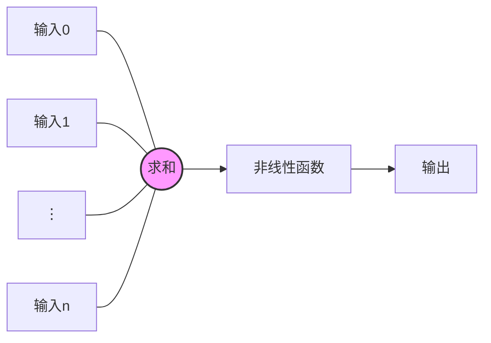

# 人工智能三学派
## 行为主义
基于控制论，构建感知-动作控制系统（控制论，如平衡等自适应系统）

## 符号主义
基于算数逻辑表达式，求解问题时先把问题描述成表达式，再求解表达式（可用公式表示）

## 连接主义
模仿神经元连接关系
### 基于连接主义的神经网络设计过程
1. 准备数据：采集大量“特征/标签”数据
2. 搭建网络：搭建神经网络结构
3. 优化参数：训练网络获取最佳参数（反向传播）
4. 应用网络

例子：用神经网络实现鸢尾花分类
![[鸢尾花分类.png]]

**MP模型**
$${y}=x*w+b$$

1. 搭建网络时随机初始化所有参数$w,b$
2. 前向传播
**损失函数（Loss Function）:**预测值与标准值的差距
3. 梯度下降法优化参数
4. 