# Rigid Body Dynamics Algorithms

# Roy Featherstone

# Rigid Body Dynamics Algorithms

Roy FeatherstoneThe Australian National UniversityCanberra, ACTAustralilia

Library of Congress Control Number: 2007936980

ISBN 978-0-387-74314-1 e-ISBN 978-0-387-74315-8

Printed on acid-free paper.

© 2008 Springer Science+Business Media, LLCAll rights reserved. This work may not be translated or copied in whole or in part without the written permission of the publisher (Springer Science+Business Media, LLC, 233 Spring Street, New York, NY 10013, USA), except for brief excerpts in connection with reviews or scholarly analysis. Use in connection with any form of information storage and retrieval, electronic adaptation, computer software, or by similar or dissimilar methodology now known or hereafter developed is forbidden. The use in this publication of trade names, trademarks, service marks and similar terms, even if they are not identified as such, is not to be taken as an expression of opinion as to whether or not they are subject to proprietary rights.

9 8 7 6 5 4 3 2 1

springer.com

# Preface

The purpose of this book is to present a substantial collection of the most efficient algorithms for calculating rigid-body dynamics, and to explain them in enough detail that the reader can understand how they work, and how to adapt them (or create new algorithms) to suit the reader's needs. The collection includes the following well-known algorithms: the recursive Newton-Euler algorithm, the composite-rigid-body algorithm and the articulated-body algorithm. It also includes algorithms for kinematic loops and floating bases. Each algorithm is derived from first principles, and is presented both as a set of equations and as a pseudocode program, the latter being designed for easy translation into any suitable programming language.

This book also explains some of the mathematical techniques used to formulate the equations of motion for a rigid-body system. In particular, it shows how to express dynamics using six-dimensional (6D) vectors, and it explains the recursive formulations that are the basis of the most efficient algorithms. Other topics include: how to construct a computer model of a rigid-body system; exploiting sparsity in the inertia matrix; the concept of articulated-body inertia; the sources of rounding error in dynamics calculations; and the dynamics of physical contact and impact between rigid bodies.

Rigid-body dynamics has a tendency to become a sea of algebra. However, this is largely the result of using 3D vectors, and it can be remedied by using a 6D vector notation instead. This book uses a notation based on spatial vectors, in which the linear and angular aspects of rigid-body motion are combined into a unified set of quantities and equations. The result is typically a four- to six-fold reduction in the volume of algebra. The benefit is also felt in the computer code: shorter, clearer programs that are easier to read, write and debug, but are still just as efficient as code using standard 3D vectors.

This book is intended to be accessible to a wide audience, ranging from senior undergraduates to researchers and professionals. Readers are assumed to have some prior knowledge of rigid-body dynamics, such as might be obtained from an introductory course on dynamics, or from reading the first few chapters of an introductory text. However, no prior knowledge of 6D vectors is required, as this topic is explained from the beginning in Chapter 2. This book does also contain some advanced material, such as might be of interest to dynamics

experts and scholars of 6D vectors. No software is distributed with this book, but readers can obtain source code for most of the algorithms described here from the author's web site.

This text was originally intended to be a second edition of a book entitled Robot Dynamics Algorithms, which was published back in 1987; but it quickly became clear that there was enough new material to justify the writing of a whole new book. Compared with its predecessor, the most notable new materials to be found here are: explicit pseudocode descriptions of the algorithms; a chapter on how to model rigid-body systems; algorithms to exploit branch-induced sparsity; an enlarged treatment of kinematic loops and floating-base systems; planar vectors (the planar equivalent of spatial vectors); numerical errors and model sensitivity; and guidance on how to implement spatial-vector arithmetic.

# Contents

# Preface v

# 1 Introduction 1

1.1 Dynamics Algorithms 11.2 Spatial Vectors 31.3 Units and Notation 41.4 Readers' Guide 51.5 Further Reading 6

# 2 Spatial Vector Algebra 7

# 2.1 Mathematical Preliminaries 7

2.1 Mathematical Preliminaries 72.2 Spatial Velocity 102.3 Spatial Force 132.4 Plücker Notation 152.5 Line Vectors and Free Vectors 162.6 Scalar Product 172.7 Using Spatial Vectors 182.8 Coordinate Transforms 202.9 Spatial Cross Products 232.10 Differentiation 252.11 Acceleration 282.12 Momentum 312.13 Inertia 322.14 Equation of Motion 352.15 Inverse Inertia 362.16 Planar Vectors 372.17 Further Reading 38

# Dynamics of Rigid Body Systems 39

3.1 Equations of Motion 403.2 Constructing Equations of Motion 423.3 Vector Subspaces 463.4 Classification of Constraints 50

3.5 Joint Constraints 53

3.6 Dynamics of a Constrained Rigid Body 57

3.7 Dynamics of a Multibody System 60

# 4 Modelling Rigid Body Systems 65

4.1 Connectivity 664.2 Geometry 734.3 Denavit-Hartenberg Parameters 754.4 Joint Models 784.5 Spherical Motion 844.6 A Complete System Model 87

# Inverse Dynamics 89

5.1 Algorithm Complexity 895.2 Recurrence Relations 905.3 The Recursive Newton-Euler Algorithm 925.4 The Original Version 975.5 Additional Notes 99

# 6 Forward Dynamics — Inertia Matrix Methods 101

6.1 The Joint-Space Inertia Matrix 1026.2 The Composite-Rigid-Body Algorithm 1046.3 A Physical Interpretation 1086.4 Branch-Induced Sparsity 1106.5 Sparse Factorization Algorithms 1126.6 Additional Notes 117

# 7 Forward Dynamics — Propagation Methods 119

7.1 Articulated-Body Inertia 1197.2 Calculating Articulated-Body Inertias 1237.3 The Articulated-Body Algorithm 1287.4 Alternative Assembly Formulae 1317.5 Multiple Handles 136

# 8 Closed Loop Systems 141

8.1 Equations of Motion 1418.2 Loop Constraint Equations 1438.3 Constraint Stabilization 1458.4 Loop Joint Forces 1488.5 Solving the Equations of Motion 1498.6 Algorithm for $C-\tau^{a}$ 1528.7 Algorithm for $K$ and $k$ 1548.8 Algorithm for $G$ and $g$ 1568.9 Exploiting Sparsity in $K$ and $G$ 1588.10 Some Properties of Closed-Loop Systems 159

# CONTENTS

# 

#ix

8.11 Loop Closure Functions 1618.12 Inverse Dynamics 1648.13 Sparse Matrix Method 166

# 9 Hybrid Dynamics and Other Topics 171

9.1 Hybrid Dynamics .

# 10 Accuracy and Efficiency 195

10.1 Sources of Error .

# 1 Contact and Impact 213

11.1 Single Point Contact 21311.2 Multiple Point Contacts 21611.3 A Rigid-Body System with Contacts 21911.4 Inequality Constraints 22211.5 Solving Contact Equations 22411.6 Contact Geometry 22711.7 Impulsive Dynamics 23011.8 Soft Contact 23511.9 Further Reading 239

# Spatial Vector Arithmetic 241

A.1 Simple Planar Arithmetic 241A.2 Simple Spatial Arithmetic 243A.3 Compact Representations 245A.4 Axial Screw Transforms 249A.5 Some Efficiency Tricks 252

# Bibliography 257

# Symbols 265

Index

267

# Chapter 1

# Introduction

Rigid-body dynamics is an old subject that has been rejuvenated and transformed by the computer. Today, we can find dynamics calculations in computer games, in animation and virtual-reality software, in simulators, in motion control systems, and in a variety of engineering design and analysis tools. In every case, a computer is calculating the forces, accelerations, and so on, associated with the motion of a rigid-body approximation of a physical system.

The main purpose of this book is to present a collection of efficient algorithms for performing various dynamics calculations on a computer. Each algorithm is described in detail, so that the reader can understand how it works and why it is efficient; and basic concepts are explained, such as recursive formulation, branch-induced sparsity and articulated-body inertia.

Rigid-body dynamics is usually expressed using 3D vectors. However, the subject of this book is dynamics algorithms, and this subject is better expressed using 6D vectors. We therefore adopt a 6D notation based on spatial vectors, which is explained in Chapter 2. Compared with 3D vectors, spatial notation greatly reduces the volume of algebra, simplifies the tasks of describing and explaining a dynamics algorithm, and simplifies the process of implementing an algorithm on a computer.

This chapter provides a short introduction to the subject matter of this book. It says a little about dynamics algorithms, a little about spatial vectors, and it explains how the book is organized.

# 1.1 Dynamics Algorithms

The dynamics of a rigid-body system is described its equation of motion, which specifies the relationship between the forces acting on the system and the accelerations they produce. A dynamics algorithm is a procedure for calculating the numeric values of quantities that are relevant to the dynamics. We will be concerned mainly with algorithms for two particular calculations:

forward dynamics: the calculation of the acceleration response of a given rigid-body system to a given applied force; and

inverse dynamics: the calculation of the force that must be applied to a given rigid-body system in order to produce a given acceleration response.

Forward dynamics is used mainly in simulation. Inverse dynamics has a variety of uses, such as: motion control systems, trajectory planning, mechanical design, and as a component in a forward-dynamics calculation. In Chapter 9 we will consider a third kind of calculation, called hybrid dynamics, in which some of the acceleration and force variables are given and the task is to calculate the rest.

The equation of motion for a rigid-body system can be written in the following canonical form:

$$
\tau = H ( q ) \, \ddot { q } + C ( q , \dot { q } ) \, .
$$

In this equation, $q$, $\dot{q}$ and $\ddot{q}$ are vectors of position, velocity and acceleration variables, respectively, and $\boldsymbol{\tau}$ is a vector of applied forces. $\boldsymbol{H}$ is a matrix of inertia terms, and is written $\boldsymbol{H}(\boldsymbol{q})$ to show that it is a function of $\boldsymbol{q}$. $\boldsymbol{C}$ is a vector of force terms that account for the Coriolis and centrifugal forces, gravity, and any other forces acting on the system other than those in $\boldsymbol{\tau}$. It is written $\boldsymbol{C}(\boldsymbol{q},\dot{\boldsymbol{q}})$ to show that it depends on both $\boldsymbol{q}$ and $\dot{\boldsymbol{q}}$. Together, $\boldsymbol{H}$ and $\boldsymbol{C}$ are the coefficients of the equation of motion, and $\boldsymbol{\tau}$ and $\ddot{\boldsymbol{q}}$ are the variables. Typically, one of the variables is given and the other is unknown.

Although it is customary to write $\boldsymbol{H}(\boldsymbol{q})$ and $\boldsymbol{C}(\boldsymbol{q}, \dot{\boldsymbol{q}})$, it would be more accurate to write $\boldsymbol{H}(\text{model}, \boldsymbol{q})$ and $\boldsymbol{C}(\text{model}, \boldsymbol{q}, \dot{\boldsymbol{q}})$, to indicate that both $\boldsymbol{H}$ and $\boldsymbol{C}$ depend on the particular rigid-body system to which they apply. The symbol $\text{model}$ refers to a collection of data that describes a particular rigid-body system in terms of its component parts: the number of bodies and joints, the manner in which they are connected together, and the values of every parameter associated with each component (inertia parameters, geometric parameters, and so on). We call this description a system model in order to distinguish it from a mathematical model. The difference is this: a system model describes the system itself, whereas a mathematical model describes some aspect of its behaviour. Equation 1.1 is a mathematical model. On a computer, model would be a variable of type 'system model', and its value would be a data structure containing the system model of a specific rigid-body system.

Let us encapsulate the forward and inverse dynamics calculations into a pair of functions, FD and ID. These functions satisfy

$$
\ddot { q } = \mathrm { F D } ( m o d e l , q , \dot { q } , \tau )
$$

and

$$
\tau = \operatorname { I D } ( m o d e l , \pmb { q } , \dot { \pmb { q } } , \ddot { \pmb { q } } ) \, .
$$

On comparing these equations with Eq. 1.1, it is obvious that FD and ID must evaluate to $H^{-1}(\tau-C)$ and $H\ddot{q}+C$, respectively. However, the point of these

equations is that they show clearly the inputs and outputs of each calculation. In particular, they show that the system model is an input in both cases. Thus, there is an expectation that the algorithms implementing FD and ID will work for a class of rigid-body systems, and will use the data in the system model to work out the dynamics of the particular rigid-body system described by that model. We shall use the name model-based algorithm to refer to algorithms that work like this.

The big advantage of this approach is that a single piece of computer code can be written, tested, documented, and so on, to calculate the dynamics of any rigid-body system in a broad class. The two main classes of interest are called kinematic trees and closed-loop systems. Roughly speaking, a kinematic tree is any rigid-body system that does not contain kinematic loops, and a closed-loop system is any rigid-body system that is not a kinematic tree.$^{1}$ Calculating the dynamics of a kinematic tree is significantly easier than for a closed-loop system.

Model-based algorithms can be classified according to their two main attributes: what calculation they perform, and what class of system they apply to. The main body of algorithms in this book consists of forward and inverse dynamics algorithms for kinematic trees and closed-loop systems.

# 1.2 Spatial Vectors

A rigid body in 3D space has six degrees of motion freedom; yet we usually express its dynamics using 3D vectors. Thus, to state the equation of motion for a rigid body, we must actually state two vector equations:

$$
f = m \, a _ { C }  \mathrm { a n d }  n _ { C } = I \dot { \omega } + \omega \times I \omega \, .
$$

The first expresses the relationship between the force applied to the body and the linear acceleration of its centre of mass. The second expresses the relationship between the moment applied to the body, referred to its centre of mass, and its angular acceleration.

In spatial vector notation, we use 6D vectors that combine the linear and angular aspects of rigid-body motion. Thus, linear and angular acceleration are combined to form a spatial acceleration vector, force and moment are combined to form a spatial force vector, and so on. Using spatial notation, the equation of motion for a rigid body can be written

$$
f = I a + v \times ^{*} I v \, ,
$$

where $f$ is the spatial force acting on the body, $v$ and $a$ are the body's spatial velocity and acceleration, and $I$ is the body's spatial inertia tensor. The symbol $\times^{*}$ denotes a spatial vector cross product. One obvious feature of this equation

is that there are some name clashes with Eq. 1.4. We can solve this problem by placing hats above the spatial symbols (e.g. $\hat{\boldsymbol{f}}$).

Spatial notation offers many more simplifications than just the equation of motion. For example, if two rigid bodies are joined together to form a single rigid body, then the spatial inertia of the new body is given by the simple formula

$$
{ \boldsymbol { I } } _ { n e w } = { \boldsymbol { I } } _ { 1 } + { \boldsymbol { I } } _ { 2 } \, ,
$$

where $I_{1}$ and $I_{2}$ are the inertias of the two original bodies. This equation replaces three in the 3D vector approach: one to compute the new mass, one to compute the new centre of mass, and one to compute the new rotational inertia about the new centre of mass. The overall effect of all these simplifications is that spatial notation typically cuts the volume of algebra by at least a factor of 4 compared with standard 3D vector notation. With the barrier of algebra out of the way, the analyst is free to state a problem more succinctly, to solve it in fewer steps, and to arrive at a more compact solution.

Another benefit of spatial vectors is that they simplify the process of writing computer code. The resulting code is shorter, and is easier to read, write and debug, but is no less efficient than software using 3D vectors. For example, some programming languages will allow you to implement Eq. 1.5 with a statement like

$$
\textbf { f } = \textbf { I } * \mathbf { a } + \textbf { v . c r o s s } ( \mathbf { I } * \mathbf { v } ) ;
$$

in which the type of each variable has been declared to the compiler. Thus, the compiler knows that I and v denote a rigid-body inertia and a spatial motion vector, respectively, so it can compile the expression I*v into code that calls a routine in the spatial arithmetic library which is designed to perform this particular multiplication efficiently.

# 1.3 Units and Notation

Angles are assumed to be measured in radians. Apart from that, the equations in this book are independent of the choice of units, and require only that the chosen system of units be consistent. In the few places where units are mentioned explicitly, SI units are used.

The mathematical notation generally follows ISO guidelines. Thus, variables are set in italic; constants and functions are set in roman; and vectors and matrices are set in bold italic. Vectors are denoted by lower-case letters,$^{2}$ and matrices by upper-case. A short list of symbols can be found on page 265, and some symbols have entries in the index.

A few details are worth mentioning here. The symbols $\mathbf{0}$ and $\mathbf{1}$ denote the zero and identity matrices, respectively, and $\mathbf{0}$ also denotes the zero vector. The superscript $^{-\mathrm{T}}$ denotes the transpose of the inverse, so $A^{-\mathrm{T}}$ means $(A^{-1})^{\mathrm{T}}$. An

expression like $a \times$ denotes an operator that maps $b$ to $a \times b$. If a quantity is described as an array, then it is a numbered list of things. If $\lambda$ is an array then element $i$ of $\lambda$ is written $\lambda(i)$. If a symbol has a leading superscript (e.g. ${}^{A} \boldsymbol{v}$) then that superscript identifies a coordinate system. Coordinate systems can also appear in subscripts. Spatial vectors are sometimes marked with a hat, and coordinate vectors with an underline, as explained in Chapter 2.

# 1.4 Readers' Guide

The contents of this book can be divided into three parts: preparation, main algorithms and additional topics. The preparatory chapters are 2, 3 and 4; and the main algorithms are are described in Chapters 5 to 8. Readers with enough background may find they can skip straight to Chapter 5. Chapters 9 onwards assume a basic understanding of earlier material, but are otherwise self-contained.

Chapter 2 describes spatial vector algebra from first principles; and Chapter 3 explains how to formulate and analyse the equations of motion for a rigid-body system. These are the two most mathematical chapters, and they both cover their subject matter in greater depth than the minimum required for the algorithms that follow. Chapter 4 describes the various components of a system model. Many of the quantities used in later chapters are defined here.

Chapters 5, 6 and 7 describe the three best known algorithms for kinematic trees: the recursive Newton-Euler algorithm for inverse dynamics, and the composite-rigid-body and articulated-body algorithms for forward dynamics, in that order. Chapter 5 also explains the concept of recursive formulation, which is the reason for the efficiency of these algorithms. Chapter 8 then presents several techniques for calculating the dynamics of closed-loop systems. These four chapters are arranged approximately in order of increasing complexity (i.e., the algorithms get progressively more complicated).

Chapters 9, 10 and 11 then tackle a variety of extra topics. Chapter 9 considers several more algorithms, including hybrids of forward and inverse dynamics and algorithms for floating-base systems. Chapter 10 considers the issues of numerical accuracy and computational efficiency; and Chapter 11 examines the dynamics of rigid-body systems that are subject to contacts and impacts.

Readers will find examples dotted unevenly throughout the text. In some cases, they illustrate a concept that is covered in the main text. In other cases, they describe ideas that are more easily explained in the form of an example. Readers will also find that every major algorithm is presented both as a set of equations and as a pseudocode program. In many cases, the two are side-by-side. The pseudocode is intended to be self-explanatory and easy to translate into real computer code.

Many people, including the author, find it helps to have some working source code to hand when studying a new algorithm. No source code is distributed with this book, on the grounds that such software becomes obsolete too quickly.

Readers should instead look for this code on the Web. At the time of writing, the author's web site$^{3}$ contained source code for most of the algorithms described here, but readers may also be able to find useful software elsewhere.

# 1.5 Further Reading

A variety of books on rigid-body dynamics have been published in recent years, although many are now out of print. The following are suitable introductory texts: Amirouche (2006), Moon (1998), Shabana (2001) and Huston (1990). The first three are formal teaching texts with copious examples and homework exercises, while Huston's book is more tutorial in nature. All are designed to be accessible to undergraduates. More advanced texts include Stejskal and Valášek (1996), Roberson and Schwertassek (1988) and Wittenburg (1977). For a different perspective, try Coutinho (2001), which is aimed more at computer games and virtual reality.

Much of the material in this book has its origins in the robotics community. Other books on robot dynamics include Balafoutis and Patel (1991), Lilly (1993), Yamane (2004) and the author's earlier work, Featherstone (1987), which has been superseded by the present volume. Sections and chapters on dynamics can be found in Angeles (2003), Khalil and Dombre (2002), Siciliano and Khatib (2008) and various other robotics books.

Readers with an interest in 6D vectors of various kinds may find the following books and articles of interest: Ball (1900), Brand (1953), von Mises (1924a,b), Murray et al. (1994) and Selig (1996). Also, the treatment of spatial vectors in Featherstone (1987) is a little different from that presented here.

# Chapter 2

# Spatial Vector Algebra

Spatial vectors are 6D vectors that combine the linear and angular aspects of rigid-body motions and forces. They provide a compact notation for studying rigid-body dynamics, in which a single spatial vector can do the work of two 3D vectors, and a single spatial equation replaces two (or sometimes more) 3D vector equations. Spatial vector notation allows us to develop equations of motion quickly, and to express them succinctly in symbolic form. It also allows us to derive dynamics algorithms quickly, and to express them in a compact form that is easily converted into efficient computer code.

This chapter presents the spatial vector algebra from first principles up to the equation of motion for a single rigid body. It also presents the planar vector algebra, which is an adaptation of spatial vector algebra to rigid bodies that move only in a 2D plane. Methods of implementing spatial vector arithmetic are covered in Appendix A; and the use of spatial vectors to analyse general rigid-body systems is covered in Chapter 3.

# 2.1 Mathematical Preliminaries

This section reviews briefly some of the mathematical concepts and notations used in spatial vector algebra. More details can be found in books like Greenwood (1988), Selig (1996) and many others.

Vectors and Vector Spaces: Linear algebra defines a vector as being an element of a vector space; and different kinds of vector are elements of different vector spaces. Four vector spaces occur frequently in this book, and have been given special names:

$\mathbf{R}^{n}$ — coordinate vectors

$\mathbf{E}^{n}$ — Euclidean vectors

$\mathbf{M}^{n}$ — spatial motion vectors

$\mathbf{F}^{n}$ — spatial force vectors

In each case, the superscript indicates the dimension. One more space that occurs frequently is the space of $m \times n$ matrices, which is denoted $\mathbf{R}^{m \times n}$.

A coordinate vector is an $n$-tuple of real numbers, or, in matrix form, an $n\times1$ matrix of real numbers (i.e., a column vector). Coordinate vectors typically represent other vectors; and we use the term abstract vector to refer to the vector being represented. Euclidean vectors have the special property that a Euclidean inner product is defined on them. This product endows them with the familiar properties of magnitude and direction. The 3D vectors used to describe rigid-body dynamics are Euclidean vectors. Spatial vectors are not Euclidean, but are instead the elements of a pair of vector spaces: one for motion vectors and one for forces. Spatial motion vectors describe attributes of rigid-body motion, such as velocity and acceleration, while spatial force vectors describe force, impulse and momentum. The two spaces $\mathbf{M}^{6}$ and $\mathbf{F}^{6}$ are the main topic of this chapter.

Hats and Underlines: When spatial vectors and 3D vectors appear together, we mark some spatial vectors with hats (e.g. $\hat{\mathbf{v}}$, $\hat{\mathbf{f}}$) in order to avoid name clashes with 3D vectors having the same name. Likewise, we normally make no distinction between coordinate vectors and the abstract vectors they represent, but if a distinction is required then we underline the coordinate vector (e.g. $\underline{\mathbf{v}}$ representing $\mathbf{v}$). We use these notational devices only where they are needed, and hardly ever outside this chapter.

The Dual of a Vector Space: Let $V$ be a vector space. Its dual, denoted $V^*$, is a vector space having the same dimension as $V$, and having the property that a scalar product is defined between it and $V$ (i.e., the scalar product takes one argument from each space). If $\boldsymbol{u} \in V^*$ and $\boldsymbol{v} \in V$ then this scalar product can be written either $\boldsymbol{u} \cdot \boldsymbol{v}$ or $\boldsymbol{v} \cdot \boldsymbol{u}$, the two expressions meaning the same. Duality is a symmetrical relationship: if $U = V^*$ then $V = U^*$.

The notion of duality is relevant to spatial vector algebra because the spaces $\mathbf{M}^{n}$ and $\mathbf{F}^{n}$ are dual (i.e., each is the dual of the other). In particular, a scalar product is defined between motion vectors and force vectors such that if $\boldsymbol{m} \in \mathbf{M}^{6}$ describes the velocity of a rigid body and $\boldsymbol{f} \in \mathbf{F}^{6}$ describes the force acting on it, then $\boldsymbol{m} \cdot \boldsymbol{f}$ is the power delivered by the force.

The scalar product between a vector space and its dual is required to be nondegenerate (also called nonsingular). A scalar product is nondegenerate if it has the following property: for any $\boldsymbol{v} \in V$, if $\boldsymbol{v} \neq \boldsymbol{0}$ then there exists at least one vector $\boldsymbol{u} \in V^*$ satisfying $\boldsymbol{v} \cdot \boldsymbol{u} \neq 0$. This property is a sufficient condition to guarantee the existence of a dual basis on $V$ and $V^*$.

Dual Bases: Suppose we have two vector spaces, $U$ and $V$, such that $U = V^*$. Let $\mathcal{D} = \{d_1, \ldots, d_n\}$ be a basis on $U$, and let $\mathcal{E} = \{e_1, \ldots, e_n\}$ be a basis on $V$. If these bases satisfy the following condition, then they form a dual basis

on $U$ and $V$:

$$
d _ { i } \cdot e _ { j } = \left\{ \begin{array}{ll} { 1 } & { \mathrm { i f ~ } i = j } \\{ 0 } & { \mathrm { o t h e r w i s e } . } \end{array} \right.
$$

This is known as the reciprocity condition. If $\mathcal{D}$ and $\mathcal{E}$ satisfy this condition, then each is the reciprocal of the other. If one basis is given, then the other is determined uniquely by the reciprocity condition. We can use the notation $\mathcal{D}^*$ to denote the reciprocal of $\mathcal{D}$. Note that a dual basis consists of two sets of basis vectors, and covers two vector spaces.

If $U=\mathbf{E}^{n}$ then it becomes possible to set $V=U$, so that $\mathcal{D}$ and $\mathcal{E}$ are bases on the same vector space. It also becomes possible to find special cases of $\mathcal{D}$ with the property $\mathcal{D}=\mathcal{E}$. Such bases are orthonormal. Thus, an orthonormal basis is a special case of a dual basis in which $U=V=\mathbf{E}^{n}$ and $\mathcal{D}=\mathcal{E}$.

Dual Coordinates: A dual basis defines a dual coordinate system. We will always use dual coordinates for representing spatial vectors; and we will mostly use Plücker coordinates, which are a particularly convenient choice of dual coordinate system. The special property of dual coordinates is that

$$
\boldsymbol { u } \cdot \boldsymbol { v } = \boldsymbol { u } ^{\mathrm { T} } \boldsymbol { v } \, ,
$$

where $\underline{\boldsymbol{u}}$ and $\underline{\boldsymbol{v}}$ are coordinate vectors representing $\boldsymbol{u} \in U$ and $\boldsymbol{v} \in V$ in the dual coordinate system defined by $\mathcal{D}$ and $\mathcal{E}$. An immediate corollary is that the individual elements in $\underline{\boldsymbol{u}}$ and $\underline{\boldsymbol{v}}$ are given by

$$
u _ { i } = e _ { i } \cdot u  \mathrm { a n d }  v _ { i } = d _ { i } \cdot v \, .
$$

To perform a coordinate transformation from one dual coordinate system to another, we need two transformation matrices: one to operate on $\underline{\boldsymbol{u}}$, and one to operate on $\underline{\boldsymbol{v}}$. If $\boldsymbol{X}$ is the matrix that performs the desired coordinate transformation on $\underline{\boldsymbol{u}}$, then the matrix that does the same job on $\underline{\boldsymbol{v}}$ is denoted $\boldsymbol{X}^{*}$, and the two matrices are related by the equation

$$
X ^{*} = X ^{- \mathrm { T} } .
$$

This relationship follows from the requirement that $\underline{\boldsymbol{u}}^{\mathrm{T}}\underline{\boldsymbol{v}}=(\boldsymbol{X}\underline{\boldsymbol{u}})^{\mathrm{T}}(\boldsymbol{X}^{*}\underline{\boldsymbol{v}})$ for all $\underline{\boldsymbol{u}}$ and $\underline{\boldsymbol{v}}$.

Operators $a\cdot$ and $a\times$: It is possible to interpret expressions like $a\cdot b$ and $a\times b$ as being the result of applying an operator, $a\cdot$ or $a\times$, to the operand $b$. Thus, $a\cdot$ is the operator that maps $b$ to the scalar $a\cdot b$, while $a\times$ maps $b$ to $a\times b$. If $a$ is a coordinate vector, then $a\cdot = a^{\text{T}}$, and $a\times$ is a square matrix. Some properties of $a\times$ are listed in Tables 2.1 and 2.3. Table 2.3 also lists properties of the operator $a\times^{*}$, which is the dual of $a\times$.

Dyads and Dyadics: An expression of the form $a\,b$ is called a dyad. It is a linear operator that maps vectors to vectors. In particular, the dyad $a\,b$ will map the vector $c$ to the vector $a\,(\boldsymbol{b}\cdot\boldsymbol{c})$, which is a scalar multiple of $a$. If $\underline{a}$ and $\underline{b}$ are coordinate vectors representing $a$ and $\boldsymbol{b}$, then the dyad $a\,b$ is represented by the matrix $\underline{a}\,b^{\text{T}}$, which has a rank of 1. In the most general case, we can have $a\in U$, $\boldsymbol{b}\in V$ and $c\in W$, where there are no restrictions on the choice of any of these vector spaces, except that a scalar product must be defined between $V$ and $W$. Such a dyad maps from $W$ to $U$.

A dyadic (or dyadic tensor) is a general linear mapping of vectors. Any dyadic can be expressed as a sum of $r$ linearly independent dyads:

$$
{ \cal L } = \sum _ { i = 1 } ^{r} a _ { i } \, b _ { i } \, .
$$

where $a_{i} \in U$, $b_{i} \in V$, and $r \leq \min(m, n)$, where $m = \dim(U)$ and $n = \dim(V)$. (A set of dyads is linearly independent if the vectors $a_{i}$ are linearly independent in $U$, and the vectors $b_{i}$ are linearly independent in $V$.) If $a_{i}$ and $b_{i}$ are coordinate vectors, then $L$ can be written

$$
{ \cal L } = \sum _ { i = 1 } ^{r} a _ { i } \, b _ { i } ^{\mathrm { T} } \, ,
$$

which is an $m \times n$ matrix of rank $r$. If $m = n = r$ then $L$ is a 1:1 mapping, and is invertible. Dyadics are used in connection with the spatial inertia tensor.

# 2.2 Spatial Velocity

Let us work out a formula for the spatial velocity of a rigid body. We start with a rigid body, $B$, and choose a fixed point, $O$, which can be located anywhere in space. (See Figure 2.1(a).) Given $O$, the velocity of $B$ can be specified by a pair of 3D vectors: the linear velocity, $\boldsymbol{v}_O$, of the body-fixed point that currently coincides with $O$, and an angular velocity vector, $\boldsymbol{\omega}$. The body as a whole can then be regarded as translating with a linear velocity of $\boldsymbol{v}_O$, while simultaneously rotating with an angular velocity of $\boldsymbol{\omega}$ about an axis passing through $O$.

From this description, we can calculate the velocity of any other point in the body using the formula

$$
v _ { P } = v _ { O } + \omega \times \overrightarrow { O P } ,
$$

where $P$ is the point of interest, $\boldsymbol{v}_{P}$ is the velocity of the body-fixed point currently at $P$, and $\overrightarrow{OP}$ gives the position of $P$ relative to $O$. This equation shows clearly that there are two contributions to $\boldsymbol{v}_{P}$: one due to the translation of the whole body by $\boldsymbol{v}_{O}$, and one due to its rotation by $\boldsymbol{\omega}$ about an axis passing

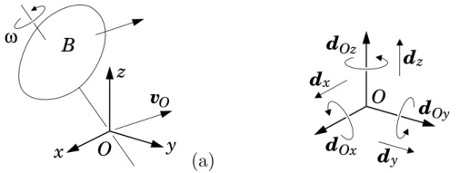{width=55%} Figure 2.1: The velocity of a rigid body expressed in terms of $\omega$ and $\boldsymbol{v}_{O}$ (a), and the basis vectors for Plücker motion coordinates (b)

through $O$. Although each individual contribution depends on the position of $O$, their sum does not (i.e., the dependencies cancel out), so that $v_P$ depends only on the motion of $B$ and the location of $P$. Note that $P$, $v_P$ and $\omega$ together describe the same rigid-body motion as $O$, $v_O$ and $\omega$.

We now introduce a Cartesian coordinate frame, $O_{xyz}$, with its origin at $O$. This frame defines three mutually perpendicular directions, $x$, $y$ and $z$, and three directed lines, $Ox$, $Oy$ and $Oz$, each passing through the point $O$. This frame also defines an orthonormal basis, $\{i,j,k\} \subset \mathbb{E}^3$, which we can use to express $\omega$ and $v_O$ in terms of their Cartesian coordinates:

$$
\omega = \omega _ { x } i + \omega _ { y } j + \omega _ { z } k
$$

and

$$
\begin{array}{r} { v _ { O } = v _ { O x } \dot { \boldsymbol { \imath } } + v _ { O y } \dot { \boldsymbol { \jmath } } + v _ { O z } \boldsymbol { k } \, . } \end{array}
$$

Having resolved $\omega$ and $v_{O}$ into their coordinates, we can describe the velocity of $B$ as the sum of six elementary motions: a rotation of magnitude $\omega_{x}$ about the line $Ox$, a rotation of magnitude $\omega_{y}$ about $Oy$, a rotation of magnitude $\omega_{z}$ about $Oz$, and translations of magnitudes $v_{Ox}$, $v_{Oy}$ and $v_{Oz}$ in the $x$, $y$ and $z$ directions, respectively.

Our objective is to obtain a spatial velocity vector, $\hat{\boldsymbol{v}} \in \mathbb{M}^{6}$, that describes the same motion as $\boldsymbol{\omega}$ and $\boldsymbol{v}_{O}$. We can accomplish this by first defining a basis on $\mathbb{M}^{6}$, and then working out the coordinates of $\hat{\boldsymbol{v}}$ in that basis. The basis we will use is

$$
\mathcal { D } _ { O } = \{ d _ { O x } , d _ { O y } , d _ { O z } , d _ { x } , d _ { y } , d _ { z } \} \subset \mathbb { M } ^{6} \ ,
$$

which is illustrated in Figure 2.1(b). This is called a Plücker basis, and it defines a Plücker coordinate system on $\mathbb{M}^6$. The first three basis vectors, $d_{Ox}$, $d_{Oy}$ and $d_{Oz}$, are unit rotations about the lines $Ox$, $Oy$ and $Oz$, respectively, and the rest are unit translations in the $x$, $y$ and $z$ directions, respectively. On comparing the definitions of these basis vectors with the six elementary motions just described, it follows immediately that

$$
\hat { \mathbf { v } } = \omega _ { x } \mathbf { d } _ { O x } + \omega _ { y } \mathbf { d } _ { O y } + \omega _ { z } \mathbf { d } _ { O z } + v _ { O x } \mathbf { d } _ { x } + v _ { O y } \mathbf { d } _ { y } + v _ { O z } \mathbf { d } _ { z } \, .
$$

Thus, the Plücker coordinates of $\hat{\boldsymbol{v}}$ in $\mathcal{D}_{O}$ are the Cartesian coordinates of $\boldsymbol{\omega}$ and $\boldsymbol{v}_{O}$ in $\{i,j,k\}$. Each individual term on the right-hand side depends on the position and orientation of $O_{xyz}$, but it can be shown that the expression as a whole is invariant. (See Example 2.2.) The coordinate vector that represents $\hat{\boldsymbol{v}}$ in $\mathcal{D}_{O}$ coordinates can be written

$$
\begin{array}{r} { \hat { \underline { { v } } } _ { O } = \left[ \begin{array}{l} { \omega _ { x } } \\{ \omega _ { y } } \\{ \omega _ { z } } \\{ v _ { O x } } \\{ v _ { O y } } \\{ v _ { O z } } \end{array} \right] = \left[ \begin{array}{l} { \underline { { \omega } } } \\{ \underline { { v } } _ { O } } \end{array} \right] , } \end{array}
$$

where the expression on the far right is a convenient compact notation in which the 6D coordinate vector is expressed as the concatenation of the two 3D coordinate vectors $\underline{\boldsymbol{\omega}} = [\omega_x \ \omega_y \ \omega_z]^{\text{T}}$ and $\underline{\boldsymbol{v}}_O = [\nu_{Ox} \ v_{Oy} \ v_{Oz}]^{\text{T}}$.

Example 2.1 Equation 2.1 associates a vector $v_P$ with each point $P$ in space. It therefore defines a vector field—the velocity field of body $B$. We could have written this equation in the form

$$
\mathbf { V } ( P ) = \mathbf { v } _ { O } + \omega \times \overrightarrow { O P } \, ,
$$

where $\mathbf{V}$ denotes the vector field, and $\mathbf{V}(P)$ is the vector associated by $\mathbf{V}$ with the point $P$. Although $O$ appears in the definition of $\mathbf{V}$, the right-hand side is invariant with respect to the location of $O$, and so the field itself is independent of $O$. This connection between spatial vectors and vector fields can help one to visualize what a spatial vector really is, and what a spatial-vector expression really means. For example, suppose $\hat{\mathbf{v}}_1$ and $\hat{\mathbf{v}}_2$ are two spatial velocities, and $\mathbf{V}_1$ and $\mathbf{V}_2$ are the corresponding vector fields. If $\hat{\mathbf{v}}_{\text{sum}} = \hat{\mathbf{v}}_1 + \hat{\mathbf{v}}_2$ then the vector field that corresponds to $\hat{\mathbf{v}}_{\text{sum}}$ has the property $\mathbf{V}_{\text{sum}}(P) = \mathbf{V}_1(P) + \mathbf{V}_2(P)$ for all $P$.

Example 2.2 Let us investigate the invariance of Eq. 2.3 with respect to the choice of origin. We can do this by defining $\hat{\mathbf{v}}'$ to be the spatial velocity obtained by using the point $P$ as origin, and showing that $\hat{\mathbf{v}}' = \hat{\mathbf{v}}$. The expression for $\hat{\mathbf{v}}'$ is therefore

$$
\hat { \pmb { v } } ^{\prime} = \omega _ { x } \pmb { d } _ { P x } + \omega _ { y } \pmb { d } _ { P y } + \omega _ { z } \pmb { d } _ { P z } + v _ { P x } \pmb { d } _ { x } + v _ { P y } \pmb { d } _ { y } + v _ { P z } \pmb { d } _ { z } \, ,
$$

and the task is to equate this expression with Eq. 2.3. To keep things simple, we shall choose $P$ to have the coordinates $(r,0,0)$ relative to $O_{xyz}$, as shown in Figure 2.2. In this case, the linear velocity coordinates are given by Eq. 2.1 as

$$
\begin{array}{r} { \left[ \begin{array}{l} { v P x } \\{ v P y } \\{ v P z } \end{array} \right] = \underline { { v } } _ { O } + \underline { { \omega } } \times \left[ \begin{array}{l} { r } \\{ 0 } \\{ 0 } \end{array} \right] = \left[ \begin{array}{l} { v O x } \\{ v O y + \omega _ { z } r } \\{ v O z - \omega _ { y } r } \end{array} \right] \, ; } \end{array}
$$

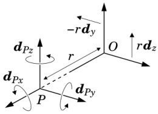{width=28%} Figure 2.2: Expressing $d_{Py}$ and $d_{Pz}$ at $O$

and the three basis vectors that depend on $P$ are

$$
\begin{array}{rl} { d _ { P x } } & { { } = d _ { Q x } \, , } \\{ d _ { P y } } & { { } = d _ { O y } + r d _ { z } \, , } \\{ d _ { P z } } & { { } = d _ { O z } - r d _ { y } \, . } \end{array}
$$

Combining these equations gives

$$
\begin{array}{rl} { \hat { v } ^{\prime} } & { = \, \omega _ { x } d _ { O x } + \omega _ { y } ( d _ { O y } + r d _ { z } ) + \omega _ { z } ( d _ { O z } - r d _ { y } ) } \\& {  + \, v _ { O x } d _ { x } + ( v _ { O y } + \omega _ { z } r ) d _ { y } + ( v _ { O z } - \omega _ { y } r ) d _ { z } \, , } \end{array}
$$

which can be seen to be equal to Eq. 2.3.

Returning to the three basis vectors, we have $\mathbf{d}_{Px} = \mathbf{d}_{Ox}$ because the two lines $Px$ and $Ox$ are the same. To understand the expression for $\mathbf{d}_{Py}$, imagine a rigid body that is rotating with unit angular velocity about $Py$, so that its spatial velocity is $\mathbf{d}_{Py}$. The body-fixed point at $O$ will then have a linear velocity of magnitude $r$ in the $z$ direction, as shown in Figure 2.2; and so the body's velocity can be expressed as the sum of a unit angular velocity about the line $Oy$ and a linear velocity of magnitude $r$ in the $z$ direction (i.e., $\mathbf{d}_{Oy} + \mathbf{r} \mathbf{d}_z$).$^1$ Repeating this exercise with $Pz$ yields the given expression for $\mathbf{d}_{Pz}$.

The analysis presented here is easily extended to the case of a general location for $P$, and a similar argument can be used to show that Eq. 2.3 is invariant with respect to the orientation of $O_{xyz}$.

# 2.3 Spatial Force

Having obtained an expression for spatial velocity, let us now do the same for spatial force. Given an arbitrary point, $O$, which can be located anywhere in space, the most general force that can act on a rigid body $B$ consists of a linear force, $\boldsymbol{f}$, acting along a line that passes through $O$, together with a couple, $\boldsymbol{n}_O$,

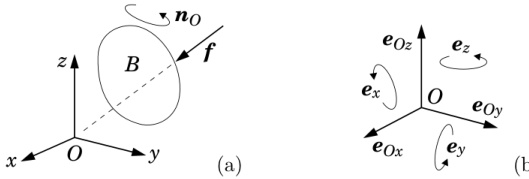{width=57%} Figure 2.3: The force acting on a rigid body expressed in terms of $f$ and $n_O$ (a), and the basis vectors for Plücker force coordinates (b)

which is equal to the total moment about $O$. (See Figure 2.3(a).) Once again, we have a representation comprising one arbitrary point and two 3D vectors. $f$ has taken the place of $\omega$, and $n_O$ has taken the place of $v_O$.

Given $O$, $n_O$ and $f$, we can calculate the total moment about any other point, $P$, using the formula

$$
n _ { P } = n _ { O } + f \times \overrightarrow { O P } .
$$

This equation is the force-vector analogue of Eq. 2.1, and it shares with that equation the property that the right-hand side is independent of the location of $O$. The three quantities $P$, $\boldsymbol{n}_{P}$ and $\boldsymbol{f}$ together describe the same applied force as $O$, $\boldsymbol{n}_{O}$ and $\boldsymbol{f}$.

We now introduce a Cartesian coordinate frame, $O_{xyz}$, with its origin at $O$, and use it to define the orthonormal basis $\{i,j,k\} \in \mathbb{E}^3$ so that $n_O$ and $f$ can be written in terms of their Cartesian coordinates:

$$
n _ { O } = n _ { O x } i + n _ { O y } j + n _ { O z } k
$$

and

$$
f = f _ { x } i + f _ { y } j + f _ { z } k \, .
$$

Having resolved $n_{O}$ and $f$ into their components, we can describe the force acting on $B$ as the sum of six elementary forces: couples of magnitudes $n_{Ox}$, $n_{Oy}$ and $n_{Oz}$ in the $x$, $y$ and $z$ directions, respectively, and linear forces of magnitudes $f_{x}$, $f_{y}$ and $f_{z}$ acting along the lines $Ox$, $Oy$ and $Oz$, respectively.

This coordinate frame also defines the following Plücker basis on $\mathbf{F}^{6}$:

$$
\mathcal { E } _ { O } = \{ e _ { x } , e _ { y } , e _ { z } , e _ { O x } , e _ { O y } , e _ { O z } \} \subset \mathbf { F } ^{6} \, ,
$$

which is illustrated in Figure 2.3(b). The first three elements are unit couples in the $x$, $y$ and $z$ directions, and the rest are unit linear forces acting along the lines $Ox$, $Oy$ and $Oz$. On comparing the definitions of these basis vectors with the six elementary forces just described, it follows immediately that if $\hat{\boldsymbol{f}} \in \mathbb{F}^{6}$ is the spatial force vector representing the same force as $O$, $\boldsymbol{n}_{O}$ and $\boldsymbol{f}$, then

$$
\hat { f } = n _ { O x } \pmb { e } _ { x } + n _ { O y } \pmb { e } _ { y } + n _ { O z } \pmb { e } _ { z } + f _ { x } \pmb { e } _ { O x } + f _ { y } \pmb { e } _ { O y } + f _ { z } \pmb { e } _ { O z } \, .
$$

Each individual term on the right-hand side of this equation depends on the position and orientation of $O_{xyz}$, but the expression as a whole is invariant. Thus, the value of $\hat{\boldsymbol{f}}$ does not depend at all on $O_{xyz}$, but only on the forces acting on $B$. The coordinate vector representing $\hat{\boldsymbol{f}}$ in $\mathcal{E}_O$ coordinates is

$$
\underline { { \hat { f } } } _ { O } = \left[ \begin{array}{l} { { n _ { O x } } } \\{ { n _ { O y } } } \\{ { n _ { O z } } } \\{ { f _ { x } } } \\{ { f _ { y } } } \\{ { f _ { z } } } \end{array} \right] = \left[ \begin{array}{l} { { \underline { { n _ { O } } } } } \\{ { \underline { { f } } } } \end{array} \right] ,
$$

where $\underline{\mathbf{n}}_{O} = [n_{Ox} \ n_{Oy} \ n_{Oz}]^{\mathrm{T}}$ and $\underline{\mathbf{f}} = [f_{x} \ f_{y} \ f_{z}]^{\mathrm{T}}$.

# 2.4 Plücker Notation

Plücker coordinates date back to the $19^{th}$ century, but the basis vectors are new.$^{2}$ They are the coordinates of choice for 6D vectors, partly because they lend themselves to efficient computer implementation, but mainly because they are the most convenient and easy to use.

The notations appearing in Eqs. 2.4 and 2.9 combine Plücker coordinates with notations that are specific to velocity and force. In the case of velocity, we have used two different symbols ($\boldsymbol{v}$ and $\boldsymbol{\omega}$) to represent linear and angular velocity in 3D vector notation, and we have preserved these symbols in the list of Plücker coordinates. The story is the same for forces: we have used different symbols for the 3D linear force and moment vectors, and preserved their names in the list of Plücker coordinates.

In general case, the coordinates would have the same name as the vector. Thus, if $\hat{\boldsymbol{m}}$ and $\hat{\boldsymbol{f}}$ denote generic elements of $\mathbf{M}^{6}$ and $\mathbf{F}^{6}$, respectively, then their Plücker coordinates would be

$$
\underline { { \hat { m } } } _ { O } = \left[ \begin{array}{l} { m _ { x } } \\{ m _ { y } } \\{ m _ { z } } \\{ m _ { O x } } \\{ m _ { O y } } \\{ m _ { O z } } \end{array} \right] = \left[ \begin{array}{l} { \underline { { m } } } \\{ \underline { { m } } _ { O } } \end{array} \right]  \mathrm { ~ a n d ~ }  \underline { { \hat { f } } } _ { O } = \left[ \begin{array}{l} { f _ { O x } } \\{ f _ { O y } } \\{ f _ { O z } } \\{ f _ { x } } \\{ f _ { y } } \\{ f _ { z } } \end{array} \right] = \left[ \begin{array}{l} { \underline { { \underline { { f } } } } } \\{ \underline { { \underline { { f } } } } _ { O } } \end{array} \right] .
$$

We shall always list Plücker coordinates in angular-before-linear order; that is, the three angular coordinates will always be listed first. However, readers should be aware that it is perfectly acceptable to list the three linear coordinates first, and they will encounter this alternative ordering in the literature. From a

mathematical point of view, it makes no difference which order the coordinates are listed. However, from a computational point of view, it does matter because the software is typically written to work with one particular order.

# 2.5 Line Vectors and Free Vectors

A line vector is a quantity that is characterized by a directed line and a magnitude. A pure rotation of a rigid body is a line vector, and so is a linear force acting on a rigid body. A free vector is a quantity that can be characterized by a magnitude and a direction. Pure translations of a rigid body are free vectors, and so are pure couples. A line vector can be specified by five numbers, and a free vector by three. A line vector can also be specified by a free vector and any one point on the line.

Let $\hat{\mathbf{s}}$ be any spatial vector, motion or force, and let $\mathbf{s}$ and $\mathbf{s}_O$ be the two 3D coordinate vectors that supply the Plücker coordinates of $\hat{\mathbf{s}}$. Here are some basic facts about line vectors and free vectors.

If $s=0$ then $\hat{s}$ is a free vector.

If $s\cdot s_O=0$ then $\hat{s}$ is a line vector. The direction of the line is given by $s$, and the line itself is the set of points $P$ that satisfy $\overrightarrow{OP}\times s=s_O$.

Any spatial vector can be expressed as the sum of a line vector and a free vector. If the line vector must pass through a given point, then the expression is unique.

Any spatial vector, other than a free vector, can be expressed uniquely as the sum of a line vector and a parallel free vector. The expression (for a motion vector) is

$$
\left[ s _ { O } - h s \right] + \left[ \begin{array}{lll} { { \mathbf { 0 } } } & { { } } & { { } } \\{ { h s } } & { { } } & { { } } \end{array} \right]  \mathrm { w h e r e }  h = \frac { s \cdot s _ { O } } { s \cdot s } \, .
$$

This last result implies that any spatial vector, other than a free vector, can be described uniquely by a directed line, a linear magnitude and an angular magnitude. Free vectors can also be described in this manner, but the description is not unique, as only the direction of the line matters.

According to screw theory, the most general motion of a rigid body consists of a rotation about a line in space together with a translation along it (i.e., a helical or screwing motion). Such a motion is called a twist. Likewise, the most general force that can act on a rigid body consists of a linear force acting along a line in space, together with a couple acting about it (so the force and couple are parallel). Such a force is called a wrench. In both cases, the line itself is called the screw axis, and the ratio of the free-vector magnitude to the line-vector magnitude is called the pitch. Pure free vectors are treated as twists and wrenches of infinite pitch, and do not have a definite screw axis. The elements of $\mathbf{M}^{6}$ and $\mathbf{F}^{6}$ can be regarded as twists and wrenches, respectively.

# Magnitude

Spatial vectors are not Euclidean, and therefore do not have magnitudes in the Euclidean sense. However, there are four sets of spatial vectors for which a meaningful magnitude can be defined: rotations, translations, linear forces and couples (i.e., all the line vectors and free vectors in $\mathbf{M}^{6}$ and $\mathbf{F}^{6}$). Magnitudes are only comparable within each set; so the magnitude of a rotation, for example, can be compared with that of another rotation, but not with a translation or a force.

A vector having unit magnitude can be called a unit vector. However, the meaning of 'unit magnitude' does depend on the chosen system of units. For example, a unit rotational velocity is one radian per chosen time unit, and a unit translational velocity is one length unit per time unit. Thus, the Plücker basis vectors, which are all unit vectors, depend not only on the position and velocity of the coordinate frame, but also on the chosen system of units.

# 2.6 Scalar Product

A scalar product is defined on spatial vectors, in which one argument must be a motion vector, the other must be a force vector, and the result is a scalar representing energy, power or some similar quantity. Given $m \in \mathbb{M}^{6}$ and $f \in \mathbb{F}^{6}$, the scalar product can be written either $m \cdot f$ or $f \cdot m$, both meaning the same, but the expressions $m \cdot m$ and $f \cdot f$ are not defined (i.e., there is no inner product on either $M^{6}$ or $\mathbb{F}^{6}$). If $f$ is the force acting on a rigid body, and $m$ is the velocity of that body, then $m \cdot f$ is the power delivered by $f$.

The scalar product creates a connection between $\mathbf{M}^{6}$ and $\mathbf{F}^{6}$ which is formally known as a duality relationship: each space is the dual of the other. The practical consequences of this property for spatial vector algebra are as follows:

we use dual coordinates on $M^{6}$ and $F^{6}$;

force and motion vectors obey different coordinate transformation rules; and

there are two cross-product operators: one for motion vectors and one for forces (see §2.9).

A dual coordinate system on $\mathbb{M}^{6}$ and $\mathbb{F}^{6}$ is any coordinate system formed by two bases, $\{d_{1},\ldots,d_{6}\}\subset\mathbb{M}^{6}$ and $\{e_{1},\ldots,e_{6}\}\subset\mathbb{F}^{6}$, in which the basis vectors satisfy the condition

$$
d _ { i } \cdot e _ { j } = \left\{ \begin{array}{ll} { 1 } & { \mathrm { i f ~ } i = j } \\{ 0 } & { \mathrm { o t h e r w i s e } . } \end{array} \right.
$$

From the definitions of $\mathcal{D}_O$ and $\mathcal{E}_O$ in Eqs. 2.2 and 2.7, it can be seen that these bases form a dual coordinate system. (Treat $d_{Ox}$ as $d_1$, $d_{Oy}$ as $d_2$, and so on.)

The most important property of a dual coordinate system is that if $\underline{m}$ and $\underline{f}$ represent $m \in \mathbb{M}^{6}$ and $f \in \mathbb{F}^{6}$ in a dual coordinate system, then

$$
\boldsymbol { m } \cdot \boldsymbol { f } = \boldsymbol { m } ^{\mathrm { T} } \boldsymbol { \underline { { f } } } .
$$

An immediate consequence of this property is that we need different coordinate transformation matrices for motions and forces. If the matrix $\mathbf{X}$ performs a coordinate transformation on motion vectors, and $\mathbf{X}^*$ performs the same transformation on force vectors, then the two are related by

$$
X ^{*} = X ^{- \mathrm { T} } .
$$

This equation follows from the requirement that $\underline{m}^{\mathrm{T}}\underline{f}=(X\underline{m})^{\mathrm{T}}(X^{*}\underline{f})$ for all $\underline{m}$ and $\underline{f}$.

# 2.7 Using Spatial Vectors

Spatial vectors are a tool for expressing and analysing the dynamics of rigid bodies and rigid-body systems. This section presents a list of rules for using spatial vectors, which describe the connections between spatial vectors and the physical phenomena they represent. The last few entries preview some rules for quantities that we have not yet met: acceleration, momentum and inertia. The list is not complete.

usage: The elements of $M^{6}$ describe aspects of rigid-body motion, such as: velocity, acceleration, infinitesimal displacement, and directions of motion freedom and constraint. The elements of $F^{6}$ describe the forces acting on a rigid body, and quantities related to force such as: momentum, impulse, and directions of force freedom and constraint.

uniqueness: There is a 1:1 mapping between the elements of $\mathbf{M}^{6}$ and the set of all possible motions of a rigid body. Likewise, there is a 1:1 mapping between the elements of $\mathbf{F}^{6}$ and the set of all possible forces acting on a rigid body (i.e., the set of all wrenches).

relative velocity: If bodies $B_{1}$ and $B_{2}$ have velocities $\boldsymbol{v}_{1}$ and $\boldsymbol{v}_{2}$, respectively, then the relative velocity of $B_{2}$ with respect to $B_{1}$ is $\boldsymbol{v}_{rel}=\boldsymbol{v}_{2}-\boldsymbol{v}_{1}$.

rigid connection: If two bodies are connected together rigidly, then their velocities are the same.

summation of forces: If forces $f_{1}$ and $f_{2}$ both act on the same rigid body, then they are equivalent to a single force, $f_{tot}$, given by $f_{tot} = f_{1} + f_{2}$.

action and reaction: If body $B_{1}$ exerts a force of $f$ on body $B_{2}$, then $B_{2}$ exerts a force of $-f$ on $B_{1}$ (Newton's 3rd law).

scalar product: If a force $f$ acts on a rigid body having a velocity $v$, then the power delivered by the force is $f \cdot v$.

scaling: A force of $\alpha\boldsymbol{f}$ acting on a body with velocity $\beta\boldsymbol{v}$ delivers $\alpha\beta$ times as much power as a force of $\boldsymbol{f}$ acting on a body with velocity $\boldsymbol{v}$. A body moving at a constant velocity of $\boldsymbol{v}$ makes the same movement in $\alpha$ units of time as a body moving with velocity $\alpha\boldsymbol{v}$ in one unit of time.

acceleration: Spatial acceleration is the rate of change of spatial velocity. Spatial accelerations are true vectors, and follow the same summation rule as velocities. For example, if $v_{rel} = v_2 - v_1$ then $a_{rel} = a_2 - a_1$.

summation of inertias: If bodies $B_{1}$ and $B_{2}$ have inertias of $I_{1}$ and $I_{2}$, and they are connected together to form a single composite rigid body, then the inertia of the composite is $I_{1} + I_{2}$.

momentum: If a rigid body has a spatial inertia of $I$ and a velocity of $v$, then its momentum is $Iv$.

equation of motion: The rate of change of a body's momentum equals the force acting on it; that is, $f = \mathrm{d}/\mathrm{d}t(\mathbf{I}v)$. If we perform the differentiation, then we get the formula $f = Ia + v \times^* Iv$.

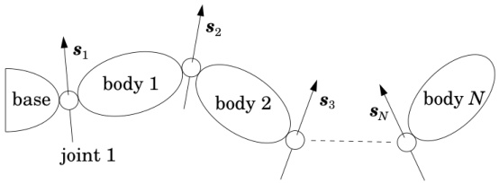{width=60%} Figure 2.4: Kinematic chain

Example 2.3 Figure 2.4 shows a collection of rigid bodies joined together in a chain, with one end joined to a fixed base. A system like this is typical of an industrial robot arm, and is called a kinematic chain. There are a total of N moving bodies and N joints in this system, and the bodies are connected together such that joint i connects from body i - 1 to body i. (The base is body 0.) We say that a joint connects 'from' one body 'to' another so that we can define the velocity across the joint as being the velocity of the 'to' body relative to the 'from' body. Thus, if $v_{J_i}$ is the velocity across joint i, and $v_i$ is the velocity of body i, then

$$
\begin{array}{r} { v _ { \mathrm { J } i } = v _ { i } - v _ { i - 1 } \, . } \end{array}
$$

We shall assume that each joint allows only a single degree of motion freedom, so that $v_{J_i}$ can be described as a scalar multiple of a single motion vector. Specifically,

$$
\begin{array}{r} { \boldsymbol { v } _ { \mathrm { J } i } = \boldsymbol { s } _ { i } \, \dot { \boldsymbol { q } } _ { i } \, , } \end{array}
$$

where $\boldsymbol{s}_{i}$ and $\dot{\boldsymbol{q}}_{i}$ are the axis vector and velocity variable for joint $i$. If joint $i$ is revolute, then $\boldsymbol{s}_{i}$ will be a unit rotation vector so that $\boldsymbol{v}_{\mathrm{J}_{i}}$ will be a unit rotational velocity when $\dot{\boldsymbol{q}}_{i}=1$. Likewise, if joint $i$ is prismatic then $\boldsymbol{s}_{i}$ will be a unit translation vector.

Let us work out the velocity of each body in the system. From Eqs. 2.14 and 2.15 we have

$$
\pmb { v } _ { i } = \pmb { v } _ { i - 1 } + \pmb { s } _ { i } \, \dot { q } _ { i } \, .  \left( \pmb { v } _ { 0 } = \pmb { 0 } \right)
$$

This equation lets us calculate the velocity of each body in turn, starting at the base and working out towards the free end of the chain. Another expression for the velocity is

$$
{ \boldsymbol { v } } _ { i } = \sum _ { j = 1 } ^{i} { \boldsymbol { s } } _ { j } \, { \dot { \boldsymbol { q } } } _ { j } \, .
$$

From a computational point of view, Eq. 2.16 is more efficient than Eq. 2.17 because it reuses the results of previous calculations. Yet another expression for $v_{i}$ is

$$
\pmb { v } _ { i } = \left[ s _ { 1 }  s _ { 2 }  \cdots  s _ { i }  0  \cdots  0 \right] \left[ \begin{array}{l} { \dot { q } _ { 1 } } \\{ \vdots } \\{ \dot { q } _ { N } } \end{array} \right] = J _ { i } \, \dot { q } \, .
$$

In this equation, $J_{i}$ is a $6 \times N$ matrix called the body Jacobian for body $i$, and $\dot{q}$ is the joint-space velocity vector.

# 2.8 Coordinate Transforms

The coordinate transform from $A$ to $B$ coordinates for a motion vector is usually written ${}^{B}\mathbf{X}_{A}$, and the same transform for a force vector is ${}^{B}\mathbf{X}_{A}^{*}$. The two are related by the equation ${}^{B}\mathbf{X}_{A}^{*}=\mathbf{B}\mathbf{X}_{A}^{-\mathrm{T}}$ (cf. Eq. 2.13). In this section, we shall develop the formulae for coordinate transforms between Plücker coordinate systems.

Let $A$ and $B$ denote two Plücker coordinate systems. Each is defined by the position and orientation of a Cartesian frame, and each frame also defines a Cartesian coordinate system. For convenience, we shall use the same names for all three entities; so frame $A$ defines both Plücker coordinate system $A$ and Cartesian coordinate system $A$, and similarly for $B$. The formula for $^{B}\mathbf{X}_{A}$ depends only on the position and orientation of frame $B$ relative to frame $A$, so it can be expressed as the product of two simpler transforms: one depending on the relative position of frame $B$ and the other on its relative orientation.

# Rotation

Let $A$ and $B$ be two Cartesian frames with a common origin at $O$. Given $O$, any motion vector $\hat{\boldsymbol{m}} \in \mathbb{M}^{6}$ can be represented by two 3D vectors, $\boldsymbol{m}$ and $\boldsymbol{m}_{O}$, and the Plücker coordinates of $\hat{\boldsymbol{m}}$ will be the Cartesian coordinates of $\boldsymbol{m}$ and $\boldsymbol{m}_{O}$. Therefore, let ${}^{4} \hat{\boldsymbol{m}}$, ${}^{4} \boldsymbol{m}$, ${}^{4} \boldsymbol{m}_{O}$, ${}^{B} \hat{\boldsymbol{m}}$, ${}^{B} \boldsymbol{m}$ and ${}^{B} \boldsymbol{m}_{O}$ be the coordinate vectors representing $\hat{\boldsymbol{m}}$, $\boldsymbol{m}$ and $\boldsymbol{m}_{O}$ in $A$ and $B$ coordinates, respectively, and let $\boldsymbol{E}$ be the $3 \times 3$ rotation matrix that transforms 3D vectors from $A$ to $B$ coordinates (i.e., $\boldsymbol{E} = {}^{B} \boldsymbol{E}_{A}$). We now have

$$
{ } ^{B} \hat { m } = \left[ \begin{array}{l} { { } ^{B} m } \\{ { } ^{B} m _ { O } } \end{array} \right] = \left[ \begin{array}{l} { { E } ^{A} m } \\{ { E } ^{A} m _ { O } } \end{array} \right] = \left[ \begin{array}{ll} { { E } } & { { 0 } } \\{ { 0 } } & { { E } } \end{array} \right] { } ^{A} \hat { m } \, ,
$$

SO

$$
B _ { \mathbf { X } _ { A } } = \left[ \begin{array}{ll} { E } & { 0 } \\{ 0 } & { E } \end{array} \right] .
$$

The equivalent transform for a force vector is exactly the same:

$$
B _ { \mathbf { X } _ { A } ^{*} } = B _ { \mathbf { X } _ { A } ^{- \mathrm { T} } } = { \left[ \begin{array}{ll} { E } & { 0 } \\{ 0 } & { E } \end{array} \right] } \, .
$$

# Translation

Let $O$ and $P$ be two points in space, and let there be a Cartesian frame located at each point, the two frames having the same orientation. Any motion vector $\hat{\mathbf{m}} \in \mathbb{M}^{6}$ can be expressed at $O$ by the 3D vectors $\mathbf{m}$ and $\mathbf{m}_{O}$, and at $P$ by the vectors $\mathbf{m}$ and $\mathbf{m}_{P}$, where $\mathbf{m}_{P} = \mathbf{m}_{O} - \overrightarrow{OP} \times \mathbf{m}$ (as per Eq. 2.1). In both cases, the Plücker coordinates of $\hat{\mathbf{m}}$ are the Cartesian coordinates of the appropriate pair of 3D vectors, so we have

$$
\hat { m } _ { P } = \left[ \begin{array}{l} { m } \\{ m _ { P } } \end{array} \right] = \left[ \begin{array}{ll} { m } & { m } \\{ m _ { O } - r \times m } \end{array} \right] = \left[ \begin{array}{ll} { 1 } & { 0 } \\{ - r \times } & { 1 } \end{array} \right] \hat { m } _ { O } \, ,
$$

where $r=\overrightarrow{OP}$. Therefore

$$
P _ { \mathbf { X } O } = \left[ \begin{array}{ll} { 1 } & { 0 } \\{ - r \times } & { 1 } \end{array} \right] .
$$

The equivalent transform for a force vector is

$$
P _ { \mathbf { X } _ { O } ^{*} } = P _ { \mathbf { X } _ { O } ^{- \mathrm { T} } } = { \left[ \begin{array}{ll} { 1 } & { - r \times } \\{ 0 } & { 1 } \end{array} \right] } .
$$

An expression of the form $a\times$ (pronounced 'a-cross') denotes an operator that maps $b$ to $a\times b$. If $a$ is a 3D coordinate vector, then $a\times$ is the $3\times3$ matrix given by the formula

$$
\left[ \begin{array}{l} { x } \\{ y } \\{ z } \end{array} \right] \times = \left[ \begin{array}{lll} { 0 } & { - z } & { y } \\{ z } & { 0 } & { - x } \\{ - y } & { x } & { 0 } \end{array} \right] \, .
$$

Table 2.1: Properties of the Euclidean cross operator

This operator has several mathematical properties, which are listed in Table 2.1. We shall interpret expressions of the form $a \times b \times c$ as meaning $(a \times)(b \times)c$, which is the same as $a \times (b \times c)$. Any other interpretation requires parentheses. Likewise, the expressions $a + b \times c$ and $E a \times$ mean $a + (b \times c)$ and $E (a \times)$, respectively, and any other interpretation requires parentheses.

# General Transforms

Let $A$ and $B$ be Cartesian frames with origins at $O$ and $P$, respectively; let $r$ be the coordinate vector expressing $\overrightarrow{OP}$ in $A$ coordinates; and let $E$ be the rotation matrix that transforms 3D vectors from $A$ to $B$ coordinates. The Plücker transform from $A$ to $B$ coordinates is then the product of a translation by $r$ and a rotation by $E$. The formula for a motion-vector transform is

$$
B _ { X _ { A } } = { \left[ \begin{array}{ll} { E } & { 0 } \\{ 0 } & { E } \end{array} \right] } { \left[ \begin{array}{ll} { 1 } & { 0 } \\{ - r \times } & { 1 } \end{array} \right] } = { \left[ \begin{array}{ll} { E } & { 0 } \\{ - E r \times } & { E } \end{array} \right] } \, ;
$$

the equivalent transform for a force vector is

$$
B _ { \mathbf { X } _ { A } ^{*} } = { \left[ \begin{array}{ll} { E } & { 0 } \\{ 0 } & { E } \end{array} \right] } { \left[ \begin{array}{ll} { 1 } & { - r \times } \\{ 0 } & { 1 } \end{array} \right] } = { \left[ \begin{array}{ll} { E } & { - E \, r \times } \\{ 0 } & { E } \end{array} \right] } ;
$$

and the inverses of these two transforms are

$$
A \mathbf { X } _ { B } = { \left[ \begin{array}{ll} { 1 } & { 0 } \\{ r \times } & { 1 } \end{array} \right] } { \left[ \begin{array}{ll} { E ^{\mathrm { T} } } & { 0 } \\{ 0 } & { E ^{\mathrm { T} } } \end{array} \right] } = { \left[ \begin{array}{ll} { E ^{\mathrm { T} } } & { 0 } \\{ r \times E ^{\mathrm { T} } } & { E ^{\mathrm { T} } } \end{array} \right] }
$$

and

$$
A \mathbf { X } _ { B } ^{*} = \left[ \begin{array}{ll} { \mathbf { 1 } } & { r \times } \\{ \mathbf { 0 } } & { \mathbf { 1 } } \end{array} \right] \left[ \begin{array}{ll} { E ^{\mathrm { T} } } & { \mathbf { 0 } } \\{ \mathbf { 0 } } & { E ^{\mathrm { T} } } \end{array} \right] = \left[ \begin{array}{ll} { E ^{\mathrm { T} } } & { r \times E ^{\mathrm { T} } } \\{ \mathbf { 0 } } & { E ^{\mathrm { T} } } \end{array} \right] .
$$

For comparison, the formula for the $4 \times 4$ homogeneous coordinate transformation matrix from $A$ to $B$ (homogeneous) coordinates is

$$
B _ { T _ { A } } = \left[ \begin{array}{ll} { { E } } & { { - E r } } \\{ { 0 } } & { { 1 } } \end{array} \right] .
$$

$$
\begin{aligned}&\operatorname{rx}(\theta)=\begin{bmatrix}1&0&0\\0&c&s\\0&-s&c\end{bmatrix}\operatorname{ry}(\theta)=\begin{bmatrix}c&0&-s\\0&1&0\\s&0&c\end{bmatrix}\operatorname{rz}(\theta)=\begin{bmatrix}c&s&0\\-s&c&0\\0&0&1\end{bmatrix}\\&(\:c=\cos(\theta)\:,\:s=\sin(\theta)\:)\\&\operatorname{rot}(\boldsymbol{E})=\begin{bmatrix}\boldsymbol{E}&\boldsymbol{0}\\\boldsymbol{0}&\boldsymbol{E}\end{bmatrix}\operatorname{xlt}(\boldsymbol{r})=\begin{bmatrix}\boldsymbol{1}&\boldsymbol{0}\\-\boldsymbol{r}\times&\boldsymbol{1}\end{bmatrix}\operatorname{rotx}(\theta)=\operatorname{rot}(\operatorname{rx}(\theta))\\\end{aligned}
$$

Table 2.2: Functions for rotations and Plücker transforms

To facilitate the description of Plücker transforms, we will occasionally use the functions listed in Table 2.2. In terms of these functions, Eq. 2.24 could have been written $^{B}\mathbf{X}_{A}=\operatorname{rot}(\mathbf{E})\operatorname{xlt}(\mathbf{r})$, and so on.

Finally, note that we have adopted the following convention for describing coordinate transforms: the formula for $^{B}\mathbf{X}_{A}$ (or for $^{B}\mathbf{E}_{A}$) is associated with a description of how you would have to move frame $A$ so as to make it coincide with frame $B$. For example, the expression 'rotx($\theta$)' reads like an abbreviated version of the statement 'rotate about the $x$ axis by an amount $\theta$', and its value is the coordinate transform $^{B}\mathbf{X}_{A}$ for the case where frame $B$ is rotated relative to frame $A$ by an amount $\theta$ about their common $x$ axis. Readers should bear in mind that some authors use a different convention.

# 2.9 Spatial Cross Products

Let $r \in \mathbb{E}^{3}$ be a Euclidean vector that is rotating with an angular velocity of $\omega$, but is not otherwise changing. The derivative of this vector is given by the well-known formula $\dot{r} = \omega \times r$. In this context, $\omega \times$ is acting like a differentiation operator: it is mapping $r$ to $\dot{r}$.

It turns out that this idea can be extended to spatial vectors, but we need to have two operators: one for motions and one for forces. Therefore, let $\hat{\boldsymbol{m}} \in \mathbb{M}^{6}$ and $\hat{\boldsymbol{f}} \in \mathbb{F}^{6}$ be two spatial vectors that are moving with a velocity of $\hat{\boldsymbol{v}} \in \mathbb{M}^{6}$ (e.g. because they are fixed in a rigid body having that velocity), but are not otherwise changing. We now define two new operators, $\times$ and $\times^{*}$, which are required to satisfy the following equations:

$$
\dot { \hat { m } } = \hat { v } \times \hat { m }
$$

and

$$
\dot { \hat { f } } = \hat { v } \times ^{*} \hat { f } .
$$

The operator $\times^{*}$ can be regarded as the dual of $\times$. The relationship between these two operators is similar to that between the coordinate transform matrices $X$ and $X^{*}$.

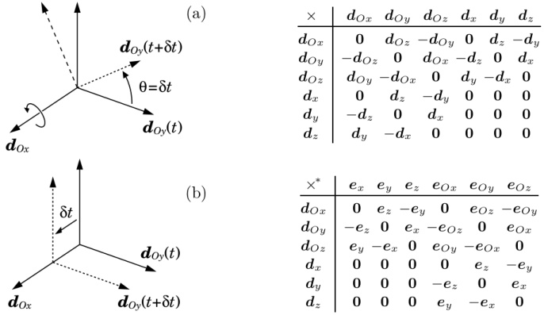{width=75%} Figure 2.5: Spatial cross-product tables

These operators can be defined explicitly by means of the multiplication tables shown in Figure 2.5. Each entry in these tables is the time derivative of the basis vector listed on the top row, assuming it has a velocity equal to the basis vector listed in the left-hand column. For example, Figure 2.5(a) shows a coordinate frame that is moving with a velocity equal to $d_{Ox}$, which means that it is rotating with unit angular velocity about the line $Ox$. Over a period of $\delta t$ time units, this motion has no effect on the line $Ox$, but it causes $Oy$ to rotate by $\delta t$ radians in the $y-z$ plane. So we have $d_{Ox}(t+\delta t)=d_{Ox}(t)$, but $d_{Oy}(t+\delta t)=d_{Oy}(t)+\delta t\,d_{Oz}$. The time derivatives are therefore

$$
\begin{array}{rl} & { \frac { \mathrm { d } } { \mathrm { d } t } \, d _ { O x } \, = \, \operatorname* { l i m } _ { \delta t \to 0 } \, \frac { d _ { O x } ( t + \delta t ) - d _ { O x } ( t ) } { \delta t } } \\& { = \, \operatorname* { l i m } _ { \delta t \to 0 } \, \frac { d _ { O x } ( t ) - d _ { O x } ( t ) } { \delta t } \, = \, 0 } \end{array}
$$

and

$$
\begin{array}{rl} & { \frac { \mathrm { d } } { \mathrm { d } t } \, d _ { O y } \, = \, \operatorname* { l i m } _ { \delta t \to 0 } \, \frac { d _ { O y } ( t + \delta t ) - d _ { O y } ( t ) } { \delta t } } \\& { = \, \operatorname* { l i m } _ { \delta t \to 0 } \, \frac { d _ { O y } ( t ) + \delta t \, d _ { O z } - d _ { O y } ( t ) } { \delta t } \, = \, d _ { O z } \, . } \end{array}
$$

This accounts for the first two entries on the first line in the first table. Similarly, Figure 2.5(b) shows a coordinate frame that is moving with a velocity equal to $d_x$, which means that it is translating with unit linear velocity in the $x$ direction. Over a period of $\delta t$ time units, this motion has no effect on the line $Ox$, but it causes $Oy$ to shift by $\delta t$ length units in the $x$ direction. We therefore have

Table 2.3: Properties of the spatial cross operators

| $\boldsymbol{v} \times^* = -\boldsymbol{v} \times^{\text{T}}$ |  |  |  |
| --- | --- | --- | --- |
| $(\lambda \boldsymbol{v}) \times = \lambda (\boldsymbol{v} \times)$ | $(\lambda \boldsymbol{v}) \times^* = \lambda (\boldsymbol{v} \times^*)$ |  | $(\lambda \text{ is a scalar})$ |
| $(\boldsymbol{u} + \boldsymbol{v}) \times = \boldsymbol{u} \times + \boldsymbol{v} \times$ | $(\boldsymbol{u} + \boldsymbol{v}) \times^* = \boldsymbol{u} \times^* + \boldsymbol{v} \times^*$ |  |  |
| $(\boldsymbol{X} \boldsymbol{v}) \times = \boldsymbol{X} \boldsymbol{v} \times \boldsymbol{X}^{-1}$ | $(\boldsymbol{X} \boldsymbol{v}) \times^* = \boldsymbol{X}^* \boldsymbol{v} \times^* (\boldsymbol{X}^*)^{-1}$ | (Plücker transform) |  |
| $\boldsymbol{u} \times \boldsymbol{v} = -\boldsymbol{v} \times \boldsymbol{u}$ |  |  |  |
| $(\boldsymbol{u} \times \boldsymbol{v}) \cdot = -\boldsymbol{v} \cdot \boldsymbol{u} \times^*$ | $(\boldsymbol{u} \times^* \boldsymbol{f}) \cdot = -\boldsymbol{f} \cdot \boldsymbol{u} \times$ |  |  |
| $(\boldsymbol{u} \times \boldsymbol{v}) \times = \boldsymbol{u} \times \boldsymbol{v} \times -\boldsymbol{v} \times \boldsymbol{u} \times$ | $(\boldsymbol{u} \times \boldsymbol{v}) \times^* = \boldsymbol{u} \times^* \boldsymbol{v} \times^* - \boldsymbol{v} \times^* \boldsymbol{u} \times^*$ |  |  |

$d_{Ox}(t+\delta t)=d_{Ox}(t)$, implying that $\dot{d}_{Ox}=\mathbf{0}$, but $d_{Oy}(t+\delta t)=d_{Oy}(t)+\delta t\,d_{z}$, implying that $\dot{d}_{Oy}=\mathbf{d}_{z}$. This accounts for the first two entries on the fourth line in the first table. All other entries are calculated in a similar manner.

Using the tables in Figure 2.5, we can deduce that the $6 \times 6$ matrices representing the operators $\hat{\boldsymbol{v}} \times$ and $\hat{\boldsymbol{v}} \times^{*}$ in Plücker coordinates are

$$
\hat { \mathbf { v } } _ { O } \times = \left[ \begin{array}{l} { \omega } \\{ \mathbf { v } _ { O } } \end{array} \right] \times = \left[ \begin{array}{ll} { \omega \times } & { \mathbf { 0 } } \\{ \mathbf { v } _ { O } \times } & { \mathbf { \omega } \times } \end{array} \right]
$$

and

$$
\hat { v } _ { O } \times ^{*} = \left[ \begin{array}{l} { \boldsymbol { \omega } } \\{ \boldsymbol { v } _ { O } } \end{array} \right] \times ^{*} = \left[ \begin{array}{ll} { \boldsymbol { \omega } \times } & { \boldsymbol { v } _ { O } \times } \\{ \boldsymbol { 0 } } & { \boldsymbol { \omega } \times } \end{array} \right] = - ( \boldsymbol { \hat { v } } _ { O } \times ) ^{\mathrm { T} } \, ,
$$

and that the spatial cross products of two coordinate vectors are

$$
\left[ \begin{array}{l} { \omega } \\{ v _ { O } } \end{array} \right] \times \left[ \begin{array}{l} { m } \\{ m _ { O } } \end{array} \right] = \left[ \begin{array}{l} { \omega \times m } \\{ \omega \times m _ { O } + v _ { O } \times m } \end{array} \right]
$$

and

$$
\left[ \begin{array}{l} { \omega } \\{ v _ { O } } \end{array} \right] \times ^{*} \left[ \begin{array}{l} { f _ { O } } \\{ f } \end{array} \right] = \left[ \begin{array}{l} { \omega \times f _ { O } + v _ { O } \times f } \\{ \omega \times f } \end{array} \right] .
$$

Various properties of these operators are listed in Table 2.3.

# 2.10 Differentiation

Vectors are differentiated in the same way as scalars. If $\boldsymbol{v}(x)$ is a differentiable vector function of a scalar variable $x$, then its derivative is given by the formula

$$
\frac { \mathrm { d } } { \mathrm { d } x } v ( x ) = \operatorname* { l i m } _ { \delta x \to 0 } \frac { v ( x + \delta x ) - v ( x ) } { \delta x } .
$$

This formula applies to all vectors. In particular, it applies both to abstract vectors and to coordinate vectors. The derivative of a coordinate vector is therefore

Table 2.4: Differentiation formulae for vector expressions

| 2d (n = 20) | 2d (n = 20) | 2d (n = 20) | 2d (n = 20) | 2d (n = 20) | 2d (n = 20) | 2d (n = 20) | 2d (n = 20) |
| --- | --- | --- | --- | --- | --- | --- | --- |
| 3 (n = 20) | 3 (n = 20) | 3 (n = 20) | 3 (n = 20) | 3 (n = 20) | 3 (n = 20) | 3 (n = 20) | 3 (n = 20) |
| 4 (n = 20) | 4 (n = 20) | 4 (n = 20) | 4 (n = 20) | 4 (n = 20) | 4 (n = 20) | 4 (n = 20) | 4 (n = 20) |
| 5 (n = 20) | 5 (n = 20) | 5 (n = 20) | 5 (n = 20) | 5 (n = 20) | 5 (n = 20) | 5 (n = 20) | 5 (n = 20) |

its componentwise derivative, as can be seen from the following equation:

$$
\frac { \mathrm { d } } { \mathrm { d } x } \left[ \begin{array}{l} { v _ { 1 } ( x ) } \\{ \vdots } \\{ v _ { n } ( x ) } \end{array} \right] = \operatorname* { l i m } _ { \delta x \to 0 } \frac { 1 } { \delta x } \left[ \begin{array}{l} { v _ { 1 } ( x + \delta x ) - v _ { 1 } ( x ) } \\{ \vdots } \\{ v _ { n } ( x + \delta x ) - v _ { n } ( x ) } \end{array} \right] = \left[ \begin{array}{l} { \frac { \mathrm { d } v _ { 1 } } { \mathrm { d } x } } \\{ \vdots } \\{ \frac { \mathrm { d } v _ { n } } { \mathrm { d } x } } \end{array} \right] .
$$

The formula also applies to matrices and dyadics. We will be concerned mostly with time derivatives, which we will usually write using dot notation; that is, $d\boldsymbol{v}/dt = \boldsymbol{v}$, $d\dot{\boldsymbol{v}}/dt = \ddot{\boldsymbol{v}}$, and so on. The derivative of a vector is a vector of the same kind; so the derivative of a motion vector is a motion vector, the derivative of a force vector is a force vector, and so on. Differentiation formulae for various vector expressions are shown in Table 2.4.

# Differentiation in Moving Coordinates

The problem of differentiation in moving coordinates can be stated as follows: given the coordinate vector that represents a vector $v$, find the coordinate vector that represents $\dot{v}$. If the basis vectors are constants, then the solution is simply the componentwise derivative of the coordinate vector; otherwise, a formula is required that takes into account the motion of the basis vectors.

Let $A$ be the Plücker coordinate system associated with a Cartesian frame that is moving with a spatial velocity of $\boldsymbol{v}_{A}$. Suppose we have two coordinate vectors, ${}^{A}\boldsymbol{m}$ and ${}^{A}\boldsymbol{f}$, which represent the spatial vectors $\boldsymbol{m} \in \mathbb{M}^{6}$ and $\boldsymbol{f} \in \mathbb{F}^{6}$, respectively, and we wish to find the coordinate vectors that represent $\boldsymbol{m}$ and $\dot{\boldsymbol{f}}$ in $A$ coordinates. These vectors are given by the formulae

$$
A_{\begin{pmatrix}\frac{\mathrm{d}\boldsymbol{m}}{\mathrm{d}t}\end{pmatrix}}=\frac{\mathrm{d}^A\boldsymbol{m}}{\mathrm{d}t}+{}^A\boldsymbol{v}_A\times{}^A
$$

and

$$
{ } ^{A}  \left( \frac { \mathrm { d } f } { \mathrm { d } t } \right) = \frac { \mathrm { d } ^{A} f } { \mathrm { d } t } + { } ^{A}  v _ { A } \, \times ^{*} { } ^{A} f \, .
$$

The expressions on the left-hand sides denote the coordinate vectors representing $\dot{m}$ and $\dot{f}$ in $A$ coordinates, and the expressions $\mathrm{d}^{A}m/\mathrm{d}t$ and $\mathrm{d}^{A}f/\mathrm{d}t$ denote

the componentwise derivatives of $^{A}m$ and $^{A}f$, respectively. $^{A}v_{A}$ is the coordinate vector representing $v_{A}$ in $A$ coordinates. For comparison, the well-known formula for the derivative of a 3D Euclidean vector in rotating coordinates, expressed in the same notation, is

$$
{ } ^{A}  \left( \frac { \mathrm { d } u } { \mathrm { d } t } \right) = \frac { \mathrm { d } ^{A} u } { \mathrm { d } t } + { } ^{A}  \omega _ { A } \times { } ^{A} u \, .
$$

In this equation, $\boldsymbol{u} \in \mathbb{E}^{3}$ is the vector being differentiated, and $\boldsymbol{\omega}_{A}$ is the angular velocity of the coordinate frame.

Note: In formulating the dynamics algorithms that appear in subsequent chapters, we generally avoid performing differentiation in moving coordinates by formulating the algorithms in stationary coordinate systems that happen to coincide with the moving ones at the current instant.

# Dot and Ring Notation

It is slightly risky to mix dot notation with coordinate vectors because it is not obvious whether a symbol like $^{A}m$ means $^{A}(\mathrm{d}m/\mathrm{d}t)$ or $\mathrm{d}(\mathrm{d}^{A}m)/\mathrm{d}t$. Nevertheless, we shall take this risk, and make the following definitions: for any abstract vector $\boldsymbol{v}$, and any coordinate vector $^{A}\boldsymbol{v}$ representing $\boldsymbol{v}$ in $A$ coordinates,

$$
A _ { \dot { v } } = { } ^{A}  \left( { \frac { \mathrm { d } v } { \mathrm { d } t } } \right)
$$

and

$$
A _ { \tilde { v } } ^{\circ} = \frac { \mathrm { d } ^{A} v } { \mathrm { d } t } .
$$

With this notation, Eqs. 2.36 and 2.37 can be written

$$
A _ { \dot { m } } = A _ { \dot { m } } + A _ { v A } \times A _ { m }
$$

and

$$
A \dot { f } = { } ^{A} \dot { f } + { } ^{A} v _ { A } \times ^{*} { } ^{A} f \, .
$$

Furthermore, if the identity of the coordinate system is clear from the context, then we need not specify it explicitly. The equations can then be written

$$
\dot { m } = \dot { m } + v _ { A } \times m
$$

and

$$
\dot { f } = \dot { f } + v _ { A } \times ^{*} f \, .
$$

The symbols $\dot{m}$ and $\dot{f}$ can be regarded as the apparent rates of change of $m$ and $f$ as viewed by an observer having a velocity of $v_A$.

Example 2.4 Let $A$ and $B$ be two Cartesian frames having velocities of $\boldsymbol{v}_{A}$ and $\boldsymbol{v}_{B}$, respectively, and let ${}^{B}\boldsymbol{X}_{A}$ be the Plücker coordinate transform from $A$ to $B$ coordinates. We can work out the time derivative of ${}^{B}\boldsymbol{X}_{A}$ using these four equations, which follow from Eqs. 2.39 to 2.41:

$$
\begin{array}{rl} & { { } ^{B} \dot { m } \ = \ { } ^{B} \mathbf { X } _ { A } { } ^{A} \dot { m } } \\& { { } ^{B} \dot { \bar { m } } \ = \ \frac { \mathrm { d } } { \mathrm { d } t } \left( { } ^{B} \mathbf { X } _ { A } { } ^{A} \boldsymbol { m } \right) = \left( \frac { \mathrm { d } } { \mathrm { d } t } { } ^{B} \mathbf { X } _ { A } \right) { } ^{A} \boldsymbol { m } + { } ^{B} \mathbf { X } _ { A } { } ^{A} \dot { \bar { m } } } \\& { { } ^{A} \dot { m } \ = \ { } ^{A} \dot { \bar { m } } + { } ^{A} \boldsymbol { v } _ { A } \times { } ^{A} \boldsymbol { m } } \\& { { } ^{B} \dot { m } \ = \ { } ^{B} \dot { \bar { m } } + { } ^{B} \boldsymbol { v } _ { B } \times { } ^{B} \boldsymbol { m } \, . } \end{array}
$$

The derivation proceeds as follows:

$$
\begin{array}{rl} { \left( \frac { \mathrm { d } } { \mathrm { d } t } { ^ B } \boldsymbol { X } _ { A } \right) ^{A}   m } & { = { ^ B }   \stackrel { \circ } { \boldsymbol { m } } - { ^ B }   \boldsymbol { X } _ { A } { ^ A }   \stackrel { \circ } { \boldsymbol { m } } } \\& { = { ^ B }   \stackrel { \circ } { \boldsymbol { m } } - { ^ B }   \boldsymbol { v } _ { B } \times { ^ B }   \boldsymbol { m } - { ^ B }   \boldsymbol { X } _ { A } ( { ^ A }   \stackrel { \circ } { \boldsymbol { m } } - { ^ A }   \boldsymbol { v } _ { A } \times { ^ A }   \boldsymbol { m } ) } \\& { = { ^ B }   \stackrel { \circ } { \boldsymbol { m } } - { ^ B }   \boldsymbol { X } _ { A } { ^ A }   \stackrel { \circ } { \boldsymbol { m } } - { ^ B }   \boldsymbol { v } _ { B } \times { ^ B }   \boldsymbol { X } _ { A } { ^ A }   \stackrel { \circ } { \boldsymbol { m } } + { ^ B }   \boldsymbol { X } _ { A } { ^ A }   \boldsymbol { v } _ { A } \times { ^ A }   \boldsymbol { m } } \\& { = \left( { ^ B }   \boldsymbol { X } _ { A } { ^ A }   \boldsymbol { v } _ { A } \times { - ^ B }   \boldsymbol { v } _ { B } \times { ^ B }   \boldsymbol { X } _ { A } \right) { ^ A }   \boldsymbol { m } \, . } \end{array}
$$

As this must be true for all $^{A}m$, we have

$$
\frac { \mathrm { d } } { \mathrm { d } t } { } ^{B} \mathbf { X } _ { A } = { } ^{B} ( v _ { A } - v _ { B } ) \times { } ^{B} \mathbf { X } _ { A } \, .
$$

# 2.11 Acceleration

We define the spatial acceleration of a rigid body to be the time derivative of its spatial velocity. Thus, if a body has a spatial velocity of $[\boldsymbol{\omega}^{\mathrm{T}}\boldsymbol{v}_{O}^{\mathrm{T}}]^{\mathrm{T}}$ expressed at $O$, then its spatial acceleration is

$$
\hat { a } _ { O } = \frac { \mathrm { d } } { \mathrm { d } t } \left[ \frac { \omega } { v _ { O } } \right] = \operatorname* { l i m } _ { \delta t \to 0 } \frac { 1 } { \delta t } \left[ \frac { \omega ( t + \delta t ) - \omega ( t ) } { v _ { O } ( t + \delta t ) - v _ { O } ( t ) } \right] = \left[ \frac { \dot { \omega } } { v _ { O } } \right] .
$$

This definition may sound obvious, but it contains a surprise for those who are already expert in the traditional method of describing rigid-body acceleration. Consider the body shown in Figure 2.6, which is rotating at a constant angular velocity about a fixed line in space. This body has a constant spatial velocity, and must therefore have zero spatial acceleration; yet almost every point in the body is travelling in a circular path, and is therefore accelerating. This paradox is easily resolved. First, one must realise that spatial acceleration is a property of the body as a whole, rather than a property of individual body-fixed points. Second, one must realise that $\boldsymbol{v}_{O}$ is not the velocity of one particular body-fixed point, but a measure of the flow of points through $O$. Thus, $\dot{\boldsymbol{v}}_{O}$ is not the acceleration of an individual point, but a measure of the rate of change of flow. If the flow is constant, then $\dot{\boldsymbol{v}}_{O}$ will be zero even if each individual point is accelerating.

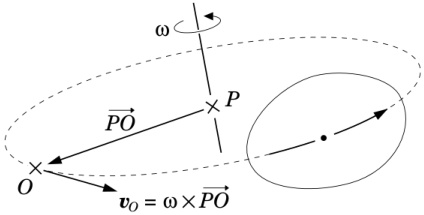{width=46%} Figure 2.6: Acceleration of a uniformly rotating body

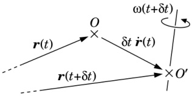{width=35%} Figure 2.7: Computing $\dot{v}_{O}$ from $\ddot{r}$

Let us compare spatial acceleration with the traditional method of describing acceleration. To this end, we introduce two more quantities: a second point, $O'$, which is the body-fixed point that coincides with $O$ at time $t$, and a vector, $r$, which gives the position of $O'$ as a function of time. Thus, $\dot{r}$ is the velocity of $O'$ and $\ddot{r}$ is its acceleration. In the standard textbooks on classical mechanics, the acceleration of a rigid body would be specified by the two 3D vectors $\dot{\boldsymbol{\omega}}$ and $\ddot{\boldsymbol{r}}$; so let us examine how $\boldsymbol{v}_O$ differs from $\ddot{\boldsymbol{r}}$. From Eq. 2.46 we have

$$
\dot { v } _ { O } = \operatorname* { l i m } _ { \delta t \to 0 } \frac { v _ { O } ( t + \delta t ) - v _ { O } ( t ) } { \delta t } \, .
$$

Now, $\boldsymbol{v}_{O}(t)=\dot{\boldsymbol{r}}(t)$ because $O'$ coincides with $O$ at time $t$, but $\boldsymbol{v}_{O}(t+\delta t)$ is not equal to $\dot{\boldsymbol{r}}(t+\delta t)$ because $O'$ has moved away from $O$ by an amount $\delta t\,\dot{\boldsymbol{r}}(t)$ (see Figure 2.7), so $\boldsymbol{v}_{O}(t+\delta t)$ is given instead by

$$
\begin{array}{r} { v _ { O } ( t + \delta t ) = \dot { \boldsymbol { r } } ( t + \delta t ) - \boldsymbol { \omega } \times \delta t \, \dot { \boldsymbol { r } } ( t ) \, . } \end{array}
$$

Combining these equations gives

$$
\begin{array}{rl} { \dot { v } _ { O } } & { = \operatorname* { l i m } _ { \delta t \to 0 } \frac { \dot { r } ( t + \delta t ) - \dot { r } ( t ) - \omega \times \delta t \, \dot { r } ( t ) } { \delta t } } \\& { = \ddot { r } - \omega \times \dot { r } \ , } \end{array}
$$

which implies that

$$
{ \hat { a } } _ { O } = \left[ { \dot { \boldsymbol { r } } } - { \boldsymbol { \omega } } \times { \dot { \boldsymbol { r } } } \right] .
$$

For comparison, we now define a new 6D vector,

$$
\hat { a } _ { O } ^{\prime} = \left[ \begin{array}{l} { \dot { \omega } } \\{ \ddot { r } } \end{array} \right] ,
$$

which we shall call the classical acceleration of a rigid body, expressed at $O$. The name reflects the fact that this vector is composed of the two 3D vectors that are used in the classical description of rigid-body acceleration. Physically, the classical acceleration is the apparent derivative of spatial velocity in a Plücker coordinate system having its origin at $O'$, rather than $O$, meaning that the coordinate frame has a pure linear velocity of $\dot{r}$. Thus, according to Eq. 2.43, $\hat{\mathbf{a}}_O$ and $\hat{\mathbf{a}}_O'$ are related by

$$
\hat { a } _ { O } = \hat { a } _ { O } ^{\prime} + \left[ \frac { 0 } { \dot { r } } \right] \times \hat { v } _ { O } \, ,
$$

which is easily verified from Eqs. 2.48 and 2.49.

The big advantage of spatial acceleration is that it is a true vector, and it obeys the same combination and coordinate transformation rules as velocity. For example, if $\hat{\mathbf{v}}_{1}$ and $\hat{\mathbf{v}}_{2}$ denote the spatial velocities of bodies $B_{1}$ and $B_{2}$, respectively, and $\hat{\mathbf{v}}_{rel}$ is the relative velocity of $B_{2}$ with respect to $B_{1}$, then we already know that

$$
\hat { \mathbf { v } } _ { r e l } = \hat { \mathbf { v } } _ { 2 } - \hat { \mathbf { v } } _ { 1 } \, .
$$

The equivalent formula for spatial accelerations is obtained immediately by differentiating the velocity formula:

$$
\frac { \mathrm { d } } { \mathrm { d } t } \hat { v } _ { r e l } = \frac { \mathrm { d } } { \mathrm { d } t } \hat { v } _ { 2 } - \frac { \mathrm { d } } { \mathrm { d } t } \hat { v } _ { 1 }  \Rightarrow  \hat { a } _ { r e l } = \hat { a } _ { 2 } - \hat { a } _ { 1 } \, .
$$

Thus, spatial accelerations are composed simply by adding them together, just like velocities. This compares favourably with the traditional formulae for composing accelerations, which involve the use of Coriolis terms.

Example 2.5 Example 2.3 presented several formulae for the velocities of the bodies in a kinematic chain. Let us now obtain the corresponding formulae for their accelerations. First, we define $\mathbf{a}_{\mathrm{J}_{i}}$ to be the acceleration across joint $i$ and $\mathbf{a}_{i}$ to be the acceleration of body $i$; so $\mathbf{a}_{\mathrm{J}_{i}}=\mathbf{v}_{\mathrm{J}_{i}}$ and $\mathbf{a}_{i}=\mathbf{v}_{i}$. As spatial accelerations are additive, we immediately have

$$
a _ { \mathrm { J } i } = a _ { i } - a _ { i - 1 } \, ,
$$

which is the time derivative of Eq. 2.14. Next, the derivative of Eq. 2.15 is

$$
a _ { \mathrm { J } i } = s _ { i } \, \ddot { q } _ { i } + \dot { s } _ { i } \, \dot { q } _ { i } \ ,
$$

where $\ddot{q}_{i}$ is the acceleration variable for joint $i$. Given that $\mathbf{s}_{i}$ represents a joint motion axis that is fixed in body $i$ (and also in body $i-1$), we have

$$
\dot { \boldsymbol { s } } _ { i } = \boldsymbol { v } _ { i } \times \boldsymbol { s } _ { i } \, .
$$

Combining these three equations gives

$$
a _ { i } = a _ { i - 1 } + s _ { i } \, \ddot { q } _ { i } + v _ { i } \times s _ { i } \, \dot { q } _ { i } \, ,
$$

which is the derivative of Eq. 2.16. Next, the derivative of Eq. 2.17 is

$$
{ \begin{array}{rl} { a _ { i } } & { = \sum _ { j = 1 } ^{i} \, s _ { j } \, { \ddot { q } } _ { j } + v _ { j } \times s _ { j } \, { \dot { q } } _ { j } } \\& { = \sum _ { j = 1 } ^{i} \, s _ { j } \, { \ddot { q } } _ { j } + \sum _ { j = 1 } ^{i} \sum _ { k = 1 } ^{j - 1} s _ { k } \times s _ { j } \, { \dot { q } } _ { j } \, { \dot { q } } _ { k } \, . } \end{array} }
$$

Finally, the derivative of Eq. 2.18 is

$$
a _ { i } = J _ { i } \, \ddot { q } + \dot { J } _ { i } \, \dot { q } \, ,
$$

where $\ddot{\boldsymbol{q}}$ is the joint-space acceleration vector and $\dot{\boldsymbol{J}}_{i}=\left[\dot{\boldsymbol{s}}_{1} \dot{\boldsymbol{s}}_{2} \cdots \dot{\boldsymbol{s}}_{i} \boldsymbol{0} \cdots \boldsymbol{0}\right]$.

# 2.12 Momentum

Figure 2.8 shows a moving rigid body whose centre of mass coincides with the fixed point $C$ at the current instant. This body has a spatial velocity of $\hat{\boldsymbol{v}}$, which is expressed at $C$ by the two 3D vectors $\boldsymbol{\omega}$ and $\boldsymbol{v}_{C}$. If the body has a mass of $m$, and a rotational inertia of $\bar{I}_{C}$ about its centre of mass, then its momentum is described by the two 3D vectors $\boldsymbol{h}=m\boldsymbol{v}_{C}$ and $\boldsymbol{h}_{C}=\bar{I}_{C}\boldsymbol{\omega}$, where $\boldsymbol{h}$ specifies the magnitude and direction of the body's linear momentum, and $\boldsymbol{h}_{C}$ specifies the body's intrinsic angular momentum. Linear momentum is actually a line vector (like linear force), and its line of action passes through the body's centre of mass. The body's moment of momentum about any given point, $O$, is the sum of its intrinsic angular momentum and the moment of its linear momentum about the given point:

$$
\begin{array}{r} { h _ { O } = h _ { C } + \overrightarrow { O C } \times h \, , } \end{array}
$$

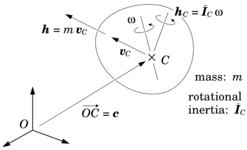{width=46%} Figure 2.8: Spatial momentum

which is essentially the same formula as Eq. 2.6.

Let $\hat{\boldsymbol{h}}$ denote the spatial momentum of this rigid body, and let $\hat{\boldsymbol{h}}_{C}$ and $\hat{\boldsymbol{h}}_{O}$ be the coordinate vectors that represent $\hat{\boldsymbol{h}}$ in Plücker coordinate systems with origins at $C$ and $O$, respectively. These coordinate vectors are given by

$$
\hat { h } _ { C } = \left[ \frac { h _ { C } } { h } \right] = \left[ \frac { \bar { I } _ { C } \, \omega } { m \, v _ { C } } \right]
$$

and

$$
\hat { h } _ { O } = \left[ \frac { h _ { O } } { h } \right] = \left[ \begin{array}{l} { \bar { I } _ { C } \, \omega \, + \, \overrightarrow { O C } \times m \, v _ { C } } \\{ m \, v _ { C } } \end{array} \right] = \left[ \begin{array}{ll} { 1 } & { \overrightarrow { O C } \times } \\{ 0 } & { 1 } \end{array} \right] \hat { h } _ { C } \, .
$$

As spatial momentum vectors are elements of $\mathbf{F}^{6}$, they have the same algebraic properties as other spatial force vectors. In particular, they transform according to the formula ${}^{B}\hat{\mathbf{h}}={}^{B}\mathbf{X}_{A}^{*A}\hat{\mathbf{h}}$, and a scalar product is defined between momenta and elements of $\mathbf{M}^{6}$. The kinetic energy of the body in Figure 2.8 is $\frac{1}{2}\hat{\mathbf{h}}\cdot\hat{\mathbf{v}}$.

# 2.13 Inertia

The spatial inertia tensor of a rigid body defines the relationship between its velocity and momentum. Spatial inertia is therefore a mapping from $\mathbf{M}^{6}$ to $\mathbf{F}^{6}$. If a rigid body has a spatial velocity of $\boldsymbol{v}$ and a spatial inertia of $\boldsymbol{I}$, then its momentum is given by the formula

$$
h = I v \, .
$$

If $h$ and $v$ are coordinate vectors, then $I$ is a $6 \times 6$ matrix.

Let $I_{O}$ and $I_{C}$ be the matrices representing the spatial inertia of a given rigid body in Plücker coordinate systems having origins at $O$ and $C$, respectively, where $O$ is an arbitrary point and $C$ coincides with the body's centre of mass. From Eq. 2.59 we have

$$
\begin{array}{r} { h _ { C } = \left[ \begin{array}{ll} { \bar { I } _ { C } } & { 0 } \\{ 0 } & { m \, { \bf 1 } } \end{array} \right] v _ { C } \, , } \end{array}
$$

which implies that

$$
I _ { C } = \left[ \begin{array}{ll} { { \bar { I } _ { C } } } & { { 0 } } \\{ { 0 } } & { { m \, 1 } } \end{array} \right] .
$$

The inertia matrix will take this special form whenever the origin coincides with the centre of mass. From Eq. 2.60 we have

$$
\begin{array}{rl} { h _ { O } } & { = \left[ \begin{array}{ll} { 1 } & { c \times } \\{ 0 } & { 1 } \end{array} \right] I _ { C } v _ { C } } \\& { = \left[ \begin{array}{ll} { 1 } & { c \times } \\{ 0 } & { 1 } \end{array} \right] I _ { C } \left[ \begin{array}{ll} { 1 } & { 0 } \\{ c \times ^{\mathrm { T} } } & { 1 } \end{array} \right] v _ { O } \, , } \end{array}
$$

where $c=\overrightarrow{OC}$, which implies that

$$
\begin{array}{r} { I _ { O } = \left[ \begin{array}{ll} { \bar { I } _ { C } + m \, c \times \, c \times ^{\mathrm { T} } } & { m \, c \times } \\{ m \, c \times ^{\mathrm { T} } } & { m \, \mathbf { 1 } } \end{array} \right] . } \end{array}
$$

This is the general form of the inertia matrix in Plücker coordinates. The quantity $\bar{I}_{C}+m\,c\times c\times^{\mathrm{T}}$ is the rotational inertia of the rigid body about $O$. As $\bar{I}_{C}$ is a symmetric matrix, it follows that both $I_{C}$ and $I_{O}$ are symmetric. Furthermore, if $m>0$ and $\bar{I}_{C}$ is positive definite, then both $I_{C}$ and $I_{O}$ are positive definite.

# Dyadic Representation of Inertia

An expression of the form $fg\cdot$, where $f,g\in\mathbf{F}^6$, is a dyad that maps motion vectors to force vectors. Specifically, it maps a motion vector $m\in\mathbb{M}^6$ to the force vector $f(g\cdot m)$, which is a scalar multiple of $f$. This dyad can be represented in dual coordinates by a $6\times6$ matrix of the form $f,g^{\top}$, where $f$ and $g$ are the coordinate vectors representing $f$ and $g$ in the chosen coordinate system. If $f=g$ then the dyad is said to be symmetric, and its matrix representation is also symmetric.

Spatial inertia is a symmetric dyadic tensor that maps from $M^{6}$ to $F^{6}$. It can therefore be expressed as the sum of six symmetric dyads as follows:

$$
I = \sum _ { i = 1 } ^{6} g _ { i } g _ { i } \, .   \left( g _ { i } \in \mathbf { F } ^{6} \right) .
$$

Furthermore, a body's spatial inertia is a quantity that is fixed in the body: it does not vary except as a function of the body's motion. It is therefore possible to express $I$ as a sum of dyads in which the individual vectors $g_i$ are all fixed in the body to which they refer. Given this expression, we can calculate the time derivative of a spatial inertia as follows:

$$
{ \begin{array}{rl} & { { \frac { \mathrm { d } } { \mathrm { d } t } } \, I \, = \, \sum _ { i = 1 } ^{6} \left( { \dot { g } } _ { i } \, g _ { i } \cdot + g _ { i } \, { \dot { g } } _ { i } \cdot \right) } \\& {  = \, \sum _ { i = 1 } ^{6} \left( v \, \times ^{*} \, g _ { i } \right) g _ { i } \cdot \, + \, \sum _ { i = 1 } ^{6} g _ { i } \, \left( v \, \times ^{*} \, g _ { i } \right) \cdot } \\& {  = \, v \, \times ^{*} \, \sum _ { i = 1 } ^{6} g _ { i } \, g _ { i } \cdot \, - \, \left( \sum _ { i = 1 } ^{6} g _ { i } \, g _ { i } \cdot \right) \, v \, \times } \\& {  = \, v \, \times ^{*} \, I - I \, v \, \times \, , } \end{array} }
$$

where $\boldsymbol{v}$ is the body's velocity. In obtaining this result, we have used Eq. 2.30 and formulae from Tables 2.3 and 2.4.

Table 2.5: Properties of dyadics

| mapping | e.g. | dyad | coordinate transform |
| --- | --- | --- | --- |
| mapping | e.g. | form | formula |
| $\mathbf{M}^{n} \mapsto \mathbf{M}^{n}$ | $\boldsymbol{v} \times$ | $m \boldsymbol{f} \cdot$ | $^{B} \mathbf{X}_{A}\left(\cdots\right)^{A} \mathbf{X}_{B}$ | similarity |
| $\mathbf{F}^{n} \mapsto \mathbf{F}^{n}$ | $\boldsymbol{v} \times$ | $f m \cdot$ | $^{B} \mathbf{X}_{A}^{*}\left(\cdots\right)^{A} \mathbf{X}_{B}^{*}$ | similarity |
| $\mathbf{M}^{n} \mapsto \mathbf{F}^{n}$ | $\boldsymbol{I}$ | $f f \cdot$ | $^{B} \mathbf{X}_{A}^{*}\left(\cdots\right)^{A} \mathbf{X}_{B}$ | congruence |
| $\mathbf{F}^{n} \mapsto \mathbf{M}^{n}$ | $\boldsymbol{\Phi}$ | $m m \cdot$ | $^{B} \mathbf{X}_{A}\left(\cdots\right)^{A} \mathbf{X}_{B}^{*}$ | congruence |

Another property that can be deduced from Eq. 2.64 is the coordinate transformation rule for spatial inertias. Let $^{A}\boldsymbol{I}$ and $^{B}\boldsymbol{I}$ be the matrices representing a given spatial inertia in $A$ and $B$ coordinates, respectively. We therefore have

$$
A \pmb { I } = \sum _ { i = 1 } ^{6} { ^ A g _ { i } ^{~ A} g _ { i } ^{\mathrm { T} } }  \mathrm { a n d }  { ^ B \pmb { I } } = \sum _ { i = 1 } ^{6} { ^ B g _ { i } ^{~ B} g _ { i } ^{\mathrm { T} } } \, ,
$$

where $^{A}g_{i}$ and $^{B}g_{i}$ are the coordinate vectors representing $g_{i}$ in $A$ and $B$ coordinates, respectively. Now, $^{B}g_{i}=^{B}X_{A}^{*A}g_{i}$, so we have

$$
\begin{array}{rl} { B { \pmb { I } } } & { = \sum _ { i = 1 } ^{6} { } ^{B} { \pmb { X } } _ { A } ^{* \ A} { \pmb { g } } _ { i } ^{\ A} { \pmb { g } } _ { i } ^{\mathrm { T} } \left( { } ^{B} { \pmb { X } } _ { A } ^{*} \right) ^{\mathrm { T} } } \\& { = { } ^{B} { \pmb { X } } _ { A } ^{* \ A} { \pmb { I } } ^{\ A} { \pmb { X } } _ { B } \, . } \end{array}
$$

# Spatial Dyadics

Spatial inertia is a mapping from $\mathbf{M}^{6}$ to $\mathbf{F}^{6}$; but there are three more mappings we can define involving these two spaces, making a total of four kinds of spatial dyadic tensor. Some of their basic properties are listed in Table 2.5. The symbol $\boldsymbol{\Phi}$ in the examples column denotes an inverse inertia (i.e., $\boldsymbol{\Phi}=\mathbf{I}^{-1}$). The column marked 'dyad form' shows the pattern of motion and force vectors in the dyads for each kind of tensor. If we think of a dyadic as mapping from the 'From' space to the 'To' space, then the first vector in the dyad must be an element of the 'To' space, and the second vector must be an element in the space that is dual to the 'From' space. The coordinate transformation formulae are each labelled as either a similarity transform or a congruence transform. A similarity transform preserves properties such as rank and eigenvalues, but not symmetry or positive definiteness. A congruence transform preserves properties like rank, symmetry and positive definiteness, but not eigenvalues.

# Properties of Spatial Inertia

We have already covered coordinate transforms (Eq. 2.66), the time derivative (Eq. 2.65), the general form of a spatial inertia in Plücker coordinates (Eq. 2.63)

and the fact that inertia maps velocity to momentum (Eq. 2.61). Here are a few more properties.

Ten parameters are required to define a spatial rigid-body inertia. More general kinds of inertia, such as the articulated-body inertias in Chapter 7, require up to 21 parameters, which is the maximum number of independent values in a symmetric $6 \times 6$ matrix.

The inertia of a rigid body that is composed of multiple parts is the sum of the inertias of its parts.

The kinetic energy of rigid body having a spatial velocity of $v$ and a spatial inertia of $I$ is

$$
T = { \frac { 1 } { 2 } } v \cdot I \, v \, .
$$

# 2.14 Equation of Motion

The spatial equation of motion for a rigid body states that the net force acting on the body equals its rate of change of momentum:

$$
\begin{array}{rl} { f = \frac { \mathrm { d } } { \mathrm { d } t } \left( I v \right) } & { = \, I a + \left( v \times ^{*} I - I v \times \right) v } \\& { = \, I a + v \times ^{*} I v \, . } \end{array}
$$

We will often write the equation of motion in the form of an inhomogeneous linear equation

$$
f = I a + p \, ,
$$

in which $I$ and $p$ are the coefficients and $f$ and $a$ are the variables. In typical use, the coefficients are assumed to be known, and one or both of the variables are unknown. $p$ is called the bias force, and it is simply the value that $f$ must take in order to produce zero acceleration. If $f$ is the net force acting on the body, then $p = v \times^* I v$.

The $f$ in Eq. 2.68 is always the net force acting on the body, but Eq. 2.69 affords the possibility to transfer some known components of the net force from $f$ to $p$. For example, suppose the net force, $f_{net}$, is the sum of an unknown force, $f_{u}$, and a known gravitational force, $f_{g}$. Equation 2.68 would then be

$$
f _ { n e t } = I a + v \times ^{*} I v \, ;
$$

but we have the option of choosing $f_{u}$ as the left-hand quantity in Eq. 2.69, in which case the equation would be

$$
f _ { u } = I a + p \, ,
$$

and $p$ would be defined as

$$
p = v \times ^{*} I v - f _ { g } \, .
$$

Example 2.6 The traditional 3D equations of motion can be recovered from Eq. 2.68 by expanding the spatial quantities into their 3D components. To keep the equations simple, we place the origin at the centre of mass. Equation 2.68 then expands to

$$
\begin{array}{rl} & { \left[ \begin{array}{l} { n _ { C } } \\{ f } \end{array} \right] = \left[ \begin{array}{ll} { \bar { I } _ { C } } & { 0 } \\{ 0 } & { m \, { \bf 1 } } \end{array} \right] \left[ \begin{array}{ll} { \omega } & { v _ { C } \times } \\{ \ddot { c } - \omega \times v _ { C } } \end{array} \right] + \left[ \begin{array}{ll} { \omega \times } & { v _ { C } \times } \\{ 0 } & { \omega \times } \end{array} \right] \left[ \begin{array}{ll} { \bar { I } _ { C } } & { 0 } \\{ 0 } & { m \, { \bf 1 } } \end{array} \right] \left[ \begin{array}{l} { \omega } \\{ v _ { C } } \end{array} \right] } \\& { = \left[ \begin{array}{ll} { \bar { I } _ { C } \dot { \omega } } & { \omega } \\{ m \, \ddot { c } - m \, \omega \times v _ { C } } \end{array} \right] + \left[ \begin{array}{ll} { \omega \times \bar { I } _ { C } \omega + m \, v _ { C } \times v _ { C } } \\{ m \, \omega \times v _ { C } } \end{array} \right] } \\& { = \left[ \begin{array}{l} { \bar { I } _ { C } \dot { \omega } + \omega \times \bar { I } _ { C } \omega } \\{ m \, \ddot { c } } \end{array} \right] . } \end{array}
$$

(We have used Eq. 2.48 to express the body's spatial acceleration in terms of $\dot{\omega}$, $\dot{\mathbf{c}}$ and $\mathbf{v}_{C}$ ($\equiv \dot{\mathbf{c}}$).) Thus, we have recovered Newton's equation for the motion of the centre of mass,

$$
f = m \, \ddot { c } \, ,
$$

and also Euler's equation for the rotational motion of the body about its centre of mass,

$$
n _ { C } = \bar { I } _ { C } \, \omega + \omega \times \bar { I } _ { C } \, \omega \, .
$$

# 2.15 Inverse Inertia

It is sometimes useful to write the equation of motion in the form

$$
a = \Phi f + b \, ,
$$

where $\Phi$ is the body's inverse inertia and $\boldsymbol{b}$ is its bias acceleration, which is the acceleration that the body would have if $\boldsymbol{f}=\boldsymbol{0}$. If this equation is the inverse of Eq. 2.69, then $\Phi=\boldsymbol{I}^{-1}$ and $\boldsymbol{b}=-\Phi\boldsymbol{p}$. The advantage of Eq. 2.72 over Eq. 2.69 is that it can be applied to a constrained rigid body.

Inverse inertia is a symmetric dyadic tensor that maps from $\mathbf{F}^{6}$ to $\mathbf{M}^{6}$. Some of its properties are already listed in Table 2.5. Another useful property is that the range of an inverse inertia is the subspace of $\mathbf{M}^{6}$ within which the body it applies to is free to move. This, in turn, implies that the rank of an inverse inertia equals the degree of motion freedom of the body to which it applies. Thus, if the body has fewer than six degrees of freedom, then $\boldsymbol{\Phi}$ will be singular, but $\boldsymbol{I}$ will not exist. The formulae for the inverse inertia of an unconstrained rigid body, expressed in Plücker coordinates at $C$ (the centre of mass) and $O$ (a general point) are

$$
\begin{array}{r} { \bar { \Phi } _ { C } = \left[ \begin{array}{ll} { \bar { I } _ { C } ^{- 1} } & { 0 } \\{ 0 } & { \frac { 1 } { m } \mathbf { 1 } } \end{array} \right] } \end{array}
$$

and

$$
\begin{array}{r} { \boldsymbol { \Phi } _ { O } = \left[ \begin{array}{ll} { \overline { { I } } _ { C } ^{- 1} } & { \overline { { I } } _ { C } ^{- 1} \boldsymbol { c } \times ^{\mathrm { T} } } \\{ \boldsymbol { c } \times \overline { { I } } _ { C } ^{- 1} } & { \frac { 1 } { m } \boldsymbol { 1 } + \boldsymbol { c } \times \overline { { I } } _ { C } ^{- 1} \boldsymbol { c } \times ^{\mathrm { T} } } \end{array} \right] \, . } \end{array}
$$

These are just the inverses of Eqs. 2.62 and 2.63.

# 2.16 Planar Vectors

If a rigid body is constrained to move parallel to a given plane, then it becomes, in effect, a 'planar' rigid body. If every body in a rigid-body system is constrained to move parallel to the same plane, then it is a planar rigid-body system. Many practical rigid-body systems are planar.

Spatial vectors can easily describe the motions of planar rigid bodies, since planar motion is a subset of spatial motion. However, it can be advantageous to define a stripped-down version of spatial vector algebra specifically for planar rigid bodies—a planar vector algebra. A planar rigid body has three degrees of motion freedom, so planar vectors are elements of the vector spaces $\mathbf{M}^3$ and $\mathbf{F}^3$.

The easiest way to derive planar vector algebra is to start with spatial vector algebra and restrict it to the $x$-$y$ plane. Essentially, this means removing the first, second and sixth basis vectors and their corresponding coordinates. Thus:

$$
\left. \begin{array}{llll} { { d _ { O x } } } & { { e _ { x } } } & { { \omega _ { x } } } & { { n _ { O x } } } \\{ { d _ { O y } } } & { { e _ { y } } } & { { \omega _ { y } } } & { { n _ { O y } } } \\{ { d _ { O z } } } & { { e _ { z } } } & { { e } } & { { n _ { O z } } } \\{ { d _ { x } } } & { { e _ { O x } } } \\{ { d _ { y } } } & { { e _ { O y } } } \\{ { d _ { z } } } & { { e _ { O z } } } \end{array} \right\} \Rightarrow \left. \begin{array}{llll} { { d _ { O } } } & { { e _ { O x } } } & { { v _ { O x } } } & { { f _ { x } } } \\{ { d _ { O } } } & { { e _ { O y } } } & { { v _ { O y } } } & { { f _ { y } } } \\{ { d _ { O } } } & { { e _ { O z } } } & { { v _ { O z } } } & { { f _ { z } } } \end{array} \right\} \Rightarrow \left. \begin{array}{llll} { { d _ { O x } } } & { { e _ { O x } } } & { { f _ { x } } } & { { f _ { x y } } } \\{ { d _ { O x } } } & { { e _ { O x } } } & { { f _ { x y } } } & { { f _ { x z } } } \\{ { d _ { O x } } } & { { e _ { O x } } } & { { f _ { x z } } } & { { f _ { x z } } } \end{array} \right\}
$$

Note that we have removed the $z$ subscript from the angular basis vectors and coordinates.

The planar versions of the spatial cross operator, coordinate transform and inertia matrix can all be obtained by extracting the appropriate $3 \times 3$ submatrix from the $6 \times 6$ matrix. For example, the planar cross operator matrix is obtained as follows:

$$
\begin{bmatrix}\boldsymbol\omega\\\boldsymbol v_O\end{bmatrix}\times\:=\begin{bmatrix}\boldsymbol\omega\times&\boldsymbol0\\\boldsymbol v_O\times&\boldsymbol\omega\times\end{bmatrix}=\begin{bmatrix}0&-\omega_z&\omega_y&0&0&0\\\omega_z&0&-\omega_x&0&0&0\\-\omega_y&\omega_x&-v_{Oz}\\0&-v_{Oz}\\v_{Oz}&0&0\\-v_{Oy}&v_{Ox}&0&-\omega_y&\omega_x&0\end{bmatrix},
$$

SO

$$
\left[ \begin{array}{l} { \omega } \\{ v _ { O x } } \\{ v _ { O y } } \end{array} \right] \times \ = \ \left[ \begin{array}{lll} { 0 } & { 0 } & { 0 } \\{ v _ { O y } } & { 0 } & { - \omega } \\{ - v _ { O x } } & { \omega } & { 0 } \end{array} \right]
$$

and

$$
\left[ \begin{array}{l} { \omega } \\{ v _ { O x } } \\{ v _ { O y } } \end{array} \right] \times \left[ \begin{array}{l} { m } \\{ m _ { O x } } \\{ m _ { O y } } \end{array} \right] \, = \, \left[ \begin{array}{l} { 0 } \\{ v _ { O y } \, m - \omega \, m _ { O y } } \\{ \omega \, m _ { O x } - v _ { O x } \, m } \end{array} \right] \, .
$$

In like manner, we can deduce that the formula for a planar coordinate transformation matrix corresponding to a shift of origin from (0,0) to (x,y), followed by a rotation of the coordinate frame about its new origin by an angle of $\theta$, is

$$
\begin{array}{rl} { \pmb { X } = } & { { } \left[ \begin{array}{lll} { 1 } & { 0 } & { 0 } \\{ 0 } & { c } & { s } \\{ 0 } & { - s } & { c } \end{array} \right] \left[ \begin{array}{lll} { 1 } & { 0 } & { 0 } \\{ - y } & { 1 } & { 0 } \\{ x } & { 0 } & { 1 } \end{array} \right] = \left[ \begin{array}{lll} { 1 } & { 0 } & { 0 } \\{ s x - c y } & { c } & { s } \\{ c x + s y } & { - s } & { c } \end{array} \right] , } \end{array}
$$

where $c=\cos(\theta)$ and $s=\sin(\theta)$. Note that planar vectors inherit the properties $\boldsymbol{v}^{\times*}=-(\boldsymbol{v}\times)^{\mathrm{T}}$ and $\boldsymbol{X}^{*}=\boldsymbol{X}^{-\mathrm{T}}$ from their spatial-vector counterparts. And finally, the formula for the inertia matrix of a planar rigid body is

$$
\begin{array}{r} { \pmb { I } = \left[ \begin{array}{lll} { I _ { C } + m \left( c _ { x } ^{2} + c _ { y } ^{2} \right) } & { - m \, c _ { y } } & { m \, c _ { x } } \\{ - m \, c _ { y } } & { m } & { 0 } \\{ m \, c _ { x } } & { 0 } & { m } \end{array} \right] = \left[ \begin{array}{lll} { I _ { O } } & { - m \, c _ { y } } & { m \, c _ { x } } \\{ - m \, c _ { y } } & { m } & { 0 } \\{ m \, c _ { x } } & { 0 } & { m } \end{array} \right] , } \end{array}
$$

where $m$ is the mass, $c_{x}$ and $c_{y}$ are the coordinates of the centre of mass, and $I_{C}$ and $I_{O}$ are the rotational inertias of the body about its centre of mass and coordinate origin, respectively. A total of four parameters are needed to define a planar rigid-body inertia.

# 2.17 Further Reading

Spatial vectors resemble the twists and wrenches of screw theory, the real-number motors and the elements of the Lie algebra se(3) and its dual, se*(3). Screw theory was developed in the $19^{th}$ century, and predates the modern concept of a vector. The main work on screw theory is Ball (1900), but more modern treatments can be found in Angeles (2003), Hunt (1978) and Selig (1996). Motors come in two varieties: 6D vectors over the field of real numbers and 3D vectors over the ring of dual numbers. The former are described in von Mises (1924a,b) and the latter in Brand (1953). The main difference between spatial vectors and motors is that all motors reside in a single vector space. In this respect, the spatial vectors in Featherstone (1987) closely resemble motor algebra. Formally, a Lie algebra is the tangent space to a Lie group at the identity. The spaces $\mathbf{M}^{6}$ and $\mathbf{M}^{3}$ correspond to the Lie algebras se(3) and se(2), and $\mathbf{F}^{6}$ and $\mathbf{F}^{3}$ correspond to their duals, se*(3) and se*(2). se(3) and se(2) are the algebras associated with the special Euclidean groups SE(3) and SE(2), which are the sets of every possible displacement of a rigid body in a 3D or 2D Euclidean space. Lie algebras are covered in Murray et al. (1994) and Selig (1996). Other articles that may be of interest include Jain (1991); Park et al. (1995); Plücker (1866); Rodriguez et al. (1991); Woo and Freudenstein (1970). There are many more, of course—the literature on 6D vectors of various kinds is quite extensive.

# Chapter 3

# Dynamics of Rigid Body Systems

The purpose of a dynamics algorithm is to evaluate numerically an equation of motion; but, before we can evaluate it, we must first know what that equation is. This chapter introduces the equations of motion for a general rigid-body system, and presents a variety of methods for constructing them from simpler equations. These methods form the basis for various algorithms that appear in later chapters. However, the focus of this chapter is mainly on the mathematics of rigid-body dynamics, rather than on particular algorithms.

A rigid-body system is a collection of rigid bodies that may be connected together by joints, and that may be acted upon by various forces. The effect of a joint is to impose a motion constraint on the two bodies it connects: relative motions are allowed in some directions but not in others. To be more precise, the effect of a joint is to introduce a constraint force into the system. This force has the special property that we do not know its value, but we do know what effect it has on the system—it takes whatever value it needs to take in order that the resulting motion complies with the motion constraint. A large part of this chapter is concerned with methods for describing motion constraints, and for applying them to rigid-body equations of motion.

Sections 3.1 and 3.2 provide a high-level introduction to the subject: Section 3.1 presents the equations of motion in their various standard forms, and Section 3.2 explains how they are constructed from equations describing the subsystems, individual rigid bodies and motion constraints. The next three sections cover the topic of motion constraint in more detail: Section 3.3 shows how to express them as vector subspaces; Section 3.4 presents a standard classification of the kinds of constraint that can arise in a rigid-body system; and Section 3.5 presents a detailed model of joint constraints. (We define a joint to be any kinematic constraint on the relative motion of two bodies.) Finally, Sections 3.6 and 3.7 show how to obtain explicit equations of motion for individual

rigid bodies, and for collections of rigid bodies, that are connected together by joints. These last two sections illustrate the use of spatial vectors in formulating equations of motion.

# 3.1 Equations of Motion

The equation of motion for a general rigid-body system can usually be written in the following canonical form:

$$
H ( q ) \, \ddot { q } + C ( q , \dot { q } ) = \tau \, .
$$

In this equation, $q$, $\dot{q}$ and $\ddot{q}$ are vectors of generalized position, velocity and acceleration variables, respectively, and $\boldsymbol{\tau}$ is a vector of generalized forces. $\boldsymbol{H}$ is the generalized inertia matrix, and it is written $\boldsymbol{H}(\boldsymbol{q})$ to show that it depends on $\boldsymbol{q}$. Likewise, $\boldsymbol{C}$ is the generalized bias force, and it is written $\boldsymbol{C}(\boldsymbol{q},\dot{\boldsymbol{q}})$ to show that it depends on both $\boldsymbol{q}$ and $\dot{\boldsymbol{q}}$. Once these dependencies are understood, the shorter symbols $\boldsymbol{H}$ and $\boldsymbol{C}$ are used. The bias force is simply the value of $\boldsymbol{\tau}$ that will produce zero acceleration. It accounts for the Coriolis and centrifugal forces, gravity, and any other forces acting on the system other than those in $\boldsymbol{\tau}$. Together, $\boldsymbol{H}$ and $\boldsymbol{C}$ are the coefficients of the equation of motion, and $\boldsymbol{\tau}$ and $\ddot{\boldsymbol{q}}$ are the variables. In addition to its role in the equation of motion, $\boldsymbol{H}$ has another important property: the kinetic energy of the system is

$$
T = \frac { 1 } { 2 } \, \dot { q } ^{\mathrm { T} } H \, \dot { q } \, .
$$

Every quantity in Eq. 3.1 is either a coordinate vector or a matrix. It is useful to consider, at least briefly, what kinds of object these quantities represent. To this end, we let the symbols $\mathbf{M}^{n}$ and $\mathbf{F}^{n}$ denote the spaces of $n$-dimensional motion and force vectors, respectively, where $n$ is the degree of freedom of the system described by Eq. 3.1. We can now say that $\dot{\mathbf{q}}$ and $\ddot{\mathbf{q}}$ represent elements of $\mathbf{M}^{n}$, whereas $\boldsymbol{\tau}$ and $\mathbf{C}$ represent elements of $\mathbf{F}^{n}$, and $\mathbf{H}$ is a mapping from $\mathbf{M}^{n}$ to $\mathbf{F}^{n}$. However, $\mathbf{q}$ does not represent a vector, but instead represents a point in the system's configuration space, which is an $n$-dimensional manifold.

By definition, a set of generalized force variables cannot be chosen at random, but must be chosen so that $\tau^{\mathrm{T}}\dot{\boldsymbol{q}}$ is the power delivered by $\tau$ to the system. This implies that a system of generalized coordinates on $\mathbf{M}^{n}$ and $\mathbf{F}^{n}$ is actually a system of dual coordinates. This, in turn, implies that generalized motion and force vectors share many of the algebraic properties of spatial vectors, as described in Chapter 2. The one big exception is that a cross-product operator is not defined on generalized motions and forces.

Strictly speaking, $\boldsymbol{H}$ and $\boldsymbol{C}$ do not depend only on $\boldsymbol{q}$ and $\dot{\boldsymbol{q}}$, but also on the rigid-body system itself. Thus, it would be more accurate to write $\boldsymbol{H}(model, \boldsymbol{q})$ and $\boldsymbol{C}(model, \boldsymbol{q}, \dot{\boldsymbol{q}})$, where the symbol model refers to a collection of data that describes a particular rigid-body system in terms of its component parts: the

number of bodies and joints, the manner in which they are connected together, the values of the bodies' inertia parameters, and so on. We call this kind of description a system model, and it is the subject of Chapter 4. For now, it is enough to know that such a model exists, and that quantities like $\mathbf{H}$ and $\mathbf{C}$ depend on it.

Our eventual aim is to be able to calculate the numeric values of one or more of the quantities appearing in Eq. 3.1. In particular, we have an interest in the following two calculations: forward dynamics, which is the calculation of $\ddot{q}$ given $\tau$, and inverse dynamics, which is the calculation of $\tau$ given $\ddot{q}$. We can express these calculations succinctly as follows:

$$
\ddot { q } = \mathrm { F D } ( m o d e l , q , \dot { q } , \tau )
$$

and

$$
\tau = \mathrm { I D } ( m o d e l , q , \dot { q } , \ddot { q } ) \, ,
$$

where FD and ID are functions denoting the forward and inverse dynamics calculations, respectively. On comparing these equations with Eq. 3.1, it is clear that FD and ID must evaluate to $H^{-1}(\tau - C)$ and $H\ddot{q} + C$, respectively. However, the algorithms that implement them need not necessarily work by calculating $C$ or $H$ or $H^{-1}$. Thus, the useful property of Eqs. 3.3 and 3.4 is that they show clearly the inputs and outputs of each calculation, but do not imply any particular method of calculation.

Equation 3.1 assumes that the position variables are the integrals of the velocity variables. This is not always the case. For example, if the system contains nonholonomic constraints (see §3.4) then it will have more position variables than velocity variables. Alternatively, certain kinds of motion are better described by a redundant set of position variables, which again leads to there being more position variables than velocity variables. Even if the number of position and velocity variables is the same, it may occasionally be useful for the latter to be something other than the derivatives of the former. Whatever the reason, we can adapt Eq. 3.1 simply by replacing $\dot{\boldsymbol{q}}$ with an alternative vector of velocity variables, $\boldsymbol{\alpha}$, to get

$$
H ( q ) \, \dot { \alpha } + C ( q , \alpha ) = \tau \, .
$$

A corresponding modification is then made to Eqs. 3.3 and 3.4. For simulation purposes, we still need to know the value of $\dot{\boldsymbol{q}}$, so that it can be integrated to obtain $\boldsymbol{q}$. Equation 3.5 must therefore be supplemented with an equation to calculate $\dot{\boldsymbol{q}}$ from $\boldsymbol{q}$ and $\boldsymbol{\alpha}$. This equation can be written

$$
\dot { q } = Q ( q ) \, \alpha \, ,
$$

where $Q$ is a matrix that depends on $q$ and the system model. Alternatively, it can be written

$$
\dot { q } = \mathrm { q d f n } ( m o d e l , q , \alpha ) \, ,
$$

where qdfn denotes the calculation of $\dot{\boldsymbol{q}}$ from $\boldsymbol{q}$ and $\boldsymbol{\alpha}$. Equation 3.6 reveals the mathematical structure of the relationship between $\boldsymbol{q}$, $\dot{\boldsymbol{q}}$ and $\boldsymbol{\alpha}$ by showing that $\dot{\boldsymbol{q}}$ depends linearly on $\boldsymbol{\alpha}$; while Eq. 3.7 shows the inputs and outputs of the calculation without implying any particular calculation method.

Still on the subject of simulation, most simulators expect to be given a set of first-order differential equations. We can accommodate this by defining a state variable, $x = [q^{\text{T}} \ \alpha^{\text{T}}]^{\text{T}}$, and expressing the forward dynamics in state-space form:

$$
\dot { x } = \left[ \frac { \dot { q } } { \dot { \alpha } } \right] = \left[ H ^{- 1} ( \tau - C ) \right] \, .
$$

If $FD_{x}$ denotes the state-space forward dynamics calculation function, then

$$
\dot { x } = \mathrm { F D } _ { x } ( m o d e l , \pmb { x } , \pmb { \tau } ) = \left[ \begin{array}{l} { \mathrm { q d f n } ( m o d e l , \pmb { q } , \pmb { \alpha } ) } \\{ \mathrm { F D } ( m o d e l , \pmb { q } , \pmb { \alpha } , \pmb { \tau } ) } \end{array} \right] \, .
$$

In subsequent sections and chapters, we will work mostly with systems that can be described by Eq. 3.1, rather than the more general systems described by Eq. 3.5. This is because most of the results we shall obtain for the simpler kind of system can be adapted in a straightforward manner to the more general kind. Most dynamics algorithms are indifferent to the distinction between Eqs. 3.1 and 3.5, except at the level of programming details.

Finally, there is one last possibility to mention. It is sometimes impractical or undesirable to identify and work with an explicit set of independent velocity variables. In this case, one still uses Eq. 3.1 or 3.5 as the equation of motion; but now $\dot{\boldsymbol{q}}$ and $\ddot{\boldsymbol{q}}$ (or $\boldsymbol{\alpha}$ and $\dot{\boldsymbol{\alpha}}$) are subject to a set of motion constraints, and so the equation of motion must be supplemented with a second equation to describe these constraints. This topic is covered in the next section.

# 3.2 Constructing Equations of Motion

The equations of motion for a rigid-body system are obtained as the end result of a sequence of mathematical operations. The starting point is a collection of equations of motion for individual rigid bodies and/or subsystems; and the two main operations that we perform on them are:

collecting equations together to form the equation of a bigger subsystem, and

applying additional motion constraints.

By performing these operations in a particular order, we define a particular procedure for obtaining the desired equation of motion, hence also a particular algorithm (or class of algorithms) for a computer to calculate the numeric value of that equation. Some of the most common procedures are as follows.

Collect all of the bodies (i.e., collect their equations into a single equation), and then apply all of the constraints.

Obtain the equation of motion for the spanning tree, and then apply all remaining constraints.

Starting with a single body or subsystem do: add one more body or subsystem; apply constraints pertaining to that body or subsystem; repeat.

Combine subsystems in pairs; apply constraints separately within each subsystem; repeat.

Method 1 is typical of many simple dynamics algorithms. It is easy to understand, but it produces large, sparse matrices. Algorithms that take this approach must use sparse matrix techniques, or they will be too slow compared with other algorithms. An example of this method appears in Section 3.7. Method 2 is standard for closed-loop systems, and is covered in detail in Chapter 8. The spanning tree of a closed-loop system is defined in Chapter 4 to be a kinematic tree that accounts for all of the bodies in the original system but only a subset of the motion constraints. The point of method 2 is that there are very efficient algorithms available for calculating the dynamics of the spanning tree. Method 3 is approximately how the articulated-body algorithm works, except that it uses articulated-body equations instead of complete equations of motion. This algorithm is described in Chapter 7. Finally, method 4 is used by divide-and-conquer algorithms (Featherstone, 1999a,b). Algorithms that work like this are suitable for implementation on parallel computers.

# Collecting Equations of Motion

Suppose we have a set of $N$ rigid-body subsystems, such that system $i$ has the equation of motion $\boldsymbol{H}_{i}\ddot{\boldsymbol{q}}_{i}+\boldsymbol{C}_{i}=\boldsymbol{\tau}_{i}$. If we wish to treat them as a single system, then the equation of motion for that system is

$$
\left[ \begin{array}{llll} { H _ { 1 } } & { 0 } & { \cdots } & { 0 } \\{ 0 } & { H _ { 2 } } & { \cdots } & { 0 } \\{ \vdots } & { \vdots } & { \ddots } & { \vdots } \\{ 0 } & { 0 } & { \cdots } & { H _ { N } } \end{array} \right] \left[ \begin{array}{l} { \ddot { q } _ { 1 } } \\{ \ddot { q } _ { 2 } } \\{ \vdots } \\{ \ddot { q } _ { N } } \end{array} \right] + \left[ \begin{array}{l} { C _ { 1 } } \\{ C _ { 2 } } \\{ \vdots } \\{ C _ { N } } \end{array} \right] = \left[ \begin{array}{l} { \tau _ { 1 } } \\{ \tau _ { 2 } } \\{ \vdots } \\{ \tau _ { N } } \end{array} \right] .
$$

Note that a single rigid body is also a rigid-body subsystem. Thus, we could have started with a set of $N$ rigid bodies, or even an arbitrary mixture of individual bodies and other systems. If subsystem $i$ happens to be a single rigid body, then we can use its spatial equation of motion, $\boldsymbol{I}_{i}\boldsymbol{a}_{i}+\boldsymbol{p}_{i}=\boldsymbol{f}_{i}$, in place of the generalized-coordinates equation of motion (i.e., we use $\boldsymbol{I}_{i}$ in place of $\boldsymbol{H}_{i}$, etc.). The reason why this works is because spatial motion and force vectors are special cases of generalized motion and force vectors; that is, $\mathbf{M}^{6}$ and $\mathbf{F}^{6}$ are special cases of $\mathbf{M}^{n}$ and $\mathbf{F}^{n}$, and Plücker coordinates on $\mathbf{M}^{6}$ and $\mathbf{F}^{6}$ are a special case of generalized coordinates on $\mathbf{M}^{n}$ and $\mathbf{F}^{n}$. Thus, we can mix spatial velocities freely with generalized velocities, and similarly for accelerations and forces.

# Motion Constraints

Motion constraints are algebraic constraints on the motion variables of a system. They can be expressed in two different ways, as follows:

$$
{ \begin{array}{rlrl} & { { \mathrm { p o s i t i o n } } } & { { \mathrm { v e l o c i t y } } } & { { \mathrm { a c c e l e r a t i o n } } } \\{ { \mathrm { i m p l i c i t : } } } & { { \phi ( q ) = 0 } } & { { K { \dot { q } } = 0 } } & { { K { \ddot { q } } = k } } \\{ { \mathrm { e x p l i c i t : } } } & { { q = \gamma ( y ) } } & { { { \dot { q } } = G { \dot { y } } } } & { { \ddot { q } = G { \ddot { y } } + g } } \end{array} }
$$

where

$$
K = \frac { \partial \phi } { \partial q } \, ,  k = - \dot { K } \dot { q } \, ,  G = \frac { \partial \gamma } { \partial y }  \mathrm { a n d }  g = \dot { G } y \, .
$$

(These are not the most general equations. The general case is covered in §3.4.) If $\phi$ and $\gamma$ both describe the same constraint, then

$$
\phi \circ \gamma = 0 \, ,  K G = 0  \mathrm { a n d }  K g = k \, .
$$

Motion constraints are caused by constraint forces. If an unconstrained (or less constrained) rigid-body system has the equation of motion

$$
H \ddot { q } + C = \tau \ ,
$$

and this system is to be subjected to a motion constraint, then the equation of motion for the constrained system is

$$
H \ddot { q } + C = \tau + \tau _ { c } \, ,
$$

where $\tau_{c}$ is the constraint force. This force is unknown, but it has one important property that allows us either to calculate its value, or to eliminate it from the equation, as desired:

The constraint force delivers zero power along every direction of velocity freedom that is compatible with the motion constraints. (Jourdain's principle of virtual power.)

In effect, this statement says that $\boldsymbol{\tau}_{c}$ must satisfy $\boldsymbol{\tau}_{c} \cdot \dot{\boldsymbol{q}}=0$, not just for one value of $\dot{\boldsymbol{q}}$, but for every value that is allowed by the constraint. If the system is subject to an implicit motion constraint, then it can be shown that $\boldsymbol{\tau}_{c}$ takes the form

$$
\tau _ { c } = K ^{\mathrm { T} } \lambda ,
$$

where $\lambda$ is a vector of unknown force variables; and if the system is subject to an explicit motion constraint, then $\tau_{c}$ has the property

$$
G ^{\mathrm { T} } \tau _ { c } = 0 \, .
$$

These equations are easily verified. If $\boldsymbol{\tau}_{c}=\boldsymbol{K}^{\mathrm{T}} \boldsymbol{\lambda}$ then $\boldsymbol{\tau}_{c} \cdot \dot{\boldsymbol{q}}=\boldsymbol{\lambda}^{\mathrm{T}} \boldsymbol{K} \dot{\boldsymbol{q}}$, and this expression will be zero for every $\dot{\boldsymbol{q}}$ satisfying $\boldsymbol{K} \dot{\boldsymbol{q}}=0$. Likewise, if $\dot{\boldsymbol{q}}=\boldsymbol{G} \dot{\boldsymbol{y}}$ then $\dot{\boldsymbol{q}} \cdot \boldsymbol{\tau}_{c}=\dot{\boldsymbol{y}}^{\mathrm{T}} \boldsymbol{G}^{\mathrm{T}} \boldsymbol{\tau}_{c}$, and this expression will be zero for all $\dot{\boldsymbol{y}}$ if $\boldsymbol{G}^{\mathrm{T}} \boldsymbol{\tau}_{c}=0$. The elements of $\boldsymbol{\lambda}$ can be regarded as a set of Lagrange multipliers.

# Applying Implicit Motion Constraints

To apply an implicit motion constraint to a rigid-body system, we simply substitute Eq. 3.15 into Eq. 3.14, and combine the result with the implicit acceleration constraint equation in Eq. 3.11. The result is

$$
\left[ \begin{array}{ll} { H } & { K ^{\mathrm { T} } } \\{ K } & { 0 } \end{array} \right] \left[ \begin{array}{l} { \ddot { q } } \\{ - \lambda } \end{array} \right] = \left[ \begin{array}{l} { \tau - C } \\{ k } \end{array} \right] .
$$

This is a set of $n+n_{c}$ equations in $n+n_{c}$ unknowns, where $n=\dim(\ddot{\boldsymbol{q}})$ is the degree of freedom of the unconstrained system and $n_{c}=\dim(\boldsymbol{\lambda})=\dim(\boldsymbol{\phi})$ is the number of constraints imposed upon it. It can be shown that the rank of the coefficient matrix is $n+n_{ic}$, where $n_{ic}=\operatorname{rank}(\boldsymbol{K})$ is the number of independent constraints imposed on the system. Thus, if $n_{ic}=n_{c}$ then the coefficient matrix is nonsingular, and Eq. 3.17 can be solved for both $\ddot{\boldsymbol{q}}$ and $\boldsymbol{\lambda}$. However, if $n_{ic}<n_{c}$ then it is still possible to solve Eq. 3.17 for $\ddot{\boldsymbol{q}}$, but there will be $n_{c}-n_{ic}$ degrees of indeterminacy in $\boldsymbol{\lambda}$. A system in which $n_{ic}<n_{c}$ is said to be overconstrained. Ideally, we would always have $n_{ic}=n_{c}$, but it is not always possible to guarantee this in practice.

# Applying Explicit Motion Constraints

To apply an explicit motion constraint to a rigid-body system, we combine Eq. 3.14 with Eq. 3.16 and the explicit acceleration constraint equation in Eq. 3.11. The resulting equation is

$$
\left[ \begin{array}{lll} { H } & { - 1 } & { 0 } \\{ - 1 } & { 0 } & { G } \\{ 0 } & { G ^{\mathrm { T} } } & { 0 } \end{array} \right] \left[ \begin{array}{l} { \ddot { q } } \\{ \tau _ { c } } \\{ \ddot { y } } \end{array} \right] = \left[ \begin{array}{l} { \tau - C } \\{ - g } \\{ 0 } \end{array} \right] .
$$

Applying one step of Gaussian elimination to this equation produces

$$
\left[ \begin{array}{lll} { H } & { - 1 } & { 0 } \\{ 0 } & { H ^{- 1} } & { G } \\{ 0 } & { G ^{\mathrm { T} } } & { 0 } \end{array} \right] \left[ \begin{array}{l} { \ddot { q } } \\{ \tau _ { c } } \\{ \ddot { y } } \end{array} \right] = \left[ \begin{array}{l} { H ^{- 1} ( \tau - C ) - g } \\{ 0 } \end{array} \right] ,
$$

from which we can extract

$$
\left[ \begin{array}{ll} { H ^{- 1} } & { G } \\{ G ^{\mathrm { T} } } & { 0 } \end{array} \right] \left[ \begin{array}{l} { \tau _ { c } } \\{ \ddot { y } } \end{array} \right] = \left[ \begin{array}{ll} { H ^{- 1} ( \tau - C ) - g } \\{ 0 } \end{array} \right] ;
$$

and applying Gaussian elimination to this equation produces

$$
\begin{bmatrix}\boldsymbol{H}^{-1}&\boldsymbol{G}\\\boldsymbol{0}&-\boldsymbol{G}^{\mathrm{T}}\boldsymbol{HG}\end{bmatrix}\begin{bmatrix}\boldsymbol{\tau}_{c}\\\ddot{\boldsymbol{y}}\end{bmatrix}=\begin{bmatrix}\boldsymbol{H}^{-1}(\boldsymbol{\tau}-\boldsymbol{C})-\boldsymbol{g}\\-\boldsymbol{G}^{\mathrm{T}}(\boldsymbol{\tau}-\boldsymbol{C}-\boldsymbol{Hg})\end{bmatrix},
$$

from which we get

$$
G ^{\mathrm { T} } H G \, \ddot { y } = G ^{\mathrm { T} } ( \tau - C - H g ) \, .
$$

Finally, if we make the substitution $u = G^{\mathrm{T}}\tau$, where $u$ is a new set of generalized forces, then we get

$$
H _ { G } \, \ddot { y } + C _ { G } = u \, ,
$$

where

$$
H _ { G } = G ^{\mathrm { T} } H G  \mathrm { a n d }  C _ { G } = G ^{\mathrm { T} } ( C + H g ) \, .
$$

Thus, we have obtained a new equation of motion for the constrained system that has the same algebraic form as the equation of motion for the unconstrained system in Eq. 3.13.

A few remarks are in order at this point. First, Eq. 3.19 can be regarded as the dual of Eq. 3.17 in the sense that the motion and force variables have changed places. However, 3.17 is more useful than 3.19 in practice. Second, Eq. 3.20 can be obtained directly from Eq. 3.14 by first premultiplying it by $G^{\mathrm{T}}$, which eliminates $\tau_{c}$, and then substituting for $\ddot{q}$ using the explicit acceleration constraint in Eq. 3.11. This method is sometimes called the projection method on the grounds that the first step amounts to a projection of the equation of motion onto the range space of $G^{\mathrm{T}}$. Third, $H_{G}$ inherits from $H$ the properties of symmetry and positive definiteness. It also has the property that the kinetic energy of the constrained system is

$$
T = \frac { 1 } { 2 } \, \dot { y } ^{\mathrm { T} } H _ { G } \, \dot { y } \, .
$$

Finally, we can show that $u \cdot \dot{y}$ is the power delivered to the constrained system as follows:

$$
\boldsymbol { u } \cdot \dot { \boldsymbol { y } } = ( G ^{\mathrm { T} } \tau ) ^{\mathrm { T} } \dot { \boldsymbol { y } } = \tau ^{\mathrm { T} } G \dot { \boldsymbol { y } } = \tau \cdot \dot { \boldsymbol { q } } \, .
$$

Thus, $u$ does indeed satisfy the definition of a vector of generalized forces.

# 3.3 Vector Subspaces

Vector subspaces are the natural mathematical tool for describing and analysing kinematic constraints because they capture the essential aspects of a constraint. For example, the system in Eq. 3.13 is free to move in $\mathbf{M}^{n}$ because $\dot{\mathbf{q}}$ is an element of $\mathbf{M}^{n}$ and it is unconstrained. However, the system in Eq. 3.14 is constrained to move only in the subspace $S \subset \mathbf{M}^{n}$. If the constraint has been described implicitly, then $S = \text{null}(\mathbf{K})$; and if it has been described explicitly, then $S = \text{range}(\mathbf{G})$. If $\mathbf{K}_{1}$ and $\mathbf{K}_{2}$ both describe the same constraint, then the one thing they must have in common is that $\text{null}(\mathbf{K}_{1}) = \text{null}(\mathbf{K}_{2}) = S$. Likewise, if $\mathbf{G}_{1}$ and $\mathbf{G}_{2}$ describe the same constraint, then the one thing they must have in common is that $\text{range}(\mathbf{G}_{1}) = \text{range}(\mathbf{G}_{2}) = S$. Thus, it is the subspace $S$, rather than any one particular matrix, that captures the essence of the constraint. This section therefore reviews some basic material on vector subspaces and how they can be used.

# Basics

A subspace of a vector space is a subset that is also a vector space. Thus, a subspace is any subset that is closed with respect to the operations of addition and scalar multiplication. Let $V$ be a vector space, and let $Y = \{\mathbf{y}_1, \mathbf{y}_2, \ldots\}$ be any subset of $V$. The quantity $\text{span}(Y)$ is the set of all linear combinations of the elements of $Y$, and is therefore a subspace. It follows that any subset that satisfies $Y = \text{span}(Y)$ is a subspace. If $S$ is a subspace of $V$, and $Y = \{\mathbf{y}_1, \mathbf{y}_2, \ldots\}$ is a basis on $S$, then $S = \text{span}(Y)$ and $\text{dim}(S) = |Y|$ (i.e., the dimension of $S$ equals the number of elements in $Y$). A zero-dimensional subspace is a set containing only the zero vector. Given that a subspace is itself a vector space, it follows that a subspace may have subspaces, and so on.

There is no special symbol for 'is a subspace of'. Instead, we use the symbol for a subset. Thus, we write $Y \subseteq V$ to indicate that $Y$ is a subset of $V$, and $S \subseteq V$ to indicate that $S$ is a subspace. One must read the surrounding text to discover which meaning is intended. The expression $S \subset V$ indicates that $S$ is a proper subspace of $V$, which implies that $\dim(S) < \dim(V)$.

Suppose that $S \subseteq V$, and that $\dim(S) = m$ and $\dim(V) = n$. It follows that $m$ must lie in the range $0 \leq m \leq n$. If $m = 0$ then $S = \{\mathbf{0}\}$; and if $m = n$ then $S = V$; but if $m$ takes any other value, then there are infinitely many subspaces having that dimension. The number of parameters required to identify uniquely an $m$-dimensional subspace of an $n$-dimensional vector space is $m(n - m)$.

# Matrix Representation

The simplest way to represent a subspace is as the range or null space of a matrix. We will mostly use the former. Let $S$ be an $m$-dimensional subspace of the $n$-dimensional vector space $V$, and let $\mathcal{S} = \{\boldsymbol{s}_1, \ldots, \boldsymbol{s}_m\}$ be a basis on $S$. Any vector $\boldsymbol{v} \in S$ can then be expressed in the form $\boldsymbol{v} = \sum_{i=1}^{m} \boldsymbol{s}_i \alpha_i$, where $\alpha_i$ are the coordinates of $\boldsymbol{v}$ in $\mathcal{S}$. If $\boldsymbol{s}_i$ are themselves coordinate vectors, expressed in a basis on $V$, then they can be assembled into an $n \times m$ matrix, $\boldsymbol{S} = [\boldsymbol{s}_1 \cdots \boldsymbol{s}_m]$, which has the property that $\text{range}(\boldsymbol{S}) = S$. $\boldsymbol{v}$ can then be expressed in the form $\boldsymbol{v} = S \boldsymbol{\alpha}$, where $\boldsymbol{\alpha} = [\alpha_1 \cdots \alpha_m]^\text{T}$.

The matrix $\boldsymbol{S}$ defines both a subspace and a basis. In fact, of the $mn$ numbers contained in $\boldsymbol{S}$, we can say that $m(n-m)$ define the subspace and $m^2$ define the basis. If $\boldsymbol{S}'=\{\boldsymbol{s}_1',\ldots,\boldsymbol{s}_m'\}$ is another basis on $\boldsymbol{S}$, then the matrix $\boldsymbol{S}'=[\boldsymbol{s}_1'\cdots\boldsymbol{s}_m']$ defines the same subspace as $\boldsymbol{S}$, but a different basis. In this case, $\boldsymbol{S}'$ can be expressed in the form $\boldsymbol{S}'=\boldsymbol{SA}$, where $\boldsymbol{A}$ is the coordinate transform from $\boldsymbol{S}'$ to $\boldsymbol{S}$ coordinates. (The elements of $\boldsymbol{A}$ satisfy $\boldsymbol{s}_j'=\sum_{i=1}^{m}\boldsymbol{s}_iA_{ij}$.) Thus, any matrix $\boldsymbol{SA}$, where $\boldsymbol{A}$ is invertible, describes the same subspace as $\boldsymbol{S}$.

# Decomposition of Vectors

One of the most basic operations that can be performed on a vector is to decompose it into its components in two subspaces. Given a vector $v \in V$ and

subspaces $S_1, S_2 \subseteq V$, the idea is to express $\boldsymbol{v}$ in the form $\boldsymbol{v} = \boldsymbol{v}_1 + \boldsymbol{v}_2$, where $\boldsymbol{v}_1 \in S_1$ and $\boldsymbol{v}_2 \in S_2$. This decomposition is possible if $\boldsymbol{v} \in \text{span}(S_1 \cup S_2)$, and it is unique if $S_1 \cap S_2 = \{0\}$ (i.e., $S_1$ and $S_2$ have no nonzero element in common). If we want the decomposition to be both possible and unique for any $\boldsymbol{v}$, then $S_1$ and $S_2$ must satisfy

$$
\mathcal { S } _ { 1 } \cap \mathcal { S } _ { 2 } = \{ 0 \}  \mathrm { a n d }  \dim ( \mathcal { S } _ { 1 } ) + \dim ( \mathcal { S } _ { 2 } ) = \dim ( V ) \, .
$$

(These conditions imply span($S_1 \cup S_2$) = $V$.) If $S_1$ and $S_2$ satisfy Eq. 3.24 then we can say that $V$ is the direct sum of $S_1$ and $S_2$, which is written

$$
V = S _ { 1 } \oplus S _ { 2 } \, .
$$

This equation is simply a short-hand way of saying that any element of $V$ can be decomposed uniquely into the sum of an element of $S_1$ and an element of $S_2$. Essentially, Eqs. 3.24 and 3.25 say the same thing.

Let us now perform the decomposition. We are given a vector $v \in V$ and two matrices $S_1$ and $S_2$ representing subspaces that satisfy Eq. 3.25; and the task is to find $\alpha_1$ and $\alpha_2$ that satisfy

$$
v = S _ { 1 } \, \alpha _ { 1 } + S _ { 2 } \, \alpha _ { 2 } = \left[ S _ { 1 } \, \, \, S _ { 2 } \right] \left[ \begin{array}{l} { \alpha _ { 1 } } \\{ \alpha _ { 2 } } \end{array} \right] \, .
$$

This problem can be solved using the following result: if $S_1 \oplus S_2 = V$ then $[S_1 \, S_2]$ defines a basis on $V$, and is therefore a nonsingular matrix. Given that $[S_1 \, S_2]^{-1}$ exists, the solution to Eq. 3.26 is simply

$$
\left[ \begin{array}{l} { { \alpha _ { 1 } } } \\{ { \alpha _ { 2 } } } \end{array} \right] = \left[ \begin{array}{ll} { { S _ { 1 } } } & { { S _ { 2 } } } \end{array} \right] ^{- 1} v \, .
$$

This formula extends in the obvious way to the task of decomposing a vector into components in more than two subspaces.

# Orthogonal Complements

If two Euclidean vectors, $\boldsymbol{u}$ and $\boldsymbol{v}$, satisfy the equation $\boldsymbol{u} \cdot \boldsymbol{v} = 0$, then they are said to be orthogonal. If $Y_1$ and $Y_2$ are subsets of $\mathbb{E}^n$, and every element of $Y_1$ is orthogonal to every element of $Y_2$, then the two subsets are said to be orthogonal, which is written $Y_1 \perp Y_2$. The set of all vectors that are orthogonal to a given subset, $Y \subseteq \mathbb{E}^n$, is called its orthogonal complement, and is written $Y^\perp$. An orthogonal complement is always a subspace. Some basic properties of orthogonal subsets are listed in Table 3.1.

This form of orthogonality is based on the Euclidean inner product, and is therefore applicable only to Euclidean vectors. However, it is possible to define other forms of orthogonality, which are based on other scalar products. In particular, if $\boldsymbol{u} \in U$ and $\boldsymbol{v} \in V$, where $U = V^*$, then a scalar product is defined between $\boldsymbol{u}$ and $\boldsymbol{v}$, and it is possible to say that if $\boldsymbol{u} \cdot \boldsymbol{v} = \mathbf{0}$ then they

Table 3.1: Properties of orthogonal subsets. In the general case, $S$, $S_1$, $Y$, $Y_1 \subseteq U$ and $S_2$, $Y_2 \subseteq V$ where $U = V^*$. In the Euclidean case, $S$, $\ldots$, $Y_2 \subseteq \mathbb{E}^n$

| Subsets: | Subspaces: |
| --- | --- |
| $Y_1 \perp Y_2 \Rightarrow Y_2 \perp Y_1$ | $\dim(S) + \dim(S^\perp) = \dim(U)$ |
| $Y_1 \perp Y_2 \Rightarrow \text{span}(Y_1) \perp Y_2$ | $S_1 \perp S_2 \Leftrightarrow S_1^\text{T} S_2 = 0$ |
| $Y_1 \perp Y_2 \land Z \subseteq Y_1 \Rightarrow Z \perp Y_2$ | $$S_1 \oplus S_2^\perp = U \Leftrightarrow (S_1^\text{T} S_2)^{-1}$ exists$ |
| $Y_1 \perp Y_2 \Rightarrow Y_1 \subseteq Y_2^\perp$ | $S_1 \oplus S_2^\perp = U \Leftrightarrow S_1^\text{L} \oplus S_2 = V$ |
| $Y^\perp = (\text{span}(Y))^\perp$ | Euclidean Subspaces: |
| $(Y^\perp)^\perp = \text{span}(Y)$ | $S \oplus S^\perp = \text{E}^n$ |

are orthogonal. By extension, if $Y_1$ and $Y_2$ are subsets of $U$ and $V$, respectively, and every element of $Y_1$ is orthogonal to every element of $Y_2$, then $Y_1 \perp Y_2$. Likewise, the set of all elements of $V$ that are orthogonal to $Y \subseteq U$ is the orthogonal complement of $Y$.

Observe that the Euclidean and dual forms of orthogonality have different and incompatible mathematical properties. In particular, the relationship $Y_1 \perp Y_2$ can only be true in the Euclidean sense if $Y_1$ and $Y_2$ are subsets of the same vector space, and it can only be true in the dual sense if they are subsets of different vector spaces.¹ Orthogonal complements have gained a degree of notoriety in the robotics literature, owing to the mistaken practice of treating 6D vectors as if they were Euclidean, and using the Euclidean form of orthogonal complement instead of the dual form. The matter is discussed in Duffy (1990). Some authors have sought to distance themselves from this mistake by using alternative names like 'natural orthogonal complement' or 'reciprocal complement' for the dual form of the orthogonal complement.

Orthogonal complements play the following role in rigid-body dynamics: if a system is initially free to move in $\mathbf{M}^{n}$, and a motion constraint restricts the motion to a subspace $S \subseteq \mathbf{M}^{n}$, then the constraint force that imposes this constraint on the system is an element of $S^{\perp} \subseteq \mathbf{F}^{n}$.

Example 3.1 Suppose we have been given a motion subspace, $S \subseteq \mathbb{M}^6$, and a spatial inertia, $\mathbf{I} : \mathbb{M}^6 \mapsto \mathbb{F}^6$, which is positive definite. With these quantities, we can define two subspaces, $T_a = \mathbf{I}S$ and $T_c = S^\perp$, which have the property $T_a \oplus T_c = \mathbb{F}^6$. (The expression $\mathbf{I}S$ is the image of $S$ under the mapping $\mathbf{I}$, i.e., the set $\{\mathbf{I}s \mid s \in S\}$.) We can prove this property as follows. According to Eq. 3.24, we must show that $\dim(T_a) + \dim(T_c) = 6$, and that $T_a \cap T_c$ does not contain a nonzero element. The first part is easy: $\dim(T_a) = \dim(S)$ and $\dim(T_c) = 6 - \dim(S)$. To prove the second part, we suppose that $\mathbf{t} \neq 0 \in (T_a \cap T_c)$ and prove a contradiction: if $\mathbf{t} \in T_a$ then there exists a nonzero $\mathbf{s} \in S$ such that $\mathbf{t} = \mathbf{I}\mathbf{s}$; but if $\mathbf{t} \in T_c$ then $\mathbf{s}^\top\mathbf{t} = 0$, implying $\mathbf{s}^\top\mathbf{I}\mathbf{s} = 0$; but this is

impossible because $I$ is positive definite.

Having established that $T_a\oplus T_c=\mathbf{F}^6$, we can decompose any $f\in\mathbf{F}^6$ uniquely into components $f_a\in T_a$ and $f_c\in T_c$. Given any matrix $S$ spanning $S$, we can obtain $f_a$ and $f_c$ as follows:

$$
S ^{\mathrm { T} } f = S ^{\mathrm { T} } f _ { a } + S ^{\mathrm { T} } f _ { c } = S ^{\mathrm { T} } f _ { a } \, ,
$$

but $f_{a} = IS\alpha$ for some $\alpha$, so

$$
S ^{\mathrm { T} } f = S ^{\mathrm { T} } I S \alpha \, ,
$$

which implies

$$
\alpha = ( S ^{\mathrm { T} } I S ) ^{- 1} S ^{\mathrm { T} } f \, ,
$$

hence

$$
f _ { a } = I S ( S ^{\mathrm { T} } I S ) ^{- 1} S ^{\mathrm { T} } f \, .
$$

$f_{c}$ then follows simply from $f_{c}=f-f_{a}$. The expression in Eq. 3.28 clearly must be independent of the particular choice of $S$. We can prove this by replacing each instance of $S$ in this equation with $SA$, where $A$ is any invertible matrix of the correct size, and showing that the 'A's cancel out.

The physical interpretation of this decomposition is as follows. If $\mathbf{I}$ is the inertia of a rigid body that is constrained to move in the subspace $S$, and $\mathbf{f}$ is a force applied to that body, then $\mathbf{f}_a$ is the component of $\mathbf{f}$ that causes acceleration, and $\mathbf{f}_c$ is the component that is opposed by the constraint force (i.e., the constraint force will be $-\mathbf{f}_c$). If the body is at rest, and is not subject to any forces other than $\mathbf{f}$ and the motion constraint force, then its acceleration will be

$$
a = I ^{- 1} f _ { a } = S ( S ^{\mathrm { T} } I S ) ^{- 1} S ^{\mathrm { T} } f \, .
$$

The expression $S(S^{\mathrm{T}}IS)^{-1}S^{\mathrm{T}}$ is the apparent inverse inertia of the constrained rigid body (cf. Eq. 3.54).

# 3.4 Classification of Constraints

Kinematic constraints can be classified according to the nature of the constraint they impose on a rigid-body system. In every case, the constraint is described by an algebraic equation in the motion variables of the system, but the form of the equation varies. A standard classification hierarchy is shown in Figure 3.1.

The first distinction is made between equality and inequality constraints. The former arise from permanent physical contact between pairs of rigid bodies; and the latter arise when bodies are free both to make contact and to separate. Inequality constraints can be used to describe phenomena such as collision, bouncing and loss of contact. They are the subject of Chapter 11, and will not be considered further here.

The next distinction is between holonomic and nonholonomic constraints. The former are constraints on the position variables, and arise typically from

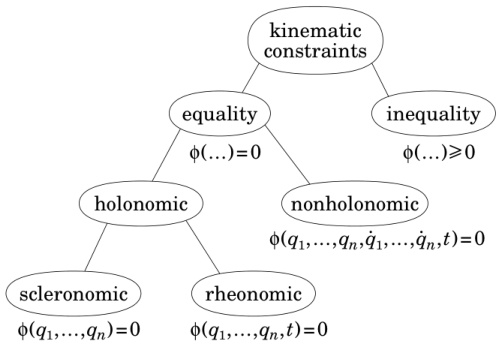{width=54%} Figure 3.1: Classification of kinematic constraints

sliding contact. The latter are constraints on the velocity variables, and arise typically from rolling contact. A nonholonomic constraint function, $\phi_{nh}$, is linear in the velocity variables, and can therefore be expressed in the form

$$
\phi _ { n h } ( \pmb { q } , \dot { \pmb { q } } , t ) = \phi _ { n h } ^{0} + \sum _ { i = 1 } ^{n} \phi _ { n h } ^{i} \, \dot { q } _ { i } \, ,
$$

where the coefficients $\phi_{nh}^{i}$ are functions of the position variables and time only. For comparison, the time derivative of a holonomic constraint function, $\phi_{h}$, is

$$
\frac { \mathrm { d } } { \mathrm { d } t } \phi _ { h } ( \pmb { q } , t ) = \frac { \partial \phi _ { h } } { \partial t } + \sum _ { i = 1 } ^{n} \frac { \partial \phi _ { h } } { \partial q _ { i } } \dot { q } _ { i } \, ,
$$

which has the same algebraic form. Thus, at the velocity and acceleration levels, there is no difference between holonomic and nonholonomic constraints. The big difference between these two equations is that Eq. 3.29 is nonintegrable; that is, $\phi_{nh}$ is not the derivative of any function, or else it would simply be a holonomic constraint expressed via its derivative.² The consequence of this property is that a system containing nonholonomic constraints has more positional degrees of freedom than velocity degrees of freedom, and therefore needs more position variables than velocity variables. If a rigid-body system contains at least one nonholonomic constraint, then it is called a nonholonomic system; otherwise, it is called a holonomic system. Thus, Eq. 3.1 can describe only a holonomic system, but Eq. 3.5 can describe both holonomic and nonholonomic systems.

The final distinction is between a scleronic constraint, which is a function of the position variables only, and a rheonomic constraint, which is a function

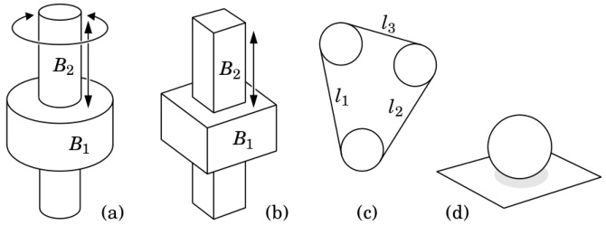{width=73%} Figure 3.2: Examples of kinematic constraints

also of time. Scleronomic constraints arise from sliding contact between a surface fixed in one body and a surface fixed in another. They are both the simplest and the most common kind of constraint in a typical mechanical system. Rheonomic constraints can be regarded as scleronomic constraints in which one or more sliding freedoms have been forced to vary as a prescribed function of time. The role of rheonomic constraints is to introduce kinematic excitations into a system; that is, prescribed motions.

Some examples of kinematic constraints are shown in Figure 3.2. Diagrams (a) and (b) show a cylindrical joint and a prismatic joint, respectively. Both are scleronomic constraints. The cylindrical joint allows body $B_{2}$ to slide and rotate relative to $B_{1}$, whereas the prismatic joint allows only a relative sliding motion. Thus, the cylindrical joint allows two degrees of motion freedom, while the prismatic joint allows only one. If we were to make one of the cylindrical joint's freedoms a prescribed function of time, then it would become a one-degree-of-freedom rheonomic constraint. If we were to do the same to the prismatic joint, then it would become a zero-degree-of-freedom rheonomic constraint (which is actually quite useful).

A kinematic constraint is nearly always a relationship between two bodies. However, it is possible to devise constraints that involve more than two bodies, and that cannot be reduced to a set of two-body constraints. An example is shown in Figure 3.2(c). This diagram shows a 2-D rigid-body system in which three identical circular bodies are constrained to lie within the perimeter of a massless, zero-diameter, inelastic string. Assuming the string stays taut, the three bodies are free to move in any way that satisfies the equation $l_{1} + l_{2} + l_{3} + 2\pi r = p$, where $p$ and $r$ are the perimeter of the string and the radius of a body, respectively.

Figure 3.2(d) shows a sphere resting on a planar surface. If this sphere is constrained to roll without slipping, then it has three degrees of instantaneous motion freedom: it can roll in two directions, and it can spin about the contact point. However, by a suitable sequence of manoeuvres, it is possible for the sphere to arrive at any point on the plane, with any orientation. It therefore

has five degrees of position freedom. This is the characteristic feature of a nonholonomic constraint. If the sphere were free to slide, then it would be a scleronomic constraint.

It is clear from the shapes of the bodies in Figure 3.2(a) and (b) that they cannot be pulled apart; but there is nothing that physically prevents the string in 3.2(c) from going slack, or the sphere in 3.2(d) from losing contact with the plane. If we know enough about the forces that will be acting on these systems to be sure that such an event will not occur, then it is possible to model these constraints as equality constraints; otherwise, they must be modelled as inequality constraints.

# 3.5 Joint Constraints

We define a joint to be a kinematic constraint between two bodies. Thus, a joint can impose anywhere from zero to six constraints on the relative velocity of a pair of rigid bodies. We call the two bodies the predecessor and the successor, and we say that the joint connects from the predecessor to the successor. The joint velocity, $v_{\mathrm{J}}$, is then defined to be the velocity of the successor relative to the predecessor:

$$
{ \boldsymbol { v } } _ { \mathrm { J } } = { \boldsymbol { v } } _ { s } - { \boldsymbol { v } } _ { p } \, ,
$$

where $v_{p}$ and $v_{s}$ are the velocities of the predecessor and successor bodies, respectively. The general form of the joint constraint is

$$
\begin{array}{r} { v _ { \mathrm { J } } = S ( q , t ) \, \dot { q } + \sigma ( q , t ) \, , } \end{array}
$$

where $\boldsymbol{S}$ is the joint's motion subspace matrix, $\boldsymbol{\sigma}$ is the bias velocity, $\boldsymbol{q}$ and $\dot{\boldsymbol{q}}$ are the joint's position and velocity variables, and $t$ is time. If the position variables are not the integrals of the velocity variables, then one must use a different symbol either for $\dot{\boldsymbol{q}}$ or for $\boldsymbol{q}$. The bias velocity is the value that $\boldsymbol{v}_{\mathrm{J}}$ takes when $\dot{\boldsymbol{q}}=\mathbf{0}$, and it has a nonzero value only if the joint depends explicitly on time (i.e., if it is a rheonomic or time-dependent nonholonomic constraint). If the joint does not depend on time, then Eq. 3.32 simplifies to

$$
v _ { \mathrm { J } } = S ( q ) \, \dot { q } \, .
$$

The effect of Eq. 3.32 is to confine the velocity $v_{\mathrm{J}}-\sigma$ to the subspace $S\subseteq\mathbb{M}^{6}$. If the joint allows $n_{f}$ degrees of relative motion freedom, then $\operatorname{dim}(S)=n_{f}$ and $S$ is a $6\times n_{f}$ matrix.³ The number of constraints imposed by the joint is $n_{c}=6-n_{f}$, and the constraint force must lie in the $n_{c}$-dimensional subspace $S^{\perp}\subseteq\mathbb{F}^{6}$.

Let $f_{\mathrm{J}}$ be the force transmitted across the joint. We define this to be the force transmitted from the predecessor to the successor; so the force acting on the successor is $f_{\mathrm{J}}$ and the force acting on the predecessor is $-f_{\mathrm{J}}$. This force can be regarded as the sum of an active force and a constraint force. The former comes from actuators, springs, dampers, or any other force element acting at the joint (or between the two bodies), and the latter is the force that imposes the motion constraint. At this point, we have a choice. The constraint force must be an element of the subspace $S^{\perp}$, but there are two ways to handle the active force: it can be treated either as a known spatial force, or as a generalized force mapped onto a subspace of $\mathbf{F}^{6}$. We shall choose the latter here.

Let $T$ and $T_a$ be the constraint and active force subspaces, respectively. By definition, $T = S^\perp$, but $T_a$ can be any subspace that satisfies $T \oplus T_a = \mathbf{F}^6$. We can now express $f_j$ in the form

$$
f _ { \mathrm { J } } = T _ { a } \tau + T \lambda \, ,
$$

where $T_{a}\tau$ is the active force, $T\lambda$ is the constraint force, $T_{a}$ and $T$ satisfy

$$
T _ { a } ^{\mathrm { T} } S = 1
$$

and

$$
T ^{\mathrm { T} } S = 0 \ ,
$$

$\tau$ is the generalized force vector corresponding to $\dot{\boldsymbol{q}}$, and $\boldsymbol{\lambda}$ is a vector of constraint force variables. Given the properties of $\boldsymbol{T}_{a}$ and $\boldsymbol{T}$, we can immediately deduce that

$$
S ^{\mathrm { T} } f _ { \mathrm { J } } = \tau
$$

and

$$
T ^{\mathrm { T} } v _ { \mathrm { J } } = T ^{\mathrm { T} } \sigma \, .
$$

Equation 3.37 is the formula for obtaining the generalized force at a joint from the spatial force transmitted across it; and Eq. 3.38 is the implicit form of the velocity constraint equation.

The justification for Eq. 3.35 is as follows. The total power delivered by the joint is $f_{\mathrm{J}} \cdot v_{\mathrm{J}}$, but this comes from two independent power sources: $\sigma$ and $\tau$. The power attributable to $\sigma$ is $f_{\mathrm{J}} \cdot \sigma$, so the power attributable to $\tau$ must be $f_{\mathrm{J}} \cdot S \dot{q}$. Now, this second power must also be equal to $\tau \cdot \dot{q}$ because they are the generalized force and velocity vectors at the joint, so we have the following power balance equation:

$$
\boldsymbol { \tau } \cdot \dot { \boldsymbol { q } } = f _ { \mathrm { J } } \cdot \boldsymbol { S } \dot { \boldsymbol { q } } = \boldsymbol { \tau } ^{\mathrm { T} } \boldsymbol { T } _ { a } ^{\mathrm { T} } \boldsymbol { S } \dot { \boldsymbol { q } } \, ;
$$

but this equation must be true for all $\tau$ and $\dot{q}$, so we must have $T_{a}^{\mathrm{T}}S=1$.

The joint's acceleration constraint equations are obtained directly from Eqs. 3.32 and 3.38 by differentiation. The derivative of Eq. 3.32 is

$$
\begin{array}{rl} { a _ { \mathrm { J } } = } & { S \ddot { q } + \dot { S } \dot { q } + \dot { \sigma } } \\{ = } & { S \ddot { q } + ( \dot { S } + v _ { s } \times S ) \dot { q } + ( \dot { \sigma } + v _ { s } \times \sigma ) } \\{ = } & { S \ddot { q } + \dot { S } \dot { q } + \dot { \sigma } + v _ { s } \times ( S \dot { q } + \sigma ) } \\{ = } & { S \ddot { q } + c _ { \mathrm { J } } + v _ { s } \times v _ { \mathrm { J } } \, , } \end{array}
$$

where $\dot{S}$ and $\dot{\sigma}$ are the apparent derivatives of $S$ and $\sigma$ in a coordinate system that is moving with the successor body, and

$$
c _ { \mathrm { J } } = \stackrel { \circ } { S } \dot { q } + \stackrel { \circ } { \sigma } .
$$

(Actually, $c_{\mathrm{J}}=\dot{v}_{\mathrm{J}}$.) If $S$ and $\sigma$ are functions of $q$ and $t$, as shown in Eq. 3.32, then the general formulae for $\dot{S}$ and $\dot{\sigma}$ are

$$
\stackrel { \circ } { S } = \frac { \partial S } { \partial t } + \sum _ { i = 1 } ^{n _ { p} } \frac { \partial S } { \partial q _ { i } } \stackrel { \cdot } { q _ { i } }
$$

and

$$
\dot { \sigma } = \frac { \partial \sigma } { \partial t } + \sum _ { i = 1 } ^{n _ { p} } \frac { \partial \sigma } { \partial q _ { i } } \, \dot { q } _ { i } \ ,
$$

where $n_{p}$ is the number of joint position variables.

Before moving on, readers should bear in mind that the relatively complicated equations above apply to a general case that is almost never needed in practice. This is partly because most common joint types have the property that $\dot{S} = \mathbf{0}$ and $\sigma = \mathbf{0}$ (implying $c_{\mathrm{J}} = \mathbf{0}$), and partly because on the rare occasions when one encounters an explicit time dependency in a joint (i.e., a joint for which $\sigma \neq \mathbf{0}$), it is almost always possible to implement the time-dependent term via the hybrid dynamics algorithms of Chapter 9 rather than using $\sigma$.

Finally, the implicit acceleration constraint equation can be obtained either by differentiating Eq. 3.38 or by multiplying Eq. 3.40 by $T^{\mathrm{T}}$. Both give the same result, but the latter is easier:

$$
\begin{array}{r} { T ^{\mathrm { T} } a _ { \mathrm { J } } = \, T ^{\mathrm { T} } ( S \ddot { q } + c _ { \mathrm { J } } + v _ { s } \times v _ { \mathrm { J } } ) } \\{ = \, T ^{\mathrm { T} } ( c _ { \mathrm { J } } + v _ { s } \times v _ { \mathrm { J } } ) \, . } \end{array}
$$

Example 3.2 Let us examine how to define an active force subspace. Figure 3.3 shows a system comprising a moving body, $B$, that is connected to a fixed base via a revolute joint, and a motor, $M$, that drives this joint via a pinion and gear wheel. The $x$ and $y$ axes of a coordinate frame are also shown, the $z$ axis

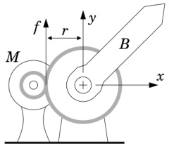{width=26%} Figure 3.3: Defining an active force subspace

being aligned with the joint's rotation axis. Expressed in these coordinates, the joint's motion and constraint-force subspace matrices are

$$
S = \left[ \begin{array}{lllll} { 0 } & { } & { } & { } & { } \\{ 0 } & { } & { } & { } & { } \\{ 1 } & { } & { } & { } & { } \\{ 0 } & { } & { } & { } & { } \\{ 0 } & { } & { } & { } & { } \end{array} \right]  a n d  T = \left[ \begin{array}{lllll} { 1 } & { 0 } & { 0 } & { 0 } & { 0 } \\{ 0 } & { 1 } & { 0 } & { 0 } & { 0 } \\{ 0 } & { 0 } & { 0 } & { 0 } & { 0 } \\{ 0 } & { 0 } & { 1 } & { 0 } & { 0 } \\{ 0 } & { 0 } & { 0 } & { 1 } & { 0 } \\{ 0 } & { 0 } & { 0 } & { 0 } & { 1 } \end{array} \right]
$$

Strictly speaking, these are not the only possible values for $S$ and $T$, since any two matrices that span the correct subspaces would do.

The active force is transmitted to $B$ at the point where the two gears touch, and it is a linear force of magnitude $f$ in the $y$ direction. The coordinates of the contact point are $(-r,0,0)$, where $r$ is the radius of the gear wheel, so the Plücker coordinates of the active spatial force are $f=[0\ 0\ -rf\ 0\ f\ 0]^\text{T}$. Now, $\boldsymbol{\tau}$ is just a scalar in this example, so if $f=T_a\boldsymbol{\tau}$ then $\boldsymbol{T}_a$ is just a scalar multiple of $f$. From Eq. 3.35 we have that $\boldsymbol{T}_a$ must satisfy $\boldsymbol{T}_a^\text{T}\boldsymbol{S}=\boldsymbol{1}$, so the solution is simply

$$
T _ { a } = f / ( f ^{\mathrm { T} } S ) = \left[ \begin{array}{l} { { 0 } } \\{ { 0 } } \\{ { 1 } } \\{ { 0 } } \\{ { - 1 / r } } \\{ { 0 } } \end{array} \right] .
$$

Observe that both $\mathbf{T}_{a}$ and range($\mathbf{T}_{a}$) depend on $r$. This dependency has no effect on the equation of motion, but it does affect the value of the constraint force. Physically, the constraint force comes from the joint's bearings. Thus, if the task is to simulate the motion of the system, then $r$ is irrelevant; but if the task is to select appropriate bearings for the joint, then the value of $r$ must be taken into account.

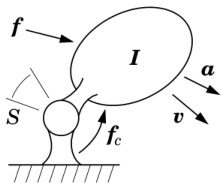{width=24%} Figure 3.4: A constrained rigid body

# 3.6 Dynamics of a Constrained Rigid Body

Consider the rigid body shown in Figure 3.4. This body is connected to a fixed base by a joint having a motion subspace of $S \subseteq \mathbb{M}^6$. The joint imposes $n_c$ constraints on the motion of the body, leaving it with $n_f$ degrees of motion freedom, where $n_f = \dim(S)$ and $n_c = 6 - n_f = \dim(S^+)$. Three forces act on this body: an applied force, $f$, a constraint force, $f_c$, and a gravity force, $f_g$, which is not shown. The equation of motion for this body is therefore

$$
f + f _ { c } + f _ { g } = I a + v \times ^{*} I v _ { \gamma } ,
$$

where $I$, $a$ and $v$ are the body's inertia, acceleration and velocity, respectively. We are not particularly interested in the individual terms $f_g$ and $v \times^* I v$, so we collect them into a single bias-force term, $p = v \times^* I v - f_g$. The equation of motion for the constrained rigid body is then

$$
f + f _ { c } = I a + p \, ,
$$

subject to the constraints

$$
v \in S  \mathrm { a n d }  f _ { c } \in S ^{\perp} \, .
$$

We seek a solution to this system of equations in which the acceleration is given as a function of the applied force. Note that $f_{c}$ is an unknown quantity, and must be evaluated and/or eliminated as part of the solution process.

# Method 1

Let us introduce a $6 \times n_{f}$ matrix, $\mathcal{S}$, that spans the subspace $\mathcal{S}$. With this matrix, the constraint equations in Eq. 3.46 can be written in the form

$$
v = S \, \dot { q }
$$

and

$$
S ^{\mathrm { T} } f _ { c } = 0 \, ;
$$

and the acceleration constraint is

$$
a = S \ddot { q } + \dot { S } \dot { q } \, ,
$$

where $\dot{\boldsymbol{q}}$ and $\ddot{\boldsymbol{q}}$ are vectors of joint velocity and acceleration variables, respectively. Equation 3.48 implies that we can eliminate $\boldsymbol{f}_{c}$ from Eq. 3.45 by multiplying both sides by $\boldsymbol{S}^{\mathrm{T}}$, giving

$$
S ^{\mathrm { T} } f = S ^{\mathrm { T} } ( I \, a + p ) \, .
$$

Substituting Eq. 3.49 into this equation produces

$$
S ^{\mathrm { T} } f = S ^{\mathrm { T} } ( I \left( S \ddot { q } + \dot { S } \dot { q } \right) + p ) \, ,
$$

which can be solved for $\ddot{q}$ as follows:

$$
\ddot { q } = ( S ^{\mathrm { T} } I S ) ^{- 1} S ^{\mathrm { T} } ( f - I \dot { S } \dot { q } - p ) \, .
$$

The expression $S^{\mathrm{T}}IS$ is an $n_{f} \times n_{f}$ symmetric, positive-definite matrix, and is therefore guaranteed to be invertible. Having found an expression for $\ddot{q}$, the final step is to substitute Eq. 3.51 back into Eq. 3.49, giving

$$
a = S \left( S ^{\mathrm { T} } I S \right) ^{- 1} S ^{\mathrm { T} } ( f - I \dot { S } \dot { q } - p ) + \dot { S } \dot { q } .
$$

This equation can be written in the form

$$
a = \Phi \, f + b \, ,
$$

where

$$
\boldsymbol { \Phi } = \boldsymbol { S } \left( \boldsymbol { S } ^{\mathrm { T} } \boldsymbol { I } \boldsymbol { S } \right) ^{- 1} \boldsymbol { S } ^{\mathrm { T} }
$$

and

$$
b = \dot { S } \, \dot { q } - \Phi ( I \, \dot { S } \, \dot { q } + p ) \, .
$$

$\Phi$ is the constrained body's apparent inverse inertia, and $\boldsymbol{b}$ is its bias acceleration, which is the acceleration it would have if $\boldsymbol{f}=\boldsymbol{0}$. The apparent inverse inertia describes how the acceleration would change in response to a change in the applied force. It is a symmetric, positive-semidefinite matrix with the following properties: range($\boldsymbol{\Phi}$) = $S$, null($\boldsymbol{\Phi}$) = $S^{\perp}$ and rank($\boldsymbol{\Phi}$) = $n_{f}$.

# Method 2

Another way to solve the system of equations in Eqs. 3.45 and 3.46 is to introduce a $6 \times n_{c}$ matrix, $\boldsymbol{T}$, that spans $S^{\perp}$. With this matrix, the constraint equations can be written in the form

$$
T ^{\mathrm { T} } v = 0
$$

and

$$
f _ { c } = T \lambda \, ,
$$

where $\lambda$ is a vector of constraint force variables, and the acceleration constraint is

$$
T ^{\mathrm { T} } a + \dot { T } ^{\mathrm { T} } v = 0 \, .
$$

Substituting Eq. 3.57 into Eq. 3.45 gives

$$
f + T \lambda = I \, a + p \, .
$$

Equations 3.58 and 3.59 can then be combined into a single equation,

$$
\left[ \begin{array}{ll} { I } & { T } \\{ T ^{\mathrm { T} } } & { 0 } \end{array} \right] \left[ \begin{array}{l} { a } \\{ - \lambda } \end{array} \right] = \left[ \begin{array}{l} { f - p } \\{ - \dot { T } ^{\mathrm { T} } v } \end{array} \right] ,
$$

which can be solved for $a$ and $\lambda$. The coefficient matrix in this equation is symmetric and nonsingular, but not positive definite.

# Method 3

A third possibility is to derive an equation of motion expressed in generalized coordinates. The vectors $\dot{\boldsymbol{q}}$ and $\ddot{\boldsymbol{q}}$ can be used as the generalized velocity and acceleration variables of the constrained rigid body, so Eq. 3.51 already gives the generalized acceleration as a function of the applied spatial force, $\boldsymbol{f}$. Let $\boldsymbol{\tau}$ denote the generalized force acting on the body. For $\boldsymbol{\tau}$ to be equivalent to $\boldsymbol{f}$, both forces must deliver the same power for any velocity in $S$. The power delivered by $\boldsymbol{\tau}$ is $\boldsymbol{\tau}^{\mathrm{T}} \dot{\boldsymbol{q}}$, and that delivered by $\boldsymbol{f}$ is $\boldsymbol{f}^{\mathrm{T}} \boldsymbol{v}$, so we have

$$
\boldsymbol { \tau } ^{\mathrm { T} } \dot { \boldsymbol { q } } = \boldsymbol { f } ^{\mathrm { T} } \boldsymbol { v } = \boldsymbol { f } ^{\mathrm { T} } \boldsymbol { S } \, \dot { \boldsymbol { q } } \, ;
$$

but this equation must hold for all $\dot{q}$, so

$$
\tau = S ^{\mathrm { T} } f \, .
$$

Substituting this equation into Eq. 3.51 gives

$$
\ddot { q } = ( S ^{\mathrm { T} } I S ) ^{- 1} ( \tau - S ^{\mathrm { T} } ( I \dot { S } \dot { q } + p ) ) \, ,
$$

which is the equation of motion for the constrained rigid body, expressed in generalized coordinates. It can be written in the standard form

$$
H \ddot { q } + C = \tau \ ,
$$

where

$$
H = S ^{\mathrm { T} } I S
$$

is the generalized inertia matrix and

$$
C = S ^{\mathrm { T} } ( I \, \dot { S } \, \dot { q } + p )
$$

is the generalized bias force.

Equation 3.61 implies a small loss of information in going from $f$ to $\tau$. Infinitely many different values of $f$ map to the same value of $\tau$, and therefore produce the same acceleration, but each produces a different value of $f_{c}$. If only $\tau$ is known, then it is possible to work out the value of the sum $f + f_{c}$, but not the values of the individual vectors. If the objective is motion simulation, then the lost information is irrelevant; but if the objective is to design a mechanical system, then the lost information is relevant to tasks like calculating the dynamic load forces on the joint bearings.

# 3.7 Dynamics of a Multibody System

We conclude this chapter by developing an equation of motion for a system containing multiple bodies and joints. This analysis shows the connection between the joint-related material in Sections 3.5 and 3.6 and the generalized constraints in Section 3.2, by showing how the latter can be constructed from the former.

Suppose we have a rigid-body system containing the following elements: a fixed base, which we regard as body number zero; $N_{B}$ mobile rigid bodies, which are numbered 1 to $N_{B}$; and $N_{J}$ joints, which are numbered 1 to $N_{J}$. For each joint $j$, we define $p(j)$ and $s(j)$ to be the body numbers of the predecessor and successor bodies of that joint. This set of $2N_{J}$ numbers defines the connectivity of the system. For the analysis to follow, we make no restrictions on the connectivity.

In formulating the equation of motion, we shall follow Method 2 in Section 3.6, but with extra steps where necessary because of the greater complexity of the current system.

# Step 1: Body Equations of Motion

We assume that the only forces acting on body $i$ are the force of gravity, $f_{gi}$, and forces from the joints that are connected to it. The equation of motion for body $i$ can then be written

$$
f _ { i } = I _ { i } \, a _ { i } + p _ { i } \, ,
$$

where $f_{i}$ is the sum of the joint forces acting on body $i$, and $p_{i} = v_{i} \times^{*} I_{i} v_{i} - f_{gi}$ is the bias force. The equations for all $N_{B}$ bodies can be assembled into a single equation,

$$
\left[ \begin{array}{l} { f _ { 1 } } \\{ f _ { 2 } } \\{ \vdots } \\{ f _ { N _ { B } } } \end{array} \right] = \left[ \begin{array}{llll} { I _ { 1 } } & { 0 } & { \cdots } & { 0 } \\{ 0 } & { I _ { 2 } } & { \cdots } & { 0 } \\{ \vdots } & { \vdots } & { \ddots } & { \vdots } \\{ 0 } & { 0 } & { \cdots } & { I _ { N _ { B } } } \end{array} \right] \left[ \begin{array}{l} { a _ { 1 } } \\{ a _ { 2 } } \\{ \vdots } \\{ a _ { N _ { B } } } \end{array} \right] + \left[ \begin{array}{l} { p _ { 1 } } \\{ p _ { 2 } } \\{ \vdots } \\{ p _ { N _ { B } } } \end{array} \right] .
$$

We can express this equation more compactly as

$$
f = I \, a + p \, ,
$$

where $f$, $a$ and $p$ are $6N_{B}$-dimensional vectors, and $I$ is a $6N_{B} \times 6N_{B}$ block-diagonal matrix. For completeness, we also define $v = [\boldsymbol{v}_{1}^{\mathrm{T}} \boldsymbol{v}_{2}^{\mathrm{T}} \cdots \boldsymbol{v}_{N_{B}}^{\mathrm{T}}]^{\mathrm{T}}$, where $\boldsymbol{v}_{i}$ is the velocity of body $i$, as this vector will be needed in the joint constraint equation.

# Step 2: Joint Motion from Body Motion

The vector $a$ in Eq. 3.66 is a vector of body accelerations; but the constraints imposed by the joints are expressed in terms of joint velocities and accelerations. Therefore, we need a formula to express joint motion in terms of body motion. Let $v_{Jj}$ and $a_{Jj}$ denote the velocity and acceleration, respectively, across joint $j$; and let $v_{J}$ and $a_{J}$ be the $6N_{J}$-dimensional vectors formed by concatenating $v_{J1} \cdots v_{JN_{J}}$ and $a_{J1} \cdots a_{JN_{J}}$, respectively. By definition, $v_{Jj}$ and $a_{Jj}$ are the velocity and acceleration of the joint's successor body relative to its predecessor; so

$$
{ \boldsymbol { v } } _ { \mathrm { J } j } = { \boldsymbol { v } } _ { s ( j ) } - { \boldsymbol { v } } _ { p ( j ) }
$$

and

$$
a _ { \mathrm { J } j } = a _ { s ( j ) } - a _ { p ( j ) } .
$$

These equations can be collected together and expressed as follows:

$$
\pmb { v } _ { \mathrm { J } } = \left[ \begin{array}{l} { \pmb { v } _ { \mathrm { J } 1 } } \\{ \vdots } \\{ \pmb { v } _ { \mathrm { J } N _ { J } } } \end{array} \right] = \left[ \begin{array}{l} { \pmb { v } _ { s ( 1 ) } - \pmb { v } _ { p ( 1 ) } } \\{ \vdots } \\{ \pmb { v } _ { s ( N _ { J } ) } - \pmb { v } _ { p ( N _ { J } ) } } \end{array} \right] = \pmb { P } ^{\mathrm { T} } \pmb { v }
$$

and

$$
a _ { J } = \left[ \begin{array}{l} { a _ { J 1 } } \\{ \vdots } \\{ a _ { J N _ { J } } } \end{array} \right] = \left[ \begin{array}{l} { a _ { s ( 1 ) } - a _ { p ( 1 ) } } \\{ \vdots } \\{ a _ { s ( N _ { J } ) } - a _ { p ( N _ { J } ) } } \end{array} \right] = P ^{\mathrm { T} } a \, ,
$$

where

$$
P _ { i j } = \left\{ \begin{array}{ll} { { \mathbf { 1 } _ { 6 \times 6 } } } & { { \mathrm { i f ~ } i = s ( j ) } } \\{ { - \mathbf { 1 } _ { 6 \times 6 } } } & { { \mathrm { i f ~ } i = p ( j ) } } \\{ { \mathbf { 0 } _ { 6 \times 6 } } } & { { \mathrm { o t h e r w i s e } . } } \end{array} \right.
$$

$P$ is therefore a $6N_{B} \times 6N_{J}$ matrix, which is organized as an $N_{B} \times N_{J}$ block matrix of $6 \times 6$ blocks, and it maps the vectors of collected body velocities and accelerations ($\boldsymbol{v}$ and $\boldsymbol{a}$) to the vectors of collected joint velocities and accelerations ($\boldsymbol{v}_{J}$ and $\boldsymbol{a}_{J}$). Each row$^{4}$ in $P$ corresponds to a body, and each column to a joint. (Observe that we are using $i$ as a body-number index and $j$ as a joint-number index.) Each column contains at most two nonzero blocks: a $\mathbf{1}$ in the row corresponding to the joint's successor body and a $-1$ in the row corresponding to its predecessor. If a joint connects between two moving bodies, then it will have exactly two nonzero blocks in its column, as just described.

However, if it connects to or from the fixed base (body 0), then its column will contain only one nonzero block: a $\mathbf{1}$ or $-\mathbf{1}$, as appropriate, in the row for the moving body it connects to/from. Each row $i$ will contain a $\mathbf{1}$ for each joint that has body $i$ as its successor, and a $-\mathbf{1}$ for each joint that has body $i$ as its predecessor.

# Step 3: Body Forces from Joint Forces

Let $f_{J_{j}}$ be the force transmitted across joint $j$, and let $f_{J}$ be the $6N_{J}$-dimensional vector formed by concatenating the vectors $f_{J_{1}}\cdots f_{J_{N_{J}}}$. By definition, $f_{J_{j}}$ is the force transmitted from body $p(j)$ to body $s(j)$ through joint $j$. If we were to define the sets $s^{-1}(i)$ and $p^{-1}(i)$ to be the sets of all joints having body $i$ as their successor or predecessor, respectively, then the vector $f_{i}$ (which was defined earlier to be the sum of all joint forces acting on body $i$) could be expressed in the following manner:

$$
f _ { i } = \sum _ { j \in s ^{- 1} ( i ) } f _ { \mathrm { J } j } - \sum _ { j \in p ^{- 1} ( i ) } f _ { \mathrm { J } j } .
$$

However, on comparing this expression with the description of row $i$ of $P$, it is clear that we could also express $f_i$ as follows:

$$
f _ { i } = \sum _ { j = 1 } ^{N _ { J} } P _ { i j } f _ { \mathrm { J } j } \, .
$$

Therefore

$$
f = P f _ { \mathrm { J } } \, .
$$

# Step 4: Motion Constraints

Let $T_{j}$ be the $6 \times n_{cj}$ matrix that spans the subspace $S_{j}^{\perp}$, where $S_{j}$ is the motion subspace for joint $j$ and $n_{cj}$ is the number of constraints it imposes. The velocity constraint equation for joint $j$ can then be written

$$
T _ { j } ^{\mathrm { T} } v _ { \mathrm { J } j } = 0 \, ,
$$

and the acceleration constraint is

$$
T _ { j } ^{\mathrm { T} } a _ { \mathrm { J } j } + \dot { T } _ { j } ^{\mathrm { T} } v _ { \mathrm { J } j } = 0 \, .
$$

Collecting together the acceleration constraints gives

$$
T ^{\mathrm { T} } a _ { \mathrm { J } } + \dot { T } ^{\mathrm { T} } v _ { \mathrm { J } } = 0 \, ,
$$

where $T$ is the $6N_J \times n_c$ block-diagonal matrix having $T_j$ in its $j^{\text{th}}$ diagonal block. $n_c$ is the total number of constraints imposed by the joints, and is given by $n_c = \sum_{j=1}^{N_J} n_{cj}$. Combining Eq. 3.71 with Eqs. 3.67 and 3.68 yields the following constraint on the body accelerations:

$$
T ^{\mathrm { T} } P ^{\mathrm { T} } a + \dot { T } ^{\mathrm { T} } P ^{\mathrm { T} } v = 0 \, .
$$

# Step 5: Constraint Forces

$f_{J_{j}}$ is the sum of an active force and a constraint force, and it can be expressed in the form

$$
f _ { \mathrm { J } j } = T _ { a j } \tau _ { j } + T _ { j } \lambda _ { j }
$$

(see Eq. 3.34). In this equation, $\mathcal{T}_{aj}$ is the $6 \times n_{fj}$ matrix that spans the active-force subspace for joint $j$, $\boldsymbol{\tau}_{j}$ is the $n_{fj}$-dimensional vector of generalized forces at joint $j$, $\boldsymbol{\lambda}_{j}$ is the $n_{cj}$-dimensional vector of constraint-force variables, and $n_{fj} = 6 - n_{cj}$ is the number of motion freedoms allowed by joint $j$. Collecting the equations for every joint, we have

$$
f _ { \mathrm { J } } = T _ { a } \tau + T \lambda \, ,
$$

where $\tau$ and $\lambda$ are the vectors formed by concatenating $\tau_{1} \cdots \tau_{N_{J}}$ and $\lambda_{1} \cdots \lambda_{N_{J}}$, respectively, and $\mathbf{T}_{a}$ is the block-diagonal matrix having $\mathbf{T}_{aj}$ on its $j^{\text{th}}$ diagonal block.

# Step 6: Final Equation

Substituting Eqs. 3.70 and 3.73 into 3.66 produces the following equation of motion:

$$
P ( T _ { a } \tau + T \lambda ) = I \, a + p ;
$$

and combining this with Eq. 3.72 produces

$$
\left[ \begin{array}{ll} { I } & { P T } \\{ T ^{\mathrm { T} } P ^{\mathrm { T} } } & { 0 } \end{array} \right] \left[ \begin{array}{l} { a } \\{ - \lambda } \end{array} \right] = \left[ \begin{array}{l} { P T _ { a } \tau - p } \\{ - \dot { T } ^{\mathrm { T} } P ^{\mathrm { T} } v } \end{array} \right] .
$$

This is the equation of motion for the original rigid-body system. The two unknowns are $a$ and $\lambda$, and the equation can be solved uniquely for $a$. If the coefficient matrix is nonsingular, then $\lambda$ is also unique. On comparing the equations here with those in Section 3.2, it can be seen that $T^{\mathrm{T}}P^{\mathrm{T}}$ and $-T^{\mathrm{T}}P^{\mathrm{T}}v$ here are equivalent to $K$ and $k$ in Eq. 3.11, that $I$, $a$ and $p$ here are equivalent to $H$, $\ddot{q}$ and $C$ in Eq. 3.14, that $PT_{a}\tau$ and $PT\lambda$ are equivalent to $\tau$ and $\tau_{c}$ in Eq. 3.14, and that Eq. 3.74 as a whole is equivalent to Eq. 3.17.

# Discussion

Equation 3.74 is a viable basis for a dynamics algorithm, but there are several details that would need to be resolved in the process of designing the algorithm. For example, the velocity and acceleration variables are clearly the Plücker coordinates of the velocity and acceleration vectors of the individual bodies, but in what coordinate system? No mention has been made of the position variables, or of how to calculate $I$, $T$, $T_a\tau$ or $\dot{T}^{\mathrm{T}}v$. Another issue is how to solve Eq. 3.74. The coefficient matrix is large, but it is also sparse, and using a sparse factorization procedure would greatly improve the efficiency. However, if the constraints in Eq. 3.72 are not all linearly independent, then the coefficient

matrix will be singular, in which case it will be necessary to use a solution procedure that works with singular matrices. Finally, there is the problem of constraint stabilization: as Eq. 3.72 specifies the motion constraints at the acceleration level, it is possible for errors to accumulate in the position and velocity constraints, due to numerical rounding and truncation errors during simulation. This problem is discussed in Section 8.3.

# Chapter 4

# Modelling Rigid Body Systems

A rigid-body system is an assembly of component parts. Those components include rigid bodies, joints and various force elements. The joints are responsible for the kinematic constraints in the system, so we interpret the term 'joint' broadly to mean any possible kinematic relationship between a pair of rigid bodies. In this chapter, we look at ways of describing a rigid-body system in terms of its component parts. In particular, we seek to describe systems consisting solely of bodies and joints. Such a description can be called a system model, on the grounds that it describes the system itself, rather than some aspect of its behaviour.

The role of the system model can be understood as follows. Suppose we wish to calculate the dynamics of a given rigid-body system on a computer. There are basically two ways to proceed:

work out the symbolic equations of motion of the given system, and translate these equations into computer code; or

construct a system model describing the given system, and supply it as an argument to either

(a) a model-based dynamics calculation routine, or

(b) a model-based automatic equation (and code) generator.

The second approach is preferable, partly because it is much easier to construct and modify a system model than to work out manually the equations of motion, and partly because a model-based routine can be thoroughly debugged and optimized in anticipation of being used a large number of times. The dynamics algorithms in this book are model-based, and expect to be given a system model along the lines described in this chapter. Approach 2(b) is considered in Section 10.4.

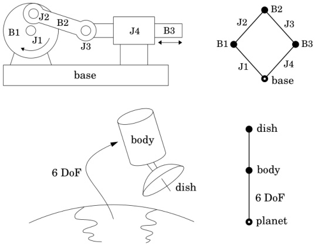{width=59%} Figure 4.1: Connectivity graphs of two rigid-body systems

# 4.1 Connectivity

A system model must contain the following data: a description of the component parts, and a description of how they are connected together. The latter is referred to as the system's topology, or connectivity, and it can be expressed in the form of a connectivity graph having the following properties:

The nodes represent bodies.

The arcs represent joints.

Exactly one node represents a fixed body, which is known as the base. All other nodes represent moving bodies.

The graph is undirected.

The graph is connected (i.e., a path exists between any two nodes).

The term 'moving body' includes any body that is capable of moving, whether or not it actually moves. Thus, a body that has been immobilized by kinematic constraints would count as a moving body. From here on, the term and 'graph' should be taken to mean 'undirected graph', unless indicated otherwise.

Some examples of connectivity graphs are shown in Figure 4.1. The first is a simple planar mechanism called a crank slider linkage. It consists of three moving bodies (B1 to B3), a fixed base, three revolute joints (J1 to J3) and one prismatic joint (J4). Rotation of body B1 (the crank) causes B3 to slide back and forth relative to the base. In the connectivity graph, each node represents

one body, and each arc one joint. It is usually necessary to label at least some of the nodes and arcs, so that the correspondence between the graph and the original mechanism is clear. In addition, it is sometimes useful to make the base node stand out from the others, for easy visual identification. We accomplish this by marking the base node with a white dot. Note that the bodies in a mechanism are usually called links.

The second example is a satellite in orbit. The satellite itself consists of two moving bodies and one joint. However, we cannot construct a connectivity graph directly from this two-body system, as rule 3 requires that one node must represent a fixed base. We therefore add a third body—in this case, the planet below—to serve as a fixed base. Having added a third body, rule 5 requires that we also add a second joint, in order to connect the planet to one of the other two bodies. As there is no physical connection between the satellite and the planet, we use a special joint that allows six degrees of motion freedom—a 6-DoF joint. This joint imposes no kinematic constraints, and therefore has no physical effect on the system. Its role is to define additional joint variables, so that the position and velocity variables for the system as a whole can be drawn from the position and velocity variables of the joints it contains. In this case, the satellite has a total of $6 + n_s$ degrees of freedom, where $n_s$ is the degree of freedom allowed by the joint on the satellite. We therefore need a total of $6 + n_s$ velocity variables, and that is exactly the number defined by the two joints.

A body that is connected to a fixed base via a 6-DoF joint is called a floating base. In this example, the satellite's body was chosen as the floating base, but we could have chosen the dish instead.

# 4.1.1 Kinematic Trees and Loops

A graph is a topological tree if there exists exactly one path between any two nodes in the graph. If the connectivity graph of a rigid-body system is a topological tree, then we call the system itself a kinematic tree. The satellite in Figure 4.1 is a kinematic tree, but the crank slider linkage is not. Kinematic trees have special properties that make it easy to calculate their dynamics efficiently.

Let $G$ be any connectivity graph. A spanning tree of $G$, denoted $G_t$, is a subgraph of $G$ containing all of the nodes in $G$, together with any subset of the arcs in $G$ such that $G_t$ is a topological tree. Every connectivity graph has at least one spanning tree. If $G$ itself is a tree, then $G_t = G$; otherwise, $G_t$ is a proper subgraph of $G$ and is not unique. Figure 4.2 shows some examples of spanning trees.

A topological tree with $n$ nodes has $n-1$ arcs. Therefore, if $G$ contains $n_n$ nodes and $n_a$ arcs, then $G_t$ will contain $n_n$ nodes and $n_n-1$ arcs, implying that there will be $n_a-n_n+1$ arcs that are in $G$ but not in $G_t$. These non-tree arcs are called chords. Although the number of chords in $G$ is fixed, the set of arcs that happen to be chords will vary with the choice of $G_t$. This variation is illustrated in Figure 4.2. (We distinguish chords from tree arcs by drawing them with dashed lines.)

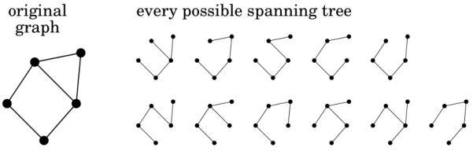{width=66%}

chords and their cycles

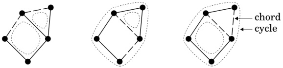{width=63%} Figure 4.2: Spanning trees, chords and cycles

A cycle is a closed path in a graph. There are no cycles in a tree, so every cycle in a graph must traverse at least one chord. We are particularly interested in those cycles that traverse exactly one chord. There is always exactly one such cycle for each chord in the graph, but its route depends on the choice of spanning tree. For example, the graph in Figure 4.2 has two chords and three cycles. For any choice of spanning tree, two of these cycles are one-chord cycles, and the third (which is not shown) traverses both chords. The path of a one-chord cycle consists of the one chord it traverses, together with the unique path in the spanning tree between the two nodes connected by the chord.

Each cycle in a connectivity graph defines a kinematic loop. However, we are not interested in them all, but only in the independent kinematic loops. This is the minimal set of loops that must be taken into account when formulating the equations of motion. The importance of the one-chord cycles is that they identify the set of independent kinematic loops. If we describe a rigid-body system as having $n$ kinematic loops, then what we really mean is that it has $n$ independent kinematic loops.

Consider a rigid-body system comprising a fixed base, $N_{B}$ moving bodies and $N_{J}$ joints, the latter including any 6-DoF joints that were added to ensure that the connectivity graph was connected. Let $G$ be the connectivity graph of this system, and let $G_{t}$ be a spanning tree of $G$. Both graphs will contain $N_{B}+1$ nodes. However, $G$ will contain $N_{J}$ arcs, whereas $G_{t}$ will contain only $N_{B}$, so the number of chords in the system is $N_{J}-N_{B}$. The number of independent kinematic loops in the system, $N_{L}$, equals the number of chords in $G$, and is therefore given by the formula

$$
N _ { L } \, = \, N _ { J } - N _ { B } \, .
$$

Applying this formula to the crank-slide linkage in Figure 4.1 reveals that it has one kinematic loop.

If a system has kinematic loops, then it is called a closed-loop system, otherwise it is a kinematic tree. The joints associated with the chords are known as loop joints, or loop-closing joints, and those that are part of the spanning tree are tree joints. A rigid-body system therefore has $N_{B}$ tree joints and $N_{L}$ loop joints.

# 4.1.2 Numbering

Bodies and joints can be identified in various ways, but the most convenient way is to number them. We shall use a numbering scheme that is well suited to describing and implementing dynamics algorithms. According to this scheme, the bodies are numbered from 0 to $N_B$, the joints from 1 to $N_J$, and the numbers are assigned according to the following rules.

Choose a spanning tree, $G_t$.

Assign the number 0 to the node representing the fixed base, and define this node to be the root node of $G_t$.

Number the remaining nodes from 1 to $N_B$ in any order such that each node has a higher number than its parent in $G_t$.

Number the arcs in $G_t$ from 1 to $N_B$ such that arc $i$ connects between node $i$ and its parent.

Number all remaining arcs from $N_B + 1$ to $N_J$ in any order.

Each body gets the same number as its node, and each joint gets the same number as its arc.

This scheme is called regular numbering. If these rules are applied to an unbranched kinematic tree (a tree in which no node has more than one child), then the bodies and joints are numbered consecutively from the base, as shown in Figure 4.3. In all other cases, the numbering is not unique. For example, Figure 4.4 shows every possible numbering of the crank slider linkage in Figure 4.1. These eight possibilities arise from four possible spanning trees. Two trees are unbranched, and therefore have only one numbering. These two appear in the top left and bottom right graphs in the figure. The other two are branched at the root node, and they have three numberings each.

# 4.1.3 Joint Polarity

Each joint connects between two bodies. We identify one of these bodies as the joint's predecessor, and the other as the joint's successor. The joint itself is said to connect from its predecessor to its successor. The purpose of this terminology

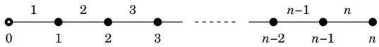{width=59%} Figure 4.3: Unique numbering of an unbranched kinematic tree

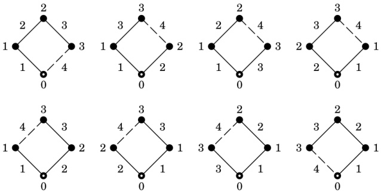{width=70%} Figure 4.4: Every possible numbering of the crank slider linkage in Figure 4.1

is twofold: to define the relationship between joint and body variables, and to specify which way round the joint is connected in the system. For example, the velocity across a joint is defined to be the velocity of the successor relative to the predecessor, and the force transmitted across a joint is defined to be the force transmitted from the predecessor to the successor.

The identification of which way round a joint is connected between two bodies is called its polarity. We can identify the polarity of a joint in a connectivity graph by placing an arrow on the arc such that it points from the predecessor to the successor. Examples of this are shown in Figures 4.5 and 4.6. As a matter of convenience, we adopt the following convention on the polarity of tree joints: the normal polarity for a tree joint is to connect from the parent to the child. All tree joints are assumed to have this polarity unless indicated otherwise.

Some joints are physically symmetrical, meaning that the motion of the successor relative to the predecessor is qualitatively the same as the motion of the predecessor relative to the successor. Joints that do not have this property are asymmetrical. Switching the polarity of a symmetrical joint does not make a material difference to a rigid-body system, but switching the polarity of an asymmetrical joint does. For example, if two bodies are connected by a ball-and-socket joint, which is symmetrical, then it does not really matter which body has the ball and which the socket—if we were to switch them round, then the motion would still be the same. In contrast, if the two bodies are connected by a rack-and-pinion joint, which is asymmetrical, then it does matter which body has the rack and which the pinion. Thus, the polarity of an asymmetrical

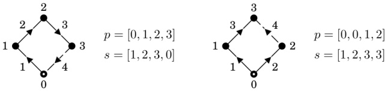{width=71%} Figure 4.5: Joint predecessor and successor arrays

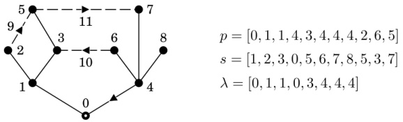{width=63%} Figure 4.6: Predecessor, successor and parent arrays

joint is determined by the physical system, but the polarity of a symmetrical joint is not, leaving us free to choose its polarity in the system model.

# 4.1.4 Representation

There are many ways to represent a connectivity graph in a computer. One of the simplest is to record the joint predecessor and successor body numbers in a pair of arrays, $p$ and $s$, such that $p(i)$ and $s(i)$ are the predecessor and successor body numbers, respectively, of joint $i$. This method is illustrated in Figure 4.5, which reproduces two of the connectivity graphs from Figure 4.4, adding arrows to show the polarity of each joint.

Together, $p$ and $s$ provide a complete description of a connectivity graph, from which other useful quantities can be calculated. The first of these is the parent array, $\lambda$, which identifies the parent of each body in the spanning tree: $\lambda(i)$ is the parent of body $i$. According to rules 3 and 4 of the numbering scheme, tree joint $i$ connects between bodies $i$ and $\lambda(i)$, and $\lambda(i) < i$, so

$$
\lambda ( i ) = \operatorname* { m i n } ( p ( i ) , s ( i ) ) \, .  ( 1 \leq i \leq N _ { B } )
$$

The parent arrays for the two graphs in Figure 4.5 are $\lambda = [0,1,2]$ and $\lambda = [0,0,1]$; and a larger example is shown in Figure 4.6.

If a tree joint satisfies $s(i)=i$, then it connects from the parent to the child, and is said to be in the forward direction in the tree. Otherwise, it connects from the child to the parent, and is said to be in the reverse direction. The tree joints in Figure 4.5 are all in the forward direction. (The arrows point away from the root.) The tree joints in Figure 4.6 are also all in the forward direction, except for joint 4. The tree-joint numbers and forward-pointing arrows have been

omitted from this diagram: the former because they can be deduced from the numbering scheme, and the latter because we regard 'forward' as the standard direction for a tree joint.

Three more quantities provide useful information about the connectivity of a kinematic tree: for any body $i$ except the base, $\kappa(i)$ is the set of all tree joints on the path between body $i$ and the base; and for any body $i$, including the base, $\mu(i)$ is the set of children of body $i$, and $\nu(i)$ is the set of bodies in the subtree starting at body $i$. They are called the support, child and subtree sets, respectively. (A tree joint is said to support a body if it lies on the path between that body and the base.) $\nu(i)$ can also be regarded as the set of all bodies supported by joint $i$. For the spanning tree in Figure 4.6, the support, child and subtree sets are as follows:

$$
\begin{array}{llll}\kappa(1)=\{1\}&&\mu(0)=\{1,4\}&&\nu(0)=\{0,1,2,\dots,8\}\\\kappa(2)=\{1,2\}&&\mu(1)=\{2,3\}&&\nu(1)=\{1,2,3,5\}\\\kappa(3)=\{1,3\}&&\mu(2)=\{\}&&\nu(2)=\{2\}\\\vdots&&\vdots&&\vdots\\\kappa(8)=\{4,8\}&&\mu(8)=\{\}&&\nu(8)=\{8\}\end{array}
$$

$\kappa$, $\lambda$, $\mu$ and $\nu$ obviously have a lot of simple properties that follow from their definitions. For example, $\mu(i) \subseteq \nu(i)$, $j \in \kappa(i) \Rightarrow i \in \nu(j)$, and so on. One not-so-obvious property that turns out to be quite useful is the identity

$$
\sum _ { i = 1 } ^{N _ { B} } \sum _ { j \in \kappa ( i ) } ( \cdots ) = \sum _ { j = 1 } ^{N _ { B} } \sum _ { i \in \nu ( j ) } ( \cdots ) .
$$

The left-hand side is a summation over all $i,j$ pairs in which joint $j$ supports body $i$, but the right-hand side is also a summation over all $i,j$ pairs in which joint $j$ supports body $i$, and so the two are the same.

Example 4.1 The role of $\lambda$ in dynamics algorithms is illustrated by the following simple example. Suppose we wish to calculate the velocity of every body in a rigid-body system, given the velocities across the tree joints. Let $\boldsymbol{v}_{i}$ and $\boldsymbol{v}_{\mathrm{J}_{i}}$ be the velocity of body $i$ and the velocity across joint $i$, respectively, the latter being the velocity of the child relative to the parent (i.e., the joints are in the forward direction). Now, the velocity of body $i$ can be defined recursively as the sum of its parent's velocity and the velocity across the joint connecting it to its parent; so the formula for calculating the body velocities is

$$
\pmb { v } _ { i } = \pmb { v } _ { \lambda ( i ) } + \pmb { v } _ { \mathrm { J } i } \, .  ( \pmb { v } _ { 0 } = \pmb { 0 } )
$$

The algorithm for calculating these velocities is therefore

$v_{0}=\mathbf{0}$for $i=1$ to $N_{B}$ do$v_{i}=\boldsymbol{v}_{\lambda(i)}+\boldsymbol{v}_{J_{i}}$end

The property $\lambda(i) < i$ ensures that $v_{\lambda(i)}$ is always calculated before it is used. Another way to express the body velocities is

$$
{ \boldsymbol { v } } _ { i } = \sum _ { j \in \kappa ( i ) } { \boldsymbol { v } } _ { \mathrm { J } _ { j } } \, .
$$

Example 4.2 Example 2.3 introduced a matrix called the body Jacobian, which gives the spatial velocity of an individual body as a function of the joint velocity variables. If $\mathbf{J}_i$ is the body Jacobian for body $i$, then

$$
\begin{array}{r} { v _ { i } = J _ { i } \, \dot { q } \, . } \end{array}
$$

Equation 2.18 gave a formula for $J_{i}$ that is valid for the special case of an unbranched kinematic chain, so let us now obtain the general formula. Let the velocity across joint $j$ be $S_{j}\dot{q}_{j}$, and let $\epsilon_{ij}$ be defined as follows:

$$
\epsilon _ { i j } = \left\{ \begin{array}{ll} { 1 } & { \mathrm { i f ~ } j \in \kappa ( i ) } \\{ 0 } & { \mathrm { o t h e r w i s e } . } \end{array} \right.
$$

So $\epsilon_{ij}$ is nonzero if joint $j$ supports body $i$. The velocity of body $i$ can now be expressed as follows:

$$
\pmb { v } _ { i } = \sum _ { j \in \kappa ( i ) } S _ { j } \dot { \pmb { q } } _ { j } = \sum _ { j = 1 } ^{N _ { B} } \epsilon _ { i j } S _ { j } \dot { \pmb { q } } _ { j } = \left[ \epsilon _ { i 1 } S _ { 1 } \ \ \cdots \ \ \epsilon _ { i N _ { B } } S _ { N _ { B } } \right] \left[ \begin{array}{l} { \dot { \pmb { q } } _ { 1 } } \\{ \vdots } \\{ \dot { \pmb { q } } _ { N _ { B } } } \end{array} \right] .
$$

Thus, the general formula for the body Jacobian is

$$
\begin{array}{r} { J _ { i } = \left[ \epsilon _ { i 1 } S _ { 1 }  \epsilon _ { i 2 } S _ { 2 }  \cdots  \epsilon _ { i N _ { B } } S _ { N _ { B } } \right] . } \end{array}
$$

# 4.2 Geometry

If two bodies are connected by a joint, then their relative motion is constrained. A complete description of the constraint requires knowledge of two things: the motion allowed by the joint, and the location of the joint relative to each body. The former is described by a joint model. The latter is described by the system's geometry.

A geometric model of a rigid-body system is a description of where the connections are. In particular, it is a description of the relative position of each joint on each rigid body. Figure 4.7 shows a geometric model for a rigid-body system comprising a fixed base, $B_0$, three moving bodies, $B_1$ to $B_3$, three tree joints, $J_1$ to $J_3$, and one loop joint, $J_4$. The dashed lines in this figure indicate only the connectivity of each joint, not its exact physical location.

Each moving body has a coordinate frame embedded in it, which defines a local coordinate system for that body. These frames are labelled $F_1$ to $F_3$,

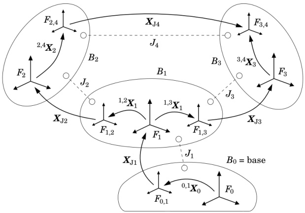{width=68%} Figure 4.7: Geometric model of a rigid-body system

and the coordinate systems they define are known as body coordinates, or link coordinates. There is also a frame $F_0$, embedded in the base, which defines an absolute, reference, or base coordinate system for the whole rigid-body system. The position of body $B_i$ is defined as the position of $F_i$ relative to $F_0$, and it can be represented by the coordinate transform ${}^i\mathbf{X}_0$.

The figure also shows several frames with names of the form $F_{i,j}$ where $i$ refers to a body and $j$ to a joint. These frames identify where the joints are located on each body. Each tree joint $i$ connects from frame $F_{\lambda(i),i}$ to frame $F_i$ (or vice versa if the joint is in the reverse direction), and each loop joint $i$ connects from $F_{p(i),i}$ to $F_{s(i),i}$. There are therefore $N_B + 2N_L$ locating frames in total: one for each tree joint and two for each loop joint. The position of frame $F_{i,j}$ relative to $F_i$ is given by the transform ${}^{i,j}\mathbf{X}_i$, which is a constant. These transforms, or a set of data from which they can be calculated, define the geometric model of a rigid-body system.

For convenience, we define an array of tree transforms, $\mathbf{X}_{\mathrm{T}}$, such that $\mathbf{X}_{\mathrm{T}}(i)=^{\lambda(i),i}\mathbf{X}_{\lambda(i)}$. These are the locating transforms for the tree joints, and this array provides a complete description of the geometry of the spanning tree. We also define the arrays $\mathbf{X}_{\mathrm{P}}$ and $\mathbf{X}_{\mathrm{S}}$, each indexed from 1 to $N_{L}$, such that $\mathbf{X}_{\mathrm{P}}(i-N_{B})=^{p(i),i}\mathbf{X}_{p(i)}$ and $\mathbf{X}_{\mathrm{S}}(i-N_{B})=^{s(i),i}\mathbf{X}_{s(i)}$ for each loop joint $i$. These are the locating transforms for the loop joints.

Finally, each joint defines a joint transform, $\mathbf{X}_{\mathrm{J}_{i}}$, which is a function of the joint's position variables. These transforms are discussed in Section 4.4. As shown in the figure, $\mathbf{X}_{\mathrm{J}_{i}}$ is equal to ${}^{i}\mathbf{X}_{\lambda(i),i}$ if $i$ is a tree joint, and ${}^{s(i),i}\mathbf{X}_{p(i),i}$ if $i$ is a loop joint.

Example 4.3 Suppose we wish to calculate the position of each body in a kinematic tree; that is, we wish to calculate $^{i}\mathbf{X}_{0}$ for each body. The algorithm to accomplish this is

for $i=1$ to $N_{B}$ do$X_{\mathrm{J}}=\mathrm{j}\mathrm{calc}(\mathrm{j}\mathrm{type}(i),\boldsymbol{q}_{i})$$^{i}X_{\lambda(i)}=\mathrm{X}_{\mathrm{J}}X_{\mathrm{T}}(i)$if $\lambda(i)\neq0$ then$^{i}X_{0}=\mathrm{i}X_{\lambda(i)}\lambda(i)X_{0}$endend

In this code fragment, $\mathbf{X}_{\mathrm{J}}$ is a local variable, jtype$(i)$ is a data structure describing joint $i$, and jcalc is a function that calculates a joint transform from a joint description and a vector of joint position variables. jtype$(i)$ and jcalc are covered in Section 4.4.

# 4.3 Denavit-Hartenberg Parameters

In general, six parameters are needed to specify the position of one coordinate frame relative to another. However, for certain kinds of rigid-body system, it is possible to locate the body coordinate frames in such a way that fewer parameters are needed. One such method, originally described by Denavit and Hartenberg (Denavit and Hartenberg, 1955), needs only four parameters per joint. It exploits the fact that some of the most common joint types can be characterized by a line in space, and that only four parameters are needed to locate a line.

Figure 4.8 shows how the Denavit-Hartenberg (DH) method is applied to an unbranched kinematic tree representing a robot arm or similar device. The important geometrical features of this system are:

a base coordinate frame,

$n$ joint axes, and

an end-effector coordinate frame, which is embedded in the final link.

The end-effector frame is needed for the correct execution of positioning commands by the robot, but is not needed for dynamics calculations. The DH coordinate frames are placed according to the following rules.

Axes $z_{0}$ and $z_{n+1}$ are aligned with the $z$ axes of the base and end-effector coordinate frames, respectively.

Axes $z_{1}$ to $z_{n}$ are aligned with the $n$ joint axes such that $z_{i}$ is aligned with the axis of joint $i$. (If joint $i$ happens to be prismatic, then $z_{i}$ can be any axis with the correct direction; but it is sensible to choose an axis that intersects with $z_{i-1}$.)

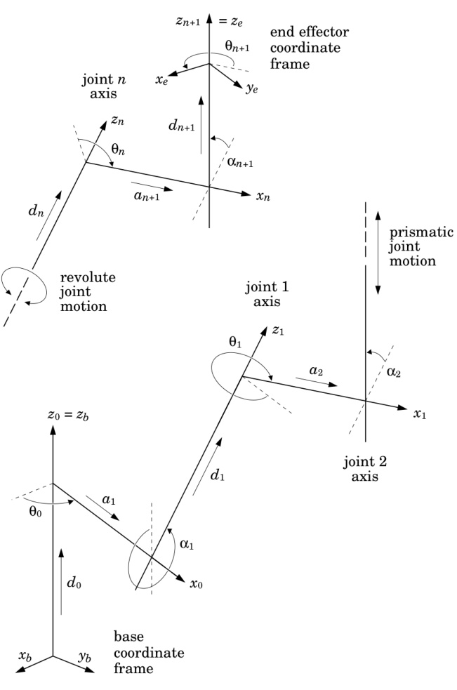{width=71%} Figure 4.8: Denavit-Hartenberg Coordinate Frames and Parameters

Axis $x_{i}$ is the common perpendicular between $z_{i}$ and $z_{i+1}$, directed from $z_{i}$ to $z_{i+1}$. If $z_{i}$ and $z_{i+1}$ intersect, then there is a $180^{\circ}$ ambiguity in the direction of $x_{i}$. If $z_{i}$ and $z_{i+1}$ are parallel, then the location of the common perpendicular is indeterminate, and it is reasonable to choose one that intersects with $x_{i-1}$.

The body coordinate frame $F_{i}$ is defined by the axes $x_{i}$, $y_{i}$ and $z_{i}$, where $y_{i}$ is derived from $x_{i}$ and $z_{i}$ to make a right-handed coordinate frame.

Having placed the coordinate frames, their relative locations are described by the following $DH$ parameters:

$d_{i}$ the distance from $x_{i-1}$ to $x_{i}$ measured along $z_{i}$.

$\theta_{i}$ the angle from $x_{i-1}$ to $x_{i}$ measured about $z_{i}$.

$a_{i}$ the distance from $z_{i-1}$ to $z_{i}$ measured along $x_{i-1}$. The definition of $x_{i-1}$ implies $a_{i} \geq 0$.

$\alpha_{i}$ the angle from $z_{i-1}$ to $z_{i}$ measured about $x_{i-1}$.

All of the parameters $a_{i}$ and $\alpha_{i}$ are constants, but some of the parameters $d_{i}$ and $\theta_{i}$ serve as joint variables. Specifically, if joint $i$ is revolute, then $\theta_{i}$ is its joint variable; if joint $i$ is prismatic, then $d_{i}$ is its joint variable; if joint $i$ is cylindrical, then both $\theta_{i}$ and $d_{i}$ are joint variables; and if joint $i$ is a screw joint with a pitch of $h_{i}$, then $\theta_{i}$ is the joint variable, and the distance from $x_{i-1}$ to $x_{i}$ is defined to be $d_{i} + h_{i} \theta_{i}$. If every joint is revolute, then the DH parameters define the following geometric model for the unbranched tree in Figure 4.8:

$$
\begin{array}{rl} { i = 1 : } & { { } \mathbf { X } _ { \mathrm { T } } ( 1 ) = \mathrm { x l t } ( [ a _ { 1 } \ 0 \ d _ { 1 } ] ^{\mathrm { T} } ) \ \mathrm { r o t x } ( \alpha _ { 1 } ) \ \mathrm { r o t z } ( \theta _ { 0 } ) \ \mathrm { x l t } ( [ 0 \ 0 \ d _ { 0 } ] ^{\mathrm { T} } ) } \\{ i > 1 : } & { { } \ \mathbf { X } _ { \mathrm { T } } ( i ) = \mathrm { x l t } ( [ a _ { i } \ 0 \ d _ { i } ] ^{\mathrm { T} } ) \ \mathrm { r o t x } ( \alpha _ { i } ) } \end{array}
$$

(See Table 2.2 for definitions of of the translation and rotation functions. Also, see §A.4 in the appendix for screw transforms.)

It requires a total of $4n+6$ DH parameters to describe a system with $n$ joints, of which at least $n$ will be joint variables rather than parameters. However, the last four parameters serve only to locate the end-effector frame, and can be omitted if this information is not needed. Up to five more parameters can be omitted if the base frame can be chosen to be aligned with $z_1$.

In its basic form, the Denavit-Hartenberg method is applicable to any rigid-body system in which every joint can be characterized by a joint axis and the topology is either an unbranched kinematic tree or a single closed kinematic loop. However, the method can be adapted to a broader class of systems, as described in Khalil and Dombre (2002). DH parameters are described in various textbooks, such as Angeles (2003) and Craig (2005). The notational details tend to vary from one author to the next, especially the numbering of $x_i$, $a_i$ and $\alpha_i$. The notation used here follows the Springer Handbook of Robotics (Siciliano and Khatib, 2008).

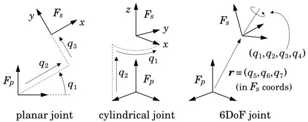{width=67%} Figure 4.9: Geometrical interpretation of some joint position variables

# 4.4 Joint Models

A joint can be regarded as a motion constraint between two Cartesian frames—one embedded in the joint's successor body and the other in its predecessor. We shall call these frames $F_s$ and $F_p$, respectively. The purpose of a joint model is to provide the information required to calculate the motion of $F_s$ relative to $F_p$ as a function of the joint variables.

The kind of motion allowed by a joint depends on its joint type. For example, a revolute joint allows pure rotation about a single axis, whereas a spherical joint allows arbitrary rotation about a specific point. We therefore need one joint model for each type of joint. The contents of a joint model are a collection of data and formulae for calculating specific quantities, such as: the joint transform ($^{s}\mathbf{X}_{p}$), the joint velocity ($\mathbf{v}_{\mathrm{J}}$) the joint's motion subspace ($\mathbf{S}$), and so on. Formulae for several common joint types are shown in Table 4.1, and the geometries of some of these joints are shown in Figure 4.9.

Let us examine one model in more detail. The first entry in Table 4.1 describes a revolute joint that allows $F_{s}$ to rotate relative to $F_{p}$ about their common $z$ axis, and defines the joint variable to be the angle of rotation. The two columns marked $\boldsymbol{E}$ and $\boldsymbol{r}$ describe the rotational and translational components of the joint transform, and the transform itself is given by the equation ${}^{s}\boldsymbol{X}_{p}=\operatorname{rot}(\boldsymbol{E}) \operatorname{xlt}(\boldsymbol{r})$. (See Table 2.2 for the definitions of $\operatorname{rot}$, $\operatorname{xlt}$ and $\operatorname{rz}$.) Observe that $F_{s}$ coincides with $F_{p}$ when the joint variable $(q_{1})$ is zero. We apply this convention as far as possible to all joint models. Another convention we apply to all joint models is that $\boldsymbol{S}, \boldsymbol{T}$, and related quantities, are expressed in $F_{s}$ coordinates. In the case of a revolute joint this does not really matter, since ${}^{s}\boldsymbol{S}=^{p}\boldsymbol{S}$, but it does matter for other joints.

In a well-designed dynamics simulator, there would likely be a joint model library, containing one model for each type of joint supported by the software. A system model would then contain a joint type descriptor for each joint in the system. We shall use the expression jtype(i) to denote the joint type descriptor of joint i. In the simplest case, a joint type descriptor is just a type code identifying a particular model in the library. For example, the type code 'R'

Table 4.1: Joint Model Formulae

| Joint Type | $Joint Transform ($^{s}\mathbf{X}_{p}$)$ | $Motion Subsp. ($\mathbf{S}$)$ | $Constraint Force Subspace ($\mathbf{T}$)$ |
| --- | --- | --- | --- |
|  | $\boldsymbol{E}$ | $\boldsymbol{r}$ | $Subspace ($\boldsymbol{S}$)$ | $Subspace ($\boldsymbol{T}$)$ |
| Revolute (hinge joint) | $\boldsymbol{rz}(q_{1})$ | $\begin{bmatrix} 0 \\ 0 \\ 0 \\ 0 \end{bmatrix}$ | $\begin{bmatrix} 0 \\ 1 \\ 0 \\ 1 \\ 0 \\ 0 \\ 0 \end{bmatrix}$ | $\begin{bmatrix} 1 & 0 & 0 & 0 & 0 \\ 0 & 1 & 0 & 0 \\ 0 & 0 & 0 & 0 \\ 0 & 0 & 1 & 0 \\ 0 & 0 & 0 & 1 \\ 1 \end{bmatrix}$ |
| Prismatic (sliding joint) | $\boldsymbol{1}_{3\times3}$ | $\begin{bmatrix} 0 \\ 0 \\ 0 \\ q_{1} \end{bmatrix}$ | $\begin{bmatrix} 0 \\ 0 \\ 0 \\ 0 \\ 0 \end{bmatrix}$ | $\begin{bmatrix} 0 \\ 0 & 1 & 0 & 0 \\ 0 & 0 & 0 & 0 \\ 0 & 0 & 1 & 0 \\ 0 & 0 & 0 & 1 \\ 0 & 0 & 0 & 0 & 0 \end{bmatrix}$ |
| $Helical (screw joint) with pitch $h$$ | $\boldsymbol{rz}(q_{1})$ | $\begin{bmatrix} 0 \\ 0 \\ 0 \\ h \end{bmatrix}$ | $\begin{bmatrix} 0 \\ 0 \\ 1 & 0 & 0 & 0 \\ 0 & 0 & 0 & -h \\ 0 & 0 & 1 & 0 & 0 \\ 0 & 0 & 0 & 1 & 0 \\ 0 & 0 & 0 & 1 & 0 \\ 0 & 0 & 0 & 0 & 1 \end{bmatrix}$ |
| Cylindrical | $\boldsymbol{rz}(q_{1})$ | $\begin{bmatrix} 0 & 0 \\ 0 & 0 \\ q_{2} \end{bmatrix}$ | $\begin{bmatrix} 0 & 0 \\ 0 & 0 & 0 \\ 0 & 1 & 0 & 0 \\ 0 & 0 & 0 & 0 \\ 0 & 0 & 0 & 0 \\ 0 & 0 & 1 & 0 & 0 \\ 0 & 0 & 0 & 1 & 0 \\ 0 & 0 & 0 & 0 & 1 \end{bmatrix}$ |
| Planar (see Fig. 4.9) | $\boldsymbol{rz}(q_{1})$ | $\begin{bmatrix} c_{1}q_{2}-s_{1}q_{3} \\ s_{1}q_{2}+c_{1}q_{3} \end{bmatrix}$ | $\begin{bmatrix} 0 & 0 \\ 0 & 0 & 0 \\ 1 & 0 & 0 \\ 0 & 1 & 0 & 0 \\ 0 & 0 & 0 & 0 \\ 0 & 0 & 1 & 0 & 0 \\ 0 & 0 & 0 & 1 \\ 0 & 0 & 0 & 1 \end{bmatrix}$ |
| Spherical ball &amp; socket) | $\begin{bmatrix} \mathrm{see} & \mathrm{E}^{-1} \begin{bmatrix} 0 & 0 \\ 0 & 0 \\ 0 & 0 & 1 \\ 0 & 0 & 0 \\ 0 & 0 & 0 \\ 0 & 0 & 0 \end{bmatrix}$ | $\begin{bmatrix} 1 & 0 & 0 \\ 0 & 1 & 0 & 0 \\ 0 & 0 & 0 & 0 \\ 0 & 0 & 0 & 0 \\ 0 & 0 & 0 & 0 \\ 0 & 0 & 0 & 0 & 0 \\ 0 & 0 & 0 & 1 \end{bmatrix}$ |
| 6-DoF Joint (free motion) | $\boldsymbol{see} & \boldsymbol{E}^{-1} \begin{bmatrix} q_{5} \\ q_{6} \\ q_{7} \end{bmatrix}$ | $\begin{bmatrix} 0 \\ 0 & 0 \\ 0 & 1 & 0 \\ 0 & 0 & 1 \\ 0 & 0 & 0 \\ 0 & 0 & 0 \\ 0 & 0 & 0 \\ 0 & 0 & 0 \\ 0 & 0 & 0 & 1 \end{bmatrix}$ | $\begin{bmatrix} 1 & 0 & 0 \\ 0 & 1 & 0 \\ 0 & 0 & 0 \\ 0 & 0 & 0 \\ 1 & 0 & 0 \\ 0 & 0 & 0 \\ 0 & 0 & 0 & 0 \\ 1 & 0 & 0 & 0 \\ 0 & 0 & 0 & 0 \\ 0 & 1 & 0 & 0 \\ 0 & 0 & 1 \\ 0 & 0 & 0 & 1 \end{bmatrix}$ |Notes: $c_{1}=\cos(q_{1})$, $s_{1}=\sin(q_{1})$, and $^{s}\mathbf{X}_{p}=\mathrm{rot}(\boldsymbol{E})$ xlt($\boldsymbol{r}$) (see Table 2.2).

could identify a revolute joint and 'P' a prismatic one. However, some joints are characterized by both a type and a set of parameters. For example, a helical joint is characterized both by the fact that it is helical and a parameter that specifies the pitch of the helix. Each individual helical joint in a rigid-body system can have a different pitch; so parameters like this are a property of individual joints, rather than the joint model. To accommodate joint parameters, we define a joint type descriptor to be a data structure containing both a type code and the set of parameter values (if any) required for a joint of that type.

# Joint Model Calculation Routine

Subsequent chapters describe several dynamics algorithms, all of which make use of joint model data. To keep the algorithm descriptions simple, we assume the existence of a single function, called jcalc, that calculates all requested joint-related data in a single call. A specimen call to this function looks like this:

$$
\begin{array}{rlrl} & { [ X _ { \mathrm { J } } , S , v _ { \mathrm { J } } , c _ { \mathrm { J } } ] = \mathrm { j c a l c } ( t y p e , q , \alpha ) } & & { \mathrm { ( e x p l i c i t ~ j o i n t ~ c o n s t r a i n t ) } } \\& { [ \delta , T ] = \mathrm { j c a l c } ( t y p e , \, ^{s} X _ { p } ) } & & { \mathrm { ( i m p l i c i t ~ j o i n t ~ c o n s t r a i n t ) } } \\& { [ \dot { q } ] = \mathrm { j c a l c } ( t y p e , q , \alpha ) } & & { \mathrm { ( f o r ~ q d f n ~ ( E q . ~ 3 . 7 ) ) } } \end{array}
$$

In each case, the expression on the left is a list of requested return values, and the argument type refers to a joint type descriptor (e.g. jtype(i)). The use of jcalc to calculate implicit joint constraints is covered in Chapter 8, and its use to calculate $\dot{\boldsymbol{q}}$ is covered later in this chapter. In the algorithm listings, we generally assume that $\boldsymbol{\alpha}=\dot{\boldsymbol{q}}$, and use $\dot{\boldsymbol{q}}$ in place of $\boldsymbol{\alpha}$ in the argument lists. If a joint depends explicitly on time, then time must be added as a final argument in the list. Note that $\boldsymbol{v}_{\mathrm{J}}$, $\boldsymbol{c}_{\mathrm{J}}$, $\boldsymbol{S}$ and $\boldsymbol{T}$ are all expressed in $F_{s}$ coordinates. Expressions for $\boldsymbol{v}_{\mathrm{J}}$ and $\boldsymbol{c}_{\mathrm{J}}$ are given in Section 3.5.

Example 4.4 Example 4.3 showed how to calculate the coordinate transform $^{i}\mathbf{X}_{0}$ for each body in a kinematic tree. We now extend this example to calculate both $^{i}\mathbf{X}_{0}$ and $^{0}\mathbf{v}_{i}$ (the velocity of body $i$ expressed in base coordinates). The algorithm to accomplish this is

$$
\begin{array}{rl} & { ^{0} \boldsymbol { v } _ { 0 } = 0 } \\& { \mathrm { f o r ~ } i = 1 \mathrm { ~ t o ~ } N _ { B } \mathrm { ~ d o ~ } } \\& {   \left[ \boldsymbol { X } _ { \mathrm { J } } , \boldsymbol { v } _ { \mathrm { J } } \right] = \mathrm { j c a l c } ( \mathrm { j t y p e } ( i ) , \boldsymbol { q } _ { i } , \dot { \boldsymbol { q } } _ { i } ) } \\& {   \stackrel { i } { \boldsymbol { X } } _ { \lambda ( i ) } = \boldsymbol { X } _ { \mathrm { J } } \boldsymbol { X } _ { \mathrm { T } } ( i ) } \\& { \mathrm { i f ~ } \lambda ( i ) \neq 0 \mathrm { ~ t h e n ~ } } \\& {  \stackrel { i } { \boldsymbol { X } } _ { 0 } = \stackrel { i } { \boldsymbol { X } } _ { \lambda ( i ) } \stackrel { \lambda ( i ) } { \lambda ( i ) } \boldsymbol { X } _ { 0 } } \\& { \mathrm { e n d ~ } } \\& {  \stackrel { 0 } { \boldsymbol { v } } _ { i } = \stackrel { 0 } { \boldsymbol { v } } _ { \lambda ( i ) } + \stackrel { 0 } { \boldsymbol { X } } _ { i } \boldsymbol { v } _ { \mathrm { J } } } \\& { \mathrm { e n d ~ } } \end{array}
$$

This code fragment contains a new feature: it calculates $^{i}\mathbf{X}_{0}$, but then uses $^{0}\mathbf{X}_{i}$ to transform $\mathbf{v}_{\mathrm{J}}$. The explanation for this practice can be found in Appendix A, where it is shown how to calculate $\mathbf{X}^{-1}\mathbf{v}$ directly from $\mathbf{X}$ and $\mathbf{v}$ without having to calculate $\mathbf{X}^{-1}$ first. It is also possible to calculate $\mathbf{X}^{*}\mathbf{f}$ and $(\mathbf{X}^{*})^{-1}\mathbf{f}$ directly from $\mathbf{X}$ and $\mathbf{f}$ without having to calculate $\mathbf{X}^{*}$ or $(\mathbf{X}^{*})^{-1}$ first. We exploit this fact in several dynamics algorithm listings.

Example 4.5 A peculiar feature of both the planar joint and the 6-DoF joint in Table 4.1 is that the translational joint variables express the translation in $F_{s}$ coordinates rather than $F_{p}$ coordinates. The reason for doing this is to make the motion subspace matrix a simple constant, so that $\dot{S}=0$, $c_{\mathrm{J}}=0$, and the simple form of $\mathbf{S}$ allows various optimizations to be applied to the dynamics algorithms. However, there is potentially a big disadvantage in this arrangement: if the successor body is far distant from the predecessor, and starts to spin, then the spinning will cause large rates of change in the position variables. (Just think of a tumbling satellite or aircraft.) One way to get the best of both worlds is to use a set of position variables in which the translations are expressed in $F_{p}$ coordinates, together with a set of velocity variables in which the linear velocity is expressed in $F_{s}$ coordinates.

Let $^{p}q_{1}$, $^{p}q_{2}$ and $^{p}q_{3}$ be a set of position variables for a planar joint, such that $^{p}q_{2}$ and $^{p}q_{3}$ are translations in the $x$ and $y$ directions of $F_{p}$; and let $^{s}q_{1}$, $^{s}q_{2}$ and $^{s}q_{3}$ be a second set of position variables for the same planar joint, such that $^{s}q_{2}$ and $^{s}q_{3}$ are translations in the $x$ and $y$ directions of $F_{s}$. This second set of variables is the set used in Table 4.1 and shown in Figure 4.9. The relationship between these two sets is

$$
\begin{array}{rl} { \left[ \begin{array}{l} { p q _ { 1 } } \\{ p q _ { 2 } } \\{ p q _ { 3 } } \end{array} \right] } & { = \left[ \begin{array}{lll} { 1 } & { 0 } & { 0 } \\{ 0 } & { c _ { 1 } } & { - s _ { 1 } } \\{ 0 } & { s _ { 1 } } & { c _ { 1 } } \end{array} \right] \left[ \begin{array}{l} { s q _ { 1 } } \\{ s q _ { 2 } } \\{ s q _ { 3 } } \end{array} \right] } \end{array}
$$

We wish to use $^{p}q_{i}$ as the position variables, but $^{s}q_{i}$ as the velocity variables. To cater for this, we need a formula to calculate the derivatives of the position variables from the position and velocity variables. Such a formula is obtained by differentiating the above equation, to get

$$
\begin{array}{rl} { \left[ \begin{array}{l} { \dot { q } _ { 1 } } \\{ \dot { q } _ { 2 } } \\{ \dot { q } _ { 3 } } \end{array} \right] } & { = \left[ \begin{array}{lll} { 1 } & { 0 } & { 0 } \\{ - q _ { 3 } } & { c _ { 1 } } & { - s _ { 1 } } \\{ q _ { 2 } } & { s _ { 1 } } & { c _ { 1 } } \end{array} \right] \left[ \begin{array}{l} { \alpha _ { 1 } } \\{ \alpha _ { 2 } } \\{ \alpha _ { 3 } } \end{array} \right] \, , } \end{array}
$$

where we have dropped the superscript $p$ from ${}^{p}q_{i}$ and ${}^{p}q_{i}$, and substituted $\alpha_{i}$ for ${}^{s}\dot{q}_{i}$. This is the calculation that jcalc must perform if it is called upon to calculate $\dot{q}$ from $\mathbf{q}$ and $\alpha$ for this particular model of the planar joint.

Example 4.6 Let us construct a joint model for the rack-and-pinion joint shown in Figure 4.10. This joint allows a pinion that is part of the successor body to roll along a rack that is part of the predecessor body. The rack

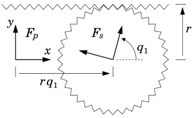{width=35%} Figure 4.10: Rack-and-pinion joint

is parallel to the $x$ axis of $F_{p}$, and the pinion is centred on the $z$ axis of $F_{s}$. The pinion has a radius of $r$, which is a parameter of the joint model. The joint allows only a single degree of motion freedom, so there is only one joint variable, denoted $q_{1}$, and it is chosen to be the rotation angle of the pinion.

If $F_{p}$ and $F_{s}$ coincide when $q_{1}=0$, then the transform from $F_{p}$ to $F_{s}$ consists of a translation by $rq_{1}$ in the $x$ direction followed by a rotation of $q_{1}$ about the $z$ axis. The joint transform is therefore

$$
X _ { \mathrm { J } } = { } ^{s} X _ { p } = { \left[ \begin{array}{ll} { E } & { 0 } \\{ 0 } & { E } \end{array} \right] } { \left[ \begin{array}{ll} { 1 } & { 0 } \\{ - p \times } & { 1 } \end{array} \right] } ,
$$

where

$$
E = \mathrm { r z } ( q _ { 1 } ) = \left[ \begin{array}{lll} { c _ { 1 } } & { s _ { 1 } } & { 0 } \\{ - s _ { 1 } } & { c _ { 1 } } & { 0 } \\{ 0 } & { 0 } & { 1 } \end{array} \right]  \mathrm { ~ a n d ~ }  p = \left[ \begin{array}{l} { r q _ { 1 } } \\{ 0 } \\{ 0 } \end{array} \right] .
$$

The next step is to find formulae for $\boldsymbol{v}_{\mathrm{J}}$ and $\boldsymbol{S}$. We begin by expressing the joint velocity as a function of the joint's position and velocity variables. Relative to $F_{p}$, the pinion is rotating with an angular velocity of $\boldsymbol{\omega}=[0\,0\,\dot{q}_{1}]^{\mathrm{T}}$ about an axis passing through $\boldsymbol{p}$, and it is translating with a linear velocity of $\dot{\boldsymbol{p}}=[r\dot{q}_{1}\,0\,0]^{\mathrm{T}}$. This equates to a spatial velocity, expressed in $F_{p}$ coordinates, of

$$
{ } ^{p} v _ { \mathrm { J } } = { \left[ \begin{array}{l} { \varepsilon } \\{ p \times \omega } \end{array} \right] } + { \left[ \begin{array}{l} { \mathbf { 0 } } \\{ { \dot { p } } } \end{array} \right] } = { \left[ \begin{array}{l} { 0 } \\{ 0 } \\{ { \dot { q } } _ { 1 } } \end{array} \right] } { \left[ \begin{array}{l} { 0 } \\{ 0 } \\{ { \dot { q } } _ { 1 } } \end{array} \right] } + { \left[ \begin{array}{l} { 0 } \\{ 0 } \\{ 0 } \\{ { \dot { r } } { \dot { q } } _ { 1 } } \end{array} \right] } = { \left[ \begin{array}{l} { 0 } \\{ 0 } \\{ 0 } \\{ { \dot { r } } { \dot { q } } _ { 1 } } \end{array} \right] } { \left[ \begin{array}{l} { 0 } \\{ 0 } \\{ 0 } \\{ 0 } \end{array} \right] }
$$

As there is only a single joint variable, the motion subspace matrix is given by

the formula $S = v_{\mathrm{J}}/\dot{q}_{1}$. Therefore

$$
\boldsymbol { v } _ { \mathrm { J } } = \boldsymbol { { } ^{s} } \boldsymbol { X } _ { p } \boldsymbol { { } ^{p} } \boldsymbol { v } = \left[ \begin{array}{l} { 0 } \\{ 0 } \\{ \dot { q } _ { 1 } } \\{ r c _ { 1 } \dot { q } _ { 1 } } \\{ - r s _ { 1 } \dot { q } _ { 1 } } \\{ 0 } \end{array} \right]  \mathrm { a n d }  \boldsymbol { S } = \frac { \boldsymbol { v } _ { \mathrm { J } } } { \dot { q } _ { 1 } } = \left[ \begin{array}{l} { 0 } \\{ 0 } \\{ 1 } \\{ r c _ { 1 } } \\{ - r s _ { 1 } } \\{ 0 } \end{array} \right]
$$

Finally, as $S$ is not a constant, we need a formula for the velocity-product term $c_{\mathrm{J}}$. This is given by

$$
c _ { \mathrm { J } } = \dot { S } \, \dot { q } _ { 1 } = \frac { \partial S } { \partial q _ { 1 } } \, \dot { q } _ { 1 } ^{2} = \left[ \begin{array}{l} { { 0 } } \\{ { 0 } } \\{ { 0 } } \\{ { - r s _ { 1 } \dot { q } _ { 1 } ^{2} } } \\{ { - r c _ { 1 } \dot { q } _ { 1 } ^{2} } } \\{ { 0 } } \end{array} \right]
$$

(See Eq. 3.42 for $\dot{S}$.) Observe that the rack-and-pinion joint simplifies to a revolute joint if $r=0$.

# Polarity Reversal

As explained in Section 4.1.4, a joint in a kinematic tree is said to be in the forward direction if the predecessor is the parent of the successor, and in the reverse direction otherwise. If a joint is symmetrical, then its polarity can be chosen at the time the system model is being defined so that it is in the forward direction; but if it is asymmetrical, then its polarity is determined by the rigid-body system being modelled. Thus, it is not possible to guarantee that every tree joint is in the forward direction.

The simplest way to deal with a reverse-direction joint is to convert it to a forward-direction joint. We can do this as follows. First, add a boolean variable to the joint descriptor data structure that takes the value true if the joint is a tree joint in the reverse direction, and takes the value false otherwise. Given this extra piece of information, jcalc can be modified to simulate a joint of the opposite polarity whenever this boolean variable is true. In effect, jcalc reverses the roles of the predecessor and successor. To accomplish this task, jcalc merely has to modify some of the calculated values before they are returned. For example, instead of returning the matrix $^{s}\mathbf{X}_{p}$ that has been calculated according to the formula for the given joint type, it returns the inverse of this matrix; and, instead of returning the calculated value of $\mathbf{v}_{\mathrm{J}}$, it returns $-^{p}\mathbf{X}_{s}\mathbf{v}_{\mathrm{J}}$. A complete set of modified return values is shown in Table 4.2. The advantage of this approach is that it allows the dynamics algorithms to assume that all tree joints are in the forward direction. This, in turn, makes the algorithms simpler and easier to implement.

Table 4.2: How jcalc simulates an opposite-polarity joint

| normal | simulating |
| --- | --- |
| return value | opposite polarity |
| $^{s}X_{p}$ | $^{p}X_{s}$ |
| $S$ | $-^{p}X_{s}S$ |
| $T$ | $-^{p}X_{s}T$ |
| $v_{\mathrm{J}}$ | $-^{p}X_{s}v_{\mathrm{J}}$ |
| $c_{\mathrm{J}}$ | $-^{p}X_{s}c_{\mathrm{J}}$ |
| $\dot{q}$ | $\dot{q}$ |

# 4.5 Spherical Motion

There are many ways to represent a general 3D rotation (e.g. see Rooney, 1977), but the two main choices are Euler angles and Euler parameters. The latter are also known as unit quaternions. Euler angles have the advantage that the position variables are a set of three independent angles, and the velocity variables are their derivatives. This makes them relatively easy to implement. Their disadvantage is that they suffer from singularities: as the orientation approaches a singularity, the representation becomes increasingly ill-conditioned, and eventually breaks down altogether. The main advantage of Euler parameters is that they are free of singularities; but their disadvantage is that they are a set of four non-independent position variables, which implies that the velocity variables cannot be the derivatives of the position variables. Software that uses Euler parameters must be written to allow the number of position variables to be different from the number of velocity variables.

# Euler Angles

We use the term 'Euler angles' in both a broad sense and a narrow sense. In the broad sense, it refers to any method for representing a general rotation by means of a sequence of three rotations about specified coordinate axes. In the narrow sense, it refers to the special case in which the first and third rotations take place about the $z$ axis, and the second rotation takes place about either the $x$ axis or the $y$ axis.

Every version of Euler angles suffers from singularities. They occur whenever the first and third axes are aligned. If the first and third rotations use the same coordinate axis, then the singularities occur when the second angle is either 0° or 180°; otherwise, they occur when the second angle is ±90°. In the vicinity of a singularity, small changes in the rotation being represented can induce large changes in the first and third angles. A joint model based on Euler angles is not valid at a singularity.

Let us construct a spherical joint model using yaw, pitch and roll angles. These are a sequence of rotations about the $z$, $y$ and $x$ axes, in that order.

Thus, the correct orientation of $F_{s}$ relative to $F_{p}$ is obtained by first placing $F_{s}$ coincident with $F_{p}$, then rotating it about its $z$ axis by an amount $q_{1}$ (yaw), then rotating it about its $y$ axis by an amount $q_{2}$ (pitch), and then rotating it about its $x$ axis by an amount $q_{3}$ (roll). The formula for $\boldsymbol{E}$ is therefore

$$
\begin{array}{rl} & { \boldsymbol { E } = \mathrm { \boldmath ~ \ r x } ( q _ { 3 } ) \mathrm { \boldmath ~ \ r y } ( q _ { 2 } ) \mathrm { \boldmath ~ \ r z } ( q _ { 1 } ) } \\{ = } & { \left[ \begin{array}{lll} { 1 } & { 0 } & { 0 } \\{ 0 } & { c _ { 3 } } & { s _ { 3 } } \\{ 0 } & { - s _ { 3 } } & { c _ { 3 } } \end{array} \right] \left[ \begin{array}{lll} { c _ { 2 } } & { 0 } & { - s _ { 2 } } \\{ 0 } & { 1 } & { 0 } \\{ s _ { 2 } } & { 0 } & { c _ { 2 } } \end{array} \right] \left[ \begin{array}{lll} { c _ { 1 } } & { s _ { 1 } } & { 0 } \\{ - s _ { 1 } } & { c _ { 1 } } & { 0 } \\{ 0 } & { 0 } & { 1 } \end{array} \right] } \\{ = } & { \left[ \begin{array}{lll} { c _ { 1 } c _ { 2 } } & { s _ { 1 } c _ { 2 } } & { - s _ { 2 } } \\{ c _ { 1 } s _ { 2 } s _ { 3 } - s _ { 1 } c _ { 3 } } & { s _ { 1 } s _ { 2 } s _ { 3 } + c _ { 1 } c _ { 3 } } & { c _ { 2 } s _ { 3 } } \\{ c _ { 1 } s _ { 2 } c _ { 3 } + s _ { 1 } s _ { 3 } } & { s _ { 1 } s _ { 2 } c _ { 3 } - c _ { 1 } s _ { 3 } } & { c _ { 2 } c _ { 3 } } \end{array} \right] . } \end{array}
$$

The formula for $S$ can be obtained by expressing the joint velocity as a function of $\dot{q}$, and using $S = \partial v_{\mathrm{J}}/\partial \dot{q}$. We shall skip the details, and just present the final result:

$$
{ \boldsymbol { S } } = { \left[ \begin{array}{lll} { - s _ { 2 } } & { 0 } & { 1 } \\{ c _ { 2 } s _ { 3 } } & { c _ { 3 } } & { 0 } \\{ c _ { 2 } c _ { 3 } } & { - s _ { 3 } } & { 0 } \\{ 0 } & { 0 } & { 0 } \\{ 0 } & { 0 } & { 0 } \\{ 0 } & { 0 } & { 0 } \end{array} \right] } .
$$

The columns of $S$ contain the coordinates in $F_s$ of the axes about which the rotations take place: the first column is the $z$ axis of $F_p$; the second is where the $y$ axis was after the first rotation; and the third is where the $x$ axis was after the first two rotations. As $S$ is not a constant, we also need a formula for $c_{\mathrm{J}}$. This is given by

$$
\begin{aligned}c_{\mathrm{J}}=\mathring{\boldsymbol{S}}\:\dot{\boldsymbol{q}}&=\:\begin{bmatrix}-c_2\dot{q}_2&0&0\\-s_2s_3\dot{q}_2+c_2c_3\dot{q}_3&-s_3\dot{q}_3&0\\-s_2c_3\dot{q}_2-c_2c_3\dot{q}_3&-c_3\dot{q}_3&0\\0&0&0\\0&0&0\\0&0&0\end{bmatrix}\begin{bmatrix}\dot{q}_1\\\dot{q}_2\\\dot{q}_3\end{bmatrix}\\&=\:\begin{bmatrix}-c_2\dot{q}_1\dot{q}_2\\-s_2s_3\dot{q}_1\dot{q}_2+c_2c_3\dot{q}_1\dot{q}_3-s_3\dot{q}_2\dot{q}_3\\-s_2c_3\dot{q}_1\dot{q}_2-c_2s_3\dot{q}_1\dot{q}_3-c_3\dot{q}_2\dot{q}_3\\0\\0\\0\end{bmatrix}.\end{aligned}
$$

Equations 4.7 and 4.8 replace the formulae for $E$ and $S$ in Table 4.1, but the formula for $T$ remains unchanged. This is therefore an example of a joint model in which $S$ varies while $T$ remains constant. Such a thing is possible because $\text{range}(S)$ is a constant, and $T$ is required only to satisfy $\text{range}(T) = \text{range}(S)^\perp$.

# Euler Parameters

A general rotation can also be described by means of a unit vector and an angle. The unit vector specifies the axis of rotation, and the angle specifies the magnitude. Euler parameters are closely related to this representation. If $u$ and $\theta$ are the unit vector and angle, then the Euler parameters describing the same rotation are

$$
\begin{array}{rl} { p _ { 0 } = \cos ( \theta / 2 ) } & { } \\{ p _ { 1 } = \sin ( \theta / 2 ) u _ { x } } & { } \\{ p _ { 2 } = \sin ( \theta / 2 ) u _ { y } } & { } \\{ p _ { 3 } = \sin ( \theta / 2 ) u _ { z } \, . } & { } \end{array}
$$

They are not independent, but must satisfy the equation

$$
p _ { 0 } ^{2} + p _ { 1 } ^{2} + p _ { 2 } ^{2} + p _ { 3 } ^{2} = 1 \, .
$$

A spherical joint must have three independent velocity variables. Therefore, if we wish to use the four non-independent Euler parameters as position variables, then the velocity variables cannot be the derivatives of the position variables. The best choice for the velocity variables is to use the Cartesian coordinates in $F_s$ of the joint's angular velocity vector, $\boldsymbol{\omega}$. This choice results in $\boldsymbol{S}$ taking the simple, constant value shown in Table 4.1. We therefore need only a formula for $\boldsymbol{E}$ and a formula for the derivatives of the position variables. These are

$$
\begin{array}{rl} { E = 2 \, \left[ \begin{array}{lll} { p _ { 0 } ^{2} + p _ { 1 } ^{2} - 1 / 2 } & { p _ { 1 } p _ { 2 } + p _ { 0 } p _ { 3 } } & { p _ { 1 } p _ { 3 } - p _ { 0 } p _ { 2 } } \\{ p _ { 1 } p _ { 2 } - p _ { 0 } p _ { 3 } } & { p _ { 0 } ^{2} + p _ { 2 } ^{2} - 1 / 2 } & { p _ { 2 } p _ { 3 } + p _ { 0 } p _ { 1 } } \\{ p _ { 1 } p _ { 3 } + p _ { 0 } p _ { 2 } } & { p _ { 2 } p _ { 3 } - p _ { 0 } p _ { 1 } } & { p _ { 0 } ^{2} + p _ { 3 } ^{2} - 1 / 2 } \end{array} \right] } \end{array}
$$

and

$$
\begin{array}{r} { \left[ \begin{array}{l} { \dot { p _ { 0 } } } \\{ \dot { p _ { 1 } } } \\{ \dot { p _ { 2 } } } \\{ \dot { p _ { 3 } } } \end{array} \right] = \frac { 1 } { 2 } \left[ \begin{array}{lll} { - p _ { 1 } } & { - p _ { 2 } } & { - p _ { 3 } } \\{ p _ { 0 } } & { - p _ { 3 } } & { p _ { 2 } } \\{ p _ { 3 } } & { p _ { 0 } } & { - p _ { 1 } } \\{ - p _ { 2 } } & { p _ { 1 } } & { p _ { 0 } } \end{array} \right] \left[ \begin{array}{l} { \omega _ { x } } \\{ \omega _ { y } } \\{ \omega _ { z } } \end{array} \right] . } \end{array}
$$

A spherical joint model based on these equations is numerically superior to one based on Eqs. 4.7, 4.8 and 4.9. However, it does place a burden on the surrounding software of having to cope with a joint model in which the number of position variables differs from the number of velocity variables. Three more complications are: the values of the position variables must be obtained by integrating Eq. 4.13 rather than directly integrating the velocity variables; a zero rotation is defined by a nonzero set of Euler parameters; and it is necessary to renormalize Euler parameters frequently during the integration process. (Truncation errors during integration cause the parameters to fail to satisfy Eq. 4.11 exactly, and this causes a linear scaling error affecting the whole subtree supported by the joint. Ideally, they should be renormalized after every integration step.)

Table 4.3: Complete system model

| data for a | extra data for a |
| --- | --- |
| kinematic tree | closed-loop system |
| $N_B$ | $N_L$ |
| $\lambda(1) \cdots \lambda(N_B)$ | $p(N_B+1) \cdots p(N_B+N_L)$ |
| $jtype(1) $\cdots$ jtype($N_B$)$ | $s(N_B+1) \cdots s(N_B+N_L)$ |
| $\mathbf{X}_{\text{T}}(1) \cdots \mathbf{X}_{\text{T}}(N_B)$ | $jtype($N_B+1) \cdots \text{jtype}(N_B+N_L)$$ |
| $\mathbf{I}_1 \cdots \mathbf{I}_{N_B}$ | $\mathbf{X}_{\text{P}}(1) \cdots \mathbf{X}_{\text{P}}(N_L)$ |
|  | $\mathbf{X}_{\text{S}}(1) \cdots \mathbf{X}_{\text{S}}(N_L)$ |

# 4.6 A Complete System Model

Table 4.3 presents a complete system model for a rigid-body system. For a kinematic tree, the required data are: $N_{B}$, the parent array, an array of joint type descriptors, the tree transform array, and an array of rigid-body inertias. The inertias are expressed in body coordinates, in which they are constants. For a closed-loop system, the required extra data are: $N_{L}$ and, for each loop joint, the predecessor and successor body numbers, the joint type descriptor, and the predecessor and successor transforms.

In the simplest case, a software package might cater for a restricted set of joint types, such as revolute and prismatic joints only. In this case, jtype($i$) could simply be a numeric type code, and it would be practical to hard-wire the appropriate values for $\mathbf{X}_{\mathrm{J}}$, $v_{\mathrm{J}}$ and $\mathcal{S}$ directly into the source code for jcalc, or even directly into the source code of a dynamics algorithm. Another simplification concerns access into vectors of joint variables, such as $q$ and $\dot{q}$. In the general case, $q_{i}$ is a subvector of $q$, and its location within $q$ depends on the sizes of all of the preceding subvectors. Thus, the code that accesses and updates $q_{i}$ should have an array of offsets, one per joint, indicating which element of $q$ is the first element of $q_{i}$. However, if every joint has exactly one degree of freedom, as is the case for revolute and prismatic joints, then $q_{i}$ is simply element $i$ of $q$.

If the objective is to develop a general-purpose software package, then it makes more sense to create a library of joint models, and have jcalc access this library. One particularly useful kind of joint is a user-defined joint. This facility could be provided by making the library extensible. Alternatively, one could simply require that one of the 'parameters' of a user-defined joint is the address of a user-supplied jcalc for that joint, and the built-in jcalc could be programmed to pass control to the user-supplied function.

# Chapter 5

# Inverse Dynamics

Inverse dynamics is the problem of finding the forces required to produce a given acceleration in a rigid-body system. Inverse dynamics calculations are used in motion control systems, trajectory design and optimization (e.g. for robots and animated figures), in mechanical design, and as a component in some forward dynamics algorithms. This last application is covered in Chapter 6. The inverse dynamics calculation can be summarized by the equation

$$
\pmb { \tau } = \mathrm { I D } ( m o d e l , \pmb { q } , \dot { \pmb { q } } , \ddot { \pmb { q } } ) \, ,
$$

where $q$, $\dot{q}$, $\ddot{q}$ and $\tau$ are vectors of generalized position, velocity, acceleration and force variables, respectively, and model is a system model of a particular rigid-body system.

This chapter presents an algorithm to calculate the inverse dynamics of a kinematic tree. An algorithm for closed-loop systems appears in Chapter 8. The inverse dynamics of a kinematic tree is particularly easy to calculate, which is why we start with this problem. The algorithm is called the recursive Newton-Euler algorithm, and it is the simplest, most efficient algorithm for the job. It has a computational complexity of $O(n)$, which means that the amount of calculation grows linearly with the number of bodies, or joint variables, in the tree. The algorithm is presented first in its basic form; then the implementation details are added; and then the spatial-vector version is compared with the original 3D vector version. This chapter also covers the topic of algorithm complexity, and explains why recursive algorithms are so efficient.

# 5.1 Algorithm Complexity

We define the computational cost of an algorithm to be its operations count—the number of arithmetic operations performed in the course of executing the algorithm. If an algorithm involves real-number arithmetic, like a dynamics algorithm, then it is customary to count only the floating-point operations.

Thus, integer operations, like those required to calculate an array index or increment a loop variable, get ignored.

The computational complexity of an algorithm is a measure of how the cost scales with the size of the problem. We use 'big $O'$ notation to specify this quantity. If an algorithm is described as having $O(n^p)$ complexity, where $n$ is the size of the problem, then the cost grows in proportion to $n^p$ as $n \to \infty$. To be more precise, an algorithm is said to have $O(f(n))$ complexity if there exist positive constants $C_{min}$, $C_{max}$ and $n_{min}$ such that the computational cost is at least $C_{min}f(n)$, but no more than $C_{max}f(n)$, for all $n > n_{min}$.

The expression $O(f(n))$ can be interpreted as the set of all functions that grow in proportion to $f(n)$ as $n \to \infty$. Thus, a statement like "Algorithm $X$ is $O(f(n))$" means that the cost of $X$, expressed as a function of $n$, is an element of the set $O(f(n))$. An expression like $O(f(n)) = O(g(n))$ is then a set equality, and implies $g(n) \in O(f(n))$ and vice versa. When quoting complexities, we select the simplest function in the set to serve as the argument to $O$. For example, if the exact cost of an algorithm is given by the polynomial $a_0 + a_1n + \cdots + a_pn^p$, then the simplest function that grows in proportion to this polynomial is $n^p$, and so we quote the complexity as $O(n^p)$. In general, only the fastest-growing component of $f$ matters. If $f$ converges to a constant then we say that $f$ is $O(1)$.

An algorithm's complexity figure depends on how we measure the size of the problem. For example, the complexity of matrix inversion is said to be $O(n^3)$ because the cost of inverting an $n \times n$ matrix grows in proportion to $n^3$ as $n \to \infty$. This figure relies on $n$ being the dimension of the matrix. If $n$ were instead the number of elements in the matrix, then the complexity figure would be $O(n^{1.5})$. More generally, if $m$ and $n$ are two different measures of problem size, and $m = g(n)$, then $O(f(m)) = O(f(g(n)))$.

For a dynamics algorithm, the size of the problem is the size of the rigid-body system. If the system is a kinematic tree, then there are two reasonable measures of system size: the number of bodies, $N_B$, or the number of degrees of freedom, $n$. If every joint in the tree has at least one degree of freedom, then these two numbers satisfy $N_B \leq n \leq 6N_B$, which implies that

$$
O ( N _ { B } ^{p} ) = O ( n ^{p} ) \, .
$$

There is therefore no need to distinguish between $N_{B}$ and $n$ when quoting complexities.

# 5.2 Recurrence Relations

Modern dynamics algorithms are recursive, and they are orders of magnitude faster than their non-recursive predecessors. They are called recursive because they make use of recurrence relations to calculate sequences of intermediate results. It is the use of recurrence relations that accounts for their efficiency; so let us take a moment to examine how these recurrence relations work.

A recurrence relation is a formula that defines the next element in a sequence in terms of previous elements. This formula, together with a set of initial values, provides a recursive definition of the sequence. For example, the sequence of Fibonacci numbers, 0, 1, 1, 2, 3, 5, 8, 13, ..., is defined recursively by the recurrence relation $F_i = F_{i-1} + F_{i-2}$ and the initial values $F_0 = 0$ and $F_1 = 1$. In a rigid-body system, if the bodies are numbered according to the rules in Section 4.1.2, then the sequence of body velocities, $\boldsymbol{v}_0$, $\boldsymbol{v}_1$, $\boldsymbol{v}_2$, ..., is defined recursively by the recurrence relation $\boldsymbol{v}_i = \boldsymbol{v}_{\lambda(i)} + \boldsymbol{S}_i \dot{\boldsymbol{q}}_i$ and a given initial value for $\boldsymbol{v}_0$.

Let us examine the task of calculating body velocities, both with and without the use of recurrence relations. To keep things simple, let us assume that the system is an unbranched kinematic tree with 1-DoF joints. This means that $\lambda(i)=i-1$, and that the velocity across joint $i$ is the product of the joint axis vector, $\boldsymbol{s}_i$, with the scalar joint velocity variable $\dot{\boldsymbol{q}}_i$. The recurrence relation for body velocities is then

$$
\boldsymbol { v } _ { i } = \boldsymbol { v } _ { i - 1 } + \boldsymbol { s } _ { i } \, \dot { \boldsymbol { q } } _ { i } \, ,
$$

with the initial condition $v_{0} = 0$; and the non-recursive formula for body velocities is

$$
{ \boldsymbol { v } } _ { i } = \sum _ { j = 1 } ^{i} { \boldsymbol { s } } _ { j } \, { \dot { \boldsymbol { q } } } _ { j } \, .
$$

Let $\mathbf{m}$ and $\mathbf{a}$ denote the cost of a scalar-vector multiplication and a vector addition, respectively. The cost of one application of Eq. 5.2 is then $\mathbf{m} + \mathbf{a}$, and the cost of Eq. 5.3 is $i\mathbf{m} + (i - 1)\mathbf{a}$. The cost of calculating the first $n$ body velocities via Eq. 5.2 is therefore $n(\mathbf{m} + \mathbf{a})$, and the cost via Eq. 5.3 is $\frac{1}{2}(n(n + 1)\mathbf{m} + n(n - 1)\mathbf{a})$. Thus, the use of Eq. 5.2 results in an efficient $O(n)$ calculation, while Eq. 5.3 leads to an inefficient $O(n^2)$ calculation.

The source of the inefficiency is not hard to see. If we perform the task using Eq. 5.3, then we end up calculating

$$
\begin{aligned}&\boldsymbol{v}_{1}=\boldsymbol{s}_1\:\dot{q}_1\\&\boldsymbol{v}_{2}=\boldsymbol{s}_1\:\dot{q}_1+\boldsymbol{s}_2\:\dot{q}_2\\&\boldsymbol{v}_{n}=\boldsymbol{s}_1\:\dot{q}_1+\boldsymbol{s}_2\:\dot{q}_2+\cdots+\boldsymbol{s}_n\:\dot{q}_n\:.\end{aligned}
$$

The product $s_{1}\dot{q}_{1}$ is calculated $n$ times over, when it only needed to be calculated once. Likewise, the product $s_{2}\dot{q}_{2}$ is calculated $n-1$ times, the sum $s_{1}\dot{q}_{1}+s_{2}\dot{q}_{2}$ is calculated $n-1$ times, and so on. Recurrence relations therefore offer a systematic way to avoid unnecessary repetition in calculating sequences of related quantities, and this is the secret of their efficiency.

The computational advantage of recurrence relations can be even greater when the calculation is more complicated. For example, the recurrence relation for body accelerations in the unbranched chain is

$$
a _ { i } = a _ { i - 1 } + s _ { i } \, \ddot { q } _ { i } + v _ { i } \times s _ { i } \, \dot { q } _ { i } \, ,
$$

which is just the time-derivative of Eq. 5.2, and the non-recursive formula is

$$
a _ { i } = \sum _ { j = 1 } ^{i} s _ { j } \, \ddot { q } _ { j } + \sum _ { j = 1 } ^{i} \sum _ { k = 1 } ^{j - 1} ( s _ { k } \, \dot { q } _ { k } ) \, \times \, ( s _ { j } \, \dot { q } _ { j } ) \, .
$$

(In both cases, we have assumed that $\dot{s}_{i}=\boldsymbol{v}_{i}\times\boldsymbol{s}_{i}$.) Calculating the accelerations via Eq. 5.4 is an $O(n)$ computation; but doing it via Eq. 5.5 is an $O(n^{3})$ computation.

Equations 5.3 and 5.5 express the body velocities and accelerations directly in terms of their elementary constituents—joint axis vectors and joint velocity and acceleration variables. Equations like this are said to be in closed form. The equation of motion of a rigid-body system, expressed in closed form, is

$$
\tau _ { i } = \sum _ { j = 1 } ^{n} H _ { i j } \, \ddot { q } _ { i } + \sum _ { j = 1 } ^{n} \sum _ { k = 1 } ^{n} C _ { i j k } \, \dot { q } _ { j } \, \dot { q } _ { k } + g _ { i } \, ,
$$

where $H_{ij}$ are the elements of the generalized inertia matrix, $C_{ijk}$ are the coefficients of the centrifugal and Coriolis forces, and $g_i$ are the gravity terms. Early, non-recursive algorithms calculated the dynamics via equations like this, and their computational complexities were typically $O(n^4)$. Recursive algorithms are far more efficient, and they have computational complexities as low as $O(n)$. When the recursive Newton-Euler algorithm first appeared, it was found to be about a hundred times faster than its non-recursive predecessor, the Uicker/Kahn algorithm, for a 6-DoF robot arm (Hollerbach, 1980). Prior to the invention of efficient recursive algorithms, closed-form equations were the standard way of expressing and evaluating equations of motion.

# 5.3 The Recursive Newton-Euler Algorithm

The inverse dynamics of a general kinematic tree can be calculated in three steps as follows:

Calculate the velocity and acceleration of each body in the tree.

Calculate the forces required to produce these accelerations.

Calculate the forces transmitted across the joints from the forces acting on the bodies.

These are the steps of the recursive Newton-Euler algorithm. Let us now work out the equations for each step, assuming that the tree is modelled by the quantities $\lambda(i)$, $\mu(i)$, $\mathcal{S}_i$ and $\mathcal{I}_i$, as explained in Chapter 4.

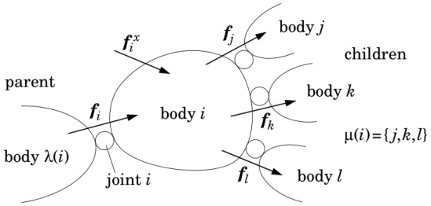{width=60%} Figure 5.1: Forces acting on body $i$

Step 1: Let $v_i$ and $a_i$ be the velocity and acceleration of body $i$. The velocity of any body in a kinematic tree can be defined recursively as the sum of the velocity of its parent and the velocity across the joint connecting it to its parent. Thus,

$$
\begin{array}{r} { \pmb { v } _ { i } = \pmb { v } _ { \lambda ( i ) } + \pmb { S } _ { i } \, \dot { \pmb { q } } _ { i } \, .  ( \pmb { v } _ { 0 } = \pmb { 0 } ) } \end{array}
$$

(Initial values are shown in brackets.) The recurrence relation for accelerations is obtained by differentiating this equation, resulting in

$$
a _ { i } = a _ { \lambda ( i ) } + S _ { i } \, \ddot { q } _ { i } + \dot { S } _ { i } \, \dot { q } _ { i } \, .  ( a _ { 0 } = 0 )
$$

Successive iterations of these two formulae, with $i$ ranging from 1 to $N_B$, will calculate the velocity and acceleration of every body in the tree.

Step 2: Let $f_{i}^{B}$ be the net force acting on body $i$. This force is related to the acceleration of body $i$ by the equation of motion

$$
\boldsymbol { f } _ { i } ^{B} = \boldsymbol { I } _ { i } \, \boldsymbol { a } _ { i } + \boldsymbol { v } _ { i } \, \times ^{*} \boldsymbol { I } _ { i } \, \boldsymbol { v } _ { i } \, .
$$

Step 3: Referring to Figure 5.1, let $f_i$ be the force transmitted from body $\lambda(i)$ to body $i$ across joint $i$, and let $f_i^x$ be the external force (if any) acting on body $i$. External forces can model a variety of environmental influences: force fields, physical contacts, and so on. They are regarded as inputs to the algorithm; that is, their values are assumed to be known. The net force on body $i$ is then

$$
f _ { i } ^{B} = f _ { i } + f _ { i } ^{x} - \sum _ { j \in \mu ( i ) } f _ { j } \, ,
$$

which can be rearranged to give a recurrence relation for the joint forces:

$$
f _ { i } = f _ { i } ^{B} - f _ { i } ^{x} + \sum _ { j \in \mu ( i ) } f _ { j } \, .
$$

Successive iterations of this formula, with $i$ ranging from $N_B$ down to 1, will calculate the spatial force across every joint in the tree. No initial values are required for this formula, as $\mu(i)$ is the empty set for any body with no children.

Having computed the spatial force across each joint, it remains only to calculate the generalized forces at the joints, which are given by

$$
\boldsymbol { \tau } _ { i } = \boldsymbol { S } _ { i } ^{\mathrm { T} } \boldsymbol { f } _ { i }
$$

(cf. Eq. 3.37). Equations 5.7 to 5.11 describe the recursive Newton Euler algorithm in its simplest form.

External forces can be used to model a variety of environmental influences, including gravitational forces. However, a uniform gravitational field can be modelled more efficiently as a fictitious acceleration of the base. To do this, we simply replace the initial value for Eq. 5.8 with $a_{0} = -a_{g}$, where $a_{g}$ is the gravitational acceleration vector. If this trick is used, then the calculated values of $a_{i}$ and $f_{i}^{B}$ are no longer the true acceleration and net force for body $i$, but are offset by the gravitational acceleration and force vectors, respectively. (The gravitational force on body $i$ is $I_{i}a_{g}$.)

# Algorithm Features

Equations 5.7 and 5.8 involve a propagation of data from the root to the leaves; Eq. 5.10 involves a propagation of data from the leaves to the root; and Eqs. 5.9 and 5.11 describe calculations that are local to each body. The recursive Newton-Euler algorithm is therefore a two-pass algorithm: it makes an outward pass through the tree, during which the velocities and accelerations are calculated, and then an inward pass, during which the joint forces are calculated. The calculation of body forces can be assigned to either the first or the second pass. The former is generally the better choice.

This algorithm calculates more that just $\tau_{i}$. Other quantities, like $\boldsymbol{v}_{i}$ and $\boldsymbol{f}_{i}$, can sometimes be useful. For example, one of the tasks of a machine designer is to select joint bearings of sufficient strength to withstand the dynamic reaction forces during operation. These forces can be calculated from $\boldsymbol{f}_{i}$.

By setting some inputs to zero, one can calculate specific components of the dynamics. For example, if the external force and joint velocity and acceleration terms are set to zero, but the fictitious base acceleration is retained, then the algorithm calculates only the gravity compensation terms—the terms that statically balance the force of gravity. Such terms are used in robot control systems. Alternatively, if we set gravity, acceleration and external force terms all to zero, but keep the joint velocities, then the algorithm calculates only the Coriolis and centrifugal terms. If efficiency is a concern, then a stripped-down version of the algorithm can be used to perform these specialized calculations. For example, if the objective is to calculate the gravity-compensation terms

only, then the algorithm simplifies to

$$
f _ { i } \; = \; - I _ { i } \, a _ { g } + \sum _ { j \in \mu ( i ) } f _ { j }
$$

$$
\boldsymbol { \tau } _ { i } \; = \; S _ { i } ^{\mathrm { T} } \, \boldsymbol { f } _ { i } \, .
$$

To calculate the actual gravity terms, replace $-I_{i}a_{g}$ with $I_{i}a_{g}$.

# Equations in Body Coordinates

Equations 5.7 to 5.11 express the algorithm without reference to any particular coordinate system. In practice, the algorithm works best if the calculations pertaining to body $i$ are performed in body $i$ coordinates (as defined in §4.2). This is the body-coordinates (or link-coordinates) version of the algorithm.

Let us transform the equations of the recursive Newton-Euler algorithm into body coordinates. The quantities $v_i$, $a_i$, $S_i$, $I_i$, $f_i$ and $f_i^B$ are now all considered to be expressed in body $i$ coordinates. Note that the system model already supplies $S_i$ and $I_i$ in these coordinates. Expressed in body coordinates, Eqs. 5.7 and 5.8 become

$$
\begin{array}{r} { v _ { i } = { } ^{i} \mathbf { X } _ { \lambda ( i ) } \, v _ { \lambda ( i ) } + S _ { i } \, \dot { q } _ { i }  \left( v _ { 0 } = \mathbf { 0 } \right) } \end{array}
$$

and

$$
a _ { i } = { } ^{i} \mathbf { X } _ { \lambda ( i ) } \, a _ { \lambda ( i ) } + S _ { i } \, \ddot { \mathbf { q } } _ { i } + \dot { S } _ { i } \, \dot { \mathbf { q } } _ { i } + v _ { i } \times S _ { i } \, \dot { \mathbf { q } } _ { i } \, .  ( a _ { 0 } = - a _ { g } )
$$

Compared with the original equations, the following changes have been made: a coordinate transform has been inserted to transform $v_{\lambda(i)}$ and $a_{\lambda(i)}$ from body $\lambda(i)$ coordinates to body $i$ coordinates; and the matrix $\dot{S}_i$ has been replaced with $\dot{S}_i + v_i \times S_i$, where $\dot{S}_i$ is the apparent derivative of $S_i$ in body coordinates. We have also taken the opportunity to replace the original initial acceleration value with $a_0 = -a_g$ to simulate the effect of gravity.

The joint calculation routine, jcalc, is able to supply the quantities $S_{i}$, $v_{\mathrm{J}i} = S_{i} \dot{q}_{i}$ and $c_{\mathrm{J}i} = \dot{S}_{i} \dot{q}_{i}$, all in body $i$ coordinates. We therefore modify Eqs. 5.14 and 5.15 as follows, in order to exploit the available data:

$$
\boldsymbol { v } _ { \mathrm { J } i } \; = \; \boldsymbol { S } _ { i } \; \dot { \boldsymbol { q } } _ { i }
$$

$$
c _ { \mathrm { J } i } \; = \; \dot { S } _ { i } \; \dot { q } _ { i }
$$

$$
\pmb { v } _ { i } \ = \ { } ^{i} \pmb { X } _ { \lambda ( i ) } \ v _ { \lambda ( i ) } + v _ { \mathrm { J } i }  \left( \pmb { v } _ { 0 } = \mathbf { 0 } \right)
$$

$$
\boldsymbol{a}_i\:=\:{}^i\boldsymbol{X}_{\lambda(i)}\:\boldsymbol{a}_{\lambda(i)}+\boldsymbol{S}_i\:\ddot{\boldsymbol{q}}_i+\boldsymbol{c}_{\text{J}i}+\boldsymbol{v}_i\times\boldsymbol{v}_{\text{J}i}\:.(\boldsymbol{a}_0=-\boldsymbol{a}_g)
$$

Equations 5.9 and 5.11 remain unchanged in the body-coordinates version, but Eq. 5.10 becomes

$$
f _ { i } = f _ { i } ^{B} - { } ^{i} \mathbf { X } _ { 0 } ^{*} \, f _ { i } ^{x} + \sum _ { j \in \mu ( i ) } { } ^{i} \mathbf { X } _ { j } ^{*} \, f _ { j } \, .
$$

Table 5.1: The recursive Newton-Euler equations and algorithm

| Basic Equations: | Algorithm: |
| --- | --- |
| $\boldsymbol{v}_0 = \boldsymbol{0}$ | $\boldsymbol{v}_0 = \boldsymbol{0}$ |
| $\boldsymbol{a}_0 = -\boldsymbol{a}_g$ | $\boldsymbol{a}_0 = -\boldsymbol{a}_g$ |
| $\boldsymbol{v}_i = \boldsymbol{v}_{\lambda(i)} + \boldsymbol{S}_i \, \dot{\boldsymbol{q}}_i$ | $for $i = 1$ to $N_B$ do$ |
| $\boldsymbol{a}_i = \boldsymbol{a}_{\lambda(i)} + \boldsymbol{S}_i \, \ddot{\boldsymbol{q}}_i + \dot{\boldsymbol{S}}_i \, \dot{\boldsymbol{q}}_i$ | $[\boldsymbol{X}_J, \boldsymbol{S}_i, \boldsymbol{v}_J, \boldsymbol{c}_J] = $ |
| $\boldsymbol{f}_i^B = \boldsymbol{I}_i \, \boldsymbol{a}_i + \boldsymbol{v}_i \times^* \boldsymbol{I}_i \, \boldsymbol{v}_i$ | $\text{jcalc}(\text{jtype}(i), \boldsymbol{q}_i, \dot{\boldsymbol{q}}_i)$ |
| $\boldsymbol{f}_i = \boldsymbol{f}_i^B - \boldsymbol{f}_i^x + \sum_{j \in \mu(i)} \boldsymbol{f}_j$ | $\boldsymbol{i} \boldsymbol{X}_{\lambda(i)} = \boldsymbol{X}_J \boldsymbol{X}_{\text{T}}(i)$ |
| $\boldsymbol{\tau}_i = \boldsymbol{S}_i^{\text{T}} \boldsymbol{f}_i$ | $\text{i} \boldsymbol{X}_0 = i \boldsymbol{X}_{\lambda(i)} \, \lambda(i) \boldsymbol{X}_0$ |
| Equations in Body Coordinates: | end |
| $\boldsymbol{v}_0 = \boldsymbol{0}$ | $\boldsymbol{v}_i = i \boldsymbol{X}_{\lambda(i)} \, \boldsymbol{v}_{\lambda(i)} + \boldsymbol{v}_J$ |
| $\boldsymbol{a}_0 = -\boldsymbol{a}_g$ | $\boldsymbol{a}_i = i \boldsymbol{X}_{\lambda(i)} \, \boldsymbol{a}_{\lambda(i)} + \boldsymbol{S}_i \, \ddot{\boldsymbol{q}}_i$ |
| $\boldsymbol{v}_{\text{J}i} = \boldsymbol{S}_i \, \dot{\boldsymbol{q}}_i$ | $\boldsymbol{f}_i = \boldsymbol{I}_i \, \boldsymbol{a}_i + \boldsymbol{v}_i \times^* \boldsymbol{I}_i \, \boldsymbol{v}_i - i \boldsymbol{X}_0^* \, \boldsymbol{f}_i^x$ |
| $\boldsymbol{c}_{\text{J}i} = \dot{\boldsymbol{S}}_i \, \dot{\boldsymbol{q}}_i$ | end |
| $\boldsymbol{v}_i = i \boldsymbol{X}_{\lambda(i)} \, \boldsymbol{v}_{\lambda(i)} + \boldsymbol{v}_{\text{J}i}$ | $$\text{for} \, i = N_B \text{to} \, 1$ do$ |
| $\boldsymbol{a}_i = i \boldsymbol{X}_{\lambda(i)} \, \boldsymbol{a}_{\lambda(i)} + \boldsymbol{S}_i \, \ddot{\boldsymbol{q}}_i + \boldsymbol{c}_{\text{J}i} + \boldsymbol{v}_i \times \boldsymbol{v}_{\text{J}i}$ | $\boldsymbol{\tau}_i = \boldsymbol{S}_i^{\text{T}} \boldsymbol{f}_i$ |
| $\boldsymbol{f}_i^B = \boldsymbol{I}_i \, \boldsymbol{a}_i + \boldsymbol{v}_i \times^* \boldsymbol{I}_i \, \boldsymbol{v}_i$ | $$\text{if} \, \lambda(i) \neq 0$ then$ |
| $\boldsymbol{f}_i^B = \boldsymbol{f}_i^B - i \boldsymbol{X}_0^* \, \boldsymbol{f}_i^x + \sum_{j \in \mu(i)} i \boldsymbol{X}_j^* \, \boldsymbol{f}_j$ | $\text{end}$ |
| $\boldsymbol{\tau}_i = \boldsymbol{S}_i^{\text{T}} \boldsymbol{f}_i$ | end |

In this equation, we have assumed that the external forces emanate from outside the system, and have therefore assumed that they are expressed in absolute (i.e., body 0) coordinates. Equations 5.16 to 5.20, together with 5.9 and 5.11, are the equations of the body-coordinates version of the recursive Newton-Euler algorithm.

# Algorithm Details

Table 5.1 shows the pseudocode for the body-coordinates version of the algorithm, together with the equations for both the basic version and the body-coordinates version. Bear in mind that the symbols $v_i$, $a_i$, etc. in the body-coordinates version are expressed in body coordinates, whereas the same symbols in the basic version represent either abstract vectors or coordinate vectors in an unspecified common coordinate system.

The two-pass structure of the algorithm is evident from the two for loops in the pseudocode. The symbols $\mathbf{X}_{\mathrm{J}}$, $\mathbf{v}_{\mathrm{J}}$ and $\mathbf{c}_{\mathrm{J}}$ are local variables that take new values on each iteration of the first loop. If the tree contains joints for which the velocity variables are not the derivatives of the position variables, then

simply replace the symbols $\dot{\boldsymbol{q}}_{i}$ and $\ddot{\boldsymbol{q}}_{i}$ with $\boldsymbol{\alpha}_{i}$ and $\dot{\boldsymbol{\alpha}}_{i}$, respectively. Likewise, if the tree contains any joints that depend explicitly on time, then jcalc will automatically calculate $\boldsymbol{v}_{\mathrm{J}}$ and $\boldsymbol{c}_{\mathrm{J}}$ using Eqs. 3.32 and 3.41 instead of 5.16 and 5.17; and the only change in the pseudocode is to pass the current time as a fourth argument to jcalc. The only place where $^{i}\boldsymbol{X}_{0}$ is used is to transform the external forces from base to body coordinates. If there are no external forces, then the if statement that calculates these transforms can be omitted.

In implementing Eq. 5.20, we have transformed it from a calculation using $\mu(i)$ to a calculation using $\lambda(i)$. A literal translation of Eq. 5.20 into pseudocode looks like this:

for $i = N_B$ to 1 do$f_i = f_i^B - {}^i X_0^* f_i^x$for each $j$ in $\mu(i)$ do$f_i = f_i + {}^i X_j^* f_j$endend

However, the same calculation can be performed in a different order, but with the same end result, by the code fragment

for $i=1$ to $N_{B}$ do$f_{i}=f_{i}^{B}-^{i}\mathbf{X}_{0}^{*}f_{i}^{x}$endfor $i=N_{B}$ to 1 doif $\lambda(i)\neq0$ then$f_{\lambda(i)}=\mathbf{f}_{\lambda(i)}+\lambda(i)\mathbf{X}_{i}^{*}f_{i}$endend

In merging this code fragment with the rest of the algorithm, the body of the first loop becomes the last line in the body of the first loop in the algorithm.

# 5.4 The Original Version

The recursive Newton-Euler algorithm was first described in a paper by Luh et al. (1980a), which was republished in Brady et al. (1982). This original algorithm was formulated using 3D vectors, and appears superficially to be quite different from the one described in Section 5.3. However, the two algorithms are actually almost the same, the only significant difference being that one uses spatial accelerations while the other uses classical accelerations (see §2.11).

Table 5.2 shows a special case of the original algorithm in which the joints are all revolute. One of the drawbacks of using 3D vectors to express rigid-body dynamics is that the equations are sensitive to joint type. The algorithm

Original Equations:

$$
\begin{array}{rl} { \pmb { \omega } _ { i } } & { = \stackrel { i } { \pmb { E } } _ { i - 1 } \pmb { \omega } _ { i - 1 } + \boldsymbol { z } \, \dot { \pmb { q } } _ { i } } \\{ \pmb { v } _ { i } } & { = \stackrel { i } { \pmb { E } } _ { i - 1 } \left( \pmb { v } _ { i - 1 } + \pmb { \omega } _ { i - 1 } \times \stackrel { i - 1 } { \mathrm { \textbf { \textit { 1 } } } } \pmb { r } _ { i } \right) } \\{ \pmb { \dot { \omega } } _ { i } } & { = \stackrel { i } { \pmb { E } } _ { i - 1 } \pmb { \dot { \omega } } _ { i - 1 } + \boldsymbol { z } \, \ddot { \pmb { q } } _ { i } + \left( \stackrel { i } { \pmb { E } } _ { i - 1 } \pmb { \omega } _ { i - 1 } \right) \times \boldsymbol { z } \, \dot { \pmb { q } } _ { i } } \\{ \pmb { \dot { v } } _ { i } } & { = \stackrel { i } { \pmb { E } } _ { i - 1 } \left( \dot { \pmb { v } } _ { i - 1 } + \dot { \pmb { \omega } } _ { i - 1 } \times \stackrel { i - 1 } { \mathrm { \textbf { \textit { 1 } } } } \pmb { r } _ { i } + \boldsymbol { \omega } _ { i - 1 } \times \stackrel { i - 1 } { \mathrm { \textbf { \textit { 1 } } } } \pmb { r } _ { i } \right) } \\{ \pmb { F } _ { i } } & { = \boldsymbol { m } _ { i } \left( \pmb { v } _ { i } + \pmb { \omega } _ { i } \times \pmb { c } _ { i } + \boldsymbol { \omega } _ { i } \times \pmb { \omega } _ { i } \times \pmb { c } _ { i } \right) } \\{ \pmb { N } _ { i } } & { = \pmb { I } _ { i } ^{c m} \pmb { \dot { \omega } } _ { i } + \pmb { \omega } _ { i } \times \pmb { I } _ { i } ^{c m} \pmb { \omega } _ { i } } \\{ \pmb { f } _ { i } } & { = \pmb { F } _ { i } + \stackrel { i } { \pmb { E } } _ { i + 1 } \pmb { f } _ { i + 1 } } \\{ \pmb { n } _ { i } } & { = \pmb { N } _ { i } + \pmb { c } _ { i } \times \pmb { F } _ { i } + \stackrel { i } { \pmb { E } } _ { i + 1 } \pmb { n } _ { i + 1 } + \stackrel { i } { \pmb { r } } _ { i + 1 } \times \stackrel { i } { \pmb { E } } _ { i + 1 } \pmb { f } _ { i + 1 } } \\{ \pmb { \mathcal { T } } _ { i } } & { = \boldsymbol { z } ^{\mathrm { T} } \pmb { n } _ { i } } \end{array}
$$

Symbols:

$\boldsymbol{\omega}_{i}, \dot{\boldsymbol{\omega}}_{i}$ angular velocity and acceleration of body $i$ linear velocity and acceleration of the origin of $F_{i}$ (body $i$ coordinate frame)

$F_{i}, N_{i}$ net force and moment on body $i$, expressed at its centre of mass

$f_{i}, n_{i}$ force and moment exerted on body $i$ through joint $i$

$m_{i}, c_{i}, I_{i}^{cm}$ mass, centre of mass, and rotational inertia about centre of mass for body $i$ in $F_{i}$ coordinates

$^{i}E_{i-1}$ $3 \times 3$ orthogonal rotation matrix transforming from $F_{i-1}$ to $F_{i}$ coordinates

$i-1r_{i}$ position of origin of $F_{i}$ relative to $F_{i-1}$, expressed in $F_{i-1}$ coordinates

$\dot{q}_{i}, \ddot{q}_{i}, \tau_{i}$ joint $i$ velocity, acceleration and force variables

$z$ direction of joint $i$ axis in $F_{i}$ coordinates

Correspondence with version in Table 5.1:

$$
\begin{gathered}\hat{v}_i=\begin{bmatrix}\boldsymbol{\omega}_i\\\boldsymbol{v}_i\end{bmatrix}\hat{a}_i=\begin{bmatrix}\dot{\boldsymbol{\omega}}_i\\\dot{\boldsymbol{v}}_i-\boldsymbol{\omega}_i\times\boldsymbol{v}_i\end{bmatrix}\hat{\boldsymbol{f}}_i^B=\begin{bmatrix}\boldsymbol{N}_i+\boldsymbol{c}_i\times\boldsymbol{F}_i\\\boldsymbol{F}_i\end{bmatrix}\hat{\boldsymbol{f}}_i=\begin{bmatrix}\boldsymbol{n}_i\\\boldsymbol{f}_i\end{bmatrix}\\^i\boldsymbol{X}_{i-1}=\begin{bmatrix}{}^i\boldsymbol{E}_{i-1}&\mathbf{0}\\-\boldsymbol{E}_{i-1}^{i-1}\boldsymbol{r}_i\times&\boldsymbol{E}_{i-1}\end{bmatrix}\hat{\boldsymbol{I}}_i=\begin{bmatrix}\boldsymbol{I}_i^{cm}-m_i\:\boldsymbol{c}_i\times\boldsymbol{c}_i\times&m_i\:\boldsymbol{c}_i\times\\-m_i\:\boldsymbol{c}_i\times&m_i\:\boldsymbol{1}\end{bmatrix}\\\boldsymbol{S}_i=\begin{bmatrix}\boldsymbol{z}\\\boldsymbol{0}\end{bmatrix}\boldsymbol{z}=\begin{bmatrix}0\\0\\1\end{bmatrix}\lambda(i)=i-1\mu(i)=\{i+1\}\end{gathered}
$$

described in Luh et al. (1980a) was formulated for both revolute and prismatic joints, and it is full of equations of the form

$$
{ \mathrm { v a r i a b l e } } = { \left\{ \begin{array}{ll} { { \mathrm { o n e ~ e x p r e s s i o n } } } & { { \mathrm { i f ~ j o i n t ~ i s ~ r e v o l u t e } } } \\{ { \mathrm { a n t h e r ~ e x p r e s s i o n } } } & { { \mathrm { i f ~ j o i n t ~ i s ~ p r i s m a t i c } } . } \end{array} \right. }
$$

The choice of 3D vector symbols in this table is a compromise between the notation used in this book and that used in other books that list this algorithm. The equations in this table are written for an unbranched kinematic tree, in line with how this algorithm is described elsewhere, but it is a simple matter to modify them to work on a branched tree.

Table 5.2 also shows the correspondence between the 3D vectors in the original algorithm and the spatial vectors in the algorithm shown in Table 5.1. There are only two places where the 3D vectors do not match the corresponding 3D component of a spatial vector: linear acceleration and net body moment. The latter is a trivial difference that is immediately rectified when $N_{i}$ is used to calculate $n_{i}$. It is caused by $N_{i}$ being calculated at the centre of mass instead of at the body coordinate system's origin. The former is a non-trivial difference, as it affects the quantities propagated from one body to the next.¹

One interesting feature of the original algorithm is that the linear velocity is never used in any subsequent expression, and therefore need not be calculated. This is a special property that arises from using classical accelerations. If the velocity calculation is omitted, then this algorithm is slightly more efficient than the spatial version. However, the difference is only a few percent, and is easily dwarfed by other efficiency-related matters, such as the choice of programming language, the computer hardware, and so on.

# 5.5 Additional Notes

The algorithm presented in Luh et al. (1980a) is the one that we usually regard as the recursive Newton-Euler algorithm. However, the idea of combining the Newton-Euler equations of motion with a recursive evaluation strategy predates this algorithm by a few years. In particular, one can see early forms of recursive Newton-Euler algorithms in Stepanenko and Vukobratovic (1976) and Orin et al. (1979). The algorithm has since been refined and optimized, and a few of these optimizations are covered in Chapter 10. Two of the fastest published versions can be found in He and Goldenberg (1989) and Balafoutis et al. (1988), the latter also appearing in Balafoutis and Patel (1991). At the time of

its invention, Lagrangian dynamics was more popular than Newton-Euler; and this prompted Hollerbach to devise a recursive Lagrangian algorithm, and to compare the computational complexities of various recursive and nonrecursive algorithms (Hollerbach, 1980). This is the work that contrasted the $O(n^4)$ complexity of the nonrecursive approach, as typified by the Uicker/Kahn algorithm (Kahn and Roth, 1971), with the $O(n)$ complexity of the recursive algorithms.

The impetus for this kind of research within the robotics community at that time was to develop an inverse dynamics algorithm that would be fast enough for use in real-time control of robot motion. An early example of this can be found in Luh et al. (1980b), although the operational-space formulation eventually became more popular (Khatib, 1987). The relatively slow speed of computers at the time led some researchers to investigate parallel-computer implementations (Lathrop, 1985), while others investigated symbolic optimization techniques (Murray and Neuman, 1984; Neuman and Murray, 1987). One interesting new direction is the development of efficient algorithms to calculate the partial derivative of inverse dynamics with respect to a design parameter. An example of this can be found in Fang and Pollard (2003).

# Chapter 6

# Forward Dynamics —

#Inertia Matrix Methods

Forward dynamics is the problem of finding the acceleration of a rigid-body system in response to given applied forces. It is used mainly for simulation; and it is sometimes called 'direct dynamics', or simply 'dynamics'. In this chapter and the next, we examine the forward dynamics of kinematic trees. The dynamics of closed-loop systems is covered in Chapter 8.

There are two main approaches to solving the forward dynamics problem for a kinematic tree:

form an equation of motion for the whole system, and solve it for the acceleration variables; or

propagate constraints from one body to the next in such a way that the accelerations can be calculated one joint at a time.

We examine the first approach in this chapter, and the second in Chapter 7. The first approach involves calculating the elements of an $n \times n$ joint-space inertia matrix, and then factorizing this matrix in order to solve a set of $n$ linear equations for the acceleration variables. Such algorithms have $O(n^3)$ complexity in the worst case, and are sometimes referred to collectively as $O(n^3)$ algorithms. However, it would be more accurate to describe them as $O(nd^2)$ algorithms, where $d$ is the depth of the tree. The second approach involves making a fixed number of passes through the tree, each pass performing a fixed number of calculations per body. Algorithms that take this approach have $O(n)$ complexity, and are therefore the best choice for systems containing a large number of bodies. However, the $O(nd^2)$ algorithms can match or slightly exceed the speed of the $O(n)$ algorithms on trees with only a few bodies, or that are branched enough to have a small depth. The $O(nd^2)$ algorithms are also an important component in closed-loop dynamics algorithms. The efficiency trade-off between these two approaches is discussed in Chapter 10.

This chapter commences with some basic material on how to solve the forward dynamics problem using the joint-space inertia matrix. Then Section 6.2 presents the composite-rigid-body algorithm, which is the fastest algorithm for calculating this matrix; and Section 6.3 presents a second derivation that reflects how the algorithm was originally discovered and described. The next two sections describe the phenomenon of branch-induced sparsity, and present two factorization algorithms to exploit it. This sparsity is the reason why the cost of calculating the joint-space inertia matrix is only $O(nd)$, and the cost of factorizing it only $O(nd^2)$. Finally, Section 6.6 presents some background material on the forward dynamics problem.

# 6.1 The Joint-Space Inertia Matrix

The equation of motion for a kinematic tree can be expressed in matrix form as

$$
\tau = H ( q ) \, \ddot { q } + C ( q , \dot { q } , f ^{x} ) \, ,
$$

where $q$, $\dot{q}$, $\ddot{q}$ and $\boldsymbol{\tau}$ are vectors of joint position, velocity, acceleration and force variables, $f^{x}$ is a vector of external forces (if any), $H$ is the joint-space inertia matrix, and $C$ is the joint-space bias force. $H$ and $C$ are the coefficients of the equation of motion, while $\boldsymbol{\tau}$ and $\ddot{\boldsymbol{q}}$ are the variables. This equation shows $H$ as a function of $q$, and $C$ as a function of $q$, $\dot{\boldsymbol{q}}$ and $f^{x}$. Once these functional dependencies are understood, they are usually omitted. The most useful piece of information they convey is the fact that $H$ depends only on the position variables. If the system is at rest, and there are no forces acting on it other than $\boldsymbol{\tau}$, then $C=0$ and the equation of motion simplifies to $\boldsymbol{\tau}=H\ddot{\boldsymbol{q}}$.

In the forward dynamics problem, $\tau$ is given, and the task is to calculate $\ddot{q}$. The methods described in this chapter solve the problem by the following procedure:

calculate $C$,

calculate $H$,

solve $H\ddot{q}=\tau-C$ for $\ddot{q}$.

These three steps have computational complexities of $O(n)$, $O(nd)$ and $O(nd^2)$, respectively, where $d$ is the depth of the tree. Given that $d$ is bounded by $d \leq n$, the worst-case complexities for steps 2 and 3 are $O(n^2)$ and $O(n^3)$. At the other extreme, if $d$ is subject to a fixed upper limit (which can happen in practice) then the complexity of all three steps is $O(n)$. As explained below, step 1 can be accomplished easily by an inverse dynamics algorithm, so this chapter is concerned mostly with steps 2 and 3.

$H$ is a symmetric, positive-definite, $n \times n$ matrix that is organised into an $N_B \times N_B$ array of submatrices. (Recall that $N_B = N_J$ for a tree.) If $n_i$ is the degree of freedom of joint $i$, then $H_{ij}$ is the $n_i \times n_j$ submatrix of $H$ occupying block-row $i$ and block-column $j$. If $p_i = \sum_{k=1}^{i} n_k$ then block-row $i$ consists of

rows $p_{i-1}+1$ to $p_{i}$ inclusive, and block-column $j$ consists of columns $p_{j-1}+1$ to $p_{j}$ inclusive. Physically, $\mathbf{H}_{ij}$ relates the acceleration at joint $j$ to the force at joint $i$. If every joint in the tree has only one degree of freedom, then $n=N_{B}$, and $\mathbf{H}_{ij}$ is the $1\times1$ matrix on row $i$ and column $j$ of $\mathbf{H}$.

Suppose we have an inverse dynamics calculation function, ID, like the one described in Chapter 5. This function performs the calculation

$$
\tau = \mathrm { I D } ( m o d e l , q , \dot { q } , \ddot { q } , f ^{x} ) \, .
$$

On comparing this expression with Eq. 6.1, it follows immediately that

$$
C = \operatorname { I D } ( m o d e l , \pmb { q } , \dot { \pmb { q } } , \mathbf { 0 } , \pmb { f } ^{x} )
$$

and

$$
H \ddot { q } = \mathrm { I D } ( m o d e l , q , \dot { q } , \ddot { q } , f ^{x} ) - C \, .
$$

Thus, the value of $\boldsymbol{C}$ can be obtained with a single call to ID, and the product of $\boldsymbol{H}$ with any desired vector is the difference between two calls to ID. Let us define a differential inverse dynamics function, $\mathrm{ID}_{\delta}$, which calculates the change in joint force corresponding to a change in desired acceleration. This function is given by

$$
\mathrm { I D } _ { \delta } ( m o d e l , \pmb { q } , \ddot { \pmb { q } } ) = \mathrm { I D } ( m o d e l , \pmb { q } , \dot { \pmb { q } } , \ddot { \pmb { q } } , \pmb { f } ^{x} ) - \mathrm { I D } ( m o d e l , \pmb { q } , \dot { \pmb { q } } , \mathbf { 0 } , \pmb { f } ^{x} ) \, .
$$

With this function, we can calculate column $\alpha$ of $H$ as follows:

$$
H \delta _ { \alpha } = \mathrm { I D } _ { \delta } ( m o d e l , \dot { q } , \delta _ { \alpha } ) \, ,
$$

where $\delta_{\alpha}$ is an $n$-dimensional coordinate vector having a 1 in its $\alpha^{\text{th}}$ element and zeros elsewhere. By repeating this calculation with $\alpha$ taking every value from 1 to $n$, we can calculate the whole of $\mathbf{H}$ one column at a time. This idea is the basis of methods 1 and 2 described in Walker and Orin (1982).

There is a great deal of cancellation of terms on the right-hand side of Eq. 6.4. In particular, every term depending on either $\dot{\boldsymbol{q}}$ or $\boldsymbol{f}^{x}$ cancels out, which is why these vectors have been omitted from the argument list of $\mathrm{ID}_{\delta}$. It is therefore possible to formulate a greatly simplified version of the recursive Newton-Euler algorithm specifically to calculate $\mathrm{ID}_{\delta}$. The equations and pseudocode for this algorithm are shown in Table 6.1. The pseudocode omits the calculation of $\boldsymbol{S}_{i}$ and ${}^{i}\boldsymbol{X}_{\lambda(i)}$ because they are assumed to be available as a by-product of calculating $\boldsymbol{C}$.

The algorithm in Table 6.1 has the advantage of being simple and straightforward. However, it is not the most efficient way to calculate $H$. The fastest algorithm for that job is the composite-rigid-body algorithm, which is the subject of the next section.

Table 6.1: Equations and algorithm to calculate $\tau = H\ddot{q}$

| Equations: | Algorithm: |  |
| --- | --- | --- |
| $a_i = {}^i \boldsymbol{X}_{\lambda(i)} \boldsymbol{a}_{\lambda(i)} + \boldsymbol{S}_i \ddot{\boldsymbol{q}}_i$ | $(a_0 = 0)$ | $a_0 = 0$ for $i = 1$ to $N_B$ do $a_i = {}^i \boldsymbol{X}_{j}^* \boldsymbol{f}_j$ |
| $\boldsymbol{f}_i = {}^i \boldsymbol{a}_i + \sum_{j \in \mu(i)} {}^i \boldsymbol{X}_{j}^* \boldsymbol{f}_j$ |  | $a_i = {}^i \boldsymbol{X}_{\lambda(i)} \boldsymbol{a}_{\lambda(i)} + \boldsymbol{S}_i \ddot{\boldsymbol{q}}_i$ $\boldsymbol{f}_i = {}^i \boldsymbol{a}_i$ |
| $\boldsymbol{\tau}_i = {}^i \boldsymbol{S}_i^{\text{T}} \boldsymbol{f}_i$ |  | $end for $i = N_B$ to $1$ do $\boldsymbol{\tau}_i = {}^i \boldsymbol{S}_i^{\text{T}} \boldsymbol{f}_i$ if $\lambda(i) \neq 0$ then $\boldsymbol{f}_{\lambda(i)} = \boldsymbol{f}_{\lambda(i)} + \lambda(i) \boldsymbol{X}_i^* \boldsymbol{f}_i$ end end$ |

# 6.2 The Composite-Rigid-Body Algorithm

The kinetic energy of a kinematic tree is the sum of the kinetic energies of its bodies. Thus,

$$
T = \frac { 1 } { 2 } \sum _ { k = 1 } ^{N _ { B} } v _ { k } ^{\mathrm { T} } \, I _ { k } \, v _ { k } \, .
$$

The velocity of body $k$ is given by

$$
{ \boldsymbol { v } } _ { k } = \sum _ { i \in \kappa ( k ) } { \boldsymbol { S } } _ { i } \, { \dot { \boldsymbol { q } } } _ { i } \, ,
$$

where $\kappa(k)$ is the set of joints that support body $k$; that is, the set of joints on the path between body $k$ and the base. (See §4.1.4 for descriptions of $\kappa(i)$, $\nu(i)$ and $\mu(i)$.) Substituting Eq. 6.6 into 6.5 gives

$$
T = \frac { 1 } { 2 } \sum _ { k = 1 } ^{N _ { B} } \sum _ { i \in \kappa ( k ) } \sum _ { j \in \kappa ( k ) } \dot { q } _ { i } ^{\mathrm { T} } S _ { i } ^{\mathrm { T} } I _ { k } \, S _ { j } \, \dot { q } _ { j } \, .
$$

Now, this equation is a sum over all $i,j,k$ triples in which both joint $i$ and joint $j$ support body $k$. It can therefore be rearranged into

$$
T = \frac { 1 } { 2 } \sum _ { i = 1 } ^{N _ { B} } \sum _ { j = 1 } ^{N _ { B} } \sum _ { k \in \nu ( i ) \cap \nu ( j ) } \dot { q } _ { i } ^{\mathrm { T} } S _ { i } ^{\mathrm { T} } I _ { k } \, S _ { j } \, \dot { q } _ { j } \, ,
$$

in which $\nu(i) \cap \nu(j)$ is the intersection of the set of bodies supported by joint $i$ and the set of bodies supported by joint $j$. Equation 6.8 is therefore a sum

over all $i,j,k$ triples in which body $k$ is supported both by joint $i$ and by joint $j$, which is the same sum as in Eq. 6.7. The value of $\nu(i) \cap \nu(j)$ is given by

$$
\nu ( i ) \cap \nu ( j ) = \left\{ \begin{array}{ll} { \nu ( i ) } & { \mathrm { i f ~ } i \in \nu ( j ) } \\{ \nu ( j ) } & { \mathrm { i f ~ } j \in \nu ( i ) } \\{ \emptyset } & { \mathrm { o t h e r w i s e } } \end{array} \right.
$$

where $\emptyset$ denotes the empty set.

Now, one of the properties of the joint-space inertia matrix is that the kinetic energy of the tree is given by the expression

$$
T = \frac { 1 } { 2 } \, \dot { q } ^{\mathrm { T} } H \dot { q } = \frac { 1 } { 2 } \sum _ { i = 1 } ^{N _ { B} } \sum _ { j = 1 } ^{N _ { B} } \, \dot { q } _ { i } ^{\mathrm { T} } H _ { i j } \, \dot { q } _ { j } \, .
$$

On comparing this equation with Eq. 6.8, it can be seen that

$$
H _ { i j } = \sum _ { k \in \nu ( i ) \cap \nu ( j ) } S _ { i } ^{\mathrm { T} } I _ { k } S _ { j } \, .
$$

Let us now introduce a new quantity, $I_{i}^{\mathrm{c}}$, which is the inertia of the subtree rooted at body $i$, treated as a single composite rigid body. (This is where the algorithm gets its name.) $I_{i}^{\mathrm{c}}$ is given by

$$
{ \boldsymbol { I } } _ { i } ^{c} = \sum _ { j \in \nu ( i ) } { \boldsymbol { I } } _ { j } \, ;
$$

and it can be computed recursively using the formula

$$
{ \cal I } _ { i } ^{\mathrm { c} } = { \cal I } _ { i } + \sum _ { j \in \mu ( i ) } { \cal I } _ { j } ^{\mathrm { c} } .
$$

Combining Eqs. 6.11, 6.12 and 6.9 produces the following formula for the joint-space inertia matrix:

$$
H _ { i j } = \left\{ \begin{array}{ll} { S _ { i } ^{\mathrm { T} } I _ { i } ^{\mathrm { c} } S _ { j } } & { \mathrm { i f ~ } i \in \nu ( j ) } \\{ S _ { i } ^{\mathrm { T} } I _ { j } ^{\mathrm { c} } S _ { j } } & { \mathrm { i f ~ } j \in \nu ( i ) } \\{ 0 } & { \mathrm { o t h e r w i s e } . } \end{array} \right.
$$

Equations 6.13 and 6.14 are the basic equations of the composite-rigid-body algorithm for a general kinematic tree. For the special case of an unbranched tree, these equations simplify to

$$
\boldsymbol { I } _ { i } ^{\mathrm { c} } = \boldsymbol { I } _ { i } + \boldsymbol { I } _ { i + 1 } ^{\mathrm { c} }
$$

and

$$
\begin{array}{r} { H _ { i j } = S _ { i } ^{\mathrm { T} } I _ { \operatorname* { m a x } ( i , j ) } ^{\mathrm { c} } S _ { j } \, . } \end{array}
$$

# Equations in Body Coordinates

Equation 6.13 can be expressed in body coordinates as

$$
I _ { i } ^{c} = I _ { i } + \sum _ { j \in \mu ( i ) } ^{i} X _ { j } ^{*} I _ { j } ^{c} { } ^{j} X _ { i } \, .
$$

In principle, Eq. 6.14 can be expressed in body coordinates as

$$
H _ { i j } = \left\{ \begin{array}{ll} { S _ { i } ^{\mathrm { T} } I _ { i } ^{c \, i} X _ { j } \, S _ { j } } & { \mathrm { i f ~ } i \in \nu ( j ) } \\{ S _ { i } ^{\mathrm { T} } { } ^{i} X _ { j } ^{*} I _ { j } ^{c} \, S _ { j } } & { \mathrm { i f ~ } j \in \nu ( i ) } \\{ 0 } & { \mathrm { o t h e r w i s e } . } \end{array} \right.
$$

However, to devise an efficient calculation scheme for this equation, it is necessary to define a new quantity, $^{j}F_{i}$, which is the value of $I_{i}^{c}S_{i}$ expressed in body $j$ coordinates; that is, $^{j}F_{i} = {}^{j}X_{i}^{*}I_{i}^{c}S_{i}$. To calculate $H$, we need one instance of $^{j}F_{i}$ for every $i,j$ pair satisfying $j \in \kappa(i)$. They can be calculated recursively using the formula

$$
\lambda ^{( j )} \pmb { F } _ { i } = \lambda ^{( j )} \pmb { X } _ { j } ^{* \; j} \pmb { F } _ { i } \; ,  \left( ^{i} \pmb { F } _ { i } = \pmb { I } _ { i } ^{c} \pmb { S } _ { i } \right)
$$

with $i$ taking every value in the range 1 to $N_{B}$, while $j$ progresses (separately for each $i$) through the values $i$, $\lambda(i)$, $\lambda(\lambda(i))$, and so on, back to the base. The joint-space inertia matrix is then given by

$$
H _ { i j } = \left\{ \begin{array}{ll} { { ^ j F _ { i } ^{\mathrm { T} } S _ { j } } } & { { \mathrm { i f ~ } i \in \nu ( j ) } } \\{ { H _ { j i } ^{\mathrm { T} } } } & { { \mathrm { i f ~ } j \in \nu ( i ) } } \\{ { 0 } } & { { \mathrm { o t h e r w i s e } . } } \end{array} \right.
$$

Equations 6.17, 6.19 and 6.20 are the equations of the composite rigid body algorithm in body coordinates.

# Algorithm Details

Table 6.2 shows the pseudocode for the body-coordinates version of the algorithm, together with both the basic equations and the equations for the body-coordinates algorithm. Bear in mind that the symbols $I_{i}$, $I_{i}^{\mathrm{c}}$ and $S_{i}$ in the basic version represent either abstract tensors or tensors expressed in an unspecified common coordinate system, whereas the same symbols in the body-coordinates equations represent quantities that are expressed in the coordinate system of body $i$. The pseudocode does not include code to calculate $S_{i}$ or ${}^{i}X_{\lambda(i)}$ because these quantities are assumed to be available as a by-product of applying the recursive Newton-Euler algorithm to calculate $C$ in Eq. 6.1.

In implementing Eq. 6.17, we have transformed it from a calculation using $\mu(i)$ to a calculation using $\lambda(i)$. A literal translation of Eq. 6.17 into pseudocode looks like this:

Table 6.2: The composite rigid body equations and algorithm

| Basic Equations: | Algorithm: |
| --- | --- |
| $I_i^{\mathrm{c}} = I_i + \sum_{j \in \mu(i)} I_j^{\mathrm{c}}$ | $H = 0$ for $i = 1$ to $N_B$ do $I_i^{\mathrm{c}} = I_i$ |
| $H_{ij} = \left\{ \begin{array}{ll} S_i^{\mathrm{T}} I_i^{\mathrm{c}} S_j & \text{if } i \in \nu(j) \\ S_i^{\mathrm{T}} I_j^{\mathrm{c}} S_j & \text{if } j \in \nu(i) \\ 0 & \text{otherwise} \end{array} \right.$ end for $i = N_B$ to $1$ do if $\lambda(i) \neq 0$ then $I_{\lambda(i)}^{\mathrm{c}} = I_{\lambda(i)}^{\mathrm{c}} + \lambda(i) X_i^* I_i^c i X_{\lambda(i)}$ |
| Equations for Body-Coordinates Algorithm: | $end end $F = I_i^{\mathrm{c}} S_i$ $H_{ij} = S_i^{\mathrm{T}} F$$ |
| $I_i^{\mathrm{c}} = I_i + \sum_{j \in \mu(i)} i X_j^* I_j^c j X_i$ | $j = i$ while $\lambda(j) \neq 0$ do $F = \lambda(j) X_j^* F$ |
| $\lambda(j) F_i = \lambda(j) X_j^* \overset{j}{j} F_i & \overset{i}{(i} F_i = I_i^c S_i)$ | $$j = \lambda(j) \overset{j}{j} F_i$ $H_{ij} = F^{\mathrm{T}} S_j$ $H_{ji} = H_{ij}^{\mathrm{T}}$ end end$ |

for $i=N_{B}$ to 1 do$I_{i}^{c}=I_{i}$for each $j$ in $\mu(i)$ do$I_{i}^{c}=I_{i}^{c}+^{i}X_{j}^{*}I_{j}^{c}X_{i}$endend

However, the same calculation can be performed in a different order, but with the same end result, using the following code fragment (cf. the implementation of Eq. 5.20 in §5.3):

for $i=1$ to $N_{B}$ do$I_{i}^{c}=I_{i}$endfor $i=N_{B}$ to 1 doif $\lambda(i)\neq0$ then$I_{\lambda(i)}^{c}=I_{\lambda(i)}^{c}+\lambda(i)X_{i}^{*}I_{i}^{c\stackrel{i}{*}}X_{\lambda(i)}$endend

The algorithm starts with two preparatory steps: setting $H$ to zero and setting each $I_i^c$ to $I_i$. The first step is included to remind the reader that

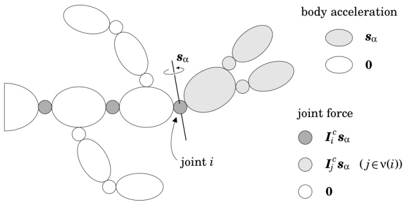{width=73%} Figure 6.1: Kinematic tree undergoing an acceleration of $\ddot{q}=\delta_{\alpha}$

the rest of the code will initialize only the nonzero submatrices in $H$. This step may or may not be necessary, depending on how $H$ is to be used. The main loop then implements the calculations for Eqs. 6.17, 6.19 and 6.20. $F$ is a local variable that is initially set to $I_{i}^{c}S_{i}$ (and therefore equal to $^{i}F_{i}$ in the equations). The while loop transforms this variable successively through the coordinate systems of every body $j$ on the path from body $i$ to the base (i.e., every $j \in \kappa(i)$), as it calculates the submatrices $H_{ij}$ and $H_{ji}$. Note that setting $H_{ji}$ will only be necessary if the upper triangle is to be accessed.

If $d$ is the depth of the kinematic tree, then the while loop will never execute more than $d-1$ times for any value of $i$. It therefore follows that the computational cost of the composite-rigid-body algorithm cannot be more than $O(nd)$, and that the number of nonzero elements in $\mathbf{H}$ is at most $O(nd)$. A detailed cost analysis appears in Section 10.3.2.

# 6.3 A Physical Interpretation

This section presents an alternative derivation of the composite-rigid-body algorithm that is closer to the original version, the purpose being to show some of the physical insights that played a role in the discovery of this algorithm.

As mentioned earlier, if the kinematic tree is at rest, and there are no forces acting on it other than $\tau$, then the equation of motion simplifies to $\tau = H\ddot{q}$. If we set $\ddot{q} = \delta_{\alpha}$ under these conditions, then $\tau$ will be the $\alpha^{\text{th}}$ column of $H$. Figure 6.1 shows what is happening in the tree when $\ddot{q} = \delta_{\alpha}$. The $\alpha^{\text{th}}$ variable in $\ddot{q}$ must belong to a joint. We therefore identify the joint that owns this variable, and call it joint $i$. Likewise, we identify the column in $S_i$ that corresponds to the $\alpha^{\text{th}}$ variable, and call it $s_{\alpha}$. ($s_{\alpha}$ is a spatial motion vector.) The motion of the tree can now be stated as follows: the acceleration across joint

$i$ is $s_{\alpha}$, and the acceleration across every other joint is zero. As a consequence, the acceleration of every body in the subtree supported by joint $i$ is $s_{\alpha}$, and every other body has an acceleration of zero. In other words,

$$
a _ { j } = \left\{ \begin{array}{ll} { s _ { \alpha } } & { \mathrm { i f ~ } j \in \nu ( i ) } \\{ \mathbf { 0 } } & { \mathrm { o t h e r w i s e } . } \end{array} \right.
$$

Let $f_{j}^{B}$ and $f_{j}$ be the net force on body $j$ and the total force transmitted across joint $j$, respectively. As there are no velocity terms, $f_{j}^{B}$ is given by

$$
\begin{array}{r} { f _ { j } ^{B} = I _ { j } \, a _ { j } = \left\{ \begin{array}{ll} { I _ { j } \, s _ { \alpha } } & { \mathrm { i f ~ } j \in \nu ( i ) } \\{ \mathbf { 0 } } & { \mathrm { o t h e r w i s e } . } \end{array} \right. } \end{array}
$$

Now, joint $j$ is the only connection between the subtree $\nu(j)$ and the rest of the system. As there are no forces acting on the bodies other than those transmitted across the joints, it follows that $f_j$ must be the net force acting on subtree $\nu(j)$. However, the net force on a subtree is also the sum of the net forces on the bodies in the subtree, so we have

$$
f _ { j } = \sum _ { k \in \nu ( j ) } f _ { k } ^{B} \, .
$$

Combining these two equations gives

$$
f _ { j } = \left\{ \begin{array}{ll} { \sum _ { k \in \nu ( j ) } I _ { k } \, s _ { \alpha } } & { \mathrm { i f ~ } j \in \nu ( i ) } \\{ \sum _ { k \in \nu ( i ) } I _ { k } \, s _ { \alpha } } & { \mathrm { i f ~ } j \in \kappa ( i ) } \\{ \mathbf { 0 } } & { \mathrm { o t h e r w i s e } , } \end{array} \right.
$$

which simplifies to

$$
f _ { j } = \left\{ \begin{array}{ll} { I _ { j } ^{\mathrm { c} } s _ { \alpha } } & { \mathrm { i f ~ } j \in \nu ( i ) } \\{ I _ { i } ^{\mathrm { c} } s _ { \alpha } } & { \mathrm { i f ~ } j \in \kappa ( i ) } \\{ 0 } & { \mathrm { o t h e r w i s e } } \end{array} \right.
$$

in view of Eq. 6.12. Finally, the joint force variables are given by

$$
\begin{array}{r} { \boldsymbol { \tau } _ { j } = \boldsymbol { S } _ { j } ^{\mathrm { T} } \boldsymbol { f } _ { j } = \left\{ \begin{array}{ll} { \boldsymbol { S } _ { j } ^{\mathrm { T} } \boldsymbol { I } _ { j } ^{\mathrm { c} } \boldsymbol { s } _ { \alpha } } & { \mathrm { i f ~ } j \in \nu ( i ) } \\{ \boldsymbol { S } _ { j } ^{\mathrm { T} } \boldsymbol { I } _ { i } ^{\mathrm { c} } \boldsymbol { s } _ { \alpha } } & { \mathrm { i f ~ } j \in \kappa ( i ) } \\{ \boldsymbol { 0 } } & { \mathrm { o t h e r w i s e } . } \end{array} \right. } \end{array}
$$

These are the subvectors of column $\alpha$ of $\mathbf{H}$.

The second case in Eq. 6.24 reveals the two key facts that led to the discovery of the composite-rigid-body algorithm: that $f_i$ is the product of a joint motion vector with a composite-rigid-body inertia, and that $f_j = f_i$ for all $j \in \kappa(i)$ (the dark-grey joints in Figure 6.1). The algorithm therefore consists of:

calculating the composite-rigid-body inertias via Eq. 6.17;

calculating $f_{i} = I_{i}^{\mathrm{c}} s_{\alpha}$ in body $i$ coordinates;

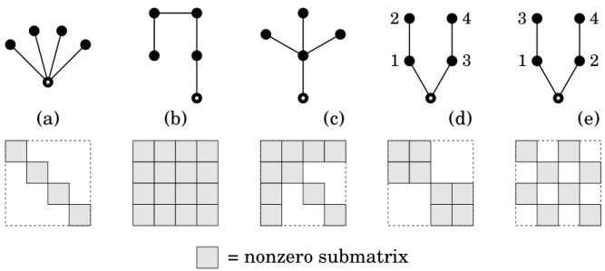{width=73%} Figure 6.2: Examples of branch-induced sparsity

transforming $f_{i}$ to the coordinate system of each body in $\kappa(i)$; and

calculating the elements of $H$ in the portion of column $\alpha$ above the main diagonal, and copying them to the portion of row $\alpha$ below the main diagonal, the two being the same because of symmetry.

The only difference between this algorithm and the one in Section 6.2 is that the latter processes the columns in blocks, rather than individually, one block being all of the columns pertaining to a single joint. If joint $i$ has $n_i$ degrees of freedom, then the quantity ${}^i\boldsymbol{F}_i$ in Eq. 6.19 is simply a $6 \times n_i$ matrix whose columns are the forces $\boldsymbol{f}_i = \boldsymbol{I}_i^c\boldsymbol{s}_\alpha$ for each $\alpha$ belonging to joint $i$.

# 6.4 Branch-Induced Sparsity

Equation 6.14 implies that some elements of $H$ will automatically be zero simply because of the connectivity. According to this equation, $H_{ij}$ will be zero whenever $i$ is neither an ancestor of $j$, nor a descendant, nor equal to $j$. This can happen only if $i$ and $j$ are on different branches of the tree, so we call it branch-induced sparsity.

Figure 6.2 shows some simple connectivity graphs and the sparsity patterns they produce. Example (a) shows an extreme case in which every body is connected directly to the base, resulting in the greatest possible amount of branch-induced sparsity. In this case, every off-diagonal submatrix is zero. More generally, $H$ will always be block diagonal (or a symmetric permutation thereof) if the base has more than one child. Example (b) shows the opposite extreme: the tree has no branches, and so there is no branch-induced sparsity. Example (c) shows a more typical sparsity pattern; and examples (d) and (e) illustrate the effect of the numbering scheme: two different numberings of the same graph produce matrices that are symmetric permutations of each other.

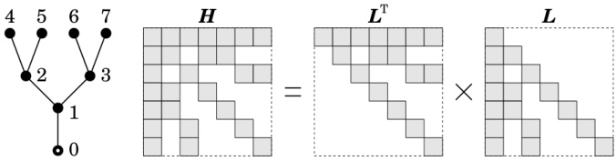{width=74%} Figure 6.3: Preservation of sparsity in the factor!

In principle, these two matrices have the same underlying sparsity pattern, and the choice of numbering does not affect our ability to exploit it.

It is often the case that branch-induced sparsity can affect a substantial proportion of the elements of $\mathbf{H}$. We can get a rough estimate of its beneficial effect using the following rule of thumb: if $\mathbf{H}$ has a density of $\rho$, then the cost of calculating it is roughly $\rho$ times the cost of calculating a dense $\mathbf{H}$ of the same size, and the cost of factorizing it is roughly $\rho^2$ times the cost of factorizing a dense matrix of the same size. $\rho$ is defined to be the proportion of elements in $\mathbf{H}$ that are not branch-induced zeros, so $0 < \rho \leq 1$. It is not unusual to encounter densities of around 0.5, and densities close to zero are possible. Overall, the effect of branch-induced sparsity is to make inertia-matrix methods more efficient on branched kinematic trees than they are on unbranched trees of the same size.

The composite-rigid-body algorithm automatically exploits branch-induced sparsity, simply by calculating only the nonzero submatrices of $\mathbf{H}$. However, if we were to try and factorize the resulting matrix using a standard factorization algorithm, then it would treat the matrix as dense, and perform $O(n^3)$ arithmetic operations. Therefore, in order to fully exploit the sparsity, we need a factorization algorithm for matrices containing branch-induced sparsity. This turns out to be an easy problem to solve, the solution being to factorize $\mathbf{H}$ into either $\mathbf{L}^\text{T}\mathbf{L}$ or $\mathbf{L}^\text{T}\mathbf{D}\mathbf{L}$, and design the factorization algorithm to skip over the branch-induced zeros.

In the sparse matrix literature, the factorization $H = L^{\mathrm{T}}L$ would be described as a reordered Cholesky factorization, meaning that it is equivalent to performing a standard Cholesky factorization on a permutation of the original matrix (George and Liu, 1981). Likewise, the factorization $H = L^{\mathrm{T}}DL$ would be described as a reordered $LDL^{\mathrm{T}}$ factorization. This implies that the $L^{\mathrm{T}}L$ and $L^{\mathrm{T}}DL$ factorizations have the same numerical properties as the standard Cholesky and $LDL^{\mathrm{T}}$ factorizations.

The special property of an $L^{\mathrm{T}}L$ or $L^{\mathrm{T}}DL$ factorization, when applied to a matrix containing branch-induced sparsity, is that the factorization proceeds without fill-in. In other words, every branch-induced zero element in the matrix remains zero throughout the factorization process. (This is proved in Featherstone (2005).) A factorization with this property is said to be optimal (Duff

# LTL factorization:

# 

LIDL factorization:

for $k=n$ to $1$ do

$H_{kk}=\sqrt{H_{kk}}$

$i=\lambda(k)$

while $i\neq0$ do

$H_{ki}=H_{ki}/H_{kk}$

$i=\lambda(i)$

end

$H_{ij}=H_{ij}-aH_{kj}$

while $i\neq0$ do

$H_{ij}=H_{ij}-aH_{kj}$

$j=i$

end

$H_{ij}=H_{ij}-aH_{kj}$

$j=\lambda(j)$

end

$H_{ki}=a$

$H_{ki}=a$

$H_{ij}=H_{ij}-H_{ki}H_{kj}$

$j=\lambda(i)$

end

end

end

end LTDL factorization:

# Table 6.3: $L^{\mathrm{T}}L$ and $L^{\mathrm{T}}DL$ factorization algorithms

et al., 1986). One immediate consequence is that the sparsity pattern of $H$ is preserved in the resulting factors, which are therefore also sparse. Figure 6.3 illustrates this effect, showing both the original pattern and the pattern in the resulting triangular factors. This sparsity can be exploited during back-substitution. A second consequence of the no-fill-in property is that the branch-induced zeros can be ignored completely during the factorization process.

# 6.5 Sparse Factorization Algorithms

Table 6.3 presents the pseudocode for the sparse $L^{\mathrm{T}}L$ and $L^{\mathrm{T}}DL$ factorization algorithms. These algorithms expect to be given two inputs: an $n \times n$ matrix $H$ and an $n$-element integer array $\lambda$. $H$ is expected to be symmetric and positive definite, and the elements of $\lambda$ are expected to satisfy $0 \leq \lambda(i) < i$. In addition, $H$ is expected to have the following sparsity pattern, which is optimally exploited by the algorithms: On each row $k$ of $H$, the nonzero elements below the main diagonal appear only in columns $\lambda(k)$, $\lambda(\lambda(k))$, and so on. This rule identifies the set of elements that the algorithms will treat as being nonzero. All other elements are assumed to be zero, and are ignored. If $\lambda(k) = k - 1$ for all $k$, then the algorithms treat every element as nonzero, in which case they perform a dense-matrix $L^{\mathrm{T}}L$ or $L^{\mathrm{T}}DL$ factorization.

Figure 6.4 shows how the algorithms work. They both operate in situ on the given matrix, and never access any element above the main diagonal. The $L^{\mathrm{T}}L$

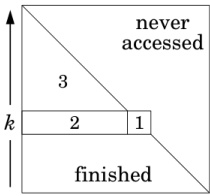{width=23%}

LTL

$H_{kk}=\sqrt{H_{kk}}$

do nothing

$H_{ki}=H_{ki}/H_{kk}$

2a. $H'_{ki}=H_{ki}/H_{kk}$

$H_{ij}=H_{ij}-H_{ki}H_{kj}$

$H_{ij}=H_{ij}-H_{ki}H_{kj}$

2b. $H_{ki}=H'_{ki}$

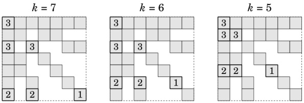{width=65%} Figure 6.4: Illustration of the factorization process

algorithm computes $L$ and returns it in the lower triangle of $H$. The $L^{\mathrm{T}}DL$ algorithm computes $D$ and $L$, returns $D$ on the main diagonal, and returns the off-diagonal elements of $L$ below it. This works because the algorithm computes a unit lower-triangular matrix, so its diagonal elements are known to have the value 1, and therefore do not need to be returned.

Each algorithm has an outer loop that visits each row in turn, working from $n$ back to 1. At any stage in the factorization process, rows $k+1$ to $n$ are finished, and contain rows $k+1$ to $n$ of the returned factors. Rows 1 to $k$ can be divided into three areas, as shown in the diagram. Area 1 consists of just the element $H_{k,k}$; area 2 consists of elements 1 to $k-1$ of row $k$; and area 3 consists of the triangular region from rows 1 to $k-1$. A different calculation takes place in each area, as shown in the figure. The pseudocode for the $L^{\mathrm{T}}L$ factorization performs the area-2 and area-3 calculations in two separate loops; but the pseudocode for the $L^{\mathrm{T}}DL$ factorization interleaves these calculations in such a way that it never needs to remember more than one $H'_{ki}$ value at any point. The current remembered value is stored in the local variable $a$.

The inner loops are designed to iterate only over the values $\lambda(k)$, $\lambda(\lambda(k))$, and so on. This is where the sparsity is exploited. In effect, the algorithms know where the zeros are, and simply skip over them. Figure 6.4 illustrates the cost reduction by showing the first three steps in the factorization of the matrix $H$ from Figure 6.3. At $k=7$, the algorithms perform two lots of the area-2 calculation and three lots of the area-3 calculation; and similarly at $k=6$ and $k=5$. This is far fewer than the number of calculations that would have been necessary if there had been no zeros.

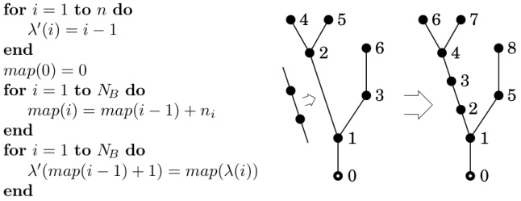{width=71%} Table 6.4: Algorithm for calculating the expanded parent array, and illustration of the expanded connectivity graph

# Expanding the Parent Array

The parent array for a kinematic tree contains $N_B$ elements, but the factorization algorithms require an array with $n$ elements. If $n = N_B$ then no action is required. Otherwise, an expanded parent array must be constructed for use in the factorization process.

Table 6.4 presents an algorithm to do this, and an illustration of what the algorithm does. Essentially, we start with the original connectivity graph, and replace each multi-freedom joint with a chain of single-freedom joints. This produces an expanded graph in which every arc represents a single joint variable. This new graph is renumbered so that arc $i$ represents the $i^{\text{th}}$ variable in $\ddot{q}$; and the expanded parent array is computed from this graph. The illustration shows the original and expanded connectivity graphs for a kinematic tree in which joint 2 has three degrees of freedom, but every other joint has only one. Arc 2 is therefore replaced by a chain of three arcs, and the new tree is renumbered so that each arc number equals the index of its variable in $\ddot{q}$. As the variables for joint 2 occupy the second, third and fourth places in $\ddot{q}$, the new arcs must be numbered 2, 3 and 4. The parent array for the original graph is (0,1,1,2,2,3); and the parent array for the expanded graph is (0,1,2,3,1,4,4,5).

The algorithm in Table 6.4 calculates an expanded parent array, $\lambda'$, directly from the original. The first step is to initialize $\lambda'$ to the array $(0,1,2,\ldots,n-1)$. This is a clever trick that correctly initializes $n-N_B$ of the elements in $\lambda'$, leaving only $N_B$ elements to be computed from $\lambda$. The second loop constructs a mapping array such that $map(i)=\sum_{j=1}^{i}n_j$, where $n_j$ is the degree of freedom of joint $j$. (The variables of joint $i$ appear in $\ddot{\mathbf{q}}$ at locations $map(i-1)+1$ to $map(i)$ inclusive.) The third loop performs two mappings rolled into one: the value stored in $\lambda(i)$ is converted to $map(\lambda(i))$, which is the correct value to be inserted into $\lambda'$; and this value is inserted into $\lambda'$ at location $map(i-1)+1$, which is the correct place to put it. For the example shown in the table, the mapping array is $(0,1,4,5,6,7,8)$ (indexed from zero); the two entries in $\lambda'$

【此段建议校对(This paragraph is recommended for proofreading)】修正后的文本如下：

\[\underline{y}\=L x\ \text{for}\ \i=\n\ \text{to}\ \n\]

\[\y_{\i}\=L_{\i\i}} x_{\i}\]

\[\j=\lambda(\i)\\]

\[\text{while}\ \j \ne \ \text{do}\ \]

\[\y_{\i}\=\y_{\i}\ L_{\i\}i} x_{\j}\]

\[\j=\lambda(\j)\]

\[\underline{y}\= \ \]

\[\y_{\j}\=\y_{\j}\ L_{\j\i} x_{\i}\]

\[\j=\lambda(\j)\\]

\[\end{y}\= \ \ \]

\[\y_{\i}\=\y_{\i}\ HH_{\i\j}}} x_{\j}\]

\[\y_{\j}\=\y_{\j}\ HH_{\j\i}}}} x_{\i}\]

\[\j=\lambda(\j)\\]

\[\endunderline{y}\= \ \

that are correctly initialized in the first loop are $\lambda'(3)$ and $\lambda'(4)$; the elements $\lambda(1)\cdots\lambda(3)$ are mapped unaltered to $\lambda'(1)$, $\lambda'(2)$ and $\lambda'(5)$; and $\lambda(4)\cdots\lambda(6)$ are incremented by 2 and mapped to $\lambda'(6)\cdots\lambda'(8)$.

Having computed the expanded parent array once, it should be stored in the system model for future use by the factorization algorithms.

# Back-Substitution

The sparsity pattern in $H$ appears also in $L$; so it is possible to exploit the sparsity in $L$ using the same techniques as for $H$. Table 6.5 presents algorithms to calculate the quantities $Lx$, $L^{\text{T}}x$, $L^{-1}x$ and $L^{-\text{T}}x$ for a general vector $x$, given only $\lambda$, $L$ and $x$. Back-substitution makes use of $L^{-1}x$ and $L^{-\text{T}}x$. The table also presents an algorithm to calculate $Hx$. In every case, the sparsity is exploited by having the inner loop iterate over only the nonzero elements of $L$ or $H$. The algorithms assume that $L$ is a general lower-triangular factor, such as that produced by the $L^{\text{T}}L$ factorization. To modify them to work with a unit lower-triangular factor, simply replace $L_{ii}$ with 1.

The algorithms that calculate $Lx$ $L^{\mathrm{T}}x$ and $Hx$ place the result in a separate vector, $y$, and leave $x$ unaltered. The $Lx$ algorithm allows $y$ to be the same vector as $x$, in which case it works in situ; but the other two require $y \neq x$. The algorithms that calculate $L^{-1}x$ and $L^{-\mathrm{T}}x$ both work in situ.

Table 6.6: Computational cost of sparse algorithms

|  | LTL | LTDL |
| --- | --- | --- |
| factorization | n√ + D 1 d + D 2 (m+a) | D 1 d + D 2 (m+a) |
| back-substitution | 2nd + 2D 1 (m+a) | nd + 2D 1 (m+a) |
| Lx, L T x | nm + D 1 (m+a) | D 1 (m+a) |
| L -1 x, L -T x | nd + D 1 (m+a) | D 1 (m+a) |
| Hx | nm + 2D 1 (m+a) |  |

To implement $y = L^{-1}x$ or $y = L^{-\mathrm{T}}x$, simply copy $x$ to $y$ and apply the algorithm to $y$.

# Computational Cost

Table 6.6 presents computational cost figures for each algorithm. The symbols m, a, d and $\sqrt{}$ denote the cost of a floating-point multiplication, addition, division and square-root calculation, respectively. The quantities $D_{1}$ and $D_{2}$ depend on the sparsity pattern in $\mathbf{H}$, and are given by

$$
D _ { 1 } = \sum _ { k = 1 } ^{n} ( d _ { k } - 1 )
$$

and

$$
D _ { 2 } = \sum _ { k = 1 } ^{n} \frac { d _ { k } ( d _ { k } - 1 ) } { 2 } ,
$$

where $d_{k}$ is the number of joints on the path between body $k$ and the base (i.e., $d_{k}=|\kappa(k)|$), and can be regarded as the depth of body $k$ in the tree. The expressions $d_{k}-1$ and $d_{k}(d_{k}-1)/2$ count the number of times that area-2 and area-3 calculations are performed during the processing of row $k$; so $D_{1}$ and $D_{2}$ count the total number of area-2 and area-3 calculations, respectively. $D_{1}$ is also the total number of nonzero elements below the main diagonal. Thus, the number of nonzero elements in $\mathbf{H}$ is $n+2D_{1}$. If there is no branch-induced sparsity, then $D_{1}$ and $D_{2}$ take their maximum possible values, which are

$$
D _ { 1 } = ( n ^{2} - n ) / 2  \mathrm { a n d }  D _ { 2 } = ( n ^{3} - n ) / 6 \, .
$$

Plugging these values into the formulae in Table 6.6 produces cost figures that are identical to those of the standard Cholesky and $LDL^{\mathrm{T}}$ factorization algorithms. If $d$ denotes the depth of the tree, defined as the depth of the deepest body, then $D_{1}$ and $D_{2}$ are bounded by

$$
D _ { 1 } \leq n ( d - 1 )  \mathrm { a n d }  D _ { 2 } \leq n d ( d - 1 ) / 2 \, .
$$

These bounds show that the factorization process is at worst $O(nd^2)$.

# 6.6 Additional Notes

One of the earliest examples of a dynamics algorithm is due to Uicker (1965, 1967). It combined the $4 \times 4$ matrix representation of kinematics developed by Denavit and Hartenberg (1955) with a $4 \times 4$ pseudoinertia matrix, and used Lagrangian techniques to obtain the equation of motion for a closed-loop mechanism. At about the same time, Hooker and Margulies (1965) used vectorial (Newton-Euler) dynamics and augmented bodies to obtain the equations of motion for a free-floating kinematic tree representing a satellite. By the mid 1970s, there were already several computer programs available to calculate the forward dynamics of various kinds of rigid-body system; and an excellent review of these early works can be found in Paul (1975). One early idea that proved to be particularly successful is the sparse-matrix formulation used in the program ADAMS (Orlandea et al., 1977). The earliest textbook on computational rigid-body dynamics appeared at this time (Wittenburg, 1977). It presented a detailed method for constructing computer-oriented models of general rigid-body systems, and for calculating their dynamics.

The composite-rigid-body algorithm first appeared as method 3 in Walker and Orin (1982). It provided a new method for calculating the joint-space inertia matrix of a kinematic tree, which was substantially faster than previous methods. More efficient versions of this algorithm, and some variations on the basic idea, appeared subsequently in Featherstone (1984, 1987); Balfoutis and Patel (1989, 1991); Lilly and Orin (1991); Lilly (1993); McMillan and Orin (1998). However, the phenomenon of branch-induced sparsity was not recognized until Featherstone (2005).

The first example of a propagation method for forward dynamics appeared in Vereshchagin (1974). In this paper, the dynamics was formulated using Gauss' principle of least constraint, and the resulting minimization solved via dynamic programming. The algorithm in this paper is practically the same as the articulated-body algorithm, but its significance was not recognized until after the articulated-body algorithm had been published. The next example of a propagation algorithm appeared in Armstrong (1979), followed by the preliminary version of the articulated-body algorithm in Featherstone (1983), and then the complete version in Featherstone (1984, 1987). More efficient versions then appeared in Brandl et al. (1988); McMillan and Orin (1995); McMillan et al. (1995). A few other algorithms have turned out to be practically the same as the articulated-body algorithm; for example, the forward dynamics algorithm of Rodriguez et al. (Rodriguez, 1987; Rodriguez et al., 1991) and the $O(n)$ algorithm in Rosenthal (1990).

Superficially, it would seem that the inertia-matrix methods and propagation methods are very different. However, two interesting connections have been found. Drawing on Kalman filter theory, Rodriguez et al. present two factorizations of the joint-space inertia matrix: one implies the recursive Newton-Euler algorithm, while the other has an inverse that implies the articulated-body algorithm (Rodriguez, 1987; Rodriguez et al., 1991). The other connection was

found by Ascher et al. (1997). Starting with an equation similar in form to Eq. 3.18, they show that the joint-space inertia matrix can be obtained by applying Gaussian elimination to one permutation of the coefficient matrix, while the articulated-body algorithm arises from applying Gaussian elimination to another permutation of this matrix.

Strictly speaking, inertia-matrix and propagation methods are only two out of three possible strategies for calculating the forward dynamics of a kinematic tree. The third possibility is to assemble the equations of motion of the individual bodies, together with the equations of constraint, to form a single large matrix equation (as shown in Chapter 3, for example). This strategy is very useful for closed-loop systems, but it is not competitive with inertia-matrix and propagation methods when applied to kinematic trees. An example of this class of algorithm can be found in Baraff (1996).

# Chapter 7

# Forward Dynamics —

#Propagation Methods

The forward dynamics problem presents us with two sets of unknowns: the joint accelerations and the joint constraint forces. It is usually not possible to solve for any of these unknowns locally at any one body; but it is possible to formulate equations that they must satisfy. Propagation methods work by calculating the coefficients of such equations locally, and propagating them to neighbouring bodies, until we eventually reach a point where we can solve the dynamics locally at one particular body. Having the solution at this one body, it becomes possible to solve the dynamics at neighbouring bodies, and so on, until the whole problem is solved. In principle, the process is akin to solving a linear equation by first triangularizing the coefficient matrix, and then solving it by back-substitution. Indeed, some propagation algorithms have been formulated via this analogy (e.g. see Ascher et al., 1997; Rosenthal, 1990; Saha, 1997). Propagation algorithms are more complicated than inertia-matrix algorithms, but they have a computational complexity of $O(N_B)$, which is the theoretical minimum for solving the forward dynamics problem.

The articulated-body algorithm is the prime example of a propagation algorithm, and it is the fastest for calculating the forward dynamics of a kinematic tree. Most of this chapter is devoted to a description of this algorithm and its attendant concepts, like articulated-body inertia. The final two sections take a broader view of the subject, and present some of the techniques and equations that form the basis of other algorithms.

# 7.1 Articulated-Body Inertia

Articulated-body inertia is the inertia that a body appears to have when it is part of a rigid-body system. Consider the rigid body $B$ shown in diagram (a) of Figure 7.1. The relationship between the applied force, $f$, and the resulting

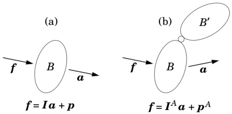{width=50%} Figure 7.1: Comparing a rigid body (a) with an articulated body (b)

acceleration, $a$, is given by the body's equation of motion:

$$
f = I a + p \, .
$$

The coefficients $I$ and $p$ in this equation are the rigid-body inertia and bias force, respectively, of body $B$. Now consider the two-body system shown in diagram (b), in which a second body, $B'$, has been connected to $B$ via a joint. The effect of this second body is to alter the acceleration response of $B$, so that the relationship between $f$ and $a$ is now given by

$$
f = I ^{A} \, a + p ^{A} \, .
$$

This is an articulated-body equation of motion. It has the same algebraic form as Eq. 7.1, but different coefficients. The quantities $I^{A}$ and $p^{A}$ in this equation are the articulated-body inertia and bias force of body $B$ in the two-body system comprising $B$, $B'$ and the connecting joint.

An equation like 7.2 describes the acceleration response of a single rigid body, taking into account the dynamic effects of a specific set of other bodies and joints. We call this body a handle, and we call the system containing it an articulated body. Thus, the handle is the body to which $I^{A}$ and $p^{A}$ refer; and the articulated body is the rigid-body system, or subsystem, whose dynamic effects are included in $I^{A}$ and $p^{A}$. In Figure 7.1(b), the handle is body $B$ and the articulated body is the whole two-body system.

# Basic Properties

Articulated-body inertias share the following properties with rigid-body inertias: they are symmetric, positive-definite matrices; they are mappings from $\mathbf{M}^{6}$ to $\mathbf{F}^{6}$; and they obey the same coordinate transformation rule. However, articulated-body inertias are mappings from acceleration to force, not velocity to momentum, so expressions like $\mathbf{I}^{A}\boldsymbol{v}$ and $\frac{1}{2}\boldsymbol{v}^{\mathrm{T}}\boldsymbol{I}^{A}\boldsymbol{v}$, where $\boldsymbol{v}$ denotes a velocity, do not make sense. An articulated body may consist of just a single rigid body, in which case the articulated-body and rigid-body inertias and bias forces are the same. This provides a starting point for recursive calculation methods.

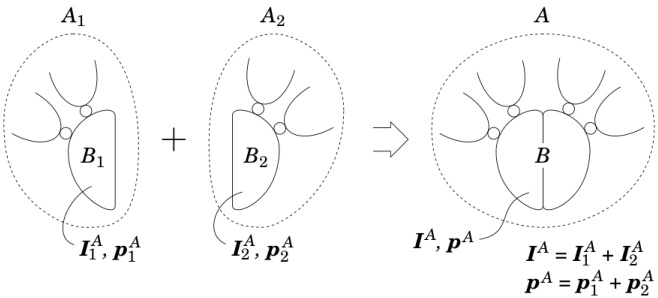{width=72%} Figure 7.2: Addition of articulated-body inertias and bias forces

Articulated-body inertias depend only on the inertias of the member bodies and the constraints imposed by the member joints. Thus, they are functions of the joint position variables, but not the velocity variables or the various force terms. In this respect, they resemble generalized inertia matrices. The velocity terms, external force terms (other than $f$), and so on, appear only in the bias forces. In 3D space, 21 parameters are required to define a general articulated-body inertia, compared with only 10 for a rigid-body inertia. In 2D space, 6 parameters are required to define a general articulated-body inertia, compared with only 4 for a rigid-body inertia. Note that 21 and 6 are the numbers of independent values in a symmetric $6 \times 6$ and $3 \times 3$ matrix, respectively. In general, the apparent mass of an articulated-body inertia varies with the direction of applied force, and it does not have a centre of apparent mass. (See Example 7.1.)

# Addition

Addition is defined on articulated-body inertias, and the physical interpretation of this operation is illustrated in Figure 7.2. This figure shows two articulated bodies, $A_{1}$ and $A_{2}$, that are being joined to form a single articulated body, $A$. The connection is made by gluing bodies $B_{1}$ and $B_{2}$ together to form a new body, $B$. If the symbols $\boldsymbol{I}_{i}^{A}$, $\boldsymbol{p}_{i}^{A}$, $\boldsymbol{I}^{A}$ and $\boldsymbol{p}^{A}$ denote the articulated-body inertias and bias forces for $B_{i}$ in $A_{i}$ and $B$ in $A$, respectively, then $\boldsymbol{I}^{A}=\boldsymbol{I}_{1}^{A}+\boldsymbol{I}_{2}^{A}$ and $\boldsymbol{p}^{A}=\boldsymbol{p}_{1}^{A}+\boldsymbol{p}_{2}^{A}$.

# Inverse Inertia

Equation 7.2 assumes the handle has six degrees of freedom. If this is not the case, then the more general equation

$$
a = \Phi ^{A} f + b ^{A}
$$

must be used instead. In this equation, $\boldsymbol{\Phi}^{A}$ and $\boldsymbol{b}^{A}$ are the handle's articulated-body inverse inertia and bias acceleration, respectively (cf. Eq. 2.72). An equation in this form always exists. If the handle has six degrees of freedom, then $\boldsymbol{\Phi}^{A}=(\boldsymbol{I}^{A})^{-1}$ and $\boldsymbol{b}^{A}=-\boldsymbol{\Phi}^{A}\boldsymbol{p}^{A}$. Otherwise, $\boldsymbol{\Phi}^{A}$ is singular, and its rank equals the handle's degree of motion freedom. Articulated-body inverse inertias are symmetric, positive-semidefinite matrices, and they transform like rigid-body inverse inertias.

# Multiple Handles

It is possible for an articulated body to have more than one handle. If we number the handles from 1 to $h$, and define the vectors $f_i$ and $a_i$ to be the force and acceleration associated with handle $i$, then Eq. 7.3 generalizes to

$$
\left[ \begin{array}{l} { a _ { 1 } } \\{ a _ { 2 } } \\{ \vdots } \\{ a _ { h } } \end{array} \right] = \left[ \begin{array}{llll} { \Phi _ { 1 } ^{A} } & { \Phi _ { 12 } ^{A} } & { \cdots } & { \Phi _ { 1 h } ^{A} } \\{ \Phi _ { 21 } ^{A} } & { \Phi _ { 2 } ^{A} } & { \cdots } & { \Phi _ { 2 h } ^{A} } \\{ \vdots } & { \vdots } & { \ddots } & { \vdots } \\{ \Phi _ { h 1 } ^{A} } & { \Phi _ { h 2 } ^{A} } & { \cdots } & { \Phi _ { h } ^{A} } \end{array} \right] \left[ \begin{array}{l} { f _ { 1 } } \\{ f _ { 2 } } \\{ \vdots } \\{ \vdots } \\{ f _ { h } } \end{array} \right] + \left[ \begin{array}{l} { b _ { 1 } ^{A} } \\{ b _ { 2 } ^{A} } \\{ \vdots } \\{ b _ { h } ^{A} } \end{array} \right]
$$

In this equation, $\boldsymbol{\Phi}_{i}^{A}$ and $\boldsymbol{b}_{i}^{A}$ are the articulated-body inverse inertia and bias acceleration for handle $i$, and $\boldsymbol{\Phi}_{ij}^{A}$ is the cross-coupling term that describes the acceleration caused at handle $i$ by the application of a force to handle $j$. The coefficient matrix is symmetric and positive-semidefinite, and its rank equals the total number of independent degrees of motion freedom possessed by the set of handles. If the rank is $6h$ then Eq. 7.4 can be inverted to obtain a multi-handle equivalent of Eq. 7.2.

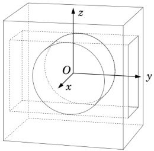{width=28%} Figure 7.3: An articulated body

Example 7.1 Figure 7.3 shows an articulated body consisting of a box with a slot, and a cylinder that fits inside the slot. The cylinder has two degrees of freedom relative to the box: it can rotate about the $x$ axis, and it can translate in the $y$ direction. The contact between the two bodies is assumed to

be frictionless. Both bodies have their centres of mass at the origin. The box has a mass of $m_{1}$ and a rotational inertia about its centre of mass of $I_{1}$ (i.e., its rotational inertia matrix is $I_{1}$ times the identity matrix); and the cylinder has a mass of $m_{2}$ and a rotational inertia of $I_{2}$.

Let us treat the box as the handle, and calculate its articulated-body inertia. If we apply a force to the box along either the $x$ or the $z$ axis, then the two bodies will move as one, and the resulting acceleration will be $1/(m_{1}+m_{2})$ times the magnitude of the applied force; but if we apply a force along the $y$ axis, then only the box will move, and the resulting acceleration will be $1/m_{1}$ times the magnitude of the applied force. Likewise, if a pure couple is applied to the box about either the $y$ or the $z$ axes, then the two bodies will rotate as one, and the apparent inertia will be $I_{1}+I_{2}$; but a pure couple about the $x$ axis will cause only the box to rotate, and the apparent inertia will be $I_{1}$. The complete articulated-body inertia matrix is therefore

$$
\begin{array}{r} { I ^{A} = \left[ \begin{array}{lllllll} { I _ { 1 } } & { 0 } & { 0 } & { 0 } & { 0 } & { 0 } & { 0 } \\{ 0 } & { I _ { 1 } + I _ { 2 } } & { 0 } & { 0 } & { 0 } & { 0 } & { 0 } \\{ 0 } & { 0 } & { I _ { 1 } + I _ { 2 } } & { 0 } & { 0 } & { 0 } & { 0 } \\{ 0 } & { 0 } & { 0 } & { m _ { 1 } + m _ { 2 } } & { 0 } & { 0 } & { 0 } \\{ 0 } & { 0 } & { 0 } & { 0 } & { m _ { 1 } } & { 0 } & { 0 } \\{ 0 } & { 0 } & { 0 } & { 0 } & { 0 } & { 0 } & { m _ { 1 } + m _ { 2 } } \end{array} \right] } \end{array}
$$

Observe that the apparent mass varies with direction: the box appears to have more mass in the $x$ and $z$ directions than in the $y$ direction.

In this particular example, the handle exhibits a centre of apparent mass, which is located at the origin. Any pure force applied to the handle along a line passing through this point causes a pure linear acceleration of the handle. Such a point does not exist in general.

# 7.2 Calculating Articulated-Body Inertias

There are two basic strategies for calculating articulated-body inertias: projection and assembly. In the projection method, the equation of motion for the whole articulated body is projected onto the motion space of the handle (or handles). In the assembly method, an articulated body is assembled step-by-step from its component parts, and a sequence of articulated-body inertias are computed along the way. The projection method is commonly used to calculate operational-space inertias, which are used in robot control systems (Khatib, 1987, 1995); and the assembly method is used in $O(n)$ dynamics algorithms.

# 7.2.1 The Projection Method

An articulated body is a rigid-body system. It therefore has an equation of motion that can be expressed in generalized coordinates as

$$
H \ddot { q } + C = \tau \ ,
$$

where $C$ accounts for every force acting on the system except the force acting on the handle. Let $v$, $a$ and $f$ denote the spatial velocity and acceleration of the handle, and the spatial force acting on it. If $J$ is the Jacobian that maps $\dot{q}$ to $v$ according to $v = J\dot{q}$, then it defines the following relationships between $f$ and $\tau$, and between $a$ and $\ddot{q}$:

$$
\tau = J ^{\mathrm { T} } f
$$

and

$$
a = J \ddot { q } + J \dot { q } \, .
$$

Combining these equations gives

$$
\begin{array}{r} { a \, = \, J H ^{- 1} ( J ^{\mathrm { T} } f - C ) + \dot { J } \dot { q } } \\{ = \, \dot { \Phi } ^{A} f + b ^{A} , } \end{array}
$$

where

$$
\boldsymbol { \Phi } ^{A} = J \boldsymbol { H } ^{- 1} \boldsymbol { J } ^{\mathrm { T} }
$$

and

$$
b ^{A} = \dot { J } \dot { q } - J H ^{- 1} C .
$$

These are the general equations for an articulated-body inverse inertia and bias acceleration. They apply to any articulated body, and they are independent of the choice of generalized coordinates. If the handle has a full six degrees of motion freedom, then $\Phi^{A}$ is invertible, and we can define

$$
f = I ^{A} a + p ^{A} ,
$$

where

$$
I ^{A} = ( J H ^{- 1} J ^{\mathrm { T} } ) ^{- 1}
$$

and

$$
p ^{A} = - I ^{A} b ^{A} .
$$

Many of the basic properties of articulated-body inertias can be deduced from Eq. 7.12. For example, given that $\boldsymbol{H}$ is symmetric and positive-definite, it follows that $\boldsymbol{I}^{A}$ must also be symmetric and positive-definite; and it is obvious that $\boldsymbol{I}^{A}$ does not depend on velocity or force terms. Some basic properties of $\boldsymbol{\Phi}^{A}$ that follow from Eq. 7.9 are:

$$
\begin{aligned}\operatorname{rank}(\boldsymbol{\Phi}^A)&=\operatorname{rank}(\boldsymbol{J})\:,\\\operatorname{range}(\boldsymbol{\Phi}^A)&=\operatorname{range}(\boldsymbol{J})\:,\\\operatorname{null}(\boldsymbol{\Phi}^A)&=\operatorname{null}(\boldsymbol{J}^\mathrm{T})\:.\end{aligned}
$$

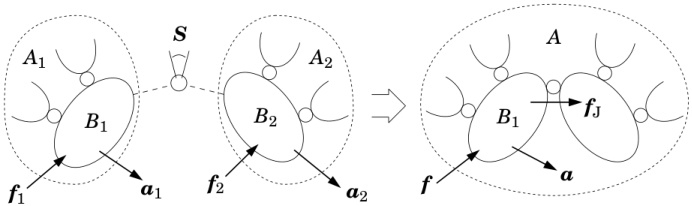{width=76%} Figure 7.4: Construction of a larger articulated body from two smaller ones

# Multiple Handles

The projection method is easily extended to articulated bodies with more than one handle. Suppose there are $h$ handles, and let $a_i$, $f_i$ and $J_i$ be the acceleration, force and Jacobian pertaining to handle $i$. If we redefine the quantities $a$, $f$ and $J$ to be

$$
a = \left[ \begin{array}{l} { a _ { 1 } } \\{ \vdots } \\{ a _ { h } } \end{array} \right] ,  f = \left[ \begin{array}{l} { f _ { 1 } } \\{ \vdots } \\{ f _ { h } } \end{array} \right]  \mathrm { a n d }  J = \left[ \begin{array}{l} { J _ { 1 } } \\{ \vdots } \\{ J _ { h } } \end{array} \right] ,
$$

then Eqs. 7.6 to 7.14 immediately apply to the multiple-handle case.

# 7.2.2 The Assembly Method

In the assembly method, we regard a given articulated body as an assembly of smaller articulated bodies; and we calculate its inertia and bias force from those of its component parts. Thus, the assembly method is suitable for use in recursive algorithms. In principle, the assembly method is general. However, we shall consider here only the special case in which every articulated body is a floating kinematic tree—a kinematic tree with no connection to a fixed base. This is the case that is needed for the articulated-body algorithm. The special properties of this case are: that every articulated body has one handle; that every handle has a full six degrees of freedom; and that every assembly operation consists of connecting one handle to another via a single joint. More general cases are covered in Sections 7.4 and 7.5.

Figure 7.4 shows a pair of articulated bodies, $A_{1}$ and $A_{2}$, in the process of being assembled into a larger articulated body, $A$. The assembly operation consists of connecting the two handles, $B_{1}$ and $B_{2}$, with a joint. Prior to the assembly, the articulated-body equations for $B_{1}$ and $B_{2}$ are

$$
f _ { 1 } = I _ { 1 } ^{A} \, a _ { 1 } + p _ { 1 } ^{A}
$$

and

$$
f _ { 2 } = I _ { 2 } ^{A} \, a _ { 2 } + p _ { 2 } ^{A} \, .
$$

After the assembly, $B_{1}$ serves as the handle for the new articulated body, and its equation is

$$
f = I ^{A} \, a _ { 1 } + p ^{A} \, .
$$

The objective is to express $I^{A}$ and $p^{A}$ in terms of $I_{1}^{A}$, $I_{2}^{A}$, $p_{1}^{A}$, $p_{2}^{A}$ and the motion constraint imposed by the new joint.

When the assembly is made, the new joint introduces a new force, $f_{\mathrm{J}}$, which is the total force transmitted through the joint from $B_{1}$ to $B_{2}$. The relationships between the force variables are therefore

$$
\begin{array}{rl} { f _ { 1 } } & { { } = f - f _ { \mathrm { J } } \, , } \\{ f _ { 2 } } & { { } = f _ { \mathrm { J } } \, . } \end{array}
$$

The value of $f_{\mathrm{J}}$ is unknown, but it imposes the motion constraint

$$
a _ { 2 } - a _ { 1 } = S \ddot { q } + c \, ,
$$

and it satisfies

$$
S ^{\mathrm { T} } f _ { \mathrm { J } } = \tau \, .
$$

In these equations, $\ddot{\boldsymbol{q}}$ and $\boldsymbol{\tau}$ are the joint's acceleration and force variables, respectively, $\boldsymbol{S}$ is the joint's motion subspace matrix, and $\boldsymbol{c}=\dot{S}\dot{\boldsymbol{q}}$ (or $\dot{S}\dot{\boldsymbol{q}}+\dot{\boldsymbol{\sigma}}$ if the joint depends on time). $\ddot{\boldsymbol{q}}$ is unknown, but $\boldsymbol{\tau}$, $\boldsymbol{S}$ and $\boldsymbol{c}$ are given. By combining these equations with Eq. 7.16, we can calculate $\ddot{\boldsymbol{q}}$ as follows:

$$
\begin{array}{rl} { \pmb { \tau } } & { = \pmb { S } ^{\mathrm { T} } \pmb { f } _ { 2 } } \\& { = \pmb { S } ^{\mathrm { T} } ( \pmb { I } _ { 2 } ^{A} \pmb { a } _ { 2 } + \pmb { p } _ { 2 } ^{A} ) } \\& { = \pmb { S } ^{\mathrm { T} } ( \pmb { I } _ { 2 } ^{A} ( \pmb { a } _ { 1 } + \pmb { c } + \pmb { S } \ddot { \pmb { q } } ) + \pmb { p } _ { 2 } ^{A} ) \, , } \end{array}
$$

SO

$$
\ddot { q } = \left( S ^{\mathrm { T} } I _ { 2 } ^{A} S \right) ^{- 1} \left( \tau - S ^{\mathrm { T} } ( I _ { 2 } ^{A} ( a _ { 1 } + c ) + p _ { 2 } ^{A} ) \right) .
$$

The matrix $S^{\mathrm{T}}I_{2}^{A}S$ is positive definite, and therefore invertible. Having solved for $\ddot{q}$, we can now construct an equation relating $f$ to $a_{1}$ as follows:

$$
\begin{aligned}f&=\boldsymbol{f}_1+\boldsymbol{f}_2\\&=\boldsymbol{I}_1^A\boldsymbol{a}_1+\boldsymbol{I}_2^A\boldsymbol{a}_2+\boldsymbol{p}_1^A+\boldsymbol{p}_2^A\\&=\boldsymbol{I}_1^A\boldsymbol{a}_1+\boldsymbol{I}_2^A(\boldsymbol{a}_1+\boldsymbol{c}+\boldsymbol{S}\ddot{\boldsymbol{q}})+\boldsymbol{p}_1^A+\boldsymbol{p}_2^A\\&=\boldsymbol{I}_1^A\boldsymbol{a}_1+\boldsymbol{I}_2^A(\boldsymbol{a}_1+\boldsymbol{c}+\boldsymbol{S}\left(\boldsymbol{S}^\mathrm{T}\boldsymbol{I}_2^A\boldsymbol{S}\right)^{-1}\left(\boldsymbol{\tau}-\boldsymbol{S}^\mathrm{T}(\boldsymbol{I}_2^A(\boldsymbol{a}_1+\boldsymbol{c})+\boldsymbol{p}_2^A))\right)\\&+\boldsymbol{p}_1^A+\boldsymbol{p}_2^A.\end{aligned}
$$

This equation has the same form as Eq. 7.17, and yields the following formulae for $I^{A}$ and $p^{A}$:

$$
\pmb { I } ^{A} = \pmb { I } _ { 1 } ^{A} + \pmb { I } _ { 2 } ^{A} - \pmb { I } _ { 2 } ^{A} \, S \, ( \pmb { S } ^{\mathrm { T} } \pmb { I } _ { 2 } ^{A} \, S ) ^{- 1} \, S ^{\mathrm { T} } \pmb { I } _ { 2 } ^{A}
$$

and

$$
p ^{A} = p _ { 1 } ^{A} + p _ { 2 } ^{A} + I _ { 2 } ^{A} c + I _ { 2 } ^{A} \, S \, ( S ^{\mathrm { T} } I _ { 2 } ^{A} \, S ) ^{- 1} \, ( \tau - S ^{\mathrm { T} } ( I _ { 2 } ^{A} c + p _ { 2 } ^{A} ) ) \, .
$$

With these formulae, we can compute the articulated-body inertia and bias force for any handle in any articulated body, provided only that the articulated body is a floating kinematic tree.

# Assembling Subtrees

The three articulated bodies in Figure 7.4 were labelled $A_{1}$, $A_{2}$ and $A$ merely for identification purposes, with no particular significance in the numbers 1 and 2. In practice, we would typically define a set of articulated bodies, $A_{1} \cdots A_{N_{B}}$, such that $A_{i}$ contained all of the bodies in the subtree rooted at body $i$, with body $i$ serving as the handle (e.g. see Figure 7.5). In this circumstance, the most useful assembly formulae are the ones that tell how to calculate $\boldsymbol{I}_{i}^{A}$ and $\boldsymbol{p}_{i}^{A}$ from the inertias and bias forces pertaining to the children of body $i$; that is, the quantities $\boldsymbol{I}_{j}^{A}$ and $\boldsymbol{p}_{j}^{A}$ for all $j \in \mu(i)$. Without repeating the algebra, these formulae are

$$
I _ { i } ^{A} = I _ { i } + \sum _ { j \in \mu ( i ) } I _ { j } ^{a}
$$

and

$$
{ \boldsymbol { p } } _ { i } ^{A} = { \boldsymbol { p } } _ { i } + \sum _ { j \in \mu ( i ) } { \boldsymbol { p } } _ { j } ^{a} ,
$$

where $I_{i}$ and $p_{i}$ are the rigid-body inertia and bias force for body $i$, and

$$
I _ { j } ^{a} = I _ { j } ^{A} - I _ { j } ^{A} \, S _ { j } \, ( S _ { j } ^{\mathrm { T} } I _ { j } ^{A} S _ { j } ) ^{- 1} \, S _ { j } ^{\mathrm { T} } I _ { j } ^{A}
$$

and

$$
\begin{array}{r} { p _ { j } ^{a} = p _ { j } ^{A} + I _ { j } ^{a} c _ { j } + I _ { j } ^{A} S _ { j } \left( S _ { j } ^{\mathrm { T} } I _ { j } ^{A} S _ { j } \right) ^{- 1} \left( \tau _ { j } - S _ { j } ^{\mathrm { T} } p _ { j } ^{A} \right) . } \end{array}
$$

Essentially, these equations are obtained by applying Eqs. 7.19 and 7.20 once for each child of body $i$. On each application, $A_1$ consists of body $i$ plus every child subtree that has already been processed, and $A_2$ is the next child subtree to be added.

The quantities $I_{j}^{a}$ and $p_{j}^{a}$ are the result of propagating $I_{j}^{A}$ and $p_{j}^{A}$ across joint $j$. They can be regarded as the apparent inertia and bias force of a massless handle that is connected to body $j$ through joint $j$. In this case, the formulae in Eqs. 7.21 and 7.22 have the effect of gluing all of these massless handles to body $i$ (see Figure 7.2). $I_{j}^{a}$ and $p_{j}^{a}$ have one more interesting property: they express the force across a joint as a function of the parent body's acceleration, whereas $I_{j}^{A}$ and $p_{j}^{A}$ express this same force as a function of the child's acceleration:

$$
\begin{array}{rl} { f _ { j } } & { = \ I _ { j } ^{A} a _ { j } + p _ { j } ^{A} } \\& { = \ I _ { j } ^{a} a _ { \lambda ( j ) } + p _ { j } ^{a} . } \end{array}
$$

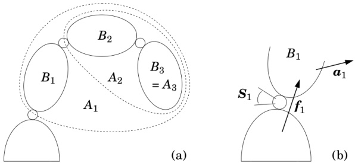{width=65%} Figure 7.5: Aspects of the articulated-body algorithm: (a) defining the articulated bodies, and (b) solving for the acceleration of joint 1

$I_{j}^{a}$ plays two roles in improving the efficiency of propagation calculations. First, it allows the two terms involving $c$ in Eq. 7.20 to be collected into a single term, as shown in Eq. 7.24. Second, it has the property $I_{j}^{a}S_{j}=\mathbf{0}$. Depending on the value of $S_{j}$, this property implies that one or more rows and columns of $I_{j}^{a}$ will be zero. For example, if $S_{j}=[0\ 0\ 1\ 0\ 0\ 0]^{\mathrm{T}}$ (i.e., joint $j$ is revolute), then row and column 3 of $I_{j}^{a}$ will be zero. This fact can be exploited to achieve a modest reduction in the cost of calculating articulated-body inertias.

# 7.3 The Articulated-Body Algorithm

Suppose we have a kinematic tree containing $N_B$ rigid bodies. We can define a set of articulated bodies, $A_1 \cdots A_{N_B}$, such that $A_i$ contains all of the bodies and joints in the subtree rooted at body $i$. A simple example is shown in Figure 7.5(a). Observe that body $i$ ($B_i$) is in $A_i$ but joint $i$ is not. We define $B_i$ to be the handle of $A_i$; and define $I_i^A$ and $p_i^A$ to be the articulated-body inertia and bias force for $B_i$ in $A_i$.

Consider the motion of $B_{1}$, as shown in Figure 7.5(b). If $f_{1}$ is the force transmitted across joint 1, then the equation of motion for $B_{1}$ is

$$
f _ { 1 } = I _ { 1 } ^{A} a _ { 1 } + p _ { 1 } ^{A} .
$$

Now, joint 1 constrains the acceleration of $B_{1}$ to satisfy

$$
a _ { 1 } = a _ { 0 } + c _ { 1 } + S _ { 1 } \, \ddot { q } _ { 1 } \, ,
$$

where $a_{0}$ is the known acceleration of the base, and $c_{1}=\dot{S}_{1}\dot{q}_{1}$. The joint also constrains the transmitted force to satisfy

$$
\begin{array}{r} { \boldsymbol { S } _ { 1 } ^{\mathrm { T} } \boldsymbol { f } _ { 1 } = \boldsymbol { \tau } _ { 1 } \, . } \end{array}
$$

From these three equations we get

$$
S _ { 1 } ^{\mathrm { T} } ( I _ { 1 } ^{A} ( a _ { 0 } + c _ { 1 } + S _ { 1 } \, \ddot { q } _ { 1 } ) + p _ { 1 } ^{A} ) = \tau _ { 1 } \, ,
$$

which can be solved for $\ddot{q}_{1}$, giving

$$
\ddot { q } _ { 1 } = \left( S _ { 1 } ^{\mathrm { T} } I _ { 1 } ^{A} S _ { 1 } \right) ^{- 1} ( \tau _ { 1 } - S _ { 1 } ^{\mathrm { T} } I _ { 1 } ^{A} \left( a _ { 0 } + c _ { 1 } \right) - S _ { 1 } ^{\mathrm { T} } p _ { 1 } ^{A} ) ) \, .
$$

Consider what we have just achieved. Simply knowing $I_{1}^{A}$ and $p_{1}^{A}$ has allowed us to calculate $\ddot{q}_{1}$ directly, without needing to know the values of any of the other acceleration variables. This is possible because Eq. 7.26 already accounts for the dynamic effect of every body in $A_{1}$ on the acceleration response of $B_{1}$. Having calculated $\ddot{q}_{1}$, it can be substituted into Eq. 7.27 to give the spatial acceleration of $B_{1}$. This, in turn, allows us to repeat the process with the children of $B_{1}$, and so on. In the general case, if the acceleration of body $\lambda(i)$ is known, then the acceleration of body $i$ and joint $i$ can be calculated as follows:

$$
\ddot { q } _ { i } = ( S _ { i } ^{\mathrm { T} } I _ { i } ^{A} S _ { i } ) ^{- 1} ( \tau _ { i } - S _ { i } ^{\mathrm { T} } I _ { i } ^{A} ( a _ { \lambda ( i ) } + c _ { i } ) - S _ { i } ^{\mathrm { T} } p _ { i } ^{A} ) )
$$

and

$$
a _ { i } = a _ { \lambda ( i ) } + c _ { i } + S _ { i } \, \ddot { q } _ { i } \, .
$$

Therefore, if the articulated-body inertias and bias forces are known, then the forward dynamics of the kinematic tree can be calculated using these two equations, with $i$ ranging from 1 to $N_{B}$.

# Algorithm

The articulated-body algorithm calculates the forward dynamics of a kinematic tree in $O(N_B)$ arithmetic operations, in exactly the manner outlined above. It makes three passes over the tree, as follows: an outward pass (root to leaves) to calculate velocity and bias terms; an inward pass to calculate articulated-body inertias and bias forces; and a second outward pass to calculate the accelerations.

Pass 1 The job of the first pass is to calculate the velocity-product accelerations, $c_{i}$, and the rigid-body bias forces, $p_{i}$, for use in later passes. Both are functions of the body velocities, $v_{i}$, so it is necessary to calculate these as well. The equations of the first pass are:

$$
\begin{array}{rl} { v _ { \mathrm { J } i } } & { { } = S _ { i } \, \dot { q } _ { i } \, , } \end{array}
$$

$$
c _ { \mathrm { J } i } \; = \; \dot { S } _ { i } \; \dot { q } _ { i } \; ,
$$

$$
\begin{array}{r} { v _ { i } \ = \ v _ { \lambda ( i ) } + v _ { J i } \ ,  \left( v _ { 0 } = 0 \right) } \end{array}
$$

$$
c _ { i } \ = \ c _ { \mathrm { J } i } + v _ { i } \times v _ { \mathrm { J } i } \ ,
$$

$$
p _ { i } \; = \; v _ { i } \, \times ^{*} \, I _ { i } \, v _ { i } - f _ { i } ^{x} \, .
$$

They are similar to the equations of the first pass in the recursive Newton-Euler algorithm, as shown in Table 5.1. The vectors $\boldsymbol{v}_{\mathrm{J}_{i}}$ and $\boldsymbol{c}_{\mathrm{J}_{i}}$ will have values of $S_{i} \dot{\boldsymbol{q}}_{i}+\boldsymbol{\sigma}_{i}$ and $\dot{S}_{i} \dot{\boldsymbol{q}}_{i}+\dot{\boldsymbol{\sigma}}_{i}$, respectively, if joint $i$ depends explicitly on time (see §3.5); but the calculation details are handled by jcalc (§4.4). $\boldsymbol{f}_{i}^{x}$ is the external force, if any, acting on body $i$.

Pass 2 The next step is to calculate the articulated-body inertias and bias forces, $I_{i}^{A}$ and $p_{i}^{A}$. This is done using the assembly formulae in Eqs. 7.21 to 7.24, which are reproduced below.

$$
\begin{array}{r} { I _ { i } ^{A} \ = \ I _ { i } + \sum _ { j \in \mu ( i ) } I _ { j } ^{a} } \end{array}
$$

$$
\begin{array}{r} { p _ { i } ^{A} \ = \ p _ { i } + \sum _ { j \in \mu ( i ) } p _ { j } ^{a} \ , } \end{array}
$$

$$
\pmb { I } _ { j } ^{a} \, = \, \pmb { I } _ { j } ^{A} - \pmb { I } _ { j } ^{A} \pmb { S } _ { j } ( \pmb { S } _ { j } ^{\mathrm { T} } \pmb { I } _ { j } ^{A} \pmb { S } _ { j } ) ^{- 1} \pmb { S } _ { j } ^{\mathrm { T} } \pmb { I } _ { j } ^{A}
$$

$$
\pmb { p } _ { j } ^{a} \, = \, \pmb { p } _ { j } ^{A} + \pmb { I } _ { j } ^{a} \pmb { c } _ { j } + \pmb { I } _ { j } ^{A} \pmb { S } _ { j } ( \pmb { S } _ { j } ^{\mathrm { T} } \pmb { I } _ { j } ^{A} \pmb { S } _ { j } ) ^{- 1} ( \pmb { \tau } _ { j } - \pmb { S } _ { j } ^{\mathrm { T} } \pmb { p } _ { j } ^{A} ) \, .
$$

These calculations are performed for each value of $i$ from $N_B$ down to 1. This implies that $\boldsymbol{I}_j^a$ and $\boldsymbol{p}_j^a$ are not calculated for every $j$, but only for those values that satisfy $\lambda(j) \neq 0$. If body $i$ has no children then $\boldsymbol{I}_i^A = \boldsymbol{I}_i$ and $\boldsymbol{p}_i^A = \boldsymbol{p}_i$.

Pass 3 The third pass calculates the accelerations using Eqs. 7.30 and 7.31, which we repeat here as

$$
\ddot { q } _ { i } \, = \, ( S _ { i } ^{\mathrm { T} } I _ { i } ^{A} S _ { i } ) ^{- 1} ( \tau _ { i } - S _ { i } ^{\mathrm { T} } I _ { i } ^{A} \left( \alpha _ { \lambda ( i ) } + c _ { i } \right) - S _ { i } ^{\mathrm { T} } p _ { i } ^{A} ) )
$$

$$
a _ { i } \; = \; a _ { \lambda ( i ) } \, + \, c _ { i } \, + \, S _ { i } \, \ddot { q } _ { i } \, .
$$

$$
( a _ { 0 } = - a _ { g } )
$$

By initializing the base acceleration to $-a_{g}$, rather than 0, we can simulate the effect of a uniform gravitational field with a fictitious upward acceleration. This is more efficient than treating gravity as an external force.

# Common Subexpressions

Equations 7.39 to 7.42 contain a number of common subexpressions, which can be eliminated by defining the following intermediate results:

$$
U _ { i } \; = \; I _ { i } ^{A} S _ { i } \; ,
$$

$$
{ \boldsymbol { D } } _ { i } \; = \; { \boldsymbol { S } } _ { i } ^{\mathrm { T} } { \boldsymbol { U } } _ { i } \; ,
$$

$$
u _ { i } \; = \; \tau _ { i } - S _ { i } ^{\mathrm { T} } p _ { i } ^{A} \; ,
$$

$$
a _ { i } ^{\prime} \; = \; a _ { \lambda ( i ) } + c _ { i } \; .
$$

In terms of these quantities, Eqs. 7.39 to 7.42 simplify to

$$
\begin{array}{r} { I _ { j } ^{a} \, = \, I _ { j } ^{A} - U _ { j } \, D _ { j } ^{- 1} \, U _ { j } ^{\mathrm { T} } \, , } \end{array}
$$

$$
\begin{array}{r} { p _ { j } ^{a} \, = \, p _ { j } ^{A} + I _ { j } ^{a} c _ { j } + U _ { j } \, D _ { j } ^{- 1} u _ { j } \, , } \end{array}
$$

$$
\ddot { q } _ { i } \, = \, D _ { i } ^{- 1} ( u _ { i } - U _ { i } ^{\mathrm { T} } a _ { i } ^{\prime} ) \, ,
$$

$$
a _ { i } \; = \; a _ { i } ^{\prime} + S _ { i } \, \ddot { q } _ { i } \, .  ( a _ { 0 } = - a _ { g } )
$$

# Equations in Body Coordinates

The articulated-body algorithm works best in body coordinates. To convert the above equations to body coordinates, simply define each quantity that pertains to body $i$ as being expressed in body $i$ coordinates, and insert coordinate transforms where they are needed. The resulting equations are shown in Table 7.1.

# Algorithm Details

The pseudocode for the articulated-body algorithm is shown in Table 7.1. It is organized into three passes, with one for loop for each pass. The quantities $\mathbf{X}_{\mathrm{J}}$, $\boldsymbol{v}_{\mathrm{J}}$ and $\boldsymbol{c}_{\mathrm{J}}$ are local variables in the first pass; $\boldsymbol{I}^{a}$ and $\boldsymbol{p}^{a}$ are local variables in the second pass; and $\boldsymbol{a}^{\prime}$ is a local variable in the third pass. If the tree contains joints that depend explicitly on time, then add time as a fourth argument to jcalc. If the tree contains joints for which the velocity variables are not the derivatives of the position variables, then replace the symbols $\dot{\boldsymbol{q}}_{i}$ and $\ddot{\boldsymbol{q}}_{i}$ with $\boldsymbol{\alpha}_{i}$ and $\dot{\boldsymbol{\alpha}}_{i}$. If there are no external forces, then the calculation of ${}^{i}\mathbf{X}_{0}$ is not necessary. The pseudocode assumes that as soon as a transform $\mathbf{X}$ has been calculated, the transforms $\boldsymbol{X}^{*}$, $\boldsymbol{X}^{-1}$ and $(\boldsymbol{X}^{*})^{-1}$ are immediately available for use. The functions that make this possible are described in Appendix A.

Equations 7.37 and 7.38 have been transformed from calculations using $\mu(i)$ to calculations using $\lambda(i)$. As a result, $I_{i}^{A}$ and $p_{i}^{A}$ are initialized to $I_{i}$ and $p_{i}$ at the bottom of the first for loop, and the remainder of the calculation is performed inside the if statement in the second for loop (cf. the implementation of Eq. 5.20 in §5.3).

# 7.4 Alternative Assembly Formulae

Section 7.3 describes the standard version of the articulated-body algorithm, which is based on the assembly formulae in Section 7.2.2. However, there are other formulae that could be used instead. This section presents a systematic procedure for deriving alternative assembly formulae, which give rise to alternative versions of the articulated-body algorithm. In most cases, the alternatives are more complicated and less efficient than the standard algorithm. However, they can solve a larger class of problems.

In Section 7.2.2 we solved the following problem: given the five equations

$$
f _ { 1 } = I _ { 1 } ^{A} \, a _ { 1 } + p _ { 1 } ^{A} \, ,
$$

$$
f _ { 2 } = I _ { 2 } ^{A} \, a _ { 2 } + p _ { 2 } ^{A} \, ,
$$

$$
f = f _ { 1 } + f _ { 2 } \, ,
$$

$$
a _ { 2 } = a _ { 1 } + c + S \, \ddot { q }
$$

and

$$
S ^{\mathrm { T} } f _ { 2 } = \tau \, ,
$$

Table 7.1: The articulated body equations and algorithm

| Equations (in body coordinates): | Algorithm: |
| --- | --- |
| Pass 1 | $\boldsymbol{v_0} = \boldsymbol{0$ |
| $\boldsymbol{v_0} = \boldsymbol{0}$ | $for $i = 1$ to $N_B$ do$ |
| $\boldsymbol{v_{Ji}} = \boldsymbol{S_i} \, \dot{\boldsymbol{q}_i}$ | $\boldsymbol{X_{J}}$, $\boldsymbol{S_i}$, $\boldsymbol{v_{Ji}}$, $\boldsymbol{c_{J}}$ = jcalc(jtype($i$), $\boldsymbol{q_{i}}$, $\boldsymbol{i} \boldsymbol{X_{\lambda(i)}} = \boldsymbol{X_{J}} \boldsymbol{X_{\text{T}}(i)$ |
| $\boldsymbol{c_{Ji}} = \overset{\circ}{S_i} \, \dot{\boldsymbol{q}_i}$ | $if $\lambda(i) \neq 0$ then$ |
| $\boldsymbol{v_i} = \overset{i}{\boldsymbol{X_{\lambda(i)}}}$, $\boldsymbol{v_{\lambda(i)}} + \boldsymbol{v_{Ji}}$ | $\boldsymbol{i} \boldsymbol{X_0} = \overset{i}{\boldsymbol{X_{\lambda(i)}}}$ $\lambda(i) \boldsymbol{X_0}$ |
| $\boldsymbol{c_i} = \boldsymbol{c_{Ji}} + \boldsymbol{v_i} \times \boldsymbol{v_{Ji}}$ | $\boldsymbol{c_i} = \boldsymbol{c_{J}} + \boldsymbol{v_i} \times \boldsymbol{v_{J}}$ |
| $\boldsymbol{p_i} = \boldsymbol{v_i} \times^* \boldsymbol{I_i} \, \boldsymbol{v_i} - \overset{i}{\boldsymbol{X_0}^*} \boldsymbol{f_i}^x$ | $\boldsymbol{I_i}^A = \boldsymbol{I_i}$ $\boldsymbol{p_i}^A = \boldsymbol{v_i} \times^* \boldsymbol{I_i} \, \boldsymbol{v_i} - \overset{i}{\boldsymbol{X_0}^*} \boldsymbol{f_i}^x$ |
| Pass 2 |
| $\boldsymbol{I_i}^A = \boldsymbol{I_i} + \sum_{j \in \mu(i)} \boldsymbol{X_{j}^*} \boldsymbol{I_j}^a \, \boldsymbol{j_{X_i}}$ |  |
| $\boldsymbol{p_i}^A = \boldsymbol{p_i} + \sum_{j \in \mu(i)} \boldsymbol{X_{j}^*} \boldsymbol{p_j}^a$ |  |
| $\boldsymbol{p_i}^A = \boldsymbol{p_i} + \sum_{j \in \mu(i)} \boldsymbol{X_{j}^*} \boldsymbol{p_j}^a$ | $end for $i = N_B$ to $1$ do$ |
|  | $\boldsymbol{U_i} = \boldsymbol{I_i}^A \boldsymbol{S_i}$ |
|  | $\boldsymbol{D_i} = \boldsymbol{S_i}^{\text{T}} \boldsymbol{U_i}$ |
|  | $\boldsymbol{u_i} = \boldsymbol{\tau_i} - \boldsymbol{S_i}^{\text{T}} \boldsymbol{p_i}^A$ |
|  | $$\boldsymbol{\text{i}} \lambda(i) \neq 0$ then$ |
| $\boldsymbol{U_i} = \boldsymbol{I_i}^A \boldsymbol{S_i}$ | $\boldsymbol{I^a_i} = \boldsymbol{I_i}^A - \boldsymbol{U_i} \boldsymbol{D_i}^{-1} \boldsymbol{U_i}^{\text{T}}$ |
| $\boldsymbol{D_i} = \boldsymbol{S_i}^{\text{T}} \boldsymbol{U_i}$ | $\boldsymbol{p^a_i} = \boldsymbol{p_i}^A + \boldsymbol{I^a_i} \boldsymbol{c_i} + \boldsymbol{U_i} \boldsymbol{D_i}^{-1} \boldsymbol{u_i}$ |
| $\boldsymbol{u_i} = \boldsymbol{\tau_i} - \boldsymbol{S_i}^{\text{T}} \boldsymbol{p_i}^A$ | $\boldsymbol{I_{\lambda(i)}}^A = \boldsymbol{I_{\lambda(i)}}^A + \lambda(i) \boldsymbol{X_i}^* \boldsymbol{I^{a}i} \boldsymbol{X_{\lambda(i)}}^{\text{T}}$ |
| $\boldsymbol{I_i}^a = \boldsymbol{I_i}^A - \boldsymbol{U_i} \boldsymbol{D_i}^{-1} \boldsymbol{U_i}^{\text{T}}$ |  |
| $\boldsymbol{p_i}^a = \boldsymbol{p_i}^A + \boldsymbol{I_i}^a \boldsymbol{c_i} + \boldsymbol{U_i} \boldsymbol{D_i}^{-1} \boldsymbol{u_i}$ |  |
| $\boldsymbol{p_i}^a = \boldsymbol{p_i}^A + \boldsymbol{I_i}^a \boldsymbol{c_i} + \boldsymbol{U_i} \boldsymbol{D_i}^{-1} \boldsymbol{u_i}$ | $end end for $i = 1$ to $N_B$ do$ |
| $\boldsymbol{a_0} = -\boldsymbol{a_g}$ | $\boldsymbol{a'} = {}^i \boldsymbol{X_{\lambda(i)}} \boldsymbol{a_{\lambda(i)}} + \boldsymbol{c_i}$ |
| $\boldsymbol{a'}_i = {}^i \boldsymbol{X_{\lambda(i)}} \boldsymbol{a_{\lambda(i)}} + \boldsymbol{c_i}$ | $\ddot{\boldsymbol{a}}_i = \boldsymbol{D_i}^{-1} (\boldsymbol{u_i} - \boldsymbol{U_i}^{\text{T}} \boldsymbol{a'})$ |
| $\ddot{\boldsymbol{q}_i} = \boldsymbol{D_i}^{-1} (\boldsymbol{u_i} - \boldsymbol{U_i}^{\text{T}} \boldsymbol{a_i'})$ | end end |
| $\ddot{\boldsymbol{a}_i} = \boldsymbol{a_i'} + \boldsymbol{S_i} \ddot{\boldsymbol{q}_i}$ |  |

find expressions for the coefficients $I^{A}$ and $p^{A}$ in the target equation

$$
f = I ^{A} \, a _ { 1 } + p ^{A} .
$$

By following a few simple rules, the five given equations can be assembled into the following composite equation:

$$
\begin{array}{r} { \left[ \begin{array}{lllll} { 1 } & { - 1 } & { - 1 } & { 0 } & { 0 } \\{ 0 } & { 1 } & { 0 } & { 0 } & { 0 } \\{ 0 } & { 0 } & { 1 } & { - I _ { 2 } ^{A} } & { 0 } \\{ 0 } & { 0 } & { 0 } & { 1 } & { - S } \\{ 0 } & { 0 } & { S ^{\mathrm { T} } } & { 0 } & { 0 } \end{array} \right] \left[ \begin{array}{l} { f } \\{ f _ { 1 } } \\{ f _ { 2 } } \\{ a _ { 2 } } \\{ \ddot { q } } \end{array} \right] = \left[ \begin{array}{l} { 0 } \\{ p _ { 1 } ^{A} } \\{ p _ { 2 } ^{A} } \\{ c } \\{ \tau } \end{array} \right] + \left[ \begin{array}{l} { 0 } \\{ I _ { 1 } ^{A} } \\{ 0 } \\{ 1 } \\{ 0 } \end{array} \right] \; a _ { 1 } \, . } \end{array}
$$

The rules for constructing this equation are:

the right-hand unknown in the target equation ($\boldsymbol{a}_{1}$) becomes right-hand unknown in the composite equation;

the left-hand unknown in the target equation ($\boldsymbol{f}$) becomes the top entry in the composite vector of unknowns;

the unknown vector with a dimension other than six ($\ddot{\boldsymbol{q}}$) becomes the bottom entry in the composite vector of unknowns;

the given equation with a dimension other than six ($\boldsymbol{S}^{\mathrm{T}}\boldsymbol{f}_{2}=\boldsymbol{\tau}$) occupies the bottom row in the composite equation; and

the remaining equations and unknowns are inserted in any order that results in the $5\times5$ composite matrix being as close as possible to upper-triangular form.

Having constructed this equation, the original problem can be solved using a process of Gaussian elimination and back-substitution. Once the coefficient matrix has been brought into upper-triangular form, we immediately have an equation expressing $\ddot{\boldsymbol{q}}$ as a function of $\boldsymbol{a}_{1}$; and the process of back-substitution eventually yields an equation giving $\boldsymbol{f}$ as a function of $\boldsymbol{a}_{1}$. At this point, the coefficient of $\boldsymbol{a}_{1}$ is the desired expression for $\boldsymbol{I}^{A}$, and the remaining terms provide the desired expression for $\boldsymbol{p}^{A}$.

The process is illustrated in Table 7.2 under the heading 'Standard Formulae'. At the end of the Gaussian elimination stage, the fifth row reads

$$
S ^{\mathrm { T} } I _ { 2 } ^{A} S \ddot { q } = \tau - S ^{\mathrm { T} } p _ { 2 } ^{A} - S ^{\mathrm { T} } I _ { 2 } ^{A} c - S ^{\mathrm { T} } I _ { 2 } ^{A} a _ { 1 } \, ,
$$

which implies

$$
\ddot { q } = ( S ^{\mathrm { T} } I _ { 2 } ^{A} S ) ^{- 1} ( \tau - S ^{\mathrm { T} } p _ { 2 } ^{A} - S ^{\mathrm { T} } I _ { 2 } ^{A} c - S ^{\mathrm { T} } I _ { 2 } ^{A} a _ { 1 } )
$$

(cf. Eq. 7.18). Having found $\ddot{\boldsymbol{q}}$ in terms of $\boldsymbol{a}_{1}$, back-substitution allows us to express $\boldsymbol{a}_{2}$ in terms of $\boldsymbol{a}_{1}$, and so on, until eventually we get an expression for $\boldsymbol{f}$ in terms of $\boldsymbol{a}_{1}$, from which the formulae for $\boldsymbol{I}^{A}$ and $\boldsymbol{p}^{A}$ can be extracted.

Standard Formulae obtain $f=I^{A}a_{1}+p^{A}$ using $I_{i}^{A}$, $p_{i}^{A}$ and $S$

$$
\begin{aligned}&\text{واساساساساسان }\\&\begin{bmatrix}1&-1&-1&0&0\\0&1&0&0&0\\0&0&1&-I_2^A&0\\0&0&0&1&-S\\0&0&0&0&0\end{bmatrix}\begin{bmatrix}f\\f_1\\f_2\\a_2\\i\end{bmatrix}=\begin{bmatrix}0\\p_1^A\\p_2^A\\c\\\tau\end{bmatrix}+\begin{bmatrix}0\\I_1^A\\0\\1\\0\end{bmatrix}a_1\\&\begin{bmatrix}1&-1&-1&0&0\\0&1&0&0&0\\0&0&1&-I_2^A&0\\0&0&0&1&-S\\0&0&0&S^\mathrm{T}I_2^A&0\end{bmatrix}\begin{bmatrix}f\\f_1\\a_2\\q\end{bmatrix}=\begin{bmatrix}0\\p_1^A\\p_2^A\\c\\\tau-S^\mathrm{T}P_2^A\end{bmatrix}+\begin{bmatrix}0\\I_1^A\\0\\1\\0\end{bmatrix}a_1\\&\begin{bmatrix}1&-1&-1&0&0\\0&1&0&0&0\\0&0&1&-I_2^A&0\\0&0&0&1&-S\\0&0&0&0&S^\mathrm{T}I_2^A\end{bmatrix}\begin{bmatrix}f\\f_1\\f_2\\\varvdots\\\tilde{q}\end{bmatrix}=\begin{bmatrix}0\\p_1^A\\p_2^A\\c\\z\end{bmatrix}+\begin{bmatrix}0\\I_1^A\\0\\1\\-S^\mathrm{T}I_2^A\end{bmatrix}a_1\end{aligned}
$$

where $z = \tau - S^{\mathrm{T}} p_{2}^{A} - S^{\mathrm{T}} I_{2}^{A} c$

result:

$$
\begin{array}{rl} & { \ddot { q } = ( S ^{\mathrm { T} } I _ { 2 } ^{A} S ) ^{- 1} ( z - S ^{\mathrm { T} } I _ { 2 } ^{A} a _ { 1 } ) } \\& { I ^{A} = I _ { 1 } ^{A} + I _ { 2 } ^{A} - I _ { 2 } ^{A} S ( S ^{\mathrm { T} } I _ { 2 } ^{A} S ) ^{- 1} S ^{\mathrm { T} } I _ { 2 } ^{A} } \\& { p ^{A} = p _ { 1 } ^{A} + p _ { 2 } ^{A} + I _ { 2 } ^{A} c + I _ { 2 } ^{A} S ( S ^{\mathrm { T} } I _ { 2 } ^{A} S ) ^{- 1} z } \end{array}
$$

Variant Formulae 1 obtain $a_{1}=\Phi^{A}f+b^{A}$ using $\Phi_{i}^{A}$, $b_{i}^{A}$ and $T$

(continued on next page)

$$
\begin{aligned}&\begin{bmatrix}1&0&-\Phi_{1}^{A}&0&0\\0&1&0&-\Phi_{2}^{A}&0\\0&0&1&1&0\\0&0&0&1&-T\\0&0&0&T^{{\mathrm{T}}}(\boldsymbol{\Phi}_{1}^{A}+\boldsymbol{\Phi}_{2}^{A})&0\end{bmatrix}\begin{bmatrix}a_{1}\\a_{1}\\a_{2}\\f_{1}\\f_{2}\\\lambda\end{bmatrix}=\begin{bmatrix}b_{1}^{A}\\b_{2}^{A}\\0\\T_{a}\tau\\T^{{\mathrm{T}}}(c+b_{1}^{A}-b_{2}^{A})\end{bmatrix}+\begin{bmatrix}0\\0\\1\\0\\T^{{\mathrm{T}}}\boldsymbol{\Phi}_{1}^{A}\end{bmatrix}\boldsymbol{f}\\&\begin{bmatrix}1&0&-\Phi_{1}^{A}&0&0\\0&1&0&-\Phi_{2}^{A}&0\\0&0&1&1&0\\0&0&0&1&-T\\0&0&0&0&T^{{\mathrm{T}}}(\boldsymbol{\Phi}_{1}^{A}+\boldsymbol{\Phi}_{2}^{A})T\end{bmatrix}\begin{bmatrix}a_{1}\\a_{2}\\f_{1}\\f_{2}\\\lambda\end{bmatrix}=\begin{bmatrix}b_{1}^{A}\\b_{2}^{A}\\0\\T_{a}\tau\\z\end{bmatrix}+\begin{bmatrix}0\\0\\1\\0\\T^{{\mathrm{T}}}\boldsymbol{\Phi}_{1}^{A}\end{bmatrix}\boldsymbol{f}\end{aligned}
$$

where $z = T^{\mathrm{T}}(c + b_{1}^{A} - b_{2}^{A} - (\Phi_{1}^{A} + \Phi_{2}^{A})T_{a}\tau)$

result:

$$
\begin{array}{rl} & { \lambda = ( T ^{\mathrm { T} } ( \Phi _ { 1 } ^{A} + \Phi _ { 2 } ^{A} ) T ) ^{- 1} ( z + T ^{\mathrm { T} } \Phi _ { 1 } ^{A} f ) } \\& { \Phi ^{A} = \Phi _ { 1 } ^{A} - \Phi _ { 1 } ^{A} T ( T ^{\mathrm { T} } ( \Phi _ { 1 } ^{A} + \Phi _ { 2 } ^{A} ) T ) ^{- 1} T ^{\mathrm { T} } \Phi _ { 1 } ^{A} } \\& { b ^{A} = b _ { 1 } ^{A} - \Phi _ { 1 } ^{A} T _ { a } \tau - \Phi _ { 1 } ^{A} T ( T ^{\mathrm { T} } ( \Phi _ { 1 } ^{A} + \Phi _ { 2 } ^{A} ) T ) ^{- 1} z } \end{array}
$$

\underline{Variant\ Formulae\ 2} obtain $f=I^{A}a_{1}+p^{A}$ using $I_{i}^{A}$, $p_{i}^{A}$ and $\mathcal{T}$

$$
\begin{aligned}&\begin{bmatrix}1&-1&-1&0&0\\0&1&0&0&0\\0&0&1&-I_2^A&0\\0&0&1&0&-T\\0&0&0&T^\mathrm{T}&0\end{bmatrix}\begin{bmatrix}f\\f_1\\f_2\\f_2\\a_2\\\lambda\end{bmatrix}=\begin{bmatrix}0\\p_1^A\\p_2^A\\T_a\tau\\T^1c\end{bmatrix}+\begin{bmatrix}0\\I_1^A\\0\\0\\T^\mathrm{T}\end{bmatrix}a_1\\&\begin{bmatrix}1&-1&-1&0&0\\0&1&0&0&0\\0&0&1&-I_2^A&0\\0&0&0&T_2^\mathrm{T}&0\end{bmatrix}\begin{bmatrix}f\\f_1\\f_1\\f_2\\a_2\\\lambda\end{bmatrix}=\begin{bmatrix}0\\p_1^A\\p_2^A\\T_a\tau-p_2^A\\T^\mathrm{T}c\end{bmatrix}+\begin{bmatrix}0\\I_1^A\\0\\0\\T^\mathrm{T}\end{bmatrix}a_1\\&\begin{bmatrix}1&-1&-1&0&0\\0&1&0&0&0\\0&0&1&-I_2^A&0\\0&0&0&I_2^A&-T\\0&0&0&0&0\end{bmatrix}\begin{bmatrix}f\\f_1\\f_2\\a_2\\\lambda\end{bmatrix}=\begin{bmatrix}0\\p_1^A\\p_2^A\\T_a\tau-p_2^A\\z\end{bmatrix}+\begin{bmatrix}0\\I_1^A\\0\\0\\T^\mathrm{T}\end{bmatrix}a_1\end{aligned}
$$

where $z = T^{\mathrm{T}}(c - (I_{2}^{A})^{-1}(T_{a}\tau - p_{2}^{A}))$

result:

$$
\begin{array}{rl} & { \lambda = ( T ^{\mathrm { T} } ( I _ { 2 } ^{A} ) ^{- 1} T ) ^{- 1} ( z + T ^{\mathrm { T} } a _ { 1 } ) } \\& { I ^{A} = I _ { 1 } ^{A} + T ( T ^{\mathrm { T} } ( I _ { 2 } ^{A} ) ^{- 1} T ) ^{- 1} T ^{\mathrm { T} } } \\& { p ^{A} = p _ { 1 } ^{A} + T _ { a } \tau + T ( T ^{\mathrm { T} } ( I _ { 2 } ^{A} ) ^{- 1} T ) ^{- 1} z } \end{array}
$$

The point of this exercise is that it makes the solution process systematic, so that it can be applied to a different set of given equations. There are two obvious changes we can try:

replace Eqs. 7.51, 7.52 and 7.56 with their inverses; that is, $a_{1}=\Phi_{1}^{A}f_{1}+b_{1}^{A}$, $a_{2}=\Phi_{2}^{A}f_{2}+b_{2}^{A}$ and $a_{1}=\Phi^{A}f+b^{A}$; and

replace Eqs. 7.54 and 7.55 with the equations of the equivalent implicit joint constraint, which are $T^{\mathrm{T}}a_{2}=T^{\mathrm{T}}(a_{1}+c)$ and $f_{2}=T_{a}\tau+T\lambda$.

Table 7.2 shows two of the alternative formulae that can be produced by this method: variant 1 is the result of making both changes; and variant 2 is the result of making only the second change. Each can be used as the basis for an alternative formulation of the articulated-body algorithm.$^{1}$

Observe that this process gives rise to some potentially useful matrix identities. For example, the variant formula for $I^{A}$ must be equal to the standard formula, and both must equal the inverse of the formula for $\Phi^{A}$. Similar comments apply to $p^{A}$ and $b^{A}$.

Any formula that uses inertias, rather than inverse inertias, is restricted by the requirement that the inertias must exist. Thus, the standard formulae, and those of variant 2, are only applicable if both handles have a full six degrees of freedom. In contrast, the formulae of variant 1 require only that the matrix $T^{\mathrm{T}}(\Phi_{1}^{A}+\Phi_{2}^{A})T$ have full rank. Physically, this is equivalent to requiring that the joint does not impose a redundant constraint; that is, it does not duplicate a constraint that was already there. A sufficient condition for the application of variant 1 is that at least one of the two handles have a full six degrees of freedom. Thus, an algorithm based on variant 1 would be able to calculate articulated-body inverse inertias for bodies in any kinematic tree, and a few closed-loop systems, whereas the standard algorithm is limited to floating kinematic trees.

# 7.5 Multiple Handles

So far, we have applied the assembly method only to articulated bodies having one handle each. This is sufficient for assembling kinematic trees. However, if we wish to assemble general rigid-body systems, or if we want greater flexibility in the order of assembly, then we must be able to assemble articulated bodies having more than one handle. As an example of what can be accomplished, Featherstone (1999a,b) describes a divide-and-conquer algorithm to assemble both kinematic trees and closed-loop systems in a manner that allows their dynamics to be calculated in $O(\log(N_B))$ time on a parallel computer with $O(N_B)$ processors. Therefore, let us now develop an assembly formula for articulated bodies with multiple handles.

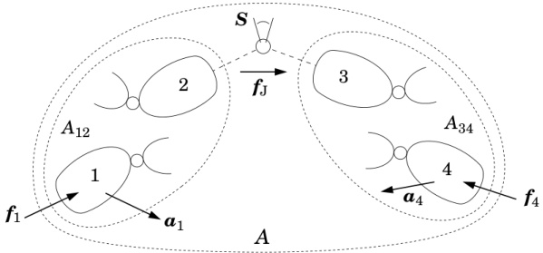{width=65%} Figure 7.6: Assembly of articulated bodies with multiple handles

Figure 7.6 shows two articulated bodies, called $A_{12}$ and $A_{34}$, which are to be assembled to form a larger articulated body called $A$. Body $A_{12}$ contains two handles, numbered 1 and 2, while $A_{34}$ contains handles 3 and 4. The idea is to assemble these bodies by connecting a joint between handles 2 and 3. The assembly operation is deemed to consume these two handles, leaving articulated body $A$ with only handles 1 and 4. We shall assume that at least one of handles 2 and 3 has six degrees of freedom. The equations of motion for $A_{12}$ and $A_{34}$ before the assembly operation are

$$
\left[ { \begin{array}{l} { a _ { 1 } } \\{ a _ { 2 } } \end{array} } \right] = \left[ { \begin{array}{ll} { \Phi _ { 1 } } & { \Phi _ { 12 } } \\{ \Phi _ { 21 } } & { \Phi _ { 2 } } \end{array} } \right] \left[ { \begin{array}{l} { f _ { 1 } } \\{ f _ { 2 } } \end{array} } \right] + \left[ { \begin{array}{l} { b _ { 1 } } \\{ b _ { 2 } } \end{array} } \right]
$$

and

$$
\left[ { \begin{array}{l} { a _ { 3 } } \\{ a _ { 4 } } \end{array} } \right] = \left[ { \begin{array}{ll} { \Phi _ { 3 } } & { \Phi _ { 34 } } \\{ \Phi _ { 43 } } & { \Phi _ { 4 } } \end{array} } \right] \left[ { \begin{array}{l} { f _ { 3 } } \\{ f _ { 4 } } \end{array} } \right] + \left[ { \begin{array}{l} { b _ { 3 } } \\{ b _ { 4 } } \end{array} } \right] ;
$$

and the equation of motion for $A$ after the assembly operation is

$$
\left[ \begin{array}{l} { a _ { 1 } } \\{ a _ { 4 } } \end{array} \right] = \left[ \begin{array}{ll} { \Phi _ { 1 } ^{A} } & { \Phi _ { 14 } ^{A} } \\{ \Phi _ { 41 } ^{A} } & { \Phi _ { 4 } ^{A} } \end{array} \right] \left[ \begin{array}{l} { f _ { 1 } } \\{ f _ { 4 } } \end{array} \right] + \left[ \begin{array}{l} { b _ { 1 } ^{A} } \\{ b _ { 4 } ^{A} } \end{array} \right] .
$$

(Observe that we have simplified the notation by omitting the superscripts from the coefficients of Eqs. 7.57 and 7.58.) We are using inverse inertias here because it is possible—and indeed quite likely—that the two handles within an articulated body do not have a full 12 degrees of motion freedom between them, even if they do have 6 degrees of freedom individually. In the absence of full motion freedom, the coefficient matrices in these equations will be singular. However, our assumption that at least one of the two handles 2 and 3 has six degrees of freedom on its own implies that at least one of the two matrices $\Phi_{2}$ and $\Phi_{3}$ is positive definite. This, in turn, implies that the sum $\Phi_{2} + \Phi_{3}$ is positive definite.

When the assembly is made, the joint will impose the following motion constraint on handles 2 and 3:

$$
T ^{\mathrm { T} } ( a _ { 3 } - a _ { 2 } ) = T ^{\mathrm { T} } c ,
$$

where $c=\dot{S}\dot{q}$, and it will also impose the force constraint

$$
f _ { 3 } = T \lambda = - f _ { 2 } .
$$

In formulating Eq. 7.61, we have assumed that any active force at the joint has already been accounted for in the bias accelerations of Eqs. 7.57 and 7.58. In other words, the active joint force, $T_{a}\tau$, has been replaced by a pair of equal and opposite external forces, $T_{a}\tau$ acting on handle 3 and $-T_{a}\tau$ acting on handle 2, and that the effects of these two forces on the motion of $A_{12}$ and $A_{34}$ have already been included in the vectors $b_{1}\cdots b_{4}$.

The objective is to express the coefficients of Eq. 7.59 in terms of the coefficients of Eqs. 7.57, 7.58, 7.60 and 7.61. The first step in the solution process is to substitute for $a_{3}$ and $a_{2}$ in Eq. 7.60, giving

$$
T ^{\mathrm { T} } ( \Phi _ { 3 } f _ { 3 } + \Phi _ { 34 } f _ { 4 } + b _ { 3 } - \Phi _ { 21 } f _ { 1 } - \Phi _ { 2 } f _ { 2 } - b _ { 2 } ) = T ^{\mathrm { T} } c \, .
$$

The next step is to substitute for $f_{3}$ and $f_{2}$ in this equation, using Eq. 7.61, and collect terms in $\lambda$, which gives

$$
T ^{\mathrm { T} } ( \Phi _ { 2 } + \Phi _ { 3 } ) T \lambda = T ^{\mathrm { T} } ( \Phi _ { 21 } f _ { 1 } - \Phi _ { 34 } f _ { 4 } + c - b _ { 3 } + b _ { 2 } ) \, .
$$

Given that $\Phi_{2}+\Phi_{3}$ is positive definite, the coefficient of $\lambda$ is guaranteed to be nonsingular, and so we may solve for $\lambda$ as follows:

$$
\lambda = Y ^{- 1} T ^{\mathrm { T} } ( \Phi _ { 21 } f _ { 1 } - \Phi _ { 34 } f _ { 4 } + \beta ) \, ,
$$

where

$$
\mathbf { Y } = T ^{\mathrm { T} } ( \Phi _ { 2 } + \Phi _ { 3 } ) T
$$

and

$$
\beta = c - b _ { 3 } + b _ { 2 } \, .
$$

The final step is to substitute for $f_{2}$ and $f_{3}$ in the expressions for $a_{1}$ and $a_{4}$ (drawn from Eqs. 7.57 and 7.58), using both Eq. 7.61 and Eq. 7.62. This gives

$$
\begin{array}{rl} & { a _ { 1 } \, = \, \Phi _ { 1 } f _ { 1 } - \Phi _ { 12 } T Y ^{- 1} T ^{\mathrm { T} } ( \Phi _ { 21 } f _ { 1 } - \Phi _ { 34 } f _ { 4 } + \beta ) + b _ { 1 } } \\& { a _ { 4 } \, = \, \Phi _ { 4 } f _ { 4 } + \Phi _ { 43 } T Y ^{- 1} T ^{\mathrm { T} } ( \Phi _ { 21 } f _ { 1 } - \Phi _ { 34 } f _ { 4 } + \beta ) + b _ { 4 } \, . } \end{array}
$$

These two equations express $a_{1}$ and $a_{4}$ as functions of $f_{1}$ and $f_{4}$ only, and are therefore the component parts of Eq. 7.59. Thus, the formulae for the coefficients of Eq. 7.59 are

$$
\begin{array}{rlrl} & { \Phi _ { 1 } ^{A} = \Phi _ { 1 } - \Phi _ { 12 } W \Phi _ { 21 } } & & { b _ { 1 } ^{A} = b _ { 1 } - \Phi _ { 12 } W \beta } \\& { \Phi _ { 4 } ^{A} = \Phi _ { 4 } - \Phi _ { 43 } W \Phi _ { 34 } } & & { b _ { 4 } ^{A} = b _ { 4 } + \Phi _ { 43 } W \beta } \\& { \Phi _ { 14 } ^{A} = \Phi _ { 12 } W \Phi _ { 34 } = ( \Phi _ { 41 } ^{A} ) ^{\mathrm { T} } } & & { b _ { 4 } ^{A} = b _ { 4 } + \Phi _ { 43 } W \beta } \end{array}
$$

where $W = TY^{-1}T^{\mathrm{T}}$.

# Generalizations

To generalize the number of handles, we replace the four individual handles with four handle sets. Set 1 contains every handle in $A_{12}$ that will not be connected to a joint during assembly; set 2 contains every handle that will; and so on. Each handle in set 2 will be connected to one handle in set 3 via one joint; so sets 2 and 3 must contain the same number of handles. To permit multiple joints to be connected to the same body, we allow a body to have more than one handle. In this context, a handle should no longer be regarded as a body, but as a location on a body. Any kinematic tree can be obtained by a sequence of assembly operations involving one joint per assembly (i.e., sets 2 and 3 contain one handle each). However, the construction of closed-loop systems requires multi-joint assemblies.

Having defined these sets, the next step is to define $a_{1}$, $f_{2}$, $\Phi_{34}$, and so on, to be composite vectors and matrices containing every relevant vector and matrix for their sets. For example, if set 1 contains handles 1a, 1b, 1c, ..., having accelerations of $a_{1a}$, $a_{1b}$, ..., then $a_{1}$ is the composite vector $[a_{1a}^{\mathrm{T}} a_{1b}^{\mathrm{T}} \cdots]^{\mathrm{T}}$. Note that $T$ will be a block-diagonal matrix composed of the constraint-force subspace matrices of the individual joints.

Given these composite vectors and matrices, the derivation of Eq. 7.63 proceeds in the same manner as shown in Eqs. 7.57 to 7.62, except that it may no longer be possible to assume that $\mathbf{Y}$ is invertible. Featherstone (1999b) explains what to do if $\mathbf{Y}$ is singular. It also explains how to incorporate constraint stabilization terms (see §8.3) into the assembly formula.

# Chapter 8

# Closed Loop Systems

This chapter covers the forward and inverse dynamics of rigid-body systems containing kinematic loops. The presence of kinematic loops brings a new level of complexity to the dynamics problem: new formulations are required; new problems arise; the systems exhibit new behaviours; and the inverse dynamics problem, in particular, changes its nature in the presence of kinematic loops. There are two main strategies for formulating the equations of motion for a closed-loop system: They are:

start with a set of unconstrained bodies, and apply all of the joint constraints simultaneously; or

start with a spanning tree of the system, and apply the loop-closure constraints.

A third possibility, which will not be considered here, is to use the assembly method described in Section 7.5. Method 1 results in large, sparse matrix equations, and is considered briefly in Section 8.13. Method 2 is the best choice for typical closed-loop systems, and is the main topic of this chapter. Some of the special properties of closed-loop systems are discussed in Section 8.10; the use of a loop-closure function is covered in Section 8.11; and inverse dynamics is covered in Section 8.12.

# 8.1 Equations of Motion

The equations of motion for general rigid-body systems, including closed-loop systems, were introduced in Chapter 3. In this section, we derive the equation of motion for a closed-loop system from that of its spanning tree. The procedure can be summarized as follows.

Formulate the equation of motion for a spanning tree of the closed-loop system.

Add terms to this equation representing the forces exerted on the tree by the loop joints.

Formulate a kinematic equation describing the motion constraints imposed on the tree by the loop joints.

Combine these two equations.

If the spanning tree has $n$ degrees of freedom, and the loop joints impose $n^{c}$ constraints on the tree, then this procedure results in a system of $n+n^{c}$ equations in $n+n^{c}$ unknowns.

Consider a rigid-body system containing $N_{B}$ bodies, $N_{J}$ joints and $N_{L} = N_{J} - N_{B}$ kinematic loops. We assume that a spanning tree has been chosen, and that the bodies and joints have been numbered accordingly. The number of tree-joint variables, $n$, and the number of loop-closure constraints, $n^{c}$, are given by the formulae

$$
n = \sum _ { i = 1 } ^{N _ { B} } n _ { i }  \mathrm { a n d }  n ^{c} = \sum _ { k = N _ { B } + 1 } ^{N _ { J} } n _ { k } ^{c} \, ,
$$

where $n_{i}$ is the number of freedoms allowed by tree joint $i$, and $n_{k}^{c}$ is the number of constraints imposed by loop joint $k$. Observe that we are using the index variables $i$ and $k$ to range over tree-joint numbers and loop-joint numbers, respectively. More generally, we use the following index-variable convention in connection with kinematic loops: $i$ and $j$ range over tree-joint and/or body numbers (1 to $N_{B}$); $l$ ranges over loop numbers (1 to $N_{L}$); and $k$ identifies the loop joint that closes loop number $l$. With our standard numbering scheme, $k$ and $l$ are related by $k = l + N_{B}$, and $k$ therefore ranges from $N_{B} + 1$ to $N_{J}$. From here on, wherever $k$ and $l$ appear together, it should be assumed that $k = l + N_{B}$.

The equation of motion for the spanning tree can be written

$$
H \ddot { q } + C = \tau \ ,
$$

where $\ddot{\boldsymbol{q}}$ and $\boldsymbol{\tau}$ are vectors of tree-joint acceleration and force variables, respectively. Now, the only difference between the closed-loop system and its spanning tree is that the former contains the loop joints and the latter does not. Therefore, the equation of motion for the closed-loop system can be obtained from Eq. 8.2 by adding terms that account for the forces exerted on the tree by the loop joints. Thus, the equation of motion for the closed-loop system can be written

$$
H \ddot { q } + C = \tau + \tau ^{c} + \tau ^{a} \, ,
$$

where $\tau^{c}$ and $\tau^{a}$ account for the constraint forces and active forces, respectively, produced by the loop joints. Active forces arise from springs, dampers, actuators, and the like, acting at the loop joints. If there are no such forces acting at a particular joint, then that joint is said to be passive; and if all of

the loop joints are passive, then $\tau^{a}=0$. In this case, the dynamics calculation software can be simplified by omitting the code required to calculate $\tau^{a}$.

$\tau^{a}$ is assumed to be known; but $\tau^{c}$ is unknown, and it can be expressed as a function of $n^{c}$ unknown constraint force variables (as in Eq. 8.5). Thus, Eq. 8.3 is a system of $n$ equations in $n + n^{c}$ unknowns, and therefore needs to be supplemented with another $n^{c}$ equations before it can be solved. These equations come from the kinematic constraints.

The loop joints impose a set of kinematic constraints on the tree, which can be collected into a single matrix equation of the form

$$
K \ddot { q } = k \, ,
$$

where $K$ is an $n^{c} \times n$ matrix. We say that this equation expresses the constraints at the acceleration level, on the grounds that it has been differentiated a sufficient number of times for the acceleration variables to appear. Expressions for $K$ and $k$ are derived in Section 8.2.

As $\tau^{c}$ is the force that imposes these constraints on the tree, it follows that $\tau^{c}$ can be expressed in the form

$$
\tau ^{c} = K ^{\mathrm { T} } \lambda \, ,
$$

where $\lambda$ is a vector of $n^{c}$ unknown constraint force variables. This step is covered in Section 8.4. (See also Eq. 3.15.)

Equations 8.3, 8.4 and 8.5 can now be assembled into a single matrix equation, being the complete equation of motion for the closed-loop system:

$$
\left[ \begin{array}{ll} { H } & { K ^{\mathrm { T} } } \\{ K } & { 0 } \end{array} \right] \left[ \begin{array}{l} { \ddot { q } } \\{ - \lambda } \end{array} \right] = \left[ \begin{array}{l} { \tau - C + \tau ^{\alpha} } \\{ k } \end{array} \right] .
$$

This is a system of $n+n^{c}$ equations in $n+n^{c}$ unknowns. The coefficient matrix is symmetric, but not positive definite. If this matrix has full rank, then the equation can be solved for both $\ddot{\boldsymbol{q}}$ and $\boldsymbol{\lambda}$. If it does not have full rank, then some elements of $\boldsymbol{\lambda}$ will be indeterminate, but the equation can still be solved for $\ddot{\boldsymbol{q}}$. The rank of the coefficient matrix is $n+\operatorname{rank}(\boldsymbol{K})$.

# 8.2 Loop Constraint Equations

Let us now formulate the coefficients of the loop constraint equation, Eq. 8.4. We start with the velocity across loop joint $k$, which is denoted $v_{Jk}$. This velocity is given by the equation

$$
\boldsymbol { v } _ { \mathrm { J } k } = \boldsymbol { v } _ { s ( k ) } - \boldsymbol { v } _ { p ( k ) } \, ,
$$

where $p(k)$ and $s(k)$ are the predecessor and successor bodies, respectively, of joint $k$. In the general case, joint $k$ will impose a constraint of the form

$$
{ \boldsymbol { T } } _ { k } ^{\mathrm { T} } { \boldsymbol { v } } _ { \mathrm { J } k } = { \boldsymbol { T } } _ { k } ^{\mathrm { T} } \sigma _ { k } \ ,
$$

where $T_{k}$ and $\sigma_{k}$ denote the constraint-force subspace and bias velocity, respectively, of joint $k$. (See Eq. 3.38.) However, for the sake of simplicity, we will assume that $\sigma_{k} = 0$ for all loop joints, so that the constraint equation simplifies to

$$
T _ { k } ^{\mathrm { T} } v _ { \mathrm { J } k } = { \bf 0 } \, .
$$

Combining Eqs. 8.7 and 8.8 gives a velocity constraint equation,

$$
T _ { k } ^{\mathrm { T} } \left( v _ { s ( k ) } - v _ { p ( k ) } \right) = { \bf 0 } \, ,
$$

which can be differentiated to obtain an acceleration constraint equation:

$$
\begin{array}{r} { \pmb { T } _ { k } ^{\mathrm { T} } ( \pmb { a } _ { s ( k ) } - \pmb { a } _ { p ( k ) } ) + \dot { \pmb { T } } _ { k } ^{\mathrm { T} } ( \pmb { v } _ { s ( k ) } - \pmb { v } _ { p ( k ) } ) = \pmb { 0 } \, . } \end{array}
$$

The velocity of any body in a kinematic tree can be expressed in terms of $\dot{q}$ by an equation of the form

$$
v _ { i } = J _ { i } \dot { q } \, ,
$$

where $v_{i}$ is the velocity of body $i$, and $J_{i}$ is the Jacobian of body $i$. (See Example 4.2.) $J_{i}$ is given by the equation

$$
\begin{array}{r} { J _ { i } = \left[ \epsilon _ { i 1 } S _ { 1 }  \epsilon _ { i 2 } S _ { 2 }  \cdots  \epsilon _ { i N _ { B } } S _ { N _ { B } } \right] , } \end{array}
$$

where $\epsilon_{ij}$ takes the value 1 at every joint $j$ that supports body $i$ (i.e., the joint lies on the path between the body and the base), and zero otherwise. Expressed as an equation,

$$
\epsilon _ { i j } = \left\{ \begin{array}{ll} { 1 } & { \mathrm { i f ~ } j \in \kappa ( i ) } \\{ 0 } & { \mathrm { o t h e r w i s e } . } \end{array} \right.
$$

Likewise, the acceleration of any body in a kinematic tree can be expressed in terms of $\ddot{\boldsymbol{q}}$ by the derivative of Eq. 8.11:

$$
\begin{array}{rl} { a _ { i } } & { { } = J _ { i } { \ddot { q } } + { \dot { J } } _ { i } { \dot { q } } } \\{ } & { { } = J _ { i } { \ddot { q } } + a _ { i } ^{v p} . } \end{array}
$$

$\boldsymbol{a}_{i}^{vp}$ is the 'velocity-product' acceleration of body $i$, which is the acceleration it would have if all the tree-joint acceleration variables were zero. It is available as one of the by-products of calculating $\boldsymbol{C}$. (See Section 8.6.)

Combining Eqs. 8.10 and 8.13 gives

$$
T _ { k } ^{\mathrm { T} } ( J _ { s ( k ) } - J _ { p ( k ) } ) \, \ddot { q } + T _ { k } ^{\mathrm { T} } ( a _ { s ( k ) } ^{v p} - a _ { p ( k ) } ^{v p} ) + \dot { T } _ { k } ^{\mathrm { T} } ( v _ { s ( k ) } - v _ { p ( k ) } ) = { \bf 0 } \, ,
$$

which we can simplify to

$$
T _ { k } ^{\mathrm { T} } ( J _ { s ( k ) } - J _ { p ( k ) } ) \, \ddot { q } = k _ { l }
$$

by defining

$$
k _ { l } = - T _ { k } ^{\mathrm { T} } ( a _ { s ( k ) } ^{v p} - a _ { p ( k ) } ^{v p} ) - \dot { T } _ { k } ^{\mathrm { T} } ( v _ { s ( k ) } - v _ { p ( k ) } ) \, .
$$

Equation 8.14 is the acceleration constraint imposed on the spanning tree by loop joint $k$, and there is one such equation for each kinematic loop. Collecting these equations together, we get

$$
\begin{array}{rl} { \left[ \boldsymbol { T } _ { N _ { B } + 1 } ^{\mathrm { T} } \left( \boldsymbol { J } _ { s ( N _ { B } + 1 ) } - \boldsymbol { J } _ { p ( N _ { B } + 1 ) } \right) \right] } & { \ddot { \boldsymbol { q } } = \left[ \begin{array}{l} { \boldsymbol { k } _ { 1 } } \\{ \vdots } \\{ \boldsymbol { T } _ { N _ { J } } ^{\mathrm { T} } \left( \boldsymbol { J } _ { s ( N _ { J } ) } - \boldsymbol { J } _ { p ( N _ { J } ) } \right) } \end{array} \right] . } \end{array}
$$

On comparing this equation with Eq. 8.4, it can be seen that

$$
\begin{array}{r} { K = \left[ \begin{array}{l} { T _ { N _ { B } + 1 } ^{\mathrm { T} } \left( J _ { s ( N _ { B } + 1 ) } - J _ { p ( N _ { B } + 1 ) } \right) } \\{ \vdots } \\{ T _ { N _ { J } } ^{\mathrm { T} } \left( J _ { s ( N _ { J } ) } - J _ { p ( N _ { J } ) } \right) } \end{array} \right]  \mathrm { a n d }  k = \left[ \begin{array}{l} { k _ { 1 } } \\{ \vdots } \\{ k _ { N _ { L } } } \end{array} \right] . } \end{array}
$$

The expression $J_{s(k)} - J_{p(k)}$ defines a loop Jacobian—a matrix that maps $\dot{q}$ to the velocity across a loop-closing joint. The loop Jacobian for loop $l$, denoted $J_{\mathrm{L}l}$, can be defined as follows:

$$
\begin{array}{rl} { J _ { \mathrm { L } l } } & { = J _ { s ( k ) } - J _ { p ( k ) } } \\& { = \left[ \varepsilon _ { l 1 } S _ { 1 }  \varepsilon _ { l 2 } S _ { 2 }  \cdots  \varepsilon _ { l N _ { B } } S _ { N _ { B } } \right] } \end{array}
$$

where $\varepsilon_{lj}=\epsilon_{s(k)j}-\epsilon_{p(k)j}$. These numbers identify the tree joints that take part in each loop. If we define the root of loop $l$ to be the highest-numbered body that is a common ancestor of both $p(k)$ and $s(k)$, then the set of tree joints that take part in loop $l$ is the union of two subsets: those that connect the root to $p(k)$, and those that connect the root to $s(k)$. The value of $\varepsilon_{lj}$ is $-1$ for each joint in the first subset, $+1$ for each joint in the second, and zero for all other joints. Using Eq. 8.18, we can formulate an alternative expression for $K$, which is the expression used to calculate it:

$$
\begin{array}{r} { \pmb { K } = \left[ \begin{array}{lll} { \pmb { K } _ { 11 } } & { \cdots } & { \pmb { K } _ { 1 N _ { B } } } \\{ \vdots } & & { \vdots } \\{ \pmb { K } _ { N _ { L } 1 } } & { \cdots } & { \pmb { K } _ { N _ { L } N _ { B } } } \end{array} \right] } \end{array}
$$

where

$$
K _ { l j } = \varepsilon _ { l j } T _ { k } ^{\mathrm { T} } S _ { j } \, .
$$

# 8.3 Constraint Stabilization

Equation 8.16 is theoretically correct, but is not stable during numerical integration. The problem is this: in principle, Eq. 8.16 behaves like a differential equation of the form

$$
\ddot { e } = 0 \, ,
$$

where $e$ denotes a loop-closure position error; but in practice it behaves like

$$
\ddot { e } = n o i s e \ ,
$$

where $noise$ is a small-magnitude signal representing numerical errors, such as the truncation errors in the numerical integration process. Thus, the use of Eq. 8.16 will ensure that the acceleration errors are kept small, but there is nothing to stop an unbounded accumulation of position and velocity errors. The problem can be solved by adding a stabilization term, $k_{stab}$, to Eq. 8.4 (and therefore also to Eq. 8.6), so that it now reads

$$
K \ddot { q } = k + k _ { s t a b } \, .
$$

The purpose of $k_{stab}$ is to modify the behaviour of the constraint equation under numerical integration, so that it now behaves like an equation of the form

$$
\ddot { e } + 2 \alpha \dot { e } + \beta ^{2} e = n o i s e \, ,
$$

where $\alpha > 0$ and $\beta \neq 0$. This method is due to Baumgarte, and is sometimes called Baumgarte stabilization (Baumgarte, 1972). The stabilization constants are usually chosen according to

$$
\alpha = \beta = 1 / T _ { s t a b } \, ,
$$

where $T_{stab}$ is the desired time constant for the decay of position and velocity errors. To achieve this effect, $k_{stab}$ is defined as follows:

$$
\begin{array}{r} { k _ { s t a b } = - 2 \alpha \left[ \begin{array}{l} { T _ { N _ { B } + 1 } ^{\mathrm { T} } v _ { \mathrm { J } N _ { B } + 1 } } \\{ \vdots } \\{ T _ { N _ { J } } ^{\mathrm { T} } v _ { \mathrm { J } N _ { J } } } \end{array} \right] - \beta ^{2} \left[ \begin{array}{l} { \delta _ { 1 } } \\{ \vdots } \\{ \delta _ { N _ { L } } } \end{array} \right] } \end{array}
$$

where

$$
\delta _ { l } = \mathrm { j c a l c } ( \mathrm { j t y p e } ( k ) , \, ^{s ( k ) , k} \mathbf { X } _ { p ( k ) , k } ) \, .
$$

$\delta_{l}$ is a measure of the degree to which the position of the spanning tree violates the constraint imposed by loop joint $k$. It is a quantity of the form $\delta_{l}=\boldsymbol{T}_{k}^{\mathrm{T}}\boldsymbol{d}_{l}$, where $\boldsymbol{d}_{l}$ is a spatial vector measuring the position error around loop $l$. This vector depends only on the joint type and the transform that locates the joint's successor frame relative to its predecessor frame. The latter is given by

$$
\begin{array}{rl} { s ( k ) , k \mathbf { X } _ { p ( k ) , k } = } & { s ( k ) , \bar { k } \mathbf { X } _ { s ( k ) } \; s ( \bar { k } ) \mathbf { X } _ { p ( k ) } \; p ( k ) \mathbf { X } _ { p ( k ) , k } } \\{ = } & { \mathbf { X } _ { S } ( l ) \; s ( k ) \mathbf { X } _ { p ( k ) } \; \mathbf { X } _ { \mathrm { P } } ( l ) ^{- 1} , } \end{array}
$$

where $X_{\mathrm{P}}$ and $X_{\mathrm{S}}$ are the arrays of loop-joint predecessor and successor frame transforms stored in the system model. (See §4.2.)

One problem with Baumgarte stabilization is that there is no hard-and-fast rule for selecting $T_{stab}$. A reasonable strategy is to ask how many snapshots

per second of the moving system you would need in order not to miss anything important, and choose a value of $T_{stab}$ that is similar to, or a little shorter than, the period between snapshots. For example, if the system is a large industrial robot, then $T_{stab} = 1$ is too large, $T_{stab} = 0.1$ is reasonable, and $T_{stab} = 0.01$ is a bit small, but still reasonable. If $T_{stab}$ is chosen too small, then the differential equations become unnecessarily stiff. The exact value of $T_{stab}$ is not critical—changing it by a factor of 2 makes only a small difference.

There is a temptation to choose $T_{stab}$ as small as possible, so that position and velocity errors will decay as quickly as possible, in the belief that this will maximize the accuracy of the simulation. This is a bad strategy. The purpose of constraint stabilization is to achieve stability, not accuracy. If the simulation is not accurate enough, then the best way to improve it is to use a better integration method and/or a shorter integration time step.

# Calculating $\delta$

Let $^{s}\mathbf{X}_{p}$ be the coordinate transform from the predecessor frame to the successor frame of a loop joint, as determined by the position variables of the spanning tree. In general, this transform will not comply exactly with the motion constraint imposed by the loop joint. Therefore, let us factorize this matrix as follows:

$$
{ } ^{s} \mathbf { X } _ { p } = X _ { e r r } \, X _ { \mathrm { J } } \, ,
$$

where $\mathbf{X}_{\mathrm{J}}$ complies exactly with the joint constraint, and $\mathbf{X}_{\mathrm{err}}$ represents the constraint error, which is assumed to be small. This factorization must be solved symbolically, using knowledge of the type of motion allowed by the joint, in order to obtain expressions for the elements of $\mathbf{X}_{\mathrm{err}}$ in terms of ${}^{s}\mathbf{X}_{p}$. These expressions will be different for each joint type. Given that $\mathbf{X}_{\mathrm{err}}$ represents a small displacement, there exists a motion vector, $\boldsymbol{d} \in \mathbb{M}^{6}$, that satisfies

$$
1 - d \times \simeq X _ { e r r } \, .
$$

This vector is (approximately) the displacement from where the successor frame ought to be to where it actually is. Having obtained $d$, $\delta$ is then given by

$$
\delta = T ^{\mathrm { T} } d \, .
$$

Formulae for $\delta$ for various common joint types are shown in Table 8.1. Note that a zero-DoF joint can serve as a universal loop joint, since any closed-loop system can be modified, by adding massless bodies and zero-DoF joints, in such a way that every loop-closing joint is a zero-DoF joint.

Example 8.1 The formula in Table 8.1 for the cylindrical joint can be obtained as follows. By combining Eqs. 8.25 and 8.26, and choosing expressions for $X_{\mathrm{J}}$ and $\mathbf{d}$ that are appropriate for a cylindrical joint, we get the following

Table 8.1: Formulae for $\delta = \mathrm{jcalc}(type, \mathbf{X})$

| Zero DoF | Revolute | Prismatic | Cylindrical |
| --- | --- | --- | --- |
| $1/2&td> &#x2722;$ | &#x2722; | &#x2722; |
| &#x2722; | &#x2722; | &#x2722; | &#x2722; |
| &#x2722; | &#x2722; | &#x2722; | &#x2722; |
| &#x2722; | &#x2722; | &#x2722; | &#x2722; |
| &#x2722; | &#x2722; | &#x2722; | &#x2722; |
| Spherical | &#x2722; | &#x2722; | &#x2722; |
| &#x2722; | &#x2722; | &#x2722; | &#x2722; |
| &#x2722; | &#x2722; | &#x2722; | &#x2722; |

approximate equation:

$$
\begin{array}{r} { s \mathbf { X } _ { p } \simeq \left[ \begin{array}{llllll} { 1 } & { 0 } & { - d _ { 2 } } & { 0 } & { 0 } & { 0 } \\{ 0 } & { 1 } & { d _ { 1 } } & { 0 } & { 0 } & { 0 } \\{ d _ { 2 } } & { - d _ { 1 } } & { 1 } & { 0 } & { 0 } & { 0 } \\{ 0 } & { 0 } & { - d _ { 5 } } & { 1 } & { 0 } & { - d _ { 2 } } \\{ 0 } & { 0 } & { d _ { 4 } } & { 0 } & { 1 } & { d _ { 1 } } \\{ d _ { 5 } } & { - d _ { 4 } } & { 0 } & { d _ { 2 } } & { - d _ { 1 } } & { 1 } \end{array} \right] \left[ \begin{array}{llllll} { c } & { s } & { 0 } & { 0 } & { 0 } & { 0 } \\{ - s } & { c } & { 0 } & { 0 } & { 0 } & { 0 } \\{ 0 } & { 0 } & { 1 } & { 0 } & { 0 } & { 0 } \\{ 0 } & { z } & { 0 } & { c } & { s } & { 0 } \\{ - z } & { 0 } & { 0 } & { - s } & { c } & { 0 } \\{ 0 } & { 0 } & { 0 } & { 0 } & { 0 } & { 1 } \end{array} \right] , } \end{array}
$$

where $c=\cos(\theta)$, $s=\sin(\theta)$, and $\theta$ and $z$ are the angular and linear displacements of the cylindrical joint (i.e., the joint position variables). Observe that we have set $d_{3}=d_{6}=0$ as they are the coordinates of $\mathbf{d}$ in the directions of motion freedom of the joint. If we perform the multiplication, and examine the result, then we find that $d_{1}=(^{s}X_{p})_{23}$, $d_{2}=-(^{s}X_{p})_{13}$, and so on. Finally, $\delta=[d_{1}\,d_{2}\,d_{4}\,d_{5}]^{\mathrm{T}}$.

# 8.4 Loop Joint Forces

Let $f_k$ denote the force transmitted across loop joint $k$ in the closed-loop system. The effect of joint $k$ on the spanning tree is therefore to exert a force of $f_k$ on body $s(k)$ and a force of $-f_k$ on body $p(k)$. Now, if a spatial force of $f$ is applied to body $i$ in a kinematic tree, then it has the same effect on the tree as a joint-space force of $\tau$, where

$$
\tau = J _ { i } ^{\mathrm { T} } f \, .
$$

Therefore, the effect of joint $k$ on the spanning tree is equivalent to a joint-space force of

$$
\pmb { \tau } = ( J _ { s ( k ) } ^{\mathrm { T} } - J _ { p ( k ) } ^{\mathrm { T} } ) \pmb { f } _ { k } = J _ { \mathrm { L } l } ^{\mathrm { T} } \pmb { f } _ { k } \, .
$$

Let us decompose $f_k$ into the sum of an active force, $f_k^a$, and a constraint force, $f_k^c$, and consider their effects separately. If $\tau^a$ represents the net effect on the spanning tree of all the active forces at the loop joints, then $\tau^a$ is given by

$$
\tau ^{a} = \sum _ { l = 1 } ^{N _ { L} } J _ { \mathrm { L } l } ^{\mathrm { T} } f _ { k } ^{a} \, .
$$

Likewise, if $\tau^{c}$ represents the net effect of all the constraint forces at the loop joints, then $\tau^{c}$ is given by

$$
\tau ^{c} = \sum _ { l = 1 } ^{N _ { L} } J _ { \mathrm { L } l } ^{\mathrm { T} } f _ { k } ^{c} \, .
$$

However, the constraint force at joint $k$ can also be expressed in the form

$$
f _ { k } ^{c} = T _ { k } \, \lambda _ { k } \, ,
$$

where $\lambda_{k}$ is a vector of $n_{k}^{c}$ unknown constraint force variables (cf. Eq. 3.34), so $\tau^{c}$ can also be expressed as

$$
\tau ^{c} = \sum _ { l = 1 } ^{N _ { L} } J _ { \mathrm { L } l } ^{\mathrm { T} } \, T _ { k } \, \lambda _ { k } \, .
$$

On comparing this equation with the definition of $K$ in Eq. 8.17, it can be seen that

$$
\tau ^{c} = K ^{\mathrm { T} } \lambda
$$

where

$$
\boldsymbol { \lambda } = \left[ \boldsymbol { \lambda } _ { N _ { B } + 1 } ^{\mathrm { T} }  \cdots  \boldsymbol { \lambda } _ { N _ { J } } ^{\mathrm { T} } \right] ^{\mathrm { T} } .
$$

As mentioned earlier, the active forces are assumed to be known. The best way to incorporate $\tau^{a}$ into the equation of motion is to modify the algorithm for calculating $\mathbf{C}$ so that it calculates $\mathbf{C} - \tau^{a}$ instead. A suitable algorithm is presented in Section 8.6.

# 8.5 Solving the Equations of Motion

Having formulated every term in the equations of motion, the next step is to solve them for the tree-joint accelerations. To recap, the equation of motion for the spanning tree, subject to the loop-closure forces, is

$$
H \ddot { q } + C = \tau + K ^{\mathrm { T} } \lambda + \tau ^{a} ;
$$

the loop-closure constraint equation is

$$
K \ddot { q } = k + k _ { s t a b } \, ;
$$

and the two can be combined into a single composite equation,

$$
\left[ \begin{array}{ll} { H } & { K ^{\mathrm { T} } } \\{ K } & { 0 } \end{array} \right] \left[ \begin{array}{l} { \ddot { q } } \\{ - \lambda } \end{array} \right] = \left[ \begin{array}{l} { \tau - C + \tau ^{a} } \\{ k + k _ { s t a b } } \end{array} \right] .
$$

In these equations, $\boldsymbol{H}$ is an $n \times n$ symmetric, positive-definite matrix, while $\boldsymbol{K}$ is a general $n^{c} \times n$ matrix that may be rank-deficient. The coefficient matrix in Eq. 8.36 is therefore symmetric, and it has dimensions of $(n+n^{c}) \times (n+n^{c})$; but it is not positive definite, and it has a rank of $n+r$, where $r = \text{rank}(\boldsymbol{K})$, so it will be singular whenever $r < n^{c}$.

If $r=n^{c}$, then both $\ddot{\boldsymbol{q}}$ and $\boldsymbol{\lambda}$ are uniquely determined by Eq. 8.36. However, if $r<n^{c}$, then $n^{c}-r$ of the constraints imposed on the spanning tree by the loop joints are linearly dependent on the other $r$ constraints. As a result, some elements of $\boldsymbol{\lambda}$ will be indeterminate, but $\ddot{\boldsymbol{q}}$ is still uniquely determined by the equation. Another problem that can arise if $r<n^{c}$ is that Eq. 8.35 can be slightly inconsistent; that is, $\boldsymbol{k}+\boldsymbol{k}_{\mathrm{stab}}$ can lie slightly outside range($\boldsymbol{K}$). This problem is caused by numerical errors in the calculation of $\boldsymbol{K}$, $\boldsymbol{k}$ and $\boldsymbol{k}_{\mathrm{stab}}$, and by inexact satisfaction of the loop-closure constraints for positions and velocities. When Eq. 8.35 is slightly inconsistent, it is acceptable to solve it in a least-squares sense.

There are various ways to solve the above equations for $\ddot{q}$. Let us now examine some of them. In particular, let us consider the following three methods:

solve Eq. 8.36 directly;

solve Eq. 8.00 among many,

solve Eq. 8.36 for $\lambda$, and use the result to obtain $\ddot{q}$; or

solve Eq. 8.35 to express $\ddot{q}$ in terms of a vector of independent acceleration variables, and then solve Eq. 8.34.

# Method 1: Solve Eq. 8.36 Directly

If the coefficient matrix in Eq. 8.36 is nonsingular, then this equation can be solved directly by a general-purpose linear equation solver, or a solver designed for symmetric, indefinite matrices. This is the simplest solution method, but not the most efficient. It is therefore appropriate whenever human effort is more important than computational efficiency. The coefficient matrix will be nonsingular if $r = n^c$, or if $n^c - r$ linearly-dependent rows are pruned out of Eq. 8.35 before it is incorporated into Eq. 8.36. The latter is practical if one happens to know in advance which rows to remove. This pruning tactic amounts to reducing $n^c$ until $n^c = r$. Pruning can also be used in conjunction with methods 2 and 3.

# Method 2: Solve for $\lambda$ First

By subtracting $KH^{-1}$ times the first row from the second row in Eq. 8.36, we get an equation for $\lambda$ of the form

$$
A \lambda = b \, ,
$$

where

$$
A = K H ^{- 1} K ^{\mathrm { T} }
$$

and

$$
b = k + k _ { s t a b } - K H ^{- 1} ( \tau - C + \tau ^{a} ) \, .
$$

The coefficient matrix, $A$, is symmetric and positive-semidefinite. Its size is $n^{c} \times n^{c}$, and its rank is $r$. If $r = n^{c}$ then $A$ is invertible, and Eq. 8.37 has the unique solution

$$
\lambda = A ^{- 1} b \, .
$$

If $r < n^{c}$ then $A$ is singular, and Eq. 8.37 has an infinity of solutions. In this case, the general form of the solution is

$$
\lambda = A ^{+} \, b + ( 1 - A ^{+} A ) z \ ,
$$

where $A^{+}$ is the pseudoinverse of $A$, $z$ is an arbitrary vector, and the operator $1-A^{+}A$ projects vectors onto the null space of $A$. If Eq. 8.37 is consistent, then Eq. 8.41 describes a family of exact solutions; otherwise, it describes a family of least-squares solutions. Equation 8.37 is consistent if and only if Eq. 8.35 is consistent.

Having obtained a value for $\lambda$, the final step is to substitute it into Eq. 8.34, and solve the resulting equation for $\ddot{q}$. Note that $z$ has no effect on $\ddot{q}$, because

$$
K ^{\mathrm { T} } ( { \bf 1 } - A ^{+} A ) = 0 \, .
$$

One is therefore free to choose any convenient value for $z$, such as $z=0$.

The following procedure will calculate $\ddot{q}$ in an efficient manner. It uses the $L^{\mathrm{T}}L$ factorization and back-substitution algorithms described in Section 6.5, and therefore exploits any branch-induced sparsity that may be present in $H$. It can easily be modified to use the $L^{\mathrm{T}}DL$ factorization instead.

Factorize $H$ into $H = L^{\text{T}}L$.

Calculate $\tau' = \tau - C + \tau^{a}$.

Using back-substitution, calculate $Y = L^{-\text{T}}K^{\text{T}}$ and $z = L^{-\text{T}}\tau'$.

Calculate $A = Y^{\text{T}}Y$ and $b = k + k_{stab} - Y^{\text{T}}z$.

Solve $A\lambda = b$ for $\lambda$ by any appropriate method.

Solve $H\ddot{q} = \tau' + K^{\text{T}}\lambda$ for $\ddot{q}$ using the factors from step 1.

# Method 3: Solve Eq. 8.35 First

Suppose we have been given a general linear equation, $A\boldsymbol{x}=\boldsymbol{b}$, in which $\boldsymbol{A}$ is an $m\times n$ matrix of rank $r$, and $\boldsymbol{b}\in\text{range}(\boldsymbol{A})$ (i.e., the equation is consistent). The task is to solve it for $\boldsymbol{x}$. If $r=n$ then there will be only a single solution, which is given by the formula $\boldsymbol{x}=\boldsymbol{A}^{+}\boldsymbol{b}$. If $r<n$ then there will be an infinite number of solutions, which are given by the formula $\boldsymbol{x}=\boldsymbol{C}\boldsymbol{y}+\boldsymbol{d}$. In this

equation, $\boldsymbol{y}$ is an $(n-r)$-dimensional vector of unknowns, $\boldsymbol{d}$ is any one vector satisfying $\boldsymbol{Ad}=\boldsymbol{b}$, and $\boldsymbol{C}$ is a full-rank matrix having the property $\boldsymbol{AC}=\boldsymbol{0}$. Each solution has a unique corresponding value of $\boldsymbol{y}$, and vice versa (i.e., there is a $1:1$ correspondence between the two).

Let us apply this formula to Eq. 8.35. This equation has an $n^{c} \times n$ coefficient matrix of rank $r$. If $r = n$ then the equation has a unique solution, which is $\ddot{q} = K^{+}(k + k_{stab})$; but if $r < n$ then there are infinitely many solutions, all given by the formula

$$
\ddot { q } = G \, \ddot { y } + g \, .
$$

In this equation, $G$ is an $n \times (n - r)$ full-rank matrix having the property

$$
K G = 0 \, ,
$$

$\ddot{y}$ is an $(n-r)$-dimensional vector of independent acceleration variables, and $g$ is any one vector satisfying

$$
K g = k + k _ { s t a b } \, .
$$

Typically, $\ddot{\boldsymbol{y}}$ is chosen to be a subset of the elements of $\ddot{\boldsymbol{q}}$. It can therefore be thought of as a vector of independent joint acceleration variables for the closed-loop system. An algorithm for calculating $\boldsymbol{G}$ and $\boldsymbol{g}$ is presented in Section 8.8.

We now have an equation that expresses $\ddot{\boldsymbol{q}}$ as a function of the unknown vector $\ddot{\boldsymbol{y}}$. The next step is therefore to find an expression for $\ddot{\boldsymbol{y}}$. Premultiplying Eq. 8.34 by $\boldsymbol{G}^{\mathrm{T}}$ causes $\boldsymbol{\lambda}$ to be eliminated, resulting in

$$
G ^{\mathrm { T} } H \, \ddot { q } = G ^{\mathrm { T} } ( \tau - C + \tau ^{a} ) \, ;
$$

and substituting Eq. 8.42 into this equation produces

$$
G ^{\mathrm { T} } H G \, \ddot { y } = G ^{\mathrm { T} } ( \tau - C + \tau ^{a} - H g )
$$

(cf. Eq. 3.20). This equation can be regarded as the equation of motion for the closed-loop system, expressed in terms of the independent joint acceleration variables in $\ddot{\boldsymbol{y}}$. The matrix $G^{\mathrm{T}}\boldsymbol{H}\boldsymbol{G}$ is symmetric and positive-definite, so Eq. 8.45 can be solved immediately for $\ddot{\boldsymbol{y}}$, giving

$$
\ddot { y } = ( G ^{\mathrm { T} } H G ) ^{- 1} G ^{\mathrm { T} } ( \tau - C + \tau ^{a} - H g ) \, .
$$

# 8.6 Algorithm for $C - \tau^{a}$

The best strategy for dealing with $\boldsymbol{\tau}^{a}$ is to choose the spanning tree such that every loop joint is passive. In this case, $\boldsymbol{f}_{k}^{a}=\mathbf{0}$ for every loop joint, and so $\boldsymbol{\tau}^{a}=\mathbf{0}$. The next best strategy is to modify the code for calculating $\boldsymbol{C}$ so that it calculates $\boldsymbol{C}-\boldsymbol{\tau}^{a}$ instead.

| Original Equations: | Modified Equations: |
| --- | --- |
| $\boldsymbol{v}_i = \boldsymbol{v}_{\lambda(i)} + \boldsymbol{S}_i \dot{\boldsymbol{q}}_i$ | $(\boldsymbol{v}_0 = \boldsymbol{0})$ | $\boldsymbol{v}_i = \boldsymbol{v}_{\lambda(i)} + \boldsymbol{S}_i \dot{\boldsymbol{q}}_i$ | $(\boldsymbol{v}_0 = \boldsymbol{0})$ |
| $\boldsymbol{a}_i = \boldsymbol{a}_{\lambda(i)} + \boldsymbol{S}_i \ddot{\boldsymbol{q}}_i + \dot{\boldsymbol{S}}_i \dot{\boldsymbol{q}}_i$ | $(\boldsymbol{a}_0 = -\boldsymbol{a}_g)$ | $\boldsymbol{a}_i^{vp} = \boldsymbol{a}_{\lambda(i)}^{vp} + \dot{\boldsymbol{S}}_i \dot{\boldsymbol{q}}_i$ | $(\boldsymbol{a}_0^{vp} = -\boldsymbol{a}_g)$ |
| $\boldsymbol{f}_i^B = \boldsymbol{I}_i \boldsymbol{a}_i + \boldsymbol{v}_i \times^* \boldsymbol{I}_i \boldsymbol{v}_i$ | $\boldsymbol{f}_i^B = \boldsymbol{I}_i \boldsymbol{a}_i^{vp} + \boldsymbol{v}_i \times^* \boldsymbol{I}_i \boldsymbol{v}_i$ |
| $\boldsymbol{f}_i = \boldsymbol{f}_i^B - \boldsymbol{f}_i^x + \sum_{j \in \mu(i)} \boldsymbol{f}_j$ | $\boldsymbol{f}_i = \boldsymbol{f}_i^B - \boldsymbol{f}_i^x - \sum_{k=N_B+1}^{N_J} e_{ik} \boldsymbol{f}_k^a + \sum_{j \in \mu(i)} \boldsymbol{f}_j$ |
| $\boldsymbol{\tau}_i = \boldsymbol{S}_i^{\text{T}} \boldsymbol{f}_i$ |  |
|  |  |
|  |  |
|  |  |
|  |  |
|  |  |
|  |  |
|  |  |
|  |  |
|  |  |
|  |  |
|  |  |
|  |  |
|  |  |
|  |  |
|  |  |
|  |  |
|  |  |
|  |  |
|  |  |
|  |  |
|  |  |
|  |  |
|  |  |
|  |  |
|  |  |
|  |  |
|  |  |
|  |  |
|  |  |
|  |  |
|  |  |
|  |  |
|  |  |
|  |  |
|  |  |
|  |  |
|  |  |
|  |  |
|  |  |
|  |  |
|  |  |
|  |  |
|  |  |
|  |  |
|  |  |
|  |  |
|  |  |
|  |  |
|  |  |
|  |  |
|  |  |
|  |  |
|  |  |
|  |  |
|  |  |
|  |  |
|  |  |
|  |  |
|  |  |
|  |  |
|  |  |
|  |  |
|  |  |
|  |  |
|  |  |
|  |  |
|  |  |
|  |  |
|  |  |
|  |  |
|  |  |
|  |  |
|  |  |
|  |  |
|  |  |
|  |  |
|  |  |
|  |  |
|  |  |
|  |  |
|  |  |
|  |  |
|  |  |
|  |  |
|  |  |
|  |  |
|  |  |
|  |  |
|  |  |
|  |  |
|  |  |
|  |  |
|  |  |
|  |  |
|  |  |
|  |  |
|  |  |
|  |  |
|  |  |
|  |  |
|  |  |
|  |  |
|  |  |
|  |  |
|  |  |
|  |  |
|  |  |
|  |  |
|  |  |
|  |  |
|  |  |
|  |  |
|  |  |
|  |  |
|  |  |
|  |  |
|  |  |
|  |  |
|  |  |

Table 8.2 shows the basic equations of the recursive Newton-Euler algorithm, as they appear in Table 5.1, alongside the equations for calculating $C - \tau^{a}$. On comparing the originals with the modified equations, the following differences can be seen.

The term $S_{i} \ddot{q}_{i}$ has been dropped, as the acceleration variables are set to zero for calculating $C$.

The variable names $a_{i}$ and $\tau_{i}$ have been changed to $a_{i}^{vp}$ and $C_{i}^{\prime}$ (where $C^{\prime} = C - \tau^{a}$). This is a purely cosmetic change.¹

A new term has been added to the joint force calculation, which subtracts the active loop-joint forces at the same point where the general external forces are subtracted.

From the perspective of the spanning tree, the active loop-joint forces are indeed external forces, since they come from something that is not a part of the tree, and that is exactly how they are treated. The coefficients $e_{ik}$ ensure that $f_{k}^{a}$ gets subtracted only from $f_{s(k)}$, and that $-f_{k}^{a}$ gets subtracted from $f_{p(k)}$.

Table 8.3 shows the pseudocode for an algorithm to calculate $C - \tau^{a}$ according to the equations in Table 8.2. The calculations are performed in body coordinates. The first and third loops in this algorithm closely resemble the corresponding code in Table 5.1, but the second loop is new. The last line in loop 1 initializes each vector $f_{i}$ to the expression $f_{i}^{B} - f_{i}^{x}$. The purpose of loop 2 is then to subtract the term $\sum_{k=N_{B}+1}^{N_{J}} e_{ik} f_{k}^{a}$ from each $f_{i}$ before loop 3 starts to use them.

The second line in loop 2 uses jcalc to calculate $T_{k}^{a}$, which is placed in the local variable $T^{a}$. There is an assumption here that $T_{k}^{a}$ is a constant, so that

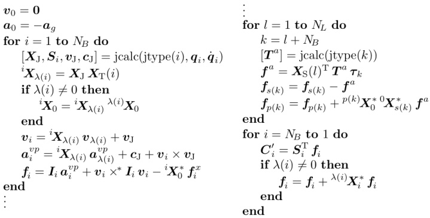{width=79%} Table 8.3: Algorithm to calculate $C - \tau^{a}$

jcalc only needs to know the type specifier for joint $k$ in order to work out the correct value. If we did not make this assumption, then it would be necessary to work out the transform from the predecessor frame to the successor frame of joint $k$, so that it can be supplied as an argument to jcalc.

The expression $T^{a}\tau_{k}$ gives $f_{k}^{a}$ in the successor-frame coordinates of joint $k$, which are the coordinates in which $T^{a}$ is supplied. The third line in loop 2 calculates $f_{k}^{a}$ in successor-frame coordinates, transforms it to body $s(k)$ coordinates, and stores the result in the local variable $f^{a}$. The next two lines then subtract this quantity from $f_{s(k)}$ and add it to $f_{p(k)}$. Observe that $f^{a}$ must be transformed from $s(k)$ to $p(k)$ coordinates before the addition is carried out.

# 8.7 Algorithm for $K$ and $k$

Table 8.4 shows the pseudocode for an algorithm to calculate $K$ via Eqs. 8.19 and 8.20, $k$ via Eq. 8.15, and $k_{stab}$ via Eqs. 8.22 and 8.23. These calculations involve combining vectors and matrices that were originally obtained in various different coordinate systems. It is therefore necessary to apply coordinate transforms to at least some of these quantities before they can be combined. The strategy used in this algorithm is to transform everything to base coordinates and combine them there. This is the simplest strategy, but not necessarily the best.

The local variables $X_{p}$ and $X_{s}$ contain the Plücker transforms from base coordinates to the predecessor and successor frames, respectively, of loop joint $k$; so $X_{p} = p^{(k),k}X_{0}$ and $X_{s} = s^{(k),k}X_{0}$. The expression $X_{s}X_{p}^{-1}$ is therefore the transform from the joint's predecessor frame to its successor frame, which is the argument to jcalc in Eq. 8.23. The call to jcalc requests both the loop position

$$
\begin{array}{rlr} & { K = 0 } & { \vdots } \\& { \mathrm { f o r ~ } l = 1 \mathrm { ~ t o ~ } N _ { L } \mathrm { ~ d o ~ } } & { k _ { l } = - T ^{\mathrm { T} } ( a _ { s } - a _ { p } + v _ { s } \times v _ { p } ) - k _ { s t a b } } \\& { k = l + N _ { B } } & { i = p ( k ) } \\& { X _ { p } = X _ { \mathrm { P } } ( l ) \, ^{p ( k )} X _ { 0 } } & { j = s ( k ) } \\& { X _ { s } = X _ { \mathrm { S } } ( l ) \, ^{s ( k )} X _ { 0 } } & { \mathrm { w h i l e ~ } i \neq j \mathrm { ~ d o ~ } } \\& { v _ { p } = { } ^{0} X _ { p ( k ) } \, v _ { p ( k ) } } & { \mathrm { i f ~ } i > j \mathrm { ~ t h e n ~ } } \\& { v _ { s } = { } ^{0} X _ { s ( k ) } \, v _ { s ( k ) } } & { K _ { l i } = - T ^{\mathrm { T} } { } ^{0} X _ { i } \, S _ { i } } \\& { a _ { p } = { } ^{0} X _ { p ( k ) } \, a _ { p ( k ) } ^{v p} } & { i = \lambda ( i ) } \\& { a _ { s } = { } ^{0} X _ { s ( k ) } \, a _ { s ( k ) } ^{v p} } & { \mathrm { e l s e } } \\& { [ \delta , T ] = \mathrm { j c a l c } ( \mathrm { j t y p e } ( k ) , X _ { s } \, X _ { p } ^{- 1} ) } & { j = \lambda ( j ) } \\& { T = X _ { s } ^{\mathrm { T} } \, T } & { \mathrm { e n d } } \\& { k _ { s t a b } = 2 \alpha \, T ^{\mathrm { T} } ( v _ { s } - v _ { p } ) + \beta ^{2} \, \delta } & { \mathrm { e n d } } \\& { \mathrm { e n d } } & { \mathrm { e n d } } \\& { \mathrm { i n t e r } } & { \mathrm { e n d } } \end{array}
$$

error, $\delta$, and the constraint-force subspace matrix, $\boldsymbol{T}$, for loop joint $k$. The line immediately after this call transforms $\boldsymbol{T}$ from successor-frame coordinates to base coordinates; but no transform is applied to $\delta$ because it represents a quantity of the form $\boldsymbol{T}^{\mathrm{T}}\boldsymbol{d}$, where $\boldsymbol{d} \in \mathbb{M}^{6}$ is an infinitesimal displacement.

This algorithm assumes that $\dot{T} = \mathbf{0}$ and $\boldsymbol{\sigma} = \dot{\boldsymbol{\sigma}} = \mathbf{0}$ for every loop joint. Without this assumption, jcalc would need more arguments, and would be asked to return more quantities. The assumption $\dot{T} = \mathbf{0}$ implies $\dot{T} = \boldsymbol{v}_s \times^* \boldsymbol{T}$, which allows us to simplify the right-hand side of Eq. 8.15 as follows:

$$
\begin{array}{rl} { \pmb { k } _ { l } } & { = - \pmb { T } _ { k } ^{\mathrm { T} } ( \pmb { a } _ { s ( k ) } ^{v p} - \pmb { a } _ { p ( k ) } ^{v p} ) - \dot { \pmb { T } } _ { k } ^{\mathrm { T} } ( \pmb { v } _ { s ( k ) } - \pmb { v } _ { p ( k ) } ) } \\& { = - \pmb { T } _ { k } ^{\mathrm { T} } ( \pmb { a } _ { s ( k ) } ^{v p} - \pmb { a } _ { p ( k ) } ^{v p} ) - ( \pmb { v } _ { s ( k ) } \times ^{*} \pmb { T } _ { k } ) ^{\mathrm { T} } ( \pmb { v } _ { s ( k ) } - \pmb { v } _ { p ( k ) } ) } \\& { = - \pmb { T } _ { k } ^{\mathrm { T} } ( \pmb { a } _ { s ( k ) } ^{v p} - \pmb { a } _ { p ( k ) } ^{v p} ) + \pmb { T } _ { k } ^{\mathrm { T} } \pmb { v } _ { s ( k ) } \times \left( \pmb { v } _ { s ( k ) } - \pmb { v } _ { p ( k ) } \right) } \\& { = - \pmb { T } _ { k } ^{\mathrm { T} } ( \pmb { a } _ { s ( k ) } ^{v p} - \pmb { a } _ { p ( k ) } ^{v p} + \pmb { v } _ { s ( k ) } \times \pmb { v } _ { p ( k ) } ) \, . } \end{array}
$$

This is the expression used in the algorithm.

$K$ is calculated by first initializing the whole matrix to zero, and then calculating the nonzero submatrices. For each loop $l$, the submatrix $K_{li}$ is nonzero for every tree joint $i$ that lies on the path of the loop. These quantities are calculated in a while loop that employs two loop variables, $i$ and $j$. These variables are initially set to $p(k)$ and $s(k)$, respectively, and then stepped back toward the base in an order that guarantees they meet at the nearest common ancestor of $p(k)$ and $s(k)$. At this point, every joint on the path of loop $l$ is accounted for, and we have $i = j$, which is the termination condition for the loop.

The algorithm presented in Table 8.4 potentially involves some duplication of calculations. For example, if joint $i$ participates in more than one loop, then

$\mathbf{S}_{i}$ will be transformed to base coordinates more than once. Likewise, if body $i$ is the successor or predecessor of more than one loop joint, then $\boldsymbol{v}_{i}$ and $\boldsymbol{a}_{i}^{\nu p}$ will be transformed to base coordinates more than once, and the relevant transform ($\mathbf{X}_{p}$ or $\mathbf{X}_{s}$) will be calculated more than once. This kind of duplication has a relatively small impact on the overall efficiency. Nevertheless, if maximum speed is required, then the code can be rewritten to avoid such duplications.

# The Rounding-Error Problem

The algorithm's use of base coordinates achieves two things: it keeps the algorithm simple, and it minimizes the number of transformation matrices that are needed. However, there is a price to be paid: most floating-point calculations involve rounding errors, and some of these errors are sensitive to the distance between the frame in which the calculations are performed and the locations of the objects to which those calculations apply. Therefore, if the base coordinate frame is far away from the kinematic loop, then there will be a loss of precision in the calculations. This phenomenon is not a problem for most rigid-body systems; but it can be a problem for a floating-base system if it travels a great distance from its fixed-base origin. (Think of an aircraft, or a spacecraft.) In this case, a simple remedy is to perform the calculations for $K$, $k$ and $k_{stab}$ in floating-base coordinates instead of fixed-base coordinates.

# 8.8 Algorithm for $G$ and $g$

This section shows how to solve a linear equation of the form

$$
\kappa \, x = k
$$

to yield a solution of the form

$$
x = G y + g .
$$

The method is applicable to the task of solving Eq. 8.35 to get Eq. 8.42. In Equations 8.48 and 8.49, $K$ is an $m \times n$ matrix of rank $r$, $k \in \text{range}(K)$ (so Eq. 8.48 is consistent), $G$ is an $n \times (n - r)$ full-rank matrix, and Eq. 8.49 produces every possible solution to Eq. 8.48. In fact, Eq. 8.49 defines a 1:1 mapping between $y$ and the set of solutions to Eq. 8.48. If $r = n$ then Eq. 8.49 simplifies to $x = g$, and $g$ is unique. If $r < n$ then $G$ and $g$ are not unique, and we seek any one pair of values that solves the problem.

Given that $\operatorname{rank}(\boldsymbol{K})=r$, it follows that $\boldsymbol{K}$ must contain an $r \times r$ invertible submatrix. Therefore, there exists a permutation of $\boldsymbol{K}$ in which the elements of this submatrix occupy the top left corner. We may therefore write

$$
K = Q _ { 1 } \left[ \begin{array}{ll} { { K _ { 11 } } } & { { K _ { 12 } } } \\{ { K _ { 21 } } } & { { K _ { 22 } } } \end{array} \right] Q _ { 2 } \, ,
$$

in which $K_{11}$ is an $r \times r$ invertible matrix, and $Q_{1}$ and $Q_{2}$ are permutation matrices. Extending this permutation to the whole of Eq. 8.48 gives

$$
Q _ { 1 } \left[ \begin{array}{ll} { K _ { 11 } } & { K _ { 12 } } \\{ K _ { 21 } } & { K _ { 22 } } \end{array} \right] \left[ \begin{array}{l} { x _ { 1 } } \\{ x _ { 2 } } \end{array} \right] = Q _ { 1 } \left[ \begin{array}{l} { k _ { 1 } } \\{ k _ { 2 } } \end{array} \right] \, ,
$$

where

$$
\left[ \begin{array}{l} { x _ { 1 } } \\{ x _ { 2 } } \end{array} \right] = Q _ { 2 } x  \mathrm { a n d }  Q _ { 1 } \left[ \begin{array}{l} { k _ { 1 } } \\{ k _ { 2 } } \end{array} \right] = k \, .
$$

Again, given that $\operatorname{rank}(\boldsymbol{K})=r$ and that Eq. 8.48 is consistent, it follows that the bottom row in Eq. 8.50 is a linear multiple of the top row; so there must exist a matrix $\boldsymbol{Y}$ such that $\boldsymbol{K}_{21}=\boldsymbol{Y} \boldsymbol{K}_{11}$, $\boldsymbol{K}_{22}=\boldsymbol{Y} \boldsymbol{K}_{12}$ and $\boldsymbol{k}_{2}=\boldsymbol{Y} \boldsymbol{k}_{1}$. We can therefore rewrite Eq. 8.50 as

$$
Q _ { 1 } \left[ \begin{array}{ll} { K _ { 11 } } & { K _ { 12 } } \\{ Y K _ { 11 } } & { Y K _ { 12 } } \end{array} \right] \left[ \begin{array}{l} { x _ { 1 } } \\{ x _ { 2 } } \end{array} \right] = Q _ { 1 } \left[ \begin{array}{l} { k _ { 1 } } \\{ Y k _ { 1 } } \end{array} \right] \, .
$$

By inspection, we can see that one possible solution to this equation is

$$
\left[ \begin{array}{l} { x _ { 1 } } \\{ x _ { 2 } } \end{array} \right] = \left[ \begin{array}{l} { - K _ { 11 } ^{- 1} K _ { 12 } } \\{ \mathbf { 1 } } \end{array} \right] x _ { 2 } + \left[ \begin{array}{l} { K _ { 11 } ^{- 1} k _ { 1 } } \\{ \mathbf { 0 } } \end{array} \right] .
$$

We may therefore conclude that one solution to the original problem is

$$
G = Q _ { 2 } ^{\mathrm { T} } \left[ - K _ { 11 } ^{- 1} K _ { 12 } \right]  \mathrm { a n d }  g = Q _ { 2 } ^{\mathrm { T} } \left[ K _ { 11 } ^{- 1} k _ { 1 } \right] .
$$

This particular solution equates $y$ with $x_2$, which means that $y$ is a subset of the elements of $x$.

The expressions in Eq. 8.51 can be calculated using a standard Gaussian elimination algorithm, or an LU factorization, with the following modifications.

Complete pivoting must be used, with both row and column swaps. A record must be kept of the column swaps, as this data determines the value of $Q_2$.

If $r$ has not been supplied as an argument, then a rank test is needed to detect when the last of the independent rows has been processed.

The factorization process terminates once it has processed the last independent row. At this stage, the top-left $r \times r$ submatrix of $K$ contains the upper-triangular matrix $U$, where $LU = K_{11}$; the top-right $r \times (n - r)$ submatrix contains $L^{-1}K_{12}$; and the top $r$ rows of $k$ contain $L^{-1}k_1$. Back-substitution on the top $r$ rows therefore yields $K_{11}^{-1}K_{12}$ and $K_{11}^{-1}k_1$. Various features can be added to this basic algorithm. For example, a mask can be supplied that identifies which columns of $K$ correspond to joint variables that do not participate in any kinematic loop. These columns contain only zeros, and are therefore left unaltered by the factorization process. Another possibility is to allow the user to specify his own choice of independent variables. This eliminates the need for complete pivoting, so that partial pivoting can be used instead.

# 8.9 Exploiting Sparsity in $K$ and $G$

It is clearly the case that both $K$ and $G$ may contain many zeros. For example, Eq. 8.20 implies that each submatrix $K_{lj}$ of $K$ will be zero for every $l$ and $j$ such that $\varepsilon_{lj} = 0$; and Eq. 8.51 implies that $G$ contains at least $(n-r)(n-r-1)$ zeros, this being the number of zeros in an $(n-r) \times (n-r)$ identity matrix. However, a large proportion of all the sparsity in these two matrices can be attributed to a single fact, which is the subject of this section: they are both block-diagonal.

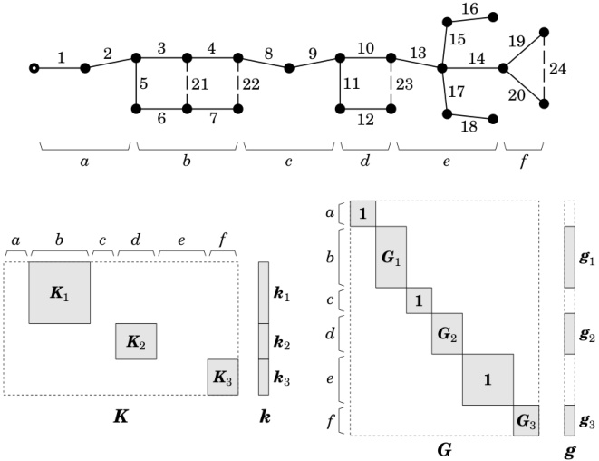{width=72%} Figure 8.1: Loop clusters and the sparsity patterns of $K$ and $G$

To reveal the block-diagonal structure, we must first organize the kinematic loops into a set of minimal loop clusters. A loop cluster is any set of loops with the property that no loop within the cluster is coupled to any loop outside it; and a minimal loop cluster is one that cannot be divided into two smaller clusters. A coupling exists between two kinematic loops if they have a joint in common. Given a set of minimal loop clusters, it is possible to devise a regular numbering of the spanning tree with the following property: the tree joints within each cluster are numbered consecutively. It is this numbering scheme that reveals the block-diagonal structure of $K$ and $G$.

An example is presented in Figure 8.1. This figure shows the connectivity graph of a closed-loop system containing four kinematic loops. They are numbered 1 to 4, and are closed by loop joints 21 to 24, respectively. (Loop numbers

are not shown in the diagram.) Loop 1 is coupled to loop 2, but there is no other coupling in the system. We can therefore identify three minimal clusters as follows: cluster 1 contains loops 1 and 2; cluster 2 contains loop 3 only; and cluster 3 contains loop 4 only. Having identified these three clusters, we can devise a regular numbering in which the tree joints are numbered consecutively within each cluster. In this example, the joints in cluster 1 are numbered 3 to 7, those in cluster 2 are numbered 10 to 12, and those in cluster 3 are numbered 19 and 20. The remaining tree joints do not lie on the path of any kinematic loop, and therefore do not belong to any cluster. They can be numbered in any manner that is consistent with the rules of regular numbering.

With this numbering scheme, $K$ adopts an irregular block-diagonal structure with gaps: there is one block per cluster; blocks are generally rectangular; each block can be a different size and shape to the others; and there can be horizontal gaps of varying sizes between the blocks. These gaps are caused by the tree joints that do not belong to any cluster. This pattern of sparsity in $K$ allows $G$ to adopt an irregular block-diagonal structure without gaps: each block $K_i$ in $K$ gives rise to a block $G_i$ in $G$; and each gap in $K$ gives rise to an identity-matrix block in $G$. For easy identification, the joints in the connectivity graph have been divided into six sets, labelled $a$ to $f$, and the same division is shown against the columns of $K$ and the rows of $G$.

Block-diagonal sparsity can be exploited in the calculation of $KH^{-1}K^{\mathrm{T}}$ and $G^{\mathrm{T}}HG$, and in the calculation of $G$ from $K$. In particular, $G$ can be calculated from $K$ one block at a time: as $x = G_{i}y + g_{i}$ is the solution to $K_{i}x = k_{i}$, each $G_{i}$ and $g_{i}$ can be calculated directly from $K_{i}$ and $k_{i}$ using the algorithm in Section 8.8.

# 8.10 Some Properties of Closed-Loop Systems

Closed-loop systems exhibit a greater variety of properties and behaviours than kinematic trees, which can pose new difficulties for dynamics algorithms. This section looks at some of the special properties of closed-loop systems that are relevant to dynamics.

Mobility: Mobility is the degree of motion freedom of a rigid-body system. The mobility of a kinematic tree is simply $n$; but the mobility of a closed-loop system is given by the general formula

$$
m o b i l i t y = n - r .
$$

If $y$ is a vector of independent coordinates for a rigid-body system, then the dimension of $y$ is $n - r$. Systems with the property $r = n^c$ are said to be properly constrained. For such a system, the mobility can be expressed by the formula

$$
m o b i l i t y = n _ { t o t } - 6 N _ { L } \, ,
$$

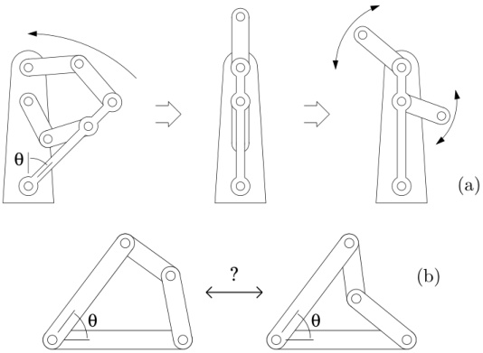{width=57%} Figure 8.2: Examples of variable mobility (a) and configuration ambiguity (b)

where $n_{tot}$ is the sum of the joint freedoms of all the joints in the system, not just the tree joints. This formula applies to rigid-body systems in a 3D Euclidean space. The equivalent formula in a 2D space is

$$
m o b i l i t y = n _ { t o t } - 3 N _ { L } \, .
$$

Variable Mobility: The mobility of a kinematic tree is fixed; but the mobility of a closed-loop system depends on $r$, and $r$ can vary with configuration. An example of variable mobility is shown in Figure 8.2(a). As long as the angle $\theta$ is nonzero, the mechanism has a mobility of 1; but if $\theta = 0$ then the two arms are able to move independently, and the mobility is 2. Furthermore, at the configuration shown in the middle diagram, which is the boundary between these two motion regimes, the mechanism has an instantaneous mobility of 3. In terms of $n$ and $r$, we have $n = 5$ throughout, but $r = 4$ in the left-hand diagram, $r = 3$ in the right-hand diagram, and $r = 2$ in the middle diagram.

Configuration Ambiguity: If $q$ and $y$ are vectors of independent position variables for a kinematic tree and a closed-loop system, respectively, then $q$ always identifies a unique configuration of the tree, but $y$ does not necessarily identify a unique configuration of the closed-loop system. A simple example is shown in Figure 8.2(b): knowing the value of the independent variable, $\theta$, is not enough to determine uniquely the configuration of the system. There are two ways to solve this problem:

use $q$ instead of $y$, where $q$ is the position vector of the spanning tree, or 2. supply a function that maps each value of $y$ to a unique value of $q$.

The first option is the one used in previous sections, while the second is the subject of Section 8.11. For the system shown in Figure 8.2(b), option 2 is applicable if we know in advance that one of the two configurations cannot be reached. Otherwise, we must either try a different independent variable, or else resort to option 1.

Overconstraint: A closed-loop system is said to be overconstrained if $r < n^{c}$. Such systems have $n^{c} - r$ redundant constraints, which means there will be $n^{c} - r$ indeterminate constraint forces in the equations of motion. They also have excess mobility relative to a properly constrained system, as the mobility formula can be written

$$
m o b i l i t y = n _ { t o t } - 6 N _ { L } + ( n ^{c} - r ) \, .
$$

Overconstrained systems are actually very common. For example, any system containing planar kinematic loops will be overconstrained. The planar loop shown in Figure 8.2(b) contains four revolute joints, so the numbers for this system are $n=3$ and $n^{c}=5$; but the mobility is 1, which means $r=2$.

The dynamics of overconstrained systems is harder to calculate than that of properly constrained systems. For this reason, it is useful to convert the former to the latter wherever possible. The conversion is achieved by replacing the original loop joints with joints that impose fewer constraints, so that the value of $n^{c}$ is reduced. For example, if the loop-closing revolute joint in a planar kinematic loop is replaced with a sphere-in-cylinder joint, which imposes only two constraints, then $n^{c}$ will be reduced from 5 to 2, which means $n^{c}=r$.

# 8.11 Loop Closure Functions

Let $q$ be the vector of position variables for the spanning tree of a given closed-loop system, and let $y$ be a vector of independent position variables for the same system. $y$ will typically be a subset of the elements of $q$, but this is not necessary. We assume that $y$ defines $q$ uniquely. For this assumption to hold, it may be necessary to place restrictions on the value of $y$. We therefore define a set $C \subseteq \mathbb{R}^{(n-r)}$ of acceptable values for $y$, and assume $y \in C$. Given these assumptions, there exists a function, $\gamma$, that satisfies

$$
q = \gamma ( y )
$$

for all $y \in C$. (Cf. Eq. 3.11.) Differentiating this equation gives

$$
\dot { q } = G \, \dot { y } \, ,
$$

where

$$
G = \frac { \partial \gamma } { \partial y } \, ,
$$

and differentiating it a second time gives

$$
\ddot { q } = G \, \ddot { y } + g \, ,
$$

where

$$
g = \dot { G } \, \dot { y } \, .
$$

Equation 8.59 has the same form as Eq. 8.42, and the two equations are identical when the loop-closure errors are zero.

We now have a new method for obtaining $G$ and $g$, in which they are calculated from a vector of independent variables. This method can be summarized as follows.

Define $\boldsymbol{y}$, and identify $C$.

Find an expression for the function $\boldsymbol{\gamma}$ that maps $\boldsymbol{y}$ uniquely to $\boldsymbol{q}$, given $\boldsymbol{y} \in C$.

Differentiate this expression symbolically to obtain expressions for $\boldsymbol{G}$ and $\boldsymbol{g}$.

Write code to evaluate these expressions.

This method is less general that the one described in Section 8.5, mainly because step 2 is not always possible. It is also less convenient, since it requires the user to supply expressions (or code) for $G$ and $g$ in addition to the system model. Nevertheless, it is applicable to a wide variety of practical closed-loop systems, and the calculation of $G$ and $g$ by this method can be much cheaper than using the algorithms in Sections 8.7 and 8.8.

Another advantage of this method is that loop-closure errors cannot occur. This is because we do not integrate $\ddot{\boldsymbol{q}}$ to get $\dot{\boldsymbol{q}}$ and $\boldsymbol{q}$, but instead integrate $\ddot{\boldsymbol{y}}$ to get $\dot{\boldsymbol{y}}$ and $\boldsymbol{y}$. This way, the vectors $\boldsymbol{q}$ and $\dot{\boldsymbol{q}}$ are calculated from $\boldsymbol{y}$ and $\dot{\boldsymbol{y}}$ using Eqs. 8.56 and 8.57, which means that their values automatically satisfy the loop constraints. There is therefore no need for constraint stabilization terms.

# A Worked Example

Figure 8.3 shows a rigid-body system containing four bodies, five joints and one kinematic loop. The system is a planar mechanism, and its mobility is 2. Bodies $B_{1}$ and $B_{4}$ form a two-link arm, while $B_{2}$ and $B_{3}$ are the cylinder and piston, respectively, of a linear actuator. Joint 3 is prismatic, and the rest are revolute. Joints 1, 2, 3 and 5 participate in the kinematic loop, with joint 5 being the loop joint. The vector of tree-joint variables is therefore $\boldsymbol{q}=[q_{1} q_{2} q_{3} q_{4}]^{\mathrm{T}}$, where $q_{3}$ is a distance and the rest are angles. In this example, we choose $q_{1}$ and $q_{4}$ to be the independent variables; that is, we define the vector of independent variables, $\boldsymbol{y}=[y_{1} y_{2}]^{\mathrm{T}}$, such that $y_{1}=q_{1}$ and $y_{2}=q_{4}$. The main task is then to express $q_{2}$ and $q_{3}$ as functions of $y_{1}$.

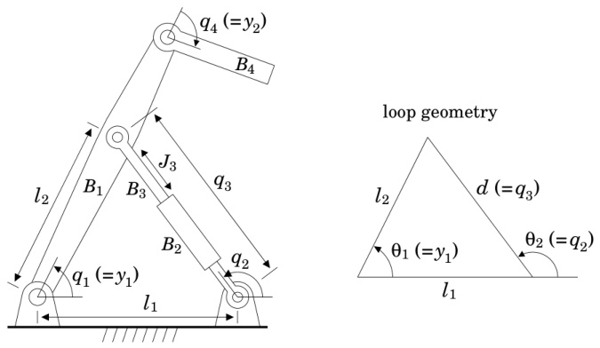{width=74%}

# Triangle Formulae:

$$
\begin{array}{rlr} & { } & { d > 0 } \\& { } & { } \\& { } & { \sin ( \theta _ { 2 } ) = \frac { l _ { 2 } \sin ( \theta _ { 1 } ) } { d } } \\& { } & { } \\& { } & { \cos ( \theta _ { 2 } ) = \frac { l _ { 2 } \cos ( \theta _ { 1 } ) - l _ { 1 } } { d } } \end{array}
$$

Solution:

$$
\begin{aligned}&\text{一}\\&\gamma(\boldsymbol{y})=\begin{bmatrix}y_1\\\theta_2\\d\\y_2\end{bmatrix}&&\text{where}&&\theta_2=\tan^{-1}\left(\frac{l_2\sin(y_1)}{l_2\cos(y_1)-l_1}\right)\\&&&d=\sqrt{l_1^2+l_2^2-2l_1l_2\cos(y_1)}\\&G=\frac{\partial\gamma}{\partial\boldsymbol{y}}=\begin{bmatrix}1&0\\u_1&0\\u_2&0\\0&1\end{bmatrix}&&\text{where}&&u_1=\frac{l_2^2-l_1l_2\cos(y_1)}{d^2}\\&&&u_2=\frac{l_1l_2\sin(y_1)}{d}\\&\boldsymbol{g}=\boldsymbol{G}\dot{\boldsymbol{y}}=\begin{bmatrix}0\\u_3\\u_4\\0\end{bmatrix}&&\text{where}&&u_3=\frac{(l_1^2-l_2^2)l_1l_2\sin(y_1)}{d^4}\:\dot{y}_1^2\\&&&u_4=\frac{(l_1l_2\cos(y_1)-u_2^2)}{d}\:\dot{y}_1^2\end{aligned}
$$

Figure 8.3: Formulating $\gamma$, $G$ and $g$ for a simple closed-loop system

The geometry of the kinematic loop is very simple: just a triangle. It is therefore possible to use standard trigonometric formulae to express $q_2$ and $q_3$ (labelled $\theta_2$ and $d$ on the triangle) as functions of $y_1$. To make the mapping unique, we impose the constraint $d > 0$, and we use the four-quadrant version of the arctangent function (the one that takes two arguments) to calculate $\theta_2$. If $l_1 = l_2$ then we require $\theta_1 \neq 0$. In this case, $C$ must exclude all vectors $\mathbf{y}$ having $y_1 = 0$. When a kinematic loop has an explicit solution formula, like this one, then it is said to have a closed-form solution.

Figure 8.3 also presents explicit formulae for $\gamma$, $G$ and $g$. It can be seen that $G$ is block-diagonal, having a $3 \times 1$ block and a $1 \times 1$ block. Note that the equations in this figure are all scalar equations, in contrast to the vector and matrix equations in Sections 8.7 and 8.8. It is therefore much cheaper to calculate $G$ and $g$ via the equations presented here.

In summary, this method places an additional burden on the user of having to supply code to calculate $\gamma$, $\boldsymbol{G}$ and $\boldsymbol{g}$, but offers in return a potentially large improvement in the efficiency of this part of the dynamics calculation. This method is appropriate for systems containing kinematic loops with simple, closed-form solutions, such as might be found on excavator arms, large industrial robots, parallel robots and Stuart-Gough platforms (flight simulators).

# 8.12 Inverse Dynamics

Inverse dynamics is the problem of calculating the forces required to produce a given acceleration. In a kinematic tree, there is a $1:1$ relationship between $\tau$ and $\ddot{q}$, and the calculation of $\tau$ from $\ddot{q}$ is straightforward. In a closed-loop system, the given value of $\ddot{q}$ must comply with the loop-closure constraints, and there are infinitely many values of $\tau$ that produce the same acceleration. The nature of the inverse dynamics problem is therefore significantly altered by the presence of kinematic loops.

Let us now formulate the inverse dynamics equations for a closed-loop system. We start with the equation of motion for the spanning tree, which is

$$
\boldsymbol { \tau } = H \ddot { \boldsymbol { q } } + C - \boldsymbol { \tau } ^{a} - \boldsymbol { K } ^{\mathrm { T} } \boldsymbol { \lambda } .
$$

In this equation, $\boldsymbol{\tau}$ is the vector of unknown forces acting at the tree joints. Any known forces, such as those due to springs and dampers, are assumed to be included in $\boldsymbol{C}$. It is also assumed that there are no unknown active forces at the loop joints. Thus, if $\boldsymbol{\tau}^{a}$ appears at all, then it is composed entirely of known forces.

Equation 8.61 contains two unknowns, $\tau$ and $\lambda$. As we are only interested in $\tau$, the next step is to eliminate $\lambda$. This is done by multiplying the equation by $G^{\mathrm{T}}$, which gives

$$
G ^{\mathrm { T} } \tau = G ^{\mathrm { T} } ( H \ddot { q } + C - \tau ^{a} ) \, .
$$

This equation can be written

$$
G ^{\mathrm { T} } \tau = G ^{\mathrm { T} } \tau _ { \mathrm { I D } } \, ,
$$

where $\tau_{\mathrm{ID}}$ is the force calculated by applying an inverse dynamics function to the spanning tree; that is,

$$
\begin{array}{rl} { \pmb { \tau } _ { \mathrm { I D } } } & { = \pmb { H } \ddot { \pmb { q } } + \pmb { C } - \pmb { \tau } ^{a} } \\& { = \mathrm { I D } ( \pmb { q } , \dot { \pmb { q } } , \ddot { \pmb { q } } ) \, . } \end{array}
$$

In this context, ID($\boldsymbol{q}$, $\dot{\boldsymbol{q}}$, $\ddot{\boldsymbol{q}}$) is the output of the algorithm described in Section 8.6 with the joint acceleration terms put back in. Bear in mind that $\boldsymbol{q}$, $\dot{\boldsymbol{q}}$ and $\ddot{\boldsymbol{q}}$ must all comply with the loop-closure constraints.

Equation 8.62 is the basic inverse dynamics equation for a closed-loop system. As $\boldsymbol{G}^{\mathrm{T}}$ is an $(n-r) \times n$ matrix, this equation imposes $n-r$ constraints on an $n$-dimensional vector of unknowns, leaving $r$ freedoms of choice. In other words, there are $\infty^{r}$ different values of $\boldsymbol{\tau}$ that produce the same acceleration. If we want a unique solution to the problem, then we must either impose more constraints or apply an optimality criterion.

# Actuator Forces

A typical use for inverse dynamics is to calculate a vector of actuator forces to produce a given acceleration. Now, not every joint will be powered by an actuator, so let us define $p$ and $\boldsymbol{u}$ to be the number of actuated freedoms in the tree, and the $p$-dimensional vector of actuator force values, respectively. $\boldsymbol{u}$ and $\boldsymbol{\tau}$ are then related by the equation

$$
\tau = Q \left[ \frac { u } { 0 } \right] ,
$$

where $Q$ is an $n \times n$ permutation matrix. This equation simply says that the elements of $\tau$ are a permutation of the $p$ elements of $u$ and $n-p$ zeros. The zero-valued elements of $\tau$ are those that belong to the unactuated degrees of freedom. Let us also define the two matrices $G_u$ and $G_0$, which contain the rows of $G$ corresponding to actuated and unactuated freedoms, respectively. These matrices are related to $G$ by the equation

$$
G = Q \left[ \begin{array}{l} { { G _ { u } } } \\{ { G _ { 0 } } } \end{array} \right] .
$$

From these definitions, it follows that

$$
G ^{\mathrm { T} } \boldsymbol { \tau } = \left[ G _ { u } ^{\mathrm { T} }  G _ { 0 } ^{\mathrm { T} } \right] Q ^{\mathrm { T} } \boldsymbol { Q } \left[ \begin{array}{l} { \boldsymbol { u } } \\{ \boldsymbol { 0 } } \end{array} \right] = \left[ G _ { u } ^{\mathrm { T} }  G _ { 0 } ^{\mathrm { T} } \right] \left[ \begin{array}{l} { \boldsymbol { u } } \\{ \boldsymbol { 0 } } \end{array} \right] = G _ { u } ^{\mathrm { T} } \boldsymbol { u } \, ;
$$

and substituting this result into Eq. 8.62 gives

$$
G _ { u } ^{\mathrm { T} } u = G ^{\mathrm { T} } \tau _ { \mathrm { I D } } \, ,
$$

which is the inverse dynamics equation for actuator forces. In solving this equation, there are three cases to consider.

rank($\boldsymbol{G}_{u}$) < $n-r$. In this case, the system is underactuated: it has more motion freedoms than the actuators can control.

$p$ > rank($\boldsymbol{G}_{u}$). In this case, the system is redundantly actuated: infinitely many different values of $\boldsymbol{u}$ will produce the same acceleration.

$p$ = rank($\boldsymbol{G}_{u}$) = $n-r$. In this case, the system is properly actuated: $\boldsymbol{G}_{u}$ is invertible, and there is a unique solution to Eq. 8.63 given by $\boldsymbol{u} = \boldsymbol{G}_{u}^{-\mathrm{T}} \boldsymbol{G}^{\mathrm{T}} \boldsymbol{\tau}_{\mathrm{ID}}$.

Cases 1 and 2 are not mutually exclusive.

Example 8.2 Consider the assignment of actuators to the mechanism shown in Figure 8.3. This mechanism has two degrees of freedom, and therefore requires two actuators. $\mathbf{G}_{u}$ will therefore be a $2 \times 2$ matrix containing two rows of $\mathbf{G}$; and these rows must be chosen so that $\mathbf{G}_{u}$ is invertible. Given the formula for $\mathbf{G}$ shown in the figure, it follows that $\mathbf{G}_{u}$ must contain row 4 of $\mathbf{G}$ and any one of the other three rows. This means that an actuator must be present at joint 4, and at any one of the other three joints. (As this mechanism is so simple, this result could have been obtained by inspection.)

Let us suppose that joints 3 and 4 are actuated, which means that $G_{u} = \begin{bmatrix} u_{2} & 0 \\ 0 & 1 \end{bmatrix}$. The inverse dynamics formula for this system will then be

$$
\begin{array}{rl} { u } & { = \ G _ { u } ^{- \mathrm { T} } \ G ^{\mathrm { T} } \ \tau _ { \mathrm { I D } } } \\& { = \ \left[ \begin{array}{llll} { u _ { 2 } } & { 0 } \\{ 0 } & { 1 } \end{array} \right] ^{- 1} \left[ \begin{array}{llll} { 1 } & { u _ { 1 } } & { u _ { 2 } } & { 0 } \\{ 0 } & { 0 } & { 0 } & { 1 } \end{array} \right] \ \tau ^{\mathrm { I D} } } \\& { = \ \left[ \begin{array}{llll} { 1 / u _ { 2 } } & { u _ { 1 } / u _ { 2 } } & { 1 } & { 0 } \\{ 0 } & { 0 } & { 0 } & { 1 } \end{array} \right] \ \tau ^{\mathrm { I D} } \ , } \end{array}
$$

where

$$
\tau _ { \mathrm { I D } } = \mathrm { I D } ( \gamma ( y ) , G \ddot { y } , G \ddot { y } + g ) \, .
$$

Note that $\boldsymbol{u}$ is not a vector of generalized forces for this system, since the expression $\boldsymbol{u}^{\mathrm{T}}\boldsymbol{y}$ does not equal the power delivered by $\boldsymbol{u}$. This discrepancy is caused by the fact that $\dot{\boldsymbol{q}}_{1}$ is the first element in $\dot{\boldsymbol{y}}$, but $\tau_{3}$ is the first element in $\boldsymbol{u}$. If you want $\boldsymbol{u}$ to be the generalized force vector, then the elements of $\boldsymbol{u}$ must be the same subset of $\boldsymbol{\tau}$ as $\dot{\boldsymbol{y}}$ is of $\dot{\boldsymbol{q}}$.

# 8.13 Sparse Matrix Method

Every algorithm we have studied so far works by applying a set of loop-closure constraints to a spanning tree. An alternative strategy is to dispense with the spanning tree, and work directly with the individual bodies and joints in the

system. This approach produces equations with large, sparse matrices; and any algorithm based on these equations must exploit the sparsity in order to be competitive. Such algorithms tend to be less efficient than those based on spanning trees, but they can be more efficient under special circumstances, as we shall see below.

The equation of motion for a collection of $N_{B}$!

$$
\left[ \begin{array}{ll} { I } & { P T } \\{ T ^{\mathrm { T} } P ^{\mathrm { T} } } & { 0 } \end{array} \right] \left[ \begin{array}{l} { a } \\{ - \lambda } \end{array} \right] = \left[ \begin{array}{l} { P T ^{a} \tau - v \times ^{*} I v + f ^{x} } \\{ - \dot { T } ^{\mathrm { T} } P ^{\mathrm { T} } v } \end{array} \right] .
$$

This equation is derived in Section 3.7. $\boldsymbol{v}$, $\boldsymbol{a}$ and $\boldsymbol{f}^{x}$ are vectors of body velocities, accelerations and external forces, respectively; $\boldsymbol{\lambda}$ is the vector of joint constraint-force variables; $\boldsymbol{T}^{a}\boldsymbol{\tau}$ is the vector of active forces transmitted across the joints; $\boldsymbol{P}^{\mathrm{T}}$ is the matrix that maps from body to joint velocities (i.e., $\boldsymbol{P}^{\mathrm{T}}\boldsymbol{v}$ is the vector of joint velocities); and $\boldsymbol{I}$ and $\boldsymbol{T}$ are composite matrices of body inertias and joint constraint-force subspaces, respectively. $\boldsymbol{a}$ and $\boldsymbol{\lambda}$ are the unknowns; and the size of the coefficient matrix is $6N_{B}+n_{\mathrm{tot}}^{c}$ square, where $n_{\mathrm{tot}}^{c}$ is the total number of constraints imposed by the joints.

Our chief interest lies in the sparsity pattern of the coefficient matrix!

$$
I = \mathrm { d i a g } ( I _ { 1 } , \ldots , I _ { N _ { B } } )  \mathrm { a n d }  T = \mathrm { d i a g } ( T _ { 1 } , \ldots , T _ { N _ { J } } ) \, .
$$

$P$ is also sparse, but not block-diagonal. It is defined by

$$
P _ { i j } = \left\{ \begin{array}{ll} { { \mathbf { 1 } _ { 6 \times 6 } } } & { { \mathrm { i f ~ } i = s ( j ) } } \\{ { - \mathbf { 1 } _ { 6 \times 6 } } } & { { \mathrm { i f ~ } i = p ( j ) } } \\{ { \mathbf { 0 } _ { 6 \times 6 } } } & { { \mathrm { o t h e r w i s e } . } } \end{array} \right.
$$

$P$ is therefore a $6N_{B} \times 6N_{J}$ matrix, organized as an $N_{B} \times N_{J}$ matrix of $6 \times 6$ blocks. It has two nonzero blocks in every column, except those columns for joints connecting directly to the base, which have only one nonzero block. From these definitions, it follows that the coefficient matrix contains $N_{B}$ nonzero blocks on the main diagonal, and up to $4N_{J}$ nonzero off-diagonal blocks. The exact positions of the latter are determined by the connectivity.

Equation 8.64 is typical of the kind of equation that a sparse matrix arithmetic software library is designed to solve, and the use of such a library is probably the best way to proceed. A sparse matrix library would typically provide the following facilities:

a function to analyse the sparsity pattern of a matrix, as a preprocessing step, in order to work out the best factorization order and which zero-valued elements get filled in with nonzero values during the course of the factorization;

a data structure for compact storage of all the nonzero values in the matrix and all the zero-valued entries that will get altered during factorization;

a function to perform a factorization in the order determined in the pre-processing step; and

a function to perform back-substitution using the resulting factors.

If an $n \times n$ matrix contains only $O(n)$ nonzero elements, then it is sometimes possible to factorize the matrix in only $O(n)$ arithmetic operations. An $O(n)$ factorization of Eq. 8.64 is always possible if the system is a kinematic tree.² However, there are also many closed-loop systems for which an $O(n)$ factorization is possible, including some that cannot be solved in $O(n)$ by any algorithm using a spanning tree. In such cases, the sparse-matrix algorithm will out-perform spanning-tree algorithms for a sufficiently large $n$.

Figure 8.4 shows an example of a closed-loop system having $O(n)$ dynamics by the sparse matrix method. The connectivity graph is of a kind that is sometimes called a ladder. It can be extended indefinitely by adding more nodes to the right. The figure also shows the sparsity pattern of a symmetric permutation of the coefficient matrix. This permutation has been chosen so that the resulting matrix has a fixed bandwidth—every nonzero block appears on the main diagonal, or on one of the three nearest diagonals either side. A matrix with this property can always be factorized in $O(n)$ operations.

To explain the permutation, the nodes in the graph have been numbered in the same order as they appear in the matrix, and the joints have been given number pairs reflecting their connectivity: joint $ij$ is the one that connects from body $i$ to body $j$. Row 1 in the permuted matrix is the row in the original matrix that contained $\mathbf{I}_1$ (with body numbers as shown in the graph); row 2 is the row that contained $\mathbf{I}_2$; row 3, which is labelled 12, is the row in the original matrix containing the row in $\mathbf{T}^\top\mathbf{P}^\top$ pertaining to joint 12; and so on. Observe that each row labelled with a body number contains a nonzero block on the main diagonal, and that each row labelled with a number pair $ij$ contains nonzero blocks only in columns $i$ and $j$.

If we were to apply a spanning-tree algorithm to this system, then we would encounter the following problem: whatever spanning tree we choose, there will always be $O(n^2)$ nonzero elements in the joint-space inertia matrix, $H$, and so it will be impossible to calculate the dynamics in only $O(n)$ operations.

Finally, the following details should be mentioned. First, if this algorithm is to be used in a dynamics simulator, then constraint stabilization is required. The necessary extra terms have not been included in Eq. 8.64. Second, we have assumed that the coefficient matrix has full rank; that is, we have assumed that the closed-loop system is properly constrained. If the matrix is singular, then the sparse factorization may not work.

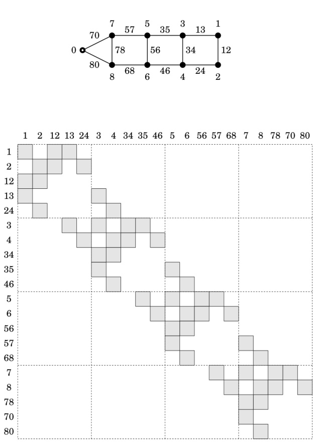{width=68%} Figure 8.4: Sparsity pattern arising from a ladder-like connectivity graph

# Chapter 9

# Hybrid Dynamics and Other Topics

This chapter covers the following topics: hybrid dynamics, floating bases, gears and dynamic equivalence. Hybrid dynamics is a generalization of forward and inverse dynamics in which the forces are known at some joints, the accelerations at the rest, and the task is to calculate the unknown forces and accelerations. In effect, one is performing forward dynamics at some joints and inverse dynamics at the rest. A floating-base system is one in which the base is a moving body. Such systems can be modelled as fixed-base systems by installing a 6-DoF joint between the fixed base and the body representing the floating base. However, floating-base systems are an important class of rigid-body systems, and merit special treatment. Sections 9.1 to 9.5 present several algorithms for hybrid dynamics and floating bases. Gears impose constraints between joint variables. They therefore resemble kinematic loops, and Section 9.6 shows how gear constraints can be incorporated into a rigid-body system using a technique that was developed in Chapter 8 for kinematic loops. Two different rigid-body systems are dynamically equivalent if they have the same equation of motion. Section 9.7 explores this concept, and presents a method for modifying the inertia parameters of a rigid-body system without altering its equation of motion.

# 9.1 Hybrid Dynamics

For each joint $i$, there is a force variable, $\boldsymbol{\tau}_{i}$, and an acceleration variable, $\ddot{\boldsymbol{q}}_{i}$. In the forward-dynamics problem, we are given $\boldsymbol{\tau}_{i}$ for every joint, and the task is to calculate the accelerations. In the inverse-dynamics problem, we are given $\ddot{\boldsymbol{q}}_{i}$ for every joint, and the task is to calculate the forces. In the hybrid-dynamics problem, we are given either $\boldsymbol{\tau}_{i}$ or $\ddot{\boldsymbol{q}}_{i}$ at each joint, and the task is to calculate the unknown accelerations and forces. In effect, hybrid dynamics is like performing forward dynamics at some of the joints and inverse dynamics

at the rest. The hybrid-dynamics problem therefore includes both the forward-dynamics problem and the inverse-dynamics problem as special cases.

Hybrid dynamics is used to introduce prescribed motions into a rigid-body system. For example, it will let you study the dynamics of a mechanical linkage or transmission under prescribed motion conditions at the input, or the motion of a compound pendulum in response to a given kinematic excitation, or the tumbling behaviour of an animated character in mid air. It can also be used to help design trajectories for underactuated systems; for example, a sequence of limb movements for an animated character to leap, perform a somersault, and land on its feet.

Another use is to simplify a simulation by removing unimportant and/or high-frequency dynamics. For example, the motions of a robot's joints are typically controlled by high-gain feedback control systems. These control systems continually compare the actual motion of a joint with the commanded motion, and adjust the force output from the actuator so as to bring the difference quickly to zero. In a simulation of a complete robot, the simulator must calculate the dynamics of the actuators and control systems as well as the mechanical parts. However, if a particular control system can be regarded as perfect, meaning that the actual motions of the joints it controls are practically equal to the commanded motions, then it is possible to dispense with this control system and its actuators, and simply prescribe the motions of the affected joints. If the removed components were responsible for the highest-frequency dynamics in the original system, then the simulator can now use a longer integration time step. An example of this technique can be found in Hu et al. (2005).

# Equations

Let us define $fd$ to be the set of 'forward-dynamics joints'; that is, the set of joints for which the forces are known and the accelerations unknown. Any joint that is not a member of $fd$ is therefore an 'inverse-dynamics joint', for which the acceleration is known and the force unknown. Let us also define $\boldsymbol{Q}$ to be the permutation matrix that reorders the elements of $\ddot{\boldsymbol{q}}$ and $\boldsymbol{\tau}$ so that the forward-dynamics variables come first. Thus,

$$
Q \, \ddot { q } = \left[ \begin{array}{l} { \ddot { q } _ { 1 } } \\{ \ddot { q } _ { 2 } } \end{array} \right]  \mathrm { a n d }  Q \, \tau = \left[ \begin{array}{l} { \tau _ { 1 } } \\{ \tau _ { 2 } } \end{array} \right] ,
$$

where $\ddot{\boldsymbol{q}}_{1}$ and $\boldsymbol{\tau}_{1}$ contain the acceleration and force variables pertaining to the forward-dynamics joints, and $\ddot{\boldsymbol{q}}_{2}$ and $\boldsymbol{\tau}_{2}$ contain the acceleration and force variables pertaining to the inverse-dynamics joints. The equation of motion for a kinematic tree can now be written

$$
\left[ \begin{array}{ll} { H _ { 11 } } & { H _ { 12 } } \\{ H _ { 21 } } & { H _ { 22 } } \end{array} \right] \left[ \begin{array}{l} { \ddot { q } _ { 1 } } \\{ \ddot { q } _ { 2 } } \end{array} \right] = \left[ \begin{array}{l} { \tau _ { 1 } } \\{ \tau _ { 2 } } \end{array} \right] - \left[ \begin{array}{l} { C _ { 1 } } \\{ C _ { 2 } } \end{array} \right] ,
$$

where

$$
\begin{array}{r} { \left[ \begin{array}{ll} { H _ { 11 } } & { H _ { 12 } } \\{ H _ { 21 } } & { H _ { 22 } } \end{array} \right] = Q \, H \, Q ^{\mathrm { T} }  \mathrm { a n d }  \left[ \begin{array}{l} { C _ { 1 } } \\{ C _ { 2 } } \end{array} \right] = Q \, C \, . } \end{array}
$$

Equation 9.1 is just a permutation of the standard equation of motion, $H\ddot{q}=\tau-C$ (e.g. see Eq. 6.1). The two unknowns in this equation are $\ddot{q}_1$ and $\tau_2$. If we bring them together on the left-hand side, then we get

$$
\begin{array}{r} { \left[ \begin{array}{ll} { H _ { 11 } } & { 0 } \\{ H _ { 21 } } & { - 1 } \end{array} \right] \left[ \begin{array}{l} { \ddot { q } _ { 1 } } \\{ \tau _ { 2 } } \end{array} \right] = \left[ \begin{array}{l} { \tau _ { 1 } } \\{ 0 } \end{array} \right] - \left[ \begin{array}{l} { C _ { 1 } ^{\prime} } \\{ C _ { 2 } ^{\prime} } \end{array} \right] , } \end{array}
$$

where

$$
\left[ \frac { C _ { 1 } ^{\prime} } { C _ { 2 } ^{\prime} } \right] = \left[ \frac { C _ { 1 } + H _ { 12 } \ddot { q } _ { 2 } } { C _ { 2 } + H _ { 22 } \ddot { q } _ { 2 } } \right] = Q C ^{\prime} \, .
$$

This is the basic equation for hybrid dynamics. Physically, $C'$ is the force required to impart zero acceleration to each forward-dynamics joint and the given acceleration to each inverse-dynamics joint. Thus, $C'$ can be calculated by an inverse-dynamics function as follows:

$$
C ^{\prime} = \operatorname { I D } ( q , \dot { q } , Q ^{\mathrm { T} } \biggl [ \frac { 0 } { \ddot { q } _ { 2 } } \biggr ] ) \, .
$$

Example 9.1 Equation 9.2 hides $\ddot{q}_{2}$ within $C'$. If we want to keep $\ddot{q}_{2}$ visible, then the equation can be written

$$
\begin{array}{r} { \left[ \begin{array}{ll} { H _ { 11 } } & { 0 } \\{ H _ { 21 } } & { - 1 } \end{array} \right] \left[ \begin{array}{l} { \ddot { q } _ { 1 } } \\{ \tau _ { 2 } } \end{array} \right] = \left[ \begin{array}{ll} { 1 } & { - H _ { 12 } } \\{ 0 } & { - H _ { 22 } } \end{array} \right] \left[ \begin{array}{l} { \tau _ { 1 } } \\{ \ddot { q } _ { 2 } } \end{array} \right] - \left[ \begin{array}{l} { C _ { 1 } } \\{ C _ { 2 } } \end{array} \right] . } \end{array}
$$

Multiplying this equation by the inverse of the left-hand coefficient matrix produces Eq. 10 in Jain and Rodriguez (1993).

# Algorithms

Equation 9.2 can be solved in four steps as follows.

【此段建议校对(This paragraph is recommended for proofreading)】1. Calculate \(C'\\) using Eq. eateduser继续修正：

Calculate \(C'\\) using H.

Calculate \(H_{\delta}\'').\'

Solve \(H_{\delta}\ddot{\tau' - C'_\delta\) for \(\dd'\\).

Calculate \(\tau'\ via \(\tau = C'\'\text{ID}_(Q^\text{u}\left[\begin{array{cc} \dd'\' \ 1\end{{}\)\'.

The symbol $ID_{\delta}$ in step 4 denotes the differential inverse-dynamics function described in Table 6.1, which multiplies its argument by $\mathbf{H}$. Thus, the equation in step 4 evaluates to

$$
\tau = C ^{\prime} + Q ^{\mathrm { T} } \left[ \frac { H _ { 11 } \ddot { q } _ { 1 } } { H _ { 21 } \ddot { q } _ { 1 } } \right] ^{\prime}
$$

The simplest way to accomplish step 2 is to calculate $H$ via the composite rigid body algorithm (§6.2) and extract the submatrix $H_{11}$. However, if greater

【此段建议校对(This paragraph is recommended for proofreading)】$H = \frac{1

for each \in \in \nu(fd) }

efficiency is required, then it is possible to modify the algorithm so that it only performs the minimum amount of calculation necessary to obtain $H_{11}$. This modified algorithm is shown in Table 9.1. One new quantity appears in this algorithm: $\nu(fd)$, which is the set of bodies that are supported by at least one forward-dynamics joint. It is defined by the formula

$$
\nu ( f d ) = \bigcup _ { i \in f d } \nu ( i ) \, ,
$$

and it can be calculated from $fd$ and $\lambda$ as follows:1

$\nu(fd)=fd$

for $i=1$ to $N_{B}$ do

if $\lambda(i)\in\nu(fd)$ then

$\nu(fd)=\nu(fd)\cup\{i\}$

end

end

The cost of calculating $\nu(fd)$ is small enough that it would be practical for a hybrid dynamics routine to calculate it each time the routine was called. However, as $\nu(fd)$ depends only on $fd$ and $\lambda$, its value would not normally change during the course of a single simulation run; so it would also be possible to calculate it just once at the beginning of the run, and store it for later use.

On comparing the modified algorithm with the original, in Table 6.2, it can be seen that they both have the same structure, but the modified algorithm performs only a subset of the calculations. For example, $I_{i}^{c}$ is calculated only

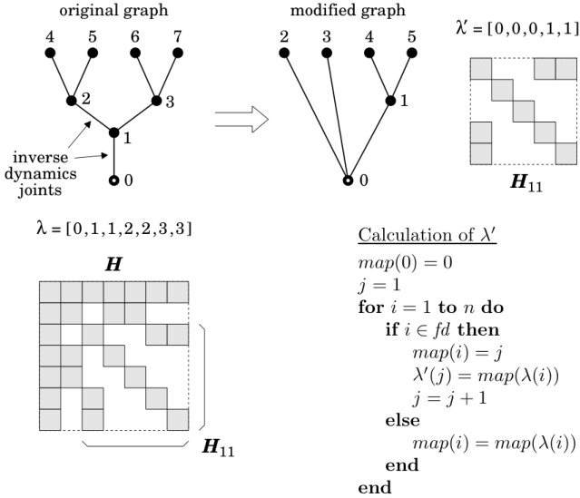{width=70%} Figure 9.1: Branch-induced sparsity in $H_{11}$

for those values of $i$ satisfying $i \in \nu(fd)$, and $H_{ij}$ is calculated only for those values of $i$ and $j$ satisfying $i, j \in fd$.

Moving on to step 3, $H_{11}$ is a symmetric, positive-definite matrix, so the equation in step 3 could be solved using any standard linear-equation solver for such matrices. However, as shown in Figure 9.1, $H_{11}$ inherits a portion of whatever branch-induced sparsity is present in $H$. We therefore have the opportunity to exploit this sparsity by using one of the algorithms described in Section 6.5.

The prerequisite for exploiting the sparsity in $H_{11}$ is to obtain a modified parent array, $\lambda'$, that describes the sparsity pattern in this matrix. Figure 9.1 shows how this can be done. Starting with the connectivity graph of the original system, a modified graph is constructed by merging every pair of nodes that are connected by an inverse-dynamics joint. Once this is done, the remaining nodes must be renumbered, as there are now fewer of them. In the example shown in the figure, joints 1 and 2 are inverse-dynamics joints, so nodes 1 and 2 are merged with node 0, and nodes 3 to 7 are renumbered 1 to 5.

Figure 9.1 also shows an algorithm for calculating $\lambda'$ from $\lambda$ and $fd$. As a by-product, this algorithm also calculates the node-number mapping from the original to the modified graph: $map(i)$ is the new number for original node $i$.

To follow this algorithm, it helps to know that $i$ is counting node numbers in the original graph, while $j$ is counting node numbers in the modified graph. Bear in mind that if any of the joints in the modified graph have more than one degree of freedom then $\lambda'$ will have to be expanded, as explained in Section 6.5, before it can be used.

# 9.2 Articulated-Body Hybrid Dynamics

The articulated-body algorithm is easily adapted to perform hybrid dynamics: one simply modifies the algorithm so that it uses the normal articulated-body equations (as described in §7.3) at each forward-dynamics joint, and the equations developed below at each inverse-dynamics joint. The two sets of equations are shown side-by-side in Table 9.2, and the pseudocode is shown in Table 9.3. The latter is adapted from the code in Table 7.1.

Let $f_{i}$ be the spatial force transmitted across joint $i$. $f_{i}$ is related to the acceleration of body $i$ by the equation

$$
f _ { i } = I _ { i } ^{A} a _ { i } + p _ { i } ^{A} \, ;
$$

and it is related to the acceleration of body $\lambda(i)$ by the equation

$$
f _ { i } = I _ { i } ^{a} a _ { \lambda ( i ) } + p _ { i } ^{a} \, .
$$

(See Eq. 7.25.) Furthermore, $a_{\lambda(i)}$ is related to $a_{i}$ by

$$
a _ { i } = a _ { \lambda ( i ) } + \dot { S } _ { i } \, \dot { q } _ { i } + S _ { i } \, \ddot { q } _ { i } \, .
$$

In the articulated-body algorithm, the main step is the calculation of $I_{i}^{a}$ and $p_{i}^{a}$ from $I_{i}^{A}$ and $p_{i}^{A}$. If joint $i$ is a forward-dynamics joint, then the immediate problem is that $\ddot{q}_{i}$ is unknown, so the first step is to find an expression for $\ddot{q}_{i}$. However, no such difficulty exists for an inverse-dynamics joint. Substituting Eq. 9.8 into Eq. 9.6 gives

$$
f _ { i } = I _ { i } ^{A} ( a _ { \lambda ( i ) } + \dot { S } _ { i } \, \dot { q } _ { i } + S _ { i } \, \ddot { q } _ { i } ) + p _ { i } ^{A} \, ;
$$

and comparing this equation with Eq. 9.7 reveals that

$$
{ \boldsymbol { I } } _ { i } ^{a} = { \boldsymbol { I } } _ { i } ^{A}
$$

and

$$
p _ { i } ^{a} = p _ { i } ^{A} + I _ { i } ^{A} ( \dot { S } _ { i } \, \dot { q } _ { i } + S _ { i } \, \ddot { q } _ { i } ) \, .
$$

These two equations take the place of Eqs. 7.39 and 7.40 in Pass 2. Apart from this, only two other changes can be seen in the inverse-dynamics equations in Table 9.2: the term $S_{i}\ddot{q}_{i}$ has been added to $c_{i}$ (which means that $a_{i}^{\prime}$ no longer appears in Pass 3), and a new equation has been added to Pass 3 to calculate $\tau_{i}$ via $\tau_{i}=\dot{S}_{i}^{\mathrm{T}}f_{i}$ and Eq. 9.6. (We could have used Eq. 9.7 instead.)

Table 9.2: Articulated-body hybrid dynamics equations

$$
\begin{aligned}&\frac{\text{Ecorrad Dyanice }(i\not\in ft)):}{\text{Elass-1}}\\&\mathrm{Elass-1}\\&\boldsymbol{v}_{i}=\boldsymbol{S}_{i}\:\boldsymbol{q}_{i},\\&\boldsymbol{v}_{i}=\boldsymbol{S}_{i}\:\boldsymbol{q}_{i},\\&\boldsymbol{v}_{i}=\boldsymbol{S}_{i}\:\boldsymbol{q}_{i},\\&\boldsymbol{v}_{i}=\boldsymbol{S}_{i}\:\boldsymbol{q}_{i}\\&\boldsymbol{v}_{i}=\boldsymbol{S}_{i}\:\boldsymbol{q}_{i},\\&\boldsymbol{c}_{i}=\boldsymbol{\hat{S}}_{i}\:\boldsymbol{q}_{i},\\&\boldsymbol{c}_{i}=\boldsymbol{\hat{S}}_{i}\:\boldsymbol{q}_{i}\\&\boldsymbol{c}_{i}=\boldsymbol{c}_{i}+\boldsymbol{v}_{i}\:\boldsymbol{v}_{i}\times\boldsymbol{v}_{i}\\&\boldsymbol{p}_{i}=\boldsymbol{v}_{i}\times\boldsymbol{v}_{i}\:\boldsymbol{v}_{i}-\boldsymbol{i}\boldsymbol{X}_{0}^{i}\boldsymbol{f}_{i}^{i}\\&\boldsymbol{I}_{i}=\boldsymbol{X}_{i}+\sum_{j\in I(i)}\langle\boldsymbol{X}_{j}^{i}\boldsymbol{I}_{j}^{i}\boldsymbol{X}_{i}\rangle\\&\boldsymbol{I}_{i}^{i}=\boldsymbol{I}_{i}+\sum_{j\in I(i)}\langle\boldsymbol{X}_{j}^{i}\boldsymbol{I}_{j}^{i}\boldsymbol{I}_{j}^{i}\boldsymbol{X}_{i}\\&\boldsymbol{I}_{i}^{i}=\boldsymbol{I}_{i}+\sum_{j\in I(i)}\langle\boldsymbol{X}_{j}^{i}\boldsymbol{I}_{j}^{i}\boldsymbol{I}_{i}\rangle\\&\boldsymbol{p}_{i}=\boldsymbol{S}_{i}^{i}\boldsymbol{q}_{i}\\&\boldsymbol{v}_{i}=\boldsymbol{T}_{i}^{i}\boldsymbol{Q}_{i}\\&\boldsymbol{v}_{i}=\boldsymbol{S}_{i}^{i}\boldsymbol{q}_{i}\\&\boldsymbol{v}_{i}=\boldsymbol{X}_{i}^{i}\boldsymbol{q}_{i}\\&\boldsymbol{v}_{i}=\boldsymbol{T}_{i}^{i}\boldsymbol{U}_{i}\\&\boldsymbol{v}_{i}=\boldsymbol{T}_{i}^{i}\boldsymbol{U}_{i}\\&\boldsymbol{p}_{i}=\boldsymbol{v}_{i}^{i}\times\boldsymbol{^{\prime}}\boldsymbol{I}_{i}\boldsymbol{v}_{i}-\boldsymbol{^{i}}\boldsymbol{X}_{0}^{i}\boldsymbol{f}_{i}^{i}\\&\boldsymbol{I}_{i}=\boldsymbol{I}_{i}+\sum_{j\in I(i)}\langle\boldsymbol{X}_{j}^{i}\boldsymbol{I}_{j}^{i}\boldsymbol{I}_{i}^{i}\boldsymbol{X}_{i}\\&\boldsymbol{I}_{i}^{i}=\boldsymbol{I}_{i}+\sum_{j\in I(i)}\langle\boldsymbol{X}_{j}^{i}\boldsymbol{I}_{j}^{i}\boldsymbol{I}_{i}^{i}\boldsymbol{X}_{i}\\&\boldsymbol{I}_{i}^{i}=\boldsymbol{I
$$

:

$\vdots$

$a_{0}=-a_{g}$

for $i=1$ to $N_{B}$ do

if $i\in fd$ then

$a^{\prime}=^{i}X_{\lambda(i)}\ a_{\lambda(i)}+c_{i}$

$\ddot{q}_{i}=D_{i}^{-1}(u_{i}-U_{i}^{\mathrm{T}}a^{\prime})$

$a_{i}=a^{\prime}+S_{i}\ddot{q}_{i}$

else

$a_{i}=\dot{i}X_{\lambda(i)}\ a_{\lambda(i)}+c_{i}$

$\tau_{i}=S_{i}^{\mathrm{T}}(I_{i}^{A}a_{i}+p_{i}^{A})$

end

end

$\boldsymbol{v}_{0}=0$

for $i=1$ to $N_{B}$ do

$\left[\boldsymbol{X}_{\mathrm{J}}, \boldsymbol{S}_{i}, \boldsymbol{v}_{\mathrm{J}}, \boldsymbol{c}_{\mathrm{J}}\right]=\operatorname{jcalc}(\operatorname{jtype}(i), \boldsymbol{q}_{i}, \dot{\boldsymbol{q}}_{i})$

$\dot{}^{i} \boldsymbol{X}_{\lambda(i)}=\boldsymbol{X}_{\mathrm{J}} \boldsymbol{X}_{\mathrm{T}}(i)$

if $\lambda(i) \neq 0$ then

$ i \boldsymbol{X}_{0}=\dot{}^{i} \boldsymbol{X}_{\lambda(i)} \lambda(i) \boldsymbol{X}_{0}$

end

$\boldsymbol{v}_{i}=\dot{}^{i} \boldsymbol{X}_{\lambda(i)} \boldsymbol{v}_{\lambda(i)}+\boldsymbol{v}_{\mathrm{J}}$

if $i \in f d$ then

$ \boldsymbol{c}_{i}=\boldsymbol{c}_{\mathrm{J}}+\boldsymbol{v}_{i} \times \boldsymbol{v}_{\mathrm{J}}$

else

$ \boldsymbol{c}_{i}=\boldsymbol{c}_{\mathrm{J}}+\boldsymbol{v}_{i} \times \boldsymbol{v}_{\mathrm{J}}+\boldsymbol{S}_{i} \dot{\boldsymbol{q}}_{i}$

end

$ \boldsymbol{I}_{i}^{A}=\boldsymbol{I}_{i}$

$ \boldsymbol{p}_{i}^{A}=\boldsymbol{v}_{i} \times^{*} \boldsymbol{I}_{i} \boldsymbol{v}_{i}-i \boldsymbol{X}_{0}^{*} \boldsymbol{f}_{i}^{x}$

end

for $i=N_{B}$ to $1$ do

if $i \in f d$ then

$ \boldsymbol{U}_{i}=\boldsymbol{I}_{i}^{A} \boldsymbol{S}_{i}$

$ \boldsymbol{D}_{i}=\boldsymbol{S}_{i}^{\mathrm{T}} \boldsymbol{U}_{i}$

$ \boldsymbol{u}_{i}=\boldsymbol{\tau}_{i}-\boldsymbol{S}_{i}^{\mathrm{T}} \boldsymbol{p}_{i}^{A}$

if $\lambda(i) \neq 0$ then

$ \boldsymbol{I}^{a}=\boldsymbol{I}_{i}^{A}-\boldsymbol{U}_{i} \boldsymbol{D}_{i}^{-1} \boldsymbol{U}_{i}^{\mathrm{T}}$

$ \boldsymbol{I}_{\lambda(i)}^{A}=\boldsymbol{I}_{\lambda(i)}^{A}+\lambda(i) \boldsymbol{X}_{i}^{*} \boldsymbol{I}^{a} i \boldsymbol{X}_{\lambda(i)}$

$ \boldsymbol{p}^{a}=\boldsymbol{p}_{i}^{A}+\boldsymbol{I}^{a} \boldsymbol{c}_{i}+\boldsymbol{U}_{i} \boldsymbol{D}_{i}^{-1} \boldsymbol{u}_{i}$

$ \boldsymbol{p}_{\lambda(i)}^{A}=\boldsymbol{p}_{\lambda(i)}^{A}+\lambda(i) \boldsymbol{X}_{i}^{*} \boldsymbol{p}^{a}$

end

else

$ \operatorname{else}$

if $\lambda(i) \neq 0$ then

$ \boldsymbol{I}^{a}=\boldsymbol{I}_{i}^{A}$

$ \boldsymbol{I}_{\lambda(i)}^{A}=\boldsymbol{I}_{\lambda(i)}^{A}+\lambda(i) \boldsymbol{X}_{i}^{*} \boldsymbol{I}^{a} i \boldsymbol{X}_{\lambda(i)}$

$ \boldsymbol{p}^{a}=\boldsymbol{p}_{i}^{A}+\boldsymbol{I}^{a} \boldsymbol{c}_{i}$

$ \boldsymbol{p}_{\lambda(i)}^{A}=\boldsymbol{p}_{\lambda(i)}^{A}+\lambda(i) \boldsymbol{X}_{i}^{*} \boldsymbol{p}^{a}$

end

end

end

$\vdots$

# 9.3 Floating Bases

A floating-base rigid-body system is one in which the base body (body 0) is free to move, rather than being fixed in space. Any floating-base system can be converted into an equivalent fixed-base system by making the following changes:

Add 1 to all the body and joint numbers, so that the floating base is now body 1, and the lowest-numbered joint is joint 2.

Add a fixed base to the system, and a new 6-DoF joint connected between the fixed and floating bases; the former being the new body 0, and the latter the new joint 1.

As a consequence of step 2, add 1 to $N_{B}$ and $N_{J}$, and add 6 to $n$.

Having made these changes, the floating-base system's dynamics can be analysed and calculated by any of the techniques and algorithms designed for fixed-base systems. Nevertheless, floating-base systems are an important special case, and they do merit special treatment.

Let us develop the equations of motion for a floating-base kinematic tree. The quickest approach is to start with the equation of motion for the equivalent fixed-base system. This equation can be written

$$
\begin{array}{r} { \left[ \begin{array}{ll} { H _ { 11 } } & { H _ { 1 * } } \\{ H _ { * 1 } } & { H _ { * * } } \end{array} \right] \left[ \begin{array}{l} { \ddot { q } _ { 1 } } \\{ \ddot { q } _ { * } } \end{array} \right] + \left[ \begin{array}{l} { C _ { 1 } } \\{ C _ { * } } \end{array} \right] = \left[ \begin{array}{l} { \tau _ { 1 } } \\{ \tau _ { * } } \end{array} \right] , } \end{array}
$$

where the subscripts 1 and * refer to joint 1 and 'all other joints', respectively. This equation is already the correct equation of motion for a floating-base system—it just needs to be massaged into more appropriate notation, which is what we shall now do.

The special property of joint 1 is that is has six degrees of freedom. Its motion-subspace matrix, $S_1$, must therefore be a $6 \times 6$ full-rank matrix. In fact, $S_1$ could be any $6 \times 6$ full-rank matrix, as two different choices of $S_1$ amount only to two different choices of velocity variables, rather than to any fundamental change in the equation. We therefore choose the most convenient value, which is the identity matrix. In particular, we choose $S_1$ to be the identity matrix in floating-base coordinates.²

Having specified $S_{1}=\mathbf{1}_{6\times6}$, several other quantities now take on special values. Starting with $\dot{\mathbf{q}}_{1}$, $\ddot{\mathbf{q}}_{1}$ and $\boldsymbol{\tau}_{1}$, we have

$$
\begin{aligned}\boldsymbol{v}_{1}&=\boldsymbol{S}_1\dot{\boldsymbol{q}}_1&&\boldsymbol{a}_1=\dot{\boldsymbol{S}}_1\dot{\boldsymbol{q}}_1+\boldsymbol{S}_1\ddot{\boldsymbol{q}}_1&&\mathrm{and}&&\boldsymbol{\tau}_1=\boldsymbol{S}_1^\mathrm{T}\boldsymbol{f}_1\\&=\boldsymbol{1}_{6\times6}\dot{\boldsymbol{q}}_1&&=\boldsymbol{v}_1\times\boldsymbol{S}_1\dot{\boldsymbol{q}}_1+\boldsymbol{S}_1\ddot{\boldsymbol{q}}_1&&=\boldsymbol{1}_{6\times6}\boldsymbol{f}_1\\&=\dot{\boldsymbol{q}}_1\:,&&=\boldsymbol{v}_1\times\boldsymbol{v}_1+\boldsymbol{1}_{6\times6}\ddot{\boldsymbol{q}}_1&&=\boldsymbol{f}_1\:.\\&&&=\ddot{\boldsymbol{q}}_1\end{aligned}
$$

So $\dot{\boldsymbol{q}}_{1}$, $\ddot{\boldsymbol{q}}_{1}$ and $\boldsymbol{\tau}_{1}$ contain the Plücker coordinates of the spatial vectors $\boldsymbol{v}_{1}$, $\boldsymbol{a}_{1}$ and $\boldsymbol{f}_{1}$. Next, we observe that $\boldsymbol{f}_{1}$ and $\boldsymbol{f}_{1}^{x}$ have essentially the same meaning, since they are both external forces acting on the floating base; so the total external force is actually given by the sum $\boldsymbol{f}_{1}+\boldsymbol{f}_{1}^{x}$. In the equations below, $\boldsymbol{f}_{1}$ (and therefore also $\boldsymbol{\tau}_{1}$) has been set to zero; but we always have the freedom to choose how to apportion the external force between $\boldsymbol{f}_{1}^{x}$ and $\boldsymbol{f}_{1}$.

As $\boldsymbol{C}$ is the generalized bias force, it follows that $\boldsymbol{C}_{1}$ is the value that $\boldsymbol{\tau}_{1}$ would have to take in order to produce zero joint acceleration at the floating base, assuming that all the other joint accelerations are zero. Given that $\ddot{\boldsymbol{q}}_{1}=\boldsymbol{a}_{1}$ and $\boldsymbol{\tau}_{1}=\boldsymbol{f}_{1}$, this means that $\boldsymbol{C}_{1}$ is also the spatial bias force for the composite rigid body comprising the whole floating-base system. We shall use the symbol $\boldsymbol{p}_{1}^{\mathrm{c}}$ to denote this quantity. Finally, from the definition of $\boldsymbol{H}_{ij}$ in Eq. 6.14, we have

$$
H _ { 1 i } = S _ { 1 } ^{\mathrm { T} } I _ { i } ^{\mathrm { c} } S _ { i } = I _ { i } ^{\mathrm { c} } S _ { i }  \mathrm { a n d }  H _ { 11 } = S _ { 1 } ^{\mathrm { T} } I _ { 1 } ^{\mathrm { c} } S _ { 1 } = I _ { 1 } ^{\mathrm { c} } .
$$

Taking these changes into account, Eq. 9.11 can be written

$$
\left[ \begin{array}{ll} { I _ { 1 } ^{\mathrm { c} } } & { H _ { 1 * } } \\{ H _ { * 1 } } & { H _ { * * } } \end{array} \right] \left[ \begin{array}{l} { a _ { 1 } } \\{ \ddot { q } _ { * } } \end{array} \right] + \left[ \begin{array}{l} { p _ { 1 } ^{\mathrm { c} } } \\{ C _ { * } } \end{array} \right] = \left[ \begin{array}{l} { \mathbf { 0 } } \\{ \boldsymbol { \tau } _ { * } } \end{array} \right] .
$$

Let us now revert to the original floating-base system, and adjust the notation accordingly. First, $N_{B}$, $N_{J}$ and $n$ revert to their original values, and the bodies and joints revert to their original numbers. The symbols $a_{1}$, $p_{1}^{\mathrm{c}}$, $I_{1}^{\mathrm{c}}$, and so on, therefore become $a_{0}$, $p_{0}^{\mathrm{c}}$, $I_{0}^{\mathrm{c}}$, and so on. Furthermore, as the 6-DoF joint 1 no longer exists, the symbols $H_{**}$, $C_{*}$, $\ddot{q}_{*}$ and $\tau_{*}$ all simplify to $H$, $C$, $\ddot{q}$ and $\tau$, respectively. We replace $H_{1*}$ with a new symbol, $F$, which is defined as follows:

$$
F = \left[ F _ { 1 }  F _ { 2 }  \cdots  F _ { N _ { B } } \right]
$$

where

$$
F _ { i } = I _ { i } ^{c} S _ { i } \, .
$$

$F$ is a $6 \times n$ matrix whose columns are the spatial forces required at the floating base to support unit accelerations about each joint variable (cf. §6.3). With these changes, the equation of motion for a floating-base system now reads

$$
\left[ \begin{array}{ll} { { I _ { 0 } ^{\mathrm { c} } } } & { { F } } \\{ { F ^{\mathrm { T} } } } & { { H } } \end{array} \right] \left[ \begin{array}{l} { { a _ { 0 } } } \\{ { \ddot { q } } } \end{array} \right] + \left[ \begin{array}{l} { { p _ { 0 } ^{\mathrm { c} } } } \\{ { C } } \end{array} \right] = \left[ \begin{array}{l} { { 0 } } \\{ { \tau } } \end{array} \right] .
$$

This is a system of $n+6$ equations in $n+6$ unknowns, reflecting the fact that the floating-base system has $n+6$ degrees of motion freedom. Note that a complete description of this system's acceleration requires the two vectors $\boldsymbol{a}_0$ and $\dot{\boldsymbol{q}}$. Likewise, a complete description of the velocity requires $\boldsymbol{v}_0$ and $\dot{\boldsymbol{q}}$, and a complete description of the position requires the quantities ${}^0\boldsymbol{X}_{ref}$ and $\boldsymbol{q}$, where ${}^0\boldsymbol{X}_{ref}$ is the Plücker transform from an inertial reference frame to floating-base coordinates.

Example 9.2 Starting with Eq. 9.13, suppose we subtract $F^{\mathrm{T}}(I_{0}^{\mathrm{c}})^{-1}$ times the first row from the second. The resulting equation is

$$
\begin{array}{rl} { \left[ \begin{array}{ll} { I _ { 0 } ^{\mathrm { c} } } & { F } \\{ 0 } & { H - F ^{\mathrm { T} } ( I _ { 0 } ^{\mathrm { c} } ) ^{- 1} F } \end{array} \right] \left[ \begin{array}{l} { a _ { 0 } } \\{ \ddot { q } } \end{array} \right] + \left[ C - F ^{\mathrm { T} } ( I _ { 0 } ^{\mathrm { c} } ) ^{- 1} p _ { 0 } ^{\mathrm { c} } \right] = \left[ \begin{array}{l} { 0 } \\{ \tau } \end{array} \right] . } \end{array}
$$

Extracting the bottom row, we have

$$
H ^{f l} \, \ddot { q } + C ^{f l} = \tau \, ,
$$

where

$$
H ^{f l} = H - F ^{\mathrm { T} } ( I _ { 0 } ^{\mathrm { c} } ) ^{- 1} F
$$

and

$$
C ^{f l} = C - F ^{\mathrm { T} } ( I _ { 0 } ^{\mathrm { c} } ) ^{- 1} p _ { 0 } ^{\mathrm { c} } .
$$

Equation 9.14 is interesting because it presents us with a direct relationship between $\ddot{\mathbf{q}}$ and $\boldsymbol{\tau}$, and the coefficients $\mathbf{H}^{fl}$ and $\mathbf{C}^{fl}$ can be regarded as floating-base analogues to the coefficients of the standard equation of motion. However, this equation is not necessarily a good choice for computational purposes because the subtraction of $\mathbf{F}^{\mathrm{T}}(\mathbf{I}_{0}^{\mathrm{c}})^{-1} \mathbf{F}$ from $\mathbf{H}$ in Eq. 9.15 erases any branch-induced sparsity that may have been present in $\mathbf{H}$. Thus, $\mathbf{H}^{fl}$ is a dense matrix; and it is perfectly possible for $\mathbf{H}^{fl}$ to have more nonzero elements than $\mathbf{H}$, despite being smaller.

# 9.4 Floating-Base Forward Dynamics

If software is available to calculate fixed-base dynamics, and this software supports 6-DoF joints, then it can be used to calculate floating-base dynamics. Alternatively, if dedicated floating-base software is required, then both the articulated-body algorithm and the composite-rigid-body algorithm can be adapted to the task.

Table 9.4 shows the pseudocode for a floating-base articulated-body algorithm. On comparing this algorithm with the one in Table 7.1, the following differences can be seen: $\boldsymbol{v}_{0}$ is now an input; pass 2 has been extended to calculate $\boldsymbol{I}_{0}^{A}$ and $\boldsymbol{p}_{0}^{A}$; $\boldsymbol{a}_{0}$ is calculated from the equation

$$
I _ { 0 } ^{A} a _ { 0 } + p _ { 0 } ^{A} = 0 \, ;
$$

and gravitational acceleration is added to $a_{0}$ right at the end. This implementation expects the vectors $f_{i}^{x}$ and $a_{g}$ to be supplied in floating-base coordinates, rather than reference coordinates, so that it does not need to know the value of ${}^{0}\mathbf{X}_{ref}$. The symbols ${}^{0}f_{i}^{x}$ and ${}^{0}a_{g}$ are used accordingly. Note that ${}^{0}a_{g}$ is not a constant, but will vary as the floating base rotates. (${}^{0}a_{g}=\{}^{0}\mathbf{X}_{ref}{}^{ref}a_{g}$.)

The effect of a uniform gravitational field on a free-floating rigid-body system is to modify the acceleration of every body in the system by the same

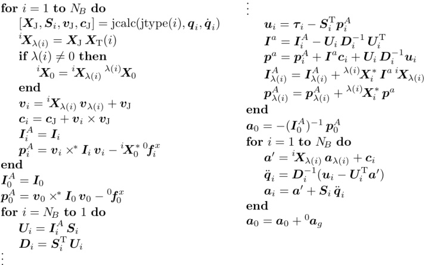{width=78%} Table 9.4: Floating-base articulated-body dynamics algorithm

amount. Thus, the relative accelerations of any two bodies are independent of gravity. The algorithm in Table 9.4 exploits this fact by calculating the motion of the system in the absence of a gravitational field, and then adding $a_{g}$ to $a_{0}$ right at the end. If you want this algorithm to return the accelerations of other bodies in the system, then $a_{g}$ must also be added to these accelerations before they are returned.

Table 9.5 presents floating-base versions of the recursive Newton-Euler and composite-rigid-body algorithms. Together, they calculate the coefficients of Eq. 9.13, so that it can be solved for $a_0$ and $\ddot{q}$. Note that the coefficient matrix in this equation has the same branch-induced sparsity pattern as the matrix in Eq. 9.11, so it can be factorized using the algorithms of Section 6.5.

On comparing the modified Newton-Euler algorithm with the original in Table 5.1, the following differences can be seen: $\boldsymbol{v}_{0}$ is now an input; the term $S_{i} \ddot{\boldsymbol{q}}_{i}$ has been removed from the expression for $\boldsymbol{a}_{i}$, which is duly renamed $\boldsymbol{a}_{i}^{v p}$, as it accounts for only the velocity-product acceleration terms; pass 2 has been extended to calculate $\boldsymbol{f}_{0}$; and a line has been added to set $\boldsymbol{p}_{0}^{\mathrm{c}}=\boldsymbol{f}_{0}$. Once again, the vectors $\boldsymbol{a}_{g}$ and $\boldsymbol{f}_{i}^{x}$ are supplied in floating-base coordinates, so that the value of ${ }^{0} \boldsymbol{X}_{\text {ref }}$ is not needed, and the symbols ${ }^{0} \boldsymbol{a}_{g}$ and ${ }^{0} \boldsymbol{f}_{i}^{x}$ have been used in the psuedocode accordingly. Setting $\boldsymbol{a}_{0}^{v p}=-\boldsymbol{a}_{g}$ at the beginning causes gravitational force terms to appear in $\boldsymbol{C}$ and $\boldsymbol{p}_{0}^{\mathrm{c}}$, which ultimately has the effect of causing the correct gravitational acceleration term to appear in $\boldsymbol{a}_{0}$ when Eq. 9.13 is solved.

On comparing the modified composite-rigid-body algorithm with the orig

# Calculate $C$ and $p_{0}^{c}$:

【此段建议校对(This paragraph is recommended for proofreading)】\begin{array}{c}a_{i}^{vp}=-^{a}}a_{g} \\ \\ \text{ for } i= \text{ to } \_{B} \ \left[\boldsymbol{X}_{\mathrm{J}}, \boldsymbol{S}_{\mathrm{i}}}, \boldsymbol{v}_{\mathrm{J}}}, \boldsymbol{c}_{\mathrm{J}}}\right]\=\ \operatorname{calc}(\mathrm{j type}( \mathrm{i}), \ \ \boldsymbol{X}_{\mathrm{i}}}( \boldsymbol{X}_{\mathrm{J}}(\mathrm{i}) \ \text{if} \ \lambda(i) \ne \ \text{then} \

$$
\begin{array}{rl} & { \frac { \mathrm { C a l c u l a t e } \; \; H , \; F \; \; \mathrm { a n d } \; \; I _ { 0 } ^{\mathrm { c} } \mathrm { : } } { H = 0 } } \\& { \mathrm { f o r } \; \; i = 0 \; \mathrm { t o } \; \; N _ { B } \; \mathrm { d o } } \\& { \; \; I _ { i } ^{\mathrm { c} } = I _ { i } } \\& { \mathrm { e n d } } \\& { \mathrm { f o r } \; \; i = N _ { B } \; \mathrm { t o } \; \; 1 \; \mathrm { d o } } \\& { \; \; I _ { \lambda ( i ) } ^{\mathrm { c} } = I _ { \lambda ( i ) } ^{\mathrm { c} } + \lambda ( i ) \, X _ { i } ^{*} \, I _ { i } ^{\mathrm { c} } \, i \, X _ { \lambda ( i ) } } \\& { \; F _ { i } = I _ { i } ^{\mathrm { c} } \, S _ { i } } \\& { \; H _ { i i } = S _ { i } ^{\mathrm { T} } \, F _ { i } } \\& { \; j = i } \\& { \; \; \mathrm { w h i l e } \; \; \lambda ( j ) \neq 0 \; \mathrm { d o } } \\& { \; F _ { i } = \lambda ( j ) \, X _ { j } ^{*} \, F _ { i } } \\& { \; j = \lambda ( j ) } \\& { \; H _ { i j } = \lambda ( j ) } \\& { \; H _ { i j } = F _ { i } ^{\mathrm { T} } \, S _ { j } } \\& { \; H _ { j i } = H _ { i j } ^{\mathrm { T} } } \\& { \mathrm { e n d } } \\& { \; F _ { i } = { } ^{0} X _ { j } ^{*} \, F _ { i } } \end{array}
$$

inal in Table 6.2, the following differences can be seen: the calculation of $I_{i}^{c}$ has been extended to include $I_{0}^{c}$; the old local variable $F$ (which must not be confused with the new $6 \times n$ matrix $F$ in Eq. 9.12) has been replaced by the variables $F_{i}$, which are the block columns of $F$ appearing in Eq. 9.12; and a line has been added after the while loop to transform each $F_{i}$ to floating-base coordinates. (Each $F_{i}$ is initially expressed in body $i$ coordinates, and is progressively transformed to floating-base coordinates.)

The algorithms in these tables are not the only ways to solve the problem. Examples of some alternative approaches can be found in Hooker and Margulies (1965); Hooker (1970); Roberson and Schwertassek (1988); Wittenburg (1977).

# 9.5 Floating-Base Inverse Dynamics

The inverse-dynamics problem for a floating-base system is really a hybrid-dynamics problem: the joint accelerations are known, but the base acceleration is not. Therefore, it would be possible to solve this problem using one of the general hybrid-dynamics algorithms in Sections 9.1 and 9.2. Alternatively, we could design a special-purpose algorithm, which would solve the problem more efficiently. This section presents one such algorithm.

Let $f_{i}$ be the spatial force that is exerted on body $i$ by its parent. In the

case of body 0, we have $f_{0}=0$ because this body does not have a parent. In all other cases, $f_{i}$ is the force transmitted across joint $i$. In any kinematic tree, $f_{i}$ supports the motion of all the bodies in the set $\nu(i)$, so we have

$$
f _ { i } = \sum _ { j \in \nu ( i ) } ( I _ { j } \, a _ { j } + v _ { j } \, \times ^{*} I _ { j } \, v _ { j } - f _ { j } ^{x} ) \, .
$$

Our objective is to solve this equation for $a_{0}$. To accomplish this, we first express $a_{i}$ in the form

$$
a _ { i } = a _ { 0 } + a _ { i } ^{r} \ ,
$$

where $a_{i}^{r}$ is the relative acceleration of body $i$, and then substitute this expression into Eq. 9.18. The result is

$$
f _ { i } = \left( \sum _ { j \in \nu ( i ) } I _ { j } \right) a _ { 0 } + \sum _ { j \in \nu ( i ) } \left( I _ { j } \, a _ { j } ^{r} + v _ { j } \, \times ^{*} I _ { j } \, v _ { j } - f _ { j } ^{x} \right) .
$$

The coefficient of $a_{0}$ in this equation is the composite-rigid-body inertia $I_{i}^{\mathrm{c}}$. If we treat the rest of the right-hand side as a bias force, then we have

$$
f _ { i } = I _ { i } ^{\mathrm { c} } \, a _ { 0 } + p _ { i } ^{\mathrm { c} } \, ,
$$

where

$$
\begin{array}{r} { p _ { i } ^{\mathrm { c} } = \sum _ { j \in \nu ( i ) } ( I _ { j } \, a _ { j } ^{r} + v _ { j } \, \times ^{*} I _ { j } \, v _ { j } - f _ { j } ^{x} ) \, . } \end{array}
$$

$p_{i}^{\mathrm{c}}$ is the force that would be required to support the motion of all the bodies in $\nu(i)$ if $a_{0}$ happened to be zero. It can be calculated recursively using the equation

$$
{ \boldsymbol { p } } _ { i } ^{\mathrm { c} } = { \boldsymbol { p } } _ { i } + \sum _ { j \in \mu ( i ) } { \boldsymbol { p } } _ { j } ^{\mathrm { c} }
$$

where

$$
\begin{array}{r} { p _ { i } = I _ { i } \, a _ { i } ^{r} + v _ { i } \, \times ^{*} I _ { i } \, v _ { i } - f _ { i } ^{x} \, . } \end{array}
$$

When $i=0$, Eq. 9.20 can be solved directly for $a_{0}$, giving

$$
a _ { 0 } = - ( I _ { 0 } ^{\mathrm { c} } ) ^{- 1} p _ { 0 } ^{\mathrm { c} } \, .
$$

Once $a_{0}$ is known, the joint forces can be calculated using

$$
\boldsymbol { \tau } _ { i } = \boldsymbol { S } _ { i } ^{\mathrm { T} } \boldsymbol { f } _ { i } = \boldsymbol { S } _ { i } ^{\mathrm { T} } \left( \boldsymbol { I } _ { i } ^{\mathrm { c} } \boldsymbol { a } _ { 0 } + \boldsymbol { p } _ { i } ^{\mathrm { c} } \right) .
$$

Table 9.6 presents the equations and pseudocode for an algorithm based on Eqs. 9.22 to 9.25 and the usual equations for body velocities, body accelerations and composite-rigid-body inertias. The equations are expressed in body coordinates, and include coordinate transforms where necessary. In line with the other floating-base algorithms, this one expects $a_{g}$ and $f_{i}^{x}$ to be supplied

Table 9.6: Floating-base inverse dynamics equations and algorithm

| Pass 1 | $a_0^r = -^0 a_g$ |
| --- | --- |
| $a_0^r = -^0 a_g$ | $for i = 1 to N_B do$ |
| $\boldsymbol{v}_{\mathrm{J}i} = S_i\dot{\boldsymbol{q}}_i$ | $[X_{\mathrm{J}},S_i,v_{\mathrm{J}},\boldsymbol{c}_{\mathrm{J}}]=\mathrm{jcalc(jtype(i)},\boldsymbol{q}_i,\dot{\boldsymbol{q}}_i)$ |
| $\boldsymbol{v}_i =^i \boldsymbol{X}_{\lambda(i)}\boldsymbol{v}_{\lambda(i)} + \boldsymbol{v}_{\mathrm{J}i}$ | $^i \boldsymbol{X}_{\lambda(i)} = \boldsymbol{X}_{\mathrm{J}}\boldsymbol{X}_{\mathrm{T}}(i)$ |
| $\boldsymbol{c}_i = \hat{S}_i\dot{\boldsymbol{q}}_i + \boldsymbol{v}_i \times \boldsymbol{v}_{\mathrm{J}i}$ | $^i \boldsymbol{X}_0 =^i \boldsymbol{X}_{\lambda(i)}^{\lambda(i)} \boldsymbol{X}_0$ |
| $\boldsymbol{a}_i^r =^i \boldsymbol{X}_{\lambda(i)}\boldsymbol{a}_{\lambda(i)} + \boldsymbol{c}_i + \boldsymbol{S}_i\ddot{\boldsymbol{q}}_i$ | $\boldsymbol{v}_i =^i \boldsymbol{X}_{\lambda(i)}\boldsymbol{v}_{\lambda(i)} + \boldsymbol{v}_{\mathrm{J}}$ |
| $\boldsymbol{p}_i = \boldsymbol{I}_i\boldsymbol{a}_i^r + \boldsymbol{v}_i \times^* \boldsymbol{I}_i\boldsymbol{v}_i -^i \boldsymbol{X}_0^* \boldsymbol{0} f_i^x$ | $\boldsymbol{a}_i^r =^i \boldsymbol{X}_{\lambda(i)}\boldsymbol{a}_{\lambda(i)}^r + \boldsymbol{c}_{\mathrm{J}} + \boldsymbol{v}_i \times \boldsymbol{v}_{\mathrm{J}} + \boldsymbol{S}_i\ddot{\boldsymbol{q}}_i$ |
| Pass 2 | $\boldsymbol{p}_i^c = \boldsymbol{I}_i\boldsymbol{a}_i^r + \boldsymbol{v}_i \times^* \boldsymbol{I}_i\boldsymbol{v}_i -^i \boldsymbol{X}_0^* \boldsymbol{0} f_i^x$ |
| $\boldsymbol{I}_i^c = \boldsymbol{I}_i + \sum_{j \in \mu(i)} i \boldsymbol{X}_j^* \boldsymbol{I}_j^j \boldsymbol{X}_i$ | $end $\boldsymbol{I}_0^c = \boldsymbol{I}_0$ $p_0^c = \boldsymbol{I}_0 \boldsymbol{a}_0^r + \boldsymbol{v}_0 \times^* \boldsymbol{I}_0 \boldsymbol{v}_0 -^0 f_0^x$ for i = N_B to 1 do $\boldsymbol{I}_{\lambda(i)}^c = \boldsymbol{I}_{\lambda(i)}^c + \lambda(i) \boldsymbol{X}_i^* \boldsymbol{I}_i^c \boldsymbol{i} \boldsymbol{X}_{\lambda(i)}$ $p_{\lambda(i)}^c = p_{\lambda(i)}^c + \lambda(i) \boldsymbol{X}_i^* \boldsymbol{p}_i^c$$ |
| Pass 3 | $end $^0 a_0 = - (I_0^c)^{-1} p_0^c$ for i = (I_0^c)^{-1} p_0^c$ $^1 a_0 =^i (\boldsymbol{I}_0^c)^{-1} p_0^c$ for i = 1 to N_B do $^1 a_0 =^i \boldsymbol{X}_{\lambda(i)}^{\lambda(i)} \boldsymbol{a}_0$ $\boldsymbol{\tau}_i = \boldsymbol{S}_i^{\mathrm{T}} (\boldsymbol{I}_i^c i \boldsymbol{a}_0 + \boldsymbol{p}_i^c)$$ |

in floating-base coordinates, and the symbols $^{0}\boldsymbol{a}_{g}$ and $^{0}\boldsymbol{f}_{i}^{x}$ have been used accordingly. This algorithm handles gravity by initializing $\boldsymbol{a}_{0}^{r}$ to $-\boldsymbol{a}_{g}$ rather than zero. This causes gravitational force terms to appear in $\boldsymbol{p}_{i}^{\mathrm{c}}$, which in turn cause the correct gravitational acceleration to appear in $\boldsymbol{a}_{0}$. Alternatively, one could set $\boldsymbol{a}_{0}^{r}$ to zero at the beginning of pass 1, and then add $\boldsymbol{a}_{g}$ to $\boldsymbol{a}_{0}$ at the end of pass 3.

More on this topic, and on related topics, can be found in Dubowsky and Papadopoulos (1993); Fang and Pollard (2003); Longman et al. (1987); Umetani and Yoshida (1989); Vafa and Dubowsky (1990a,b); and many other papers.

Example 9.3 The total spatial momentum of a rigid-body system is the sum of the momenta of its bodies. The momentum of a floating-base system is therefore given by

$$
m o m e n t u m = \sum _ { i = 0 } ^{N _ { B} } I _ { i } \, v _ { i } \, .
$$

In the absence of external forces, this quantity is conserved. It turns out that

the momentum is also given by the expression $I_{0}^{\mathrm{c}}v_{0}+F\dot{q}$. We can prove this as follows:

$$
\begin{array}{rl} { \displaystyle \sum _ { i = 0 } ^{N _ { B} } { \boldsymbol { I } } _ { i } \, { \boldsymbol { v } } _ { i } } & { = \displaystyle \sum _ { i = 0 } ^{N _ { B} } { \boldsymbol { I } } _ { i } \left( { \boldsymbol { v } } _ { 0 } + \sum _ { j \in \kappa ( i ) } { \boldsymbol { S } } _ { j } \, { \dot { \boldsymbol { q } } } _ { j } \right) } \\& { = \displaystyle \sum _ { i = 0 } ^{N _ { B} } { \boldsymbol { I } } _ { i } \, { \boldsymbol { v } } _ { 0 } + \displaystyle \sum _ { j = 1 } ^{N _ { B} } \sum _ { i \in \nu ( j ) } { \boldsymbol { I } } _ { i } \, { \boldsymbol { S } } _ { j } \, { \dot { \boldsymbol { q } } } _ { j } } \\& { = \, { \boldsymbol { I } } _ { 0 } ^{\mathrm { c} } \, { \boldsymbol { v } } _ { 0 } + \displaystyle \sum _ { j = 1 } ^{N _ { B} } { \boldsymbol { I } } _ { j } ^{\mathrm { c} } \, { \boldsymbol { S } } _ { j } \, { \dot { \boldsymbol { q } } } _ { j } \, = \, { \boldsymbol { I } } _ { 0 } ^{\mathrm { c} } \, { \boldsymbol { v } } _ { 0 } + { \boldsymbol { F } } \, { \dot { \boldsymbol { q } } } \, . } \end{array}
$$

(See Eq. 4.3 for summation over $\nu(j)$.) Using a similar argument, we can show that the kinetic energy of a floating-base system is

$$
T = \frac { 1 } { 2 } \sum _ { i = 0 } ^{N _ { B} } v _ { i } ^{\mathrm { T} } I _ { i } \, v _ { i } = \frac { 1 } { 2 } \left[ v _ { 0 } ^{\mathrm { T} } \, \, \, \dot { q } ^{\mathrm { T} } \right] \, \left[ \begin{array}{ll} { I _ { 0 } ^{\mathrm { c} } } & { F } \\{ F ^{\mathrm { T} } } & { H } \end{array} \right] \left[ \begin{array}{l} { v _ { 0 } } \\{ \dot { q } } \end{array} \right] \, .
$$

Example 9.4 In a fixed-base system, the acceleration of body $i$ is given by $a_i = J_i\ddot{q} + \dot{J}_i\dot{q}$, where $J_i$ is the Jacobian of body $i$. In a floating-base system, this becomes

$$
a _ { i } = J _ { i } \, \ddot { q } + \dot { J } _ { i } \, \dot { q } + a _ { 0 } \, .
$$

However, from Eq. 9.13 we have

$$
I _ { 0 } ^{\mathrm { c} } \, a _ { 0 } + F \ddot { q } + p _ { 0 } ^{\mathrm { c} } = 0 \, .
$$

Putting these two equations together, we get

$$
\begin{array}{rl} { a _ { i } } & { = \, J _ { i } \, \ddot { q } + \dot { J } _ { i } \, \dot { q } - ( I _ { 0 } ^{\mathrm { c} } ) ^{- 1} ( F \ddot { q } + p _ { 0 } ^{\mathrm { c} } ) } \\& { = \, J _ { i } ^{f l} \, \ddot { q } + \dot { J } _ { i } \, \dot { q } - ( I _ { 0 } ^{\mathrm { c} } ) ^{- 1} p _ { 0 } ^{\mathrm { c} } \, , } \end{array}
$$

where

$$
J _ { i } ^{f l} = J _ { i } - ( I _ { 0 } ^{c} ) ^{- 1} F \, .
$$

The quantity $J_{i}^{fl}$ is, in effect, a floating-base Jacobian, since it describes the linear dependency of $a_{i}$ on $\ddot{q}$ (cf. Umetani and Yoshida (1989)). This matrix also relates changes in $\dot{q}$ to changes in $v_{i}$. For example, if an impulse within the system causes $\dot{q}$ to change by an amount $\delta\dot{q}$, then the consequential change in $v_{i}$ is

$$
\delta v _ { i } = J _ { i } ^{f l} \delta \dot { q } \, .
$$

# 9.6 Gears

Many mechanical systems contain gear pairs, or components that perform a similar function. From a mathematical point of view, a gear pair is an algebraic

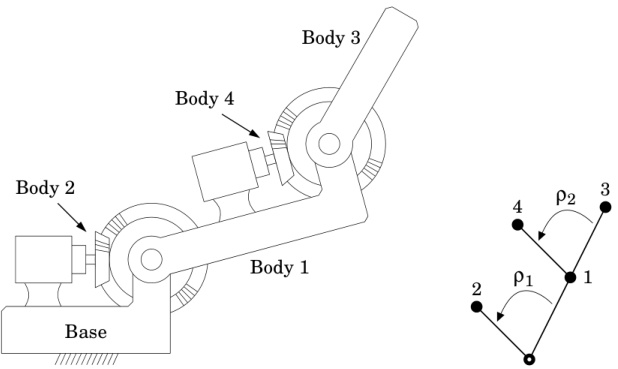{width=67%} Figure 9.2: A two-link robot arm driven by motors and gears

equation involving two joint variables. Typically, one variable is a constant multiple of the other, but nonlinear relationships are also possible. Another possibility is that more than two variables can be involved. For example, a differential gear box usually has two outputs and either one or two inputs, and therefore involves either three or four variables in total.

Gear constraints can be incorporated into a kinematic tree using the same technique as was used in Section 8.11 for kinematic loops; namely, to choose a vector of independent joint variables, $y$, and define a function, $\gamma$, that maps $y$ to $q$. Let us now study this technique with the aid of an example.

Figure 9.2 shows a simple two-link robot arm in which both joints are driven by electric motors via gear pairs. This system contains the following parts: a fixed base, an upper arm, a forearm, two motors, two large gear wheels and two small gear wheels. Each motor consists of two parts: a stator and a rotor. The two stators are fixed to the base and the upper arm, respectively, and the two rotors are each fixed to a small gear wheel. The two large gear wheels are fixed to the upper arm and forearm, respectively. The system therefore contains a total of four moving bodies, defined as follows:

body 1: the upper arm, the first large gear wheel and the stator of the second motor;

body 2: the first small gear wheel and the rotor of the first motor;

body 3: the forearm and the second large gear wheel;

body 4: the second small gear wheel and the rotor of the second motor.

Joints 1 and 3 are therefore the shoulder and elbow joints of the robot arm, while joints 2 and 4 are the bearings inside the motors that allow the rotors to rotate

relative to the stators. The two gear pairs impose the following constraints on the joint variables:

$$
q _ { 2 } = \rho _ { 1 } \, q _ { 1 }  \mathrm { a n d }  q _ { 4 } = \rho _ { 2 } \, q _ { 3 } \ ,
$$

where $\rho_{1}$ and $\rho_{2}$ are gear ratios. Figure 9.2 also shows the connectivity graph of this system, and the gearing relationships between the joints. The arrows serve only to indicate the direction in which the stated gear ratio applies. Thus, the arrow labelled $\rho_{1}$ points from joint 1 to joint 2 because $q_{2}$ is $\rho_{1}$ times $q_{1}$.

To incorporate the gear constraints into the equation of motion, we first define a vector of independent variables, $\boldsymbol{y}$, and then define a function, $\boldsymbol{\gamma}$, that gives $\boldsymbol{q}$ as a function of $\boldsymbol{y}$. Let us choose $q_{1}$ and $q_{3}$ to be the independent variables. $\boldsymbol{y}$ is then the vector $[y_{1} \, y_{2}]^{\mathrm{T}}$, where $y_{1} = q_{1}$ and $y_{2} = q_{3}$. With this choice of variables, $\boldsymbol{\gamma}$ is defined as follows:

$$
\gamma ( y ) = \left[ \begin{array}{l} { y _ { 1 } } \\{ \rho _ { 1 } \, y _ { 1 } } \\{ y _ { 2 } } \\{ \rho _ { 2 } \, y _ { 2 } } \end{array} \right] .
$$

The next step is to derive the quantities $G=\partial\gamma/\partial y$ and $g=\dot{G}y$ from $\gamma$. For our example, these quantities are

$$
G = \frac { \partial \gamma } { \partial y } = \left[ \begin{array}{ll} { 1 } & { 0 } \\{ \rho _ { 1 } } & { 0 } \\{ 0 } & { 1 } \\{ 0 } & { \rho _ { 2 } } \end{array} \right]  \mathrm { a n d }  g = \dot { G } \, \dot { y } = 0 \, .
$$

($g$ would only ever be nonzero if there were a nonlinear gear pair in the system.) Finally, the equation of motion for the kinematic tree, taking into account the gear constraints, is

$$
G ^{\mathrm { T} } H G \ddot { y } + G ^{\mathrm { T} } ( C + H g ) = G ^{\mathrm { T} } \tau \, ,
$$

where $H$ and $C$ are the coefficients of the equation of motion in the absence of gear constraints. (See Eq. 8.45.) As the motors exert their torques about joints 2 and 4, elements $\tau_{2}$ and $\tau_{4}$ of $\tau$ will contain the motor torques, while $\tau_{1}=\tau_{3}=0$. The inverse dynamics of a geared kinematic tree can be computed using the method described in Section 8.12.

$\boldsymbol{G}$ will usually be a very sparse matrix. In fact, it will typically contain only one nonzero element per row, and many of those elements will be ones. It is therefore recommended to exploit this sparsity. By way of example, if we treat $\boldsymbol{G}$ and $\boldsymbol{H}$ as dense matrices, then the cost of calculating $\boldsymbol{G}^{\mathrm{T}} \boldsymbol{H} \boldsymbol{G}$ for a $4 \times 2$ matrix $\boldsymbol{G}$ is 44 multiplications and 33 additions. In contrast, if we use the actual values of $\boldsymbol{G}$ and $\boldsymbol{H}$ for the above example, then the cost is a mere

5 multiplications and 3 additions, as shown below. Obviously, the savings will be even greater with larger matrices.

$$
\begin{array}{rl} { G ^{\mathrm { T} } H G } & { = \left[ \begin{array}{llll} { 1 } & { \rho _ { 1 } } & { 0 } & { 0 } \\{ 0 } & { 0 } & { 1 } & { \rho _ { 2 } } \end{array} \right] \left[ \begin{array}{llll} { H _ { 11 } } & { 0 } & { H _ { 13 } } & { H _ { 14 } } \\{ 0 } & { H _ { 22 } } & { 0 } & { 0 } \\{ H _ { 13 } } & { 0 } & { H _ { 33 } } & { 0 } \\{ H _ { 14 } } & { 0 } & { 0 } & { H _ { 44 } } \end{array} \right] \left[ \begin{array}{llll} { 1 } & { 0 } \\{ \rho _ { 1 } } & { 0 } \\{ 0 } & { 1 } \\{ 0 } & { \rho _ { 2 } } \end{array} \right] } \\& { = \left[ \begin{array}{llll} { H _ { 11 } + \rho _ { 1 } ^{2} \, H _ { 22 } } & { H _ { 13 } + \rho _ { 2 } \, H _ { 14 } } \\{ H _ { 13 } + \rho _ { 2 } \, H _ { 14 } } & { H _ { 33 } + \rho _ { 2 } ^{2} \, H _ { 44 } } \end{array} \right] . } \end{array}
$$

Example 9.5 In a typical robot mechanism, the rotors of the electric motors are much smaller than the other parts of the mechanism, and therefore account for only a small fraction of the total mass. However, they also reach much higher speeds than the bodies they are driving, and can therefore exert a substantial influence on the overall dynamics of the system.

The method presented in this section is the correct way to account for the dynamic effects of rotors, but there is also a quick-and-dirty method that is popular in robotics. According to this method, we dispense with the rotors and the gearboxes, and model the actuator as a fictitious electric motor that develops $\rho$ times the torque of the real motor, runs at $1/\rho$ times the speed, and has $\rho^2$ times the rotor inertia of the real motor, where $\rho$ is the step-down gear ratio. These inertias, which are scalar constants, are simply added to the diagonal elements of $\mathbf{H}$. In particular, if $I_i^{rot}$ is the scaled rotor inertia for the motor that is driving joint $i$, then $I_i^{rot}$ is added to $\mathbf{H}_{ii}$. For this to work, joint $i$ must be a 1-DoF joint, so that $\mathbf{H}_{ii}$ is a $1 \times 1$ matrix.

This method captures the largest inertial effects of the rotors, but it ignores the smaller inertial effects and all of the gyroscopic effects. A clue as to why this method works can be seen in Eq. 9.27. If the rotors are small, then $H_{22}$, $H_{14}$ and $H_{44}$ will be small compared with $H_{11}$, $H_{13}$ and $H_{33}$, but $\rho_{1}$ and $\rho_{2}$ will be moderately large. (Gear ratios of 100:1 are fairly typical.) The two rotors will therefore have their biggest effect on the two diagonal elements, where they get multiplied by the squares of the gear ratios.

The quick-and-dirty method also works with the articulated-body algorithm. In this case, we modify Eq. 7.44 to read

$$
D _ { i } = S _ { i } ^{\mathrm { T} } U _ { i } + I _ { i } ^{r o t} .
$$

Again, joint $i$ must be a 1-DoF joint, so that $D_i$ is a $1 \times 1$ matrix.

# 9.7 Dynamic Equivalence

It is perfectly possible for two different rigid-body systems to have the same equation of motion. We shall describe such systems as dynamically equivalent. An important special case occurs when the two systems differ only in their inertia parameters. An immediate consequence of this kind of equivalence is that

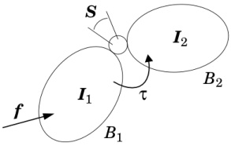{width=32%} Figure 9.3: A two-body floating rigid-body system

the inertia parameters of a rigid-body system cannot be identified from measurements of its dynamic behaviour: one must instead identify an observable subset, which are called the base inertia parameters (Khalil and Dombre, 2002). Another consequence, which is the topic of this section, is that the inertia parameters of a system model can be adjusted without altering its behaviour. If the adjustments result in fewer parameters having nonzero values, then the cost of computing the dynamics can be reduced.

Consider the rigid-body system shown in Figure 9.3. It consists of two bodies, $B_{1}$ and $B_{2}$, having inertias of $\boldsymbol{I}_{1}$ and $\boldsymbol{I}_{2}$, respectively, which are connected by a joint having a motion subspace of $\boldsymbol{S}$. A spatial force $\boldsymbol{f}$ acts on $B_{1}$, and a generalized force $\boldsymbol{\tau}$ acts at the joint. The equation of motion for this system is

$$
\left[ I _ { 1 } + X _ { \mathrm { J } } ^{\mathrm { T} } I _ { 2 } \, X _ { \mathrm { J } }  \, X _ { \mathrm { J } } ^{\mathrm { T} } I _ { 2 } \, S \right] \, \left[ \, a _ { 1 } \, \right] \, + \, \left[ \, C _ { f } \, \right. \left. \left[ \, C _ { \tau } \, \right] \, \right] = \left[ \, \frac { f } { \tau } \, \right] ,
$$

where

$$
\left[ \begin{array}{l} { C _ { f } } \\{ C _ { \tau } } \end{array} \right] = \left[ \begin{array}{l} { v _ { 1 } \times ^{*} \pmb { I } _ { 1 } \, v _ { 1 } + \pmb { X } _ { \mathrm { J } } ^{\mathrm { T} } ( \pmb { I } _ { 2 } \, \dot { \pmb { S } } \, \dot { \pmb { q } } + v _ { 2 } \, \times ^{*} \pmb { I } _ { 2 } \, v _ { 2 } ) } \\{ \pmb { S } ^{\mathrm { T} } ( \pmb { I } _ { 2 } \, \dot { \pmb { S } } \, \dot { \pmb { q } } + v _ { 2 } \, \times ^{*} \pmb { I } _ { 2 } \, v _ { 2 } ) } \end{array} \right]
$$

and $\boldsymbol{v}_{2}=\boldsymbol{X}_{\mathrm{J}} \boldsymbol{v}_{1}+\boldsymbol{S} \dot{\boldsymbol{q}}$. Except for notational differences, this equation is just an application of Eq. 9.13 to a two-body system. In formulating this equation, we have chosen the joint's predecessor and successor frames to serve as link coordinate frames, so that ${}^{2} \boldsymbol{X}_{1}=\boldsymbol{X}_{\mathrm{J}}$.

We now modify this system by adding a spatial inertia of $I_{\Delta}$ to $I_{1}$ and subtracting $I_{\Delta}$ from $I_{2}$. If we want this modification not to alter the coefficients of Eq. 9.29, then $I_{\Delta}$ must meet the following conditions:$^{3}$

$$
I _ { \Delta } S \equiv 0 \, ,  I _ { \Delta } \equiv X _ { \mathrm { J } } ^{\mathrm { T} } I _ { \Delta } X _ { \mathrm { J } }  \mathrm { a n d }  S ^{\mathrm { T} } v _ { 1 } { \times } ^{*} \, I _ { \Delta } v _ { 1 } \equiv 0 \, .
$$

These conditions must be met at every joint position, and for every $v_1 \in \mathbb{M}^6$. It therefore follows that the conditions depend only on the joint type, and that suitable values for $I_\Delta$ can be found without knowing anything about the system other than the joint type.

Table 9.7: Values of $I_{\Delta}$ that do not alter the equation of motion

| Joint type | $I_{\Delta}$ |
| --- | --- |
| revolute | $\begin{bmatrix} I & 0 & 0 & 0 & -mc_z & 0 \\ 0 & I & 0 & mc_z & 0 & 0 \\ 0 & mc_z & 0 & m & 0 & 0 \\ -mc_z & 0 & 0 & 0 & m & 0 \\ 0 & 0 & 0 & 0 & 0 & m \end{bmatrix}$ | $\begin{bmatrix} I_{xx} & I_{xy} & I_{xz} & 0 & 0 \\ I_{xy} & I_{yy} & I_{yz} & 0 & 0 & 0 \\ I_{xz} & I_{yz} & I_{zz} & 0 & 0 & 0 \\ 0 & 0 & 0 & 0 & 0 & 0 \\ 0 & 0 & 0 & 0 & 0 & 0 \end{bmatrix} = \begin{bmatrix} \bar{I} & 0 \\ 0 & 0 \end{bmatrix}$ |
| $\begin{bmatrix} 0 & 0 & 0 & 0 & 0 & 0 \\ 0 & 0 & 0 & 0 & 0 & 0 \\ 0 & 0 & 0 & 0 & 0 & 0 \end{bmatrix}$ | $\begin{bmatrix} 0 & 0 & 0 & 0 & 0 & 0 \\ 0 & 0 & 0 & 0 & 0 & 0 \\ 0 & 0 & 0 & 0 & 0 & 0 \end{bmatrix} = \begin{bmatrix} 0 & 0 \\ 0 & m1 \end{bmatrix}$ |
| $\begin{bmatrix} 0 & 0 & 0 & 0 & 0 & 0 & 0 \\ 0 & 0 & 0 & 0 & 0 & 0 \\ 0 & 0 & 0 & m & 0 & 0 \\ 0 & 0 & 0 & 0 & 0 & m \end{bmatrix}$ | $\begin{bmatrix} 0 & 0 & 0 \\ 0 & 0 & 0 & 0 & 0 & 0 \\ 0 & 0 & 0 & 0 & m & 0 \\ 0 & 0 & 0 & 0 & 0 & m \end{bmatrix}$ |

Table 9.7 shows the values of $I_{\Delta}$ that meet the conditions in Eq. 9.30 for some joint types. Let us examine the physical interpretation of these results. In the case of a spherical joint, $I_{\Delta}$ is the inertia of a particle of mass $m$ located at the joint's rotation centre. This result says you can add particles of masses $m$ and $-m$ to $B_{1}$ and $B_{2}$, respectively, both located at the rotation centre, and because these two particles always coincide, they cancel each other exactly. In the case of a revolute joint, $I_{\Delta}$ is the inertia of a pair of particles at different positions on the joint axis (which is the $z$ axis). $m$ and $c_{z}$ are the total mass and mass centre of the pair, and $I$ depends on the distance between them. Again, because the particles are located on the rotation axis, if we add them to $B_{1}$ and add their negatives to $B_{2}$ then they always coincide, and therefore always cancel. In the case of a prismatic joint, $I_{\Delta}$ is a disembodied pure rotational inertia. Such inertias are translationally invariant; so, if we add $I_{\Delta}$ to $B_{1}$ and subtract it from $B_{2}$, then the two will always cancel so long as $B_{2}$ never rotates relative to $B_{1}$.

Clearly, the subtraction of a sufficiently massive particle from $B_{2}$ will result in a negative mass, and the subtraction of a sufficiently large pure rotational inertia will result in a negative rotational inertia. It is therefore possible for $B_{2}$ to end up with a rigid-body inertia that is not physically realizable. Nevertheless, the equation of motion for the modified system is identical to the original.

If $B_{1}$ and $B_{2}$ are part of a larger rigid-body system, then the above results still apply—replacing a two-body subsystem with a dynamically equivalent sub

system does not alter the equation of motion for the system as a whole.

# Simplification of Rigid-Body systems

The results in Table 9.7 allow a dynamics simulator to simplify the inertia parameters of any given rigid-body system by adding and subtracting values of $I_{\Delta}$ that are designed to zero as many of the inertia parameters as possible. The procedure is as follows:

for $i=N_{B}$ to 1 do $I_{\Delta}=\text{best\_match(jtype(i)},I_{i})$ $I_{i}=I_{i}-I_{\Delta}$ if $\lambda(i)\neq0$ then $I_{\lambda(i)}=I_{\lambda(i)}+I_{\Delta}$ end end

The function best match first looks in a table of $I_{\Delta}$ formulae to find an entry for the joint type jtype(i). If no entry is found, then it returns the value $0_{6\times6}$. However, if a formula is found, then it returns the value of $I_{\Delta}$ that maximizes the number of zero-valued inertia parameters in the expression $I_{i}-I_{\Delta}$. For example, if joint $i$ is spherical, then the returned value of $I_{\Delta}$ has the same mass as $I_{i}$, so that the mass of $I_{i}-I_{\Delta}$ is zero.

The point of this procedure is that it produces a predictable pattern of zero-valued parameters, which can be exploited by writing code for each special case.$^{4}$ Assuming that most joints are revolute, this technique can cut the cost of the recursive Newton-Euler algorithm by about 15%, but it is less effective on forward dynamics algorithms.

It is possible for a dynamics algorithm to fail on the modified system when it would have succeeded on the original. For example, if an algorithm uses the inverses of the rigid-body inertias, then it will only work if those inverses exist. If the modifications have brought the mass of body $i$ to zero, then its modified inertia will be singular.

More on this topic, and related topics, can be found in Gautier and Khalil (1990); Khalil and Kleinfinger (1987); Khalil and Dombre (2002).

# Augmented Bodies

The above technique resembles a much older technique called augmented bodies. They both involve inertia parameters, and they both have the same objective: cost reduction. However, the augmented-body technique relies on a rewriting of the equations of motion that collects inertia parameters into constant subexpressions, which can be computed in advance. These precomputed values can be regarded as the inertia parameters of a collection of augmented bodies.

Starting with a kinematic tree, augmented body $i$ is obtained by adding one particle to rigid body $i$ for each joint attached to that body. The locations of these particles depend on the joints, but each has a mass equal to the mass of the subtree that is connected to body $i$ via that joint. In a variant form of augmented body, a particle is added only for each joint in $\mu(i)$. The former tends to be used with floating-base systems, and the latter with fixed-base systems. More on this topic can be found in Balafoutis et al. (1988); Balafoutis and Patel (1989, 1991); Hooker and Margulies (1965); Hooker (1970); Roberson and Schwertassek (1988); Wittenburg (1977).

# Chapter 10

# Accuracy and Efficiency

In theory, the algorithms presented in this book are all exact. However, the presence of round-off errors in the calculations ensures that the results are rarely so. Other sources of error include the use of numerical integration, and the differences in behaviour between a rigid-body system and the physical system it represents. Section 10.1 examines these various sources of error, paying particular attention to the sources of round-off error in dynamics calculations and ways to avoid them.

If the acceleration of a rigid-body system changes greatly in response to a tiny change in the applied forces, then it is said to be sensitive. If you want to know the acceleration of such a system accurately, then the forces must be known even more accurately. It turns out that many kinematic trees have this property, and the phenomenon is examined in Section 10.2.

Section 10.3 explores the topic of efficiency. It explains how the efficiency of a dynamics algorithm is measured; and it presents tables and graphs comparing the efficiencies of several versions of the three main algorithms for kinematic trees. The efficiency of the composite-rigid-body algorithm is examined in detail, partly to show how an operations-count formula is obtained, and partly because the efficiency of this particular algorithm varies greatly with the amount of branching in the tree. This section also shows that the true asymptotic complexity of the composite-rigid-body algorithm is $O(nd)$, where $d$ is the depth of the connectivity tree, and that the true complexity of the so-called $O(n^3)$ algorithm is $O(nd^2)$.

One of the disadvantages of model-based algorithms is that they have to cater for the general case. As such, they perform many calculations that are indeed necessary in the general case, but are frequently not necessary for some particular system model. One solution to this problem is the automatic generation of customized dynamics routines—stripped-down versions of the general algorithm that perform only those calculations that are necessary for a specific given system model. Section 10.4 presents a brief description of a technique for doing this, which is called symbolic simplification.

# 10.1 Sources of Error

Dynamics calculations are subject to three kinds of error: round-off error, which is the result of using finite-precision floating-point arithmetic; truncation error, which is the result of approximating an infinite series by a finite number of terms; and modelling error, which refers to the discrepancy between the behaviour of the mathematical model and the behaviour of the physical system it represents. Each kind of error is distinct from the others, so let us examine them separately.

# Round-off Error

Round-off errors occur during most floating-point operations, but they are usually tiny. Large errors can arise if two large-magnitude numbers are added or subtracted, producing a small-magnitude result, and especially if this happens several times during the course of a calculation. The simplest defence against round-off error is to use double-precision floating-point arithmetic for all calculations, but this will not solve every problem.

Large round-off errors can arise during dynamics calculations for a variety of reasons. Some of the more likely ones are:

using a far-away coordinate system;

large velocities;

large inertia ratios; and

nearly singular loop-closure constraints.

A coordinate system is far away from a rigid body if the distance between the origin and the centre of mass is many times the body's radius of gyration. Ideally, this distance should be no more than about one or two radii of gyration. This effect is the reason why dynamics algorithms are more accurate when they are implemented in body coordinates rather than absolute coordinates. The large-velocity problem arises in systems with large mean velocities, like spacecraft, in which the relative velocities of the component parts are small compared with their absolute velocities. This problem can be solved by using an inertial reference frame with a velocity close to the mean linear velocity of the system. Large differences in inertia arise from relatively small differences in scale. For example, if two solid spheres are made of the same substance, and one is 10 times larger than the other, then the larger sphere will have 1000 times the mass of the smaller one, and 100,000 times the rotational inertia.

Let us examine in more detail how some of these round-off errors arise. Figure 10.1 shows a planar rigid body having a centre of mass at the point $C$, which is located relative to the origin by the vector $\mathbf{c}=\overrightarrow{OC}=[c_{x}\ c_{y}]^{\mathrm{T}}$. We shall use planar vectors in this example, to keep the matrices small, but the round-off problems are essentially the same for planar and spatial vectors. This body has unit mass, and it has unit rotational inertia about $C$, so its radius of gyration

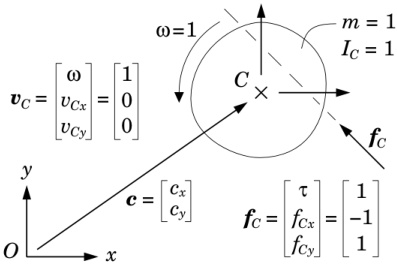{width=43%} Figure 10.1: Calculating the acceleration of a planar rigid body

is 1. Expressed in $C$ coordinates, the velocity of this body is $\boldsymbol{v}_{C}=[1\ 0\ 0]^{\mathrm{T}}$, and it is subject to an applied force of $\boldsymbol{f}_{C}=[1-1\ 1]^{\mathrm{T}}$. The former is a unit rotation about $C$, and the latter is a pure force having a magnitude of $\sqrt{2}$ and a line of action passing through the point $(0.5,0.5)$ relative to $C$. Expressed in $O$ coordinates, the equation of motion for this body is

$$
I _ { O } \, a _ { O } = f _ { O } - v _ { O } \, \times ^{*} I _ { O } \, v _ { O } \, ,
$$

where

$$
\pmb { v } _ { O } = \left[ \begin{array}{l} { 1 } \\{ c _ { y } } \\{ - c _ { x } } \end{array} \right] ,  \pmb { v } _ { O } \times ^{*} = \left[ \begin{array}{lll} { 0 } & { c _ { x } } & { c _ { y } } \\{ 0 } & { 0 } & { - 1 } \\{ 0 } & { 1 } & { 0 } \end{array} \right] ,  \pmb { f } _ { O } = \left[ \begin{array}{l} { 1 + c _ { x } + c _ { y } } \\{ - 1 } \\{ 1 } \end{array} \right]
$$

and

$$
\begin{array}{r} { I _ { O } = \left[ \begin{array}{lll} { 1 + c _ { x } ^{2} + c _ { y } ^{2} } & { - c _ { y } } & { c _ { x } } \\{ - c _ { y } } & { 1 } & { 0 } \\{ c _ { x } } & { 0 } & { 1 } \end{array} \right] . } \end{array}
$$

The exact solution to this equation is

$$
a _ { O } = \left[ \begin{array}{l} { { 1 } } \\{ { c _ { y } - 1 } } \\{ { 1 - c _ { x } } } \end{array} \right] .
$$

Suppose we set $c_{x}=100$ and $c_{y}=10$, and ask the computer to evaluate $a_{O}$ using IEEE double-precision floating-point arithmetic, which is accurate to one part in $10^{16}$. The computer will do this by solving the linear equation

$$
\left[ \begin{array}{lll} { 10 10 1 } & { - 10 } & { 10 0 } \\{ - 10 } & { 1 } & { 0 } \\{ 10 0 } & { 0 } & { 1 } \end{array} \right] \, a _ { O } = \left[ \begin{array}{l} { 11 1 } \\{ - 1 } \\{ 1 } \end{array} \right] ,
$$

and the calculated value will differ from the exact value by about one part in $10^{12}$. Thus, four significant figures of accuracy have been lost. The reason

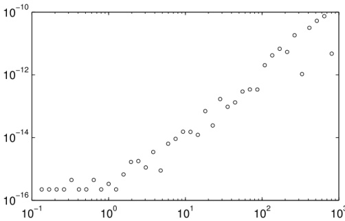{width=55%} Figure 10.2: Round-off error in the value of $a_{O}$, measured at $C$, versus $|c|$

for this loss is that the coefficient matrix is highly ill-conditioned, having a condition number of $1.02 \times 10^{8}$. To give an idea of how the round-off error varies with $|\boldsymbol{c}|$, Figure 10.2 plots $\|\boldsymbol{a}_{C}-^{C} \boldsymbol{X}_{O} \boldsymbol{a}_{O}\|_{\infty}$ against $|\boldsymbol{c}|$, where $\boldsymbol{a}_{C}$ is the exact value and $\boldsymbol{a}_{O}$ the computed value. It can be seen that the round-off error is approximately constant when $|\boldsymbol{c}|<1$ (i.e., when $|\boldsymbol{c}|$ is less than the radius of gyration), and grows approximately in proportion to $|\boldsymbol{c}|^{2}$ when $|\boldsymbol{c}|>1$.

In this example, the linear velocity of the body's centre of mass was zero ($v_{Cx} = v_{Cy} = 0$). If instead the body were to have a large linear velocity, then there could be substantial round-off error in calculating the right-hand side of Eq. 10.1, even if $|\mathbf{c}|$ is relatively small.

# Round-off Error in Dynamics Algorithms

Round-off error is known to increase with body count, and to increase more quickly with some algorithms than with others. The three main algorithms for kinematic trees are known to remain accurate, even when there are thousands of bodies in the system; and it is also known that the articulated-body algorithm is more accurate than the composite-rigid-body algorithm. However, the round-off behaviour of many other algorithms is not known. Two relevant articles on this subject are Ascher et al. (1997) and Featherstone (1999b).

# Truncation Error

Truncation errors are the result of using finite approximations to infinite series, continuous curves, continuous functions and the like. In rigid-body dynamics, the main source of truncation error is the numerical integration process, which is only an approximation to exact mathematical integration. By its nature, the management of truncation error involves a compromise between efficiency

and accuracy: a better approximation will reduce the error, but will be more expensive to calculate. The management of integration error involves making an appropriate choice of integration method and time step.

If one plots the acceleration variables of a simulated rigid-body system against time, then it will often be the case that the resulting graph contains large spikes: brief periods when the accelerations are much higher than at other times. Under these circumstances, it may be beneficial to use an integration method that automatically adapts its step size to maintain a prescribed accuracy. Such methods take big steps when not much is happening, and tiny steps when the accelerations are high. This strategy can lead to an improvement in the overall efficiency of a simulation run by reducing the total number of times that the dynamics has to be calculated.

# Modelling Error

Modelling errors are those that cause the behaviour of the mathematical model to differ from the behaviour of the physical system. If the mathematical model is a rigid-body system, then the main sources of modelling error are:

the rigid-body assumption,

the ideal-joint assumption (exact kinematic constraints),

unmodelled dynamics, and

inaccuracies in model parameters.

In reality, there is no such thing as a truly rigid body, and real joints suffer from imperfections such as friction, compliance and play. Unmodelled dynamics refers to aspects of the physical system that have been ignored in formulating the model. For example, one might choose to ignore the dynamics of the chain in a chain-and-sprocket drive, or one might be forced, by lack of data, to ignore temperature-related or position-dependent variations in the friction at an important joint bearing. Most model parameters refer either to geometry or to inertia. The geometric parameters of a mechanical system are usually known to a reasonable accuracy, but the inertia parameters may be less accurate, or even unknown. If the system can be dismantled, then one can measure the inertias of the individual parts; otherwise, one can use parameter-identification techniques, such as those described in Khalil and Dombre (2002).

# 10.2 The Sensitivity Problem

Some rigid-body systems can be extremely sensitive to small changes in applied forces, or small changes in model parameters. Sensitivity to geometric parameters is only to be expected in closed-loop systems having special geometries, or general geometries that are close to being special. However, the problem is

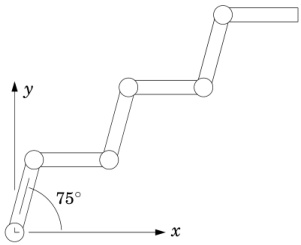{width=33%} Figure 10.3: A 6-link planar mechanism in a zigzag configuration

broader than this, and, in particular, it is a problem that affects kinematic trees as well as closed-loop systems.

To illustrate the problem, consider the 6-link planar robot mechanism shown in Figure 10.3. Each link has unit length, unit mass, a centre of mass half way along its length, and a rotational inertia about its centre of mass of $1/12$. The joints are revolute, and the joint angles alternate between $+75^{\circ}$ and $-75^{\circ}$, as shown. The robot is initially at rest, and there are no forces acting on it other than the joint forces. The equation of motion is therefore

$$
\tau = H \ddot { q } \, .
$$

Suppose we wish to impart a desired acceleration of $\ddot{\mathbf{q}}_{d}=\left[1\,1\,1\,1\,1\,1\right]^{\mathrm{T}}$ to this robot. The exact force required to do this is

$$
\pmb { \tau } _ { d } = \pmb { H } \ddot { \pmb { q } } _ { d } = \left[ \begin{array}{l} { 12 6 . 49 36 \, \cdots } \\{ 97 . 46 63 \, \cdots } \\{ 69 . 97 62 \, \cdots } \\{ 43 . 79 98 \, \cdots } \\{ 21 . 93 71 \, \cdots } \\{ 6 . 16 46 \, \cdots } \end{array} \right]
$$

If we apply exactly this force to the robot, then we will get exactly the desired acceleration. Now suppose that the robot's actuators are slightly imperfect, such that the forces they actually apply are equal to the commanded forces rounded to three significant figures. The force that will actually be applied to the robot is then

$$
\begin{array}{r} { \pmb { \tau } _ { a } = \left[ \begin{array}{l} { 12 6 } \\{ 97 . 5 } \\{ 70 . 0 } \\{ 43 . 8 } \\{ 21 . 9 } \\{ 6 . 16 } \end{array} \right] , } \end{array}
$$

and the robot's response to this force will be

$$
\ddot { q } _ { a } = H ^{- 1} \tau _ { a } = \left[ \begin{array}{l} { 0 . 69 52 } \\{ 1 . 36 54 } \\{ 1 . 38 08 } \\{ 0 . 58 94 } \\{ 0 . 90 57 } \\{ 1 . 07 05 } \end{array} \right] .
$$

Observe that some of the accelerations are as much as 40% off their correct values, despite the applied forces all being accurate to better than 0.5%. In effect, the mechanism has amplified the error by more than a factor of 80.

This problem has been studied in Featherstone (2004), where the condition number of $H$ is used as an indication of the underlying sensitivity of the mechanism. This paper shows that the condition number can grow in proportion to the fourth power of the number of bodies, and that the worst-case condition number for a chain of identical links, like the mechanism in Figure 10.3, is approximately $4N_{B}^{4}$. The worst-case condition number for the 6-link robot is therefore approximately 5184, although the actual condition number of $H$ in the above example is 725; and the worst case for a 10-link robot is 40,000. Numbers like this indicate that one should be cautious of simulating long chains of rigid bodies, and skeptical of the accuracy of the results.

This paper also investigates branched kinematic trees, and it shows that sensitivity increases with the depth of the tree, other things being kept equal. Thus, a branched kinematic tree will usually have a lower condition number than an unbranched tree made from the same set of bodies. The obvious implication is that one should choose a minimum-depth spanning tree for a closed-loop mechanism.

# 10.3 Efficiency

To compare the efficiencies of different algorithms, it is necessary to have a common measure of efficiency. In the case of dynamics algorithms, the most widely used measure is the floating-point operations count. This count is usually broken down into two subtotals: the number of multiplications and divisions, which are collectively referred to as multiplications, and the number of additions and subtractions, which are collectively referred to as additions. Furthermore, the subtotals are expressed as functions of a parameter that measures some aspect of the size of the rigid-body system, such as the number of bodies or the number of joint variables.

Some examples of operation-count formulae are shown in Table 10.1. The symbols $\mathbf{m}$ and a stand for multiplication and addition, respectively, and $n$ is the number of joint variables. To obtain figures like this, it is necessary to agree on a standard set of rigid-body systems, one for each value of $n$, so that every algorithm is applied to the same set of systems. The most widely used standard

| Algorithm | Cost | Source |
| --- | --- | --- |
| RNEA | $(93n-108)\text{m} + (81n-100)\text{a}$ | 3 |
| RNEA | $(93n-69)\text{m} + (81n-66)\text{a}$ | 1, 3 |
| RNEA | $(130n-68)\text{m} + (101n-56)\text{a}$ | 6 |
| RNEA | $(150n-48)\text{m} + (131n-48)\text{a}$ | 8 |
| CRBA | $(10n^2 + 22n-32)\text{m} + (6n^2 + 37n-43)\text{a}$ | 7, 14 |
| CRBA | $(10n^2 + 31n-41)\text{m} + (6n^2 + 40n-46)\text{a}$ | 6 |
| CRBA | $(10n^2 + 41n-51)\text{m} + (6n^2 + 52n-58)\text{a}$ | 9, 10 |
| CRBA | $(11n^2 + 11n-42)\text{m} + (\frac{11}{2}n^2 + \frac{65}{2}n-54)\text{a}$ | 2, 4 |
| CRBA | $(12n^2 + 56n-27)\text{m} + (7n^2 + 67n-53)\text{a}$ | 12 |
| F&amp;S | $(\frac{1}{6}n^3 + \frac{3}{2}n^2 - \frac{2}{3}n)\text{m} + (\frac{1}{6}n^3 + n^2 - \frac{7}{6}n)\text{a}$ | 13 |
| ABA | $(224n-259)\text{m} + (205n-248)\text{a}$ | 11 |
| ABA | $(250n-222)\text{m} + (220n-198)\text{a}$ | 5 |
| ABA | $(300n-267)\text{m} + (279n-259)\text{a}$ | 6 |

# Abbreviations

RNEA recursive Newton-Euler algorithmCRBA composite-rigid-body algorithmF&S factorize and solve equation of motion $H\ddot{q}=\tau-C$ABA articulated-body algorithm

# Sources

1 Balafoutis et al. (1988), Algorithm 3 in Table II2 Balafoutis and Patel (1989), Algorithm I in Table II3 Balafoutis and Patel (1991), Algorithm 5.7 in Tables 5.1 and 5.24 Balafoutis and Patel (1991), Algorithm 6.2 in Table 6.25 Brandl et al. (1988)6 Featherstone (1987), Table 8-67 Featherstone (2005), Eq. 20 with $D_{0a} = n - 1$, $D_{1a} = (n^2 - n)/2$ and $D_{0b} = D_{1b} = 0$8 Hollerbach (1980), Newton-Euler method in Table I9 Lilly and Orin (1991), method IV in Table 710 Lilly (1993), method IV in Table 3.711 McMillan et al. (1995), Table II (fixed base)12 Walker and Orin (1982), method 313 Table 6.6 with Eq. 6.2814 Eq. 10.3

Table 10.1: Operation counts for several published dynamics algorithms

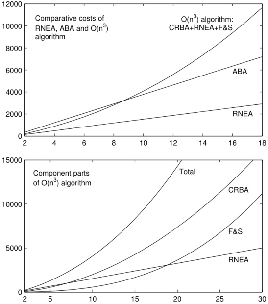{width=60%} Figure 10.4: Operation counts versus $n$ for various dynamics algorithms

is the set of unbranched kinematic chains in which all the joints are revolute, and all the bodies have general inertia and geometric parameters. For easy reference, let us call this set $GU$ (general unbranched), and call its members $GU(1)$, $GU(2)$, and so on. $GU(n)$ is then the unbranched chain with $n$ joint variables, and therefore also $n$ joints and $n$ moving bodies (i.e., $N_J = N_B = n$).

Given that the joints in $GU$ are revolute, it is understood that one sine and one cosine calculation are required for each joint. As these calculations are the same for all algorithms that need them, they are omitted from the operation counts. The algorithms that need them are the recursive Newton-Euler and articulated-body algorithms.

To give a visual impression of the relative efficiencies of the algorithms, Figure 10.4 shows the total operation count for the best version of each algorithm, plotted against $n$. It also plots the three component parts of the $O(n^3)$ algorithm, so that their relative contributions can be gauged. Strictly speaking, the curves in these graphs are only correct if the cost of performing an addition is the same as the cost of performing a multiplication. However, in practice

it makes little difference whether one costs an addition as one multiplication, 0.5 multiplications or 0.25 multiplications: apart from the vertical scales, the graphs look almost the same.

According to these graphs, the $O(n^3)$ algorithm is slightly faster than the articulated-body algorithm for $n \leq 8$, and has risen to about 1.6 times the cost of the articulated-body algorithm by the time $n=18$. The second graph shows that the cost of the composite-rigid-body algorithm (which is $O(n^2)$) is the dominant term in the $O(n^3)$ algorithm from $n=8$ until well past $n=30$. (The F&S curve crosses the CRBA curve at approximately $n=45$.) It also shows that the cost of factorizing and solving the equation of motion is actually the smallest term when $n \leq 18$. The contribution of the $n^3$ component to the total cost is therefore relatively insignificant at small values of $n$.

# 10.3.1 Optimization

The figures quoted in Table 10.1 are the result of extensive optimizations, which are aimed at showing each algorithm in its best possible light. The most important of these optimizations are as follows.$^{1}$

Use Denavit-Hartenberg coordinate frames. (See Figure 4.8.) This enables optimizations 2 and 3.

Exploit the fact that $S_i = [0\ 0\ 1\ 0\ 0\ 0]^{\text{T}}$ in link coordinates.

Implement link-to-link coordinate transformations as a sequence of two axial-screw transforms.

An axial-screw transform is a combination of a rotation about and translation along a single coordinate axis. Such transforms are particularly cheap to apply, and formulae and costings are presented in Section A.4. A transformation from one Denavit-Hartenberg coordinate frame to another can be accomplished by two axial-screw transforms: one about the $x$ axis, and one about the $z$ axis. The former is a constant, while the latter includes the joint variable.

To see how these optimizations are applied, let us calculate the operation-count formula for the composite-rigid-body algorithm. Table 10.2 reproduces the pseudocode of this algorithm (from Table 6.2), together with some annotations. The symbols ra, rx andvx represent the cost of adding two rigid-body inertias, transforming a rigid-body inertia and transforming a vector, respectively. We shall work out these costs in a moment.

The first step is to identify which lines contain floating-point calculations. Assignment and transpose operations do not count as calculations, so there are no floating-point calculations on Lines 1, 3 or 16. Using optimization 2, the

Algorithm: Annotations:

1 $H=0$

2 for $i=1$ to $N_{B}$ do

3 $I_{i}^{c}=I_{i}$

4 end

5 for $i=N_{B}$ to 1 do

6 if $\lambda(i)\neq0$ then

7 $I_{\lambda(i)}^{c}=I_{\lambda(i)}^{c}+\lambda(i)X_{i}^{*}I_{i}^{c}iX_{\lambda(i)}$ operations: ra + rx

8 end

9 $F=I_{i}^{c}S_{i}$

10 $H_{ii}=S_{i}^{\mathrm{T}}F$

11 $j=i$

12 while $\lambda(j)\neq0$ do

13 $F=\lambda(j)X_{j}^{*}F$

14 $j=\lambda(j)$

15 $H_{ij}=F^{\mathrm{T}}S_{j}$

16 $H_{ji}=H_{ij}^{\mathrm{T}}$

17 end

18 end

Table 10.2: Calculations performed by the composite-rigid-body algorithm

multiplication $I_{i}^{c}S_{i}$ on line 9 simplifies to extracting column 3 from $I_{i}^{c}$, which does not require any calculation. Likewise, the multiplications $S_{i}^{\mathrm{T}}F$ and $F^{\mathrm{T}}S_{j}$ on lines 10 and 15 both simplify to extracting element 3 from $F$, which does not require any calculation. Thus, there are only two lines where floating-point calculations do occur: line 7, which performs the operations $\mathbf{ra}$ and $\mathbf{rx}$, and line 13, which performs the operation $\mathbf{v}\mathbf{x}$.

If this algorithm is applied to the mechanism $GU(n)$, then the body of loop 2 will be executed $n$ times. The condition $\lambda(i) \neq 0$ will be true for every value of $i$ except $i=1$, so line 7 will be executed a total of $n-1$ times. On each iteration of loop 2, the body of loop 3 will be executed $i-1$ times (because $\lambda(j) = j-1$); so line 13 will be executed a total of $\sum_{i=1}^{n}(i-1)$ times, which works out as $n(n-1)/2$ times. The cost formula for the composite-rigid-body algorithm is therefore

$$
c o s t = ( n - 1 ) ( \mathbf { r a } + \mathbf { r x } ) + { \frac { n ( n - 1 ) } { 2 } } \mathbf { v x } \, .
$$

The next step is to express ra, rx andvx in terms of m and a. If rigid-body inertias are stored in compact form, as explained in Section A.3, then the cost of summing two inertias is ten floating-point additions; so ra = 10a. To obtain the lowest operation counts for rx and rx, we use optimizations 1 and 3. From the figures in Section A.4, the cost of a single axial-screw transform of a spatial

vector is $10\mathrm{m}+6\mathrm{a}$, but $\mathrm{v}\mathrm{x}$ requires two, so $\mathrm{v}\mathrm{x}=20\mathrm{m}+12\mathrm{a}$. The basic cost of an axial-screw transform of a rigid-body inertia is $16\mathrm{m}+15\mathrm{a}$, to which $2\mathrm{m}+3\mathrm{a}$ must be added each time the angle changes. However, we can shave $1\mathrm{m}$ off this figure by precomputing the products of the masses with the distance parameters of the screw transforms, since they are all constants. This results in a cost figure of $2(15\mathrm{m}+15\mathrm{a})+2\mathrm{m}+3\mathrm{a}=32\mathrm{m}+33\mathrm{a}$ for rx. Substituting these costs into Eq. 10.2 gives

$$
c o s t = ( 10 n ^{2} + 22 n - 32 ) \mathbf { m } + ( 6 n ^{2} + 37 n - 43 ) \mathbf { a } \, .
$$

This formula is as far as we will take the optimization process, but there are further improvements in efficiency that could be made. For example, modest reductions in the costs of both ra and rx can be achieved by modifying the inertia parameters as described in Section 9.7. Another cost saving can be obtained by observing that only element 3 of $F$ is needed to calculate $H_{ij}$, so the last execution of line 13 in each invocation of loop 3 could be replaced by a simpler calculation that only calculates element 3 of the transformed vector.

Even this is not yet the last word in efficiency. However, it is not really worthwhile to implement such fiddly optimizations manually. A better strategy is to get the computer to do the optimization for you, and that is the subject of Section 10.4.

# 10.3.2 Branches

One of the problems with using $GU$ as the benchmark set of rigid-body systems is that it does not contain any branched trees, and therefore does not allow the effect of branches to be seen. It turns out that branches have very little effect on the recursive Newton-Euler and articulated-body algorithms, but they can greatly reduce the cost of the composite-rigid-body algorithm, as well as the cost of factorizing and solving the equation of motion. In both cases, the cost savings are caused by branch-induced sparsity in the joint-space inertia matrix. (See §6.4.)

It therefore follows that the cost formulae in Table 10.1 and the curves in Figure 10.4 present the $O(n^3)$ algorithm in an unduly pessimistic light, by stating only its worst-case performance. Indeed, even the name 'O(n^3) algorithm' is misleading, since the true complexity of this algorithm is $O(nd^2)$, where $d$ is the depth of the connectivity tree. If there are no branches, then $d=n$; but if there are branches, then $d=n$ can be much smaller than $n$; and if $d$ is subject to a fixed upper limit, then the complexity of this algorithm is only $O(n)$.

Let us recalculate the cost formula for the composite-rigid-body algorithm, assuming that it is being applied to a general kinematic tree with $n$ revolute joints, and that the joint axes satisfy $S_i = [0 \ 0 \ 1 \ 0 \ 0 \ 0]^\text{T}$ in link coordinates. Referring back to Table 10.2, it is still the case that lines 7 and 13 are the only two that perform floating-point calculations, but the number of times these lines get executed has changed. In the case of line 7, the expression $\lambda(i) \neq 0$

is false for every body $i$ that is a child of body 0; that is, for every $i$ satisfying $i \in \mu(0)$. Line 7 is therefore executed $n - |\mu(0)|$ times. In the case of line 13, loop 3 iterates over every ancestor of body $i$, starting with body $i$ itself, and terminating on the ancestor nearest the root (which is the ancestor satisfying $j \in \mu(0)$). The body of loop 3 is therefore executed $|\kappa(i)| - 1$ times on each iteration of loop 2; and so line 13 is executed a total of $\sum_{i=1}^{n}(|\kappa(i)| - 1)$ times.

Let us define the quantities $D_{0}$ and $D_{1}$ as follows:

$$
D _ { 0 } = n - | \mu ( 0 ) |
$$

and

$$
D _ { 1 } = \sum _ { i = 1 } ^{n} \left( \left| \kappa ( i ) \right| - 1 \right) .
$$

The cost of the composite-rigid-body algorithm can then be expressed as

$$
c o s t = D _ { 0 } ( \mathbf { r a } + \mathbf { r x } ) + D _ { 1 } \mathbf { v x } \, .
$$

Furthermore, as $|\mu(0)|$ is bounded by $1 \leq |\mu(0)| \leq n$, and $|\kappa(i)|$ by $1 \leq |\kappa(i)| \leq i$, it follows that $D_0$ and $D_1$ are bounded by

$$
0 \leq D _ { 0 } \leq n - 1
$$

and

$$
0 \leq D _ { 1 } \leq n ( n - 1 ) / 2 \, .
$$

Both quantities reach their lower limit in a system where every body is connected directly to the base. In such a system, $\mathbf{H}$ is diagonal and constant, and the cost of calculating it is zero. At the other extreme, both quantities reach their upper limit in an unbranched kinematic tree. In this case, Eq. 10.6 is identical to Eq. 10.2. If $d$ is the depth of the connectivity tree, then $|\kappa(i)|$ is also bounded by $|\kappa(i)| \leq d$, which implies

$$
0 \leq D _ { 1 } \leq n ( d - 1 ) .
$$

Thus, the true complexity of the composite-rigid-body algorithm is actually $O(nd)$, and the expression $O(n^2)$ only applies in the worst case. If we combine this with the $O(nd^2)$ complexity of the factorization algorithms in Section 6.5, then the complete forward-dynamics algorithm has a complexity of $O(nd^2)$.

Let us now express the cost formula in Eq. 10.6 in terms of m and a. At this point, a new complication arises: only one child per nonterminal body can benefit from the cost savings afforded by Denavit-Hartenberg coordinate frames. We therefore rewrite Eq. 10.6 as follows:

$$
c o s t = D _ { 0 } \mathbf { r a } + D _ { 0 } ^{d h} \mathbf { r x } ^{d h} + D _ { 0 } ^{g} \mathbf { r x } ^{g} + D _ { 1 } ^{d h} \mathbf { v x } ^{d h} + D _ { 1 } ^{g} \mathbf { v x } ^{g} \, ,
$$

where the superscripts $dh$ and $g$ refer to Denavit-Hartenberg and general coordinate transforms, respectively. So $\mathrm{rx}^{dh}$ is the cost of calculating $\lambda^{(i)}\mathbf{X}_{i}^{*}\mathbf{I}_{i}^{c}\mathbf{i}\mathbf{X}_{\lambda(i)}$

when $^{i}\mathbf{X}_{\lambda(i)}$ is a Denavit-Hartenberg transform (two axial screws); $\mathbf{v}\mathbf{x}^{g}$ is the cost of calculating $\lambda^{(j)}\mathbf{X}_{j}^{*}\mathbf{F}$ when $\lambda^{(j)}\mathbf{X}_{j}^{*}$ is a general coordinate transform; $D_{0}^{g}$ is the number of times that $\mathbf{r}\mathbf{x}^{g}$ is performed; and so on. Note that $D_{0}^{dh}+D_{0}^{g}=D_{0}$ and $D_{1}^{dh}+D_{1}^{g}=D_{1}$.

To obtain expressions for the various $D$ quantities, we introduce two new sets: $\pi^{dh}$ and $\pi^{g}$. $\pi^{dh}$ is the set of all bodies $i$ such that $\lambda(i) \neq 0$ and ${}^{i}\mathbf{X}_{\lambda(i)}$ is a Denavit-Hartenberg transform; and $\pi^{g}$ is the set of all bodies $i$ such that $\lambda(i) \neq 0$ and ${}^{i}\mathbf{X}_{\lambda(i)}$ is a general transform. Thus, $\pi^{dh} \cup \pi^{g}$ is the set of all bodies that are not children of the root node (i.e., not elements of $\mu(0)$), and $|\pi^{dh} \cup \pi^{g}| = n - |\mu(0)| = D_{0}$. Given these sets, we can define the $D$ quantities as follows:

$$
D _ { 0 } ^{d h} = | \pi ^{d h} | \, ,  D _ { 1 } ^{d h} = \sum _ { i \in \pi ^{d h} } | \nu ( i ) | \, ,
$$

$$
D _ { 0 } ^{g} = | \pi ^{g} | \, ,   D _ { 1 } ^{g} = \sum _ { i \in \pi ^{g} } | \nu ( i ) | \, .
$$

The expressions for $D_{1}^{dh}$ and $D_{1}^{g}$ are obtained as follows. When we first evaluated $D_{1}$, we asked the question 'How many times is loop 3 executed?' Another approach would be to ask how many times $\lambda^{(j)}\mathbf{X}_{j}^{*}$ is used, for each possible value of $j$. The answer to this question is that if $\lambda(j)=0$ then this transform is never used; otherwise, it is used once for each body in $\nu(j)$, which means it is used $|\nu(j)|$ times. The expressions in Eq. 10.11 are simply the sums of these usage counts.

The final step is to express ra, rx$^{dh}$, etc., in terms of m and a. From Sections A.3 and A.4, these expressions are: ra = 10a, rx$^{dh}$ = 32m+33a, rx$^{g}$ = 47m+48a (three axial screws), rx$^{dh}$ = 20m+12a and rx$^{g}$ = 24m+18a. Substituting these expressions into Eq. 10.10 gives

$$
\begin{array}{rl} { c o s t \ = \ } & { D _ { 0 } ^{d h} ( 32 \mathrm { m } + 43 \mathrm { a } ) + D _ { 0 } ^{g} ( 47 \mathrm { m } + 58 \mathrm { a } ) + } \\& { D _ { 1 } ^{d h} ( 20 \mathrm { m } + 12 \mathrm { a } ) + D _ { 1 } ^{g} ( 24 \mathrm { m } + 18 \mathrm { a } ) \, . } \end{array}
$$

This is the cost of the composite-rigid-body algorithm when it is applied to a general kinematic tree in which all the joints are revolute. On an unbranched tree, we have $D_{0}^{dh}=n-1$, $D_{1}^{dh}=n(n-1)/2$ and $D_{0}^{g}=D_{1}^{g}=0$, which makes Eq. 10.12 the same as Eq. 10.3. More on this subject, including a cost formula for floating-base kinematic trees, can be found in Featherstone (2005).

To give an idea of how big a difference branches can make, Figure 10.5 reproduces the cost curves from Figure 10.4 for the articulated-body and $O(n^3)$ algorithms, the latter now labelled $O(nd^2)$, and it adds one new curve: the cost of applying the $O(nd^2)$ algorithm to a binary tree. This curve is almost identical to the curve for the articulated-body algorithm, and very different from the curve for the $O(nd^2)$ algorithm applied to an unbranched chain. The reason for this is that $d$ is $O(\log(n))$ on a binary tree, so the complexity of the $O(nd^2)$ algorithm is only $O(n \log(n)^2)$ on the binary tree, which is very close to being $O(n)$.

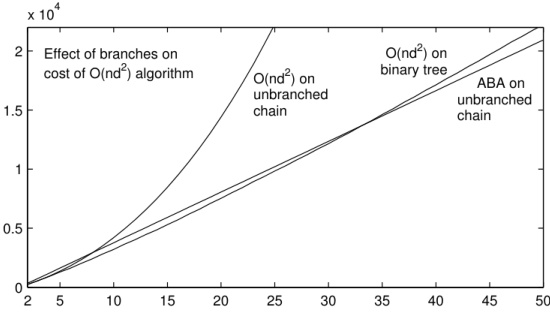{width=60%} Figure 10.5: Effect of branches on the cost of the $O(nd^2)$ algorithm

# 10.4 Symbolic Simplification

The advantage of model-based dynamics software is that each algorithm can be implemented once, and the resulting code will work on any rigid-body system that is supplied to it as an argument. The disadvantage is that the code must cater for every possibility that is allowed by the system model, and cannot take short cuts that depend on prior knowledge of the system. In particular, many of the parameters in a typical system will be zero, and the model-based software will spend much time calculating terms that are bound to evaluate to zero because one of their factors is a zero-valued model parameter.

The alternative is to write custom code that is designed to work only on a single rigid-body system, or a narrow class of similar rigid-body systems. Such code can exploit prior knowledge of joint types, geometric and inertia parameter values, and so on, with the end result that fewer arithmetic operations are required to perform the calculation, as compared with a model-based coding of the same algorithm.

The manual construction of custom code is not practical, except for the simplest of rigid-body systems; but the automatic construction of such code is entirely practical, and the procedure for doing so is called symbolic simplification. Figure 10.6 illustrates the process. In the first stage, an algorithm and a system model are fed to a symbolic executable. This is a program that applies the algorithm to the data, but, instead of actually performing the numerical calculations, it merely records them, and outputs the record as a data file. The contents of this file are a list of assignment statements detailing the floating-point calculations that the given algorithm would have performed on the given model if it had been executed for real. This file also identifies the input and output variables.

In the second stage, the assignment-statement file is passed to a symbolic simplifier program. This program reads the file, applies a few basic simplifica

{width=57%} Figure 10.6: The symbolic simplification process

tion rules, and outputs the result in the form of computer source code expressed in a suitable programming language. The most important simplifications are as follows:

Remove any assignment statement that calculates a quantity that is never used. (Being output counts as being used.)

Remove assignment statements of the form $a=b$, where $a$ is not an output variable, and $b$ is either a constant or a variable, and replace all subsequent instances of $a$ with $b$.

Perform some basic algebraic simplifications, such as: $x\cdot0\to0$, $x\cdot1\to x$, $x+0\to x$, and so on.

Evaluate constant expressions.

These rules must be applied exhaustively, as the application of one rule can create new opportunities for the application of another. They must also be cheap, as there can easily be tens of thousands of assignments in the list.

Table 10.3 presents an example of how the process works. In this example, $\boldsymbol{v}$ is an input variable, $\tau_{out}$ is an output variable, and $\boldsymbol{I}$ and $\boldsymbol{s}$ are quantities defined in the system model. The algorithm specifies how to calculate $\tau_{out}$ from $\boldsymbol{v}$. If we were to implement this algorithm directly, then it would require one $3 \times 3 \times 1$ matrix multiplication, one 3D vector cross product and one 3D vector dot product. This adds up to a total of 29 floating-point arithmetic operations, which can be seen in the assignment-statement file. The symbolic executer deals only with scalars, so it expands vector operations into their scalar equivalents. It also processes only one vector operation at a time, so it introduces temporary variables as required. Apart from that, the only other thing it does is to substitute model parameters with their actual values.

Using only the simplifications listed above, the amplifier is able to cut the total operations count from 29 down to 5. If the amplifier had used a more

Table 10.3: Symbolic simplification example

| calculation specified in the algorithm | $p = v × I v τ out = p · s$ |
| --- | --- |
| data supplied in the model | $I = { \left[ \begin{array} { l l l } { 1 . 5 } & { 0 } & { 0 } \\ { 0 } & { 1 . 6 } & { 0 } \\ { 0 } & { 0 } & { 1 . 7 } \end{array} \right] } , } & { s = { \left[ \begin{array} { l } { 0 } \\ { 0 } \\ { 1 } \end{array} \right] }$ |

complex and sophisticated set of rules, then it might have found the optimal solution, which is $\tau_{out} = 0.1v_1v_2$, but the process would have required much more CPU time. Even so, the simple rule set is enough to find 90% of the possible cost savings. In this example, the simplifier cut the cost by almost a factor of 6. In practice, this factor is highly sensitive to the number of zeros in the system model. Factors as high as 10 have been reported in the literature (Wittenburg and Wolz, 1985); but factors close to 1 are also possible.

Several variations are possible on the above scheme. For example, a set of predefined algorithms can be built into the symbolic executor, so that the user only has to supply the system model. This makes the software easier to use, and easier to implement, but it removes the user's freedom to supply an algorithm of his own. Another variation is that the symbolic executor and simplifier could be two parts of the same program, rather than two separate programs. In this case, the assignment-statement file would not exist, although an equivalent internal data structure would still be required. Another possibility is to allow the model to define only some of the parameter values. The undefined parameters would then be treated as unknown quantities to be supplied at run time. This feature allows the creation of custom code that caters for a set of rigid-body systems, each differing from the others only in the values of specific parameters.

One potential disadvantage of symbolic simplification is that it reduces vector operations to scalar operations. On a computer with vector-arithmetic hardware, the resulting code may make poor use of the available processing power,

and could end up slower than the original vector-oriented code. Another possible disadvantage is that the size of the customized code grows linearly with the operations count (because it is just a list of assignment statements). For a sufficiently complicated rigid-body system, the custom code will be too large to fit in the computer's instruction cache. When this happens, the computer is forced to fetch instructions from main memory, which is a much slower process. The net effect is that execution speed goes down because the CPU is repeatedly having to wait for the next batch of instructions.

Several programs have been written that implement this technique, or something similar, and two have become commercially available: SD/FAST and Autolev.$^{2}$ More on the subject of automatic generation and simplification of dynamics equations can be found in Murray and Neuman (1984); Neuman and Murray (1987); Wittenburg and Wolz (1985).

# Chapter 11

# Contact and Impact

When two rigid bodies come into contact, they become subject to a contact constraint which says that the two bodies are not allowed to penetrate. If $\phi$ is a measure of the signed distance between them, meaning that $\phi < 0$ if they overlap, then the contact constraint is given by the inequality $\phi \geq 0$. The forces that impose this constraint are similarly one-sided: they can act to prevent penetration, but not to prevent separation—they can repel, but not attract. If two bodies meet with velocities that are not consistent with the contact constraint between them, then an impulse is generated that causes a step change in their velocities. We call this event an impact.

The first four sections in this chapter develop the equations of motion for rigid-body systems containing point contacts. Then Section 11.5 examines ways of solving these equations, and Section 11.6 looks at some of the geometric aspects of the problem, including how to represent line and surface contacts in terms of point contacts. Section 11.7 develops the impulsive equations of motion for rigid-body systems, and the equations of impact between two bodies. Finally, Section 11.8 presents the alternative to rigid-body contact and impact dynamics, which is to incorporate compliance into the contacting surfaces.

# 11.1 Single Point Contact

Consider the rigid-body system shown in Figure 11.1. It contains a single rigid body, $B$, which is making contact with a fixed surface at a single point, $C$. The body has a velocity of $\boldsymbol{v}$ and an acceleration of $\boldsymbol{a}$; and it is subject to both an applied force of $\boldsymbol{f}$ and a contact force of $\boldsymbol{f}_{c}$. The contact is characterized by a contact normal vector, $\boldsymbol{n} \in \mathbf{F}^{6}$, which is a unit force acting along the line of the contact normal. We define $\boldsymbol{n}$ to point out of the surface so that positive scalar multiples of $\boldsymbol{n}$ will repel the body from the surface. The contact is assumed to be frictionless; and the body is assumed to be subject only to finite forces (i.e., no impulses) during and immediately before and after the current instant. The

{width=28%} Figure 11.1: A rigid body making contact with a fixed surface at a single point

two unknowns in this system are $f_{c}$ and $a$, and the problem is to find them.

Let $C'$ denote the point on the body's surface that coincides with $C$ at the current instant. The fixed surface exerts a constraint force of $f_c$ on the body, which acts to prevent $C'$ from penetrating into the surface. As the contact is frictionless, this force must act along the contact normal, and must therefore be a scalar multiple of $n$. We therefore introduce a new scalar variable, $\lambda$, which is the unknown contact force magnitude. Thus,

$$
f _ { c } = n \, \lambda \, .
$$

As $f_{c}$ can act only to repel the body, $\lambda$ must satisfy the constraint $\lambda \geq 0$.

We now introduce a second scalar variable, $\zeta$, to denote the contact separation velocity, which is defined as the normal component of the linear velocity of $C'$. It is given by the expression

$$
\zeta = n \cdot v \, .
$$

The correctness of this equation can be verified by placing a coordinate frame with its origin at $C$ and its $z$ axis along the normal: the Plücker coordinates of $n$ will then be $[0\ 0\ 0\ 0\ 0\ 1]^{\mathrm{T}}$, so $n\cdot v=v_{Cz}$, which is the $z$ coordinate of the linear velocity of $C'$.

It can be shown that $\zeta=0$ at the current instant. This implies that the given values of $n$ and $v$ must satisfy $n\cdot v=0$. The argument proceeds as follows: if the body is subject only to finite forces, then its acceleration must be finite; so, if $\zeta<0$ at the current instant, then the body will penetrate the surface in the immediate future; and if $\zeta>0$ then the body has penetrated the surface in the immediate past; but penetration is not allowed at any time, so $\zeta=0$. A corollary to this argument is that $\zeta\neq0$ implies an impulse.

We are also interested in the contact separation acceleration, which is the derivative of $\zeta$. This quantity is given by

$$
\dot { \zeta } = \frac { \mathrm { d } } { \mathrm { d } t } ( n \cdot v ) = n \cdot a + \dot { n } \cdot v \, ,
$$

and its value at the current instant is unknown. The term $\dot{\boldsymbol{n}} \cdot \boldsymbol{v}$ (or the vector $\dot{\boldsymbol{n}}$) is assumed to be known, since it is a function of the position and velocity

of $B$ and the shapes of the contacting surfaces. Having established that $\zeta=0$, it can be seen that $\dot{\zeta}$ cannot be negative, since that would lead to penetration, so it must satisfy the constraint $\dot{\zeta}\geq0$.

The exact behaviour of the contact constraint can now be stated as follows: either the contact breaks at the current instant, or it persists. If it breaks, then the separation acceleration must be strictly positive, and the contact force must be zero (because contact is being lost). If it persists, then the separation acceleration must be zero. To summarize, we have

$$
\begin{array}{rl} & { \dot { \zeta } > 0  \mathrm { a n d }  \lambda = 0  \mathrm { i f ~ t h e ~ c o n t a c t ~ b r e a k s , ~ a n d } } \\& { \dot { \zeta } = 0  \mathrm { a n d }  \lambda \geq 0  \mathrm { i f ~ t h e ~ c o n t a c t ~ p e r s i s t s . } } \end{array}
$$

This same behaviour is described succinctly by the constraint equation

$$
\dot { \zeta } \geq 0 \, ,  \lambda \geq 0 \, ,  \dot { \zeta } \lambda = 0 \, .
$$

The next step is to express $\dot{\zeta}$ as a function of $\lambda$. This is where the dynamics of the body come into play. The equation of motion for $B$ is

$$
I a + v \times ^{*} I v = f + n \lambda \, ,
$$

where $f$ accounts for every force acting on the body other than the contact force. Expressing $a$ as a function of $\lambda$, we have

$$
a = I ^{- 1} ( n \lambda + f - v \times ^{*} I v ) \, .
$$

Substituting this expression into Eq. 11.3 gives

$$
\begin{array}{rl} { \dot { \zeta } = } & { { } n \cdot I ^{- 1} ( n \lambda + f - v \times ^{*} I v ) + \dot { n } \cdot v } \\{ = } & { { } M \lambda + d \, , } \end{array}
$$

where

$$
M = n \cdot I ^{- 1} n
$$

and

$$
d = n \cdot I ^{- 1} ( f - v \times ^{*} I v ) + \dot { n } \cdot v \, .
$$

Equations 11.4 and 11.7 can now be solved by inspection for $\dot{\zeta}$ and $\lambda$, the solution being

$$
\begin{aligned}\dot\zeta&=d\text{and}\lambda=0&\text{if }d\ge0\\\dot\zeta&=0\text{and}\lambda=-d/M&\text{if }d<0\:.\end{aligned}
$$

(Note that $M$ is strictly positive because $I$ is positive definite.) Having solved for $\lambda$, the values of $f_c$ and $a$ follow from Eqs. 11.1 and 11.6, and the problem is solved. Observe that $d$ is a linear function of $f$, but $\lambda$ is only a piecewise-linear function of $d$. Thus, the acceleration of $B$ is not a linear function of the applied force, but only a piecewise-linear function. In this respect, contact dynamics differs fundamentally from the dynamics of systems with equality constraints.

{width=42%} Figure 11.2: A rigid body making multiple point contacts with a fixed surface

# 11.2 Multiple Point Contacts

We now extend the analysis in Section 11.1 to the case of a single rigid body making multiple frictionless point contacts with a fixed surface. An example of such a system is shown in Figure 11.2. Let there be $n_c$ contacts in total, numbered from 1 to $n_c$; and let contact $i$ be characterized by a contact point, $C_i$, and a contact normal vector, $\mathbf{n}_i$, as defined in Section 11.1. We also define $C_i'$ to be the body-fixed point that coincides with $C_i$ at the current instant.

The fixed surface can exert a constraint force on the body through each contact. The force exerted through contact $i$ is $n_i\lambda_i$, where $\lambda_i$ is the unknown contact force magnitude, and this force acts to prevent $C_i'$ from penetrating into the surface. As the contact force can act only to repel $C_i'$, it must be a positive multiple of $n_i$; so $\lambda_i$ must satisfy the constraint $\lambda_i \geq 0$. If $f_c$ is the total constraint force acting on the body, then

$$
f _ { c } = \sum _ { i = 1 } ^{n _ { c} } n _ { i } \lambda _ { i } \, ,
$$

which replaces Eq. 11.1.

Let $\zeta_{i}$ denote the separation velocity at contact $i$. This quantity is the component of the linear velocity of $C_{i}^{\prime}$ in the direction of $n_{i}$, and is therefore given by

$$
\zeta _ { i } = n _ { i } \cdot v \, .
$$

Observe that each contact has its own separation velocity, even though there is only a single moving body in the system. Using the same argument as in Section 11.1, we can show that every separation velocity must be zero at the current instant. This implies that the body's velocity must satisfy the following set of equations:

$$
\begin{array}{r} { n _ { i } \cdot v = 0  ( i = 1 , \ldots , n _ { c } ) . } \end{array}
$$

If the contact normals span the whole of $F^{6}$ then the only solution will be $v=0$. However, this does not necessarily mean that the body cannot move, since it

may be able to accelerate away from (and therefore break) one or more of the contacts.

The separation acceleration at contact $i$ is the derivative of the separation velocity, and is therefore given by

$$
\dot { \zeta } _ { i } = \frac { \mathrm { d } } { \mathrm { d } t } ( n _ { i } \cdot v ) = n _ { i } \cdot a + \dot { n } _ { i } \cdot v \, ,
$$

which replaces Eq. 11.3. Given that $\zeta_{i}=0$, the value of $\dot{\zeta}_{i}$ cannot be negative, since that would lead to penetration locally at contact $i$, so we have $\dot{\zeta}_{i}\geq0$.

The exact behaviour of this set of contacts can now be stated as follows: at the current instant, each contact either breaks or it persists. If contact $i$ breaks, then $\dot{\zeta}_i > 0$ and $\lambda_i = 0$, otherwise $\dot{\zeta}_i = 0$ and $\lambda_i \geq 0$. Thus, we have

$$
\dot { \zeta } _ { i } \geq 0 \, ,  \lambda _ { i } \geq 0 \, ,  \dot { \zeta } _ { i } \, \lambda _ { i } = 0  ( i = 1 , \ldots , n _ { c } ) \, ,
$$

which replaces Eq. 11.4. At the outset, we do not know which contacts will break and which will persist. Finding this out is part of the solution process.

At this point, let us introduce three new quantities, $\mathcal{N}$, $\lambda$ and $\zeta$, which are defined as follows:

$$
\begin{array}{r} { N = \left[ n _ { 1 }  n _ { 2 }  \cdots  n _ { n _ { c } } \right] ,  \lambda = \left[ \begin{array}{l} { \lambda _ { 1 } } \\{ \lambda _ { 2 } } \\{ \vdots } \\{ \lambda _ { n _ { c } } } \end{array} \right]  \mathrm { a n d }  \zeta = \left[ \begin{array}{l} { \zeta _ { 1 } } \\{ \zeta _ { 2 } } \\{ \vdots } \\{ \zeta _ { n _ { c } } } \end{array} \right] } \end{array}
$$

$\mathbf{N}$ is therefore a $6 \times n_{c}$ matrix, and the other two are $n_{c}$-element vectors. In terms of these quantities, Eqs. 11.11, 11.13 and 11.14 can be written

$$
f _ { c } = N \lambda \, ,
$$

$$
\dot { \zeta } = N ^{\mathrm { T} } a + \dot { N } ^{\mathrm { T} } v
$$

and

$$
\dot { \zeta } \geq 0 \, ,  \lambda \geq 0 \, ,  \dot { \zeta } ^{\mathrm { T} } \lambda = 0 \, .
$$

An expression of the form $a \geq b$, where $a$ and $b$ are vectors, means that $a_i \geq b_i$ for every value of the index $i$. The constraint $\dot{\zeta}^{\text{T}}\lambda = 0$, in combination with the other two constraints in Eq. 11.18, implies that $\dot{\zeta}_i \lambda_i = 0$ for every $i$.

Continuing with the analysis, the equation of motion for body $B$ is

$$
I a + v \times ^{*} I v = f + N \lambda \, ,
$$

which can be rearranged to express $a$ as a function of $\lambda$:

$$
a = I ^{- 1} ( N \lambda + f - v \times ^{*} I v ) \, .
$$

Substituting this expression into Eq. 11.17 gives

$$
\dot { \zeta } = M \lambda + d \, ,
$$

{width=39%} Figure 11.3: Example of a contact system with no solution

where

$$
M = N ^{\mathrm { T} } I ^{- 1} N
$$

and

$$
d = N ^{\mathrm { T} } I ^{- 1} ( f - v \times ^{*} I v ) + \dot { N } ^{\mathrm { T} } v \, .
$$

The acceleration of $B$ can now be found by first solving Eqs. 11.18 and 11.20 for $\lambda$, and then calculating $\boldsymbol{a}$ from Eq. 11.19. However, unlike Eqs. 11.4 and 11.7, which could be solved by inspection, the solution of Eqs. 11.18 and 11.20 requires a special algorithm. This topic is discussed in Section 11.5, but a few remarks are in order here.

If $d \geq 0$ then one possible solution is $\lambda = 0$.

If $M$ is positive-definite then there is exactly one solution; otherwise, there could be one solution, no solution, or infinitely many solutions.

If there are multiple solutions for $\lambda$ then they all produce the same value for $a$.

It can be seen from Eq. 11.21 that $M$ is symmetric and positive-semidefinite; but it will only be positive-definite if the contact normal vectors are linearly independent. Thus, the possibility that there might be no solution, or that there might be more than one solution for $\lambda$, can only arise if the contact normals are linearly dependent.

Example 11.1 The possibility that there might be no solution to Eqs. 11.18 and 11.20 implies that there exist circumstances in which no value of $\lambda$ can prevent a violation of the contact constraints. A 2D example of this phenomenon is shown in Figure 11.3. This figure shows a disc sliding in a slot. To the left of the line $L$, the slot's walls are straight, and the width of the slot equals the diameter of the disc. The disc therefore makes two point contacts with the slot, with contact normals $\mathbf{n}_1$ and $\mathbf{n}_2$ as shown. These vectors satisfy $\mathbf{n}_2 = -\mathbf{n}_1$, and are therefore linearly dependent. To the right of $L$, the slot walls are circular arcs that curve inward, making the slot narrower. Thus, the disc's centre point, $D$, can lie on or to the left of $L$, but it cannot pass to the right of $L$ because the slot is too narrow.

Consider the situation that arises when $D$ lies on $L$: the disc cannot proceed any further to the right, but the two contact normals are pointing straight up and down, and are therefore incapable of affecting the horizontal motion of the disc. If a force is applied to the disc that pushes it to the right, then we have a paradoxical situation in which rightward motion must not occur, but the contact forces cannot prevent it. If this situation arises in a simulation, then the practical solution is to allow $D$ to move slightly to the right of $L$, so that the two contact normals change direction and become able to resist any further motion to the right.

If $D$ reaches $L$ with a linear velocity of $\boldsymbol{v}$, as shown, then an impulse is required to arrest the motion of the disc. Again, the simulator must allow $D$ to pass slightly beyond $L$ before this impulse can be applied. In both cases, the simulator must tolerate a small amount of penetration between the disc and the slot.

【此段建议校对(This paragraph is recommended for proofreading)】Given that \(n_{\text{ad}}}\) = -n_{\text{ad}}\), can be shown that \(M\) takes the form \(\beginbegin{array}{cc}m & -m \\ -m & m\end{array}\right\),, where \(m\) is a positive scalar. Therefore (from Eq. 2.2)

$$
\dot { \zeta } _ { 1 } + \dot { \zeta } _ { 2 } = d _ { 1 } + d _ { 2 } \, .
$$

If a solution exists, then it must satisfy $\dot{\zeta}_1 + \dot{\zeta}_2 \geq 0$; so the condition for there to be no solution is $d_1 + d_2 < 0$.

# 11.3 A Rigid-Body System with Contacts

Let us now consider the case of a general rigid-body system with multiple frictionless point contacts. The big difference between this and the previous case is that the equation of motion for a general rigid-body system is expressed in joint space.$^{1}$ Thus, the equation of motion for this system will take the form

$$
H \ddot { q } + C = \tau + \tau _ { c } \, ,
$$

where $\tau_{c}$ is a joint-space force expressing the total contact force, and $\ddot{q}$ will be subject to motion constraints from the contacts. It is therefore necessary to translate the individual contact force and acceleration expressions into joint space before they can be combined with the equation of motion.

Another difference is that the contacts can now take place between different pairs of bodies, so it becomes necessary to identify which bodies take part in each contact. To aid in this identification, we use the terms predecessor and successor to refer to the two bodies that take part in a given contact. A contact force is defined to be a force transmitted from the predecessor to the successor; and a separation acceleration is defined to be an acceleration of the successor relative to the predecessor. If this convention were applied to Figures 11.1 and 11.2, then body $B$ would be identified as the successor. Note that contacts can

now take place between a pair of moving bodies as well as between a moving body and the fixed base.

Let there be $n_{c}$ contacts in total, numbered from 1 to $n_{c}$; and let $pc$ and $sc$ be two arrays of integers such that $pc(i)$ and $sc(i)$ are the body numbers of the predecessor and successor bodies involved in contact $i$. Each contact is further characterized by a contact point, $C_{i}$, which lies on the surface of the predecessor; a second point, $C_{i}^{\prime}$, which coincides with $C_{i}$ at the current instant but is fixed in the successor; and a normal vector, $\boldsymbol{n}_{i}$, which is a unit spatial force acting along the line of the contact normal. $\boldsymbol{n}_{i}$ is directed from the predecessor to the successor, so that positive scalar multiples of $\boldsymbol{n}_{i}$ act to repel the two bodies locally at contact $i$.

Given that the contacts are frictionless, any contact force that is present at contact $i$ must be a scalar multiple of $\boldsymbol{n}_{i}$. Furthermore, as the force must be repelling in nature, it must be a positive scalar multiple of $\boldsymbol{n}_{i}$. We therefore introduce the variable $\lambda_{i}$ to denote the unknown contact force magnitude at contact $i$, and note that it must satisfy the constraint $\lambda_{i} \geq 0$.

The force at contact $i$ is transmitted from body $pc(i)$ to body $sc(i)$. It is therefore equivalent to a force of $n_i\lambda_i$ acting on body $sc(i)$ and a force of $-n_i\lambda_i$ acting on body $pc(i)$. To convert this pair of forces into an equivalent joint-space force, we make use of the general formula $\boldsymbol{\tau}=\boldsymbol{J}_i^\top\boldsymbol{f}$, where $\boldsymbol{f}$ is a spatial force applied to body $i$, $\boldsymbol{\tau}$ is the equivalent joint-space force, and $\boldsymbol{J}_i$ is the body Jacobian for body $i$. If $\boldsymbol{\tau}_{ci}$ denotes the joint-space force due to contact $i$, then this formula gives us

$$
\boldsymbol { \tau } _ { c i } = \left( \boldsymbol { J } _ { s c ( i ) } ^{\mathrm { T} } - \boldsymbol { J } _ { p c ( i ) } ^{\mathrm { T} } \right) \boldsymbol { n } _ { i } \, \boldsymbol { \lambda } _ { i } \, .
$$

At this point, we introduce a new quantity, $t_{i}$, defined as follows:

$$
\begin{array}{r} { t _ { i } = \left( J _ { s c ( i ) } ^{\mathrm { T} } - J _ { p c ( i ) } ^{\mathrm { T} } \right) n _ { i } \, . } \end{array}
$$

It can be regarded as the contact normal vector for contact $i$, expressed in joint space. Substituting Eq. 11.25 into Eq. 11.24 gives

$$
\tau _ { c i } = t _ { i } \, \lambda _ { i } \, .
$$

The joint-space force expressing the total contact force (i.e., the combined effect of all the contact forces) can now be written

$$
\tau _ { c } = \sum _ { i = 1 } ^{n _ { c} } t _ { i } \, \lambda _ { i } \, ,
$$

which replaces Eq. 11.11.

Let $\zeta_{i}$ denote the separation velocity at contact $i$. As both bodies may have nonzero velocities, we define the separation velocity to be the normal component of the relative linear velocity of $C_{i}^{\prime}$ with respect to $C_{i}$. Thus,

$$
\zeta _ { i } = n _ { i } \cdot \left( v _ { s c ( i ) } - v _ { p c ( i ) } \right) ,
$$

which is a generalization of Eq. 11.12. To express $\zeta_{i}$ as a function of the joint-space velocity, $\dot{\boldsymbol{q}}$, we use the general formula $\boldsymbol{v}_{i}=\boldsymbol{J}_{i}\dot{\boldsymbol{q}}$, where $\boldsymbol{v}_{i}$ and $\boldsymbol{J}_{i}$ are the velocity and body Jacobian for body $i$. Applying this formula to Eq. 11.27 gives

$$
\zeta _ { i } = n _ { i } \cdot \left( J _ { s c ( i ) } - J _ { p c ( i ) } \right) \dot { q } \, .
$$

However, on comparing this equation with the definition of $t_{i}$ in Eq. 11.25, it can be seen that

$$
\zeta _ { i } = t _ { i } ^{\mathrm { T} } \dot { q } \, .
$$

This is the joint-space equivalent of Eq. 11.12.

Having obtained an expression for the separation velocity, the separation acceleration is just the derivative of this expression, which is

$$
\dot { \zeta } _ { i } = \frac { \mathrm { d } } { \mathrm { d } t } ( t _ { i } ^{\mathrm { T} } \dot { q } ) = t _ { i } ^{\mathrm { T} } \ddot { q } + \dot { t } _ { i } ^{\mathrm { T} } \dot { q } \, .
$$

This equation replaces Eq. 11.13. Employing the same argument as in previous sections, it can be shown that $\zeta_{i}=0$ at the current instant, which implies $\dot{\zeta}_{i}\geq0$. The term $\dot{t}_{i}^{\mathrm{T}}\dot{q}$ can be calculated from the expression

$$
\begin{array}{r} { \dot { t } _ { i } ^{\mathrm { T} } \dot { q } = n _ { i } \cdot \left( a _ { s c ( i ) } ^{v p} - a _ { p c ( i ) } ^{v p} \right) + \dot { n } _ { i } \cdot \left( v _ { s c ( i ) } - v _ { p c ( i ) } \right) , } \end{array}
$$

where $a_{i}^{vp}$ is the velocity-product acceleration of body $i$, which is equal to $\dot{J}_{i} \dot{q}$. At this point, we introduce the vectors $\boldsymbol{\lambda}$ and $\boldsymbol{\zeta}$, as defined in Eq. 11.15, and a new $n \times n_{c}$ matrix, $\boldsymbol{T}$, which is defined as follows:

$$
T = \left[ t _ { 1 }  t _ { 2 }  \cdots  t _ { n _ { c } } \right] .
$$

In terms of these quantities, Eqs. 11.26 and 11.29 can be written

$$
\tau _ { c } = T \lambda
$$

and

$$
\dot { \zeta } = T ^{\mathrm { T} } \ddot { q } + \dot { T } ^{\mathrm { T} } \dot { q } \, ,
$$

which replace Eqs. 11.16 and 11.17. However, the constraints on $\lambda$ and $\dot{\zeta}$ are still correctly described by Eq. 11.18.

The final step is to formulate an equation expressing $\zeta$ as a function of $\lambda$. Substituting Eq. 11.32 into Eq. 11.23, and rearranging to bring $\ddot{q}$ over to the left-hand side, gives

$$
\ddot { q } = H ^{- 1} ( T \lambda + \tau - C ) ;
$$

and substituting this expression into Eq. 11.33 gives

$$
\dot { \zeta } = M \lambda + d ,
$$

where

$$
M = T ^{\mathrm { T} } H ^{- 1} T
$$

{width=76%} Figure 11.4: The possible states of $\phi(q) \geq 0$

and

$$
d = T ^{\mathrm { T} } H ^{- 1} ( \tau - C ) + \dot { T } ^{\mathrm { T} } \dot { q } .
$$

Equations 11.35 and 11.36 replace 11.21 and 11.22, but Eq. 11.34 is essentially the same as Eq. 11.20. In fact, the only difference between these two equations is that the rank of $M$ in Eq. 11.20 is limited to 6 by Eq. 11.21, whereas the rank of $M$ in Eq. 11.34 is potentially unlimited. The solution procedure is exactly the same as in Section 11.2: solve Eq. 11.34 subject to Eq. 11.18 using the methods described in Section 11.5.

# 11.4 Inequality Constraints

Let $B_{1}$ and $B_{2}$ be two bodies in a general rigid-body system; and let $S_{1}$ and $S_{2}$ be two surfaces, or surface patches, such that $S_{1}$ is fixed in $B_{1}$ and $S_{2}$ is fixed in $B_{2}$. A contact constraint between these two surfaces is a constraint that says they are not allowed to penetrate. Suppose we have a function, $\phi(\boldsymbol{q})$, with the property that $\phi(\boldsymbol{q})$ is greater than, equal to, or less than zero, according to whether $S_{1}$ and $S_{2}$ are apart, touching, or penetrating each other, respectively, at configuration $\boldsymbol{q}$. For example, $\phi(\boldsymbol{q})$ could be a measure of the separation distance when $S_{1}$ and $S_{2}$ are apart, and the negative of the penetration distance when they are penetrating each other. Given a function with this property, the contact constraint can be expressed by the equation

$$
\phi ( \pmb { q } ) \geq 0 \, .
$$

A constraint equation of this form is called an inequality constraint, or, alternatively, a unilateral constraint. The latter name refers to the one-sided nature of the constraint: if the two surfaces are touching, then motion in one direction is allowed, but motion in the opposite direction is not.

An inequality constraint can have different effects on a rigid-body system, depending on the values of $q$ and $\dot{q}$. To understand these effects, we identify four states, as shown in Figure 11.4, and consider each in turn.

State 1 is characterized by $\phi(\boldsymbol{q}) > 0$, and therefore applies at every configuration $\boldsymbol{q}$ satisfying $\phi(\boldsymbol{q}) > 0$. In this state, the surfaces are separated by a distance greater than zero; so there is no contact, no constraint on the velocity or acceleration of the system, and no contact force. An inequality constraint in this state has no effect on the instantaneous dynamics of the system, and can be regarded as inactive.

State 2a is characterized by $\phi=0$ and $\dot{\phi}<0$. ($\dot{\phi}$ is a function of both $q$ and $\dot{q}$.) This state arises at the moment of collision between the two surfaces, and it causes an impulse to be exerted between the two colliding bodies. Immediately after this impulse, the system will either be in state 2b or state 3, depending on whether the collision is elastic (bounce) or plastic (no bounce). State 2a lasts only for a single instant, but it causes a step change in the velocity of the system, which must be calculated using impulsive dynamics equations.

State 2b is characterized by $\phi=0$ and $\dot{\phi}>0$. In this state, the surfaces are touching, but they are flying apart with a positive separation velocity. This state can occur only in the immediate aftermath of an impulse, or at the moment of a geometric loss of contact (see §11.6). It lasts only for a single instant, because the constraint will transition to state 1 immediately after the current instant. State 2b has no effect on the instantaneous dynamics of the system, and can be treated like state 1.

State 3 is characterized by $\phi=0$ and $\dot{\phi}=0$, and is the state associated with prolonged contact. In this state, the two surfaces are in contact, and their separation velocity is zero. The separation acceleration is therefore constrained to be non-negative, and a constraint force (which is the contact force) will act to impose this constraint on the system. To be more specific, one of two things can happen at the current instant: either the two surfaces accelerate away from each other ($\ddot{\phi}>0$), or they remain in contact ($\ddot{\phi}=0$). In the former case, the inequality constraint will transition to state 1 immediately after the current instant, and the contact force will be zero. In the latter case, the constraint will remain in state 3, and a contact force will act to prevent $\dot{\phi}<0$.

It follows from this description that Sections 11.1 to 11.3 have all been concerned with the analysis of inequality constraints in state 3. Another connection is revealed when we differentiate $\phi(\boldsymbol{q})$:

$$
\dot { \phi } = t ^{\mathrm { T} } \dot { q }
$$

and

$$
\ddot { \phi } = t ^{\mathrm { T} } \ddot { q } + \dot { t } ^{\mathrm { T} } \dot { q } \, ,
$$

where

$$
{ \boldsymbol { t } } ^{\mathrm { T} } = { \frac { \partial \phi } { \partial { \boldsymbol { q } } } } .
$$

On comparing these equations with Eqs. 11.28 and 11.29, it can be seen that $\zeta_{i}$ and $\ddot{\zeta}_{i}$ correspond to $\dot{\phi}_{i}$ and $\ddot{\phi}_{i}$ for an appropriate choice of function $\phi_{i}(\boldsymbol{q})$. Likewise, $\boldsymbol{t}_{i}$ in Eq. 11.25 corresponds to $(\partial\phi_{i}/\partial\boldsymbol{q})^{\mathrm{T}}$.

# 11.5 Solving Contact Equations

According to Section 11.3, the equation of motion for a rigid-body system subject to point-contact constraints is

$$
H \ddot { q } + C = \tau + T \lambda ,
$$

where $\lambda$ is a solution to the problem

$$
\dot { \zeta } = M \lambda + d \, ,  \dot { \zeta } \geq 0 \, ,  \lambda \geq 0 \, ,  \dot { \zeta } ^{\mathrm { T} } \lambda = 0 \, .
$$

The equations developed in Sections 11.1 and 11.2 are just special cases of these equations in which Eq. 11.41 is replaced by the equation of motion for a single rigid body.

Equations like 11.41 have been covered in earlier chapters, but 11.42 is new. In fact, the set of equations and inequalities in Eq. 11.42 define a standard problem in mathematics known as a linear complementarity problem (LCP). The mathematics of this problem, and several algorithms for solving it, can be found in Cottle et al. (1992) and Cottle and Dantzig (1968); and an algorithm for the special case when $M$ is positive definite can be found in Featherstone (1987).

In contact-dynamics applications, $\boldsymbol{M}$ will always be a symmetric, positive-semidefinite matrix, and it will be positive definite if the columns of $\boldsymbol{T}$ (i.e., the contact normal vectors) are linearly independent. The LCP for a symmetric, positive-semidefinite matrix has the following special properties:

If $M$ is positive definite then there will be exactly one solution; otherwise there may be no solution, one solution, or infinitely many solutions.

If a solution exists, then the values of $T\lambda$ and $\dot{\zeta}$ are unique (i.e., if multiple solutions exist, then they differ only in the value of $\lambda$, and the differences lie in the null space of $T$).

The LCP in Eq. 11.42 is equivalent to the following quadratic program:$^{2}$

$$
\begin{array}{rl} { \mathrm { m i n i m i z e } } & { { }  \frac { 1 } { 2 } \lambda ^{\mathrm { T} } M \lambda + \lambda ^{\mathrm { T} } d } \\{ \mathrm { s u b j e c t ~ t o } } & { { }  \lambda \geq 0 \, . } \end{array}
$$

Both Eq. 11.42 and Eq. 11.43 have the same solutions, but 11.43 has the advantage that software to solve quadratic programs is more widely available than software to solve LCPs. Two more formulations are mentioned in Löststedt (1982). One of them is

$$
\begin{array}{rl} { \mathrm { m i n i m i z e }  } & { \frac { 1 } { 2 } ( \ddot { q } - H ^{- 1} ( \tau - C ) ) ^{\mathrm { T} } H ( \ddot { q } - H ^{- 1} ( \tau - C ) ) } \\{ \mathrm { s u b j e c t ~ t o }  } & { T ^{\mathrm { T} } \ddot { q } + \dot { T } ^{\mathrm { T} } \dot { q } \geq 0 \, . } \end{array}
$$

Integrate forward in time, treating active contacts as equality constraints, and ignoring all other contacts.

As the integration proceeds, monitor the system for two kinds of event: geometric events (contact gains and losses) and negative contact forces.

If one or more such events are detected during the most recent integration step, then interpolate the system back to the moment of the earliest event.

If the event is a contact gain (e.g. a collision), then apply impulsive dynamics as described in Section 11.7, and identify the new set of current contacts and the new set of active contacts.

If the event is a geometric contact loss, then remove the lost contacts from the sets of current and active contacts.

If the event is a negative contact force, then formulate and solve either Eq. 11.42 or 11.43 and identify the new sets of current and active contacts.

Go to step 1.

Table 11.1: General procedure for contact dynamics simulation

This, too, is a quadratic program, but minimizing over the variable $\ddot{\boldsymbol{q}}$ instead of $\boldsymbol{\lambda}$. This formulation will produce a unique solution, if one exists, and it may have a computational advantage if $n_{c} > n$, but recovering $\boldsymbol{\lambda}$ from $\ddot{\boldsymbol{q}}$ is not straightforward. Equation 11.44 can be regarded as a generalization of Gauss' principle of least constraint, making it applicable to rigid-body systems with inequality constraints.

If there are many contacts, then the computational cost of solving Eq. 11.42 or 11.43 will be relatively large compared with the cost of imposing an equivalent set of equality constraints using the techniques of Chapter 8. It is therefore desirable to minimize the number of times that Eq. 11.42 or 11.43 is solved. A procedure to accomplish this is shown in Table 11.1.

According to this procedure, the simulator maintains a set of current contacts and a set of active contacts, the latter being a subset of the former. The set of current contacts contains every contact that is currently in state 3, as defined in Figure 11.4, and that also satisfies $\dot{\zeta}_{i}=0$ (i.e., $\ddot{\phi}_{i}=0$) for the appropriate index $i$. If a current contact is found to satisfy $\zeta_{i}>0$, then it is deemed to have broken at the current instant, and is removed from the set.

The set of active contacts is a set whose contact normals form a basis on range($\mathbf{T}$), and which contains every contact having a strictly positive contact force; that is, every contact for which $\lambda_{i} > 0$. If we treat the active contacts as equality constraints, then the following statement is true: for as long as the contact force variables remain non-negative, there is no change in the state of

contact. Thus, it is possible to get away with solving Eq. 11.42 or 11.43 only when a negative $\lambda_{i}$ is detected on an active contact, or when a collision occurs. A negative $\lambda_{i}$ will always cause a change in the set of active contacts, but not necessarily a change in the set of current contacts.

Most algorithms for solving LCPs and quadratic programs return a basic solution to the problem, which is a solution having the smallest possible number of nonzero variables. A basic solution to Eq. 11.42 or 11.43 has the property that the contact normals associated with the positive contact force variables are linearly independent. Given a basic solution to Eq. 11.42 or 11.43, the new current-contact set will be the set of contacts satisfying $\zeta_{i}=0$, and the new active-contact set will be the set of contacts satisfying $\lambda_{i}>0$. On rare occasions, this set will be insufficient to form a basis, and will need to be supplemented with contacts satisfying $\dot{\zeta}_{i}=\lambda_{i}=0$.

# Interpolating an Integration Time Step

The idea that an integration time step can be interpolated needs some explanation. Suppose we wish to integrate the differential equation $j = f(y, t)$ from $t_0$ to $t_1$, where $t_1 = t_0 + h$ and $h$ is the integration step size. Many methods for numerical integration work by fitting a polynomial to $j$ over the interval $[t_0, t_1]$, and adding the integral of this polynomial to $y(t_0)$. In effect, these methods all have the general form

$$
\begin{array}{rl} & { \dot { y } ( t ) = p ( t ) \, ,  t _ { 0 } \leq t \leq t _ { 1 } } \\& { y _ { 1 } = y _ { 0 } + \int _ { t _ { 0 } } ^{t _ { 1} } p ( t ) \, \mathrm { d } t } \end{array}
$$

where $y_{0}=y(t_{0})$, $y_{1}=y(t_{1})$, and $p(t)$ is a polynomial. The degree of $p$ is one less than the order of the method. It therefore follows that we can calculate $y(t)$ for any intermediate value of $t$ using the formula

$$
y ( t ) = y _ { 0 } + \int _ { t _ { 0 } } ^{t} p ( t ) \, \mathrm { d } t \, .
$$

To give a concrete example, Euler's integration method works by approximating $y$ with a constant over the integration time step. The formula for this method is

$$
\begin{array}{r} { k = f ( y _ { 0 } , t _ { 0 } ) } \\{ y _ { 1 } = y _ { 0 } + h k \; , } \end{array}
$$

which implies that $p(t)=k$. The interpolating polynomial is therefore

$$
y ( t ) = y _ { 0 } + ( t - t _ { 0 } ) k \, .
$$

Let $\delta=(t-t_{0})/h$ be an interpolating variable that varies from 0 to 1 as $t$ varies from $t_{0}$ to $t_{1}$. Written in terms of $\delta$, the interpolating polynomial for Euler's method is

$$
y ( \delta ) = y _ { 0 } + h k \delta \, .
$$

Turning to a more complicated example, the formula for (one version of) Heun's integration method (Gear, 1971) is

$$
\begin{array}{rl} & { k _ { 1 } = f ( y _ { 0 } , t _ { 0 } ) } \\& { k _ { 2 } = f ( y _ { 0 } + \frac { 2 } { 3 } h k _ { 1 } , t _ { 0 } + \frac { 2 } { 3 } h ) } \\& { y _ { 1 } = y _ { 0 } + h ( \frac { 1 } { 4 } k _ { 1 } + \frac { 3 } { 4 } k _ { 2 } ) \, . } \end{array}
$$

This method approximates $y$ with a linear polynomial having the value $k_1$ at $t_0$ and $k_2$ at $t_0 + \frac{2}{3}h$. The interpolating polynomial for this method will therefore be quadratic, and is given by the formula

$$
y ( \delta ) = y _ { 0 } + h ( ( \delta - \frac { 3 } { 4 } \delta ^{2} ) k _ { 1 } + \frac { 3 } { 4 } \delta ^{2} k _ { 2 } ) \, .
$$

Formulae such as this allow a dynamics simulator to calculate the values of the state variables at any intermediate moment within a completed integration time step, and therefore also to shorten the most recent time step by any desired amount.

# 11.6 Contact Geometry

A contact dynamics simulator involves both dynamics calculations and geometrical calculations. So far, we have said almost nothing about the latter. In this section, we examine some of the geometrical aspects of contact dynamics: the representation of shape, geometric events (contact gains and losses), and edge and surface contact.

# Shape

The most commonly used computer representation of shape is the polyhedron. A large body of technical knowledge exists, and a large body of software for creating, editing and displaying polyhedra, and for performing efficient collision detection. Unfortunately, polyhedra are not well suited to dynamics. Some examples of the kind of problem that can arise are shown in Figure 11.5. The left-hand diagrams compare a true sphere with a polyhedral approximation to a sphere (drawn as a polygon) rolling down a slope. Whereas the sphere rolls smoothly, the polyhedron makes a succession of impacts with the slope as each

{width=70%} Figure 11.5: Some problems with polyhedral approximations

new vertex strikes the surface. How are these impacts to be handled? If they are treated as plastic collisions, then there is a loss of energy at every impact; but if they are treated as elastic collisions, then the polyhedron starts to bounce.

The problem is caused by the flat faces and straight edges of the polyhedron, which allow it to alternate between point, edge and surface contact as the motion proceeds. The cure is to distort the polyhedron by making the faces and edges curve outward, so that the resulting shape is strictly convex. Ideally, this distorted polyhedron should closely resemble a perfect sphere. However, even if it were not perfectly spherical, it would still be able to roll without causing a succession of impacts.

Another example is shown in the right-hand diagrams of Figure 11.5: a rectangular block sliding down a concave slope. If the slope is replaced by a polyhedral approximation, then the block will experience an impact each time one of its vertices reaches an edge in the slope. This time, the problem is caused by the sharp concave edges in the slope, and the cure is to round them.

Both of these examples are manifestations of a single underlying problem. Suppose $\boldsymbol{p}$ denotes a point on the surface of a body, and $\boldsymbol{n}(\boldsymbol{p})$ is the surface normal at that point. On a curved surface, $\boldsymbol{n}$ varies continuously with $\boldsymbol{p}$, and this variation finds its way into the equations of motion via the quantity $\dot{\boldsymbol{n}}$. The basic difficulty with using polyhedra to approximate curved surfaces in a dynamics simulation is that $\boldsymbol{n}(\boldsymbol{p})$ for a polyhedron is piecewise constant, and therefore fails to model $\mathrm{d}\boldsymbol{n}/\mathrm{d}\boldsymbol{p}$ in the original curved surface.

# Geometric Events

We define a geometric event to be a step change in the state of contact that is caused by the motions of the bodies. There are basically two kinds of geometric event: contact gain and contact loss. A collision is a special case of a contact-gain event in which the two participating bodies were not previously in contact. Examples of these events are shown in Figure 11.6. In general, a contact-gain event will cause an impulse, and a contact-loss event will cause a reduction in the set of current contacts (as defined in Section 11.5).

Suppose we use the term 'dynamic contact loss' to refer to the kind of contact loss studied in earlier sections. The difference between a dynamic contact loss and a geometric contact loss, as shown in Figure 11.6, is that the former happens when two surfaces accelerate away from each other because of the

{width=77%} Figure 11.6: Geometric events

forces acting on the system, whereas the latter happens when there is a step change in the separation velocity because a vertex has run off the edge of a face, or one edge has run off the end of another. A geometric contact-loss event cannot be detected by solving equations of motion, but must instead be detected geometrically.

The detection of collisions and contact gains between moving bodies has the potential to be a very expensive computation. This is because accurate geometric models of realistic physical objects can contain hundreds, thousands, or even tens of thousands of geometric primitives. Fortunately, many efficient algorithms have been proposed for these and related geometric calculations, and the interested reader is referred to Bobrow (1989); Gilbert et al. (1988); Gottschalk et al. (1996); Jimenez et al. (2001); Mirtich (1998).

# Line and Surface Contact

If a contact extends along a line, or over a surface, then it is mathematically equivalent to an infinite number of point contacts: one for each point on the line or surface. Thus, a line or surface contact could be described by an infinite set of point contacts. However, this set typically contains many more contacts than the minimum required to model the original state of contact. One can obtain a minimal contact set by exhaustively applying the following rule:

If a point contact has a normal vector that is positively dependent$^{3}$ on other normals in the set, then it does not contribute to the contact constraint, and can be removed.

Figure 11.7 shows some examples of line and surface contacts. Diagram (a) shows a line contact between a straight edge on one body and a planar surface on another. In this case, the line contact can be modelled by a pair of point contacts: one at each end of the line. Diagram (b) shows a line contact between a straight edge and a ruled surface. The latter is formed by the equation $z = x \tan(y)$, where the $z$ axis points up and the $y$ axis lies on the line of contact. In this example, the curvature of the ruled surface makes every contact normal point in a different direction. Furthermore, none of the normal vectors in the point-contact set are positively dependent on other normals, so the minimal contact set for this example contains one contact for each point on the line.

Diagram (c) shows a surface contact between two planar surfaces, in which the convex hull of the contact area is a polygon. (A convex hull is the smallest convex shape containing a given shape.) In this case, the convex hull is the pentagon shown in grey. A surface contact like this can be modelled by a finite set of point contacts: one at each vertex of the polygon. Diagram (d) also shows a surface contact between two planar surfaces, but the contact area is a circular disc. The convex hull is therefore also a circular disc. In this example,

{width=67%} Figure 11.7: Examples of line and surface contacts

every normal vector in the interior of the disc is positively dependent on a pair of normals on the boundary, but no normal on the boundary is positively dependent on other normals in the set. Thus, the minimal contact set for this example consists of every point on the boundary circle.

Observe that examples (a) and (c) in Figure 11.7 cover every possible line and surface contact between two polyhedra; so any state of contact between two polyhedra can always be expressed by a finite set of point contacts. In examples (b) and (d), an infinite number of point contacts are required to express the contact constraint exactly, but an approximation to any desired accuracy can be obtained using only a finite number of points.

# 11.7 Impulsive Dynamics

Impulse is the time-integral of force. If a force $f(t)$ is applied to a rigid body over a period from $t_0$ to $t_1$, then the body receives an impulse, $t$, given by

$$
\iota = \int _ { t _ { 0 } } ^{t _ { 1} } f ( t ) \, \mathrm { d } t \, .
$$

The effect of this impulse is to alter the momentum of the body as follows:

$$
\iota \, = \, \int _ { t _ { 0 } } ^{t _ { 1} } f ( t ) \, \mathrm { d } t \, = \, \int _ { t _ { 0 } } ^{t _ { 1} } \frac { \mathrm { d } h } { \mathrm { d } t } \, \mathrm { d } t \, = \, \pmb { h } ( t _ { 1 } ) - \pmb { h } ( t _ { 0 } ) \, ,
$$

where $f = \mathrm{d}\hbar/\mathrm{d}t$ is the body's equation of motion, and $\hbar$ is its momentum ($\hbar = \mathbf{I}v$). Thus, the impulse received by a rigid body over a given time interval equals its net change in momentum over that interval.

If two hard bodies collide, then they exert a large contact force on each other for a short period of time. If we increase their hardness to infinity, so that they become rigid, then the contact force diverges to infinity and the period converges to zero, but the impulse remains finite. Thus, for rigid-body dynamics, we are interested in a special kind of impulse that is the limit as $\delta t \to 0$ of a force $f/\delta t$ applied over a period of duration $\delta t$:

$$
\iota = \operatorname* { l i m } _ { \delta t \rightarrow 0 } \int _ { t } ^{t + \delta t} { \frac { f ( t ) } { \delta t } } \, \mathrm { d } t \, .
$$

The rest of this section is concerned with impulses of this kind. Their basic properties are as follows: they are force vectors (i.e., they are elements of $\mathbf{F}^{6}$); they arise from collisions (or contact gains) between rigid bodies; and they cause step changes in rigid-body velocities.

Let us now derive the impulsive equation of motion for a rigid body. Let $\iota$ be an impulse applied to a body having an inertia of $I$ and a velocity of $v$, and let $\Delta v$ be the step change in velocity caused by $\iota$. The relationship between $\Delta v$ and $\iota$ is obtained as follows:

$$
\begin{array}{rl} { \Delta v } & { = \operatorname* { l i m } _ { \delta t \to 0 } v ( t + \delta t ) - v ( t ) } \\& { = \operatorname* { l i m } _ { \delta t \to 0 } \int _ { t } ^{t + \delta t} a ( t ) \, \mathrm { d } t } \\& { = \operatorname* { l i m } _ { \delta t \to 0 } \int _ { t } ^{t + \delta t} I ^{- 1} ( \frac { f } { \delta t } - v \times ^{*} I v ) \, \mathrm { d } t } \\& { = \operatorname* { l i m } _ { \delta t \to 0 } I ^{- 1} ( t ) \int _ { t } ^{t + \delta t} \frac { f } { \delta t } \, \mathrm { d } t \, - \, \operatorname* { l i m } _ { \delta t \to 0 } \int _ { t } ^{t + \delta t} I ^{- 1} v \times ^{*} I v \, \mathrm { d } t } \\& { = I ^{- 1} \iota \, , } \end{array}
$$

SO

$$
\iota = I \, \Delta v \, .
$$

On the third line, the body's equation of motion ($\boldsymbol{I}\boldsymbol{a}+\boldsymbol{v}\times^{*}\boldsymbol{I}\boldsymbol{v}=\boldsymbol{f}/\delta t$) is used to express its acceleration in terms of the applied force $\boldsymbol{f}/\delta t$. On the fourth line, $\boldsymbol{I}^{-1}$ can be taken outside the integral because $\boldsymbol{I}$ varies only with position, which is a continuous function of time, so $\boldsymbol{I}^{-1}(t+\delta t)\rightarrow\boldsymbol{I}^{-1}(t)$ as $\delta t\rightarrow0$. The second limit on the fourth line evaluates to zero because the integrand remains finite as $\delta t\rightarrow0$.

Using the same argument, we can show that the impulsive equation of motion for the handle of an articulated body is

$$
\iota = I ^{A} \Delta v \, ,
$$

where $I^{A}$ is the handle's articulated-body inertia. Likewise, the impulsive equation of motion for a general rigid-body system is

$$
u = H \, \Delta \dot { q } \, ,
$$

{width=31%} Figure 11.8: Two-body collision

where $\boldsymbol{u}$ is a joint-space (or generalized) impulse and $\Delta \dot{\boldsymbol{q}}$ is the step change in the joint (or generalized) velocity vector. If $\boldsymbol{u}$ is caused by a collision between body $i$ and a body external to the system, such that body $i$ receives an impulse of $\iota$ from the external body, causing a step change of $\Delta \boldsymbol{v}_{i}$ in its velocity, then $\boldsymbol{u}$, $\iota$, $\Delta \dot{\boldsymbol{q}}$ and $\Delta \boldsymbol{v}_{i}$ are related by

$$
u = J _ { i } ^{\mathrm { T} } \iota
$$

and

$$
\Delta v _ { i } = J _ { i } \, \Delta \dot { q } \, ,
$$

where $J_{i}$ is the body Jacobian for body $i$.

Caution: Equations 11.56, 11.57 and 11.58 are mathematically correct, but they do not necessarily offer an accurate prediction of the impulsive behaviour of a real multibody system. This is because real impacts involve physical processes that are not modelled by the rigid-body assumption, such as the propagation of compression waves through solids and across joint bearings.

# Two-Body Collisions

Figure 11.8 shows two rigid bodies, $B_{1}$ and $B_{2}$, that collide at a single point $C$. Their velocities before the impact are $\boldsymbol{v}_{1}$ and $\boldsymbol{v}_{2}$, and their velocities afterwards are $\boldsymbol{v}_{1}+\Delta\boldsymbol{v}_{1}$ and $\boldsymbol{v}_{2}+\Delta\boldsymbol{v}_{2}$. We assume initially that there is no friction at the contact. This implies that the impulse transmitted from $B_{1}$ to $B_{2}$ can be expressed in the form $\boldsymbol{n}\lambda$, where $\boldsymbol{n}$ is the contact normal and $\lambda\geq0$ is the impulse magnitude. The impulsive equations of motion for the two bodies are therefore

$$
\Delta v _ { 1 } = - I _ { 1 } ^{- 1} n \lambda
$$

and

$$
\Delta v _ { 2 } = I _ { 2 } ^{- 1} n \lambda \, .
$$

Let $\zeta$ and $\Delta\zeta$ denote the separation velocity at $C$ before the impact, and the step change in separation velocity caused by the impulse, respectively. They are given by the equations

$$
\zeta = n \cdot \left( v _ { 2 } - v _ { 1 } \right)
$$

and

$$
\Delta \zeta = n \cdot \left( \Delta v _ { 2 } - \Delta v _ { 1 } \right) .
$$

These scalars must satisfy $\zeta \leq 0$ and $\zeta + \Delta \zeta \geq 0$. We need one more equation to solve the problem. This is supplied by the coefficient of restitution, $e$, which is a number between 0 and 1 that expresses the ratio of the separation velocities before and after the impact. Specifically,

$$
e = \frac { \zeta + \Delta \zeta } { - \zeta } \, ,
$$

which implies

$$
\Delta \zeta = - ( 1 + \epsilon ) \zeta \, .
$$

Substituting Eqs. 11.62 and 11.63 into Eq. 11.64 gives

$$
\begin{array}{r} { n \cdot \left( \Delta v _ { 2 } - \Delta v _ { 1 } \right) = - \left( 1 + e \right) n \cdot \left( v _ { 2 } - v _ { 1 } \right) , } \end{array}
$$

and substituting Eqs. 11.60 and 11.61 into this equation gives

$$
\lambda = \frac { - ( 1 + e ) \, n \cdot ( v _ { 2 } - v _ { 1 } ) } { n \cdot ( I _ { 1 } ^{- 1} + I _ { 2 } ^{- 1} ) \, n } \, ,
$$

which solves the problem.

# Friction

If we allow Coulomb friction at the contact, then the behaviour of the system becomes more complicated. In general, we must consider the following effects: tangential friction, torsional friction, tangential restitution, torsional restitution, and whether or not the tangential and/or torsional sliding motion is arrested before the end of the contact period. (Many of these complexities are examined in Brach (1991).) Torsional effects refer to a friction couple that opposes angular motion about the line of the contact normal. They arise because real bodies are not truly rigid, and local deformation of the contacting surfaces cause the point contact to become an area contact. Torsional effects are therefore more apparent with softer bodies than with harder ones. Even so, torsional effects are typically of lesser magnitude than tangential effects, and can often be ignored. Tangential and torsional restitution are caused by the recovery of local elastic deformations of the contacting bodies in the tangential and torsional directions, respectively. Some examples of these effects are shown in Figure 11.9.

Let us conclude this section by examining a relatively simple example of collision with friction. We shall assume that two bodies collide as shown in Figure 11.8, and that there are no torsional effects, no tangential restitution, and the tangential motion is arrested by the friction impulse. This example can be solved by almost the same procedure as for the frictionless case.

{width=62%} Figure 11.9: Examples of tangential restitution (a) and torsional restitution (b)

The first step is to realise that allowing a tangential friction component adds two degrees of freedom to the collision impulse, so that it is now a function of three unknown scalars instead of only one. At the same time, two constraints are added to the system by the condition that the tangential component of the relative velocity at $C$ must be zero after the impact.

Let $\iota$ be the total impulse transmitted from $B_{1}$ to $B_{2}$. The equations of motion for the two bodies are then

$$
\Delta v _ { 1 } = - I _ { 1 } ^{- 1} \iota
$$

and

$$
\Delta v _ { 2 } = I _ { 2 } ^{- 1} \iota \, .
$$

We can express the impulse in the form

$$
\iota = N \lambda \, ,
$$

where $\boldsymbol{N}=[\boldsymbol{n}_{x} \boldsymbol{n}_{y} \boldsymbol{n}_{z}]$ is a $6 \times 3$ matrix spanning the space of possible impulses, and $\boldsymbol{\lambda}=[\lambda_{x} \lambda_{y} \lambda_{z}]^{\mathrm{T}}$ is a vector of unknown impulse coefficients. $\boldsymbol{n}_{z}$ is the contact normal vector, so $\boldsymbol{n}_{z}$ and $\lambda_{z}$ correspond to $\boldsymbol{n}$ and $\lambda$ in the frictionless case, while $\boldsymbol{n}_{x}$ and $\boldsymbol{n}_{y}$ lie in the tangent plane of the contact, and span the space of possible friction impulses. All three vectors have lines of action passing through $C$.

Let $\boldsymbol{\zeta}=[\zeta_{x}\ \zeta_{y}\ \zeta_{z}]^{\mathrm{T}}$ be a vector of linear velocity coordinates measuring the relative linear velocity of the two bodies at $C$; and let $\Delta\boldsymbol{\zeta}=[\Delta\zeta_{x}\ \Delta\zeta_{y}\ \Delta\zeta_{z}]^{\mathrm{T}}$ be the step change in $\boldsymbol{\zeta}$ caused by the impulse. These vectors are given by

$$
\zeta = N ^{\mathrm { T} } ( v _ { 2 } - v _ { 1 } )
$$

and

$$
\Delta \zeta = N ^{\mathrm { T} } ( \Delta v _ { 2 } - \Delta v _ { 1 } ) \, .
$$

The relationship between $\zeta$ and $\Delta\zeta$ is given partly by the coefficient of restitution, which applies in the normal direction, and partly by the condition that the tangential velocity be brought to zero. Basically, we have three scalar equations:

$$
\zeta _ { x } + \Delta \zeta _ { x } = 0 \, ,  \zeta _ { y } + \Delta \zeta _ { y } = 0  \mathrm { a n d }  \zeta _ { z } + \Delta \zeta _ { z } = - e \, \zeta _ { z } \, ,
$$

which can be expressed as a matrix equation

$$
\Delta \zeta = - ( \mathbf { 1 } + E ) \zeta
$$

where

$$
E = { \left[ \begin{array}{lll} { 0 } & { 0 } & { 0 } \\{ 0 } & { 0 } & { 0 } \\{ 0 } & { 0 } & { e } \end{array} \right] } \ .
$$

To solve the problem, we simply substitute Eqs. 11.69 and 11.70 into 11.71, giving

$$
N ^{\mathrm { T} } ( \Delta v _ { 2 } - \Delta v _ { 1 } ) = - ( { \bf 1 } + E ) N ^{\mathrm { T} } ( v _ { 2 } - v _ { 1 } ) \, ,
$$

and then substitute Eqs. 11.66, 11.67 and 11.68 into this equation, giving

$$
\lambda = - ( N ^{\mathrm { T} } ( I _ { 1 } ^{- 1} + I _ { 2 } ^{- 1} ) N ) ^{- 1} ( { \bf 1 } + E ) N ^{\mathrm { T} } ( v _ { 2 } - v _ { 1 } ) \, .
$$

# 11.8 Soft Contact

So far, we have studied only the phenomenon of contact between pairs of rigid bodies. However, many physical systems contain mixtures of hard and soft bodies, or hard bodies with soft surfaces, or bodies that are hard enough to be considered rigid overall, but soft enough to experience significant local deformations during contact. In these cases, one must be able to model the dynamics of contact between a rigid surface and a compliant one, or between two compliant surfaces.

Another reason for being interested in compliant contact is that it can be implemented more easily than rigid contact: there are no impulses at the moment of collision, so there is no need for impulsive dynamics calculations; and contact loss can be determined from position and velocity data, so there is no need to solve a linear complementarity problem. It is also easier to implement Coulomb friction at a compliant contact. For these reasons, it may be more sensible to use compliant contact in place of rigid contact, even in cases where rigid contact is a better model of the physical system, if implementation effort is an issue.

The main disadvantage of compliant contact is that it introduces high-frequency dynamics into the system, due to the presence of stiff springs in the compliant surfaces. If these dynamics require the integration routine to take smaller steps, then the speed of simulation will be reduced.

This section presents a technique for modelling compliant contact, including Coulomb friction, in which the compliant surface is modelled as a first-order

{width=43%} Figure 11.10: Compliant contact model

dynamical system—a system containing springs and dampers, but no mass. In such a system, an applied force causes a velocity, and an imposed velocity meets with a reaction force. The big advantage of this technique is that it separates the rigid-body dynamics from the contact dynamics: the contact forces can be calculated from the position and velocity variables, and then supplied to the rigid-body dynamics routine as a collection of known force inputs. It is therefore possible to use any standard forward-dynamics algorithm with this contact model, such as those described in Chapters 6, 7 and 8.

# Contact Normal Force

Consider the one-dimensional rigid-body system shown in Figure 11.10. It consists of a rigid body, $B$, and a massless surface patch, $S$, the latter being connected to a fixed base by a spring and a damper. The variables $z$ and $p$ denote the positions of $S$ and $B$, respectively, and $f_c$ is the contact force transmitted from $S$ to $B$. If $B$ and $S$ are in contact, then $p = z$ and $f_c \geq 0$; otherwise, $p > z$ and $f_c = 0$. The spring has a stiffness of $K$, and it exerts a force of $-Kz$ on $S$. Likewise, the damper has a damping coefficient of $D$, and it exerts a force of $-D\dot{z}$ on $S$.

Now, $S$ has no mass, so the net force acting on it must be zero. The three forces that act on $S$ are $-Kz$, $-D\dot{z}$ and $-f_{c}$, so we have

$$
K z + D \dot { z } + f _ { c } = 0 \, .
$$

Rearranging this equation gives

$$
\dot { z } = - ( K z + f _ { c } ) / D \; ,
$$

which is the equation of motion for $S$. Observe that this is a first-order differential equation: it involves $z$ and $\dot{z}$, but not $\ddot{z}$. Observe, too, that the contact force is linearly related to the velocity of $S$, not its acceleration. The two unknowns in this equation are $\dot{z}$ and $f_{c}$, and the state variable is $z$.

Let us now calculate $f_{c}$. If $p > z$ then there is no contact, and $f_{c} = 0$. If $p = z$ then we proceed as follows. If the contact is to persist, then we must have $\dot{p} = \dot{z}$ at the current instant. The contact force required to achieve this is

$$
f _ { c } = - K z - D \dot { p } .
$$

If this expression is zero or positive, then it is the correct value for $f_{c}$, and the contact does indeed persist. However, if this expression turns out to be negative, then the correct value for $f_{c}$ is zero, and we have $\dot{p} > \dot{z}$, which implies that the contact is breaking. Assembling this argument into a single equation, we have

$$
f _ { c } = \left\{ \begin{array}{ll} { 0 } & { \mathrm { i f } \; \; p > z } \\{ \operatorname* { m a x } ( 0 , - K z - D \dot { p } ) } & { \mathrm { i f } \; \; p = z \, . } \end{array} \right.
$$

Equations 11.74 and 11.73, together with the equation of motion for $B$ (to calculate $\ddot{p}$ from $f_c$), define the dynamic behaviour of the system.

# Extensions

This contact model is easily extended to more general cases. For example, to model a compliant contact between two moving bodies, just redefine $p$ to be the relative position of the two bodies; and to model a contact between two compliant surfaces, simply use one spring-damper pair and one state variable (i.e., one $z$ variable) for each surface. If the ratio $K/D$ is the same for both surfaces, then the two compliances can be lumped together.

It is possible to implement this model without using an explicit state variable. This trick is made possible by the fact that Eq. 11.73 has a simple analytical solution when $f_c = 0$. Thus, we have $z = p$ whenever there is contact, and $z = z_0 e^{-K(t-t_0)/D}$ at all other times, where $t_0$ and $z_0$ are the time at which the most recent contact loss occurred and the value of $z$ at that time, respectively. This trick removes the need to integrate Eq. 11.73 numerically, which may improve the efficiency of the simulation.

It is possible to incorporate nonlinear springs and dampers into this model. The benefit of doing so is that a nonlinear spring-damper combination provides a more accurate model of the physical behaviour of colliding solids (Marhefka and Orin, 1999). Another possibility is to use a more general visco-elastic element, such as a spring-damper pair in series with a spring. More complex models may require additional state variables.

To apply this model to a point contact between two 3D bodies, we need two quantities calculated from the shapes and positions of the bodies: the contact normal vector, $\boldsymbol{n}$, and the negative of the penetration depth. The latter gives us the value of $p$. If the deformations are small, then it is reasonable to calculate $\boldsymbol{n}$ from the undeformed shapes of the surfaces. $\dot{\boldsymbol{p}}$ is equivalent to $\zeta$ in earlier sections, and can be calculated from an equation of the form $\dot{\boldsymbol{p}}=\boldsymbol{n}\cdot(\boldsymbol{v}_{B}-\boldsymbol{v}_{S})$, where $\boldsymbol{v}_{B}$ and $\boldsymbol{v}_{S}$ are the velocities of the contacting bodies. Likewise, $f_{c}$ is equivalent to $\lambda$ in earlier sections, and the spatial contact force transmitted to body $B$ is $\boldsymbol{n}f_{c}$. The accelerations of individual rigid bodies, or a complete rigid-body system, can then be calculated directly from equations like 11.5, 11.19 or 11.23, given that the contact force magnitudes are already known.

If the contact point moves over the compliant surface, then the spring and damper should follow the point. If it is desired to model the work done in moving the locus of compression over the surface, then this work can be approximated

{width=51%} Figure 11.11: Coulomb friction model

by a viscous friction term in the tangent plane. Alternatively, one could embed an array of spring-damper pairs at fixed locations in the compliant surface, and employ an interpolation scheme based on the location of the contact point.

# Coulomb Friction

The surface in Figure 11.10 is compliant only in the normal direction. We now add a tangential compliance, resulting in the system shown in Figure 11.11. (To extend this model to 3D, we would have to add a second tangential compliance.) This additional compliance can be used to implement a Coulomb friction model in which the friction force is a function of only the position and velocity variables. Thus, both the contact normal force and the friction force can be computed ahead of the main rigid-body dynamics calculation, and can be treated as known forces by the forward dynamics algorithm.

We introduce two new variables, $x$ and $v$, which are the tangential counterparts of $z$ and $\dot{p}$. $x$ is the displacement in the tangent direction of the surface patch from its equilibrium position; while $v$ is the tangential velocity of the point in $B$ that is currently in contact with $S$ (i.e., the tangential velocity of the point $C'$ as defined in Section 11.1). So $v$ refers to a different point in $B$ at each instant. $v$ is used to calculate the slip velocity at the contact.

The objective is to calculate both the contact normal force, $f_{n}$, and the tangent force, $f_{t}$, which is the friction force. The first step is to calculate $f_{n}$ using Eqs. 11.74 and 11.73. This gives us

$$
f _ { n } = \left\{ \begin{array}{ll} { 0 } & { \mathrm { i f } \; \; p > z } \\{ \operatorname* { m a x } ( 0 , - K _ { n } z - D _ { n } \dot { p } ) } & { \mathrm { i f } \; \; p = z } \end{array} \right.
$$

and

$$
\dot { z } = - ( K _ { n } z + f _ { n } ) / D _ { n } \, ,
$$

where $K_{n}$ and $D_{n}$ are the spring and damper coefficients in the normal direction. The next step is to formulate the equation of motion for $S$ in the tangent direction. Using the same argument as for Eq. 11.73, this equation is

$$
\dot { x } = - ( K _ { t } x + f _ { t } ) / D _ { t } \, ,
$$

where $K_{t}$ and $D_{t}$ are the spring and damper coefficients in the tangent direction. The next step is to work out what the tangent force would have to be in order to prevent any slippage between $B$ and $S$. The condition for there to be no slippage is $\dot{x}=v$, and the force required to produce this value of $\dot{x}$ is

$$
f _ { s t i c k } = - K _ { t } x - D _ { t } v \, .
$$

The rule for calculating the Coulomb friction force can now be stated as follows:

$$
f _ { t } = \left\{ \begin{array}{ll} { - \mu f _ { n } } & { \mathrm { i f } \; \; f _ { s t i c k } < - \mu f _ { n } } \\{ \mu f _ { n } } & { \mathrm { i f } \; \; f _ { s t i c k } > \mu f _ { n } } \\{ f _ { s t i c k } } & { \mathrm { o t h e r w i s e } , } \end{array} \right.
$$

where $\mu$ is the coefficient of friction. In words, $f_t$ is constrained to lie in the friction cone, which means it must lie in the range $-\mu f_n$ to $\mu f_n$. If there is a force in this range that can prevent slippage between $B$ and $S$, then that is the value of $f_t$; otherwise, $f_t$ lies on the nearest range boundary, and some slippage does occur.

# 11.9 Further Reading

Contact and impact dynamics are large subjects, and this chapter has provided little more than a brief introduction. From here, the logical next step would be to read the books by Coutinho (Coutinho, 2001) and Brach (Brach, 1991). The former covers both contact and impact dynamics, while the latter specializes in impact. For an introduction to the literature, try the review articles by Gilardi and Sharf (Gilardi and Sharf, 2002) and Stewart (Stewart, 2000). The latter is more mathematical. Another item for the mathematically-minded is a compilation of lecture notes edited by Pfeiffer and Glocker (Pfeiffer and Glocker, 2000). The modelling of friction is another large subject that has barely been touched in this chapter. More on this topic can be found in Armstrong-Hélouvry et al. (1994); Dupont et al. (2002); Haessig and Friedland (1991). And finally, some more relevant material can be found in Lötstedt (1981, 1982, 1984); Marhefka and Orin (1999); Nakamura and Yamane (2000); Wittenburg (1977); Yamane (2004).

# Appendix A

# Spatial Vector Arithmetic

This appendix presents two approaches to implementing spatial vector arithmetic: one that emphasizes simplicity, and one that emphasizes efficiency. The simple method is presented for both planar and spatial vectors, but the efficient method only for spatial vectors. The simple method is appropriate whenever human productivity is more important than computing efficiency. It assumes the user has access to a general-purpose matrix arithmetic tool, like Matlab,$^{1}$ and it exploits this tool by providing only those few spatial arithmetic functions that are not standard matrix operations. The efficient method uses compact data structures to store spatial quantities efficiently, and a variety of optimizations and efficiency tricks to cut the cost of performing spatial arithmetic.

# A.1 Simple Planar Arithmetic

Almost all of the basic operations in planar vector arithmetic are standard matrix operations. Thus, if one has access to a general-purpose matrix arithmetic tool, like Matlab, then only a few extra functions are required, and these are shown in Table A.1.

The function Xpln constructs a planar coordinate transformation matrix. Referring to the diagram immediately below it, the two arguments $r$ and $\theta$ specify the position and orientation of coordinate frame $B$ relative to frame $A$; and the matrix returned by Xpln is the motion-vector transform from $A$ coordinates to $B$ coordinates (i.e., $X = {}^{B}X_{A}$). This same convention is used in all other transform-making functions: the arguments describe where the new frame is relative to the current frame, and the function returns the motion-vector coordinate transform from the current frame to the new one. To obtain a force-vector transform, one can use the formula ${}^{B}X_{A}^{*} = {}^{B}X_{A}{}^{-\text{T}}$.

The functions crm and crf implement the planar cross operators. In both cases, the argument is a planar vector, $\boldsymbol{v} = [\omega \, v_{Ox} \, v_{Oy}]^{\text{T}}$, specifying a velocity.

{width=78%} Table A.1: Planar vector arithmetic functions

The expressions $v\times$ and $v\times^{*}$ in these functions are the names of the output variables. Strictly speaking, one does not really need both functions, since $\operatorname{crf}(v)=-\operatorname{crm}(v)^{\mathrm{T}}$.

The function mCl constructs a rigid-body inertia matrix for a planar rigid body. The arguments $m$, $c = [c_x \ c_y]^\text{T}$ and $I_C$ specify the body's mass, the position of its centre of mass, and its rotational inertia about the centre of mass, respectively. This function would typically be used to initialize the inertia matrices in a system-model data structure.

Finally, the function XtoV calculates a motion vector from a coordinate transform in the following manner. Given any two coordinate frames, $A$ and $B$, there exists a velocity, $\boldsymbol{u}$, with the property that if frame $A$ travels at this velocity for one time unit, then it will end up coincident with frame $B$. The argument to XtoV is the transform from $A$ to $B$ coordinates, which contains all the information needed to work out where frame $B$ is relative to frame $A$; and the computed vector, $\boldsymbol{v}$, is an approximation to $\boldsymbol{u}$ that converges to the exact value as the angle between $A$ and $B$ approaches zero. Thus, $\boldsymbol{v}$ is exactly equal to $\boldsymbol{u}$ when $\boldsymbol{X}$ is a pure translation. Two versions of this function are given. The first is simpler, but the second is more accurate, and has two special properties:

(1) $\boldsymbol{v}$ is an invariant of $\boldsymbol{X}$, i.e., $\boldsymbol{v}=\boldsymbol{X}\boldsymbol{v}$, and (2) $\boldsymbol{v}$ is a scalar multiple of $\boldsymbol{u}$, and the two are related by the formula $\boldsymbol{u}=\boldsymbol{v}\sin^{-1}(X_{23})/X_{23}$. This function is used to calculate position errors in kinematic constraint equations. Its main use in dynamics is to calculate loop-closure position errors for use in loop constraint stabilization (see §8.3).

# A.2 Simple Spatial Arithmetic

Almost every operation in spatial vector arithmetic is a standard matrix operation. Thus, if one has access to a general-purpose matrix arithmetic tool, like Matlab, then it can provide nearly all of the necessary operations. Only a few extra functions are required, and these are shown in Table A.2.

The functions rotx, roty and rotz construct Plücker transform matrices for rotations of the coordinate frame about the $x$, $y$ and $z$ axes, respectively. In particular, $\mathbf{X}$ transforms a motion vector from $A$ to $B$ coordinates, where frame $B$ is rotated by an angle $\theta$ relative to frame $A$ about their common $x$, $y$ or $z$ axis, as appropriate. In general, the transform matrix for a force vector can be obtained using the formula $\mathbf{X}^* = \mathbf{X}^{-\mathbf{T}}$. However, for a pure rotation, it just so happens that $\mathbf{X}^* = \mathbf{X}$. The functions rx, ry and rz calculate the appropriate $3 \times 3$ rotation matrices using the formulae at the top of the table.

The function xlt constructs the Plücker transform matrix for a translation of the coordinate frame by an amount $r$. The argument is a 3D vector specifying the position of frame $B$ relative to frame $A$, and the returned value is the Plücker transform from $A$ to $B$ coordinates.

The functions crm and crf implement the spatial cross operators. In both cases, the argument is a motion vector representing a spatial velocity. The expressions $v_{1:3}$ and $v_{4:6}$ denote 3D vectors formed from the first three and last three Plücker coordinates of $v$, respectively; the expressions $v_{1:3} \times$ and $v_{4:6} \times$ are the $3 \times 3$ cross-product matrices calculated from $v_{1:3}$ and $v_{4:6}$ according to the formula at the top of the table; but the expressions $v \times$ and $v \times^*$ in these two functions are the names of the output variables.

The function mcI constructs a rigid-body inertia matrix. The arguments specify the body's mass, the position of its centre of mass, and its rotational inertia about the centre of mass. $c$ is a 3D vector, and $I_C$ is a $3 \times 3$ matrix.

Finally, the function XtoV calculates a motion vector from a coordinate transform in the same way as the equivalent planar function. Given any two coordinate frames, $A$ and $B$, there exists a velocity, $\boldsymbol{u}$, with the property that if frame $A$ were to travel at this velocity for one time unit, then it would end up coincident with frame $B$. The argument to this function is the transform from $A$ to $B$ coordinates, which contains all the information needed to work out where frame $B$ is relative to frame $A$; and the computed vector, $\boldsymbol{v}$, is an approximation to $\boldsymbol{u}$ that converges to the exact value as the angle between $A$ and $B$ approaches zero. Thus, $\boldsymbol{v}$ is exactly equal to $\boldsymbol{u}$ when $\boldsymbol{X}$ is a pure translation. $\boldsymbol{v}$ is also an invariant of $\boldsymbol{X}$, so $\boldsymbol{v}=\boldsymbol{X}\boldsymbol{v}=\boldsymbol{X}^{-1}\boldsymbol{v}$, but it is not a scalar multiple of $\boldsymbol{u}$. This

Table A.2: Spatial vector arithmetic functions and supporting 3D formulae

| $rx(θ)= \begin{bmatrix} 1 & 0 & 0\\ 0 & c & s\\ 0 & -s & c\end{bmatrix>$ | $ry(θ)= \begin{bmatrix} c & 0 & -s\\ 0 & 1 & 0\\ s & 0 & c\end{bmatrix}$ | $rz(θ)= \begin{bmatrix} c & s & 0\\ -s & c & 0\\ 0 & 0 & 1\end{bmatrix}$ |
| --- | --- | --- |
| $v×= \begin{bmatrix} 0 & -v_z & v_y \\ v_z & 0 & -v_x \\ -v_y & v_x & 0\end{bmatrix}$ |  | $c=cos(θ) & s=sin(θ)$ |
| $function X = rotx(θ) & E = rx(θ) & X = [0 3 × 3 E 3 × 3 × 3 E 3 × 3 ]$ | function v×= crm(v) & v×= [v 1 : 3 × 3 v 1 : 3 × 3 ] |  |
| end | function v× 3 = crf(v) & v× 3 = - crm(v) 3 × 3 & end |  |
| $function X = roty(θ) & E = ry(θ) & X = [0 3 × 3 E 3 × 3 E 3 × 3 ]$ | function v× 3 = crf(v) & v× 3 = - crm(v) 3 × 3 & end |  |
| end | function v× 3 = mcI(m, e, I C ) & I= [I C - m c×c× & m c× 3 & m c× 3 ] |  |
| $function X = rotz(θ) & E = rx(θ) & X = [0 3 × 3 E 3 × 3 E 3 × 3 ]$ | function v = XtoV(X) & end |  |
| end | function v = XtoV(X) & X = [1 3 × 3 & X 32 & X 31 - X 13 & X 12 - X 21 & X 12 - X 21 & X 53 - X 62 & X 61 - X 43 & X 42 - X 51 ] |  |

Table A.3: Data structures for compact representation of spatial quantities

| Quantity | Mathematical |
| --- | --- |
| Form | Data Structure | Size |
| motion vector | [ v] | $mv( ω , v )$ | 6 |
| force vector | [ f | fv( n , f ) | 6 |
| Plücker transform | [ -E r × E r ] | plx( E , r ) | 12 |
| rigid-body inertia | [ I | h × m 1 ] | 10 |
| artic.-body inertia | [ I | H × M r ] | abi( lt ( M ), H , lt ( I )) | 21 |

function is used to calculate position errors in kinematic constraint equations. Its main use in dynamics is to calculate loop-closure position errors for use in loop constraint stabilization (see §8.3).

# A.3 Compact Representations

Most of the inefficiencies in the pure matrix implementation of spatial arithmetic come from the use of general $6 \times 6$ matrices to represent Plücker transforms, rigid-body inertias and articulated-body inertias. To give an extreme example, the calculation of $\mathbf{X}^{\mathrm{T}} \mathbf{I} \mathbf{X}$, where $\mathbf{X}$ is a Plücker transform and $\mathbf{I}$ is a rigid-body inertia, would require 432 multiplications and 360 additions (two $6 \times 6 \times 6$ matrix multiplications) if $\mathbf{X}$ and $\mathbf{I}$ are treated as general $6 \times 6$ matrices; but it is possible to perform this operation in only 52 multiplications and 56 additions if one exploits fully the special structure and properties of these two matrices. This source of inefficiency can be eliminated by defining special data structures to store these quantities, and special functions that implement optimized versions of the operations of spatial arithmetic.

Table A.3 shows how this can be done. Expressions like mv($\boldsymbol{\omega}$, $\boldsymbol{v}$) are a short-hand way of specifying the type and value of a data object. In the case of mv($\boldsymbol{\omega}$, $\boldsymbol{v}$), the type is 'motion vector' and the value is a pair of 3D vectors. On comparing this expression with the mathematical quantity it represents, it can be seen that $\boldsymbol{\omega}$ contains the first three Plücker coordinates of a spatial motion vector, and $\boldsymbol{v}$ contains the rest. In the data structures for inertias, the expression lt(⋯) means 'lower triangle of ⋯'. Thus, the data structure rbi($m$, $\boldsymbol{h}$, lt($\boldsymbol{I}$)) contains the scalar $m$, the 3D vector $\boldsymbol{h}$ and the lower triangle

of the $3 \times 3$ matrix $I$, making a total of $1 + 3 + 6 = 10$ numbers.

Strictly speaking, the data types mv and fv are no more compact than the 6D vectors they represent, which raises the question of why they are worth having. The answer is type safety. By forcing the programmer to declare each vector variable to be either a motion vector or a force vector, it becomes possible for the compiler to detect a variety of incorrect expressions, like $m + f$, $m \cdot m$, $f \times f$, $f = m$, $If$ and $X^*m$. With some programming languages, it is possible to go even further, and have the compiler automatically select the correct version of an operation from the types of its operands. An example is shown in the following code fragment (in a fictitious programming language).

variable X : PluXfm;variable f1, f2 : SpFvec;variable I1, I2 : SpRBI;X :=(plx(.); f1 := fv(.); I1 := rbi(.); f2 := X应用(f1);I2 := X应用(I1);

In this example, the first six lines declare five variables and initialize three of them; and then the last two lines apply the Plücker transform described by X to the force vector described by f1 and the rigid-body inertia described by I1. The idea here is that the function apply exists in several different versions in the software library—one for each kind of object that can be transformed—and the compiler picks the right one for the type of argument. If the argument is a force vector, then the compiler picks the version that calculates $X^*f$; and if the argument is a rigid-body inertia, then the compiler picks the version that calculates $X^*IX^{-1}$. By designing the software in this manner, it is possible to relieve the programmer from having to remember the coordinate transformation rule for each type of object.

Any well-designed spatial arithmetic package would also include a function invApply, which would apply the inverse of the transform described by X. Thus, if we were to add the lines

variable f3 : SpFvec;f3 := X.invApply(f2);

to the above example, then f3 would be identical to f1 except for rounding errors. This is more efficient than explicitly inverting X and applying the inverse. Again, the compiler would pick the appropriate version of invApply according to the type of object to be transformed.

Table A.4 lists most of the arithmetic operations that should be provided in an efficient spatial arithmetic package, together with the formulae for implementing them using compact data structures, and their computational cost

Table A.4: Spatial arithmetic operation formulae and cost figures

| Operation | Formula | Cost |
| --- | --- | --- |
| $\alpha\hat{\boldsymbol{v}}$ | $mv($\alpha\boldsymbol{\omega}$, $\alpha\boldsymbol{v}$)$ | 6m |
| $\alpha\hat{\boldsymbol{f}}$ | $fv($\alpha\boldsymbol{n}$, $\alpha\boldsymbol{f}$)$ | 6m |
| $\alpha\hat{\boldsymbol{I}}$ | $rbi($\alpha\boldsymbol{m}$, $\alpha\boldsymbol{h}$, $\text{lt}(\alpha\boldsymbol{I})$)$ | 10m |
| $\alpha\boldsymbol{I}^A$ | $abi($\text{lt}(\alpha\boldsymbol{M})$, $\alpha\boldsymbol{H}$, $\text{lt}(\alpha\boldsymbol{I})$)$ | 21m |
| $\hat{\boldsymbol{v}}_1+\hat{\boldsymbol{v}}_2$ | $mv($\boldsymbol{\omega}_1+\boldsymbol{\omega}_2$, $\boldsymbol{v}_1+\boldsymbol{v}_2$)$ | 6a |
| $\hat{\boldsymbol{f}}_1+\hat{\boldsymbol{f}}_2$ | $fv($\boldsymbol{n}_1+\boldsymbol{n}_2$, $\boldsymbol{f}_1+\boldsymbol{f}_2$)$ | 6a |
| $\hat{\boldsymbol{I}}_1+\hat{\boldsymbol{I}}_2$ | $rbi($\boldsymbol{m}_1+\boldsymbol{m}_2$, $\boldsymbol{h}_1+\boldsymbol{h}_2$, $\text{lt}(\boldsymbol{I}_1+\boldsymbol{I}_2)$)$ | 10a |
| $\boldsymbol{I}_1^A+\boldsymbol{I}_2^A$ | $abi($\text{lt}(\boldsymbol{M}_1+\boldsymbol{M}_2)$, $\boldsymbol{H}_1+\boldsymbol{H}_2$, $\text{lt}(\boldsymbol{I}_1+\boldsymbol{I}_2)$)$ | 21a |
| $\boldsymbol{I}_1^A+\hat{\boldsymbol{I}}_2$ | $abi($\text{lt}(\boldsymbol{M}_1+\boldsymbol{m}_2\boldsymbol{1})$, $\boldsymbol{H}_1+\boldsymbol{h}_2\times$, $\text{lt}(\boldsymbol{I}_1+\boldsymbol{I}_2)$)$ | 15a |
| $\hat{\boldsymbol{v}}\cdot\hat{\boldsymbol{f}}$ | $\boldsymbol{\omega}\cdot\boldsymbol{n}+\boldsymbol{v}\cdot\boldsymbol{f}$ | 6m + 5a |
| $\hat{\boldsymbol{v}}_1\times\hat{\boldsymbol{v}}_2$ | $mv($\boldsymbol{\omega}_1\times\boldsymbol{\omega}_2$, $\boldsymbol{\omega}_1\times\boldsymbol{v}_2+\boldsymbol{v}_1\times\boldsymbol{\omega}_2$)$ | 18m + 12a |
| $\hat{\boldsymbol{v}}\times^*\hat{\boldsymbol{f}}$ | $fv($\boldsymbol{\omega}\times\boldsymbol{n}+\boldsymbol{v}\times\boldsymbol{f}$, $\boldsymbol{\omega}\times\boldsymbol{f}$)$ | 18m + 12a |
| $\hat{\boldsymbol{I}}\hat{\boldsymbol{v}}$ | $fv($\boldsymbol{I}\boldsymbol{\omega}+\boldsymbol{h}\times\boldsymbol{v}$, $\boldsymbol{mv}-\boldsymbol{h}\times\boldsymbol{\omega}$)$ | 24m + 18a |
| $\boldsymbol{I}^A\hat{\boldsymbol{v}}$ | $fv($\boldsymbol{I}\boldsymbol{\omega}+\boldsymbol{H}\boldsymbol{v}$, $\boldsymbol{M}\boldsymbol{v}+\boldsymbol{H}^{\text{T}}\boldsymbol{\omega}$)$ | 36m + 30a |
| $\boldsymbol{X}_1\boldsymbol{X}_2$ | $plx($\boldsymbol{E}_1\boldsymbol{E}_2$, $\boldsymbol{r}_2+\boldsymbol{E}_2^{\text{T}}\boldsymbol{r}_1$)$ | 33m + 24a |
| $\boldsymbol{X}^-\text{I}^A\hat{\boldsymbol{v}}$ | $plx($\boldsymbol{E}^{\text{T}}$, $-\boldsymbol{E}\boldsymbol{r}$)$ | 9m + 6a |
| $\boldsymbol{X}\hat{\boldsymbol{v}}$ | $mv($\boldsymbol{E}\boldsymbol{\omega}$, $\boldsymbol{E}(\boldsymbol{v}-\boldsymbol{r}\times\boldsymbol{\omega})$)$ | 24m + 18a |
| $\boldsymbol{X}^-\text{I}^A\hat{\boldsymbol{v}}$ | $mv($\boldsymbol{E}^{\text{T}}\boldsymbol{\omega}$, $\boldsymbol{E}^{\text{T}}\boldsymbol{v}+\boldsymbol{r}\times\boldsymbol{E}^{\text{T}}\boldsymbol{\omega}$)$ | 24m + 18a |
| $\boldsymbol{X}^*\hat{\boldsymbol{f}}$ | $fv($\boldsymbol{E}(\boldsymbol{n}-\boldsymbol{r}\times\boldsymbol{f})$, $\boldsymbol{E}\boldsymbol{f}$)$ | 24m + 18a |
| $\boldsymbol{X}^{\text{T}}\hat{\boldsymbol{f}}$ | $fv($\boldsymbol{E}^{\text{T}}\boldsymbol{n}+\boldsymbol{r}\times\boldsymbol{E}^{\text{T}}\boldsymbol{f}$, $\boldsymbol{E}^{\text{T}}\boldsymbol{f}$)$ | 24m + 18a |
| $\boldsymbol{X}^*\hat{\boldsymbol{I}}\boldsymbol{X}^{-1}$ | $rbi($\boldsymbol{m}$, $\boldsymbol{E}(\boldsymbol{h}-\boldsymbol{mr})$, $\text{lt}(\boldsymbol{E}(\boldsymbol{I}+\boldsymbol{r}\times\boldsymbol{h}\times+(\boldsymbol{h}-\boldsymbol{mr})\times\boldsymbol{r}\times)\boldsymbol{E}^{\text{T}}$)$ | 52m + 56a |
| $\boldsymbol{X}^{\text{T}}\hat{\boldsymbol{I}}\boldsymbol{X}$ | $rbi($\boldsymbol{m}$, $\boldsymbol{E}^{\text{T}}\boldsymbol{h}+\boldsymbol{mr}$, $\text{lt}(\boldsymbol{E}^{\text{T}}\boldsymbol{I}\boldsymbol{E}-$ $\boldsymbol{r}\times(\boldsymbol{E}^{\text{T}}\boldsymbol{h})\times-(\boldsymbol{E}^{\text{T}}\boldsymbol{h}+\boldsymbol{mr})\times\boldsymbol{r}\times)$)$ | 52m + 56a |

figures. The symbols $\mathbf{m}$ and $\mathbf{a}$ in the cost column refer to floating-point multiplications and additions, respectively, with subtractions counted as additions. To avoid name clashes, the symbols $\hat{\mathbf{v}}$, $\hat{\mathbf{f}}$ and $\hat{\mathbf{I}}$ denote spatial motion (velocity), force and rigid-body inertia, respectively. The cost figures quoted here are for optimized implementations of the calculations. Thus, a calculation like $r \times M$, for example, is treated as the product of a skew-symmetric matrix with a symmetric one, which costs only $15m + 9a$. Likewise, a calculation like $EME^{\text{T}}$ is assumed to be implemented using the appropriate efficiency trick from Section A.5, which costs only $28m + 29a$. The coordinate transform formulae that would be used by X应用(...) and X.invApply(...) are as follows:

| X. apply(...) | X. invApply(...) |
| --- | --- |
| X hat | X -1 hat |
| X *hat | X T hat |
| X *I A X -1 | X T I A X |

Bear in mind that the cost figures in this table are not the last word in efficiency. In particular, significant further improvements can be obtained by using axial screw transforms instead of general Plücker transforms, as explained in Section A.4.

To see how the formulae and cost figures in Table A.4 are obtained, let us examine the operation $X^*\hat{I}X^{-1}$ in detail. Expressed in terms of $6\times6$ matrices, we have

$$
\begin{array}{rl} { \mathbf { X } ^{*} \hat { I } \mathbf { X } ^{- 1} = } & { \left[ \begin{array}{ll} { E } & { 0 } \\{ 0 } & { E } \end{array} \right] \left[ \begin{array}{ll} { 1 } & { - r \times } \\{ 0 } & { 1 } \end{array} \right] \left[ \begin{array}{ll} { I } & { h \times } \\{ - h \times } & { m \mathbf { 1 } } \end{array} \right] \left[ \begin{array}{ll} { 1 } & { 0 } \\{ r \times } & { 1 } \end{array} \right] \left[ \begin{array}{ll} { E ^{\mathrm { T} } } & { 0 } \\{ 0 } & { E ^{\mathrm { T} } } \end{array} \right] } \\{ = } & { \left[ \begin{array}{ll} { E } & { 0 } \\{ 0 } & { E } \end{array} \right] \left[ \begin{array}{ll} { I + r \times h \times } & { h \times - m r \times } \\{ - h \times } & { m \mathbf { 1 } } \end{array} \right] \left[ \begin{array}{ll} { 1 } & { 0 } \\{ r \times } & { 1 } \end{array} \right] \left[ \begin{array}{ll} { E ^{\mathrm { T} } } & { 0 } \\{ 0 } & { E ^{\mathrm { T} } } \end{array} \right] } \\{ = } & { \left[ \begin{array}{ll} { E } & { 0 } \\{ 0 } & { E } \end{array} \right] \left[ \begin{array}{ll} { I + r \times h \times } & { y \times } \\{ - h \times } & { m \mathbf { 1 } } \end{array} \right] \left[ \begin{array}{ll} { 1 } & { 0 } \\{ r \times } & { 1 } \end{array} \right] \left[ \begin{array}{ll} { E ^{\mathrm { T} } } & { 0 } \\{ 0 } & { E ^{\mathrm { T} } } \end{array} \right] } \\{ = } & { \left[ \begin{array}{ll} { E } & { 0 } \\{ 0 } & { E } \end{array} \right] \left[ \begin{array}{ll} { I + r \times h \times + y \times r \times } & { y \times } \\{ - h \times + m r \times } & { m \mathbf { 1 } } \end{array} \right] \left[ \begin{array}{ll} { E ^{\mathrm { T} } } & { 0 } \\{ 0 } & { E ^{\mathrm { T} } } \end{array} \right] } \\{ = } & { \left[ \begin{array}{ll} { E } & { 0 } \\{ 0 } & { E } \end{array} \right] \left[ \begin{array}{ll} { Z } & { y \times } \\{ - y \times } & { m \mathbf { 1 } } \end{array} \right] \left[ \begin{array}{ll} { E ^{\mathrm { T} } } & { 0 } \\{ 0 } & { E ^{\mathrm { T} } } \end{array} \right] } \\{ = } & { \left[ \begin{array}{ll} { E Z E ^{\mathrm { T} } } & { E y \times E ^{\mathrm { T} } } \\{ - E y \times E ^{\mathrm { T} } } & { m \mathbf { 1 } } \end{array} \right] } \\{ = } & { \left[ \begin{array}{ll} { E Z E ^{\mathrm { T} } } & { ( E y ) \times } \\{ - ( E y ) \times } & { m \mathbf { 1 } } \end{array} \right] , } \end{array}
$$

where

$$
y = h - m r  \mathrm { a n d }  Z = I + r \times h \times + y \times r \times .
$$

This agrees completely with the formula in the table. To obtain the cost figure, we proceed as follows:

| quantity | cost | quantity | cost |
| --- | --- | --- | --- |
| h-mr | 3m+3a | lt(I+r×h×+y×r×) | 12a |
| lt(r×h×) | 6m+3a | Ey | 9m+6a |
| lt(y×r×) | 6m+3a | EZE T | 28m+29a |Total: $52m + 56a$

(See Section A.5 for how to calculate $EZE^{\mathrm{T}}$.)

# A.4 Axial Screw Transforms

An axial screw transform is a combination of a rotation about and translation along a single coordinate axis. We shall use the expressions $\operatorname{scrx}(\theta, d)$, $\operatorname{scry}(\theta, d)$ and $\operatorname{scrz}(\theta, d)$ to denote axial screw transforms about the $x$, $y$ and $z$ axes, respectively, in which the angle of rotation is $\theta$ and the amount of translation is $d$. Thus,

$$
\operatorname { s c r x } ( \theta , d ) = \operatorname { r o t x } ( \theta ) \operatorname { x l t } ( [ d \ 0 \ 0 ] ^{\mathrm { T} } ) = \operatorname { x l t } ( [ d \ 0 \ 0 ] ^{\mathrm { T} } ) \operatorname { r o t x } ( \theta )
$$

(because the rotation and translation commute), and so on. A compact data structure describing an axial screw transform would contain the three basic quantities $c=\cos(\theta)$, $s=\sin(\theta)$ and $d$, as well as the derived quantities $s^2$, $cs$, $2cs$ and $1-2s^2$, which are used to reduce the recurrent cost of rotating matrices, as explained in Section A.5.

Axial screw transforms are useful because they can be performed efficiently. Table A.5 shows the cost of applying an axial screw transform to various spatial quantities. The quantity $I^{a}$ has been included because of its relevance to the articulated-body algorithm. It will be discussed later in this section. The total cost has been divided into a recurring cost, which is the cost of applying the transform, and a one-time cost, which is the cost of calculating the quantities $s^{2}$, $cs$, $2cs$ and $1 - 2s^{2}$ mentioned above. If the angle is a constant, then this

Table A.5: Computational costs of axial screw transforms

| transformed | computational cost | screw |
| --- | --- | --- |
| quantity | recurring | one-time | axis |
| $m,f$ | $10m+6a$ |  |  |
| $I$ | $16m+15a$ | $2m+3a$ |  |
| $I^{A}$ | $38m+40a$ | $2m+3a$ |  |
| $I^{a}$ | $28m+34a$ | $2m+3a$ | $z$ |
| $I^{a}$ | $32m+28a$ | $2m+3a$ | $x, y$ |row and column 3 of $I^{a}$ are zero

calculation can be performed off-line, or at the start of program execution; otherwise, it must be performed each time the rotation angle changes.

On comparing the costs in Table A.5 with those in Table A.4, it can be seen that the cost of an axial screw transform varies from about 40% (for a vector) to less than a third (for an inertia) of the cost of a general Plücker transform. Now, a general Plücker transform can be achieved by three successive axial screws; but the transform from one Denavit-Hartenberg coordinate frame to another can be achieved using only two axial screws. (See Figure 4.8.) Therefore, a significant cost saving can be achieved, relative to the cost figures in Table A.4, by using a combination of Denavit-Hartenberg frames in the system model and axial-screw transforms in the calculations.

# Vectors

Written out in full, the expression for $Xm$, where $X = \text{scrz}(\theta, d)$, is

$$
\left[ \begin{array}{llllll} { c } & { s } & { 0 } & { 0 } & { 0 } & { 0 } \\{ - s } & { c } & { 0 } & { 0 } & { 0 } & { 0 } \\{ 0 } & { 0 } & { 1 } & { 0 } & { 0 } & { 0 } \\{ - s d } & { c d } & { 0 } & { c } & { s } & { 0 } \\{ - c d } & { - s d } & { 0 } & { - s } & { c } & { 0 } \\{ 0 } & { 0 } & { 0 } & { 0 } & { 0 } & { 1 } \end{array} \right] \left[ \begin{array}{l} { m _ { x } } \\{ m _ { y } } \\{ m _ { z } } \\{ m _ { O x } } \\{ m _ { O y } } \\{ m _ { O z } } \end{array} \right] = \left[ \begin{array}{l} { c ( m _ { O x } + m _ { y } d ) + s ( m _ { O y } - m _ { x } d ) } \\{ c ( m _ { O y } + m _ { y } d ) + s ( m _ { O y } - m _ { x } d ) } \\{ c ( m _ { O y } - m _ { x } d ) - s ( m _ { O x } + m _ { y } d ) } \\{ m _ { O z } } \end{array} \right]
$$

The cost of this operation is clearly $10m+6a$. It is easily shown that the cost of calculating $\mathbf{X}^*\mathbf{f}$ is also $10m+6a$, and that the costs of screw transforms about the other two axes are the same.

# Rigid-Body Inertia

Axial screw transforms are applied to rigid-body inertias using the formulae in Table A.4, but the cost of the calculation is reduced because of the special form of $E$ and $r$. The cost breakdown for the operation $X^*\hat{I}X^{-1}$ is

| operation | computational cost |
| --- | --- |
| $\underline{y} = h - mr$ | 1m + 1a |
| $\underline{Z} = I + r \times h \times +y \times r \times$ | 3m + 5a |
| $Ey$ | 4m + 2a |
| $EZE^{\text{T}}$ | 8m + 7a 2m + 3a |
| Totals: | 16m + 15a 2m + 3a |

The calculation of $EZE^{\mathrm{T}}$ is accomplished using the appropriate efficiency trick from Section A.5. The calculation of $Z$ proceeds as follows: if $r=[0\ 0\ d]^{\mathrm{T}}$, then

$$
\begin{array}{r} { \mathrm { l t } ( r \times h \times + y \times r \times ) = \left[ \begin{array}{lll} { - ( h _ { z } + y _ { z } ) d } & { } & { \dot { . } } \\{ 0 } & { } & { - ( h _ { z } + y _ { z } ) d } \\{ h _ { x } d } & { } & { h _ { y } d } \end{array} \right] \, . } \end{array}
$$

The cost of calculating this expression is $3m + 1a$, and the cost of adding it to $\text{lt}(\boldsymbol{I})$ is 4a. If $\boldsymbol{r} = [d \ 0 \ 0]^{\text{T}}$ or $[0 \ d \ 0]^{\text{T}}$ then the details will be different, but the cost will be the same.

# Articulated-Body Inertias

Axial screw transforms are applied to articulated-body inertias using the formulae in Table A.4, but the cost of the calculation is reduced because of the special form of $E$ and $r$. The cost breakdown for the operation $X^*I^A X^{-1}$ is

| operation | computational cost recurring one-time |
| --- | --- |
| EME † | 8m+7a 2m+3a |
| Y=H-r×M | 5m+6a |
| EYE † | 12m+12a 2m |
| Z=I-r×H † +Yr× | 5m+8a |
| EZE † | 8m+7a 2m+3a |
| Totals: | 38m+40a 2m+3a |

(The cost breakdown and total cost of $X^{\mathrm{T}}I^{A}X$ are the same.) The three rotations are performed using the appropriate efficiency tricks in Section A.5. The 2m one-time cost for calculating $EYE^{\mathrm{T}}$ is subsumed in the 2m + 3a one-time cost for the other two rotations. The cost figures for calculating $Y$ and $Z$ can be understood as follows. If $r = [0\ 0\ d]^{\mathrm{T}}$, then

$$
\pmb { r } \times \pmb { M } = \left[ \begin{array}{lll} { 0 } & { - d } & { 0 } \\{ d } & { 0 } & { 0 } \\{ 0 } & { 0 } & { 0 } \end{array} \right] \left[ \begin{array}{lll} { M _ { 11 } } & { M _ { 12 } } & { M _ { 13 } } \\{ M _ { 21 } } & { M _ { 22 } } & { M _ { 23 } } \\{ M _ { 31 } } & { M _ { 32 } } & { M _ { 33 } } \end{array} \right] = \left[ \begin{array}{lll} { - M _ { 21 } d } & { - M _ { 22 } d } & { - M _ { 23 } d } \\{ M _ { 11 } d } & { M _ { 12 } d } & { M _ { 13 } d } \\{ 0 } & { 0 } & { 0 } \end{array} \right]
$$

and

$$
\begin{array}{r} { \mathrm { l t } ( - r \times \pmb { H } ^{\mathrm { T} } + \pmb { Y } r \times ) = \left[ \begin{array}{lll} { ( H _ { 12 } + Y _ { 12 } ) d } & { } & { \cdot } \\{ ( Y _ { 22 } - H _ { 11 } ) d } & { - ( H _ { 21 } + Y _ { 21 } ) d } & { \cdot } \\{ H _ { 32 } d } & { - H _ { 31 } d } & { 0 } \end{array} \right] \, . } \end{array}
$$

The cost of calculating $r \times M$ is 5m (because $M_{12} = M_{21}$); the cost of subtracting it from $H$ is 6a; the cost of calculating $\text{lt}(-r \times H^{\text{T}} + Yr \times)$ is 5m + 3a; and the cost of adding it to $\text{lt}(I)$ is 5a. If $r = [d \ 0 \ 0]^{\text{T}}$ or $[0 \ d \ 0]^{\text{T}}$ then the details will be different, but the costs will be the same.

# Articulated-Body Inertias with Zero-Valued Rows and Columns

The single most expensive operation in the articulated-body algorithm is the transformation of articulated-body inertias from one coordinate system to another. However, the quantity that gets transformed is not a general articulated-body inertia, but one of the form

$$
I ^{a} - I ^{A} - I ^{A} S ( S ^{\mathrm { T} } I ^{A} S ) ^{- 1} S ^{\mathrm { T} } I ^{A} .
$$

This quantity has the following special property: if $\boldsymbol{S}$ is a $6 \times d$ matrix having $6-d$ zero-valued rows, then all of the rows and columns of $\boldsymbol{I}^{a}$ corresponding to the nonzero rows of $\boldsymbol{S}$ will be zero. For example, if $\boldsymbol{S} = [0 \ 0 \ 1 \ 0 \ 0 \ 0]^{\text{T}}$ (a revolute joint) then row and column 3 of $\boldsymbol{I}^{a}$ will be zero, and if $\boldsymbol{S} = [0_{3 \times 2} \ 1_{3 \times 3} \ 0_{3 \times 1}]^{\text{T}}$ (a planar joint) then rows and columns 3, 4 and 5 of $\boldsymbol{I}^{a}$ will all be zero.

A significant improvement in the speed of the articulated-body algorithm can be achieved by exploiting this special property of $I^{a}$. To create a customized coordinate transformation procedure, one starts with the procedure for a general articulated-body inertia, and makes whatever simplifications accrue from the special form of $I^{a}$. Cost figures for two such customized transforms appear in Table A.5, and a cost breakdown for each appears below. In both cases, row and column 3 of $I^{a}$ are zero. Note that scrz preserves the zeros in this row and column, but scrx and scry do not. In typical use, $I^{a}$ is transformed from one Denavit-Hartenberg coordinate system to another by first applying scrz, and then applying scrx to the result. The total cost of this procedure, including the one-time cost for scrz only (because the $x$ rotation angle is a constant), is $62m+65a$. This is less than half the cost of the general transform in Table A.4, and about 10% better than the figures reported in McMillan and Orin (1995). More on this topic can be found in McMillan and Orin (1995).

| z axis screw | recurring cost | x or y axis screw recurring cost |
| --- | --- | --- |
| EME T | 8m+7a | M ' =EME T 8m+7a |
| Y=H-r×M | 5m+6a | H ' =EHE T 10m+6a |
| EYE T | 8m+10a | Y=H ' -r×M ' 5m+6a |
| Z=I-r×H T +Yr× | 3m+6a | I ' =EIE T 4m+1a |
| EZE T | 4m+5a | I ' -r×H ' +Yr× |
| Total: 28m+34a | Total: 32m+28a |

# A.5 Some Efficiency Tricks

# Product of Rotation Matrices

Any one row or column of a $3 \times 3$ rotation matrix is the vector product of the other two. Thus, if $F$ and $G$ are two rotation matrices, and $E = F G$, then $E$ can be calculated in the following manner:

$$
\begin{array}{rl} { \left[ \begin{array}{lll} { E _ { 11 } } & { E _ { 12 } } \\{ E _ { 21 } } & { E _ { 22 } } \\{ E _ { 31 } } & { E _ { 32 } } \end{array} \right] } & { = \, \left[ \begin{array}{lll} { F _ { 11 } } & { F _ { 12 } } & { F _ { 13 } } \\{ F _ { 21 } } & { F _ { 22 } } & { F _ { 23 } } \\{ F _ { 31 } } & { F _ { 32 } } & { F _ { 33 } } \end{array} \right] \left[ \begin{array}{ll} { G _ { 11 } } & { G _ { 12 } } \\{ G _ { 21 } } & { G _ { 22 } } \\{ G _ { 31 } } & { G _ { 32 } } \end{array} \right] \, , } \\& { } \\{ \left[ \begin{array}{l} { E _ { 13 } } \\{ E _ { 23 } } \\{ E _ { 33 } } \end{array} \right] } & { = \, \left[ \begin{array}{l} { E _ { 11 } } \\{ E _ { 21 } } \\{ E _ { 31 } } \end{array} \right] \, \times \, \left[ \begin{array}{l} { E _ { 12 } } \\{ E _ { 22 } } \\{ E _ { 32 } } \end{array} \right] \, . } \end{array}
$$

The total cost of this calculation is $24m + 15a$, which amounts to a saving of $3m + 3a$ over standard matrix multiplication. More generally, the cost of the calculation $E = F_1F_2 \cdots F_nG$ is $(18m + 12a)n + 6m + 3a$.

# Rotation of a General Matrix

Consider the calculation $B = EAE^{\mathrm{T}}$, where $E$ is a rotation matrix and $A$ is a general $3 \times 3$ matrix. This calculation can be performed as two $3 \times 3 \times 3$ multiplications, for a total cost of $54\mathrm{m} + 36\mathrm{a}$. However, it is possible to reduce this cost to $40\mathrm{m} + 39\mathrm{a}$ as follows. First, split $A$ into three components:

$$
A = L + D + v \times ,
$$

where

$$
\begin{array}{r} { \boldsymbol { L } = \left[ \begin{array}{lll} { A _ { 11 } - A _ { 33 } } & { A _ { 12 } } & { 0 } \\{ A _ { 21 } } & { A _ { 22 } - A _ { 33 } } & { 0 } \\{ A _ { 31 } + A _ { 13 } } & { A _ { 32 } + A _ { 23 } } & { 0 } \end{array} \right] ,  \boldsymbol { D } = \left[ \begin{array}{lll} { A _ { 33 } } & { 0 } & { 0 } \\{ 0 } & { A _ { 33 } } & { 0 } \\{ 0 } & { 0 } & { A _ { 33 } } \end{array} \right] ,  \boldsymbol { v } = \left[ \begin{array}{l} { - A _ { 23 } } \\{ A _ { 13 } } \\{ 0 } \end{array} \right] . } \end{array}
$$

$B$ can now be expressed as

$$
\begin{array}{rl} { B } & { = \ E \left( L + D + v \times \right) E ^{\mathrm { T} } } \\& { = \ E L E ^{\mathrm { T} } + D + ( E v ) \times . } \end{array}
$$

Defining $Y = EL$ and $Z = YE^{\mathrm{T}}$, we calculate

$$
\begin{array}{rl} & { \left[ \begin{array}{lll} { Y _ { 11 } } & { Y _ { 12 } } \\{ Y _ { 21 } } & { Y _ { 22 } } \\{ Y _ { 31 } } & { Y _ { 32 } } \end{array} \right] = \left[ \begin{array}{lll} { E _ { 11 } } & { E _ { 12 } } & { E _ { 13 } } \\{ E _ { 21 } } & { E _ { 22 } } & { E _ { 23 } } \\{ E _ { 31 } } & { E _ { 32 } } & { E _ { 33 } } \end{array} \right] \left[ \begin{array}{ll} { L _ { 11 } } & { L _ { 12 } } \\{ L _ { 21 } } & { L _ { 22 } } \\{ L _ { 31 } } & { L _ { 32 } } \end{array} \right] \, , } \\& { \left[ \begin{array}{lll} { \cdot } & { Z _ { 12 } } & { Z _ { 13 } } \\{ Z _ { 21 } } & { Z _ { 22 } } & { Z _ { 23 } } \\{ Z _ { 31 } } & { Z _ { 32 } } & { Z _ { 33 } } \end{array} \right] = \left[ \begin{array}{ll} { Y _ { 11 } } & { Y _ { 12 } } \\{ Y _ { 21 } } & { Y _ { 22 } } \\{ Y _ { 31 } } & { Y _ { 32 } } \end{array} \right] \left[ \begin{array}{lll} { E _ { 11 } } & { E _ { 21 } } & { E _ { 31 } } \\{ E _ { 12 } } & { E _ { 22 } } & { E _ { 32 } } \end{array} \right] } \end{array}
$$

and

$$
Z _ { 11 } = L _ { 11 } + L _ { 22 } - Z _ { 22 } - Z _ { 33 } \, .
$$

(This last equation exploits the invariance of the trace under rotation. Alternatively, $Z_{11}$ could have been calculated with the rest of $\mathbf{Z}$ at a cost of $2m+1$a.) Finally, $\mathbf{E}\boldsymbol{v}$ is calculated by a $3\times2\times1$ matrix multiplication between the leftmost two columns of $\boldsymbol{E}$ and the top two elements of $\boldsymbol{v}$, and the quantities $\mathbf{Z}$, $\boldsymbol{D}$ and $(\boldsymbol{E}\boldsymbol{v})\times$ are summed. The total cost of this procedure is calculated as follows:

| quantity | cost | quantity | cost |
| --- | --- | --- | --- |
| L | 4a | Z 11 | 3a |
| Y | 18m+12a | Ev | 6m+3a |
| Z | 16m+8a | Z + D + (Ev) × | 9a |Total: $40m + 39a$

This is slightly more than the recurring cost of three successive rotations about the coordinate axes.

# Rotation of a Symmetric Matrix

Now consider the calculation $B = EAE^{\mathrm{T}}$, where $E$ is a general $3 \times 3$ rotation matrix and $A$ is a symmetric matrix. This calculation can be performed using the exact same procedure as for a general matrix $A$, but with some simplifications allowed by the symmetry. Specifically, we only need to calculate the lower triangle of $B$. As a consequence, there is no need to calculate $Z_{12}$, $Z_{13}$ or $Z_{23}$; and, as a further consequence, there is no need to calculate $Y_{11}$ or $Y_{12}$. Thus, the calculations of $Y$ and $Z$ simplify to

$$
\left[ \begin{array}{ll} { Y _ { 21 } } & { Y _ { 22 } } \\{ Y _ { 31 } } & { Y _ { 32 } } \end{array} \right] = \left[ \begin{array}{lll} { E _ { 21 } } & { E _ { 22 } } & { E _ { 23 } } \\{ E _ { 31 } } & { E _ { 32 } } & { E _ { 33 } } \end{array} \right] \left[ \begin{array}{ll} { L _ { 11 } } & { L _ { 12 } } \\{ L _ { 21 } } & { L _ { 22 } } \\{ L _ { 31 } } & { L _ { 32 } } \end{array} \right]
$$

and

$$
\left[ \begin{array}{llll} { Z _ { 21 } } & { Z _ { 22 } } & { \cdot } & { } \\{ Z _ { 31 } } & { Z _ { 32 } } & { Z _ { 33 } } \end{array} \right] = \left[ \begin{array}{llll} { Y _ { 21 } } & { Y _ { 22 } } \\{ Y _ { 31 } } & { Y _ { 32 } } \end{array} \right] \left[ \begin{array}{llll} { E _ { 11 } } & { E _ { 21 } } & { E _ { 31 } } \\{ E _ { 12 } } & { E _ { 22 } } & { E _ { 32 } } \end{array} \right] ,
$$

with $Z_{11}$ calculated as before. The total cost of this simplified procedure is:

| quantity | cost | quantity | cost |
| --- | --- | --- | --- |
| L | 4a | Z 11 | 3a |
| Y | 12m+8a | Ev | 6m+3a |
| Z | 10m+5a | Z+D+(Ev)× | 6a |Total: $28m + 29a$

This is a substantial improvement on the cost of two $3 \times 3 \times 3$ matrix multiplications, but it is not quite as fast as performing three successive rotations about the coordinate axes.

# Rotation of a General Matrix about a Coordinate Axis

Suppose we wish to calculate $B = EAE^{\mathrm{T}}$, where $E$ is rx($\theta$), ry($\theta$) or rz($\theta$), and $A$ is a general $3 \times 3$ matrix. The formulae for these three rotations can be written in the following manner.²

$$
\begin{array}{rl} & { \mathrm { r x } ( \theta ) \, \mathbf { A } \, \mathrm { r x } ( \theta ) ^{\mathrm { T} } = \left[ \begin{array}{lll} { A _ { 11 } } & { c A _ { 12 } + s A _ { 13 } } & { c A _ { 13 } - s A _ { 12 } } \\{ c A _ { 21 } + s A _ { 31 } } & { A _ { 22 } + \alpha _ { x } } & { A _ { 23 } + \beta _ { x } } \\{ c A _ { 31 } - s A _ { 21 } } & { A _ { 32 } + \beta _ { x } } & { A _ { 33 } - \alpha _ { x } } \end{array} \right] } \\& { \mathrm { r y } ( \theta ) \, \mathbf { A } \, \mathrm { r y } ( \theta ) ^{\mathrm { T} } = \left[ \begin{array}{lll} { A _ { 11 } - \alpha _ { y } } & { c A _ { 12 } - s A _ { 32 } } & { A _ { 13 } + \beta _ { y } } \\{ c A _ { 21 } - s A _ { 23 } } & { A _ { 22 } } & { c A _ { 23 } + s A _ { 21 } } \\{ A _ { 31 } + \beta _ { y } } & { c A _ { 32 } + s A _ { 12 } } & { A _ { 33 } + \alpha _ { y } } \end{array} \right] } \\& { \mathrm { r z } ( \theta ) \, \mathbf { A } \, \mathrm { r z } ( \theta ) ^{\mathrm { T} } = \left[ \begin{array}{lll} { A _ { 11 } + \alpha _ { z } } & { A _ { 12 } + \beta _ { z } } & { c A _ { 13 } + s A _ { 23 } } \\{ A _ { 21 } + \beta _ { z } } & { A _ { 22 } - \alpha _ { z } } & { c A _ { 23 } - s A _ { 13 } } \\{ c A _ { 31 } + s A _ { 32 } } & { c A _ { 32 } - s A _ { 31 } } & { A _ { 33 } } \end{array} \right] } \end{array}
$$

where

$$
\begin{array}{rl} & { \alpha _ { x } = c s \big ( A _ { 23 } + A _ { 32 } \big ) + s ^{2} \big ( A _ { 33 } - A _ { 22 } \big ) } \\& { \alpha _ { y } = c s \big ( A _ { 31 } + A _ { 13 } \big ) + s ^{2} \big ( A _ { 11 } - A _ { 33 } \big ) } \\& { \alpha _ { z } = c s \big ( A _ { 12 } + A _ { 21 } \big ) + s ^{2} \big ( A _ { 22 } - A _ { 11 } \big ) } \\& { \beta _ { x } = c s \big ( A _ { 33 } - A _ { 22 } \big ) - s ^{2} \big ( A _ { 23 } + A _ { 32 } \big ) } \\& { \beta _ { y } = c s \big ( A _ { 11 } - A _ { 33 } \big ) - s ^{2} \big ( A _ { 31 } + A _ { 13 } \big ) } \\& { \beta _ { z } = c s \big ( A _ { 22 } - A _ { 11 } \big ) - s ^{2} \big ( A _ { 12 } + A _ { 21 } \big ) } \\& {     s = \sin ( \theta )  \mathrm { a n d }  c = \cos ( \theta ) \, . } \end{array}
$$

In all cases, the cost is the same, and is calculated as follows:

| quantity | computational cost |  |
| --- | --- | --- |
| recurring | one-time |  |
| cs, s 2 | 2m |  |
| $α, β$ | 4m + 4a |  |
| rest of B | 8m + 8a |  |
| Totals: | 12m + 12a | 2m |

Observe that the total cost has been divided into a recurring cost and a one-time cost. The idea here is that an axial-rotation data structure is defined, which contains the values $c$, $s$, $cs$ and $s^2$, and all four quantities are available at the time the rotation is performed. Thus, the one-time cost is the cost incurred when the data structure is initialized or updated,$^3$ and the recurring cost is the cost incurred each time a rotation is performed. This tactic allows one to exploit the fact that many rotation angles in dynamics calculations are known constants, and that even where the rotation angle varies, the data structure will often be used more than once between changes.

# Rotation of a Symmetric Matrix about a Coordinate Axis

Now consider the calculation of $B = EAE^{\mathrm{T}}$, where $E$ is $\mathrm{rx}(\theta)$, $\mathrm{ry}(\theta)$ or $\mathrm{rz}(\theta)$, and $A$ is a symmetric $3 \times 3$ matrix. The formulae for these rotations are simplified versions of the formulae for rotating a general matrix, and can be written as follows:

$$
\begin{array}{r} { \mathrm { l t } ( \operatorname { r x } ( \theta ) \, A \, \operatorname { r x } ( \theta ) ^{\mathrm { T} } ) = \left[ \begin{array}{lll} { A _ { 11 } } & { \dot { } } & { \dot { } } \\{ c A _ { 21 } + s A _ { 31 } } & { A _ { 22 } + \alpha _ { x } } & { \dot { } } \\{ c A _ { 31 } - s A _ { 21 } } & { \beta _ { x } } & { A _ { 33 } - \alpha _ { x } } \end{array} \right] } \end{array}
$$

$$
\operatorname{lt}(\operatorname{ry}(\theta)\:\boldsymbol{A}\:\operatorname{ry}(\theta)^\mathrm{T})=\begin{bmatrix}A_{11}-\alpha_y&\cdot&\cdot\\cA_{21}-sA_{23}&A_{22}&\cdot\\\beta_y&cA_{32}+sA_{12}&A_{33}+\alpha_y\end{bmatrix}\\\operatorname{lt}(\operatorname{rz}(\theta)\:\boldsymbol{A}\:\operatorname{rz}(\theta)^\mathrm{T})=\begin{bmatrix}A_{11}+\alpha_z&\cdot&\cdot\\\beta_z&A_{22}-\alpha_z&\cdot\\cA_{31}+sA_{32}&cA_{32}-sA_{31}&A_{33}\end{bmatrix}
$$

where

$$
\begin{array}{rl} & { \alpha _ { x } = 2 c s A _ { 32 } + s ^{2} ( A _ { 33 } - A _ { 22 } ) } \\& { \alpha _ { y } = 2 c s A _ { 31 } + s ^{2} ( A _ { 11 } - A _ { 33 } ) } \\& { \alpha _ { z } = 2 c s A _ { 21 } + s ^{2} ( A _ { 22 } - A _ { 11 } ) } \\& { \beta _ { x } = c s ( A _ { 33 } - A _ { 22 } ) + ( 1 - 2 s ^{2} ) A _ { 32 } } \\& { \beta _ { y } = c s ( A _ { 11 } - A _ { 33 } ) + ( 1 - 2 s ^{2} ) A _ { 31 } } \\& { \beta _ { z } = c s ( A _ { 22 } - A _ { 11 } ) + ( 1 - 2 s ^{2} ) A _ { 21 } \, . } \end{array}
$$

In all cases, the cost is the same, and is calculated as follows:

| quantity | computational cost |
| --- | --- |
| recurring | one-time |
| cs, s 2 | 2m |
| 2cs, (1 - 2s 2 ) | 3a |
| $α, β$ | 4m + 3a |
| rest of B | 4m + 4a |
| Totals: | 8m + 7a |

Once again, the total cost has been divided into a recurring cost and a one-time cost. The axial-rotation data structure is assumed to contain the values $c$, $s$, $cs$, $s^2$, $2cs$ and $1-2s^2$, all of which are available at the time the rotation is performed. Thus, the one-time cost is incurred when the data structure is initialized or updated, and the recurring cost is incurred each time a rotation is performed.

# Bibliography

Amirouche, F. M. L. 2006. Fundamentals of Multibody Dynamics: Theory and Applications. Boston: Birkhäuser.

Angeles, J. 2003. Fundamentals of Robotic Mechanical Systems (2nd ed.) New York: Springer-Verlag.

Armstrong, W. W. 1979. Recursive Solution to the Equations of Motion of an $n$-Link Manipulator. Proc. 5th World Congress on Theory of Machines and Mechanisms, (Montreal), pp. 1343–1346, July.

Armstrong-Hélouvry, B., Dupont, P., and Canudas de Wit, C. 1994. A Survey of Models, Analysis Tools and Compensation Methods for the Control of Machines with Friction. Automatica, vol. 30, no. 7, pp. 1083–1138.

Ascher, U. M., Pai, D. K., and Cloutier, B. P. 1997. Forward Dynamics, Elimination Methods, and Formulation Stiffness in Robot Simulation. Int. J. Robotics Research, vol. 16, no. 6, pp. 749–758.

Baker, E. J., and Wohlhart, K. 1996. Motor Calculus: A New Theoretical Device for Mechanics. Graz, Austria: Institute for Mechanics, TU Graz. (Translation of von Mises 1924a and 1924b.)

Balafoutis, C. A., Patel, R. V., and Misra, P. 1988. Efficient Modeling and Computation of Manipulator Dynamics Using Orthogonal Cartesian Tensors. IEEE J. Robotics & Automation, vol. 4, no. 6, pp. 665–676.

Balafoutis, C. A., and Patel, R. V. 1989. Efficient Computation of Manipulator Inertia Matrices and the Direct Dynamics Problem. IEEE Trans. Systems, Man, and Cybernetics, vol. 19, no. 5, pp. 1313–1321.

Balafoutis, C. A., and Patel, R. V. 1991. Dynamic Analysis of Robot Manipulators: A Cartesian Tensor Approach. Boston: Kluwer Academic Publishers.

Ball, R. S. 1900. A Treatise on the Theory of Screws. London: Cambridge Univ. Press. Republished 1998.

Baraff, D. 1996. Linear-Time Dynamics using Lagrange Multipliers. Proc. ACM SIGGRAPH '96, New Orleans, August 4–9, pp. 137–146.

Baumgarte, J. 1972. Stabilization of Constraints and Integrals of Motion in Dynamical Systems. Computer Methods in Applied Mechanics and Engineering, vol. 1, pp. 1–16.

Bobrow, J. E. 1989. A Direct Minimization Approach for Obtaining the Distance Between Convex Polyhedra. Int. J. Robotics Research, vol. 8, no. 3, pp. 65-76.

Brach, R. M. 1991. Mechanical Impact Dynamics. New York: Wiley.

Brady, M., Hollerbach, J. M., Johnson, T. L., Lozano-Perez, T., and Mason, M. T. (eds) 1982. Robot Motion: Planning and Control. Cambridge, MA: The MIT Press.

Brand, L. 1953. Vector and Tensor Analysis (4th ed.) New York/London: Wiley/Chapman and Hall.

Brandl, H., Johanni, R., and Otter, M. 1988. A Very Efficient Algorithm for the Simulation of Robots and Similar Multibody Systems Without Inversion of the Mass Matrix. In Theory of Robots, P. Kopacek, I. Troch & K. Desoyer (eds.), Oxford: Pergamon Press, pp. 95-100.

Cottle, R. W., and Dantzig, G. B. 1968. Complementary Pivot Theory of Mathematical Programming. Linear Algebra and its Applications, vol. 1, pp. 103-125.

Cottle, R. W., Pang, J.-S., and Stone, R. E. 1992. The Linear Complementarity Problem. Boston: Academic Press.

Coutinho, M. G. 2001. Dynamic Simulations of Multibody Systems. New York: Springer.

Craig, J. J. 2005. Introduction to Robotics: Mechanics and Control (3ed). Upper Saddle River, NJ: Pearson Prentice Hall.

Denavit, J., and Hartenberg, R. S. 1955. A Kinematic Notation for Lower Pair Mechanisms Based on Matrices. Trans. ASME J. Applied Mechanics, vol. 22, pp. 215-221.

Dubowsky, S., and Papadopoulos, E. 1993. The Kinematics, Dynamics, and Control of Free-Flying and Free-Floating Space Robotic Systems. IEEE Trans. Robotics & Automation, vol. 9, no. 5, pp. 531-543.

Duff, I.S., Erisman, A. M., and Reid, J. K. 1986. Direct Methods for Sparse Matrices. Oxford: Clarendon Press.

Duffy, J. 1990. The Fallacy of Modern Hybrid Control Theory that is Based on "Orthogonal Complements" of Twist and Wrench Spaces. J. Robotic Systems, vol. 7, no. 2, pp. 139-144.

Dupont, P., Hayward, V., Armstrong, B., and Altpeter, F. 2002. Single State Elastoplastic Friction Models. IEEE Trans. Automatic Control, vol. 47, no. 5, pp. 787-792.

Fang, A. C., and Pollard, N. S. 2003. Efficient Synthesis of Physically Valid Human Motion. ACM Trans. Graphics (SIGGRAPH 2003), vol. 22, no. 3, pp. 417-426.

Featherstone, R. 1983. The Calculation of Robot Dynamics Using Articulated-Body Inertias. Int. J. Robotics Research, vol. 2, no. 1, pp. 13-30.

Featherstone, R. 1984. Robot Dynamics Algorithms. Ph. D. Thesis, Edinburgh University.

Featherstone, R. 1987. Robot Dynamics Algorithms. Boston: Kluwer Academic Publishers.

Featherstone, R. 1999a. A Divide-and-Conquer Articulated-Body Algorithm for Parallel $O(\log(n))$ Calculation of Rigid-Body Dynamics. Part 1: Basic Algorithm. Int. J. Robotics Research, vol. 18, no. 9, pp. 867-875.

Featherstone, R. 1999b. A Divide-and-Conquer Articulated-Body Algorithm for Parallel $O(\log(n))$ Calculation of Rigid-Body Dynamics. Part 2: Trees, Loops and Accuracy. Int. J. Robotics Research, vol. 18, no. 9, pp. 876-892.

Featherstone, R. 2004. An Empirical Study of the Joint Space Inertia Matrix. Int. J. Robotics Research, vol. 23, no. 9, pp. 859-871.

Featherstone, R. 2005. Efficient Factorization of the Joint Space Inertia Matrix for Branched Kinematic Trees. Int. J. Robotics Research, vol. 24, no. 6, pp. 487-500.

Gautier, M., and Khalil, W. 1990. Direct Calculation of Minimum Set of Inertial Parameters of Serial Robots. IEEE Trans. Robotics & Automation, vol. 6, no. 3, pp. 368-373.

Gear, C. W. 1971. Numerical Initial Value Problems in Ordinary Differential Equations. Englewood Cliffs, NJ: Prentice-Hall.

George, A., and Liu. J. W. H. 1981. Computer Solution of Large Sparse Positive Definite Systems. Englewood Cliffs, NJ: Prentice-Hall.

Gilardi, G., and Sharf, I. 2002. Literature Survey of Contact Dynamics Modelling. Mechanism & Machine Theory, vol. 37, no. 10, pp. 1213-1239.

Gilbert, E. G., Johnson, D. W., and Keerthi, S. S. 1988. A Fast Procedure for Computing the Distance Between Complex Objects in Three-Dimensional Space. IEEE J. Robotics & Automation, vol. 4, no. 2, pp. 193-203.

Structure for Rapid Interference Detection. Proc. ACM SIGGRAPH '96, New Orleans, August 4-9, pp. 171-180.

Greenwood, D. T. 1988. Principles of Dynamics. Englewood Cliffs, NJ: Prenice-Hall.

Haessig, D. A., and Friedland, B. 1991. On the Modeling and Simulation of Friction. Trans. ASME J. Dynamic Systems, Measurement & Control, vol. 113, no. 3, pp. 354-362.

He, X., and Goldenberg, A. A. 1989. An Algorithm for Efficient Computation of Dynamics of Robotic Manipulators. Proc. Fourth Int. Conf. Advanced Robotics, (Columbus, OH), pp. 175-188, June.

Hollerbach, J. M. 1980. A Recursive Lagrangian Formulation of Manipulator Dynamics and a Comparative Study of Dynamics Formulation Complexity. IEEE Trans. Systems, Man, and Cybernetics, vol. SMC-10, no. 11, pp. 730-736.

Hooker, W. W., and Margulies, G. 1965. The Dynamical Attitude Equations for an n-Body Satellite. J. Astronautical Sciences, vol. 12, no. 4, pp. 123-128.

Hooker, W. W. 1970. A Set of r Dynamical Attitude Equations for an Arbitrary n-Body Satellite having r Rotational Degrees of Freedom. AIAA Journal, vol. 8(2), no. 7, pp. 1205-1207.

Hu, W., Marhefka, D. W., and Orin, D. E. 2005. Hybrid Kinematic and Dynamic Simulation of Running Machines. IEEE Trans. Robotics, vol. 21, no. 3, pp. 490-497.

Hunt, K. H. 1978. Kinematic Geometry of Mechanisms. Oxford: Oxford University Press.

Huston, R. L. 1990. Multibody Dynamics. Boston: Butterworths.

Jain, A. 1991. Unified Formulation of Dynamics for Serial Rigid Multibody Systems. J. Guidance, Control, and Dynamics, vol. 14, no. 3, pp. 531-542.

Jain, A., and Rodriguez, G. 1993. An Analysis of the Kinematics and Dynamics of Underactuated Manipulators. IEEE Trans. Robotics and Automation, vol. 9, no. 4, pp. 411-422.

Jimenez, P., Thomas, F., and Torras, C. 2001. 3D Collision Detection: A Survey. Computers & Graphics-UK, vol. 25, no. 2, pp. 269-285.

Kahn, M. E., and Roth, B. 1971. The Near Minimum-time Control of Open-loop Articulated Kinematic Chains. J. Dynamic Systems, Measurement, and Control. vol. 93. pp. 164-172.

Khalil, W., and Kleinfinger, J. F. 1987. Minimum Operations and Minimum Parameters of the Dynamic Models of Tree Structure Robots. IEEE J. Robotics & Automation, vol. 3, no. 6, pp. 517–526.

Khalil, W., and Dombre, E. 2002. Modeling, Identification and Control of Robots. New York, NY: Taylor & Francis.

Khatib, O. 1987. A Unified Approach to Motion and Force Control of Robot Manipulators: The Operational Space Formulation. IEEE J. Robotics & Automation, vol. 3, no. 1, pp. 43–53.

Khatib, O. 1995. Inertial Properties in Robotic Manipulation: An Object-Level Framework. Int. J. Robotics Research, vol. 14, no. 1, pp. 19–36.

Lathrop, R. H. 1985. Parallelism in Manipulator Dynamics. Int. J. Robotics Research, vol. 4, no. 2, pp. 80–102.

Lilly, K. W., and Orin, D. E. 1991. Alternate Formulations for the Manipulator Inertia Matrix. Int. J. Robotics Research, vol. 10, no. 1, pp. 64–74.

Lilly, K. W. 1993. Efficient Dynamic Simulation of Robotic Mechanisms. Boston: Kluwer Academic Publishers.

Lötstedt, P. 1981. Coulomb Friction in Two-Dimensional Rigid Body Systems. Zeitschrift für Angewandte Mathematik und Mechanik, vol. 61, no. 12, pp. 605–615.

Lötstedt, P. 1982. Mechanical Systems of Rigid Bodies Subject to Unilateral Constraints. SIAM J. Applied Mathematics, vol. 42, no. 2, pp. 281–296.

Lötstedt, P. 1984. Numerical Simulation of Time-Dependent Contact and Friction Problems in Rigid Body Mechanics. SIAM J. Scientific and Statistical Computing, vol. 5, no. 2, pp. 370–393.

Longman, R. W., Lindberg, R. E., and Zedd, M. F. 1987. Satellite-Mounted Robot Manipulators—New Kinematics and Reaction Moment Compensation. Int. J. Robotics Research, vol. 6, no. 3, pp. 87–103.

Luh, J. Y.S., Walker, M. W., and Paul, R. P. C. 1980a. On-Line Computational Scheme for Mechanical Manipulators. Trans. ASME, J. Dynamic Systems, Measurement & Control, vol. 102, no. 2, pp. 69–76.

Luh, J. Y.S., Walker, M. W., and Paul, R. P. C. 1980b. Resolved-Acceleration Control of Mechanical Manipulators. IEEE Trans. Automatic Control, vol. 25, no. 3, pp. 468–474.

McMillan, S. 1994. Computational Dynamics for Robotic Systems on Land and Under Water. Ph. D. Thesis, The Ohio State University, Dept. Electrical Engineering.

Inertias Using Successive Axial Screws. IEEE Trans. Robotics & Automation, vol. 11, no. 4, pp. 606–611.

McMillan, S., Orin, D. E., and McGhee, R. B. 1995. Efficient Dynamic Simulation of an Underwater Vehicle with a Robotic Manipulator. IEEE Trans. Systems, Man & Cybernetics, vol. 25, no. 8, pp. 1194–1206.

McMillan, S., and Orin, D. E. 1998. Forward Dynamics of Multilegged Vehicles Using the Composite Rigid Body Method. Proc. IEEE Int. Conf. Robotics and Automation, (Leuven, Belgium), pp. 464–470, May.

Marhefka, D. W., and Orin, D. E. 1999. A Compliant Contact Model with Nonlinear Damping for Simulation of Robotic Systems. IEEE Trans. Systems, Man & Cybernetics—Part A, vol. 29, no. 6, pp. 566–572.

Mirtich, B. 1998. V-Clip: Fast and Robust Polyhedral Collision Detection. ACM Trans. Graphics, vol. 17, no. 3, pp. 177–208.

von Mises, R. 1924a. Motorrechnung, ein neues Hilfsmittel der Mechanik [Motor Calculus: a new Theoretical Device for Mechanics]. Zeitschrift für Angewandte Mathematik und Mechanik, vol. 4, no. 2, pp. 155–181. (English translation: Baker and Wohlhart 1996.)

von Mises, R. 1924b. Anwendungen der Motorrechnung [Applications of Motor Calculus]. Zeitschrift für Angewandte Mathematik und Mechanik, vol. 4, no. 3, pp. 193–213. (English translation: Baker and Wohlhart 1996.)

Moon, F. C. 1998. Applied Dynamics. New York: Wiley.

Murray, J. J., and Neuman, C. P. 1984. ARM: An Algebraic Robot Dynamic Modeling Program. Proc. IEEE Int. Conf. Robotics and Automation, Atlanta, Georgia, pp. 103–114, March 13–15.

Murray, R. M., Li, Z., and Sastry, S. S. 1994. A Mathematical Introduction to Robotic Manipulation. Boca Raton, FL: CRC Press.

Nakamura, Y., and Yamane, K. 2000. Dynamics Computation of Structure-Varying Kinematic Chains and Its Application to Human Figures. IEEE Trans. Robotics and Automation, vol. 16, no. 2, pp. 124–134.

Neuman, C. P., and Murray, J. J. 1987. Customized Computational Robot Dynamics. J. Robotic Systems, vol. 4, no. 4, pp. 503–526.

Orin, D. E., McGhee, R. B., Vukobratovic, M., and Hartoch, G. 1979. Kinematic and Kinetic Analysis of Open-chain Linkages Utilizing Newton-Euler Methods Mathematical Biosciences vol. 43 pp. 107–130 February

BIBLIOGRAPHY

Orlandea, N., Chace, M. A., and Calahan, D. A. 1977. A Sparsity-Oriented Approach to the Dynamic Analysis and Design of Mechanical Systems—Part 1. Trans. ASME J. Engineering for Industry, vol. 99, no. 3, pp. 773-779.

Park, F. C., Bobrow, J. E., and Ploen, S. R. 1995. A Lie Group Formulation of Robot Dynamics. Int. J. Robotics Research, vol. 14, no. 6, pp. 609-618.

Paul, B. 1975. Analytical Dynamics of Mechanisms—A Computer Oriented Overview. Mechanism and Machine Theory, vol. 10, no. 6, pp. 481-507.

Pfeiffer, F., and Glocker, C. (eds) 2000. Multibody Dynamics with Unilateral Contacts. Vienna: Springer-Verlag.

Plücker, J. 1866. Fundamental Views Regarding Mechanics. Philosophical Transactions, vol. 156, pp. 361-380.

Roberson, R. E., and Schwertassek, R. 1988. Dynamics of Multibody Systems, Berlin/Heidelberg: Springer-Verlag.

Rodriguez, G. 1987. Kalman Filtering, Smoothing, and Recursive Robot Arm Forward and Inverse Dynamics. IEEE J. Robotics & Automation, vol. RA-3, no. 6, pp. 624-639.

Rodriguez, G., Jain, A., and Kreutz-Delgado, K. 1991. A Spatial Operator Algebra for Manipulator Modelling and Control. Int. J. Robotics Research, vol. 10, no. 4, pp. 371-381.

Rooney, J. 1977. A Survey of Representations of Spatial Rotations About a Fixed Point. Environment and Planning B, vol. 4, no. 2, pp. 185-210.

Rosenthal, D. E. 1990. An Order n Formulation for Robotic Systems. J. Astronautical Sciences, vol. 38, no. 4, pp. 511-529.

Saha, S. K. 1997. A Decomposition of the Manipulator Inertia Matrix. IEEE Trans. Robotics & Automation, vol. 13, no. 2, pp. 301-304.

Selig, J. M. 1996. Geometrical Methods in Robotics. New York: Springer.

Shabana, A. A. 2001. Computational Dynamics (2nd ed.) New York: Wiley.

Siciliano, B., and Khatib, O. (eds) 2008. Springer Handbook of Robotics. Berlin: Springer.

Stejskal, V., and Valášek, M. 1996. Kinematics and Dynamics of Machinery. New York: Marcel Dekker.

Stepanenko, Y., and Vukobratovic, M. 1976. Dynamics of Articulated Openchain Active Mechanisms. Math. Biosciences, vol. 28, pp. 137-170.

Stewart, D. E. 2000. Rigid-Body Dynamics with Friction and Impact. SIAM Review, vol. 42, no. 1, pp. 3-39.

Uicker, J. J. 1965. On the Dynamic Analysis of Spatial Linkages Using 4 by 4 Matrices. PhD thesis, Northwestern University.

Uicker, J. J. 1967. Dynamic Force Analysis of Spatial Linkages. Trans. ASME J. Applied Mechanics, vol. 34, pp. 418-424.

Umetani, Y., and Yoshida, K. 1989. Resolved Motion Rate Control of Space Manipulators with Generalized Jacobian Matrix. IEEE Trans. Robotics & Automation, vol. 5, no. 3, pp. 303-314.

Vafa, Z., and Dubowsky, S. 1990a. The Kinematics and Dynamics of Space Manipulators: The Virtual Manipulator Approach. Int. J. Robotics Research, vol. 9, no. 4, pp. 3-21.

Vafa, Z., and Dubowsky, S. 1990b. On the Dynamics of Space Manipulators Using the Virtual Manipulator, with applications to Path Planning. J. Astronautical Sciences, vol. 38, no. 4, pp. 441-472.

Vereshchagin, A. F. 1974. Computer Simulation of the Dynamics of Compli-cated Mechanisms of Robot Manipulators. Engineering Cybernetics, no. 6, pp. 65-70.

Walker, M. W., and Orin, D. E. 1982. Efficient Dynamic Computer Simulation of Robotic Mechanisms. Trans. ASME, J. Dynamic Systems, Measurement & Control, vol. 104, pp. 205-211.

Wittenburg, J. J. 1977. Dynamics of Systems of Rigid Bodies. Stuttgart: B. G. Teubner.

Wittenburg, J., and Wolz, U. 1985. The Program Mesa Verde for Robot Dynamics Simulations. In Robotics Research: The Third International Symposium, O. D. Faugeras and G. Giralt (eds.), Cambridge, MA: The MIT Press, pp. 197-204.

Woo, L. S., and Freudentein, F. 1970. Application of Line Geometry to Theoretical Kinematics and the Kinematic Analysis of Mechanical Systems. J. Mechanisms, vol. 5, no. 3, pp. 417-460.

Yamane, K. 2004. Simulating and Generating Motions of Human Figures. Berlin: Springer.

# Symbols

The following list shows the basic associations between symbols and their meanings in this book. The list is not comprehensive. Subscripts and superscripts refine the basic meanings. For example, $v_{\mathrm{J}}$ = velocity across a joint; $a_{g}$ = gravitational acceleration; $I_{i}$ = inertia of body $i$; and so on. Leading superscripts denote coordinate systems. Many symbols have more than one meaning, and a few meanings have more than one symbol.

$\times^{*}$, $\boldsymbol{X}^{*}$ dual (i.e., force-vector version of) cross-product operator $(\times)$ and coordinate transform $(\boldsymbol{X})$

$\boldsymbol{\alpha}$, $\dot{\boldsymbol{\alpha}}$ vectors of velocity and acceleration variables, especially as an alternative to $\dot{\boldsymbol{q}}$ and $\ddot{\boldsymbol{q}}$

$\boldsymbol{\gamma}$ explicit motion constraint function $(\boldsymbol{q}=\boldsymbol{\gamma}(\boldsymbol{y}))$

$\boldsymbol{\delta}$ loop-closure position error; vector with one nonzero element

$\boldsymbol{\zeta}$, $\dot{\dot{\boldsymbol{\zeta}}}$ vectors of contact-separation velocity and acceleration variables

$\iota$ spatial impulse vector

$\lambda(i)$, $\mu(i)$, $\kappa(i)$, $\nu(i)$ parent of $(\lambda)$, set of children of $(\mu)$, set of joints that support $(\kappa)$, and set of bodies in subtree starting at $(\nu)$ body $i$ ($\S$4.1.4)

$\boldsymbol{\lambda}$ vector of constraint force variables; vector of contact normal forces

$\boldsymbol{\sigma}$ spatial bias velocity in (e.g.) rheonomic constraint due to explicit dependence on time

$\boldsymbol{\tau}$ vector of joint-space or generalized force variables; active force variables for a joint $(\boldsymbol{\tau}=\boldsymbol{S}^{\mathrm{T}}\boldsymbol{f}_{\mathrm{J}})$

$\boldsymbol{\phi}$ implicit motion constraint function $(\boldsymbol{\phi}(\boldsymbol{q})=\boldsymbol{0}$)

$\boldsymbol{\Phi}$ spatial inverse inertia

$\omega$ 3D angular velocity vector

$\boldsymbol{a}$ spatial acceleration vector

$\boldsymbol{b}$ spatial bias acceleration (as in $\boldsymbol{a}=\boldsymbol{\Phi}\boldsymbol{f}+\boldsymbol{b}$)

$\boldsymbol{c}$ velocity-dependent spatial acceleration term; 3D vector locating centre of mass

$\boldsymbol{C}$ joint-space or generalized bias force (as in $\boldsymbol{\tau}=\boldsymbol{H}\ddot{\boldsymbol{q}}+\boldsymbol{C}$)

$\boldsymbol{d}$, $\boldsymbol{e}$ (Plücker) basis vectors on motion $(\boldsymbol{d})$ and force $(\boldsymbol{e})$ spaces

E 3D rotation matrix

f 3D linear force; spatial force (sometimes $\hat{f}$); general element of $\mathbf{F}^{6}$

G, g coefficients of explicit motion constraint equation ($\dot{\boldsymbol{q}}=\boldsymbol{G}\dot{\boldsymbol{y}}$, $\ddot{\boldsymbol{q}}=\boldsymbol{G}\dot{\boldsymbol{y}}+\boldsymbol{g}$ where $\boldsymbol{G}=\partial\boldsymbol{\gamma}/\partial\boldsymbol{y}$ (if $\boldsymbol{\gamma}$ defined), $\boldsymbol{g}=\dot{\boldsymbol{G}}\dot{\boldsymbol{y}}$)

h spatial momentum vector; first moment of mass ($\boldsymbol{h}=m\boldsymbol{c}$)

H joint-space or generalized inertia

$\bar{I}$ 3D rotational inertia

I spatial inertia ($\boldsymbol{I}^{A}$, $\boldsymbol{I}^{a}$: articulated-body, $\boldsymbol{I}^{c}$: composite-rigid-body)

J, $\boldsymbol{J}_{\mathrm{L}}$ body ($\boldsymbol{J}$) and loop ($\boldsymbol{J}_{\mathrm{L}}$) Jacobian: $\boldsymbol{v}=\boldsymbol{J}\dot{\boldsymbol{q}}$ and $\boldsymbol{v}_{\mathrm{J}}=\boldsymbol{J}_{\mathrm{L}}\dot{\boldsymbol{q}}$, where $\boldsymbol{v}$ and $\boldsymbol{v}_{\mathrm{J}}$ are body and loop-joint velocities, respectively

K, $\boldsymbol{k}$ coefficients of implicit motion constraint equation ($\boldsymbol{K}\dot{\boldsymbol{q}}=\boldsymbol{0}$, $\boldsymbol{K}\ddot{\boldsymbol{q}}=\boldsymbol{k}$; $\boldsymbol{K}=\partial\phi/\partial\boldsymbol{q}$, $\boldsymbol{k}=-\dot{\boldsymbol{K}}\dot{\boldsymbol{q}}$)

m general spatial motion vector (any element of $\mathbf{M}^{6}$)

M$^{n}$, $\mathbf{F}^{n}$ vector spaces of generalized ($n=n$), spatial ($n=6$) and planar ($n=3$) motion (M) and force (F) vectors

N, n number of things ($N$) and variables ($n$); e.g., $N_{B}$, $N_{J}$, $N_{L}$, n: number of bodies, joints, kinematic loops and degrees of motion freedom

n moment or couple; spatial contact normal

N collection of contact normals: $\boldsymbol{N}=[\boldsymbol{n}_{1}\boldsymbol{n}_{2}\cdots]$

O, P points in space; origins of coordinate frames; names of coordinate systems having those origins

$p(i)$, $s(i)$ predecessor ($p$) and successor ($s$) bodies of joint $i$

p spatial bias force (as in $\boldsymbol{f}=\boldsymbol{I}\boldsymbol{a}+\boldsymbol{p}$ or $\boldsymbol{f}=\boldsymbol{I}^{A}\boldsymbol{a}+\boldsymbol{p}^{A}$)

P system-wide mapping between vectors pertaining to bodies and vectors pertaining to joints ($6N_{B}\times6N_{J}$ matrix)

$q$, $\dot{\boldsymbol{q}}$, $\ddot{\boldsymbol{q}}$ vectors of joint-space or generalized position, velocity and acceleration variables; such variables for a single joint

$r$ 3D position vector of a point (e.g. an origin or a point in a body)

S, T general vector subspaces; motion freedom ($\mathcal{S}$) and constraint and active force ($T$ and $T_{a}$) subspaces

S, T matrices representing $\mathcal{S}$ and $\mathcal{T}$; ($\boldsymbol{T}$ only) collection of contact normals:

$\boldsymbol{T}=[\boldsymbol{t}_{1}\boldsymbol{t}_{2}\cdots]$

$\boldsymbol{t}$ joint-space or generalized contact normal

u general vector; generalized force corresponding to $\dot{\boldsymbol{y}}$; actuated subset of $\boldsymbol{\tau}$; generalized impulse

v general vector; 3D linear velocity; spatial velocity (sometimes $\hat{\boldsymbol{v}}$)

X coordinate transform matrix ($^{J}\boldsymbol{X}_{i}$: transform from $i$ to $j$ coordinates;

X_{J}: joint transform; $\boldsymbol{X}_{\mathrm{T}}$, $\boldsymbol{X}_{\mathrm{P}}$ and $\boldsymbol{X}_{\mathrm{S}}$: see §4.2)

y, $\dot{\boldsymbol{y}}$, $\ddot{\boldsymbol{y}}$ independent variables in explicit constraint equations; independent subset of variables $\boldsymbol{q}$, $\dot{\boldsymbol{q}}$ and $\ddot{\boldsymbol{q}}$ after application of constraint

# Index

absolute coordinates, 74, 196

acceleration

bias ($\boldsymbol{b}$), 36, 58

bias ($\boldsymbol{b}^{\mathrm{A}}$), 122, 124, 136, 138

classical, 30, 97, 99

closed-form expression, 92

contact separation, 214, 217, 221

generalized ($\dot{\boldsymbol{a}}$), 41

generalized ($\ddot{\boldsymbol{q}}$), 40, 43–45

generalized ($\ddot{\boldsymbol{y}}$), 44–46

gravitational ($\boldsymbol{a}_{g}$), 94, 181, 182, 185

joint ($\boldsymbol{a}_{\mathrm{J}}$), 30, 55, 61

joint ($\boldsymbol{c}_{\mathrm{J}}$), 55, 83, 85, 95

joint ($\ddot{\boldsymbol{q}}$), 55, 58

joint-space, 31

of body in system, 30

relative, 184

spatial, 19, 28–31

summation of, 30

time-dependent ($\dot{\boldsymbol{\sigma}}$), 55

velocity-product ($\boldsymbol{a}^{v_{\mathrm{P}}}$), 144, 153, 182

velocity-product ($\boldsymbol{c}$), 126, 128, 131

algorithm complexity, 89–90

articulated body, 120

as rigid-body system, 123

box-cylinder example, 122

handle of, 120, 139

multiple handles, 122, 136–139

pairwise assembly, 125, 137

articulated-body algorithm, 128–131,

251

alternative versions, 131

divide and conquer, 136

equations and pseudocode, 132

floating base, 181

pseudocode, 182

hybrid dynamics, 176

pseudocode, 178

table of equations, 177

articulated-body inertia, 119–128arithmetic, 247, 251basic properties, 120calculation ofassembly method, 125–128assembly, multiple handles,136–139projection method, 123–125systematic, 131–136table of formulae, 134–135$I^{a}$ and $p^{a}$, 127, 176inverse, 121, 124, 137multi-handle, 122, 137properties of inverse, 124summation of, 121augmented body, 192axial-screw transform, 204, 249–252table of costs, 249

base coordinates, 74basis, see also coordinate systemdual, 8, 17on a subspace, 47orthonormal, 9, 11, 14Plücker, 11, 14, 24planar, 37reciprocity, 9, 17Baumgarte stabilization, 145–147block-diagonal structure of $K$ and $G$158body ↔ joint mapping ($P$), 61, 167body coordinate frame ($F_{i}$), 73body coordinates, 74, 95, 106, 131body Jacobian, see Jacobianbody position, 74, 75branch-induced sparsity, 110–112, 151175, 206

Cartesian frame, 11, 14, 20, 73child sets ($\mu$), 72

closed-loop system, 69, 141

configuration ambiguity, 160

mobility, 159

overconstraint, 161

properties of, 159-161

coefficient of restitution, 233

collision, 223, 228, 232

compliant contact, 235-239

composite-rigid-body algorithm,

104-108

alternative derivation, 108-110

floating base, 182

pseudocode, 183

hybrid dynamics, 173-176

pseudocode, 174

sparsity, 175

operations-count analysis, 204-208

pseudocode, 107

computational cost, see efficiency

condition number, 198, 201

configuration space, 40

connectivity, 66-72

connectivity graph, 66-72

expansion of, 114

for hybrid dynamics, 175

representation, 71-72

spanning tree, 67

constraint, see motion, force, inequality

contact constraint equation, 215, 217, 223

contact dynamics, 213-222, 236

having no solution, 218

simulation procedure, 225

contact normal, 213, 216, 220

joint space, 220

coordinate system

Cartesian, 11, 14

dual, 9, 17, 40

generalized, 40, 43, 59

homogeneous, 22

Plücker, 11, 15-16, 20, 43

coordinate transform, 9, 18

apply(), 246, 248

.invApply(), 246, 248

homogeneous, 22

how to describe, 23, 241

Plücker, 20-23

planar, 38, 241

rotation, 21, 243

couple, see force

cross product, 23–25, 243

as differential operator, 23

dual ($\times^{*}$), 23, 25

operator form ($\boldsymbol{a}$×), 9, 21, 25

operator form ($\boldsymbol{a}$×*), 25

planar, 37, 241

table of properties, 22, 25

decomposition of vectors, 47, 50

Denavit-Hartenberg (DH) parameters, 75–77

Denavit-Hartenberg coordinate frame, 75, 204, 207, 250

derivative

apparent, 27, 30, 55

componentwise, 26

of a coordinate transform, 28

of a Plücker basis vector, 23

of a vector, 25

of inertia, 33

differentiation, 25–27

dot notation ($\dot{\boldsymbol{v}}$), 26, 27

in moving coordinates, 26

ring notation ($\dot{\boldsymbol{v}}$), 27

table of formulae, 26

direct sum ($\oplus$), 48

dyad, 10, 33

dyadic, 10, 33–34

table of properties, 34

dynamic equivalence, 189

dynamics algorithms, 1

model-based, 3, 65, 209

E$^{n}$, 7, 48

efficiency, 201–204

branched trees, 206–208

comparison between algorithms, 201–204

measure of, 201

optimization, 204–206

symbolic simplification, 209–212

efficiency tricks, 252–256

equation of motion

articulated-body, 120–122, 124, 176

closed form, 92

closed-loop inverse dynamics, 165

closed-loop system, 142, 143, 150, 152

collection of, 43

constrained rigid body, 57–60, 215, 217

construction of, 42–46

contact dynamics, 215, 217, 221

solution of, 224–227

floating base, 180, 181

general, 2, 40–42, 44, 59, 102, 219

impulsive, 231

inconsistency in, 150

multiple bodies, 60

projected, 46, 124, 152

rigid body, 3, 19, 35–36

spanning tree, 142

state-space formulation, 42

two-body system, 190

with explicit constraints, 45

with gear constraints, 188

with implicit constraints, 45, 59, 63, 143, 150, 167

Euler angles, 84

Euler parameters, 86

Euler’s equation, 36

excess mobility, 161

F$^{3}$, 37, 38

F$^{6}$, 14, 17, 18, 23, 38, 43

F$^{n}$, 7, 40, 43, 49

factorization, see sparse matrix

FD($\cdots$), 2, 41

FD$_{x}(\cdots)$, 42

first-order dynamical system, 235

fixed base, 66, 74

floating base, 67, 179

floating-base coordinates, 156, 179–182

floating-base forward dynamics, 181–183

floating-base inverse dynamics, 183–185

equations and pseudocode, 185

floating-base system, 156, 179–181

floating-point arithmetic, 197

floating-point operations count, 201

for published algorithms, 202

graph of, 203, 209

force

acting on body $i$, 93

action and reaction, 18

actuator, 165–166

angular (couple), 14

bias ($\boldsymbol{C}$), 40, 59, 103, 152–154

bias ($\boldsymbol{p}$), 35, 57

bias ($\boldsymbol{p}^{A}$), 120, 124, 127

bias ($\boldsymbol{p}^{\mathrm{c}}$), 180, 184

constraint ($\boldsymbol{f}_{\mathrm{c}}$), 57

constraint ($\boldsymbol{\lambda}$), 44, 54, 59, 63, 150–151, 167

constraint ($\boldsymbol{\tau}_{\mathrm{c}}$), 44

contact ($\boldsymbol{f}_{\mathrm{c}}$), 214, 216

contact ($\boldsymbol{\lambda}$), 217

contact ($\boldsymbol{\tau}_{\mathrm{c}}$), 220

Coriolis and centrifugal, 40, 94

external ($\boldsymbol{f}^{x}$), 93, 153, 167

generalized ($\boldsymbol{\tau}$), 40, 54, 59

generalized ($\boldsymbol{u}$), 46

gravitational, 35, 40, 57

hybrid bias ($\boldsymbol{C}^{\prime}$), 173

joint ($\boldsymbol{f}_{\mathrm{J}}$), 53, 62

joint ($\boldsymbol{\tau}$), 54, 63

linear, 13

loop joint, 142, 148–149

active ($\boldsymbol{\tau}^{a}$, $\boldsymbol{f}^{a}$), 148, 152–154

constraint ($\boldsymbol{\tau}^{c}$, $\boldsymbol{\lambda}$), 143, 149

moment about point, 14

soft contact, 236

spatial, 13–15

summation of, 18

force subspace matrix

active, 54, 56, 63, 153

constraint, 54, 56, 58, 62, 143, 155, 167

forward dynamics, 2, 41, 101, 117, 119

forward dynamics joint set ($fd$), 172

friction, 233, 238

coefficient of, 239

Gauss’ principle of least constraint, 225

gears, 55, 81, 186–189

geometric event, 228

geometry

contact, 227–230

system model, 73–74, 77

gravity, see force, acceleration

gravity compensation, 94

handle, see articulated body

hybrid dynamics, 171–176

ID($\cdots$), 2, 41, 89, 103, 165, 173

$\mathrm{ID}_{\delta}(\cdots)$, 103, 173

pseudocode, 104

impact, 213, 232

impulse, 214, 230

impulsive dynamics, 230–235

inequality constraint, 222–223

possible states of, 222

inertia

articulated-body, see

articulated-body inertia

composite-rigid-body, 105, 184

generalized, 40, 59

inverse, 36–37, 50, 58

joint-space, 102–103, 105

of geared electric motor, 189

planar, 38, 242

properties of, 34

rigid-body, 32, 35, 243, 250

rotational, 31, 33

spatial, 33–35

inertia parameters, 189–193

modification ($\boldsymbol{I}_{\Delta}$), 190

table of values, 191

simplification, 192

inverse dynamics, 2, 41, 89, 99, 164–166, 183–185

Jacobian

body, 20, 31, 73, 124, 144, 220, 232

floating-base, 186

loop, 145, 148

jcalc($\cdots$), see joint calculation function

joint, 39, 53, 65

6-DoF, 67, 78, 179

cylindrical, 52, 78, 147, 148

helical (screw), 77, 78

planar, 78, 81

prismatic, 20, 52, 77, 78, 148, 191

rack and pinion, 81

revolute, 20, 55, 77, 78, 148, 191

sphere-in-cylinder, 161

spherical, 78, 84, 86, 148, 191

zero-DoF, 147, 148

joint axis vector, 20, 30, 91

joint bearings, 56, 94

joint calculation function, 80, 83, 146, 154

joint constraint, see motion constraint

joint location frame ($F_{i,j}$), 74

joint model, 78-80

table of formulae, 78, 148

joint model library, 78

joint parameter, 80, 82

joint polarity, 69

reversal of, 83

joint symmetry, 70, 83

joint transform ($\mathbf{X}_{\mathrm{J}}$), 74, 82, 147

joint type descriptor, 78, 83

joint variable, 20, 30, 53, 77, 81, 84, 86

joint-space inertia matrix, see inertia

Jourdain's principle, 44

jtype($i$), see joint type descriptor

kinematic chain, 19, 30, 69, 75, 91

kinematic constraint, see motion constraint

kinematic loop, 68, 141

closed-form solution, 164

independent, 68

number of, 68

kinematic tree, 67

floating, 125

unbranched, see kinematic chain

kinetic energy, 32, 35, 40, 46, 104, 105, 186

Lagrange multiplier, 44

Lie algebra, 38

line contact, 229

linear complementarity problem (LCP), 224

link, 67

link coordinates, see body coordinates

loop closure function, see motion constraint

loop constraint, see motion constraint

loop joint, 69, 142, 144, 146, 147

passive, 142

universal, 147

loop position error ($\delta$), 146-148, 155

$\mathbf{M}^{3}$, 37, 38

$\mathbf{M}^{6}$, 11, 17, 18, 23, 38, 43

$\mathbf{M}^{n}$, 7, 40, 43, 49

mass, 31

apparent, 121, 123

centre of, 121, 123

centre of, 31, 32, 36

minimal loop cluster, 158

modelling error, 199

momentum

angular, 31

linear, 31

moment about point, 31

of floating-base system, 185

spatial, 19, 31-32

motion constraint, 44-46, 50-53

classification hierarchy, 51

explicit, 44-46, 161

holonomic, 50

implicit, 44, 45, 55, 62, 143

joint, 53-55

loop closure, 143-145, 154-156

pseudocode, 155

rounding-error problem, 156

loop closure function, 161-164

example, 162

nonholonomic, 50

rheonomic, 51

scleronomic, 51

stabilization of, 145-147

three-body, 52

motion subspace matrix, 50, 53, 56, 57, 83, 85, 179

motor algebra, 38

moving body, 66

Newton's equation, 36

numerical integration, 198, 226

$O(\cdots)$, 90

$O(N_B) = O(n)$, 90

$O(nd^2)$ vs. $O(n^3)$, 102, 116, 206

orthogonal complements, 48-49

table of properties, 49

overconstraint, 161

parent array ($\lambda$), 71

expansion of, 114

for hybrid dynamics, 175

planar vector, 37-38, 196, 241

arithmetic functions, 242

point contact, 213, 216

polyhedron, 227

power, 17, 19

power balance equation, 54, 59

predecessor, 53, 60, 69, 143, 148, 219

predecessor array ($p$), 71

predecessor array ($pc$), 220

predecessor frame, 78, 146, 154predecessor transform array ($\mathbf{X}_{\mathrm{P}}$), 74prescribed motion, 172prismatic, see jointprojection method, 46, 123–125properly actuated system, 166properly constrained system, 159, 161pruning constraint equations, 150

qdfn$(\cdots)$, 41quadratic program, 224quaternion, 84

$\mathbb{R}^{n}$, 7

radius of gyration, 196

reciprocity condition, see basis

recurrence relations, 90–92

recursive formulation, 90

recursive Newton-Euler algorithm,

92–97

floating base, 182

pseudocode, 183

modified for loops, 153

pseudocode, 154

original version, 97–99

pseudocode, 96

redundantly actuated system, 166

reference coordinates, 74, 180

regular numbering, 69

removing high-frequency dynamics, 172

restitution

coefficient of, 233

tangential, 233, 234

torsional, 233, 234

revolute, see joint

rigid-body system, 39, 65

crank slider linkage, 66

ladder, 168

satellite, 67

$\operatorname{rot}(\boldsymbol{E})$, 23

rotation, 84–86, 253–256

rotation matrix $(\boldsymbol{E})$, 21, 85, 86, 252

rotx$(\theta)$, 23, 244

roty$(\theta)$, 23, 244

rotz$(\theta)$, 23, 244

round-off error, 196–198

$\operatorname{rx}(\theta)$, 23, 244

$\operatorname{ry}(\theta)$, 23, 244

$\operatorname{rz}(\theta)$, 23, 244

$\operatorname{rz}(\theta)$, 23, 244

scalar product, $\delta$, $1t-1\mathfrak{g}$ nondegenerate, 8 operator form ($\boldsymbol{a}\cdot$), 9 screw axis, 16 screw theory, 16, 38 sensitivity, 199–201 soft contact, see compliant contact solving $K\ddot{\boldsymbol{q}}=\boldsymbol{k}$ to get $\ddot{\boldsymbol{q}}=\boldsymbol{G}\ddot{\boldsymbol{y}}+\boldsymbol{g}$, 156–157 spanning tree, 43, 141–142 minimum-depth, 201 sparse matrix algorithms, 112–116 back-substitution, 115 Cholesky, 111 computational cost of, 116 $LDL^{\mathrm{T}}$, 111 $L^{\mathrm{T}}DL$, 112 $L^{\mathrm{T}}L$, 112, 151 multiplication, 115 sparse matrix method, 166–168 sparsity in $\boldsymbol{K}$ and $\boldsymbol{G}$, 158–159 spatial vector, 3, 7, 40 force, 8, 18 magnitude, 17 motion, 8, 18 unit, 17 use of, 18–19 spatial vector arithmetic, 243–252 compact data structures, 245 simple functions, 244 table of operations, 247 type safety, 246 state space, 42 subtree sets ($\nu$), 72, 174 successor, 53, 60, 69, 143, 148, 219 successor array ($s$), 71 successor array ($sc$), 220 successor frame, 78, 146, 154 successor transform array ($\boldsymbol{X}_{\mathrm{S}}$), 74 support, 72 support sets ($\kappa$), 72 surface contact, 229 symbolic simplification, see efficiency system model, 2, 41, 65, 87

tensor, see dyadic, inertia topological tree, 67 topology, see connectivity tree joint, 69

in forward direction, 71in reverse direction, 71, 83tree transform array ($\mathbf{X}_{\mathrm{T}}$), 74, 77truncation error, 198twist, 16

underactuated system, 166unilateral constraint, 222units (measurement), 4

vector, 73D, 3, 8abstract, 8coordinate, 8Euclidean, 8, 48free, 16line, 16planar, see planar vectorspatial, see spatial vectorvector field, 12vector space, 7dual of, 8, 17vector subspace, 46–50active force, 54, 56constraint force, 49, 54, 57matrix representation, 47motion, 46, 49, 53, 57

velocityangular, 10bias ($\boldsymbol{\sigma}$), 53–55, 143contact separation, 214, 216, 220generalized ($\boldsymbol{\alpha}$), 41generalized ($\dot{\boldsymbol{q}}$), 40generalized ($\dot{\boldsymbol{y}}$), 44joint ($\boldsymbol{\alpha}$), 81joint ($\dot{\boldsymbol{q}}$), 53joint ($\boldsymbol{v}_{\mathrm{J}}$), 19, 53, 61, 80, 82, 95, 143joint-space, 20linear, 10of body in system, 20, 72, 80of point in body, 10relative, 18spatial, 10–13

wrench, 16

xlt($\boldsymbol{r}$), 23, 244XtoV, 242, 243

zero-dimensional matrix, 53