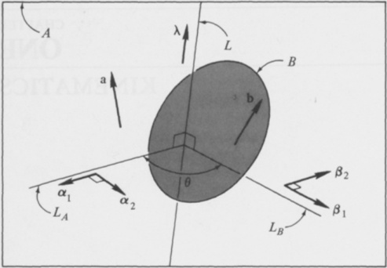
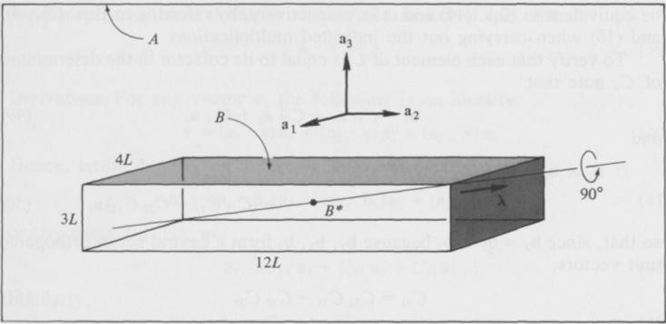

Every spacecraft dynamics problem involves considerations of kinematics. Indeed, the solution of most such problems begins with the formulation of kinematical relationships. Hence, this topic requires detailed attention.

The first nine sections of this chapter deal with changes in the orientation of a rigid body in a reference frame, without regard to the time that necessarily elapses when a real body experiences a change in orientation. Time enters the discussion in the remaining sections, in all of which the concept of angular velocity plays a central role. The concluding section contains the definitions of quantities employed to great advantage, in Chap. 4, in connection with the formulation of dynamical equations of motion of complex spacecraft. This section (and Probs. 1.27–1.31) may be omitted by readers concerned primarily with simple spacecraft, such as those treated in Chap. 3.

# 1.1 SIMPLE ROTATION

A motion of a rigid body or reference frame $B$ relative to a rigid body or reference frame $A$ is called a simple rotation of $B$ in $A$ if there exists a line $L$, called an axis of rotation, whose orientation relative to both $A$ and $B$ remains unaltered throughout the motion. This sort of motion is important because, as will be shown in Sec. 1.3, every change in the relative orientation of $A$ and $B$ can be produced by means of a simple rotation of $B$ in $A$.

If a is any vector fixed in $A$ (see Fig. 1.1.1), and b is a vector fixed in $B$ and equal to a prior to the motion of $B$ in $A$, then, when $B$ has performed a simple rotation in $A$, b can be expressed in terms of the vector a, a unit vector $\lambda$ parallel to $L$, and the radian measure $\theta$ of the angle between two lines, $L_A$ and $L_B$, which are fixed in $A$ and $B$, respectively, are perpendicular to $L$, and are parallel to each other initially. Specifically, if $\theta$ is regarded as

{width=56%} Figure 1.1.1

positive when the angle between $L_{A}$ and $L_{B}$ is generated by a $\lambda$-rotation of $L_{B}$ relative to $L_{A}$, that is, by a rotation during which a right-handed screw fixed in $B$ with its axis parallel to $\lambda$ advances in the direction of $\lambda$ when $B$ rotates relative to $A$, then

$$
\mathbf { b } = \mathbf { a } \cos \theta - \mathbf { a } \times \lambda \, \sin \theta + \mathbf { a } \cdot \lambda \lambda ( 1 - \cos \theta )
$$

Equivalently, if a dyadic C is defined as

$$
\mathbf { C } \triangleq \mathbf { U } \cos \theta - \mathbf { U } \times \lambda \sin \theta + \lambda \lambda ( 1 - \cos \theta )
$$

where $\mathbf{U}$ is the unit (or identity) dyadic, then

$$
\mathbf { b } = \mathbf { a } \cdot \mathbf { C }
$$

Derivations Let $\alpha_{1}$ and $\alpha_{2}$ be unit vectors fixed in $A$, with $\alpha_{1}$ parallel to $L_{A}$ and $\alpha_{2}=\lambda\times\alpha_{1}$; and let $\beta_{1}$ and $\beta_{2}$ be unit vectors fixed in $B$, with $\beta_{1}$ parallel to $L_{B}$ and $\beta_{2}=\lambda\times\beta_{1}$, as shown in Fig. 1.1.1. Then, if $\mathbf{a}$ and $\mathbf{b}$ are resolved into components parallel to $\alpha_{1}$, $\alpha_{2}$, $\lambda$ and $\beta_{1}$, $\beta_{2}$, $\lambda$, respectively, corresponding coefficients are equal to each other because $\alpha_{1}=\beta_{1}$, $\alpha_{2}=\beta_{2}$, and $\mathbf{a}=\mathbf{b}$ when $\theta=0$. In other words, $\mathbf{a}$ and $\mathbf{b}$ can be expressed as

$$
\mathbf { a } = p \alpha _ { 1 } + q \alpha _ { 2 } + r \lambda
$$

and

$$
\mathbf { b } = p \beta _ { 1 } + q \beta _ { 2 } + r \lambda
$$

where $p$, $q$, and $r$ are constants.

Expressed in terms of $\alpha_{1}$ and $\alpha_{2}$, the unit vectors $\beta_{1}$ and $\beta_{2}$ are given by

$$
\beta _ { 1 } \ = \ \cos \theta \ \alpha _ { 1 } \ + \sin \theta \ \alpha _ { 2 }
$$

{width=56%} Figure 1.1.2

and

$$
\beta _ { 2 } = \mathrm { ~ - ~ } \sin \theta \, \alpha _ { 1 } + \cos \theta \, \alpha _ { 2 }
$$

so that, substituting into Eq. (5), one finds that

$$
\mathbf { b } = ( p \ \cos \theta - q \ \sin \theta ) \alpha _ { 1 } + ( p \ \sin \theta + q \ \cos \theta ) \alpha _ { 2 } + r \lambda
$$

The right-hand member of Eq. (8) is precisely what one obtains by carrying out the operations indicated in the right-hand member of Eq. (1), using Eq. (4), and making use of the relationships $\lambda \times \alpha_{1} = \alpha_{2}$ and $\lambda \times \alpha_{2} = -\alpha_{1}$. Thus the validity of Eq. (1) is established, and Eq. (3) follows directly from Eqs. (1) and (2).

Example A rectangular block $B$ having the dimensions shown in Fig. 1.1.2 forms a portion of an antenna structure mounted in a spacecraft $A$. This block is subjected to a simple rotation in $A$ about a diagonal of one face of $B$, the sense and amount of the rotation being those indicated in the sketch. The angle $\phi$ between the line $OP$ in its initial and final positions is to be determined.

If $\mathbf{a}_1$, $\mathbf{a}_2$, and $\mathbf{a}_3$ are unit vectors fixed in $A$ and parallel to the edges of $B$ prior to $B$'s rotation, then a unit vector $\lambda$ directed as shown in the sketch can be expressed as

$$
\lambda = \frac { 3 a _ { 2 } + 4 a _ { 3 } } { 5 }
$$

And if a denotes the position vector of $P$ relative to $O$ prior to $B$'s rotation, then

$$
a = - 2 a _ { 1 } + 4 a _ { 3 }
$$

$$
a \times \lambda = \frac { - 12 a _ { 1 } + 8 a _ { 2 } - 6 a _ { 3 } } { 5 }
$$

and

$$
a \cdot \lambda \lambda = \frac { 48 a _ { 2 } + 64 a _ { 3 } } { 25 }
$$

Consequently, if b is the position vector of $P$ relative to $O$ subsequent to $B$'s rotation,†

$$
\begin{array}{rl} { \mathbf { b } = } & { { } ( - 2 \mathbf { a } _ { 1 } + 4 \mathbf { a } _ { 3 } ) \cos { \frac { \pi } { 6 } } + { \frac { 12 \mathbf { a } _ { 1 } - 8 \mathbf { a } _ { 2 } + 6 \mathbf { a } _ { 3 } } { 5 } } \sin { \frac { \pi } { 6 } } } \\{ } & { { } + { \frac { 48 \mathbf { a } _ { 2 } + 64 \mathbf { a } _ { 3 } } { 25 } } \left( 1 - \cos { \frac { \pi } { 6 } } \right) } \\{ = } & { { } - 0 . 53 2 \mathbf { a } _ { 1 } - 0 . 54 3 \mathbf { a } _ { 2 } + 4 . 40 7 \mathbf { a } _ { 3 } } \end{array}
$$

Since $\phi$ is the angle between a and b,

$$
\cos \phi = { \frac { \mathrm { a } \cdot \mathrm { b } } { | \mathrm { a } | | \mathrm { b } | } }
$$

where $|\mathbf{a}|$ and $|\mathbf{b}|$ denote the (equal) magnitudes of $\mathbf{a}$ and $\mathbf{b}$. Hence

$$
\cos \phi = \frac { ( - 2 ) ( - 0 . 53 2 ) + 4 ( 4 . 40 7 ) } { ( 4 + 16 ) ^{1 / 2} ( 4 + 16 ) ^{1 / 2} } = 0 . 93 5
$$

and $\phi = 20.77^{\circ}$.

# 1.2 DIRECTION COSINES

If $\mathbf{a}_1$, $\mathbf{a}_2$, $\mathbf{a}_3$ and $\mathbf{b}_1$, $\mathbf{b}_2$, $\mathbf{b}_3$ are two dextral sets of orthogonal unit vectors, and nine quantities $C_{ij}$ ($i,j=1,2,3$), called direction cosines, are defined as

$$
C _ { i j } \triangleq \mathbf { a } _ { i } \cdot \mathbf { b } _ { j }  ( i , j = 1 , 2 , 3 )
$$

then the two row matrices [a₁ a₂ a₃] and [b₁ b₂ b₃] are related to each other as follows:

$$
\begin{bmatrix}\mathbf{b}_1&\mathbf{b}_2&\mathbf{b}_3\end{bmatrix}=\begin{bmatrix}\mathbf{a}_1&\mathbf{a}_2&\mathbf{a}_3\end{bmatrix}C
$$

† Numbers beneath signs of equality are intended to direct attention to equations numbered correspondingly.

where $C$ is a square matrix defined as

$$
\begin{array}{rl} { C \triangleq } & { { } \left[ \begin{array}{lll} { C _ { 11 } } & { C _ { 12 } } & { C _ { 13 } } \\{ C _ { 21 } } & { C _ { 22 } } & { C _ { 23 } } \\{ C _ { 31 } } & { C _ { 32 } } & { C _ { 33 } } \end{array} \right] } \end{array}
$$

If a superscript $T$ is used to denote transposition, that is, if $C^T$ is defined as

$$
C ^{\tau} \triangleq \left[ \begin{array}{lll} { { C _ { 11 } } } & { { C _ { 21 } } } & { { C _ { 31 } } } \\{ { C _ { 12 } } } & { { C _ { 22 } } } & { { C _ { 32 } } } \\{ { C _ { 13 } } } & { { C _ { 23 } } } & { { C _ { 33 } } } \end{array} \right]
$$

then Eq. (2) can be replaced with the equivalent relationship

$$
[ \mathbf { a } _ { 1 }  \mathbf { a } _ { 2 }  \mathbf { a } _ { 3 } ] = [ \mathbf { b } _ { 1 }  \mathbf { b } _ { 2 }  \mathbf { b } _ { 3 } ] \, C ^{T}
$$

The matrix $C$, called a direction cosine matrix, can be employed to describe the relative orientation of two reference frames or rigid bodies $A$ and $B$. In that context, it can be advantageous to replace the symbol $C$ with the more elaborate symbol $^4C^B$. In view of Eqs. (2) and (5), one must then regard the interchanging of superscripts as signifying transposition; that is,

$$
{ } ^{B} C ^{A} = ( { } ^{A} C ^{B} ) ^{T}
$$

The direction cosine matrix $C$ plays a role in a number of useful relationships. For example, if $\mathbf{v}$ is any vector and ${}^{A}v_{i}$ and ${}^{B}v_{i}$ ($i = 1, 2, 3$) are defined as

$$
{ } ^{A} \nu _ { i } \triangleq \mathbf { v } \cdot \mathbf { a } _ { i }  ( i = 1 , 2 , 3 )
$$

and

$$
^ B \nu _ { i } \triangleq \mathbf { v } \cdot \mathbf { b } _ { i }  ( i = 1 , 2 , 3 )
$$

while $^{A}v$ and $^{B}v$ denote the row matrices having the elements $^{A}v_{1}$, $^{A}v_{2}$, $^{A}v_{3}$ and $^{B}v_{1}$, $^{B}v_{2}$, $^{B}v_{3}$, respectively, then

$$
B _ { V } = A _ { V } C
$$

Similarly, if $\mathbf{D}$ is any dyadic, and ${}^{A}D_{ij}$ and ${}^{B}D_{ij}$ ($i,j=1,2,3$) are defined as

$$
{ } ^{\mathbf { \nabla} } D _ { i j } \triangleq \mathbf { a } _ { i } \cdot \mathbf { D } \cdot \mathbf { a } _ { j }  ( i , j = 1 , 2 , 3 )
$$

and

$$
^{B} D _ { i j } \triangleq \mathbf { b } _ { i } \cdot \mathbf { D } \cdot \mathbf { b } _ { j }  ( i , j = 1 , 2 , 3 )
$$

while $^{4}D$ and $^{5}D$ denote square matrices having $^{4}D_{ij}$ and $^{6}D_{ij}$, respectively, as the elements in the $i$th rows and $j$th columns, then

$$
{ } ^{B} \mathbf { D } = \mathbf { C } ^{T} { } ^{A} \mathbf { D } \mathbf { C }
$$

Use of the summation convention for repeated subscripts frequently makes it possible to formulate important relationships rather concisely. For example, if $\delta_{ij}$ is defined as

$$
\delta _ { i j } \triangleq 1 - \frac { 1 } { 4 } ( i - j ) ^{2} [ 5 - ( i - j ) ^{2} ]  ( i , j = 1 , 2 , 3 )
$$

so that $\delta_{ij}$ is equal to unity when the subscripts have the same value, and equal to zero when the subscripts have different values, then use of the summation convention permits one to express a set of six relationships governing direction cosines as

$$
C _ { i k } \, C _ { j k } = \delta _ { i j }  ( i , \, j = 1 , \, 2 , \, 3 )
$$

or an equivalent set as

$$
C _ { k i } \; C _ { k j } = \delta _ { i j }  ( i , j = 1 , 2 , 3 )
$$

Alternatively, these relationships can be stated in matrix form as

$$
C \, C ^{\tau} = U
$$

and

$$
C ^{\tau} C = U
$$

where $U$ denotes the unit (or identity) matrix, defined as

$$
\begin{array}{rl} { U \triangleq } & { { } { \left[ \begin{array}{lll} { 1 } & { 0 } & { 0 } \\{ 0 } & { 1 } & { 0 } \\{ 0 } & { 0 } & { 1 } \end{array} \right] } } \end{array}
$$

Each element of the matrix $C$ is equal to its cofactor in the determinant of $C$; and, if $|C|$ denotes this determinant, then

$$
| C | = 1
$$

Consequently, $C$ is an orthogonal matrix, that is, a matrix whose inverse and whose transpose are equal to each other. Moreover,

$$
| C - U | = 0
$$

Hence, unity is an eigenvalue of every direction cosine matrix. In other words, for every direction cosine matrix $C$ there exist row matrices $[\kappa_1 \kappa_2 \kappa_3]$, called eigenvectors, which satisfy the equation

$$
\left[ \begin{array}{lll} { \kappa _ { 1 } } & { \kappa _ { 2 } } & { \kappa _ { 3 } } \end{array} \right] C = \left[ \begin{array}{lll} { \kappa _ { 1 } } & { \kappa _ { 2 } } & { \kappa _ { 3 } } \end{array} \right]
$$

Suppose now that $\mathbf{a}_i$ and $\mathbf{b}_i$ ($i = 1, 2, 3$) are fixed in reference frames or rigid bodies $A$ and $B$, respectively, and that $B$ is subjected to a simple rotation in $A$ (see Sec. 1.1); further, that $\mathbf{a}_i = \mathbf{b}_i$ ($i = 1, 2, 3$) prior to the rotation, that $\lambda$ and $\theta$ are defined as in Sec. 1.1, and that $\lambda_i$ is defined as

$$
\lambda _ { i } \triangleq \lambda \cdot \mathbf { a } _ { i } = \lambda \cdot \mathbf { b } _ { i }  ( i = 1 , 2 , 3 )
$$

Then the elements of $C$ are given by

$$
C _ { 11 } = \cos \theta + \lambda _ { 1 } ^{2} ( 1 - \cos \theta )
$$

$$
C _ { 12 } = - \lambda _ { 3 } \sin \theta + \lambda _ { 1 } \lambda _ { 2 } ( 1 - \cos \theta )
$$

$$
C _ { 13 } = \lambda _ { 2 } \sin \theta + \lambda _ { 3 } \lambda _ { 1 } ( 1 - \cos \theta )
$$

$$
C _ { 21 } = \lambda _ { 3 } \sin \theta + \lambda _ { 1 } \lambda _ { 2 } ( 1 - \cos \theta )
$$

$$
C _ { 22 } = \cos \theta + \lambda _ { 2 } ^{2} ( 1 - \cos \theta )
$$

$$
C _ { 23 } = - \lambda _ { 1 } \sin \theta + \lambda _ { 2 } \lambda _ { 3 } ( 1 - \cos \theta )
$$

$$
C _ { 31 } = - \, \lambda _ { 2 } \sin \theta + \lambda _ { 3 } \lambda _ { 1 } ( 1 - \cos \theta )
$$

$$
C _ { 32 } = \lambda _ { 1 } \sin \theta + \lambda _ { 2 } \lambda _ { 3 } ( 1 - \cos \theta )
$$

$$
C _ { 33 } = \cos \theta + \lambda _ { 3 } ^{2} ( 1 - \cos \theta )
$$

Equations (23)-(31) can be expressed more concisely after defining $\epsilon_{ijk}$ as

$$
\epsilon _ { i j k } \triangleq \frac { 1 } { 2 } \, ( i - j ) ( j - k ) ( k - i )  ( i , j , \, k = 1 , \, 2 , \, 3 )
$$

(The quantity $\epsilon_{ijk}$ vanishes when two or three subscripts have the same value; it is equal to unity when the subscripts appear in cyclic order, that is, in the order 1, 2, 3, the order 2, 3, 1, or the order 3, 1, 2; and it is equal to negative unity in all other cases.) Using the summation convention, one can then replace Eqs. (23)-(31) with

$$
C _ { i j } = \delta _ { i j } \cos \theta - \epsilon _ { i j k } \lambda _ { k } \sin \theta + \lambda _ { i } \lambda _ { j } ( 1 - \cos \theta )  ( i , j = 1 , 2 , 3 )
$$

Alternatively, $C_{ij}$ can be expressed in terms of the dyadic C defined in Eq. (1.1.2):

$$
C _ { i j } = \mathbf { a } _ { i } \cdot \left( \mathbf { a } _ { j } \cdot \mathbf { C } \right)  ( i , j = 1 , 2 , 3 )
$$

All of these results simplify substantially when $\lambda$ is parallel to $\mathbf{a}_i$, and hence to $\mathbf{b}_i$ ($i = 1, 2, 3$). If $C_i(\theta)$ denotes $C$ for $\lambda = \mathbf{a}_i = \mathbf{b}_i$, then

$$
C _ { 1 } ( \theta ) = \left[ \begin{array}{lll} { { 1 } } & { { 0 } } & { { 0 } } \\{ { 0 } } & { { \cos \theta } } & { { - \sin \theta } } \\{ { 0 } } & { { \sin \theta } } & { { \cos \theta } } \end{array} \right]
$$

$$
C _ { 2 } ( \theta ) = \left[ \begin{array}{lll} { { \cos \theta } } & { { 0 } } & { { \sin \theta } } \\{ { 0 } } & { { 1 } } & { { 0 } } \\{ { - \sin \theta } } & { { 0 } } & { { \cos \theta } } \end{array} \right]
$$

$$
C _ { 3 } ( \theta ) = \left[ \begin{array}{lll} { { \cos \theta } } & { { - \sin \theta } } & { { 0 } } \\{ { \sin \theta } } & { { \cos \theta } } & { { 0 } } \\{ { 0 } } & { { 0 } } & { { 1 } } \end{array} \right]
$$

It was mentioned previously that unity is an eigenvalue of every direction cosine matrix. If the elements of a direction cosine matrix $C$ are given by Eqs. (23)-(31), then the row matrix $[\lambda_1 \lambda_2 \lambda_3]$ is one of the eigenvectors corresponding to the eigenvalue unity of $C$; that is,

$$
\left[ \lambda _ { 1 }  \lambda _ { 2 }  \lambda _ { 3 } \right] C = \left[ \lambda _ { 1 }  \lambda _ { 2 }  \lambda _ { 3 } \right]
$$

Equivalently, when C is the dyadic defined in Eq. (1.1.2), then

$$
\lambda \cdot \mathbf { C } = \lambda
$$

Derivations For any vector v, the following is an identity:

$$
\mathbf { v } = ( \mathbf { a } _ { 1 } \cdot \mathbf { v } ) \mathbf { a } _ { 1 } + ( \mathbf { a } _ { 2 } \cdot \mathbf { v } ) \mathbf { a } _ { 2 } + ( \mathbf { a } _ { 3 } \cdot \mathbf { v } ) \mathbf { a } _ { 3 }
$$

Hence, letting $b_{1}$ play the role of $v$, one can express $b_{1}$ as

$$
\mathbf { b } _ { 1 } = ( \mathbf { a } _ { 1 } \cdot \mathbf { b } _ { 1 } ) \mathbf { a } _ { 1 } + ( \mathbf { a } _ { 2 } \cdot \mathbf { b } _ { 1 } ) \mathbf { a } _ { 2 } + ( \mathbf { a } _ { 3 } \cdot \mathbf { b } _ { 1 } ) \mathbf { a } _ { 3 }
$$

or, by using Eq. (1), as

$$
\mathbf { b } _ { 1 } \equiv C _ { 11 } \, \mathbf { a } _ { 1 } + C _ { 21 } \, \mathbf { a } _ { 2 } + C _ { 31 } \, \mathbf { a } _ { 3 }
$$

Similarly,

$$
\mathbf { b } _ { 2 } = C _ { 12 } \ \mathbf { a } _ { 1 } + C _ { 22 } \ \mathbf { a } _ { 2 } + C _ { 32 } \ \mathbf { a } _ { 3 }
$$

and

$$
\mathbf { b } _ { 3 } = C _ { 13 } \, \mathbf { a } _ { 1 } + C _ { 23 } \, \mathbf { a } _ { 2 } + C _ { 33 } \, \mathbf { a } _ { 3 }
$$

These three equations are precisely what one obtains when forming expressions for $\mathbf{b}_{1}$, $\mathbf{b}_{2}$, $\mathbf{b}_{3}$ in accordance with Eq. (2) and with the rules for matrix multiplication; and a similar line of reasoning leads to Eq. (5).

To see that Eq. (9) is valid one needs only to observe that

$$
\begin{aligned}^B\nu_i&=\mathbf{v}\cdot(\mathbf{a}_{1}\:C_{1i}\:+\:\mathbf{a}_{2}\:C_{2i}\:+\:\mathbf{a}_{3}\:C_{3i})\\&=\mathbf{v}\cdot\mathbf{a}_{1}\:C_{1i}+\mathbf{v}\cdot\mathbf{a}_{2}\:C_{2i}+\mathbf{v}\cdot\mathbf{a}_{3}\:C_{3i}\\&={}^{A}\nu_{1}\:C_{1i}+{}^{A}\nu_{2}\:C_{2i}+{}^{A}\nu_{3}\:C_{3i}\end{aligned}
$$

and to recall the definitions of $^{\mathbf{A}}v$ and $^{\mathbf{B}}v$. Similarly, Eq. (12) follows from

$$
\begin{aligned}^BD_{ij}&=(\mathbf{a}_1\:C_{1i}+\mathbf{a}_2\:C_{2i}+\mathbf{a}_3\:C_{3i})\cdot\mathbf{D}\cdot(\mathbf{a}_1\:C_{1j}+\mathbf{a}_2\:C_{2j}+\mathbf{a}_3\:C_{3j})\\&=C_{1i}\:(^AD_{11}\:C_{1j}+^AD_{12}\:C_{2j}+^AD_{13}\:C_{3j})\\&+C_{2i}\:(^AD_{21}\:C_{1j}+^AD_{22}\:C_{2j}+^AD_{23}\:C_{3j})\\&+C_{3i}\:(^AD_{31}\:C_{1j}+^AD_{32}\:C_{2j}+^AD_{33}\:C_{3j})\end{aligned}
$$

and from the definitions of $^{\forall}D$ and $^{\forall}D$.

As for Eqs. (14) and (15), these are consequences of (using the summation convention)

$$
\mathbf { a } _ { i } \cdot \mathbf { a } _ { j } = { \frac { C _ { i k } } { ( 1 , 5 ) } } C _ { j k }  ( i , j = 1 , 2 , 3 )
$$

and

$$
\mathbf { b } _ { i } \cdot \mathbf { b } _ { j } = C _ { k i } \, C _ { k j }  ( i , j = 1 , 2 , 3 )
$$

respectively, because $\mathbf{a}_i \cdot \mathbf{a}_j$ is equal to unity when $i = j$, and equal to zero when $i \neq j$, and similarly for $\mathbf{b}_i \cdot \mathbf{b}_j$; and Eqs. (16) and (17) can be seen to

be equivalent to Eqs. (14) and (15), respectively, by referring to Eqs. (3), (4), and (18) when carrying out the indicated multiplications.

To verify that each element of $C$ is equal to its cofactor in the determinant of $C$, note that

and

$$
\mathbf { b } _ { 1 } \equiv { \frac { C _ { 11 } \ \mathbf { a } _ { 1 } } { ( 2 ) } } + C _ { 21 } \ \mathbf { a } _ { 2 } + C _ { 31 } \ \mathbf { a } _ { 3 }
$$

$$
\begin{array}{rl} { \mathbf { b } _ { 2 } \times \mathbf { b } _ { 3 } = } & { ( C _ { 22 } \; C _ { 33 } - C _ { 32 } \; C _ { 23 } ) \mathbf { a } _ { 1 } + ( C _ { 32 } \; C _ { 13 } - C _ { 12 } \; C _ { 33 } ) \mathbf { a } _ { 2 } } \\& { + ( C _ { 12 } \; C _ { 23 } - C _ { 22 } \; C _ { 13 } ) \mathbf { a } _ { 3 } } \end{array}
$$

so that, since $\mathbf{b}_1 = \mathbf{b}_2 \times \mathbf{b}_3$ because $\mathbf{b}_1$, $\mathbf{b}_2$, $\mathbf{b}_3$ form a dextral set of orthogonal unit vectors,

$$
C _ { 11 } = C _ { 22 } \, C _ { 33 } - C _ { 32 } \, C _ { 23 }
$$

$$
C _ { 21 } = C _ { 32 } \, C _ { 13 } - C _ { 12 } \, C _ { 33 }
$$

and

$$
C _ { 31 } = C _ { 12 } \, C _ { 23 } - C _ { 22 } \, C _ { 13 }
$$

Thus each element in the first column of $C$ [see Eq. (3)] is seen to be equal to its cofactor in $C$; and, using the relationships $\mathbf{b}_2 = \mathbf{b}_3 \times \mathbf{b}_1$ and $\mathbf{b}_3 = \mathbf{b}_1 \times \mathbf{b}_2$, one obtains corresponding results for the elements in the second and third columns of $C$. Furthermore, expanding $C$ by cofactors of elements of the first row, and using Eq. (14) with $i = j = 1$, one arrives at Eq. (19).

The determinant of $C-U$ can be expressed as

$$
\begin{aligned}|C-U|=|C|+C_{11}+C_{22}+C_{33}+C_{12}C_{21}+C_{23}C_{32}+C_{31}C_{13}\\&-(C_{11}C_{22}+C_{22}C_{33}+C_{33}C_{11})-1\end{aligned}
$$

Hence, replacing $C_{11}$, $C_{22}$, and $C_{33}$ with their respective cofactors in $|C|$, one finds that

$$
\left| C - U \right| = \left| C \right| - 1 \stackrel { ( 19 ) } { = } 0
$$

in agreement with Eq. (20); and the existence of row matrices [$\kappa_{1}$ $\kappa_{2}$ $\kappa_{3}$] satisfying Eq. (21) is thus guaranteed.

The equality of $\lambda \cdot \mathbf{a}_i$ and $\lambda \cdot \mathbf{b}_i$ in Eq. (22) is a consequence of the fact that these two quantities are equal to each other prior to the rotation of $B$ relative to $A$, that is, when $\mathbf{a}_i = \mathbf{b}_i$, and that neither $\lambda \cdot \mathbf{a}_i$ nor $\lambda \cdot \mathbf{b}_i$ changes during the rotation, since, by construction, $\lambda$ is parallel to a line whose orientation in both $A$ and $B$ remains unaltered during the rotation.

With a and b replaced by $a_{j}$ and $b_{j}$, respectively, Eq. (1.1.3) becomes

$$
\mathbf { b } _ { j } = \mathbf { a } _ { j } \cdot \mathbf { C }
$$

Hence

$$
C _ { i j } \stackrel { = } { = } \mathbf { a } _ { i } \cdot \mathbf { b } _ { j } \stackrel { = } { = } \mathbf { a } _ { i } \cdot ( \mathbf { a } _ { j } \cdot \mathbf { C } )  ( i , j = 1 , 2 , 3 )
$$

{width=83%} Figure 1.2.1

which is Eq. (34). Moreover, substituting for C the expression given in Eq. (1.1.2), one finds that

$$
C _ { i j } = \mathbf { a } _ { i } \cdot \mathbf { a } _ { j } \cos \theta - \mathbf { a } _ { i } \cdot \mathbf { a } _ { j } \times \lambda \, \sin \theta + \mathbf { a } _ { i } \cdot \lambda \lambda \, \cdot \mathbf { a } _ { j } ( 1 - \cos \theta )
$$

and this, together with Eq. (22) leads directly to Eqs. (23)-(31), or, in view of Eq. (32), to Eq. (33).

Equation (35) is obtained by setting $\lambda_{1}=1$ and $\lambda_{2}=\lambda_{3}=0$ in Eqs. (23)-(31) and then using Eq. (3). Similarly, $\lambda_{1}=0$, $\lambda_{2}=1$, and $\lambda_{3}=0$ lead to Eq. (36), and $\lambda_{1}=\lambda_{2}=0$, $\lambda_{3}=1$ yield Eq. (37).

Finally, Eq. (39) is derived from the observation that†

$$
\begin{array}{rl} { \boldsymbol { \lambda } \cdot \mathbf { C } } & { = \boldsymbol { \lambda } \cdot \mathbf { U } \cos \theta - \boldsymbol { \lambda } \times \boldsymbol { \lambda } \sin \theta + \boldsymbol { \lambda } ^{2} \boldsymbol { \lambda } ( 1 - \cos \theta ) } \\& { = \boldsymbol { \lambda } \cos \theta + 0 + \boldsymbol { \lambda } ( 1 - \cos \theta ) = \boldsymbol { \lambda } } \end{array}
$$

since $\lambda$ is a unit vector, so that $\lambda^2 \triangleq \lambda \cdot \lambda = 1$; and the equivalence of Eqs. (38) and (39) follows from Eqs. (22) and (34).

Example In Fig. 1.2.1, $B$ designates a uniform rectangular block which is part of a scanning platform mounted in a spacecraft $A$. Initially, the edges of $B$ are parallel to unit vectors $\mathbf{a}_1$, $\mathbf{a}_2$ and $\mathbf{a}_3$ which are fixed in $A$, and the platform is then subjected to a simple $90^\circ$ rotation about a diagonal of $B$, as indicated in the sketch. If $\mathbf{I}$ is the inertia dyadic of $B$ for the mass center $B^*$ of $B$, and ${}^A I_{ij}$ is defined as

$$
{ } ^{A} I _ { i j } \triangleq \mathbf { a } _ { i } \cdot \mathbf { I } \cdot \mathbf { a } _ { j }  ( i , j = 1 , 2 , 3 )
$$

what is the value of $^{A}I_{ij}$ ($i,j=1,2,3$) subsequent to the rotation?

Let $\mathbf{b}_{i}$ ($i$=1, 2, 3) be a unit vector fixed in $B$ and equal to $\mathbf{a}_{i}$ ($i$=1, 2, 3) prior to the rotation; and define ${}^{B}I_{ij}$ as

$$
{ } ^{B} \boldsymbol { I } _ { i j } \triangleq \mathbf { b } _ { i } \cdot \mathbf { I } \cdot \mathbf { b } _ { j }  ( i , j = 1 , 2 , 3 )
$$

Then $b_{1}$, $b_{2}$, and $b_{3}$ are parallel to principal axes of inertia of $B$ for $B^{*}$, so that

$$
{ } ^{B} I _ { 12 } = { } ^{B} I _ { 21 } = { } ^{B} I _ { 23 } = { } ^{B} I _ { 32 } = { } ^{B} I _ { 31 } = { } ^{B} I _ { 13 } = 0
$$

and, if $m$ is the mass of $B$,

$$
{ } ^{B} \boldsymbol { I } _ { 11 } = \frac { m } { 12 } \left( 12 ^{2} + 3 ^{2} \right) \boldsymbol { L } ^{2} = \frac { 15 3 } { 12 } \, m \boldsymbol { L } ^{2}
$$

$$
{ } ^{B} I _ { 22 } = \frac { m } { 12 } \ ( 3 ^{2} + 4 ^{2} ) L ^{2} = \frac { 25 } { 12 } \ m L ^{2}
$$

and

$$
{ } ^{B} I _ { 33 } = \frac { m } { 12 } \ ( 4 ^{2} + 12 ^{2} ) L ^{2} = \frac { 16 0 } { 12 } \ m L ^{2}
$$

Hence, if $^{B}I$ denotes the square matrix having $^{B}I_{ij}$ as the element in the $i$th row and $j$th column, then

$$
{ } ^{B} I = \frac { m L ^{2} } { 12 } \left[ \begin{array}{lll} { { 15 3 } } & { { 0 } } & { { 0 } } \\{ { 0 } } & { { 25 } } & { { 0 } } \\{ { 0 } } & { { 0 } } & { { 16 0 } } \end{array} \right]
$$

The unit vector $\lambda$ shown in Fig. 1.2.1 can be expressed as

$$
\lambda = \frac { 4 a _ { 1 } + 12 a _ { 2 } + 3 a _ { 3 } } { ( 4 ^{2} + 12 ^{2} + 3 ^{2} ) ^{1 / 2} } = \frac { 4 } { 13 } \, a _ { 1 } + \frac { 12 } { 13 } \, a _ { 2 } + \frac { 3 } { 13 } \, a _ { 3 }
$$

Consequently, $\lambda_{1}$, $\lambda_{2}$, and $\lambda_{3}$, if defined as in Eq. (22), are given by

$$
\lambda _ { 1 } = \frac { 4 } { 13 }  \lambda _ { 2 } = \frac { 12 } { 13 }  \lambda _ { 3 } = \frac { 3 } { 13 }
$$

and, with $\theta = \pi/2$ rad, Eqs. (23)-(31) lead to the following expression for the direction cosine matrix $C$:

$$
C \equiv \frac { 1 } { ( 3 ) } \left[ \begin{array}{ccc} { { 16 } } & { { 9 } } & { { 16 8 } } \\{ { 87 } } & { { 14 4 } } & { { - 16 } } \\{ { - 14 4 } } & { { 88 } } & { { 9 } } \end{array} \right]
$$

If $^{A}I$ is now defined as the square matrix having $^{A}I_{ij}$ as the element in the $i$th row and $j$th column, then

$$
{ } ^{B} \mathbf { I } _ { ( 12 ) } \equiv C ^{T} { } ^{A} \mathbf { I } \; C
$$

and simultaneous premultiplication with $C$ and postmultiplication with $C^{T}$ gives

$$
C ^{B} I C ^{T} { } _ { ( 70 ) } = C \, C ^{T \, A} I \, C \, C ^{T} = U ^{A} I \, U = U ^{A} I
$$

Consequently,

$$
\begin{aligned}^4I_{(66,69,71)}&\frac{mL^2}{12\times169\times169}\:\begin{bmatrix}16&9&168\\87&144&-16\\-144&88&9\end{bmatrix}\begin{bmatrix}153&0&0\\0&25&0\\0&0&160\end{bmatrix}\begin{bmatrix}16&87&-144\\9&144&88\\168&-16&9\end{bmatrix}\\&=\frac{mL^2}{12\times169\times169}\:\begin{bmatrix}4,557,033&-184,704&-90,792\\-184,704&1,717,417&-1,623,024\\-90,792&-1,623,034&3,379,168\end{bmatrix}&\text{(72}\end{aligned}
$$

and

$$
{ } ^{\lambda} I _ { 11 } = \frac { 4 , 55 7 , 03 3 \ m L ^{2} } { 12 \times 16 9 \times 16 9 }  { } ^{\lambda} I _ { 12 } = - \frac { 18 4 , 70 4 \ m L ^{2} } { 12 \times 16 9 \times 16 9 }
$$

and so forth.

# 1.3 EULER PARAMETERS

The unit vector $\lambda$ and the angle $\theta$ introduced in Sec. 1.1 can be used to associate a vector $\epsilon$, called the Euler vector, and four scalar quantities, $\epsilon_{1}$, $\ldots$, $\epsilon_{4}$, called Euler parameters, with a simple rotation of a rigid body $B$ in a reference frame $A$ by letting

$$
\epsilon \triangleq \lambda \sin { \frac { \theta } { 2 } }
$$

$$
\boldsymbol { \epsilon } _ { i } \triangleq \boldsymbol { \epsilon } \cdot \boldsymbol { a } _ { i } = \boldsymbol { \epsilon } \cdot \boldsymbol { b } _ { i }  ( i = 1 , \, 2 , \, 3 )
$$

and

$$
\epsilon _ { 4 } \triangleq \cos \frac { \theta } { 2 }
$$

where $\mathbf{a}_{1}$, $\mathbf{a}_{2}$, $\mathbf{a}_{3}$ and $\mathbf{b}_{1}$, $\mathbf{b}_{2}$, $\mathbf{b}_{3}$ are dextral sets of orthogonal unit vectors fixed in $A$ and $B$ respectively, with $\mathbf{a}_{i}=\mathbf{b}_{i}$ ($i=1,2,3$) prior to the rotation. (Where a discussion involves more than two bodies or reference frames, notations such as ${}^{A}\boldsymbol{\epsilon}^{B}$ and ${}^{A}\boldsymbol{\epsilon}_{i}^{B}$ will be used.)

The Euler parameters are not independent of each other, for the sum of their squares is necessarily equal to unity:

$$
\epsilon _ { 1 } ^{2} + \epsilon _ { 2 } ^{2} + \epsilon _ { 3 } ^{2} + \epsilon _ { 4 } ^{2} = \epsilon ^{2} + \epsilon _ { 4 } ^{2} = 1
$$

An indication of the utility of the Euler parameters may be gleaned from

the fact that the elements of the direction cosine matrix $C$ introduced in Sec. 1.2 assume a particularly simple and orderly form when expressed in terms of $\epsilon_1, \ldots, \epsilon_4$: If $C_{ij}$ is defined as

$$
C _ { i j } \ { \stackrel { \triangle } { = } } \ { \bf a } _ { i } \ \cdot \ { \bf b } _ { j }  ( i , j = 1 , 2 , 3 )
$$

then

$$
C _ { 11 } = \epsilon _ { 1 } ^{2} - \epsilon _ { 2 } ^{2} - \epsilon _ { 3 } ^{2} + \epsilon _ { 4 } ^{2} = 1 - 2 \epsilon _ { 2 } ^{2} - 2 \epsilon _ { 3 } ^{2}
$$

$$
C _ { 12 } = 2 ( \epsilon _ { 1 } \, \epsilon _ { 2 } - \epsilon _ { 3 } \, \epsilon _ { 4 } )
$$

$$
C _ { 13 } = 2 ( \epsilon _ { 3 } \, \epsilon _ { 1 } + \epsilon _ { 2 } \, \epsilon _ { 4 } )
$$

$$
C _ { 21 } = 2 ( \epsilon _ { 1 } \, \epsilon _ { 2 } + \epsilon _ { 3 } \, \epsilon _ { 4 } )
$$

$$
C _ { 22 } = \epsilon _ { 2 } ^{2} - \epsilon _ { 3 } ^{2} - \epsilon _ { 1 } ^{2} + \epsilon _ { 4 } ^{2} = 1 - 2 \epsilon _ { 3 } ^{2} - 2 \epsilon _ { 1 } ^{2}
$$

$$
C _ { 23 } = 2 ( \epsilon _ { 2 } \, \epsilon _ { 3 } - \epsilon _ { 1 } \, \epsilon _ { 4 } )
$$

$$
C _ { 31 } = 2 ( \epsilon _ { 3 } \, \epsilon _ { 1 } - \epsilon _ { 2 } \, \epsilon _ { 4 } )
$$

$$
C _ { 32 } = 2 ( \epsilon _ { 2 } \, \epsilon _ { 3 } + \epsilon _ { 1 } \, \epsilon _ { 4 } )
$$

$$
C _ { 33 } = \epsilon _ { 3 } ^{2} - \epsilon _ { 1 } ^{2} - \epsilon _ { 2 } ^{2} + \epsilon _ { 4 } ^{2} = 1 - 2 \epsilon _ { 1 } ^{2} - 2 \epsilon _ { 2 } ^{2}
$$

The Euler parameters can be expressed in terms of direction cosines in such a way that Eqs. (6)-(14) are satisfied identically. This is accomplished by taking

$$
\epsilon _ { 1 } = \frac { C _ { 32 } - C _ { 23 } } { 4 \epsilon _ { 4 } }
$$

$$
\epsilon _ { 2 } = \frac { C _ { 13 } - C _ { 31 } } { 4 \epsilon _ { 4 } }
$$

$$
\epsilon _ { 3 } = \frac { C _ { 21 } - C _ { 12 } } { 4 \epsilon _ { 4 } }
$$

and

$$
\epsilon _ { 4 } = \frac { 1 } { 2 } \left( 1 + C _ { 11 } + C _ { 22 } + C _ { 33 } \right) ^{1 / 2}
$$

Since Eqs. (1) and (3) are satisfied if

$$
\lambda = \frac { \epsilon _ { 1 } \, a _ { 1 } + \epsilon _ { 2 } \, a _ { 2 } + \epsilon _ { 3 } \, a _ { 3 } } { ( \epsilon _ { 1 } ^{2} + \epsilon _ { 2 } ^{2} + \epsilon _ { 3 } ^{2} ) ^{1 / 2} }
$$

and

$$
\theta = 2 \cos ^{- 1} \epsilon _ { 4 }  0 \leq \theta \leq \pi
$$

one can thus find a simple rotation such that the direction cosines associated with this rotation as in Eqs. (1.2.23)-(1.2.31) are equal to corresponding ele

ments of any direction cosine matrix $C$ that satisfies Eq. (1.2.2). In other words, every change in the relative orientation of two rigid bodies or reference frames $A$ and $B$ can be produced by means of a simple rotation of $B$ in $A$. This proposition is known as Euler's theorem on rotation.

As an alternative to Eqs. (1.1.1) and (1.1.3), the relationship between a vector a fixed in a reference frame A and a vector b fixed in a rigid body B and equal to a prior to a simple rotation of B in A can be expressed in terms of $\epsilon$ and $\epsilon_4$ as

$$
\mathbf { b } = \mathbf { a } + 2 [ \epsilon _ { 4 } \in \mathbf { \nabla } \times \mathbf { a } + \epsilon \times ( \epsilon \times \mathbf { a } ) ]
$$

Derivations The equality of $\epsilon \cdot \mathbf{a}_i$ and $\epsilon \cdot \mathbf{b}_i$ [see Eq. (2)] follows from Eqs. (1) and (1.2.22); Eqs. (4) are consequences of Eqs. (1)-(3) and of the fact that $\lambda$ is a unit vector; and Eqs. (6)-(14) can be obtained from Eqs. (1.2.23)-(1.2.31) by replacing functions of $\theta$ with functions of $\theta/2$ and using Eq. (1.2.22) together with Eqs. (1)-(4). For example,

$$
C _ { 11 } \ { \stackrel { = } { = } } \ 2 \, \cos ^{2} { \frac { \theta } { 2 } } - 1 + 2 \lambda _ { 1 } ^{2} \, \sin ^{2} { \frac { \theta } { 2 } }
$$

and

$$
\lambda _ { 1 } \sin { \frac { \theta } { 2 } } \underset { ( 1 . 2 . 22 ) } { = } \lambda \cdot \mathbf { a } _ { 1 } \sin { \frac { \theta } { 2 } } \underset { ( 1 ) } { = } \boldsymbol { \epsilon } \cdot \mathbf { a } _ { 1 } \underset { ( 2 ) } { = } \boldsymbol { \epsilon } _ { 1 }
$$

while

$$
\cos { \frac { \theta } { 2 } } \stackrel { ( 3 ) } { = } \epsilon _ { 4 }
$$

Hence,

$$
C _ { 11 } = 2 \epsilon _ { 4 } ^{2} - 1 + 2 \epsilon _ { 1 } ^{2} = \epsilon _ { 1 } ^{2} - \epsilon _ { 2 } ^{2} - \epsilon _ { 3 } ^{2} + \epsilon _ { 4 } ^{2}
$$

in agreement with Eq. (6).

The validity of Eqs. (15)-(18) can be established by showing that the left-hand members of Eqs. (6)-(14) may be obtained by substituting from Eqs. (15)-(18) into the right-hand members. For example,

$$
\begin{aligned} & 1 - 2 \epsilon _ { 2 } ^{2} - 2 \epsilon _ { 3 } ^{2} \\= & \frac { 2 ( 1 + C _ { 11 } + C _ { 22 } + C _ { 33 } ) - C _ { 13 } ^{2} + 2 C _ { 13 } \, C _ { 31 } - C _ { 31 } ^{2} - C _ { 21 } ^{2} + 2 C _ { 12 } \, C _ { 21 } - C _ { 12 } ^{2} } { 2 ( 1 + C _ { 11 } + C _ { 22 } + C _ { 33 } ) } \\= & \frac { C _ { 11 } + C _ { 22 } + C _ { 33 } + C _ { 13 } \, C _ { 31 } + C _ { 12 } \, C _ { 21 } + C _ { 11 } ^{2} } { 1 + C _ { 11 } + C _ { 22 } + C _ { 33 } } \end{aligned} \tag{2}
$$

But, since each element of $C$ is equal to its cofactor in $|C|$,

$$
C _ { 13 } \, C _ { 31 } = C _ { 11 } \, C _ { 33 } - C _ { 22 }
$$

and

$$
C _ { 12 } \, C _ { 21 } = C _ { 11 } \, C _ { 22 } - C _ { 33 }
$$