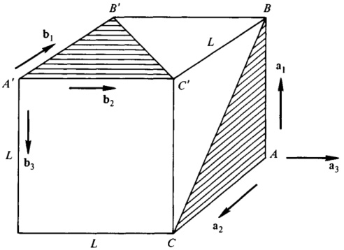
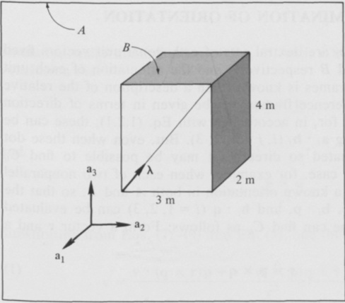
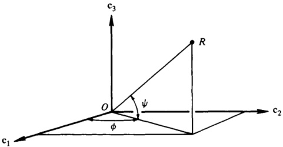
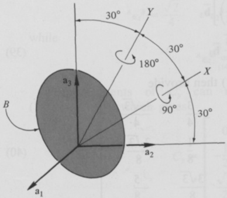

Consequently,

$$
1 - 2 \epsilon _ { 2 } ^{2} - 2 \epsilon _ { 3 } ^{2} = \frac { C _ { 11 } + C _ { 11 } \, C _ { 33 } + C _ { 11 } \, C _ { 22 } + C _ { 11 } ^{2} } { 1 + C _ { 11 } + C _ { 22 } + C _ { 33 } } = C _ { 11 }
$$

as required by Eq. (6).

To see that Eqs. (1) and (3) are satisfied if $\lambda$ and $\theta$ are given by Eqs. (19) and (20), note that

$$
\cos \frac { \theta } { 2 } \stackrel { ( 20 ) } { = } \epsilon _ { 4 }
$$

which is Eq. (3), and that

$$
\sin { \frac { \theta } { 2 } } \stackrel { ( 20 ) } { = } ( 1 - \epsilon _ { 4 } ^{2} ) ^{1 / 2} \stackrel { ( 4 ) } { = } ( \epsilon _ { 1 } ^{2} + \epsilon _ { 2 } ^{2} + \epsilon _ { 3 } ^{2} ) ^{1 / 2}
$$

so that

$$
\lambda \sin { \frac { \theta } { 2 } } \equiv \epsilon _ { 1 } \, \mathbf { a } _ { 1 } + \epsilon _ { 2 } \, \mathbf { a } _ { 2 } + \epsilon _ { 3 } \, \mathbf { a } _ { 3 } \equiv \epsilon _ { ( 2 ) }
$$

as required by Eq. (1). Finally, Eq. (1.1.1) is equivalent to

$$
\begin{array}{rl} & { \mathbf { b } = \mathbf { a } + \lambda \times \mathbf { a } \sin \theta + \lambda \times ( \lambda \times \mathbf { a } ) ( 1 - \cos \theta ) } \\& { = \mathbf { a } + 2 \epsilon \times \mathbf { a } \cos \frac { \theta } { 2 } + 2 \epsilon \times ( \epsilon \times \mathbf { a } ) = \mathbf { a } + 2 \left[ \epsilon _ { 4 } \, \epsilon \times \mathbf { a } + \epsilon \times ( \epsilon \times \mathbf { a } ) \right] } \end{array}
$$

in agreement with Eq. (21).

Example Triangle ABC in Fig. 1.3.1 can be brought into the position $A'B'C'$ by moving point $A$ to $A'$, without changing the orientation of the triangle, and then performing a simple rotation of the triangle while keeping $A$ fixed at $A'$. To find $\lambda$, a unit vector parallel to the axis of rotation, and to determine $\theta$, the associated angle of rotation, let the unit vectors $\mathbf{a}_i$ and $\mathbf{b}_i$ ($i = 1, 2, 3$) be directed as shown in Fig. 1.3.1, thus insuring that $\mathbf{a}_i = \mathbf{b}_i$ ($i = 1, 2, 3$) prior to the rotation; determine $C_{ij}$ by evaluating $\mathbf{a}_i \cdot \mathbf{b}_j$; and use Eqs. (15)-(18) to form $\epsilon_i$ ($i = 1, \ldots, 4$):

$$
\begin{aligned} \epsilon _ { 4 } & = \frac { 1 } { ( 18 ) } \frac { 1 } { 2 } \left( 1 + \mathbf { a } _ { 1 } \cdot \mathbf { b } _ { 1 } + \mathbf { a } _ { 2 } \cdot \mathbf { b } _ { 2 } + \mathbf { a } _ { 3 } \cdot \mathbf { b } _ { 3 } \right) ^{1 / 2} \\& = \frac { 1 } { 2 } \left( 1 + 0 + 0 + 0 \right) ^{1 / 2} = \frac { 1 } { 2 } \end{aligned}
$$

$$
\epsilon _ { 1 } \stackrel { ( 15 ) } { = } \frac { \mathbf { a } _ { 3 } \cdot \mathbf { b } _ { 2 } - \mathbf { a } _ { 2 } \cdot \mathbf { b } _ { 3 } } { 4 \left( \frac { 1 } { 2 } \right) } = \frac { 1 - 0 } { 2 } = \frac { 1 } { 2 }
$$

$$
\epsilon _ { 2 } = \frac { \mathbf { a } _ { 1 } \cdot \mathbf { b } _ { 3 } - \mathbf { a } _ { 3 } \cdot \mathbf { b } _ { 1 } } { 4 \left( \frac { 1 } { 2 } \right) } = \frac { - 1 - 0 } { 2 } = - \frac { 1 } { 2 }
$$

{width=55%} Figure 1.3.1

$$
\epsilon _ { 3 } = \frac { \mathbf { a } _ { 2 } \cdot \mathbf { b } _ { 1 } - \mathbf { a } _ { 1 } \cdot \mathbf { b } _ { 2 } } { 4 \left( \frac { 1 } { 2 } \right) } = \frac { - 1 - 0 } { 2 } = - \frac { 1 } { 2 }
$$

Then

$$
\lambda \equiv \frac { \frac { 1 } { 2 } \, a _ { 1 } - \frac { 1 } { 2 } \, a _ { 2 } - \frac { 1 } { 2 } \, a _ { 3 } } { \left( \frac { 3 } { 4 } \right) ^{1 / 2} } = \frac { a _ { 1 } - a _ { 2 } - a _ { 3 } } { \sqrt { 3 } }
$$

and

$$
\theta _ { ( 20 ) } = 2 \cos ^{- 1} \frac { 1 } { 2 } = \frac { 2 \pi } { 3 } \mathrm { r a d }
$$

# 1.4 RODRIGUES PARAMETERS

A vector $\boldsymbol{\rho}$, called the Rodrigues vector, and three scalar quantities, $\rho_{1}$, $\rho_{2}$, $\rho_{3}$, called Rodrigues parameters, can be associated with a simple rotation of a rigid body $B$ in a reference frame $A$ (see Sec. 1.1) by letting

$$
\rho \triangleq \lambda \tan { \frac { \theta } { 2 } }
$$

and

$$
\rho _ { i } \triangleq \rho \cdot \mathbf { a } _ { i } = \rho \cdot \mathbf { b } _ { i }  ( i = 1 , 2 , 3 )
$$

where $\lambda$ and $\theta$ have the same meaning as in Sec. 1.1, and $\mathbf{a}_1$, $\mathbf{a}_2$, $\mathbf{a}_3$ and $\mathbf{b}_1$, $\mathbf{b}_2$, $\mathbf{b}_3$ are dextral sets of orthogonal unit vectors fixed in $A$ and $B$, respectively.

tively, with $\mathbf{a}_{i}=\mathbf{b}_{i}$ ($i=1,2,3$) prior to the rotation. (When a discussion involves more than two bodies or reference frames, notations such as ${}^{4}\rho^{B}$ and ${}^{4}\rho_{i}^{B}$ will be used.)

The Rodrigues parameters are intimately related to the Euler parameters (see Sec. 1.3):

$$
\rho _ { i } = \frac { \epsilon _ { i } } { \epsilon _ { 4 } }  ( i = 1 , \, 2 , \, 3 )
$$

An advantage of the Rodrigues parameters over the Euler parameters is that they are fewer in number; but this advantage is at times offset by the fact that the Rodrigues parameters can become infinite, whereas the absolute value of any Euler parameter cannot exceed unity.

Expressed in terms of Rodrigues parameters, the direction cosine matrix $C$ (see Sec. 1.2) assumes the form

$$
\left[ \begin{array}{lll} { { 1 + \rho _ { 1 } ^{2} - \rho _ { 2 } ^{2} - \rho _ { 3 } ^{2} } } & { { 2 ( \rho _ { 1 } \ \rho _ { 2 } - \rho _ { 3 } ) } } & { { 2 ( \rho _ { 3 } \ \rho _ { 1 } + \rho _ { 2 } ) } } \\{ { 2 ( \rho _ { 1 } \ \rho _ { 2 } + \rho _ { 3 } ) } } & { { 1 + \rho _ { 2 } ^{2} - \rho _ { 3 } ^{2} - \rho _ { 1 } ^{2} } } & { { 2 ( \rho _ { 2 } \ \rho _ { 3 } - \rho _ { 1 } ) } } \\{ { 2 ( \rho _ { 3 } \ \rho _ { 1 } - \rho _ { 2 } ) } } & { { 2 ( \rho _ { 2 } \ \rho _ { 3 } + \rho _ { 1 } ) } } & { { 1 + \rho _ { 3 } ^{2} - \rho _ { 1 } ^{2} - \rho _ { 2 } ^{2} } } \end{array} \right]
$$

$$
1 + \rho _ { 1 } ^{2} + \rho _ { 2 } ^{2} + \rho _ { 3 } ^{2}
$$

The Rodrigues vector can be used to establish a simple relationship between the difference and the sum of the vectors a and b defined in Sec. 1.1:

$$
\mathbf { a } - \mathbf { b } = ( \mathbf { a } + \mathbf { b } ) \times \boldsymbol { \rho }
$$

This relationship will be found useful in connection with a number of derivations, such as the one showing that the following is an expression for a Rodrigues vector that characterizes a simple rotation by means of which a specified change in the relative orientation of $A$ and $B$ can be produced:

$$
\rho = \frac { ( \alpha _ { 1 } - \beta _ { 1 } ) \times ( \alpha _ { 2 } - \beta _ { 2 } ) } { ( \alpha _ { 1 } + \beta _ { 1 } ) \cdot ( \alpha _ { 2 } - \beta _ { 2 } ) }
$$

where $\alpha_{i}$ and $\beta_{i}$ ($i=1,2$) are vectors fixed in $A$ and $B$, respectively, and $\alpha_{i}=\beta_{i}$ ($i=1,2$) prior to the change in relative orientation. Rodrigues parameters for such a rotation can be expressed as

$$
\rho _ { 1 } = \frac { C _ { 32 } - C _ { 23 } } { 1 + C _ { 11 } + C _ { 22 } + C _ { 33 } }
$$

$$
\rho _ { 2 } = \frac { C _ { 13 } - C _ { 31 } } { 1 + C _ { 11 } + C _ { 22 } + C _ { 33 } }
$$

$$
\rho _ { 3 } = \frac { C _ { 21 } - C _ { 12 } } { 1 + C _ { 11 } + C _ { 22 } + C _ { 33 } }
$$

Derivations The equality of $\rho \cdot \mathbf{a}_i$ and $\rho \cdot \mathbf{b}_i$ [see Eq. (2)] follows from Eqs. (1) and (1.2.22); and Eqs. (3) are obtained by noting that

$$
\frac { \epsilon } { \epsilon _ { 4 } } = \lambda \tan \frac { \theta } { 2 } = \rho
$$

so that

$$
\rho _ { i } \equiv \frac { \epsilon \cdot a _ { i } } { \epsilon _ { 4 } } = \frac { \epsilon _ { i } } { \epsilon _ { 4 } }  ( i = 1 , 2 , 3 )
$$

From Eq. (1.3.4),

$$
\mathbf { 1 } = \epsilon _ { 1 } ^{2} + \epsilon _ { 2 } ^{2} + \epsilon _ { 3 } ^{2} + \epsilon _ { 4 } ^{2} = ( \rho _ { 1 } ^{2} + \rho _ { 2 } ^{2} + \rho _ { 3 } ^{2} + \mathbf { 1 } ) \epsilon _ { 4 } ^{2}
$$

Hence,

$$
\epsilon _ { 4 } ^{2} = \frac { 1 } { 1 + \rho _ { 1 } ^{2} + \rho _ { 2 } ^{2} + \rho _ { 3 } ^{2} }
$$

and

$$
\begin{aligned} C _ { 11 } & = \epsilon _ { 1 } ^{2} - \epsilon _ { 2 } ^{2} - \epsilon _ { 3 } ^{2} + \epsilon _ { 4 } ^{2} = \rho _ { 1 } ^{2} \epsilon _ { 4 } ^{2} - \rho _ { 2 } ^{2} \epsilon _ { 4 } ^{2} - \rho _ { 3 } ^{2} \epsilon _ { 4 } ^{2} + \epsilon _ { 4 } ^{2} \\& = ( \rho _ { 1 } ^{2} - \rho _ { 2 } ^{2} - \rho _ { 3 } ^{2} + 1 ) \epsilon _ { 4 } ^{2} = \frac { \rho _ { 1 } ^{2} - \rho _ { 2 } ^{2} - \rho _ { 3 } ^{2} + 1 } { 1 + \rho _ { 1 } ^{2} + \rho _ { 2 } ^{2} + \rho _ { 3 } ^{2} } \end{aligned}
$$

in agreement with Eq. (4), and the remaining elements of $C$ are found similarly.

As for Eq. (5), note that cross-multiplication of Eq. (1.3.21) with $\epsilon$ yields

$$
\epsilon \times \mathbf { b } = \epsilon \times \mathbf { a } + 2 \left\{ \epsilon _ { 4 } \in \times \left( \epsilon \times \mathbf { a } \right) + \epsilon \times \left[ \epsilon \times \left( \epsilon \times \mathbf { a } \right) \right] \right\}
$$

Hence,

$$
\begin{array}{rl} { \mathbf { \epsilon } \times ( \mathbf { a } + \mathbf { b } ) = \mathbf { \epsilon } \times \mathbf { a } + \mathbf { \epsilon } \times \mathbf { b } } & { { } } \\{ = 2 \left\{ \mathbf { \epsilon } \times \mathbf { a } + \mathbf { \epsilon } _ { 4 } \mathbf { \epsilon } \times \left( \mathbf { \epsilon } \times \mathbf { a } \right) + \mathbf { \epsilon } \times \left[ \mathbf { \epsilon } \times \left( \mathbf { \epsilon } \times \mathbf { a } \right) \right] \right\} } & { { } } \end{array}
$$

Now

$$
\begin{array}{rl} { \epsilon \times \left[ \epsilon \times ( \epsilon \times \mathbf { a } ) \right] = - \epsilon ^{2} \, \epsilon \times \mathbf { a } } & { { } = - ( \epsilon _ { 1 } ^{2} + \epsilon _ { 2 } ^{2} + \epsilon _ { 3 } ^{2} ) \epsilon \times \mathbf { a } } \\{ = } & { { } ( \epsilon _ { 4 } ^{2} - 1 ) \epsilon \times \mathbf { a } } \end{array}
$$

Consequently,

$$
\epsilon \times ( \mathbf { a } + \mathbf { b } ) \underset { ( 16 , 17 ) } { = } 2 \epsilon _ { 4 } \left[ \epsilon _ { 4 } \, \epsilon \times \mathbf { a } + \epsilon \times ( \epsilon \times \mathbf { a } ) \right] \underset { ( 1 . 3 . 21 ) } { = } \epsilon _ { 4 } ( \mathbf { b } - \mathbf { a } )
$$

and

$$
\mathbf { a } - \mathbf { b } = ( \mathbf { a } + \mathbf { b } ) \times { \frac { \epsilon } { \epsilon _ { 4 } } } = ( \mathbf { a } + \mathbf { b } ) \times \lambda \, \tan { \frac { \theta } { 2 } } = ( \mathbf { a } + \mathbf { b } ) \times \rho
$$

which is Eq. (5).

Equation (6) can now be obtained by observing that

and

$$
\alpha _ { 1 } - \beta _ { 1 } = { \frac { ( \alpha _ { 1 } + \beta _ { 1 } ) } { ( 5 ) } } \times \rho
$$

$$
\alpha _ { 2 } - \beta _ { 2 } = \frac { ( \alpha _ { 2 } + \beta _ { 2 } ) } { ( 5 ) } \times \rho
$$

so that

$$
\begin{aligned}(\alpha_1-\beta_1)\times(\alpha_2-\beta_2)&=[(\alpha_1+\beta_1)\times\rho]\times(\alpha_2-\beta_2)\\&=(\alpha_1+\beta_1)\cdot(\alpha_2-\beta_2)\rho-(\alpha_1+\beta_1)\rho\cdot(\alpha_2-\beta_2)\\&=(\alpha_1+\beta_1)\cdot(\alpha_2-\beta_2)\rho-0\end{aligned}
$$

from which Eq. (6) follows immediately.

Finally, to establish the validity of Eqs. (7)-(9), note that

$$
\rho _ { 1 } \stackrel { ( 3 ) } { = } \frac { \epsilon _ { 1 } } { \epsilon _ { 4 } } \stackrel { ( 1 . 3 . 15 ) } { = } \frac { C _ { 32 } - C _ { 23 } } { 4 \epsilon _ { 4 } ^{2} } \stackrel { ( 1 . 3 . 18 ) } { = } \frac { C _ { 32 } - C _ { 23 } } { 1 + C _ { 11 } + C _ { 22 } + C _ { 33 } }
$$

in agreement with Eq. (7); and Eqs. (8) and (9) can be obtained by cyclic permutation of the subscripts in Eq. (7).

Example Referring to Fig. 1.4.1, which depicts the rigid body $B$ previously considered in the example in Sec. 1.1, suppose that $B$ is subjected to a 180° rotation relative to $A$ about an axis parallel to the unit vector $\lambda$; and let $\mathbf{b}_i$ be a unit vector fixed in $B$ and equal to $\mathbf{a}_i$ ($i = 1, 2, 3$) prior to the rotation. The direction cosine matrix $C$ satisfying Eq. (1.2.2) subsequent to the rotation is to be determined.

For $\theta=\pi$ rad, Eq. (1) yields a Rodrigues vector of infinite magnitude, and Eqs. (2) and (4) lead to an indeterminate form of $C$. To evaluate this

{width=55%} Figure 1.4.1

indeterminate form, one may express each element of $C$ in terms of $\theta$ and $\lambda \cdot \mathbf{a}_i$ ($i = 1, 2, 3$) by reference to Eqs. (1) and (2), and then determine the limit approached by the resulting expression as $\theta$ approaches $\pi$ rad. Alternatively, one can use either Eqs. (1.2.23)-(1.2.31) or Eqs. (1.3.6)-(1.3.14) to find the elements of $C$. The latter equations are particularly convenient, because, for $\theta = \pi$,

$$
\epsilon = \lambda _ { ( 1 . 3 . 1 ) }
$$

so that

$$
\epsilon _ { i } \stackrel { = } { = } \lambda \cdot \mathbf { a } _ { i }  ( i = 1 , 2 , 3 )
$$

and

$$
\epsilon _ { 4 } = 0 _ { ( 1 . 3 . 3 ) }
$$

Hence, with

$$
\lambda = \frac { 3 } { 5 } a _ { 2 } + \frac { 4 } { 5 } a _ { 3 }
$$

one finds immediately that

$$
\epsilon _ { 1 } = 0  \epsilon _ { 2 } = \frac { 3 } { 5 }  \epsilon _ { 3 } = \frac { 4 } { 5 }
$$

and substitution into Eqs. (1.3.6)-(1.3.14) then gives

$$
C = { \frac { 1 } { 25 } } { \left[ \begin{array}{lll} { - 25 } & { 0 } & { 0 } \\{ 0 } & { - 7 } & { 24 } \\{ 0 } & { 24 } & { 7 } \end{array} \right] }
$$

# 1.5 INDIRECT DETERMINATION OF ORIENTATION

If $\mathbf{a}_{1}$, $\mathbf{a}_{2}$, $\mathbf{a}_{3}$, and $\mathbf{b}_{1}$, $\mathbf{b}_{2}$, $\mathbf{b}_{3}$ are dextral sets of orthogonal unit vectors fixed in reference frames $A$ and $B$ respectively, and the orientation of each unit vector in both reference frames is known, then a description of the relative orientation of the two reference frames can be given in terms of direction cosines $C_{ij}$ ($i,j=1,2,3$), for, in accordance with Eq. (1.2.1), these can be found by simply evaluating $\mathbf{a}_{i}\cdot\mathbf{b}_{j}$ ($i,j=1,2,3$). But, even when these dot products cannot be evaluated so directly, it may be possible to find $C_{ij}$ ($i,j=1,2,3$). This is the case, for example, when each of two nonparallel vectors, say $\mathbf{p}$ and $\mathbf{q}$, has a known orientation in both $A$ and $B$, so that the dot products $\mathbf{a}_{i}\cdot\mathbf{p}$, $\mathbf{a}_{i}\cdot\mathbf{q}$, $\mathbf{b}_{i}\cdot\mathbf{p}$, and $\mathbf{b}_{i}\cdot\mathbf{q}$ ($i=1,2,3$) can be evaluated directly. In that event, one can find $C_{ij}$ as follows: Form a vector $\mathbf{r}$ and a dyadic $\sigma$ by letting

$$
\mathrm { r } \triangleq \mathrm { p } \times \mathrm { q }
$$

and

$$
\sigma \triangleq { \frac { \mathbf { p } \times \mathbf { q r } + \mathbf { q } \times \mathbf { r p } + \mathbf { r } \times \mathbf { p q } } { \mathbf { r } ^{2} } }
$$

Next, express the first member of each dyad in Eq. (2) in terms of $\mathbf{a}_i$, and the second member in terms of $\mathbf{b}_i$ ($i = 1, 2, 3$). Finally, carry out the multiplications indicated in the relationship

$$
C _ { i j } = \mathbf { a } _ { i } \cdot \mathbf { \sigma } \cdot \mathbf { b } _ { j }  ( i , j = 1 , 2 , 3 )
$$

Derivation It will be shown that the dyadic $\sigma$ defined in Eq. (2) is a unit dyadic, that is, that for every vector $\mathbf{v}$,

$$
\mathbf { v } = \mathbf { v } \cdot \sigma
$$

The validity of Eq. (3) can then be seen to be an immediate consequence of the definition of $C_{ij}$, given in Eq. (1.2.1).

If $\mathbf{p}$ and $\mathbf{q}$ are nonparallel, and $\mathbf{r}$ is defined as in Eq. (1), then every vector $\mathbf{v}$ can be expressed as

$$
\mathbf { v } = \alpha \mathbf { p } + \beta \mathbf { q } + \gamma \mathbf { r }
$$

where $\alpha$, $\beta$, and $\gamma$ are certain scalars. From Eq. (5),

$$
{ \begin{array}{rl} { \mathbf { v } \cdot ( \mathbf { q } \times \mathbf { r } ) = \alpha \mathbf { p } \cdot ( \mathbf { q } \times \mathbf { r } ) + \beta \mathbf { q } \cdot ( \mathbf { q } \times \mathbf { r } ) + \gamma \mathbf { r } \cdot ( \mathbf { q } \times \mathbf { r } ) } \\{ = \alpha ( \mathbf { p } \times \mathbf { q } ) \cdot \mathbf { r } + 0 + 0 = { \frac { 1 } { ( 1 ) } } \alpha \mathbf { r } ^{2} } \end{array} }
$$

so that

$$
\alpha \equiv \mathbf { v } \cdot { \frac { \mathbf { q } \times \mathbf { r } } { \mathbf { r } ^{2} } }
$$

Similarly, scalar multiplication of Eq. (5) with $r \times p$ and $p \times q$ leads to the conclusion that

$$
\beta = v \cdot \frac { r \times p } { r ^{2} }
$$

and

$$
\gamma = v \cdot \frac { p \times q } { r ^{2} }
$$

Substituting from Eqs. (7)-(9) into Eq. (5), one thus finds that

$$
\begin{array}{rl} { \mathbf { v } = { \frac { \mathbf { v } \cdot ( \mathbf { q } \times \mathbf { r } ) \mathbf { p } + \mathbf { v } \cdot ( \mathbf { r } \times \mathbf { p } ) \mathbf { q } + \mathbf { v } \cdot ( \mathbf { p } \times \mathbf { q } ) \mathbf { r } } { \mathbf { r } ^{2} } } } \\{ = \mathbf { v } \cdot { \frac { ( \mathbf { q } \times \mathbf { r } \mathbf { p } + \mathbf { r } \times \mathbf { p } \mathbf { q } + \mathbf { p } \times \mathbf { q } \mathbf { r } ) } { \mathbf { r } ^{2} } } = \mathbf { v } \cdot \sigma } \end{array}  ( 2 )
$$

{width=54%} Figure 1.5.1

Example Observations of two stars, $P$ and $Q$, are made simultaneously from two space vehicles, $A$ and $B$, in order to generate data to be used in the determination of the relative orientation of $A$ and $B$. The observations consist of measuring the angles $\phi$ and $\psi$ shown in Fig. 1.5.1, where $O$ represents either a point fixed in $A$ or a point fixed in $B$, $R$ is either $P$ or $Q$, and $\mathbf{c}_1$, $\mathbf{c}_2$, $\mathbf{c}_3$ are orthogonal unit vectors forming a dextral set fixed either in $A$ or $B$. For the numerical values of these angles given in Table 1.5.1, the direction cosine matrix $C$ is to be determined.

If $\mathbf{R}$ is defined as a unit vector directed from $O$ toward $R$ (see Fig. 1.5.1), then

$$
\mathbf { R } \ = \ \cos \psi \cos \phi \, \mathbf { c } _ { 1 } \ + \ \cos \psi \sin \phi \, \mathbf { c } _ { 2 } \ + \ \sin \psi \, \mathbf { c } _ { 3 }
$$

Hence, letting $\mathbf{p}$ and $\mathbf{q}$ be unit vectors directed from $O$ toward $P$ and toward $Q$, respectively, and referring to Table 1.5.1, one can express each of these unit vectors both in terms of $\mathbf{a}_1$, $\mathbf{a}_2$, $\mathbf{a}_3$ and in terms of $\mathbf{b}_1$, $\mathbf{b}_2$, $\mathbf{b}_3$, as indicated in lines 1 and 2 of Table 1.5.2; and these results can then be used to evaluate $\mathbf{r}$ [see Eq. (1)], $\mathbf{q} \times \mathbf{r}$, and $\mathbf{r} \times \mathbf{p}$. Noting that (see line 3 of Table 1.5.2)

$$
\mathbf { r } ^{2} = { \frac { 2 } { 16 } } + { \frac { 6 } { 16 } } + { \frac { 6 } { 16 } } = { \frac { 7 } { 8 } }
$$

Table 1.5.1 Angles $\phi$ and $\psi$ in degrees

|  | P | Q |
| --- | --- | --- |
| $φ$ | $ψ$ | $φ$ | $ψ$ |
| c i =a i | 90 | 45 | 30 | 0 |
| c i =b i | 135 | 0 | 90 | 60 |

Table 1.5.2 Vectors appearing in $\sigma$

| Line | Vector | a 1 | a 2 | a 3 | b 1 | b 2 | b 3 |
| --- | --- | --- | --- | --- | --- | --- | --- |
| 1 | p | 0 | 0.22/2 | 0.22/2 | -0.22/2 | 0.22/2 | 0 |
| 2 | q | 0.22/2 | $1/2$ | 0 | 0 | $1/2$ | 0.22/2 |
| 3 | r = p x q | -0.22/4 | 0.64/4 | -0.64/4 | 0.64/4 | 0.64/4 | -0.22/4 |
| 4 | q x r | -0.64/8 | 3.22/8 | 0.22/2 | -0.22/2 |  |  |
| 5 | r x p | 0.22/2 | $1/4$ | $-1/4$ |  |  |  |

one thus obtains

$$
\begin{aligned} \boldsymbol { \sigma } & = \left[ \left( - \frac { \sqrt { 2 } } { 4 } \mathbf { a } _ { 1 } + \frac { \sqrt { 6 } } { 4 } \mathbf { a } _ { 2 } - \frac { \sqrt { 6 } } { 4 } \mathbf { a } _ { 3 } \right) \left( \frac { \sqrt { 6 } } { 4 } \mathbf { b } _ { 1 } + \frac { \sqrt { 6 } } { 4 } \mathbf { b } _ { 2 } - \frac { \sqrt { 2 } } { 4 } \mathbf { b } _ { 3 } \right) \right. \\& + \left. \left( - \frac { \sqrt { 6 } } { 8 } \mathbf { a } _ { 1 } + \frac { 3 \sqrt { 2 } } { 8 } \mathbf { a } _ { 2 } + \frac { \sqrt { 2 } } { 2 } \mathbf { a } _ { 3 } \right) \left( - \frac { \sqrt { 2 } } { 2 } \mathbf { b } _ { 1 } + \frac { \sqrt { 2 } } { 2 } \mathbf { b } _ { 2 } + 0 \mathbf { b } _ { 3 } \right) \right. \\& + \left. \left( \frac { \sqrt { 3 } } { 2 } \mathbf { a } _ { 1 } + \frac { 1 } { 4 } \mathbf { a } _ { 2 } - \frac { 1 } { 4 } \mathbf { a } _ { 3 } \right) \left( 0 \mathbf { b } _ { 1 } + \frac { 1 } { 2 } \mathbf { b } _ { 2 } + \frac { \sqrt { 3 } } { 2 } \mathbf { b } _ { 3 } \right) \right] / \frac { 7 } { 8 } \end{aligned}
$$

and

$$
C _ { 11 } = \mathbf { a } _ { 1 } \cdot \mathbf { \sigma } \cdot \mathbf { b } _ { 1 } = \left( - { \frac { \sqrt { 2 } } { 4 } } { \frac { \sqrt { 6 } } { 4 } } + { \frac { \sqrt { 6 } } { 8 } } { \frac { \sqrt { 2 } } { 2 } } \right) \Bigg / { \frac { 7 } { 8 } } = \mathbf { 0 }
$$

$$
{ \boldsymbol { C } } _ { 12 } = { \boldsymbol { a } } _ { 1 } \cdot { \boldsymbol { \sigma } } \cdot { \boldsymbol { b } } _ { 2 } = \left( - { \frac { \sqrt { 2 } } { 4 } } { \frac { \sqrt { 6 } } { 4 } } - { \frac { \sqrt { 6 } } { 8 } } { \frac { \sqrt { 2 } } { 2 } } + { \frac { \sqrt { 3 } } { 2 } } { \frac { 1 } { 2 } } \right) \Bigg / { \frac { 7 } { 8 } } = 0
$$

$$
{ \boldsymbol { C } } _ { 13 } = { \boldsymbol { a } } _ { 1 } \cdot { \boldsymbol { \sigma } } \cdot { \boldsymbol { b } } _ { 3 } = \left( { \frac { \sqrt { 2 } } { 4 } } { \frac { \sqrt { 2 } } { 4 } } + { \frac { \sqrt { 3 } } { 2 } } { \frac { \sqrt { 3 } } { 2 } } \right) \Bigg / { \frac { 7 } { 8 } } = 1
$$

and so forth; that is,

$$
C = { \left[ \begin{array}{lll} { 0 } & { 0 } & { 1 } \\{ 0 } & { 1 } & { 0 } \\{ - 1 } & { 0 } & { 0 } \end{array} \right] }
$$

# 1.6 SUCCESSIVE ROTATIONS

When a rigid body $B$ is subjected to two successive simple rotations (see Sec. 1.1) in a reference frame $A$, each of these rotations, as well as a single equivalent rotation (see Sec. 1.3), can be described in terms of direction

cosines (see Sec. 1.2), Euler parameters (see Sec. 1.3), and Rodrigues parameters (see Sec. 1.4); and, no matter which method of description is employed, quantities associated with the individual rotations can be related to those characterizing the single equivalent rotation. In discussing such relationships, it is helpful to introduce a fictitious rigid body $\bar{B}$ which moves exactly like $B$ during the first rotation, but remains fixed in $A$ while $B$ performs the second rotation. For analytical purposes, the first rotation can then be regarded as a rotation of $\bar{B}$ relative to $A$, and the second rotation as one of $B$ relative to $\bar{B}$.

If $\mathbf{a}_{i}$ ($i=1,2,3$), $\mathbf{b}_{i}$ ($i=1,2,3$), and $\overline{\mathbf{b}}_{i}$ ($i=1,\underline{2},3$) are three dextral sets of orthogonal unit vectors fixed in $A$, $B$, and $B$, respectively, such that $\mathbf{a}_{i}=\mathbf{b}_{i}=\overline{\mathbf{b}}_{i}$ ($i=1,2,3$) prior to the first rotation of $B$ in $A$, and if ${}^{A}C^{\overline{B}}$, $\overline{B}C^{B}$, and ${}^{A}C^{B}$ are the direction cosine matrices characterizing, respectively, the first, the second, and the single equivalent rotation, so that

$$
\begin{bmatrix} \overline { { \mathbf { b } } } _ { 1 } & \overline { { \mathbf { b } } } _ { 2 } & \overline { { \mathbf { b } } } _ { 3 } ] = \left[ \begin{array}{lll} { \mathbf { a } _ { 1 } } & { \mathbf { a } _ { 2 } } & { \mathbf { a } _ { 3 } } \end{array} \right] ^{\mathsf { A} } C ^{\overline { { B} } } \end{bmatrix}
$$

$$
[ \mathbf { b } _ { 1 }  \mathbf { b } _ { 2 }  \mathbf { b } _ { 3 } ] = [ \overline { { \mathbf { b } } } _ { 1 }  \overline { { \mathbf { b } } } _ { 2 }  \overline { { \mathbf { b } } } _ { 3 } ] \, \overline { { B } } C ^{B}
$$

and

$$
[ \mathbf { b } _ { 1 }  \mathbf { b } _ { 2 }  \mathbf { b } _ { 3 } ] = [ \mathbf { a } _ { 1 }  \mathbf { a } _ { 2 }  \mathbf { a } _ { 3 } ] ^{A} C ^{B}
$$

then $^{\wedge}C^{B}$, expressed in terms of $^{\wedge}C^{\mathcal{B}}$ and $^{\mathcal{B}}C^{B}$, is given by

$$
^{A} C ^{B} = ^{A} C ^{B} E ^{B} C ^{B}
$$

Similarly, for Rodrigues vectors,

$$
{ } ^{A} \rho ^{B} = \frac { { } ^{A} \rho ^{\overline { { { B} } } } + { } ^{\overline { { { B} } } } \rho ^{B} + { } ^{\overline { { { B} } } } \rho ^{B} \times { } ^{A} \rho ^{\overline { { { B} } } } } { 1 - { } ^{A} \rho ^{\overline { { { B} } } } \cdot { } ^{\overline { { { B} } } } \rho ^{B} }
$$

To state the analogous relationship in terms of Euler parameters, we first define three sets of such parameters as follows: With $\mathbf{b}_i$ and $\mathbf{b}_i$ ($i = 1, 2, 3$) directed as after the second rotation, and with $\theta_1$, $\theta_2$, and $\theta$ denoting respectively the radian measures of the first, the second, and the equivalent rotation,

$$
A _ { \epsilon _ { i } ^{\prime} } \ { \overset { \triangleq } { = } } \ A _ { \epsilon _ { i } ^{\prime} } \cdot \ a _ { i } = A _ { \epsilon _ { i } ^{\prime} } \cdot \overline { { { b } } } _ { i }  ( i = 1 , 2 , 3 )
$$

$$
\overline { { { B } } } _ { \epsilon _ { i } ^{B} } \triangleq \overline { { { B } } } _ { \epsilon ^{B} } \cdot \overline { { { \mathbf { b } } } } _ { i } = \overline { { { B } } } _ { \epsilon ^{B} } \cdot \mathbf { b } _ { i }  ( i = 1 , 2 , 3 )
$$

$$
^{A} \epsilon _ { i } ^{B} \ { \overset { \triangle } { = } } \ \ ^{A} \epsilon ^{B} \cdot \ { \mathbf { a } } _ { i } = ^{A} \epsilon ^{B} \cdot { \mathbf { b } } _ { i }  ( i = 1 , 2 , 3 )
$$

$$
\mathbf { \nabla } ^{A} \epsilon _ { 4 } ^{\overline { { { B} } } } \triangleq \cos { \frac { \theta _ { 1 } } { 2 } }
$$

$$
\overline { { { B } } } _ { \epsilon _ { 4 } ^{B} } \triangleq \cos \frac { \theta _ { 2 } } { 2 }
$$

$$
A _ { \epsilon _ { 4 } } { \overset { \Delta } { = } } \cos { \frac { \theta } { 2 } }
$$

It then follows that

$$
\left[ \begin{array}{l} { { A \epsilon _ { 1 } ^{B} } } \\{ { A \epsilon _ { 2 } ^{B} } } \\{ { A \epsilon _ { 3 } ^{B} } } \\{ { A \epsilon _ { 4 } ^{B} } } \end{array} \right] = \left[ \begin{array}{llll} { { A \epsilon _ { 4 } ^{\overline { { { B} } } } } } & { { - A \epsilon _ { 3 } ^{\overline { { { B} } } } } } & { { A \epsilon _ { 2 } ^{\overline { { { B} } } } } } & { { A \epsilon _ { 1 } ^{\overline { { { B} } } } } } \\{ { A \epsilon _ { 3 } ^{\overline { { { B} } } } } } & { { A \epsilon _ { 4 } ^{\overline { { { B} } } } } } & { { - A \epsilon _ { 1 } ^{\overline { { { B} } } } } } & { { A \epsilon _ { 2 } ^{\overline { { { B} } } } } } \\{ { - A \epsilon _ { 2 } ^{\overline { { { B} } } } } } & { { A \epsilon _ { 1 } ^{\overline { { { B} } } } } } & { { A \epsilon _ { 4 } ^{\overline { { { B} } } } } } & { { A \epsilon _ { 3 } ^{\overline { { { B} } } } } } \\{ { - A \epsilon _ { 1 } ^{\overline { { { B} } } } } } & { { - A \epsilon _ { 2 } ^{\overline { { { B} } } } } } & { { - A \epsilon _ { 3 } ^{\overline { { { B} } } } } } & { { A \epsilon _ { 4 } ^{\overline { { { B} } } } } } \end{array} \right] \left[ \begin{array}{l} { { \overline { { { B } } } \epsilon _ { 1 } ^{B} } } \\{ { \overline { { { B } } } \epsilon _ { 2 } ^{B} } } \\{ { \overline { { { B } } } \epsilon _ { 3 } ^{B} } } \\{ { \overline { { { B } } } \epsilon _ { 4 } ^{B} } } \end{array} \right]
$$

Furthermore,

$$
{ } ^{A} \epsilon ^{B} = { } ^{A} \epsilon ^{\overline { { { B} } } } \; \overline { { { B } } } \; \epsilon _ { 4 } ^{B} + \overline { { { B } } } \; \epsilon ^{B} { } ^{A} \; \epsilon _ { 4 } ^{\overline { { { B} } } } + \overline { { { B } } } \; \epsilon ^{B} \; \times { } ^{A} \epsilon ^{\overline { { { B} } } }
$$

and

$$
A _ { \epsilon _ { 4 } ^{B} } = A _ { \epsilon _ { 4 } ^{\overline { { { B} } } } \overline { { { B } } } _ { \epsilon _ { 4 } ^{B} } } - A _ { \epsilon _ { 4 } ^{\overline { { { B} } } } \cdot \overline { { { B } } } _ { \epsilon _ { 4 } ^{B} } }
$$

Equations (4), (5), (12), and (13) all reflect the fact that the final orientation of $B$ in $A$ depends upon the order in which the successive rotations are performed. For example, in Eq. (4), ${}^{A}C^{\overline{B}}$ and ${}^{\overline{B}}C^{B}$ cannot be interchanged without altering the result, and in Eq. (13) the presence of a cross product shows that order cannot be left out of account.

Repeated use of Eqs. (4)-(14) permits one to construct formulas for quantities characterizing a single rotation that is equivalent to any number of successive rotations. For example, for three successive rotations,

$$
{ } ^{\Lambda} C ^{B} = { } ^{A} C ^{\bar { B} } \; \bar { B } C ^{\bar { B} } \; \bar { B } C ^{B}
$$

where $^{A}C^{\bar{B}}$, $^{B}C^{\bar{B}}$, and $\bar{B}C^{B}$ are direction cosine matrices associated with the first, the second, and the third rotation, respectively.

Derivations Substitution from Eq. (1) into Eq. (2) gives

$$
\left[ \mathbf { b } _ { 1 }  \mathbf { b } _ { 2 }  \mathbf { b } _ { 3 } \right] = \left[ \mathbf { a } _ { 1 }  \mathbf { a } _ { 2 }  \mathbf { a } _ { 3 } \right] ^{A} C ^{\overline { { { B} } } } \; \overline { { { B } } } C ^{B}
$$

and comparison of this equation with Eq. (3) shows that Eq. (4) is valid.

To obtain Eq. (5), let a, b, and b be vectors fixed in $A$, $\overline{B}$, and $B$, respectively, and choose these in such a way that a = $\overline{b}$ = b prior to the first rotation of $B$ in $A$. Then, in accordance with Eq. (1.4.5), there exist Rodrigues vectors ${}^{A}\rho^{\overline{B}}$, ${}^{\overline{B}}\rho^{B}$, and ${}^{A}\rho^{B}$ satisfying the equations

$$
\mathbf { a } - \overline { { \mathbf { b } } } = ( \mathbf { a } + \overline { { \mathbf { b } } } ) \times \mathbf { \nabla } ^{\mathbf { A} } \rho ^{\overline { { \mathbf { B} } } }
$$

$$
\overline { { \mathbf { b } } } - \mathbf { b } = ( \overline { { \mathbf { b } } } + \mathbf { b } ) \times \overline { { \mathbf { B } } } \rho ^{B}
$$

and

$$
\mathbf { a } - \mathbf { b } = ( \mathbf { a } + \mathbf { b } ) \times \mathbf { \nabla } ^{\mathbf { A} } \rho ^{\mathbf { B} }
$$

Cross-multiply Eqs. (17) and (18) with $\bar{B}\rho^{B}$ and ${}^{A}\rho\bar{B}$, respectively; subtract the resulting equations; and use the fact that

$$
{ } ^{A} \rho ^{\overline { { { B} } } } \cdot { \bf a } = { } ^{A} \rho ^{\overline { { { B} } } } \cdot { \bf \overline { { { b } } } }
$$

and

$$
{ \overline { { B } } } \, \rho ^{B} \, \cdot \, { \overline { { \mathbf { b } } } } = { \overline { { B } } } \, \rho ^{B} \, \cdot \, \mathbf { b }
$$

to eliminate $\overline{\mathbf{b}}$ wherever it appears as a member of a scalar product. This leads to

$$
\begin{array}{r} { \overline { { \mathbf { b } } } \times ( ^{A} \mathbf { \rho } ^{\overline { { B} } } + ^{\overline { { B} } } \mathbf { \rho } ^{B} ) = \mathbf { a } \times ^{\overline { { B} } } \mathbf { \rho } ^{B} + \mathbf { b } \times ^{A} \mathbf { \rho } ^{\overline { { B} } } + ( \mathbf { a } - \mathbf { b } ) ^{A} \mathbf { \rho } ^{\overline { { B} } } \cdot ^{\overline { { B} } } \mathbf { \rho } ^{B} } \\{ + ( \mathbf { a } + \mathbf { b } ) \times ( ^{\overline { { B} } } \mathbf { \rho } ^{B} \times ^{A} \mathbf { \rho } ^{\overline { { B} } } ) } \end{array}
$$

Next, add Eqs. (17) and (18), eliminate $\overline{\mathbf{b}}$ by using Eq. (22), and solve for $\mathbf{a}-\mathbf{b}$, thus obtaining

$$
\mathbf { a } - \mathbf { b } = ( \mathbf { a } + \mathbf { b } ) \times \frac { \mathbf { A } } { 1 - \mathbf { A } } \frac { \boldsymbol { \rho } ^{\overline { { B} } } + \overline { { { B } } } \boldsymbol { \rho } ^{B} + \overline { { { B } } } \boldsymbol { \rho } ^{B} \times \mathbf { A } } { \overline { { { B } } } \cdot \overline { { { B } } } }
$$

Together, Eqs. (23) and (19) imply the validity of Eq. (5), for Eqs. (23) and (19) can be satisfied for all choices of the vector a only if Eq. (5) is satisfied.

As for Eqs. (13) and (14), note that it follows from Eqs. (1.3.1), (1.3.3), and (1.4.1) that

$$
{ } ^{A} \rho ^{\overline { { { B} } } } = \frac { { } ^{A} \epsilon ^{\overline { { { B} } } } } { { } ^{A} \epsilon _ { 4 } ^{\overline { { { B} } } } }
$$

$$
{ \bar { B } } \rho ^{B} = { \frac { \bar { B } \epsilon ^{B} } { \bar { B } \epsilon _ { 4 } ^{B} } }
$$

and

$$
{ } ^{A} \rho ^{B} = \frac { A \, \epsilon _ { B } ^{B} } { A \, \epsilon _ { 4 } ^{B} }
$$

Consequently,

$$
\begin{aligned} ^{A} & \epsilon _ { ( 26 ) } ^{B} = \epsilon _ { 4 } ^{A} \epsilon _ { 4 } ^{B} \rho _ { ( 5 ) } ^{B} = \epsilon _ { 4 } ^{A} \epsilon _ { 4 } ^{B} \frac { A ^{\prime} \rho _ { B } ^{\prime} + \overline { { { B } } } ^{\prime} \rho ^{B} + \overline { { { B } } } ^{\prime} \rho ^{B} \times A ^{\prime} \rho _ { B } ^{\prime} } { 1 - A ^{\prime} \rho ^{B} \cdot \overline { { { B } } } \rho ^{B} } \\& = \epsilon _ { 4 } ^{A} \epsilon _ { 4 } ^{B} \frac { A ^{\prime} \epsilon _ { 4 } ^{\overline { { { B} } } } \overline { { { B } } } \epsilon _ { 4 } ^{B} + \overline { { { B } } } ^{\prime} \epsilon _ { 4 } ^{B} \epsilon _ { 4 } ^{B} + \overline { { { B } } } ^{\prime} \epsilon _ { 4 } ^{B} \times A ^{\prime} \epsilon _ { 4 } ^{\overline { { { B} } } } } { A ^{\prime} \epsilon _ { 4 } ^{B} \overline { { { B } } } ^{B} \epsilon _ { 4 } ^{B} - A ^{\prime} \epsilon _ { 4 } ^{B} \cdot \overline { { { B } } } ^{B} \epsilon _ { 4 } ^{B} } \end{aligned}
$$

and, dot-multiplying each side of this equation with itself and using Eq. (1.3.4), one finds that

$$
( A \epsilon ^{B} ) ^{2} = ( A \epsilon _ { 4 } ^{B} ) ^{2} \, \frac { 1 - ( A \epsilon _ { 4 } ^{\overline { { { A} } } } \epsilon _ { 4 } ^{\overline { { { B} } } } \epsilon _ { 4 } ^{B} - A \epsilon _ { 4 } ^{\overline { { { B} } } } \cdot \overline { { { B } } } \epsilon _ { 4 } ^{B} ) ^{2} } { ( A \epsilon _ { 4 } ^{\overline { { { B} } } } \epsilon _ { 4 } ^{B} - A \epsilon _ { 4 } ^{\overline { { { B} } } } \cdot \overline { { { B } } } \epsilon _ { 4 } ^{B} ) ^{2} }
$$

But,

$$
( ^{A} \epsilon ^{B} ) ^{2} = 1 - ( ^{A} \epsilon _ { 4 } ^{B} ) ^{2}
$$

Hence,

$$
( A \epsilon _ { 4 } B ) ^{2} = \frac { ( A \epsilon _ { 4 } \bar { B } \; \bar { B } \epsilon _ { 4 } B - A \epsilon _ { 4 } ^{\bar { B} } \; \bar { B } \epsilon _ { 4 } B ) ^{2} } { ( 28 , 29 ) }
$$

and

$$
{ } ^{A} \epsilon _ { 4 } ^{B} = \pm \left( { } ^{A} \epsilon _ { 4 } { } ^{\overline { { { B} } } } { } ^{\overline { { { B} } } } \epsilon _ { 4 } { } ^{B} - { } ^{A} \epsilon _ { 4 } ^{\overline { { { B} } } } \cdot { } ^{\overline { { { B} } } } \epsilon _ { 4 } { } ^{B} \right)
$$

so that, using the upper sign, one obtains Eq. (14). Furthermore, substitution into Eq. (27) then yields Eq. (13).

Finally, to establish the validity of Eq. (12), it suffices to show that the four scalar equations implied by this matrix equation can be derived from Eqs. (13) and (14). To this end, one may employ Eqs. (6) and (7) to resolve the right-hand member of Eq. (13) into components parallel to $\mathbf{b}_{1}$, $\mathbf{b}_{2}$, and $\mathbf{b}_{3}$ and then dot-multiply both sides of the resulting equation successively with $\mathbf{b}_{1}$, $\mathbf{b}_{2}$, and $\mathbf{b}_{3}$, using Eq. (8) to evaluate ${}^{A} \boldsymbol{\epsilon}^{B} \cdot \mathbf{b}_{i}$ and Eqs. (1.3.6)–(1.3.14) to form $\mathbf{b}_{i} \cdot \mathbf{b}_{j}$, which gives, for example,

$$
\overline { { \mathbf { b } } } _ { 2 } \cdot \mathbf { b } _ { 3 } = 2 ( \overline { { B } } \epsilon _ { 2 } ^{B} \overline { { B } } \epsilon _ { 3 } ^{B} - \overline { { B } } \epsilon _ { 1 } ^{B} \overline { { B } } \epsilon _ { 4 } ^{B} )
$$

In this way one is led to the first three scalar equations corresponding to Eq. (12), and the fourth is obtained from Eq. (14) by making the substitution

$$
A \, \epsilon ^{\overline { { B} } } \, \cdot \, \, \overline { { { B } } } \, \epsilon ^{B} = { } ^{A} \epsilon _ { 1 } ^{\overline { { B} } } \, \overline { { { B } } } \, \epsilon _ { 1 } ^{B} + { } ^{A} \epsilon _ { 2 } ^{\overline { { B} } } \, \overline { { { B } } } \, \epsilon _ { 2 } ^{B} + { } ^{A} \epsilon _ { 3 } ^{\overline { { B} } } \, \overline { { { B } } } \, \epsilon _ { 3 } ^{B}
$$

Example In Fig. 1.6.1, $\mathbf{a}_{1}$, $\mathbf{a}_{2}$, and $\mathbf{a}_{3}$ are mutually perpendicular unit vectors; $X$ and $Y$ are lines perpendicular to $\mathbf{a}_{1}$ and making fixed angles with $\mathbf{a}_{2}$ and $\mathbf{a}_{3}$; and $B$ designates a body that is to be subjected to a 90° rotation about line $X$ and a 180° rotation about line $Y$, the sense of each of these rotations being that indicated in the sketch.

Suppose that the rotation about $X$ is performed first. Then, if $\mathbf{b}_1$, $\mathbf{b}_2$, and $\mathbf{b}_3$ are unit vectors fixed in $B$ and respectively equal to $\mathbf{a}_1$, $\mathbf{a}_2$, and $\mathbf{a}_3$ prior to the first rotation, there exists a matrix $C_x$ such that, subsequent to the second rotation of $B$,

$$
\left[ \begin{array}{lll} { \mathbf { b } _ { 1 } } & { \mathbf { b } _ { 2 } } & { \mathbf { b } _ { 3 } } \end{array} \right] = \left[ \begin{array}{lll} { \mathbf { a } _ { 1 } } & { \mathbf { a } _ { 2 } } & { \mathbf { a } _ { 3 } } \end{array} \right] C _ { x }
$$

{width=44%} Figure 1.6.1

Similarly, if the rotation about $Y$ is performed first, there exists a matrix $C_y$ such that, subsequent to the second rotation of $B$,

$$
[ \mathbf { b } _ { 1 }  \mathbf { b } _ { 2 }  \mathbf { b } _ { 3 } ] = [ \mathbf { a } _ { 1 }  \mathbf { a } _ { 2 }  \mathbf { a } _ { 3 } ] C _ { y }
$$

$C_{x}$ and $C_{y}$ are to be determined.

In order to find $C_{x}$ by using Eq. (4), one may first form ${}^{A}C^{B}$ by reference to Eqs. (1.2.23)-(1.2.31) with $\theta=\pi/2$ and

$$
\lambda _ { 1 } = 0  \lambda _ { 2 } = \frac { \sqrt { 3 } } { 2 }  \lambda _ { 3 } = \frac { 1 } { 2 }
$$

which gives

$$
{ } ^{A} C ^{\overline { { { B} } } } = \left[ \begin{array}{ccc} { { 0 } } & { { - \frac { 1 } { 2 } } } & { { \frac { \sqrt { 3 } } { 2 } } } \\{ { \frac { 1 } { 2 } } } & { { \frac { 3 } { 4 } } } & { { \frac { \sqrt { 3 } } { 4 } } } \\{ { \frac { - \sqrt { 3 } } { 2 } } } & { { \frac { \sqrt { 3 } } { 4 } } } & { { \frac { 1 } { 4 } } } \end{array} \right]
$$

Next, to construct the matrix $\overline{B}C^{B}$, one must express a unit vector $\lambda$ which is parallel to $Y$ in terms of suitable unit vectors $\overline{\mathbf{b}}_{1}$, $\overline{\mathbf{b}}_{2}$ and $\overline{\mathbf{b}}_{3}$. This is accomplished by noting that $\lambda$, resolved into components parallel to $\mathbf{a}_{1}$, $\mathbf{a}_{2}$, and $\mathbf{a}_{3}$, is given by

$$
\lambda = \frac { 1 } { 2 } \, \mathbf { a } _ { 2 } + \frac { \sqrt { 3 } } { 2 } \, \mathbf { a } _ { 3 }
$$

so that, using Eq. (1.2.9) and $^{A}C^{\overline{B}}$, one obtains

$$
{ \begin{array}{rl} & { \lambda = \left[ { \frac { 1 } { 2 } } { \Big ( } { \frac { 1 } { 2 } } { \Big ) } + { \frac { \sqrt { 3 } } { 2 } } { \Big ( } - { \frac { \sqrt { 3 } } { 2 } } { \Big ) } \right] \, { \overline { { \mathbf { b } } } } _ { 1 } + \left[ { \frac { 1 } { 2 } } \, { \Big ( } { \frac { 3 } { 4 } } { \Big ) } + { \frac { \sqrt { 3 } } { 2 } } { \Big ( } { \frac { \sqrt { 3 } } { 4 } } { \Big ) } \right] \, { \overline { { \mathbf { b } } } } _ { 2 } } \\& {  + \, \left[ { \frac { 1 } { 2 } } { \Big ( } { \frac { \sqrt { 3 } } { 4 } } { \Big ) } + { \frac { \sqrt { 3 } } { 2 } } { \Big ( } { \frac { 1 } { 4 } } { \Big ) } \right] \, { \overline { { \mathbf { b } } } } _ { 3 } } \\{ = } & { - \, { \frac { 1 } { 2 } } \, { \overline { { \mathbf { b } } } } _ { 1 } + { \frac { 3 } { 4 } } \, { \overline { { \mathbf { b } } } } _ { 2 } + { \frac { \sqrt { 3 } } { 4 } } \, { \overline { { \mathbf { b } } } } _ { 3 } } \end{array} }
$$

With $\theta=\pi$, Eqs. (1.2.23)-(1.2.31) then provide

$$
{ \bar { B } } C ^{B} = { \left[ \begin{array}{lll} { - { \frac { 1 } { 2 } } } & { - { \frac { 3 } { 4 } } } & { { \frac { - { \sqrt { 3 } } } { 4 } } } \\{ - { \frac { 3 } { 4 } } } & { { \frac { 1 } { 8 } } } & { { \frac { 3 { \sqrt { 3 } } } { 8 } } } \\{ - { \frac { \sqrt { 3 } } { 4 } } } & { { \frac { 3 { \sqrt { 3 } } } { 8 } } } & { - { \frac { 5 } { 8 } } } \end{array} \right] }
$$

Consequently,

$$
{ \cal C } _ { x } \equiv \ ^{\wedge} { \cal C } ^{\overline { { { B} } } } \ \overline { { { B } } } { \cal C } ^{B} \ = \ \left[ \begin{array}{ccc} { { 0 } } & { { \frac { 1 } { 2 } } } & { { \frac { - \sqrt { 3 } } { 2 } } } \\{ { - 1 } } & { { 0 } } & { { 0 } } \\{ { 0 } } & { { \frac { \sqrt { 3 } } { 2 } } } & { { \frac { 1 } { 2 } } } \end{array} \right]
$$

$C_{y}$ can be found similarly. Alternatively, one may use Euler parameters, proceeding as follows:

With $\lambda$ expressed in terms of $\mathbf{a}_{1}$, $\mathbf{a}_{2}$, and $\mathbf{a}_{3}$, and with $\theta=\pi$, Eq. (1.3.1) gives

$$
{ } ^{A} \epsilon ^{\overline { { { B} } } } = \frac { 1 } { 2 } \, a _ { 2 } + \frac { \sqrt { 3 } } { 2 } \, a _ { 3 }
$$

and, from Eq. (1.3.3),

$$
A _ { \epsilon _ { 4 } \overline { { { B } } } } = 0
$$

Similarly, for the second rotation

$$
{ \overline { { B } } } \epsilon _ { ( 1 . 3 . 1 ) } ^{B} \left( { \frac { \sqrt { 3 } } { 2 } } \; \mathbf { a } _ { 2 } + { \frac { 1 } { 2 } } \; \mathbf { a } _ { 3 } \right) { \frac { \sqrt { 2 } } { 2 } }
$$

and

$$
{ \overline { { B } } } \epsilon _ { 4 } ^{B} \ { \overset { ( 1 . 3 . 3 ) } { = } } \ { \frac { \sqrt { 2 } } { 2 } }
$$

Hence,

$$
{ } ^{A} \epsilon _ { ( 13 ) } ^{B} = \left( \frac { 1 } { 2 } \; \mathbf { a } _ { 2 } + \frac { \sqrt { 3 } } { 2 } \; \mathbf { a } _ { 3 } \right) \frac { \sqrt { 2 } } { 2 } + 0 + \frac { \sqrt { 2 } } { 4 } \; \mathbf { a } _ { 1 }
$$

so that, in accordance with Eq. (8),

$$
A _ { \epsilon _ { 1 } ^{B} } = \frac { \sqrt { 2 } } { 4 }  A _ { \epsilon _ { 2 } ^{B} } = \frac { \sqrt { 2 } } { 4 }  A _ { \epsilon _ { 3 } ^{B} } = \frac { \sqrt { 6 } } { 4 }
$$

while

$$
A _ { \epsilon _ { 4 } ^{B} } = - \frac { \sqrt { 6 } } { 4 }
$$

The elements of $C_y$ can now be obtained by using Eqs. (1.3.6)-(1.3.14), which gives

$$
C _ { y } = { \left[ \begin{array}{lll} { 0 } & { 1 } & { 0 } \\{ - { \frac { 1 } { 2 } } } & { 0 } & { { \frac { \sqrt { 3 } } { 2 } } } \\{ { \frac { \sqrt { 3 } } { 2 } } } & { 0 } & { { \frac { 1 } { 2 } } } \end{array} \right] }
$$