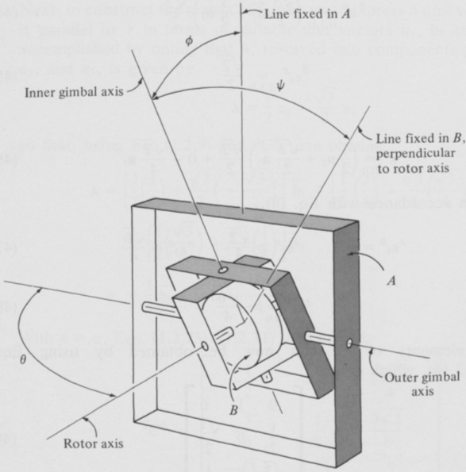
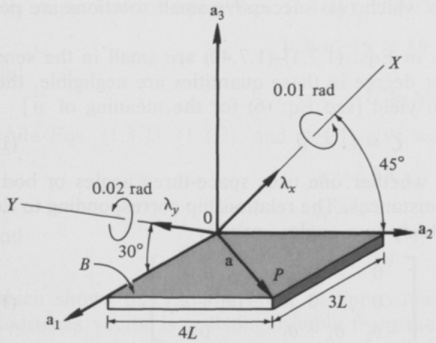
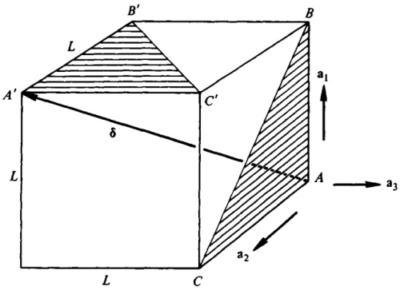

# 1.7 ORIENTATION ANGLES

Both for physical and for analytical reasons it is sometimes desirable to describe the orientation of a rigid body $B$ in a reference frame $A$ in terms of three angles. For example, if $B$ is the rotor of a gyroscope whose outer gimbal axis is fixed in a reference frame $A$, then the angles $\phi$, $\theta$, and $\psi$ shown in Fig. 1.7.1 furnish a means for describing the orientation of $B$ in $A$ in a way that is particularly meaningful from a physical point of view.

One scheme for bringing a rigid body $B$ into a desired orientation in a reference frame $A$ is to introduce $\mathbf{a}_1$, $\mathbf{a}_2$, $\mathbf{a}_3$ and $\mathbf{b}_1$, $\mathbf{b}_2$, $\mathbf{b}_3$ as dextral sets of orthogonal unit vectors fixed in $A$ and $B$, respectively; align $\mathbf{b}_i$ with $\mathbf{a}_i$ ($i=1,2,3$); and subject $B$ successively to an $\mathbf{a}_1$ rotation of amount $\theta_1$, an $\mathbf{a}_2$ rotation of amount $\theta_2$, and an $\mathbf{a}_3$ rotation of amount $\theta_3$. (Recall that, for any unit vector $\lambda$, the phrase “$\lambda$ rotation” means a rotation of $B$ relative to $A$ during which a right-handed screw fixed in $B$ with its axis parallel to $\lambda$ advances in the direction of $\lambda$.) Suitable values of $\theta_1$, $\theta_2$, and $\theta_3$ can be found in terms of elements of the direction cosine matrix $C$ (see Sec. 1.2), which,

{width=66%} Figure 1.7.1

if $s_i$ and $c_i$ ($i = 1, 2, 3$) denote $\sin \theta_i$ and $\cos \theta_i$ ($i = 1, 2, 3$) respectively, is given by

$$
C=\begin{bmatrix}c_2c_3&s_1s_2c_3-s_3c_1&c_1s_2c_3+s_3s_1\\c_2s_3&s_1s_2s_3+c_3c_1&c_1s_2s_3-c_3s_1\\-s_2&s_1c_2&c_1c_2\end{bmatrix}
$$

Specifically, if $|C_{31}| \neq 1$, take

$$
\theta _ { 2 } = \sin ^{- 1} \left( - C _ { 31 } \right)  - \frac { \pi } { 2 } < \theta _ { 2 } < \frac { \pi } { 2 }
$$

Next, after evaluating $c_{2}$, define $\alpha$ as

$$
\alpha \triangleq \sin ^{- 1} \frac { C _ { 32 } } { c _ { 2 } }  - \frac { \pi } { 2 } \leq \alpha \leq \frac { \pi } { 2 }
$$

and let

$$
\theta _ { 1 } = \left\{ \begin{array}{ll} { { \alpha } } & { { \mathrm { i f ~ } C _ { 33 } \geq 0 } } \\{ { \pi - \alpha } } & { { \mathrm { i f ~ } C _ { 33 } < 0 } } \end{array} \right.
$$

Similarly, define $\beta$ as

and take

$$
\beta \triangleq \sin ^{- 1} \frac { C _ { 21 } } { c _ { 2 } }  - \frac { \pi } { 2 } \leq \beta \leq \frac { \pi } { 2 }
$$

$$
\theta _ { 3 } = \left\{ \begin{array}{ll} { { \beta } } & { { \mathrm { i f ~ } C _ { 11 } \geq 0 } } \\{ { \pi - \beta } } & { { \mathrm { i f ~ } C _ { 11 } < 0 } } \end{array} \right.
$$

If $|C_{31}| = 1$, take

$$
\theta _ { 2 } = \left\{ \begin{array}{ll} { { - \frac { \pi } { 2 } } } & { { \mathrm { i f ~ } C _ { 31 } = 1 } } \\{ { \frac { \pi } { 2 } } } & { { \mathrm { i f ~ } C _ { 31 } = - 1 } } \end{array} \right.
$$

and, after defining $\alpha$ as

$$
\alpha \triangleq \sin ^{- 1} \left( - C _ { 23 } \right)  - \frac { \pi } { 2 } \leq \alpha \leq \frac { \pi } { 2 }
$$

let

$$
\theta _ { 1 } = \left\{ \begin{array}{ll} { { \alpha } } & { { \mathrm { i f ~ } C _ { 22 } \geq 0 } } \\{ { \pi - \alpha } } & { { \mathrm { i f ~ } C _ { 22 } < 0 } } \end{array} \right.
$$

and

$$
\theta _ { 3 } = 0
$$

In other words, two rotations suffice in this case.

A second method for accomplishing the same objective is to subject $B$ successively to a $\mathbf{b}_1$ rotation of amount $\theta_1$, a $\mathbf{b}_2$ rotation of amount $\theta_2$, and

a $b_{3}$ rotation of amount $\theta_{3}$. The matrix $C$ relating $a_{1}$, $a_{2}$, $a_{3}$ to $b_{1}$, $b_{2}$, $b_{3}$ as in Eq. (1.2.2) subsequent to the last rotation is then given by

$$
\begin{array}{rl} { C = } & { { } \left[ \begin{array}{cccc} { \mathrm { C _ { 2 } C _ { 3 } } } & { - \mathrm { C _ { 2 } S _ { 3 } } } & { \mathrm { S _ { 2 } } } \\{ \mathrm { S _ { 1 } S _ { 2 } C _ { 3 } } + \mathrm { S _ { 3 } C _ { 1 } } } & { - \mathrm { S _ { 1 } S _ { 2 } S _ { 3 } } + \mathrm { C _ { 3 } C _ { 1 } } } & { - \mathrm { S _ { 1 } C _ { 2 } } } \\{ - \mathrm { C _ { 1 } S _ { 2 } C _ { 3 } } + \mathrm { S _ { 3 } S _ { 1 } } } & { \mathrm { C _ { 1 } S _ { 2 } S _ { 3 } } + \mathrm { C _ { 3 } S _ { 1 } } } & { \mathrm { C _ { 1 } C _ { 2 } } } \end{array} \right] } \end{array}
$$

and, if $|C_{13}| \neq 1$, suitable values of $\theta_{1}$, $\theta_{2}$, and $\theta_{3}$ are obtained by taking

$$
\theta _ { 2 } = \sin ^{- 1} C _ { 13 }  - \frac { \pi } { 2 } < \theta _ { 2 } < \frac { \pi } { 2 }
$$

$$
\alpha \triangleq \sin ^{- 1} \frac { - C _ { 23 } } { c _ { 2 } }  - \frac { \pi } { 2 } \leq \alpha \leq \frac { \pi } { 2 }
$$

$$
\theta _ { 1 } = \left\{ \begin{array}{ll} { { \alpha } } & { { \mathrm { i f ~ } C _ { 33 } \geqslant 0 } } \\{ { \pi - \alpha } } & { { \mathrm { i f ~ } C _ { 33 } < 0 } } \end{array} \right.
$$

$$
\beta \triangleq \sin ^{- 1} \frac { - C _ { 12 } } { c _ { 2 } }  - \frac { \pi } { 2 } \leq \beta \leq \frac { \pi } { 2 }
$$

$$
\theta _ { 3 } = \left\{ \begin{array}{ll} { { \beta } } & { { \mathrm { i f ~ } C _ { 11 } \geq 0 } } \\{ { \pi - \beta } } & { { \mathrm { i f ~ } C _ { 11 } < 0 } } \end{array} \right.
$$

whereas, if $|C_{13}| = 1$, one may let

$$
\theta _ { 2 } = \left\{ \begin{array}{ll} { { \frac { \pi } { 2 } } } & { { \mathrm { i f ~ } C _ { 13 } = 1 } } \\{ { - \frac { \pi } { 2 } } } & { { \mathrm { i f ~ } C _ { 13 } = - } } \end{array} \right.
$$

$$
\alpha \triangleq \sin ^{- 1} C _ { 32 }  - \frac { \pi } { 2 } \leq \alpha \leq \frac { \pi } { 2 }
$$

$$
\theta _ { 1 } = \left\{ \begin{array}{ll} { { \alpha } } & { { \mathrm { i f ~ } C _ { 22 } \geq 0 } } \\{ { \pi - \alpha } } & { { \mathrm { i f ~ } C _ { 22 } < 0 } } \end{array} \right.
$$

$$
\theta _ { 3 } = 0
$$

so that, once again, only two rotations are required.

The difference between these two procedures for bringing $B$ into a desired orientation in $A$ is that the first involves unit vectors fixed in the reference frame, whereas the second involves unit vectors fixed in the body. What the two methods have in common is that three distinct unit vectors are employed in both cases.

It is also possible to bring $B$ into an arbitrary orientation relative to $A$ by performing three successive rotations which involve only two distinct unit vectors, and these vectors may be fixed either in the reference frame or in

the body. Specifically, if $B$ is subjected successively to an $\mathbf{a}_1$ rotation of amount $\theta_1$, an $\mathbf{a}_2$ rotation of amount $\theta_2$, and again an $\mathbf{a}_1$ rotation, but this time of amount $\theta_3$, then

$$
\begin{array}{rl} { C = } & { { } \left[ \begin{array}{llll} { c _ { 2 } } & { s _ { 1 } s _ { 2 } } & { c _ { 1 } s _ { 2 } } \\{ s _ { 2 } s _ { 3 } } & { - s _ { 1 } c _ { 2 } s _ { 3 } + c _ { 3 } c _ { 1 } } & { - c _ { 1 } c _ { 2 } s _ { 3 } - c _ { 3 } s _ { 1 } } \\{ - s _ { 2 } c _ { 3 } } & { s _ { 1 } c _ { 2 } c _ { 3 } + s _ { 3 } c _ { 1 } } & { c _ { 1 } c _ { 2 } c _ { 3 } - s _ { 3 } s _ { 1 } } \end{array} \right] } \end{array}
$$

and, if $|C_{11}| \neq 1$, one can take

$$
\theta _ { 2 } = \cos ^{- 1} C _ { 11 }  0 < \theta _ { 2 } < \pi
$$

$$
\alpha \triangleq \sin ^{- 1} \frac { C _ { 12 } } { \mathrm { s } _ { 2 } }  - \frac { \pi } { 2 } \leq \alpha \leq \frac { \pi } { 2 }
$$

$$
\theta _ { 1 } \; = \; \left\{ \begin{array}{ll} { { \alpha } } & { { \mathrm { i f ~ } C _ { 13 } \geq 0 } } \\{ { \pi - \alpha } } & { { \mathrm { i f ~ } C _ { 13 } < 0 } } \end{array} \right.
$$

$$
\beta \triangleq \sin ^{- 1} \frac { C _ { 21 } } { s _ { 2 } }  - \frac { \pi } { 2 } \leq \beta \leq \frac { \pi } { 2 }
$$

$$
\theta _ { 3 } = \left\{ \begin{array}{ll} { \beta } & { \mathrm { i f ~ } C _ { 31 } < 0 } \\{ \pi - \beta } & { \mathrm { i f ~ } C _ { 31 } \geq 0 } \end{array} \right.
$$

while, if $|C_{11}| = 1$, one may let

$$
\theta _ { 2 } = \left\{ \begin{array}{ll} { { 0 } } & { { \mathrm { i f ~ } C _ { 11 } = 1 } } \\{ { \pi } } & { { \mathrm { i f ~ } C _ { 11 } = - 1 } } \end{array} \right.
$$

$$
\alpha \triangleq \sin ^{- 1} \left( - C _ { 23 } \right)  - \frac { \pi } { 2 } \leq \alpha \leq \frac { \pi } { 2 }
$$

$$
\theta _ { 1 } = \left\{ \begin{array}{ll} { { \alpha } } & { { \mathrm { i f ~ } C _ { 22 } \geq 0 } } \\{ { \pi - \alpha } } & { { \mathrm { i f ~ } C _ { 22 } < 0 } } \end{array} \right.
$$

$$
\theta _ { 3 } = 0
$$

Finally, if the successive rotations are a $b_{1}$ rotation of amount $\theta_{1}$, a $b_{2}$ rotation of amount $\theta_{2}$, and again a $b_{1}$ rotation, but this time of amount $\theta_{3}$, then

$$
\begin{array}{rl} { C = } & { { } \left[ \begin{array}{llll} { C _ { 2 } } & { S _ { 2 } S _ { 3 } } & { S _ { 2 } C _ { 3 } } \\{ S _ { 1 } S _ { 2 } } & { - S _ { 1 } C _ { 2 } S _ { 3 } + C _ { 3 } C _ { 1 } } & { - S _ { 1 } C _ { 2 } C _ { 3 } - S _ { 3 } C _ { 1 } } \\{ - C _ { 1 } S _ { 2 } } & { C _ { 1 } C _ { 2 } S _ { 3 } + C _ { 3 } S _ { 1 } } & { C _ { 1 } C _ { 2 } C _ { 3 } - S _ { 3 } S _ { 1 } } \end{array} \right] } \end{array}
$$

and, if $|C_{11}| \neq 1$, $\theta_{1}$, $\theta_{2}$, and $\theta_{3}$ may be found by taking

$$
\theta _ { 2 } = \cos ^{- 1} C _ { 11 }  0 < \theta _ { 2 } < \pi
$$

$$
\alpha \triangleq \sin ^{- 1} \frac { C _ { 21 } } { s _ { 2 } }  - \frac { \pi } { 2 } \leq \alpha \leq \frac { \pi } { 2 }
$$

$$
\theta _ { 1 } = \left\{ \begin{array}{ll} { { \alpha } } & { { \mathrm { i f ~ } C _ { 31 } \leq 0 } } \\{ { \pi - \alpha } } & { { \mathrm { i f ~ } C _ { 31 } \geq 0 } } \end{array} \right.
$$

$$
\beta \triangleq \sin ^{- 1} \frac { C _ { 12 } } { s _ { 2 } }  - \frac { \pi } { 2 } \leq \beta \leq \frac { \pi } { 2 }
$$

$$
\theta _ { 3 } = \left\{ \begin{array}{ll} { { \beta } } & { { \mathrm { i f ~ } C _ { 13 } \geq 0 } } \\{ { \pi - \beta } } & { { \mathrm { i f ~ } C _ { 13 } < 0 } } \end{array} \right.
$$

while, if $|C_{11}| = 1$, one can use

$$
\theta _ { 2 } = \left\{ \begin{array}{ll} { 0 } & { \mathrm { i f ~ } C _ { 11 } = 1 } \\{ \pi } & { \mathrm { i f ~ } C _ { 11 } = - 1 } \end{array} \right.
$$

$$
\alpha \triangleq \sin ^{- 1} C _ { 32 }  - \frac { \pi } { 2 } \leq \alpha \leq \frac { \pi } { 2 }
$$

$$
\theta _ { 1 } = \left\{ \begin{array}{ll} { { \alpha } } & { { \mathrm { i f ~ } C _ { 22 } \geq 0 } } \\{ { \pi - \alpha } } & { { \mathrm { i f ~ } C _ { 22 } < 0 } } \end{array} \right.
$$

$$
\theta _ { 3 } = 0
$$

The matrices in Eqs. (1) and (11) are intimately related to each other: either one may be obtained from the other by replacing $\theta_{i}$ with $-\theta_{i}$ ($i=1,2,3$) and transposing. The matrices in Eqs. (21) and (31) are related similarly. These facts have the following physical significance, as may be verified by using Eq. (1.6.4): If $B$ is subjected successively to an $\mathbf{a}_{1}$, an $\mathbf{a}_{2}$, and an $\mathbf{a}_{3}$ rotation of amount $\theta_{1}$, $\theta_{2}$, and $\theta_{3}$, respectively, then one can bring $B$ back into its original orientation in $A$ by next subjecting $B$ to successive $-\mathbf{b}_{1}$, $-\mathbf{b}_{2}$, and $-\mathbf{b}_{3}$ rotations of amounts $\theta_{1}$, $\theta_{2}$, and $\theta_{3}$, respectively. Similarly, employing only four unit vectors, one can subject $B$ to successive rotations characterized by $\theta_{1}\mathbf{a}_{1}$, $\theta_{2}\mathbf{a}_{2}$, $\theta_{3}\mathbf{a}_{1}$, $-\theta_{1}\mathbf{b}_{1}$, $-\theta_{2}\mathbf{b}_{2}$, and $-\theta_{3}\mathbf{b}_{1}$ without producing any ultimate change in the orientation of $B$ in $A$. Furthermore, it does not matter whether the rotations involving unit vectors fixed in $A$ are preceded or followed by those involving unit vectors fixed in $B$; that is, the sequences of successive rotations represented by $\theta_{1}\mathbf{b}_{1}$, $\theta_{2}\mathbf{b}_{2}$, $\theta_{3}\mathbf{b}_{3}$, $-\theta_{1}\mathbf{a}_{1}$, $-\theta_{2}\mathbf{a}_{2}$, $-\theta_{3}\mathbf{a}_{3}$ and by $\theta_{1}\mathbf{b}_{1}$, $\theta_{2}\mathbf{b}_{2}$, $\theta_{3}\mathbf{b}_{1}$, $-\theta_{1}\mathbf{a}_{1}$, $-\theta_{2}\mathbf{a}_{2}$, $-\theta_{3}\mathbf{a}_{1}$ also have no net effect on the orientation of $B$ in $A$.

To indicate which set of three angles one is using, one can speak of space-three angles in connection with Eqs. (1)-(10), body-three angles for Eqs. (11)-(20), space-two angles for Eqs. (21)-(30), and body-two angles for Eqs. (31)-(40); and this terminology remains meaningful even when the angles and unit vectors employed are denoted by symbols other than those used in Eqs. (1)-(40). Moreover, once one has identified three angles in this way, one can always find appropriate replacements for Eqs. (1), (11), (21), or (31) by direct use of these equations. Suppose, for example, that x, y, z and $\xi$, $\eta$, $\zeta$ are dextral sets of orthogonal unit vectors fixed in a reference frame $A$ and

in a rigid body $B$, respectively; that $\mathbf{x} = \boldsymbol{\xi}$, $\mathbf{y} = \boldsymbol{\eta}$, and $\mathbf{z} = \boldsymbol{\zeta}$ initially; that $B$ is subjected, successively, to a $\mathbf{z}$ rotation of amount $\gamma$, a $\mathbf{y}$ rotation of amount $\beta$, and an $\mathbf{x}$ rotation of amount $\alpha$; and that it is required to find the elements $L_{ij}$ ($i$, $j = 1$, $2$, $3$) of the matrix $L$ such that, subsequent to the last rotation,

$$
\left[ \begin{array}{lll} { \xi } & { \eta } & { \zeta } \end{array} \right] = \left[ \begin{array}{lll} { \mathbf { x } } & { \mathbf { y } } & { \mathbf { z } } \end{array} \right] L
$$

Then, recognizing $\alpha$, $\beta$, and $\gamma$ as space-three angles, one can introduce $\mathbf{a}_i$, $\mathbf{b}_i$, and $\theta_i$ ($i = 1, 2, 3$) as

$$
\mathbf { a } _ { 1 } \triangleq \mathbf { z }  \mathbf { a } _ { 2 } \triangleq \mathbf { y }  \mathbf { a } _ { 3 } \triangleq - \mathbf { x }
$$

$$
\mathbf { b } _ { 1 } \triangleq \boldsymbol { \xi }  \mathbf { b } _ { 2 } \triangleq \eta  \mathbf { b } _ { 3 } \triangleq - \boldsymbol { \xi }
$$

and

$$
\theta _ { 1 } \triangleq \gamma  \theta _ { 2 } \triangleq \beta  \theta _ { 3 } \triangleq - \alpha
$$

in which case the given sequence of rotations is represented by $\theta_{1}\mathbf{a}_{1}$, $\theta_{2}\mathbf{a}_{2}$, and $\theta_{3}\mathbf{a}_{3}$; and $L_{ij}$ can then be found by referring to Eq. (1) to express the scalar products associated with $L_{ij}$ in terms of $\alpha$, $\beta$, and $\gamma$. For instance,

$$
\begin{aligned} L _ { 21 } & = \mathbf { y } \cdot \boldsymbol { \xi } = \mathbf { a } _ { 2 } \cdot \left( - \mathbf { b } _ { 3 } \right) \\& = - C _ { 23 } = - \mathbf { c } _ { 1 } \mathbf { S } _ { 2 } \mathbf { S } _ { 3 } + \mathbf { c } _ { 3 } \mathbf { S } _ { 1 } \\& = \cos \gamma \sin \beta \sin \alpha + \cos \alpha \sin \gamma \end{aligned}
$$

In the spacecraft dynamics literature one encounters a wide variety of direction cosine matrices. Twenty-four such matrices are tabulated in Appendix I.

Derivations To establish the validity of Eq. (1), one may use Eq. (1.6.15), forming $^{4}C^{\overline{B}}$, $\overline{^{B}}C^{\overline{B}}$, and $\overline{^{B}}C^{B}$ with the aid of Eq. (1.2.35) and Eqs. (1.2.23)–(1.2.31). Specifically, to deal with the $\mathbf{a}_{1}$ rotation, let

$$
{ } ^{A} C _ { ( 1 . 2 . 35 ) } ^{\overline { { { B} } } } = \left[ \begin{array}{lll} { { 1 } } & { { 0 } } & { { 0 } } \\{ { 0 } } & { { c _ { 1 } } } & { { - s _ { 1 } } } \\{ { 0 } } & { { s _ { 1 } } } & { { c _ { 1 } } } \end{array} \right]
$$

Next, to construct a matrix $\bar{^{B}}C^{\bar{B}}$ that characterizes the $\mathbf{a}_{2}$ rotation, let $^{4}\lambda$ and $\bar{^{B}}\lambda$ denote row matrices whose elements are $\mathbf{a}_{2}\cdot\mathbf{a}_{i}$ ($i=1,2,3$) and $\mathbf{a}_{2}\cdot\bar{\mathbf{b}}_{i}$ ($i=1,2,3$), respectively. Then

$$
^{A} \lambda = [ 0  1  0 ]
$$

$$
\begin{array}{rl} { \overline { { { B } } } \lambda _ { ( 1 . 2 . 9 ) } { } ^{A} \lambda ^{A} C _ { ( 46 , 47 ) } ^{\overline { { { B} } } } \left[ \begin{array}{lll} { 0 } & { c _ { 1 } } & { - s _ { 1 } } \end{array} \right] } \end{array}
$$

and, from Eqs. (1.2.23)-(1.2.31), with $\lambda_{1}=0$, $\lambda_{2}=\mathbf{c}_{1}$, $\lambda_{3}=-\mathbf{s}_{1}$, and $\theta=\theta_{2}$,

$$
\begin{array}{rl} { \overline { { { B } } } C ^{\overline { { { B} } } } = } & { { } \left[ \begin{array}{lll} { \mathbf { c } _ { 2 } } & { \mathbf { s } _ { 1 } \mathbf { s } _ { 2 } } & { \mathbf { c } _ { 1 } \mathbf { s } _ { 2 } } \\{ - \mathbf { s } _ { 1 } \mathbf { s } _ { 2 } } & { \mathbf { 1 } + \mathbf { s } _ { 1 } ^{2} ( \mathbf { c } _ { 2 } - \mathbf { 1 } ) } & { \mathbf { s } _ { 1 } \mathbf { c } _ { 1 } ( \mathbf { c } _ { 2 } - \mathbf { 1 } ) } \\{ - \mathbf { c } _ { 1 } \mathbf { s } _ { 2 } } & { \mathbf { s } _ { 1 } \mathbf { c } _ { 1 } ( \mathbf { c } _ { 2 } - \mathbf { 1 } ) } & { \mathbf { 1 } + \mathbf { c } _ { 1 } ^{2} ( \mathbf { c } _ { 2 } - \mathbf { 1 } ) } \end{array} \right] } \end{array}
$$

A matrix $^{A}C^{\overline{B}}$ associated with a simple rotation that is equivalent to the first two rotations is now given by

$$
{ } ^{A} C _ { ( 1 . 6 . 4 ) } ^{\overline { { { B} } } } = { } ^{A} C _ { ( 1 . 6 . 4 ) } ^{\overline { { { B} } } } \; \overline { { { B } } } _ { C _ { ( 46 , 49 ) } ^{\overline { { { B} } } } } = \left[ \begin{array}{lll} { { \mathrm { C } _ { 2 } } } & { { \mathrm { S } _ { 1 } \mathrm { S } _ { 2 } } } & { { \mathrm { C } _ { 1 } \mathrm { S } _ { 2 } } } \\{ { 0 } } & { { \mathrm { C } _ { 1 } } } & { { - \mathrm { S } _ { 1 } } } \\{ { - \mathrm { S } _ { 2 } } } & { { \mathrm { S } _ { 1 } \mathrm { C } _ { 2 } } } & { { \mathrm { C } _ { 1 } \mathrm { C } _ { 2 } } } \end{array} \right]
$$

and, to resolve $\mathbf{a}_{3}$ into components required for the construction of a matrix $\overline{\mathbf{B}}C^{B}$, one may use Eq. (1.2.9) to obtain

$$
\left[ \begin{array}{lll} { { 0 } } & { { 0 } } & { { 1 } } \end{array} \right] ^{\mathcal { A} } C _ { ( 50 ) } ^{\overline { { \mathcal { B} } } } = \left[ \begin{array}{lll} { { - S _ { 2 } } } & { { S _ { 1 } C _ { 2 } } } & { { c _ { 1 } C _ { 2 } } } \end{array} \right]
$$

after which Eqs. (1.2.23)-(1.2.31) yield

$$
\overline{B}C^{B}=\begin{bmatrix}\mathrm{s_{2}}^{2}+\mathrm{c_{2}}^{2}\mathrm{c_{3}}&-\mathrm{c_{2}}[\mathrm{c_{1}s_{3}}+\mathrm{s_{1}s_{2}}(1-\mathrm{c_{3}})]&\mathrm{c_{2}}[\mathrm{s_{1}s_{3}}-\mathrm{c_{1}s_{2}}(1-\mathrm{c_{3}})]\\\mathrm{c_{2}}[\mathrm{c_{1}s_{3}}+\mathrm{s_{1}s_{2}}(1-\mathrm{c_{3}})]&\mathrm{c_{3}}(1-\mathrm{s_{1}}^{2}\mathrm{c_{2}}^{2})+\mathrm{s_{1}}^{2}\mathrm{c_{2}}^{2}&\mathrm{s_{2}s_{3}}+\mathrm{s_{1}c_{1}c_{2}}^{2}(1-\mathrm{c_{3}})\\-\mathrm{c_{2}}[\mathrm{s_{1}s_{3}}+\mathrm{c_{1}s_{2}}(1-\mathrm{c_{3}})]&-\mathrm{s_{2}s_{3}}+\mathrm{s_{1}c_{1}c_{2}}^{2}(1-\mathrm{c_{3}})&1-(\mathrm{s_{2}}^{2}+\mathrm{s_{1}}^{2}c_{2}^{2})(1-\mathrm{c_{3}})\end{bmatrix}
$$

and substitution from Eqs. (46), (49), and (52) into Eq. (1.6.15) leads directly to Eq. (1).

Equation (11) may be derived by using Eq. (1.6.15) with

$$
{ } ^{A} C ^{\overline { { { B} } } } _ { ( 1 . 2 . 35 ) } = \left[ \begin{array}{lll} { { 1 } } & { { 0 } } & { { 0 } } \\{ { 0 } } & { { c _ { 1 } } } & { { - S _ { 1 } } } \\{ { 0 } } & { { s _ { 1 } } } & { { c _ { 1 } } } \end{array} \right]
$$

and

$$
\begin{array}{r} { \overline { { { B } } } _ { C } \overline { { { B } } } _ { \mathrm { ~ ( 1 . 2 . 36 ) ~ } } = \left[ \begin{array}{lll} { c _ { 2 } } & { 0 } & { s _ { 2 } } \\{ 0 } & { 1 } & { 0 } \\{ - s _ { 2 } } & { 0 } & { c _ { 2 } } \end{array} \right] } \end{array}
$$

$$
\begin{array}{rl} { \overline { { { B } } } _ { C ^{B} } } & { { } = \left[ \begin{array}{lll} { c _ { 3 } } & { - s _ { 3 } } & { 0 } \\{ s _ { 3 } } & { c _ { 3 } } & { 0 } \\{ 0 } & { 0 } & { 1 } \end{array} \right] } \end{array}
$$

Equations (2)−(10) and (12)−(20) are immediate consequences of Eq. (1) and Eq. (11), respectively; and Eqs. (21)−(40) can be generated by procedures similar to those employed in the derivation of Eqs. (1)−(20).

Example If unit vectors $\mathbf{a}_{1}$, $\mathbf{a}_{2}$, $\mathbf{a}_{3}$ and $\mathbf{b}_{1}$, $\mathbf{b}_{2}$, $\mathbf{b}_{3}$ are introduced as shown in Fig. 1.7.2, and the angles $\phi$, $\theta$, and $\psi$ shown in Fig. 1.7.1 are renamed $\theta_{1}$, $\theta_{2}$, and $\theta_{3}$, respectively, then $\theta_{1}$, $\theta_{2}$, and $\theta_{3}$ are body-two angles such that Eqs (31)-(40) can be used to discuss motions of $B$ in $A$. However, as will be seen later, it is undesirable to use these angles when dealing with motions during which the rotor axis becomes coincident, or even nearly coincident, with the outer gimbal axis. (Coincidence of these two axes is referred to as gimbal lock.) Therefore, it may be convenient to employ in the course of one analysis two modes of description of the orientation of $B$ in $A$, switching from one to the other whenever $\theta_{2}$ acquires a value lying in a previously designated range. The following sort of question can then arise: If $\phi_{1}$, $\phi_{2}$, and $\phi_{3}$ are the space-three angles associated with $\mathbf{a}_{1}$, $\mathbf{a}_{2}$, $\mathbf{a}_{3}$ and $\mathbf{b}_{1}$, $\mathbf{b}_{2}$, $\mathbf{b}_{3}$, what are the values of these angles corresponding to $\theta_{1}=30^{\circ}$, $\theta_{2}=45^{\circ}$, $\theta_{3}=60^{\circ}$?

{width=77%} Figure 1.7.2

Inspection of Eqs. (2)-(6) shows that the elements of $C$ required for the evaluation of $\phi_1$, $\phi_2$, and $\phi_3$ are $C_{31}$, $C_{32}$, $C_{33}$, $C_{21}$, and $C_{11}$. From Eq. (31),

$$
C _ { 31 } = - \frac { \sqrt { 3 } } { 2 } \frac { \sqrt { 2 } } { 2 } = - 0 . 61 2
$$

$$
C _ { 32 } = { \frac { \sqrt { 3 } } { 2 } } \, { \frac { \sqrt { 2 } } { 2 } } \, { \frac { \sqrt { 3 } } { 2 } } + { \frac { 1 } { 2 } } \, { \frac { 1 } { 2 } } = 0 . 78 0
$$

$$
C _ { _ { 33 } } = \frac { \sqrt { 3 } } { 2 } \, \frac { \sqrt { 2 } } { 2 } \, \frac { 1 } { 2 } - \frac { \sqrt { 3 } } { 2 } \, \frac { 1 } { 2 } = \, - 0 . 12 7
$$

$$
C _ { 21 } = \frac { 1 } { 2 } \frac { \sqrt { 2 } } { 2 } = 0 . 35 4
$$

$$
C _ { 11 } = \frac { \sqrt { 2 } } { 2 } = 0 . 70 7
$$

Hence,

$$
\phi _ { 2 } = \sin ^{- 1} 0 . 61 2 = 37 . 7 ^{\circ}
$$

$$
\alpha = \sin ^{- 1} \frac { 0 . 78 0 } { 0 . 79 1 } = 80 . 4 ^{\circ}
$$

$$
\phi _ { 1 } = 99 . 6 ^{\circ}  \beta = 26 . 6 ^{\circ}  \phi _ { 3 } = 26 . 6 ^{\circ}
$$

# 1.8 SMALL ROTATIONS

When a simple rotation (see Sec. 1.1) is small in the sense that second and higher powers of $\theta$ play a negligible role in an analysis involving the rotation, a number of the relationships discussed heretofore can be replaced with simpler ones. For example, Eqs. (1.1.1) and (1.1.2) yield, respectively,

$$
\mathbf { b } = \mathbf { a } - \mathbf { a } \times \lambda \theta
$$

and

$$
\mathbf { C } = \mathbf { U } - \mathbf { U } \times \lambda \theta
$$

while Eqs. (1.3.1), (1.3.3), and (1.4.1) give way to

$$
\epsilon = \frac { 1 } { 2 } \lambda \theta
$$

$$
\epsilon _ { 4 } = 1
$$

and

$$
\rho = { \frac { 1 } { 2 } } \lambda \theta
$$

which shows that, to the order of approximation under consideration, the Rodrigues vector is indistinguishable from the Euler vector.

As will be seen presently, analytical descriptions of small rotations frequently involve skew-symmetric matrices. In dealing with these, it is convenient to establish the notational convention that the symbol obtained by placing a tilde over a letter, say $q$, denotes a skew-symmetric matrix whose off-diagonal elements have values denoted by $\pm q_{i}$ ($i = 1, 2, 3$), these elements being arranged as follows:

$$
\begin{array}{rl} { \widetilde { q } } & { { } = \left[ \begin{array}{lll} { 0 } & { - q _ { 3 } } & { q _ { 2 } } \\{ q _ { 3 } } & { 0 } & { - q _ { 1 } } \\{ - q _ { 2 } } & { q _ { 1 } } & { 0 } \end{array} \right] } \end{array}
$$

Using this convention, one can express the results obtained by neglecting second and higher powers of $\theta$ in Eqs. (1.2.23)-(1.2.31) as

$$
C = U + \widetilde { \lambda } \theta
$$

Similarly, Eqs. (1.3.6)–(1.3.14) yield

$$
C = U + 2 \widetilde { \epsilon }
$$

Considering two successive small rotations, suppose that $^{A}C^{\bar{B}}$ and $^{\bar{B}}C^{B}$ are direction cosine matrices characterizing the first and second such rotation as in Sec. 1.6. Then, instead of using Eq. (1.6.4), one can express the direction cosine matrix $^{A}C^{B}$ associated with a single equivalent small rotation as

$$
{ } ^{\wedge} C ^{B} = U + ( { } ^{\wedge} C ^{\overline { { { B} } } } + { } ^{\overline { { { B} } } } C ^{B} - 2 U )
$$

Similarly, for three small rotations, Eq. (1.6.15) leads to

$$
{ } ^{A} C ^{B} = U + ( { } ^{A} C ^{\overline { { { B} } } } + { } ^{\overline { { { B} } } } C ^{\overline { { { B} } } } + { } ^{\overline { { { B} } } } C ^{B} - 3 U )
$$

Rodrigues vectors $^{A}\rho^{\overline{B}}$, $^{\overline{B}}\rho^{B}$, and $^{A}\rho^{B}$ associated, respectively, with a first, a second, and an equivalent single small rotation satisfy the equation

$$
{ } ^{A} \rho ^{B} = { } ^{A} \rho ^{\overline { { { B} } } } + { } ^{\overline { { { B} } } } \rho ^{B}
$$

Both this relationship and Eq. (9) show that the final orientation of $B$ in $A$ is independent of the order in which two successive small rotations are performed.

Finally when $\theta_{1}$, $\theta_{2}$, and $\theta_{3}$ in Eqs. (1.7.1)-(1.7.40) are small in the sense that terms of second or higher degree in these quantities are negligible, then Eqs. (1.7.1) and (1.7.11) each yield [see Eq. (6) for the meaning of $\widetilde{\theta}$]

$$
C = U + \widetilde { \theta }
$$

showing that it is immaterial whether one uses space-three angles or body-three angles under these circumstances. The relationship corresponding to Eq. (12) for either space-two or body-two angles, namely

$$
C _ { ( 1 . 7 . 21 ) } U + \left[ \begin{array}{lll} { { 0 } } & { { 0 } } & { { \theta _ { 2 } } } \\{ { 0 } } & { { 0 } } & { { - ( \theta _ { 3 } + \theta _ { 1 } ) } } \\{ { - \theta _ { 2 } } } & { { \theta _ { 3 } + \theta _ { 1 } } } & { { 0 } } \end{array} \right]
$$

is less useful because this equation cannot be solved uniquely for $\theta_{1}$ and $\theta_{3}$ as functions of $C_{ij}$ ($i,j = 1, 2, 3$).

Derivations Equation (1) follows from Eq. (1.1.1) when $\sin \theta$ is replaced with $\theta$ and $\cos \theta$ with unity. The same substitution in Eq. (1.1.2) leads to Eq. (2). Equations (3) and (4) are obtained by replacing $\sin (\theta/2)$ with $\theta/2$ and $\cos (\theta/2)$ with unity in Eqs. (1.3.1) and (1.3.3), and Eq. (5) follows from Eq. (1.4.1) when $\tan (\theta/2)$ is replaced with $\theta/2$.

Equation (7) follows directly from Eqs. (1.2.23)−(1.2.31), and Eq. (8) results from dropping terms of second degree in $ε_1$, $ε_2$, and/or $ε_3$ when forming $C_{ij}$ in accordance with Eq. (1.3.6)−(1.3.14), which is justified in view of Eqs. (3) and (1.3.2).

To establish the validity of Eq. (9) one may proceed as follows: Using Eq. (7), one can express the matrices $^{A}C^{\bar{B}}$ and $\bar{B}C^{B}$ introduced in Sec. 1.6 as

$$
{ } ^{A} C ^{\overline { { B} } } = U + \widetilde { \lambda } \theta
$$

and

$$
\overline { { { B } } } C ^{B} = U + \widetilde { \mu } \phi
$$

where $\theta$ and $\phi$ are, respectively, the radian measures of the first and of the second small rotation, and $\widetilde{\lambda}$ and $\widetilde{\mu}$ characterize the associated axes of rotation. Substituting into Eq. (1.6.4), and dropping the product $\widetilde{\lambda}\widetilde{\mu}\theta\phi$, one then obtains

$$
\begin{array}{rl} { ^{A} C ^{B} = U + \widetilde { \lambda } \theta + \widetilde { \mu } \phi } \\{ = U + ( U + \widetilde { \lambda } \theta + U + \widetilde { \mu } \phi - 2 U ) } \\{ = U + ( ^{A} C ^{\overline { { B} } } + \overline { { { B } } } C ^{B} - 2 U ) } \end{array}
$$

A similar procedure leads to Eq. (10).

{width=49%} Figure 1.8.1

Finally, Eq. (11) may be obtained by using Eq. (5) in conjunction with Eq. (1.6.5), and Eqs. (12) and (13) result from linearizing in $\theta_{i}$ ($i = 1, 2, 3$) in Eqs. (1.7.11) and (1.7.21), respectively, and using the convention established in Eq. (6).

Example In Fig. 1.8.1, $\mathbf{a}_{1}$, $\mathbf{a}_{2}$, and $\mathbf{a}_{3}$ form a dextral set of orthogonal unit vectors, with $\mathbf{a}_{1}$ and $\mathbf{a}_{2}$ parallel to edges of a rectangular plate $B$; and $X$ and $Y$ designate lines perpendicular to $\mathbf{a}_{1}$ and $\mathbf{a}_{2}$, respectively. When $B$ is subjected, successively, to a rotation of amount 0.01 rad about $X$ and a rotation of amount 0.02 rad about $Y$, the sense of each rotation being that indicated in the sketch, point $P$ traverses a distance $d$. This distance is to be determined on the assumption that the two rotations can be regarded as small.

If a designates the position vector of point $P$ relative to point $O$ before the rotations are performed, and b the position vector of $P$ relative to $O$ subsequent to the second rotation, then

$$
d = | \mathbf { b } - \mathbf { a } |
$$

with

$$
\mathbf { a } = L ( 3 \mathbf { a } _ { 1 } + 4 \mathbf { a } _ { 2 } )
$$

and

$$
\mathbf { b } = \mathbf { a } - \mathbf { a } \times \lambda \theta
$$

where $\lambda$ and $\theta$ are, respectively, a unit vector and the radian measure of an angle associated with a single rotation that is equivalent to the two given rotations. To determine the product $\lambda\theta$, let $\rho$ be the Rodrigues vector for this equivalent rotation, in which case

$$
\lambda \theta = 2 \rho
$$

and refer to Eq. (11) to express $\rho$ as

$$
\rho = \rho _ { x } + \rho _ { y } = \frac { 0 . 01 } { 2 } \lambda _ { x } + \frac { 0 . 02 } { 2 } \lambda _ { y }
$$

where $\lambda_{x}$ and $\lambda_{y}$ are unit vectors directed as shown in Fig. 1.8.1; that is,

$$
\lambda _ { x } = \frac { 1 } { \sqrt { 2 } } \left( \mathbf { a } _ { 2 } + \mathbf { a } _ { 3 } \right)
$$

and

$$
\lambda _ { y } = \frac { 1 } { 2 } \left( \sqrt { 3 } \mathbf { a } _ { 1 } + \mathbf { a } _ { 3 } \right)
$$

then

$$
\begin{array}{rl} { \lambda \theta } & { = \mathbf { 0 . 01 } \lambda _ { x } + \mathbf { 0 . 02 } \lambda _ { y } } \\& { = \frac { \mathbf { 0 . 01 } } { ( 22 , 23 ) } \left[ \sqrt { 6 } \mathbf { a } _ { 1 } + \mathbf { a } _ { 2 } + ( 1 + \sqrt { 2 } ) \mathbf { a } _ { 3 } \right] } \end{array}
$$

$$
\begin{array}{rl} { \mathbf { b } - \mathbf { a } } & { = - \mathbf { a } \times ( \lambda \theta ) } \\& { = \frac { 0 . 01 } { ( 18 , 24 ) } \left[ - 4 ( 1 + \sqrt { 2 } ) \mathbf { a } _ { 1 } + 3 ( 1 + \sqrt { 2 } ) \mathbf { a } _ { 2 } + ( 4 \sqrt { 6 } - 3 ) \mathbf { a } _ { 3 } \right] L } \end{array}
$$

and

$$
d \underset { ( 17 , 25 ) } { = } L \left[ \frac { 16 ( 1 + \sqrt { 2 } ) ^{2} + 9 ( 1 + \sqrt { 2 } ) ^{2} + ( 4 \sqrt { 6 } - 3 ) ^{2} } { 20 , 00 0 } \right] ^{1 / 2} = 0 . 09 8 L
$$

# 1.9 SCREW MOTION

If $P_{1}$ and $P_{2}$ are points fixed in a reference frame $A$, and a point $P$ is moved from $P_{1}$ to $P_{2}$, then $P$ is said to experience a displacement in $A$, and the position vector of $P_{2}$ relative to $P_{1}$ is called a displacement vector of $P$ in $A$.

When points of a rigid body $B$ experience displacements in a reference frame $A$, one speaks of a displacement of $B$ in $A$; and a displacement of $B$ in $A$ is called a translation of $B$ in $A$ if the displacement vectors of all points of $B$ in $A$ are equal to each other.

Every displacement of a rigid body $B$ in a reference frame $A$ can be produced by subjecting $B$ successively to a translation in which a basepoint $P$ of $B$, chosen arbitrarily, is brought from its original to its terminal position, and a simple rotation (see Sec. 1.1) during which $P$ remains fixed in $A$. The Rodrigues vector (see Sec. 1.4) for the simple rotation is independent of the choice of basepoint, whereas the displacement vector of the basepoint depends on this choice. When the displacement vector of the basepoint is parallel to the Rodrigues vector for the rotation, the displacement under consideration is said to be producible by means of a screw motion.

Every displacement of a rigid body $B$ in a reference frame $A$ can be produced by means of a screw motion. In other words, one can always find a basepoint whose displacement vector is parallel to the Rodrigues vector for the simple rotation associated with a displacement of $B$ in $A$. In fact, there exist infinitely many such basepoints, all lying on a straight line that is parallel to the Rodrigues vector and bears the name screw axis; and the displacement vectors of all points of $B$ lying on the screw axis are equal to each other and can, therefore, be characterized by a single vector, called the screw translation vector. Moreover, the magnitude of the screw translation vector is either smaller than or equal to the magnitude of the displacement vector of any basepoint not lying on the screw axis.

If $\delta$ is the displacement vector of an arbitrary basepoint $P$, $\delta$ is the Rodrigues vector for the rotation associated with a displacement of $B$ in $A$, and $P^*$ is a point of $B$ lying on the screw axis (see Fig. 1.9.1), then the position vector $\mathbf{a}^*$ of $P^*$ relative to $P$ prior to the displacement of $B$ in $A$ satisfies the equation

$$
a ^{*} = \frac { \rho \times \delta + ( \rho \times \delta ) \times \rho } { 2 \rho ^{2} } + \mu \rho
$$

{width=61%} Figure 1.9.1

where $\mu$ depends on the choice of $P^{*}$; and the screw translation vector $\delta^{*}$ is given by

$$
\delta ^{*} = \frac { \rho \cdot \delta } { \rho ^{2} } \rho
$$

Derivation If both $P^*$ and $P$ are points of $B$ selected arbitrarily, and $\mathbf{a}^*$ is the position vector of $P^*$ relative to $P$ prior to the displacement of $B$ in $A$, while $\mathbf{b}^*$ is the position vector of $P^*$ relative to $P$ subsequent to this displacement, then the displacement vector $\boldsymbol{\delta}^*$ of $P^*$ can be expressed as (see Fig. 1.9.1)

$$
\delta ^{*} = \delta + \mathbf { b } ^{*} - \mathbf { a } ^{*}
$$

where $\delta$ is the displacement vector of $P$; and

$$
\mathbf { b } ^{*} - \mathbf { a } ^{*} = \underset { ( 1 . 4 . 5 ) } { \mathbf { \nabla } } \rho \times ( \mathbf { a } ^{*} + \mathbf { b } ^{*} )
$$

so that

$$
\delta _ { ( 3 , 4 ) } ^{*} = \delta + \rho \times ( \mathbf { a } ^{*} + \mathbf { b } ^{*} )
$$

Hence, if $P^*$ is to be chosen such that $\delta^*$ is parallel to $\rho$, in which case $\rho \times \delta^*$ is equal to zero, then $\mathbf{a}^*$ must satisfy the equation

$$
\rho \times \delta + \rho \times \left[ \rho \times ( { \bf a } ^{*} + { \bf b } ^{*} ) \right] \stackrel { ( 5 ) } { = } { \bf 0 }
$$

or, equivalently,

$$
\rho \times \hat { \mathbf { \delta } } + \rho \cdot ( \mathbf { a } ^{*} + \mathbf { b } ^{*} ) \rho - \rho ^{2} ( \mathbf { a } ^{*} + \mathbf { b } ^{*} ) = 0
$$

so that

$$
\mathbf { a } ^{*} + \mathbf { b } ^{*} = { \frac { \rho \times { \hat { \boldsymbol { \delta } } } } { \rho ^{2} } } + { \frac { \rho \cdot \left( \mathbf { a } ^{*} + \mathbf { b } ^{*} \right) } { \rho ^{2} } } \, \rho
$$

and

$$
\delta _ { ( 5 , 8 ) } ^{*} = \delta + \rho \times \frac { \rho \times \delta } { \rho ^{2} } = \frac { \rho \cdot \delta } { \rho ^{2} } \rho
$$

in agreement with Eq. (2). As for Eq. (1), one may solve the equation

$$
{ \bf b } ^{*} - { \bf a } ^{*} = \rho \times \frac { \rho \times \delta } { \rho ^{2} }
$$

for $\mathbf{b}^{*}$, substitute the result into Eq. (8), obtaining

$$
{ \bf a } ^{*} = \frac { \rho \times \delta + ( \rho \times \delta ) \times \rho } { 2 \rho ^{2} } + \frac { \rho \cdot { \bf a } ^{*} } { \rho ^{2} } \rho
$$

and then simply define $\mu$ as $\rho \cdot \mathbf{a}^*/\rho^2$. Moreover, this equation shows that the locus of basepoints whose displacement vectors are parallel to $\rho$ is a straight line parallel to $\rho$.

The contention that the magnitude of the screw translation vector is either smaller than or equal to the magnitude of the displacement vector of any point not lying on the screw axis is based on the observation that

$$
\left| \delta ^{*} \right| \stackrel { ( 2 ) } { = } \left| \frac { \rho \cdot \delta } { \rho ^{2} } \rho \right| = \frac { \left| \rho \cdot \delta \right| } { \left| \rho \right| }
$$

or equivalently,

$$
\left| \delta ^{*} \right| = \left| { \frac { \rho } { | \rho | } } \cdot \delta \right| \leq | \delta |
$$

Example The example in Sec. 1.3 dealt with a displacement of the triangle $ABC$ shown in Fig. 1.9.2. The displacement in question was one that could

{width=56%} Figure 1.9.2