 ---------------------------------------------[ 第1页 ]---------------------------------------------  

太空飞行器动力学——托马斯·R·凯恩、彼得·W·利金斯和戴维·A·莱文森

 ---------------------------------------------[ 第2页 ]---------------------------------------------  

# 太空飞行器动力学

托马斯·R·凯恩，斯坦福大学；彼得·W·利金斯，利哈伊大学；戴维·A·莱文森，洛克希德帕洛阿尔托研究实验室

版权 2005 年由作者所有

曾由麦格劳-希尔图书公司于 1993 年出版

现由“互联网先锋大学出版社”出版

本手稿是作为一项全新学术出版理念的首批成果之一而出版的。该手稿可从康奈尔大学 DSpace 中的“互联网先锋大学出版社”资源库免费获取，网址为：http://dspace/library.cornell.edu/handle/1813/62。

本书的在线版本以开放获取的形式提供，无需任何费用或对个人使用施加任何限制。如需专业印刷并装订的版本，可通过以下方式联系康奈尔商业服务部购买：

digital@cornell.edu

无论是用于教学目的还是非营利性用途，任何形式的批量复制均需获得许可与授权。如需了解更多信息，请联系 dcaps@cornell.edu。

纽约州伊萨卡，2005年1月

 ---------------------------------------------[ 第3页 ]---------------------------------------------  

引擎，1982年11月1日

康奈尔大学图书馆，伊萨卡，纽约州，14853

工程图书馆，卡彭特大厅

工程图书馆，卡彭特大厅

 ---------------------------------------------[ 第4页 ]---------------------------------------------  

方程 $x^2 + y^2 = z^2$ 表示一个勾股数三元组，其中 x、y 和 z 都是整数。这一方程在理解直角三角形方面具有根本性意义。

 ---------------------------------------------[ 第5页 ]---------------------------------------------  

托马斯·R·凯恩，斯坦福大学

彼得·W·利金斯，利哈伊大学

戴维·A·莱文森，洛克希德帕洛阿尔托研究实验室

# 麦格劳-希尔图书公司

纽约、圣路易斯、旧金山、奥克兰、波哥大、汉堡、约翰内斯堡、伦敦、马德里、墨西哥、蒙特利尔、新德里、巴拿马、巴黎、圣保罗、新加坡、悉尼、东京、多伦多

 ---------------------------------------------[ 第6页 ]---------------------------------------------  

本书由安多弗图形公司采用泰晤士罗马字体排版。编辑为黛安·D·海伯格和玛德琳·艾希伯格；制作主管为勒罗伊·A·杨。新插图由丹马克与迈克尔斯公司完成。封面由马克·维博尔特设计。哈莱迪石印公司负责印刷与装订。

# 太空飞行器动力学

版权所有 © 1983 麦格劳-希尔公司。保留所有权利。本书在美国印刷。除非根据 1976 年美国版权法的规定获准，否则未经出版商事先书面许可，本出版物的任何部分均不得以任何形式或任何方式加以复制、传播，亦不得存储于数据库或检索系统中。

1 2 3 4 5 6 7 8 9 0 HDHD 8 9 8 7 6 5 4 3 2

ISBN 0-07-037843-6

美国国会图书馆出版物编目数据

凯恩，托马斯·R. 航天器动力学。

包含索引。

航天器——动力学。I. 利金斯，彼得·W.

II. 列文森，大卫·A. III. 书名。

TL1050.K36 629.47'01'53111 81-8431

ISBN 0-07-037843-6 AACR2

 ---------------------------------------------[ 第7页 ]---------------------------------------------  

前言 vii致读者 xi

#

第一章 动力学 1

动力学 1

1.1 简单旋转 1

1.2 方向余弦 4

1.3 欧拉参数 12

1.4 罗德里格斯参数 16

1.5 间接确定姿态 20

1.6 连续旋转 23

1.7 姿态角 30

1.8 小型旋转 38

1.9 螺旋运动 42

1.10 角速度矩阵 47

1.11 角速度矢量 49

1.12 角速度分量 53

1.13 角速度与欧拉参数 58

1.14 角速度与罗德里格斯参数 62

1.15 间接确定角速度 68

1.16 辅助参考系 71

1.17 角速度与姿态角 73

1.18 缓慢、小规模的旋转运动 78

1.19 瞬时轴 81

1.20 角加速度 84

1.21 部分角速度与部分速度 87

 ---------------------------------------------[ 第8页 ]---------------------------------------------  

# 第二章 引力作用

2.1 两个粒子之间的引力相互作用 2.2 粒子对物体施加的力 2.3 粒子对小物体施加的力 2.4 小物体之间相互作用的力 2.5 中心质体 2.6 粒子对物体施加的力矩 2.7 小物体之间相互作用的力矩 2.8 接近的物体 2.9 对向量求导 2.10 两个粒子的力函数 2.11 物体与粒子的力函数 2.12 小物体与粒子的力函数 2.13 以勒让德多项式表示的力函数 2.14 两个小物体的力函数 2.15 中心质体的力函数 2.16 物体与小物体的力函数 2.17 由粒子对物体施加的力矩的力函数表达式 2.18 由物体对小物体施加的力矩的力函数表达式

# 第三章 简单航天器

3.1 无扭矩、轴对称刚体的旋转运动

3.2 引力矩对圆周轨道上轴对称刚体的影响

3.3 轨道偏心率对轴对称刚体旋转运动的影响

3.4 非对称刚体的无力矩运动

3.5 引力矩对圆形轨道上非对称刚体的影响

3.6 陀螺仪的角动量、惯性力矩与动能

3.7 简单陀螺仪的动力学方程

3.8 无力矩轴对称陀螺仪的旋转运动

3.9 初始静止状态下的无力矩陀螺仪的重新定向

3.10 引力矩对圆形轨道上轴对称陀螺仪的影响

3.11 引力矩对圆形轨道上非对称陀螺仪的影响

第4章 复杂航天器

4.1 广义主动力4.2 势能4.3 广义惯性力4.4 动能

 ---------------------------------------------[ 第9页 ]---------------------------------------------  

目录 v

4.5 动力学方程 275

4.6 线性化动力学方程 277

4.7 符号运算的计算机化 279

4.8 离散多自由度系统 284

4.9 航天器的集中质量模型 296

4.10 具有连续弹性部件的航天器 318

4.11 采用有限元法构建模态函数 332

习题集 344

习题集1 344

习题集2 358

习题集3 378

习题集4 395

附录 422

II 方向余弦作为方向角的函数 422

II 以……为形式的运动学微分方程 422

方向角 427

索引 433

，

，

，

}

 ---------------------------------------------[ 第10页 ]---------------------------------------------  

 ---------------------------------------------[ 第11页 ]---------------------------------------------  

前言

本书是斯坦福大学和加州大学洛杉矶分校所授课程的成果，也是作者在航天器动力学领域专业工作的结晶。本书既可作为研究生课程的教材使用，也可作为从事该领域研究、设计与开发的工程师们的参考工具书。选题与内容的安排，主要基于以下几方面的考量。

解决航天器动力学问题的过程，通常需要构建数学模型，运用力学原理来推导出支配数学模型中各变量的方程，并从这些方程中提取有用的信息。构建航天器数学模型的技能，最佳的习得途径是通过实践积累，而这种技能很难轻易地从一个人传授给另一个人，尤其是在书面文字的传递方面。因此，本书并未对这一主题进行正式的系统性阐述。不过，通过实例的讲解，读者可以接触到大量航天器的数学模型；在与本书互动的过程中，读者能够充分积累所需的相关经验。相比之下，运动方程的建立是一个可以进行正式阐述的课题，而有效处理这一主题至关重要——因为若依据错误的运动方程来提取信息，其结果将毫无意义。事实上，每一次航天器动力学分析都离不开各种运动学关系的运用；其中一些关系在太空时代之前的技术发展中所起的作用微乎其微，甚至在通用力学文献中几乎仅被简略提及，甚至根本没有得到深入探讨。因此，本书首先从“……”开始。

 ---------------------------------------------[ 第12页 ]---------------------------------------------  

旨在对那些在解决航天器动力学问题时最为实用的运动学概念，进行统一而现代的系统化阐述。

为了使书中所要探讨的主题更加清晰、更有条理，我们不妨将熟悉的公式 $F=ma$ 重新审视，将其视为一种概念性的指导原则，而非物理定律的直接表述。从这一视角来看，“a”代表所有运动学量，“F”代表所有作用于系统的力，“m”代表所有惯性属性，“=”号则表明：运动学量、力以及惯性属性之间存在着相互关联的关系。由此可见，在深入研究运动方程的建立方法之前，应当先系统地学习运动学、力以及惯性属性等相关内容。

关于惯性属性——即质量中心、力矩及惯性积的求解、惯性主轴等概念——在现有教科书中已有详尽的阐述，且在航天器相关领域并未引入新的研究视角。因此，我们假定读者对这些内容已有所了解。至于影响航天器行为的各类力，其详细信息却并不那么容易获得。为此，我们在第2章中重点探讨这一主题，将注意力聚焦于引力作用力，因为引力在航天器动力学中占据着至关重要的地位。这使我们得以在第3章和第4章中深入解决具体问题；这两章在重要方面存在差异：在第3章中，我们主要针对相对简单的航天器，仅依据角动量原理来推导运动方程；而在第4章中，我们所关注的是复杂的航天器，首先发展出一种更为强大的方法来构建运动方程，而这种方法尤其适用于涉及多自由度航天器的问题。

本书的大部分章节结构如下：开篇以范畴式陈述的形式呈现理论知识，这些陈述或可构成定义，或可通过演绎论证加以证明其有效性。在后一种情况下，相关论证将以“推导”为标题进行介绍；此外，每节还附有实例，用于应用本节所阐述的理论。因此，在课堂上，教师可以随心所欲地将注意力集中在理论讲解、形式证明，或是实例分析等方面，而将那些未在课堂上深入探讨的内容留给学生在课后自行学习。

除了正文中的示例之外，本书还收录了四组习题，每组习题均与书中的四个章节紧密相关。为了全面掌握本书内容，学生应逐一解答这些习题，因为每一组习题所涵盖的知识点均未被其他章节所涉及。在可能的情况下，习题均会给出答案，以便学生能够及时判断自己是否正确解决了某道题目。

在一般研究生课程所安排的时间内，要完整涵盖全书内容相当困难。不过，本书内容非常适合分两门课程进行教学，分别针对以下各节展开讲解：

 ---------------------------------------------[ 第13页 ]---------------------------------------------  

前言 ix

1.1–1.20、2.1–2.8、3.1–3.11，以及第1.21节、第2.9–2.18节和第4.1–4.11节。第一门课程涵盖运动学基础、引力力与力矩的矢量处理方法，以及简单的航天器，能够帮助学生高效地解决航天器动力学问题，并为进一步在该领域深造奠定基础；成功完成第二门课程——该课程重点讲解新的运动学概念、引力势理论、全新的运动方程推导方法，以及复杂的航天器问题——使学生得以投身于航天器动力学领域的前沿研究。

在航天器动力学问题的求解中，计算机的应用已极为普遍，因此必须假定该领域的工作者具备编程基础知识。编写和运行计算机程序本应与本书所基于的课程相配合进行，但并非绝对必要；也就是说，大多数问题的设计方式都足以在无需借助计算机的情况下，仍能获得显著的学术收益。

由于我们本意是编撰一本自成体系的教材，因此我们省略了对航天器动力学领域大量文献的引用。然而，我们衷心感谢众多作者的辛勤付出，正是他们的研究成果深刻影响了我们的思考方向；同时，我们也向那些以评论与建议助力本书撰写的学生们致以诚挚的谢意，并向斯坦福大学和加州大学洛杉矶分校表示由衷的感谢——这两所院校慷慨地为我们提供了宝贵的时间与计算资源，支持了这一项目。

托马斯·R·凯恩、彼得·W·利金斯、大卫·A·莱文森

 ---------------------------------------------[ 第14页 ]---------------------------------------------  

 ---------------------------------------------[ 第15页 ]---------------------------------------------  

致读者

本书的四个章节均被划分为若干小节。每个小节以两个数字为标识，中间用小数点隔开：第一个数字代表该小节所属的章节，第二个数字则指明该小节在该章节中的具体位置。例如，标识符2.13表示第二章中的第十三个小节。每一页的顶部都会出现小节标识符。

方程在各小节内按顺序编号。例如，第2.12节和第2.13节中的方程分别被编号为（1）–（46）和（1）–（31）。对某一方程的引用，既可以在该方程所在的小节内进行，也可以在其他小节中提及。在第一种情况下，方程编号以单个数字形式引用；而在第二种情况下，小节编号会作为三数字编号的一部分一同列出。因此，在第2.12节中，第2.12节的方程（1）被称为方程（1），而在第2.13节中，同一方程则被称作方程（2.12.1）。若要查找以这种方式引用的方程，可参考每页顶部所显示的小节标识符。

各章节中出现的图形均按编号排列，以便识别这些图形所处的章节。例如，第3.9节中的两幅图分别被标注为图3.9.1和图3.9.2。为了避免与习题集中的图形混淆，对于后者，图形编号前会加上字母“P”；紧跟该字母之后的双数，则表示该图形在哪个问题陈述中被引入。例如，图P3.8是在问题3.8中被引入的。同样地，表1.15.2是第1.15节中某张表格的编号，而表P1.21则与问题1.21相关联。

托马斯·R·凯恩、彼得·W·利金斯、大卫·A·莱文森

 ---------------------------------------------[ 第16页 ]---------------------------------------------  

 ---------------------------------------------[ 第17页 ]---------------------------------------------  

第一章　运动学　每一项航天器动力学问题都涉及运动学方面的考量。事实上，大多数此类问题的求解都始于运动学关系式的建立。因此，本课题需要予以细致的关注。

本章的前九节主要探讨刚体在参考系中的姿态变化，而不考虑实际物体发生姿态改变时所必然经历的时间。时间则在后续各节中逐步引入，而在所有这些节中，角速度这一概念都扮演着核心角色。最后一节则对在第4章中用于推导复杂航天器动力学运动方程时大有裨益的各类量进行了定义。对于那些主要关注简单航天器（如第3章中所讨论的航天器）的读者而言，本节（以及问题1.27–1.31）可以省略。

1.1 简单旋转

当一个刚体或参考系B相对于另一个刚体或参考系A发生运动时，若存在一条称为“旋转轴”的直线，且该直线在A和B之间的相对方向在运动过程中始终保持不变，则称B在A中执行了简单的旋转。这种运动之所以重要，是因为正如第1.3节将要展示的那样，A和B之间相对姿态的任何变化，都可以通过B在A中执行的简单旋转来实现。

若a是固定在A中的任意向量（见图1.1.1），而b是固定在B中的向量，并且在B在A中运动之前与a相等，则当B在A中完成一次简单的旋转后，向量b可以表示为向量a、与L平行的单位向量λ，以及两条直线L_A和L_B之间的夹角θ——这两条直线分别固定在A和B中，它们与L垂直，且在初始状态下彼此平行。具体而言，若将θ视为

 ---------------------------------------------[ 第18页 ]---------------------------------------------  

图1.1

图1.1.1

当$L_{A}$与$L_{B}$之间的夹角由$L_{B}$相对于$L_{A}$进行$\lambda$旋转所产生时，即在这一旋转过程中，固定于$B$且轴线平行于$\lambda$的右旋螺钉，在$B$相对于$A$发生旋转时，沿$\lambda$的方向向前推进，则

$$
\mathbf{b}=\mathbf{a} \cos \theta-\mathbf{a} \times \lambda \sin \theta+\mathbf{a} \cdot \lambda \lambda(1-\cos \theta)
$$

等价地，若将二元向量$\mathbf{C}$定义为

$$
\mathbf{C} \triangleq \mathbf{U} \cos \theta-\mathbf{U} \times \lambda \sin \theta+\lambda \lambda(1-\cos \theta)
$$

其中$\mathbf{U}$为单位（或恒等）二元向量，则

$$
\mathbf{b}=\mathbf{a} \cdot \mathbf{C}
$$

推导过程：设$\boldsymbol{\alpha}_{1}$和$\boldsymbol{\alpha}_{2}$为固定于$A$的单位向量，其中$\boldsymbol{\alpha}_{1}$与$L_{A}$平行，$\boldsymbol{\alpha}_{2}=\lambda \times \boldsymbol{\alpha}_{1}$；又设$\boldsymbol{\beta}_{1}$和$\boldsymbol{\beta}_{2}$为固定于$B$的单位向量，其中$\boldsymbol{\beta}_{1}$与$L_{B}$平行，$\boldsymbol{\beta}_{2}=\lambda \times \boldsymbol{\beta}_{1}$，如图1.1.1所示。此时，若将$\mathbf{a}$和$\mathbf{b}$分别分解为与$\boldsymbol{\alpha}_{1}$、$\boldsymbol{\alpha}_{2}$、$\lambda$以及$\boldsymbol{\beta}_{1}$、$\boldsymbol{\beta}_{2}$、$\lambda$平行的分量，则对应系数彼此相等，因为$\boldsymbol{\alpha}_{1}=\boldsymbol{\beta}_{1}$，$\boldsymbol{\alpha}_{2}=\boldsymbol{\beta}_{2}$，且当$\theta=0$时，$\mathbf{a}=\mathbf{b}$。换句话说，$\mathbf{a}$和$\mathbf{b}$可以表示为

$$
\mathbf{a}=\boldsymbol{p} \boldsymbol{\alpha}_{1}+q \boldsymbol{\alpha}_{2}+r \boldsymbol{\lambda}
$$

并且

$$
\mathbf{b}=\boldsymbol{p} \boldsymbol{\beta}_{1}+q \boldsymbol{\beta}_{2}+r \boldsymbol{\lambda}
$$

以$\boldsymbol{\alpha}_{1}$和$\boldsymbol{\alpha}_{2}$为基准，单位向量$\boldsymbol{\beta}_{1}$和$\boldsymbol{\beta}_{2}$的表达式为

$$
\boldsymbol{\beta}_{1}=\cos \theta \boldsymbol{\alpha}_{1}+\sin \theta \boldsymbol{\alpha}_{2}
$$

$$
\boldsymbol{\beta}_{1}=\cos \theta \boldsymbol{\alpha}_{1}+\sin \theta \boldsymbol{\alpha}_{2}
$$

 ---------------------------------------------[ 第19页 ]---------------------------------------------  

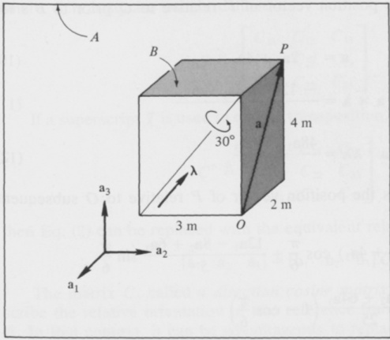{width=56%} 图1.1.2

并且

$$
\beta _ { 2 } = \mathrm { ~ - ~ } \sin \theta \, \alpha _ { 1 } + \cos \theta \, \alpha _ { 2 }
$$

因此，将上述表达式代入式（5），可得

$$
\mathbf { b } = ( p \ \cos \theta - q \ \sin \theta ) \alpha _ { 1 } + ( p \ \sin \theta + q \ \cos \theta ) \alpha _ { 2 } + r \lambda
$$

等式（8）的右端项正是通过执行等式（1）右端项中所列的各项运算、利用等式（4），并借助关系 $\lambda \times \alpha_{1} = \alpha_{2}$ 和 $\lambda \times \alpha_{2} = -\alpha_{1}$ 而得来的。因此，等式（1）的正确性得以确立，而等式（3）则可直接从等式（1）和等式（2）中推导得出。

示例 A 为一个矩形块 $B$，其尺寸如图 1.1.2 所示，构成了一部分安装在航天器 $A$ 中的天线结构。该块在 $A$ 内沿 $B$ 一侧面的对角线进行简单旋转，旋转方向与旋转幅度均如图示所示。需确定线 $OP$ 在初始位置与最终位置之间的夹角 $\phi$。

若 $\mathbf{a}_1$、$\mathbf{a}_2$ 和 $\mathbf{a}_3$ 是固定在 $A$ 中且与 $B$ 的边平行的单位向量，在 $B$ 旋转之前，那么如图所示方向的单位向量 $\lambda$ 可表示为

$$
\lambda = \frac { 3 a _ { 2 } + 4 a _ { 3 } } { 5 }
$$

 ---------------------------------------------[ 第20页 ]---------------------------------------------  

若 $a$ 表示 $P$ 相对于 $O$ 在 $B$ 旋转前的位置向量，则

$$
a = - 2 a _ { 1 } + 4 a _ { 3 }
$$

$$
a \times \lambda = \frac { - 12 a _ { 1 } + 8 a _ { 2 } - 6 a _ { 3 } } { 5 }
$$

并且

$$
a \cdot \lambda \lambda = \frac { 48 a _ { 2 } + 64 a _ { 3 } } { 25 }
$$

因此，若 $b$ 是 $P$ 相对于 $O$ 在 $B$ 旋转后的位置向量，†

$$
\begin{array}{rl} { \mathbf { b } = } & { { } ( - 2 \mathbf { a } _ { 1 } + 4 \mathbf { a } _ { 3 } ) \cos { \frac { \pi } { 6 } } + { \frac { 12 \mathbf { a } _ { 1 } - 8 \mathbf { a } _ { 2 } + 6 \mathbf { a } _ { 3 } } { 5 } } \sin { \frac { \pi } { 6 } } } \\{ } & { { } + { \frac { 48 \mathbf { a } _ { 2 } + 64 \mathbf { a } _ { 3 } } { 25 } } \left( 1 - \cos { \frac { \pi } { 6 } } \right) } \\{ = } & { { } - 0 . 53 2 \mathbf { a } _ { 1 } - 0 . 54 3 \mathbf { a } _ { 2 } + 4 . 40 7 \mathbf { a } _ { 3 } } \end{array}
$$

由于 $\phi$ 是 $\mathbf{a}$ 与 $\mathbf{b}$ 之间的夹角，

$$
\cos \phi = { \frac { \mathrm { a } \cdot \mathrm { b } } { | \mathrm { a } | | \mathrm { b } | } }
$$

其中 $|\mathbf{a}|$ 和 $|\mathbf{b}|$ 分别表示 $\mathbf{a}$ 和 $\mathbf{b}$ 的（相等）模长。因此

$$
\cos \phi = \frac { ( - 2 ) ( - 0 . 53 2 ) + 4 ( 4 . 40 7 ) } { ( 4 + 16 ) ^{1 / 2} ( 4 + 16 ) ^{1 / 2} } = 0 . 93 5
$$

且 $\phi = 20.77^{\circ}$。

# 1.2 方向余弦

若 $\mathbf{a}_1$、$\mathbf{a}_2$、$\mathbf{a}_3$ 以及 $\mathbf{b}_1$、$\mathbf{b}_2$、$\mathbf{b}_3$ 是两组右手系的正交单位向量，并且定义了九个量 $C_{ij}$（$i,j=1,2,3$），称为方向余弦，

$$
C _ { i j } \triangleq \mathbf { a } _ { i } \cdot \mathbf { b } _ { j }  ( i , j = 1 , 2 , 3 )
$$

则两行矩阵 [a₁ a₂ a₃] 和 [b₁ b₂ b₃] 之间存在如下关系：

$$
\begin{bmatrix}\mathbf{b}_1&\mathbf{b}_2&\mathbf{b}_3\end{bmatrix}=\begin{bmatrix}\mathbf{a}_1&\mathbf{a}_2&\mathbf{a}_3\end{bmatrix}C
$$

† 等号下方的数字旨在引导读者注意相应编号的方程。

 ---------------------------------------------[ 第21页 ]---------------------------------------------  

其中 $C$ 是一个由以下方式定义的方阵：

$$
\begin{array}{rl} { C \triangleq } & { { } \left[ \begin{array}{lll} { C _ { 11 } } & { C _ { 12 } } & { C _ { 13 } } \\{ C _ { 21 } } & { C _ { 22 } } & { C _ { 23 } } \\{ C _ { 31 } } & { C _ { 32 } } & { C _ { 33 } } \end{array} \right] } \end{array}
$$

若使用上标 $T$ 来表示转置运算，即若定义 $C^T$ 为

$$
C ^{\tau} \triangleq \left[ \begin{array}{lll} { { C _ { 11 } } } & { { C _ { 21 } } } & { { C _ { 31 } } } \\{ { C _ { 12 } } } & { { C _ { 22 } } } & { { C _ { 32 } } } \\{ { C _ { 13 } } } & { { C _ { 23 } } } & { { C _ { 33 } } } \end{array} \right]
$$

则等式（2）可被替换为等价的关系

$$
[ \mathbf { a } _ { 1 }  \mathbf { a } _ { 2 }  \mathbf { a } _ { 3 } ] = [ \mathbf { b } _ { 1 }  \mathbf { b } _ { 2 }  \mathbf { b } _ { 3 } ] \, C ^{T}
$$

矩阵 $C$，又称方向余弦矩阵，可用于描述两个参考系或刚体 $A$ 和 $B$ 的相对方位。在这一背景下，用更为复杂的符号 $^4C^B$ 来替代符号 $C$ 可能会更有优势。鉴于式（2）和式（5），我们应当将上标互换视为转置的标志；也就是说，

$$
{ } ^{B} C ^{A} = ( { } ^{A} C ^{B} ) ^{T}
$$

方向余弦矩阵 $C$ 在诸多实用关系中发挥着重要作用。例如，若 $\mathbf{v}$ 为任意向量，且定义 ${}^{A}v_{i}$ 和 ${}^{B}v_{i}$（$i = 1, 2, 3$）分别为

$$
{ } ^{A} \nu _ { i } \triangleq \mathbf { v } \cdot \mathbf { a } _ { i }  ( i = 1 , 2 , 3 )
$$

并且

$$
^ B \nu _ { i } \triangleq \mathbf { v } \cdot \mathbf { b } _ { i }  ( i = 1 , 2 , 3 )
$$

当 ${}^{A}v$ 和 ${}^{B}v$ 分别表示行向量，其元素分别为 ${}^{A}v_{1}$、${}^{A}v_{2}$、${}^{A}v_{3}$ 和 ${}^{B}v_{1}$、${}^{B}v_{2}$、${}^{B}v_{3}$ 时，则

$$
B _ { V } = A _ { V } C
$$

同样地，若 $\mathbf{D}$ 为任意二元张量，且定义 ${}^{A}D_{ij}$ 和 ${}^{B}D_{ij}$（$i,j=1,2,3$）分别为

$$
{ } ^{\mathbf { \nabla} } D _ { i j } \triangleq \mathbf { a } _ { i } \cdot \mathbf { D } \cdot \mathbf { a } _ { j }  ( i , j = 1 , 2 , 3 )
$$

以及

$$
^{B} D _ { i j } \triangleq \mathbf { b } _ { i } \cdot \mathbf { D } \cdot \mathbf { b } _ { j }  ( i , j = 1 , 2 , 3 )
$$

当 ${}^{4}D$ 和 ${}^{5}D$ 分别表示方阵，其第 $i$ 行和第 $j$ 列的元素分别为 ${}^{4}D_{ij}$ 和 ${}^{5}D_{ij}$ 时，则

$$
{ } ^{B} \mathbf { D } = \mathbf { C } ^{T} { } ^{A} \mathbf { D } \mathbf { C }
$$

对于重复下标，使用求和约定往往能够以更加简洁的方式表述重要的关系。例如，若定义 $\delta_{ij}$ 为

 ---------------------------------------------[ 第22页 ]---------------------------------------------  

6 运动学 1.2

$$
\delta_{ij} \triangleq 1-\frac{1}{4}(i-j)^{2}[5-(i-j)^{2}] (i, j=1,2,3)
$$

因此，当下标值相同时，$\delta_{ij}$ 等于一；而当下标值不同时，$\delta_{ij}$ 等于零。借助求和约定，我们可以将一组用于描述方向余弦的六条关系表达为

$$
C_{ik} C_{jk}=\delta_{ij} (i, j=1,2,3)
$$

或者，也可以用等价的形式表示为

$$
C_{ki} C_{kj}=\delta_{ij} (i, j=1,2,3)
$$

此外，这些关系也可以用矩阵形式来表述：

$$
C C^{T}=U
$$

以及

$$
C^{T} C=U
$$

其中 $U$ 表示单位矩阵，其定义如下

$$
\begin{bmatrix}1 & 0 & 0 \\ 0 & 1 & 0 \\ 0 & 0 & 1\end{bmatrix}
$$

矩阵 $C$ 的每一个元素都等于其在 $C$ 的行列式中的代数余子式；而且，若 $|C|$ 表示该行列式，则

$$
|C|=1
$$

因此，$C$ 是一个正交矩阵，即其逆矩阵与转置矩阵彼此相等的矩阵。此外，

$$
|C-U|=0
$$

因此，单位矩阵是每一种方向余弦矩阵的特征值。换句话说，对于任意方向余弦矩阵 $C$，都存在行向量 $[\kappa_{1}\ \kappa_{2}\ \kappa_{3}]$，称为特征向量，它们满足以下方程：

$$
[\kappa_{1}\ \kappa_{2}\ \kappa_{3}] C=[\kappa_{1}\ \kappa_{2}\ \kappa_{3}]
$$

假设现在，向量 $\mathbf{a}_{i}$ 和 $\mathbf{b}_{i}$（$i=1,2,3$）分别固定在参考系或刚体 $A$ 和 $B$ 中，并且 $B$ 在 $A$ 中经历了一次简单的旋转（参见第 1.1 节）；此外，旋转前 $\mathbf{a}_{i}=\mathbf{b}_{i}$（$i=1,2,3$），$\lambda$ 和 $\theta$ 的定义如第 1.1 节所述，而 $\lambda_{i}$ 的定义为

$$
\begin{array}{ll} \lambda_{i} \triangleq \lambda \cdot \mathbf{a}_{i}=\lambda \cdot \mathbf{b}_{i} & (i=1,2,3)
\end{array}
$$

然后，$C$ 的各个元素可由以下公式给出：

$$
\begin{array}{ll} C_{11}=\cos \theta+\lambda_{1}^{2}(1-\cos \theta) & (i, j=1,2,3)
\end{array}
$$

$$
C_{12}=-\lambda_{3} \sin \theta+\lambda_{1} \lambda_{2}(1-\cos \theta)
$$

 ---------------------------------------------[ 第23页 ]---------------------------------------------  

1.2 方向余弦 7

$$
C_{13}=\lambda_{2}\sin\theta+\lambda_{3}\lambda_{1}(1-\cos\theta)
$$

$$
C_{21}=\lambda_{3}\sin\theta+\lambda_{1}\lambda_{2}(1-\cos\theta)
$$

$$
C_{22}=\cos\theta+\lambda_{2}^{2}(1-\cos\theta)
$$

$$
C_{31}=-\lambda_{1}\sin\theta+\lambda_{2}\lambda_{3}(1-\cos\theta)
$$

$$
C_{32}=\lambda_{1}\sin\theta+\lambda_{2}\lambda_{3}(1-\cos\theta)
$$

$$
C_{33}=\cos\theta+\lambda_{3}^{2}(1-\cos\theta)
$$

将方程（23）至（31）在定义 $\epsilon_{ijk}$ 之后，可以更简洁地表示为

$$
\epsilon_{ijk}\triangleq\frac{1}{2}(i-j)(j-k)(k-i)
$$

$$
(i,j,k=1,2,3)
$$

（当两个或三个下标具有相同值时，$\epsilon_{ijk}$ 为零；

当下标按循环顺序排列，即按 1、2、3 的顺序，或按 3、1、2 的顺序时，$\epsilon_{ijk}$ 等于 1；而在其他所有情况下，$\epsilon_{ijk}$ 等于 -1。借助求和约定，我们便可将方程（23）至（31）替换为

$$
C_{ij}=\delta_{ij}\cos\theta-\epsilon_{ijk}\lambda_{k}\sin\theta+\lambda_{i}\lambda_{j}(1-\cos\theta)
$$

$$
(i,j=1,2,3)
$$

或者，$C_{ij}$ 也可以用式（1.1.2）中定义的二阶张量 $C$ 来表示：

$$
C_{ij}=\mathbf{a}_{i}\cdot(\mathbf{a}_{j}\cdot\mathbf{C})
$$

$$
(i,j=1,2,3)
$$

当 $\lambda$ 与 $\mathbf{a}_{i}$ 平行，进而与 $\mathbf{b}_{i}$ 平行时（$i=1,2,3$），所有这些结果都会大大简化。若 $C_{i}(\theta)$ 表示当 $\lambda=\mathbf{a}_{i}=\mathbf{b}_{i}$ 时的 $C$，则

$$
C_{1}(\theta)=\begin{bmatrix}1&0&0\\0&\cos\theta&-\sin\theta\\0&\sin\theta&\cos\theta\end{bmatrix}
$$

$$
C_{2}(\theta)=\begin{bmatrix}1&0&0\\0&1&0\\-\sin\theta&0&\cos\theta\end{bmatrix}
$$

$$
C_{3}(\theta)=\begin{bmatrix}\cos\theta&-\sin\theta&0\\\sin\theta&\cos\theta&0\\0&0&1\end{bmatrix}
$$

前面已经提到，单位矩阵是每一种方向余弦矩阵的特征值。如果方向余弦矩阵 $C$ 的元素由式 (23) 至式 (31) 给出，则行向量 $[\lambda_{1}\ \lambda_{2}\ \lambda_{3}]$ 是 $C$ 的特征值为 1 对应的特征向量之一；也就是说，

$$
\begin{bmatrix} \lambda_{1} & \lambda_{2} & \lambda_{3} \end{bmatrix}
$$

$$
C_{13}=\lambda_{2}\sin\theta+\lambda_{3}\sin\theta
$$

$$
\begin{bmatrix} \lambda_{1} & \lambda_{2} & \lambda_{3} \end{bmatrix}
$$

$$
C_{22}=\begin{bmatrix}\cos\theta&0&0\\0&1&0\\-\sin\theta&0&\cos\theta\end{bmatrix}
$$

$$
\begin{bmatrix} \cos\theta&-\sin\theta&0\\\sin\theta&\cos\theta&0\\0&0&1\end{bmatrix}
$$

$$
\begin{bmatrix} \lambda_{1} & \lambda_{2} & \lambda_{3} \end{bmatrix}
$$

$$
C_{13}=\lambda_{2}\sin\theta&\sin\theta
$$

$$
\begin{bmatrix} \lambda_{1} & \lambda_{2} & \lambda_{3} \end{bmatrix}
$$

$$
\begin{bmatrix} \lambda_{1} & \lambda_{2} & \lambda_{3} \end{bmatrix}
$$

 ---------------------------------------------[ 第24页 ]---------------------------------------------  

8 运动学 1.2

等价地，当 $C$ 按照式 (1.1.2) 中所定义的二元张量时，有

$$
\lambda \cdot C = \lambda
$$

推导过程：对于任意向量 $\mathbf{v}$，以下恒等式成立：

$$
\mathbf{v} = (\mathbf{a}_1 \cdot \mathbf{v})\mathbf{a}_1 + (\mathbf{a}_2 \cdot \mathbf{v})\mathbf{a}_2 + (\mathbf{a}_3 \cdot \mathbf{v})\mathbf{a}_3
$$

因此，若让 $\mathbf{b}_1$ 扮演 $\mathbf{v}$ 的角色，就可以将 $\mathbf{b}_1$ 表示为

$$
\mathbf{b}_1 = (\mathbf{a}_1 \cdot \mathbf{b}_1)\mathbf{a}_1 + (\mathbf{a}_2 \cdot \mathbf{b}_1)\mathbf{a}_2 + (\mathbf{a}_3 \cdot \mathbf{b}_1)\mathbf{a}_3
$$

或者，利用式 (1)，可以表示为

$$
\mathbf{b}_1 = C_{11}\mathbf{a}_1 + C_{21}\mathbf{a}_2 + C_{31}\mathbf{a}_3
$$

同样地，

$$
\mathbf{b}_2 = C_{12}\mathbf{a}_1 + C_{22}\mathbf{a}_2 + C_{32}\mathbf{a}_3
$$

$$
\mathbf{b}_3 = C_{13}\mathbf{a}_1 + C_{23}\mathbf{a}_2 + C_{33}\mathbf{a}_3
$$

这三组方程正是在依据式（2）以及矩阵乘法的规则，对$\mathbf{b}_1$、$\mathbf{b}_2$、$\mathbf{b}_3$进行表达式推导时所得到的结果；同样的推理思路也能够导出式（5）。

要证明式（9）成立，只需观察到：

$$
\mathbf{b}_V_{i} = \mathbf{v} \cdot (\mathbf{a}_1 C_{1i} + \mathbf{a}_2 C_{2i} + \mathbf{a}_3 C_{3i})
$$

$$
\mathbf{v} \cdot \mathbf{a}_1 C_{1i} + \mathbf{v} \cdot \mathbf{a}_2 C_{2i} + \mathbf{v} \cdot \mathbf{a}_3 C_{3i}
$$

$$
\mathbf{v}_{(7)} = \mathbf{v}_{1} C_{1i} + \mathbf{v} \cdot \mathbf{a}_2 C_{2i} + \mathbf{v} \cdot \mathbf{a}_3 C_{3i}
$$

并回顾$\mathbf{v}_V$和$\mathbf{v}_B$的定义。同样地，式（12）可由以下推导得出：

$$
\mathbf{B}_{D_{ij}} = (\mathbf{a}_1 C_{1i} + \mathbf{a}_2 C_{2i} + \mathbf{a}_3 C_{3i}) \cdot \mathbf{D} \cdot (\mathbf{a}_1 C_{1j} + \mathbf{a}_2 C_{2j} + \mathbf{a}_3 C_{3j})
$$

$$
\mathbf{C}_{(10)} = C_{1i} \cdot (\mathbf{A}_{D_{11}} C_{1j} + \mathbf{A}_{D_{12}} C_{2j} + \mathbf{A}_{D_{13}} C_{3j})
$$

$$
\mathbf{C}_{(10)} + C_{2i} (\mathbf{A}_{D_{21}} C_{1j} + \mathbf{A}_{D_{22}} C_{2j} + \mathbf{A}_{D_{23}} C_{3j})
$$

$$
\mathbf{C}_{(10)} + C_{3i} (\mathbf{A}_{D_{31}} C_{1j} + \mathbf{A}_{D_{32}} C_{2j} + \mathbf{A}_{D_{33}} C_{3j}
$$

以及根据$\mathbf{A}^D$和$\mathbf{B}^D$的定义。

至于式（14）和式（15），它们是通过（使用求和约定）得出的结论。

$$
\mathbf{a}_i \cdot \mathbf{a}_j = C_{ik} C_{jk}
$$

$$
(i, j = 1, 2, 3)
$$

$$
\mathbf{b}_i \cdot \mathbf{b}_j = C_{ki} C_{kj}
$$

$$
(i, j = 1, 2, 3)
$$

分别因为当$i = j$时，$\mathbf{a}_i \cdot \mathbf{a}_j$等于1，而当$i \neq j$时，则等于0；对于$\mathbf{b}_i \cdot \mathbf{b}_j 也是如此；而且可以发现，式（16）和式（17）都

 ---------------------------------------------[ 第25页 ]---------------------------------------------  

分别通过参考式（3）、式（4）以及式（18），与式（14）和式（15）等价。

要验证$C$的每一个元素是否等于$C$行列式的余子式，只需注意：

$$
\mathbf{b}_{1}=C_{11} \mathbf{a}_{1}+C_{21} \mathbf{a}_{2}+C_{31} \mathbf{a}_{3}
$$

并且

$$
\mathbf{b}_{2} \times \mathbf{b}_{3}=\left(C_{22} C_{33}-C_{32} C_{23}\right) \mathbf{a}_{1}+\left(C_{32} C_{13}-C_{12} C_{33}\right) \mathbf{a}_{2}
$$

+$\left(C_{12} C_{23}-C_{22} C_{13}\right) \mathbf{a}_{3}$

因此，由于$\mathbf{b}_{1}=\mathbf{b}_{2} \times \mathbf{b}_{3}$，因为$\mathbf{b}_{1}$、$\mathbf{b}_{2}$、$\mathbf{b}_{3}$构成了一个右手系的正交单位向量，

$$
\begin{array}{ll}\mathbf{C}_{11}=C_{22} C_{33}-C_{32} C_{23} \\\mathbf{C}_{21}=\mathbf{C}_{32} C_{13}-C_{12} C_{33} \\\mathbf{C}_{31}=\mathbf{C}_{12} C_{23}-C_{22} C_{13} \\\mathbf{C}_{31}-\mathbf{C}_{23}-\mathbf{C}_{12} \mathbf{C}_{13} \\\mathbf{C}_{31}-\mathbf{C}_{22} \mathbf{C}_{23}-\mathbf{C}_{22} \mathbf{C}_{13} \\\mathbf{C}_{31}-\mathbf{C}_{12} \mathbf{C}_{23}-\mathbf{C}_{12} \mathbf{C}_{13} \\\mathbf{C}_{31}-\mathbf{C}_{22} \mathbf{C}_{23}-\mathbf{C}_{22} \mathbf{C}_{13} \\\mathbf{C}_{31}-\mathbf{C}_{12} \mathbf{C}_{22} \mathbf{C}_{13}+\mathbf{C}_{31} \mathbf{C}_{13} \\\mathbf{C}-\mathbf{U}\end{array}
$$

由此可见，$C$ 第一列中的每一个元素[参见式(3)]都等于$C$ 中对应元素的代数余子式；同时，利用$\mathbf{b}_{2}=\mathbf{b}_{3} \times \mathbf{b}_{1}$ 和 $\mathbf{b}_{3}=\mathbf{b}_{1} \times \mathbf{b}_{2}$ 这些关系，我们便可得到 $C$ 第二列和第三列中相应元素的计算结果。此外，通过以第一行元素的代数余子式展开 $C$，并利用式(14) 中 $i=j=1$ 的情形，我们得以得出式(19)。

$C-U$ 的行列式可表示为

$$
\begin{aligned}|C-U| &= |C|+C_{11}+C_{22}+C_{33}+C_{12}C_{21}+C_{23}C_{32}+C_{31}C_{13} \\&\quad -(C_{11}C_{22}+C_{22}C_{33}+C_{33}C_{11})-1\end{aligned}
$$

因此，将 $C_{11}$、$C_{22}$ 和 $C_{33}$ 分别替换为 $|C|$ 中对应的代数余子式，我们便可以发现：

$$
\left|C-U\right|=\left|C\right|-\mathbf{1}=0
$$

这与式(20) 相一致；因此，也保证了存在满足式(21) 条件的行矩阵 $\left[\kappa_{1} \kappa_{2} \kappa_{3}\right]$。

式(22) 中 $\lambda \cdot \mathbf{a}_{i}$ 与 $\lambda \cdot \mathbf{b}_{i}$ 等于的事实，源于这样一个事实：在 $B$ 相对于 $A$ 进行旋转之前，这两个量彼此相等——即当 $\mathbf{a}_{i}=\mathbf{b}_{i}$ 时；而且，在旋转过程中，$\lambda \cdot \mathbf{a}_{i}$ 和 $\lambda \cdot \mathbf{b}_{i}$ 都不会发生变化，因为根据构造，$\lambda$ 与一条直线平行，而这条直线在 $A$ 和 $B$ 中的方位在旋转过程中始终保持不变。

将 $\mathbf{a}$ 和 $\mathbf{b}$ 分别替换为 $\mathbf{a}_{j}$ 和 $\mathbf{b}_{j}$，式(1.1.3) 变为

$$
\mathbf{b}_{j}=\mathbf{a}_{j} \cdot \mathbf{C}
$$

$$
(i, j=1,2,3)
$$

因此

 ---------------------------------------------[ 第26页 ]---------------------------------------------  

图1.2

图1.2.1

这正是式(34)。此外，将 $\mathbf{C}$ 替换为式(1.1.2) 中给出的表达式，我们便可以发现：

$$
C_{ij} = \mathbf{a}_i \cdot \mathbf{a}_j \cos \theta - \mathbf{a}_i \cdot \mathbf{a}_j \times \lambda \sin \theta + \mathbf{a}_i \cdot \lambda \lambda \cdot \mathbf{a}_j (1 - \cos \theta)
$$

$$
C_{ij} = \mathbf{a}_i \cdot \mathbf{a}_j \cos \theta - \mathbf{a}_i \cdot \mathbf{a}_j \times \lambda \sin \theta + \mathbf{a}_i \cdot \lambda \lambda \cdot \mathbf{a}_j (1 - \cos \theta)
$$

$$
= \lambda \cdot \mathbf{C} \overset{(1.1.2)}{ = \lambda} \cdot \mathbf{U} \cos \theta - \lambda \times \lambda \sin \theta + \lambda^2 \lambda (1 - \cos \theta)
$$

$$
= \lambda \cos \theta + 0 + \lambda (1 - \cos \theta) = \lambda
$$

由于 $\lambda$ 是一个单位向量，因此 $\lambda^2 \overset{\triangle}{ = \lambda} \cdot \lambda \cdot \lambda = 1$；而式（38）与式（39）的等价性，正是由式（22）和式（34）所推导得出。

如图1.2.1所示，$B$ 表示一块均匀的矩形块，它是安装在航天器 $A$ 中的扫描平台的一部分。起初，$B$ 的各边与固定在 $A$ 中的单位向量 $\mathbf{a}_1$、$\mathbf{a}_2$ 和 $\mathbf{a}_3$ 平行；随后，平台沿 $B$ 的对角线进行了简单的 $90^\circ$ 旋转，如图中所示。若 $\mathbf{I}$ 是 $B$ 在其质心 $B^*$ 处的惯性二阶张量，而 $^A I_{ij}$ 定义为

† 当需要引用前一节中的某条方程时，需将节号与方程序号一同标注。例如，(1.1.2) 指的是第 1.1 节中的式（2）。

 ---------------------------------------------[ 第27页 ]---------------------------------------------  

1.2 方向余弦 11

$$
^{\Lambda}I_{ij} \triangleq \mathbf{a}_{i} \cdot \mathbf{I} \cdot \mathbf{a}_{j}
$$

在旋转之后，$^{\Lambda}I_{ij}$ 的值（$i, j=1, 2, 3$）是多少？

设 $\mathbf{b}_{i}$（$i=1, 2, 3$）为固定在 $B$ 中的单位向量，且等于 $\mathbf{a}_{i}$（$i=1, 2, 3$）。

在旋转之前；并定义 $^{\beta}I_{ij}$ 为

$$
^{\beta}I_{ij} \triangleq \mathbf{b}_{i} \cdot \mathbf{I} \cdot \mathbf{b}_{j}
$$

$$
(i, j=1, 2, 3)
$$

此时，$\mathbf{b}_{1}$、$\mathbf{b}_{2}$ 和 $\mathbf{b}_{3}$ 与 $B$ 的惯性主轴平行，且这些主轴对应于 $B^*$ 的惯性主轴。

因此，

$$
^{\beta}I_{12}=\beta I_{21}=\beta I_{23}=\beta I_{32}=\beta I_{31}=\beta I_{13}=0
$$

并且，若 $m$ 为 $B$ 的质量，

$$
^{\beta}I_{11}=\frac{m}{12}(12^{2}+3^{2})L^{2}=\frac{153}{12}mL^{2}
$$

$$
^{\beta}I_{22}=\frac{m}{12}(3^{2}+4^{2})L^{2}=\frac{25}{12}mL^{2}
$$

并且

$$
^{\beta}I_{33}=\frac{m}{12}(4^{2}+12^{2})L^{2}=\frac{160}{12}mL^{2}
$$

因此，若 $^{\beta}I$ 表示一个平方矩阵，其元素为 $^{\beta}I_{ij}$，

第$i$行、第$j$列，然后

$$
\lambda^{\beta}I = \frac{mL^{2}}{12}\left[\begin{array}{lll}\boxed{153} & 0 & 0 \\0 & 25 & 0 \\0 & 0 & 160\end{array}\right]
$$

图1.2.1中所示的单位向量$\lambda$可以表示为

$$
\lambda = \frac{4\mathbf{a}_{1} + 12\mathbf{a}_{2} + 3\mathbf{a}_{3}}{(4^{2} + 12^{2} + 3^{2})^{1/2}} = \frac{4}{13}\mathbf{a}_{1} + \frac{12}{13}\mathbf{a}_{2} + \frac{3}{13}\mathbf{a}_{3}
$$

因此，若按照式(22)中的定义，$\lambda_{1}$、$\lambda_{2}$和$\lambda_{3}$的值分别为

$$
\lambda_{1} = \frac{4}{13} \quad \lambda_{2} = \frac{12}{13} \quad \lambda_{3} = \frac{3}{13}
$$

并且，当$\theta = \frac{\pi}{2}$ rad时，式(23)至式(31)可导出如下表达式：

方向余弦矩阵$C$：

$$
C = \frac{1}{169}\left[\begin{array}{lll}16 & 9 & 168 \\87 & 144 & -16 \\-144 & 88 & 9\end{array}\right]
$$

$$
\lambda^{\beta}I_{(12)} = C^{T}A I C
$$

$$
\lambda^{\beta}I_{(12)} = C^{T}A I C
$$

 ---------------------------------------------[ 第28页 ]---------------------------------------------  

12 运动学 1.3

并同时进行乘以$C$的预乘运算，以及与$C^{T}$的后乘运算

得出

$$
C^{B}I\ C^{T} = C\ C^{T}I\ C\ C^{T} = \left.U\right.I\ U = \left.4I\right.
$$

因此，

$$
\hat{I} = \frac{mL^{2}}{12 \times 169 \times 169}
$$

$$
\left(\frac{66, 69, 71\right)\frac{mL^{2}}{12 \times 169 \times 169}
$$

$$
=\frac{mL^{2}}{12 \times 169 \times 169}
$$

$$
\hat{I}_{11} = \frac{4,557,033}{12 \times 169 \times 169}
$$

$$
\hat{I}_{12} = \frac{4,557,033}{12 \times 169 \times 169}
$$

$$
\hat{I}_{12} = -\frac{184,704}{12 \times 169 \times 169}
$$

$$
\hat{I}_{12} = \frac{184,704}{12 \times 169 \times 169}
$$

并且

$$
\hat{I}_{11} = \frac{4,557,033\ mL^{2}}{12 \times 169 \times 169}
$$

$$
\hat{I}_{12} = -\frac{184,704\ mL^{2}}{12 \times 169 \times 169}
$$

$$
\hat{I}_{12} = \frac{184,704\ mL^{2}}{12 \times 169 \times 169}
$$

以此类推。

在第1.1节中引入的单位向量$\lambda$和角度$\theta$，可用于将一个称为欧拉向量的向量$\epsilon$，以及四个标量量$\epsilon_{1},\ldots,\epsilon_{4}$——即欧拉参数——与刚体$B$在参考系$A$中进行简单旋转联系起来，方法是让

在第1.1节中引入的单位向量$\lambda$和角度$\theta$，可用于将一个称为欧拉向量的向量$\epsilon$，以及四个标量量$\epsilon_{1},\ldots,\epsilon_{4}$——即欧拉参数——与刚体$B$在参考系$A$中进行简单旋转联系起来，方法是让

$$
\epsilon_{1} = \frac{\Delta}{2} \sin \frac{\theta}{2}
$$

$$
\epsilon_{4} = \epsilon \cdot \mathbf{a}_{i} = \epsilon \cdot \mathbf{b}_{i}
$$

$$
(i=1,2,3)
$$

和

$$
\epsilon_{4}=\cos\frac{\theta}{2}
$$

其中，$\mathbf{a}_{1}$、$\mathbf{a}_{2}$、$\mathbf{a}_{3}$ 和 $\mathbf{b}_{1}$、$\mathbf{b}_{2}$、$\mathbf{b}_{3}$ 分别是固定在 $A$ 和 $B$ 中的右手系正交单位向量，且在旋转之前，$\mathbf{a}_{i}=\mathbf{b}_{i}$（$i=1,2,3$）。（若讨论涉及多个物体或多个参考系时，将使用诸如 $^{A}\epsilon^{B}$ 和 $^{A}\epsilon_{i}^{B}$ 等符号。）

欧拉参数彼此并非相互独立，因为它们平方和必然等于一：

$$
\epsilon_{1}^{2}+\epsilon_{2}^{2}+\epsilon_{3}^{2}+\epsilon_{4}^{2}=\epsilon^{2}+\epsilon_{4}^{2}=1
$$

欧拉参数的实用性可从以下方面得到体现：

 ---------------------------------------------[ 第29页 ]---------------------------------------------  

1.3 欧拉参数 13

方向余弦矩阵 $C$ 的各个元素，在第 1.2 节中所介绍的表达式中，当以 $\epsilon_1, \ldots, \epsilon_4$ 为变量时，呈现出一种格外简洁而有序的形式：若定义 $C_{ij}$ 为

$$
C_{ij} \overset{\Delta}{=} \mathbf{a}_i \cdot \mathbf{b}_j (i, j = 1, 2, 3)
$$

则

$$
C_{11} = \epsilon_1^2 - \epsilon_2^2 - \epsilon_3^2 + \epsilon_4^2 = 1 - 2\epsilon_2^2 - 2\epsilon_3^2
$$

$$
C_{12} = 2(\epsilon_1 \, \epsilon_2 - \epsilon_3 \, \epsilon_4)
$$

$$
C_{13} = 2(\epsilon_3 \, \epsilon_1 + \epsilon_2 \, \epsilon_4)
$$

$$
C_{21} = 2(\epsilon_1 \, \epsilon_2 + \epsilon_3 \, \epsilon_4)
$$

$$
C_{22} = \epsilon_2^2 - \epsilon_3^2 - \epsilon_1^2 + \epsilon_4^2 = 1 - 2\epsilon_3^2 - 2\epsilon_1^2
$$

$$
C_{23} = 2(\epsilon_2 \, \epsilon_3 - \epsilon_1 \, \epsilon_4)
$$

$$
C_{31} = 2(\epsilon_3 \, \epsilon_1 - \epsilon_2 \, \epsilon_4)
$$

$$
C_{32} = 2(\epsilon_2 \, \epsilon_3 + \epsilon_1 \, \epsilon_4)
$$

$$
C_{33} = \epsilon_3^2 - \epsilon_1^2 - \epsilon_2^2 + \epsilon_4^2 = 1 - 2\epsilon_1^2 - 2\epsilon_2^2
$$

欧拉参数可以表示为方向余弦的函数形式，从而使得方程 (6)–(14) 同时成立。实现这一目标的方法是采用

$$
\begin{aligned}\epsilon_1 = \frac{C_{32} - C_{23}}{4\epsilon_4} \\\epsilon_2 = \frac{C_{13} - C_{31}}{4\epsilon_4} \\\epsilon_3 = \frac{C_{21} - C_{12}}{4\epsilon_4} \\\epsilon_4 = \frac{1}{2} (1 + C_{11} + C_{22} + C_{33})^{1/2} \\\lambda = \frac{\epsilon_1 \, \mathbf{a}_1 + \epsilon_2 \, \mathbf{a}_2 + \epsilon_3 \, \mathbf{a}_3}{(\epsilon_1^2 + \epsilon_2^2 + \epsilon_3)^{1/2}} & \end{aligned}
$$

由于方程 (1) 和方程 (3) 在满足的情况下，

$$
\begin{aligned}\lambda = \frac{\epsilon_1 \, \mathbf{a}_1 + \epsilon_2 \, \mathbf{a}_2 + \epsilon_3 \, \mathbf{a}_3}{(\epsilon_1^2 + \epsilon_2^2 + \epsilon_3)^{1/2}} & \end{aligned}
$$

以及

$$
\begin{aligned}\theta = 2 \cos^{-1} \epsilon_4 & 0 \leq \theta \leq \pi & \end{aligned}
$$

因此，我们可以找到一个简单的旋转，使得与该旋转相关的方向余弦值，如式（1.2.23）至式（1.2.31）中所示，与相应的电

 ---------------------------------------------[ 第30页 ]---------------------------------------------  

14 运动学 1.3

满足式（1.2.2）的任意方向余弦矩阵 $C$ 的性质。换句话说，两个刚体或参考系 $A$ 和 $B$ 相对姿态的任何变化，都可以通过在 $A$ 中对 $B$ 进行一次简单的旋转来实现。这一命题被称为欧拉旋转定理。

作为式（1.1.1）和式（1.1.3）的替代方案，固定在参考系 $A$ 中的向量 $\mathbf{a}$ 与固定在刚体 $B$ 中的向量 $\mathbf{b}$ 之间的关系——即在 $B$ 以 $A$ 中进行一次简单旋转之前，$\mathbf{a}$ 的状态——可以用 $\epsilon$ 和 $\epsilon_4$ 来表示为：

$$
\mathbf{b} = \mathbf{a} + 2[\epsilon_4 \epsilon \times \mathbf{a} + \epsilon \times (\epsilon \times \mathbf{a})]
$$

推导过程　$\epsilon \cdot \mathbf{a}_i$ 与 $\epsilon \cdot \mathbf{b}_i$ 相等[参见式（2）]，源自式（1）和式（1.2.22）；式（4）是式（1）至式（3）的推论，并且基于 $\lambda$ 是一个单位向量这一事实；而式（6）至式（14）则可通过将 $\theta$ 的函数替换为 $\theta/2$ 的函数，并结合式（1.2.22）以及式（1）至式（4），从式（1.2.23）至式（1.2.31）中得出。例如，

$$
\begin{aligned} & C_{11} & 2 \cos ^{2} \frac{\theta}{2} - 1 + 2 \lambda_1^2 \sin ^{2} \frac{\theta}{2} \\ & \lambda_1 \sin \frac{\theta}{2} = \lambda \cdot \mathbf{a}_1 \sin \frac{\theta}{2} \frac{1}{(1)} \epsilon \cdot \mathbf{a}_1 = \epsilon_1 \\ & \cos \frac{\theta}{2} = \epsilon_4 \end{aligned}
$$

而

$$
\begin{aligned} & C_{11} = 2 \epsilon_4^2 - 1 + 2 \epsilon_1^2 = \epsilon_1^2 - \epsilon_2^2 - \epsilon_3^2 + \epsilon_4^2 \end{aligned}
$$

与式（6）一致。

可以通过证明式（6）至式（14）的左端项，能够通过将式（15）至式（18）代入右端项中得到其结果，从而确立式（15）至式（18）的正确性。例如，

$$
\begin{aligned} & 1 - 2 \epsilon_2^2 - 2 \epsilon_3^2 \\ & 2 (1 + C_{11} + C_{22} + C_{33}) - C_{13}^2 + 2 C_{13} C_{31} - C_{31}^2 - C_{21}^2 + 2 C_{12} C_{21} - C_{12}^2 \\ & 2 (1 + C_{11} + C_{22} + C_{33}) \end{aligned}
$$

$$
\begin{aligned} & 2 (1 + C_{11} + C_{22} + C_{33}) - C_{13}^2 + 2 C_{13} C_{31} - C_{31}^2 - C_{21}^2 + 2 C_{12} C_{21} - C_{12}^2 \\ & 1 + C_{11} + C_{22} + C_{33}) \end{aligned}
$$

然而，由于 $C$ 中的每一个元素都等于其在 $|C|$ 中的代数余子式，

$$
\begin{aligned} & C_{13} C_{31} = C_{11} C_{33} - C_{22} \\ & C_{12} C_{21} = C_{11} C_{22} - C_{33} \end{aligned}
$$

 ---------------------------------------------[ 第31页 ]---------------------------------------------  

因此，

$$
1 - 2 \epsilon _ { 2 } ^{2} - 2 \epsilon _ { 3 } ^{2} = \frac { C _ { 11 } + C _ { 11 } \, C _ { 33 } + C _ { 11 } \, C _ { 22 } + C _ { 11 } ^{2} } { 1 + C _ { 11 } + C _ { 22 } + C _ { 33 } } = C _ { 11 }
$$

正如式（6）所要求的。

要证明式（1）和式（3）在 $\lambda$ 和 $\theta$ 分别由式（19）和式（20）给出时成立，只需注意到：

$$
\cos \frac { \theta } { 2 } \stackrel { ( 20 ) } { = } \epsilon _ { 4 }
$$

这正是式（3），并且

$$
\sin { \frac { \theta } { 2 } } \stackrel { ( 20 ) } { = } ( 1 - \epsilon _ { 4 } ^{2} ) ^{1 / 2} \stackrel { ( 4 ) } { = } ( \epsilon _ { 1 } ^{2} + \epsilon _ { 2 } ^{2} + \epsilon _ { 3 } ^{2} ) ^{1 / 2}
$$

因此，

$$
\lambda \sin { \frac { \theta } { 2 } } \equiv \epsilon _ { 1 } \, \mathbf { a } _ { 1 } + \epsilon _ { 2 } \, \mathbf { a } _ { 2 } + \epsilon _ { 3 } \, \mathbf { a } _ { 3 } \equiv \epsilon _ { ( 2 ) }
$$

正如式（1）所要求的。最后，式（1.1.1）等价于

$$
\begin{array}{rl} & { \mathbf { b } = \mathbf { a } + \lambda \times \mathbf { a } \sin \theta + \lambda \times ( \lambda \times \mathbf { a } ) ( 1 - \cos \theta ) } \\& { = \mathbf { a } + 2 \epsilon \times \mathbf { a } \cos \frac { \theta } { 2 } + 2 \epsilon \times ( \epsilon \times \mathbf { a } ) = \mathbf { a } + 2 \left[ \epsilon _ { 4 } \, \epsilon \times \mathbf { a } + \epsilon \times ( \epsilon \times \mathbf { a } ) \right] } \end{array}
$$

与式（21）一致。

图1.3.1中的示例三角形ABC，可以通过将点A移动至A'，而不改变三角形的方位，再对三角形进行一次简单的旋转，同时保持点A固定在A'的位置，从而将其调整到位置A'B'C'。要确定$\lambda$——一个平行于旋转轴的单位向量——并计算与之对应的旋转角$\theta$，可让单位向量$\mathbf{a}_i$和$\mathbf{b}_i$（$i = 1, 2, 3$）如图1.3.1所示指向，从而确保在旋转之前$\mathbf{a}_i = \mathbf{b}_i$（$i = 1, 2, 3$）；通过计算$\mathbf{a}_i \cdot \mathbf{b}_j$来确定$C_{ij}$；然后利用式（15）至式（18）来构建$\epsilon_i$（$i = 1, \ldots, 4$）：

$$
\begin{aligned} \epsilon _ { 4 } & = \frac { 1 } { ( 18 ) } \frac { 1 } { 2 } \left( 1 + \mathbf { a } _ { 1 } \cdot \mathbf { b } _ { 1 } + \mathbf { a } _ { 2 } \cdot \mathbf { b } _ { 2 } + \mathbf { a } _ { 3 } \cdot \mathbf { b } _ { 3 } \right) ^{1 / 2} \\& = \frac { 1 } { 2 } \left( 1 + 0 + 0 + 0 \right) ^{1 / 2} = \frac { 1 } { 2 } \end{aligned}
$$

$$
\epsilon _ { 1 } \stackrel { ( 15 ) } { = } \frac { \mathbf { a } _ { 3 } \cdot \mathbf { b } _ { 2 } - \mathbf { a } _ { 2 } \cdot \mathbf { b } _ { 3 } } { 4 \left( \frac { 1 } { 2 } \right) } = \frac { 1 - 0 } { 2 } = \frac { 1 } { 2 }
$$

$$
\epsilon _ { 2 } = \frac { \mathbf { a } _ { 1 } \cdot \mathbf { b } _ { 3 } - \mathbf { a } _ { 3 } \cdot \mathbf { b } _ { 1 } } { 4 \left( \frac { 1 } { 2 } \right) } = \frac { - 1 - 0 } { 2 } = - \frac { 1 } { 2 }
$$

 ---------------------------------------------[ 第32页 ]---------------------------------------------  

{width=55%} 图1.3.1

$$
\epsilon _ { 3 } = \frac { \mathbf { a } _ { 2 } \cdot \mathbf { b } _ { 1 } - \mathbf { a } _ { 1 } \cdot \mathbf { b } _ { 2 } } { 4 \left( \frac { 1 } { 2 } \right) } = \frac { - 1 - 0 } { 2 } = - \frac { 1 } { 2 }
$$

然后，

$$
\lambda \equiv \frac { \frac { 1 } { 2 } \, a _ { 1 } - \frac { 1 } { 2 } \, a _ { 2 } - \frac { 1 } { 2 } \, a _ { 3 } } { \left( \frac { 3 } { 4 } \right) ^{1 / 2} } = \frac { a _ { 1 } - a _ { 2 } - a _ { 3 } } { \sqrt { 3 } }
$$

以及

$$
\theta _ { ( 20 ) } = 2 \cos ^{- 1} \frac { 1 } { 2 } = \frac { 2 \pi } { 3 } \mathrm { r a d }
$$

# 1.4 罗德里格斯参数

向量$\boldsymbol{\rho}$，被称为罗德里格斯向量，以及三个标量量$\rho_{1}$、$\rho_{2}$、$\rho_{3}$，称为罗德里格斯参数，可以与刚体$B$在参考系$A$中进行的简单旋转相关联（参见第1.1节），方法是让

$$
\rho \triangleq \lambda \tan { \frac { \theta } { 2 } }
$$

并且

$$
\rho _ { i } \triangleq \rho \cdot \mathbf { a } _ { i } = \rho \cdot \mathbf { b } _ { i }  ( i = 1 , 2 , 3 )
$$

其中$\lambda$和$\theta$与第1.1节中的含义相同，而$\mathbf{a}_1$、$\mathbf{a}_2$、$\mathbf{a}_3$以及$\mathbf{b}_1$、$\mathbf{b}_2$、$\mathbf{b}_3$则是分别固定在$A$和$B$中的右手系正交单位向量。

 ---------------------------------------------[ 第33页 ]---------------------------------------------  

在旋转之前，$\mathbf{a}_{i}=\mathbf{b}_{i}$（$i=1,2,3$）。当讨论涉及多个物体或多个参考系时，会使用诸如${}^{4}\rho^{B}$和${}^{4}\rho_{i}^{B}$之类的符号。

罗德里格斯参数与欧拉参数之间有着密切的联系（详见第1.3节）：

$$
\rho _ { i } = \frac { \epsilon _ { i } } { \epsilon _ { 4 } }  ( i = 1 , \, 2 , \, 3 )
$$

与欧拉参数相比，罗德里格斯参数的优势在于其数量更少；然而，这一优势有时会被这样一种事实所抵消：罗德里格斯参数可能会趋于无穷大，而任何欧拉参数的绝对值都不可能超过1。

以罗德里格斯参数表示，方向余弦矩阵 $C$（见第1.2节）可表示为：

$$
\left[ \begin{array}{lll} { { 1 + \rho _ { 1 } ^{2} - \rho _ { 2 } ^{2} - \rho _ { 3 } ^{2} } } & { { 2 ( \rho _ { 1 } \ \rho _ { 2 } - \rho _ { 3 } ) } } & { { 2 ( \rho _ { 3 } \ \rho _ { 1 } + \rho _ { 2 } ) } } \\{ { 2 ( \rho _ { 1 } \ \rho _ { 2 } + \rho _ { 3 } ) } } & { { 1 + \rho _ { 2 } ^{2} - \rho _ { 3 } ^{2} - \rho _ { 1 } ^{2} } } & { { 2 ( \rho _ { 2 } \ \rho _ { 3 } - \rho _ { 1 } ) } } \\{ { 2 ( \rho _ { 3 } \ \rho _ { 1 } - \rho _ { 2 } ) } } & { { 2 ( \rho _ { 2 } \ \rho _ { 3 } + \rho _ { 1 } ) } } & { { 1 + \rho _ { 3 } ^{2} - \rho _ { 1 } ^{2} - \rho _ { 2 } ^{2} } } \end{array} \right]
$$

$$
1 + \rho _ { 1 } ^{2} + \rho _ { 2 } ^{2} + \rho _ { 3 } ^{2}
$$

罗德里格斯向量可用于在第1.1节中定义的向量 a 和 b 的差值与和之间建立一条简单的关系：

$$
\mathbf { a } - \mathbf { b } = ( \mathbf { a } + \mathbf { b } ) \times \boldsymbol { \rho }
$$

这一关系在诸多推导过程中将派上用场，例如，它证明了以下公式是罗德里格斯向量的表达式，该向量能够通过一种简单的旋转来表征，从而实现对 $A$ 和 $B$ 相对方位的特定改变：

$$
\rho = \frac { ( \alpha _ { 1 } - \beta _ { 1 } ) \times ( \alpha _ { 2 } - \beta _ { 2 } ) } { ( \alpha _ { 1 } + \beta _ { 1 } ) \cdot ( \alpha _ { 2 } - \beta _ { 2 } ) }
$$

其中 $\alpha_{i}$ 和 $\beta_{i}$（$i=1,2$）分别是分别固定在 $A$ 和 $B$ 中的向量，且在相对方位发生改变之前，$\alpha_{i}=\beta_{i}$（$i=1,2$）。此类旋转的罗德里格斯参数可表示为：

$$
\rho _ { 1 } = \frac { C _ { 32 } - C _ { 23 } } { 1 + C _ { 11 } + C _ { 22 } + C _ { 33 } }
$$

$$
\rho _ { 2 } = \frac { C _ { 13 } - C _ { 31 } } { 1 + C _ { 11 } + C _ { 22 } + C _ { 33 } }
$$

$$
\rho _ { 3 } = \frac { C _ { 21 } - C _ { 12 } } { 1 + C _ { 11 } + C _ { 22 } + C _ { 33 } }
$$

推导过程表明，$\rho \cdot \mathbf{a}_i$ 与 $\rho \cdot \mathbf{b}_i$ 的相等性[参见式 (2)]，源自式 (1) 和式 (1.2.22)；而式 (3) 则是通过注意到以下几点得出的：

 ---------------------------------------------[ 第34页 ]---------------------------------------------  

18 运动学 1.4

因此，

根据式 (1.3.4)，

$$
1 = \epsilon_{1}^{2} + \epsilon_{2}^{2} + \epsilon_{3}^{2} + \epsilon_{4}^{2} = (\rho_{1}^{2} + \rho_{2}^{2} + \rho_{3}^{2} + 1)\epsilon_{4}^{2}
$$

因此，

$$
C_{11} = \epsilon_{1}^{2} - \epsilon_{2}^{2} - \epsilon_{3}^{2} + \epsilon_{4}^{2} = \left(\rho_{1}^{2} + \rho_{2}^{2} + \rho_{3}^{2} + 1\right)\epsilon_{4}^{2}
$$

$$
C_{11} = \epsilon_{1}^{2} - \epsilon_{2}^{2} - \epsilon_{3}^{2} + \epsilon_{4}^{2} = \left(\rho_{1}^{2} + \epsilon_{4}^{2} - \rho_{2}^{2}\epsilon_{4}^{2} - \rho_{3}^{2}\epsilon_{4}^{2} + \epsilon_{4}^{2}\right)
$$

$$
C_{11} = \epsilon_{1}^{2} - \epsilon_{2}^{2} - \epsilon_{3}^{2} + \epsilon_{4}^{2} = \rho_{1}^{2}\epsilon_{4}^{2} - \rho_{2}^{2}\epsilon_{4}^{2} - \rho_{3}^{2}\epsilon_{4}^{2} + \epsilon_{4}^{2}
$$

$$
=\left(\rho_{1}^{2} - \rho_{2}^{2} - \rho_{3}^{2} + 1\right)\epsilon_{4}^{2} = \frac{\rho_{1}^{2} - \rho_{2}^{2} - \rho_{3}^{2} + 1}{1 + \rho_{1}^{2} + \rho_{2}^{2} + \rho_{3}^{2}}
$$

与式 (4) 一致，$C$ 的其余各元素亦可按类似方式求得。

至于式 (5)，请注意，将式 (1.3.21) 与 $\epsilon$ 交叉相乘后得到：

$$
\epsilon \times \mathbf{b} = \epsilon \times \mathbf{a} + 2\left\{\epsilon_{4} \in \mathbf{x} \times (\mathbf{\epsilon} \times \mathbf{a}) + \mathbf{\epsilon} \times [\mathbf{\epsilon} \times (\mathbf{\epsilon} \times \mathbf{a})]\right\}
$$

因此，

$$
\epsilon \times (\mathbf{a} + \mathbf{b}) = \epsilon \times \mathbf{a} + \epsilon \times \mathbf{b}
$$

$$
\epsilon \times [\mathbf{e} \times (\mathbf{\epsilon} \times \mathbf{a})] = -\mathbf{\epsilon}_{\mathbf{c}}^{2} \mathbf{\epsilon} \times \mathbf{a} = \left(\mathbf{\epsilon}_{1}^{2} + \mathbf{\epsilon}_{2}^{2} + \mathbf{\epsilon}_{3}^{2}\right) \mathbf{\epsilon} \times \mathbf{a}
$$

$$
\epsilon \times (\mathbf{a} + \mathbf{b}) = \mathbf{\epsilon}_{(16,17)}2\mathbf{\epsilon}_{4}[\mathbf{\epsilon}_{4} \in \mathbf{x} \times \mathbf{a} + \mathbf{\epsilon} \times (\mathbf{\epsilon} \times \mathbf{a})] = \left(\mathbf{\epsilon}_{1}^{2} + \mathbf{\epsilon}_{2}^{2} + \mathbf{\epsilon}_{3}^{2}\right) \mathbf{\epsilon} \times \mathbf{a}
$$

因此，

$$
\epsilon \times (\mathbf{a} + \mathbf{b}) = 2\mathbf{\epsilon}_{4}[\mathbf{\epsilon}_{4} \in \mathbf{x} \times \mathbf{a} + \mathbf{\epsilon} \times (\mathbf{\epsilon} \times \mathbf{a})] = \left(\mathbf{\epsilon}_{1}^{2} + \mathbf{\epsilon}_{2}^{2} + \mathbf{\epsilon}_{3}^{2}\right) \mathbf{\epsilon} \times \mathbf{a}
$$

$$
\epsilon - \mathbf{b} = (\mathbf{a} + \mathbf{b}) \times \frac{\mathbf{\epsilon}}{\mathbf{\epsilon}_{(18)}} \mathbf{\epsilon}_{(13,1)} = (\mathbf{a} + \mathbf{b}) \times \lambda \tan \frac{\theta}{2} \mathbf{\epsilon}_{(1)} (\mathbf{a} + \mathbf{b}) \times \boldsymbol{\rho}
$$

这正是式（5）。

现在，通过观察可以得出式（6）：

$$
\alpha_{1} - \boldsymbol{\beta}_{1} = (\alpha_{1} + \boldsymbol{\beta}_{1}) \times \boldsymbol{\rho}
$$

$$
\alpha_{2} - \boldsymbol{\beta}_{2} = (\alpha_{2} + \boldsymbol{\beta}_{2}) \times \boldsymbol{\rho}
$$

（20）

并且

$$
\alpha_{2} - \boldsymbol{\beta}_{2} = (\alpha_{2} + \boldsymbol{\beta}_{2}) \times \boldsymbol{\rho}
$$

（21）

 ---------------------------------------------[ 第35页 ]---------------------------------------------  

因此，

$$
\begin{aligned}(\alpha_1-\beta_1)\times(\alpha_2-\beta_2)&=[(\alpha_1+\beta_1)\times\rho]\times(\alpha_2-\beta_2)\\&=(\alpha_1+\beta_1)\cdot(\alpha_2-\beta_2)\rho-(\alpha_1+\beta_1)\rho\cdot(\alpha_2-\beta_2)\\&=(\alpha_1+\beta_1)\cdot(\alpha_2-\beta_2)\rho-0\end{aligned}
$$

由此可立即推导出式（6）。

最后，为了验证式（7）至式（9）的有效性，需注意：

$$
\rho _ { 1 } \equiv \frac { \epsilon _ { 1 } } { \epsilon _ { 4 } } \; \; \; ( 1 . 3 . 15 ) \; \; \; \equiv \; \; \; \frac { C _ { 32 } - C _ { 23 } } { 4 \epsilon _ { 4 } ^{2} } \; \; \; ( 1 . 3 . 18 ) \; \; \; \frac { C _ { 32 } - C _ { 23 } } { 1 + C _ { 11 } + C _ { 22 } + C _ { 33 } }
$$

与式（7）一致；而式（8）和式（9）则可通过对式（7）中下标进行循环排列得到。

以图1.4.1为例，该图展示了在第1.1节示例中先前所考虑的刚体B。假设B相对于A沿与单位向量λ平行的轴进行180°旋转；且设b_i为固定在B中的单位向量，其在旋转前与a_i相等（i = 1, 2, 3）。接下来，需确定满足式(1.2.2)的旋转后方向余弦矩阵C。

当θ=π rad时，式(1)得到的罗德里格斯向量模长为无穷大，而式(2)和式(4)则导致C呈现不定形式。为了对这一情形进行求解，

{width=55%} 图1.4.1

 ---------------------------------------------[ 第36页 ]---------------------------------------------  

由于是不定形式，我们可参照式(1)和式(2)，将C的每一个元素用θ和λ·a_i（i = 1, 2, 3）来表示，然后求得当θ趋近于π rad时，所得表达式的极限值。或者，我们也可以使用式(1.2.23)-(1.2.31)或式(1.3.6)-(1.3.14)来求解C的各个元素。后者方程尤其方便，因为当θ=π时，

$$
\epsilon = \lambda _ { ( 1 . 3 . 1 ) }
$$

因此，

$$
\epsilon _ { i } \stackrel { = } { = } \lambda \cdot \mathbf { a } _ { i }  ( i = 1 , 2 , 3 )
$$

并且

$$
\epsilon _ { 4 } = 0 _ { ( 1 . 3 . 3 ) }
$$

因此，有了

$$
\lambda = \frac { 3 } { 5 } a _ { 2 } + \frac { 4 } { 5 } a _ { 3 }
$$

我们立刻可以发现，

$$
\epsilon _ { 1 } = 0  \epsilon _ { 2 } = \frac { 3 } { 5 }  \epsilon _ { 3 } = \frac { 4 } { 5 }
$$

并将这些值代入式(1.3.6)-(1.3.14)，即可得到

$$
C = { \frac { 1 } { 25 } } { \left[ \begin{array}{lll} { - 25 } & { 0 } & { 0 } \\{ 0 } & { - 7 } & { 24 } \\{ 0 } & { 24 } & { 7 } \end{array} \right] }
$$

# 1.5 间接确定方向

若a_1、a_2、a_3以及b_1、b_2、b_3分别是在参考系A和B中固定的右手系正交单位向量，且两参考系中各单位向量的方向均已知，则可通过方向余弦C_{ij}（i,j=1,2,3）来描述两个参考系之间的相对方向——根据式(1.2.1)，这些方向余弦可直接通过计算a_i·b_j（i,j=1,2,3）来获得。然而，即使这些点积无法如此直接求得，我们仍有可能找到C_{ij}（i,j=1,2,3）。例如，当两个非平行向量，如p和q，分别在A和B中具有已知的方向时，就可以直接计算a_i·p、a_i·q、b_i·p和b_i·q（i=1,2,3）的点积。在这种情况下，我们可以按如下方法求解C_{ij}：构造一个向量r和一个二元运算符σ，具体做法是：

$$
\mathrm { r } \triangleq \mathrm { p } \times \mathrm { q }
$$

并且

$$
\sigma \triangleq { \frac { \mathbf { p } \times \mathbf { q r } + \mathbf { q } \times \mathbf { r p } + \mathbf { r } \times \mathbf { p q } } { \mathbf { r } ^{2} } }
$$

 ---------------------------------------------[ 第37页 ]---------------------------------------------  

接下来，将式（2）中每对二元组的第一个成员用 $\mathbf{a}_i$ 表示，第二个成员用 $\mathbf{b}_i$ 表示（$i=1,2,3$）。最后，对式中所指示的乘法运算进行计算。

$$
C_{ij}=\mathbf{a}_i\cdot\boldsymbol{\sigma}\cdot\mathbf{b}_j\quad (i,j=1,2,3)
$$

推导过程　我们将会证明，式（2）中定义的二元张量 $\boldsymbol{\sigma}$ 是一个单位二元张量，也就是说，对于任意向量 $\mathbf{v}$，

$$
\mathbf{v}=\mathbf{v}\cdot\boldsymbol{\sigma}
$$

由此可见，式（3）的成立，是根据式（1）中对 $C_{ij}$ 的定义而直接得出的结论；因此，任意向量 $\mathbf{v}$ 都可以表示为

$$
\mathbf{v}=\alpha\mathbf{p}+\beta\mathbf{q}+\gamma\mathbf{r}
$$

其中，$\alpha$、$\beta$ 和 $\gamma$ 是若干标量。由式（5）可知，

$$
\mathbf{v}\cdot(\mathbf{q}\times\mathbf{r})=\alpha\mathbf{p}\cdot(\mathbf{q}\times\mathbf{r})+\beta\mathbf{q}\cdot(\mathbf{q}\times\mathbf{r})+\gamma\mathbf{r}\cdot(\mathbf{q}\times\mathbf{r})
$$

$$
\alpha=\mathbf{v}\cdot\frac{\mathbf{q}\times\mathbf{r}}{\mathbf{p}^2}
$$

同样地，将式（5）中的标量乘以 $\mathbf{r}\times\mathbf{p}$ 和 $\mathbf{p}\times\mathbf{q}$，可得：

$$
\beta=\mathbf{v}\cdot\frac{\mathbf{r}\times\mathbf{p}}{\mathbf{r}^2}
$$

$$
\gamma=\mathbf{v}\cdot\frac{\mathbf{p}\times\mathbf{q}}{\mathbf{r}^2}
$$

将式（7）至式（9）代入式（5），即可得到：

$$
\mathbf{v}=\frac{\mathbf{v}\cdot(\mathbf{q}\times\mathbf{r})\mathbf{p}+\mathbf{v}\cdot(\mathbf{r}\times\mathbf{p})\mathbf{q}+\mathbf{v}\cdot(\mathbf{p}\times\mathbf{q})\mathbf{r}}{\mathbf{r}^2}=\mathbf{v}\cdot\frac{(\mathbf{q}\times\mathbf{r}\times\mathbf{p})\mathbf{p}\times\mathbf{q}\times\mathbf{r}}{\mathbf{r}^2}
$$

（10）

 ---------------------------------------------[ 第38页 ]---------------------------------------------  

{width=54%} 图1.5.1

示例　通过两艘太空飞行器——A号和B号——同时观测两颗恒星P和Q，以获取数据，用于确定A号和B号的相对方位。观测内容包括测量图1.5.1中所示的角 $\phi$ 和 $\psi$，其中O点既可能是固定在A号上的某一点，也可能是固定在B号上的某一点；R点则可能是P号或Q号；$\mathbf{c}_1$、$\mathbf{c}_2$、$\mathbf{c}_3$ 是正交的单位向量，构成一个右手系，且该系分别固定在A号或B号上。对于表1.5.1中给出的这些角度的数值，需确定方向余弦矩阵 $C$。

若将 $\mathbf{R}$ 定义为从O指向R的单位向量（见图1.5.1），则

$$
\textbf { R } = \cos \psi \cos \phi \, \mathbf { c } _ { 1 } + \cos \psi \sin \phi \, \mathbf { c } _ { 2 } + \sin \psi \, \mathbf { c } _ { 3 }
$$

因此，设 $\mathbf{p}$ 和 $\mathbf{q}$ 分别为从 $O$ 指向 $P$ 和指向 $Q$ 的单位向量，并参照表 1.5.1，我们可以将这两个单位向量分别用 $\mathbf{a}_1$、$\mathbf{a}_2$、$\mathbf{a}_3$ 以及 $\mathbf{b}_1$、$\mathbf{b}_2$、$\mathbf{b}_3$ 来表示，如表 1.5.2 中的第 1 行和第 2 行所示；随后，这些结果可用于计算 $\mathbf{r}$ [参见式 (1)]、$\mathbf{q} \times \mathbf{r}$ 以及 $\mathbf{r} \times \mathbf{p}$。需要注意的是（参见表 1.5.2 的第 3 行）

$$
\mathbf { r } ^{2} = { \frac { 2 } { 16 } } + { \frac { 6 } { 16 } } + { \frac { 6 } { 16 } } = { \frac { 7 } { 8 } }
$$

表 1.5.1 角度 $\phi$ 和 $\psi$，以度为单位

|  | P | Q |
| --- | --- | --- |
| $φ$ | $ψ$ | $φ$ | $ψ$ |
| c i =a i | 90 | 45 | 30 | 0 |
| c i =b i | 135 | 0 | 90 | 60 |

 ---------------------------------------------[ 第39页 ]---------------------------------------------  

表 1.5.2 在 $\sigma$ 中出现的向量

1 向量 $\mathbf{a}_{1}$、$\mathbf{a}_{2}$、$\mathbf{a}_{3}$、$\mathbf{b}_{1}$、$\mathbf{b}_{2}$、$\mathbf{b}_{3}$

2 $\mathbf{q}$、$\sqrt{3}$、$\frac{1}{2}$、$\frac{1}{2}$、$0$、$\frac{-\sqrt{2}}{2}$、$0$

3 $\mathbf{r}=\mathbf{p}\times\mathbf{q}$、$\frac{-\sqrt{2}}{4}$、$\frac{\sqrt{6}}{4}$、$\frac{-\sqrt{6}}{4}$、$\frac{\sqrt{6}}{4}$、$\frac{-\sqrt{6}}{4}$、$\frac{\sqrt{6}}{4}$、$\frac{-\sqrt{2}}{4}$

4 $\mathbf{q}\times\mathbf{r}$、$\frac{-\sqrt{6}}{8}$、$\frac{3\sqrt{2}}{8}$、$\frac{\sqrt{2}}{2}$、$\frac{1}{2}$、$\frac{1}{2}$、$\frac{\sqrt{6}}{4}$、$\frac{\sqrt{6}}{4}$、$\frac{-\sqrt{2}}{4}$

5 $\mathbf{r}\times\mathbf{p}$、$\frac{\sqrt{3}}{2}$、$\frac{1}{4}$、$\frac{-1}{4}$、$\frac{1}{4}$、$\frac{-1}{4}$

由此我们得到

$\sigma_{(2)}\left[\left(-\frac{\sqrt{2}}{4}\mathbf{a}_{1}+\frac{\sqrt{6}}{4}\mathbf{a}_{2}-\frac{\sqrt{6}}{4}\mathbf{a}_{3}\right)\left(\frac{\sqrt{6}}{4}\mathbf{b}_{1}+\frac{\sqrt{6}}{4}\mathbf{b}_{2}-\frac{\sqrt{2}}{4}\mathbf{b}_{3}\right)\right]$。

+$\left(-\frac{\sqrt{6}}{8}\mathbf{a}_{1}+\frac{3\sqrt{2}}{8}\mathbf{a}_{2}+\frac{\sqrt{2}}{2}\mathbf{a}_{3}\right)\left(-\frac{\sqrt{2}}{2}\mathbf{b}_{1}+\frac{\sqrt{2}}{2}\mathbf{b}_{2}+\mathbf{0}\mathbf{b}_{3}\right)$

+$\left(\frac{\sqrt{3}}{2}\mathbf{a}_{1}+\frac{1}{4}\mathbf{a}_{2}-\frac{1}{4}\mathbf{a}_{3}\right)\left(0\mathbf{b}_{1}+\frac{1}{2}\mathbf{b}_{2}+\frac{\sqrt{3}}{2}\mathbf{b}_{3}\right)/\frac{7}{8}$

并且

$$
C_{11}=\mathbf{a}_{1}\cdot\boldsymbol{\sigma}\cdot\mathbf{b}_{1}=\left(-\frac{\sqrt{2}}{4}\frac{\sqrt{6}}{4}+\frac{\sqrt{6}}{8}\frac{\sqrt{2}}{2}\right)/\frac{7}{8}=0
$$

$$
C_{12}=\mathbf{a}_{1}\cdot\boldsymbol{\sigma}\cdot\mathbf{b}_{2}=\left(-\frac{\sqrt{2}}{4}\frac{\sqrt{6}}{4}-\frac{\sqrt{6}}{8}\frac{\sqrt{2}}{2}+\frac{\sqrt{3}}{2}\frac{1}{2}\right)/\frac{7}{8}=0
$$

$$
C_{13} = \mathbf{a}_{1} \cdot \boldsymbol{\sigma} \cdot \mathbf{b}_{3} = \left(\frac{\sqrt{2}}{4} \cdot \frac{\sqrt{2}}{4} + \frac{\sqrt{3}}{2} \cdot \frac{\sqrt{3}}{2}\right) / \frac{7}{8} = 1
$$

以此类推；也就是说，

$$
C = \begin{bmatrix} 0 & 0 & 1 \\ 0 & 1 & 0 \\ -1 & 0 & 0 \end{bmatrix}
$$

$$
C = \begin{bmatrix} 0 & 0 & 1 \\ 0 & 1 & 0 \\ -1 & 0 & 0 \end{bmatrix}
$$

1.6 连续旋转

当刚体 $B$ 在参考系 $A$ 中经历两次连续的简单旋转（参见第 1.1 节）时，每一次旋转以及单个等效旋转（参见第 1.3 节）都可以用方向来描述。

 ---------------------------------------------[ 第40页 ]---------------------------------------------  

24 动力学 1.6

余弦（参见第 1.2 节）、欧拉参数（参见第 1.3 节）以及罗德里格斯参数（参见第 1.4 节）；无论采用何种描述方法，与各次独立旋转相关的量都可以与表征单一等效旋转的量相互关联。在讨论此类关系时，引入一个虚构的刚体 $\overline{B}$ 会很有帮助：在第一次旋转过程中，$\overline{B}$ 的运动与 $B$ 完全相同，但在 $B$ 进行第二次旋转时，$\overline{B}$ 却保持在 $A$ 中固定不动。为了便于分析，可以将第一次旋转视为 $\overline{B}$ 相对于 $A$ 的旋转，而将第二次旋转视为 $B$ 相对于 $\overline{B}$ 的旋转。

若 $\mathbf{a}_{i} (i=1,2,3)$、$\mathbf{b}_{i} (i=1,2,3)$、$\mathbf{\bar{b}}_{i} (i=1,2,3)$ 分别是固定在 $A$、$B$ 和 $\overline{B}$ 中的三组右手正交单位向量，且在 $B$ 在 $A$ 中完成第一次旋转之前，$\mathbf{a}_{i} = \mathbf{b}_{i} = \mathbf{\bar{b}}_{i} (i=1,2,3)$；若 ${}^{A}C^{\overline{B}}$、${}^{A}C^{B}$ 和 ${}^{A}C^{\overline{B}}$ 分别是表征第一次旋转、第二次旋转以及单个等效旋转的方向余弦矩阵，则有

$$
\begin{aligned}& [\mathbf{b}_{1}\ \mathbf{b}_{2}\ \mathbf{b}_{3}] = [\mathbf{a}_{1}\ \mathbf{a}_{2}\ \mathbf{a}_{3}]^{A} C^{\overline{B}} \\& [\mathbf{b}_{1}\ \mathbf{b}_{2}\ \mathbf{b}_{3}] = [\mathbf{b}_{1}\ \mathbf{b}_{2}\ \mathbf{b}_{3}] \overline{C}^{B} \\& [\mathbf{b}_{1}\ \mathbf{b}_{2}\ \mathbf{b}_{3}] = [\mathbf{a}_{1}\ \mathbf{a}_{2}\ \mathbf{a}_{3}]^{A} C^{B} \\& \text { and }\end{aligned}
$$

则 ${}^{A}C^{B}$ 以 ${}^{A}C^{\overline{B}}$ 和 ${}^{B}C^{B}$ 为基准表示，其表达式为

$$
\begin{aligned}& [\mathbf{c}_{A} C^{B}\ \mathbf{c}_{A} C^{\overline{B}} \mathbf{c}_{A}^{B}] \\& [\mathbf{c}_{A} C^{B}\ \mathbf{c}_{A} C^{\overline{B}} \mathbf{c}_{A}^{B}] \end{aligned}
$$

同样地，对于罗德里格斯向量，

$$
\begin{aligned}& [\mathbf{c}_{A} \rho^{B}\ \overline{\mathbf{c}}_{A} \rho^{B}+\overline{\mathbf{c}}_{A} \rho^{B} \times \mathbf{c}_{A} \rho^{\overline{B}}] \\& [\mathbf{c}_{A} \rho^{B}\ \overline{\mathbf{c}}_{A} \rho^{B} \cdot \overline{\mathbf{c}}_{A} \rho^{B}] \end{aligned}
$$

要将这一类关系用欧拉参数来表述，我们首先按照如下方式定义三组此类参数：以$\mathbf{b}_{i}$和$\mathbf{b}_{i}$（$i=1,2,3$）为基准，分别指向第二次旋转后的方向；同时，$\theta_{1}$、$\theta_{2}$和$\theta$ 分别表示第一次旋转、第二次旋转以及等效旋转的弧度值。

$$
\begin{aligned}& \left[\mathbf{c}_{A} \overline{\mathbf{c}}_{i} \right] \triangleq \mathbf{c}_{A} \epsilon_{i}^{\overline{B}} \cdot \mathbf{a}_{i}=\mathbf{c}_{A} \epsilon_{i}^{\overline{B}} \cdot \overline{\mathbf{b}}_{i} (i=1,2,3) \\& \left[\overline{\mathbf{c}}_{i}^{B} \triangleq \overline{\mathbf{c}}_{A} \epsilon^{B} \cdot \overline{\mathbf{b}}_{i} \right] (i=1,2,3) \end{aligned}
$$

$$
\begin{aligned}& \left[\mathbf{c}_{A} \epsilon_{i}^{B} \triangleq \cos \frac{\theta_{1}}{2}\right] \\& \left[\overline{\mathbf{c}}_{A} \epsilon_{i}^{B} \triangleq \cos \frac{\theta_{2}}{2}\right] \end{aligned}
$$

$$
\left[\overline{\mathbf{c}}_{A} \epsilon_{i}^{B} \triangleq \cos \frac{\theta_{2}}{2}\right] \left(\begin{aligned}\text { (10)} \\\end{aligned}\right)
$$

$$
\left[\mathbf{c}_{A} \epsilon_{i}^{B} \triangleq \cos \frac{\theta_{1}}{2}\right] \left(\begin{aligned}\text { (11)}\end{aligned}\right)
$$

 ---------------------------------------------[ 第41页 ]---------------------------------------------  

由此可得，

【曲形柱的图像】

方程（4）、（5）、（12）和（13）都反映了这样一个事实：$B$ 在 $A$ 中的最终方向，取决于依次执行的旋转顺序。例如，在方程（4）中，$^A C^B = \Lambda C^B \overline{B} \, \overline{B} \, C^B \, C^B \, C^B \, C^B \, C^B \, C^B \, C^B \, C^B \, C^B \, C^B \, C^B \, C^B \, C^B \, C^B \, C^B \, C^B \, C^B \, C^B \, C^B \, C^B \, C^B \, C^B \, C^B \, C^B \, C^B \, C^B \, C^B \, C^B \, C^B \, C^B \, C^B \, C^B \, C^B \, C^B \, C^B \, C^B \, C^B \, C^B \, C^B \, C^B \, C^B \, C^B \, C^B \, C^B \, C^B \, C^B \, C^B \, C^B \, C^B \, C^B \, C^B \, C^B \, C^B \, C^B \, C^B \, C^B \, C^B \, C^B \, C^B \, C^B \, C^B \, C^B \, C^B \, C^B \, C^B \, C^B \, C^B \, C^B \, C^B \, C^B \, C^B \, C^B \, C^B \, C^B \, C^B \, C^B \, C......方程（4）、（5）、（12）和（13）都反映了这样一个事实：$B$ 在 $A$ 中的最终方向取决于依次执行的旋转顺序。例如，在式（4）中，$^A C^B = \Lambda C^B \overline{B} \, \overline{B} \, C^B \, C^B \, C^B \, C^B \, C^B \, C^B \, C^B \, C^B \, C^B \, C^B \, C^B \, C^B \, C^B \, C^B \, C^B \, C^B \, C^B \, C^B \, C^B \, C^B \, C^B \, C^B \, C^B \, C^B \, C^B \, C^B \, C^B \, C^B \, C^B \, C^B \, C^B \, C^B \, C^B \, C^B \, C^B \, C^B \, C^B \, C^B \, C^B \, C^B \, C^B \, C^B \, C^B \, C^B \, C^B \, C^B \, C^B \, C^B \, C^B \, C^B \, C^B \, C^B \, C^B \, C^B \, C^B \, C^B \, C^B \, C^B \, C^B \, C^B \, C^B \, C^B \, C^B \, C^B \, C^B \, C^B \, C......

 ---------------------------------------------[ 第42页 ]---------------------------------------------  

在标量积中，无论$\overline{\mathbf{b}}$出现在何处，都应将其消去。由此可得

$$
\begin{array}{r} { \overline { { \mathbf { b } } } \times ( ^{A} \boldsymbol { \rho } ^{\overline { { B} } } + ^{\overline { { B} } } \boldsymbol { \rho } ^{B} ) = \mathbf { a } \times ^{\overline { { B} } } \boldsymbol { \rho } ^{B} + \mathbf { b } \times ^{A} \boldsymbol { \rho } ^{\overline { { B} } } + ( \mathbf { a } - \mathbf { b } ) ^{A} \boldsymbol { \rho } ^{\overline { { B} } } \cdot ^{\overline { { B} } } \boldsymbol { \rho } ^{B} } \\{ + ( \mathbf { a } + \mathbf { b } ) \times ( ^{\overline { { B} } } \boldsymbol { \rho } ^{B} \times ^{A} \boldsymbol { \rho } ^{\overline { { B} } } ) } \end{array}
$$

接下来，将式（17）和式（18）相加，利用式（22）消去$\overline{\mathbf{b}}$，并求解$\mathbf{a}-\mathbf{b}$，从而得到

$$
\mathbf { a } - \mathbf { b } = ( \mathbf { a } + \mathbf { b } ) \times \frac { \mathbf { A } } { 1 - \mathbf { A } } \frac { \boldsymbol { \rho } ^{\overline { { B} } } + \overline { { { B } } } \boldsymbol { \rho } ^{B} + \overline { { { B } } } \boldsymbol { \rho } ^{B} \times \mathbf { A } } { \boldsymbol { \rho } ^{\overline { { B} } } }
$$

将式（23）与式（19）结合，可推导出式（5）的成立性；因为只有当式（5）成立时，式（23）和式（19）才能对任意向量$\mathbf{a}$均成立。

至于式（13）和式（14），需要注意的是，根据式（1.3.1）、式（1.3.3）和式（1.4.1）可知，

$$
{ } ^{A} \rho ^{\overline { { { B} } } } = \frac { { } ^{A} \epsilon ^{\overline { { { B} } } } } { { } ^{A} \epsilon _ { 4 } ^{\overline { { { B} } } } }
$$

$$
{ \bar { B } } \rho ^{B} = { \frac { \bar { B } \epsilon ^{B} } { \bar { B } \epsilon _ { 4 } ^{B} } }
$$

并且

$$
{ } ^{A} \rho ^{B} = \frac { A \, \epsilon _ { B } ^{B} } { A \, \epsilon _ { 4 } ^{B} }
$$

因此，

$$
\begin{array}{rl} { A _ { \epsilon } \epsilon _ { ( 26 ) } ^{B} = A _ { \epsilon _ { 4 } } A _ { \epsilon } A _ { \rho } ^{B} = A _ { \epsilon _ { 4 } } B _ { ( 5 ) } ^{A} \frac { \rho ^{\overline { { { B} } } } + \overline { { { B } } } \rho ^{B} + \overline { { { B } } } \rho ^{B} \times A _ { \epsilon } \rho ^{\overline { { { B} } } } } { 1 - A _ { \rho } ^{B} \cdot \overline { { { B } } } \rho ^{B} } } & { { } } \\{ = A _ { \epsilon _ { 4 } } B _ { ( 24 , 25 ) } ^{A} \frac { A _ { \epsilon _ { 4 } } \overline { { { B } } } \cdot \overline { { { B } } } \epsilon _ { 4 } ^{B} + \overline { { { B } } } \epsilon _ { 4 } ^{B} \cdot \overline { { { B } } } \epsilon _ { 4 } ^{B} + \overline { { { B } } } \epsilon _ { 4 } ^{B} \times A _ { \epsilon } \overline { { { B } } } } { A _ { \epsilon _ { 4 } } \overline { { { B } } } \cdot \overline { { { B } } } \epsilon _ { 4 } ^{B} - A _ { \epsilon _ { 4 } } \overline { { { B } } } \cdot \overline { { { B } } } \epsilon _ { 4 } ^{B} } } & { { } } \end{array}
$$

此外，将该等式的两边分别与自身进行点乘，并利用式（1.3.4），可以得出

$$
( A \epsilon ^{B} ) ^{2} = ( A \epsilon _ { 4 } ^{B} ) ^{2} \, \frac { 1 - ( A \epsilon _ { 4 } ^{\overline { { { B} } } } \, \overline { { { B } } } \, \epsilon _ { 4 } ^{B} - A \, \epsilon _ { 4 } ^{\overline { { { B} } } } \, \cdot \, \overline { { { B } } } \, \epsilon _ { 4 } ^{B} ) ^{2} } { ( A \epsilon _ { 4 } ^{\overline { { { B} } } } \, \overline { { { B } } } \, \epsilon _ { 4 } ^{B} - A \, \epsilon _ { 4 } ^{\overline { { { B} } } } \, \cdot \, \overline { { { B } } } \, \epsilon _ { 4 } ^{B} ) ^{2} }
$$

然而，

$$
( ^{A} \epsilon ^{B} ) ^{2} = 1 - ( ^{A} \epsilon _ { 4 } ^{B} ) ^{2}
$$

因此，

$$
( A \epsilon _ { 4 } B ) ^{2} = \frac { ( A \epsilon _ { 4 } \bar { B } \; \bar { B } \epsilon _ { 4 } B - A \epsilon _ { 4 } ^{\bar { B} } \; \bar { B } \epsilon _ { 4 } B ) ^{2} } { ( 28 , 29 ) }
$$

并且

$$
{ } ^{A} \epsilon _ { 4 } ^{B} = \pm \left( { } ^{A} \epsilon _ { 4 } { } ^{\overline { { { B} } } } { } ^{\overline { { { B} } } } \epsilon _ { 4 } { } ^{B} - { } ^{A} \epsilon _ { 4 } ^{\overline { { { B} } } } \cdot { } ^{\overline { { { B} } } } \epsilon _ { 4 } { } ^{B} \right)
$$

 ---------------------------------------------[ 第43页 ]---------------------------------------------  

因此，采用正号，即可得到式（14）。进一步地，将式（27）代入后，便可得到式（13）。

最后，要证明式（12）的成立性，只需证明由该矩阵方程所蕴含的四个标量方程，能够从式（13）和式（14）中推导出来。为此，可借助式（6）和式（7），将式（13）的右端项分解为与$\mathbf{b}_{1}$、$\mathbf{b}_{2}$和$\mathbf{b}_{3}$平行的分量，然后依次将所得等式两边与$\mathbf{b}_{1}$、$\mathbf{b}_{2}$和$\mathbf{b}_{3}$进行点乘，并利用式（8）计算$\boldsymbol{\epsilon}^{A} \cdot \mathbf{b}_{i}$，同时运用式（1.3.6）至式（1.3.14）来形成$\mathbf{b}_{i} \cdot \mathbf{b}_{j}$，例如：

$$
\overline{\mathbf{b}}_{2} \cdot \mathbf{b}_{3} = \frac{\overline{B}}{(1.3.11)} \mathbf{2}\left(\overline{\mathbf{b}}_{2} \mathbf{B} \overline{\mathbf{b}}_{3} \mathbf{B} - \overline{\mathbf{B}} \mathbf{e}_{1} \mathbf{B} \overline{\mathbf{B}} \mathbf{e}_{4}^{B}\right)
$$

通过这种方式，我们得以推导出与式（12）相对应的前三个标量方程；而第四个方程则可通过将式（14）中的变量进行替换而得。

$$
\boldsymbol{\epsilon}^{\overline{B}} \cdot \overline{\mathbf{B}} \boldsymbol{\epsilon}^{B} = \frac{A}{(6.7)} \mathbf{e}_{1} \overline{\mathbf{B}} \overline{\mathbf{B}} \boldsymbol{\epsilon}_{1}^{B} + \frac{A}{\epsilon_{2} \overline{\mathbf{B}} \overline{\mathbf{B}} \boldsymbol{\epsilon}_{2}^{B}} + \frac{A}{\epsilon_{3} \overline{\mathbf{B}} \overline{\mathbf{B}} \boldsymbol{\epsilon}_{3}^{B}} \overline{\mathbf{B}} \boldsymbol{\epsilon}_{3}^{B}
$$

如图1.6.1所示，$\mathbf{a}_{1}$、$\mathbf{a}_{2}$ 和 $\mathbf{a}_{3}$ 是彼此互相垂直的单位向量；$X$ 和 $Y$ 分别是与 $\mathbf{a}_{1}$ 垂直，并且与 $\mathbf{a}_{2}$ 和 $\mathbf{a}_{3}$ 之间形成固定夹角的两条直线；而 $B$ 表示一个物体，该物体将沿 $X$ 直线进行 $90^{\circ}$ 旋转，并沿 $Y$ 直线进行 $180^{\circ}$ 旋转，且这两项旋转的方向均如图中所示。

假设先进行关于 $X$ 的旋转。那么，若 $\mathbf{b}_{1}$、$\mathbf{b}_{2}$ 和 $\mathbf{b}_{3}$ 是固定在 $B$ 中的单位向量，并且在第一次旋转之前分别等于 $\mathbf{a}_{1}$、$\mathbf{a}_{2}$ 和 $\mathbf{a}_{3}$，则存在一个矩阵 $C_{x}$，使得在 $B$ 进行第二次旋转之后，

$$
\left[\mathbf{b}_{1} \mathbf{b}_{2} \mathbf{b}_{3}\right] = \left[\mathbf{a}_{1} \mathbf{a}_{2} \mathbf{a}_{3}\right] C_{x}
$$

[图1.6.1]

 ---------------------------------------------[ 第44页 ]---------------------------------------------  

28 运动学 1.6

同样地，如果先进行关于 $Y$ 的旋转，则存在一个矩阵 $C_y$，使得在 $B$ 进行第二次旋转之后，

$$
\left[b_1 b_2 b_3\right] = \left[a_1 a_2 a_3\right] C_y
$$

$C_x$ 和 $C_y$ 需要予以确定。

为了通过式（4）求得 $C_x$，可以首先依据式（1.2.23）至式（1.2.31），以 $\theta = \pi/2$ 为参考，构建 $^A C^{\overline{B}}$，并

$$
\lambda_1 = 0, \lambda_2 = \frac{\sqrt{3}}{2}, \lambda_3 = \frac{1}{2}
$$

这将得出

$$
\begin{aligned}\lambda_1 = 0 & \lambda_2 = \frac{\sqrt{3}}{2} & \lambda_3 = \frac{1}{2} \end{aligned}
$$

接下来，要构造矩阵 $^B C^B$，必须将一条平行于 $Y$ 的单位向量 $\lambda$，用合适的单位向量 $\overline{\mathbf{b}}_1$、$\overline{\mathbf{b}}_2$ 和 $\overline{\mathbf{b}}_3$ 来表示。实现这一目标的方法是：注意到，当 $\lambda$ 按照平行于 $\mathbf{a}_1$、$\mathbf{a}_2$ 和 $\mathbf{a}_3$ 的分量分解时，其表达式为

$$
\begin{aligned}\lambda = \frac{1}{2} & \mathbf{a}_2 + \frac{\sqrt{3}}{2} & \mathbf{a}_3 \\\lambda = \left[\frac{1}{2} \left(\frac{1}{2}\right) + \frac{\sqrt{3}}{2} \left(\frac{3}{2}\right)\right] \overline{\mathbf{b}}_1 + \left[\frac{1}{2} \left(\frac{3}{4}\right) + \frac{\sqrt{3}}{2} \left(\frac{\sqrt{3}}{4}\right)\right] \overline{\mathbf{b}}_2 \\& +\left[\frac{1}{2} \left(\frac{\sqrt{3}}{4}\right) + \frac{\sqrt{3}}{2} \left(\frac{1}{4}\right)\right] \overline{\mathbf{b}}_3 \\& = -\frac{1}{2} & \overline{\mathbf{b}}_1 + \frac{3}{4} & \overline{\mathbf{b}}_2 + \frac{\sqrt{3}}{4} & \overline{\mathbf{b}}_3\end{aligned}
$$

当 $\theta = \pi$ 时，式 (1.2.23)-(1.2.31) 就会给出

$$
\begin{aligned}\overline{^B} C^B = \begin{pmatrix} -\frac{1}{2} & -\frac{3}{4} & -\frac{\sqrt{3}}{4} \\-\frac{3}{4} & 1 & \frac{3 \sqrt{3}}{8} \\-\sqrt{3} & 3 \sqrt{3} & -\frac{5}{8} \\-\frac{\sqrt{3}}{4} & \frac{3 \sqrt{3}}{8} & -\frac{5}{8} \\-\frac{\sqrt{3}}{4} & 1 & \frac{3 \sqrt{3}}{8} & \frac{5}{8} \\-\frac{\sqrt{3}}{4} & \frac{3 \sqrt{3}}{8} & -\frac{5}{8} & \frac{5}{8} \\\end{pmatrix} \end{aligned}
$$

 ---------------------------------------------[ 第45页 ]---------------------------------------------  

因此，

$$
{ \cal C } _ { x } \equiv \ ^{\wedge} { \cal C } ^{\overline { { { B} } } } \ \overline { { { B } } } { \cal C } ^{B} \ = \ \left[ \begin{array}{ccc} { { 0 } } & { { \frac { 1 } { 2 } } } & { { \frac { - \sqrt { 3 } } { 2 } } } \\{ { - 1 } } & { { 0 } } & { { 0 } } \\{ { 0 } } & { { \frac { \sqrt { 3 } } { 2 } } } & { { \frac { 1 } { 2 } } } \end{array} \right]
$$

$C_{y}$ 可以同样地求得。或者，也可以采用欧拉参数，具体步骤如下：

当 $\lambda$ 用 $\mathbf{a}_{1}$、$\mathbf{a}_{2}$ 和 $\mathbf{a}_{3}$ 表示，并且 $\theta=\pi$ 时，式 (1.3.1) 会给出

$$
{ } ^{A} \epsilon ^{\overline { { { B} } } } = \frac { 1 } { 2 } \, a _ { 2 } + \frac { \sqrt { 3 } } { 2 } \, a _ { 3 }
$$

并且，根据式 (1.3.3)，

$$
A _ { \epsilon _ { 4 } \overline { { { B } } } } = 0
$$

同样地，对于第二次旋转

$$
{ \overline { { B } } } \epsilon _ { ( 1 . 3 . 1 ) } ^{B} \left( { \frac { \sqrt { 3 } } { 2 } } \; \mathbf { a } _ { 2 } + { \frac { 1 } { 2 } } \; \mathbf { a } _ { 3 } \right) { \frac { \sqrt { 2 } } { 2 } }
$$

以及

$$
{ \overline { { B } } } \epsilon _ { 4 } ^{B} \ { \overset { ( 1 . 3 . 3 ) } { = } } \ { \frac { \sqrt { 2 } } { 2 } }
$$

因此，

$$
{ } ^{A} \epsilon _ { ( 13 ) } ^{B} = \left( \frac { 1 } { 2 } \; { \bf a } _ { 2 } + \frac { \sqrt { 3 } } { 2 } \; { \bf a } _ { 3 } \right) \frac { \sqrt { 2 } } { 2 } + 0 + \frac { \sqrt { 2 } } { 4 } \; { \bf a } _ { 1 }
$$

这样，依据式 (8)，

$$
A _ { \epsilon _ { 1 } ^{B} } = \frac { \sqrt { 2 } } { 4 }  A _ { \epsilon _ { 2 } ^{B} } = \frac { \sqrt { 2 } } { 4 }  A _ { \epsilon _ { 3 } ^{B} } = \frac { \sqrt { 6 } } { 4 }
$$

同时，

$$
A _ { \epsilon _ { 4 } ^{B} } = - \frac { \sqrt { 6 } } { 4 }
$$

现在，可以利用式 (1.3.6)-(1.3.14) 来求得 $C_y$ 的各个元素，其结果为

$$
C _ { y } = { \left[ \begin{array}{lll} { 0 } & { 1 } & { 0 } \\{ - { \frac { 1 } { 2 } } } & { 0 } & { { \frac { \sqrt { 3 } } { 2 } } } \\{ { \frac { \sqrt { 3 } } { 2 } } } & { 0 } & { { \frac { 1 } { 2 } } } \end{array} \right] }
$$

 ---------------------------------------------[ 第46页 ]---------------------------------------------  

1.7 方向角

出于物理和分析两方面的考虑，有时希望用三个角度来描述刚体 $B$ 在参考系 $A$ 中的取向。例如，如果 $B$ 是陀螺仪的转子，其外侧云台轴固定在参考系 $A$ 中，则图 1.7.1 中所示的 $\phi$、$\theta$ 和 $\psi$ 这三个角度，能够以一种从物理视角来看尤其有意义的方式，来描述 $B$ 在 $A$ 中的取向。

将刚体 $B$ 转入参考系 $A$ 中所需姿态的一种方案，是引入 $\mathbf{a}_1$、$\mathbf{a}_2$、$\mathbf{a}_3$ 以及 $\mathbf{b}_1$、$\mathbf{b}_2$、$\mathbf{b}_3$，作为分别固定在 $A$ 和 $B$ 中的右手正交单位向量集；使 $\mathbf{b}_i$ 与 $\mathbf{a}_i$ 对齐（$i=1,2,3$）；然后依次对 $B$ 进行 $\mathbf{a}_1$ 旋转，旋转角度为 $\theta_1$；进行 $\mathbf{a}_2$ 旋转，旋转角度为 $\theta_2$；再进行 $\mathbf{a}_3$ 旋转，旋转角度为 $\theta_3$。（请记住，对于任意单位向量 $\lambda$，所谓“$\lambda$ 旋转”，是指在 $B$ 相对 $A$ 的旋转过程中，固定在 $B$ 中且轴线与 $\lambda$ 平行的右旋螺钉沿 $\lambda$ 方向向前移动。）$\theta_1$、$\theta_2$ 和 $\theta_3$ 的合适取值，可依据方向余弦矩阵 $C$ 的各元素来确定（参见第 1.2 节），而

{width=66%} 图1.7.1

ezp_[ 第 47 页 ]

若 $s_i$ 和 $c_i$ 分别表示 $\sin \theta_i$ 和 $\cos \theta_i$（$i=1,2,3$），则其表达式为

$$
C=\begin{bmatrix}c_2c_3&s_1s_2c_3-s_3c_1&c_1s_2c_3+s_3s_1\\c_2s_3&s_1s_2s_3+c_3c_1&c_1s_2s_3-c_3s_1\\-s_2&s_1c_2&c_1c_2\end{bmatrix}
$$

具体而言，若 $|C_{31}| \neq 1$，则取

$$
\theta _ { 2 } = \sin ^{- 1} \left( - C _ { 31 } \right)  - \frac { \pi } { 2 } < \theta _ { 2 } < \frac { \pi } { 2 }
$$

接下来，在计算出 $c_{2}$ 后，将 $\alpha$ 定义为

$$
\alpha \triangleq \sin ^{- 1} \frac { C _ { 32 } } { c _ { 2 } }  - \frac { \pi } { 2 } \leq \alpha \leq \frac { \pi } { 2 }
$$

并令

$$
\theta _ { 1 } = \left\{ \begin{array}{ll} { { \alpha } } & { { \mathrm { i f ~ } C _ { 33 } \geq 0 } } \\{ { \pi - \alpha } } & { { \mathrm { i f ~ } C _ { 33 } < 0 } } \end{array} \right.
$$

同样地，将 $\beta$ 定义为

并取

$$
\beta \triangleq \sin ^{- 1} \frac { C _ { 21 } } { c _ { 2 } }  - \frac { \pi } { 2 } \leq \beta \leq \frac { \pi } { 2 }
$$

$$
\theta _ { 3 } = \left\{ \begin{array}{ll} { { \beta } } & { { \mathrm { ~ i f ~ } C _ { 11 } \geq 0 } } \\{ { \pi - \beta } } & { { \mathrm { ~ i f ~ } C _ { 11 } < 0 } } \end{array} \right.
$$

若 $|C_{31}| = 1$，则取

$$
\theta _ { 2 } = \left\{ \begin{array}{ll} { { - \frac { \pi } { 2 } } } & { { \mathrm { i f ~ } C _ { 31 } = 1 } } \\{ { \frac { \pi } { 2 } } } & { { \mathrm { i f ~ } C _ { 31 } = - 1 } } \end{array} \right.
$$

并且，在将 $\alpha$ 定义为

$$
\alpha \triangleq \sin ^{- 1} \left( - C _ { 23 } \right)  - \frac { \pi } { 2 } \leq \alpha \leq \frac { \pi } { 2 }
$$

让

$$
\theta _ { 1 } = \left\{ \begin{array}{ll} { { \alpha } } & { { \mathrm { i f ~ } C _ { 22 } \geq 0 } } \\{ { \pi - \alpha } } & { { \mathrm { i f ~ } C _ { 22 } < 0 } } \end{array} \right.
$$

并

$$
\theta _ { 3 } = 0
$$

换句话说，在这种情况下，只需进行两次旋转就足够了。

实现同一目标的另一种方法是，依次对 $B$ 进行 $\mathbf{b}_1$ 旋转，旋转角度为 $\theta_1$；再进行 $\mathbf{b}_2$ 旋转，旋转角度为 $\theta_2$；最后，

ezp_[ 第 48 页 ]

32 运动学 1.7

进行 $\mathbf{b}_{3}$ 旋转，旋转角度为 $\theta_{3}$。随后，由 $\mathbf{a}_{1}$、$\mathbf{a}_{2}$、$\mathbf{a}_{3}$ 与 $\mathbf{b}_{1}$、$\mathbf{b}_{2}$、$\mathbf{b}_{3}$ 之间的关系矩阵 $C$（如式 (1.2.2) 所示）在最后一次旋转之后，可表示为

$$
C=\left[\begin{array}{ccc}c_{2}c_{3} & -c_{2}s_{3} & s_{2} \\s_{1}s_{2}c_{3}+s_{3}c_{1} & -s_{1}s_{2}s_{3}+c_{3}c_{1} & -s_{1}c_{2} \\-c_{1}s_{2}c_{3}+s_{3}s_{1} & c_{1}s_{2}s_{3}+c_{3}s_{1} & c_{1}c_{2}\end{array}\right]
$$

如果 $|C_{13}| \neq 1$，则可通过以下方式获得 $\theta_{1}$、$\theta_{2}$ 和 $\theta_{3}$ 的合适取值：

$$
\theta_{2}=\sin^{-1} C_{13} & -\frac{\pi}{2}<\theta_{2}<\frac{\pi}{2}
$$

$$
\alpha \triangleq \sin^{-1} \frac{-C_{23}}{\mathbf{c}_{2}} & -\frac{\pi}{2} \leq \alpha \leq \frac{\pi}{2}
$$

$$
\theta_{1}=\left\{\begin{array}{lll} \alpha & \text { if } C_{33} \geq 0 \\ \pi-\alpha & \text { if } C_{33}<0\end{array}\right.
$$

$$
\beta \triangleq \sin^{-1} \frac{-C_{12}}{\mathbf{c}_{2}} & -\frac{\pi}{2} \leq \beta \leq \frac{\pi}{2}
$$

$$
\theta_{3}=\left\{\begin{array}{lll} \beta & \text { if } C_{11} \geq 0 \\ \pi-\beta & \text { if } C_{11}<0\end{array}\right.
$$

然而，若 $|C_{13}|=1$，则可以令

$$
\theta_{2}=\left\{\begin{array}{lll} \frac{\pi}{2} & \text { if } C_{13}=1 \\ -\frac{\pi}{2} & \text { if } C_{13}=-1\end{array}\right.
$$

$$
\alpha \triangleq \sin^{-1} C_{32} & -\frac{\pi}{2} \leq \alpha \leq \frac{\pi}{2}
$$

$$
\theta_{1}=\left\{\begin{array}{lll} \alpha & \text { if } C_{22} \geq 0 \\ \pi-\alpha & \text { if } C_{22}<0\end{array}\right.
$$

$$
\theta_{3}=0
$$

$$
\theta_{3}=0
$$

同样，也可以通过进行三次连续的旋转，仅涉及两个不同的单位向量，将 $B$ 转换为相对于 $A$ 的任意取向；而这些向量既可以固定在参考系中，也可以…

 ---------------------------------------------[ 第49页 ]---------------------------------------------  

物体。具体而言，如果 $B$ 分别依次经历一次 $\mathbf{a}_1$ 旋转，旋转角度为 $\theta_1$；一次 $\mathbf{a}_2$ 旋转，旋转角度为 $\theta_2$；以及再次一次 $\mathbf{a}_1$ 旋转，但这次的旋转角度为 $\theta_3$，那么……

$$
\begin{array}{rl} { C = } & { { } \left[ \begin{array}{llll} { c _ { 2 } } & { s _ { 1 } s _ { 2 } } & { c _ { 1 } s _ { 2 } } \\{ s _ { 2 } s _ { 3 } } & { - s _ { 1 } c _ { 2 } s _ { 3 } + c _ { 3 } c _ { 1 } } & { - c _ { 1 } c _ { 2 } s _ { 3 } - c _ { 3 } s _ { 1 } } \\{ - s _ { 2 } c _ { 3 } } & { s _ { 1 } c _ { 2 } c _ { 3 } + s _ { 3 } c _ { 1 } } & { c _ { 1 } c _ { 2 } c _ { 3 } - s _ { 3 } s _ { 1 } } \end{array} \right] } \end{array}
$$

并且，若 $|C_{11}| \neq 1$，则可以取

$$
\theta _ { 2 } = \cos ^{- 1} C _ { 11 }  0 < \theta _ { 2 } < \pi
$$

$$
\alpha \triangleq \sin ^{- 1} \frac { C _ { 12 } } { s _ { 2 } }  - \frac { \pi } { 2 } \leq \alpha \leq \frac { \pi } { 2 }
$$

$$
\theta _ { 1 } \; = \; \left\{ \begin{array}{ll} { { \alpha } } & { { \mathrm { i f ~ } C _ { 13 } \geq 0 } } \\{ { \pi - \alpha } } & { { \mathrm { i f ~ } C _ { 13 } < 0 } } \end{array} \right.
$$

$$
\beta \triangleq \sin ^{- 1} \frac { C _ { 21 } } { s _ { 2 } }  - \frac { \pi } { 2 } \leq \beta \leq \frac { \pi } { 2 }
$$

$$
\theta _ { 3 } = \left\{ \begin{array}{ll} { \beta } & { \mathrm { i f ~ } C _ { 31 } < 0 } \\{ \pi - \beta } & { \mathrm { i f ~ } C _ { 31 } \geq 0 } \end{array} \right.
$$

而，若 $|C_{11}| = 1$，则可以令

$$
\theta _ { 2 } = \left\{ \begin{array}{ll} { { 0 } } & { { \mathrm { i f ~ } C _ { 11 } = 1 } } \\{ { \pi } } & { { \mathrm { i f ~ } C _ { 11 } = - 1 } } \end{array} \right.
$$

$$
\alpha \triangleq \sin ^{- 1} \left( - C _ { 23 } \right)  - \frac { \pi } { 2 } \leq \alpha \leq \frac { \pi } { 2 }
$$

$$
\theta _ { 1 } = \left\{ \begin{array}{ll} { { \alpha } } & { { \mathrm { i f ~ } C _ { 22 } \geq 0 } } \\{ { \pi - \alpha } } & { { \mathrm { i f ~ } C _ { 22 } < 0 } } \end{array} \right.
$$

$$
\theta _ { 3 } = 0
$$

最后，若连续的旋转分别为 $b_{1}$ 旋转，旋转角度为 $\theta_{1}$；$b_{2}$ 旋转，旋转角度为 $\theta_{2}$；以及再次 $b_{1}$ 旋转，但这次的旋转角度为 $\theta_{3}$，那么……

$$
\begin{array}{rl} { C = } & { { } \left[ \begin{array}{llll} { C _ { 2 } } & { S _ { 2 } S _ { 3 } } & { S _ { 2 } C _ { 3 } } \\{ S _ { 1 } S _ { 2 } } & { - S _ { 1 } C _ { 2 } S _ { 3 } + C _ { 3 } C _ { 1 } } & { - S _ { 1 } C _ { 2 } C _ { 3 } - S _ { 3 } C _ { 1 } } \\{ - C _ { 1 } S _ { 2 } } & { C _ { 1 } C _ { 2 } S _ { 3 } + C _ { 3 } S _ { 1 } } & { C _ { 1 } C _ { 2 } C _ { 3 } - S _ { 3 } S _ { 1 } } \end{array} \right] } \end{array}
$$

并且，若 $|C_{11}| \neq 1$，$\theta_{1}$、$\theta_{2}$ 和 $\theta_{3}$ 可以通过以下方式求得

$$
\theta _ { 2 } = \cos ^{- 1} C _ { 11 }  0 < \theta _ { 2 } < \pi
$$

$$
\alpha \triangleq \sin ^{- 1} \frac { C _ { 21 } } { s _ { 2 } }  - \frac { \pi } { 2 } \leq \alpha \leq \frac { \pi } { 2 }
$$

 ---------------------------------------------[ 第50页 ]---------------------------------------------  

$$
\theta _ { 1 } = \left\{ \begin{array}{ll} { { \alpha } } & { { \mathrm { i f ~ } C _ { 31 } \leq 0 } } \\{ { \pi - \alpha } } & { { \mathrm { i f ~ } C _ { 31 } \geq 0 } } \end{array} \right.
$$

$$
\beta \triangleq \sin ^{- 1} \frac { C _ { 12 } } { s _ { 2 } }  - \frac { \pi } { 2 } \leq \beta \leq \frac { \pi } { 2 }
$$

$$
\theta _ { 3 } = \left\{ \begin{array}{ll} { { \beta } } & { { \mathrm { i f ~ } C _ { 13 } \geq 0 } } \\{ { \pi - \beta } } & { { \mathrm { i f ~ } C _ { 13 } < 0 } } \end{array} \right.
$$

而，若 $|C_{11}| = 1$，则可以使用

$$
\theta _ { 2 } = \left\{ \begin{array}{ll} { 0 } & { \mathrm { i f ~ } C _ { 11 } = 1 } \\{ \pi } & { \mathrm { i f ~ } C _ { 11 } = - 1 } \end{array} \right.
$$

$$
\alpha \triangleq \sin ^{- 1} C _ { 32 }  - \frac { \pi } { 2 } \leq \alpha \leq \frac { \pi } { 2 }
$$

$$
\theta _ { 1 } = \left\{ \begin{array}{ll} { { \alpha } } & { { \mathrm { i f ~ } C _ { 22 } \geq 0 } } \\{ { \pi - \alpha } } & { { \mathrm { i f ~ } C _ { 22 } < 0 } } \end{array} \right.
$$

$$
\theta _ { 3 } = 0
$$

式（1）和式（11）中的矩阵彼此之间有着密切的联系：只要将$\theta_{i}$替换为$-\theta_{i}$（$i=1,2,3），并进行转置，即可从其中一个矩阵推导出另一个矩阵。式（21）和式（31）中的矩阵也具有类似的关联性。这些事实具有以下物理意义，可通过利用式（1.6.4）加以验证：若对$B$依次执行$\mathbf{a}_{1}$、$\mathbf{a}_{2}$和$\mathbf{a}_{3}$旋转，各旋转角度分别为$\theta_{1}$、$\theta_{2}$和$\theta_{3}$，则可通过依次对$B$执行$-\mathbf{b}_{1}$、$-\mathbf{b}_{2}$和$-\mathbf{b}_{3}$旋转，各旋转角度分别为$\theta_{1}$、$\theta_{2}$和$\theta_{3}$，从而将$B$恢复到其在$A$中的原始取向。同样地，仅使用四个单位向量，便可使$B$依次执行以$\theta_{1}\mathbf{a}_{1}$、$\theta_{2}\mathbf{a}_{2}$、$\theta_{3}\mathbf{a}_{1}$、$-\theta_{1}\mathbf{b}_{1}$、$-\theta_{2}\mathbf{b}_{2}$和$-\theta_{3}\mathbf{b}_{1}$为特征的旋转，而不会对$B$在$A$中的取向产生任何最终改变。此外，无论涉及固定在$A$中的单位向量的旋转，是先于还是后于涉及固定在$B$中的单位向量的旋转，都无关紧要；也就是说，由$\theta_{1}\mathbf{b}_{1}$、$\theta_{2}\mathbf{b}_{2}$、$\theta_{3}\mathbf{b}_{3}$、$-\theta_{1}\mathbf{a}_{1}$、$-\theta_{2}\mathbf{a}_{2}$、$-\theta_{3}\mathbf{a}_{3}$所代表的连续旋转序列，以及由$\theta_{1}\mathbf{b}_{1}$、$\theta_{2}\mathbf{b}_{2}$、$\theta_{3}\mathbf{b}_{1}$、$-\theta_{1}\mathbf{a}_{1}$、$-\theta_{2}\mathbf{a}_{2}$、$-\theta_{3}\mathbf{a}_{1}$所代表的序列，对$B$在$A$中的取向均不产生净影响。

为了标明所使用的三组角度，可以将它们分别称为空间三角，对应于式（1）至式（10）；体三角，对应于式（11）至式（20）；空间二角，对应于式（21）至式（30）；体二角，对应于式（31）至式（40）；即使所用的角度和单位向量采用与式（1）至式（40）中不同的符号来表示，这一术语依然具有实际意义。此外，一旦以这种方式确定了三个角度，便始终可以通过直接运用这些方程，为式（1）、式（11）、式（21）或式（31）找到合适的替代方案。例如，假设$x$、$y$、$z$与$\xi$、$\eta$、$\zeta$是固定在参考系$A$中的右手系正交单位向量，

 ---------------------------------------------[ 第51页 ]---------------------------------------------  

在刚体B中，分别取$\mathbf{x} = \boldsymbol{\xi}$、$\mathbf{y} = \boldsymbol{\eta}$、$\mathbf{z} = \boldsymbol{\zeta}$为初始状态；随后，B依次经历$\mathbf{z}$旋转角$\gamma$、$\mathbf{y}$旋转角$\beta$以及$\mathbf{x}$旋转角$\alpha$；现要求求出矩阵$L$的元素$L_{ij}$（其中$i，j = 1，2，3）），使得在完成最后一次旋转之后，

$$
\left[ \begin{array}{lll} { \xi } & { \eta } & { \zeta } \end{array} \right] = \left[ \begin{array}{lll} { \mathbf { x } } & { \mathbf { y } } & { \mathbf { z } } \end{array} \right] L
$$

然后，将$\alpha$、$\beta$和$\gamma$视为空间三维角，可引入$\mathbf{a}_i$、$\mathbf{b}_i$以及$\theta_i$（$i = 1，2，3$）作为

$$
\mathbf { a } _ { 1 } \triangleq \mathbf { z }  \mathbf { a } _ { 2 } \triangleq \mathbf { y }  \mathbf { a } _ { 3 } \triangleq - \mathbf { x }
$$

$$
\mathbf { b } _ { 1 } \triangleq \boldsymbol { \xi }  \mathbf { b } _ { 2 } \triangleq \eta  \mathbf { b } _ { 3 } \triangleq - \boldsymbol { \xi }
$$

并且

$$
\theta _ { 1 } \triangleq \gamma  \theta _ { 2 } \triangleq \beta  \theta _ { 3 } \triangleq - \alpha
$$

在这种情况下，给定的旋转序列可表示为$\theta_{1}\mathbf{a}_{1}$、$\theta_{2}\mathbf{a}_{2}$和$\theta_{3}\mathbf{a}_{3}$；随后，可通过参照式（1）将与$L_{ij}$相关的数量积用$\alpha$、$\beta$和$\gamma$来表示，从而求得$L_{ij}$。例如，

$$
\begin{aligned} L _ { 21 } & = \mathbf { y } \cdot \boldsymbol { \xi } = \mathbf { a } _ { 2 } \cdot \left( - \mathbf { b } _ { 3 } \right) \\& = - C _ { 23 } = - \mathbf { c } _ { 1 } \mathbf { S } _ { 2 } \mathbf { S } _ { 3 } + \mathbf { c } _ { 3 } \mathbf { S } _ { 1 } \\& = \cos \gamma \sin \beta \sin \alpha + \cos \alpha \sin \gamma \end{aligned}
$$

在航天器动力学文献中，人们会遇到种类繁多的方向余弦矩阵。附录I中列出了其中的24种矩阵。

推导过程：为了验证式（1）的有效性，可利用式（1.6.15），通过式（1.2.35）以及式（1.2.23）至式（1.2.31）的辅助，形成$^{4}C^{\overline{B}}$、$\overline{^{B}}C^{\overline{B}}$和$\overline{^{B}}C^{B}$。具体而言，对于$\mathbf{a}_{1}$旋转，设

$$
{ } ^{A} C _ { ( 1 . 2 . 35 ) } ^{\overline { { { B} } } } = \left[ \begin{array}{lll} { { 1 } } & { { 0 } } & { { 0 } } \\{ { 0 } } & { { c _ { 1 } } } & { { - s _ { 1 } } } \\{ { 0 } } & { { s _ { 1 } } } & { { c _ { 1 } } } \end{array} \right]
$$

接下来，为了构造一个能表征$\mathbf{a}_{2}$旋转的矩阵$\bar{^{B}}C^{\bar{B}}$，令$^{4}\lambda$和$\bar{^{B}}\lambda$分别为行向量，其元素分别为$\mathbf{a}_{2}\cdot\mathbf{a}_{i}$（$i=1，2，3$）和$\mathbf{a}_{2}\cdot\bar{\mathbf{b}}_{i}$（$i=1，2，3$）。然后

$$
^{A} \lambda = [ 0  1  0 ]
$$

$$
\begin{array}{rl} { \overline { { { B } } } \lambda _ { ( 1 . 2 . 9 ) } { } ^{A} \lambda ^{A} C _ { ( 46 , 47 ) } ^{\overline { { { B} } } } \left[ \begin{array}{lll} { 0 } & { c _ { 1 } } & { - s _ { 1 } } \end{array} \right] } \end{array}
$$

并根据式（1.2.23）至式（1.2.31），当$\lambda_{1}=0$、$\lambda_{2}=\mathbf{c}_{1}$、$\lambda_{3}=-\mathbf{s}_{1}$，且$\theta=\theta_{2}$时，

 ---------------------------------------------[ 第52页 ]---------------------------------------------  

$$
\begin{array}{rl} { \overline { { { B } } } C ^{\overline { { { B} } } } = } & { { } \left[ \begin{array}{lll} { \mathbf { c } _ { 2 } } & { \mathbf { s } _ { 1 } \mathbf { s } _ { 2 } } & { \mathbf { c } _ { 1 } \mathbf { s } _ { 2 } } \\{ - \mathbf { s } _ { 1 } \mathbf { s } _ { 2 } } & { \mathbf { 1 } + \mathbf { s } _ { 1 } ^{2} ( \mathbf { c } _ { 2 } - \mathbf { 1 } ) } & { \mathbf { s } _ { 1 } \mathbf { c } _ { 1 } ( \mathbf { c } _ { 2 } - \mathbf { 1 } ) } \\{ - \mathbf { c } _ { 1 } \mathbf { s } _ { 2 } } & { \mathbf { s } _ { 1 } \mathbf { c } _ { 1 } ( \mathbf { c } _ { 2 } - \mathbf { 1 } ) } & { \mathbf { 1 } + \mathbf { c } _ { 1 } ^{2} ( \mathbf { c } _ { 2 } - \mathbf { 1 } ) } \end{array} \right] } \end{array}
$$

现在，我们已给出一个与前两次旋转等效的简单旋转所对应的矩阵$^{A}C^{\overline{B}}$。

$$
{ } ^{A} C _ { ( 1 . 6 . 4 ) } ^{\overline { { { B} } } } = { } ^{A} C _ { ( 1 . 6 . 4 ) } ^{\overline { { { B} } } } \; \overline { { { B } } } _ { C _ { ( 46 , 49 ) } ^{\overline { { { B} } } } } = \left[ \begin{array}{lll} { { \mathrm { C } _ { 2 } } } & { { \mathrm { S } _ { 1 } \mathrm { S } _ { 2 } } } & { { \mathrm { C } _ { 1 } \mathrm { S } _ { 2 } } } \\{ { 0 } } & { { \mathrm { C } _ { 1 } } } & { { - \mathrm { S } _ { 1 } } } \\{ { - \mathrm { S } _ { 2 } } } & { { \mathrm { S } _ { 1 } \mathrm { C } _ { 2 } } } & { { \mathrm { C } _ { 1 } \mathrm { C } _ { 2 } } } \end{array} \right]
$$

此外，要将$\mathbf{a}_{3}$分解为构成矩阵$\overline{\mathbf{B}}C^{B}$所需的各分量，可利用式（1.2.9）获得

$$
\left[ \begin{array}{lll} { { 0 } } & { { 0 } } & { { 1 } } \end{array} \right] ^{\mathcal { A} } C _ { ( 50 ) } ^{\overline { { \mathcal { B} } } } \left[ \begin{array}{lll} { { - S _ { 2 } } } & { { S _ { 1 } C _ { 2 } } } & { { c _ { 1 } C _ { 2 } } } \end{array} \right]
$$

此后，式（1.2.23）至式（1.2.31）得出

$$
\overline{B}C^{B}=\begin{bmatrix}\mathrm{s_{2}}^{2}+\mathrm{c_{2}}^{2}\mathrm{c_{3}}&-\mathrm{c_{2}}[\mathrm{c_{1}s_{3}}+\mathrm{s_{1}s_{2}}(1-\mathrm{c_{3}})]&\mathrm{c_{2}}[\mathrm{s_{1}s_{3}}-\mathrm{c_{1}s_{2}}(1-\mathrm{c_{3}})]\\\mathrm{c_{2}}[\mathrm{c_{1}s_{3}}+\mathrm{s_{1}s_{2}}(1-\mathrm{c_{3}})]&\mathrm{c_{3}}(1-\mathrm{s_{1}}^{2}\mathrm{c_{2}}^{2})+\mathrm{s_{1}}^{2}\mathrm{c_{2}}^{2}&\mathrm{s_{2}s_{3}}+\mathrm{s_{1}c_{1}c_{2}}^{2}(1-\mathrm{c_{3}})\\-\mathrm{c_{2}}[\mathrm{s_{1}s_{3}}+\mathrm{c_{1}s_{2}}(1-\mathrm{c_{3}})]&-\mathrm{s_{2}s_{3}}+\mathrm{s_{1}c_{1}c_{2}}^{2}(1-\mathrm{c_{3}})&1-(\mathrm{s_{2}}^{2}+\mathrm{s_{1}}^{2}c_{2}^{2})(1-\mathrm{c_{3}})\end{bmatrix}
$$

并将式（46）、式（49）和式（52）代入式（1.6.15），直接得到式（1）。

方程（11）可由利用方程（1.6.15）推导得出，其前提是：

$$
{ } ^{A} C ^{\overline { { { B} } } } _ { ( 1 . 2 . 35 ) } = \left[ \begin{array}{lll} { { 1 } } & { { 0 } } & { { 0 } } \\{ { 0 } } & { { c _ { 1 } } } & { { - s _ { 1 } } } \\{ { 0 } } & { { s _ { 1 } } } & { { c _ { 1 } } } \end{array} \right]
$$

并且

$$
\begin{array}{r} { \overline { { { B } } } _ { C } \overline { { { B } } } _ { \mathrm { \tiny ~ ( 1 . 2 . 36 ) } } = \left[ \begin{array}{lll} { c _ { 2 } } & { 0 } & { s _ { 2 } } \\{ 0 } & { 1 } & { 0 } \\{ - s _ { 2 } } & { 0 } & { c _ { 2 } } \end{array} \right] } \end{array}
$$

$$
\begin{array}{rl} { \overline { { { B } } } _ { C ^{B} } } & { { } = \left[ \begin{array}{lll} { c _ { 3 } } & { - s _ { 3 } } & { 0 } \\{ s _ { 3 } } & { c _ { 3 } } & { 0 } \\{ 0 } & { 0 } & { 1 } \end{array} \right] } \end{array}
$$

方程（2）至（10）以及方程（12）至（20）分别直接源于方程（1）和方程（11）；而方程（21）至（40）则可通过与推导方程（1）至（20）时所采用的类似方法加以生成。

 ---------------------------------------------[ 第53页 ]---------------------------------------------  

示例：若如图1.7.2所示，引入单位向量$\mathbf{a}_{1}$、$\mathbf{a}_{2}$、$\mathbf{a}_{3}$，以及$\mathbf{b}_{1}$、$\mathbf{b}_{2}$、$\mathbf{b}_{3}$，并将图1.7.1中所示的角$\phi$、$\theta$、$\psi$分别重命名为$\theta_{1}$、$\theta_{2}$、$\theta_{3}$，那么$\theta_{1}$、$\theta_{2}$、$\theta_{3}$即为体坐标系中的两个角度，从而可利用方程（31）至（40）来探讨$B$在$A$中的运动。然而，正如后续将要看到的那样，在处理转子轴与外侧万向节轴重合，甚至几乎重合的运动时，使用这些角度是不理想的。（两轴重合的现象被称为“万向节锁”）。因此，在一次分析过程中，采用两种不同的方式来描述$B$在$A$中的姿态会更加方便——每当$\theta_{2}$的取值落在先前指定的范围内时，便在两者之间进行切换。此时，可能会出现这样的问题：如果$\phi_{1}$、$\phi_{2}$、$\phi_{3}$分别是与$\mathbf{a}_{1}$、$\mathbf{a}_{2}$、$\mathbf{a}_{3}$以及$\mathbf{b}_{1}$、$\mathbf{b}_{2}$、$\mathbf{b}_{3}$相关的空间三维角，那么对应于$\theta_{1}=30^{\circ}$、$\theta_{2}=45^{\circ}$、$\theta_{3}=60^{\circ}$的这些角度的数值分别是多少？

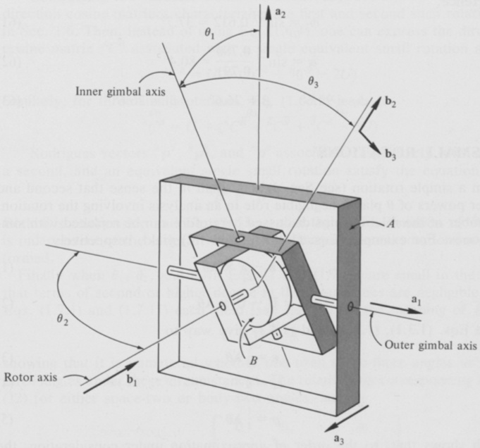{width=77%} 图1.7.2

 ---------------------------------------------[ 第54页 ]---------------------------------------------  

通过检查方程（2）至（6），可以发现用于计算$\phi_{1}$、$\phi_{2}$、$\phi_{3}$所需的$C$矩阵元素分别为$C_{31}$、$C_{32}$、$C_{33}$、$C_{21}$和$C_{11}$。根据方程（31），

$$
C _ { 31 } = - \frac { \sqrt { 3 } } { 2 } \frac { \sqrt { 2 } } { 2 } = - 0 . 61 2
$$

$$
C _ { 32 } = \frac { \sqrt { 3 } } { 2 } \, \frac { \sqrt { 2 } } { 2 } \, \frac { \sqrt { 3 } } { 2 } + \frac { 1 } { 2 } \, \frac { 1 } { 2 } = 0 . 78 0
$$

$$
C _ { _ { 33 } } = \frac { \sqrt { 3 } } { 2 } \, \frac { \sqrt { 2 } } { 2 } \, \frac { 1 } { 2 } - \frac { \sqrt { 3 } } { 2 } \, \frac { 1 } { 2 } = \, - 0 . 12 7
$$

$$
C _ { 21 } = \frac { 1 } { 2 } \frac { \sqrt { 2 } } { 2 } = 0 . 35 4
$$

$$
C _ { 11 } = \frac { \sqrt { 2 } } { 2 } = 0 . 70 7
$$

因此，

$$
\phi _ { 2 } = \sin ^{- 1} 0 . 61 2 = 37 . 7 ^{\circ}
$$

$$
\alpha = \sin ^{- 1} \frac { 0 . 78 0 } { 0 . 79 1 } = 80 . 4 ^{\circ}
$$

$$
\phi _ { 1 } = 99 . 6 ^{\circ}  \beta = 26 . 6 ^{\circ}  \phi _ { 3 } = 26 . 6 ^{\circ}
$$

# 1.8 小转动

当简单的旋转（参见第1.1节）在意义下属于小转动——即在涉及该旋转的分析中，$\theta$的二次及更高次幂的作用可以忽略不计时——此前所讨论的诸多关系便可被更简单的表达式所取代。例如，方程（1.1.1）和（1.1.2）分别给出，

$$
\mathbf { b } = \mathbf { a } - \mathbf { a } \times \lambda \theta
$$

以及

$$
\mathbf { C } = \mathbf { U } - \mathbf { U } \times \lambda \theta
$$

与此同时，方程（1.3.1）、（1.3.3）和（1.4.1）则逐渐被……所取代。

$$
\epsilon = \frac { 1 } { 2 } \lambda \theta
$$

$$
\epsilon _ { 4 } = 1
$$

并且

$$
\rho = { \frac { 1 } { 2 } } \lambda \theta
$$

这表明，在所考虑的近似阶数下，罗德里格斯向量与欧拉向量已无法区分。

 ---------------------------------------------[ 第55页 ]---------------------------------------------  

正如我们即将看到的那样，对小旋转的解析描述往往涉及斜对称矩阵。在处理这些矩阵时，采用一种方便的记号约定十分有用：将字母 $q$ 上加一个波浪线，即可表示一个斜对称矩阵，其非对角元素的值用 $\pm q_{i}$（$i = 1, 2, 3$）来标注，且这些元素的排列方式如下：

$$
\begin{array}{rl} { \widetilde { q } } & { { } = \left[ \begin{array}{lll} { 0 } & { - q _ { 3 } } & { q _ { 2 } } \\{ q _ { 3 } } & { 0 } & { - q _ { 1 } } \\{ - q _ { 2 } } & { q _ { 1 } } & { 0 } \end{array} \right] } \end{array}
$$

按照这一约定，我们可以将式 (1.2.23)–(1.2.31) 中忽略 $\theta$ 的二次及更高次幂所得的结果表示为

$$
C = U + \widetilde { \lambda } \theta
$$

同样地，式 (1.3.6)–(1.3.14) 得到

$$
C = U + 2 \widetilde { \epsilon }
$$

假设我们进行两次连续的小旋转，设 $^{A}C^{\bar{B}}$ 和 $^{\bar{B}}C^{B}$ 分别是第 1.6 节中所描述的第一和第二次小旋转的方向余弦矩阵。那么，与其使用式 (1.6.4)，我们也可以将与单个等效小旋转相关的方向余弦矩阵 $^{A}C^{B}$ 表示为

$$
{ } ^{A} C ^{B} = U + ( { } ^{A} C ^{\overline { { { B} } } } + { } ^{\overline { { { B} } } } C ^{B} - 2 U )
$$

同样地，对于三次小旋转，式 (1.6.15) 导致

$$
{ } ^{A} C ^{B} = U + ( { } ^{A} C ^{\overline { { { B} } } } + { } ^{\overline { { { B} } } } C ^{\overline { { { B} } } } + { } ^{\overline { { { B} } } } C ^{B} - 3 U )
$$

与第一次、第二次以及等效的单个小旋转分别对应的罗德里格斯向量 $^{A}\rho^{\overline{B}}$、$^{\overline{B}}\rho^{B}$ 和 $^{A}\rho^{B}$ 满足以下方程

$$
{ } ^{A} \rho ^{B} = { } ^{A} \rho ^{\overline { { { B} } } } + { } ^{\overline { { { B} } } } \rho ^{B}
$$

无论是这一关系，还是式 (9)，都表明 $B$ 在 $A$ 中的最终姿态，与先后执行两次小旋转的顺序无关。

最后，当式 (1.7.1)–(1.7.40) 中的 $\theta_{1}$、$\theta_{2}$ 和 $\theta_{3}$ 都是小角度——即这些量中的二次及以上项可以忽略不计时——则式 (1.7.1) 和式 (1.7.11) 分别得出 [参见式 (6)，了解 $\widetilde{\theta}$ 的含义]

$$
C = U + \widetilde { \theta }
$$

这表明，在这种情况下，使用空间三维角还是体三维角，并无实质区别。对应于空间二维或体二维角的式 (12) 所表达的关系，即

$$
C _ { ( 1 . 7 . 21 ) } U + \left[ \begin{array}{lll} { { 0 } } & { { 0 } } & { { \theta _ { 2 } } } \\{ { 0 } } & { { 0 } } & { { - ( \theta _ { 3 } + \theta _ { 1 } ) } } \\{ { - \theta _ { 2 } } } & { { \theta _ { 3 } + \theta _ { 1 } } } & { { 0 } } \end{array} \right]
$$

 ---------------------------------------------[ 第56页 ]---------------------------------------------  

实用性较低，因为该方程无法唯一地解出 $\theta_{1}$ 和 $\theta_{3}$，使其作为 $C_{ij}$（$i,j = 1, 2, 3$）的函数而求得。

当将$\sin \theta$替换为$\theta$，并将$\cos \theta$替换为1时，推导出的方程（1）可由方程（1.1.1）得出。同样地，将方程（1.1.2）中的$\sin (\theta/2)$替换为$\theta/2$，将$\cos (\theta/2)$替换为1，即可得到方程（2）。方程（3）和方程（4）则是通过将方程（1.3.1）和方程（1.3.3）中的$\sin (\theta/2)$替换为$\theta/2$，将$\cos (\theta/2)$替换为1而得来的；而当将$\tan (\theta/2)$替换为$\theta/2$时，方程（5）可由方程（1.4.1）得出。

方程（7）直接源于方程（1.2.23）至方程（1.2.31），而方程（8）则是在根据方程（1.3.6）至方程（1.3.14）构建$C_{ij}$时，对$ε_1$、$ε_2$和/或$ε_3$中的二次项进行消去后所得的结果。这一做法在参考方程（3）和方程（1.3.2）的情况下是合理的。

要验证方程（9）的正确性，可按如下步骤进行：利用方程（7），可以将第1.6节中引入的矩阵$^{A}C^{\bar{B}}$和$\bar{B}C^{B}$表示为

$$
{ } ^{A} C ^{\overline { { B} } } = U + \widetilde { \lambda } \theta
$$

以及

$$
\overline { { { B } } } C ^{B} = U + \widetilde { \mu } \phi
$$

其中，$\theta$和$\phi$分别代表第一次和第二次小旋转的弧度值，而$\widetilde{\lambda}$和$\widetilde{\mu}$则用于表征相应的旋转轴。将这些变量代入方程（1.6.4），并消去$\widetilde{\lambda}\widetilde{\mu}\theta\phi$项，即可得到

$$
\begin{array}{rl} { ^{A} C ^{B} = U + \widetilde { \lambda } \theta + \widetilde { \mu } \phi } \\{ = U + ( U + \widetilde { \lambda } \theta + U + \widetilde { \mu } \phi - 2 U ) } \\{ = U + ( ^{A} C ^{\overline { { B} } } + \overline { { { B } } } C ^{B} - 2 U ) } \end{array}
$$

类似的推导过程也能够得出方程（10）。

{width=49%} 图1.8.1

 ---------------------------------------------[ 第57页 ]---------------------------------------------  

最后，可通过将方程（5）与方程（1.6.5）结合使用来获得方程（11），而方程（12）和方程（13）则分别通过对方程（1.7.11）和方程（1.7.21）中的$\theta_{i}$（$i = 1, 2, 3$）进行线性化处理，并沿用方程（6）所确立的约定而得。

如图1.8.1所示，$\mathbf{a}_{1}$、$\mathbf{a}_{2}$和$\mathbf{a}_{3}$构成一个右手系的正交单位向量，其中$\mathbf{a}_{1}$和$\mathbf{a}_{2}$平行于矩形板$B$的边；$X$和$Y$分别表示垂直于$\mathbf{a}_{1}$和$\mathbf{a}_{2}$的直线。当$B$依次绕$X$旋转0.01弧度，又绕$Y$旋转0.02弧度时，且每次旋转的方向均如图示所示，点$P$将沿距离$d$移动。该距离的计算应基于以下假设：两次旋转均可视为小旋转。

若用$a$表示旋转前点$P$相对于点$O$的位置向量，用$b$表示第二次旋转后点$P$相对于点$O$的位置向量，则有

$$
d = | \mathbf { b } - \mathbf { a } |
$$

其中

$$
\mathbf { a } = L ( 3 \mathbf { a } _ { 1 } + 4 \mathbf { a } _ { 2 } )
$$

以及

$$
\mathbf { b } = \mathbf { a } - \mathbf { a } \times \lambda \theta
$$

其中，$\lambda$ 和 $\theta$ 分别为单位向量，以及与单次旋转相关联的角的弧度度数——该旋转等价于给定的两次旋转。要确定乘积 $\lambda\theta$，不妨设 $\rho$ 为该等效旋转的罗德里格斯向量，在这种情况下，

$$
\lambda \theta = 2 \rho
$$

并参考式（11），将 $\rho$ 表示为

$$
\rho = \rho _ { x } + \rho _ { y } = \frac { 0 . 01 } { 2 } \lambda _ { x } + \frac { 0 . 02 } { 2 } \lambda _ { y }
$$

其中，$\lambda_{x}$ 和 $\lambda_{y}$ 是如图 1.8.1 所示方向的单位向量；也就是说，

$$
\lambda _ { x } = \frac { 1 } { \sqrt { 2 } } \left( \mathbf { a } _ { 2 } + \mathbf { a } _ { 3 } \right)
$$

并且

$$
\lambda _ { y } = \frac { 1 } { 2 } \left( \sqrt { 3 } \mathbf { a } _ { 1 } + \mathbf { a } _ { 3 } \right)
$$

然后

$$
\begin{array}{rl} { \lambda \theta } & { = \mathbf { 0 . 01 } \lambda _ { x } + \mathbf { 0 . 02 } \lambda _ { y } } \\& { = \frac { \mathbf { 0 . 01 } } { ( 22 , 23 ) } \left[ \sqrt { 6 } \mathbf { a } _ { 1 } + \mathbf { a } _ { 2 } + ( 1 + \sqrt { 2 } ) \mathbf { a } _ { 3 } \right] } \end{array}
$$

 ---------------------------------------------[ 第58页 ]---------------------------------------------  

$$
\begin{array}{rl} { \mathbf { b } - \mathbf { a } } & { = - \mathbf { a } \times ( \lambda \theta ) } \\& { = \frac { 0 . 01 } { ( 18 , 24 ) } \left[ - 4 ( 1 + \sqrt { 2 } ) \mathbf { a } _ { 1 } + 3 ( 1 + \sqrt { 2 } ) \mathbf { a } _ { 2 } + ( 4 \sqrt { 6 } - 3 ) \mathbf { a } _ { 3 } \right] L } \end{array}
$$

并且

$$
d \; _ { ( 17 , 25 ) } = L \left[ \frac { 16 ( 1 + \sqrt { 2 } ) ^{2} + 9 ( 1 + \sqrt { 2 } ) ^{2} + ( 4 \sqrt { 6 } - 3 ) ^{2} } { 20 , 00 0 } \right] ^{1 / 2} = 0 . 09 8 L
$$

# 1.9 螺旋运动

若 $P_{1}$ 和 $P_{2}$ 是固定在参考系 $A$ 中的两点，而一点 $P$ 从 $P_{1}$ 移动到 $P_{2}$，则称 $P$ 在 $A$ 中经历了位移，且 $P_{2}$ 相对于 $P_{1}$ 的位置向量，被称为 $P$ 在 $A$ 中的位移向量。

当刚体 $B$ 的各点在参考系 $A$ 中经历位移时，人们称之为 $B$ 在 $A$ 中的位移；若 $B$ 在 $A$ 中的位移向量均相等，则称 $B$ 在 $A$ 中的位移为 $B$ 在 $A$ 中的平移。

刚体 $B$ 在参考系 $A$ 中的每一次位移，都可以通过依次对 $B$ 进行平移来实现——在平移过程中，任意选取 $B$ 的一个基点 $P$，将其从初始位置移动至终态位置，并在此过程中进行一次简单的旋转（详见第 1.1 节），且在这一过程中 $P$ 保持在 $A$ 中不动。简单旋转的罗德里格斯向量（详见第 1.4 节）与基点的选择无关，而基点的位移向量则取决于基点的选择。当基点的位移向量与旋转的罗德里格斯向量平行时，所考虑的位移被称为可通过螺旋运动来实现。

在参考系A中，刚体B的每一次位移都可以通过螺旋运动来实现。换句话说，我们总能找到一个基点，其位移向量与与B在A中发生位移所对应的罗德里格斯向量平行。事实上，这样的基点有无穷多处，它们都位于一条与罗德里格斯向量平行的直线上，并被称为“螺旋轴”；而位于螺旋轴上的B各点的位移向量彼此相等，因此可以用一个单一的向量来加以描述，该向量被称为“螺旋平移向量”。此外，螺旋平移向量的大小要么小于或等于不位于螺旋轴上的任意基点的位移向量的大小。

若$\delta$为任意基点$P$的位移向量，$\delta$即为与B在A中发生位移所对应的旋转的罗德里格斯向量，而$P^*$为位于螺旋轴上的B中的某一点（见图1.9.1），则$P^*$相对于$P$在B在A中发生位移之前的位矢$\mathbf{a}^*$满足以下方程：

$$
a ^{*} = \frac { \rho \times \delta + ( \rho \times \delta ) \times \rho } { 2 \rho ^{2} } + \mu \rho
$$

 ---------------------------------------------[ 第59页 ]---------------------------------------------  

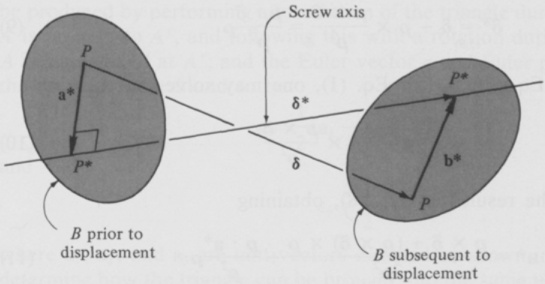{width=61%} 图1.9.1

其中$\mu$取决于$P^{*}$的选择；而螺旋平移向量$\delta^{*}$由下式给出：

$$
\delta ^{*} = \frac { \rho \cdot \delta } { \rho ^{2} } \rho
$$

推导过程：若$P^*$和$P$均为任意选取的B中的点，且$\mathbf{a}^*$为$P^*$相对于$P$在B在A中发生位移之前的位矢，而$\mathbf{b}^*$为$P^*$相对于$P$在该位移之后的位矢，则$P^*$的位移向量$\boldsymbol{\delta}^*$可以表示为（见图1.9.1）：

$$
\delta ^{*} = \delta + \mathbf { b } ^{*} - \mathbf { a } ^{*}
$$

其中$\delta$为$P$的位移向量；以及

$$
\mathbf { b } ^{*} - \mathbf { a } ^{*} = \underset { ( 1 . 4 . 5 ) } { \mathbf { a } } \boldsymbol { \rho } \times ( \mathbf { a } ^{*} + \mathbf { b } ^{*} )
$$

从而

$$
\delta _ { ( 3 , 4 ) } ^{*} = \delta + \rho \times ( \mathbf { a } ^{*} + \mathbf { b } ^{*} )
$$

因此，若要选择$P^*$，使得$\delta^*$与$\rho$平行——在这种情况下，$\rho \times \delta^*$等于零——则$\mathbf{a}^*$必须满足以下方程：

$$
\rho \times \delta + \rho \times \left[ \rho \times ( { \bf a } ^{*} + { \bf b } ^{*} ) \right] \stackrel { ( 5 ) } { = } { \bf 0 }
$$

或者，等价地，

$$
\rho \times \hat { \mathbf { \delta } } + \rho \cdot ( \mathbf { a } ^{*} + \mathbf { b } ^{*} ) \rho - \rho ^{2} ( \mathbf { a } ^{*} + \mathbf { b } ^{*} ) = 0
$$

从而

$$
\mathbf { a } ^{*} + \mathbf { b } ^{*} = { \frac { \rho \times { \hat { \boldsymbol { \delta } } } } { \rho ^{2} } } + { \frac { \rho \cdot \left( \mathbf { a } ^{*} + \mathbf { b } ^{*} \right) } { \rho ^{2} } } \, \rho
$$

 ---------------------------------------------[ 第60页 ]---------------------------------------------  

并且

$$
\delta _ { ( 5 , 8 ) } ^{*} = \delta + \rho \times \frac { \rho \times \delta } { \rho ^{2} } = \frac { \rho \cdot \delta } { \rho ^{2} } \rho
$$

与式（2）一致。至于式（1），我们可以解出以下方程：

$$
{ \bf b } ^{*} - { \bf a } ^{*} = \rho \times \frac { \rho \times \delta } { \rho ^{2} }
$$

对于$\mathbf{b}^{*}$，将所得结果代入式（8），得到：

$$
{ \bf a } ^{*} = \frac { \rho \times \delta + ( \rho \times \delta ) \times \rho } { 2 \rho ^{2} } + \frac { \rho \cdot { \bf a } ^{*} } { \rho ^{2} } \rho
$$

然后，只需将μ定义为ρ·a*/ρ²。此外，该方程表明，其位移向量与ρ平行的基点轨迹是一条与ρ平行的直线。

认为螺杆平移向量的模长要么小于或等于任何不位于螺杆轴上的点的位移向量模长的说法，是基于这样一项观察：

$$
\left| \delta ^{*} \right| _ { ( 2 ) } = \left| { \frac { \rho \cdot \delta } { \rho ^{2} } } \rho \right| = \left| { \frac { \rho \cdot \delta } { | \rho | } } \right|
$$

或者，等价地，

$$
\left| \delta ^{*} \right| = \left| { \frac { \rho } { | \rho | } } \cdot \delta \right| \leq | \delta |
$$

示例　在第1.3节中，我们讨论了图1.9.2所示三角形ABC的位移。所涉及的位移是一种能够

{width=56%} 图1.9.2

 ---------------------------------------------[ 第61页 ]---------------------------------------------  

可通过对三角形进行平移操作来实现，其中点A被移动至A'，随后再进行一次旋转，使点A在A'处保持固定；而此次旋转对应的欧拉向量ε以及欧拉参数ε₄已被求得为

$$
\epsilon = \frac { 1 } { 2 } ( a _ { 1 } - a _ { 2 } - a _ { 3 } )
$$

并且

$$
\epsilon _ { 4 } = \frac { 1 } { 2 }
$$

其中，a₁、a₂和a₃是如图1.9.2所示方向的单位向量。为了确定如何通过螺杆运动使三角形恢复到同一最终位置，可依据式(1.4.2)和式(1.4.3)计算得到ρ，并得出

$$
\rho = a _ { 1 } - a _ { 2 } - a _ { 3 }
$$

接下来，设点A的位移向量为δ（见图1.9.2）；也就是说，

$$
\delta = L ( \mathbf { a } _ { 1 } + \mathbf { a } _ { 2 } - \mathbf { a } _ { 3 } )
$$

然后

$$
\rho \times \delta = 2 L ( \mathbf { a } _ { 1 } + \mathbf { a } _ { 3 } )
$$

$$
( \rho \times \delta ) \times \rho = 2 L ( { \bf a } _ { 1 } + 2 { \bf a } _ { 2 } - { \bf a } _ { 3 } )
$$

且在三角形发生位移之前，任意点P*相对于点A的螺杆轴位置向量a*⁰可表示为

$$
\begin{aligned} \mathbf { a } ^{*} & = \frac { 2 L \left( \mathbf { a } _ { 1 } + \mathbf { a } _ { 3 } \right) + 2 L \left( \mathbf { a } _ { 1 } + 2 \mathbf { a } _ { 2 } - \mathbf { a } _ { 3 } \right) } { \left( 2 \right) \left( 3 \right) } + \mu \rho \\& = \frac { 2 L } { 3 } \left( \mathbf { a } _ { 1 } + \mathbf { a } _ { 2 } \right) + \mu \rho \end{aligned}
$$

因此，若任意取μ等于零，则当三角形处于原始位置时，P*的位置如图1.9.3所示；同时，由于螺杆轴与ρ平行，其形态亦如图所示。此外，螺杆平移向量δ*可表示为

$$
\begin{aligned} \mathbf { \delta } ^{*} & = \frac { L \left( \mathbf { a } _ { 1 } - \mathbf { a } _ { 2 } - \mathbf { a } _ { 3 } \right) \cdot \left( \mathbf { a } _ { 1 } + \mathbf { a } _ { 2 } - \mathbf { a } _ { 3 } \right) } { 3 } \left( \mathbf { a } _ { 1 } - \mathbf { a } _ { 2 } - \mathbf { a } _ { 3 } \right) \\& = \frac { L } { 3 } \left( \mathbf { a } _ { 1 } - \mathbf { a } _ { 2 } - \mathbf { a } _ { 3 } \right) \end{aligned}
$$

因此，

$$
\left| \delta ^{*} \right| = \frac { L } { \sqrt { 3 } }
$$

而在第1.3节的示例中所求得的三角形位移所对应的旋转角度θ值为

 ---------------------------------------------[ 第62页 ]---------------------------------------------  

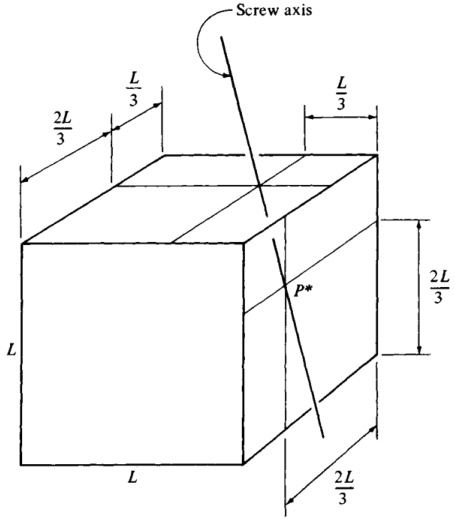{width=51%} 图1.9.3

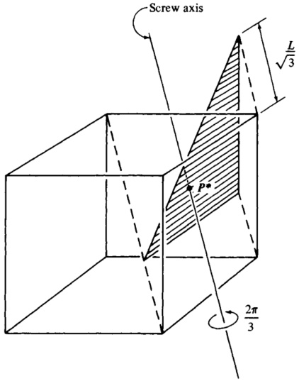{width=47%} 图1.9.4

 ---------------------------------------------[ 第63页 ]---------------------------------------------  

$$
\theta = \frac { 2 \pi } { 3 } \, \mathrm { r a d }
$$

因此，要将三角形调整至所需位置，可按如下步骤操作：按照图1.9.4所示，沿距离$L/\sqrt{3}$进行平移，随后绕螺钉轴旋转$2\pi/3$弧度，并按照图1.9.4中所示的旋转方向进行旋转。

# 1.10 角速度矩阵

若$\mathbf{a}_{1}$、$\mathbf{a}_{2}$、$\mathbf{a}_{3}$以及$\mathbf{b}_{1}$、$\mathbf{b}_{2}$、$\mathbf{b}_{3}$分别是在两个参考系或刚体$A$和$B$中固定的一组右手正交单位向量，而这两个参考系或刚体彼此相对运动，则第1.2节中定义的方向余弦矩阵$C$及其各元素$C_{ij}$（$i,j=1,2,3$）均随时间$t$而变化。$C$的时间导数，用$\dot{C}$表示，并通过$C_{ij}$（$i,j=1,2,3$）的时间导数$\dot{C}_{ij}$来定义，即：

$$
\begin{array}{rl} { \dot { C } \triangleq } & { { } \left[ \begin{array}{lll} { \dot { C } _ { 11 } } & { \dot { C } _ { 12 } } & { \dot { C } _ { 13 } } \\{ \dot { C } _ { 21 } } & { \dot { C } _ { 22 } } & { \dot { C } _ { 23 } } \\{ \dot { C } _ { 31 } } & { \dot { C } _ { 32 } } & { \dot { C } _ { 33 } } \end{array} \right] } \end{array}
$$

可以表示为$C$与一个反对称矩阵$\widetilde{\omega}$的乘积——该矩阵被称为$B$在$A$中的角速度矩阵，并被定义为：

$$
\widetilde { \omega } \triangleq C ^{T} \dot { C }
$$

换句话说，当$\widetilde{\omega}$如式(2)中所定义时，

$$
\dot { C } \ = C \ \widetilde { \omega }
$$

若按照式(1.8.6)中确立的记号惯例引入函数$\omega_{1}(t)$、$\omega_{2}(t)$和$\omega_{3}(t)$，即通过将$\widetilde{\omega}$表示为

$$
\widetilde { \omega } \; = \; \left[ \begin{array}{lll} { { 0 } } & { { - \omega _ { 3 } } } & { { \omega _ { 2 } } } \\{ { \omega _ { 3 } } } & { { 0 } } & { { - \omega _ { 1 } } } \\{ { - \omega _ { 2 } } } & { { \omega _ { 1 } } } & { { 0 } } \end{array} \right]
$$

则$\omega_{1}$、$\omega_{2}$和$\omega_{3}$的表达式分别为

$$
\omega _ { 1 } = C _ { 13 } \, \dot { C } _ { 12 } + C _ { 23 } \, \dot { C } _ { 22 } + C _ { 33 } \, \dot { C } _ { 32 }
$$

$$
\omega _ { 2 } = C _ { 21 } \, \dot { C } _ { 23 } + C _ { 31 } \, \dot { C } _ { 33 } + C _ { 11 } \, \dot { C } _ { 13 }
$$

$$
\omega _ { 3 } = C _ { 32 } \, \dot { C } _ { 31 } + C _ { 12 } \, \dot { C } _ { 11 } + C _ { 22 } \, \dot { C } _ { 21 }
$$

在将$\eta_{ijk}$定义为

$$
\eta _ { i j k } \triangleq \frac { 1 } { 2 } \, \epsilon _ { i j k } ( \epsilon _ { i j k } + 1 )  ( i , j , k = 1 , 2 , 3 )
$$

其中$\epsilon_{ijk}$由式(1.2.32)给出。（当$\eta_{ijk}$等于一时，

 ---------------------------------------------[ 第64页 ]---------------------------------------------  

下标按循环顺序出现；否则其值为零。利用重复下标的求和约定，可将式(5)至式(7)替换为

$$
\omega _ { i } = \eta _ { i g h } \; \dot { C } _ { j g } \; C _ { j h }  ( i = 1 , \, 2 , \, 3 )
$$

同样地，式(3)也可以表示为

$$
\dot { C } _ { i j } = C _ { i g } \ \omega _ { h } \ \epsilon _ { g h j }  ( i , j = 1 , 2 , 3 )
$$

或者，更明确地表述为

$$
\dot { C } _ { 11 } = C _ { 12 } \, \omega _ { 3 } - C _ { 13 } \, \omega _ { 2 }
$$

$$
\dot { C } _ { 12 } = C _ { 13 } \, \omega _ { 1 } - C _ { 11 } \, \omega _ { 3 }
$$

$$
\dot { C } _ { 13 } = C _ { 11 } \, \omega _ { 2 } - C _ { 12 } \, \omega _ { 1 }
$$

$$
\dot { C } _ { 21 } = C _ { 22 } \, \omega _ { 3 } - C _ { 23 } \, \omega _ { 2 }
$$

$$
\dot { C } _ { 22 } = C _ { 23 } \ \omega _ { 1 } - C _ { 21 } \ \omega _ { 3 }
$$

$$
\dot { C } _ { 23 } = C _ { 21 } \, \omega _ { 2 } - C _ { 22 } \, \omega _ { 1 }
$$

$$
\dot { C } _ { 31 } = C _ { 32 } \, \omega _ { 3 } - C _ { 33 } \, \omega _ { 2 }
$$

$$
\dot { C } _ { 32 } = C _ { 33 } \ \omega _ { 1 } - C _ { 31 } \ \omega _ { 3 }
$$

$$
\dot { C } _ { 33 } = C _ { 31 } \ \omega _ { 2 } - C _ { 32 } \ \omega _ { 1 }
$$

式(10)被称为泊松的运动学方程。

推导过程表明，将$\widetilde{\omega}$与$C$相乘，可得

$$
C \ \widetilde { \omega } \ = C \ C ^{T} \ \dot { C } \ = \ \dot { C }
$$

与式(3)一致。

要证明在式（2）中定义的$\widetilde{\omega}$是反对称的，只需注意到

$$
\begin{array}{rl} { \tilde { \omega } ^{T} + \tilde { \omega } } & { { } = ( C ^{T} \dot { C } ) ^{T} + C ^{T} \dot { C } = \dot { C } ^{T} C + C ^{T} \dot { C } = \frac { d } { d t } ( C ^{T} C ) } \\{ } & { { } = \frac { d U } { d t } = 0 } \end{array}
$$

因此，

$$
{ \widetilde { \omega } } ^{T} = - { \widetilde { \omega } }
$$

式（5）至式（7）源自式（2）和式（4），亦即源自

$$
\left[ \begin{array}{lll} { 0 - \omega _ { 3 } } & { \omega _ { 2 } } \\{ \omega _ { 3 } } & { 0 - \omega _ { 1 } } \\{ - \omega _ { 2 } } & { \omega _ { 1 } } \end{array} \right] = \left[ \begin{array}{lll} { C _ { 11 } } & { C _ { 21 } } & { C _ { 31 } } \\{ C _ { 12 } } & { C _ { 22 } } & { C _ { 32 } } \\{ C _ { 13 } } & { C _ { 23 } } & { C _ { 33 } } \end{array} \right] \left[ \begin{array}{lll} { \dot { C } _ { 11 } } & { \dot { C } _ { 12 } } & { \dot { C } _ { 13 } } \\{ \dot { C } _ { 21 } } & { \dot { C } _ { 22 } } & { \dot { C } _ { 23 } } \\{ \dot { C } _ { 31 } } & { \dot { C } _ { 32 } } & { \dot { C } _ { 33 } } \end{array} \right]
$$

 ---------------------------------------------[ 第65页 ]---------------------------------------------  

示例：当物体$B$在参考系$A$中进行简谐旋转运动时（参见第1.1节），$\omega_{1}$、$\omega_{2}$和$\omega_{3}$这些量可以以一种简洁而富有洞察力的形式表示出来。因为$\theta$和$\lambda_{i}$（$i=1,2,3$）与第1.1节和第1.2节中的含义相同，并且将式（1.2.23）至式（1.2.31）代入式（5）后，我们得到

$$
\begin{array}{rl} { \gamma _ { 1 } = } & { [ \lambda _ { 2 } \sin \theta + \lambda _ { 3 } \lambda _ { 1 } ( 1 - \cos \theta ) ] ( - \lambda _ { 3 } \cos \theta + \lambda _ { 1 } \lambda _ { 2 } \sin \theta ) \dot { \theta } } \\& { - \left[ - \lambda _ { 1 } \sin \theta + \lambda _ { 2 } \lambda _ { 3 } ( 1 - \cos \theta ) \right] ( \lambda _ { 3 } ^{2} + \lambda _ { 1 } ^{2} ) \sin \theta \, \dot { \theta } } \\& { + \left[ 1 - ( \lambda _ { 1 } ^{2} + \lambda _ { 2 } ^{2} ) ( 1 - \cos \theta ) \right] ( \lambda _ { 1 } \cos \theta + \lambda _ { 2 } \lambda _ { 3 } \sin \theta ) \, \dot { \theta } } \\& { = \ } \\& { \left[ \lambda _ { 1 } ( \lambda _ { 1 } ^{2} + \lambda _ { 2 } ^{2} + \lambda _ { 3 } ^{2} ) \right. } \\& { \left. + \ ( 1 - \lambda _ { 1 } ^{2} - \lambda _ { 2 } ^{2} - \lambda _ { 3 } ^{2} ) ( \lambda _ { 1 } \cos \theta + \lambda _ { 2 } \lambda _ { 3 } \sin \theta - \lambda _ { 2 } \lambda _ { 3 } \sin \theta \cos \theta ) \right. } \end{array}
$$

由于

$$
\lambda _ { 1 } ^{2} + \lambda _ { 2 } ^{2} + \lambda _ { 3 } ^{2} = 1
$$

化为

$$
\omega _ { 1 } = \lambda _ { 1 } \dot { \theta }
$$

同样地，

$$
\omega _ { 2 } = \lambda _ { 2 } \, \dot { \theta }
$$

以及

$$
\omega _ { 3 } = \lambda _ { 3 } \, \dot { \theta }
$$

第1.11节 角速度矢量

定义的矢量$\omega$

$$
\omega \triangleq \omega _ { 1 } \; \mathbf { b } _ { 1 } + \omega _ { 2 } \; \mathbf { b } _ { 2 } + \omega _ { 3 } \; \mathbf { b } _ { 3 }
$$

其中$\omega_{i}$和$\mathbf{b}_{i}$（$i=1,2,3$）与第1.10节中的含义相同，被称为$B$在$A$中（或相对于$A$）的角速度。有时，使用更为复杂的符号${}^{A}\omega^{B}$代替$\omega$会更加方便。而符号${}^{B}\omega^{A}$则表示$A$在$B$中的角速度，并且

$$
{ } ^{A} \omega ^{B} = - { } ^{B} \omega ^{A}
$$

若将参考系$A$中$\mathbf{b}_{i}$的一阶导数记作$\dot{\mathbf{b}}_{i}$，亦即如果$\dot{\mathbf{b}}_{i}$被定义为

$$
\dot { \textbf { b } } _ { i } \triangleq \textbf { a } _ { j } \frac { d } { d t } ( \textbf { a } _ { j } \cdot \textbf { b } _ { i } )  ( i = 1 , 2 , 3 )
$$

此时采用重复下标之求和约定，并且$a_{1}$、$a_{2}$、$a_{3}$构成一组右手正交单位向量，这些向量在$A$中固定不变，则$\omega$可表示为

$$
\omega = \mathbf { b } _ { 1 } \dot { \mathbf { b } } _ { 2 } \cdot \mathbf { b } _ { 3 } + \mathbf { b } _ { 2 } \dot { \mathbf { b } } _ { 3 } \cdot \mathbf { b } _ { 1 } + \mathbf { b } _ { 3 } \dot { \mathbf { b } } _ { 1 } \cdot \mathbf { b } _ { 2 }
$$

 ---------------------------------------------[ 第66页 ]---------------------------------------------  

当$B$在$A$中的运动为简谐旋转运动时（参见第1.1节），$B$在$A$中的角速度变为

$$
\omega = \dot { \theta } \lambda
$$

其中$\theta$和$\lambda$与第1.1节中的含义相同。

涉及角速度的最实用关系之一，就是两个参考系$A$和$B$中向量$\mathbf{v}$的一阶导数之间的关系。若将这些导数分别记作${}^{A}dv/dt$和${}^{B}dv/dt$，亦即如果

$$
{ \frac { \mathrm { ^{A} d v } } { d t } } \triangleq \mathrm { a } _ { i } \ { \frac { d } { d t } } \left( \mathrm { v } \cdot \mathrm { a } _ { i } \right)
$$

以及

$$
{ \frac { \partial ^{B} \mathbf { v } } { \partial t } } \triangleq \mathbf { b } _ { i } { \frac { d } { d t } } \left( \mathbf { v } \cdot \mathbf { b } _ { i } \right)
$$

那么这一关系可表述为

$$
\frac { \overline { { { A } } } d \mathbf { v } } { d t } = \frac { \overline { { { B } } } d \mathbf { v } } { d t } + \mathbf { A } \omega ^{B} \times \mathbf { v }
$$

若将其应用于固定在$B$中的向量$\beta$，式（8）可得

$$
\frac { \Lambda _ { d } \beta } { d t } = \Lambda _ { \omega } ^{B} \times \beta
$$

鉴于这一结果，可以将$B$在$A$中的角速度视为一种“算子”，该算子作用于任意固定在$B$中的向量时，会生成该向量在$A$中的时间导数。

对于$i=2$，式(3)中出现的标量积可表示为

$$
\mathbf { a } _ { j } \cdot \mathbf { b } _ { 2 } = C _ { j 2 }
$$

因此，

$$
\begin{array}{r} { \dot { \mathbf { b } } _ { 2 } = \mathbf { a } _ { 1 } \, \dot { C } _ { 12 } + \mathbf { a } _ { 2 } \, \dot { C } _ { 22 } + \mathbf { a } _ { 3 } \, \dot { C } _ { 32 } } \end{array}
$$

并且，将$b_{3}$表示为

$$
\mathbf { b } _ { 3 } \stackrel { = } { = } \mathbf { a } _ { 1 } \, C _ { 13 } + \mathbf { a } _ { 2 } \, C _ { 23 } + \mathbf { a } _ { 3 } \, C _ { 33 }
$$

我们发现，

$$
\dot { \mathbf { b } } _ { 2 } \cdot \mathbf { b } _ { 3 } = C _ { 13 } \, \dot { C } _ { 12 } + C _ { 23 } \, \dot { C } _ { 22 } + C _ { 33 } \, \dot { C } _ { 32 } \underset { ( 1 . 10 . 5 ) } { = } \, \omega _ { 1 }
$$

同样地，

$$
\dot { \mathbf { b } } _ { 3 } \cdot \mathbf { b } _ { 1 } = \omega _ { 2 }
$$

以及

$$
\dot { \mathbf { b } } _ { 1 } \cdot \mathbf { b } _ { 2 } = \omega _ { 3 }
$$

将此代入式(1)，即可得到式(4)。

当$B$在$A$中的运动为单纯旋转时，可利用式(1.10.26)-(1.10.28)来将$B$在$A$中的角速度表示为

 ---------------------------------------------[ 第67页 ]---------------------------------------------  

$$
\begin{array}{rl} { \omega _ { \mathrm { ( 1 ) } } = \left( \lambda _ { 1 } \ \mathbf { b } _ { 1 } + \lambda _ { 2 } \ \mathbf { b } _ { 2 } + \lambda _ { 3 } \ \mathbf { b } _ { 3 } \right) \dot { \theta } _ { \mathrm { ( 1 . 2 . 22 ) } } = \left( \lambda \cdot \mathbf { b } _ { 1 } \ \mathbf { b } _ { 1 } + \lambda \cdot \mathbf { b } _ { 2 } \ \mathbf { b } _ { 2 } + \lambda \cdot \mathbf { b } _ { 3 } \ \mathbf { b } _ { 3 } \right) \dot { \theta } } \\{ = \lambda \dot { \theta } } \end{array}
$$

与式(5)一致。

为了验证式(8)的正确性，设$^{A}v_{i}$、$^{B}v_{i}$、$^{A}v$和$^{B}v$与第1.2节中的含义相同。然后，根据式(6)和式(1.2.7)，

$$
{ \frac { \mathbf { v } ^{\mathsf { A} } d \mathbf { v } } { d t } } = \mathbf { v } ^{\mathsf { A} } { \dot { \mathbf { v } } } _ { 1 } \mathbf { a } _ { 1 } + \mathbf { v } ^{\mathsf { A} } { \dot { \mathbf { v } } } _ { 2 } \mathbf { a } _ { 2 } + \mathbf { v } ^{\mathsf { A} } { \dot { \mathbf { v } } } _ { 3 } \mathbf { a } _ { 3 } = \mathbf { v } ^{\mathsf { A} } { \dot { \mathbf { v } } } \left[ \mathbf { a } _ { 1 }  \mathbf { a } _ { 2 }  \mathbf { a } _ { 3 } \right] ^{T}
$$

现在，

$$
A _ { \dot { V } } \; = \; \frac { d } { d t } ( ^{B} _ { V } \; C ^{T} ) \; = \; ^{B} _ { \dot { V } } \; C ^{T} \; + \; ^{B} _ { V } \; \dot { C } ^{T}
$$

以及

$$
{ \left[ \begin{array}{lll} { \mathbf { a } _ { 1 } } & { \mathbf { a } _ { 2 } } & { \mathbf { a } _ { 3 } } \end{array} \right] } ^{T} = { \frac { C } { ( 1 . 2 . 2 ) } } \left[ \begin{array}{lll} { \mathbf { b } _ { 1 } } & { \mathbf { b } _ { 2 } } & { \mathbf { b } _ { 3 } } \end{array} \right] ^{T}
$$

因此，

$$
\begin{aligned}\frac{^Ad\mathbf{v}}{dt}&={}^B\dot{\nu}\:C^T\:C\:[\mathbf{b}_1\mathbf{b}_2\mathbf{b}_3]^T+{}^B\nu\:\dot{C}^T\:C\:[\mathbf{b}_1\mathbf{b}_2\mathbf{b}_3]^T\\&={}^B\dot{\nu}\:[\mathbf{b}_1\mathbf{b}_2\mathbf{b}_3]^T+{}^B\nu\:\widetilde{\omega}^T[\mathbf{b}_1\mathbf{b}_2\mathbf{b}_3]^T\\&\overset{(1.2.17.}{\operatorname*{1.10.2)}}\end{aligned}
$$

此外，根据式(7)和式(1.2.8)

$$
{ } ^{B} \dot { \mathbf { v } } \left[ \mathbf { b } _ { 1 }  \mathbf { b } _ { 2 }  \mathbf { b } _ { 3 } \right] ^{T} = \frac { { } ^{B} d \mathbf { v } } { d t }
$$

与此同时，根据式(1)和式(1.10.4)可知，

$$
{ } ^{B} \nu \ \widetilde { \omega } ^{T} [ \mathbf { b } _ { 1 }  \mathbf { b } _ { 2 }  \mathbf { b } _ { 3 } ] ^{T} = { } ^{A} \omega ^{B} \times \mathbf { v }
$$

因此，

$$
\frac { ^{A} d \mathbf { v } } { d t } = \frac { ^{B} d \mathbf { v } } { d t } + { ^ A } \omega ^{B} \times \mathbf { v }
$$

最后，式(2)源于这样一个事实：若在式(8)中交换$A$和$B$的位置，则可得

$$
\frac { ^ B d \mathbf { v } } { d t } = \frac { ^ A d \mathbf { v } } { d t } + ^ B \omega ^{A} \times \mathbf { v }
$$

并将此等式与式(8)中的对应项相加，便可得出

$$
\frac { ^{A} d \mathbf { v } } { d t } + \frac { ^{B} d \mathbf { v } } { d t } = \frac { ^{B} d \mathbf { v } } { d t } + \frac { ^{A} d \mathbf { v } } { d t } + ( ^{A} \omega ^{B} + ^{B} \omega ^{A} ) \times \mathbf { v }
$$

或者

$$
( ^{A} \omega ^{B} + ^{B} \omega ^{A} ) \times \mathbf { v } = 0
$$

 ---------------------------------------------[ 第68页 ]---------------------------------------------  

只有当$\mathbf{v}$满足此等式时，该等式才能对所有$\mathbf{v}$都成立。

$$
A _ { \omega ^{B} } = - B _ { \omega ^{A} }
$$

示例：当一个点$P$沿一条固定在参考系$A$中的空间曲线$C$移动时（参见图1.11.1），可以通过让$\mathbf{p}$为$P$相对于固定在$C$上的点$P_0$的位置向量，并定义$\mathbf{b}_1$、$\mathbf{b}_2$、$\mathbf{b}_3$为

$$
\mathbf { b } _ { 1 } \triangleq \mathbf { p } ^{\prime}
$$

$$
\mathbf { b } _ { 2 } \triangleq { \frac { \mathbf { p } ^{\prime \prime} } { | \mathbf { p } ^{\prime \prime} | } }
$$

$$
\mathbf { b } _ { 3 } \triangleq \mathbf { p } ^{\prime} \times { \frac { \mathbf { p } ^{\prime \prime} } { | \mathbf { p } ^{\prime \prime} | } }
$$

其中，“p”表示在 $A$ 中，对点 $P$ 相对于点 $P_0$ 的弧长位移 $s$ 进行的微分。向量 $\mathbf{b}_1$ 称为切向量，$\mathbf{b}_2$ 称为主法向量，$\mathbf{b}_3$ 称为法向量，它们分别在点 $P$ 处构成曲线 $C$ 的切向量、主法向量和法向量；而 $\mathbf{b}_1$、$\mathbf{b}_2$ 和 $\mathbf{b}_3$ 对 $s$ 的导数则由塞雷特-弗雷内公式给出。

$$
\mathbf { b } _ { 1 } ^{\prime} = { \frac { \mathbf { b } _ { 2 } } { \rho } }
$$

$$
{ \bf b } _ { 2 } ^{\prime} = \frac { - { \bf b } _ { 1 } } { \rho } + \lambda { \bf b } _ { 3 }
$$

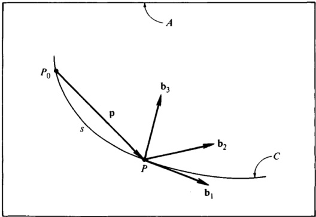{width=60%} 图1.11.1

 ---------------------------------------------[ 第69页 ]---------------------------------------------  

$$
\mathbf { b } _ { 3 } ^{\prime} = - \lambda \mathbf { b } _ { 2 }
$$

其中，$\rho$ 和 $\lambda$ 的定义如下：

$$
\rho \triangleq \frac { 1 } { | \mathbf { p } ^{\prime \prime} | }
$$

以及

$$
\lambda \triangleq \rho ^{2} \mathbf { p } ^{\prime} \cdot \mathbf { p } ^{\prime \prime} \times \mathbf { p } ^{\prime \prime \prime}
$$

被称为曲线 $C$ 在点 $P$ 处的主曲率半径，以及曲线 $C$ 在点 $P$ 处的扭转。

若用 $B$ 表示一个参考系，在该参考系中，$\mathbf{b}_1$、$\mathbf{b}_2$ 和 $\mathbf{b}_3$ 保持固定，则 $B$ 在 $A$ 中的角速度 $\omega$ 可以通过将式（4）与以下内容结合使用来表示：

$$
\dot{\mathbf{b}}_1=\mathbf{b}_1^{\prime}\dot{s}_2=\frac{\mathbf{b}_2^{\prime}\dot{s}}\rho
$$

$$
\dot { \mathbf { b } } _ { 2 } \equiv \left( \frac { - \mathbf { b } _ { 1 } } { \rho } + \lambda \mathbf { b } _ { 3 } \right) \dot { s }
$$

$$
\begin{array}{rl} { { \dot { \mathbf { b } } } _ { 3 } = } & { { } - \lambda \mathbf { b } _ { 2 } \ { \dot { \mathbf { s } } } } \end{array}
$$

$$
\dot { \mathbf { b } } _ { 1 } \cdot \mathbf { b } _ { 2 } = \frac { \dot { s } } { \rho }  \dot { \mathbf { b } } _ { 2 } \cdot \mathbf { b } _ { 3 } = \lambda \, \dot { s }  \dot { \mathbf { b } } _ { 3 } \cdot \mathbf { b } _ { 1 } = \mathbf { 0 }
$$

从而获得

$$
\omega \stackrel { ( 4 ) } { = } \left( \lambda \mathbf { b } _ { 1 } + \frac { \mathbf { b } _ { 3 } } { \rho } \right) \dot { s }
$$

可以看出，将“扭转”这一术语应用于 $\lambda$ 时，在此背景下显得尤为贴切。

# 1.12 角速度分量

式（1.11.1）中给出的 $\omega$ 表达式包含三个分量，每个分量都与固定在 $B$ 中的单位向量平行。有时，有必要以其他方式表达 $\omega$，例如将其分解为与固定在 $A$ 中的单位向量平行的分量。无论采用何种分解方式，我们或许都希望了解 $\omega$ 中任意一个分量所具有的物理意义。

在某些情况下，可以通过为每个角速度分量指定两个参考系，使得其中一个参考系相对于另一个参考系的角速度等于该分量的值，从而赋予角速度分量以物理意义。正如稍后将看到的那样，当 $B$ 在 $A$ 中的角速度如式（1.16.1）所示进行表达时，情况正是如此。然而，一般来说，要准确找到所需的参考系并非易事。例如，在第1.11节所举的示例中，角速度分量 $\lambda\dot{s}\mathbf{b}_1$ 和 $(\dot{s}/\rho)\mathbf{b}_3$ 的参考系往往难以轻易识别。

 ---------------------------------------------[ 第70页 ]---------------------------------------------  

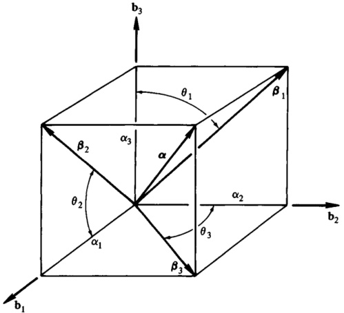{width=56%} 图1.12.1

对于式（1.11.1）中出现的量 $\omega_{1}$、$\omega_{2}$ 和 $\omega_{3}$，以及由此产生的 $\omega$ 的各分量 $\omega_{i}\mathbf{b}_{i}$（$i=1,2,3$），可以给出一种本质上基于几何的解释。为此，我们只需引入三个角度各自的一阶时间导数在空间中的平均值。具体而言，设 $\alpha$ 为固定于参考系 $A$ 中的任意单位向量，$\beta_{i}$ 为 $\alpha$ 在与 $\mathbf{b}_{i}$ 垂直的平面内的正投影，$\theta_{1}$ 为 $\beta_{1}$ 与 $\mathbf{b}_{3}$ 之间的夹角，$\theta_{2}$ 为 $\beta_{2}$ 与 $\mathbf{b}_{1}$ 之间的夹角，$\theta_{3}$ 为 $\beta_{3}$ 与 $\mathbf{b}_{2}$ 之间的夹角，如图 1.12.1 所示。接下来，令 $S$ 为以点 $O$ 为中心的单位球面，并将 $S$ 上的点 $P$ 定义为：其位置向量相对于 $O$ 平行于 $\alpha$（见图 1.12.2）。我们将 $P$ 与 $\theta_{i}$ 的值对应起来，并将 $\dot{\theta}_{i}$ 定义为

$$
\overline { { \dot { \theta } } } _ { i } \triangleq \frac { 1 } { 4 \pi } \int \dot { \theta } _ { i } \ d \sigma  ( i = 1 , \ 2 , \ 3 )
$$

其中 $d\sigma$ 是位于 $P$ 处的 $S$ 微元元素的面积。然后

$$
\omega _ { i } = \overline { { \dot { \theta } } } _ { i }  ( i = 1 , 2 , 3 )
$$

推导过程：将 $\alpha_{i}$ 定义为

$$
\alpha _ { i } \ { \stackrel { \triangle } { = } } \ \alpha \cdot \ \mathbf { b } _ { i }  ( i = 1 , \, 2 , \, 3 )
$$

†作者要感谢哥伦比亚大学的 R. Skalak 教授提出这一思路。

 ---------------------------------------------[ 第71页 ]---------------------------------------------  

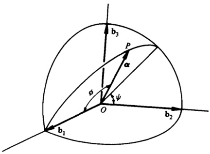{width=49%} 图1.12.2

我们可以将 $\theta_{1}$ 表示为（见图 1.12.1）

$$
\theta _ { 1 } = \tan ^{- 1} \frac { \alpha _ { 2 } } { \alpha _ { 3 } }
$$

由此可得

$$
\dot { \theta } _ { 1 } = \frac { \dot { \alpha } _ { 2 } \ \alpha _ { 3 } - \dot { \alpha } _ { 3 } \ \alpha _ { 2 } } { \alpha _ { 2 } ^{2} + \alpha _ { 3 } ^{2} }
$$

现在，$\frac{^{B}d\alpha}{dt}$ 既可以通过以下方式给出：

$$
\frac { ^ B d \alpha } { d t } = \dot { \alpha } _ { 1 } \; \mathbf { b } _ { 1 } + \dot { \alpha } _ { 2 } \; \mathbf { b } _ { 2 } + \dot { \alpha } _ { 3 } \; \mathbf { b } _ { 3 }
$$

也可以通过以下方式给出

$$
\begin{array}{rl} { { \frac { ^{B} d \alpha } { d t } } } & { { } = { } ^{B} \boldsymbol { \omega } ^{A} \times \boldsymbol { \alpha } = { } ^{- A} \boldsymbol { \omega } ^{B} \times \boldsymbol { \alpha } } \\{ { } } & { { } = { } ^{( 1 . 11 . 9 )} { } ^{( 1 . 11 . 2 )} } \\{ { } } & { { } = { } ^{( 1 . 11 . 1 )} { } ^{( 1 . 11 . 1 )} } \\{ { } } & { { } + { } ^{(} \boldsymbol { \alpha } _ { 3 } \, \omega _ { 1 } - \alpha _ { 1 } \, \omega _ { 3 } \, \mathbf { ) b } _ { 1 } } \\{ { } } & { { } + { } ^{(} \alpha _ { 3 } \, \omega _ { 1 } - \alpha _ { 1 } \, \omega _ { 3 } \, \mathbf { ) b } _ { 2 } } \\{ { } } & { { } + { } ^{(} \alpha _ { 1 } \, \omega _ { 2 } - \alpha _ { 2 } \, \omega _ { 1 } \, \mathbf { ) b } _ { 3 } } \end{array}
$$

因此，

$$
\begin{array}{rl} { \dot { \alpha } _ { i } } & { { } \equiv \underset { ( 1 . 10 . 8 ) } { = } \eta _ { i j k } \ ( \alpha _ { j } \ \omega _ { k } - \alpha _ { k } \ \omega _ { j } )  ( i = 1 , \, 2 , \, 3 ) } \end{array}
$$

并且

$$
\begin{array}{rl} { { \dot { \theta } } _ { 1 } \equiv } & { { } { \frac { ( \alpha _ { 3 } \ \omega _ { 1 } - \alpha _ { 1 } \ \omega _ { 3 } ) \alpha _ { 3 } \ - ( \alpha _ { 1 } \ \omega _ { 2 } - \alpha _ { 2 } \ \omega _ { 1 } ) \alpha _ { 2 } } { \alpha _ { 2 } ^{2} + \alpha _ { 3 } ^{2} } } } \\{ = } & { { } \omega _ { 1 } - { \frac { \alpha _ { 1 } \ \alpha _ { 2 } } { \alpha _ { 2 } ^{2} + \alpha _ { 3 } ^{2} } } \ \omega _ { 2 } \ - { \frac { \alpha _ { 1 } \ \alpha _ { 3 } } { \alpha _ { 2 } ^{2} + \alpha _ { 3 } ^{2} } } \ \omega _ { 3 } } \end{array}
$$

 ---------------------------------------------[ 第72页 ]---------------------------------------------  

为了完成式（1）中所指示的积分运算，引入图 1.12.2 中所示的角 $\phi$ 和 $\psi$，并注意到此时 $\alpha$ 可以表示为

$$
\alpha = \cos \phi \, \mathbf { b } _ { 1 } + \sin \phi \cos \psi \, \mathbf { b } _ { 2 } + \sin \phi \sin \psi \, \mathbf { b } _ { 3 }
$$

这样，

$$
\alpha _ { 1 } = \cos \phi  \alpha _ { 2 } = \sin \phi \cos \psi  \alpha _ { 3 } = \sin \phi \sin \psi
$$

同时，

$$
d \sigma = \sin \phi \, d \phi \, d \psi
$$

因此，

$$
\begin{aligned} 4 \pi \overline{ \theta } _ { 1 } & = \omega _ { 1 } \int _ { 0 } ^{\pi} \left[ \int _ { 0 } ^{2 \pi} \sin \phi \, d \psi \right] d \phi - \omega _ { 2 } \int _ { 0 } ^{\pi} \left[ \int _ { 0 } ^{2 \pi} \cos \phi \cos \psi \, d \psi \right] d \phi \\& - \omega _ { 3 } \int _ { 0 } ^{\pi} \left[ \int _ { 0 } ^{2 \pi} \cos \phi \sin \psi \, d \psi \right] d \phi \end{aligned}
$$

第一个二重积分的值为 $4\pi$，而其余两个二重积分的值均为零。因此，

$$
\overline { { \dot { \theta } _ { 1 } } } = \omega _ { 1 }
$$

同样地，

以及

$$
\overline { { { \dot { \theta } } } } _ { 2 } = \omega _ { 2 }
$$

$$
\overline { { \dot { \theta } } } _ { 3 } = \omega _ { 3 }
$$

如图1.12.3所示，$B$代表一艘圆柱形航天器，在参考系$A$中，其姿态运动可被描述为锥形运动与自转的叠加。前者以角度$\phi$为特征，涉及$B$对称轴在固定于$A$中的圆锥表面上的运动，且该圆锥具有恒定的半涡旋角$\theta$；后者则与两条相交于$B$对称轴、且与该轴垂直的直线之间的夹角$\psi$的变化相关——其中一条直线固定在$B$上，另一条直线则与圆锥的轴相交。在这些条件下，满足以下条件的方向余弦矩阵$C$为：

$$
\left[ \begin{array}{lll} { \mathbf { b } _ { 1 } } & { \mathbf { b } _ { 2 } } & { \mathbf { b } _ { 3 } } \end{array} \right] = \left[ \begin{array}{lll} { \mathbf { a } _ { 1 } } & { \mathbf { a } _ { 2 } } & { \mathbf { a } _ { 3 } } \end{array} \right] C
$$

其中$\mathbf{a}_{i}$和$\mathbf{b}_{i}$（$i=1,2,3$）是如图1.12.3所示方向的单位向量，可表示为

$$
C _ { ( 1 . 6 . 15 ) } = C _ { 1 } ( \phi ) \, C _ { 3 } ( \theta ) \, C _ { 1 } ( \psi )
$$

或者，利用式(1.2.35)和式(1.2.37)，可得

$$
\begin{array}{rl} { C = } & { { } \left[ \begin{array}{lll} { c \theta } & { - s \theta \ c \psi } & { s \theta \ s \psi } \\{ s \theta \ c \phi } & { c \theta \ c \phi \ c \psi - s \phi \ s \psi } & { - c \theta \ c \phi \ s \psi - s \phi \ c \psi } \\{ s \theta \ s \phi } & { c \theta \ s \phi \ c \psi + c \phi \ s \psi } & { - c \theta \ s \phi \ s \psi + c \phi \ c \psi } \end{array} \right] } \end{array}
$$

 ---------------------------------------------[ 第73页 ]---------------------------------------------  

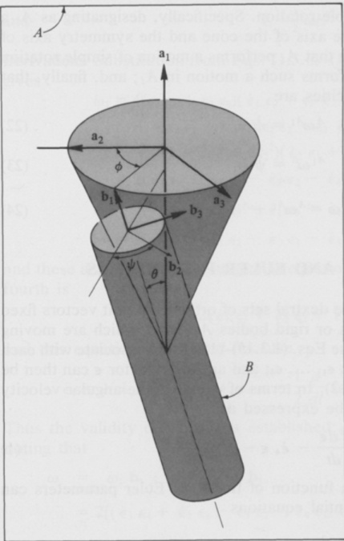{width=48%} 图1.12.3

其中$s\theta$和$c\theta$分别表示$\sin\theta$和$\cos\theta$，$\phi$和$\psi》亦然。根据式(1.10.5)-(1.10.7)构建$\omega_1$、$\omega_2$和$\omega_3$，进而得到$B$在$A$中的角速度$\omega$的如下表达式：

$$
\omega = ( \dot { \psi } \ + \ \dot { \phi } \ \mathrm { c } \theta ) \ \mathbf { b } _ { 1 } \ - \ \dot { \phi } \ \mathrm { s } \theta \ \mathrm { c } \psi \ \mathbf { b } _ { 2 } \ + \ \dot { \phi } \ \mathrm { s } \theta \ \mathrm { s } \psi \ \mathbf { b } _ { 3 }
$$

获得这一结果的一种更高效的方法在第1.16节中有详细说明。就当前而言，我们所关注的是：$\omega$的$\mathbf{b}_{i}$分量（$i = 1, 2, 3$）并不具有显而易见的物理意义，但当$\omega$被重写为

$$
\begin{array}{rl} { \omega = } & { { } \dot { \psi } \ \mathbf { b } _ { 1 } + \dot { \phi } ( \mathbf { c } \theta \ \mathbf { b } _ { 1 } - \mathbf { s } \theta \ \mathbf { c } \psi \ \mathbf { b } _ { 2 } + \mathbf { s } \theta \ \mathbf { s } \psi \ \mathbf { b } _ { 3 } ) } \\{ = } & { { } \dot { \psi } \ \mathbf { b } _ { 1 } + \dot { \phi } \mathbf { a } _ { 1 } } \end{array}
$$

此时，各分量的形状与式(1.11.5)的右端项相同，因此可以被视为一个物体的角速度。

 ---------------------------------------------[ 第74页 ]---------------------------------------------  

进行一次简单的旋转运动。具体而言，将参考系$A_{1}$定义为这样一个参考系：在该参考系中，圆锥的轴以及$B$的对称轴均保持固定。我们可以观察到：$A_{1}$在$A$中执行着简单的旋转运动；此外，$B$也在$A_{1}$中执行着这样的运动；最后，与之相关的角速度分别为

$$
{ } ^{A} \omega ^{A _ { 1} } = \dot { \phi } \; \mathbf { a } _ { 1 }
$$

并且

$$
{ } ^{A _ { 1} } \omega ^{B} = \dot { \psi } \ \mathbf { b } _ { 1 }
$$

由此可见，

$$
\omega = { } ^{A} \omega ^{A _ { 1} } + { } ^{A _ { 1} } \omega ^{B}
$$

# 1.13 角速度与欧拉参数

若 $\mathbf{a}_{1}$、$\mathbf{a}_{2}$、$\mathbf{a}_{3}$ 与 $\mathbf{b}_{1}$、$\mathbf{b}_{2}$、$\mathbf{b}_{3}$ 分别为两组右手系的正交单位向量，且这些向量分别固定在相对运动的参考框架或刚体 $A$ 和 $B$ 中。则可利用式 (1.3.15)–(1.3.18)，为每个时间点赋予欧拉参数 $\epsilon_{1}$、……、$\epsilon_{4}$；随后，可根据式 (1.3.2) 构造出欧拉向量 $\mathbf{\epsilon}$。以 $\mathbf{\epsilon}$ 和 $\mathbf{\epsilon}_{4}$ 为变量，$B$ 在 $A$ 中的角速度（参见第 1.11 节）可表示为

$$
\omega = 2 \left( \epsilon _ { 4 } \frac { ^ B d \epsilon } { d t } - \dot { \epsilon } _ { 4 } \epsilon - \epsilon \times \frac { ^ B d \epsilon } { d t } \right)
$$

反之，若已知 $\omega$ 随时间变化的函数关系，则可通过求解微分方程来确定欧拉参数。

$$
\frac { B d \epsilon } { d t } = \frac { 1 } { 2 } ( \epsilon _ { 4 } \ \omega + \epsilon \times \omega )
$$

以及

$$
\dot { \epsilon } _ { 4 } = - \frac { 1 } { 2 } \omega \cdot \epsilon
$$

可将与式 (1)–(3) 等价的方程，以矩阵 $\omega$、$\epsilon$ 和 $E$ 来表述，这些矩阵的定义如下：

$$
\omega \triangleq [ \omega _ { 1 }  \omega _ { 2 }  \omega _ { 3 }  0 ]
$$

$$
\epsilon \triangleq [ \epsilon _ { 1 }  \epsilon _ { 2 }  \epsilon _ { 3 }  \epsilon _ { 4 } ]
$$

以及

$$
E = \left[ \begin{array}{llll} { { \epsilon _ { 4 } } } & { { - \epsilon _ { 3 } } } & { { \epsilon _ { 2 } } } & { { \epsilon _ { 1 } } } \\{ { \epsilon _ { 3 } } } & { { \epsilon _ { 4 } } } & { { - \epsilon _ { 1 } } } & { { \epsilon _ { 2 } } } \\{ { - \epsilon _ { 2 } } } & { { \epsilon _ { 1 } } } & { { \epsilon _ { 4 } } } & { { \epsilon _ { 3 } } } \\{ { - \epsilon _ { 1 } } } & { { - \epsilon _ { 2 } } } & { { - \epsilon _ { 3 } } } & { { \epsilon _ { 4 } } } \end{array} \right]
$$

这些方程是

$$
\omega = 2 \, \dot { \epsilon } E
$$

 ---------------------------------------------[ 第75页 ]---------------------------------------------  

以及

$$
\dot { \epsilon } = \frac { 1 } { 2 } \, \omega E ^{T}
$$

通过将式 (1.3.6)–(1.3.14) 的内容代入式 (1.10.5)–(1.10.7)，可得

$$
\begin{array}{rl} { \omega _ { 1 } = 4 ( \epsilon _ { 3 } \; \epsilon _ { 1 } + \epsilon _ { 2 } \; \epsilon _ { 4 } ) ( \; \dot { \epsilon } _ { 1 } \; \epsilon _ { 2 } + \epsilon _ { 1 } \; \dot { \epsilon } _ { 2 } - \; \dot { \epsilon } _ { 3 } \; \epsilon _ { 4 } - \; \epsilon _ { 3 } \; \dot { \epsilon } _ { 4 } ) } & { { } } \\{ + \; 4 ( \epsilon _ { 2 } \; \epsilon _ { 3 } - \; \epsilon _ { 1 } \; \epsilon _ { 4 } ) ( \; \epsilon _ { 2 } \; \dot { \epsilon } _ { 2 } - \; \epsilon _ { 3 } \; \dot { \epsilon } _ { 3 } - \; \epsilon _ { 1 } \; \dot { \epsilon } _ { 1 } + \epsilon _ { 4 } \; \dot { \epsilon } _ { 4 } ) } & { { } } \\{ + \; 2 ( 1 - 2 \epsilon _ { 1 } ^{2} - 2 \epsilon _ { 2 } ^{2} ) ( \; \dot { \epsilon } _ { 2 } \; \epsilon _ { 3 } + \epsilon _ { 2 } \; \dot { \epsilon } _ { 3 } + \; \dot { \epsilon } _ { 1 } \; \epsilon _ { 4 } + \epsilon _ { 1 } \; \dot { \epsilon } _ { 4 } ) } & { { } } \\{ = \; 2 ( \; \dot { \epsilon } _ { 1 } \; \epsilon _ { 4 } + \; \dot { \epsilon } _ { 2 } \; \epsilon _ { 3 } - \; \dot { \epsilon } _ { 3 } \; \epsilon _ { 2 } - \; \dot { \epsilon } _ { 4 } \; \epsilon _ { 1 } ) } & { { } } \end{array}
$$

$$
\omega _ { 2 } = 2 ( \dot { \epsilon } _ { 2 } \, \epsilon _ { 4 } + \dot { \epsilon } _ { 3 } \, \epsilon _ { 1 } - \dot { \epsilon } _ { 1 } \, \epsilon _ { 3 } - \dot { \epsilon } _ { 4 } \, \epsilon _ { 2 } )
$$

$$
\omega _ { 3 } = 2 ( \dot { \epsilon } _ { 3 } \, \epsilon _ { 4 } + \dot { \epsilon } _ { 1 } \, \epsilon _ { 2 } - \dot { \epsilon } _ { 2 } \, \epsilon _ { 1 } - \dot { \epsilon } _ { 4 } \, \epsilon _ { 3 } )
$$

并且这三者正是对应于式 (7) 的四条标量方程中的三条。第四条方程则是

$$
\mathbf { 0 } \stackrel { ( 7 ) } { = } 2 ( \dot { \epsilon } _ { 1 } \, \epsilon _ { 1 } + \dot { \epsilon } _ { 2 } \, \epsilon _ { 2 } + \dot { \epsilon } _ { 3 } \, \epsilon _ { 3 } + \dot { \epsilon } _ { 4 } \, \epsilon _ { 4 } )
$$

该方程得以满足，因为

$$
\dot { \epsilon } _ { 1 } \, \epsilon _ { 1 } \, + \, \dot { \epsilon } _ { 2 } \, \epsilon _ { 2 } \, + \, \dot { \epsilon } _ { 3 } \, \epsilon _ { 3 } \, + \, \dot { \epsilon } _ { 4 } \, \epsilon _ { 4 } \, \equiv \frac { 1 } { 2 } \, \frac { d } { d t } \, \left( \epsilon _ { 1 } ^{2} \, + \, \epsilon _ { 2 } ^{2} \, + \, \epsilon _ { 3 } ^{2} \, + \, \epsilon _ { 4 } ^{2} \right) \, \stackrel { ( 1 . 3 . 4 ) } { = } \, 0
$$

因此，式 (7) 的有效性得到了证实；而通过注意到

$$
\begin{aligned}&\omega_{(1.11,1)}\:\omega_{1}\:b_{1}\:+\:\omega_{2}\:b_{2}\:+\:\omega_{3}\:b_{3}\\&=2[(\dot{\epsilon}_{1}\:\epsilon_{4}+\dot{\epsilon}_{2}\:\epsilon_{3}-\dot{\epsilon}_{3}\:\epsilon_{2}-\dot{\epsilon}_{4}\:\epsilon_{1})\:\mathbf{b}_{1}\\&+(\dot{\epsilon}_{2}\:\epsilon_{4}+\dot{\epsilon}_{3}\:\epsilon_{1}-\dot{\epsilon}_{1}\:\epsilon_{3}-\dot{\epsilon}_{4}\:\epsilon_{2})\:\mathbf{b}_{2}\\&+(\dot{\epsilon}_{4}\:\epsilon_{4}+\dot{\epsilon}_{1}\:\epsilon_{2}-\dot{\epsilon}_{2}\:\epsilon_{1}-\dot{\epsilon}_{4}\:\epsilon_{3})\:\mathbf{b}_{3}]\\&=2[\epsilon_{4}(\epsilon_{1}\:\mathbf{b}_{1}+\dot{\epsilon}_{2}\:\mathbf{b}_{2}+\dot{\epsilon}_{3}\:\mathbf{b}_{3})-\dot{\epsilon}_{4}(\epsilon_{1}\:\mathbf{b}_{1}+\epsilon_{2}\:\mathbf{b}_{2}+\epsilon_{3}\:\mathbf{b}_{3})\\&+(\dot{\epsilon}_{2}\:\epsilon_{3}-\dot{\epsilon}_{3}\:\epsilon_{2})\:\mathbf{b}_{1}+(\dot{\epsilon}_{3}\:\epsilon_{1}-\dot{\epsilon}_{1}\:\epsilon_{3})\:\mathbf{b}_{2}+(\dot{\epsilon}_{1}\:\epsilon_{2}-\dot{\epsilon}_{2}\:\epsilon_{1})\:\mathbf{b}_{3}]\\&=2\left(\epsilon_{4}\:\frac{d\epsilon}{dt}-\dot{\epsilon}_{4}\:\epsilon-\epsilon\times\frac{d\epsilon}{dt}\right)\end{aligned}
$$

将式 (7) 的两边同时乘以 $E^{T}$，即可得到

$$
\omega E ^{T} = 2 \, \dot { \epsilon } E E ^{T}
$$

现在，利用式 (1.3.4)，并结合式 (6)，我们发现

$$
E E ^{T} = \left[ \begin{array}{llll} { { 1 } } & { { 0 } } & { { 0 } } & { { 0 } } \\{ { 0 } } & { { 1 } } & { { 0 } } & { { 0 } } \\{ { 0 } } & { { 0 } } & { { 1 } } & { { 0 } } \\{ { 0 } } & { { 0 } } & { { 0 } } & { { 1 } } \end{array} \right]
$$

 ---------------------------------------------[ 第76页 ]---------------------------------------------  

由此，

$$
\omega E ^{T} = 2 \, \dot { \epsilon }
$$

与式 (8) 一致。

最后，

$$
\begin{array}{rl} { \dot { \epsilon } _ { 4 } = } & { { } - \frac { 1 } { 2 } \big ( \omega _ { 1 } \; \epsilon _ { 1 } + \omega _ { 2 } \; \epsilon _ { 2 } + \omega _ { 3 } \; \epsilon _ { 3 } \big ) \; \underset { ( 1 . 11 , 1 . 3 . 2 ) } { = } \; - \frac { 1 } { 2 } \; \omega \; \cdot \; \epsilon } \end{array}
$$

正如式 (3) 所示；并且

$$
\begin{aligned}\frac{d\boldsymbol{\epsilon}}{dt}&=\dot{\boldsymbol{\epsilon}}_{1}\:\mathbf{b}_{1}+\:\dot{\boldsymbol{\epsilon}}_{2}\:\mathbf{b}_{2}+\:\dot{\boldsymbol{\epsilon}}_{3}\:\mathbf{b}_{3}\\&=\frac{1}{2}\left(\omega_{1}\:\boldsymbol{\epsilon}_{4}-\omega_{2}\:\boldsymbol{\epsilon}_{3}+\omega_{3}\:\boldsymbol{\epsilon}_{2}\right)\mathbf{b}_{1}+\left(\omega_{1}\:\boldsymbol{\epsilon}_{3}+\omega_{2}\:\boldsymbol{\epsilon}_{4}-\omega_{3}\:\boldsymbol{\epsilon}_{1}\right)\mathbf{b}_{2}\\&-\left(\omega_{1}\:\boldsymbol{\epsilon}_{2}-\omega_{2}\:\boldsymbol{\epsilon}_{1}-\omega_{3}\:\boldsymbol{\epsilon}_{4}\right)\mathbf{b}_{3}\end{aligned}
$$

该等式的右端与式 (2) 的右端相等。

举例来说，假设 $B$ 的质心 $B^*$ 的惯性椭球体是一个旋转椭球体，其旋转轴平行于 $\mathbf{b}_3$。那么，若用 $\mathbf{I}$ 表示 $B$ 对 $B^*$ 的惯性二元张量，并且若将 $I$ 和 $J$ 定义为

$$
\mathbf { I } \triangleq \mathbf { b } _ { 1 } \cdot \mathbf { I } \cdot \mathbf { b } _ { 1 } = \mathbf { b } _ { 2 } \cdot \mathbf { I } \cdot \mathbf { b } _ { 2 }
$$

以及

$$
J \triangleq \mathbf { b } _ { 3 } \cdot \mathbf { I } \cdot \mathbf { b } _ { 3 }
$$

在A中，B相对于$B^{*}$的角动量H可表示为

$$
\mathbf { H } = I \omega _ { 1 } \, \mathbf { b } _ { 1 } + I \omega _ { 2 } \, \mathbf { b } _ { 2 } + J \omega _ { 3 } \, \mathbf { b } _ { 3 }
$$

而H在A中的第一次导数可以表示为

$$
\begin{array}{rl} { { } ^{A} \frac { d \mathbf { H } } { d t } } & { { } = { } ^{B} \frac { d \mathbf { H } } { d t } + \boldsymbol { \omega } \times \mathbf { H } } \\{ } & { { } = { } ^{( 1 . 11 . 8 )} { } ^{( 1 . 11 . 8 )} { } ^{( 1 . 11 . 8 )} } \end{array}
$$

因此，若B在作用力的作用下运动，且这些力对$B^*$的力矩之和为零；同时，若A是一个惯性参考系，依据角动量原理，${}^4d\mathbf{H}/dt$等于零，则$\omega_1$、$\omega_2$和$\omega_3$将遵循以下微分方程：

$$
\dot { \omega } _ { 1 } - \frac { I - J } { I } \; \omega _ { 2 } \; \omega _ { 3 } = 0
$$

$$
\dot { \omega } _ { 2 } + \frac { I - J } { I } \; \omega _ { 3 } \; \omega _ { 1 } = 0
$$

$$
\dot { \omega } _ { 3 } = 0
$$

设$\overline{\omega}_{i}$表示$\omega_{i}$（$i=1,2,3$）在$t=0$时的值，并将一个常数$s$定义为

 ---------------------------------------------[ 第77页 ]---------------------------------------------  

$$
s \triangleq \frac { I - J } { I } \stackrel { - } { \omega _ { 3 } }
$$

我们可以将方程(24)-(26)的一般解表示为

$$
\omega _ { 1 } = \overline { { \omega } } _ { 1 } \cos s t + \overline { { \omega } } _ { 2 } \sin s t
$$

$$
\omega _ { 2 } = - \overline { { \omega } } _ { 1 } \sin s t + \overline { { \omega } } _ { 2 } \cos s t
$$

$$
\omega _ { 3 } = \overline { { \omega _ { 3 } } }
$$

为了确定B在A中的取向，我们不妨求解这些微分方程。

$$
\begin{array}{rl} { \dot { \epsilon } _ { 1 } } & { = \frac { 1 } { 2 } \left( \omega _ { 1 } \, \epsilon _ { 4 } - \omega _ { 2 } \, \epsilon _ { 3 } + \omega _ { 3 } \, \epsilon _ { 2 } \right) } \\& { = \frac { 1 } { 2 } \left[ ( \overline { { \omega } } _ { 1 } \cos s t + \overline { { \omega } } _ { 2 } \sin s t ) \epsilon _ { 4 } + ( \overline { { \omega } } _ { 1 } \sin s t - \overline { { \omega } } _ { 2 } \cos s t ) \epsilon _ { 3 } + \overline { { \omega } } _ { 3 } \, \epsilon _ { 2 } \right] } \\{ \dot { \epsilon } _ { 2 } } & { = \frac { 1 } { 2 } \left( \omega _ { 1 } \, \epsilon _ { 3 } + \omega _ { 2 } \, \epsilon _ { 4 } - \omega _ { 3 } \, \epsilon _ { 1 } \right) } \\& { = \frac { 1 } { 2 } \left[ ( \overline { { \omega } } _ { 1 } \cos s t + \overline { { \omega } } _ { 2 } \sin s t ) \epsilon _ { 3 } - ( \overline { { \omega } } _ { 1 } \sin s t - \overline { { \omega } } _ { 2 } \cos s t ) \epsilon _ { 4 } - \overline { { \omega } } _ { 3 } \, \epsilon _ { 1 } \right] } \\{ \dot { \epsilon } _ { 3 } } & { = \frac { 1 } { 2 } \left( - \omega _ { 1 } \, \epsilon _ { 2 } + \omega _ { 2 } \, \epsilon _ { 1 } + \omega _ { 3 } \, \epsilon _ { 4 } \right) } \\& { = \frac { 1 } { 2 } \left[ - ( \overline { { \omega } } _ { 1 } \cos s t + \overline { { \omega } } _ { 2 } \sin s t ) \epsilon _ { 2 } + ( - \overline { { \omega } } _ { 1 } \sin s t + \overline { { \omega } } _ { 2 } \cos s t ) \epsilon _ { 1 } + \overline { { \omega } } _ { 3 } \, \epsilon _ { 4 } \right] } \\{ \dot { \epsilon } _ { 4 } } & { = - \frac { 1 } { 2 } \left( \omega _ { 1 } \, \epsilon _ { 1 } + \omega _ { 2 } \, \epsilon _ { 2 } + \omega _ { 3 } \, \epsilon _ { 3 } \right) } \\& { = - \frac { 1 } { 2 } \left[ ( \overline { { \omega } } _ { 1 } \cos s t + \overline { { \omega } } _ { 2 } \sin s t ) \epsilon _ { 1 } + ( - \overline { { \omega } } _ { 1 } \sin s t + \overline { { \omega } } _ { 2 } \cos s t ) \epsilon _ { 2 } + \overline { { \omega } } _ { 3 } \, \epsilon _ { 3 } \right] } \end{array}
$$

采用初始条件

$$
\epsilon _ { 1 } = \epsilon _ { 2 } = \epsilon _ { 3 } = 0  \epsilon _ { 4 } = 1  \mathrm { a t } \ t = 0
$$

这意味着，单位向量$\mathbf{a}_1$、$\mathbf{a}_2$和$\mathbf{a}_3$已被选定，使得在$t=0$时，$\mathbf{a}_i = \mathbf{b}_i$（$i = 1, 2, 3$）。

由于方程(31)-(34)的系数随时间变化，无法通过简单的解析方法来求解$\epsilon_{1}$、……、$\epsilon_{4}$。然而，我们可以通过另一种方法来解决手头的物理问题（参见第3.1节），并定义一个量$p$为

$$
p \triangleq \left[ \overline { { \omega } } _ { 1 } ^{2} + \overline { { \omega } } _ { 2 } ^{2} + \left( \overline { { \omega } } _ { 3 } \frac { J } { I } \right) ^{2} \right] ^{1 / 2}
$$

我们可以证明，$\epsilon_{1}$、$\epsilon_{2}$、$\epsilon_{3}$和$\epsilon_{4}$的表达式如下

$$
\epsilon _ { 1 } = \frac { \sin \left( p t / 2 \right) } { p } \left( \frac { \overline { { { \omega } } } _ { 1 } \cos \frac { s t } { 2 } + \overline { { { \omega } } } _ { 2 } \sin \frac { s t } { 2 } } { 2 } \right)
$$

 ---------------------------------------------[ 第78页 ]---------------------------------------------  

$$
\epsilon _ { 2 } = \frac { \sin \left( p t / 2 \right) } { p } \left( - \overline { { { \omega } } } _ { 1 } \sin \frac { s t } { 2 } + \overline { { { \omega } } } _ { 2 } \cos \frac { s t } { 2 } \right)
$$

$$
\epsilon _ { 3 } = \overline { { { \omega } } } _ { 3 } \, \frac { J } { I p } \, \sin \frac { p t } { 2 } \, \cos \frac { s t } { 2 } + \cos \frac { p t } { 2 } \, \sin \frac { s t } { 2 }
$$

$$
\epsilon _ { 4 } = \, - \frac { \omega } { \omega _ { 3 } } \, \frac { J } { I p } \, \sin \frac { p t } { 2 } \, \sin \frac { s t } { 2 } + \cos \frac { p t } { 2 } \, \cos \frac { s t } { 2 }
$$

并且可以验证，这些表达式确实满足方程(31)-(35)。

# 1.14 角速度与罗德里格斯参数

若$\mathbf{a}_{1}$、$\mathbf{a}_{2}$、$\mathbf{a}_{3}$以及$\mathbf{b}_{1}$、$\mathbf{b}_{2}$、$\mathbf{b}_{3}$是两组右手正交单位向量，分别固定在相对运动的参考系或刚体$A$和$B$中，那么我们可以利用方程(1.4.7)-(1.4.9)，在每个时刻对应地引入罗德里格斯参数$\rho_{1}$、$\rho_{2}$和$\rho_{3}$；随后，可根据方程(1.4.2)构建罗德里格斯向量$\rho$。$B$在$A$中的角速度（参见第1.11节），以$\rho$为变量表示，可由下式给出：

$$
\omega = \frac { 2 } { 1 + \rho ^{2} } \left( \frac { ^{B} d \rho } { d t } - \rho \times \frac { ^{B} d \rho } { d t } \right)
$$

相反地，如果ω已知为时间的函数，则可通过求解微分方程来获得罗德里格斯向量。

$$
\frac { ^{B} d \rho } { d t } = \frac { 1 } { 2 } \left( \omega + \rho \times \omega + \rho \rho \cdot \omega \right)
$$

可将与式（1）和式（2）等价的方程，以矩阵ω、ρ以及定义为

$$
\omega \triangleq [ \omega _ { 1 }  \omega _ { 2 }  \omega _ { 3 } ]
$$

$$
\rho \triangleq [ \rho _ { 1 }  \rho _ { 2 }  \rho _ { 3 } ]
$$

且

$$
\widetilde { \rho } \ \triangleq \left[ \begin{array}{ccc} { { 0 } } & { { - \rho _ { 3 } } } & { { \rho _ { 2 } } } \\{ { \rho _ { 3 } } } & { { 0 } } & { { - \rho _ { 1 } } } \\{ { - \rho _ { 2 } } } & { { \rho _ { 1 } } } & { { 0 } } \end{array} \right]
$$

这些方程是

$$
\omega = \frac { 2 \dot { \rho } ( U + \widetilde { \rho } ) } { 1 + \rho \rho ^{T} }
$$

且

$$
\dot { \rho } = \frac { 1 } { 2 } \omega ( U - \widetilde { \rho } + \rho ^{T} \rho )
$$

 ---------------------------------------------[ 第79页 ]---------------------------------------------  

如同其对应的方向余弦矩阵和欧拉参数的方程[参见式（1.10.3）和（1.13.8）]一样，式（7）在一般情况下都是一个变系数方程。此外，由于该方程是非线性的，通常需要借助数值方法来求得其解。

利用式（1.3.1）、式（1.3.3）和式（1.4.1），可以将ε和ε₄表示为

$$
\epsilon = \rho ( 1 + \rho ^{2} ) ^{- 1 / 2}
$$

且

$$
\epsilon _ { 4 } = ( 1 + \rho ^{2} ) ^{- 1 / 2}
$$

分别。因此，

$$
\frac { ^ B d \epsilon } { d t } = \frac { ^ B d \rho } { d t } \left( 1 + \rho ^{2} \right) ^{- 1 / 2} - \rho ( 1 + \rho ^{2} ) ^{- 3 / 2} \rho \cdot \frac { ^ B d \rho } { d t }
$$

$$
\dot { \epsilon } _ { 4 } = - ( 1 + \rho ^{2} ) ^{- 3 / 2} \rho \cdot \frac { ^{B} d \rho } { d t }
$$

且

$$
\begin{array}{rl} { \omega _ { \mathrm { \scriptsize ~ ( 1 . 13 . 1 ) } } } & { { } = 2 \left[ { \frac { ^{B} d \rho } { d t } } \left( 1 + \rho ^{2} \right) ^{- 1} - \rho ( 1 + \rho ^{2} ) ^{- 2} \ \rho \cdot { \frac { ^{B} d \rho } { d t } } \right. } \\{ } & { { } \left. + \ \rho ( 1 + \rho ^{2} ) ^{- 2} \ \rho \cdot { \frac { ^{B} d \rho } { d t } } - \rho \times { \frac { ^{B} d \rho } { d t } } \left( 1 + \rho ^{2} \right) ^{- 1} \right] } \end{array}
$$

这与式（1）等价。

将式（1）与ρ相乘，可得

$$
\begin{array}{rl} { \omega \times \rho } & { { } = { \frac { 2 } { 1 + \rho ^{2} } } \left( { \frac { ^{B} d \rho } { d t } } \times \rho - \rho ^{2} { \frac { ^{B} d \rho } { d t } } + \rho { \frac { ^{B} d \rho } { d t } } \cdot \rho \right) } \\{ } & { { } = \omega - 2 { \frac { ^{B} d \rho } { d t } } + { \frac { 2 } { 1 + \rho ^{2} } } { \frac { ^{B} d \rho } { d t } } \cdot \rho \rho } \end{array}
$$

而点积运算则产生

$$
\omega \cdot \rho = \frac { 2 } { 1 + \rho ^{2} } \frac { ^{B} d \rho } { d t } \cdot \rho
$$

因此，

$$
\omega \times \rho = \omega - 2 \frac { B } { d t } \frac { d \rho } { d t } + \omega \cdot \rho \rho
$$

与式（2）一致。

可通过进行所指示的矩阵乘法运算，再将相关标量方程与式（1）和式（2）对应的标量方程进行比较，从而验证式（6）和式（7）的有效性。

 ---------------------------------------------[ 第80页 ]---------------------------------------------  

示例：对于轴对称航天器B，“自旋上升”问题可最简单地表述如下：以B的质量中心B*的惯性椭球体的旋转轴，沿$\mathbf{b}_3$方向平行为基准；假设B受到一系数组力的作用，且这些力在B*处的合力矩等于$M\mathbf{b}_3$，其中$M$为常数；并令$\omega_1$、$\omega_2$和$\omega_3$的取值分别为

$$
\omega _ { 1 } = \overline { { \omega } } _ { 1 }  \omega _ { 2 } = \omega _ { 3 } = 0
$$

在时间 $t=0$ 时，求解在惯性参考系 $A$ 中，对于 $t>0$ 的情况下，向量 $B$ 的方向。之所以在 $t=0$ 时将 $\omega_{2}$ 取为零，是因为单位向量 $\mathbf{b}_{1}$ 和 $\mathbf{b}_{2}$ 总是可以被选取，使得 $\mathbf{b}_{2}$ 在 $t=0$ 时与 $\omega$ 垂直；在这种情况下，$\omega_{2} = \omega \cdot \mathbf{b}_{2} = 0$。至于 $\omega_{3}$，其在 $t=0$ 时取为零，因为假设卫星要么没有旋转运动，要么在初始状态下处于翻滚状态——这里的“翻滚”指的是角速度与对称轴垂直的运动方式。

设 $B^*$ 的向量 $B$ 的惯性二元张量为 $I$，并定义 $I$ 和 $J$ 为

$$
\mathbf { I } \triangleq \mathbf { b } _ { 1 } \cdot \mathbf { I } \cdot \mathbf { b } _ { 1 } = \mathbf { b } _ { 2 } \cdot \mathbf { I } \cdot \mathbf { b } _ { 2 }
$$

以及

$$
J \triangleq \mathbf { b } _ { 3 } \cdot \mathbf { I } \cdot \mathbf { b } _ { 3 }
$$

利用角动量原理，可以得到以下描述 $\omega_{1}$、$\omega_{2}$ 和 $\omega_{3}$ 的微分方程：

$$
\dot { \omega } _ { 1 } = \frac { I - J } { I } \ \omega _ { 2 } \omega _ { 3 }
$$

$$
\dot { \omega } _ { 2 } = - \frac { I - J } { I } \omega _ { 3 } \omega _ { 1 }
$$

$$
\dot { \omega } _ { 3 } = \frac { M } { J }
$$

由于 $M$ 和 $J$ 是常数，

$$
\omega _ { 3 } = \frac { M } { J } t
$$

以及

$$
\dot { \omega } _ { 1 } = \frac { I - J } { I } \frac { M } { J } t \ \omega _ { 2 }
$$

$$
\dot { \omega } _ { 2 } = - \frac { I - J } { I } \frac { M } { J } t \ \omega _ { 1 }
$$

这些方程的解可以通过引入函数 $\phi$ 来简化，即

 ---------------------------------------------[ 第81页 ]---------------------------------------------  

$$
\phi \triangleq \frac { I - J } { I } \frac { M } { J } \frac { t ^{2} } { 2 }
$$

然后

$$
\dot { \omega } _ { 1 } = \dot { \phi } \, \omega _ { 2 }
$$

或者

$$
\dot { \omega } _ { 2 } = - \dot { \phi } \, \omega _ { 1 }
$$

$$
\frac { d \omega _ { 1 } } { d \phi } = \omega _ { 2 }
$$

$$
\frac { d \omega _ { 2 } } { d \phi } = - \omega _ { 1 }
$$

这样，

$$
\frac { d ^{2} \omega _ { 1 } } { d \phi ^{2} } + \omega _ { 1 } = 0
$$

$$
\omega _ { 1 } = C _ { 1 } \sin \phi + C _ { 2 } \cos \phi
$$

以及

$$
\omega _ { 2 } = C _ { 1 } \cos \phi - C _ { 2 } \sin \phi
$$

其中 $C_{1}$ 和 $C_{2}$ 是常数，可通过注意到 $\phi$ [参见式 (25)] 在 $t=0$ 时为零来求得。也就是说，

$$
\overline { { \omega } } _ { 1 } = C _ { 2 }
$$

以及

$$
{ \bf 0 } _ { ( 16 , 32 ) } = C _ { 1 }
$$

因此，

$$
\omega _ { 1 } = \overline { { { \omega } } } _ { 1 } \cos \phi
$$

以及

$$
\omega _ { 2 } = \frac { - \omega _ { 1 } } { ( 32 ) } \sin \phi
$$

现在，通过参考式 (3)、式 (4)、式 (5) 和式 (7)，可以推导出描述 Rodrigues 参数 $\rho_{1}$、$\rho_{2}$ 和 $\rho_{3}$ 的方程，

$$
\begin{aligned} 2 \dot { \rho } _ { 1 } & = \omega _ { 1 } ( 1 + \rho _ { 1 } ^{2} ) + \omega _ { 2 } ( \rho _ { 1 } \rho _ { 2 } - \rho _ { 3 } ) + \omega _ { 3 } ( \rho _ { 3 } \rho _ { 1 } + \rho _ { 2 } ) \\& = \overline { { \omega } } _ { 1 } \cos \phi ( 1 + \rho _ { 1 } ^{2} ) - \overline { { \omega } } _ { 1 } \sin \phi ( \rho _ { 1 } \rho _ { 2 } - \rho _ { 3 } ) + \frac { M } { J } t \left( \rho _ { 3 } \rho _ { 1 } + \rho _ { 2 } \right) \end{aligned}
$$

$$
\begin{aligned} 2 \dot { \rho } _ { 2 } & = \omega _ { 1 } \left( \rho _ { 1 } \rho _ { 2 } + \rho _ { 3 } \right) + \omega _ { 2 } \left( 1 + \rho _ { 2 } ^{2} \right) + \omega _ { 3 } \left( \rho _ { 2 } \rho _ { 3 } - \rho _ { 1 } \right) \\& = \overline { { \omega } } _ { 1 } \cos \phi \left( \rho _ { 1 } \rho _ { 2 } + \rho _ { 3 } \right) - \overline { { \omega } } _ { 1 } \sin \phi \left( 1 + \rho _ { 2 } ^{2} \right) + \frac { M } { J } t \left( \rho _ { 2 } \rho _ { 3 } - \rho _ { 1 } \right) \end{aligned}
$$

$$
\begin{aligned} 2 \dot { \rho } _ { 3 } & = \omega _ { 1 } \left( \rho _ { 3 } \rho _ { 1 } - \rho _ { 2 } \right) + \omega _ { 2 } \left( \rho _ { 2 } \rho _ { 3 } + \rho _ { 1 } \right) + \omega _ { 3 } \left( 1 + \rho _ { 3 } ^{2} \right) \\& = \overline { { \omega } } _ { 1 } \cos \phi \left( \rho _ { 3 } \rho _ { 1 } - \rho _ { 2 } \right) - \overline { { \omega } } _ { 1 } \sin \phi \left( \rho _ { 2 } \rho _ { 3 } + \rho _ { 1 } \right) + \frac { M } { J } t \left( 1 + \rho _ { 3 } ^{2} \right) \end{aligned}
$$

 ---------------------------------------------[ 第82页 ]---------------------------------------------  

并且，如果选择 $\mathbf{a}_1$、$\mathbf{a}_2$ 和 $\mathbf{a}_3$，使得 $t=0$ 时 $\mathbf{a}_i = \mathbf{b}_i$（$i = 1, 2, 3$），那么 $\rho_1$、$\rho_2$ 和 $\rho_3$ 必须满足初始条件

$$
\rho _ { i } ( 0 ) = 0  ( i = 1 , 2 , 3 )
$$

假设现在希望研究$B$的对称轴的行为，例如在$0 \leq \overline{\omega}_{1}t \leq 10.0$范围内，通过绘制该轴与固定在$A$中的直线之间的夹角$\theta$来实现——最初，该对称轴与这条直线重合。一旦确定了无量纲参数$J/I$和$M/(J\overline{\omega}_{1}^{2})$，就可以通过数值积分式(37)至式(39)来计算$\rho_{1}$、$\rho_{2}$和$\rho_{3}$，进而得到$\theta$。

$$
\theta = \cos ^{- 1} ( \mathbf { a } _ { 3 } \cdot \mathbf { b } _ { 3 } ) \stackrel { = } { = } \cos ^{- 1} C _ { 33 } \stackrel { = } { = } \cos ^{- 1} \frac { 1 - \rho _ { 1 } ^{2} - \rho _ { 2 } ^{2} + \rho _ { 3 } ^{2} } { 1 + \rho _ { 1 } ^{2} + \rho _ { 2 } ^{2} + \rho _ { 3 } ^{2} }
$$

表1.14.1展示了在$J/I = 0.5$和$M/(J\overline{\omega}_{1}^{2}) = 0.1$条件下，按此方法所得$\rho_{1}$、$\rho_{2}$、$\rho_{3}$以及$\theta$的数值。表格中出现的最大$\overline{\omega}_{1}t$值为3.0，而非10.0，因为在从3.0积分到3.5的过程中，$\rho_{1}$、$\rho_{2}$和$\rho_{3}$的值已变得过大，以至于无法继续完成积分。为了克服这一障碍，式(37)至式(41)被替换为[参见式(1.13.8)]

$$
2 \dot { \epsilon } _ { 1 } = \overline { { { \omega } } } _ { 1 } \cos \phi \ \epsilon _ { 4 } + \overline { { { \omega } } } _ { 1 } \sin \phi \ \epsilon _ { 3 } + \frac { M } { J } t \ \epsilon _ { 2 }
$$

$$
2 \dot { \epsilon } _ { 2 } = \overline { { { \omega } } } _ { 1 } \cos \phi \ \epsilon _ { 3 } - \overline { { { \omega } } } _ { 1 } \sin \phi \ \epsilon _ { 4 } - \frac { M } { J } t \ \epsilon _ { 1 }
$$

$$
2 \dot { \epsilon } _ { 3 } = - \bar { \omega } _ { 1 } \cos \phi \ \epsilon _ { 2 } - \bar { \omega } _ { 1 } \sin \phi \ \epsilon _ { 1 } + \frac { M } { J } t \ \epsilon _ { 4 }
$$

表1.14.1

| $\overline{\omega}_{1} t$ | $\rho_{1}$ | $\rho_{2}$ | $\rho_{3}$ | $$\theta$（度） |
| --- | --- | --- | --- | --- |
| 0.0 | 0.00 | 0.00 | 0.00 | 0 |
| 0.5 | 0.26 | -0.00 | 0.00 | 29 |
| 1.0 | 0.55 | -0.01 | 0.03 | 57 |
| 1.5 | 0.93 | -0.04 | 0.06 | 86 |
| 2.0 | 1.56 | -0.11 | 0.13 | 115 |
| 2.5 | 3.06 | -0.33 | 0.27 | 143 |
| 3.0 | 16.94 | -2.69 | 1.41 | 169 |

 ---------------------------------------------[ 第83页 ]---------------------------------------------  

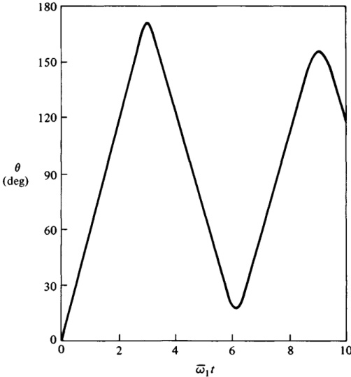{width=56%} 图1.14.1

$$
2 \dot { \epsilon } _ { 4 } = - \overline { { { \omega } } } _ { 1 } \cos \phi \ \epsilon _ { 1 } + \overline { { { \omega } } } _ { 1 } \sin \phi \ \epsilon _ { 2 } - \frac { M } { J } t \ \epsilon _ { 3 }
$$

$$
\epsilon _ { 1 } ( 0 ) = \epsilon _ { 2 } ( 0 ) = \epsilon _ { 3 } ( 0 ) = 0  \epsilon _ { 4 } ( 0 ) = 1
$$

并且

$$
\theta _ { ( 1 . 3 . 14 ) } = \cos ^{- 1} ( 1 - 2 \epsilon _ { 1 } ^{2} - 2 \epsilon _ { 2 } ^{2} )
$$

分别对应于这些方程的数值积分，由于$-1 \leq \epsilon_i \leq 1$（$i = 1, \ldots, 4$），且积分过程顺利进行，因此得到了表1.14.2中所列的数值。这些结果不仅使我们能够如图1.14.1所示，绘制$\theta$与$\overline{\omega}_1 t$的关系曲线，而且也清晰地揭示了为何式(37)至式(39)的数值解无法平稳推进：$\epsilon_4$在$\overline{\omega}_1 t = 3.0$与$\overline{\omega}_1 t = 3.5$之间，以及在$\overline{\omega}_1 t = 8.5$与$\overline{\omega}_1 t = 9.0$之间发生了符号反转；而$\epsilon_i$（$i = 1, 2, 3$）在这两个区间内却始终未发生符号变化。因此，$\epsilon_4$在两个$\epsilon_i$（$i = 1, 2, 3$）不为零的点处消失，且由于

$$
\rho _ { i } \stackrel { = } { = } \frac { \epsilon _ { i } } { \epsilon _ { 4 } }  ( i = 1 , 2 , 3 )
$$

在上述两个点上，Rodrigues参数会趋于无穷大。

 ---------------------------------------------[ 第84页 ]---------------------------------------------  

68 运动学 1.15

表1.14.2

1.0 0.00 0.00 0.00 0.00 0.00 0.00 0.00 0.00 0.00 0.00 0.00 0.00 0.00 0.00 0.00 0.00 0.00 0.00 0.00 0.00 0.00 0.00 0.00 0.00 0.00 0.00 0.00 0.00 0.00 0.00 0.00 0.00 0.00 0.00 0.00 0.00 0.00 0.00 0.00 0.00 0.00 0.00 0.00 0.00 0.00 0.00 0.00 0.00 0.00 0.00 0.00 0.00 0.00 0.00 0.00 0.00 0.00 0.00 0.00 0.00 0.00 0.00 0.00 0.00 0.00 0.00 0.00 0.00 0.00 0.00 0.00 0.00 0.00 0.00 0.00 0.00 0.00 0.00 0.00 0.00 0.00 0.00 0.00 0.00 0.00 0.00 0.00 0.00 0.00 0......1.0 0.00 0.00 0.00 0.00 0.00 0.00 0.00 0.00 0.00 0.00 0.00 0.00 0.00 0.00 0.00 0.00 0.00 0.00 0.00 0.00 0.00 0.00 0.00 0.00 0.00 0.00 0.00 0.00 0.00 0.00 0.00 0.00 0.00 0.00 0.00 0.00 0.00 0.00 0.00 0.00 0.00 0.00 0.00 0.00 0.00 0.00 0.00 0.00 0.00 0.00 0.00 0.00 0.00 0.00 0.00 0.00 0.00 0.00 0.00 0.00 0.00 0.00 0.00 0.00 0.00 0.00 0.00 0.00 0.00 0.00 0.00 0.00 0.00 0.00 0.00 0......

在图1.15.1所示的角φ和ψ范围内，其中O既可表示固定于A点的某一点，也可表示固定于B点的某一点；R则为P或Q之一；而矢量c₁、c₂、c₃是正交单位向量，构成一个右手系，且该右手系要么固定于A点，要么固定于B点。

在某一特定时刻，已知各角度及其一阶导数的数值如表1.15.1所示。现需确定此时B在A中的角速度ω。

所讨论的情形与第1.5节例题中所阐述的情况相同。因此，若$\mathbf{v}$为任意向量，且${}^{A}\mathbf{v}$和${}^{B}\mathbf{v}$分别为行矩阵，其元素分别为$\mathbf{v} \cdot \mathbf{a}_{i}$和$\mathbf{v} \cdot \mathbf{b}_{i}$（$i = 1, 2, 3$），则

$$
{ } ^{B} \nu \ { } _ { ( 1 . 2 . 9 ) } { } ^{A} \nu \left[ \begin{array}{llll} { { 0 } } & { { 0 } } & { { 1 } } \\{ { 0 } } & { { 1 } } & { { 0 } } \\{ { - 1 } } & { { 0 } } & { { 0 } } \end{array} \right]
$$

此外，若再次将$\mathbf{R}$定义为从O指向R的单位向量（参见图1.15.1），则

$$
\mathbf { R } = \cos \psi \cos \phi \, \mathbf { c } _ { 1 } + \cos \psi \sin \phi \, \mathbf { c } _ { 2 } + \sin \psi \, \mathbf { c } _ { 3 }
$$

并且，在以$c_{1}$、$c_{2}$和$c_{3}$固定不变的参考系C中，R的一阶导数可表示为

$$
\begin{array}{rl} { { \frac { c _ { d } \mathbf { R } } { d t } } = } & { { } - ( \sin \psi \cos \phi \ { \dot { \psi } } + \cos \psi \sin \phi \ { \dot { \phi } } ) \mathbf { c } _ { 1 } } \\{ } & { { } - ( \sin \psi \sin \phi \ { \dot { \psi } } - \cos \psi \cos \phi \ { \dot { \phi } } ) \mathbf { c } _ { 2 } } \\{ } & { { } + \cos \psi \ { \dot { \psi } } \ \mathbf { c } _ { 3 } } \end{array}
$$

因此，设$\mathbf{p}$和$\mathbf{q}$分别为分别指向O的P点和Q点的单位向量，并参照表1.15.1，可将$\mathbf{p}$和$\mathbf{q}$在A中的一阶导数表示为

$$
{ \frac { \mathbf { \nabla } ^{\mathsf { A} } d \mathbf { p } } { d t } } = { \sqrt { 2 } } \ \mathbf { a } _ { 1 } - { \frac { \sqrt { 2 } } { 2 } } \ \mathbf { a } _ { 2 } + { \frac { \sqrt { 2 } } { 2 } } \ \mathbf { a } _ { 3 }
$$

 ---------------------------------------------[ 第87页 ]---------------------------------------------  

表1.15.2 中出现的向量，详见式(1)

| 线 | 向量 | b1 | b2 | b3 |
| --- | --- | --- | --- | --- |
| 1 | $\frac{\mathbf{A} d \mathbf{p}}{dt}$ | $-\frac{\sqrt{2}}{2}$ | $-\frac{\sqrt{2}}{2}$ | $\sqrt{2}$ |
| 2 | $\frac{\mathbf{A} d \mathbf{q}}{dt}$ | $\sqrt{3} - \frac{1}{2}$ | 0 | 0 |
| 3 | $\frac{B}{dt}$ | 0 | 0 | $-\frac{3\sqrt{2}}{2}$ |
| 4 | $\frac{B}{dt}$ | $-\frac{3\sqrt{3}}{2}$ | 0 | 0 |
| 5 | $\frac{\mathbf{A} d \mathbf{p}}{dt} - \frac{B}{dt}$ | $-\frac{\sqrt{2}}{2}$ | $-\frac{\sqrt{2}}{2}$ | $\frac{5\sqrt{2}}{2}$ |
| 6 | $\frac{\mathbf{A} d \mathbf{q}}{dt} - \frac{B}{dt}$ | $\frac{5\sqrt{3}}{2} - \frac{1}{2}$ | 0 | 0 |
| 7 | $\left(\frac{\mathbf{A} d \mathbf{p}}{dt} - \frac{\mathbf{B} d \mathbf{p}}{dt}\right) \times \left(\frac{\mathbf{A} d \mathbf{q}}{dt} - \frac{\mathbf{B} d \mathbf{q}}{dt}\right)$ | 0 | $\frac{5\sqrt{2}}{2} \left(\frac{5\sqrt{3}}{2} - \frac{1}{2}\right)$ | $\frac{\sqrt{2}}{2} \left(\frac{5\sqrt{3}}{2} - \frac{1}{2}\right)$ |

以及

$$
{ \frac { \mathbf { \nabla } ^{4} d \mathbf { q } } { d t } } \ { \stackrel { ( 7 ) } { = } } \ \left( { \frac { 1 } { 2 } } - { \sqrt { 3 } } \right) \mathbf { a } _ { 3 }
$$

接下来，可以将这些导数表示为 $\mathbf{b}_{1}$、$\mathbf{b}_{2}$ 和 $\mathbf{b}_{3}$ 的函数，如表 1.15.2 的第 1 行和第 2 行所示；同样地，第 3 行和第 4 行的推导方法也类似。随后，第 5 行、第 6 行和第 7 行可通过纯粹代数运算得到；式 (1) 右侧分母中出现的标量积则由下式给出（参见表 1.5.2 的第 2 行）。

$$
\left( { \frac { ^{A} d { \bf p } } { d t } } - { \frac { ^{B} d { \bf p } } { d t } } \right) \cdot { \bf q } = \mathrm { ~ - ~ } { \frac { \sqrt { 2 } } { 2 } } \left( { \frac { 1 } { 2 } } \right) + { \frac { 5 \sqrt { 2 } } { 2 } } \left( { \frac { \sqrt { 3 } } { 2 } } \right) = \left( { \frac { 5 \sqrt { 3 } } { 2 } } - { \frac { 1 } { 2 } } \right) { \frac { \sqrt { 2 } } { 2 } }
$$

因此，

$$
\begin{array}{rl} { \omega } & { { } \overset { ( 1 ) } { = } \frac { \frac { 5 \sqrt { 2 } } { 2 } \left( \frac { 5 \sqrt { 3 } } { 2 } - \frac { 1 } { 2 } \right) \mathbf { b } _ { 2 } + \frac { \sqrt { 2 } } { 2 } \left( \frac { 5 \sqrt { 3 } } { 2 } - \frac { 1 } { 2 } \right) \mathbf { b } _ { 3 } } { \left( \frac { 5 \sqrt { 3 } } { 2 } - \frac { 1 } { 2 } \right) \frac { \sqrt { 2 } } { 2 } } } \\{ } & { { } = 5 \mathbf { b } _ { 2 } + \mathbf { b } _ { 3 }  \mathrm { r a d / s e c } } \end{array}
$$

# 1.16 辅助参考系

在参考系 $A$ 中，刚体 $B$ 的角速度可表示为以下形式，其中包含 $n$ 个辅助参考系 $A_1, \ldots, A_n$：

 ---------------------------------------------[ 第88页 ]---------------------------------------------  

72 运动学 1.16

$$
\Lambda\omega^{B} = \Lambda\omega^{A1} + \Lambda_{1}\omega^{A2} + \cdots + \Lambda_{n-1}\omega^{A_{n}} + \Lambda_{n}\omega^{B}
$$

这一关系——角速度的加法公式——在右端各项分别代表执行简单旋转运动的刚体的角速度时尤为有用（参见第 1.1 节），因此，它可以被表示为式 (1.11.5) 所示的形式。

对于固定在 $B$ 中的任意向量 $\mathbf{c}$，

$$
\frac{\lambda d\mathbf{c}}{dt} = \frac{\lambda}{(1.11.9)} \times \mathbf{c}
$$

并且

$$
\frac{\lambda_{1}d\mathbf{c}}{dt} = \frac{\lambda_{1}}{(1.11.9)} \times \mathbf{c}
$$

并且

$$
\frac{\lambda_{2}}{dt} = \frac{\lambda_{2}}{(1.11.8)} \times \mathbf{c}
$$

$$
\Lambda\omega^{B} \times \mathbf{c} = \frac{\Lambda_{1}}{dt} + \Lambda_{1}\omega^{A_{1}} \times \mathbf{c}
$$

因此，

$$
\mathbf{\Lambda}\omega^{B} \times \mathbf{c} = \frac{\Lambda_{1}}{\mathbf{c}} \omega^{A_{1}} \times \mathbf{c} + \Lambda_{1}\omega^{B}
$$

或者，由于该等式对固定在 $B$ 中的每一个 $\mathbf{c}$ 都成立，

$$
\mathbf{\Lambda}\omega^{B} = \mathbf{\Lambda}_{1}\omega^{A_{1}} + \mathbf{\Lambda}_{1}\omega^{B}
$$

这表明，式 (1) 对于 $n=1$ 是成立的。继续以同样的方式推导，我们还可以

$$
\mathbf{\Lambda}_{1}\omega^{B} = \mathbf{\Lambda}_{1}\omega^{A_{2}} + \mathbf{\Lambda}_{2}\omega^{B}
$$

并将此结果代入式 (6)，即可得到

$$
\mathbf{\Lambda}_{1}\omega^{B} = \mathbf{\Lambda}_{1}\omega^{A_{1}} + \mathbf{\Lambda}_{1}\omega^{A_{2}} + \mathbf{\Lambda}_{2}\omega^{B}
$$

这正是对于 $n=2$ 的式 (1)。因此，我们可以证明，式 (1) 对于任意 $n$ 都成立。

通过反复应用这一方法，便可确立其有效性。

如图1.16.1所示，$\theta$、$\phi$和$\psi$分别表示用于描述刚性圆锥$B$在参考系$A$中姿态的三个角度。这些角度由以下两条直线所构成：$L_{1}$和$L_{2}$彼此垂直，并且在$A$中保持固定；$L_{3}$是$B$的对称轴；$L_{4}$与$L_{2}$垂直，并且与$L_{2}$和$L_{3}$相交；$L_{5}$与$L_{3}$垂直，并且在$B$中保持固定；$L_{7}$则与$L_{2}$和$L_{4}$均垂直。要计算$B$在$A$中的角速度，可以将$A_{1}$定义为一个参考系，在该参考系中，$L_{2}$、$L_{4}$和$L_{7}$保持固定；而将$A_{2}$定义为另一个参考系，在该参考系中，$L_{3}$、$L_{5}$和$L_{7}$保持固定。此时可观察到：$L_{2}$在$A$和$A_{1}$中均保持固定，$L_{7}$在$A_{1}$和$A_{2}$中均保持固定，$L_{3}$在$A_{2}$和$B$中均保持固定。因此，根据式（1.11.5），

 ---------------------------------------------[ 第89页 ]---------------------------------------------  

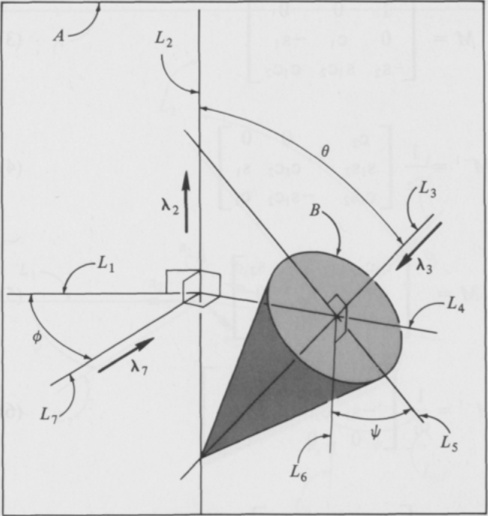{width=55%} 图1.16.1

其中$\lambda_{2}$、$\lambda_{3}$和$\lambda_{7}$为单位向量，其方向如图1.16.1所示。由此可立即得出：

$$
{ } ^{A} \omega ^{B} \stackrel { ( 1 ) } { = } \dot { \phi } \lambda _ { 2 } + \dot { \theta } \lambda _ { 7 } + \dot { \psi } \lambda _ { 3 }
$$

第1.17节 角速度与姿态角

当刚体$B$在参考系$A$中的姿态通过指定姿态角$\theta_{1}$、$\theta_{2}$和$\theta_{3}$随时间的变化来描述时（参见第1.7节），可通过以下关系式求得$B$在$A$中的角速度（参见第1.11节）：

$$
\left[ \begin{array}{lll} { \omega _ { 1 } } & { \omega _ { 2 } } & { \omega _ { 3 } } \end{array} \right] = \left[ \begin{array}{lll} { \dot { \theta } _ { 1 } } & { \dot { \theta } _ { 2 } } & { \dot { \theta } _ { 3 } } \end{array} \right] M
$$

其中$M$是一个$3 \times 3$矩阵，其元素皆为$\theta_{1}$、$\theta_{2}$和$\theta_{3}$的函数。反之，若$\omega_{1}$、$\omega_{2}$和$\omega_{3}$已知为时间的函数，则可通过求解微分方程来求得$\theta_{1}$、$\theta_{2}$和$\theta_{3}$。

$$
\begin{bmatrix}\dot{\theta}_1&\dot{\theta}_2&\dot{\theta}_3\end{bmatrix}=\begin{bmatrix}\omega_1&\omega_2&\omega_3\end{bmatrix}M^{-1}
$$

对于空间三维角，矩阵$M$及其逆矩阵$M^{-1}$分别为

 ---------------------------------------------[ 第90页 ]---------------------------------------------  

$$
{ \boldsymbol { M } } = { \left[ \begin{array}{lll} { 1 } & { 0 } & { 0 } \\{ 0 } & { \mathbf { c } _ { 1 } } & { - \mathbf { s } _ { 1 } } \\{ - \mathbf { s } _ { 2 } } & { \mathbf { s } _ { 1 } \mathbf { c } _ { 2 } } & { \mathbf { c } _ { 1 } \mathbf { c } _ { 2 } } \end{array} \right] }
$$

以及

$$
{ \cal M } ^{- 1} = \frac { 1 } { \mathrm { C } _ { 2 } } \left[ \begin{array}{ccc} { { \mathrm { C } _ { 2 } } } & { { 0 } } & { { 0 } } \\{ { \mathrm { S } _ { 1 } \mathrm { S } _ { 2 } } } & { { \mathrm { C } _ { 1 } \mathrm { C } _ { 2 } } } & { { \mathrm { S } _ { 1 } } } \\{ { \mathrm { C } _ { 1 } \mathrm { S } _ { 2 } } } & { { - \mathrm { S } _ { 1 } \mathrm { C } _ { 2 } } } & { { \mathrm { C } _ { 1 } } } \end{array} \right]
$$

对于体三维角，

$$
M = \left[ \begin{array}{lll} { { \mathrm { ~ c _ { 2 } c _ { 3 } ~ } } } & { { - \mathrm { ~ c _ { 2 } s _ { 3 } ~ } } } & { { \mathrm { ~ s _ { 2 } ~ } } } \\{ { \mathrm { ~ s _ { 3 } ~ } } } & { { \mathrm { ~ c _ { 3 } ~ } } } & { { 0 } } \\{ { 0 } } & { { 0 } } & { { 1 } } \end{array} \right]
$$

以及

$$
M ^{- 1} = \frac { 1 } { c _ { 2 } } \left[ \begin{array}{cccc} { { c _ { 3 } } } & { { c _ { 2 } s _ { 3 } } } & { { - s _ { 2 } c _ { 3 } } } \\{ { - s _ { 3 } } } & { { c _ { 2 } c _ { 3 } } } & { { s _ { 2 } s _ { 3 } } } \\{ { 0 } } & { { 0 } } & { { c _ { 2 } } } \end{array} \right]
$$

对于空间二维角，

$$
M = \left[ \begin{array}{lll} { { 1 } } & { { 0 } } & { { 0 } } \\{ { 0 } } & { { c _ { 1 } } } & { { - s _ { 1 } } } \\{ { c _ { 2 } } } & { { s _ { 1 } s _ { 2 } } } & { { c _ { 1 } s _ { 2 } } } \end{array} \right]
$$

以及

$$
{ \cal M } ^{- 1} = \frac { 1 } { \mathrm { s } _ { 2 } } \left[ \begin{array}{ccc} { { \mathrm { s } _ { 2 } } } & { { 0 } } & { { 0 } } \\{ { - \mathrm { s } _ { 1 } \, \mathrm { c } _ { 2 } } } & { { \mathrm { c } _ { 1 } \, \mathrm { s } _ { 2 } } } & { { \mathrm { s } _ { 1 } } } \\{ { - \mathrm { c } _ { 1 } \, \mathrm { c } _ { 2 } } } & { { - \mathrm { s } _ { 1 } \, \mathrm { s } _ { 2 } } } & { { \mathrm { c } _ { 1 } } } \end{array} \right]
$$

最后，对于体二维角，

$$
M = \left[ \begin{array}{lll} { { c _ { 2 } } } & { { s _ { 2 } s _ { 3 } } } & { { s _ { 2 } c _ { 3 } } } \\{ { 0 } } & { { c _ { 3 } } } & { { - s _ { 3 } } } \\{ { 1 } } & { { 0 } } & { { 0 } } \end{array} \right]
$$

以及

$$
{ \boldsymbol { M } } ^{- 1} = { \frac { 1 } { S _ { 2 } } } { \left[ \begin{array}{lll} { 0 } & { 0 } & { S _ { 2 } } \\{ S _ { 3 } } & { S _ { 2 } C _ { 3 } } & { - C _ { 2 } S _ { 3 } } \\{ C _ { 3 } } & { - S _ { 2 } S _ { 3 } } & { - C _ { 2 } C _ { 3 } } \end{array} \right] }
$$

当$c_{2}$为零时，由式（3）或式（5）给出的$M$为奇异矩阵，因此$M^{-1}$无定义。由此可见，若$\theta_{1}$、$\theta_{2}$和$\theta_{3}$为空间三维或体三维角，那么在已知$\omega_{1}$、$\omega_{2}$和$\omega_{3}$的情况下，无法使用式（2）来求解$\dot{\theta}_{1}$、$\dot{\theta}_{2}$和$\dot{\theta}_{3}$。

 ---------------------------------------------[ 第91页 ]---------------------------------------------  

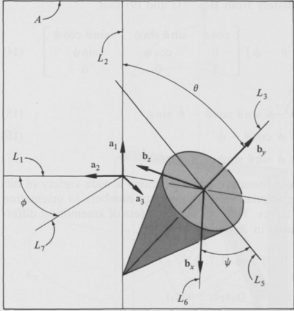{width=55%} 图1.17.1

角度及 $c_{2}=0$。同样地，若 $\theta_{1}$、$\theta_{2}$ 和 $\theta_{3}$ 分别为空间二角或体二角，则当 $s_{2}$ 等于零时，式 (2) 中会涉及一个未定义的矩阵。

在分析中所采用的角度和单位向量，若使用与式 (1)-(10) 所用符号不同的符号表示时，只要将这些角度明确界定为类型——即空间三角、体三角等——即可直接从式 (1)-(10) 中获得这些公式的适当替换形式。例如，假设在对图1.16.1所示圆锥进行分析的过程中，此前已在第1.16节的示例中予以考虑，已引入固定在 $B$ 中的单位向量 $\mathbf{b}_{x}$、$\mathbf{b}_{y}$ 和 $\mathbf{b}_{z}$（如图1.17.1所示），现需求出 $\omega_{x}$、$\omega_{y}$ 和 $\omega_{z}$，其定义如下：

$$
\omega _ { x } \triangleq \omega \cdot \mathbf { b } _ { x }  \omega _ { y } \triangleq \omega \cdot \mathbf { b } _ { y }  \omega _ { z } \triangleq \omega \cdot \mathbf { b } _ { z }
$$

其中，$\omega$ 表示 $B$ 在 $A$ 中的角速度。通过将 $\phi$、$\theta$ 和 $\psi$ 视为体二角来实现这一目的，即引入如图1.17.1所示的单位向量 $\mathbf{a}_1$、$\mathbf{a}_2$、$\mathbf{a}_3$，并定义 $\mathbf{b}_1$、$\mathbf{b}_2$ 和 $\mathbf{b}_3$ 为

$$
\mathbf { b } _ { 1 } \triangleq \mathbf { b } _ { y }  \mathbf { b } _ { 2 } \triangleq \mathbf { b } _ { z }  \mathbf { b } _ { 3 } \triangleq \mathbf { b } _ { x }
$$

并取

$$
\theta _ { 1 } = \phi  \theta _ { 2 } = - \theta  \theta _ { 3 } = - \psi
$$

 ---------------------------------------------[ 第92页 ]---------------------------------------------  

由此，我们可立即从式 (1) 和式 (9) 得到

$$
[ \omega _ { y } \ \omega _ { z } \ \omega _ { x } ] = [ \dot { \phi } \ - \dot { \theta } \ - \dot { \psi } ] \left[ \begin{array}{lll} { \cos \theta } & { \sin \theta \ \sin \psi } & { - \sin \theta \ \cos \psi } \\{ 0 } & { \cos \psi } & { \sin \psi } \\{ 1 } & { 0 } & { 0 } \end{array} \right]
$$

因此，

$$
\omega _ { x } = - \dot { \phi } \, \sin \theta \, \cos \psi - \dot { \theta } \, \sin \psi
$$

$$
\omega _ { y } = \dot { \phi } \cos \theta - \dot { \psi }
$$

$$
\omega _ { z } = \dot { \phi } \, \sin \theta \, \sin \psi - \dot { \theta } \, \cos \psi
$$

在航天器动力学文献中，人们会遇到各种各样的微分方程，这些方程将角速度测量值与姿态角及其时间导数联系起来。附录II中列出了二十四组这样的运动学微分方程。

根据式 (1.10.5) 和式 (1.7.1) 进行推导，

$$
\begin{aligned} \omega _ { 1 } & = \left( \mathbf { C } _ { 1 } \mathbf { S } _ { 2 } \mathbf { C } _ { 3 } + \mathbf { S } _ { 3 } \mathbf { S } _ { 1 } \right) \frac { d } { d t } \left( \mathbf { S } _ { 1 } \mathbf { S } _ { 2 } \mathbf { C } _ { 3 } - \mathbf { S } _ { 3 } \mathbf { C } _ { 1 } \right) \\& + \left( \mathbf { C } _ { 1 } \mathbf { S } _ { 2 } \mathbf { S } _ { 3 } - \mathbf { C } _ { 3 } \mathbf { S } _ { 1 } \right) \frac { d } { d t } \left( \mathbf { S } _ { 1 } \mathbf { S } _ { 2 } \mathbf { S } _ { 3 } + \mathbf { C } _ { 3 } \mathbf { C } _ { 1 } \right) + \mathbf { C } _ { 1 } \mathbf { C } _ { 2 } \frac { d } { d t } \left( \mathbf { S } _ { 1 } \mathbf { C } _ { 2 } \right) \\& = \dot { \theta } _ { 1 } - \dot { \theta } _ { 3 } \mathbf { S } _ { 2 } \end{aligned}
$$

同样地，根据式 (1.10.6) 和式 (1.7.1)，

$$
\omega _ { 2 } = \dot { \theta } _ { 2 } \mathbf { c } _ { 1 } + \dot { \theta } _ { 3 } \mathbf { s } _ { 1 } \mathbf { c } _ { 2 }
$$

以及根据式 (1.10.7) 和式 (1.7.1)

$$
\omega _ { 3 } = - \dot { \theta } _ { 2 } \mathbf { s } _ { 1 } + \dot { \theta } _ { 3 } \mathbf { c } _ { 1 } \mathbf { c } _ { 2 }
$$

这三组方程是当 $M$ 由式 (3) 给定时，对应于式 (1) 的三组标量方程。

式 (2) 既可从式 (1) 推导而来，也可依据矩阵逆的定义得出；而式 (4) 的有效性可通过以下方式加以验证：注意到式 (3) 和式 (4) 右侧乘积等于单位矩阵 $U$。继续以类似的方式进行推导，但可将式 (1.7.11)、式 (1.7.21) 或式 (1.7.31) 代替式 (1.7.1)，并将式 (5) 和式 (6)、式 (7) 和式 (8)、或式 (9) 和式 (10) 代替式 (3) 和式 (4)，从而证明式 (5)-(10) 的有效性。

示例图1.17.2展示了前文在第1.7节中所讨论的陀螺系统。在该节中曾提到，当分析θ₂发生变化的运动时，我们可能希望采用空间三角坐标系中的φ₁、φ₂和φ₃，以及图1.17.2所示的体坐标系中的θ₁、θ₂和θ₃。

 ---------------------------------------------[ 第93页 ]---------------------------------------------  

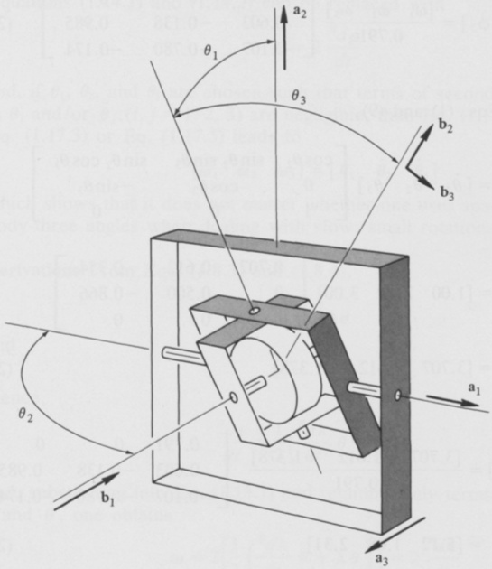{width=62%} 图1.17.2

小于或等于零。给定θᵢ和˙θᵢ（i=1,2,3），我们便需要能够计算出φᵢ和˙φᵢ（i=1,2,3）。

假设如第1.7节中的示例所示，在某一时刻，θ₁＝˙30°，θ₂＝˙45°，θ₃＝˙60°；此外，˙θ₁＝˙1.00，˙θ₂＝˙2.00，˙θ₃＝˙3.00 rad/s。那么，在这一时刻，˙φ₁、˙φ₂和˙φ₃的值分别是多少？

根据式(2)和式(4)，

$$
[ { \dot { \phi } } _ { 1 }  { \dot { \phi } } _ { 2 }  { \dot { \phi } } _ { 3 } ] = { \frac { [ \omega _ { 1 }  \omega _ { 2 }  \omega _ { 3 } ] } { \cos \phi _ { 2 } } } \left[ \begin{array}{ccc} { { \cos \phi _ { 2 } } } & { { 0 } } & { { 0 } } \\{ { \sin \phi _ { 1 } \, \sin \phi _ { 2 } } } & { { \cos \phi _ { 1 } \, \cos \phi _ { 2 } } } & { { \sin \phi _ { 1 } } } \\{ { \cos \phi _ { 1 } \, \sin \phi _ { 2 } } } & { { - \sin \phi _ { 1 } \, \cos \phi _ { 2 } } } & { { \cos \phi _ { 1 } } } \end{array} \right]
$$

或者，利用先前求得的φ₁和φ₂的值，

 ---------------------------------------------[ 第94页 ]---------------------------------------------  

$$
\left[ \begin{array}{lll} { \dot { \phi } _ { 1 } } & { \dot { \phi } _ { 2 } } & { \dot { \phi } _ { 3 } } \end{array} \right] = \frac { \left[ \omega _ { 1 } \; \omega _ { 2 } \; \omega _ { 3 } \right] } { 0 . 79 1 } \left[ \begin{array}{lll} { 0 . 79 1 } & { 0 } & { 0 } \\{ 0 . 60 3 } & { - 0 . 13 8 } & { 0 . 98 5 } \\{ - 0 . 10 7 } & { - 0 . 78 0 } & { - 0 . 17 4 } \end{array} \right]
$$

现在，根据式(1)和式(9)，

$$
\begin{aligned}[\omega_{1}\omega_{2}\omega_{3}]&=[\dot{\theta}_{1}\dot{\theta}_{2}\dot{\theta}_{3}]\begin{bmatrix}\cos\theta_{2}&\sin\theta_{2}\sin\theta_{3}&\sin\theta_{2}\cos\theta_{3}\\0&\cos\theta_{2}&-\sin\theta_{3}\\1&0&0\end{bmatrix}\\&=[1.002.003.00]\left[\begin{array}{cccc}0.707&0.612&0.354\\0&0.500&-0.866\\1&0&0\end{array}\right]\\&=[3.7071.612-1.378]\end{aligned}
$$

因此，

$$
[ \dot { \phi } _ { 1 }  \dot { \phi } _ { 2 }  \dot { \phi } _ { 3 } ] = \frac { [ 3 . 70 7  1 . 61 2  - 1 . 37 8 ] } { 0 . 79 1 } \left[ \begin{array}{ccc} { { 0 . 79 1 } } & { { 0 } } & { { 0 } } \\{ { 0 . 60 3 } } & { { - 0 . 13 8 } } & { { 0 . 98 5 } } \\{ { - 0 . 10 7 } } & { { - 0 . 78 0 } } & { { - 0 . 17 4 } } \end{array} \right]
$$

$$
= [ 5 . 12  1 . 08  2 . 31 ]
$$

并且

$$
\dot { \phi } _ { 1 } = 5 . 12  \dot { \phi } _ { 2 } = 1 . 08  \dot { \phi } _ { 3 } = 2 . 31 \ \mathrm { r a d / s e c }
$$

1.18 慢速、小转动运动

若a₁、a₂、a₃与b₁、b₂、b₃是两组右手系的正交单位向量，分别固定于相对运动的参考系或刚体A和B中，那么我们可以利用式(1.3.18)和式(1.3.20)，为每个时间点赋予一个角度θ。当θ和˙θ中所有二阶及以上项在运动分析中可忽略不计时，这种运动即被称为慢速、小转动运动。在这些条件下，之前所讨论的诸多关系都可以被更简单的表达方式所取代。具体而言，可以将式(1.13.1)和式(1.13.3)替换为：

$$
\omega = 2 \frac { ^{B} d \epsilon } { d t }
$$

以及

$$
\epsilon _ { 4 } = 1
$$

 ---------------------------------------------[ 第95页 ]---------------------------------------------  

式(1.14.1)和式(1.14.2)可以被替换为

ω = 2 * (Bdρ)/dt

如果θ₁、θ₂和θ₃的选取使得θᵢ和/或˙θⱼ中二阶及以上项的系数可以忽略不计，则式(1.17.1)结合式(1.17.3)或式(1.17.5)会得出

[ω₁ω₂ω₃] = [˙θ₁˙θ₂˙θ₃]

这表明，在处理缓慢、微小的旋转运动时，无论是采用空间三角还是体三角，其结果并无差别。

从式（1.8.3）和式（1.8.4）中推导得出，

$$
\epsilon = \frac{1}{2}\lambda\theta
$$

以及

$$
\epsilon_{4} = 1
$$

因此，

$$
\frac{Bd\boldsymbol{\epsilon}}{dt} = \frac{1}{2}\left(\frac{Bd\lambda}{dt}\theta + \lambda\dot{\theta}\right)
$$

并将此代入式（1.13.1），仅保留 $\theta$ 和 $\theta$ 的一阶项，即可得到

$$
\omega = 2\left[\frac{1}{2}\left(\frac{Bd\lambda}{dt}\theta + \lambda\dot{\theta}\right)\right] = 2\frac{Bd\boldsymbol{\epsilon}}{dt}
$$

与式（1）一致。式（2）与式（1.8.4）完全相同。

式（3）可直接由式（1）推导而来，因为根据所考虑的近似程度，$\boldsymbol{\rho}$ 与 $\boldsymbol{\epsilon}$ 在各向量级上彼此相等，这一点从式（1.8.3）和式（1.8.5）中便可清晰看出。最后，式（4）则通过将式（1.17.3）或式（1.17.5）中给出的 $M$ 代入式（1.17.1），并随后消去所有非线性项而得。

如图1.18.1所示，$B$ 表示一个刚体，该刚体通过弹性支座连接至航天器 $A$。$A$ 的运动方式使得 $A$ 在牛顿参考系 $N$ 中的角速度 ${ }^{N}\omega^{A}$ 为：

$$
\left.\begin{array}{ll}\omega^{A} = \omega_{1}\mathbf{a}_{1} + \omega_{2}\mathbf{a}_{2} + \omega_{3}\mathbf{a}_{3}\end{array}\right.
$$

其中，$\omega_{1}$、$\omega_{2}$、$\omega_{3}$ 是常数，而 $\mathbf{a}_{1}$、$\mathbf{a}_{2}$、$\mathbf{a}_{3}$ 构成一组右手正交单位矢量，这些矢量在 $A$ 中固定不变。点 $B^{*}$ 是 $B$ 的质心，而 $\mathbf{b}_{1}$、$\mathbf{b}_{2}$、$\mathbf{b}_{3}$ 是平行于 $B$ 主惯性轴的单位矢量，且 $B^{*}$ 的相关转动惯量分别为 $I_{1}$、$I_{2}$ 和 $I_{3}$。

在为 $B$ 的运动方程的推导做准备时，

 ---------------------------------------------[ 第96页 ]---------------------------------------------  

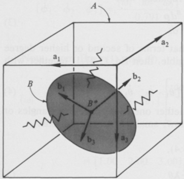{width=41%} 图1.18.1

首先，需要确定 $B$ 相对于 $B^{*}$ 在 $N$ 中的角动量 $\mathbf{H}$ 对 $N$ 的一阶导数，假设 $B$ 在 $A$ 中的各类旋转运动均为缓慢、微小的运动。$B$ 在 $A$ 中的取向应以体三角 $\theta_1$、$\theta_2$ 和 $\theta_3$ 来描述，当 $\mathbf{a}_i = \mathbf{b}_i$（$i = 1, 2, 3$）时，这三者均变为零。

$B$ 在 $N$ 中的角速度 ${ }^{N}\omega^{B}$ 可表示为

$$
{ } ^{N} \omega ^{B} \; \; \; \; \; \; \; \; \; \; \; \; \; \; \; \; \; \; \; \; \; \; \; \; \; \; \; \; \; \; \; \; \; \; \; \; \; \; \; \; \; \; \; \; \; \; \; \; \; \; \; \; \; \; \; \; \; \; \; \; \; \; \; \; \; \; \; \; \; \; \; \; \; \; \; \; \; \; \; \; \; \; \; \; \; \; \; \; \; \; \; \; \; \; \; \; \; \; \; \; \; \; \; \; \; \; \; \; \; \; \; \; \; \; \; \; \; \; \; \; \; \; \; \; \; \; \; \; \; \; \; \; \; \; \; \; \; \; \; \; \; \; \; \; \; \; \; \; \; \; \; \; \; \; \; \; \; \; \; \; \; \; \; \; \; \; \; \; \; \; \; \; \; \; \; \; \; \; \; \; \; \; \; \; \; \; \; \; \; \; \; \; \; \; \; \; \; \; \; \; \; \; \; \; \; \; \; \; \; \; \; \; \; \; \; \; \; \; \; \; \; \; \; \; \; \; \; \; \; \; \; \; \; \; \; \; \; \; \; \; \; \; \; \; \; \; \; \; \; \; \; \; \; \; \; \; \; \; \; \; \; \; \; \; \; \; \; \; \; \; \; \; \; \; \; \; \; \; \; \; \; \; \; \; \; \; \; \; \; \; \; \; \; \; \; \; \; \; \; \; \; \; \; \; \; \; \; \; \; \; \; \; \; \; \; \; \; \; \; \; \; \; \; \; \; \; \; \; \; \; \; \; \; \; \; \; \; \; \; \; \; \; \; \; \; \; \; \; \; \; \; \; \; \; \; \; \; \; \; \; \; \; \; \; \; \; \; \; \; \; \; \; \; \; \; \; \; \; \; \; \; \; \; \; \; \; \; \; \; \; \; \; \; \; \; \; \; \; \; \; \; \; \; \; \; \; \; \; \; \; \; \; \; \; \; \; \; \; \; \; \; \; \; \; \; \; \; \; \; \; \; \; \; \; \; \; \; \; \; \; \; \; \; \; \; \; \; \; \; \; \; \; \; \; \; \; \; \; \; \; \; \; \; \; \; \; \; \; \; \; \; \; \; \; \; \; \; \; \; \; \; \; \; \; \; \; \; \; \; \; \; \; \; \; \; \; \; \; \; \; \; \; \; \; \; \; \; \; \; \; \; \; \; \; \; \; \; \; \; \; \; \; \; \; \; \; \; \; \; \; \; \; \; \; \; \; \; \; \; \; \; \; \; \; \; \; \; \; \; \; \; \; \; \; \; \; \; \; \; \; \; \; \; \; \; \; \; \; \; \; \; \; \; \; \; \; \; \; \; \; \; \; \; \; \; \; \; \; \; \; \; \; \; \; \; \; \; \; \; \; \; \; \; \; \; \; \; \; \; \; \; \; \; \; \; \; \; \; \; \; \; \; \; \; \; \; \; \; \; \; \; \; \; \; \; \; \; \; \; \; \; \; \; \; \; \; \; \; \; \; \; \; \; \; \; \; \; \; \; \; \; \; \; \; \; \; \; \; \; \; \; \; \; \; \; \; \; \; \; \; \; \; \; \; \; \; \; \; \; \; \; \; \; \; \; \; \; \; \; \; \; \; \; \; \; \; \; \; \; \; \; \; \; \; \; \; \; \; \; \; \; \; \; \; \; \; \; \; \; \; \; \; \; \; \; \; \; \; \; \; \; \; \; \; \; \; \; \; \; \; \; \; \; \; \; \; \; \; \; \; \; \; \; \; \; \; \; \; \; \; \; \; \; \; \; \; \; \; \; \; \; \; \; \; \; \; \; \; \; \; \; \; \; \; \; \; \; \; \; \; \; \; \; \; \; \; \; \; \; \; \; \; \; \; \; \; \; \; \; \; \; \; \; \; \; \; \; \; \; \; \; \; \; \; \; \; \; \; \; \; \; \; \; \; \; \; \; \; \; \; \; \; \; \; \; \; \; \; \; \; \; \; \; \; \; \; \; \; \; \; \; \; \; \; \; \; \; \; \; \; \; \; \; \; \; \; \; \; \; \; \; \; \; \; \; \; \; \; \; \; \; \; \; \; \; \; \; \; \; \; \; \; \; \; \; \; \; \; \; \; \; \; \; \; \; \; \; \; \; \; \; \; \; \; \; \; \; \; \; \; \; \; \; \; \; \; \; \; \; \; \; \; \; \; \; \; \; \; \; \; \; \; \; \; \; \; \; \; \; \; \; \; \; \; \; \; \; \; \; \; \; \; \; \; \; \; \; \; \; \; \; \; \; \; \; \; \; \; \; \; \; \; \; \; \; \; \; \; \; \; \; \; \; \; \; \; \; \;
$$

参照式（1.2.5）和式（1.8.12），我们可以写出

$$
\begin{array}{rl} { ^ N \pmb { \omega } ^{A} } & { = \underset { ( 8 ) } { \overset { \underset { \mathrm { ( 8 ) } } { } } { = } } \ ( \omega _ { 1 } + \omega _ { 2 } \, \theta _ { 3 } - \omega _ { 3 } \, \theta _ { 2 } ) \mathbf { b } _ { 1 } } \\& { + \ ( \omega _ { 2 } + \omega _ { 3 } \, \theta _ { 1 } - \omega _ { 1 } \, \theta _ { 3 } ) \mathbf { b } _ { 2 } } \\& { + \ ( \omega _ { 3 } + \omega _ { 1 } \, \theta _ { 2 } - \omega _ { 2 } \, \theta _ { 1 } ) \mathbf { b } _ { 3 } } \end{array}
$$

并且，根据式（4），

$$
{ } ^{A} \boldsymbol { \omega } ^{B} \; = \; \dot { \theta } _ { 1 } \, \mathbf { b } _ { 1 } \; + \; \dot { \theta } _ { 2 } \, \mathbf { b } _ { 2 } \; + \; \dot { \theta } _ { 3 } \, \mathbf { b } _ { 3 }
$$

因此，

$$
{ } ^{N} \boldsymbol { \omega } ^{B} \underset { ( 10 - 12 ) } { = } \left( \omega _ { 1 } + \omega _ { 2 } \, \theta _ { 3 } - \omega _ { 3 } \, \theta _ { 2 } + \, \dot { \theta } _ { 1 } \right) \mathbf { b } _ { 1 } + \cdots
$$

并且

$$
\mathbf { H } _ { ( 13 ) } = I _ { 1 } ( \omega _ { 1 } + \omega _ { 2 } \theta _ { 3 } - \omega _ { 3 } \theta _ { 2 } + \dot { \theta } _ { 1 } ) \mathbf { b } _ { 1 } + \cdots
$$

为了在 $N$ 中对 H 的一阶导数进行评估，我们不妨利用以下关系：

$$
{ \frac { \mathrm { H } \times \mathbf { H } } { d t } }  =  { \frac { \mathrm { H } } { d t } } + \mathbf { H } \times { \frac { \mathrm { H } } { d t } }
$$

与

$$
\frac { d \mathbf { H } } { d t } \; \; \; = \; \; I _ { 1 } ( \omega _ { 2 } \; \dot { \theta } _ { 3 } - \omega _ { 3 } \; \dot { \theta } _ { 2 } + \; \ddot { \theta } _ { 1 } ) \mathbf { b } _ { 1 } + \; \cdots .
$$

 ---------------------------------------------[ 第97页 ]---------------------------------------------  

以及

$$
\begin{array}{rl} { ^ N \omega ^{B} \times \textbf { H } _ { ( 13 , 14 ) } = } & { { } } \\{ ( I _ { 3 } - I _ { 2 } ) ( \omega _ { 2 } + \omega _ { 3 } \theta _ { 1 } - \omega _ { 1 } \theta _ { 3 } + \dot { \theta } _ { 2 } ) ( \omega _ { 3 } + \omega _ { 1 } \theta _ { 2 } - \omega _ { 2 } \theta _ { 1 } + \dot { \theta } _ { 3 } ) \mathbf { b } _ { 1 } + \cdots \, . } & { { } } \end{array}
$$

然而，在此情况下，所有非线性项均应被舍弃。由此可知，

$$
\begin{aligned} & \frac { ^{N} d \mathbf { H } } { d t } = \left\{ I _ { 1 } \, \ddot { \theta } _ { 1 } + ( - I _ { 1 } - I _ { 2 } + I _ { 3 } ) \omega _ { 3 } \, \dot { \theta } _ { 2 } - ( - I _ { 1 } + I _ { 2 } - I _ { 3 } ) \omega _ { 2 } \, \dot { \theta } _ { 3 } \right. \\& \left. + \, ( I _ { 3 } - I _ { 2 } ) [ \omega _ { 2 } \omega _ { 3 } - ( \omega _ { 2 } ^{2} - \omega _ { 3 } ^{2} ) \theta _ { 1 } + \omega _ { 1 } \omega _ { 2 } \theta _ { 2 } - \omega _ { 1 } \omega _ { 3 } \theta _ { 3 } ] \right\} \mathbf { b } _ { 1 } + \cdots \end{aligned}
$$

# 1.19 瞬时轴

在刚体 $B$ 在参考系 $A$ 中的角速度 $\omega$ 等于零的某一瞬间，$B$ 中所有点在 $A$ 中的速度彼此相等。每当 $\omega$ 不为零时，$B$ 中存在无数个点，其在 $A$ 中的速度与 $\omega$ 平行，或等于零。这些点在 $A$ 中具有相同的速度 $\mathbf{v}^*$，并且它们构成一条与 $\omega$ 平行的直线，被称为 $B$ 在 $A$ 中的瞬时轴。$\mathbf{v}^*$ 的大小小于 $B$ 中任何不位于瞬时轴上的点在 $A$ 中的速度大小。

若 $\mathbf{v}^{Q}$ 是 $B$ 中任意选定的基准点 $Q$ 在 $A$ 中的速度，而 $P^{*}$ 是瞬时轴上的一个点，则 $P^{*}$ 相对于 $Q$ 的位置向量 $\mathbf{r}^{*}$ 可以表示为

$$
r ^{*} = \frac { \omega \times v ^{Q} } { \omega ^{2} } + \mu ^{*} \omega
$$

其中 $\mu^{*}$ 取决于 $P^{*}$ 的选择；而 $\mathbf{v}^{*}$ 则由以下公式给出

$$
{ \bf v } ^{*} = \frac { \omega \cdot { \bf v } ^{Q} } { \omega ^{2} } \, \omega
$$

推导过程见图 1.19.1。图中 $P$ 和 $Q$ 均为 $B$ 中任意选定的点，$\mathbf{p}$ 和 $\mathbf{q}$ 分别是它们相对于固定于 $A$ 中的某一点 $O$ 的位置向量，$\mathbf{r}$ 是 $P$ 相对于 $Q$ 的位置向量。因此，

$$
\mathbf { p } = \mathbf { q } + \mathbf { r }
$$

以及

$$
{ \frac { \mathrm { d } \mathbf { p } } { d t } } \ { \overset { ( 3 ) } { = } } \ { \frac { \mathrm { d } \mathbf { p } } { d t } } + { \frac { \mathrm { d } \mathbf { p } } { d t } } \ { \overset { ( 1 . 11 . 9 ) } { = } } \ { \frac { \mathrm { d } \mathbf { p } } { d t } } + \omega \times \mathbf { r }
$$

或者，由于 $P$ 和 $Q$ 在 $A$ 中的速度 $\mathbf{v}^{P}$ 和 $\mathbf{v}^{Q}$ 分别等于 ${}^{4}d\mathbf{p}/dt$ 和 ${}^{4}d\mathbf{q}/dt，

 ---------------------------------------------[ 第98页 ]---------------------------------------------  

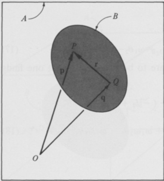{width=38%} 图1.19.1

$$
\mathbf { v } ^{P} = \mathbf { v } ^{Q} + \omega \times \mathbf { r }
$$

若 $\omega \neq 0$，则向量 $\mathbf{r}$ 总可以表示为一个向量的和，即：假设 $\mathbf{s}$ 是一个垂直于 $\omega$ 的向量，再加上向量 $\mu\omega$，其中 $\mu$ 是一个特定的标量；也就是说，

$$
\mathbf { r } = \mathbf { s } + \mu \omega
$$

与

$$
\omega \cdot s = 0
$$

因此，$\mathbf{v}^{P}$ 可以表示为

以及

$$
{ \bf v } ^{P} \; = \; { \bf v } _ { ( 4 , 5 ) } ^{Q} + \omega \times s
$$

$$
\begin{array}{rl} { \boldsymbol { \omega } \times \mathbf { v } ^{p} } & { = \mathbf { \nabla } \boldsymbol { \omega } \times \mathbf { v } ^{Q} + \boldsymbol { \omega } \cdot \mathbf { s } \boldsymbol { \omega } - \boldsymbol { \omega } ^{2} \mathbf { s } } \\& { \equiv \mathbf { \nabla } \boldsymbol { \omega } \times \mathbf { v } ^{Q} - \boldsymbol { \omega } ^{2} \mathbf { s } } \end{array}
$$

若将$P$视为一个点$P^*$，其在$A$中的速度$\mathbf{v}^*$与$\omega$平行；则与之对应的$\mathbf{r}$、$\mathbf{s}$和$\mu$的值分别称为$\mathbf{r}^*$、$\mathbf{s}^*$和$\mu^*$，那么

$$
\mathbf { 0 } = \boldsymbol { \omega } \times \mathbf { v } ^{Q} - \boldsymbol { \omega } ^{2} \mathbf { s } ^{*}
$$

$$
\mathbf { r } ^{*} = \mathbf { s } ^{*} + \mu ^{*} \omega = \frac { \omega \times \mathbf { v } ^{Q} } { \omega ^{2} } + \mu ^{*} \omega
$$

与式（1）一致，并且

$$
\mathbf{v}^{*}=\mathbf{v}^{Q}+\mathbf{\omega}\times\mathbf{s}^{*}=\mathbf{v}^{Q}+\frac{\mathbf{\omega}\times(\mathbf{\omega}\times\mathbf{v}^{Q})}{\mathbf{\omega}^{2}}\\=\frac{\omega^{2}\mathbf{v}^{Q}+\omega\cdot\mathbf{v}^{Q}\mathbf{\omega}-\omega^{2}\mathbf{v}^{Q}}{\omega^{2}}=\frac{\omega\cdot\mathbf{v}^{Q}}{\omega^{2}}\:\omega
$$

与式（2）一致。

 ---------------------------------------------[ 第99页 ]---------------------------------------------  

如图1.19.2所示的示例。$B$代表一颗缓慢旋转的圆柱形卫星，其质心$B^*$沿半径为$R$的圆形轨道运动，该轨道固定于参考系$A$中。在整个运动过程中，$B$的对称轴始终被约束为与该圆周相切，同时$B$以恒定速率绕此轴旋转，使得在$B^*$完成一次轨道周期的过程中，位于$B$内部并穿过该轴的平面会两次与轨道平面平行。在$A$中，$B$的瞬时轴应于运动过程中的某一典型时刻确定。

设$A^{*}$为$B^{*}$所沿轨道运动的圆周中心，并以$C$作为参考系，其中$A^{*}$处的圆周法线以及连接$A^{*}$与$B^{*}$的直线均保持固定。由此，$B$在$A$中的角速度可表示为

$$
\omega \stackrel { ( 1 . 16 . 1 ) } { = } \omega ^{C} + ^{C} \omega ^{B}
$$

此外，若$\Omega$表示$A^{*}$与$B^{*}$连线在$A$中旋转的速度，则

并且

$$
{ } ^{A} \omega ^{C} = \Omega \mathbf { c } _ { 2 }
$$

$$
{ } ^{C} \omega ^{B} = \Omega \mathbf { c } _ { 1 }
$$

其中$\mathbf{c}_{1}$和$\mathbf{c}_{2}$是如图1.19.2所示方向的单位向量。因此

$$
\omega = \Omega ( \mathbf { c } _ { 1 } + \mathbf { c } _ { 2 } )
$$

$B^{*}$在$A$中的速度$\mathbf{v}^{B*}$可由下式给出

$$
\mathbf { v } ^{B ^ { *} } = R \, \Omega \mathbf { c } _ { 1 }
$$

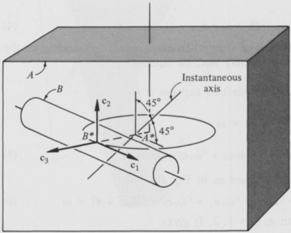{width=56%} 图1.19.2

 ---------------------------------------------[ 第100页 ]---------------------------------------------  

84 运动学 1.20

因此，若$P^*$是$B$在$A$中瞬时轴上的一个点，则$P^*$相对于$B^*$的位置矢量$\mathbf{r}^*$可由下式给出

$\mathbf{r}^* = \frac{\Omega(\mathbf{c}_1 + \mathbf{c}_2) \times (R \Omega \mathbf{c}_i)}{2 \Omega^2} + \mu^* \Omega(\mathbf{c}_1 + \mathbf{c}_2) $\[= - \frac{R}{2} \mathbf{c}_3 + \mu^* \Omega(\mathbf{c}_1 + \mathbf{c}_2) $\]

因此，$B$在$A$中的瞬时轴经过连接$A^{*}$与$B^{*}$的直线的中点，垂直于$\mathbf{c}_3$，并与$\mathbf{c}_1$和$\mathbf{c}_2$各成$45^\circ$角，如图1.19.2所示。

1.20 角加速度

刚体$B$在参考系$A$中的角加速度$\alpha$定义为$B$在$A$中角速度$\omega$的第一次时间导数（参见第1.11节）：

$\alpha \triangleq \frac{d \omega}{dt}$；$\alpha = \omega_1 \mathbf{c}_1 + \omega_2 \mathbf{c}_2 + \omega_3 \mathbf{c}_3$；$\alpha = \alpha_1 \mathbf{c}_1 + \alpha_2 \mathbf{c}_2 + \alpha_3 \mathbf{c}_3$；$\alpha \alpha_i = \alpha_2 \dot{\omega}_i + \Omega \times \omega \cdot \mathbf{c}_i (i = 1, 2, 3)$；其中，$\mathbf{\Omega}$ 是 $C$ 在 $A$ 中的角速度。换句话说，根据 $C$ 在 $A$ 中的运动状态，$\mathbf{c}_\alpha_i$ 可能等于 $\alpha_2 \dot{\omega}_i$，也可能不等于。

利用式（1.11.8），我们可以将 $\alpha$ 表示为：

$\alpha \triangleq \frac{c \dot{\omega}}{dt} + \Omega \times \omega$；$\alpha \triangleq \frac{c \dot{\omega}}{2} + \Omega \times \omega$；$\text{是} \text{用于} \text{用于} \text{用于} \text{用于} \text{用于} \text{用于} \text{用于} \text{用于} \text{用于} \text{用于} \text{用于} \text{用于} \text{用于} \text{用于} \text{用于} \text{用于} \text{用于} \text{用于} \text{用于} \text{用于} \text{用于} \text{用于} \text{用于} \text{用于} \text{用于} \text{用于} \text{用于} \text{用于} \text{用于} \text{用于} \text{用于} \text{用于} \text{用于} \text{用于} \text{用于} \text{用于} \text{用于} \text{用于} \text{用于} \text{用于} \text{用于} \text{用于} \text{用于} \text{用于} \text{用于} \text{用于} \text{用于} \text{用于} \text{用于} \text{用于} \text{用于} \text{用于} \text{用于} \text{用于} \text{用于} \text{用于} \text{用于} \text{用于} \text{用于} \text{用于} \text{用于} \text{用于} \text{用于} \text{用于} \text{用于} \text{用于} \text{用于} \text{用于} \text{用于} \text{用于} \text{用于} \text{用于} \text{用于} \text{用于} \text{用于} \text{用于} \text{用于} \text{用于} \text{用于} \text{用于} \text{用于} \text{用于} \text{用于} \text{用于} \text{用于} \text{用于} \text{用于} \text{用于} \text{用于} \text{用于} \text{用于} \text{用于} \text{用于} \text{用于} \text{用于} \text{用于} \text{用于} \text{用于} \text{用于} \text{用于} \text{用于} \text{用于} \text{用于} \text{用于} \text{用于} \text{用于} \text{用于} \text{用于} \text{用于} \text{用于} \text{用于} \text{用于} \text{用于} \text{用于} \text{用于} \text{用于} \text{用于} \text{用于} \text{用于} \text{......$\alpha \triangleq \frac{d \omega}{dt}$   $\alpha = \omega_1 \mathbf{c}_1 + \omega_2 \mathbf{c}_2 + \omega_3 \mathbf{c}_3$   $\alpha = \alpha_1 \mathbf{c}_1 + \alpha_2 \mathbf{c}_2 + \alpha_3 \mathbf{c}_3$   $\alpha \alpha_i = \alpha_2 \dot{\omega}_i + \Omega \times \omega \cdot \mathbf{c}_i (i = 1, 2, 3)$   其中，$\mathbf{\Omega}$ 是 $C$ 在 $A$ 中的角速度。换句话说，根据 $C$ 在 $A$ 中的运动状态，$\mathbf{c}_\alpha_i$ 可能等于 $\alpha_2 \dot{\omega}_i$，也可能不等于。

利用式（1.11.8），我们可以将 $\alpha$ 表示为

$\alpha \triangleq \frac{c \dot{\omega}}{dt} + \Omega \times \omega$   $\alpha \triangleq \frac{c \dot{\omega}}{2} + \Omega \times \omega$   其中，$\text{是用于} \text{用于} \text{用于} \text{用于} \text{用于} \text{用于} \text{用于} \text{用于} \text{用于} \text{用于} \text{用于} \text{用于} \text{用于} \text{用于} \text{用于} \text{用于} \text{用于} \text{用于} \text{用于} \text{用于} \text{用于} \text{用于} \text{用于} \text{用于} \text{用于} \text{用于} \text{用于} \text{用于} \text{用于} \text{用于} \text{用于} \text{用于} \text{用于} \text{用于} \text{用于} \text{用于} \text{用于} \text{用于} \text{用于} \text{用于} \text{用于} \text{用于} \text{用于} \text{用于} \text{用于} \text{用于} \text{用于} \text{用于} \text{用于} \text{用于} \text{用于} \text{用于} \text{用于} \text{用于} \text{用于} \text{用于} \text{用于} \text{用于} \text{用于} \text{用于} \text{用于} \text{用于} \text{用于} \text{用于} \text{用于} \text{用于} \text{用于} \text{用于} \text{用于} \text{用于} \text{用于} \text{用于} \text{用于} \text{用于} \text{用于} \text{用于} \text{用于} \text{用于} \text{用于} \text{用于} \text{用于} \text{用于} \text{用于} \text{用于} \text{用于} \text{用于} \text{用于} \text{用于} \text{用于} \text{用于} \text{用于} \text{用于} \text{用于} \text{用于} \text{用于} \text{用于} \text{用于} \text{用于} \text{用于} \text{用于} \text{用于} \text{用于} \text{用于} \text{用于} \text{用于} \text{用于} \text{用于} \text{用于} \text......

$$
{ } ^{c} \alpha _ { i } = { } ^{c} \dot { \omega } _ { i } + \Omega \times \omega \cdot { } \mathbf { c } _ { i }  ( i = 1 , \, 2 , \, 3 )
$$

示例图1.20.1描绘了在第1.12节的示例中先前所讨论的系统。除了之前使用的单位向量外，还展示了正交的单位向量$\mathbf{c}_1$、$\mathbf{c}_2$和$\mathbf{c}_3$，并标明了一个固定这些向量的参考系$C$。仅考虑那些$\dot{\phi}$、$\dot{\psi}$以及$\theta$保持恒定的运动情况，需要确定${}^{A}\alpha_{i}$、${}^{B}\alpha_{i}$和${}^{C}\alpha_{i}$（$i=1,2,3）这些量，其定义如下：

$$
{ } ^{A} \alpha _ { i } \triangleq \alpha \cdot \mathbf { a } _ { i }  { } ^{B} \alpha _ { i } \triangleq \alpha \cdot \mathbf { b } _ { i }  { } ^{C} \alpha _ { i } \triangleq \alpha \cdot \mathbf { c } _ { i }  ( i = 1 , \, 2 , \, 3 )
$$

其中$\alpha$为$B$在$A$中的角加速度。

$B$在$A$中的角速度$\omega$可表示为

$$
\boldsymbol { \omega } = ( \dot { \psi } \, \mathrm { c } \theta + \dot { \phi } ) \mathbf { a } _ { 1 } + \dot { \psi } \, \mathrm { s } \theta \, \mathrm { c } \phi \, \mathbf { a } _ { 2 } + \dot { \psi } \, \mathrm { s } \theta \, \mathrm { s } \phi \, \mathbf { a } _ { 3 }
$$

或写为

$$
\omega = ( \dot { \psi } + \dot { \phi } \; c \theta ) \mathbf { b } _ { 1 } - \dot { \phi } \; s \theta \; c \psi \; \mathbf { b } _ { 2 } + \dot { \phi } \; s \theta \; s \psi \; \mathbf { b } _ { 3 }
$$

或写为

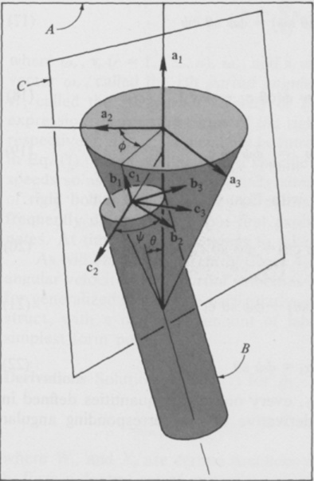{width=43%} 图1.20.1

 ---------------------------------------------[ 第102页 ]---------------------------------------------  

$$
\boldsymbol { \omega } = ( \dot { \psi } + \dot { \phi } \; \mathbf { c } \theta ) \mathbf { c } _ { 1 } - \dot { \phi } \; \mathbf { s } \theta \; \mathbf { c } _ { 2 }
$$

利用式（4），将$C$替换为$A$，从而$\Omega = 0$，结合式（9）可得

$$
{ } ^{A} \alpha _ { 1 } = \frac { d } { d t } \left( \dot { \psi } \; c \theta + \dot { \phi } \right) = 0
$$

$$
{ } ^{\wedge} \alpha _ { 2 } = \frac { d } { d t } \ ( \dot { \psi } \ s \theta \ c \phi ) = \ - \ \dot { \psi } \dot { \phi } \ s \theta \ s \phi
$$

$$
{ } ^{A} \alpha _ { 3 } = \frac { d } { d t } \ ( \dot { \psi } \ s \theta \ s \phi ) = \dot { \psi } \dot { \phi } \ s \theta \ c \phi
$$

同样地，将式（4）中的$C$替换为$B$，使$\Omega = \omega$，式（10）便允许我们写出

$$
{ } ^{B} \alpha _ { 1 } = \frac { d } { d t } \left( \dot { \psi } + \dot { \phi } \; c \theta \right) = 0
$$

$$
{ } ^{B} \alpha _ { 2 } = \frac { d } { d t } \left( - \dot { \phi } \; s \theta \; c \psi \right) = \dot { \phi } \dot { \psi } \; s \theta \; s \psi
$$

$$
{ } ^{B} \alpha _ { 3 } = \frac { d } { d t } \left( \dot { \phi } \; s \theta \; s \psi \right) = \dot { \phi } \dot { \psi } \; s \theta \; c \psi
$$

最后，当

$$
\mathbf { \Omega } = \mathbf { \nabla } ^{\mathsf { A} } \mathbf { \omega } ^{\mathsf { C} } = \dot { \phi } ( \mathbf { c } \theta \ \mathbf { c } _ { 1 } - \mathbf { s } \theta \ \mathbf { c } _ { 2 } )
$$

使得

$$
\Omega \times \omega = \dot { \phi } \psi \ s \theta \ c _ { 3 }
$$

根据式（4）以及式（11）和式（19），可以得出

$$
c _ { \alpha _ { 1 } } = \frac { d } { d t } \left( \dot { \psi } + \dot { \phi } \; c _ { \theta } \right) + \dot { \phi } \dot { \psi } \; s _ { \theta } \; c _ { 3 } \; \cdot \; c _ { 1 } = 0
$$

$$
c _ { \alpha _ { 2 } } = \frac { d } { d t } \left( - \dot { \phi } \; s \theta \right) + \dot { \phi } \dot { \psi } \; s \theta \; \mathbf { c } _ { 3 } \cdot \mathbf { c } _ { 2 } = 0
$$

并且

$$
c _ { \alpha _ { 3 } } = \dot { \phi } \dot { \psi } \ s \theta
$$

因此，除${}^{c}\alpha_{3}$外，式（8）中定义的每一个量都等于对应角速度测量值的时间导数。

 ---------------------------------------------[ 第103页 ]---------------------------------------------  

1.21 部分角速度与部分速度

由于后续会逐渐显现的原因，在处理一个系统$S$时，若该系统的配置在参考系$A$中由$n$个广义坐标$q_1, \ldots, q_n$来表征，通常采用引入$n$个量$u_1, \ldots, u_n$——即$S$在$A$中的广义速度——作为$\dot{q}_1, \ldots, \dot{q}_n$的线性组合，通过如下形式的方程实现：

$$
u _ { r } \triangleq \sum _ { s = 1 } ^{n} Y _ { r s } \; \dot { q } _ { s } + Z _ { r }  ( r \equiv 1 , \; \ldots , \; n )
$$

其中$Y_{rs}$和$Z_{r}$是$q_1, \ldots, q_n$以及$t的函数，且$Y_{rs}$（$r, s=1, \ldots, n$）的选取方式确保式（1）能够唯一地解出$\dot{q}_{1}, \ldots, \dot{q}_{n}$。当这一过程完成时，$S$所属刚体$B$在$A$中的角速度$\omega$，以及$S$所属粒子$P$在$A$中的速度$\mathbf{v}$，均可被唯一地表示为

$$
\omega = \sum _ { r = 1 } ^{n} \omega _ { r } \, u _ { r } + \omega _ { t }
$$

并且

$$
\mathbf { v } = \sum _ { r = 1 } ^{n} \mathbf { v } _ { r } \, u _ { r } + \mathbf { v } _ { t }
$$

其中，$\omega_{r}$、$\mathbf{v}_{r}$（$r=1,\ldots,n$）、$\omega_{t}$ 和 $\mathbf{v}_{t}$ 都是 $q_{1},\ldots,q_{n}$ 与 $t$ 的函数。向量 $\omega_{r}$ 称为在 $A$ 中 $B$ 的第 $r$ 个偏角速度，向量 $\mathbf{v}_{r}$ 称为在 $A$ 中 $P$ 的第 $r$ 个偏速度，它们是通过考察式子的形式而得出的——这些式子分别具有方程 (2) 和方程 (3) 的右端项形式；对于 $u_{1},\ldots,u_{n}$，无需按照式 (1) 中所指示的正式方式加以引入。在处理具体问题时，人们会选取广义速度，从而得到特别简洁的刚体角速度及系统中各点速度的表达式，而且往往无需事先明确指定广义坐标。有时，对于某些或全部 $r$ 值，取 $u_{r}=\dot{q}_{r}$ 会更加方便。

正如第四章将要阐明的那样，借助广义速度、偏角速度和偏速度，人们能够以极为高效的方式推导出广义力的表达式，并且能够在最少的工作量下，构建出形式最为简单的运动方程。

对式 (1) 中 $\dot{q}_{1},\ldots,\dot{q}_{n}$ 的求导，可得

$$
\dot { q } _ { s } = \sum _ { r = 1 } ^{n} W _ { s r } \; u _ { r } + X _ { s }  ( s = 1 , \; \ldots , \; n )
$$

其中 $W_{sr}$ 和 $X_{s}$ 是 $q_{1},\ldots,q_{n}$ 与 $t$ 的某些函数。现在，若 $\mathbf{b}_{1}$、$\mathbf{b}_{2}$、$\mathbf{b}_{3}$ 构成一组右手系的相互垂直的单位向量，并且这些向量固定在 $B$ 中，那么

 ---------------------------------------------[ 第104页 ]---------------------------------------------  

88 运动学 1.21

若 $\dot{\mathbf{b}}_{i}$ 表示 $\mathbf{b}_{i}$ 在 $A$ 中的一次导数，则

$$
\begin{aligned}& \dot{\mathbf{b}}_{i}=\sum_{s=1}^{n} \frac{\partial \mathbf{b}_{i}}{\partial q_{s}} \dot{q}_{s}+\frac{\partial \mathbf{b}_{i}}{\partial t} \\& = \sum_{s=1}^{n} \frac{\partial \mathbf{b}_{i}}{\partial q_{s}}\left(\sum_{r=1}^{n} W_{s r} u_{r}+X_{s}\right)+\frac{\partial \mathbf{b}_{i}}{\partial t}\end{aligned}
$$

$$
\begin{aligned}& = \sum_{r=1}^{n} \sum_{s=1}^{n} \frac{\partial \mathbf{b}_{i}}{\partial q_{s}} W_{s r} u_{r}+\sum_{s=1}^{n} \frac{\partial \mathbf{b}_{i}}{\partial q_{s}} X_{s}+\frac{\partial \mathbf{b}_{i}}{\partial t}\end{aligned}
$$

其中，$\mathbf{b}_{i}$ 的所有偏导数都是在 $A$ 中进行的。因此，

$$
\begin{aligned}& \omega=\mathbf{b}_{1} \dot{\mathbf{b}}_{2} \cdot \mathbf{b}_{3}+\mathbf{b}_{2} \dot{\mathbf{b}}_{3} \cdot \mathbf{b}_{1}+\mathbf{b}_{3} \dot{\mathbf{b}}_{1} \cdot \mathbf{b}_{2} \\\end{aligned}
$$

 ---------------------------------------------[ 第105页 ]---------------------------------------------  

因此，在将 $\mathbf{v}_r$ 和 $\mathbf{v}_t$ 定义为

$$
\mathbf { v } _ { r } \triangleq \sum _ { s = 1 } ^{n} \frac { \partial \mathbf { p } } { \partial q _ { s } } \, W _ { s r }  ( r = 1 , \, \ldots , \, n )
$$

并

$$
\mathbf { v } _ { t } \triangleq \sum _ { s = 1 } ^{n} { \frac { \partial \mathbf { p } } { \partial q _ { s } } } X _ { s } + { \frac { \partial \mathbf { p } } { \partial t } }
$$

我们便得到了式（3）。

例如，在图1.21.1中，$B$ 代表一个刚体，其质心 $B^{*}$ 在一个固定于参考系 $A$ 中、半径为 $R$ 的圆形轨道 $C$ 上以恒定速度 $V$ 运动。$\mathbf{a}_{1}$、$\mathbf{a}_{2}$、$\mathbf{a}_{3}$ 以及 $\mathbf{b}_{1}$、$\mathbf{b}_{2}$、$\mathbf{b}_{3}$ 构成一组右手系的相互垂直的单位向量，这些向量分别固定于 $A$ 和 $B$ 中；而 $\boldsymbol{\tau}$ 是一条与 $C$ 在 $B^{*}$ 处相切的单位向量。

由于 $B^{*}$ 在 $A$ 中的运动已由设定条件决定，因此只需三个广义坐标即可表征 $B$ 在 $A$ 中的构形。在不显式引入坐标的情况下，我们可以根据 $\mathbf{b}_{r}$ 以及 $B$ 在 $A$ 中的角速度 $\omega$ 来定义广义速度：

$$
u _ { r } \triangleq \omega \cdot \mathbf { b } _ { r }  ( r = 1 , \, 2 , \, 3 )
$$

由此可立即得出结论，

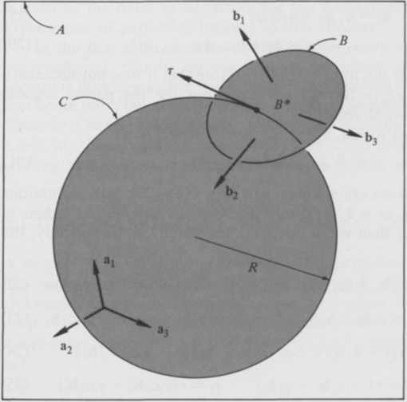{width=57%} 图1.21.1

 ---------------------------------------------[ 第106页 ]---------------------------------------------  

$$
\omega = u _ { 1 } \mathbf { b } _ { 1 } + u _ { 2 } \mathbf { b } _ { 2 } + u _ { 3 } \mathbf { b } _ { 3 }
$$

通过比较式（2）和式（13），我们发现 $B$ 在 $A$ 中的偏转角速度可表示为

$$
\omega _ { r } = \mathbf { b } _ { r }  ( r = 1 , 2 , 3 )
$$

若 $P$ 是 $B$ 中的一个点，其相对于 $B^*$ 的位置向量为向量 $rb_1$，则 $P$ 在 $A$ 中的速度 $\mathbf{v}$ 可表示为

$$
\begin{aligned} \mathbf { v } & = V \tau + \omega \times \left( r \mathbf { b } _ { 1 } \right) \\& = V \tau + r \left( u _ { 3 } \mathbf { b } _ { 2 } - u _ { 2 } \mathbf { b } _ { 3 } \right) \end{aligned}
$$

因此，$P$ 在 $A$ 中的偏转速度可表示为 [对比式（3）和式（15）]

$$
\mathbf { v } _ { 1 } = \mathbf { 0 }  \mathbf { v } _ { 2 } = - r \mathbf { b } _ { 3 }  \mathbf { v } _ { 3 } = r \mathbf { b } _ { 2 }
$$

假设我们决定采用三个广义坐标——$q_{1}$、$q_{2}$、$q_{3}$——来描述单位向量 $\mathbf{a}_{1}$、$\mathbf{a}_{2}$、$\mathbf{a}_{3}$ 与单位向量 $\mathbf{b}_{1}$、$\mathbf{b}_{2}$、$\mathbf{b}_{3}$ 之间的关系，正如第1.7节所介绍的那样。那么，$\omega$ 将由以下公式给出 [参见式（1.17.1）和式（1.17.3）]

$$
\boldsymbol { \omega } = ( \dot { q } _ { 1 } - s _ { 2 } \, \dot { q } _ { 3 } ) \mathbf { b } _ { 1 } + ( \mathbf { c } _ { 1 } \, \dot { q } _ { 2 } + s _ { 1 } \mathbf { c } _ { 2 } \, \dot { q } _ { 3 } ) \mathbf { b } _ { 2 } + ( \, - \, s _ { 1 } \, \dot { q } _ { 2 } + \mathbf { c } _ { 1 } \mathbf { c } _ { 2 } \, \dot { q } _ { 3 } ) \mathbf { b } _ { 3 }
$$

而 $u_{1}$、$u_{2}$、$u_{3}$ 将与 $q_{1}$、$q_{2}$、$q_{3}$ 之间存在如下关系 [参见式（1）和式（17）]：

$$
u _ { 1 } = \dot { q } _ { 1 } - s _ { 2 } \, \dot { q } _ { 3 }
$$

$$
u _ { 2 } = c _ { 1 } \, \dot { q } _ { 2 } + s _ { 1 } c _ { 2 } \, \dot { q } _ { 3 }
$$

$$
u _ { 3 } = - s _ { 1 } \, \dot { q } _ { 2 } + c _ { 1 } c _ { 2 } \, \dot { q } _ { 3 }
$$

这些方程的形式与式（1）相同。需要注意的是，为了推导出偏转角速度 $\omega_{r}$ 以及偏转速度 $\mathbf{v}_{r}$（$r = 1, 2, 3$）的表达式，其实并不需要使用这些方程。

作为式（12）的替代方案，我们也可以将 $u_{r}$ 定义为

$$
u _ { r } \triangleq \dot { q } _ { r }  ( r = 1 , \, 2 , \, 3 )
$$

显然，这些方程比式（18）至式（20）要简单得多；然而，当以这种方式定义 $u_r$ 时，$\omega$、$\omega_r$、$\mathbf{v}$ 和 $\mathbf{v}_r$（$r=1,2,3$）的表达式往往比采用式（12）时更为复杂。具体而言，这些关系为：

$$
\boldsymbol { \omega } = ( u _ { 1 } - s _ { 2 } \, u _ { 3 } ) \mathbf { b } _ { 1 } + ( \mathbf { c } _ { 1 } \, u _ { 2 } + s _ { 1 } \mathbf { c } _ { 2 } \, u _ { 3 } ) \mathbf { b } _ { 2 } + ( \mathrm { ~ - ~ } s _ { 1 } \, u _ { 2 } + \mathbf { c } _ { 1 } \mathbf { c } _ { 2 } \, u _ { 3 } ) \mathbf { b } _ { 3 }
$$

$$
\begin{array}{rl} { \omega _ { 1 } = \mathbf { b } _ { 1 } } & { { }  \omega _ { 2 } = \mathbf { c } _ { 1 } \mathbf { b } _ { 2 } - \mathbf { s } _ { 1 } \mathbf { b } _ { 3 }   \omega _ { 3 } = \mathbf { \nabla } - \mathbf { s } _ { 2 } \mathbf { b } _ { 1 } + \mathbf { s } _ { 1 } \mathbf { c } _ { 2 } \mathbf { b } _ { 2 } + \mathbf { c } _ { 1 } \mathbf { c } _ { 2 } \mathbf { b } _ { 3 } } \end{array}
$$

$$
\mathbf { v } = V \tau + r \left[ ( - \mathrm { ~ s _ { 1 } ~ } u _ { 2 } + \mathrm { ~ c _ { 1 } c _ { 2 } ~ } u _ { 3 } ) \mathbf { b } _ { 2 } - ( \mathrm { ~ c _ { 1 } ~ } u _ { 2 } + \mathrm { ~ s _ { 1 } c _ { 2 } ~ } u _ { 3 } ) \mathbf { b } _ { 3 } \right]
$$

$$
\mathbf { v } _ { 1 } = \mathbf { 0 }  \mathbf { v } _ { 2 } = r ( \mathbf { \nabla } - \mathbf { s } _ { 1 } \mathbf { b } _ { 2 } - \mathbf { c } _ { 1 } \mathbf { b } _ { 3 } )  \mathbf { v } _ { 3 } = r ( \mathbf { c } _ { 1 } \mathbf { c } _ { 2 } \mathbf { b } _ { 2 } - \mathbf { s } _ { 1 } \mathbf { c } _ { 2 } \mathbf { b } _ { 3 } )
$$

取代式（13）至式（16）。

 ---------------------------------------------[ 第107页 ]---------------------------------------------  

# 引力作用

大多数航天器动力学问题的求解都需要考虑引力作用及其力矩。在本章中，我们以牛顿万有引力定律作为出发点，构建出在这一背景下特别重要的力与力矩表达式。

在本章的前八节中，仅采用向量代数方法；也就是说，未使用偏微分算术。随后，有一节专门介绍偏导数计算技巧，这些技巧将在后续章节中发挥作用，而这些后续章节则致力于研究力函数。由于在第3章和第4章中，仅少量引用了第2.9至2.18节的相关内容，因此，对于那些希望尽快进入第3章和第4章的读者来说，可以省略这些章节（以及第2.18至2.38题）。

# 2.1 两个粒子之间的引力相互作用

质量为 $m$ 的粒子 $P$ 在质量为 $\overline{m}$ 的粒子 $\overline{P}$ 存在时，会受到沿 $P$ 与 $\overline{P}$ 连线方向作用的力 $\mathbf{F}$，该力的方向从 $P$ 向 $\overline{P}$ 传递，其大小与 $m$ 和 $\overline{m}$ 的乘积成正比，且与 $P$ 与 $\overline{P}$ 之间的距离的平方成反比。因此，若 $\mathbf{p}$ 是从 $\overline{P}$ 到 $P$ 的位置向量（见图2.1.1），则力 $\mathbf{F}$ 可以表示为†

†向量上的上标“2”表示将该向量与自身进行数量乘法，即对向量的模长进行平方。

 ---------------------------------------------[ 第108页 ]---------------------------------------------  

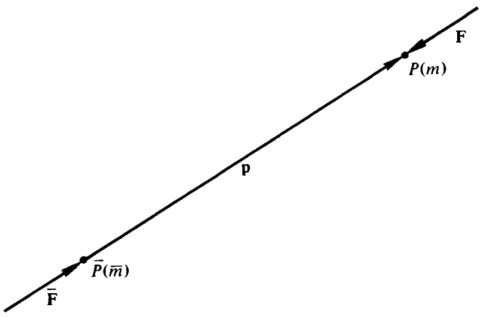{width=54%} 图2.1.1

$$
\mathbf { F } = - G \overline { { { m } } } m \mathbf { p } ( \mathbf { p } ^{2} ) ^{- 3 / 2}
$$

其中 $G$ 是万有引力常数，其数值为† $G \approx 6.6732 \times 10^{-11}$ N·m² kg⁻²。

$\overline{P}$ 在 $P$ 存在时所受到的力 $\overline{\mathbf{F}}$ 为

$$
\overline { { \mathbf { F } } } = - \mathbf { F }
$$

符合牛顿第三定律。

示例：若$\overline{m}$为地球的质量，$m$为月球的质量，$\mathbf{p}$为从地球质心指向月球质心的向量；若$\overline{m}$、$m$和$|\mathbf{p}|$的数值近似分别为$\overline{m} \approx 5.97 \times 10^{24}$ kg、$m \approx 7.34 \times 10^{22}$ kg，以及$|\mathbf{p}| \approx 3.844 \times 10^{8}$ m，则地球对月球施加的力$\mathbf{F}$的大小是多少？

由于式（1）仅适用于粒子，因此在本题中，只有在假定地球和月球可被置于其质心处、且各自具有质量$\overline{m}$和$m$的情况下，才能将其用于本题所要解决的问题。在这种情况下，

$$
\left| \mathbf { F } \right| _ { ( 1 ) } = G \overline { { { m } } } m \left| \mathbf { p } \right| ( \mathbf { p } ^{2} ) ^{- 3 / 2} \approx 1 . 98 \times 10 ^{20} \, \mathbf { N }
$$

2.2 粒子对物体施加的力

由质量为$\overline{m}$的粒子$\overline{P}$对某（不一定刚性）物体$B$中的各粒子所施加的引力系统，等效于单一的力$\overline{\mathbf{F}}$。

†E. A. 梅赫特利，《国际单位制：物理常数与换算因子》，NASA SP-7012，修订版，1969年。

 ---------------------------------------------[ 第109页 ]---------------------------------------------  

图2.2

图2.2.1

其作用线通过$\overline{P}$，但并不一定经过$B$的质心$B^{*}$。若$B$由质量为$m_{1}, \ldots, m_{N}$的粒子$P_{1}, \ldots, P_{N}$组成，且$\mathbf{p}_{1}, \ldots, \mathbf{p}_{N}$分别是$P_{1}, \ldots, P_{N}$相对于$\overline{P}$的位置向量（参见图2.2.1），则$\mathbf{F}$可表示为

$\mathbf{F} = -G \overline{m} \sum_{i=1}^{N} m_{i} \mathbf{p}_{i}(\mathbf{p}_{i}^{2})^{-3/2}$。

然而，若$B$是物质的连续分布，$\rho$为$B$在$B$任意一点$P$处的密度，$\mathbf{p}$为$P$相对于$\overline{P}$的位置向量（参见图2.2.2），且$d\tau$为$B$所占据的图形（曲线、表面或立体）的微分元素的长度、面积或体积，则$\mathbf{F}$可以表示为

$\mathbf{F} = -G \overline{m} \int \mathbf{p}(\mathbf{p}^{2})^{-3/2} \rho \, d\tau$。

一旦确定了式（1）或式（2）中力$\mathbf{F}$的作用线，就始终可以在此作用线上找到一个点$B'$，使得$\overline{P}$对放置于$\overline{B'}$、质量与$B$相等的粒子所施加的力，等于$\overline{P}$对$\mathbf{B}$所施加的力$\mathbf{F}$。该点$B'$被称为吸引粒子$\overline{P}$的$B$的重心，通常情况下并不与$B$的质心重合。若$R'$为$\overline{P}$到质心$B'$的距离，则

\[R' = \left(\frac{G \overline{m} m}{|\mathbf{F}|}\right)^{1/2}\]

其中，$\mathbf{F}$ 由式（1）或式（2）得出，$m$ 是 $B$ 的质量。

 ---------------------------------------------[ 第110页 ]---------------------------------------------  

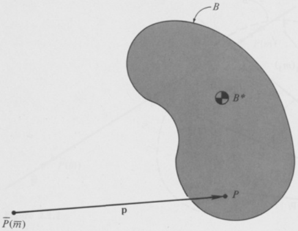{width=55%} 图2.2.2

推导过程　$\overline{P}$ 对位于点 $P$ 的 $B$ 微分元素所施加的力 $d\mathbf{F}$，沿连接 $P$ 与 $\overline{P}$ 的直线作用，并由下式给出：

$$
d \mathbf { F } _ { ( 2 . 1 . 1 ) } = - G \overline { { { m } } } \, \mathbf { p } \, ( \mathbf { p } ^{2} ) ^{- 3 / 2} \, \rho \ d \tau
$$

根据定义，两个力系若具有相同的合力以及关于某一点的相同力矩，则称其为等效的。一方面，$\overline{P}$ 对 $B$ 所有微分元素所施加的力系的合力，由下式给出：

$$
\int  d \mathbf { F } = \ - G \overline { { m } } \int \mathbf { p } ( \mathbf { p } ^{2} ) ^{- 3 / 2} \rho \ d \tau
$$

且该力系关于点 $\overline{P}$ 的力矩为零，因为 $d\mathbf{F}$ 沿着连接 $P$ 与 $\overline{P}$ 的直线作用，而在 $\overline{P}$ 处的力矩为零。另一方面，仅包含一个力 $\mathbf{F}$ 的力系的合力即为 $\mathbf{F}$ 本身，而当 $\mathbf{F}$ 的作用线通过 $\overline{P}$ 时，该力系关于点 $\overline{P}$ 的力矩也为零。因此，若 $\mathbf{F}$ 由式（2）给出，并沿经过 $\overline{P}$ 的直线作用，则 $\mathbf{F}$ 与 $\overline{P}$ 对 $B$ 所有微分元素所施加的力系等效。

对于式（1），可以构造一个平行的证明；当 $B$ 由有限个粒子组成时，该式可替代式（2）。

要证明“力 $\mathbf{F}$ 的作用线并不一定经过 $B^{*}$”这一命题的真实性，最简便的方法是通过一个实例来加以说明。最后，式（3）可直接从式（2.1.1）及 $R'$ 的定义中推导而来。

示例　长度为 $\underline{L}$、质量为 $m$ 的均匀细杆 $B$，受到质量为 $\overline{m}$ 的粒子 $\overline{P}$ 的引力作用，如图所示。

 ---------------------------------------------[ 第111页 ]---------------------------------------------  

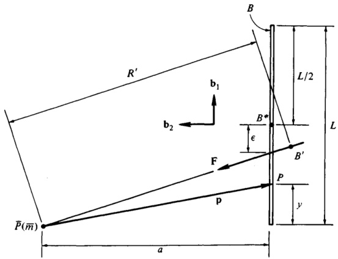{width=62%} 图2.2.3

2.2.3. 应将 $\overline{P}$ 对构成 $\underline{B}$ 的各粒子所施加的力系，替换为一条作用线通过 $\overline{P}$ 的力 $\mathbf{F}$，并求出 $\overline{P}$ 与 $B$ 的重心 $B^{*}$ 之间的距离 $R'$ 的表达式。

若将该杆视为沿一条直线段分布的物质，则杆上任意一点 $P$ 相对于 $\overline{P}$ 的位置向量 $\mathbf{p}$ 可表示为：

$$
\mathbf { p } = y \mathbf { b } _ { 1 } - a \mathbf { b } _ { 2 }
$$

其中，$\mathbf{b}_{1}$ 和 $\mathbf{b}_{2}$ 是如图 2.2.3 所示方向的单位向量，且 $y$ 的取值范围为从 0 到 $L$。此时，位于 P 点的 $B$ 的质量密度 $\rho$ 等于 $m/L$，而 $B$ 的一个微元元素的长度为 $dy$。因此，将力 $\mathbf{F}$ 分解为与 $\mathbf{b}_{1}$ 和 $\mathbf{b}_{2}$ 平行的分量，可表示为

$$
{ \bf F } = F _ { 1 } { \bf b } _ { 1 } + F _ { 2 } { \bf b } _ { 2 } = - G \overline { { { m } } } \int _ { 0 } ^{L} ( y { \bf b } _ { 1 } - a { \bf b } _ { 2 } ) ( a ^{2} + y ^{2} ) ^{- 3 / 2} \, \frac { m } { L } \, d y
$$

通过积分运算，可得

$$
F _ { 1 } = - \frac { G \overline { { { m } } } m \left[ ( 1 + a ^{2} / L ^{2} ) ^{1 / 2} - a / L \right] } { a \left( a ^{2} + L ^{2} \right) ^{1 / 2} }
$$

 ---------------------------------------------[ 第112页 ]---------------------------------------------  

96 重力作用 2.2

由图 2.2.3 可知，$B$ 的质心 $B^{*}$ 与 $B$ 与力作用线交点之间的距离 $\epsilon$，与 $F_{1}$ 和 $F_{2}$ 的关系为

$$
\frac{F_{1}}{F_{2}}=\frac{L/2-\epsilon}{a(a^{2}+L^{2})^{1/2}}
$$

因此，

$$
\frac{\xi}{L}=\frac{1}{2}+\frac{aF_{1}}{LF_{2}}=\frac{1}{2}-\frac{a}{L}\left[\left(1+\frac{a^{2}}{L^{2}}\right)^{1/2}-\frac{a}{L}\right]
$$

式 (11) 中的 $\epsilon/L$ 比值，随 $a/L$ 的变化在图 2.2.4 中进行了绘制。由于两个物体不可能占据空间中的同一位置，因此必须排除极限情况 $a/L=0$ 的考虑。然而，当逐渐接近这一极限时，$\epsilon/L$ 比值会趋近于 $1/2$，而力 $\mathbf{F}$ 的作用线也逐渐与 $B$ 重合。对于任意有限的 $a/L$ 值，图 2.2.4 表明，力 $\mathbf{F}$ 的作用线无法同时经过 $\bar{P}$ 和 $B^{*}$。

对于 $\bar{P}$，$\bar{P}$ 到 $B$ 质心 $B'$ 的距离 $R'$ 由下式给出

$$
R'=\left[\frac{G\bar{m}m}{(F_{1}^{2}+F_{2}^{2})^{1/2}}\right]^{1/2}=\frac{(aL)^{1/2}}{\{2[1-(a/L)(1+a^{2}/L^{2})^{-1/2}]\}^{1/4}}
$$

从这个例子中可以清楚地看出，质心 $B'$ 的位置通常并非仅取决于物体 $B$ 的特性，而是取决于吸引粒子 $\bar{P}$ 的位置。

图 2.2.4

$\epsilon/L$ 0.5

$\epsilon/L$ 1.0

$\epsilon/L$ 1.5

$\epsilon/L$ 2.0

$$
a/L
$$

图 2.2.4

 ---------------------------------------------[ 第113页 ]---------------------------------------------  

# 2.3 小体受粒子作用力

当一个物体$B$受到一颗距离$B$的质心$B^{*}$如此之远的粒子$\overline{P}$的引力作用时，若$\overline{P}$与$B^{*}$之间的最大距离小于$\overline{P}$与$B^{*}$之间的距离$R$，则可按照以下方法求得式（2.2.2）中给出的力$\mathbf{F}$表达式的一种有用形式：将$\mathbf{p}$替换为$\mathbf{R}$——即$B^{*}$相对于$\overline{P}$的位置向量——与$\mathbf{r}$——即$P$相对于$B^{*}$的位置向量（见图2.3.1），然后将被积函数按$|\mathbf{r}|/R$的升幂展开，从而得到

$$
\mathbf { F } = - { \frac { G { \overline { { m } } } m } { R ^{2} } } \left[ \mathbf { a } _ { 1 } + \sum _ { i = 2 } ^{\infty} \mathbf { f } ^{( i )} \right]
$$

其中$\mathbf{f}^{(l)}$是$|\mathbf{r}|/R$、$m$和$\overline{m}$这三个量中第$i$次幂项的集合，$G$为万有引力常数，$\mathbf{a}_1$为从$\overline{P}$指向$B^*$的单位向量，因此

$$
\mathbf { R } = R \mathbf { a } _ { 1 }
$$

特别地，$\mathbf{f}^{(2)}$的表达式为

$$
\mathbf { f } ^{( 2 )} = \frac { 1 } { m R ^{2} } \left\{ \frac { 3 } { 2 } \left[ \mathrm { t r } ( \mathbf { I } ) - 5 \mathbf { a } _ { 1 } \cdot \mathbf { I } \cdot \mathbf { a } _ { 1 } \right] \mathbf { a } _ { 1 } + 3 \mathbf { I } \cdot \mathbf { a } _ { 1 } \right\}
$$

其中$\mathbf{I}$为$B$的中心惯性二阶张量，而$\operatorname{tr}(\mathbf{I})$表示$\mathbf{I}$的一个标量不变量，称为$\mathbf{I}$的迹，并通过任意两两正交的单位向量$\mathbf{n}_{1}$、$\mathbf{n}_{2}$和$\mathbf{n}_{3}$来定义：

$$
\operatorname { t r } ( \mathbf { I } ) \triangleq \mathbf { n } _ { 1 } \cdot \mathbf { I } \cdot \mathbf { n } _ { 1 } + \mathbf { n } _ { 2 } \cdot \mathbf { I } \cdot \mathbf { n } _ { 2 } + \mathbf { n } _ { 3 } \cdot \mathbf { I } \cdot \mathbf { n } _ { 3 }
$$

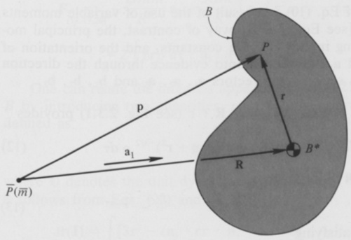{width=56%} 图2.3.1

 ---------------------------------------------[ 第114页 ]---------------------------------------------  

方程（1）提出了两种有用的近似方法，即，

$$
\mathbf { F } \approx { \hat { \mathbf { F } } } \triangleq - { \frac { G { \overline { { m } } } m } { R ^{2} } } \mathbf { a } _ { 1 }
$$

以及

$$
\mathbf { F } \approx \widetilde { \mathbf { F } } \triangleq - \frac { G \overline { { { m } } } m } { R ^{2} } \left[ \mathbf { a } _ { 1 } + \mathbf { f } ^{( 2 )} \right]
$$

有时，对于$\mathbf{f}^{(2)}$的两种表达式，可以作为式（3）中所给表达式的便捷替代方案。其具体推导方法如下：引入单位向量$\mathbf{a}_2$和$\mathbf{a}_3$，使$\mathbf{a}_1$、$\mathbf{a}_2$和$\mathbf{a}_3$构成一个右手系、正交的向量组；再令$\mathbf{b}_1$、$\mathbf{b}_2$和$\mathbf{b}_3$分别为单位向量，分别平行于$B$的主惯性轴，且同样构成一个右手系、正交的向量组。接下来，定义$I_{jk}$和$I_j$为

$$
I _ { j k } \triangleq \mathbf { a } _ { j } \cdot \mathbf { I } \cdot \mathbf { a } _ { k }  ( j , k = 1 , 2 , 3 )
$$

以及

$$
\mathbf { I } _ { j } \triangleq \mathbf { b } _ { j } \cdot \mathbf { I } \cdot \mathbf { b } _ { j }  ( j = 1 , 2 , 3 )
$$

最后，设

$$
C _ { i j } \triangleq \mathbf { a } _ { i } \cdot \mathbf { b } _ { j }  ( i , j = 1 , 2 , 3 )
$$

那么$\mathbf{f}^{(2)}$可以写作

$$
\mathbf { f } ^{( 2 )} = \frac { 3 } { m R ^{2} } \left[ \frac { 1 } { 2 } \left( I _ { 22 } + I _ { 33 } - 2 I _ { 11 } \right) \mathbf { a } _ { 1 } + I _ { 21 } \mathbf { a } _ { 2 } + I _ { 31 } \mathbf { a } _ { 3 } \right]
$$

或写作

$$
\begin{aligned}\mathbf{f}^{(2)}&=\frac{3}{mR^{2}}\frac{1}{2}\left[I_{1}(1-3C_{11}{}^{2})+I_{2}(1-3C_{12}{}^{2})+I_{3}(1-3C_{13}{}^{2})\right]\mathbf{a}_{1}\\&+(I_{1}C_{21}C_{11}+I_{2}C_{22}C_{12}+I_{3}C_{23}C_{13})\mathbf{a}_{2}\\&+(I_{1}C_{31}C_{11}+I_{2}C_{32}C_{12}+I_{3}C_{33}C_{13})\mathbf{a}_{3}\end{aligned}
$$

式（10）相对简单的特性，源于对变量力矩和转动惯量乘积的运用［参见式（7）］。相比之下，式（11）中出现的主转动惯量是常数，而$B$相对于$\mathbf{a}_1$、$\mathbf{a}_2$和$\mathbf{a}_3$的取向，如今则通过连接两组单位向量$\mathbf{a}_1$、$\mathbf{a}_2$、$\mathbf{a}_3$与$\mathbf{b}_1$、$\mathbf{b}_2$、$\mathbf{b}_3$的方向余弦来清晰展现。

将式（2.2.2）中的$p$替换为$R + r$（详见图2.3.1），可得

$$
\mathbf { F } = \mathbf { \nabla } - G \overline { { \mathbf { m } } } \int ( \mathbf { R } + \mathbf { r } ) ( \mathbf { R } ^{2} + 2 \mathbf { R } \cdot \mathbf { r } + \mathbf { r } ^{2} ) ^{- 3 / 2} \, \rho \, d \tau
$$

从向量$q的定义出发，

$$
\mathbf { q } \triangleq { \frac { \mathbf { r } } { R } }
$$

以及满足条件的单位向量$\mathbf{a}_1$，

$$
a _ { 1 } = \frac { R } { R }
$$

 ---------------------------------------------[ 第115页 ]---------------------------------------------  

此时，力变为

$$
{ \bf F } _ { ( 12 - 14 ) } = - \frac { G \overline { { { m } } } } { R ^{2} } \int ( { \bf a } _ { 1 } + { \bf q } ) ( 1 + 2 { \bf a } _ { 1 } \cdot { \bf q } + { \bf q } ^{2} ) ^{- 3 / 2} \, \rho \; d \tau
$$

并利用二项式级数展开式

$$
( 1 + x ) ^{n} = 1 + n x + { \frac { 1 } { 2 ! } } \, n ( n - 1 ) x ^{2} + { \frac { 1 } { 3 ! } } \, n ( n - 1 ) ( n - 2 ) x ^{3} + \cdots .
$$

（适用于$x < 1$）对指数形式的量进行展开，即可得到：

$$
\begin{aligned}\mathbf{F}=&-\frac{G\overline{m}}{R^{2}}\int\left\{\mathbf{a}_{1}\left[1-\frac{3}{2}\left(2\mathbf{a}_{1}\cdot\mathbf{q}+\mathbf{q}^{2}\right)+\frac{15}{2}\left(\mathbf{a}_{1}\cdot\mathbf{q}\right)^{2}+\cdots\right]\right.\\&+\mathbf{q}(1-3\mathbf{a}_1\cdot\mathbf{q}+\cdots)\biggr\}\rho\:d\tau\end{aligned}
$$

其中，三个点分别代表$|\mathbf{q}|$的三次及更高次幂项。通过利用$B^{*}$是$B$的质量中心这一事实，该表达式可以被简化——这意味着，

$$
\int q \rho \ d \tau = 0
$$

因此，

$$
{ \bf F } _ { ( 17 , 18 ) } = - \frac { G \overline { { { m } } } } { R ^{2} } \int \left[ { \bf a } _ { 1 } - \frac { 3 } { 2 } \, { \bf a } _ { 1 } { \bf q } ^{2} + \frac { 15 } { 2 } \, { \bf a } _ { 1 } ( { \bf a } _ { 1 } \cdot { \bf q } ) ^{2} - 3 { \bf q } { \bf a } _ { 1 } \cdot { \bf q } \right] \rho \, d \tau + \cdots
$$

此外，将$q替换为$r/R，并注意到

$$
\int \rho \ d \tau = m
$$

由此可得

$$
\begin{aligned}\mathbf{F}_{(13,19,20)}&-\frac{G\overline{m}m}{R^{2}}\:\mathbf{a}_{1}\:+\frac{3G\overline{m}}{2R^{4}}\:\Big(\mathbf{a}_{1}\int\mathbf{r}^{2}\rho\:d\tau-5\mathbf{a}_{1}\mathbf{a}_{1}\:\cdot\int\mathbf{r}\mathbf{r}\rho\:d\tau\:\cdot\mathbf{a}_{1}\\&+2\int\mathbf{rr}\rho\:d\tau\cdot\mathbf{a}_{1}\Big)+\cdots\end{aligned}
$$

我们可以将式（21）中出现的积分与$B$的转动惯性属性联系起来，为此引入两个量：即$B$的中心转动惯量二元运算式$I$，其定义为

$$
\mathbf { I } \triangleq \int ( \mathbf { U r } ^{2} - \mathbf { r r } ) \rho \ d \tau
$$

其中，$U$表示单位二元运算式，而$I$的迹，由式（4）所定义；根据式（22）和式（4），我们有

$$
\begin{aligned} \operatorname { t r } ( \mathbf { I } ) & = \int \left[ 3 \mathbf { r } ^{2} - ( \mathbf { n } _ { 1 } \cdot \mathbf { r r } \cdot \mathbf { n } _ { 1 } + \mathbf { n } _ { 2 } \cdot \mathbf { r r } \cdot \mathbf { n } _ { 2 } + \mathbf { n } _ { 3 } \cdot \mathbf { r r } \cdot \mathbf { n } _ { 3 } ) \right] \rho \, d \tau \\& = \int ( 3 \mathbf { r } ^{2} - \mathbf { r } ^{2} ) \rho \, d \tau = 2 \int \mathbf { r } ^{2} \rho \, d \tau \end{aligned}
$$

 ---------------------------------------------[ 第116页 ]---------------------------------------------  

100 重力作用 2.3

从而，

以及

$$
\int \mathbf{r}^{2} \rho \, d \tau = \frac{1}{2} \operatorname{tr}(\mathbf{I})
$$

$$
\int \mathbf{r} \rho \, d \tau = \frac{1}{(23)} \operatorname{tr}(\mathbf{I})
$$

因此，

$$
\mathbf{F}_{(21,24,25)} - \frac{G \overline{m}}{R^{2}} \mathbf{a}_{\mathrm{i}} - \frac{3 G \overline{m}}{2 R^{4}} \left[ \operatorname{tr}(\mathbf{I}) - 5 \mathbf{a}_{\mathrm{i}} \cdot \mathbf{I} \cdot \mathbf{a}_{\mathrm{i}} \right] \mathbf{a}_{\mathrm{i}} - \frac{3 G \overline{m}}{R^{4}} \mathbf{I} \cdot \mathbf{a}_{\mathrm{i}} + \cdots
$$

若采用式（3），并认识到式（26）中的三个点代表的是 $|\mathbf{r}| / R$ 的三次及以上项，这些项在式（1）中由 $i \geqslant 3$ 时的 $\mathbf{f}^{(i)}$ 来表示，那么式（1）与式（26）的等价性便显而易见。

参考式（7），可以将 $\mathbf{I}$ 表示为

$$
\mathbf{I} = I_{11} \mathbf{a}_{1} \mathbf{a}_{1} + I_{12} \mathbf{a}_{1} \mathbf{a}_{2} + I_{13} \mathbf{a}_{1} \mathbf{a}_{3}
$$

$$
\mathbf{I} \cdot \mathbf{a}_{\mathrm{i}} = I_{11} \mathbf{a}_{\mathrm{i}} + I_{21} \mathbf{a}_{\mathrm{i}} + I_{22} \mathbf{a}_{\mathrm{i}} + I_{23} \mathbf{a}_{\mathrm{i}} \mathbf{a}_{\mathrm{3}}
$$

由此可得

$$
\mathbf{I} \cdot \mathbf{a}_{\mathrm{i}} = I_{11} \mathbf{a}_{\mathrm{i}} + I_{21} \mathbf{a}_{\mathrm{i}} + I_{31} \mathbf{a}_{\mathrm{i}}
$$

将此方程代入式（3），并注意到

$$
\operatorname{tr}(\mathbf{I}) = I_{11} + I_{22} + I_{33}
$$

同时

$$
\mathbf{a}_{\mathrm{i}} \cdot \mathbf{I} \cdot \mathbf{a}_{\mathrm{i}} = I_{11}
$$

由此得到式（10）。

最后，当我们注意到，根据式（8）以及假设 $\mathbf{b}_{1}$、$\mathbf{b}_{2}$ 和 $\mathbf{b}_{3}$ 与 $B^{*}$ 的惯性主轴平行时，$\mathbf{I}$ 可以表示为

$$
\mathbf{I} = I_{1} \mathbf{b}_{1} \mathbf{b}_{1} + I_{2} \mathbf{b}_{2} \mathbf{b}_{2} + I_{3} \mathbf{b}_{3}
$$

$$
\mathbf{I} = I_{1} \mathbf{a}_{1} \cdot \mathbf{b}_{1} \mathbf{b}_{1} \cdot \mathbf{a}_{1} + I_{2} \mathbf{a}_{1} \cdot \mathbf{b}_{2} \mathbf{b}_{2} \cdot \mathbf{a}_{1} + I_{3} \mathbf{a}_{1} \cdot \mathbf{b}_{3} \mathbf{b}_{3} \cdot \mathbf{a}_{1}
$$

$$
\mathbf{I}_{11} = I_{1} \mathbf{a}_{1} \cdot \mathbf{b}_{1} \mathbf{b}_{1} \cdot \mathbf{a}_{1} + I_{2} \mathbf{a}_{1} \cdot \mathbf{b}_{2} \mathbf{b}_{2} \cdot \mathbf{a}_{1} + I_{3} \mathbf{a}_{1} \cdot \mathbf{b}_{3} \mathbf{b}_{3} \cdot \mathbf{a}_{1}
$$

$$
\mathbf{I}_{(9)} = I_{1} C_{11}^{2} + I_{2} C_{12}^{2} + I_{3} C_{13}^{2}
$$

同样地，

$$
I_{21} = I_{1} C_{21} C_{11} + I_{2} C_{22} C_{12} + I_{3} C_{23} C_{13}
$$

以此类推。若利用 $C_{i_{1}}^{2} + C_{i_{2}}^{2} + C_{i_{3}}^{2} = 1$ 对于 $i = 1, 2, 3$ 的事实，将此式代入式（10）后，即可得到式（11）。

示例：对于质量为 $m$、长度为 $L$ 的均匀细杆 $B$，其受到的质量为 $m$ 的粒子 $\overline{P}$ 所施加的力 $\overline{F}$，需要一个近似表达式。

 ---------------------------------------------[ 第117页 ]---------------------------------------------  

如图2.3.2所示，将$Ezp_3444$以相对于$B$的位置表示为$\overline{m}$，且满足$R \gg L$。假设物体$B$可理想化为沿一条直线段均匀分布的物质。

当省略$\mathbf{f}^{(3)}$、$\mathbf{f}^{(4)}$等项时，式（6）可提供所需的近似力表达式。若将$\mathbf{b}_1$、$\mathbf{b}_2$和$\mathbf{b}_3$作为一组右手系、正交单位矢量引入，且$\mathbf{b}_1$与杆轴平行，则$B^*$处$B$的惯性二阶张量$\mathbf{I}$可由下式给出：

$$
\mathbf { I } = { \frac { m L ^{2} } { 12 } } \left( \mathbf { b } _ { 2 } \mathbf { b } _ { 2 } + \mathbf { b } _ { 3 } \mathbf { b } _ { 3 } \right)
$$

将这些值代入式（3），即可在力的表达式中引入点积$\mathbf{b}_{2} \cdot \mathbf{a}_{1}$和$\mathbf{b}_{3} \cdot \mathbf{a}_{1}$。为了计算这些值，设$\psi$为$\mathbf{b}_{1}$与$\mathbf{a}_{1}$之间的夹角，并注意到

$$
\mathbf { b } _ { 2 } \cdot \mathbf { a } _ { 1 } = - \sin \psi  \mathbf { b } _ { 3 } \cdot \mathbf { a } _ { 1 } = 0
$$
因此，

$$
\mathbf { f } ^{( 2 )} \equiv \frac { 1 } { ( 3 ) } \, \frac { m R ^{2} } { m R ^{2} } \left[ \frac { 3 } { 2 } \left( \frac { m L ^{2} } { 6 } - \frac { 5 m L ^{2} } { 12 } \, \sin ^{2} \psi \right) \mathbf { a } _ { 1 } - \frac { 3 m L ^{2} } { 12 } \, \sin \psi \, \mathbf { b } _ { 2 } \right]
$$

由此，经过运用

$$
\mathbf { b } _ { 2 } = \mathbf { a } _ { 2 } \cos \psi - \mathbf { a } _ { 1 } \sin \psi
$$

并省略$f^{(3)}$、$f^{(4)}$等项，我们得以得到

$$
\mathbf { F } \cong \widetilde { \mathbf { F } } _ { ( 6 ) } = \frac { G \overline { { { m } } } m } { R ^{2} } \left\{ \mathbf { a } _ { 1 } \Big [ 1 + \frac { L ^{2} } { 8 R ^{2} } \left( 2 - 3 \sin ^{2} \psi \right) \Big ] - \mathbf { a } _ { 2 } \, \frac { L ^{2} } { 8 R ^{2} } \sin 2 \psi \right\}
$$

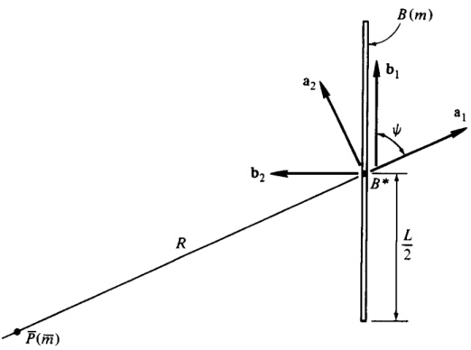{width=59%} 图2.3.2

 ---------------------------------------------[ 第118页 ]---------------------------------------------  

这一结果本可以更轻松地从式（1）、式（6）和式（11）中得出，只需将图2.3.2中提供的方向余弦代入其中即可。

$$
\left[ \begin{array}{lll} { { C _ { 11 } } } & { { C _ { 12 } } } & { { C _ { 13 } } } \\{ { C _ { 21 } } } & { { C _ { 22 } } } & { { C _ { 23 } } } \\{ { C _ { 31 } } } & { { C _ { 32 } } } & { { C _ { 33 } } } \end{array} \right] \; = \; \left[ \begin{array}{lll} { { \cos \psi } } & { { - \sin \psi } } & { { 0 } } \\{ { \sin \psi } } & { { \cos \psi } } & { { 0 } } \\{ { 0 } } & { { 0 } } & { { 1 } } \end{array} \right]
$$

并且在$I_{1} = 0$、$I_{2} = I_{3} = mL^{2}/12$的情况下。

当杆与连接其质心$B^{*}$与$\bar{P}$的直线对齐，使$\psi=0$时，力变为

$$
{ \widetilde { \bf F } } _ { ( 38 ) } = - \frac { G \overline { { { m } } } m } { R ^{2} } \left( 1 + \frac { L ^{2} } { 4 R ^{2} } \right) { \bf a } _ { 1 }
$$

而当杆与该直线垂直时，即$\psi = \pi/2$ rad，

$$
{ \widetilde { \textbf { F } } } _ { ( 38 ) } = - { \frac { G { \overline { { m } } } m } { R ^{2} } } \left( 1 - { \frac { L ^{2} } { 8 R ^{2} } } \right) { \mathbf { a } } _ { 1 }
$$

由于在这些特殊情况下，通过$B^*$且平行于$\mathbf{a}_1$、$\mathbf{a}_2$和$\mathbf{a}_3}$的直线，是$B$的中心惯性主轴，因此，式（40）和式（41）可直接通过使用式（10）获得，其中$I_{21} = I_{31} = 0$，且当$\psi = 0$时，

$$
I _ { 11 } = 0  I _ { 22 } = I _ { 33 } = \frac { m L ^{2} } { 12 }
$$

而当$\psi = \pi/2$时，

$$
I _ { 11 } = \frac { m L ^{2} } { 12 }  I _ { 22 } = 0  I _ { 33 } = \frac { m L ^{2} } { 12 }
$$

请注意，式（38）中的项$(G\overline{m}mL^{2}/8R^{4})\sin2\psi\,\mathbf{a}_{2}$代表了一种指向与$\overline{P}$至$B^{*}$连线垂直的力。这类力分量会导致物体沿不同于粒子所遵循的开普勒轨道的轨迹运动，但其影响极其微小，以至于在高精度轨道计算中通常可以忽略不计。

需仔细留意第2.2节中的示例与本示例之间存在的一些差异。例如，式（38）仅在满足式（17）中所要求的条件——即 $(L/R)$ a₁ · b₁ + $L^2/4R^3$ < 1 时才成立，而第2.2节示例中的式（2.2.7）至式（2.2.9）则不受此类限制；此外，穿过 $\overline{P}$ 并与 $B$ 垂直的直线经过图2.2.3中 $B$ 的端点，但在图2.3.2中却未必如此。对于图2.3.2中 $P$ 位于与 $B$ 垂直且通过 $B$ 端点的垂线上的特殊情形，如图2.2.3所示，$\cos\psi$ 和 $\sin\psi$ 的值可由以下公式给出：

$$
\cos \psi = \frac { L } { 2 R }
$$

以及

$$
\sin \psi = \left[ 1 - \left( \frac { L } { 2 R ^{2} } \right) ^{2} \right] ^{1 / 2}
$$

 ---------------------------------------------[ 第119页 ]---------------------------------------------  

然而，适用于该情形的式（38）的形式，并非简单地将这些表达式代入式（38）中即可得到；相反，必须将 $\sin \psi$ 按 $L/R$ 的升幂展开，然后在代入式（38）后，将三阶及以上项予以消去，从而得出

$$
\widetilde{\mathbf{F}}=-\frac{G \overline{m} m}{R^{2}}\left(1-\frac{L^{2}}{8 R^{2}}\right) \mathbf{a}_{1}
$$

2.4 小体受小体作用力

当两个（不一定刚性）物体 $B$ 和 $\overline{B}$ 的质心 $B^{*}$ 与 $\overline{B}^{*}$ 之间的距离，对于每个物体而言，均超过其质心到物体任意一点的最大距离时，$\overline{B}$ 对 $B$ 所施加的引力系统具有一个合力 $\mathbf{F}$，其表达式为

$$
\mathbf{F}=-\frac{G \overline{m} m}{R^{2}}\left[\mathbf{a}_{1}+\sum_{i=2}^{\infty} \mathbf{f}^{(i)}+\sum_{i=2}^{\infty} \sum_{j=2}^{\infty} \mathbf{f}^{(i)}\right]
$$

其中 $\mathbf{a}_{1}$ 是指向 $\overline{B}^{*}$ 至 $B^{*}$ 的单位向量，$G$ 是万有引力常数，$m$ 和 $\overline{m}$ 分别是 $B$ 和 $\overline{B}$ 的质量，而 $\mathbf{f}^{(i)}$ 是一系列以 $|\overline{\mathbf{r}}| / R$ 为指数的 $i$ 阶项之和，其中 $\mathbf{f}^{(i)}$ 还包括 $(|\mathbf{r}| / R)^{i}$ 与 $(|\overline{\mathbf{r}}| / R)^{j}$ 乘积中的各项，其中 $\mathbf{r}$ 和 $\overline{\mathbf{r}}$ 分别是 $B$ 和 $\overline{B}$ 相对于 $B^{*}$ 和 $\overline{B}^{*}$ 的通用位置矢量。尤其地，

$$
\mathbf{f}^{(2)} \triangleq \frac{1}{m R^{2}}\left\{\frac{3}{2}\left[\operatorname{tr}(\mathbf{I})-5 \mathbf{a}_{1} \cdot \mathbf{I} \cdot \mathbf{a}_{1}\right] \mathbf{a}_{1}+3 \mathbf{I} \cdot \mathbf{a}_{1}\right\}
$$

以及

$$
\overline{\mathbf{f}}^{(2)} \triangleq \frac{1}{m R^{2}}\left\{\frac{3}{2}\left[\operatorname{tr}(\overline{\mathbf{I}}) -5 \mathbf{a}_{1} \cdot \overline{\mathbf{I}} \cdot \mathbf{a}_{1}\right] \mathbf{a}_{1}+3 \overline{\mathbf{I}} \cdot \mathbf{a}_{1}\right\}
$$

其中，$\mathbf{I}$ 和 $\overline{\mathbf{I}}$ 分别为 $B$ 对于 $B^{*}$ 的惯性二阶张量，以及 $B$ 对于 $\overline{B}^{*}$ 的惯性二阶张量。

若 $\mathbf{a}_{2}$ 和 $\mathbf{a}_{3}$ 的定义方式能够构成一个右手系、正交的单位向量组 $\mathbf{a}_{1}$、$\mathbf{a}_{2}$、$\mathbf{a}_{3}$，则 $\mathbf{f}^{(2)}$ 和 $\overline{\mathbf{f}}^{(2)}$ 可以用这些单位向量，以及 $B$ 和 $\overline{B}$ 在平行于 $\mathbf{a}_{1}$、$\mathbf{a}_{2}$、$\mathbf{a}_{3}$ 且通过各独立物体质心的轴上的转动惯量和转动惯量积来表示。为此，$I_{j k}$ 和 $\overline{I}_{j k}$ 被定义为

$$
I_{j k} \triangleq \mathbf{a}_{j} \cdot \mathbf{I} \cdot \mathbf{a}_{k}
$$

$$
(j, k=1,2,3)
$$

并且

$$
\overline{I}_{j k} \triangleq \mathbf{a}_{j} \cdot \overline{\mathbf{I}} \cdot \mathbf{a}_{k}
$$

$$
(j, k=1,2,3)
$$

在此之后，$\mathbf{f}^{(2)}$ 和 $\overline{\mathbf{f}}^{(2)}$ 可以被写成

$$
\mathbf{f}^{(2)}=\frac{3}{m R^{2}}\left[\frac{1}{2}\left(I_{22}+I_{33}-2 I_{11}\right) \mathbf{a}_{1}+I_{21} \mathbf{a}_{2}+I_{31} \mathbf{a}_{3}\right]
$$

 ---------------------------------------------[ 第120页 ]---------------------------------------------  

104 重力作用 2.4

并且

$$
\overline{\mathbf{f}}^{(2)}=\frac{3}{m R^{2}}\left[\frac{1}{2}\left(\bar{I}_{22}+\bar{I}_{33}-2 \bar{I}_{11}\right) \mathbf{a}_{1}+\bar{I}_{21} \mathbf{a}_{2}+\bar{I}_{31} \mathbf{a}_{3}\right]
$$

或者，$\mathbf{f}^{(2)}$ 和 $\overline{\mathbf{f}}^{(2)}$ 也可以用 $B$ 对于 $B^{*}$ 的主转动惯量，以及 $B$ 对于 $\overline{B}^{*}$ 的惯性二阶张量来表示。为了实现这一目的，我们引入了两组右手系、正交的单位向量——$\mathbf{b}_{1}$、$\mathbf{b}_{2}$、$\mathbf{b}_{3}$，以及 $\mathbf{b}_{1}$、$\mathbf{b}_{2}$、$\mathbf{b}_{1}$——分别与 $B$ 对于 $B^{*}$ 的主惯性轴以及 $B$ 对于 $\overline{B}^{*}$ 的主惯性轴平行，并将 $I_{j}$、$\overline{I}_{j}$、$C_{ij}$ 以及 $\overline{C}_{ij}$ 定义为

$$
I_{j}=\mathbf{b}_{j} \cdot \mathbf{I} \cdot \mathbf{b}_{j}
$$

$$
I_{j}=\overline{\mathbf{b}}_{j} \cdot \overline{\mathbf{I}} \cdot \overline{\mathbf{b}}_{j}
$$

并且

$$
\overline{C}_{ij} \triangleq \mathbf{a}_{i} \cdot \mathbf{b}_{j}
$$

$$
\overline{C}_{ij} \triangleq \mathbf{a}_{i} \cdot \overline{\mathbf{b}}_{j}
$$

由此，我们得到

$$
\mathbf{f}^{(2)}=\frac{3}{m R^{2}}\left\{\frac{1}{2}\left[I_{1}\left(1-3 C_{11}^{2}\right)+I_{2}\left(1-3 C_{12}^{2}\right)+I_{3}\left(1-3 C_{13}^{2}\right)\right] \mathbf{a}_{1} \\
+\left(I_{1} C_{21} C_{11}+I_{2} C_{22} C_{12}+I_{3} C_{23} C_{13}\right) \mathbf{a}_{2} \\
+\left(I_{1} C_{31} C_{11}+I_{2} C_{32} C_{12}+I_{3} C_{33} C_{13}\right) \mathbf{a}_{3}\right\}
$$

并且

$$
\overline{\mathbf{f}}^{(2)}=\frac{3}{m R^{2}}\left\{\frac{1}{2}\left[\bar{I}_{1}\left(1-3 \overline{C}_{11}^{2}\right)+\bar{I}_{2}\left(1-3 \overline{C}_{12}^{2}\right)+\bar{I}_{3}\left(1-3 \overline{C}_{13}^{2}\right)\right] \mathbf{a}_{1} \\
+\left(\bar{I}_{1} \overline{C}_{21} \overline{C}_{11}+\bar{I}_{2} \overline{C}_{22} \overline{C}_{12}+\bar{I}_{3} \overline{C}_{23} \overline{C}_{13}\right) \mathbf{a}_{2} \\
+\left(\bar{I}_{1} \overline{C}_{31} \overline{C}_{11}+\bar{I}_{2} \overline{C}_{32} \overline{C}_{12}+\bar{I}_{3} \overline{C}_{33} \overline{C}_{13}\right) \mathbf{a}_{3}\right\}
$$

在式（1）中，对$\mathbf{F}$的一个有用近似可由定义$\widetilde{\mathbf{F}}$来获得。

使得

$$
\mathbf{F} \approx \widetilde{\mathbf{F}} \triangleq-\frac{G \overline{m} m}{R^{2}}\left[\mathbf{a}_{1}+\mathbf{f}^{(2)}+\widetilde{\mathbf{f}}^{(2)}\right]
$$

其中$\mathbf{f}^{(2)}$和$\widetilde{\mathbf{f}}^{(2)}$分别由式（2）和式（3），或式（6）和式（7），又或式（12）和式（13）给出。

推导过程：为验证式（1）、（2）、（3）、（6）、（7）、（12）和（13）的正确性，可利用第2.3节中给出的表达式，来表示作用于$B$的力——该力由位于$B$任意一点$P$的$B$微元元素所施加（参见图2.4.1）。随后，通过对$B$整体进行积分，即可得到$\overline{B}$对$B$施加的总力$\mathbf{F}$。具体而言，若$R$为$\overline{P}$之间的距离，

 ---------------------------------------------[ 第121页 ]---------------------------------------------  

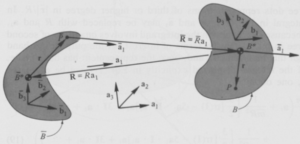{width=69%} 图2.4.1

以及$\overline{B}^{*}$、$\overline{\mathbf{a}}_{1}$是单位向量，方向从$\overline{P}$指向$\overline{B}^{*}$；$\overline{\rho}$为$\overline{B}$在$\overline{P}$处的质量密度；$d\overline{\tau}$为$\overline{B}$在$\overline{P}$处的微元体积，则根据式（2.3.1）至式（2.3.3），并将$R$、$\mathbf{a}_{1}$和$\overline{m}$分别替换为$\overline{R}$、$\overline{\mathbf{a}}_{1}$和$\overline{\rho}\,d\overline{\tau}$，

$$
\mathbf { F } = \mathbf { \nabla } - \int { \frac { G m } { R ^{2} } } \left( { \overline { { \mathbf { a } } } } _ { 1 } + { \frac { 1 } { m R ^{2} } } \left\{ { \frac { 3 } { 2 } } \left[ \operatorname { t r } ( \mathbf { I } ) - 5 { \overline { { \mathbf { a } } } } _ { 1 } \cdot \mathbf { I } \cdot { \overline { { \mathbf { a } } } } _ { 1 } \right] { \overline { { \mathbf { a } } } } _ { 1 } + 3 \mathbf { I } \cdot { \overline { { \mathbf { a } } } } _ { 1 } \right\} + \cdots \right) { \overline { { \rho } } } \; d { \overline { { \tau } } }
$$

其中三个点分别代表了$|\mathbf{r}|/R$中三阶及以上项的项。现在，若$\overline{\mathbf{R}}$表示$B^*$相对于$\overline{P}$的位置向量，而$\mathbf{R}$则表示$B^*$到$\overline{B}^*$的位置向量，则（参见图2.4.1）

$$
\frac { \overline { { \mathbf { a } } } _ { 1 } } { R ^{2} } = \overline { { \mathbf { R } } } ( \overline { { \mathbf { R } } } ^{2} ) ^{- 3 / 2} = \mathrm { ~ - ~ } ( \mathbf { R } + \overline { { \mathbf { r } } } ) ( \mathbf { R } ^{2} + 2 \mathbf { R } \cdot \overline { { \mathbf { r } } } + \overline { { \mathbf { r } } } ^{2} ) ^{- 3 / 2}
$$

因此，

$$
\begin{array}{rl} { \mathbf { F } } & { = G m \int ( \mathbf { R } + \overline { { \mathbf { r } } } ) ( \mathbf { R } ^{2} + 2 \mathbf { R } \cdot \overline { { \mathbf { r } } } + \overline { { \mathbf { r } } } ^{2} ) ^{- 3 / 2} \overline { { \rho } } \; d \overline { { \tau } } } \\& {  - \; G \int \Big ( \frac { 1 } { \overline { { R ^{4} } } } \; \Big \{ \frac { 3 } { 2 } \; [ \mathrm { t r } ( \mathbf { I } ) \; - \; 5 \overline { { \mathbf { a } } } _ { 1 } \cdot \mathbf { I } \cdot \overline { { \mathbf { a } } } _ { 1 } ] \overline { { \mathbf { a } } } _ { 1 } + 3 \mathbf { I } \cdot \overline { { \mathbf { a } } } _ { 1 } \Big \} \; + \; \cdots \Big ) \overline { { \rho } } \; d \overline { { \tau } } } \end{array}
$$

该等式中的第一个积分，其形式与式（2.3.12）中的积分完全相同。因此，按照先前的步骤进行计算，可得到与式（2.3.26）类似的结论，即：

$$
\begin{array}{rl} { G m \int ( { \bf R } + \overline { { \bf r } } ) ( { \bf R } ^{2} + 2 { \bf R } \cdot \overline { { \bf r } } + \overline { { \bf r } } ^{2} ) ^{- 3 / 2} \overline { { \rho } } \ d \overline { { \tau } } } & { { } } \\{ = \ - \ \frac { G \overline { { m } } m } { R ^{2} } \Big ( { \bf a } _ { 1 } + \frac { 1 } { m R ^{2} } \Big \{ \frac { 3 } { 2 } \left[ \mathrm { t r } ( \overline { { \bf I } } ) - 5 { \bf a } _ { 1 } \cdot \overline { { \bf I } } \cdot { \bf a } _ { 1 } \right] { \bf a } _ { 1 } + 3 \overline { { \bf I } } \cdot { \bf a } _ { 1 } + \cdots \Big \} \Big ) } \end{array}
$$

 ---------------------------------------------[ 第122页 ]---------------------------------------------  

其中，三个点号代表了 $|\overline{\mathbf{r}}|/R$ 中的三次或更高次幂项。在式（17）中的第二个积分中，$\overline{R}$ 和 $\overline{\mathbf{a}}_{1}$ 可分别替换为 $R$ 和 $\mathbf{a}_{1}$，因为被积函数中的每一项都涉及 $|\mathbf{r}|$ 的二次或更高次幂项，因此通过这一替换，并未丢失任何对当前研究目的而言有意义的项；而且，一旦完成替换，式（17）中明确显示的积分部分便可轻松求解。由此，我们得到：

$$
\mathbf { F } _ { ( 17 , 18 ) } = - \frac { G \overline { { { m } } } m } { R ^{2} } \Bigg ( \mathbf { a } _ { 1 } + \frac { 1 } { m R ^{2} } \left\{ \frac { 3 } { 2 } \left[ \mathrm { t r } ( \bar { \mathbf { I } } ) - 5 \mathbf { a } _ { 1 } \cdot \bar { \mathbf { I } } \cdot \mathbf { a } _ { 1 } \right] \mathbf { a } _ { 1 } + 3 \bar { \mathbf { I } } \cdot \mathbf { a } _ { 1 } + \cdots \right\} \Bigg . \nonumber \\\left. + \frac { 1 } { m R ^{2} } \left\{ \frac { 3 } { 2 } \left[ \mathrm { t r } ( \mathbf { I } ) - 5 \mathbf { a } _ { 1 } \cdot \mathbf { I } \cdot \mathbf { a } _ { 1 } \right] \mathbf { a } _ { 1 } + 3 \mathbf { I } \cdot \mathbf { a } _ { 1 } + \cdots \right\} \right) \Bigg \}
$$

其中，三个点号现在代表了 $|\mathbf{r}|/R$ 或 $|\overline{\mathbf{F}}|/R$ 中的三次或更高次幂项，或者涉及 $(|\mathbf{r}|/R)^{i}(|\overline{\mathbf{F}}|/R)^{j}$ 乘积的项——其中 $i$ 和 $j$ 都不等于一，因为 $\mathbf{r}$ 和 $\overline{\mathbf{F}}$ 分别取自 $B$ 和 $\overline{B}$ 的质心。式（1）现可直接从式（19）以及式（2）和式（3）中的定义推导得出。

式（2）、式（6）和式（12）之间的关系，与式（2.3.3）、式（2.3.10）和式（2.3.11）之间的关系完全相同；同样地，对于式（3）、式（7）和式（13），亦然。因此，要验证式（6）、式（7）和式（13）的正确性，可沿用第2.3节中相应推导过程中的方法，精确进行推导。

示例：需要对一个均匀的扁球体 $\overline{B}$ 对一个具有图2.4.2所示尺寸的均匀长方体 $B$ 所施加的力，给出一个近似表达式。应采用式（14）中所标记的近似力 $\widetilde{\mathbf{F}}$，并将该表达式中的三个附加项相互进行比较。为便于数值对比，应使用以下参数：$\overline{\alpha}=6.38 \times 10^{6} \mathrm{\~m}$、$\overline{\beta}=6.36 \times 10^{6} \mathrm{\~m}$、$\alpha=16 \mathrm{\~m}$、$\beta<\alpha$，以及 $R=6.6 \overline{\alpha}=4.2108 \times 10^{7} \mathrm{\~m}$。随后，该系统大致近似于地球（$\overline{B}$）以及一颗大型同步轨道人造卫星（$B$）。

式（12）和式（13）为所需的对比提供了便捷的起点。这些方程中出现的主要转动惯量分别为：

$$
I _ { 1 } = \frac { m } { 12 } \left( \alpha ^{2} + \alpha ^{2} \right)
$$

$$
I _ { 2 } = I _ { 3 } = \frac { m } { 12 } \left( \alpha ^{2} + \beta ^{2} \right)
$$

† 一颗位于赤道圆形轨道、同步高度的卫星，始终停留在地球某固定点上方。

 ---------------------------------------------[ 第123页 ]---------------------------------------------  

图2.4

对于长方体$B$，并由

$$
\overline{I}_{1}=\frac{\overline{m}}{5}\left(\overline{\alpha}^{2}+\overline{\alpha}^{2}\right)
$$

$$
\overline{I}_{2}=\overline{I}_{3}=\frac{\overline{m}}{5}\left(\overline{\alpha}^{2}+\overline{\alpha}^{2}\right)
$$

对于椭球体$\overline{B}$。后续研究得以顺利开展，只需消除$\underline{\beta}$和$\overline{\beta}$即可。

$$
\overline{\beta}^{2}=\overline{\alpha}^{2}(1-\overline{\epsilon}^{2})
$$

以及对物体$B$采用类似的量$\epsilon$，通过替换

$$
\beta^{2}=\alpha^{2}(1-\epsilon^{2})
$$

此时，向量$\mathbf{f}^{(2)}$变为

$$
\mathbf{f}^{(2)}=\frac{\alpha^{2}}{4R^{2}}\left\{\left[3-3(C_{11}^{2}+C_{12}^{2}+C_{13}^{2})-\frac{\epsilon^{2}}{2}(2-3C_{12}^{2}-3C_{13}^{2})\right]_{\mathbf{a}_{1}}\right\}
$$

$$
\overline{C_{21}C_{11}+C_{22}C_{12}+C_{23}C_{13}-\frac{\epsilon^{2}}{2}(C_{22}C_{12}+C_{23}C_{13})_{\mathbf{a}_{2}}
$$

（续上一页）

 ---------------------------------------------[ 第124页 ]---------------------------------------------  

$$
+ \; 2 \Bigg [ C _ { 31 } C _ { 11 } + C _ { 32 } C _ { 12 } + C _ { 33 } C _ { 13 } - \frac { \epsilon ^{2} } { 2 } ( C _ { 32 } C _ { 12 } + C _ { 33 } C _ { 13 } ) \Bigg ] \mathbf { a } _ { 3 } \Bigg \}
$$

或者，在参照式(1.2.14)进行化简后，

$$
{ \bf f } _ { ( 26 ) } ^{( 2 )} = \frac { \alpha ^{2} \, \epsilon ^{2} } { 4 R ^{2} } \left[ \frac { 1 } { 2 } \, ( 1 - 3 C _ { 11 } { } ^{2} ) { \bf a } _ { 1 } + C _ { 21 } C _ { 11 } { \bf a } _ { 2 } + C _ { 31 } C _ { 11 } { \bf a } _ { 3 } \right]
$$

借助式(1.2.15)，现在可以将$\mathbf{f}^{(2)}$的模$|\mathbf{f}^{(2)}|$表示为

$$
\left| \mathbf { f } ^{( 2 )} \right| _ { ( 27 ) } = \frac { \alpha ^{2} \epsilon ^{2} } { 8 R ^{2} } \left( 1 - 2 C _ { 11 } { } ^{2} + 5 C _ { 11 } { } ^{4} \right) ^{1 / 2}
$$

同样地，

$$
\bar { \mathbf { f } } ^{( 2 )} = \frac { 3 \, \overline { { { \alpha } } } ^{2} \, \overline { { { \epsilon } } } ^{2} } { 5 R ^{2} } \left[ \frac { 1 } { 2 } \left( 1 - 3 \overline { { { C } } } _ { 11 } { } ^{2} \right) \mathbf { a } _ { 1 } + \overline { { { C } } } _ { 21 } \, \overline { { { C } } } _ { 11 } \, \mathbf { a } _ { 2 } + \overline { { { C } } } _ { 31 } \, \overline { { { C } } } _ { 11 } \, \mathbf { a } _ { 3 } \right]
$$

并且，

$$
\left| \overline { { { \mathbf { f } } } } ^{( 2 )} \right| = \frac { 3 \overline { { { \alpha } } } ^{2} \overline { { { \epsilon } } } ^{2} } { 10 R ^{2} } \left( 1 - 2 \overline { { { C } } } _ { 11 } ^{2} + 5 \overline { { { C } } } _ { 11 } ^{4} \right) ^{1 / 2}
$$

图2.4.3，展示了函数$(1 - 2x^2 + 5x^4)^{1/2}$随$x$在$-1 \leq x \leq 1$范围内的图像，可通过将$C_{11}$和$\overline{C}_{11}$代入$x$来求解$|\mathbf{f}^{(2)}|$和$|\bar{\mathbf{f}}^{(2)}|$的极值。依据式(28)和式(30)，可以得出结论：

$$
\frac { \alpha ^{2} \epsilon ^{2} } { 4 \sqrt { 5 } R ^{2} } \leq | \mathbf { f } ^{( 2 )} | \leq \frac { \alpha ^{2} \epsilon ^{2} } { 4 R ^{2} }
$$

并且

$$
\frac { 3 \overline { { { \alpha } } } ^{2} \overline { { { \epsilon } } } ^{2} } { 5 \sqrt { 5 } R ^{2} } \leq \left| \overline { { { \mathbf { f } } } } ^{( 2 )} \right| \leq \frac { 3 \overline { { { \alpha } } } ^{2} \overline { { { \epsilon } } } ^{2} } { 5 R ^{2} }
$$

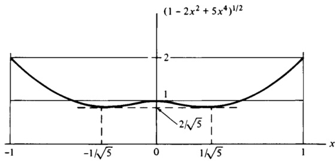{width=63%} 图2.4.3

 ---------------------------------------------[ 第125页 ]---------------------------------------------  

并将给定的数值代入后，可得

$$
|\mathbf{f}^{(2)}|_{\max}=\frac{5\sqrt{5}}{12}\frac{\alpha^{2}\epsilon^{2}}{\alpha^{2}\epsilon^{2}}\approx\frac{5\sqrt{5}(16)^{2}\epsilon^{2}}{12(6.38)^{2}\times10^{12}(0.006)}\approx10^{-9}\epsilon^{2}<10^{-9}
$$

并且

$$
\frac{|\overline{\mathbf{f}}^{(2)}|_{\max}}{|\mathbf{a}_{1}|}=\frac{3\overline{\alpha}^{2}\overline{\epsilon}^{2}}{5R^{2}}\approx\frac{3(0.006)}{5(6.6)^{2}}\approx10^{-4}
$$

方程（34）表明，对于一颗大型、同步轨道的地球卫星而言，式（1）中$\mathbf{F}$的级数首项的幅值远远超过$\mathbf{f}^{(2)}$的幅值——后者是一个向量，通过式（30）中$\widetilde{\mathbf{e}}$的存在，反映了地球的扁球形特征；而且[参见式（33）]，$|\mathbf{f}^{(2)}|$的幅值甚至远小于$|\widetilde{\mathbf{f}}^{(2)}|$的幅值。

值得注意的是，$\mathbf{f}^{(2)}$[参见式（27）]依赖于$C_{11}$、$C_{21}$和$C_{31}$，因而也取决于卫星相对于$\mathbf{a}_{1}$、$\mathbf{a}_{2}$和$\mathbf{a}_{3}$的取向；而$\mathbf{f}^{(2)}$[参见式（29）]所涉及的$\widetilde{C}_{11}$、$\widetilde{C}_{21}$和$\widetilde{C}_{31}$则依赖于卫星轨道平面相对于椭球体的取向。对于赤道轨道而言，$\widetilde{\mathbf{f}}^{(2)}$会简化为

$$
\widetilde{\mathbf{f}}^{(2)}=-\frac{3\overline{\alpha}^{2}\overline{\epsilon}^{2}}{5R^{2}}\mathbf{a}_{1}
$$

将此向量与式（14）中的$\mathbf{a}_{1}$相加，其影响微乎其微[参见式（34）]。相比之下，若$B^{*}$沿非赤道轨道运动，尽管$\mathbf{f}^{(2)}$相较于$\mathbf{a}_{1}$而言十分微小，但扁球形效应仍可能十分显著，因为此时$\widetilde{\mathbf{f}}^{(2)}$的各分量与$\mathbf{a}_{1}$呈垂直方向。

2.5 中心质体

如第2.2节所述，对于一个吸引粒子$\overline{P}$而言，物体$B$的重心$B'$通常并不与$B$的质量中心$B^{*}$重合。然而，也有一些物体，其重心与质量中心必然重合。这类物体被称为“中心质体”[†]。因此，当一个质量为$\overline{m}$的物体$B$受到每一块质量为$\overline{m}$的粒子$\overline{P}$施加的力$\mathbf{F}$时，若该力满足以下公式：

$$
\mathbf{F}=-\frac{G\overline{m}m}{R^{2}}\mathbf{a}_{1}
$$

其中$G$为万有引力常数，$R$为$\overline{P}$与$B^{*}$之间的距离，$\mathbf{a}_{1}$为指向$\overline{P}$至$B^{*}$的单位向量。

† 在经典文献中，有时会这样定义“重心”一词：只有中心质体才具有重心；而在后者存在的情况下，质量中心便与重心重合。

 ---------------------------------------------[ 第126页 ]---------------------------------------------  

中心质体具有多种不同的形状和质量分布，其特性如下：中心质体在经过其质量中心的每一条直线上，其转动惯量均相同。换句话说，中心质体的中心惯性椭球为一个球体。不过，并非所有具备这一特性的物体都是中心质体。

推导　要证明中心重力体的存在，最简便的方法是引用一个具体案例（参见示例中所示的实例：当一个实心球体的各点质量密度仅随该点到球心的距离而变化时，便可证明该球体为中心重力体）。

要证明一个中心重力体$B$在经过其质心$B^*$的每一条直线上都具有相同的转动惯量，只需证明式$\mathbf{a}_1 \cdot \mathbf{I} \cdot \mathbf{a}_1$的值与$\mathbf{a}_1$无关——其中$\mathbf{I}$是$B$在$B^*$处的转动惯量张量。现在，结合使用式(1)以及式(2.3.1)中给出的$\mathbf{F}$的级数展开式，可以得出

$$
\sum _ { i = 2 } ^{\infty} f ^{( i )} = 0
$$

此求和中的各项彼此独立，即$\mathbf{f}^{(2)}$与$R^{-2}$成正比，$\mathbf{f}^{(3)}$与$R^{-3}$成正比，以此类推。由此可知，这些项必然各自为零，亦即

$$
{ \bf f } ^{( i )} = { \bf 0 }  ( i = 2 , \ldots , \infty )
$$

因此，

$$
{ \bf a } _ { 1 } \cdot { \bf f } ^{( 2 )} = 0
$$

并利用式(2.3.3)中给出的$\mathbf{f}^{(2)}$的表达式，我们发现

$$
\mathbf { a } _ { 1 } \cdot \mathbf { I } \cdot \mathbf { a } _ { 1 } = { \frac { 1 } { 3 } } \operatorname { t r } ( \mathbf { I } )
$$

由于$tr(I)$是一个不变量，因此可得，$B$关于通过$B^*$且与$\mathbf{a}_1$平行的直线的转动惯量，在$\mathbf{a}_1$与$B$相对位置的任何方向下，都具有相同的值。

示例　要证明一个质量为$m$的实心球体$S$是中心重力体，只要满足以下条件：某点$P$处的质量密度$\rho$仅依赖于$P$与$S$的中心$S^*$之间的距离$r$。此时，由质量为$\overline{m}$的粒子$\overline{P}$对$S$施加的力$\mathbf{F}$将被计算出来。

$P$相对于$P$的位置向量$\mathbf{p}$，用球面极坐标$r$、$\theta$、$\psi$，以及$\overline{P}$与$S^*$之间的距离$R$，再加上图2.5.1中所示的单位向量$\mathbf{a}_1$、$\mathbf{a}_2$、$\mathbf{a}_3$来表示，其表达式为

$$
\mathbf { p } = ( R + r \cos \psi ) \mathbf { a } _ { 1 } + r \sin \psi \sin \theta \ \mathbf { a } _ { 2 } + r \sin \psi \cos \theta \ \mathbf { a } _ { 3 }
$$

$S$的微分元素的体积$d\tau$为

$$
d \tau = r ^{2} \sin \psi \, d r \, d \theta \, d \psi
$$

并且，若$\rho=\rho(r)$，$S$的质量$m$可表示为

 ---------------------------------------------[ 第127页 ]---------------------------------------------  

2.5 中心重力体 111

$$
m=\int\rho\,d\tau=\int_{0}^{a}r^{2}\rho\int_{0}^{\pi}\sin\psi\int_{0}^{2\pi}d\theta\,d\psi\,dr
$$

或者

$$
m=4\pi\int_{0}^{a}r^{2}\rho\,dr
$$

其中$a$为$S$的半径。

$\overline{P}$对$S$施加的力$\mathbf{F}$可表示为

$$
\mathbf{F}=\overline{G\overline{m}}-G\overline{m}\int_{0}^{\pi}\mathbf{p}(\mathbf{p}^{2})^{-3/2}\rho\,d\tau
$$

或者，用更明确的表述来说，为

$$
\mathbf{F} = -G\overline{m}\int_{0}^{a}r^{2}\rho\int_{0}^{\pi}\sin\psi(R^{2}+2Rr\cos\psi+r^{2})^{-3/2}\int_{0}^{2\pi}\mathbf{p}\,d\theta\,d\psi\,dr
$$

(a)

a1

a2

a3

a4

a5

a6

a7

a8

a9

a10

a11

a12

a13

a14

a15

a16

a17

a18

a19

a20

a21

a22

a23

a24

a25

a26

a27

a28

a29

a30

a31

a32

a33

a34

a35

a36

a37

a38

a39

a40

a41

a42

a43

a44

a45

a46

a47

a48

a49

a50

a51

a52

a53

a54

a55

a56

a57

a58

a59

a60

a61

a62

a63

a64

a65

a66

a67

a68

a69

a70

a71

a72

a73

a74

a75

a76

a77

a78

a79

a80

a81

a82

a83

a84

a85

a86

a87

a89

a90

a91

a91

a92

a93

a94

a95

a96

a97

a98

a99

a100

a101

a102

a103

a104

a105

a106

a107

a108

a109

a110

a111

a112

a113

a114

a115

a116

a117

a118

a119

a120

a121

a122

a123

a124

a125

a166

a167

a178

a180

a190

a200

a211

a212

a213

a214

a215

a216

a216

a217

a218

a219

a220

a221

a222

a223

a224

a225

a266

a277

a280

a291

a301

a312

a313

a314

a315

a316

a317

a318

a319

a320

a321

a322

a323

a324

a325

a326

a327

a328

a329

a330

a331

a332

a333

a334

a335

a336

a337

a338

a339

a340

a341

a342

a343

a344

a345

a356

a357

a360

a361

a362

a363

a364

a365

a366

a367

a370

a371

a372

a373

a374

a375

a376

a377

a378

a379

a390

a400

a411

a412

a413

a414

a415

a416

a417

a418

a419

a420

a421

a422

a423

a424

a425

a426

a427

a428

a429

a430

a431

a432

a433

a434

a435

a436

a437

a438

a439

a440

a441

a442

a443

a444

a445

a446

a447

a450

a451

a452

a453

a454

a456

a457

a458

a459

a460

a461

a462

a461

a462

a463

a464

a465

a466

a467

a468

a469

a470

a471

a472

a473

a474

a475

a476

a477

a478

a479

a480

a481

a482

a483

a484

a485

a486

a487

a489

a490

a491

a492

a493

a494

a495

a496

a497

a498

a499

a499

a410

a411

a412

a413

a414

a415

a416

a417

a418

a419

a420

a421

a422

a423

a424

a425

a426

a427

a428

a429

a430

a431

a432

a433

a434

a435

a436

a437

a438

a439

a440

a441

a442

a443

a445

a446

a447

a448

a449

a450

a451

a452

a453

a454

a456

a457

a458

a459

a460

a461

a462

a463

a464

a465

a467

a468

a469

a470

a471

a472

a473

a474

a475

a476

a477

a478

a479

a480

a481

a482

a483

a484

a485

a486

a487

a488

a489

 ---------------------------------------------[ 第128页 ]---------------------------------------------  

利用式(6)，我们得到式(11)中的最内层积分，

$$
\int_{0}^{2\pi}[(R+r\cos\psi)\mathbf{a}_{1}+r\sin\psi\sin\theta\,\mathbf{a}_{2}+r\sin\psi\cos\theta\,\mathbf{a}_{3}]\,d\theta
$$

$$
=2\pi(R+r\cos\psi)\mathbf{a}_{1}
$$

因此，

$$
\mathbf { F } _ { ( 11 , 12 ) } - 2 \pi G \overline { { { m } } } \int _ { 0 } ^{a} r ^{2} \rho \int _ { 0 } ^{\pi} \sin \psi ( R ^{2} + 2 R r \cos \psi + r ^{2} ) ^{- 3 / 2} \left( R \right)
$$

$r \cos \psi) d\psi dr$ a_{1}

现在，通过引入一个新的变量$\nu$来简化积分，该变量的定义如下：

$$
\nu ^{2} \triangleq R ^{2} + 2 R r \cos \psi + r ^{2}
$$

这意味著

$$
\sin \psi \, d \psi _ { ( 14 ) } = - \frac { v \, d v } { R r }
$$

并且

$$
R + r \cos \psi = \frac { v ^{2} + R ^{2} - r ^{2} } { 2 R }
$$

因此，将这些代入式(13)中，可得

$$
{ \begin{array}{l} { \mathbf { F } = { \frac { \pi G { \overline { { m } } } } { R ^{2} } } \int _ { 0 } ^{a} r \rho \int _ { R + r } ^{R - r} { \frac { \nu ^{2} + R ^{2} - r ^{2} } { \nu ^{2} } } \, d \nu \, d r \, \mathbf { a } _ { 1 } } \\{ = \, - { \frac { 4 \pi G { \overline { { m } } } } { R ^{2} } } \int _ { 0 } ^{a} r ^{2} \rho \, d r \, \mathbf { a } _ { 1 } = \, - { \frac { G { \overline { { m } } } m } { R ^{2} } } \, \mathbf { a } _ { 1 } } \end{array} }
$$

# 2.6 由粒子对物体施加的力矩

当一个质量为$m$的粒子$\overline{P}$对一个（不一定刚性）物体$B$施加的引力作用系统，会在$B$的质量中心$B^*$附近产生一个力矩$M$。该力矩$M$的计算公式为

$$
\mathbf { M } = - \mathbf { R } \times \mathbf { F }
$$

其中F是该力系的合力[参见式(2.2.1)、(2.2.2)和(2.3.1)]，R则是从$\overline{P}$到$B^*$的位矢。如果$\overline{P}$与$B^*$之间的距离$R$超过$B^*$到$B$任意一点$P$的最大距离，则该力矩可以表示为

$$
{ \bf M } = \frac { 3 G \overline { { { m } } } } { R ^{3} } \; { \bf a } _ { 1 } \times { \bf I } \cdot { \bf a } _ { 1 } + \frac { G \overline { { { m } } } m } { R } \sum _ { i = 3 } ^{\infty} { \bf m } ^{( i )}
$$

其中$\mathbf{a}_{1}$是一个单位向量，方向从$\overline{P}$指向$B^*$，$G$是通用的

 ---------------------------------------------[ 第129页 ]---------------------------------------------  

引力常数，I是$B$对于$B^*$的质量惯性二阶张量，而无量纲向量$\mathbf{m}^{(l)}$则是一组以$r/ R$为自变量的第$i$次幂项的总和，其中$r$是$B$某典型点$P$相对于$B^*$的位矢。

式(2)提示我们采用近似方法

$$
\mathbf { M } \approx \widetilde { \mathbf { M } } \, \stackrel { \Delta } { = } \, \frac { 3 G \overline { { { m } } } } { R ^{3} } \, \mathbf { a } _ { 1 } \times \mathbf { I } \cdot \mathbf { a } _ { 1 }
$$

用标量表示，定义为

$$
\mathbf { I } _ { j k } \triangleq \mathbf { a } _ { j } \cdot \mathbf { I } \cdot \mathbf { a } _ { k }  ( j , \, k = 1 , \, 2 , \, 3 )
$$

向量 $\widetilde{\mathbf{M}}$ 的表达式为

$$
\widetilde { \bf M } = \frac { 3 G \overline { { { m } } } } { R ^{3} } \left( I _ { 21 } { \bf a } _ { 3 } - I _ { 31 } { \bf a } _ { 2 } \right)
$$

或者，我们还可以引入一组右手正交单位向量 $\mathbf{b}_1$、$\mathbf{b}_2$、$\mathbf{b}_3$，它们与 $B^*$ 的主惯性轴平行，并将 $\widetilde{\mathbf{M}}$ 表示为 $B^*$ 的主转动惯量 $I_1$、$I_2$、$I_3$ 以及方向余弦 $C_{ij}$（其中 $i, j = 1, 2, 3$）的函数，这些方向余弦的定义分别为：

$$
\mathbf { I } _ { j } \triangleq \mathbf { b } _ { j } \cdot \mathbf { I } \cdot \mathbf { b } _ { j }  ( j = 1 , 2 , 3 )
$$

并且

$$
C _ { i j } \triangleq \mathbf { a } _ { i } \cdot \mathbf { b } _ { j }  ( i , j = 1 , 2 , 3 )
$$

由此可得

$$
\widetilde { \bf M } = \frac { 3 G \overline { { { m } } } } { R ^{3} } \left[ { \bf b } _ { 1 } ( I _ { 3 } - I _ { 2 } ) C _ { 12 } C _ { 13 } + { \bf b } _ { 2 } ( I _ { 1 } - I _ { 3 } ) C _ { 13 } C _ { 11 } + { \bf b } _ { 3 } ( I _ { 2 } - I _ { 1 } ) C _ { 11 } C _ { 12 } \right]
$$

尽管方程 (5) 表面看起来很简单，但其实际效用却不及方程 (8)。一方面，惯性乘积 $I_{21}$ 和 $I_{31}$ 会随着 $\mathbf{a}_1$ 与 $B$ 的相对取向而变化；另一方面，动力学旋转方程通常最易于用向量基底 $\mathbf{b}_1$、$\mathbf{b}_2$、$\mathbf{b}_3$ 来表示。

需要注意的是，根据方程 (3)，$\widetilde{\mathbf{M}}$ 是方程 (2) 中的第一项，但在 $\mathbf{M}$ 不为零时，$\widetilde{\mathbf{M}}$ 可能会变为零。因此，当我们将 $\widetilde{\mathbf{M}}$ 作为 $\mathbf{M}$ 的近似时，未必能保留 $\mathbf{M}$ 级数展开中的最高阶项。具体而言，当 $\mathbf{a}_{1}$ 与 $B$ 的中心主惯性轴平行时，$\widetilde{\mathbf{M}}$ 会消失；然而，这种状态并不一定导致 $\mathbf{M}$ 的值为零（参见问题 2.14）。此外，对于任何具有球形中心惯性椭球体的物体，$\widetilde{\mathbf{M}}$ 均为零；而只有当该物体同时也是质心位于原点时，$\mathbf{M}$ 才会为零（参见第 2.5 节及问题 2.13）。

推导过程：若 $B$ 是一种连续分布的物质，则由 $\overline{P}$ 对 $B$ 所施加的引力合力 $\mathbf{F}$，可以表示为 $\overline{P}$ 对 $B$ 中某一个微元元素在 $B$ 的任意一点 $P$ 所施加的力 $d\mathbf{F}$ 的形式。

$$
\mathbf { F } = \int d \mathbf { F }
$$

 ---------------------------------------------[ 第130页 ]---------------------------------------------  

114 引力作用 2.6

图 2.6.1

而且，若 $\mathbf{r}$ 是 $P$ 相对于 $B^*$ 质心的位置矢量，则系统引力力关于 $B^*$ 的矩 $\mathbf{M}$ 为

$\mathbf{M} = \int \mathbf{r} \times d\mathbf{F}$\]

其中 $\mathbf{R}$ 是 $B^*$ 相对于 $\overline{P}$ 的位置矢量，$\mathbf{p}$ 是 $P$ 相对于 $\overline{P}$ 的位置矢量（参见图 2.6.1），则有

$\mathbf{M} = \int \left( - \mathbf{R} + \mathbf{p} \right) \times d\mathbf{F}$\]

然而，$d\mathbf{F}$ 与 $\mathbf{p}$ 平行，因此 $\mathbf{p} \times d\mathbf{F} = 0$，于是

[\mathbf{M} = -\mathbf{R} \times \mathbf{F}$]

与式（1）一致。或者，该结果也可以从第2.2节中推导得出，并且基于这样一点：两个等效的力系在每一点上的力矩相等。因此，当$B$由有限个粒子$P_{1}, \ldots, P_{N}$组成时，这一结论同样适用。

需在对$R$以及$B$尺寸施加与式（2.3.1）中$\mathbf{F}$表达式所适用的相同限制条件下，来验证式（2）的有效性。在这些条件下，将式（2.3.1）和式（2.3.2）代入式（13），可得

[\mathbf{M} = \frac{G\overline{m}m}{R} \mathbf{a}_{1} \times \sum_{i=2}^{\infty} \mathbf{f}^{(i)} = \frac{G\overline{m}m}{R} \left[ \mathbf{a}_{1} \times \mathbf{f}^{(2)} + \sum_{i=3}^{\infty} \mathbf{a}_{1} \times \mathbf{f}^{(i)} \right] ]

[\mathbf{M} = \frac{G\overline{m}m}{R} \mathbf{a}_{1} \times \sum_{i=2}^{\infty} \mathbf{f}^{(i)} = \frac{G\overline{m}m}{R} \left[ \mathbf{a}_{1} \times \mathbf{f}^{(2)} + \sum_{i=3}^{\infty} \mathbf{a}_{1} \times \mathbf{f}^{(i)} \right]

若$\mathbf{r}$是$P$相对于$B$的质心$B^{*}$的位置矢量，则系统引力力矩$\mathbf{M}$关于$B^{*}$的矩心为$B^{*}$的位置矢量。将$B^{*}$的位置矢量代入，即得到$B^{*}$的位置矢量。将$B^{*}$的位置矢量代入，即得到$B^{*}$的位置矢量。将$B^{*}$的位置矢量代入，即得到$B^{*}$的位置矢量。将$B^{*}$的位置矢量代入，即得到$B^{*}$的位置矢量。将$B^{*}$的位置矢量代入，即得到$B^{*}$的位置矢量。将$B^{*}$的位置矢量代入，即得到$B^{*}$的位置矢量。将$B^{*}$的位置矢量代入，即得到$B^{*}$的位置矢量。将$B^{*}$的位置矢量代入，即得到$B^{*}$的位置矢量。将$B^{*}$的位置矢量代入，即得到$B^{*}$的位置矢量。将$B^{*}$的位置矢量代入，即得到$B^{*}$的位置矢量。将$B^{*}$的位置矢量代入，即得到$B^{*}$的位置矢量。将$B^{*}$的位置矢量代入，即得到$B^{*}$的位置矢量。将$B^{*}$的位置矢量代入，即得到$B^{*}$的位置矢量。将$B^{*}$的位置矢量代入，即得到$B^{*}$的位置矢量。将$B^{*}$的位置矢量代入，即得到$B^{*}$的位置矢量。将$B^{*}$的位置矢量代入，即得到$B^{*}$的位置矢量。将$B^{*}$的位置矢量代入，即得到$B^{*}$的位置矢......若$\mathbf{r}$是$P$相对于$B$的质心$B^{*}$的位置向量，则系统引力力矩$\mathbf{M}$关于$B^{*}$的矩心为$B^{*}$的位置向量。将$B^{*}$的位置向量代入，即得到$B^{*}$的位置向量。将$B^{*}$的位置向量代入，即得到$B^{*}$的位置向量。将$B^{*}$的位置向量代入，即得到$B^{*}$的位置向量。将$B^{*}$的位置向量代入，即得到$B^{*}$的位置向量。将$B^{*}$的位置向量代入，即得到$B^{*}$的位置向量。将$B^{*}$的位置向量代入，即得到$B^{*}$的位置向量。将$B^{*}$的位置向量代入，即得到$B^{*}$的位置向量。将$B^{*}$的位置向量代入，即得到$B^{*}$的位置向量。将$B^{*}$的位置向量代入，即得到$B^{*}$的位置向量。将$B^{*}$的位置向量代入，即得到$B^{*}$的位置向量。将$B^{*}$的位置向量代入，即得到$B^{*}$的位置向量。将$B^{*}$的位置向量代入，即得到$B^{*}$的位置向量。将$B^{*}$的位置向量代入，即得到$B^{*}$的位置向量。将$B^{*}$的位置向量代入，即得到$B^{*}$的位置向量。将$B^{*}$的位置向量代入，即得到$B^{*}$的位置向量。将$B^{*}$的位置向量......

 ---------------------------------------------[ 第131页 ]---------------------------------------------  

利用式(2.3.3)和式(2.3.4)，可得

$$
{ \bf M } = \frac { 3 G \overline { { { m } } } } { R ^{3} } \, { \bf a } _ { 1 } \times { \bf I } \cdot { \bf a } _ { 1 } + \frac { G \overline { { { m } } } m } { R } \sum _ { i = 3 } ^{\infty} { \bf a } _ { 1 } \times { \bf f } ^{( i )}
$$

这与式(2)等价，若将$m^{(i)}$定义为

$$
\mathbf { m } ^{( i )} \triangleq \mathbf { a } _ { 1 } \times \mathbf { f } ^{( i )}  ( i = 3 , \, \ldots , \, \infty )
$$

将式(3)代入

$$
\mathbf { a } _ { 1 } \ { \stackrel { = } { = } } \ C _ { 11 } \mathbf { b } _ { 1 } + C _ { 12 } \mathbf { b } _ { 2 } + C _ { 13 } \mathbf { b } _ { 3 }
$$

并

$$
\mathbf { I } = \sum _ { ( 4 ) } ^{3} \sum _ { j = 1 } ^{3} \sum _ { k = 1 } ^{3} I _ { j k } \mathbf { a } _ { j } \mathbf { a } _ { k }
$$

可得出式(5)，且利用

$$
\mathbf { I } = I _ { 1 } \, \mathbf { b } _ { 1 } \, \mathbf { b } _ { 1 } + I _ { 2 } \, \mathbf { b } _ { 2 } \, \mathbf { b } _ { 2 } + I _ { 3 } \, \mathbf { b } _ { 3 } \, \mathbf { b } _ { 3 }
$$

用式(18)代替式(8)，即可得到式(8)。

示例：式(3)中定义的向量$\widetilde{\mathbf{M}}$用于近似计算由质量为$\overline{m}$的粒子$\overline{P}$在质心$B^{*}$附近施加的力矩$\mathbf{M}$。该质心位于一个均匀的右圆柱体$B$上，该圆柱体关于对称轴以及通过$B^{*}$且垂直于对称轴的任意直线分别具有转动惯量$J$和$I$。结果应以两个角度$\phi$和$\theta$来表示，这两个角度用于确定$B$的对称轴相对于右手系正交单位向量$\mathbf{a}_{1}$、$\mathbf{a}_{2}$、$\mathbf{a}_{3}$的取向。具体而言，如图2.6.2所示，$\theta$是$\mathbf{a}_{3}$与$B$的对称轴之间的夹角，而$\phi$则是$\mathbf{a}_{2}$与通过$B^{*}$且垂直于$\mathbf{a}_{3}$的平面$P$与由$B$的对称轴及通过$B^{*}$且平行于$\mathbf{a}_{3}$的直线所确定的平面$Q$的交角。

在式(3)、式(5)和式(8)中给出的$\widetilde{\mathbf{M}}$的其他表达式中，最后一种最为便捷，因为可以轻松引入合适的单位向量$\mathbf{b}_{1}$、$\mathbf{b}_{2}$和$\mathbf{b}_{3}$，例如如图2.6.2所示，其中$\mathbf{b}_{1}$垂直于平面$Q$。利用式(7)，我们便可得到

$$
C _ { 11 } = \cos \phi  C _ { 12 } = \ - \cos \theta \sin \phi  C _ { 13 } = \sin \theta \sin \phi
$$

并且，根据式(6)，$I_{1} = I_{2} = I$，$I_{3} = J$。因此，

$$
\widetilde { \bf M } = \frac { 3 G \overline { { { m } } } } { ( 8 ) } \left( I - J \right) \sin \theta \sin \phi ( { \bf b } _ { 1 } \cos \theta \sin \phi + { \bf b } _ { 2 } \cos \phi )
$$

若$I \neq J$，$\widetilde{\mathbf{M}}$仅在以下至少一个条件成立时才为零：$\sin \phi = 0$、$\sin \theta = 0$，或$\cos \theta = \cos \phi = 0$。在所有这些情况下，$B$的对称轴要么垂直于，要么与连接$\overline{P}$的直线平行。

 ---------------------------------------------[ 第132页 ]---------------------------------------------  

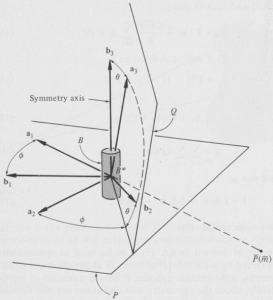{width=61%} 图2.6.2

且$B^{*}$，同时基于对称性的考量，可知$\mathbf{M}$在这些情况下同样为零。因此，似乎当$\widetilde{\mathbf{M}}=0$时，对于特定的物体而言，$\mathbf{M}=0$也有可能成立，但这一推论在一般情况下并不成立。

# 2.7 小物体受小物体作用的力矩

当两个（不一定刚性）物体B和$\overline{B}$的质量中心$B^{*}$与$\overline{B}^{*}$之间的距离$R$超过任一物体质量中心到该物体任意一点的最远距离时，由B对B施加的引力力矩在$B^{*}$周围会产生一个力矩$\mathbf{M}$，其表达式为

$$
\mathbf { M } = { \frac { 3 G { \overline { { m } } } } { R ^{3} } } \, \mathbf { a } _ { 1 } \times \mathbf { I } \cdot \mathbf { a } _ { 1 } + { \frac { G { \overline { { m } } } m } { R } } \sum _ { i = 3 } ^{\infty} \mathbf { m } ^{( i )} + { \frac { G { \overline { { m } } } m } { R } } \sum _ { i = 2 } ^{\infty} \sum _ { j = 2 } ^{\infty} \mathbf { m } ^{( i j )}
$$

其中$\mathbf{a}_{1}$是一个单位向量，指向$\overline{B}^{*}$至$B^{*}$的方向；$\mathbf{I}$是B的中心惯性二阶张量；$m$和$\overline{m}$分别为B和$\overline{B}$的质量；$G$为万有引力常数；而无量纲向量$\mathbf{m}^{(i)}$则是一组……

 ---------------------------------------------[ 第133页 ]---------------------------------------------  

将$i$次幂项中的各项以$|\mathbf{r}|/R$为变量进行表示，而无量纲向量$\mathbf{m}^{(ij)}$则是由$(|\mathbf{r}|/R)^i(|\overline{\mathbf{r}}|/R)^j$乘积中各项组成的集合，其中$\mathbf{r}$和$\overline{\mathbf{r}}$分别为B和$\overline{B}$的通用点相对于$B^*$和$\overline{B}^*$的位置向量。

方程（1）与方程（2.6.2）的相似性表明，存在一种近似关系，类似于方程（2.6.3），即：

$$
\mathbf { M } \approx \widetilde { \mathbf { M } } \triangleq \frac { 3 G \overline { { m } } } { R ^{3} } \mathbf { a } _ { 1 } \times \mathbf { I } \cdot \mathbf { a } _ { 1 }
$$

或许会派上用场。这样定义的向量$\widetilde{\mathbf{M}}$可以表示为

$$
\widetilde { \bf M } = \frac { 3 G \overline { { { m } } } } { R ^{3} } \left( I _ { 21 } { \bf a } _ { 3 } - I _ { 31 } { \bf a } _ { 2 } \right)
$$

或者表示为

$$
\widetilde { \mathbf { M } } = \frac { 3 G \overline { { m } } } { R ^{3} } \left[ \mathbf { b } _ { 1 } ( I _ { 3 } - I _ { 2 } ) C _ { 12 } C _ { 13 } + \mathbf { b } _ { 2 } ( I _ { 1 } - I _ { 3 } ) C _ { 13 } C _ { 11 } + \mathbf { b } _ { 3 } ( I _ { 2 } - I _ { 1 } ) C _ { 11 } C _ { 12 } \right]
$$

其中$\mathbf{a}_{i}$、$\mathbf{b}_{i}$、$I_{i}$、$I_{ij}$以及$C_{ij}$的含义与第2.6节中相同，而$\widetilde{\mathbf{M}}$——也就是方程（1）中的第一项——可以被序列中的其他项所主导。方程（2.6.2）与方程（1）之间的一个显著差异在于：前者可以被替换为方程（2.6.1），而后者即使重新定义$\mathbf{R}$和$\mathbf{F}$分别为B$^*$相对于$\overline{B}^*$的位置向量，以及由$\overline{B}$对B施加的合力，也无法如此替换。

推导过程　方程（1）的有效性可以通过以下方式加以验证：利用方程（2.6.2）来表示由位于B的某一通用点$P$处的$\overline{B}$微元元素对B在$B^{*}$周围施加的力矩（参见图2.7.1），然后对这一力矩进行积分。

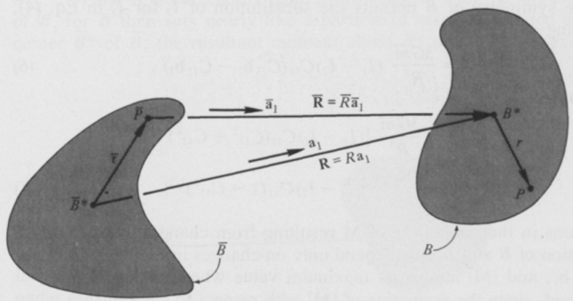{width=73%} 图2.7.1

 ---------------------------------------------[ 第134页 ]---------------------------------------------  

118 引力作用 2.7

$\overline{B}$ 的图形。具体而言，若 $\overline{R}$ 是 $\overline{P}$ 与 $B^{*}$ 之间的距离，$\overline{\mathbf{a}}_{1}$ 是从 $\overline{P}$ 指向 $B^{*}$ 的单位向量，$\overline{\rho}$ 是 $\overline{B}$ 在 $\overline{P}$ 处的质量密度，而 $d\tau$ 是 $\overline{B}$ 在 $\overline{P}$ 处的微分元素的体积，则根据式 (2.6.2)，将 $R$、$\overline{\mathbf{a}}_{1}$ 和 $\overline{\rho} \, d\tau$ 分别替换为 $\overline{R}$、$\overline{\mathbf{a}}_{1}$ 和 $\overline{\rho}$。

$$
\mathbf{M} = \int \left(\frac{3G}{R^{3}} \, \overline{\mathbf{a}}_{1} \times \mathbf{I} \cdot \overline{\mathbf{a}}_{1} + \cdots \cdot \overline{\rho} \, d\tau\right) \overline{\rho} \, d\tau
$$

其中，三个点分别代表 $|\mathbf{r}|/R$ 中的三次方或更高次幂项。由于 $\mathbf{I}$ 包含 $|\mathbf{r}|/R$ 中的二次项，因此式 (5) 中的积分只能产生 $|\mathbf{r}|/R$ 中的二次及更高次幂项；而将 $\overline{\mathbf{a}}_{1}$ 替换为 $\overline{\mathbf{a}}_{1}$，并将 $R$ 替换为 $R$，并不会导致任何感兴趣项的丢失。通过这些替换，可以将括号内的第一项从被积函数中移除，留下一个与 $B$ 的质量 $\overline{m}$ 相等的积分，这与式 (1) 中的第一项一致；同时，这也得到了式 (1) 中的第一级数。式 (1) 中的第二级数则反映了 $\overline{\mathbf{a}}_{1}$ 与 $\overline{\mathbf{a}}_{1}$ 之间的偏差，以及 $R$ 与 $\overline{R}$ 之间的偏差。该级数中的每一项都涉及 $|\overline{\mathbf{r}}|/R$，且该级数中不包含 $|\overline{\mathbf{r}}|/R$ 的一次项，因为 $\overline{\mathbf{r}}$ 是从 $\overline{B}$ 的质心处提取的。

式 (3) 和式 (4) 可以通过与推导式 (2.6.5) 和式 (2.6.8) 从式 (2.6.3) 中所用的类似方法，从式 (2) 得到。

示例 在第 2.4 节的示例中（参见图 2.4.2），我们曾为一个均质扁球体 $\overline{B}$ 对一个均质长方体 $B$ 所施加的力，推导出了一种近似表达式。现在，我们需要为 $M$ 推导出一种近似表达式——即 $\overline{B}$ 对 $B$ 于 $B^{*}$ 质心所施加的力矩。为此，需构造由式 (4) 给出的 $\widetilde{\mathbf{M}}$，并确定在 $\overline{m} = 6 \times 10^{24}$ kg、$m = 160$ kg、$\alpha = 16$ m、$\beta = 4$ m、$R = 4.2108 \times 10^{7}$ m、$G = 6.6732 \times 10^{-11}$ N·m² kg⁻² 的情况下，$\widetilde{\mathbf{M}}$ 的大小。

如同第 2.4 节的示例一样，该系统大致近似地模拟了地球（$\overline{B}$）以及一颗大型同步轨道人造卫星（$B$）。

$B$ 的对称性允许我们在式 (4) 中用 $I_{2}$ 替换 $I_{3}$，从而得到

\[\widetilde{\mathbf{M}} = \frac{3G\overline{m}}{R^{3}} \left( I_{1} - I_{2} \right) C_{11} \left( C_{13} \mathbf{b}_{2} - C_{12} \mathbf{b}_{3} \right) \]

由此

\[\widetilde{\mathbf{M}} = \frac{3G\overline{m}}{R^{3}} \left( I_{1} - I_{2} \right) C_{11} \left( C_{13} \mathbf{b}_{2} - C_{12} \mathbf{b}_{3} \right) \]

\[\frac{\widetilde{\mathbf{M}}}{\left( 1.2.14 \right)} \left( I_{1} - I_{2} \right) C_{11} \left( C_{13} \mathbf{b}_{2} \right)^{1/2} \]

\[\frac{\widetilde{\mathbf{M}}}{\left( 1.2.14 \right)} \left( I_{1} - I_{2} \right) C_{11} \left( C_{13} \mathbf{b}_{2} \right)^{1/2} \]

由于$B$与$\overline{B}$相对方向的变化所导致的$\widetilde{\mathbf{M}}$大小的变动，仅取决于$\mathbf{a}_{1}$与$\mathbf{b}_{1}$之间的夹角变化；当该夹角等于$\pi/4$ rad$_{1}$时，$\widetilde{\mathbf{M}}$的值达到最大，因为当$C_{11}$取$\frac{1}{\sqrt{2}}$时，$\widetilde{\mathbf{M}}$的导数为零。因此，对于任意一个$I_{3} = I_{2}$的物体$B$，

 ---------------------------------------------[ 第135页 ]---------------------------------------------  

$$
\left| \widetilde { \mathbf { M } } \right| _ { \mathrm { m a x } } = \frac { 3 G \overline { { m } } } { 2 R ^{3} } \left| I _ { 1 } - I _ { 2 } \right|
$$

并且对于给定的长方体而言，对于其

$$
I _ { 1 } = \frac { m \alpha ^{2} } { 6 }
$$

以及

$$
I _ { 2 } = I _ { 3 } = \frac { m } { 12 } \ ( \alpha ^{2} + \beta ^{2} )
$$

$|\widetilde{\mathbf{M}}|_{\mathrm{max}}$会变为

$$
\left| \widetilde { \mathbf { M } } \right| _ { \mathrm { m a x } } = \frac { G \overline { { { m } } } m \left( \alpha ^{2} - \beta ^{2} \right) } { 8 R ^{3} }
$$

或者，当采用给定的数值时，

$$
| \widetilde { \mathbf { M } } | \approx 2 . 6 \times 10 ^{- 5} \, \mathrm { ~ N ~ } \cdot \mathrm { ~ m ~ }
$$

# 2.8 近似物体

在处理两个近距离物体之间的引力相互作用时，有时可以有效利用那些乍一看似乎并不适用的结果——这些结果最初是因分析两个相距甚远的物体之间的引力相互作用而被发现的。例如，考虑式（2.7.2），该式提供了一种近似公式，且随着$B^{*}$与$\overline{B}^{*}$之间的距离$R$（见图2.8.1）相对于任一物体的最大尺寸不断增大，该近似公式的效果会愈发显著。当$B$与$\overline{B}$彼此靠近时（见图2.8.2），只要$\overline{B}$与中心质心物体的差异不大（参见第2.5节），且$R$相对于$B$的最大尺寸足够大时，$\overline{B}$便几乎可以被视为一个质量为$\overline{m}$、位于$\overline{B}$质心$\overline{B}^{*}$处的质点；此时，作用于$B$上的力对$B^{*}$产生的合力矩

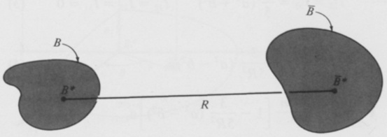{width=62%} 图2.8.1

 ---------------------------------------------[ 第136页 ]---------------------------------------------  

120 引力作用 2.8

图2.8.2

图2.8.3

在近似意义上，粒子的运动可由式（2.6.3）给出；该方程与式（2.7.2）完全相同。

图2.8.3所示示例中，一个质量为$\overline{m}$的粒子$\overline{P}$位于质量为$m$的均匀扁球体$B$的旋转轴上，距离$B$的质量中心$B^{*}$的距离为$R$。为了探讨式（2.3.6）在粒子与物体近距离相互作用情形下的应用价值，需将$\widetilde{F}/F$与$\beta$的关系图绘制出来，并针对不同值的$\epsilon$进行绘图。其中，$\widetilde{F}$为式（2.2.2）所给定的$\widetilde{F}$的大小，而$\beta$和$\epsilon$的定义如图2.8.3所示（图中$a$和$b$的值请参考图2.8.3）。

以及

$$
\epsilon \triangleq \left[\left( \frac{b}{a}\right)^{2}\right]^{1/2}
$$

若$\mathbf{a}_{1}$和$\mathbf{a}_{2}$如图2.8.3所示为单位向量，且$\mathbf{a}_{3}=\mathbf{a}_{1} \times \mathbf{a}_{2}$，则$B$对于$B^{*}$的相应转动惯量及惯性矩分别为：

$$
I_{11}=\frac{2 m a^{2}}{5}
$$

$$
I_{22}=I_{33}=\frac{m}{5}\left(a^{2}+b^{2}\right)
$$

$$
\mathbf{f}^{(2)}=\frac{3}{(2.3.10)}-\frac{3}{5 R^{2}}\left(a^{2}-b^{2}\right) \mathbf{a}_{1}
$$

$$
\widetilde{\mathbf{F}}=\frac{-G \overline{m} m}{R^{2}}\left[1-\frac{3}{5 R^{2}}\left(a^{2}-b^{2}\right)\right] \mathbf{a}_{1}
$$

$$
\frac{G \overline{m} m}{(1.2)}-\frac{G \overline{m} m}{R^{2}}\left(1-\frac{3}{5} \frac{\beta^{2} \epsilon^{2}}{1-\epsilon^{2}}\right) \mathbf{a}_{1}
$$

 ---------------------------------------------[ 第137页 ]---------------------------------------------  

以及

$$
\widetilde { F } \triangleq | \widetilde { \mathbf { F } } | = \frac { G \overline { { { m } } } m } { R ^{2} } \left| 1 - \frac { 3 } { 5 } \frac { \beta ^{2} \epsilon ^{2} } { 1 - \epsilon ^{2} } \right|
$$

为了对式（2.2.2）中的积分进行计算，我们不妨引入图2.8.4所示的坐标$r$、$\underline{\theta}$和$z$，并注意到从$\overline{P}$到$P$的位置矢量$\mathbf{p}$可以表示为

$$
\mathbf { p } = ( R - z ) \mathbf { a } _ { 1 } + r \sin \theta \, \mathbf { a } _ { 2 } + r \cos \theta \, \mathbf { a } _ { 3 }
$$

同时，

$$
d \tau = r \, d \theta \, d r \, d z
$$

至于$B$的质量密度$\rho$，其表达式为$\rho = 3m/(4\pi ba^2)$。因此，

$$
\mathbf { F } _ { ( 2 . 2 . 2 ) } = - \frac { 3 G \overline { { { m } } } m } { 4 \pi b a ^{2} } \int _ { \theta _ { 1 } } ^{\theta _ { 2} } \int _ { z _ { 1 } } ^{z _ { 2} } \int _ { r _ { 1 } } ^{r _ { 2} } \frac { ( R - z ) \mathbf { a } _ { 1 } + r \sin \theta \ \mathbf { a } _ { 2 } + r \cos \theta \ \mathbf { a } _ { 3 } } { [ ( R - z ) ^{2} + r ^{2} ] ^{3 / 2} } \ r \, d r \ d z \ d \theta
$$

其中，

$$
\theta_{1}=0\theta_{2}=2\pi z_{1}=-b z_{2}=b r_{1}=0\\r_{2}=a\left[1-\left(\frac{z}{b}\right)^{2}\right]^{1/2}
$$

并且，在完成指定的积分运算，并利用式（1）和式（2）消去$b/R$和$a/b$后，我们得到

$$
F \triangleq | \mathbf { F } | \stackrel { ( 9 ) } { = } \frac { 3 G \overline { { { m } } } m ( 1 - \epsilon ^{2} ) } { R ^{2} \beta ^{2} \epsilon ^{2} } \left| 1 - \frac { ( 1 - \epsilon ^{2} ) ^{1 / 2} } { 2 \beta \epsilon } \left[ H ( 1 ) - H ( - 1 ) \right] \right|
$$

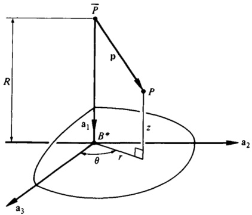{width=48%} 图2.8.4

 ---------------------------------------------[ 第138页 ]---------------------------------------------  

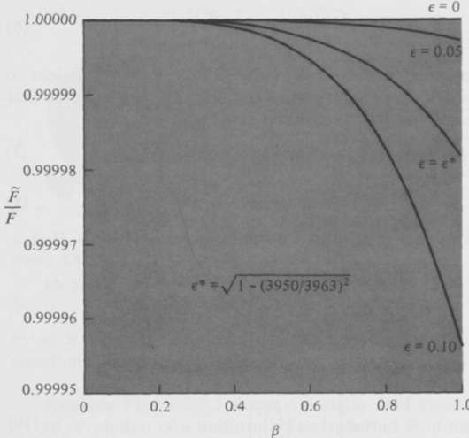{width=60%} 图2.8.5

其中$H$被定义为

$$
H ( \xi ) \triangleq \sin ^{- 1} \frac { 1 - \epsilon ^{2} ( 1 - \beta \xi ) } { [ 1 - \epsilon ^{2} ( 1 - \beta ^{2} ) ] ^{1 / 2} }
$$

因此，

$$
\widetilde { \underline { { F } } } _ { \mathrm { \tiny ~ ( 6 , 11 ) } } = \frac { \beta ^{2} \epsilon ^{2} } { 3 ( 1 - \epsilon ^{2} ) } \; \; \frac { \left| 1 - \frac { 3 } { 5 } \left[ \beta ^{2} \epsilon ^{2} / ( 1 - \epsilon ^{2} ) \right] \right| } { \left| 1 - \left[ ( 1 - \epsilon ^{2} ) ^{1 / 2} / ( 2 \beta \epsilon ) \right] \left[ H ( 1 ) - H ( - 1 ) \right] \right| }
$$

在图2.8.5中，根据式（13）所给出的$\widetilde{F}/F$随$\beta$的变化曲线，对应于四种不同的$\epsilon$值。需要注意的是，当$\beta$取小值时，$\widetilde{P}$与$B^{*}$之间的距离会变得非常大[参见式（1）]。因此，无论$\epsilon$取何值，随着$\beta$趋近于零，$\widetilde{F}/F$都会逐渐接近于1，这并不令人意外。相反，当$\beta$接近于1时，粒子会相对靠近椭球体；此时，若用$\widetilde{F}$代替$F$使用，其误差大小会随$\epsilon$的增大而变化——$\widetilde{F}/F$与1的偏差越大，$\epsilon$的值也就越大，也就是说，椭球体的扁平程度也越显著[参见式（2）]。然而，即使在$\beta \approx 1.0$的情况下，即当粒子几乎与椭球体接触时，只要$\epsilon < 0.10$，$\widetilde{F}/F$与1的偏差依然非常微小——例如，当$\epsilon = \epsilon^{*}$时，其中$\epsilon^{*}$为一个椭球体的偏心率，其长半轴长度等于

 ---------------------------------------------[ 第139页 ]---------------------------------------------  

地球的极半径和赤道半径。因此，在针对近地卫星这一被理想化为质点的分析中，式（2.3.6）有望得出高度精确的结果。

# 2.9 对向量求导

有时，为了表达引力力和引力矩，采用对标量函数进行向量运算会十分方便。这些运算可以被理解为对标量函数关于向量变量进行的普通求导和/或偏导数。在某些情况下，所涉及的向量是位置向量，而普通导数则被视为空间梯度。当标量函数的求导结果为一力时，该标量函数被称为力函数。而在其他情况下，则会采用对其他向量进行求导，例如将引力矩表示为关于单位向量的导数。为了统一本章在第2.10至2.18节中的内容呈现方式，本节首先对其中所使用的数学工具作简要讨论。

如果一个标量量$F$依赖于向量$\mathbf{v}$，那么定义一个由$\nabla_{\mathbf{v}}F$表示的向量，方法如下：引入一组任意的相互垂直的单位向量$\mathbf{a}_{1}$、$\mathbf{a}_{2}$和$\mathbf{a}_{3}$；令$\mathbf{v}_{i} \triangleq \mathbf{v} \cdot \mathbf{a}_{i}$（$i = 1, 2, 3$）；将$F$视为关于$v_{1}$、$v_{2}$和$v_{3}$的函数；并让

$$
\nabla _ { \mathbf { v } } F \triangleq { \frac { \partial F } { \partial \nu _ { 1 } } } \mathbf { a } _ { 1 } + { \frac { \partial F } { \partial \nu _ { 2 } } } \mathbf { a } _ { 2 } + { \frac { \partial F } { \partial \nu _ { 3 } } } \mathbf { a } _ { 3 }
$$

根据式（1）构造的向量 $\nabla, F$ 对于向量基 $\mathbf{a}_1$, $\mathbf{a}_2$, $\mathbf{a}_3$ 的选取是保持不变的。用 $\nabla$ 表示的运算，可称为对 $\mathbf{v}$ 的求导。

同样地，如果一个矢量量 $\mathbf{F}$ 依赖于一个矢量 $\mathbf{v}$，并且对于任意一组正交的向量基 $\mathbf{a}_1$, $\mathbf{a}_2$, $\mathbf{a}_3$，我们令 $F_i \triangleq \mathbf{F} \cdot \mathbf{a}_i$，$\nu_i \triangleq \mathbf{v} \cdot \mathbf{a}_i$（$i = 1, 2, 3$），则可以定义一个标量和一个二阶张量为

$$
\nabla _ { \mathbf { v } } \cdot \mathbf { F } \triangleq { \frac { \partial F _ { 1 } } { \partial v _ { 1 } } } + { \frac { \partial F _ { 2 } } { \partial v _ { 2 } } } + { \frac { \partial F _ { 3 } } { \partial v _ { 3 } } }
$$

以及

$$
\nabla _ { \mathbf { v } } \mathbf { F } \triangleq ( \nabla _ { \mathbf { v } } F _ { 1 } ) \mathbf { a } _ { 1 } + ( \nabla _ { \mathbf { v } } F _ { 2 } ) \mathbf { a } _ { 2 } + ( \nabla _ { \mathbf { v } } F _ { 3 } ) \mathbf { a } _ { 3 }
$$

由式（2）和式（3）所定义的这些量，并不依赖于向量基 $\mathbf{a}_1$, $\mathbf{a}_2$, $\mathbf{a}_3$ 的选取。

有时，通过将这些定义中的若干项进行级联运算，还可以得到其他有用的量。例如，当我们将式（2）中定义的运算应用于式（1）中所定义的矢量时，所得结果是一个标量，记作 $\nabla_{\mathbf{v}}^2F$：

$$
\nabla _ { \mathbf { v } } ^{2} F \triangleq \nabla _ { \mathbf { v } } \cdot ( \nabla _ { \mathbf { v } } F )
$$

当 $\mathbf{v}$ 是位置矢量 $\mathbf{p}$，且 $\mathbf{p}$ 可以从上下文中推断出来时，通常会省略下标 $\mathbf{v} = \mathbf{p}$；此时，$\nabla F$、$\nabla \cdot \mathbf{F}$、$\nabla \mathbf{F}$ 等量，

 ---------------------------------------------[ 第140页 ]---------------------------------------------  

而 $\nabla^{2}F$ 则分别被称为 $F$ 的空间梯度、$F$ 的空间散度、$F$ 的空间梯度，以及 $F$ 的空间拉普拉斯算子。

基于式（1）至式（4）中给出的定义，以及一元或多元实变函数微积分的各种定理，$\nabla_{\mathbf{v}}F$、$\nabla_{\mathbf{v}}\cdot\mathbf{F}$ 和 $\nabla_{\mathbf{v}}^2F$ 这些量满足许多与该微积分领域中相应的性质相一致的关系。例如，若 $\mathbf{v}=\mathbf{w}+\mathbf{c}$，其中 $\mathbf{c}$ 与 $\mathbf{v}$ 无关，且 $\dagger F(\mathbf{v})$ 和 $G(\mathbf{w})$ 是函数，使得 $G(\mathbf{w})=F(\mathbf{w}+\mathbf{c})$，那么

$$
\nabla _ { \mathbf { v } } F = \nabla _ { \mathbf { w } } G
$$

或者，假设 $\mathbf{v}(g_1, \ldots, g_n)$ 是在参考系 $A$ 中，由标量独立变量 $g_1, \ldots, g_n$ 定义的矢量函数。进一步假设 $F(\mathbf{v})$ 和 $G(g_1, \ldots, g_n)$ 是函数，使得 $G(g_1, \ldots, g_n) = F[\mathbf{v}(g_1, \ldots, g_n)]$。最后，设 $\mathbf{a}_1$, $\mathbf{a}_2$, $\mathbf{a}_3$ 是在 $A$ 中固定、彼此互相垂直的单位向量，将 $\nabla, F$ 如式（1）所示表达，并用 $\partial \mathbf{v}/\partial g_r$ 表示 $\mathbf{v}$ 在 $A$ 中对 $g_r$ 的偏导数。那么

$$
\frac { \partial G } { \partial g _ { r } } = \nabla _ { \mathbf { v } } F \cdot \frac { \partial \mathbf { v } } { \partial g _ { r } }  ( r = 1 , \, \ldots , \, n )
$$

以下三个关于单位二元张量 U 与方向与向量 v 相同的单位向量 u 的微分公式，在后续内容中将大有裨益。它们是：

$$
\nabla _ { \mathbf { v } } \mathbf { v } = \mathbf { U }
$$

$$
\nabla _ { v } v = u
$$

以及

$$
\nabla _ { \mathbf { v } } \mathbf { u } = \nu ^{- 1} ( \mathbf { U } - \mathbf { u } \mathbf { u } )
$$

其中 $\nu \triangleq \nu \cdot \mathbf{u}$，因此 $\mathbf{v} = \nu \mathbf{u}$。

在处理引力矩时，有时采用在参考系中对某一向量进行偏导数运算这一思路会非常方便，其含义如下：假设 $\mathbf{a}_1$、$\mathbf{a}_2$、$\mathbf{a}_3$、$\nu$、$\mathbf{v}$、$\mathbf{u}$ 和 $F$ 的含义与此前相同；设 $u_i \triangleq \mathbf{u} \cdot \mathbf{a}_i$（$i = 1, 2, 3$）；并令 $\mathbf{v}(\mathbf{u}, \nu)$ 和 $G(\mathbf{u}, \nu)$ 分别表示 $u_1$、$u_2$、$u_3$ 和 $\nu$ 的向量函数和标量函数，且选择 $G(\mathbf{u}, \nu)$ 满足 $G(\mathbf{u}, \nu) \triangleq F[\mathbf{v}(\mathbf{u}, \nu)]$。然后，将 $\partial G/\partial \mathbf{u}$ 定义为

$$
\frac { \partial G } { \partial u } \triangleq \frac { \partial G } { \partial u _ { 1 } } \, \mathbf { a } _ { 1 } + \frac { \partial G } { \partial u _ { 2 } } \, \mathbf { a } _ { 2 } + \frac { \partial G } { \partial u _ { 3 } } \, \mathbf { a } _ { 3 }
$$

我们可以写出

$$
\nabla _ { \mathbf { v } } F = { \frac { \partial G } { \partial \mathbf { u } } } \cdot \nabla _ { \mathbf { v } } \mathbf { u } + { \frac { \partial G } { \partial \nu } } \mathbf { u }
$$

† 为了便于记号，将依赖于向量 $\mathbf{v}$ 的标量量 $F$ 称为 $F(\mathbf{v})$；该量的函数式表示——如式 (1)–(4) 所需的那样——写成 $F(\mathbf{v}_1, \mathbf{v}_2, \mathbf{v}_3)$ 或 $F(\mathbf{v}_1', \mathbf{v}_2', \mathbf{v}_3')$，其中 $\mathbf{v}_i \triangleq \mathbf{v} \cdot \mathbf{a}_i$，且 $\mathbf{v}_i' \triangleq \mathbf{v} \cdot \mathbf{a}_i'$（$i = 1, 2, 3$），适用于任意向量基 $\mathbf{a}_1$、$\mathbf{a}_2$、$\mathbf{a}_3$ 以及 $\mathbf{a}_1'$、$\mathbf{a}_2'$、$\mathbf{a}_3'$。

 ---------------------------------------------[ 第141页 ]---------------------------------------------  

或者，鉴于式 (9)，

$$
\nabla_{\mathbf{v}} F=\frac{1}{\nu} \frac{\partial G}{\partial \mathbf{u}}+\left(\frac{\partial G}{\partial \nu}-\frac{1}{\nu} \frac{\partial G}{\partial \mathbf{u}} \cdot \mathbf{u}\right) \mathbf{u}
$$

根据此方程以及 $\mathbf{v}=\nu \mathbf{u}$，可以得出

$$
\mathbf{v} \times \nabla_{\mathbf{v}} F=\mathbf{u} \times \frac{\partial G}{\partial \mathbf{u}}
$$

$$
\mathbf{v} \times \nabla_{\mathbf{v}} F=\mathbf{u} \times \frac{\partial G}{\partial \mathbf{u}}
$$

在将某一量定义为向量的函数时，我们通常意味着该量可以通过一种与所用向量基无关的函数关系，用向量的标量分量来表示。例如，若标量量 $F$ 是向量 $\mathbf{v}$ 的函数，且 $\nu_{i} \triangleq \mathbf{v} \cdot \mathbf{a}_{i}$ 以及 $\nu_{i}^{\prime} \triangleq \mathbf{v} \cdot \mathbf{a}_{i}^{\prime}$（其中 $i=1,2,3$），且对于任意正交的向量基 $\mathbf{a}_{1}, \mathbf{a}_{2}, \mathbf{a}_{3}$ 和 $\mathbf{a}_{1}^{\prime}, \mathbf{a}_{2}^{\prime}, \mathbf{a}_{3}^{\prime}$，则在函数符号中，

$$
F(\nu_{1}, \nu_{2}, \nu_{3})=F(\nu_{1}^{\prime}, \nu_{2}^{\prime}, \nu_{3}^{\prime})
$$

利用这一关系，我们可以通过确立这些量在任意正交向量基 $\mathbf{a}_{1}, \mathbf{a}_{2}, \mathbf{a}_{3}$ 和 $\mathbf{a}_{1}^{\prime}, \mathbf{a}_{2}^{\prime}, \mathbf{a}_{3}^{\prime}$ 中的替代表示形式相等，来证明 $\nabla_{\mathbf{v}} F$、$\nabla_{\mathbf{v}} \cdot \mathbf{F}$、$\nabla_{\mathbf{v}} \mathbf{F}$ 以及 $\nabla_{\mathbf{v}}^{2} F$ 对向量基选择的不变性。实现这一目标的方法如下：

设 $C_{i j} \triangleq \mathbf{a}_{i} \cdot \mathbf{a}_{j}^{\prime}$（其中 $i, j=1,2,3$），则可写出（使用求和约定）：

$$
\mathbf{a}_{i}=\mathbf{a}_{j}^{\prime} C_{i j}
$$

$$
F_{i}=F_{j}^{\prime} C_{i j}
$$

$$
\nu_{i}^{\prime}=\nu_{j} C_{j i}
$$

从上述最后一条可推导出

$$
\frac{\partial \nu_{i}^{\prime}}{\partial \nu_{j}}=\mathbf{C}_{j i}
$$

因此，借助熟悉的微分法则，我们可以写出

$$
\frac{\partial F}{\partial \nu_{i}}=\frac{\partial F}{\partial \nu_{j}^{\prime}} \frac{\partial \nu_{j}^{\prime}}{\partial \nu_{i}^{\prime}}=\frac{\partial F}{\partial \nu_{j}^{\prime}} C_{i j}
$$

并且

$$
\frac{\partial F}{\partial \nu_{i}} \mathbf{a}_{i}=\frac{\partial F}{\partial \nu_{j}^{\prime}} \frac{\partial F}{\partial \nu_{i}^{\prime}} C_{i j} \mathbf{a}_{k}^{\prime} C_{i k}
$$

但是，

$$
\frac{C_{i j} C_{i k}=\delta_{j k}}{\partial \nu_{i}}
$$

$$
\frac{\partial F}{\partial \nu_{i}} \mathbf{a}_{i}=\frac{\partial F}{\partial \nu_{j}^{\prime}} \mathbf{a}_{k}^{\prime} \delta_{j k}=\frac{\partial F}{\partial \nu_{i}^{\prime}} \mathbf{a}_{i}^{\prime}
$$

（21）

（22）

 ---------------------------------------------[ 第142页 ]---------------------------------------------  

126 重力力 2.9

这正是确立了 $\nabla_{\mathbf{v}}F$ 的不变性。对于 $\nabla_{\mathbf{v}} \cdot \mathbf{F}$，我们有 [参见式 (2)]

$$
\frac{\partial F_{i}}{\partial \nu_{i}} = \frac{\partial F_{j}^{\prime}}{\partial \nu_{i}^{\prime}} C_{ij} = \frac{\partial F_{j}^{\prime}}{\partial \nu_{i}^{\prime}} \frac{\partial \nu_{k}^{\prime}}{\partial \nu_{i}} C_{ij}
$$

$$
=\frac{\partial F_{j}^{\prime}}{\partial \nu_{k}^{\prime}} C_{ik} C_{ij} = \frac{\partial F_{i}^{\prime}}{\partial \nu_{i}^{\prime}}
$$

而 $\nabla_{\mathbf{v}} \cdot \nabla_{\mathbf{v}} F$ 的证明过程也大致相同。

当将式（3）中的 $\mathbf{F}$ 替换为 $\mathbf{v}$ 时，我们得到

$$
\nabla_{\mathbf{v}} \mathbf{v} = (\nabla_{\mathbf{v}} \nabla_{\mathbf{v}}) \mathbf{a}_{i}
$$

现在，

$$
\nabla_{\mathbf{v}} \nu = (\nabla_{\mathbf{v}} \nabla_{\mathbf{v}}) \mathbf{a}_{i}
$$

$$
\nabla_{\mathbf{v}} \nu = \mathbf{a}_{i} \mathbf{a}_{i} = \mathbf{U}
$$

这与式（7）一致。

若 $\mathbf{v} = \mathbf{v} \mathbf{u}$，即 $\mathbf{u}$ 与 $\mathbf{v}$ 具有相同的方向，则

$$
\nu = (\mathbf{v} \cdot \mathbf{v})^{1/2}
$$

并且

$$
\nabla_{\mathbf{v}} \nu = \nabla_{\mathbf{v}} (\mathbf{v} \cdot \mathbf{v})^{1/2} = \frac{1}{2}(\mathbf{v} \cdot \mathbf{v})^{-1/2} \left[ (\nabla_{\mathbf{v}} \mathbf{v}) \cdot \mathbf{v} + \mathbf{v} \cdot (\nabla_{\mathbf{v}} \mathbf{v}) \right]
$$

$$
\begin{aligned} & \nabla_{\mathbf{v}} \mathbf{v} = (\nabla_{\mathbf{v}} \mathbf{v}) / \mathbf{v} \end{aligned}
$$

$$
\begin{aligned} & \nabla_{\mathbf{v}} \mathbf{v} = \nabla_{\mathbf{v}} (\mathbf{v} \cdot \mathbf{v})^{1/2} = \frac{1}{2}(\mathbf{v} \cdot \mathbf{v})^{-1/2} \left[ (\nabla_{\mathbf{v}} \mathbf{v}) \cdot \mathbf{v} + \mathbf{v} \cdot (\nabla_{\mathbf{v}} \mathbf{v}) \right] \end{aligned}
$$

$$
\begin{aligned} & \nabla_{\mathbf{v}} \mathbf{v} = \nabla_{\mathbf{v}} (\mathbf{v} \cdot \mathbf{v})^{1/2} = \frac{1}{2}(\mathbf{v} \cdot \mathbf{v})^{-1/2} \left[ (\nabla_{\mathbf{v}} \mathbf{v}) \cdot \mathbf{v} + \mathbf{v} \cdot (\nabla_{\mathbf{v}} \mathbf{v}) \right] \end{aligned}
$$

$$
\begin{aligned} & \nabla_{\mathbf{v}} \mathbf{v} = \nabla_{\mathbf{v}} (\mathbf{v} \cdot \mathbf{v})^{1/2} = \frac{1}{2}(\mathbf{v} \cdot \mathbf{v})^{-1/2} \left[ (\nabla_{\mathbf{v}} \mathbf{v}) \cdot \mathbf{v} + \mathbf{v} \cdot (\nabla_{\mathbf{v}} \mathbf{v}) \right] \end{aligned}
$$

$$
\begin{aligned} & \nabla_{\mathbf{v}} \mathbf{v} = \nabla_{\mathbf{v}} (\mathbf{v} \cdot \mathbf{v})^{1/2} = \frac{1}{2}(\mathbf{v} \cdot \mathbf{v})^{-1/2} \left[ (\nabla_{\mathbf{v}} \mathbf{v}) \cdot \mathbf{v} + \mathbf{v} \cdot (\nabla_{\mathbf{v}} \mathbf{v}) \right] \end{aligned}
$$

$$
\begin{aligned} & \nabla_{\mathbf{v}} \mathbf{v} = \nabla_{\mathbf{v}} (\mathbf{v} \cdot \mathbf{v})^{1/2} = \frac{1}{2}(\mathbf{v} \cdot \mathbf{v})^{-1/2} \left[ (\nabla_{\mathbf{v}} \mathbf{v}) \cdot \mathbf{v} + \mathbf{v} \cdot \mathbf{v} \cdot (\nabla_{\mathbf{v}} \mathbf{v}) \right] \end{aligned}
$$

$$
\begin{aligned} & \nabla_{\mathbf{v}} \mathbf{v} = \nabla_{\mathbf{v}} (\mathbf{v} \cdot \mathbf{v})^{1/2} = \frac{1}{2}(\mathbf{v} \cdot \mathbf{v})^{-1/2} \left[ (\nabla_{\mathbf{v}} \mathbf{v}) \cdot \mathbf{v} + \mathbf{v} \cdot \mathbf{v} \cdot (\nabla_{\mathbf{v}} \mathbf{v}) \right] \end{aligned}
$$

$$
\begin{aligned} & \nabla_{\mathbf{v}} \mathbf{v} = \nabla_{\mathbf{v}} (\mathbf{v} \cdot \mathbf{v})^{1/2} = \frac{1}{2}(\mathbf{v} \cdot \mathbf{v})^{-1/2} \left[ (\nabla_{\mathbf{v}} \mathbf{v}) \cdot \mathbf{v} + \mathbf{v} \cdot \mathbf{v} \cdot (\nabla_{\mathbf{v}} \mathbf{v}) \right] \end{aligned}
$$

$$
\begin{aligned} & \nabla_{\mathbf{v}} \mathbf{v} = \nabla_{\mathbf{v}} (\mathbf{v} \cdot \mathbf{v})^{1/2} = \frac{1}{2}(\mathbf{v} \cdot \mathbf{v})^{-1/2} \left[ (\nabla_{\mathbf{v}} \mathbf{v}) \cdot \mathbf{v} + \mathbf{v} \cdot \mathbf{v} \cdot (\nabla_{\mathbf{v}} \mathbf{v}) \right] \end{aligned}
$$

$$
\begin{aligned} & \nabla_{\mathbf{v}} \mathbf{v} = \nabla_{\mathbf{v}} (\mathbf{v} \cdot \mathbf{v})^{1/2} = \frac{1}{2}(\mathbf{v} \cdot \mathbf{v})^{-1/2} \left[ (\nabla_{\mathbf{v}} \mathbf{v}) \cdot \mathbf{v} + \mathbf{v} \cdot \mathbf{v} \cdot (\nabla_{\mathbf{v}} \mathbf{v}) \right] \end{aligned}
$$

 ---------------------------------------------[ 第143页 ]---------------------------------------------  

$$
\begin{array}{rl} { { \underset { ( 1 ) } { = } } } & { { \frac { \partial G } { \partial u _ { j } } \, \nabla _ { \mathbf { v } } u _ { j } + \frac { \partial G } { \partial v } \, \nabla _ { \mathbf { v } } v } } \\{ { = } } & { { ( \nabla _ { \mathbf { v } } u _ { j } ) \mathbf { a } _ { j } \cdot \frac { \partial G } { \partial u } + \frac { \partial G } { \partial v } \, \mathbf { u } } } \\{ { = } } & { { ( \nabla _ { \mathbf { v } } \mathbf { u } ) \cdot \frac { \partial G } { \partial \mathbf { u } } + \frac { \partial G } { \partial v } \, \mathbf { u } } } \end{array}
$$

这与式（11）等价，因为$\nabla_{\mathbf{v}}\mathbf{u}$ 是一个对称的二阶张量，这一点从式（9）中可见。

示例如图2.9.1所示，$r$、$\lambda$、$\beta$ 是点 $P$ 的球面坐标，而 $\mathbf{b}_1$、$\mathbf{b}_2$、$\mathbf{b}_3$ 分别是单位向量，它们分别指向当 $r$、$\lambda$、$\beta$ 依次变化时，$P$ 所沿的方向。$P$ 相对于 $O$ 的位置向量可表示为

$$
\mathbf { p } ( r , \, \lambda , \, \beta ) = r \, ( \mathbf { c } \lambda \, \, \mathbf { c } \beta \, \, \mathbf { a } _ { 1 } + \mathbf { s } \lambda \, \, \mathbf { c } \beta \, \, \mathbf { a } _ { 2 } + \mathbf { s } \beta \, \, \mathbf { a } _ { 3 } )
$$

其中 $\mathbf{a}_{1}$、$\mathbf{a}_{2}$、$\mathbf{a}_{3}$ 是相互垂直的单位向量，且固定在参考系 $A$ 中。若 $F(\mathbf{p})$ 表示 $\mathbf{p}$ 的函数，且 $G(r, \lambda, \beta)$ 定义为

$$
G ( r , \lambda , \beta ) \triangleq F \left[ \mathbf { p } ( r , \lambda , \beta ) \right]
$$

则可利用式（6）以如下常用且便捷的形式来表达 $F$ 的空间梯度：

$$
\nabla F = \frac { \partial G } { \partial r } \; \mathbf { b } _ { 1 } + \frac { 1 } { r } \frac { \partial G } { c \beta } \; \frac { \partial G } { \partial \lambda } \; \mathbf { b } _ { 2 } + \frac { 1 } { r } \frac { \partial G } { \partial \beta } \; \mathbf { b } _ { 3 }
$$

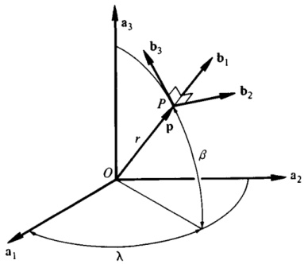{width=43%} 图2.9.1

 ---------------------------------------------[ 第144页 ]---------------------------------------------  

要证明这一点，可以先从对 p 在 A 中关于 $r$、$\lambda$ 和 $\beta$ 的偏导数进行求值开始：

$$
\frac { \partial \mathbf { p } } { \partial r } \; = \; \mathbf { c } \lambda \; \mathbf { c } \beta \; \mathbf { a } _ { 1 } \; + \; \mathbf { s } \lambda \; \mathbf { c } \beta \; \mathbf { a } _ { 2 } \; + \; \mathbf { s } \beta \; \mathbf { a } _ { 3 } \; = \; \mathbf { b } _ { 1 }
$$

$$
\frac { \partial \mathbf { p } } { \partial \lambda } \; \; _ { ( 33 ) } = r \; ( \; - \; s \lambda \; \; c \beta \; \mathbf { a } _ { 1 } + c \lambda \; \; c \beta \; \mathbf { a } _ { 2 } ) = r \; \; c \beta \; \mathbf { b } _ { 2 }
$$

$$
\frac { \partial \mathbf { p } } { \partial \beta } \; = \; r \left( \; - \; c \lambda \; \mathbf { s } \beta \; \mathbf { a } _ { 1 } \; + \; s \lambda \; \mathbf { s } \beta \; \mathbf { a } _ { 2 } \; + \; c \beta \; \mathbf { a } _ { 3 } \right) = r \, \mathbf { b } _ { 3 }
$$

接下来，根据式（6），并用 $\nabla$ 代替 $\nabla_{\mathrm{p}}$，

$$
\frac { \partial G } { \partial r } = \nabla F \cdot \frac { \partial \mathbf { p } } { \partial r } = \nabla F \cdot \mathbf { b } _ { 1 }
$$

$$
\frac { \partial G } { \partial \lambda } = \nabla F \cdot \frac { \partial \mathbf { p } } { \partial \lambda } \stackrel { ( 37 ) } { = } r \ c \beta \ \nabla F \cdot \mathbf { b } _ { 2 }
$$

$$
\frac { \partial G } { \partial \beta } = \nabla F \cdot \frac { \partial \mathbf { p } } { \partial \beta } = r \nabla F \cdot \mathbf { b } _ { 3 }
$$

现在，由于 $b_{1}b_{1} + b_{2}b_{2} + b_{3}b_{3}$ 是一个单位二阶张量，因此可以写成

$$
\begin{array}{rl} { \nabla F } & { = \nabla F \, \, \cdot \, \, ( \mathbf { b } _ { 1 } \, \mathbf { b } _ { 1 } \, + \, \mathbf { b } _ { 2 } \, \mathbf { b } _ { 2 } \, + \, \mathbf { b } _ { 3 } \, \mathbf { b } _ { 3 } ) } \\& { = \nabla F \, \, \cdot \, \, \mathbf { b } _ { 1 } \, \mathbf { b } _ { 1 } \, + \, \nabla F \, \, \cdot \, \, \mathbf { b } _ { 2 } \, \mathbf { b } _ { 2 } \, + \, \nabla F \, \, \cdot \, \, \mathbf { b } _ { 3 } \, \mathbf { b } _ { 3 } } \end{array}
$$

通过将式（39）至式（41）中关于 $\nabla F \cdot \mathbf{b}_1$、$\nabla F \cdot \mathbf{b}_2$ 和 $\nabla F \cdot \mathbf{b}_3$ 的表达式解出，并代入式（42），最终得到式（35）。

$F$ 的空间拉普拉斯算子可表示为

$$
\nabla ^{2} F = \frac { 1 } { r ^{2} } \left[ \frac { \partial } { \partial r } \left( r ^{2} \, \frac { \partial G } { \partial r } \right) + \sec ^{2} \beta \, \frac { \partial ^{2} G } { \partial \lambda ^{2} } + \sec \beta \, \frac { \partial } { \partial \beta } \left( c \beta \frac { \partial G } { \partial \beta } \right) \right]
$$

通过将式（4）与式（35）结合使用，具体如下。

$$
\begin{array}{rl} { \nabla ^{2} F _ { ( 4 ) } } & { { } \nabla \cdot \nabla F _ { ( 35 ) } = \left( { \frac { \partial } { \partial r } } \, \mathbf { b } _ { 1 } + { \frac { 1 } { r } } \, \mathbf { c } \beta \, { \frac { \partial } { \partial \lambda } } \, \mathbf { b } _ { 2 } + { \frac { 1 } { r } } \, { \frac { \partial } { \partial \beta } } \, \mathbf { b } _ { 3 } \right) \cdot \nabla F } \\{ } & { { } = \mathbf { b } _ { 1 } \cdot { \frac { \partial } { \partial r } } \left( \nabla F \right) + { \frac { 1 } { r } } \, \mathbf { c } \beta \, \mathbf { b } _ { 2 } \cdot { \frac { \partial } { \partial \lambda } } \left( \nabla F \right) + { \frac { 1 } { r } } \, \mathbf { b } _ { 3 } \cdot { \frac { \partial } { \partial \beta } } \left( \nabla F \right) } \end{array}
$$

本方程中所指示的偏导数必须在参考系 A 中进行计算。仅保留那些不会因后续点积运算而被消去的项，即可得到

$$
\begin{array}{rl} & { \frac { \partial } { \partial r } ( \nabla F ) \; = \; \frac { \partial ^{2} G } { \partial r ^{2} } \; { \bf b } _ { 1 } + \; \cdots \; \; \; } \\& { \frac { \partial } { \partial \lambda } ( \nabla F ) \; = \; \frac { \partial G } { \partial r } \; \frac { \partial { \bf b } _ { 1 } } { \partial \lambda } + \frac { 1 } { r } \frac { \partial ^{2} G } { c \beta } \; \frac { \partial ^{2} G } { \partial \lambda ^{2} } \; { \bf b } _ { 2 } + \frac { 1 } { r } \frac { \partial G } { \partial \beta } \; \frac { \partial { \bf b } _ { 3 } } { \partial \lambda } + \; \cdots \; . } \end{array}
$$

（续上页）

 ---------------------------------------------[ 第145页 ]---------------------------------------------  

$$
\begin{aligned} & \frac { \partial G } { \partial r } \, \mathbf { c } \beta \, \mathbf { b } _ { 2 } + \frac { 1 } { r } \, \frac { \partial ^{2} G } { \partial \lambda ^{2} } \mathbf { b } _ { 2 } - \frac { 1 } { r } \, \frac { \partial G } { \partial \beta } \, \mathbf { s } \beta \, \mathbf { b } _ { 2 } + \cdots \\& \frac { \partial } { \partial \beta } ( \nabla F ) \, \stackrel { ( 35 ) } { = } \, \frac { \partial G } { \partial r } \, \frac { \partial \mathbf { b } _ { 1 } } { \partial \beta } + \frac { 1 } { r } \, \frac { \partial ^{2} G } { \partial \beta ^{2} } \mathbf { b } _ { 3 } + \cdots \\& = \frac { \partial G } { \partial r } \, \mathbf { b } _ { 3 } + \frac { 1 } { r } \, \frac { \partial ^{2} G } { \partial \beta ^{2} } \mathbf { b } _ { 3 } + \cdots \end{aligned}
$$

并将此式代入式（44），即可得到

$$
\nabla ^{2} F = \frac { \partial ^{2} G } { \partial r ^{2} } + \frac { 2 } { r } \frac { \partial G } { \partial r } + \frac { 1 } { r ^{2} } \frac { \partial ^{2} G } { c ^{2} \beta } \frac { \partial ^{2} G } { \partial \lambda ^{2} } - \frac { s \beta } { r ^{2} c \beta } \frac { \partial G } { \partial \beta } \frac { \partial G } { \partial \beta } + \frac { 1 } { r ^{2} } \frac { \partial ^{2} G } { \partial \beta ^{2} }
$$

这与式（43）等价。

# 2.10 两个粒子的力函数

由质量为 $m$ 的粒子 $P$ 所受的质量为 $\overline{m}$ 的粒子 $\overline{P}$ 的引力作用力 $F$ 可以表示为

$$
\mathbf { F } = \nabla _ { \mathbf { p } } V \triangleq \nabla V
$$

其中 $\mathbf{p}$ 是 $P$ 相对于 $\overline{P}$ 的位置矢量，而 $V$ 则由以下公式给出

$$
V = G \overline { { { m } } } p m p ^{- 1} + C
$$

其中 $p$ 的定义为

$$
p \triangleq ( { \bf p } ^{2} ) ^{1 / 2}
$$

且 $C$ 为任意常数，而 $G$ 为万有引力常数。

若一个向量变量的标量函数，其对变量的导数等于一个力，则该函数被称为力函数。因此，$V$ 是与两个粒子之间的引力相互作用相关联的力函数。

$V$ 的空间拉普拉斯算子（参见第 2.9 节）为零：

$$
\nabla ^{2} V = 0
$$

式（4）被称为拉普拉斯方程。该方程的任何解都称为球谐函数；在引力问题的背景下，它被称为引力势。然而，为了表征两个粒子之间的作用力 $F$，只有由式（2）给出的特定球谐函数，才能提供适合代入式（1）的力函数。

通过对 $V$ 关于 $\mathbf{p}$ 的求导，可得

$$
\nabla V _ { ( 2 ) } = G \overline { { { m } } } m \, \nabla p ^{- 1} \, _ { ( 2 . 9 . 8 ) } = - G \overline { { { m } } } m p ^{- 2} \, { \bf u }
$$

 ---------------------------------------------[ 第146页 ]---------------------------------------------  

其中，$\mathbf{u}$ 是指向 $\mathbf{p}$ 方向的单位矢量，即，

$$
\mathbf { u } \triangleq p ^{- 1} \mathbf { p }
$$

因此，

$$
\nabla V = - G \overline { { { m } } } p m p ^{- 3} \mathbf { p } _ { ( 2 . 1 . 1 ) } \mathbf { F }
$$

$V$ 的拉普拉斯算子为

$$
\begin{array}{rl} { \nabla ^{2} V } & { = \nabla \cdot \nabla V = - G \overline { { { m } } } m \nabla \cdot ( p ^{- 3} \mathbf { p } ) } \\& { = - G \overline { { { m } } } m ( 3 p ^{- 4} \mathbf { u } \cdot \mathbf { p } - 3 p ^{- 3} ) = 0 } \\& { \overset { ( 2 . 9 . 8 , } { = } 2 . 9 . 2 ) } \end{array}
$$

示例：一个质量为 $m$ 的粒子 $P$ 与两个质量均为 $\overline{m}$ 的粒子 $P_{1}$ 和 $P_{2}$ 分别位于如图 2.10.1 所示的位置。其中，$r$、$\lambda$、$\beta$ 是 $P$ 的球面坐标，而 $\mathbf{b}_{1}$、$\mathbf{b}_{2}$、$\mathbf{b}_{3}$ 是在 $r$、$\lambda$、$\beta$ 依次增大时，指向 $P$ 运动方向的单位矢量。需要构造一个力函数 $V$，用于描述作用于 $P$ 的合力引力 $\mathbf{F}$，并利用该函数将 $\mathbf{F}$ 表示为平行于 $\mathbf{b}_{1}$、$\mathbf{b}_{2}$、$\mathbf{b}_{3}$ 的分量。

$P_{1}$ 和 $P_{2}$ 分别对 $P$ 作用的力 $\mathbf{F}_{1}$ 和 $\mathbf{F}_{2}$ 可以表示为

$$
\mathbf { F } _ { i } = \nabla _ { \mathbf { p } _ { i } } V _ { i }  ( i = 1 , 2 )
$$

其中，$\mathbf{p}_{i}$ 是 $P$ 相对于 $P_{i}$ 的位置矢量，而 $V_{1}(\mathbf{p}_{1})$ 和 $V_{2}(\mathbf{p}_{2})$ 分别由以下公式给出

$$
{ \bf V } _ { i } = G \overline { { { m } } } p _ { i } ^{- 1} + C _ { i }  ( i = 1 , \, 2 )
$$

其中，$p_{i}$ 等于 $\mathbf{p}_{i}$ 的模长。因此，

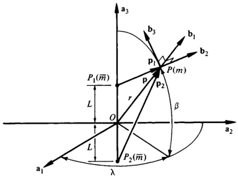{width=53%} 图2.10.1

 ---------------------------------------------[ 第147页 ]---------------------------------------------  

$$
\mathbf { F } = \mathbf { F } _ { 1 } + \mathbf { F } _ { 2 } \stackrel { ( 9 ) } { = } \nabla _ { \mathbf { p } 1 } V _ { 1 } + \nabla _ { \mathbf { p } 2 } V _ { 2 }
$$

若将 $\mathbf{p}$ 作为 $P$ 相对于 $O$ 的位置矢量引入，则 $\mathbf{p}_i = \mathbf{p} + \mathbf{c}_i$（$i = 1, 2$），其中 $\mathbf{c}_i$ 与 $\mathbf{p}_i$ 无关（参见图 2.10.1）；此外，若定义 $W_i(\mathbf{p})$ 为

$$
\begin{array}{r} { W _ { i } ( \mathbf { p } ) \triangleq V _ { i } ( \mathbf { p } + \mathbf { c } _ { i } )  ( i = 1 , \, 2 ) } \end{array}
$$

则

$$
\nabla _ { \mathbf { p } _ { i } } V _ { i \mathrm { ~ ( 2 . 9 . 5 ) ~ } } \nabla _ { \mathbf { p } } W _ { i }  ( i = 1 , \, 2 )
$$

因此，

$$
\mathbf { F } _ { ( 11 , 13 ) } \; \; \nabla _ { \mathbf { p } } W _ { 1 } + \nabla _ { \mathbf { p } } W _ { 2 } = \nabla _ { \mathbf { p } } ( W _ { 1 } + W _ { 2 } ) = \nabla _ { \mathbf { p } } V
$$

若将 $V$ 定义为

$$
V \triangleq W _ { 1 } + W _ { 2 } = V _ { 1 } + V _ { 2 } = G \overline { { { m } } } m \left( p _ { 1 } ^{- 1} + p _ { 2 } ^{- 1} \right) + C
$$

$V$ 即为所求的力函数。

要将 $\mathbf{F}$ 表示为平行于 $b_{1}$、$b_{2}$、$b_{3}$ 的分量，需注意

$$
p _ { 1 } = ( r ^{2} + L ^{2} - 2 r L \ \sin \beta ) ^{1 / 2}
$$

且

$$
p _ { 2 } = ( r ^{2} + L ^{2} + 2 r L \; \sin \beta ) ^{1 / 2}
$$

并定义一个关于 $r$、$\lambda$、$\beta$ 的函数 $W$ 为

$$
W \triangleq G \overline { { { m } } } m [ ( r ^{2} + L ^{2} - 2 r L \, \sin \beta ) ^{- 1 / 2} + ( r ^{2} + L ^{2} + 2 r L \, \sin \beta ) ^{- 1 / 2} ] + C
$$

然后

$$
V = W _ { ( 15 - 18 ) }
$$

并且，根据式 (2.9.35)，

$$
\begin{aligned}\mathbf{\nabla}_{\mathbf{p}}V&=\frac{\partial W}{\partial r}\:\mathbf{b}_{1}+\frac{1}{r\cos\beta}\:\frac{\partial W}{\partial\lambda}\:\mathbf{b}_{2}+\frac{1}{r}\:\frac{\partial W}{\partial\beta}\:\mathbf{b}_{3}\\&=\:-G\overline{m}m\{[(r^{2}+L^{2}-2rL\:\sin\beta)^{-3/2}(r-L\:\sin\beta)\\&+(r^{2}+L^{2}+2rL\:\sin\beta)^{-3/2}(r+L\:\sin\beta)]\mathbf{b}_{1}\\&-[(r^{2}+L^{2}-2rL\sin\beta)^{-3/2}L\cos\beta\\&-(r^{2}+L^{2}+2rL\sin\beta)^{-3/2}L\cos\beta]\mathbf{b}_{3}\}\end{aligned}
$$

将式 (20) 代入式 (14)，即可得到 $\mathbf{F}$ 的所需表达式。

 ---------------------------------------------[ 第148页 ]---------------------------------------------  

2.11 体与粒子的力函数

质心为$\overline{m}$的粒子$\overline{P}$对一个（不一定刚性）物体$B$中的各粒子所施加的合力F，可表示为

$$
\mathbf { F } = \nabla _ { R } V
$$

其中，$\mathbf{R}$是$B$的质心$\overline{P}$相对于$\overline{P}$的位置向量，而$V$是一个由以下公式给出的力函数：

$$
\mathbf { V } = G \overline { { { m } } } \sum _ { i = 1 } ^{N} m _ { i } p _ { i } ^{- 1} + C
$$

其中，

$$
p _ { i } \triangleq ( { \bf p } _ { i } ^{2} ) ^{1 / 2}  ( i = 1 , \ldots , N )
$$

以及

$$
\mathbf { p } _ { i } \triangleq \mathbf { R } + \mathbf { r } _ { i }  ( i = 1 , \ldots , N )
$$

在此，我们假定$B$由质量为$m_{1}$、$\ldots$、$m_{N}$的粒子$P_{1}$、$\ldots$、$P_{N}$组成，$\mathbf{p}_{i}$是$P_{i}$相对于$\overline{P}$的位置向量，且假设$\mathbf{p}_{i}$不为零；$\mathbf{r}_{i}$是$P_{i}$相对于$\overline{B}^{*}$的位置向量；$C$是一个任意常数；而$G$是万有引力常数。若$B$是连续分布的物质，且不包含$\overline{P}$所占据的点，则$V$的表达式为

$$
V = G \overline { { { m } } } \int p ^{- 1} \rho \ d \tau + C
$$

其中，

$$
p \triangleq ( { \bf p } ^{2} ) ^{1 / 2}
$$

且$\mathbf{p}=\mathbf{R}+\mathbf{r}$，其中$\rho$是$B$在$B$某一般点$P$处的质量密度；$\mathbf{p}$是$P$相对于$\overline{P}$的位置向量；$\mathbf{r}$是$P$相对于$\overline{B}^{*}$的位置向量；而$d\tau$则是$B$所占据的图形（曲线、曲面或立体）的微分元素的长度、面积或体积。

方程（2）和方程（5）中的力函数均满足拉普拉斯方程：

$$
\nabla ^{2} V = 0
$$

推导过程表明，对$R$求导得到

$$
\nabla _ { \mathbf { R } } V _ { ( 2 ) } = - G \overline { { { m } } } \sum _ { i = 1 } ^{N} m _ { i } p _ { i } ^{- 2} \nabla _ { \mathbf { R } } p _ { i }
$$

现在，

$$
\begin{array}{rl} { \nabla _ { \mathbf { R } } p _ { i } } & { { } = \nabla _ { \mathbf { R } } [ ( \mathbf { R } + \mathbf { r } _ { i } ) ^{2} ] ^{1 / 2} = [ ( \mathbf { R } + \mathbf { r } _ { i } ) ^{2} ] ^{- 1 / 2} \left( \mathbf { R } + \mathbf { r } _ { i } \right) \cdot \nabla _ { \mathbf { R } } \left( \mathbf { R } + \mathbf { r } _ { i } \right) } \\{ } & { { } = p _ { i } ^{- 1} \mathbf { p } _ { i } \cdot \nabla _ { \mathbf { R } } \left( \mathbf { R } + \mathbf { r } _ { i } \right) } \\{ } & { { } = p _ { i } ^{- 1} \mathbf { p } _ { i } \cdot \nabla _ { \mathbf { R } } \left( \mathbf { R } + \mathbf { r } _ { i } \right) \overset { ( 3 . 4 ) } { = } p _ { i } ^{- 1} \mathbf { p } _ { i } \cdot \left( \mathbf { U } + 0 \right) = p _ { i } ^{- 1} \mathbf { p } _ { i } } \end{array}
$$

因此，

$$
\Delta _ { \mathrm { R } } V \stackrel { = } { \mathrm { ~ ( 8 , 9 ) ~ } } - G \overline { { { m } } } \sum _ { i = 1 } ^{N} m _ { i } p _ { i } ^{- 3} \mathbf { p } _ { i } \stackrel { = } { \mathrm { ~ ( 2 . 2 . 1 ) ~ } } \mathbf { F }
$$

 ---------------------------------------------[ 第149页 ]---------------------------------------------  

2.11 小体与粒子的力函数 133

图2.11.1

通过平行推导可知，当方程（2）被方程（5）取代时，方程（1）依然成立。

方程（7）直接源于方程（2.10.8），因为对梯度进行求值并沿$B$进行积分的运算顺序并不重要。

示例A：长度为$L$、质量为$m$的均匀细杆$B$，受到质量为$\overline{m}$的粒子$P$的引力作用。需要根据坐标系原点位于$B$的质心$\overline{B}^{*}$处的直角坐标系中，$\overline{P}$的笛卡尔坐标$x$、$y$来确定$\overline{P}$对$B$施加的合力的力函数$V$的值。方程（3）中的常数$C$应选择为使得当$y = L/2$且$L/x$趋近于零时，$V$趋于零。

若将杆视为沿一条直线段分布的物质，那么从$\overline{P}$到杆上任意一点$P$的距离$p$可表示为：$p = \sqrt{x^{2} + \eta^{2}}$，其中$\eta$的取值范围为$y - L/2$到$y + L/2$。在$P$处，$B$的质量密度$\rho$等于$m/L$，而$B$的一个微元元素的长度为$d\eta$。因此，

$$
V^{(3)} = \frac{G\overline{m}}{L} \int_{y-L/2}^{y+L/2} (x^{2} + \eta^{2})^{-1/2} d\eta + C
$$

$$
=\frac{G\overline{m}}{L} \ln \left[\frac{y + L/2 + \sqrt{x^{2} + (y + L/2)^{2}}}{y - L/2 + \sqrt{x^{2} + (y - L/2)^{2}}}\right] + C
$$

当$y = L/2$时，随着$L/x$趋近于零，$V$所趋近的极限值为$C$。因此，$C = 0$。

2.12 小体与质点的力函数

当一个物体$B$受到一个质点$\overline{P}$的引力作用时，该质点被移离$B$的质量中心$\overline{B}^{*}$，且$\overline{P}$与$\overline{B}^{*}$之间的最大距离小于$\overline{P}$与$\overline{B}^{*}$之间的距离$R$，

 ---------------------------------------------[ 第150页 ]---------------------------------------------  

134 引力作用 2.12

在公式（2.11.2）和（2.11.5）中给出的力函数$V$的表达式，可以采用如下方法进行简化：将$p_{i}$和$p$分别替换为$\left[(\mathbf{R} + \mathbf{r}_{i})^{2}\right]^{1/2}$和$\left[(\mathbf{R} + \mathbf{r}_{i})^{2}\right]^{1/2}$，并按照$|\mathbf{r}_{i}|/R$或$|\mathbf{r}|/R$的升幂级数展开被积函数，从而得到

$$
V = \frac{G \overline{m} m}{R} \left[1 + \sum_{i=1}^{\infty} v^{(i)}\right] + C
$$

其中$v^{(i)}$是$|\mathbf{r}_{i}|/R$或$|\mathbf{r}|/R$中第$i$次幂项的总和；$m$和$\overline{m}$分别是$B$和$\overline{P}$的质量；$C$是一个任意常数；$G$是万有引力常数。特别地，$v^{(2)}$的表达式为

$$
\nu^{(2)} = \frac{1}{2 m R^{2}} \left[ \text{tr}(\mathbf{I}) - 3 I_{11} \right]
$$

其中$\text{tr}(\mathbf{I})$是$B$的中心惯性二阶张量$\mathbf{I}$的迹；$I_{11}$是$B$绕着连接$\overline{P}$与$\overline{B}^{*}$的直线的转动惯量，因此（参见图2.3.1）

$$
I_{11} \triangleq \mathbf{a}_{1} \cdot \mathbf{I} \cdot \mathbf{a}_{1}
$$

由于$I_{11}$依赖于$\mathbf{a}_{1}$相对于$B$的相对方向，因此，公式（2）有时不如采用另一种形式来表述——即使用$B$的中心矩以及其关于任意向量基$\mathbf{b}_{1}^{\prime}$、$\mathbf{b}_{2}^{\prime}$、$\mathbf{b}_{3}^{\prime}$的转动惯量乘积。借助所需的表达式，

$$
\nu^{(2)} = \frac{1}{2 m R^{2}} \left[ I_{11}^{\prime}(1 - 3 C_{11}^{\prime 2}) + I_{22}^{\prime}(1 - 3 C_{12}^{\prime 2}) + I_{33}^{\prime}(1 - 3 C_{13}^{\prime 2}) \right.
$$

$$
-6 (I_{12}^{\prime} C_{11}^{\prime} C_{12}^{\prime} + I_{13}^{\prime} C_{11}^{\prime} C_{13}^{\prime} + I_{23}^{\prime} C_{12}^{\prime} C_{13}^{\prime}) 
$$

其中 $C_{1j}^{\prime} \triangleq \mathbf{a}_{1} \cdot \mathbf{b}_{j}^{\prime}$（$j = 1, 2, 3$）。当 $B$ 为刚体，且 $\mathbf{b}_{1}^{\prime}$、$\mathbf{b}_{2}^{\prime}$ 和 $\mathbf{b}_{3}^{\prime}$ 固定在 $B$ 中时，式（5）中的标量 $I_{j}^{\prime k}$（$j, k = 1, 2, 3$）将变为常数，而式（2）中的 $I_{11}$ 则仍为变量。

对于特别的情形——即刚体固定单位向量与 $B$ 的中心惯性主轴平行时，

$$
\nu^{(2)} = \frac{1}{2 m R^{2}} \left[ I_{1}(1 - 3 C_{11}^{\prime 2}) + I_{2}(1 - 3 C_{12}^{\prime 2}) + I_{3}(1 - 3 C_{13}^{\prime 2}) \right]
$$

其中 $I_{j}$ 和 $C_{1j}$（$j = 1, 2, 3$）分别由式（2.3.8）和式（2.3.9）给出。

当所指示的方向余弦用图2.12.1中所示的球面坐标表示时，式（5）和式（6）会呈现出尤为方便的形式。具体而言，

 ---------------------------------------------[ 第151页 ]---------------------------------------------  

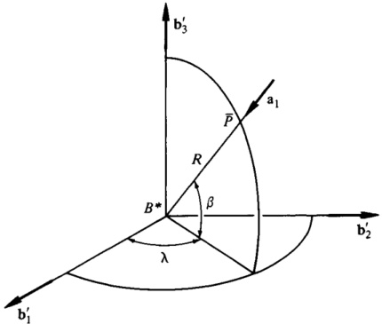{width=48%} 图2.12.1

$$
\begin{array}{rl} & { \nu ^{( 2 )} = \frac { 1 } { 4 m R ^{2} } \left[ ( I _ { 11 } ^{\prime} + I _ { 22 } ^{\prime} - 2 I _ { 33 } ^{\prime} ) ( 3 \sin ^{2}  \beta - 1 ) - 3 ( I _ { 11 } ^{\prime} - I _ { 22 } ^{\prime} ) \cos ^{2}  \beta \cos 2 \lambda \right. } \\& { \left. - 6 ( I _ { 12 } ^{\prime} \cos ^{2}  \beta \sin 2 \lambda + I _ { 13 } ^{\prime} \sin 2  \beta \cos \lambda + I _ { 23 } ^{\prime} \sin 2  \beta \sin \lambda ) \right] } \end{array}
$$

以及

$$
\nu ^{( 2 )} = \frac { 1 } { 4 m R ^{2} } \left[ ( I _ { 1 } + I _ { 2 } - 2 I _ { 3 } ) ( 3 \sin ^{2} \beta - 1 ) - 3 ( I _ { 1 } - I _ { 2 } ) \cos ^{2} \beta \cos 2 \lambda \right]
$$

通常，我们希望在 $\nu^{(2)}$ 中引入某种衡量 $B$ 尺寸的指标，以便得到一个包含无量纲常数和无量纲变量的表达式。若将符号 $R_{B}$ 用于指定的归一化尺寸，并且使用符号

$$
J \triangleq - \frac { 1 } { 2 m R _ { B } ^{2} } \left( I _ { 1 } + I _ { 2 } - 2 I _ { 3 } \right)
$$

以及

$$
\epsilon \triangleq - \frac { 3 } { 2 m R _ { B } ^{2} } \left( I _ { 1 } - I _ { 2 } \right)
$$

若引入符号

$$
\nu ^{( 2 )} = - \frac { J } { 2 } \left( \frac { R _ { B } } { R } \right) ^{2} ( 3 \, \sin ^{2} \beta - 1 ) + \frac { \epsilon } { 2 } \left( \frac { R _ { B } } { R } \right) ^{2} \cos ^{2} \beta \cos 2 \lambda
$$

若 $\widetilde{\mathbf{F}}$ 是式（2.3.6）中定义的 $\mathbf{F}$ 的近似值，则 $\widetilde{\mathbf{F}}$ 可以表示为

 ---------------------------------------------[ 第152页 ]---------------------------------------------  

136 重力作用 2.12

其中 $\widetilde{V}$ 的计算公式为

$$
\widetilde{V}=\frac{G\overline{m}m}{R}\left[1+\nu^{(2)}\right]+C
$$

且 $\mathbf{R}$ 是 $B^{*}$ 相对于 $\widetilde{P}$ 的位置矢量。换句话说，$\widetilde{V}$ 是一种适用于处理物体与远距离粒子之间引力相互作用的力函数，当使用 $\widetilde{\mathbf{F}}$ 来近似 $\mathbf{F}$ 时即可适用。

通过将式（2.11.5）中的 $p$ 替换为 $[(\mathbf{R}+\mathbf{r})^{2}]^{1/2}$ 进行推导，可得

$$
V=G\overline{m}\int(\mathbf{R}^{2}+2\mathbf{R}\cdot\mathbf{r}+\mathbf{r}^{2})^{-1/2}\rho\,d\tau+C
$$

将$\mathbf{q}$定义为$\mathbf{q}\triangleq\mathbf{r}/R$，并注意到$\mathbf{R}/R=\mathbf{a}_{1}$，再利用二项式级数——该级数在$|2\mathbf{R}\cdot\mathbf{r}+\mathbf{r}^{2}|<1$时收敛——可得

$$
V=\frac{G\overline{m}}{R}\int(1+2\mathbf{a}_{1}\cdot\mathbf{q}+\mathbf{q}^{2})^{-1/2}\rho\,d\tau+C
$$

$$
=\frac{G\overline{m}}{R}\int\left[\int-\mathbf{a}_{1}\cdot\mathbf{q}-\frac{1}{2}\mathbf{q}^{2}+\frac{3}{2}(\mathbf{a}_{1}\cdot\mathbf{q})^{2}+\cdots\right]\rho\,d\tau+C
$$

$$
=\frac{G\overline{m}}{R}\left\{\int\rho\,d\tau-\frac{\mathbf{a}_{1}}{R}\cdot\int\mathbf{r}\rho\,d\tau \\
-\frac{1}{2R^{2}}\int\left[\mathbf{r}^{2}-3(\mathbf{a}_{1}\cdot\mathbf{r})^{2}\right]\rho\,d\tau+\cdots\right\}+C
$$

现在，

$$
\int\rho\,d\tau=m
$$

$$
\int\mathbf{r}\rho\,d\tau=0
$$

并且

$$
\int\mathbf{r}\rho\,d\tau=0
$$

此外，

$$
\int\left[\mathbf{r}^{2}-3(\mathbf{a}_{1}\cdot\mathbf{r})^{2}\right]\rho\,d\tau=3\int\left[\mathbf{r}^{2}-(\mathbf{a}_{1}\cdot\mathbf{r})^{2}\right]\rho\,d\tau-2\int\mathbf{r}^{2}\rho\,d\tau
$$

此外，

$$
\int\left[\mathbf{r}^{2}-\left(\mathbf{a}_{1}\cdot\mathbf{r}\right)^{2}\right]\rho\,d\tau=I_{11}
$$

并且

$$
2\int\mathbf{r}^{2}\rho\,d\tau=\mathrm{tr}(\mathbf{I})
$$

因此，

 ---------------------------------------------[ 第153页 ]---------------------------------------------  

$$
\int [ \mathbf { r } ^{2} - 3 ( \mathbf { a } _ { 1 } \cdot \mathbf { r } ) ^{2} ] \rho \ d \tau \ = \ 3 I _ { 11 } - \operatorname { t r } ( \mathbf { I } )
$$

并且

$$
V _ { ( 15 - 17 , 21 ) } \, { \frac { G { \overline { { m } } } m } { R } } \, \left\{ 1 \, + \, { \frac { 1 } { 2 m R ^{2} } } \left[ \operatorname { t r } ( \mathbf { I } ) \, - \, 3 I _ { 11 } \right] \, + \, \cdots \, \right\} + C
$$

与式（1）和式（2）一致。

式（5）直接由式（2）推导而来，当$I_{11}$按照式（3）的规则进行计算，并将$I$表示为

$$
{ \bf I } = \sum _ { ( 4 ) } ^{3} \sum _ { k = 1 } ^{3} { \bf b } _ { j } ^{\prime} \, I _ { j k } ^{\prime} \, { \bf b } _ { k } ^{\prime}
$$

借助这些关系，我们发现

$$
\begin{aligned} \nu ^{( 2 )} & = \frac { 1 } { 2 m R ^{2} } \left( \sum _ { j = 1 } ^{3} I _ { j j } ^{\prime} - 3 \sum _ { j = 1 } ^{3} \sum _ { k = 1 } ^{3} C _ { 1 j } ^{\prime} I _ { j k } ^{\prime} C _ { 1 k } ^{\prime} \right) \\& = \frac { 1 } { 2 m R ^{2} } \left[ I _ { 11 } ^{\prime} ( 1 - 3 C _ { 11 } ^{\prime 2} ) + I _ { 22 } ^{\prime} ( 1 - 3 C _ { 12 } ^{\prime 2} ) + I _ { 33 } ^{\prime} ( 1 - 3 C _ { 13 } ^{\prime 2} ) \right. \\& \left. - 3 \left( I _ { 12 } ^{\prime} C _ { 11 } ^{\prime} C _ { 12 } ^{\prime} + I _ { 13 } ^{\prime} C _ { 11 } ^{\prime} C _ { 13 } ^{\prime} + I _ { 21 } ^{\prime} C _ { 12 } ^{\prime} C _ { 11 } ^{\prime} + I _ { 23 } ^{\prime} C _ { 12 } ^{\prime} C _ { 13 } ^{\prime} \right. \right. \\& \left. \left. + \ I _ { 31 } ^{\prime} C _ { 13 } ^{\prime} C _ { 11 } ^{\prime} + I _ { 32 } ^{\prime} C _ { 13 } ^{\prime} C _ { 12 } ^{\prime} \right) \right] \end{aligned}
$$

由于$I_{jk}^{\prime}=I_{kj}^{\prime}$，这一关系最终归结为式（5）。式（6）只是式（5）的特例——在惯性乘积为零且采用全新记号的情况下；而式（7）和式（8）则是式（5）和式（6）的特例，其中关系

$$
\mathbf { a } _ { 1 } = - \cos \beta \cos \lambda \ \mathbf { b } _ { 1 } ^{\prime} - \cos \beta \sin \lambda \ \mathbf { b } _ { 2 } ^{\prime} - \sin \beta \ \mathbf { b } _ { 3 } ^{\prime}
$$

（参见图2.12.1）已用于求得所需方向余弦的表达式

$$
C _ { 11 } ^{\prime} = \; - \; \cos \beta \; \cos \lambda \; \; \; \; \; \; \; \; \; C _ { 12 } ^{\prime} = \; - \; \cos \beta \; \sin \lambda \; \; \; \; \; \; \; \; C _ { 13 } ^{\prime} = \; - \; \sin \beta
$$

将式（26）代入式（5）后，得到

$$
\begin{aligned} \nu ^{( 2 )} & = \frac { 1 } { 2 m R ^{2} } [ I _ { 11 } ^{\prime} ( 1 - 3 \cos ^{2} \beta \cos ^{2} \lambda ) + I _ { 22 } ^{\prime} ( 1 - 3 \cos ^{2} \beta \sin ^{2} \lambda ) \\& + I _ { 33 } ^{\prime} ( 1 - 3 \sin ^{2} \beta ) - 6 ( I _ { 12 } ^{\prime} \cos ^{2} \beta \cos \lambda \sin \lambda \\& + I _ { 13 } ^{\prime} \cos \beta \cos \lambda \sin \beta + I _ { 23 } ^{\prime} \sin \beta \cos \beta \sin \lambda ) ] \\& = \frac { 1 } { 2 m R ^{2} } \Big \{ I _ { 11 } ^{\prime} \Big [ 1 - 3 \cos ^{2} \beta \Big ( \frac { 1 } { 2 } + \frac { 1 } { 2 } \cos 2 \lambda \Big ) \Big ] \end{aligned}
$$

（续上一页）

 ---------------------------------------------[ 第154页 ]---------------------------------------------  

138 重力作用 2.12

$$
I_{22}^{\prime} \left[1-3 \cos ^{2} \beta\left(\frac{1}{2}-\frac{1}{2} \cos 2 \lambda\right)\right]
$$

$$
I_{33}^{\prime}(3 \sin ^{2} \beta-1)-6\left[I_{12}^{\prime} \cos ^{2} \beta\left(\frac{1}{2} \sin 2 \lambda\right) \\
I_{13}^{\prime} \cos \lambda\left(\frac{1}{2} \sin 2 \beta\right)+I_{23}^{\prime} \sin \lambda\left(\frac{1}{2} \sin 2 \beta\right)\right]
$$

$$
\frac{1}{4 m R^{2}}\left\{I_{11}^{\prime}[2-3(1-\sin ^{2} \beta)]+I_{12}^{\prime}[2-3(1-\sin ^{2} \beta)\right\}
$$

$$
2 I_{33}^{\prime}(3 \sin ^{2} \beta-1)-3(I_{11}^{\prime}-I_{22}^{\prime}) \cos ^{2} \beta \cos 2 \lambda
$$

$$
6(I_{12}^{\prime} \cos ^{2} \beta \sin 2 \lambda+I_{13}^{\prime} \cos \lambda \sin 2 \beta+I_{23}^{\prime} \sin \lambda \sin 2 \beta)
$$

$$
\frac{1}{4 m R^{2}}[(I_{11}^{\prime}+I_{22}^{\prime}) (3 \sin ^{2} \beta-1)
$$

$$
3(I_{11}^{\prime}-I_{22}^{\prime}) \cos ^{2} \beta \cos 2 \lambda-6(I_{12}^{\prime} \cos ^{2} \beta \sin 2 \lambda
$$

$$
I_{13}^{\prime} \sin 2 \beta \cos \lambda+I_{23}^{\prime} \sin 2 \beta \sin \lambda)
$$

对式（13）求导，可得

$$
n_{R} \widetilde{V}=-\frac{G \overline{m} m}{R^{2}} \nabla_{R} R\left[1+\nu^{(2)}\right]+\frac{G \overline{m} m}{R} \nabla_{R} \nu^{(2)}
$$

根据式（2.9.8）和式（2.9.9），

$$
n_{R} R=\frac{G \overline{m} m}{R^{2}} \nabla_{R} R\left[1+\nu^{(2)}\right]+\frac{G \overline{m} m}{R} \nabla_{R} \nu^{(2)}
$$

并且根据式（2），将$I_{11}$ 替换为 $\mathbf{a}_{1} \cdot \mathbf{I} \cdot \mathbf{a}_{1}$，

$$
n_{R} \nu^{(2)}=-\frac{1}{m R^{3}} \nabla_{R} R\left[\operatorname{tr}(\mathbf{I})-3 \mathbf{a}_{1} \cdot \mathbf{I} \cdot \mathbf{a}_{1}\right]-\frac{3}{m R^{2}} \nabla_{R} \mathbf{a}_{1} \cdot \mathbf{I} \cdot \mathbf{a}_{1}
$$

$$
-\frac{1}{m R^{3}}\left[\mathbf{a}_{i} \operatorname{tr}(\mathbf{I})-6 \mathbf{a}_{1} \mathbf{a}_{1} \cdot \mathbf{I} \cdot \mathbf{a}_{1}+3 \mathbf{I} \cdot \mathbf{a}_{1}\right]
$$

将式（29）和式（30）代入式（28），并利用式（2），即可得出

$$
n_{R} \widetilde{V}=-\frac{G m m}{R^{2}}\left\{\mathbf{a}_{1}+\frac{1}{2 m R^{2}}\left[\mathbf{a}_{i} \operatorname{tr}(\mathbf{I})-3 \mathbf{a}_{1} \mathbf{a}_{1} \cdot \mathbf{I} \cdot \mathbf{a}_{1}\right]\right.
$$

（续上页）

 ---------------------------------------------[ 第155页 ]---------------------------------------------  

图2.12 小体与粒子的力函数 139

$$
\frac{1}{mR^{2}}\left[\mathbf{a}_{1} \operatorname{tr}(\mathbf{I})-6 \mathbf{a}_{1} \mathbf{a}_{1} \cdot \mathbf{I} \cdot \mathbf{a}_{1}+3 \mathbf{I} \cdot \mathbf{a}_{1}\right]\left\{+ \frac{1}{m R^{2}}\left[\mathbf{a}_{1}+\frac{1}{m R^{2}}\left\{\frac{3}{2}\left[\operatorname{tr}(\mathbf{I})-5 \mathbf{a}_{1} \cdot \mathbf{I} \cdot \mathbf{a}_{1}\right] \mathbf{a}_{1}+3 \mathbf{I} \cdot \mathbf{a}_{1}\right\}\right\}\right.
$$

$$
-\frac{G \overline{m} m}{R^{2}}\left[\mathbf{a}_{1}+\mathbf{f}^{(2)}\right]=\widetilde{\mathbf{F}}
$$

（2.3.3）

这确立了式（12）的正确性。

示例图2.12.2展示了质量为$m$的细长杆B，以及质量为$\overline{m}$的质点$\overline{P}$。若$\overline{P}$与B的质心$B^{*}$之间的距离$R$大于B的长度$L$，且若将B理想化为沿一条直线段分布的物质，则根据第2.3节中的示例结果，$\overline{P}$对B施加的引力$\mathbf{F}$近似等于由式（见图2.12.2，其中$\psi$和$\mathbf{a}_{1}$的定义如下）所给出的力$\widetilde{\mathbf{F}}$。

$$
\widetilde{\mathbf{F}}=-\frac{G \overline{m} m}{R^{2}}\left[\mathbf{a}_{1}+\frac{L^{2}}{8 R^{2}}(2-3 \sin ^{2} \psi) \mathbf{a}_{1}-\frac{L^{2}}{8 R^{2}} \sin 2 \psi \mathbf{a}_{2}\right]
$$

 ---------------------------------------------[ 第156页 ]---------------------------------------------  

用于计算tr(I)和$I_{11}$，如

$$
\operatorname { t r } ( \mathbf { I } ) = { \frac { m L ^{2} } { 6 } }  I _ { 11 } = \mathbf { a } _ { 1 } \cdot \mathbf { I } \cdot \mathbf { a } _ { 1 } = { \frac { m L ^{2} } { 12 } } \sin ^{2} \psi
$$

在将此值代入式（2）和式（13）后，得到

$$
\widetilde { V } \; = \; \frac { G \overline { { { m } } } m } { R } \left[ 1 \; + \; \frac { L ^{2} } { 24 R ^{2} } \left( 2 \; - \; 3 \; \sin ^{2}  \psi \right) \right] \; + \; C
$$

为了通过式（11）而非式（2）来得出这一结果，必须通过对比图2.12.1和图2.12.2，认识到此时$\beta = 0$，$\lambda = -\psi$。随着

$$
I _ { 1 } = 0  I _ { 2 } = I _ { 3 } = \frac { m L ^{2} } { 12 }
$$

因此，式（11）给出了

$$
\nu ^{( 2 )} \underset { ( 11 ) } { = } - \frac { J } { 2 } \bigg ( \frac { R _ { B } } { R } \bigg ) ^{2} \left( - 1 \right) + \frac { \epsilon } { 2 } \bigg ( \frac { R _ { B } } { R } \bigg ) ^{2} \left( 1 \right) \cos 2 \psi
$$

其中

$$
J _ { ( 9 ) } = - \frac { 1 } { 2 m R _ { B } ^{2} } \bigg ( 0 + \frac { m L ^{2} } { 12 } - \frac { 2 m L ^{2} } { 12 } \bigg ) = \frac { L ^{2} } { 24 R _ { B } ^{2} }
$$

以及

$$
\epsilon _ { ( 10 ) } - \frac { 3 } { 2 m R _ { B } ^{2} } \left( 0 - \frac { m L ^{2} } { 12 } \right) = \frac { L ^{2} } { 8 R _ { B } ^{2} }
$$

尽管通常会为$R_{B}$作出特定选择（例如$R_{B}=L/2$），以获得$J$和$\epsilon$的数值，但显然，在将式（37）至式（39）结合使用时，可以将$R_{B}$从$\nu^{(2)}$中消去，从而使得$R_{B}$的选择不会影响$\nu^{(2)}$；也就是说，

$$
\begin{array}{rl} { \nu ^{( 2 )} } & { \equiv \frac { L ^{2} } { ( 37 - 39 ) } \left( \frac { 1 } { 48 } + \frac { 1 } { 16 } \cos 2 \psi \right) } \\& { = \frac { L ^{2} } { 48 R ^{2} } [ 1 + 3 ( 1 - 2 \sin ^{2} \psi ) ] = \frac { L ^{2} } { 24 R ^{2} } \left( 2 - 3 \sin ^{2} \psi \right) } \end{array}
$$

并将式（40）代入式（13），最终得到式（35）。

为了验证式（12）是否确实成立，可按以下步骤进行：

$$
\begin{array}{rl} { \nabla _ { \mathbf { R } } \widetilde { V } _ { ( 35 ) } } & { = - \frac { G \overline { { m } } m } { R ^{2} } \, \nabla _ { \mathbf { R } } R \left[ 1 + \frac { L ^{2} } { 24 R ^{2} } \, ( 2 - 3 \, \sin ^{2} \psi ) \right] } \\& {  + \frac { G \overline { { m } } m } { R } [ - \frac { L ^{2} } { 12 R ^{3} } \, ( 2 - 3 \, \sin ^{2} \psi ) \, \nabla _ { \mathbf { R } } R - \frac { L ^{2} } { 8 R ^{2} } \, \sin 2 \psi \, \nabla _ { \mathbf { R } } \psi ] } \end{array}
$$

现在，

$$
\mathbf { R } = R ( \cos \psi \, \mathbf { b } _ { 1 } - \sin \psi \, \mathbf { b } _ { 2 } )
$$

因此，

 ---------------------------------------------[ 第157页 ]---------------------------------------------  

2.13 用勒让德多项式表示的力函数 141

$$
\nabla_{\mathbf{R}} \mathbf{R}=\nabla_{\mathbf{R}} R\left(\cos \psi \mathbf{b}_{1}-\sin \psi \mathbf{b}_{2}\right)
$$

$$
+ R\left(-\sin \psi \nabla_{\mathbf{R}} \psi \mathbf{b}_{1}-\cos \psi \nabla_{\mathbf{R}} \psi \mathbf{b}_{2}\right)
$$

或者，鉴于式（2.9.7）和式（2.9.8），

$$
\mathbf{U}=\mathbf{a}_{1}\left(\cos \psi \mathbf{b}_{1}-\sin \psi \mathbf{b}_{2}\right)-R \nabla_{\mathbf{R}} \psi\left(\sin \psi \mathbf{b}_{1}+\cos \psi \mathbf{b}_{2}\right)
$$

$$
\mathbf{a}_{1} \mathbf{a}_{1} - R \nabla_{\mathbf{R}} \psi \mathbf{a}_{2}
$$

与 $\mathbf{a}_{2}$ 进行点积运算，由此得到

$$
\mathbf{a}_{2} = -R \nabla_{\mathbf{R}} \psi
$$

并利用 $\nabla_{\mathbf{R}} R = \mathbf{a}_{1}$ 和 $\nabla_{\mathbf{R}} \psi = -\mathbf{a}_{2} / R$，可得

$\nabla_{\mathbf{R}} \widetilde{V}_{(41)} - \frac{G \overline{m}}{R^{2}} \left[ \mathbf{a}_{1} + \frac{L^{2}}{8 R^{2}} (2 - 3 \sin ^{2} \psi) \mathbf{a}_{1} - \frac{L^{2}}{8 R^{2}} \sin ^{2} \psi \mathbf{a}_{2} \right]_{(32)} \widetilde{\mathbf{F}}$ (46)

2.13 力函数的表达式

勒让德多项式

方程 (2.12.1) 中出现的 $\nu^{(i)}$（$i=2, \ldots, \infty$）可以表示为

$$
\nu^{(i)} = \frac{1}{m} \int \left(\frac{r}{R}\right)^{i} P_{i}\left(\cos \alpha\right) \rho d \tau
$$

$$
(i=2, \ldots, \infty)
$$

其中 $r$ 是从 $B^{*}$ 到 $B$ 中任意一点 $P$ 的距离（对于 $B$ 中的所有点，$r$ 必须小于 $R$），$\rho$ 是 $B$ 在 $P$ 处的质量密度，$\alpha$ 是连接 $B^{*}$ 与 $P$ 以及与 $\overline{P}$ 的直线之间的夹角（参见图 2.13.1），$P_{i}\left(\cos \alpha\right)$ 是一个勒让德多项式，将在下文予以定义，而 $d \tau$ 是由 $B$ 占据的图形微元的体积。

根据定义，勒让德多项式 $P_{0}(y), P_{1}(y), \ldots$ 可以表示为

$$
\begin{array}{c} P_{0}(y) \triangleq 1 \\ P_{i}(y) \triangleq \frac{1 \cdot 3 \cdots \cdots(2 i-1)}{i !}\left[y^{i}-\frac{i(i-1)}{(2 i-1) \cdot 2} y^{i-2}\right] + \frac{i(i-1)(i-2)(i-3)}{(2 i-1)(2 i-3) \cdot 2 \cdot 4} y^{i-4} + \cdots \end{array}
$$

$$
(i=1, \ldots, \infty)
$$

其中，括号内级数中的最后一项，若 $i$ 为偶数则涉及 $y^{0}$，若 $i$ 为奇数则涉及 $y^{1}$。例如，

$P_{1}(y) = y$；$P_{2}(y) = \frac{3 y^{2} - 1}{2}$；$P_{3}(y) = \frac{5 y^{3} - 3 y}{2}$

方程 (1) 中的被积函数依赖于 $\overline{P}$ 相对于 $B$ 的位置，因为该函数中包含了角度 $\alpha$。为了将 $\nu^{(i)}$ 表达为与 $\overline{P}$ 位置无关的积分形式，从而能够在质量确定后立即进行计算，

 ---------------------------------------------[ 第158页 ]---------------------------------------------  

142 引力作用 2.13

图 2.13.1

已明确 $B$ 的分布情况，因此我们采用关联勒让德函数，其定义如下：

$$
P_{i}^{j}(y) \triangleq \frac{(2i)!(1-y^{2})^{j/2}}{2i!(i-j)!} \left[ y^{i-j} - \frac{(i-j)(i-j-1)}{(2i-1) \cdot 2} y^{i-j-2} \right]
$$

$$
+ \frac{(i-j)(i-j-1)(i-j-2)(i-j-3)}{(2i-1)(2i-3) \cdot 2 \cdot 4} y^{i-j-4} + \cdots 
$$

$$
(i,j=0,1,\ldots,\infty)
$$

在括号内所列的级数中，当 $i-j$ 为偶数时，最后一项涉及 $y^{0}$；当 $i-j$ 为奇数时，则涉及 $y^{1}$。例如，

$$
P_{1}^{1}(y)=(1-y^{2})^{1/2}
$$

$$
P_{2}^{1}(y)=3y(1-y^{2})^{1/2}
$$

$$
P_{2}^{2}(y)=3y(1-y^{2})^{1/2}
$$

$$
P_{2}^{0}(y)=P_{i}(y)
$$

$$
(i=0,\ldots,\infty)
$$

通过常数 $C_{ij}$ 和 $S_{ij}$ 来考虑 $B$ 的质量分布，这些常数的定义如下：

$$
C_{i0} \triangleq \frac{1}{m} \int \left(\frac{r}{R_{B}}\right)^{i} P_{i}(\sin \gamma) \rho \, d\tau
$$

$$
(i=2,\ldots,\infty)
$$

$$
C_{ij} \triangleq \frac{2}{m} \frac{(i-j) !}{(i+j) !} \int \left(\frac{r}{R_{B}}\right)^{i} P_{j}^{j}(\sin \gamma) \cos j \mu \, \rho d\tau
$$

$$
(i=2,\ldots,\infty)
$$

$$
(i=1,\ldots,\infty; j=1,\ldots,\infty)
$$

 ---------------------------------------------[ 第159页 ]---------------------------------------------  

$$
\begin{array}{rlr} & { } & { S _ { i j } \triangleq \frac { 2 } { m } \frac { ( i - j ) ! } { ( i + j ) ! } \int \left( \frac { r } { R _ { B } } \right) ^{i} P _ { i } ^{j} \left( \sin \gamma \right) \sin j \mu \ \rho d \tau } \\& { } & {              ( i = 2 , \ \ldots , \ \infty ; \ j = 1 , \ \ldots , \ \infty ) . } \end{array}
$$

其中，$\mu$、$\gamma$ 和 $r$ 分别是图 2.13.1 中所示 $P$ 的球面坐标；而 $R_{B}$ 是一个任意量，其维度为长度，用于使 $C_{ij}$ 和 $S_{ij}$ 具有无量纲形式。以刚刚定义的这些量来表示，$\nu^{(i)}$ 可以写成：

$$
\nu ^{( i )} = \left( \frac { R _ { B } } { R } \right) ^{i} \sum _ { j = 0 } ^{i} P _ { i } ^{j} \left( \sin \beta \right) ( C _ { i j } \cos j \lambda + S _ { i j } \sin j \lambda )  ( i = 2 , \, \dots , \, \infty )
$$

其中，$\lambda$、$\beta$ 和 $R$ 分别是图 2.13.1 中所示 $\overline{P}$ 的球面坐标。将式 (11) 代入式 (2.12.1) 后，可直接得到

$$
V = \frac { G \overline { { { m } } } m } { R } \Bigg \{ 1 + \sum _ { i = 2 } ^{\infty} \Big [ \Big ( \frac { R _ { B } } { R } \Big ) ^{i} \sum _ { j = 0 } ^{i} P _ { i } ^{j} ( \sin \beta ) ( C _ { i j } \cos j \lambda + S _ { i j } \sin j \lambda \Big ] \Bigg \} + C
$$

此处 V 以国际天文学联合会为 B 为地球时所采用的标准表示形式书写。在这种情况下，$R_{B}$ 被视为地球的平均赤道半径。由于该级数仅在 $R > R_{B}$ 时收敛，因此在地球表面之上某一特定空间区域内的点上，该级数无法收敛——该区域的厚度从赤道处的零开始，到两极处约为 20 公里。

若 $B$ 具有轴对称性，且 $B$ 的对称轴为图 2.13.1 中的直线 $\gamma=\pi/2$，则 $S_{ij}=0$（$i,j=0,\dots,\infty$），$C_{ij}=0$（$i,j=2,\dots,\infty$），传统上引入符号 $J_i$ 作为

$$
J _ { i } \triangleq - C _ { i 0 }  ( i = 2 , \, \ldots , \, \infty )
$$

在这些条件下，式 (12) 中仅 $j=0$ 一项得以保留，因此，参照式 (7)，我们可以写出

$$
V = \frac { G \overline { { { m } } } m } { R } \Bigg [ 1 - \sum _ { i = 2 } ^{\infty} \Big ( \frac { R _ { B } } { R } \Big ) ^{i} J _ { i } P _ { i } ( \sin \beta ) \Bigg ] + C
$$

推导过程 若 $p$ 是图 2.13.1 中 $P$ 与 $\overline{P}$ 之间的距离，则 $p^{2}=R^{2}-2rR\cos\alpha+r^{2}$，并且

$$
V _ { ( 2 . 11 . 5 ) } = \frac { G \overline { { { m } } } } { R } \int \left[ 1 - 2 \, \frac { r } { R } \cos \alpha + \left( \frac { r } { R } \right) ^{2} \right] ^{- 1 / 2} \rho \, d \tau + C
$$

利用恒等式†

$$
( 1 - 2 y x + y ^{2} ) ^{- 1 / 2} = \sum _ { i = 0 } ^{\infty} y ^{i} P _ { i } ( x )
$$

该恒等式适用于 $|y| < 1$ 的情形，允许将式 (15) 替换为

†O. D. Kellogg，《势理论基础》，匈牙利出版社，纽约，1929年，第128页。

 ---------------------------------------------[ 第160页 ]---------------------------------------------  

$$
V = \frac { G \overline { { { m } } } } { R } \sum _ { i = 0 } ^{\infty} \int \left( \frac { r } { R } \right) ^{i} P _ { i } ( \cos \alpha ) \, \rho \, d \tau + C
$$

若对于 $B$ 中的任意一点，$r/R < 1$。由于[参见式 (2) 和式 (4)] $P_0(\cos\alpha) = 1$，$P_1(\cos\alpha) = \cos\alpha$，因此方程 (17) 的前两项可简化为：

$$
\int \left( \frac { r } { R } \right) ^{0} P _ { 0 } ( \cos \alpha ) \, \rho \, d \tau = \int \rho \, d \tau = m
$$

并且

$$
\int \left( \frac { r } { R } \right) ^{1} P _ { 1 } ( \cos \alpha ) \, \rho \, d \tau = \frac { 1 } { R } \int r \cos \alpha \, \rho \, d \tau
$$

最后的积分因 $B^{*}$ 作为 $B$ 的质心这一定义而消去。因此，

$$
{ \bf V } _ { ( 17 - 19 ) } \, { \frac { G \overline { { { m } } } m } { R } } \Bigg [ 1 + \sum _ { i = 2 } ^{\infty} { \frac { 1 } { m } } \int \left( { \frac { r } { R } } \right) ^{i} P _ { i } ( \cos \alpha ) \, \rho \, d \tau \Bigg ] + C
$$

方程 (1) 可直接从这一关系以及式 (2.12.1) 得出。

为了验证式 (11) 的有效性，我们首先通过将从 $B^*$ 指向 $P$ 的单位向量与从 $B^*$ 指向 $\overline{P}$ 的单位向量进行点积运算，从而得到 $\cos \alpha$，其结果为

$$
\cos \alpha = \sin \beta \, \sin \gamma + \cos \beta \, \cos \gamma \, \cos ( \lambda - \mu )
$$

然后利用式 (21) 的帮助，我们可以写出

$$
P _ { i } ( \cos \alpha ) = P _ { i } ( \sin \beta ) \, P _ { i } ( \sin \gamma ) + 2 \sum _ { j = 1 } ^{i} \frac { ( i - j ) ! } { ( i + j ) ! } P _ { i } ^{j} ( \sin \beta ) \, P _ { i } ^{j} ( \sin \gamma ) \, \cos \left[ j \left( \lambda - \mu \right) \right]
$$

因此，将此代入式 (1) 中，可得

$$
\begin{aligned}\nu^{(i)}&=\frac{P_{i}(\sin\beta)}{m}\int\left(\frac{r}{R}\right)^{i}P_{i}(\sin\gamma)\rho\:d\tau\\&+\frac{2}{m}\sum_{j=1}^{i}\frac{(i-j)!}{(i+j)!}P_{i}^{j}(\sin\beta)\cos j\lambda\int\left(\frac{r}{R}\right)^{i}P_{i}^{j}(\sin\gamma)\cos j\mu\:\rho d\tau\\&+\sin j\lambda\int\left(\frac{r}{R}\right)^{i}P_{i}^{j}(\sin\gamma)\:\sin j\mu\:\rho d\tau\\&=_{(8-10)}\left(\frac{R_{B}}{R}\right)^{i}P_{i}(\sin\beta)\:C_{i0}\\&+\left(\frac{R_{B}}{R}\right)^{i}\sum_{j=1}^{i}P_{i}^{j}(\sin\beta)(C_{ij}\cos j\lambda\:+S_{ij}\:\sin j\lambda)(i=2,\ldots,\alpha\end{aligned}
$$

鉴于式 (7)，可以看出该式与式 (11) 是等价的。

†W.E. Byerly，《傅里叶级数及球面、圆柱形、椭球形谐波的初等论著》，Ginn 公司，波士顿，1893 年，第 211 页。

 ---------------------------------------------[ 第161页 ]---------------------------------------------  

示例：需要为半径为 $r$、质量为 $m$ 的均匀圆形环 $B$ 与质量为 $\overline{m}$ 的粒子 $P$ 的引力相互作用，构建一个近似力函数 $V$。粒子的位置如图 2.13.2 所示，其中 $X_1$、$X_2$、$X_3$ 是互相垂直的直线。

由于该环具有轴对称性，可使用式 (14)。为此，我们需要对 $i=2,3,\ldots,\infty$ 进行 $J_i$ 和 $P_i(\sin\beta)$ 的计算。我们仅考虑 $i=2,3,4$。

根据式 (13)，

$$
J_2=-C_{20}=\frac{1}{m}\int\left(\frac{r}{R_B}\right)^2P_2(\sin\gamma)\rho\,d\tau
$$

当 $\gamma=0$ 时（参见图 2.13.1 和图 2.13.2），我们有

$$
P_2(\sin\gamma)=P_2(0)=\frac{1}{(4)}-\frac{1}{2}
$$

因此，

$$
J_2_{(24,25)}-\frac{1}{m}\int\left(\frac{r}{R_B}\right)^2\left(-\frac{1}{2}\right)\rho\,\mathrm{d}\tau=\frac{1}{2}\left(\frac{r}{R_B}\right)^2
$$

与此同时，

$$
P_2(\sin\beta)=\frac{1}{(4)}\left(3\sin^2\beta-1\right)
$$

继续以类似的方式进行计算，我们发现 $J_3=0$，并且

图 2.13.2

 ---------------------------------------------[ 第162页 ]---------------------------------------------  

146 引力作用 2.14

与此同时，

$$
J_{4}=\frac{3}{4}\left(\frac{r}{R_{B}}\right)^{4}
$$

$$
P_{4}(\sin \beta)=\frac{1}{3}\left(35 \sin ^{4} \beta-30 \sin ^{2} \beta+3\right)
$$

因此，

$$
V \stackrel{\sim}{\approx}\frac{G \overline{m}}{R}\left[1-\frac{1}{4}\left(\frac{r}{R}\right)^{2}(3 \sin ^{2} \beta-1\right]+C
$$

$$
+\frac{3}{32}\left(\frac{r}{R}\right)^{4}(35 \sin ^{4} \beta-30 \sin ^{2} \beta+3)+C
$$

2.14 两个小天体的力函数

当两个（不一定刚性）天体 $B$ 和 $\overline{B}$ 的质心 $B^{*}$ 和 $\overline{B}^{*}$ 之间的距离，对于每个天体而言，都超过其质心到天体任意一点的最大距离时，此时可以将 $\overline{B}$ 对 $B$ 所施加的引力合力近似表示为一个力 $\widetilde{F}$，其定义如下 [参见式 (2.4.14)]

$$
\widetilde{F} \triangleq-\frac{G \overline{m} m}{R^{2}}\left[\mathbf{a}_{1}+\mathbf{f}^{(2)}+\overline{\mathbf{f}}^{(2)}\right]
$$

其中，$\underline{G}$ 是万有引力常数，$m$ 和 $\overline{m}$ 分别是 $B$ 和 $\overline{B}$ 的质量，$\mathbf{a}_{1}$ 是一个单位向量，方向从 $\overline{B}^{*}$ 指向 $B^{*}$，而 $\mathbf{f}^{(2)}$ 和 $\mathbf{f}^{(2)}$ 则由式 (2.4.2) 和式 (2.4.3) 给出。由此，可得到一个力函数 $\widetilde{V}$，使得

$$
\widetilde{F}=\nabla_{\mathbf{R}} \widetilde{V}
$$

其中，$\mathbf{R}=R \mathbf{a}_{1}$，其表达式为

$$
\widetilde{V}=\frac{G \overline{m} m}{R}\left[1+\nu^{(2)}+\overline{\nu}^{(2)}\right]+C
$$

其中，

$$
\nu^{(2)}=\frac{1}{2 m R^{2}}\left[\operatorname{tr}(\mathbf{I})-3 I_{11}\right]
$$

和

$$
\overline{\nu}^{(2)}=\frac{1}{2 \overline{m} R^{2}}\left[\operatorname{tr}(\overline{\mathbf{I}})-3 \overline{I}_{11}\right]
$$

其中，$\operatorname{tr}(\mathbf{I})$ 和 $\operatorname{tr}(\overline{\mathbf{I}})$ 分别是 $B$ 和 $\overline{B}$ 中心惯性二阶张量的迹，而 $I_{11}$ 和 $\overline{I}_{11}$ 分别是 $B$ 和 $\overline{B}$ 关于连接 $B^{*}$ 和 $\overline{B}^{*}$ 的直线的转动惯量。

推导过程：对式 (3) 关于 $R$ 求导，并按照式 (2.12.13) 的推导方法继续进行，最终得出

 ---------------------------------------------[ 第163页 ]---------------------------------------------  

$$
\begin{array}{rl} { \nabla _ { \mathbf { R } } \widetilde { V } } & { = - \frac { G \overline { { m } } m } { R ^{2} } \Bigg ( \mathbf { a } _ { 1 } + \frac { 1 } { m R ^{2} } \Bigg \{ \frac { 3 } { 2 } \left[ \mathrm { t r } ( \mathbf { I } ) - 5 \mathbf { a } _ { 1 } \cdot \mathbf { I } \cdot \mathbf { a } _ { 1 } \right] \mathbf { a } _ { 1 } + 3 \mathbf { I } \cdot \mathbf { a } _ { 1 } \Bigg \} } \\& {  + \frac { 1 } { m R ^{2} } \Bigg \{ \frac { 3 } { 2 } \left[ \mathrm { t r } ( \overline { { \mathbf { I } } } ) - 5 \mathbf { a } _ { 1 } \cdot \overline { { \mathbf { I } } } \cdot \mathbf { a } _ { 1 } \right] \mathbf { a } _ { 1 } + 3 \overline { { \mathbf { I } } } \cdot \mathbf { a } _ { 1 } \Bigg \} \Bigg ) } \end{array}
$$

并利用式 (2.4.2) 和式 (2.4.3)，即可得到

$$
\nabla _ { \mathbf { R } } \widetilde { V } \ = \ - \frac { G \overline { { { m } } } m } { R ^{2} } \big [ \mathbf { a } _ { 1 } + \mathbf { f } ^{( 2 )} + \mathbf { \widetilde { f } } ^{( 2 )} \big ] = \widetilde { \mathbf { F } }
$$

示例：第 2.4 节中的示例涉及对长方体被扁球体所施加的引力力进行近似处理，即 $\widetilde{\mathbf{F}}$。为了构造满足式 (2) 的力函数 $\widetilde{\mathbf{V}}$，需注意，转动惯量 $I_{11}$ 和 $\bar{I}_{11}$ 可以表示为

$$
I _ { 11 } = \frac { m \alpha ^{2} } { 12 } [ 2 - \epsilon ^{2} + ( \mathbf { a } _ { 1 } \cdot \mathbf { b } _ { 1 } ) ^{2} \epsilon ^{2} ]
$$

$$
\overline { { { I } } } _ { 11 } = \frac { \overline { { { m } } } \, \overline { { { \alpha } } } ^{2} } { \xi } \, [ 2 - \overline { { { \epsilon } } } ^{2} + ( \mathbf { a } _ { 1 } \cdot \overline { { { \mathbf { b } } } } _ { 1 } ) ^{2} \, \overline { { { \epsilon } } } ^{2} ]
$$

while

$$
\operatorname { t r } ( \mathbf { I } ) = { \frac { m \alpha ^{2} } { 6 } } \left( 3 - \epsilon ^{2} \right)
$$

和

$$
\mathrm { t r } ( \bar { \mathbf { I } } ) = \frac { 2 \overline { { m } } \, \overline { { \alpha } } ^{2} } { 5 } ( 3 - \overline { { \epsilon } } ^{2} )
$$

$\widetilde{V}$，通过将各式（3）至（5）代入而得，其表达式为

$$
\begin{array}{rl} { { \widetilde { V } } } & { { } = { \frac { G { \overline { { m } } } m } { R } } \left\{ 1 + { \frac { \alpha ^{2} \epsilon ^{2} } { 24 R ^{2} } } [ 1 - 3 ( \mathbf { a } _ { 1 } \cdot \mathbf { b } _ { 1 } ) ^{2} ] \right. } \\{ { } } & { { } \left. + { \frac { \overline { { \alpha } } ^{2} \, \overline { { \epsilon } } ^{2} } { 10 R ^{2} } } [ 1 - 3 ( \mathbf { a } _ { 1 } \cdot \mathbf { b } _ { 1 } ) ^{2} ] \right\} + C } \end{array}
$$

并且可以验证，对$\widetilde{V}$关于$\mathbb{R}$求导[使用式（2.9.8）和式（2.9.9）]，可得到如式（2.4.14）以及式（2.4.26）和式（2.4.29）所给出的$\widetilde{\mathbf{F}}$。

# 2.15 中心质体的力函数

由于在处理引力效应时，中心质体（参见第2.5节）可以被置于该体质心处的质点所替代，因此，我们能够直接从式（2.10.2）、式（2.11.2）、式（2.11.5）、式（2.12.1）、式（2.13.12）或式（2.13.14）中获得适用于处理中心质体与质点之间引力相互作用、中心质体与任意物体之间引力相互作用，或中心质体与远距离物体之间引力相互作用的力函数。

 ---------------------------------------------[ 第164页 ]---------------------------------------------  

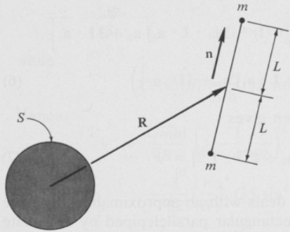{width=42%} 图2.15.1

示例：质量为$M$的均匀球体$S$对质量为$2m$的哑铃施加的引力F，可表示为

$$
\mathbf { F } = \nabla _ { \mathbf { R } } V
$$

其中

$$
V _ { \mathrm { \scriptsize ~ ( 2 . 11 . 2 ) } } = G M m \{ [ ( { \bf R } + L { \bf n } ) ^{2} ] ^{- 1 / 2} + [ ( { \bf R } - L { \bf n } ) ^{2} ] ^{- 1 / 2} \} + C
$$

其中n是一个单位向量，其方向如图2.15.1所示。

# 2.16 质体与小质体的力函数

当两个质体$B$和$\overline{B}$的质量中心$B^{*}$与$\overline{B}^{*}$之间的距离超过$\underline{B}^{*}$到$B$任一位置的最远距离时，并且已知$\overline{B}$对位于图2.16.1所示位置的单位质量质点施加的力函数$V(\mathbf{p})$，那么就存在一个函数$\widetilde{V}(\mathbf{R})$，其中$\mathbf{R}$是$B^{*}$相对于$\overline{B}^{*}$的位置矢量，使得$\overline{B}$对$B$施加的所有引力的合力，可以近似表示为一个力$\widetilde{\mathbf{F}}$，其表达式为

$$
\widetilde { \textbf { F } } = \nabla \widetilde { V } ( \mathbf { R } )
$$

其中符号$\nabla$表示对$\mathbf{R}$的求导。函数$\widetilde{V}(\mathbf{R})$的表达式为†

$$
\widetilde { V } ( \mathbf { R } ) = m V ( \mathbf { R } ) - \frac { 1 } { 2 } \mathbf { I } : \nabla \nabla V ( \mathbf { R } ) + C
$$

其中$m$为$B$的质量，$\mathbf{I}$为$B$的中心惯性二阶张量，$C$为任意常数。

式（2）中双点积的定义方式是：对于两个二阶张量 $\mathbf{u}_1\mathbf{u}_2$ 和 $\mathbf{v}_1\mathbf{v}_2$，有 $(\mathbf{u}_1\mathbf{u}_2):\ (\mathbf{v}_1\mathbf{v}_2) = (\mathbf{u}_1\cdot\mathbf{v}_1)(\mathbf{u}_2\cdot\mathbf{v}_2)$；且在应用于二阶张量时，它遵循分配律：$(\mathbf{a}_1\mathbf{a}_2 + \mathbf{b}_1\mathbf{b}_2 + \cdots\mathbf{v})$: $(\mathbf{A}_1\mathbf{A}_2 + \mathbf{B}_1\mathbf{B}_2 + \cdots\mathbf{v}) = \mathbf{a}_1\mathbf{a}_2$: $\mathbf{A}_1\mathbf{A}_2 + \mathbf{a}_1\mathbf{a}_2$: $\mathbf{B}_1\mathbf{B}_2 + \cdots$

$$
\begin{array}{r} { + \ \mathbf { b } _ { 1 } \mathbf { b } _ { 2 } : \mathbf { A } _ { 1 } \mathbf { A } _ { 2 } + \ \mathbf { b } _ { 1 } \mathbf { b } _ { 2 } : \mathbf { B } _ { 1 } \mathbf { B } _ { 2 } + \ \cdots \ \ \ \ } \\{ + \ \cdots \ \ \ } \end{array}
$$

 ---------------------------------------------[ 第165页 ]---------------------------------------------  

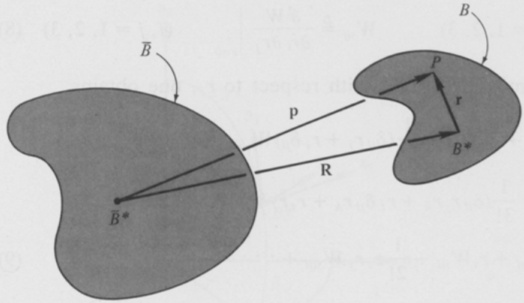{width=59%} 图2.16.1

推导过程　$\overline{B}$ 对位于 $P$ 的 $B$ 微分元素施加的引力力 $d\mathbf{F}$ 可以表示为

$$
d \mathbf { F } _ { ( 2 . 11 . 1 ) } = \nabla _ { \mathbf { p } } V \rho \; d \tau
$$

其中，$\rho$ 是 $B$ 在 $P$ 处的质量密度，而 $d\tau$ 是该微元的体积。因此，$\overline{B}$ 对 $B$ 所施加的所有引力力的合力 $\mathbf{F}$ 可以表示为

$$
\mathbf { F } = \int \nabla _ { \mathbf { p } } V \rho \ d \tau
$$

要得到与 $\mathbf{F}$ 相近的近似值 $\widetilde{\mathbf{F}}$，可以将 $V(\mathbf{p})$ 在 $\mathbf{p}=\mathbf{R}$ 附近按泰勒级数展开，仅保留 $|\mathbf{r}|$ 为 3 次方及以下的项，其中 $\mathbf{r}\triangleq\mathbf{p}-\mathbf{R}$（参见图 2.16.1）；对 $\mathbf{p}$ 进行求导；然后按照式（4）中的方法进行积分。通过引入函数 $W(\mathbf{r})\triangleq V(\mathbf{r}+\mathbf{R})$，可以简化这些工作，从而得以写出

$$
\nabla _ { \mathbf { p } } V \ { \stackrel { ( 2 . 9 . 5 ) } { = } } \ \nabla _ { \mathbf { r } } W
$$

以及

$$
\mathbf { F } _ { ( 4 , 5 ) } = \int \nabla _ { \mathbf { r } } W \rho \, d \tau
$$

若 $\mathbf{n}_1$、$\mathbf{n}_2$、$\mathbf{n}_3$ 是任意相互垂直的单位向量，且 $r_i \triangleq \mathbf{r} \cdot \mathbf{n}_i$（$i = 1, 2, 3$），则 $W$ 在 $\mathbf{r} = 0$ 附近的泰勒级数展开式可写成（使用求和约定）

$$
W = W ( 0 ) + r _ { i } W , _ { i } + \frac { 1 } { 2 ! } r _ { i } r _ { j } W , _ { i j } + \frac { 1 } { 3 ! } r _ { i } r _ { j } r _ { k } W , _ { i j k } + \cdots
$$

其中

 ---------------------------------------------[ 第166页 ]---------------------------------------------  

$$
W _ { , i } \triangleq \left. \frac { \partial W } { \partial r _ { i } } \right| _ { \mathbf { r } = 0 }  ( i = 1 , 2 , 3 )  W _ { , i j } \triangleq \left. \frac { \partial ^{2} W } { \partial r _ { i } \, \partial r _ { j } } \right| _ { \mathbf { r } = 0 }  ( i , j = 1 , 2 , 3 )
$$

以此类推。对式（7）关于 $r_{l}$ 求导，可得

$$
\begin{aligned} \frac { \partial W } { \partial r _ { l } } & = 0 + \delta _ { i l } W _ { , i } + \frac { 1 } { 2 ! } ( \delta _ { i l } r _ { j } + r _ { i } \delta _ { j l } ) W _ { , i j } \\& + \frac { 1 } { 3 ! } ( \delta _ { i l } r _ { j } r _ { k } + r _ { i } \delta _ { j l } r _ { k } + r _ { i } r _ { j } \delta _ { k l } ) W _ { , i j k } + \cdots \\& = W _ { , l } + r _ { i } W _ { , i l } + \frac { 1 } { 2 ! } r _ { i } r _ { j } W _ { , i j l } + \cdots \end{aligned}
$$

因此，

$$
\nabla _ { \mathbf { r } } W _ { \mathrm { ~ ( 2 . 9 . 1 ) ~ } } ( \nabla _ { \mathbf { r } } W ) _ { \mathbf { r } = 0 } + \mathbf { r } \cdot \mathbf { \nabla _ { \mathbf { r } } } ( \nabla _ { \mathbf { r } } \nabla _ { \mathbf { r } } W ) _ { \mathbf { r } = 0 } + \frac { 1 } { 2 } \mathbf { r } \mathbf { r } : ( \nabla _ { \mathbf { r } } \nabla _ { \mathbf { r } } \nabla _ { \mathbf { r } } W ) _ { \mathbf { r } = 0 } + \mathbf { \nabla \cdot \cdot \cdot \cdot }
$$

将式（6）中仅显式列出的项代入，并注意到

$$
\int \rho \ d \tau = m  \int \mathbf { r } \ \rho \ d \tau = 0  \int \mathbf { r r } \ \rho \ d \tau = { \frac { 1 } { 2 } } \operatorname { t r } ( \mathbf { I } ) \mathbf { U } - \mathbf { I }
$$

其中 U 是单位二阶张量，现在可以写出

$$
\widetilde { \textbf { F } } = m ( \nabla _ { \mathbf { r } } W ) _ { \mathbf { r } = 0 } + \frac { 1 } { 2 } \left[ \frac { 1 } { 2 } \operatorname { t r } ( \mathbf { I } ) \mathbf { U } - \mathbf { I } \right] : ( \nabla _ { \mathbf { r } } \nabla _ { \mathbf { r } } \nabla _ { \mathbf { r } } W ) _ { \mathbf { r } = 0 }
$$

或者，在使用式（5）之后，

$$
\widetilde { \textbf { F } } = \left( \nabla _ { \mathbf { p } } \Big \{ m V + \frac { 1 } { 2 } \Big [ \frac { 1 } { 2 } \operatorname { t r } ( \mathbf { I } ) \mathbf { U } - \mathbf { I } \Big ] : \nabla _ { \mathbf { p } } \nabla _ { \mathbf { p } } V \Big \} + C \right) _ { \mathbf { p } = \mathbf { R } }
$$

其中，$C$ 为任意常数。现在，对 $V(\mathbf{p})$ 关于 $\mathbf{p}$ 求导，并将 $\mathbf{p}$ 等于 $\mathbf{R}$，这与对 $V(\mathbf{R})$ 关于 $\mathbf{R}$ 求导的结果完全相同。因此，若用 $\nabla$ 表示关于 $\mathbf{R}$ 的求导运算，则

$$
\widetilde { \textbf { F } } = \nabla \Bigg \{ m V ( \mathbf { R } ) + \frac { 1 } { 2 } \Bigg [ \frac { 1 } { 2 } \operatorname { t r } ( \mathbf { I } ) \mathbf { U } - \mathbf { I } \Bigg ] : \nabla \nabla V ( \mathbf { R } ) + C \Bigg \}
$$

且由于

$$
{ \bf U } : \nabla \nabla V ( { \bf R } ) = . \nabla \cdot \nabla V ( { \bf R } ) = \nabla ^{2} V ( { \bf R } )  ( 2 . 11 . 7 )  0
$$

若采用式（2）来构造 $\widetilde{V}(\mathbf{R})$，则式（1）可立即得出。

示例：当 $V(\mathbf{R})$ 可以以显式函数 $V^*(R, \lambda, \beta)$ 的形式表示时，该函数由图 2.16.2 中的球坐标 $R$、$\lambda$、$\beta$ 给出，其中 $\mathbf{n}_1$、$\mathbf{n}_2$、$\mathbf{n}_3$ 是任意相互垂直的单位向量，且这些向量固定在

 ---------------------------------------------[ 第167页 ]---------------------------------------------  

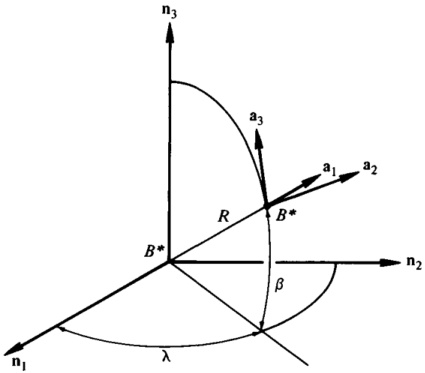{width=48%} 图2.16.2

参考系 $N$ 中，可以这样定义 $\widetilde{\mathbf{F}}$：设 $\mathbf{a}_1$、$\mathbf{a}_2$、$\mathbf{a}_3$ 是相互垂直的单位向量，分别指向当 $R$、$\lambda$、$\beta$ 依次增大时，$B^*$ 运动的方向。定义 $I_{jk}$ 为

$$
{ \boldsymbol { I } } _ { j k } \triangleq { \boldsymbol { a } } _ { j } \cdot { \boldsymbol { \mathbf { I } } } \cdot { \boldsymbol { \mathbf { a } } } _ { k }  ( j , \, k = 1 , \, 2 , \, 3 )
$$

并且 $Q_{ij}$（$i,j=1,2,3$）以及 $\widetilde{V}^*(R,\lambda,\beta)$ 分别为

$$
{ \cal Q } _ { 11 } \; \triangleq \; \frac { \partial ^{2} V ^{*} } { \partial R ^{2} }
$$

$$
Q _ { 22 } \triangleq \frac { 1 } { R } \, \frac { \partial V ^{*} } { \partial R } + \frac { \sec ^{2} \beta } { R ^{2} } \, \frac { \partial ^{2} V ^{*} } { \partial \lambda ^{2} } - \frac { \tan \beta } { R ^{2} } \, \frac { \partial V ^{*} } { \partial \beta }
$$

$$
Q _ { 33 } \stackrel { \Delta } { = } \frac { 1 } { R } \frac { \partial V ^{*} } { \partial R } + \frac { 1 } { R ^{2} } \frac { \partial ^{2} V ^{*} } { \partial \beta ^{2} }
$$

$$
Q _ { 12 } = Q _ { 21 } = \frac { \sec \beta } { R } \left( - \frac { 1 } { R } \frac { \partial V ^{*} } { \partial \lambda } + \frac { \partial ^{2} V ^{*} } { \partial R \, \partial \lambda } \right)
$$

$$
Q _ { 23 } = Q _ { 32 } = \frac { \sec \beta } { R ^{2} } \left( \tan \beta \, \frac { \partial V ^{*} } { \partial \lambda } + \frac { \partial ^{2} V ^{*} } { \partial \beta \, \partial \lambda } \right)
$$

$$
Q _ { 31 } = Q _ { 13 } = \frac { 1 } { R } \left( - \frac { 1 } { R } \frac { \partial V ^{*} } { \partial \beta } + \frac { \partial ^{2} V ^{*} } { \partial R \, \partial \beta } \right)
$$

且

$$
\begin{array}{r} { \widetilde { V } ^{*} ( R , \, \lambda , \, \beta ) \triangleq m V ^{*} - \frac { 1 } { 2 } \left( I _ { 11 } Q _ { 11 } + I _ { 22 } Q _ { 22 } + I _ { 33 } Q _ { 33 } \right) } \\{ - \left( I _ { 12 } Q _ { 12 } + I _ { 23 } Q _ { 23 } + I _ { 31 } Q _ { 31 } \right) + C } \end{array}
$$

 ---------------------------------------------[ 第168页 ]---------------------------------------------  

然后

$$
\widetilde { \mathbf { F } } = a _ { 1 } \, \frac { \partial \widetilde { V } ^{*} } { \partial R } + a _ { 2 } \frac { \sec \beta } { R } \, \frac { \partial \widetilde { V } ^{*} } { \partial \lambda } + a _ { 3 } \frac { 1 } { R } \, \frac { \partial \widetilde { V } ^{*} } { \partial \beta }
$$

为了验证式（24）的正确性，有必要注意到，在 $N$ 中，$\mathbf{a}_1$、$\mathbf{a}_2$、$\mathbf{a}_3$ 对 $R$、$\lambda$、$\beta$ 的偏导数分别为

$$
\left[ \begin{array}{lll} { { \frac { \partial \mathbf { a } _ { 1 } } { \partial R } } } & { { \frac { \partial \mathbf { a } _ { 1 } } { \partial \lambda } } } & { { \frac { \partial \mathbf { a } _ { 1 } } { \partial \beta } } } \\{ { \frac { \partial \mathbf { a } _ { 2 } } { \partial R } } } & { { \frac { \partial \mathbf { a } _ { 2 } } { \partial \lambda } } } & { { \frac { \partial \mathbf { a } _ { 2 } } { \partial \beta } } } \\{ { \frac { \partial \mathbf { a } _ { 3 } } { \partial R } } } & { { \frac { \partial \mathbf { a } _ { 3 } } { \partial \lambda } } } & { { \frac { \partial \mathbf { a } _ { 3 } } { \partial \beta } } } \end{array} \right] = \left[ \begin{array}{lll} { { 0 } } & { { c \beta \ \mathbf { a } _ { 2 } } } & { { \mathbf { a } _ { 3 } } } \\{ { 0 } } & { { - c \beta \ \mathbf { a } _ { 1 } + \ s \beta \ \mathbf { a } _ { 3 } } } & { { 0 } } \\{ { 0 } } & { { - s \beta \ \mathbf { a } _ { 2 } } } & { { - \mathbf { a } _ { 1 } } } \end{array} \right]
$$

此外，按照第 2.9 节中的示例步骤进行操作，可以验证：若 $V(\mathbf{R}) = V^*(R, \lambda, \beta)$，则

$$
\nabla V ( \mathbf { R } ) = \mathbf { a } _ { 1 } \, \frac { \partial V ^{*} } { \partial R } + \mathbf { a } _ { 2 } \, \frac { 1 } { R \, c \beta } \, \frac { \partial V ^{*} } { \partial \lambda } + \mathbf { a } _ { 3 } \, \frac { 1 } { R } \, \frac { \partial V ^{*} } { \partial \beta }
$$

再次对 $R$ 求导，并利用式（25），我们得到

$$
\nabla \nabla V ( \mathbf { R } ) = \sum _ { i = 1 } ^{3} \sum _ { j = 1 } ^{3} Q _ { i j } \mathbf { a } _ { i } \mathbf { a } _ { j }
$$

同样地，惯性二阶张量 $I$ 可以表示为

$$
\mathbf { I } = \sum _ { ( 16 ) } ^{3} \sum _ { j = 1 } ^{3} \sum _ { k = 1 } ^{3} I _ { j k } \mathbf { a } _ { j } \mathbf { a } _ { k }
$$

因此，

$$
\begin{array}{rl} { \mathbf { I } : \nabla \nabla V ( \mathbf { R } ) } & { = \mathbf { I } _ { 11 } Q _ { 11 } + \mathbf { I } _ { 22 } Q _ { 22 } + \mathbf { I } _ { 33 } Q _ { 33 } } \\& {  + \ 2 ( \mathbf { I } _ { 12 } Q _ { 12 } + \mathbf { I } _ { 23 } Q _ { 23 } + \mathbf { I } _ { 31 } Q _ { 31 } ) } \end{array}
$$

将 $V^*$ 替换为 $V(\mathbb{R})$，由此从式（2）中获得

$$
\begin{aligned} \widetilde { V } ( \mathbf { R } ) & = m V ^{*} - \frac { 1 } { 2 } ( I _ { 11 } Q _ { 11 } + I _ { 22 } Q _ { 22 } + I _ { 33 } Q _ { 33 } ) \\& - \left( I _ { 12 } Q _ { 12 } + I _ { 23 } Q _ { 23 } + I _ { 31 } Q _ { 31 } \right) + C \end{aligned}
$$

此外，将 $\widetilde{V}^{*}(R,\lambda,\beta)$ 定义为该等式的右端项，从而得到式（23），我们可以写出 [与式（26）相比较]

$$
\nabla \widetilde { V } ( \mathbf { R } ) = \mathbf { a } _ { 1 } \frac { \partial \widetilde { V } ^{*} } { \partial R } + \mathbf { a } _ { 2 } \frac { \sec \beta } { R } \frac { \partial \widetilde { V } ^{*} } { \partial \lambda } + \mathbf { a } _ { 3 } \frac { \partial \widetilde { V } ^{*} } { \partial \beta }
$$

将上述结果代入式（1），即可得到式（24）。

 ---------------------------------------------[ 第169页 ]---------------------------------------------  

2.17　用于描述粒子对物体施加力的力函数表达式

力函数（详见第2.10至2.16节）可与引力矩相结合使用。对于粒子与（不一定刚性）物体之间的相互作用，由式（2.6.1）给出的力矩M可以表示为

$$
\mathbf { M } = - \mathbf { R } \times \nabla V
$$

其中，$V(\mathbf{R})$ 由式（2.11.2）或式（2.11.5）给出，且 $\nabla V \triangleq \nabla_{\mathbf{R}} V$；或者，若 $W$ 定义为 $W(\mathbf{a}_{1}, R) \triangleq V[\mathbf{R}(\mathbf{a}_{1}, R)]$，则 $\mathbf{M}$ 也可表示为

$$
\mathbf { M } = - \mathbf { a } _ { 1 } \times { \frac { \partial W } { \partial \mathbf { a } _ { 1 } } }
$$

同样地，对于式（2.6.3）中定义的 $\tilde{\mathbf{M}}$，我们可以写出

$$
\widetilde { \mathbf { M } } = - \mathbf { R } \times \nabla \widetilde { V }
$$

其中，$\widetilde{V}$ 由式（2.12.13）给出；或者，$\widetilde{M}$ 可以表示为

$$
\widetilde { \mathbf { M } } = - \mathbf { a } _ { 1 } \times \frac { \partial \widetilde { W } } { \partial \mathbf { a } _ { 1 } }
$$

其中，$\widetilde{W}$ 是一个关于 $\mathbf{a}_{1}$ 和 $R$ 的函数，其定义基于 $B$ 关于连接 $P$ 与 $B^{*}$ 直线的转动惯量 $I_{11}$，即

$$
\widetilde{W} \triangleq - \frac { 3 G \overline { { { m } } } I _ { 11 } } { 2 R ^{3} } + C
$$

推导过程：式（1）是通过将式（2.11.1）代入式（2.6.1）得到的；若进一步利用式（2.9.13），即可得出式（2）。

参考式（2.3.6）和式（2.3.3），我们可以写出

$$
- R a _ { 1 } \times \widetilde { \mathbf { F } } = \frac { 3 G \overline { { { m } } } } { R ^{3} } \mathbf { a } _ { 1 } \times \mathbf { I } \cdot \mathbf { a } _ { 1 } = \widetilde { \mathbf { M } }
$$

并替换 $Ra_{1}$ 为 $\mathbf{R}$，随后借助式（2.12.12），消去 $\widetilde{\mathbf{F}}$，即可得到式（3）。

若 $\tilde{W}$ 定义为

$$
\widetilde { W } \left( \mathbf { a } _ { 1 } , R \right) \triangleq \widetilde { V } \left[ \mathbf { R } \left( \mathbf { a } _ { 1 } , R \right) \right]
$$

则

$$
\widetilde { \widetilde { W } } _ { ( 2 . 12 . 13 ) } \, \frac { G \overline { { { m } } } m } { R } \left\{ 1 + \frac { 1 } { 2 m R ^{2} } \left[ \mathrm { t r } ( \mathbf { I } ) - 3 I _ { 11 } \right] \right\} + C
$$

以及

$$
\mathbf { R } \times \nabla \widetilde { V } _ { \mathrm { \scriptsize ~ ( 2 . 9 . 13 ) } } = \mathbf { a } _ { 1 } \times \frac { \partial \widetilde { W } } { \partial \mathbf { a } _ { 1 } } = \mathbf { a } _ { 1 } \times \frac { \partial } { \partial \mathbf { a } _ { 1 } } \bigg ( \frac { G \overline { { { m } } } m } { R } \bigg \{ 1 + \frac { 1 } { 2 m R ^{2} } [ \mathrm { t r } ( \mathbf { I } ) - 3 I _ { 11 } ] \bigg \} + C \bigg )
$$

 ---------------------------------------------[ 第170页 ]---------------------------------------------  

或者，由于 tr(I) 与 $a_{1}$ 无关，

$$
\mathbf { R } \times \nabla \widetilde { V } = \mathbf { a } _ { 1 } \times \frac { \partial } { \partial \mathbf { a } _ { 1 } } \left( - \frac { 3 G \overline { { m } } \, I _ { 11 } } { 2 R ^{3} } + C \right) = \mathbf { a } _ { 1 } \times \frac { \partial \widetilde { W } } { \partial \mathbf { a } _ { 1 } }
$$

因此，

$$
\widetilde { \mathbf { M } } _ { ( 3 ) } = - \mathbf { a } _ { 1 } \times \frac { \partial \widetilde { W } } { \partial \mathbf { a } _ { 1 } }
$$

与式（4）一致。

示例：如图2.17.1所示，$\mathbf{a}_{1}$、$\mathbf{a}_{2}$、$\mathbf{a}_{3}$ 以及 $\mathbf{b}_{1}$、$\mathbf{b}_{2}$、$\mathbf{b}_{3}$ 构成一组右手系的正交单位向量；$\overline{P}$ 是一个质量为 $\overline{m}$ 的粒子，而 $B$ 是一个质量为 $m$ 的刚体。单位向量 $\mathbf{a}_{1}$ 被选定，使得 $B$ 的质心 $B^{*}$ 相对于 $\overline{P}$ 的位置向量 $\mathbf{R}$ 可以表示为 $\mathbf{R} = R\mathbf{a}_{1}$；而 $\mathbf{b}_{1}$、$\mathbf{b}_{2}$、$\mathbf{b}_{3}$ 则固定在 $B$ 中。

若 $\theta_{1}$、$\theta_{2}$、$\theta_{3}$ 分别为 $B$ 在参考框架中的两个姿态角（参见第1.7节），且 $\mathbf{a}_{1}$、$\mathbf{a}_{2}$、$\mathbf{a}_{3}$ 保持固定，则可以将 $\mathbf{R}$ 表示为

$$
\mathbf { R } ( R , \theta _ { 1 } , \theta _ { 2 } , \, \theta _ { 3 } ) \, = \, R \, ( \mathbf { c } _ { 2 } \, \mathbf { b } _ { 1 } \, + \, \mathbf { s } _ { 2 } \mathbf { s } _ { 3 } \, \mathbf { b } _ { 2 } \, + \, \mathbf { s } _ { 2 } \mathbf { c } _ { 3 } \, \mathbf { b } _ { 3 } )
$$

若已知引力作用于B的力函数 $V(\mathbf{R})$，则可定义一个函数 $W(R,\theta_{1},\theta_{2},\theta_{3})$ 为

$$
W ( R , \theta _ { 1 } , \theta _ { 2 } , \theta _ { 3 } ) \triangleq V \left[ R ( R , \theta _ { 2 } , \theta _ { 3 } ) \right]
$$

则$\overline{P}$对B施加的力矩 $\mathbf{M}$ 关于 $B^{*}$ 的作用力，可通过如下步骤，用 $W$ 对 $\theta_{2}$ 和 $\theta_{3}$ 的偏导数来表示。

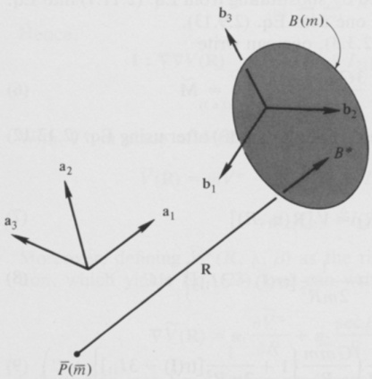{width=47%} 图2.17.1

 ---------------------------------------------[ 第171页 ]---------------------------------------------  

在B中，对R进行关于R、$\theta_2$ 和 $\theta_3$ 的偏导数运算，可得

$$
\frac { \partial \mathbf { R } } { \partial R } \stackrel { ( 12 ) } { = } c _ { 2 } \mathbf { b } _ { 1 } + s _ { 2 } s _ { 3 } \mathbf { b } _ { 2 } + s _ { 2 } c _ { 3 } \mathbf { b } _ { 3 }
$$

$$
\frac { \partial \mathbf { R } } { \partial \theta _ { 2 } } \; \; \; \; = \; \; R \left( \; - \; s _ { 2 } \mathbf { b } _ { 1 } \; + \; c _ { 2 } s _ { 3 } \mathbf { b } _ { 2 } \; + \; c _ { 2 } c _ { 3 } \mathbf { b } _ { 3 } \right)
$$

$$
\frac { \partial \mathbf { R } } { \partial \theta _ { 3 } } \; \; \; \; ( 12 ) \; \; = \; \; R \left( \mathbf { S } _ { 2 } \mathbf { C } _ { 3 } \; \mathbf { b } _ { 1 } \; - \; \mathbf { S } _ { 2 } \mathbf { S } _ { 3 } \; \mathbf { b } _ { 3 } \right)
$$

根据式（2.9.6），

$$
{ \frac { \partial W } { \partial R } } = \nabla V \cdot { \frac { \partial \mathbf { R } } { \partial R } } \ { \stackrel { ( 14 ) } { = } } \ \mathbf { c } _ { 2 } \nabla V \cdot \ \mathbf { b } _ { 1 } + \mathbf { s } _ { 2 } \mathbf { s } _ { 3 } \nabla V \cdot \ \mathbf { b } _ { 2 } + \mathbf { s } _ { 2 } \mathbf { c } _ { 3 } \nabla V \cdot \ \mathbf { b } _ { 3 }
$$

$$
\frac { \partial W } { \partial \theta _ { 2 } } = \nabla V \cdot \frac { \partial \mathbf { R } } { \partial \theta _ { 2 } } = R \left( - s _ { 2 } \nabla V \cdot \mathbf { b } _ { 1 } + c _ { 2 } s _ { 3 } \nabla V \cdot \mathbf { b } _ { 2 } + c _ { 2 } c _ { 3 } \nabla V \cdot \mathbf { b } _ { 3 } \right)
$$

$$
\frac { \partial W } { \partial \theta _ { 3 } } = \nabla V \cdot \frac { \partial \mathbf { R } } { \partial \theta _ { 3 } } \stackrel { ( 16 ) } { = } R \left( \mathbf { s } _ { 2 } \mathbf { c } _ { 3 } \nabla V \cdot \mathbf { b } _ { 2 } - \mathbf { s } _ { 2 } \mathbf { s } _ { 3 } \nabla V \cdot \mathbf { b } _ { 3 } \right)
$$

式（17）至式（19）可用来求解点积 $\nabla V \cdot \mathbf{b}_1$、$\nabla V \cdot \mathbf{b}_2$、$\nabla V \cdot \mathbf{b}_3$；随后，$\nabla V$ 可被表示为

$$
\begin{aligned} \nabla V & = \nabla V \cdot \mathbf { b } _ { 1 } \mathbf { b } _ { 1 } + \nabla V \cdot \mathbf { b } _ { 2 } \mathbf { b } _ { 2 } + \nabla V \cdot \mathbf { b } _ { 3 } \mathbf { b } _ { 3 } \\& = \left( \frac { \partial W } { \partial R } \, \mathbf { c } _ { 2 } - \frac { 1 } { R } \, \frac { \partial W } { \partial \theta _ { 2 } } \, \mathbf { s } _ { 2 } \right) \mathbf { b } _ { 1 } + \left( \frac { \partial W } { \partial R } \, \mathbf { s } _ { 2 } \mathbf { s } _ { 3 } + \frac { 1 } { R } \, \frac { \partial W } { \partial \theta _ { 2 } } \, \mathbf { c } _ { 2 } \mathbf { s } _ { 3 } + \frac { 1 } { R } \, \frac { \partial W } { \partial \theta _ { 3 } } \, \frac { \mathbf { c } _ { 3 } } { \mathbf { s } _ { 2 } } \right) \mathbf { b } _ { 2 } \\& + \left( \frac { \partial W } { \partial R } \, \mathbf { s } _ { 2 } \mathbf { c } _ { 3 } + \frac { 1 } { R } \, \frac { \partial W } { \partial \theta _ { 2 } } \, \mathbf { c } _ { 2 } \mathbf { c } _ { 3 } - \frac { 1 } { R } \, \frac { \partial W } { \partial \theta _ { 3 } } \, \frac { \mathbf { s } _ { 3 } } { \mathbf { s } _ { 2 } } \right) \mathbf { b } _ { 3 } \end{aligned}
$$

因此，

$$
\begin{array}{rl} { \mathbf { M } = } & { { } - \mathbf { R } \times \nabla V _ { \mathrm { ( 1 ) } } = \frac { \partial W } { \partial \theta _ { 3 } } \, \mathbf { b } _ { 1 } + \left( \frac { \partial W } { \partial \theta _ { 2 } } \, \mathbf { c } _ { 3 } - \frac { \partial W } { \partial \theta _ { 3 } } \, \frac { \mathbf { c } _ { 2 } \mathbf { S } _ { 3 } } { \mathbf { S } _ { 2 } } \right) \mathbf { b } _ { 2 } } \\& { { } - \left( \frac { \partial W } { \partial \theta _ { 3 } } \, \frac { \mathbf { c } _ { 2 } \mathbf { C } _ { 3 } } { \mathbf { S } _ { 2 } } + \frac { \partial W } { \partial \theta _ { 2 } } \, \mathbf { S } _ { 3 } \right) \mathbf { b } _ { 3 } } \end{array}
$$

该方程并未直接涉及 $\theta_{1}$；但以 $\mathbf{a}_{1}$、$\mathbf{a}_{2}$、$\mathbf{a}_{3}$ 为参考，而非以 $\mathbf{b}_{1}$、$\mathbf{b}_{2}$、$\mathbf{b}_{3}$ 为参考，$\mathbf{M}$ 的表达式为 [使用式（1.7.31）]

$$
{ \bf M } = \left( { \bf c } _ { 1 } \frac { \partial W } { \partial \theta _ { 2 } } + \frac { s _ { 1 } } { s _ { 2 } } \frac { \partial W } { \partial \theta _ { 3 } } \right) { \bf a } _ { 2 } + \left( s _ { 1 } \frac { \partial W } { \partial \theta _ { 2 } } - \frac { c _ { 1 } } { s _ { 2 } } \frac { \partial W } { \partial \theta _ { 3 } } \right) { \bf a } _ { 3 } .
$$

这使得 M 与 $\theta_{1}$ 的依赖关系得以清晰显现。

 ---------------------------------------------[ 第172页 ]---------------------------------------------  

# 2.18 用于描述由某物体对一小块物体施加的力矩的力函数表达式

当两物体B和$\overline{B}$的质量中心 $B^{*}$ 与 $\overline{B}^{*}$ 之间的距离超过从 $\underline{B}^{*}$ 到B上任意一点的最大距离，并且已知由$\overline{B}$对位于图2.16.1所示位置的粒子施加的力函数 $V(\mathbf{p})$ 时，那么$\overline{B}$对B施加的引力系统所产生的力矩，其大小近似为

$$
\widetilde { \mathbf { M } } = - \mathbf { I } \times \nabla \nabla V ( \mathbf { R } )
$$

其中 $\mathbf{I}$ 是B的中心惯性二元张量，$\mathbf{R}$ 是B$^*$ 相对于$\overline{B}^*$ 的位置向量，而 $\nabla$ 表示对 $\mathbf{R}$ 的求导。†

推导过程：由$\overline{B}$对B施加的引力系统所产生的力矩 M，其大小为

$$
\mathbf { M } = \int \mathbf { r } \times \nabla _ { \mathbf { p } } V \ \rho \ d \tau
$$

将 $\nabla_{\mathbf{p}}V$ 按照式（2.16.10）中的推导方法展开为泰勒级数，可得到

$$
\nabla _ { \mathbf { p } } V = \nabla V ( \mathbf { R } ) + \mathbf { r } \cdot \nabla \nabla V ( \mathbf { R } ) + \mathbf { \nabla \cdot \cdot \cdot \cdot }
$$

因此，仅保留那些明确显示的项，便可得出

$$
\widetilde { \mathbf { M } } _ { ( 2 ) } = \int \mathbf { r } \times \nabla V ( \mathbf { R } ) \rho \, d \tau + \int \mathbf { r } \times [ \mathbf { r } \cdot \nabla \nabla V ( \mathbf { R } ) ] \rho \, d \tau
$$

第一个积分为零，因为 r 的起点位于 $B^{*}$ 的质心处，且

$$
\mathbf { r } \times [ \mathbf { r } \cdot \nabla \nabla V ( \mathbf { R } ) ] = \mathbf { r } \mathbf { r } \times \nabla \nabla V ( \mathbf { R } )
$$

因此，

$$
\widetilde { \mathbf { M } } = \left( \int \mathbf { r r } \rho \ d \tau \right) \, \mathring { \times } \ \nabla \nabla V ( \mathbf { R } ) = \left[ \frac { 1 } { 2 } \, \mathrm { t r } ( \mathbf { I } ) \mathbf { U } - \mathbf { I } \right] \, \mathring { \times } \ \nabla \nabla V ( \mathbf { R } )
$$

然而，$\nabla\nabla V(\mathbf{R})$ 是一个对称的二阶张量，而 U 与任意对称二阶张量的叉积为零。因此，式 (6) 可以简化为式 (1)。

示例：当 $V(\mathbf{R})$ 可以用显式函数 $V^{*}(R, \lambda, \beta)$ 的形式表示时，该函数是图 2.16.2 中所示的球坐标 $R$、$\lambda$、$\beta$ 的函数。此时，可以按如下方法求得 $\widetilde{\mathbf{M}}$。

†式 (1) 中的叉积定义如下：对于两个二阶张量 $\mathbf{u}_1\mathbf{u}_2$ 和 $\mathbf{v}_1\mathbf{v}_2$，有 $(\mathbf{u}_1\mathbf{u}_2) \overset{\triangle}{\times} (\mathbf{v}_1\mathbf{v}_2) \overset{\triangle}{\equiv} (\mathbf{u}_1 \times \mathbf{v}_1)(\mathbf{u}_2 \cdot \mathbf{v}_2)$；在应用于二阶张量时，它满足分配律：$(\mathbf{a}_1\mathbf{a}_2 + \mathbf{b}_1\mathbf{b}_2 + \cdots) \overset{\times}{\times} (\mathbf{A}_1\mathbf{A}_2 + \mathbf{B}_1\mathbf{B}_2 + \cdots) = \mathbf{a}_1\mathbf{a}_2 \overset{\times}{\times} \mathbf{A}_1\mathbf{A}_2 + \mathbf{a}_1\mathbf{a}_2 \overset{\times}{\times} \mathbf{B}_1\mathbf{B}_2 + \cdots + \mathbf{b}_1\mathbf{b}_2 \overset{\times}{\times} \mathbf{A}_1\mathbf{A}_2 + \mathbf{b}_2\mathbf{b}_2 \overset{\times}{\times} \mathbf{B}_1\mathbf{B}_2 + \cdots$

 ---------------------------------------------[ 第173页 ]---------------------------------------------  

对式 (2.16.2) 进行微分，以验证

$$
\nabla \nabla V ( \mathbf { R } ) = \sum _ { i = 1 } ^{3} \sum _ { j = 1 } ^{3} Q _ { i j } \mathbf { a } _ { i } \mathbf { a } _ { j }
$$

其中 $Q_{ij}$（$i,j=1,2,3$）由式 (2.16.17)-(2.16.22) 给出。接下来，设

$$
I _ { j k } \triangleq \mathbf { a } _ { j } \cdot \mathbf { I } \cdot \mathbf { a } _ { k }  ( j , k = 1 , 2 , 3 )
$$

然后

$$
\begin{array}{rl} { \widetilde { \mathbf { M } } _ { ( 1 ) } = } & { [ I _ { 12 } Q _ { 31 } - Q _ { 12 } I _ { 31 } + ( I _ { 22 } - I _ { 33 } ) Q _ { 23 } - ( Q _ { 22 } - Q _ { 33 } ) I _ { 23 } ] \mathbf { a } _ { 1 } } \\& { + \left[ I _ { 23 } Q _ { 12 } - Q _ { 23 } I _ { 12 } + ( I _ { 33 } - I _ { 11 } ) Q _ { 31 } - ( Q _ { 33 } - Q _ { 11 } ) I _ { 31 } \right] \mathbf { a } _ { 2 } } \\& { + \left[ I _ { 31 } Q _ { 23 } - Q _ { 31 } I _ { 23 } + ( I _ { 11 } - I _ { 22 } ) Q _ { 12 } - ( Q _ { 11 } - Q _ { 22 } ) I _ { 12 } \right] \mathbf { a } _ { 3 } } \end{array}
$$

 ---------------------------------------------[ 第174页 ]---------------------------------------------  
