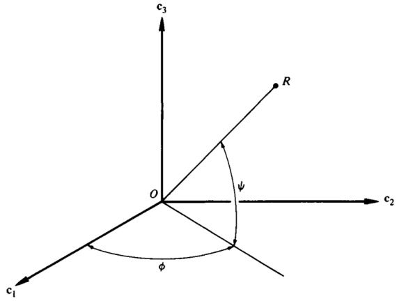

SPACECRAFTDYNAMICSThomas R. Kane, Peter W. Likins,and David A. Levinson

# Spacecraft Dynamics

Thomas R. Kane, Stanford UniversityPeter W. Likins, Lehigh UniversityDavid A. Levinson, Lockheed Palo Alto Research Laboratory

Copyright 2005 by the authors

Previously published byMcGraw-Hill Book Company, 1993

Now published byThe Internet-First University Press

This manuscript is among the initial offerings being published as part of a new approach to scholarly publishing. The manuscript is freely available from the Internet-First University Press repository within DSpace at Cornell University at: http://dspace/library.cornell.edu/handle/1813/62

The online version of this work is available on an open access basis, without fees or restrictions on personal use. A professionally printed and bound version may be purchased through Cornell Business Services by contacting:

digital@cornell.edu

All mass reproduction, even for educational or not-for-profit use, requires permission and license. For more information, please contactdcaps@cornell.edu.

Ithaca, N.Y.January 2005

ENGIN. NOV 1 1982

CORNELL UNIVERSITYLIBRARIESITHACA, N. Y. 14853

Engineering LibraryCarpenter Hall

Engineering LibraryCarpenter Hall

The equation $x^2 + y^2 = z^2$ represents a Pythagorean triple where x, y, and z are integers. This equation is fundamental in understanding right-angled triangles.

Thomas R. KaneStanford University

Peter W. LikinsLehigh University

David A. LevinsonLockheed Palo Alto Research Laboratory

# McGraw-Hill Book Company

New York St. Louis San Francisco Auckland Bogotá HamburgJohannesburg London Madrid Mexico Montreal New DelhiPanama Paris São Paulo Singapore Sydney Tokyo Toronto

This book was set in Times Roman by Andover Graphics. The editors were Diane D. Heiberg and Madelaine Eichberg; the production supervisor was Leroy A. Young. New drawings were done by Danmark & Michaels, Inc. The cover was designed by Mark Wieboldt. Halliday Lithograph Corporation was printer and binder.

# SPACECRAFT DYNAMICS

Copyright © 1983 by McGraw-Hill, Inc. All rights reserved. Printed in the United States of America. Except as permitted under the United States Copyright Act of 1976, no part of this publication may be reproduced or distributed in any form or by any means, or stored in a data base or retrieval system, without the prior written permission of the publisher.

1 2 3 4 5 6 7 8 9 0 HDHD 8 9 8 7 6 5 4 3 2

ISBN 0-07-037843-6

Library of Congress Cataloging in Publication Data

Kane, Thomas R.Spacecraft dynamics.

Includes index.

Space vehicles—Dynamics. I. Likins, Peter W.

II. Levinson, David A. III. Title.

TL1050.K36 629.47'01'53111 81-8431

ISBN 0-07-037843-6 AACR2

Preface viiTo the Reader xi

# 

apter 1 Kinematics 1

Kinematics 1

1.1 Simple Rotation 1

1.2 Direction Cosines 4

1.3 Euler Parameters 12

1.4 Rodrigues Parameters 16

1.5 Indirect Determination of Orientation 20

1.6 Successive Rotations 23

1.7 Orientation Angles 30

1.8 Small Rotations 38

1.9 Screw Motion 42

1.10 Angular Velocity Matrix 47

1.11 Angular Velocity Vector 49

1.12 Angular Velocity Components 53

1.13 Angular Velocity and Euler Parameters 58

1.14 Angular Velocity and Rodrigues Parameters 62

1.15 Indirect Determination of Angular Velocity 68

1.16 Auxiliary Reference Frames 71

1.17 Angular Velocity and Orientation Angles 73

1.18 Slow, Small Rotational Motions 78

1.19 Instantaneous Axis 81

1.20 Angular Acceleration 84

1.21 Partial Angular Velocities and Partial Velocities 87

# Chapter 2 Gravitational Forces

2.1 Gravitational Interaction of Two Particles2.2 Force Exerted on a Body by a Particle2.3 Force Exerted on a Small Body by a Particle2.4 Force Exerted on a Small Body by a Small Body2.5 Centrobaric Bodies2.6 Moment Exerted on a Body by a Particle2.7 Moment Exerted on a Small Body by a Small Body2.8 Proximate Bodies2.9 Differentiation with Respect to a Vector2.10 Force Function for Two Particles2.11 Force Function for a Body and a Particle2.12 Force Function for a Small Body and a Particle2.13 Force Function in Terms of Legendre Polynomials2.14 Force Function for Two Small Bodies2.15 Force Function for a Centrobaric Body2.16 Force Function for a Body and a Small Body2.17 Force Function Expressions for the Moment Exerted on a Body by a Particle2.18 Force Function Expression for the Moment Exerted on a Small Body by a Body

# Chapter 3 Simple Spacecraft

3.1 Rotational Motion of a Torque-Free, Axisymmetric Rigid Body

3.2 Effect of a Gravitational Moment on an Axisymmetric Rigid Body in a Circular Orbit

3.3 Influence of Orbit Eccentricity on the Rotational Motion of an Axisymmetric Rigid Body

3.4 Torque-Free Motion of an Unsymmetric Rigid Body

3.5 Effect of a Gravitational Moment on an Unsymmetric Rigid Body in a Circular Orbit

3.6 Angular Momentum, Inertia Torque, and Kinetic Energy of a Gyrostat

3.7 Dynamical Equations for a Simple Gyrostat

3.8 Rotational Motion of a Torque-Free, Axisymmetric Gyrostat

3.9 Reorientation of a Torque-Free Gyrostat Initially at Rest

3.10 Effect of a Gravitational Moment on an Axisymmetric Gyrostat in a Circular Orbit

3.11 Effect of a Gravitational Moment on an Unsymmetric Gyrostat in a Circular Orbit

# Chapter 4 Complex Spacecraft

4.1 Generalized Active Forces4.2 Potential Energy4.3 Generalized Inertia Forces4.4 Kinetic Energy

CONTENTS v

4.5 Dynamical Equations 275

4.6 Linearized Dynamical Equations 277

4.7 Computerization of Symbol Manipulation 279

4.8 Discrete Multi-Degree-of-Freedom Systems 284

4.9 Lumped Mass Models of Spacecraft 296

4.10 Spacecraft with Continuous Elastic Components 318

4.11 Use of the Finite Element Method for the Construction of Modal Functions 332

Problem Sets 344

Problem Set 1 344

Problem Set 2 358

Problem Set 3 378

Problem Set 4 395

Appendixes 422

II Direction Cosines as Functions of Orientation Angles 422

II Kinematical Differential Equations in Terms 422

Orientation Angles 427

Index 433

,

,

,

}

PREFACE

This book is the outgrowth of courses taught at Stanford University and at the University of California, Los Angeles, and of the authors' professional activities in the field of spacecraft dynamics. It is intended both for use as a textbook in courses of instruction at the graduate level and as a reference work for engineers engaged in research, design, and development in this field. The choice and arrangement of topics was dictated by the following considerations.

The process of solving a spacecraft dynamics problem generally necessitates the construction of a mathematical model, the use of principles of mechanics to formulate equations governing the quantities appearing in the mathematical model, and the extraction of useful information from the equations. Skill in constructing mathematical models of spacecraft is acquired best through experience and cannot be transmitted easily from one individual to another, particularly by means of the printed word. Hence, this subject is not treated formally in the book. However, through examples, the reader is brought into contact with a considerable number of mathematical models of spacecraft and, by working with the book, he can gain much experience of the kind required. By way of contrast, the formulation of equations of motion is a subject that can be presented formally, and it is essential that this topic be treated effectively, for there is no point in attempting to extract information from incorrect equations of motion. Now, every spacecraft dynamics analysis necessitates use of various kinematical relationships, some of which have played such a small role in the development of technology prior to the space age that they have been treated only cursorily, if at all, in the general mechanics literature. Accordingly, the book begins with what is meant

to be a unified, modern treatment of the kinematical ideas that are most useful in dealing with spacecraft dynamics problems.

To place the topics to be treated in the book into perspective, we turn to the familiar relationship $F=ma$, here regarding it as a conceptual guideline rather than as the statement of a law of physics. Seen in this light, the $a$ represents all kinematical quantities, the $F$ all forces that come into play, the $m$ all inertia properties, and the sign of equality the assertion that kinematical quantities, forces, and inertia properties are related to each other. It is then clear that one should deal with the topics of kinematics, forces, and inertia properties before taking up the study of a technique for formulating equations of motion.

The subject of inertia properties, that is, the finding of mass centers, moments and products of inertia, principal axes of inertia, and so on, is treated extensively in available textbooks and acquires no new facets in connection with spacecraft. Hence, we presume that the reader knows this material. Detailed information regarding forces that affect the behavior of spacecraft is not so readily accessible. Therefore, we address this topic in Chapter 2, confining attention to gravitational forces, which play a preeminent role in spacecraft dynamics. This brings us into position to attack specific problems in Chapters 3 and 4, these chapters differing from each other in one important respect: throughout Chapter 3, which deals with relatively simple spacecraft, we rely solely upon the angular momentum principle for the formulation of dynamical equations of motion, whereas in Chapter 4, where we are concerned with complex spacecraft, we first develop and then use a more powerful method for formulating equations of motion, one that is particularly well suited for problems involving multi-degrees-of-freedom spacecraft.

Most sections of the book are arranged as follows. They begin with the presentation of theoretical material in the form of categorical statements that either constitute definitions or that can be shown to be valid by means of deductive arguments. In the latter case, the arguments are presented under the heading "Derivations"; each section contains, in addition, an example in the application of the theory set forth in the section. In the classroom, an instructor can, therefore, focus attention wherever he pleases, that is, on the presentation of theory, on formal proofs, or on examples, leaving it to his students to devote time outside of the classroom to the matters not pursued in depth in class.

In addition to the examples appearing in the text, the book contains four sets of problems, each set associated intimately with one of the four chapters. To acquire mastery of the material in the book, a student should solve every one of these problems, for each covers material not covered by any other. Results are given wherever possible, so that one always can determine whether or not one has solved a problem correctly.

To cover all of the material in the book is rather difficult in the time generally available in a graduate curriculum. However, the material lends itself well to presentation in two courses dealing, respectively, with Sections

PREFACE ix

1.1-1.20, 2.1-2.8, 3.1-3.11, and Sections 1.21, 2.9-2.18, and 4.1-4.11. The first course, covering kinematical fundamentals, the vectorial treatment of gravitational forces and moments, and simple spacecraft, can prepare a student to work effectively on spacecraft dynamics problems and to pursue further studies in this field; successful completion of the second course, which concentrates upon new kinematical ideas, gravitational potential theory, a new approach to the formulation of equations of motion, and complex spacecraft problems, enables one to undertake work at the forefront of spacecraft dynamics.

The use of computers in the solution of spacecraft dynamics problems is so pervasive that familiarity of a worker in this field with programming concepts must be presumed. The writing and running of computer programs are meant to take place in connection with courses based on this book, but are not absolutely essential; that is, most problems are set up in such a way that considerable benefit can be obtained by studying them even without the aid of a computer.

Since it was our intention to produce a self-contained book, we have omitted all references to the extensive literature on spacecraft dynamics. However, we gratefully acknowledge our debt to the many authors whose work has influenced our thinking, and we wish to express our thanks to students who, with comments and suggestions, have aided us in writing this book, as well as to Stanford University and the University of California at Los Angeles, which supported this undertaking by generously making time and computational resources available to us.

Thomas R. KanePeter W. LikinsDavid A. Levinson

TO THE READER

Each of the four chapters of this book is divided into sections. A section is identified by two numbers separated by a decimal point, the first number referring to the chapter in which the section appears, and the second identifying the section within the chapter. Thus, the identifier 2.13 refers to the thirteenth section of the second chapter. A section identifier appears at the top of each page.

Equations are numbered serially within sections. For example, the equations in Secs. 2.12 and 2.13 are numbered (1)-(46) and (1)-(31), respectively. References to an equation may be made both within the section in which the equation appears and in other sections. In the first case, the equation number is cited as a single number, whereas, in the second case, the section number is included as part of a three-number designation. Thus, within Sec. 2.12, Eq. (1) of Sec. 2.12 is referred to as Eq. (1), whereas, in Sec. 2.13, the same equation is referred to as Eq. (2.12.1). To locate an equation cited in this manner, one may make use of the section identifiers appearing at the tops of the pages.

Figures appearing in the chapters are numbered so as to identify the sections in which the figures appear. For example, the two figures in Sec. 3.9 are designated Fig. 3.9.1 and Fig. 3.9.2. To avoid confusion of these figures with those in problem sets, the figure number is preceded by the letter P in the case of the latter; the double number that follows this letter refers to the problem statement in which the figure is introduced. For example, Fig. P3.8 is introduced in Prob. 3.8. Similarly, Table 1.15.2 is the designation for a table in Sec. 1.15, whereas Table P1.21 is associated with Prob. 1.21.

Thomas R. KanePeter W. LikinsDavid A. Levinson

CHAPTERONEKINEMATICSEvery spacecraft dynamics problem involves considerations of kinematics. Indeed, the solution of most such problems begins with the formulation of kinematical relationships. Hence, this topic requires detailed attention.

The first nine sections of this chapter deal with changes in the orientation of a rigid body in a reference frame, without regard to the time that necessarily elapses when a real body experiences a change in orientation. Time enters the discussion in the remaining sections, in all of which the concept of angular velocity plays a central role. The concluding section contains the definitions of quantities employed to great advantage, in Chap. 4, in connection with the formulation of dynamical equations of motion of complex spacecraft. This section (and Probs. 1.27-1.31) may be omitted by readers concerned primarily with simple spacecraft, such as those treated in Chap. 3.

1.1 SIMPLE ROTATION

A motion of a rigid body or reference frame $B$ relative to a rigid body or reference frame $A$ is called a simple rotation of $B$ in $A$ if there exists a line $L$, called an axis of rotation, whose orientation relative to both $A$ and $B$ remains unaltered throughout the motion. This sort of motion is important because, as will be shown in Sec. 1.3, every change in the relative orientation of $A$ and $B$ can be produced by means of a simple rotation of $B$ in $A$.

If a is any vector fixed in $A$ (see Fig. 1.1.1), and $b$ is a vector fixed in $B$ and equal to a prior to the motion of $B$ in $A$, then, when $B$ has performed a simple rotation in $A$, $\mathbf{b}$ can be expressed in terms of the vector $\mathbf{a}$, a unit vector $\lambda$ parallel to $L$, and the radian measure $\theta$ of the angle between two lines, $L_{A}$ and $L_{B}$, which are fixed in $A$ and $B$, respectively, are perpendicular to $L$, and are parallel to each other initially. Specifically, if $\theta$ is regarded as

Figure 1.1

Figure 1.1.1

positive when the angle between $L_{A}$ and $L_{B}$ is generated by a $\lambda$-rotation of $L_{B}$ relative to $L_{A}$, that is, by a rotation during which a right-handed screw fixed in $B$ with its axis parallel to $\lambda$ advances in the direction of $\lambda$ when $B$ rotates relative to $A$, then

$\mathbf{b}=\mathbf{a} \cos \theta-\mathbf{a} \times \lambda \sin \theta+\mathbf{a} \cdot \lambda \lambda(1-\cos \theta)$

Equivalently, if a dyadic $\mathbf{C}$ is defined as

$\mathbf{C} \triangleq \mathbf{U} \cos \theta-\mathbf{U} \times \lambda \sin \theta+\lambda \lambda(1-\cos \theta)$

where $\mathbf{U}$ is the unit (or identity) dyadic, then

$\mathbf{b}=\mathbf{a} \cdot \mathbf{C}$

Derivations Let $\boldsymbol{\alpha}_{1}$ and $\boldsymbol{\alpha}_{2}$ be unit vectors fixed in $A$, with $\boldsymbol{\alpha}_{1}$ parallel to $L_{A}$ and $\boldsymbol{\alpha}_{2}=\lambda \times \boldsymbol{\alpha}_{1}$; and let $\boldsymbol{\beta}_{1}$ and $\boldsymbol{\beta}_{2}$ be unit vectors fixed in $B$, with $\boldsymbol{\beta}_{1}$ parallel to $L_{B}$ and $\boldsymbol{\beta}_{2}=\lambda \times \boldsymbol{\beta}_{1}$, as shown in Fig. 1.1.1. Then, if $\mathbf{a}$ and $\mathbf{b}$ are resolved into components parallel to $\boldsymbol{\alpha}_{1}$, $\boldsymbol{\alpha}_{2}$, $\lambda$ and $\boldsymbol{\beta}_{1}$, $\boldsymbol{\beta}_{2}$, $\lambda$, respectively, corresponding coefficients are equal to each other because $\boldsymbol{\alpha}_{1}=\boldsymbol{\beta}_{1}$, $\boldsymbol{\alpha}_{2}=\boldsymbol{\beta}_{2}$, and $\mathbf{a}=\mathbf{b}$ when $\theta=0$. In other words, $\mathbf{a}$ and $\mathbf{b}$ can be expressed as

$\mathbf{a}=\boldsymbol{p} \boldsymbol{\alpha}_{1}+q \boldsymbol{\alpha}_{2}+r \boldsymbol{\lambda}$

and

$\mathbf{b}=\boldsymbol{p} \boldsymbol{\beta}_{1}+q \boldsymbol{\beta}_{2}+r \boldsymbol{\lambda}$

Expressed in terms of $\boldsymbol{\alpha}_{1}$ and $\boldsymbol{\alpha}_{2}$, the unit vectors $\boldsymbol{\beta}_{1}$ and $\boldsymbol{\beta}_{2}$ are given by

$\boldsymbol{\beta}_{1}=\cos \theta \boldsymbol{\alpha}_{1}+\sin \theta \boldsymbol{\alpha}_{2}$

$\boldsymbol{\beta}_{1}=\cos \theta \boldsymbol{\alpha}_{1}+\sin \theta \boldsymbol{\alpha}_{2}$

{width=56%} Figure 1.1.2

and

$$
\beta _ { 2 } = \mathrm { ~ - ~ } \sin \theta \, \alpha _ { 1 } + \cos \theta \, \alpha _ { 2 }
$$

so that, substituting into Eq. (5), one finds that

$$
\mathbf { b } = ( p \ \cos \theta - q \ \sin \theta ) \alpha _ { 1 } + ( p \ \sin \theta + q \ \cos \theta ) \alpha _ { 2 } + r \lambda
$$

The right-hand member of Eq. (8) is precisely what one obtains by carrying out the operations indicated in the right-hand member of Eq. (1), using Eq. (4), and making use of the relationships $\lambda \times \alpha_{1} = \alpha_{2}$ and $\lambda \times \alpha_{2} = -\alpha_{1}$. Thus the validity of Eq. (1) is established, and Eq. (3) follows directly from Eqs. (1) and (2).

Example A rectangular block $B$ having the dimensions shown in Fig. 1.1.2 forms a portion of an antenna structure mounted in a spacecraft $A$. This block is subjected to a simple rotation in $A$ about a diagonal of one face of $B$, the sense and amount of the rotation being those indicated in the sketch. The angle $\phi$ between the line $OP$ in its initial and final positions is to be determined.

If $\mathbf{a}_1$, $\mathbf{a}_2$, and $\mathbf{a}_3$ are unit vectors fixed in $A$ and parallel to the edges of $B$ prior to $B$'s rotation, then a unit vector $\lambda$ directed as shown in the sketch can be expressed as

$$
\lambda = \frac { 3 a _ { 2 } + 4 a _ { 3 } } { 5 }
$$

And if a denotes the position vector of $P$ relative to $O$ prior to $B$'s rotation, then

$$
a = - 2 a _ { 1 } + 4 a _ { 3 }
$$

$$
a \times \lambda = \frac { - 12 a _ { 1 } + 8 a _ { 2 } - 6 a _ { 3 } } { 5 }
$$

and

$$
a \cdot \lambda \lambda = \frac { 48 a _ { 2 } + 64 a _ { 3 } } { 25 }
$$

Consequently, if b is the position vector of $P$ relative to $O$ subsequent to $B$'s rotation,†

$$
\begin{array}{rl} { \mathbf { b } = } & { { } ( - 2 \mathbf { a } _ { 1 } + 4 \mathbf { a } _ { 3 } ) \cos { \frac { \pi } { 6 } } + { \frac { 12 \mathbf { a } _ { 1 } - 8 \mathbf { a } _ { 2 } + 6 \mathbf { a } _ { 3 } } { 5 } } \sin { \frac { \pi } { 6 } } } \\{ } & { { } + { \frac { 48 \mathbf { a } _ { 2 } + 64 \mathbf { a } _ { 3 } } { 25 } } \left( 1 - \cos { \frac { \pi } { 6 } } \right) } \\{ = } & { { } - 0 . 53 2 \mathbf { a } _ { 1 } - 0 . 54 3 \mathbf { a } _ { 2 } + 4 . 40 7 \mathbf { a } _ { 3 } } \end{array}
$$

Since $\phi$ is the angle between a and b,

$$
\cos \phi = { \frac { \mathrm { a } \cdot \mathrm { b } } { | \mathrm { a } | | \mathrm { b } | } }
$$

where $|\mathbf{a}|$ and $|\mathbf{b}|$ denote the (equal) magnitudes of $\mathbf{a}$ and $\mathbf{b}$. Hence

$$
\cos \phi = \frac { ( - 2 ) ( - 0 . 53 2 ) + 4 ( 4 . 40 7 ) } { ( 4 + 16 ) ^{1 / 2} ( 4 + 16 ) ^{1 / 2} } = 0 . 93 5
$$

and $\phi = 20.77^{\circ}$.

# 1.2 DIRECTION COSINES

If $\mathbf{a}_1$, $\mathbf{a}_2$, $\mathbf{a}_3$ and $\mathbf{b}_1$, $\mathbf{b}_2$, $\mathbf{b}_3$ are two dextral sets of orthogonal unit vectors, and nine quantities $C_{ij}$ ($i,j=1,2,3$), called direction cosines, are defined as

$$
C _ { i j } \triangleq \mathbf { a } _ { i } \cdot \mathbf { b } _ { j }  ( i , j = 1 , 2 , 3 )
$$

then the two row matrices [a₁ a₂ a₃] and [b₁ b₂ b₃] are related to each other as follows:

$$
\begin{bmatrix}\mathbf{b}_1&\mathbf{b}_2&\mathbf{b}_3\end{bmatrix}=\begin{bmatrix}\mathbf{a}_1&\mathbf{a}_2&\mathbf{a}_3\end{bmatrix}C
$$

† Numbers beneath signs of equality are intended to direct attention to equations numbered correspondingly.

where $C$ is a square matrix defined as

$$
\begin{array}{rl} { C \triangleq } & { { } \left[ \begin{array}{lll} { C _ { 11 } } & { C _ { 12 } } & { C _ { 13 } } \\{ C _ { 21 } } & { C _ { 22 } } & { C _ { 23 } } \\{ C _ { 31 } } & { C _ { 32 } } & { C _ { 33 } } \end{array} \right] } \end{array}
$$

If a superscript $T$ is used to denote transposition, that is, if $C^T$ is defined as

$$
C ^{\tau} \triangleq \left[ \begin{array}{lll} { { C _ { 11 } } } & { { C _ { 21 } } } & { { C _ { 31 } } } \\{ { C _ { 12 } } } & { { C _ { 22 } } } & { { C _ { 32 } } } \\{ { C _ { 13 } } } & { { C _ { 23 } } } & { { C _ { 33 } } } \end{array} \right]
$$

then Eq. (2) can be replaced with the equivalent relationship

$$
[ \mathbf { a } _ { 1 }  \mathbf { a } _ { 2 }  \mathbf { a } _ { 3 } ] = [ \mathbf { b } _ { 1 }  \mathbf { b } _ { 2 }  \mathbf { b } _ { 3 } ] \, C ^{T}
$$

The matrix $C$, called a direction cosine matrix, can be employed to describe the relative orientation of two reference frames or rigid bodies $A$ and $B$. In that context, it can be advantageous to replace the symbol $C$ with the more elaborate symbol $^4C^B$. In view of Eqs. (2) and (5), one must then regard the interchanging of superscripts as signifying transposition; that is,

$$
{ } ^{B} C ^{A} = ( { } ^{A} C ^{B} ) ^{T}
$$

The direction cosine matrix $C$ plays a role in a number of useful relationships. For example, if $\mathbf{v}$ is any vector and ${}^{A}v_{i}$ and ${}^{B}v_{i}$ ($i = 1, 2, 3$) are defined as

$$
{ } ^{A} \nu _ { i } \triangleq \mathbf { v } \cdot \mathbf { a } _ { i }  ( i = 1 , 2 , 3 )
$$

and

$$
^ B \nu _ { i } \triangleq \mathbf { v } \cdot \mathbf { b } _ { i }  ( i = 1 , 2 , 3 )
$$

while $^{A}v$ and $^{B}v$ denote the row matrices having the elements $^{A}v_{1}$, $^{A}v_{2}$, $^{A}v_{3}$ and $^{B}v_{1}$, $^{B}v_{2}$, $^{B}v_{3}$, respectively, then

$$
B _ { V } = A _ { V } C
$$

Similarly, if $\mathbf{D}$ is any dyadic, and ${}^{A}D_{ij}$ and ${}^{B}D_{ij}$ ($i,j=1,2,3$) are defined as

$$
{ } ^{\mathbf { \nabla} } D _ { i j } \triangleq \mathbf { a } _ { i } \cdot \mathbf { D } \cdot \mathbf { a } _ { j }  ( i , j = 1 , 2 , 3 )
$$

and

$$
^{B} D _ { i j } \triangleq \mathbf { b } _ { i } \cdot \mathbf { D } \cdot \mathbf { b } _ { j }  ( i , j = 1 , 2 , 3 )
$$

while $^{4}D$ and $^{5}D$ denote square matrices having $^{4}D_{ij}$ and $^{6}D_{ij}$, respectively, as the elements in the $i$th rows and $j$th columns, then

$$
{ } ^{B} \mathbf { D } = \mathbf { C } ^{T} { } ^{A} \mathbf { D } \mathbf { C }
$$

Use of the summation convention for repeated subscripts frequently makes it possible to formulate important relationships rather concisely. For example, if $\delta_{ij}$ is defined as

6 KINEMATICS 1.2

$\delta_{ij} \triangleq 1-\frac{1}{4}(i-j)^{2}[5-(i-j)^{2}] (i, j=1,2,3)$

so that $\delta_{ij}$ is equal to unity when the subscripts have the same value, and equal to zero when the subscripts have different values, then use of the summation convention permits one to express a set of six relationships governing direction cosines as

$C_{ik} C_{jk}=\delta_{ij} (i, j=1,2,3)$

or an equivalent set as

$C_{ki} C_{kj}=\delta_{ij} (i, j=1,2,3)$

Alternatively, these relationships can be stated in matrix form as

$C C^{T}=U$

and

$C^{T} C=U$

where $U$ denotes the unit (or identity) matrix, defined as

$\begin{array}{ll}\left[1 & 0 & 0\right] \\ 0 & 1 & 0 \\ 0 & 0 & 1\end{array}$

Each element of the matrix $C$ is equal to its cofactor in the determinant of $C$; and, if $|C|$ denotes this determinant, then

$\begin{array}{ll}\left|C & U\right|=\text { 1 } \\ 0 & 1 & 0\end{array}$

$\left[0 & 0 & 1\right] \\\left|C-U\right|=\text { 1 }\end{array}$

Consequently, $C$ is an orthogonal matrix, that is, a matrix whose inverse and whose transpose are equal to each other. Moreover,

$\begin{array}{ll}\left|C-U\right|=\text { 0 }\end{array}$

Hence, unity is an eigenvalue of every direction cosine matrix. In other words, for every direction cosine matrix $C$ there exist row matrices $\left[\kappa_{1} & \kappa_{2} & \kappa_{3}\right]$, called eigenvectors, which satisfy the equation

$\begin{array}{ll}\left[\kappa_{1} & \kappa_{2} & \kappa_{3}\right] C=\left[\kappa_{1} & \kappa_{2} & \kappa_{3}\right] \\\left[\kappa_{1} & \kappa_{2} & \kappa_{3}\right] \end{array}$

Suppose now that $\mathbf{a}_{i}$ and $\mathbf{b}_{i}$ ($i=1,2,3$) are fixed in reference frames or rigid bodies $A$ and $B$, respectively, and that $B$ is subjected to a simple rotation in $A$ (see Sec. 1.1); further, that $\mathbf{a}_{i}=\mathbf{b}_{i}$ ($i=1,2,3$) prior to the rotation, that $\lambda$ and $\theta$ are defined as in Sec. 1.1, and that $\lambda_{i}$ is defined as

$\begin{array}{ll} \lambda_{i} \triangleq \lambda \cdot \mathbf{a}_{i}=\lambda \cdot \mathbf{b}_{i} & (i=1,2,3)$

$\end{array}$

Then the elements of $C$ are given by

$\begin{array}{ll} C_{11}=\cos \theta+\lambda_{1}^{2}(1-\cos \theta) & (i, j=1,2,3)$

$\end{array}$

$C_{12}=-\lambda_{3} \sin \theta+\lambda_{1} \lambda_{2}(1-\cos \theta)$

1.2 DIRECTION COSINES 7

$C_{13}=\lambda_{2}\sin\theta+\lambda_{3}\lambda_{1}(1-\cos\theta)$

$C_{21}=\lambda_{3}\sin\theta+\lambda_{1}\lambda_{2}(1-\cos\theta)$

$C_{22}=\cos\theta+\lambda_{2}^{2}(1-\cos\theta)$

$C_{31}=-\lambda_{1}\sin\theta+\lambda_{2}\lambda_{3}(1-\cos\theta)$

$C_{32}=\lambda_{1}\sin\theta+\lambda_{2}\lambda_{3}(1-\cos\theta)$

$C_{33}=\cos\theta+\lambda_{3}^{2}(1-\cos\theta)$

Equations (23)-(31) can be expressed more concisely after defining $\epsilon_{ijk}$ as

$\epsilon_{ijk}\triangleq\frac{1}{2}(i-j)(j-k)(k-i)$

$(i,j,k=1,2,3)$

(The quantity $\epsilon_{ijk}$ vanishes when two or three subscripts have the same value;

it is equal to unity when the subscripts appear in cyclic order, that is, in the order 1, 2, 3, 1, or the order 3, 1, 2; and it is equal to negative unity in all other cases.) Using the summation convention, one can then replace Eqs. (23)-(31) with

$C_{ij}=\delta_{ij}\cos\theta-\epsilon_{ijk}\lambda_{k}\sin\theta+\lambda_{i}\lambda_{j}(1-\cos\theta)$

$(i,j=1,2,3)$

Alternatively, $C_{ij}$ can be expressed in terms of the dyadic C defined in Eq. (1.1.2):

$C_{ij}=\mathbf{a}_{i}\cdot(\mathbf{a}_{j}\cdot\mathbf{C})$

$(i,j=1,2,3)$

All of these results simplify substantially when $\lambda$ is parallel to $\mathbf{a}_{i}$, and hence to $\mathbf{b}_{i}$ ($i=1,2,3$). If $C_{i}(\theta)$ denotes $C$ for $\lambda=\mathbf{a}_{i}=\mathbf{b}_{i}$, then

$C_{1}(\theta)=\begin{bmatrix}1&0&0\\0&\cos\theta&-\sin\theta\\0&\sin\theta&\cos\theta\end{bmatrix}$

$C_{2}(\theta)=\begin{bmatrix}1&0&0\\0&1&0\\-\sin\theta&0&\cos\theta\end{bmatrix}$

$C_{3}(\theta)=\begin{bmatrix}\cos\theta&-\sin\theta&0\\\sin\theta&\cos\theta&0\\0&0&1\end{bmatrix}$

It was mentioned previously that unity is an eigenvalue of every direction cosine matrix. If the elements of a direction cosine matrix $C$ are given by Eqs. (23)-(31), then the row matrix $[\lambda_{1}\ \lambda_{2}\ \lambda_{3}]$ is one of the eigenvectors corresponding to the eigenvalue unity of $C$; that is,

$\begin{bmatrix} \lambda_{1} & \lambda_{2} & \lambda_{3} \end{bmatrix}$

$C_{13}=\lambda_{2}\sin\theta+\lambda_{3}\sin\theta$

$\begin{bmatrix} \lambda_{1} & \lambda_{2} & \lambda_{3} \end{bmatrix}$

$C_{22}=\cos\theta&0&0\\0&1&0\\-\sin\theta&0&\cos\theta\end{bmatrix}$

$\begin{bmatrix} \cos\theta&-\sin\theta&0\\\sin\theta&\cos\theta&0\\0&0&1\end{bmatrix}$

$\begin{bmatrix} \lambda_{1} & \lambda_{2} & \lambda_{3} \end{bmatrix}$

$C_{13}=\lambda_{2}\sin\theta&\sin\theta$

$\begin{bmatrix} \lambda_{1} & \lambda_{2} & \lambda_{3} \end{bmatrix}$

$\begin{bmatrix} \lambda_{1} & \lambda_{2} & \lambda_{3} \end{bmatrix}$

8 KINEMATICS 1.2

Equivalently, when C is the dyadic defined in Eq. (1.1.2), then

$\lambda \cdot C = \lambda$

Derivations For any vector $\mathbf{v}$, the following is an identity:

$\mathbf{v} = (\mathbf{a}_1 \cdot \mathbf{v})\mathbf{a}_1 + (\mathbf{a}_2 \cdot \mathbf{v})\mathbf{a}_2 + (\mathbf{a}_3 \cdot \mathbf{v})\mathbf{a}_3$

Hence, letting $\mathbf{b}_1$ play the role of $\mathbf{v}$, one can express $\mathbf{b}_1$ as

$\mathbf{b}_1 = (\mathbf{a}_1 \cdot \mathbf{b}_1)\mathbf{a}_1 + (\mathbf{a}_2 \cdot \mathbf{b}_1)\mathbf{a}_2 + (\mathbf{a}_3 \cdot \mathbf{b}_1)\mathbf{a}_3$

or, by using Eq. (1), as

$\mathbf{b}_1 = C_{11}\mathbf{a}_1 + C_{21}\mathbf{a}_2 + C_{31}\mathbf{a}_3$

Similarly,

$\mathbf{b}_2 = C_{12}\mathbf{a}_1 + C_{22}\mathbf{a}_2 + C_{32}\mathbf{a}_3$

$\mathbf{b}_3 = C_{13}\mathbf{a}_1 + C_{23}\mathbf{a}_2 + C_{33}\mathbf{a}_3$

These three equations are precisely what one obtains when forming expressions for $\mathbf{b}_1$, $\mathbf{b}_2$, $\mathbf{b}_3$ in accordance with Eq. (2) and with the rules for matrix multiplication; and a similar line of reasoning leads to Eq. (5).

To see that Eq. (9) is valid one needs only to observe that

$\mathbf{b}_V_{i} = \mathbf{v} \cdot (\mathbf{a}_1 C_{1i} + \mathbf{a}_2 C_{2i} + \mathbf{a}_3 C_{3i})$

$\mathbf{v} \cdot \mathbf{a}_1 C_{1i} + \mathbf{v} \cdot \mathbf{a}_2 C_{2i} + \mathbf{v} \cdot \mathbf{a}_3 C_{3i}$

$\mathbf{v}_{(7)} = \mathbf{v}_{1} C_{1i} + \mathbf{v} \cdot \mathbf{a}_2 C_{2i} + \mathbf{v} \cdot \mathbf{a}_3 C_{3i}$

and to recall the definitions of $\mathbf{v}_V$ and $\mathbf{v}_B$. Similarly, Eq. (12) follows from

$\mathbf{B}_{D_{ij}} = (\mathbf{a}_1 C_{1i} + \mathbf{a}_2 C_{2i} + \mathbf{a}_3 C_{3i}) \cdot \mathbf{D} \cdot (\mathbf{a}_1 C_{1j} + \mathbf{a}_2 C_{2j} + \mathbf{a}_3 C_{3j})$

$\mathbf{C}_{(10)} = C_{1i} \cdot (\mathbf{A}_{D_{11}} C_{1j} + \mathbf{A}_{D_{12}} C_{2j} + \mathbf{A}_{D_{13}} C_{3j})$

$\mathbf{C}_{(10)} + C_{2i} (\mathbf{A}_{D_{21}} C_{1j} + \mathbf{A}_{D_{22}} C_{2j} + \mathbf{A}_{D_{23}} C_{3j})$

$\mathbf{C}_{(10)} + C_{3i} (\mathbf{A}_{D_{31}} C_{1j} + \mathbf{A}_{D_{32}} C_{2j} + \mathbf{A}_{D_{33}} C_{3j}$

and from the definitions of $\mathbf{A}^D$ and $\mathbf{B}^D$.

As for Eqs. (14) and (15), these are consequences of (using the summation convention)

$\mathbf{a}_i \cdot \mathbf{a}_j = C_{ik} C_{jk}$

$(i, j = 1, 2, 3)$

$\mathbf{b}_i \cdot \mathbf{b}_j = C_{ki} C_{kj}$

$(i, j = 1, 2, 3)$

respectively, because $\mathbf{a}_i \cdot \mathbf{a}_j$ is equal to unity when $i = j$, and equal to zero when $i \neq j$, and similarly for $\mathbf{b}_i \cdot \mathbf{b}_j$; and Eqs. (16) and (17) can be seen to

be equivalent to Eqs. (14) and (15), respectively, by referring to Eqs. (3), (4), and (18) when carrying out the indicated multiplications.

To verify that each element of $C$ is equal to its cofactor in the determinant of $C$, note that

$\mathbf{b}_{1}=C_{11} \mathbf{a}_{1}+C_{21} \mathbf{a}_{2}+C_{31} \mathbf{a}_{3}$

and

$\mathbf{b}_{2} \times \mathbf{b}_{3}=\left(C_{22} C_{33}-C_{32} C_{23}\right) \mathbf{a}_{1}+\left(C_{32} C_{13}-C_{12} C_{33}\right) \mathbf{a}_{2}$

$+\left(C_{12} C_{23}-C_{22} C_{13}\right) \mathbf{a}_{3}$

so that, since $\mathbf{b}_{1}=\mathbf{b}_{2} \times \mathbf{b}_{3}$ because $\mathbf{b}_{1}, \mathbf{b}_{2}, \mathbf{b}_{3}$ form a dextral set of orthogonal unit vectors,

$\begin{array}{ll}\mathbf{C}_{11}=C_{22} C_{33}-C_{32} C_{23} \\\mathbf{C}_{21}=\mathbf{C}_{32} C_{13}-C_{12} C_{33} \\\mathbf{C}_{31}=\mathbf{C}_{12} C_{23}-C_{22} C_{13} \\\mathbf{C}_{31}-\mathbf{C}_{23}-\mathbf{C}_{12} \mathbf{C}_{13} \\\mathbf{C}_{31}-\mathbf{C}_{22} \mathbf{C}_{23}-\mathbf{C}_{22} \mathbf{C}_{13} \\\mathbf{C}_{31}-\mathbf{C}_{12} \mathbf{C}_{23}-\mathbf{C}_{12} \mathbf{C}_{13} \\\mathbf{C}_{31}-\mathbf{C}_{22} \mathbf{C}_{23}-\mathbf{C}_{22} \mathbf{C}_{13} \\\mathbf{C}_{31}-\mathbf{C}_{12} \mathbf{C}_{22} \mathbf{C}_{13}+\mathbf{C}_{31} \mathbf{C}_{13} \\\mathbf{C}-\mathbf{U}\end{array}$

Thus each element in the first column of $C$ [see Eq. (3)] is seen to be equal to its cofactor in $C$; and, using the relationships $\mathbf{b}_{2}=\mathbf{b}_{3} \times \mathbf{b}_{1}$ and $\mathbf{b}_{3}=\mathbf{b}_{1} \times \mathbf{b}_{2}$, one obtains corresponding results for the elements in the second and third columns of $C$. Furthermore, expanding $C$ by cofactors of elements of the first row, and using Eq. (14) with $i=j=1$, one arrives at Eq. (19).

The determinant of $C-U$ can be expressed as

$\left|C-U\right|_{(3)}\left|C\right|+C_{11}+C_{22}+C_{33}+C_{12} C_{21}+C_{23} C_{32}+C_{31} C_{13} \\\left-\left(C_{11} C_{22}+C_{22} C_{33}+C_{33} C_{11}\right)-1\right. (54) \\\left.\left(\mathbf{C}_{11} C_{22}\right) \mathbf{C}_{33}\right|-\mathbf{C}_{11} C_{22} \mathbf{C}_{33}+C_{33} C_{11}\right)-1\right.$

Hence, replacing $C_{11}, C_{22},$ and $C_{33}$ with their respective cofactors in $|C|$, one finds that

$\left|C-U\right|=\left|C\right|-\mathbf{1}=0$

in agreement with Eq. (20); and the existence of row matrices $\left[\kappa_{1} \kappa_{2} \kappa_{3}\right]$ satisfying Eq. (21) is thus guaranteed.

The equality of $\lambda \cdot \mathbf{a}_{i}$ and $\lambda \cdot \mathbf{b}_{i}$ in Eq. (22) is a consequence of the fact that these two quantities are equal to each other prior to the rotation of $B$ relative to $A$, that is, when $\mathbf{a}_{i}=\mathbf{b}_{i}$, and that neither $\lambda \cdot \mathbf{a}_{i}$ nor $\lambda \cdot \mathbf{b}_{i}$ changes during the rotation, since, by construction, $\lambda$ is parallel to a line whose orientation in both $A$ and $B$ remains unaltered during the rotation.

With $\mathbf{a}$ and $\mathbf{b}$ replaced by $\mathbf{a}_{j}$ and $\mathbf{b}_{j}$, respectively, Eq. (1.1.3) becomes

$\mathbf{b}_{j}=\mathbf{a}_{j} \cdot \mathbf{C}$

$(i, j=1,2,3)$

Hence

Figure 1.2

Figure 1.2.1

which is Eq. (34). Moreover, substituting for $\mathbf{C}$ the expression given in Eq. (1.1.2), one finds that

$C_{ij} = \mathbf{a}_i \cdot \mathbf{a}_j \cos \theta - \mathbf{a}_i \cdot \mathbf{a}_j \times \lambda \sin \theta + \mathbf{a}_i \cdot \lambda \lambda \cdot \mathbf{a}_j (1 - \cos \theta)$

$C_{ij} = \mathbf{a}_i \cdot \mathbf{a}_j \cos \theta - \mathbf{a}_i \cdot \mathbf{a}_j \times \lambda \sin \theta + \mathbf{a}_i \cdot \lambda \lambda \cdot \mathbf{a}_j (1 - \cos \theta)$

$= \lambda \cdot \mathbf{C} \overset{(1.1.2)}{ = \lambda} \cdot \mathbf{U} \cos \theta - \lambda \times \lambda \sin \theta + \lambda^2 \lambda (1 - \cos \theta)$

$= \lambda \cos \theta + 0 + \lambda (1 - \cos \theta) = \lambda$

since $\lambda$ is a unit vector, so that $\lambda^2 \overset{\triangle}{ = \lambda} \cdot \lambda \cdot \lambda = 1$; and the equivalence of Eqs. (38) and (39) follows from Eqs. (22) and (34).

Example In Fig. 1.2.1, $B$ designates a uniform rectangular block which is part of a scanning platform mounted in a spacecraft $A$. Initially, the edges of $B$ are parallel to unit vectors $\mathbf{a}_1$, $\mathbf{a}_2$ and $\mathbf{a}_3$ which are fixed in $A$, and the platform is then subjected to a simple $90^\circ$ rotation about a diagonal of $B$, as indicated in the sketch. If $\mathbf{I}$ is the inertia dyadic of $B$ for the mass center $B^*$ of $B$, and $^A I_{ij}$ is defined as

† When it is necessary to refer to an equation from an earlier section, the section number is cited together with the equation number. For example, (1.1.2) refers to Eq. (2) in Sec. 1.1.

1.2 DIRECTION COSINES 11

$^{\Lambda}I_{ij} \triangleq \mathbf{a}_{i} \cdot \mathbf{I} \cdot \mathbf{a}_{j}$

what is the value of $^{\Lambda}I_{ij}$ ($i, j=1, 2, 3$) subsequent to the rotation?

Let $\mathbf{b}_{i}(i=1, 2, 3)$ be a unit vector fixed in $B$ and equal to $\mathbf{a}_{i}$ ($i=1, 2, 3$)

prior to the rotation; and define $^{\beta}I_{ij}$ as

$^{\beta}I_{ij} \triangleq \mathbf{b}_{i} \cdot \mathbf{I} \cdot \mathbf{b}_{j}$

$(i, j=1, 2, 3)$

Then $\mathbf{b}_{1}, \mathbf{b}_{2},$ and $\mathbf{b}_{3}$ are parallel to principal axes of inertia of $B$ for $B^{*}$,

so that

$^{\beta}I_{12}=\beta I_{21}=\beta I_{23}=\beta I_{32}=\beta I_{31}=\beta I_{13}=0$

and, if $m$ is the mass of $B$,

$^{\beta}I_{11}=\frac{m}{12}(12^{2}+3^{2})L^{2}=\frac{153}{12}mL^{2}$

$^{\beta}I_{22}=\frac{m}{12}(3^{2}+4^{2})L^{2}=\frac{25}{12}mL^{2}$

and

$^{\beta}I_{33}=\frac{m}{12}(4^{2}+12^{2})L^{2}=\frac{160}{12}mL^{2}$

Hence, if $^{\beta}I$ denotes the square matrix having $^{\beta}I_{ij}$ as the element in the

$i$th row and $j$th column, then

$^{\beta}I=\frac{mL^{2}}{12}\left[\begin{array}{lll}\begin{array}{lll}\boxed{153} & 0 & 0 \\0 & 25 & 0 \\0 & 0 & 160\end{array}\right]$

The unit vector $\lambda$ shown in Fig. 1.2.1 can be expressed as

$\lambda=\frac{4\mathbf{a}_{1}+12\mathbf{a}_{2}+3\mathbf{a}_{3}}{(4^{2}+12^{2}+3^{2})^{1/2}}=\frac{4}{13}\mathbf{a}_{1}+\frac{12}{13}\mathbf{a}_{2}+\frac{3}{13}\mathbf{a}_{3}$

Consequently, $\lambda_{1}, \lambda_{2},$ and $\lambda_{3},$ if defined as in Eq. (22), are given by

$\lambda_{1}=\frac{4}{13} \lambda_{2}=\frac{12}{13} \lambda_{3}=\frac{3}{13}$

and, with $\theta=\pi/2$ rad, Eqs. (23)-(31) lead to the following expression for

the direction cosine matrix $C$:

$C=\frac{1}{169}\left[\begin{array}{lll}16 & 9 & 168 \\87 & 144 & -16 \\-144 & 88 & 9\end{array}\right]$

$^{\beta}I_{(12)}=C^{T}A I C$

$^{\beta}I_{(12)}=C^{T}A I C$

12 KINEMATICS 1.3

and simultaneous premultiplication with $C$ and postmultiplication with $C^{T}$

gives

$C^{B}I\ C^{T}=\left.C\ C^{T}I\ C\ C^{T}=\left.U\right.I\ U=\left.4I\right.$

Consequently,

$^{A}I=\frac{mL^{2}}{12\times169\times169}$

$^{(66,69,71)}\frac{mL^{2}}{12\times169\times169}$

$=\frac{mL^{2}}{12\times169\times169}$

$^{A}I_{11}=\frac{4,557,033}{12\times169\times169}$

$^{A}I_{12}=\frac{4,557,033}{12\times169\times169}$

$^{A}I_{12}=-\frac{184,704}{12\times169\times169}$

$^{A}I_{12}=\frac{184,704}{12\times169\times169}$

and

$^{A}I_{11}=\frac{4,557,033\ mL^{2}}{12\times169\times169}$

$^{A}I_{12}=-\frac{184,704\ mL^{2}}{12\times169\times169}$

$^{A}I_{12}=\frac{184,704\ mL^{2}}{12\times169\times169}$

and so forth.

The unit vector $\lambda$ and the angle $\theta$ introduced in Sec. 1.1 can be used to associate a vector $\epsilon$, called the Euler vector, and four scalar quantities, $\epsilon_{1},\ldots,\epsilon_{4}$, called Euler parameters, with a simple rotation of a rigid body $B$ in a reference frame $A$ by letting

The unit vector $\lambda$ and the angle $\theta$ introduced in Sec. 1.1 can be used to associate a vector $\epsilon$, called the Euler vector, and four scalar quantities, $\epsilon_{1},\ldots,\epsilon_{4}$, called Euler parameters, with a simple rotation of a rigid body $B$ in a reference frame $A$ by letting

$\epsilon_{1}=\frac{\Delta}{2}\sin\frac{\theta}{2}$

$\epsilon_{4}=\epsilon\cdot\mathbf{a}_{i}=\epsilon\cdot\mathbf{b}_{i}$

$(i=1,2,3)$

and

$\epsilon_{4}=\cos\frac{\theta}{2}$

where $\mathbf{a}_{1},\mathbf{a}_{2},\mathbf{a}_{3}$ and $\mathbf{b}_{1},\mathbf{b}_{2},\mathbf{b}_{3}$ are dextral sets of orthogonal unit vectors fixed in $A$ and $B$ respectively, with $\mathbf{a}_{i}=\mathbf{b}_{i}$ ($i=1,2,3$) prior to the rotation. (Where a discussion involves more than two bodies or reference frames, notations such as $^{A}\epsilon^{B}$ and $^{A}\epsilon_{i}^{B}$ will be used.)

The Euler parameters are not independent of each other, for the sum of their squares is necessarily equal to unity:

$\epsilon_{1}^{2}+\epsilon_{2}^{2}+\epsilon_{3}^{2}+\epsilon_{4}^{2}=\epsilon^{2}+\epsilon_{4}^{2}=1$

An indication of the utility of the Euler parameters may be gleaned from

1.3 EULER PARAMETERS 13

the fact that the elements of the direction cosine matrix $C$ introduced in Sec. 1.2 assume a particularly simple and orderly form when expressed in terms of $\epsilon_1, \ldots, \epsilon_4$: If $C_{ij}$ is defined as

$C_{ij} \overset{\Delta}{=} \mathbf{a}_i \cdot \mathbf{b}_j (i, j = 1, 2, 3)$

then

$C_{11} = \epsilon_1^2 - \epsilon_2^2 - \epsilon_3^2 + \epsilon_4^2 = 1 - 2\epsilon_2^2 - 2\epsilon_3^2$

$C_{12} = 2(\epsilon_1 \, \epsilon_2 - \epsilon_3 \, \epsilon_4)$

$C_{13} = 2(\epsilon_3 \, \epsilon_1 + \epsilon_2 \, \epsilon_4)$

$C_{21} = 2(\epsilon_1 \, \epsilon_2 + \epsilon_3 \, \epsilon_4)$

$C_{22} = \epsilon_2^2 - \epsilon_3^2 - \epsilon_1^2 + \epsilon_4^2 = 1 - 2\epsilon_3^2 - 2\epsilon_1^2$

$C_{23} = 2(\epsilon_2 \, \epsilon_3 - \epsilon_1 \, \epsilon_4)$

$C_{31} = 2(\epsilon_3 \, \epsilon_1 - \epsilon_2 \, \epsilon_4)$

$C_{32} = 2(\epsilon_2 \, \epsilon_3 + \epsilon_1 \, \epsilon_4)$

$C_{33} = \epsilon_3^2 - \epsilon_1^2 - \epsilon_2^2 + \epsilon_4^2 = 1 - 2\epsilon_1^2 - 2\epsilon_2^2$

The Euler parameters can be expressed in terms of direction cosines in such a way that Eqs. (6)-(14) are satisfied identically. This is accomplished by taking

$\begin{aligned}\epsilon_1 = \frac{C_{32} - C_{23}}{4\epsilon_4} \\\epsilon_2 = \frac{C_{13} - C_{31}}{4\epsilon_4} \\\epsilon_3 = \frac{C_{21} - C_{12}}{4\epsilon_4} \\\epsilon_4 = \frac{1}{2} (1 + C_{11} + C_{22} + C_{33})^{1/2} \\\lambda = \frac{\epsilon_1 \, \mathbf{a}_1 + \epsilon_2 \, \mathbf{a}_2 + \epsilon_3 \, \mathbf{a}_3}{(\epsilon_1^2 + \epsilon_2^2 + \epsilon_3)^{1/2}} & \end{aligned}$

Since Eqs. (1) and (3) are satisfied if

$\begin{aligned}\lambda = \frac{\epsilon_1 \, \mathbf{a}_1 + \epsilon_2 \, \mathbf{a}_2 + \epsilon_3 \, \mathbf{a}_3}{(\epsilon_1^2 + \epsilon_2^2 + \epsilon_3)^{1/2}} & \end{aligned}$

and

$\begin{aligned}\theta = 2 \cos^{-1} \epsilon_4 & 0 \leq \theta \leq \pi & \end{aligned}$

one can thus find a simple rotation such that the direction cosines associated with this rotation as in Eqs. (1.2.23)-(1.2.31) are equal to corresponding ele

14 KINEMATICS 1.3

ments of any direction cosine matrix $C$ that satisfies Eq. (1.2.2). In other words, every change in the relative orientation of two rigid bodies or reference frames $A$ and $B$ can be produced by means of a simple rotation of $B$ in $A$. This proposition is known as Euler's theorem on rotation.

As an alternative to Eqs. (1.1.1) and (1.1.3), the relationship between a vector $\mathbf{a}$ fixed in a reference frame $A$ and a vector $\mathbf{b}$ fixed in a rigid body $B$ and equal to $\mathbf{a}$ prior to a simple rotation of $B$ in $A$ can be expressed in terms of $\epsilon$ and $\epsilon_4$ as

$\mathbf{b} = \mathbf{a} + 2[\epsilon_4 \epsilon \times \mathbf{a} + \epsilon \times (\epsilon \times \mathbf{a})]$

Derivations The equality of $\epsilon \cdot \mathbf{a}_i$ and $\epsilon \cdot \mathbf{b}_i$ [see Eq. (2)] follows from Eqs. (1) and (1.2.22); Eqs. (4) are consequences of Eqs. (1)–(3) and of the fact that $\lambda$ is a unit vector; and Eqs. (6)–(14) can be obtained from Eqs. (1.2.23)–(1.2.31) by replacing functions of $\theta$ with functions of $\theta/2$ and using Eq. (1.2.22) together with Eqs. (1)–(4). For example,

$\begin{aligned} & C_{11} & 2 \cos ^{2} \frac{\theta}{2} - 1 + 2 \lambda_1^2 \sin ^{2} \frac{\theta}{2} \\ & \lambda_1 \sin \frac{\theta}{2} = \lambda \cdot \mathbf{a}_1 \sin \frac{\theta}{2} \frac{1}{(1)} \epsilon \cdot \mathbf{a}_1 = \epsilon_1 \\ & \cos \frac{\theta}{2} = \epsilon_4 \end{aligned}$

while

$\begin{aligned} & C_{11} = 2 \epsilon_4^2 - 1 + 2 \epsilon_1^2 = \epsilon_1^2 - \epsilon_2^2 - \epsilon_3^2 + \epsilon_4^2 \end{aligned}$

in agreement with Eq. (6).

The validity of Eqs. (15)–(18) can be established by showing that the left-hand members of Eqs. (6)–(14) may be obtained by substituting from Eqs. (15)–(18) into the right-hand members. For example,

$\begin{aligned} & 1 - 2 \epsilon_2^2 - 2 \epsilon_3^2 \\ & 2 (1 + C_{11} + C_{22} + C_{33}) - C_{13}^2 + 2 C_{13} C_{31} - C_{31}^2 - C_{21}^2 + 2 C_{12} C_{21} - C_{12}^2 \\ & 2 (1 + C_{11} + C_{22} + C_{33}) \end{aligned}$

$\begin{aligned} & 2 (1 + C_{11} + C_{22} + C_{33}) - C_{13}^2 + 2 C_{13} C_{31} - C_{31}^2 - C_{21}^2 + 2 C_{12} C_{21} - C_{12}^2 \\ & 1 + C_{11} + C_{22} + C_{33}) \end{aligned}$

But, since each element of $C$ is equal to its cofactor in $|C|$,

$\begin{aligned} & C_{13} C_{31} = C_{11} C_{33} - C_{22} \\ & C_{12} C_{21} = C_{11} C_{22} - C_{33} \end{aligned}$

Consequently,

$$
1 - 2 \epsilon _ { 2 } ^{2} - 2 \epsilon _ { 3 } ^{2} = \frac { C _ { 11 } + C _ { 11 } \, C _ { 33 } + C _ { 11 } \, C _ { 22 } + C _ { 11 } ^{2} } { 1 + C _ { 11 } + C _ { 22 } + C _ { 33 } } = C _ { 11 }
$$

as required by Eq. (6).

To see that Eqs. (1) and (3) are satisfied if $\lambda$ and $\theta$ are given by Eqs. (19) and (20), note that

$$
\cos \frac { \theta } { 2 } \stackrel { ( 20 ) } { = } \epsilon _ { 4 }
$$

which is Eq. (3), and that

$$
\sin { \frac { \theta } { 2 } } \stackrel { ( 20 ) } { = } ( 1 - \epsilon _ { 4 } ^{2} ) ^{1 / 2} \stackrel { ( 4 ) } { = } ( \epsilon _ { 1 } ^{2} + \epsilon _ { 2 } ^{2} + \epsilon _ { 3 } ^{2} ) ^{1 / 2}
$$

so that

$$
\lambda \sin { \frac { \theta } { 2 } } \equiv \epsilon _ { 1 } \, \mathbf { a } _ { 1 } + \epsilon _ { 2 } \, \mathbf { a } _ { 2 } + \epsilon _ { 3 } \, \mathbf { a } _ { 3 } \equiv \epsilon _ { ( 2 ) }
$$

as required by Eq. (1). Finally, Eq. (1.1.1) is equivalent to

$$
\begin{array}{rl} & { \mathbf { b } = \mathbf { a } + \lambda \times \mathbf { a } \sin \theta + \lambda \times ( \lambda \times \mathbf { a } ) ( 1 - \cos \theta ) } \\& { = \mathbf { a } + 2 \epsilon \times \mathbf { a } \cos \frac { \theta } { 2 } + 2 \epsilon \times ( \epsilon \times \mathbf { a } ) = \mathbf { a } + 2 \left[ \epsilon _ { 4 } \, \epsilon \times \mathbf { a } + \epsilon \times ( \epsilon \times \mathbf { a } ) \right] } \end{array}
$$

in agreement with Eq. (21).

Example Triangle ABC in Fig. 1.3.1 can be brought into the position $A'B'C'$ by moving point $A$ to $A'$, without changing the orientation of the triangle, and then performing a simple rotation of the triangle while keeping $A$ fixed at $A'$. To find $\lambda$, a unit vector parallel to the axis of rotation, and to determine $\theta$, the associated angle of rotation, let the unit vectors $\mathbf{a}_i$ and $\mathbf{b}_i$ ($i = 1, 2, 3$) be directed as shown in Fig. 1.3.1, thus insuring that $\mathbf{a}_i = \mathbf{b}_i$ ($i = 1, 2, 3$) prior to the rotation; determine $C_{ij}$ by evaluating $\mathbf{a}_i \cdot \mathbf{b}_j$; and use Eqs. (15)-(18) to form $\epsilon_i$ ($i = 1, \ldots, 4$):

$$
\begin{aligned} \epsilon _ { 4 } & = \frac { 1 } { ( 18 ) } \frac { 1 } { 2 } \left( 1 + \mathbf { a } _ { 1 } \cdot \mathbf { b } _ { 1 } + \mathbf { a } _ { 2 } \cdot \mathbf { b } _ { 2 } + \mathbf { a } _ { 3 } \cdot \mathbf { b } _ { 3 } \right) ^{1 / 2} \\& = \frac { 1 } { 2 } \left( 1 + 0 + 0 + 0 \right) ^{1 / 2} = \frac { 1 } { 2 } \end{aligned}
$$

$$
\epsilon _ { 1 } \stackrel { ( 15 ) } { = } \frac { \mathbf { a } _ { 3 } \cdot \mathbf { b } _ { 2 } - \mathbf { a } _ { 2 } \cdot \mathbf { b } _ { 3 } } { 4 \left( \frac { 1 } { 2 } \right) } = \frac { 1 - 0 } { 2 } = \frac { 1 } { 2 }
$$

$$
\epsilon _ { 2 } = \frac { \mathbf { a } _ { 1 } \cdot \mathbf { b } _ { 3 } - \mathbf { a } _ { 3 } \cdot \mathbf { b } _ { 1 } } { 4 \left( \frac { 1 } { 2 } \right) } = \frac { - 1 - 0 } { 2 } = - \frac { 1 } { 2 }
$$

{width=55%} Figure 1.3.1

$$
\epsilon _ { 3 } = \frac { \mathbf { a } _ { 2 } \cdot \mathbf { b } _ { 1 } - \mathbf { a } _ { 1 } \cdot \mathbf { b } _ { 2 } } { 4 \left( \frac { 1 } { 2 } \right) } = \frac { - 1 - 0 } { 2 } = - \frac { 1 } { 2 }
$$

Then

$$
\lambda \equiv \frac { \frac { 1 } { 2 } \, a _ { 1 } - \frac { 1 } { 2 } \, a _ { 2 } - \frac { 1 } { 2 } \, a _ { 3 } } { \left( \frac { 3 } { 4 } \right) ^{1 / 2} } = \frac { a _ { 1 } - a _ { 2 } - a _ { 3 } } { \sqrt { 3 } }
$$

and

$$
\theta _ { ( 20 ) } = 2 \cos ^{- 1} \frac { 1 } { 2 } = \frac { 2 \pi } { 3 } \mathrm { r a d }
$$

# 1.4 RODRIGUES PARAMETERS

A vector $\boldsymbol{\rho}$, called the Rodrigues vector, and three scalar quantities, $\rho_{1}$, $\rho_{2}$, $\rho_{3}$, called Rodrigues parameters, can be associated with a simple rotation of a rigid body $B$ in a reference frame $A$ (see Sec. 1.1) by letting

$$
\rho \triangleq \lambda \tan { \frac { \theta } { 2 } }
$$

and

$$
\rho _ { i } \triangleq \rho \cdot \mathbf { a } _ { i } = \rho \cdot \mathbf { b } _ { i }  ( i = 1 , 2 , 3 )
$$

where $\lambda$ and $\theta$ have the same meaning as in Sec. 1.1, and $\mathbf{a}_1$, $\mathbf{a}_2$, $\mathbf{a}_3$ and $\mathbf{b}_1$, $\mathbf{b}_2$, $\mathbf{b}_3$ are dextral sets of orthogonal unit vectors fixed in $A$ and $B$, respectively.

tively, with $\mathbf{a}_{i}=\mathbf{b}_{i}$ ($i=1,2,3$) prior to the rotation. (When a discussion involves more than two bodies or reference frames, notations such as ${}^{4}\rho^{B}$ and ${}^{4}\rho_{i}^{B}$ will be used.)

The Rodrigues parameters are intimately related to the Euler parameters (see Sec. 1.3):

$$
\rho _ { i } = \frac { \epsilon _ { i } } { \epsilon _ { 4 } }  ( i = 1 , \, 2 , \, 3 )
$$

An advantage of the Rodrigues parameters over the Euler parameters is that they are fewer in number; but this advantage is at times offset by the fact that the Rodrigues parameters can become infinite, whereas the absolute value of any Euler parameter cannot exceed unity.

Expressed in terms of Rodrigues parameters, the direction cosine matrix $C$ (see Sec. 1.2) assumes the form

$$
\left[ \begin{array}{lll} { { 1 + \rho _ { 1 } ^{2} - \rho _ { 2 } ^{2} - \rho _ { 3 } ^{2} } } & { { 2 ( \rho _ { 1 } \ \rho _ { 2 } - \rho _ { 3 } ) } } & { { 2 ( \rho _ { 3 } \ \rho _ { 1 } + \rho _ { 2 } ) } } \\{ { 2 ( \rho _ { 1 } \ \rho _ { 2 } + \rho _ { 3 } ) } } & { { 1 + \rho _ { 2 } ^{2} - \rho _ { 3 } ^{2} - \rho _ { 1 } ^{2} } } & { { 2 ( \rho _ { 2 } \ \rho _ { 3 } - \rho _ { 1 } ) } } \\{ { 2 ( \rho _ { 3 } \ \rho _ { 1 } - \rho _ { 2 } ) } } & { { 2 ( \rho _ { 2 } \ \rho _ { 3 } + \rho _ { 1 } ) } } & { { 1 + \rho _ { 3 } ^{2} - \rho _ { 1 } ^{2} - \rho _ { 2 } ^{2} } } \end{array} \right]
$$

$$
1 + \rho _ { 1 } ^{2} + \rho _ { 2 } ^{2} + \rho _ { 3 } ^{2}
$$

The Rodrigues vector can be used to establish a simple relationship between the difference and the sum of the vectors a and b defined in Sec. 1.1:

$$
\mathbf { a } - \mathbf { b } = ( \mathbf { a } + \mathbf { b } ) \times \boldsymbol { \rho }
$$

This relationship will be found useful in connection with a number of derivations, such as the one showing that the following is an expression for a Rodrigues vector that characterizes a simple rotation by means of which a specified change in the relative orientation of $A$ and $B$ can be produced:

$$
\rho = \frac { ( \alpha _ { 1 } - \beta _ { 1 } ) \times ( \alpha _ { 2 } - \beta _ { 2 } ) } { ( \alpha _ { 1 } + \beta _ { 1 } ) \cdot ( \alpha _ { 2 } - \beta _ { 2 } ) }
$$

where $\alpha_{i}$ and $\beta_{i}$ ($i=1,2$) are vectors fixed in $A$ and $B$, respectively, and $\alpha_{i}=\beta_{i}$ ($i=1,2$) prior to the change in relative orientation. Rodrigues parameters for such a rotation can be expressed as

$$
\rho _ { 1 } = \frac { C _ { 32 } - C _ { 23 } } { 1 + C _ { 11 } + C _ { 22 } + C _ { 33 } }
$$

$$
\rho _ { 2 } = \frac { C _ { 13 } - C _ { 31 } } { 1 + C _ { 11 } + C _ { 22 } + C _ { 33 } }
$$

$$
\rho _ { 3 } = \frac { C _ { 21 } - C _ { 12 } } { 1 + C _ { 11 } + C _ { 22 } + C _ { 33 } }
$$

Derivations The equality of $\rho \cdot \mathbf{a}_i$ and $\rho \cdot \mathbf{b}_i$ [see Eq. (2)] follows from Eqs. (1) and (1.2.22); and Eqs. (3) are obtained by noting that

18 KINEMATICS 1.4

so that

From Eq. (1.3.4),

$1=\epsilon_{1}^{2}+\epsilon_{2}^{2}+\epsilon_{3}^{2}+\epsilon_{4}^{2}=(\rho_{1}^{2}+\rho_{2}^{2}+\rho_{3}^{2}+1)\epsilon_{4}^{2}$

Hence,

$C_{11}=\epsilon_{1}^{2}-\epsilon_{2}^{2}-\epsilon_{3}^{2}+\epsilon_{4}^{2}=\left(\rho_{1}^{2}+\rho_{2}^{2}+\rho_{3}^{2}+1\right)\epsilon_{4}^{2}$

$C_{11}=\epsilon_{1}^{2}-\epsilon_{2}^{2}-\epsilon_{3}^{2}+\epsilon_{4}^{2}=\left(\rho_{1}^{2}+\epsilon_{4}^{2}-\rho_{2}^{2}\epsilon_{4}^{2}-\rho_{3}^{2}\epsilon_{4}^{2}+\epsilon_{4}^{2}\right)$

$C_{11}=\epsilon_{1}^{2}-\epsilon_{2}^{2}-\epsilon_{3}^{2}+\epsilon_{4}^{2}=\rho_{1}^{2}\epsilon_{4}^{2}-\rho_{2}^{2}\epsilon_{4}^{2}-\rho_{3}^{2}\epsilon_{4}^{2}+\epsilon_{4}^{2}$

$=\left(\rho_{1}^{2}-\rho_{2}^{2}-\rho_{3}^{2}+1\right)\epsilon_{4}^{2}=\frac{\rho_{1}^{2}-\rho_{2}^{2}-\rho_{3}^{2}+1}{1+\rho_{1}^{2}+\rho_{2}^{2}+\rho_{3}^{2}}$

in agreement with Eq. (4), and the remaining elements of $C$ are found similarly.

As for Eq. (5), note that cross-multiplication of Eq. (1.3.21) with $\epsilon$ yields

$\epsilon\times\mathbf{b}=\epsilon\times\mathbf{a}+2\left\{\epsilon_{4}\in\mathbf{x}\times(\mathbf{\epsilon}\times\mathbf{a})+\mathbf{\epsilon}\times[\mathbf{\epsilon}\times(\mathbf{\epsilon}\times\mathbf{a})]\right\}$

Hence,

$\mathbf{\epsilon}\times(\mathbf{a}+\mathbf{b})=\mathbf{\epsilon}\times\mathbf{a}+\mathbf{\epsilon}\times\mathbf{b}$

$\mathbf{\epsilon}\times[\mathbf{e}\times(\mathbf{\epsilon}\times\mathbf{a})]=-\mathbf{\epsilon}_{\mathbf{c}}^{2}\mathbf{\epsilon}\times\mathbf{a}=\left(\mathbf{\epsilon}_{1}^{2}+\mathbf{\epsilon}_{2}^{2}+\mathbf{\epsilon}_{3}^{2}\right)\mathbf{\epsilon}\times\mathbf{a}$

$\mathbf{\epsilon}\times(\mathbf{a}+\mathbf{b})=\mathbf{\epsilon}_{(16,17)}2\mathbf{\epsilon}_{4}[\mathbf{\epsilon}_{4}\in\mathbf{x}\times\mathbf{a}+\mathbf{\epsilon}\times(\mathbf{\epsilon}\times\mathbf{a})]\right=\left(\mathbf{\epsilon}_{1}^{2}+\mathbf{\epsilon}_{2}^{2}+\mathbf{\epsilon}_{3}^{2}\right)\mathbf{\epsilon}\times\mathbf{a}$

Consequently,

$\mathbf{\epsilon}\times(\mathbf{a}+\mathbf{b})=\mathbf{2}\mathbf{\epsilon}_{4}[\mathbf{\epsilon}_{4}\in\mathbf{x}\times\mathbf{a}+\mathbf{\epsilon}\times(\mathbf{\epsilon}\times\mathbf{a})]\right=\left(\mathbf{\epsilon}_{1}^{2}+\mathbf{\epsilon}_{2}^{2}+\mathbf{\epsilon}_{3}^{2}\right)\mathbf{\epsilon}\times\mathbf{a}$

$\mathbf{\epsilon}-\mathbf{b}=\left(\mathbf{a}+\mathbf{b}\right)\times\frac{\mathbf{\epsilon}}{\mathbf{\epsilon}_{(18)}}\mathbf{\epsilon}_{(13,1)}=\left(\mathbf{a}+\mathbf{b}\right)\times\lambda\tan\frac{\theta}{2}\mathbf{\epsilon}_{(1)}(\mathbf{a}+\mathbf{b})\times\boldsymbol{\rho}$

which is Eq. (5).

Equation (6) can now be obtained by observing that

$\alpha_{1}-\boldsymbol{\beta}_{1}=\left(\alpha_{1}+\boldsymbol{\beta}_{1}\right)\times\boldsymbol{\rho}$

$\alpha_{2}-\boldsymbol{\beta}_{2}=\left(\alpha_{2}+\boldsymbol{\beta}_{2}\right)\times\boldsymbol{\rho}$

(20)

and

$\alpha_{2}-\boldsymbol{\beta}_{2}=\left(\alpha_{2}+\boldsymbol{\beta}_{2}\right)\times\boldsymbol{\rho}$

(21)

so that

$$
\begin{aligned}(\alpha_1-\beta_1)\times(\alpha_2-\beta_2)&=[(\alpha_1+\beta_1)\times\rho]\times(\alpha_2-\beta_2)\\&=(\alpha_1+\beta_1)\cdot(\alpha_2-\beta_2)\rho-(\alpha_1+\beta_1)\rho\cdot(\alpha_2-\beta_2)\\&=(\alpha_1+\beta_1)\cdot(\alpha_2-\beta_2)\rho-0\end{aligned}
$$

from which Eq. (6) follows immediately.

Finally, to establish the validity of Eqs. (7)-(9), note that

$$
\rho _ { 1 } \equiv \frac { \epsilon _ { 1 } } { \epsilon _ { 4 } } \; \; \; ( 1 . 3 . 15 ) \; \; \; \equiv \; \; \; \frac { C _ { 32 } - C _ { 23 } } { 4 \epsilon _ { 4 } ^{2} } \; \; \; ( 1 . 3 . 18 ) \; \; \; \frac { C _ { 32 } - C _ { 23 } } { 1 + C _ { 11 } + C _ { 22 } + C _ { 33 } }
$$

in agreement with Eq. (7); and Eqs. (8) and (9) can be obtained by cyclic permutation of the subscripts in Eq. (7).

Example Referring to Fig. 1.4.1, which depicts the rigid body $B$ previously considered in the example in Sec. 1.1, suppose that $B$ is subjected to a 180° rotation relative to $A$ about an axis parallel to the unit vector $\lambda$; and let $\mathbf{b}_i$ be a unit vector fixed in $B$ and equal to $\mathbf{a}_i$ ($i = 1, 2, 3$) prior to the rotation. The direction cosine matrix $C$ satisfying Eq. (1.2.2) subsequent to the rotation is to be determined.

For $\theta=\pi$ rad, Eq. (1) yields a Rodrigues vector of infinite magnitude, and Eqs. (2) and (4) lead to an indeterminate form of $C$. To evaluate this

{width=55%} Figure 1.4.1

indeterminate form, one may express each element of $C$ in terms of $\theta$ and $\lambda \cdot \mathbf{a}_i$ ($i = 1, 2, 3$) by reference to Eqs. (1) and (2), and then determine the limit approached by the resulting expression as $\theta$ approaches $\pi$ rad. Alternatively, one can use either Eqs. (1.2.23)-(1.2.31) or Eqs. (1.3.6)-(1.3.14) to find the elements of $C$. The latter equations are particularly convenient, because, for $\theta = \pi$,

$$
\epsilon = \lambda _ { ( 1 . 3 . 1 ) }
$$

so that

$$
\epsilon _ { i } \stackrel { = } { = } \lambda \cdot \mathbf { a } _ { i }  ( i = 1 , 2 , 3 )
$$

and

$$
\epsilon _ { 4 } = 0 _ { ( 1 . 3 . 3 ) }
$$

Hence, with

$$
\lambda = \frac { 3 } { 5 } a _ { 2 } + \frac { 4 } { 5 } a _ { 3 }
$$

one finds immediately that

$$
\epsilon _ { 1 } = 0  \epsilon _ { 2 } = \frac { 3 } { 5 }  \epsilon _ { 3 } = \frac { 4 } { 5 }
$$

and substitution into Eqs. (1.3.6)-(1.3.14) then gives

$$
C = { \frac { 1 } { 25 } } { \left[ \begin{array}{lll} { - 25 } & { 0 } & { 0 } \\{ 0 } & { - 7 } & { 24 } \\{ 0 } & { 24 } & { 7 } \end{array} \right] }
$$

# 1.5 INDIRECT DETERMINATION OF ORIENTATION

If $\mathbf{a}_{1}$, $\mathbf{a}_{2}$, $\mathbf{a}_{3}$, and $\mathbf{b}_{1}$, $\mathbf{b}_{2}$, $\mathbf{b}_{3}$ are dextral sets of orthogonal unit vectors fixed in reference frames $A$ and $B$ respectively, and the orientation of each unit vector in both reference frames is known, then a description of the relative orientation of the two reference frames can be given in terms of direction cosines $C_{ij}$ ($i,j=1,2,3$), for, in accordance with Eq. (1.2.1), these can be found by simply evaluating $\mathbf{a}_{i}\cdot\mathbf{b}_{j}$ ($i,j=1,2,3$). But, even when these dot products cannot be evaluated so directly, it may be possible to find $C_{ij}$ ($i,j=1,2,3$). This is the case, for example, when each of two nonparallel vectors, say $\mathbf{p}$ and $\mathbf{q}$, has a known orientation in both $A$ and $B$, so that the dot products $\mathbf{a}_{i}\cdot\mathbf{p}$, $\mathbf{a}_{i}\cdot\mathbf{q}$, $\mathbf{b}_{i}\cdot\mathbf{p}$, and $\mathbf{b}_{i}\cdot\mathbf{q}$ ($i=1,2,3$) can be evaluated directly. In that event, one can find $C_{ij}$ as follows: Form a vector $\mathbf{r}$ and a dyadic $\sigma$ by letting

$$
\mathrm { r } \triangleq \mathrm { p } \times \mathrm { q }
$$

and

$$
\sigma \triangleq { \frac { \mathbf { p } \times \mathbf { q r } + \mathbf { q } \times \mathbf { r p } + \mathbf { r } \times \mathbf { p q } } { \mathbf { r } ^{2} } }
$$

Next, express the first member of each dyad in Eq. (2) in terms of $\mathbf{a}_i$, and the second member in terms of $\mathbf{b}_i$ ($i=1,2,3$). Finally, carry out the multiplications indicated in the relationship

$C_{ij}=\mathbf{a}_i\cdot\boldsymbol{\sigma}\cdot\mathbf{b}_j(i,j=1,2,3)$

Derivation It will be shown that the dyadic $\boldsymbol{\sigma}$ defined in Eq. (2) is a unit dyadic, that is, that for every vector $\mathbf{v}$,

$\mathbf{v}=\mathbf{v}\cdot\boldsymbol{\sigma}$

The validity of Eq. (3) can then be seen to be an immediate consequence of the definition of $C_{ij}$, given in Eq. (1), then every vector $\mathbf{v}$ can be expressed as

$\mathbf{v}=\alpha\mathbf{p}+\beta\mathbf{q}+\gamma\mathbf{r}$

where $\alpha$, $\beta$, and $\gamma$ are certain scalars. From Eq. (5),

$\mathbf{v}\cdot(\mathbf{q}\times\mathbf{r})=\alpha\mathbf{p}\cdot(\mathbf{q}\times\mathbf{r})+\beta\mathbf{q}\cdot(\mathbf{q}\times\mathbf{r})+\gamma\mathbf{r}\cdot(\mathbf{q}\times\mathbf{r})$

$\alpha=\mathbf{v}\cdot\frac{\mathbf{q}\times\mathbf{r}}{\mathbf{p}^2}$

Similarly, scalar multiplication of Eq. (5) with $\mathbf{r}\times\mathbf{p}$ and $\mathbf{p}\times\mathbf{q}$ leads to the conclusion that

$\beta=\mathbf{v}\cdot\frac{\mathbf{r}\times\mathbf{p}}{\mathbf{r}^2}$

$\gamma=\mathbf{v}\cdot\frac{\mathbf{p}\times\mathbf{q}}{\mathbf{r}^2}$

Substituting from Eqs. (7)-(9) into Eq. (5), one thus finds that

$\mathbf{v}=\frac{\mathbf{v}\cdot(\mathbf{q}\times\mathbf{r})\mathbf{p}+\mathbf{v}\cdot(\mathbf{r}\times\mathbf{p})\mathbf{q}+\mathbf{v}\cdot(\mathbf{p}\times\mathbf{q})\mathbf{r}}{\mathbf{r}^2}=\mathbf{v}\cdot\frac{(\mathbf{q}\times\mathbf{r}\times\mathbf{p})\mathbf{p}\times\mathbf{q}\times\mathbf{r}}{\mathbf{r}^2}$

(10)

{width=54%} Figure 1.5.1

Example Observations of two stars, $P$ and $Q$, are made simultaneously from two space vehicles, $A$ and $B$, in order to generate data to be used in the determination of the relative orientation of $A$ and $B$. The observations consist of measuring the angles $\phi$ and $\psi$ shown in Fig. 1.5.1, where $O$ represents either a point fixed in $A$ or a point fixed in $B$, $R$ is either $P$ or $Q$, and $\mathbf{c}_1$, $\mathbf{c}_2$, $\mathbf{c}_3$ are orthogonal unit vectors forming a dextral set fixed either in $A$ or $B$. For the numerical values of these angles given in Table 1.5.1, the direction cosine matrix $C$ is to be determined.

If $\mathbf{R}$ is defined as a unit vector directed from $O$ toward $R$ (see Fig. 1.5.1), then

$$
\textbf { R } = \cos \psi \cos \phi \, \mathbf { c } _ { 1 } + \cos \psi \sin \phi \, \mathbf { c } _ { 2 } + \sin \psi \, \mathbf { c } _ { 3 }
$$

Hence, letting $\mathbf{p}$ and $\mathbf{q}$ be unit vectors directed from $O$ toward $P$ and toward $Q$, respectively, and referring to Table 1.5.1, one can express each of these unit vectors both in terms of $\mathbf{a}_1$, $\mathbf{a}_2$, $\mathbf{a}_3$ and in terms of $\mathbf{b}_1$, $\mathbf{b}_2$, $\mathbf{b}_3$, as indicated in lines 1 and 2 of Table 1.5.2; and these results can then be used to evaluate $\mathbf{r}$ [see Eq. (1)], $\mathbf{q} \times \mathbf{r}$, and $\mathbf{r} \times \mathbf{p}$. Noting that (see line 3 of Table 1.5.2)

$$
\mathbf { r } ^{2} = { \frac { 2 } { 16 } } + { \frac { 6 } { 16 } } + { \frac { 6 } { 16 } } = { \frac { 7 } { 8 } }
$$

Table 1.5.1 Angles $\phi$ and $\psi$ in degrees

|  | P | Q |
| --- | --- | --- |
| $φ$ | $ψ$ | $φ$ | $ψ$ |
| c i =a i | 90 | 45 | 30 | 0 |
| c i =b i | 135 | 0 | 90 | 60 |

Table 1.5.2 Vectors appearing in $\sigma$

1 Vector $\mathbf{a}_{1}$ $\mathbf{a}_{2}$ $\mathbf{a}_{3}$ $\mathbf{b}_{1}$ $\mathbf{b}_{2}$ $\mathbf{b}_{3}$

2 $\mathbf{q}$ $\sqrt{3}$ $\frac{1}{2}$ $\frac{1}{2}$ $0$ $\frac{-\sqrt{2}}{2}$ $0$

3 $\mathbf{r}=\mathbf{p}\times\mathbf{q}$ $\frac{-\sqrt{2}}{4}$ $\frac{\sqrt{6}}{4}$ $\frac{-\sqrt{6}}{4}$ $\frac{\sqrt{6}}{4}$ $\frac{-\sqrt{6}}{4}$ $\frac{\sqrt{6}}{4}$ $\frac{-\sqrt{2}}{4}$

4 $\mathbf{q}\times\mathbf{r}$ $\frac{-\sqrt{6}}{8}$ $\frac{3\sqrt{2}}{8}$ $\frac{\sqrt{2}}{2}$ $\frac{1}{2}$ $\frac{1}{2}$ $\frac{\sqrt{6}}{4}$ $\frac{\sqrt{6}}{4}$ $\frac{-\sqrt{2}}{4}$

5 $\mathbf{r}\times\mathbf{p}$ $\frac{\sqrt{3}}{2}$ $\frac{1}{4}$ $\frac{-1}{4}$ $\frac{1}{4}$ $-\frac{1}{4}$

one thus obtains

$\sigma_{(2)}\left[\left(-\frac{\sqrt{2}}{4}\mathbf{a}_{1}+\frac{\sqrt{6}}{4}\mathbf{a}_{2}-\frac{\sqrt{6}}{4}\mathbf{a}_{3}\right)\left(\frac{\sqrt{6}}{4}\mathbf{b}_{1}+\frac{\sqrt{6}}{4}\mathbf{b}_{2}-\frac{\sqrt{2}}{4}\mathbf{b}_{3}\right)\right.$

$+\left(-\frac{\sqrt{6}}{8}\mathbf{a}_{1}+\frac{3\sqrt{2}}{8}\mathbf{a}_{2}+\frac{\sqrt{2}}{2}\mathbf{a}_{3}\right)\left(-\frac{\sqrt{2}}{2}\mathbf{b}_{1}+\frac{\sqrt{2}}{2}\mathbf{b}_{2}+\mathbf{0}\mathbf{b}_{3}\right)$

$+\left(\frac{\sqrt{3}}{2}\mathbf{a}_{1}+\frac{1}{4}\mathbf{a}_{2}-\frac{1}{4}\mathbf{a}_{3}\right)\left(0\mathbf{b}_{1}+\frac{1}{2}\mathbf{b}_{2}+\frac{\sqrt{3}}{2}\mathbf{b}_{3}\right)\right]/\frac{7}{8}$

and

$C_{11}=\mathbf{a}_{1}\cdot\boldsymbol{\sigma}\cdot\mathbf{b}_{1}=\left(-\frac{\sqrt{2}}{4}\frac{\sqrt{6}}{4}+\frac{\sqrt{6}}{8}\frac{\sqrt{2}}{2}\right)/\frac{7}{8}=0$

$C_{12}=\mathbf{a}_{1}\cdot\boldsymbol{\sigma}\cdot\mathbf{b}_{2}=\left(-\frac{\sqrt{2}}{4}\frac{\sqrt{6}}{4}-\frac{\sqrt{6}}{8}\frac{\sqrt{2}}{2}+\frac{\sqrt{3}}{2}\frac{1}{2}\right)/\frac{7}{8}=0$

$C_{13}=\mathbf{a}_{1}\cdot\boldsymbol{\sigma}\cdot\mathbf{b}_{3}=\left(\frac{\sqrt{2}}{4}\frac{\sqrt{2}}{4}+\frac{\sqrt{3}}{2}\frac{\sqrt{3}}{2}\right)/\frac{7}{8}=1$

and so forth; that is,

$C=\left[\begin{array}{llll}0 & 0 & 1 \\0 & 1 & 0 \\-1 & 0 & 0\end{array}\right]$

$C=\left[\begin{array}{llll}0 & 0 & 1 \\0 & 1 & 0 \\-1 & 0 & 0\end{array}\right]$

1.6 SUCCESSIVE ROTATIONS

When a rigid body $B$ is subjected to two successive simple rotations (see Sec. 1.1) in a reference frame $A$, each of these rotations, as well as a single equivalent rotation (see Sec. 1.3), can be described in terms of direction

24 KINEMATICS 1.6

cosines (see Sec. 1.2), Euler parameters (see Sec. 1.3), and Rodrigues parameters (see Sec. 1.4); and, no matter which method of description is employed, quantities associated with the individual rotations can be related to those characterizing the single equivalent rotation. In discussing such relationships, it is helpful to introduce a fictitious rigid body $\overline{B}$ which moves exactly like $B$ during the first rotation, but remains fixed in $A$ while $B$ performs the second rotation. For analytical purposes, the first rotation can then be regarded as a rotation of $\overline{B}$ relative to $A$, and the second rotation as one of $B$ relative to $\overline{B}$.

If $\mathbf{a}_{i}(i=1,2,3), \mathbf{b}_{i}(i=1,2,3), \mathbf{\bar{b}}_{i}(i=1,2,3)$ are three dextral sets of orthogonal unit vectors fixed in $A$, $B$, and $\overline{B}$, respectively, such that $\mathbf{a}_{i}=\mathbf{b}_{i}=\overline{\mathbf{b}}_{i}(i=1,2,3)$ prior to the first rotation of $B$ in $A$, and if ${}^{A}C^{\overline{B}}, \overline{C}^{B}$, and ${}^{A}C^{B}$ are the direction cosine matrices characterizing, respectively, the first, the second, and the single equivalent rotation, so that

$\begin{aligned}& \left[\overline{\mathbf{b}}_{1} & \overline{\mathbf{b}}_{2} & \overline{\mathbf{b}}_{3}\right]=\left[\mathbf{a}_{1} & \mathbf{a}_{2} & \mathbf{a}_{3}\right]^{A} C^{\overline{B}} \\& \left[\mathbf{b}_{1} & \mathbf{b}_{2} & \mathbf{b}_{3}\right]=\left[\overline{\mathbf{b}}_{1} & \overline{\mathbf{b}}_{2} & \overline{\mathbf{b}}_{3}\right] \overline{C}^{B} \\& \left[\mathbf{b}_{1} & \mathbf{b}_{2} & \mathbf{b}_{3}\right]=\left[\mathbf{a}_{1} & \mathbf{a}_{2} & \mathbf{a}_{3}\right]^{A} C^{B} \\& \text { and }\end{aligned}$

then ${}^{A} C^{B}, \text { expressed in terms of ${}^{A} C^{\overline{B}} \text { and ${}^{B} C^{B}}$, is given by

$\begin{aligned}& \left[\mathbf{c}_{A} C^{B} & \mathbf{c}_{A} C^{\overline{B}} \mathbf{c}_{A}^{B}\right] \\& \left[\mathbf{c}_{A} C^{B} & \mathbf{c}_{A} C^{\overline{B}} \mathbf{c}_{A}^{B}\right] \end{aligned}$

Similarly, for Rodrigues vectors,

$\begin{aligned}& \left[\mathbf{c}_{A} \rho^{B} & \overline{\mathbf{c}}_{A} \rho^{B}+\overline{\mathbf{c}}_{A} \rho^{B} \times \mathbf{c}_{A} \rho^{\overline{B}} \\& \left[\mathbf{c}_{A} \rho^{B} & \overline{\mathbf{c}}_{A} \rho^{B} \cdot \overline{\mathbf{c}}_{A} \rho^{B}\right] \end{aligned}$

To state the analogous relationship in terms of Euler parameters, we first define three sets of such parameters as follows: With $\mathbf{b}_{i}$ and $\mathbf{b}_{i}$ ($i=1,2,3$) directed as after the second rotation, and with $\theta_{1}, \theta_{2},$ and $\theta$ denoting respectively the radian measures of the first, the second, and the equivalent rotation,

$\begin{aligned}& \left[\mathbf{c}_{A} \overline{\mathbf{c}}_{i} \right] \triangleq \mathbf{c}_{A} \epsilon_{i}^{\overline{B}} \cdot \mathbf{a}_{i}=\mathbf{c}_{A} \epsilon_{i}^{\overline{B}} \cdot \overline{\mathbf{b}}_{i} (i=1,2,3) \\& \left[\overline{\mathbf{c}}_{i}^{B} \triangleq \overline{\mathbf{c}}_{A} \epsilon^{B} \cdot \overline{\mathbf{b}}_{i} \right] (i=1,2,3) \end{aligned}$

$\begin{aligned}& \left[\mathbf{c}_{A} \epsilon_{i}^{B} \triangleq \cos \frac{\theta_{1}}{2}\right] \\& \left[\overline{\mathbf{c}}_{A} \epsilon_{i}^{B} \triangleq \cos \frac{\theta_{2}}{2}\right] \end{aligned}$

$\begin{aligned}& \left[\overline{\mathbf{c}}_{A} \epsilon_{i}^{B} \triangleq \cos \frac{\theta_{2}}{2}\right] \left(\begin{aligned}\text { (10)} \\\end{aligned}\right)$

$\begin{aligned}& \left[\mathbf{c}_{A} \epsilon_{i}^{B} \triangleq \cos \frac{\theta_{1}}{2}\right] \left(\begin{aligned}\text { (11)}\end{aligned}\right)$

It then follows that

[Image of a curved column]

Equations (4), (5), (12), and (13) all reflect the fact that the final orientation of $B$ in $A$ depends upon the order in which the successive rotations are performed. For example, in Eq. (4), $^A C^B = \Lambda C^B \overline{B} \, \overline{B} \, C^B \, C^B \, C^B \, C^B \, C^B \, C^B \, C^B \, C^B \, C^B \, C^B \, C^B \, C^B \, C^B \, C^B \, C^B \, C^B \, C^B \, C^B \, C^B \, C^B \, C^B \, C^B \, C^B \, C^B \, C^B \, C^B \, C^B \, C^B \, C^B \, C^B \, C^B \, C^B \, C^B \, C^B \, C^B \, C^B \, C^B \, C^B \, C^B \, C^B \, C^B \, C^B \, C^B \, C^B \, C^B \, C^B \, C^B \, C^B \, C^B \, C^B \, C^B \, C^B \, C^B \, C^B \, C^B \, C^B \, C^B \, C^B \, C^B \, C^B \, C^B \, C^B \, C^B \, C^B \, C^B \, C^B \, C^B \, C^B \, C^B \, C^B \, C^B \, C^B \, C^B \, C^B \, C^B \, C^B \, C^B \, C^B \, C^B \, C^B \, C^B \, C^B \, C^B \, C^B \, C^B \, C^B \, C^B \, C^B \, C^B \, C^B \, C^B \, C^B \, C^B \, C^B \, C^B \, C^B \, C^B \, C^B \, C^B \, C^B \, C^B \, C^B \, C^B \, C^B \, C^B \, C^B \, C^B \, C^B \, C^B \, C^B \, C^B \, C^B \, C^B \, C^B \, C^B \, C^B \, C^B \, C^B \, C^B \, C^B \, C^B \, C^B \, C^B \, C^B \, C^B \, C^B \, C^B \, C^B \, C^B \, C^B \, C^B \, C^B \, C^B \, C^B \, C^B \, C^B \, C^B \, C^B \, C^B \, C^B \, C^B \, C^B \, C^B \, C^B \, C^B \, C^B \, C^B \, C^B \, C^B \, C^B \, C^B \, C^B \, C^B \, C^B \, C^B \, C^B \, C^B \, C^B \, C^B \, C^B \, C^B \, C^B \, C^B \, C^B \, C^B \, C^B \, C^B \, C^B \, C^B \, C^B \, C^B \, C^B \, C^B \, C^B \, C^B \, C^B \, C^B \, C^B \, C^B \, C^B \, C^B \, C^B \, C^B \, C^B \, C^B \, C^B \, C^B \, C^B \, C^B \, C^B \, C^B \, C^B \, C^B \, C^B \, C^B \, C^B \, C^B \, C^B \, C^B \, C^B \, C^B \, C^B \, C^B \, C^B \, C^B \, C^B \, C^B \, C^B \, C^B \, C^B \, C^B \, C^B \, C^B \, C^B \, C^B \, C^B \, C^B \, C^B \, C^B \, C^B \, C^B \, C^B \, C^B \, C^B \, C^B \, C^B \, C^B \, C^B \, C^B \, C^B \, C^B \, C^B \, C^B \, C^B \, C^B \, C^B \, C^B \, C^B \, C^B \, C^B \, C^B \, C^B \, C^B \, C^B \, C^B \, C^B \, C^B \, C^B \, C^B \, C^B \, C^B \, C^B \, C^B \, C^B \, C^B \, C^B \, C^B \, C^B \, C^B \, C^B \, C^B \, C^B \, C^B \, C^B \, C^B \, C^B \, C^B \, C^B \, C^B \, C^B \, C^B \, C^B \, C^B \, C^B \, C^B \, C^B \, C^B \, C^B \, C^B \, C^B \, C^B \, C^B \, C^B \, C^B \, C^B \, C^B \, C^B \, C^B \, C^B \, C^B \, C^B \, C^B \, C^B \, C^B \, C^B \, C^B \, C^B \, C^B \, C^B \, C^B \, C^B \, C^B \, C^B \, C^B \, C^B \, C^B \, C^B \, C^B \, C^B \, C^B \, C^B \, C^B \, C^B \, C^B \, C^B \, C^B \, C^B \, C^B \, C^B \, C^B \, C^B \, C^B \, C^B \, C^B \, C^B \, C^B \, C^B \, C^B \, C^B \, C^B \, C^B \, C^B \, C^B \, C^B \, C^B \, C^B \, C^B \, C^B \, C^B \, C^B \, C^B \, C^B \, C^B \, C^B \, C^B \, C^B \, C^B \, C^B \, C^B \, C^B \, C^B \, C^B \, C^B \, C^B \, C^B \, C^B \, C^B \, C^B \, C^B \, C^B \, C^B \, C^B \, C^B \, C^B \, C^B \, C^B \, C^B \, C^B \, C^B \, C^B \, C^B \, C^B \, C^B \, C^B \, C^B \, C^B \, C^B \, C^B \, C^B \, C^B \, C^B \, C^B \, C^B \, C^B \, C^B \, C^B \, C^B \, C^B \, C^B \, C^B \, C^B \

to eliminate $\overline{\mathbf{b}}$ wherever it appears as a member of a scalar product. This leads to

$$
\begin{array}{r} { \overline { { \mathbf { b } } } \times ( ^{A} \boldsymbol { \rho } ^{\overline { { B} } } + ^{\overline { { B} } } \boldsymbol { \rho } ^{B} ) = \mathbf { a } \times ^{\overline { { B} } } \boldsymbol { \rho } ^{B} + \mathbf { b } \times ^{A} \boldsymbol { \rho } ^{\overline { { B} } } + ( \mathbf { a } - \mathbf { b } ) ^{A} \boldsymbol { \rho } ^{\overline { { B} } } \cdot ^{\overline { { B} } } \boldsymbol { \rho } ^{B} } \\{ + ( \mathbf { a } + \mathbf { b } ) \times ( ^{\overline { { B} } } \boldsymbol { \rho } ^{B} \times ^{A} \boldsymbol { \rho } ^{\overline { { B} } } ) } \end{array}
$$

Next, add Eqs. (17) and (18), eliminate $\overline{\mathbf{b}}$ by using Eq. (22), and solve for $\mathbf{a}-\mathbf{b}$, thus obtaining

$$
\mathbf { a } - \mathbf { b } = ( \mathbf { a } + \mathbf { b } ) \times \frac { \mathbf { A } } { 1 - \mathbf { A } } \frac { \boldsymbol { \rho } ^{\overline { { B} } } + \overline { { { B } } } \boldsymbol { \rho } ^{B} + \overline { { { B } } } \boldsymbol { \rho } ^{B} \times \mathbf { A } } { \boldsymbol { \rho } ^{\overline { { B} } } }
$$

Together, Eqs. (23) and (19) imply the validity of Eq. (5), for Eqs. (23) and (19) can be satisfied for all choices of the vector a only if Eq. (5) is satisfied.

As for Eqs. (13) and (14), note that it follows from Eqs. (1.3.1), (1.3.3), and (1.4.1) that

$$
{ } ^{A} \rho ^{\overline { { { B} } } } = \frac { { } ^{A} \epsilon ^{\overline { { { B} } } } } { { } ^{A} \epsilon _ { 4 } ^{\overline { { { B} } } } }
$$

$$
{ \bar { B } } \rho ^{B} = { \frac { \bar { B } \epsilon ^{B} } { \bar { B } \epsilon _ { 4 } ^{B} } }
$$

and

$$
{ } ^{A} \rho ^{B} = \frac { A \, \epsilon _ { B } ^{B} } { A \, \epsilon _ { 4 } ^{B} }
$$

Consequently,

$$
\begin{array}{rl} { A _ { \epsilon } \epsilon _ { ( 26 ) } ^{B} = A _ { \epsilon _ { 4 } } A _ { \epsilon } A _ { \rho } ^{B} = A _ { \epsilon _ { 4 } } B _ { ( 5 ) } ^{A} \frac { \rho ^{\overline { { { B} } } } + \overline { { { B } } } \rho ^{B} + \overline { { { B } } } \rho ^{B} \times A _ { \epsilon } \rho ^{\overline { { { B} } } } } { 1 - A _ { \rho } ^{B} \cdot \overline { { { B } } } \rho ^{B} } } & { { } } \\{ = A _ { \epsilon _ { 4 } } B _ { ( 24 , 25 ) } ^{A} \frac { A _ { \epsilon _ { 4 } } \overline { { { B } } } \cdot \overline { { { B } } } \epsilon _ { 4 } ^{B} + \overline { { { B } } } \epsilon _ { 4 } ^{B} \cdot \overline { { { B } } } \epsilon _ { 4 } ^{B} + \overline { { { B } } } \epsilon _ { 4 } ^{B} \times A _ { \epsilon } \overline { { { B } } } } { A _ { \epsilon _ { 4 } } \overline { { { B } } } \cdot \overline { { { B } } } \epsilon _ { 4 } ^{B} - A _ { \epsilon _ { 4 } } \overline { { { B } } } \cdot \overline { { { B } } } \epsilon _ { 4 } ^{B} } } & { { } } \end{array}
$$

and, dot-multiplying each side of this equation with itself and using Eq. (1.3.4), one finds that

$$
( A \epsilon ^{B} ) ^{2} = ( A \epsilon _ { 4 } ^{B} ) ^{2} \, \frac { 1 - ( A \epsilon _ { 4 } ^{\overline { { { B} } } } \, \overline { { { B } } } \, \epsilon _ { 4 } ^{B} - A \, \epsilon _ { 4 } ^{\overline { { { B} } } } \, \cdot \, \overline { { { B } } } \, \epsilon _ { 4 } ^{B} ) ^{2} } { ( A \epsilon _ { 4 } ^{\overline { { { B} } } } \, \overline { { { B } } } \, \epsilon _ { 4 } ^{B} - A \, \epsilon _ { 4 } ^{\overline { { { B} } } } \, \cdot \, \overline { { { B } } } \, \epsilon _ { 4 } ^{B} ) ^{2} }
$$

But,

$$
( ^{A} \epsilon ^{B} ) ^{2} = 1 - ( ^{A} \epsilon _ { 4 } ^{B} ) ^{2}
$$

Hence,

$$
( A \epsilon _ { 4 } B ) ^{2} = \frac { ( A \epsilon _ { 4 } \bar { B } \; \bar { B } \epsilon _ { 4 } B - A \epsilon _ { 4 } ^{\bar { B} } \; \bar { B } \epsilon _ { 4 } B ) ^{2} } { ( 28 , 29 ) }
$$

and

$$
{ } ^{A} \epsilon _ { 4 } ^{B} = \pm \left( { } ^{A} \epsilon _ { 4 } { } ^{\overline { { { B} } } } { } ^{\overline { { { B} } } } \epsilon _ { 4 } { } ^{B} - { } ^{A} \epsilon _ { 4 } ^{\overline { { { B} } } } \cdot { } ^{\overline { { { B} } } } \epsilon _ { 4 } { } ^{B} \right)
$$

so that, using the upper sign, one obtains Eq. (14). Furthermore, substitution into Eq. (27) then yields Eq. (13).

Finally, to establish the validity of Eq. (12), it suffices to show that the four scalar equations implied by this matrix equation can be derived from Eqs. (13) and (14). To this end, one may employ Eqs. (6) and (7) to resolve the right-hand member of Eq. (13) into components parallel to $\mathbf{b}_{1}$, $\mathbf{b}_{2}$, and $\mathbf{b}_{3}$ and then dot-multiply both sides of the resulting equation successively with $\mathbf{b}_{1}$, $\mathbf{b}_{2}$, and $\mathbf{b}_{3}$, using Eq. (8) to evaluate $^{A} \boldsymbol{\epsilon}^{B} \cdot \mathbf{b}_{i}$ and Eqs. (1.3.6)-(1.3.14) to form $\mathbf{b}_{i} \cdot \mathbf{b}_{j}$, which gives, for example,

$\overline{\mathbf{b}}_{2} \cdot \mathbf{b}_{3}=\frac{\overline{B}}{(1.3.11)} \mathbf{2}\left(\overline{\mathbf{b}}_{2} \mathbf{B} \overline{\mathbf{b}}_{3} \mathbf{B}-\overline{\mathbf{B}} \mathbf{e}_{1} \mathbf{B} \overline{\mathbf{B}} \mathbf{e}_{4}^{B}\right)$

In this way one is led to the first three scalar equations corresponding to Eq. (12), and the fourth is obtained from Eq. (14) by making the substitution

$^{A} \boldsymbol{\epsilon}^{\overline{B}} \cdot \overline{\mathbf{B}} \boldsymbol{\epsilon}^{B}=\frac{A}{(6.7)} \mathbf{e}_{1} \overline{\mathbf{B}} \overline{\mathbf{B}} \boldsymbol{\epsilon}_{1}^{B}+\frac{A}{\epsilon_{2} \overline{\mathbf{B}} \overline{\mathbf{B}} \boldsymbol{\epsilon}_{2}^{B}}+\frac{A}{\epsilon_{3} \overline{\mathbf{B}} \overline{\mathbf{B}} \boldsymbol{\epsilon}_{3}^{B}} \overline{\mathbf{B}} \boldsymbol{\epsilon}_{3}^{B}$

Example In Fig. 1.6.1, $\mathbf{a}_{1}$, $\mathbf{a}_{2}$, and $\mathbf{a}_{3}$ are mutually perpendicular unit vectors; $X$ and $Y$ are lines perpendicular to $\mathbf{a}_{1}$ and making fixed angles with $\mathbf{a}_{2}$ and $\mathbf{a}_{3}$; and $B$ designates a body that is to be subjected to a $90^{\circ}$ rotation about line $X$ and a $180^{\circ}$ rotation about line $Y$, the sense of each of these rotations being that indicated in the sketch.

Suppose that the rotation about $X$ is performed first. Then, if $\mathbf{b}_{1}$, $\mathbf{b}_{2}$, and $\mathbf{b}_{3}$ are unit vectors fixed in $B$ and respectively equal to $\mathbf{a}_{1}$, $\mathbf{a}_{2}$, and $\mathbf{a}_{3}$ prior to the first rotation, there exists a matrix $C_{x}$ such that, subsequent to the second rotation of $B$,

$\left[\mathbf{b}_{1} \mathbf{b}_{2} \mathbf{b}_{3}\right]=\left[\mathbf{a}_{1} \mathbf{a}_{2} \mathbf{a}_{3}\right] C_{x}$

[Figure 1.6.1]

28 KINEMATICS 1.6

Similarly, if the rotation about $Y$ is performed first, there exists a matrix $C_y$ such that, subsequent to the second rotation of $B$,

$[b_1 b_2 b_3] = [a_1 a_2 a_3] C_y$

$C_x$ and $C_y$ are to be determined.

In order to find $C_x$ by using Eq. (4), one may first form $^A C^{\overline{B}}$ by reference to Eqs. (1.2.23)-(1.2.31) with $\theta = \pi/2$ and

$\lambda_1 = 0 \lambda_2 = \frac{\sqrt{3}}{2} \lambda_3 = \frac{1}{2}$

which gives

$\begin{aligned}\lambda_1 = 0 & \lambda_2 = \frac{\sqrt{3}}{2} & \lambda_3 = \frac{1}{2} \\\begin{aligned}\lambda^C^{\overline{B}} = \begin{pmatrix} 0 & -\frac{1}{2} & \frac{\sqrt{3}}{2} \\\frac{1}{2} & 3 & \sqrt{3} \\\frac{-\sqrt{3}}{2} & \frac{\sqrt{3}}{4} & \frac{1}{4} \\\frac{-\sqrt{3}}{2} & \frac{\sqrt{3}}{4} & \frac{1}{4} \\\begin{pmatrix} 0 & \frac{1}{2} & \frac{\sqrt{3}}{2} \\\frac{1}{2} & 3 & \sqrt{3} \\\frac{-\sqrt{3}}{2} & \frac{\sqrt{3}}{4} & \frac{1}{4} \\\frac{-\sqrt{3}}{2} & \frac{\sqrt{3}}{4} & \frac{1}{4} \\\begin{pmatrix} \lambda = \frac{1}{2} & \mathbf{a}_2 + \frac{\sqrt{3}}{2} & \mathbf{a}_3 \\ \lambda = \frac{1}{2} & \mathbf{a}_2 + \frac{\sqrt{3}}{2} & \mathbf{a}_3 \\ \lambda \end{pmatrix} \end{aligned}$

Next, to construct the matrix $^B C^B$, one must express a unit vector $\lambda$ which is parallel to $Y$ in terms of suitable unit vectors $\overline{\mathbf{b}}_1$, $\overline{\mathbf{b}}_2$ and $\overline{\mathbf{b}}_3$. This is accomplished by noting that $\lambda$, resolved into components parallel to $\mathbf{a}_1$, $\mathbf{a}_2$, and $\mathbf{a}_3$, is given by

$\begin{aligned}\lambda = \frac{1}{2} & \mathbf{a}_2 + \frac{\sqrt{3}}{2} & \mathbf{a}_3 \\\lambda = \left[\frac{1}{2} \left(\frac{1}{2}\right) + \frac{\sqrt{3}}{2} \left(\frac{3}{2}\right)\right] \overline{\mathbf{b}}_1 + \left[\frac{1}{2} \left(\frac{3}{4}\right) + \frac{\sqrt{3}}{2} \left(\frac{\sqrt{3}}{4}\right)\right] \overline{\mathbf{b}}_2 \\& +\left[\frac{1}{2} \left(\frac{\sqrt{3}}{4}\right) + \frac{\sqrt{3}}{2} \left(\frac{1}{4}\right)\right] \overline{\mathbf{b}}_3 \\& = -\frac{1}{2} & \overline{\mathbf{b}}_1 + \frac{3}{4} & \overline{\mathbf{b}}_2 + \frac{\sqrt{3}}{4} & \overline{\mathbf{b}}_3\end{aligned}$

With $\theta = \pi$, Eqs. (1.2.23)-(1.2.31) then provide

$\begin{aligned}\overline{^B} C^B = \begin{pmatrix} -\frac{1}{2} & -\frac{3}{4} & -\frac{\sqrt{3}}{4} \\-\frac{3}{4} & 1 & \frac{3 \sqrt{3}}{8} \\-\sqrt{3} & 3 \sqrt{3} & -\frac{5}{8} \\\frac{-\sqrt{3}}{4} & \frac{3 \sqrt{3}}{8} & -\frac{5}{8} \\\frac{-\sqrt{3}}{4} & 1 & \frac{3 \sqrt{3}}{8} & \frac{5}{8} \\\frac{-\sqrt{3}}{4} & \frac{3 \sqrt{3}}{8} & -\frac{5}{8} & \frac{5}{8} \\\end{pmatrix} \end{aligned}$

Consequently,

$$
{ \cal C } _ { x } \equiv \ ^{\wedge} { \cal C } ^{\overline { { { B} } } } \ \overline { { { B } } } { \cal C } ^{B} \ = \ \left[ \begin{array}{ccc} { { 0 } } & { { \frac { 1 } { 2 } } } & { { \frac { - \sqrt { 3 } } { 2 } } } \\{ { - 1 } } & { { 0 } } & { { 0 } } \\{ { 0 } } & { { \frac { \sqrt { 3 } } { 2 } } } & { { \frac { 1 } { 2 } } } \end{array} \right]
$$

$C_{y}$ can be found similarly. Alternatively, one may use Euler parameters, proceeding as follows:

With $\lambda$ expressed in terms of $\mathbf{a}_{1}$, $\mathbf{a}_{2}$, and $\mathbf{a}_{3}$, and with $\theta=\pi$, Eq. (1.3.1) gives

$$
{ } ^{A} \epsilon ^{\overline { { { B} } } } = \frac { 1 } { 2 } \, a _ { 2 } + \frac { \sqrt { 3 } } { 2 } \, a _ { 3 }
$$

and, from Eq. (1.3.3),

$$
A _ { \epsilon _ { 4 } \overline { { { B } } } } = 0
$$

Similarly, for the second rotation

$$
{ \overline { { B } } } \epsilon _ { ( 1 . 3 . 1 ) } ^{B} \left( { \frac { \sqrt { 3 } } { 2 } } \; \mathbf { a } _ { 2 } + { \frac { 1 } { 2 } } \; \mathbf { a } _ { 3 } \right) { \frac { \sqrt { 2 } } { 2 } }
$$

and

$$
{ \overline { { B } } } \epsilon _ { 4 } ^{B} \ { \overset { ( 1 . 3 . 3 ) } { = } } \ { \frac { \sqrt { 2 } } { 2 } }
$$

Hence,

$$
{ } ^{A} \epsilon _ { ( 13 ) } ^{B} = \left( \frac { 1 } { 2 } \; { \bf a } _ { 2 } + \frac { \sqrt { 3 } } { 2 } \; { \bf a } _ { 3 } \right) \frac { \sqrt { 2 } } { 2 } + 0 + \frac { \sqrt { 2 } } { 4 } \; { \bf a } _ { 1 }
$$

so that, in accordance with Eq. (8),

$$
A _ { \epsilon _ { 1 } ^{B} } = \frac { \sqrt { 2 } } { 4 }  A _ { \epsilon _ { 2 } ^{B} } = \frac { \sqrt { 2 } } { 4 }  A _ { \epsilon _ { 3 } ^{B} } = \frac { \sqrt { 6 } } { 4 }
$$

while

$$
A _ { \epsilon _ { 4 } ^{B} } = - \frac { \sqrt { 6 } } { 4 }
$$

The elements of $C_y$ can now be obtained by using Eqs. (1.3.6)-(1.3.14), which gives

$$
C _ { y } = { \left[ \begin{array}{lll} { 0 } & { 1 } & { 0 } \\{ - { \frac { 1 } { 2 } } } & { 0 } & { { \frac { \sqrt { 3 } } { 2 } } } \\{ { \frac { \sqrt { 3 } } { 2 } } } & { 0 } & { { \frac { 1 } { 2 } } } \end{array} \right] }
$$

# 1.7 ORIENTATION ANGLES

Both for physical and for analytical reasons it is sometimes desirable to describe the orientation of a rigid body $B$ in a reference frame $A$ in terms of three angles. For example, if $B$ is the rotor of a gyroscope whose outer gimbal axis is fixed in a reference frame $A$, then the angles $\phi$, $\theta$, and $\psi$ shown in Fig. 1.7.1 furnish a means for describing the orientation of $B$ in $A$ in a way that is particularly meaningful from a physical point of view.

One scheme for bringing a rigid body $B$ into a desired orientation in a reference frame $A$ is to introduce $\mathbf{a}_1$, $\mathbf{a}_2$, $\mathbf{a}_3$ and $\mathbf{b}_1$, $\mathbf{b}_2$, $\mathbf{b}_3$ as dextral sets of orthogonal unit vectors fixed in $A$ and $B$, respectively; align $\mathbf{b}_i$ with $\mathbf{a}_i$ ($i=1,2,3$); and subject $B$ successively to an $\mathbf{a}_1$ rotation of amount $\theta_1$, an $\mathbf{a}_2$ rotation of amount $\theta_2$, and an $\mathbf{a}_3$ rotation of amount $\theta_3$. (Recall that, for any unit vector $\lambda$, the phrase “$\lambda$ rotation” means a rotation of $B$ relative to $A$ during which a right-handed screw fixed in $B$ with its axis parallel to $\lambda$ advances in the direction of $\lambda$.) Suitable values of $\theta_1$, $\theta_2$, and $\theta_3$ can be found in terms of elements of the direction cosine matrix $C$ (see Sec. 1.2), which,

{width=66%} Figure 1.7.1

if $s_i$ and $c_i$ ($i = 1, 2, 3$) denote $\sin \theta_i$ and $\cos \theta_i$ ($i = 1, 2, 3$) respectively, is given by

$$
C=\begin{bmatrix}c_2c_3&s_1s_2c_3-s_3c_1&c_1s_2c_3+s_3s_1\\c_2s_3&s_1s_2s_3+c_3c_1&c_1s_2s_3-c_3s_1\\-s_2&s_1c_2&c_1c_2\end{bmatrix}
$$

Specifically, if $|C_{31}| \neq 1$, take

$$
\theta _ { 2 } = \sin ^{- 1} \left( - C _ { 31 } \right)  - \frac { \pi } { 2 } < \theta _ { 2 } < \frac { \pi } { 2 }
$$

Next, after evaluating $c_{2}$, define $\alpha$ as

$$
\alpha \triangleq \sin ^{- 1} \frac { C _ { 32 } } { c _ { 2 } }  - \frac { \pi } { 2 } \leq \alpha \leq \frac { \pi } { 2 }
$$

and let

$$
\theta _ { 1 } = \left\{ \begin{array}{ll} { { \alpha } } & { { \mathrm { i f ~ } C _ { 33 } \geq 0 } } \\{ { \pi - \alpha } } & { { \mathrm { i f ~ } C _ { 33 } < 0 } } \end{array} \right.
$$

Similarly, define $\beta$ as

and take

$$
\beta \triangleq \sin ^{- 1} \frac { C _ { 21 } } { c _ { 2 } }  - \frac { \pi } { 2 } \leq \beta \leq \frac { \pi } { 2 }
$$

$$
\theta _ { 3 } = \left\{ \begin{array}{ll} { { \beta } } & { { \mathrm { ~ i f ~ } C _ { 11 } \geq 0 } } \\{ { \pi - \beta } } & { { \mathrm { ~ i f ~ } C _ { 11 } < 0 } } \end{array} \right.
$$

If $|C_{31}| = 1$, take

$$
\theta _ { 2 } = \left\{ \begin{array}{ll} { { - \frac { \pi } { 2 } } } & { { \mathrm { i f ~ } C _ { 31 } = 1 } } \\{ { \frac { \pi } { 2 } } } & { { \mathrm { i f ~ } C _ { 31 } = - 1 } } \end{array} \right.
$$

and, after defining $\alpha$ as

$$
\alpha \triangleq \sin ^{- 1} \left( - C _ { 23 } \right)  - \frac { \pi } { 2 } \leq \alpha \leq \frac { \pi } { 2 }
$$

let

$$
\theta _ { 1 } = \left\{ \begin{array}{ll} { { \alpha } } & { { \mathrm { i f ~ } C _ { 22 } \geq 0 } } \\{ { \pi - \alpha } } & { { \mathrm { i f ~ } C _ { 22 } < 0 } } \end{array} \right.
$$

and

$$
\theta _ { 3 } = 0
$$

In other words, two rotations suffice in this case.

A second method for accomplishing the same objective is to subject $B$ successively to a $\mathbf{b}_1$ rotation of amount $\theta_1$, a $\mathbf{b}_2$ rotation of amount $\theta_2$, and

32 KINEMATICS 1.7

a $\mathbf{b}_{3}$ rotation of amount $\theta_{3}$. The matrix $C$ relating $\mathbf{a}_{1}$, $\mathbf{a}_{2}$, $\mathbf{a}_{3}$ to $\mathbf{b}_{1}$, $\mathbf{b}_{2}$, $\mathbf{b}_{3}$ as in Eq. (1.2.2) subsequent to the last rotation is then given by

$C=\left[\begin{array}{lll}\mathbf{c}_{2} \mathbf{c}_{3} & & & \\ \mathbf{s}_{1} \mathbf{s}_{2} \mathbf{c}_{3}+\mathbf{s}_{3} \mathbf{c}_{1} & -\mathbf{s}_{1} \mathbf{s}_{2} \mathbf{s}_{3}+\mathbf{c}_{3} \mathbf{c}_{1} & -\mathbf{s}_{1} \mathbf{c}_{2}\end{array}\right]$

and, if $|C_{13}| \neq 1$, suitable values of $\theta_{1}$, $\theta_{2}$, and $\theta_{3}$ are obtained by taking

$\theta_{2}=\sin^{-1} C_{13} & -\frac{\pi}{2}<\theta_{2}<\frac{\pi}{2}$

$\alpha \triangleq \sin^{-1} \frac{-C_{23}}{\mathbf{c}_{2}} & -\frac{\pi}{2} \leq \alpha \leq \frac{\pi}{2}$

$\theta_{1}=\left\{\begin{array}{lll} \alpha & \text { if } C_{33} \geq 0 \\ \pi-\alpha & \text { if } C_{33}<0\end{array}\right.$

$\beta \triangleq \sin^{-1} \frac{-C_{12}}{\mathbf{c}_{2}} & -\frac{\pi}{2} \leq \beta \leq \frac{\pi}{2}$

$\theta_{3}=\left\{\begin{array}{lll} \beta & \text { if } C_{11} \geq 0 \\ \pi-\beta & \text { if } C_{11}<0\end{array}\right.$

whereas, if $|C_{13}|=1$, one may let

$\theta_{2}=\left\{\begin{array}{lll} \frac{\pi}{2} & \text { if } C_{13}=1 \\ -\frac{\pi}{2} & \text { if } C_{13}=-1\end{array}\right.$

$\alpha \triangleq \sin^{-1} C_{32} & -\frac{\pi}{2} \leq \alpha \leq \frac{\pi}{2}$

$\theta_{1}=\left\{\begin{array}{lll} \alpha & \text { if } C_{22} \geq 0 \\ \pi-\alpha & \text { if } C_{22}<0\end{array}\right.$

$\theta_{3}=0$

$\theta_{3}=0$

It is also possible to bring $B$ into an arbitrary orientation relative to $A$ by performing three successive rotations which involve only two distinct unit vectors, and these vectors may be fixed either in the reference frame or in

the body. Specifically, if $B$ is subjected successively to an $\mathbf{a}_1$ rotation of amount $\theta_1$, an $\mathbf{a}_2$ rotation of amount $\theta_2$, and again an $\mathbf{a}_1$ rotation, but this time of amount $\theta_3$, then

$$
\begin{array}{rl} { C = } & { { } \left[ \begin{array}{llll} { c _ { 2 } } & { s _ { 1 } s _ { 2 } } & { c _ { 1 } s _ { 2 } } \\{ s _ { 2 } s _ { 3 } } & { - s _ { 1 } c _ { 2 } s _ { 3 } + c _ { 3 } c _ { 1 } } & { - c _ { 1 } c _ { 2 } s _ { 3 } - c _ { 3 } s _ { 1 } } \\{ - s _ { 2 } c _ { 3 } } & { s _ { 1 } c _ { 2 } c _ { 3 } + s _ { 3 } c _ { 1 } } & { c _ { 1 } c _ { 2 } c _ { 3 } - s _ { 3 } s _ { 1 } } \end{array} \right] } \end{array}
$$

and, if $|C_{11}| \neq 1$, one can take

$$
\theta _ { 2 } = \cos ^{- 1} C _ { 11 }  0 < \theta _ { 2 } < \pi
$$

$$
\alpha \triangleq \sin ^{- 1} \frac { C _ { 12 } } { s _ { 2 } }  - \frac { \pi } { 2 } \leq \alpha \leq \frac { \pi } { 2 }
$$

$$
\theta _ { 1 } \; = \; \left\{ \begin{array}{ll} { { \alpha } } & { { \mathrm { i f ~ } C _ { 13 } \geq 0 } } \\{ { \pi - \alpha } } & { { \mathrm { i f ~ } C _ { 13 } < 0 } } \end{array} \right.
$$

$$
\beta \triangleq \sin ^{- 1} \frac { C _ { 21 } } { s _ { 2 } }  - \frac { \pi } { 2 } \leq \beta \leq \frac { \pi } { 2 }
$$

$$
\theta _ { 3 } = \left\{ \begin{array}{ll} { \beta } & { \mathrm { i f ~ } C _ { 31 } < 0 } \\{ \pi - \beta } & { \mathrm { i f ~ } C _ { 31 } \geq 0 } \end{array} \right.
$$

while, if $|C_{11}| = 1$, one may let

$$
\theta _ { 2 } = \left\{ \begin{array}{ll} { { 0 } } & { { \mathrm { i f ~ } C _ { 11 } = 1 } } \\{ { \pi } } & { { \mathrm { i f ~ } C _ { 11 } = - 1 } } \end{array} \right.
$$

$$
\alpha \triangleq \sin ^{- 1} \left( - C _ { 23 } \right)  - \frac { \pi } { 2 } \leq \alpha \leq \frac { \pi } { 2 }
$$

$$
\theta _ { 1 } = \left\{ \begin{array}{ll} { { \alpha } } & { { \mathrm { i f ~ } C _ { 22 } \geq 0 } } \\{ { \pi - \alpha } } & { { \mathrm { i f ~ } C _ { 22 } < 0 } } \end{array} \right.
$$

$$
\theta _ { 3 } = 0
$$

Finally, if the successive rotations are a $b_{1}$ rotation of amount $\theta_{1}$, a $b_{2}$ rotation of amount $\theta_{2}$, and again a $b_{1}$ rotation, but this time of amount $\theta_{3}$, then

$$
\begin{array}{rl} { C = } & { { } \left[ \begin{array}{llll} { C _ { 2 } } & { S _ { 2 } S _ { 3 } } & { S _ { 2 } C _ { 3 } } \\{ S _ { 1 } S _ { 2 } } & { - S _ { 1 } C _ { 2 } S _ { 3 } + C _ { 3 } C _ { 1 } } & { - S _ { 1 } C _ { 2 } C _ { 3 } - S _ { 3 } C _ { 1 } } \\{ - C _ { 1 } S _ { 2 } } & { C _ { 1 } C _ { 2 } S _ { 3 } + C _ { 3 } S _ { 1 } } & { C _ { 1 } C _ { 2 } C _ { 3 } - S _ { 3 } S _ { 1 } } \end{array} \right] } \end{array}
$$

and, if $|C_{11}| \neq 1$, $\theta_{1}$, $\theta_{2}$, and $\theta_{3}$ may be found by taking

$$
\theta _ { 2 } = \cos ^{- 1} C _ { 11 }  0 < \theta _ { 2 } < \pi
$$

$$
\alpha \triangleq \sin ^{- 1} \frac { C _ { 21 } } { s _ { 2 } }  - \frac { \pi } { 2 } \leq \alpha \leq \frac { \pi } { 2 }
$$

$$
\theta _ { 1 } = \left\{ \begin{array}{ll} { { \alpha } } & { { \mathrm { i f ~ } C _ { 31 } \leq 0 } } \\{ { \pi - \alpha } } & { { \mathrm { i f ~ } C _ { 31 } \geq 0 } } \end{array} \right.
$$

$$
\beta \triangleq \sin ^{- 1} \frac { C _ { 12 } } { s _ { 2 } }  - \frac { \pi } { 2 } \leq \beta \leq \frac { \pi } { 2 }
$$

$$
\theta _ { 3 } = \left\{ \begin{array}{ll} { { \beta } } & { { \mathrm { i f ~ } C _ { 13 } \geq 0 } } \\{ { \pi - \beta } } & { { \mathrm { i f ~ } C _ { 13 } < 0 } } \end{array} \right.
$$

while, if $|C_{11}| = 1$, one can use

$$
\theta _ { 2 } = \left\{ \begin{array}{ll} { 0 } & { \mathrm { i f ~ } C _ { 11 } = 1 } \\{ \pi } & { \mathrm { i f ~ } C _ { 11 } = - 1 } \end{array} \right.
$$

$$
\alpha \triangleq \sin ^{- 1} C _ { 32 }  - \frac { \pi } { 2 } \leq \alpha \leq \frac { \pi } { 2 }
$$

$$
\theta _ { 1 } = \left\{ \begin{array}{ll} { { \alpha } } & { { \mathrm { i f ~ } C _ { 22 } \geq 0 } } \\{ { \pi - \alpha } } & { { \mathrm { i f ~ } C _ { 22 } < 0 } } \end{array} \right.
$$

$$
\theta _ { 3 } = 0
$$

The matrices in Eqs. (1) and (11) are intimately related to each other: either one may be obtained from the other by replacing $\theta_{i}$ with $-\theta_{i}$ ($i=1,2,3$) and transposing. The matrices in Eqs. (21) and (31) are related similarly. These facts have the following physical significance, as may be verified by using Eq. (1.6.4): If $B$ is subjected successively to an $\mathbf{a}_{1}$, an $\mathbf{a}_{2}$, and an $\mathbf{a}_{3}$ rotation of amount $\theta_{1}$, $\theta_{2}$, and $\theta_{3}$, respectively, then one can bring $B$ back into its original orientation in $A$ by next subjecting $B$ to successive $-\mathbf{b}_{1}$, $-\mathbf{b}_{2}$, and $-\mathbf{b}_{3}$ rotations of amounts $\theta_{1}$, $\theta_{2}$, and $\theta_{3}$, respectively. Similarly, employing only four unit vectors, one can subject $B$ to successive rotations characterized by $\theta_{1}\mathbf{a}_{1}$, $\theta_{2}\mathbf{a}_{2}$, $\theta_{3}\mathbf{a}_{1}$, $-\theta_{1}\mathbf{b}_{1}$, $-\theta_{2}\mathbf{b}_{2}$, and $-\theta_{3}\mathbf{b}_{1}$ without producing any ultimate change in the orientation of $B$ in $A$. Furthermore, it does not matter whether the rotations involving unit vectors fixed in $A$ are preceded or followed by those involving unit vectors fixed in $B$; that is, the sequences of successive rotations represented by $\theta_{1}\mathbf{b}_{1}$, $\theta_{2}\mathbf{b}_{2}$, $\theta_{3}\mathbf{b}_{3}$, $-\theta_{1}\mathbf{a}_{1}$, $-\theta_{2}\mathbf{a}_{2}$, $-\theta_{3}\mathbf{a}_{3}$ and by $\theta_{1}\mathbf{b}_{1}$, $\theta_{2}\mathbf{b}_{2}$, $\theta_{3}\mathbf{b}_{1}$, $-\theta_{1}\mathbf{a}_{1}$, $-\theta_{2}\mathbf{a}_{2}$, $-\theta_{3}\mathbf{a}_{1}$ also have no net effect on the orientation of $B$ in $A$.

To indicate which set of three angles one is using, one can speak of space-three angles in connection with Eqs. (1)-(10), body-three angles for Eqs. (11)-(20), space-two angles for Eqs. (21)-(30), and body-two angles for Eqs. (31)-(40); and this terminology remains meaningful even when the angles and unit vectors employed are denoted by symbols other than those used in Eqs. (1)-(40). Moreover, once one has identified three angles in this way, one can always find appropriate replacements for Eqs. (1), (11), (21), or (31) by direct use of these equations. Suppose, for example, that x, y, z and $\xi$, $\eta$, $\zeta$ are dextral sets of orthogonal unit vectors fixed in a reference frame $A$ and

in a rigid body $B$, respectively; that $\mathbf{x} = \boldsymbol{\xi}$, $\mathbf{y} = \boldsymbol{\eta}$, and $\mathbf{z} = \boldsymbol{\zeta}$ initially; that $B$ is subjected, successively, to a $\mathbf{z}$ rotation of amount $\gamma$, a $\mathbf{y}$ rotation of amount $\beta$, and an $\mathbf{x}$ rotation of amount $\alpha$; and that it is required to find the elements $L_{ij}$ ($i$, $j = 1$, $2$, $3$) of the matrix $L$ such that, subsequent to the last rotation,

$$
\left[ \begin{array}{lll} { \xi } & { \eta } & { \zeta } \end{array} \right] = \left[ \begin{array}{lll} { \mathbf { x } } & { \mathbf { y } } & { \mathbf { z } } \end{array} \right] L
$$

Then, recognizing $\alpha$, $\beta$, and $\gamma$ as space-three angles, one can introduce $\mathbf{a}_i$, $\mathbf{b}_i$, and $\theta_i$ ($i = 1, 2, 3$) as

$$
\mathbf { a } _ { 1 } \triangleq \mathbf { z }  \mathbf { a } _ { 2 } \triangleq \mathbf { y }  \mathbf { a } _ { 3 } \triangleq - \mathbf { x }
$$

$$
\mathbf { b } _ { 1 } \triangleq \boldsymbol { \xi }  \mathbf { b } _ { 2 } \triangleq \eta  \mathbf { b } _ { 3 } \triangleq - \boldsymbol { \xi }
$$

and

$$
\theta _ { 1 } \triangleq \gamma  \theta _ { 2 } \triangleq \beta  \theta _ { 3 } \triangleq - \alpha
$$

in which case the given sequence of rotations is represented by $\theta_{1}\mathbf{a}_{1}$, $\theta_{2}\mathbf{a}_{2}$, and $\theta_{3}\mathbf{a}_{3}$; and $L_{ij}$ can then be found by referring to Eq. (1) to express the scalar products associated with $L_{ij}$ in terms of $\alpha$, $\beta$, and $\gamma$. For instance,

$$
\begin{aligned} L _ { 21 } & = \mathbf { y } \cdot \boldsymbol { \xi } = \mathbf { a } _ { 2 } \cdot \left( - \mathbf { b } _ { 3 } \right) \\& = - C _ { 23 } = - \mathbf { c } _ { 1 } \mathbf { S } _ { 2 } \mathbf { S } _ { 3 } + \mathbf { c } _ { 3 } \mathbf { S } _ { 1 } \\& = \cos \gamma \sin \beta \sin \alpha + \cos \alpha \sin \gamma \end{aligned}
$$

In the spacecraft dynamics literature one encounters a wide variety of direction cosine matrices. Twenty-four such matrices are tabulated in Appendix I.

Derivations To establish the validity of Eq. (1), one may use Eq. (1.6.15), forming $^{4}C^{\overline{B}}$, $\overline{^{B}}C^{\overline{B}}$, and $\overline{^{B}}C^{B}$ with the aid of Eq. (1.2.35) and Eqs. (1.2.23)–(1.2.31). Specifically, to deal with the $\mathbf{a}_{1}$ rotation, let

$$
{ } ^{A} C _ { ( 1 . 2 . 35 ) } ^{\overline { { { B} } } } = \left[ \begin{array}{lll} { { 1 } } & { { 0 } } & { { 0 } } \\{ { 0 } } & { { c _ { 1 } } } & { { - s _ { 1 } } } \\{ { 0 } } & { { s _ { 1 } } } & { { c _ { 1 } } } \end{array} \right]
$$

Next, to construct a matrix $\bar{^{B}}C^{\bar{B}}$ that characterizes the $\mathbf{a}_{2}$ rotation, let $^{4}\lambda$ and $\bar{^{B}}\lambda$ denote row matrices whose elements are $\mathbf{a}_{2}\cdot\mathbf{a}_{i}$ ($i=1,2,3$) and $\mathbf{a}_{2}\cdot\bar{\mathbf{b}}_{i}$ ($i=1,2,3$), respectively. Then

$$
^{A} \lambda = [ 0  1  0 ]
$$

$$
\begin{array}{rl} { \overline { { { B } } } \lambda _ { ( 1 . 2 . 9 ) } { } ^{A} \lambda ^{A} C _ { ( 46 , 47 ) } ^{\overline { { { B} } } } \left[ \begin{array}{lll} { 0 } & { c _ { 1 } } & { - s _ { 1 } } \end{array} \right] } \end{array}
$$

and, from Eqs. (1.2.23)-(1.2.31), with $\lambda_{1}=0$, $\lambda_{2}=\mathbf{c}_{1}$, $\lambda_{3}=-\mathbf{s}_{1}$, and $\theta=\theta_{2}$,

$$
\begin{array}{rl} { \overline { { { B } } } C ^{\overline { { { B} } } } = } & { { } \left[ \begin{array}{lll} { \mathbf { c } _ { 2 } } & { \mathbf { s } _ { 1 } \mathbf { s } _ { 2 } } & { \mathbf { c } _ { 1 } \mathbf { s } _ { 2 } } \\{ - \mathbf { s } _ { 1 } \mathbf { s } _ { 2 } } & { \mathbf { 1 } + \mathbf { s } _ { 1 } ^{2} ( \mathbf { c } _ { 2 } - \mathbf { 1 } ) } & { \mathbf { s } _ { 1 } \mathbf { c } _ { 1 } ( \mathbf { c } _ { 2 } - \mathbf { 1 } ) } \\{ - \mathbf { c } _ { 1 } \mathbf { s } _ { 2 } } & { \mathbf { s } _ { 1 } \mathbf { c } _ { 1 } ( \mathbf { c } _ { 2 } - \mathbf { 1 } ) } & { \mathbf { 1 } + \mathbf { c } _ { 1 } ^{2} ( \mathbf { c } _ { 2 } - \mathbf { 1 } ) } \end{array} \right] } \end{array}
$$

A matrix $^{A}C^{\overline{B}}$ associated with a simple rotation that is equivalent to the first two rotations is now given by

$$
{ } ^{A} C _ { ( 1 . 6 . 4 ) } ^{\overline { { { B} } } } = { } ^{A} C _ { ( 1 . 6 . 4 ) } ^{\overline { { { B} } } } \; \overline { { { B } } } _ { C _ { ( 46 , 49 ) } ^{\overline { { { B} } } } } = \left[ \begin{array}{lll} { { \mathrm { C } _ { 2 } } } & { { \mathrm { S } _ { 1 } \mathrm { S } _ { 2 } } } & { { \mathrm { C } _ { 1 } \mathrm { S } _ { 2 } } } \\{ { 0 } } & { { \mathrm { C } _ { 1 } } } & { { - \mathrm { S } _ { 1 } } } \\{ { - \mathrm { S } _ { 2 } } } & { { \mathrm { S } _ { 1 } \mathrm { C } _ { 2 } } } & { { \mathrm { C } _ { 1 } \mathrm { C } _ { 2 } } } \end{array} \right]
$$

and, to resolve $\mathbf{a}_{3}$ into components required for the construction of a matrix $\overline{\mathbf{B}}C^{B}$, one may use Eq. (1.2.9) to obtain

$$
\left[ \begin{array}{lll} { { 0 } } & { { 0 } } & { { 1 } } \end{array} \right] ^{\mathcal { A} } C _ { ( 50 ) } ^{\overline { { \mathcal { B} } } } \left[ \begin{array}{lll} { { - S _ { 2 } } } & { { S _ { 1 } C _ { 2 } } } & { { c _ { 1 } C _ { 2 } } } \end{array} \right]
$$

after which Eqs. (1.2.23)-(1.2.31) yield

$$
\overline{B}C^{B}=\begin{bmatrix}\mathrm{s_{2}}^{2}+\mathrm{c_{2}}^{2}\mathrm{c_{3}}&-\mathrm{c_{2}}[\mathrm{c_{1}s_{3}}+\mathrm{s_{1}s_{2}}(1-\mathrm{c_{3}})]&\mathrm{c_{2}}[\mathrm{s_{1}s_{3}}-\mathrm{c_{1}s_{2}}(1-\mathrm{c_{3}})]\\\mathrm{c_{2}}[\mathrm{c_{1}s_{3}}+\mathrm{s_{1}s_{2}}(1-\mathrm{c_{3}})]&\mathrm{c_{3}}(1-\mathrm{s_{1}}^{2}\mathrm{c_{2}}^{2})+\mathrm{s_{1}}^{2}\mathrm{c_{2}}^{2}&\mathrm{s_{2}s_{3}}+\mathrm{s_{1}c_{1}c_{2}}^{2}(1-\mathrm{c_{3}})\\-\mathrm{c_{2}}[\mathrm{s_{1}s_{3}}+\mathrm{c_{1}s_{2}}(1-\mathrm{c_{3}})]&-\mathrm{s_{2}s_{3}}+\mathrm{s_{1}c_{1}c_{2}}^{2}(1-\mathrm{c_{3}})&1-(\mathrm{s_{2}}^{2}+\mathrm{s_{1}}^{2}c_{2}^{2})(1-\mathrm{c_{3}})\end{bmatrix}
$$

and substitution from Eqs. (46), (49), and (52) into Eq. (1.6.15) leads directly to Eq. (1).

Equation (11) may be derived by using Eq. (1.6.15) with

$$
{ } ^{A} C ^{\overline { { { B} } } } _ { ( 1 . 2 . 35 ) } = \left[ \begin{array}{lll} { { 1 } } & { { 0 } } & { { 0 } } \\{ { 0 } } & { { c _ { 1 } } } & { { - s _ { 1 } } } \\{ { 0 } } & { { s _ { 1 } } } & { { c _ { 1 } } } \end{array} \right]
$$

and

$$
\begin{array}{r} { \overline { { { B } } } _ { C } \overline { { { B } } } _ { \mathrm { \tiny ~ ( 1 . 2 . 36 ) } } = \left[ \begin{array}{lll} { c _ { 2 } } & { 0 } & { s _ { 2 } } \\{ 0 } & { 1 } & { 0 } \\{ - s _ { 2 } } & { 0 } & { c _ { 2 } } \end{array} \right] } \end{array}
$$

$$
\begin{array}{rl} { \overline { { { B } } } _ { C ^{B} } } & { { } = \left[ \begin{array}{lll} { c _ { 3 } } & { - s _ { 3 } } & { 0 } \\{ s _ { 3 } } & { c _ { 3 } } & { 0 } \\{ 0 } & { 0 } & { 1 } \end{array} \right] } \end{array}
$$

Equations (2)−(10) and (12)−(20) are immediate consequences of Eq. (1) and Eq. (11), respectively; and Eqs. (21)−(40) can be generated by procedures similar to those employed in the derivation of Eqs. (1)−(20).

Example If unit vectors $\mathbf{a}_{1}$, $\mathbf{a}_{2}$, $\mathbf{a}_{3}$ and $\mathbf{b}_{1}$, $\mathbf{b}_{2}$, $\mathbf{b}_{3}$ are introduced as shown in Fig. 1.7.2, and the angles $\phi$, $\theta$, and $\psi$ shown in Fig. 1.7.1 are renamed $\theta_{1}$, $\theta_{2}$, and $\theta_{3}$, respectively, then $\theta_{1}$, $\theta_{2}$, and $\theta_{3}$ are body-two angles such that Eqs (31)-(40) can be used to discuss motions of $B$ in $A$. However, as will be seen later, it is undesirable to use these angles when dealing with motions during which the rotor axis becomes coincident, or even nearly coincident, with the outer gimbal axis. (Coincidence of these two axes is referred to as gimbal lock.) Therefore, it may be convenient to employ in the course of one analysis two modes of description of the orientation of $B$ in $A$, switching from one to the other whenever $\theta_{2}$ acquires a value lying in a previously designated range. The following sort of question can then arise: If $\phi_{1}$, $\phi_{2}$, and $\phi_{3}$ are the space-three angles associated with $\mathbf{a}_{1}$, $\mathbf{a}_{2}$, $\mathbf{a}_{3}$ and $\mathbf{b}_{1}$, $\mathbf{b}_{2}$, $\mathbf{b}_{3}$, what are the values of these angles corresponding to $\theta_{1}=30^{\circ}$, $\theta_{2}=45^{\circ}$, $\theta_{3}=60^{\circ}$?

{width=77%} Figure 1.7.2

Inspection of Eqs. (2)-(6) shows that the elements of $C$ required for the evaluation of $\phi_{1}$, $\phi_{2}$, and $\phi_{3}$ are $C_{31}$, $C_{32}$, $C_{33}$, $C_{21}$, and $C_{11}$. From Eq. (31),

$$
C _ { 31 } = - \frac { \sqrt { 3 } } { 2 } \frac { \sqrt { 2 } } { 2 } = - 0 . 61 2
$$

$$
C _ { 32 } = \frac { \sqrt { 3 } } { 2 } \, \frac { \sqrt { 2 } } { 2 } \, \frac { \sqrt { 3 } } { 2 } + \frac { 1 } { 2 } \, \frac { 1 } { 2 } = 0 . 78 0
$$

$$
C _ { _ { 33 } } = \frac { \sqrt { 3 } } { 2 } \, \frac { \sqrt { 2 } } { 2 } \, \frac { 1 } { 2 } - \frac { \sqrt { 3 } } { 2 } \, \frac { 1 } { 2 } = \, - 0 . 12 7
$$

$$
C _ { 21 } = \frac { 1 } { 2 } \frac { \sqrt { 2 } } { 2 } = 0 . 35 4
$$

$$
C _ { 11 } = \frac { \sqrt { 2 } } { 2 } = 0 . 70 7
$$

Hence,

$$
\phi _ { 2 } = \sin ^{- 1} 0 . 61 2 = 37 . 7 ^{\circ}
$$

$$
\alpha = \sin ^{- 1} \frac { 0 . 78 0 } { 0 . 79 1 } = 80 . 4 ^{\circ}
$$

$$
\phi _ { 1 } = 99 . 6 ^{\circ}  \beta = 26 . 6 ^{\circ}  \phi _ { 3 } = 26 . 6 ^{\circ}
$$

# 1.8 SMALL ROTATIONS

When a simple rotation (see Sec. 1.1) is small in the sense that second and higher powers of $\theta$ play a negligible role in an analysis involving the rotation, a number of the relationships discussed heretofore can be replaced with simpler ones. For example, Eqs. (1.1.1) and (1.1.2) yield, respectively,

$$
\mathbf { b } = \mathbf { a } - \mathbf { a } \times \lambda \theta
$$

and

$$
\mathbf { C } = \mathbf { U } - \mathbf { U } \times \lambda \theta
$$

while Eqs. (1.3.1), (1.3.3), and (1.4.1) give way to

$$
\epsilon = \frac { 1 } { 2 } \lambda \theta
$$

$$
\epsilon _ { 4 } = 1
$$

and

$$
\rho = { \frac { 1 } { 2 } } \lambda \theta
$$

which shows that, to the order of approximation under consideration, the Rodrigues vector is indistinguishable from the Euler vector.

As will be seen presently, analytical descriptions of small rotations frequently involve skew-symmetric matrices. In dealing with these, it is convenient to establish the notational convention that the symbol obtained by placing a tilde over a letter, say $q$, denotes a skew-symmetric matrix whose off-diagonal elements have values denoted by $\pm q_{i}$ ($i = 1, 2, 3$), these elements being arranged as follows:

$$
\begin{array}{rl} { \widetilde { q } } & { { } = \left[ \begin{array}{lll} { 0 } & { - q _ { 3 } } & { q _ { 2 } } \\{ q _ { 3 } } & { 0 } & { - q _ { 1 } } \\{ - q _ { 2 } } & { q _ { 1 } } & { 0 } \end{array} \right] } \end{array}
$$

Using this convention, one can express the results obtained by neglecting second and higher powers of $\theta$ in Eqs. (1.2.23)-(1.2.31) as

$$
C = U + \widetilde { \lambda } \theta
$$

Similarly, Eqs. (1.3.6)–(1.3.14) yield

$$
C = U + 2 \widetilde { \epsilon }
$$

Considering two successive small rotations, suppose that $^{A}C^{\bar{B}}$ and $^{\bar{B}}C^{B}$ are direction cosine matrices characterizing the first and second such rotation as in Sec. 1.6. Then, instead of using Eq. (1.6.4), one can express the direction cosine matrix $^{A}C^{B}$ associated with a single equivalent small rotation as

$$
{ } ^{A} C ^{B} = U + ( { } ^{A} C ^{\overline { { { B} } } } + { } ^{\overline { { { B} } } } C ^{B} - 2 U )
$$

Similarly, for three small rotations, Eq. (1.6.15) leads to

$$
{ } ^{A} C ^{B} = U + ( { } ^{A} C ^{\overline { { { B} } } } + { } ^{\overline { { { B} } } } C ^{\overline { { { B} } } } + { } ^{\overline { { { B} } } } C ^{B} - 3 U )
$$

Rodrigues vectors $^{A}\rho^{\overline{B}}$, $^{\overline{B}}\rho^{B}$, and $^{A}\rho^{B}$ associated, respectively, with a first, a second, and an equivalent single small rotation satisfy the equation

$$
{ } ^{A} \rho ^{B} = { } ^{A} \rho ^{\overline { { { B} } } } + { } ^{\overline { { { B} } } } \rho ^{B}
$$

Both this relationship and Eq. (9) show that the final orientation of $B$ in $A$ is independent of the order in which two successive small rotations are performed.

Finally when $\theta_{1}$, $\theta_{2}$, and $\theta_{3}$ in Eqs. (1.7.1)-(1.7.40) are small in the sense that terms of second or higher degree in these quantities are negligible, then Eqs. (1.7.1) and (1.7.11) each yield [see Eq. (6) for the meaning of $\widetilde{\theta}$]

$$
C = U + \widetilde { \theta }
$$

showing that it is immaterial whether one uses space-three angles or body-three angles under these circumstances. The relationship corresponding to Eq. (12) for either space-two or body-two angles, namely

$$
C _ { ( 1 . 7 . 21 ) } U + \left[ \begin{array}{lll} { { 0 } } & { { 0 } } & { { \theta _ { 2 } } } \\{ { 0 } } & { { 0 } } & { { - ( \theta _ { 3 } + \theta _ { 1 } ) } } \\{ { - \theta _ { 2 } } } & { { \theta _ { 3 } + \theta _ { 1 } } } & { { 0 } } \end{array} \right]
$$

is less useful because this equation cannot be solved uniquely for $\theta_{1}$ and $\theta_{3}$ as functions of $C_{ij}$ ($i,j = 1, 2, 3$).

Derivations Equation (1) follows from Eq. (1.1.1) when $\sin \theta$ is replaced with $\theta$ and $\cos \theta$ with unity. The same substitution in Eq. (1.1.2) leads to Eq. (2). Equations (3) and (4) are obtained by replacing $\sin (\theta/2)$ with $\theta/2$ and $\cos (\theta/2)$ with unity in Eqs. (1.3.1) and (1.3.3), and Eq. (5) follows from Eq. (1.4.1) when $\tan (\theta/2)$ is replaced with $\theta/2$.

Equation (7) follows directly from Eqs. (1.2.23)−(1.2.31), and Eq. (8) results from dropping terms of second degree in $ε_1$, $ε_2$, and/or $ε_3$ when forming $C_{ij}$ in accordance with Eq. (1.3.6)−(1.3.14), which is justified in view of Eqs. (3) and (1.3.2).

To establish the validity of Eq. (9) one may proceed as follows: Using Eq. (7), one can express the matrices $^{A}C^{\bar{B}}$ and $\bar{B}C^{B}$ introduced in Sec. 1.6 as

$$
{ } ^{A} C ^{\overline { { B} } } = U + \widetilde { \lambda } \theta
$$

and

$$
\overline { { { B } } } C ^{B} = U + \widetilde { \mu } \phi
$$

where $\theta$ and $\phi$ are, respectively, the radian measures of the first and of the second small rotation, and $\widetilde{\lambda}$ and $\widetilde{\mu}$ characterize the associated axes of rotation. Substituting into Eq. (1.6.4), and dropping the product $\widetilde{\lambda}\widetilde{\mu}\theta\phi$, one then obtains

$$
\begin{array}{rl} { ^{A} C ^{B} = U + \widetilde { \lambda } \theta + \widetilde { \mu } \phi } \\{ = U + ( U + \widetilde { \lambda } \theta + U + \widetilde { \mu } \phi - 2 U ) } \\{ = U + ( ^{A} C ^{\overline { { B} } } + \overline { { { B } } } C ^{B} - 2 U ) } \end{array}
$$

A similar procedure leads to Eq. (10).

{width=49%} Figure 1.8.1

Finally, Eq. (11) may be obtained by using Eq. (5) in conjunction with Eq. (1.6.5), and Eqs. (12) and (13) result from linearizing in $\theta_{i}$ ($i = 1, 2, 3$) in Eqs. (1.7.11) and (1.7.21), respectively, and using the convention established in Eq. (6).

Example In Fig. 1.8.1, $\mathbf{a}_{1}$, $\mathbf{a}_{2}$, and $\mathbf{a}_{3}$ form a dextral set of orthogonal unit vectors, with $\mathbf{a}_{1}$ and $\mathbf{a}_{2}$ parallel to edges of a rectangular plate $B$; and $X$ and $Y$ designate lines perpendicular to $\mathbf{a}_{1}$ and $\mathbf{a}_{2}$, respectively. When $B$ is subjected, successively, to a rotation of amount 0.01 rad about $X$ and a rotation of amount 0.02 rad about $Y$, the sense of each rotation being that indicated in the sketch, point $P$ traverses a distance $d$. This distance is to be determined on the assumption that the two rotations can be regarded as small.

If a designates the position vector of point $P$ relative to point $O$ before the rotations are performed, and b the position vector of $P$ relative to $O$ subsequent to the second rotation, then

$$
d = | \mathbf { b } - \mathbf { a } |
$$

with

$$
\mathbf { a } = L ( 3 \mathbf { a } _ { 1 } + 4 \mathbf { a } _ { 2 } )
$$

and

$$
\mathbf { b } = \mathbf { a } - \mathbf { a } \times \lambda \theta
$$

where $\lambda$ and $\theta$ are, respectively, a unit vector and the radian measure of an angle associated with a single rotation that is equivalent to the two given rotations. To determine the product $\lambda\theta$, let $\rho$ be the Rodrigues vector for this equivalent rotation, in which case

$$
\lambda \theta = 2 \rho
$$

and refer to Eq. (11) to express $\rho$ as

$$
\rho = \rho _ { x } + \rho _ { y } = \frac { 0 . 01 } { 2 } \lambda _ { x } + \frac { 0 . 02 } { 2 } \lambda _ { y }
$$

where $\lambda_{x}$ and $\lambda_{y}$ are unit vectors directed as shown in Fig. 1.8.1; that is,

$$
\lambda _ { x } = \frac { 1 } { \sqrt { 2 } } \left( \mathbf { a } _ { 2 } + \mathbf { a } _ { 3 } \right)
$$

and

$$
\lambda _ { y } = \frac { 1 } { 2 } \left( \sqrt { 3 } \mathbf { a } _ { 1 } + \mathbf { a } _ { 3 } \right)
$$

then

$$
\begin{array}{rl} { \lambda \theta } & { = \mathbf { 0 . 01 } \lambda _ { x } + \mathbf { 0 . 02 } \lambda _ { y } } \\& { = \frac { \mathbf { 0 . 01 } } { ( 22 , 23 ) } \left[ \sqrt { 6 } \mathbf { a } _ { 1 } + \mathbf { a } _ { 2 } + ( 1 + \sqrt { 2 } ) \mathbf { a } _ { 3 } \right] } \end{array}
$$

$$
\begin{array}{rl} { \mathbf { b } - \mathbf { a } } & { = - \mathbf { a } \times ( \lambda \theta ) } \\& { = \frac { 0 . 01 } { ( 18 , 24 ) } \left[ - 4 ( 1 + \sqrt { 2 } ) \mathbf { a } _ { 1 } + 3 ( 1 + \sqrt { 2 } ) \mathbf { a } _ { 2 } + ( 4 \sqrt { 6 } - 3 ) \mathbf { a } _ { 3 } \right] L } \end{array}
$$

and

$$
d \; _ { ( 17 , 25 ) } = L \left[ \frac { 16 ( 1 + \sqrt { 2 } ) ^{2} + 9 ( 1 + \sqrt { 2 } ) ^{2} + ( 4 \sqrt { 6 } - 3 ) ^{2} } { 20 , 00 0 } \right] ^{1 / 2} = 0 . 09 8 L
$$

# 1.9 SCREW MOTION

If $P_{1}$ and $P_{2}$ are points fixed in a reference frame $A$, and a point $P$ is moved from $P_{1}$ to $P_{2}$, then $P$ is said to experience a displacement in $A$, and the position vector of $P_{2}$ relative to $P_{1}$ is called a displacement vector of $P$ in $A$.

When points of a rigid body $B$ experience displacements in a reference frame $A$, one speaks of a displacement of $B$ in $A$; and a displacement of $B$ in $A$ is called a translation of $B$ in $A$ if the displacement vectors of all points of $B$ in $A$ are equal to each other.

Every displacement of a rigid body $B$ in a reference frame $A$ can be produced by subjecting $B$ successively to a translation in which a basepoint $P$ of $B$, chosen arbitrarily, is brought from its original to its terminal position, and a simple rotation (see Sec. 1.1) during which $P$ remains fixed in $A$. The Rodrigues vector (see Sec. 1.4) for the simple rotation is independent of the choice of basepoint, whereas the displacement vector of the basepoint depends on this choice. When the displacement vector of the basepoint is parallel to the Rodrigues vector for the rotation, the displacement under consideration is said to be producible by means of a screw motion.

Every displacement of a rigid body $B$ in a reference frame $A$ can be produced by means of a screw motion. In other words, one can always find a basepoint whose displacement vector is parallel to the Rodrigues vector for the simple rotation associated with a displacement of $B$ in $A$. In fact, there exist infinitely many such basepoints, all lying on a straight line that is parallel to the Rodrigues vector and bears the name screw axis; and the displacement vectors of all points of $B$ lying on the screw axis are equal to each other and can, therefore, be characterized by a single vector, called the screw translation vector. Moreover, the magnitude of the screw translation vector is either smaller than or equal to the magnitude of the displacement vector of any basepoint not lying on the screw axis.

If $\delta$ is the displacement vector of an arbitrary basepoint $P$, $\delta$ is the Rodrigues vector for the rotation associated with a displacement of $B$ in $A$, and $P^*$ is a point of $B$ lying on the screw axis (see Fig. 1.9.1), then the position vector $\mathbf{a}^*$ of $P^*$ relative to $P$ prior to the displacement of $B$ in $A$ satisfies the equation

$$
a ^{*} = \frac { \rho \times \delta + ( \rho \times \delta ) \times \rho } { 2 \rho ^{2} } + \mu \rho
$$

{width=61%} Figure 1.9.1

where $\mu$ depends on the choice of $P^{*}$; and the screw translation vector $\delta^{*}$ is given by

$$
\delta ^{*} = \frac { \rho \cdot \delta } { \rho ^{2} } \rho
$$

Derivation If both $P^*$ and $P$ are points of $B$ selected arbitrarily, and $\mathbf{a}^*$ is the position vector of $P^*$ relative to $P$ prior to the displacement of $B$ in $A$, while $\mathbf{b}^*$ is the position vector of $P^*$ relative to $P$ subsequent to this displacement, then the displacement vector $\boldsymbol{\delta}^*$ of $P^*$ can be expressed as (see Fig. 1.9.1)

$$
\delta ^{*} = \delta + \mathbf { b } ^{*} - \mathbf { a } ^{*}
$$

where $\delta$ is the displacement vector of $P$; and

$$
\mathbf { b } ^{*} - \mathbf { a } ^{*} = \underset { ( 1 . 4 . 5 ) } { \mathbf { a } } \boldsymbol { \rho } \times ( \mathbf { a } ^{*} + \mathbf { b } ^{*} )
$$

so that

$$
\delta _ { ( 3 , 4 ) } ^{*} = \delta + \rho \times ( \mathbf { a } ^{*} + \mathbf { b } ^{*} )
$$

Hence, if $P^*$ is to be chosen such that $\delta^*$ is parallel to $\rho$, in which case $\rho \times \delta^*$ is equal to zero, then $\mathbf{a}^*$ must satisfy the equation

$$
\rho \times \delta + \rho \times \left[ \rho \times ( { \bf a } ^{*} + { \bf b } ^{*} ) \right] \stackrel { ( 5 ) } { = } { \bf 0 }
$$

or, equivalently,

$$
\rho \times \hat { \mathbf { \delta } } + \rho \cdot ( \mathbf { a } ^{*} + \mathbf { b } ^{*} ) \rho - \rho ^{2} ( \mathbf { a } ^{*} + \mathbf { b } ^{*} ) = 0
$$

so that

$$
\mathbf { a } ^{*} + \mathbf { b } ^{*} = { \frac { \rho \times { \hat { \boldsymbol { \delta } } } } { \rho ^{2} } } + { \frac { \rho \cdot \left( \mathbf { a } ^{*} + \mathbf { b } ^{*} \right) } { \rho ^{2} } } \, \rho
$$

and

$$
\delta _ { ( 5 , 8 ) } ^{*} = \delta + \rho \times \frac { \rho \times \delta } { \rho ^{2} } = \frac { \rho \cdot \delta } { \rho ^{2} } \rho
$$

in agreement with Eq. (2). As for Eq. (1), one may solve the equation

$$
{ \bf b } ^{*} - { \bf a } ^{*} = \rho \times \frac { \rho \times \delta } { \rho ^{2} }
$$

for $\mathbf{b}^{*}$, substitute the result into Eq. (8), obtaining

$$
{ \bf a } ^{*} = \frac { \rho \times \delta + ( \rho \times \delta ) \times \rho } { 2 \rho ^{2} } + \frac { \rho \cdot { \bf a } ^{*} } { \rho ^{2} } \rho
$$

and then simply define $\mu$ as $\rho \cdot \mathbf{a}^*/\rho^2$. Moreover, this equation shows that the locus of basepoints whose displacement vectors are parallel to $\rho$ is a straight line parallel to $\rho$.

The contention that the magnitude of the screw translation vector is either smaller than or equal to the magnitude of the displacement vector of any point not lying on the screw axis is based on the observation that

$$
\left| \delta ^{*} \right| _ { ( 2 ) } = \left| { \frac { \rho \cdot \delta } { \rho ^{2} } } \rho \right| = \left| { \frac { \rho \cdot \delta } { | \rho | } } \right|
$$

or equivalently,

$$
\left| \delta ^{*} \right| = \left| { \frac { \rho } { | \rho | } } \cdot \delta \right| \leq | \delta |
$$

Example The example in Sec. 1.3 dealt with a displacement of the triangle $ABC$ shown in Fig. 1.9.2. The displacement in question was one that could

{width=56%} Figure 1.9.2

be produced by performing a translation of the triangle during which point $A$ is brought to $A'$, and following this with a rotation during which point $A$ remains fixed at $A'$; and the Euler vector $\epsilon$ and Euler parameter $\epsilon_4$ for the rotation were found to be

$$
\epsilon = \frac { 1 } { 2 } ( a _ { 1 } - a _ { 2 } - a _ { 3 } )
$$

and

$$
\epsilon _ { 4 } = \frac { 1 } { 2 }
$$

where $\mathbf{a}_{1}$, $\mathbf{a}_{2}$, and $\mathbf{a}_{3}$ are unit vectors directed as shown in Fig. 1.9.2. To determine how the triangle can be brought into the same ultimate position by means of a screw motion, form $\boldsymbol{\rho}$ by reference to Eqs. (1.4.2) and (1.4.3), obtaining

$$
\rho = a _ { 1 } - a _ { 2 } - a _ { 3 }
$$

Next, let $\delta$ denote the displacement vector of point $A$ (see Fig. 1.9.2); that is, let

$$
\delta = L ( \mathbf { a } _ { 1 } + \mathbf { a } _ { 2 } - \mathbf { a } _ { 3 } )
$$

Then

$$
\rho \times \delta = 2 L ( \mathbf { a } _ { 1 } + \mathbf { a } _ { 3 } )
$$

$$
( \rho \times \delta ) \times \rho = 2 L ( { \bf a } _ { 1 } + 2 { \bf a } _ { 2 } - { \bf a } _ { 3 } )
$$

and the position vector $\mathbf{a}^{*}$ of any point $P^{*}$ on the screw axis relative to point $A$ prior to the displacement of the triangle is given by

$$
\begin{aligned} \mathbf { a } ^{*} & = \frac { 2 L \left( \mathbf { a } _ { 1 } + \mathbf { a } _ { 3 } \right) + 2 L \left( \mathbf { a } _ { 1 } + 2 \mathbf { a } _ { 2 } - \mathbf { a } _ { 3 } \right) } { \left( 2 \right) \left( 3 \right) } + \mu \rho \\& = \frac { 2 L } { 3 } \left( \mathbf { a } _ { 1 } + \mathbf { a } _ { 2 } \right) + \mu \rho \end{aligned}
$$

Hence, if $\mu$ is arbitrarily taken equal to zero, then $P^*$ is situated as shown in Fig. 1.9.3 when the triangle is in its original position, and the screw axis, being parallel to $\rho$, appears as indicated. Furthermore, the screw translation vector $\delta^*$ is given by

$$
\begin{aligned} \mathbf { \delta } ^{*} & = \frac { L \left( \mathbf { a } _ { 1 } - \mathbf { a } _ { 2 } - \mathbf { a } _ { 3 } \right) \cdot \left( \mathbf { a } _ { 1 } + \mathbf { a } _ { 2 } - \mathbf { a } _ { 3 } \right) } { 3 } \left( \mathbf { a } _ { 1 } - \mathbf { a } _ { 2 } - \mathbf { a } _ { 3 } \right) \\& = \frac { L } { 3 } \left( \mathbf { a } _ { 1 } - \mathbf { a } _ { 2 } - \mathbf { a } _ { 3 } \right) \end{aligned}
$$

so that

$$
\left| \delta ^{*} \right| = \frac { L } { \sqrt { 3 } }
$$

while the amount $\theta$ of the rotation associated with the displacement of the triangle, found in the example in Sec. 1.3, is given by

{width=51%} Figure 1.9.3

{width=47%} Figure 1.9.4

$$
\theta = \frac { 2 \pi } { 3 } \, \mathrm { r a d }
$$

Hence, to bring the triangle into the desired position, one may proceed as follows: Perform a translation through a distance $L/\sqrt{3}$, as indicated in Fig. 1.9.4, and follow this with a rotation of amount $2\pi/3$ rad about the screw axis, choosing the sense of the rotation as shown in Fig. 1.9.4.

# 1.10 ANGULAR VELOCITY MATRIX

If $\mathbf{a}_{1}$, $\mathbf{a}_{2}$, $\mathbf{a}_{3}$, and $\mathbf{b}_{1}$, $\mathbf{b}_{2}$, $\mathbf{b}_{3}$ are two dextral sets of orthogonal unit vectors fixed, respectively, in two reference frames or rigid bodies $A$ and $B$ which are moving relative to each other, then the direction cosine matrix $C$ and its elements $C_{ij}$ ($i,j=1,2,3$), defined in Sec. 1.2, are functions of time $t$. The time derivative of $C$, denoted by $\dot{C}$ and defined in terms of the time derivatives $\dot{C}_{ij}$ of $C_{ij}$ ($i,j=1,2,3$) as

$$
\begin{array}{rl} { \dot { C } \triangleq } & { { } \left[ \begin{array}{lll} { \dot { C } _ { 11 } } & { \dot { C } _ { 12 } } & { \dot { C } _ { 13 } } \\{ \dot { C } _ { 21 } } & { \dot { C } _ { 22 } } & { \dot { C } _ { 23 } } \\{ \dot { C } _ { 31 } } & { \dot { C } _ { 32 } } & { \dot { C } _ { 33 } } \end{array} \right] } \end{array}
$$

can be expressed as the product of $C$ and a skew-symmetric matrix $\widetilde{\omega}$ called an angular velocity matrix for $B$ in $A$ and defined as

$$
\widetilde { \omega } \triangleq C ^{T} \dot { C }
$$

In other words, with $\widetilde{\omega}$ defined as in Eq. (2),

$$
\dot { C } \ = C \ \widetilde { \omega }
$$

If functions $\omega_{1}(t)$, $\omega_{2}(t)$, and $\omega_{3}(t)$ are introduced in accordance with the notational convention established in Eq. (1.8.6), that is, by expressing $\widetilde{\omega}$ as

$$
\widetilde { \omega } \; = \; \left[ \begin{array}{lll} { { 0 } } & { { - \omega _ { 3 } } } & { { \omega _ { 2 } } } \\{ { \omega _ { 3 } } } & { { 0 } } & { { - \omega _ { 1 } } } \\{ { - \omega _ { 2 } } } & { { \omega _ { 1 } } } & { { 0 } } \end{array} \right]
$$

then $\omega_{1}$, $\omega_{2}$, and $\omega_{3}$ are given by

$$
\omega _ { 1 } = C _ { 13 } \, \dot { C } _ { 12 } + C _ { 23 } \, \dot { C } _ { 22 } + C _ { 33 } \, \dot { C } _ { 32 }
$$

$$
\omega _ { 2 } = C _ { 21 } \, \dot { C } _ { 23 } + C _ { 31 } \, \dot { C } _ { 33 } + C _ { 11 } \, \dot { C } _ { 13 }
$$

$$
\omega _ { 3 } = C _ { 32 } \, \dot { C } _ { 31 } + C _ { 12 } \, \dot { C } _ { 11 } + C _ { 22 } \, \dot { C } _ { 21 }
$$

These equations can be expressed more concisely after defining $\eta_{ijk}$ as

$$
\eta _ { i j k } \triangleq \frac { 1 } { 2 } \, \epsilon _ { i j k } ( \epsilon _ { i j k } + 1 )  ( i , j , k = 1 , 2 , 3 )
$$

where $\epsilon_{ijk}$ is given by Eq. (1.2.32). (The quantity $\eta_{ijk}$ is equal to unity when

the subscripts appear in cyclic order; otherwise it is equal to zero.) Using the summation convention for repeated subscripts, one can then replace Eqs. (5)-(7) with

$$
\omega _ { i } = \eta _ { i g h } \; \dot { C } _ { j g } \; C _ { j h }  ( i = 1 , \, 2 , \, 3 )
$$

Similarly, Eqs. (3) can be expressed as

$$
\dot { C } _ { i j } = C _ { i g } \ \omega _ { h } \ \epsilon _ { g h j }  ( i , j = 1 , 2 , 3 )
$$

or, explicitly, as

$$
\dot { C } _ { 11 } = C _ { 12 } \, \omega _ { 3 } - C _ { 13 } \, \omega _ { 2 }
$$

$$
\dot { C } _ { 12 } = C _ { 13 } \, \omega _ { 1 } - C _ { 11 } \, \omega _ { 3 }
$$

$$
\dot { C } _ { 13 } = C _ { 11 } \, \omega _ { 2 } - C _ { 12 } \, \omega _ { 1 }
$$

$$
\dot { C } _ { 21 } = C _ { 22 } \, \omega _ { 3 } - C _ { 23 } \, \omega _ { 2 }
$$

$$
\dot { C } _ { 22 } = C _ { 23 } \ \omega _ { 1 } - C _ { 21 } \ \omega _ { 3 }
$$

$$
\dot { C } _ { 23 } = C _ { 21 } \, \omega _ { 2 } - C _ { 22 } \, \omega _ { 1 }
$$

$$
\dot { C } _ { 31 } = C _ { 32 } \, \omega _ { 3 } - C _ { 33 } \, \omega _ { 2 }
$$

$$
\dot { C } _ { 32 } = C _ { 33 } \ \omega _ { 1 } - C _ { 31 } \ \omega _ { 3 }
$$

$$
\dot { C } _ { 33 } = C _ { 31 } \ \omega _ { 2 } - C _ { 32 } \ \omega _ { 1 }
$$

Equations (10) are known as Poisson's kinematical equations.

Derivations Premultiplication of $\widetilde{\omega}$ with $C$ gives

$$
C \ \widetilde { \omega } \ = C \ C ^{T} \ \dot { C } \ = \ \dot { C }
$$

in agreement with Eq. (3).

To see that $\widetilde{\omega}$ as defined in Eq. (2) is skew-symmetric, note that

$$
\begin{array}{rl} { \tilde { \omega } ^{T} + \tilde { \omega } } & { { } = ( C ^{T} \dot { C } ) ^{T} + C ^{T} \dot { C } = \dot { C } ^{T} C + C ^{T} \dot { C } = \frac { d } { d t } ( C ^{T} C ) } \\{ } & { { } = \frac { d U } { d t } = 0 } \end{array}
$$

Hence,

$$
{ \widetilde { \omega } } ^{T} = - { \widetilde { \omega } }
$$

Equations (5)-(7) follow from Eqs. (2) and (4), that is, from

$$
\left[ \begin{array}{lll} { 0 - \omega _ { 3 } } & { \omega _ { 2 } } \\{ \omega _ { 3 } } & { 0 - \omega _ { 1 } } \\{ - \omega _ { 2 } } & { \omega _ { 1 } } \end{array} \right] = \left[ \begin{array}{lll} { C _ { 11 } } & { C _ { 21 } } & { C _ { 31 } } \\{ C _ { 12 } } & { C _ { 22 } } & { C _ { 32 } } \\{ C _ { 13 } } & { C _ { 23 } } & { C _ { 33 } } \end{array} \right] \left[ \begin{array}{lll} { \dot { C } _ { 11 } } & { \dot { C } _ { 12 } } & { \dot { C } _ { 13 } } \\{ \dot { C } _ { 21 } } & { \dot { C } _ { 22 } } & { \dot { C } _ { 23 } } \\{ \dot { C } _ { 31 } } & { \dot { C } _ { 32 } } & { \dot { C } _ { 33 } } \end{array} \right]
$$

Example The quantities $\omega_{1}$, $\omega_{2}$, and $\omega_{3}$ can be expressed in a simple and revealing form when a body $B$ performs a motion of simple rotation (see Sec. 1.1) in a reference frame $A$. For, letting $\theta$ and $\lambda_{i}$ ($i=1,2,3$) have the same meanings as in Secs. 1.1 and 1.2, and substituting from Eqs. (1.2.23)-(1.2.31) into Eq. (5), one obtains

$$
\begin{array}{rl} { \gamma _ { 1 } = } & { [ \lambda _ { 2 } \sin \theta + \lambda _ { 3 } \lambda _ { 1 } ( 1 - \cos \theta ) ] ( - \lambda _ { 3 } \cos \theta + \lambda _ { 1 } \lambda _ { 2 } \sin \theta ) \dot { \theta } } \\& { - \left[ - \lambda _ { 1 } \sin \theta + \lambda _ { 2 } \lambda _ { 3 } ( 1 - \cos \theta ) \right] ( \lambda _ { 3 } ^{2} + \lambda _ { 1 } ^{2} ) \sin \theta \, \dot { \theta } } \\& { + \left[ 1 - ( \lambda _ { 1 } ^{2} + \lambda _ { 2 } ^{2} ) ( 1 - \cos \theta ) \right] ( \lambda _ { 1 } \cos \theta + \lambda _ { 2 } \lambda _ { 3 } \sin \theta ) \, \dot { \theta } } \\& { = \ } \\& { \left[ \lambda _ { 1 } ( \lambda _ { 1 } ^{2} + \lambda _ { 2 } ^{2} + \lambda _ { 3 } ^{2} ) \right. } \\& { \left. + \ ( 1 - \lambda _ { 1 } ^{2} - \lambda _ { 2 } ^{2} - \lambda _ { 3 } ^{2} ) ( \lambda _ { 1 } \cos \theta + \lambda _ { 2 } \lambda _ { 3 } \sin \theta - \lambda _ { 2 } \lambda _ { 3 } \sin \theta \cos \theta ) \right. } \end{array}
$$

which, since

$$
\lambda _ { 1 } ^{2} + \lambda _ { 2 } ^{2} + \lambda _ { 3 } ^{2} = 1
$$

reduces to

$$
\omega _ { 1 } = \lambda _ { 1 } \dot { \theta }
$$

Similarly,

$$
\omega _ { 2 } = \lambda _ { 2 } \, \dot { \theta }
$$

and

$$
\omega _ { 3 } = \lambda _ { 3 } \, \dot { \theta }
$$

# 1.11 ANGULAR VELOCITY VECTOR

The vector $\omega$ defined as

$$
\omega \triangleq \omega _ { 1 } \; \mathbf { b } _ { 1 } + \omega _ { 2 } \; \mathbf { b } _ { 2 } + \omega _ { 3 } \; \mathbf { b } _ { 3 }
$$

where $\omega_{i}$ and $\mathbf{b}_{i}$ ($i=1,2,3$) have the same meaning as in Sec. 1.10, is called the angular velocity of $B$ in (or relative to) $A$. At times it is convenient to use the more elaborate symbol ${}^{A}\omega^{B}$ in place of $\omega$. The symbol ${}^{B}\omega^{A}$ then denotes the angular velocity of $A$ in $B$, and

$$
{ } ^{A} \omega ^{B} = - { } ^{B} \omega ^{A}
$$

If the first time-derivative of $\mathbf{b}_{i}$ in reference frame $A$ is denoted by $\dot{\mathbf{b}}_{i}$, that is, if $\dot{\mathbf{b}}_{i}$, is defined as

$$
\dot { \textbf { b } } _ { i } \triangleq \textbf { a } _ { j } \frac { d } { d t } ( \textbf { a } _ { j } \cdot \textbf { b } _ { i } )  ( i = 1 , 2 , 3 )
$$

where the summation convention for repeated subscripts is used and $a_{1}$, $a_{2}$, $a_{3}$ form a dextral set of orthogonal unit vectors fixed in $A$, then $\omega$ can be expressed as

$$
\omega = \mathbf { b } _ { 1 } \dot { \mathbf { b } } _ { 2 } \cdot \mathbf { b } _ { 3 } + \mathbf { b } _ { 2 } \dot { \mathbf { b } } _ { 3 } \cdot \mathbf { b } _ { 1 } + \mathbf { b } _ { 3 } \dot { \mathbf { b } } _ { 1 } \cdot \mathbf { b } _ { 2 }
$$

When the motion of $B$ in $A$ is one of simple rotation (see Sec. 1.1), the angular velocity of $B$ in $A$ becomes

$$
\omega = \dot { \theta } \lambda
$$

where $\theta$ and $\lambda$ have the same meaning as in Sec. 1.1.

One of the most useful relationships involving angular velocity is that between the first time-derivatives of a vector $\mathbf{v}$ in two reference frames $A$ and $B$. If these derivatives are denoted by ${}^{A}dv/dt$ and ${}^{B}dv/dt$, that is, if

$$
{ \frac { \mathrm { ^{A} d v } } { d t } } \triangleq \mathrm { a } _ { i } \ { \frac { d } { d t } } \left( \mathrm { v } \cdot \mathrm { a } _ { i } \right)
$$

and

$$
{ \frac { \partial ^{B} \mathbf { v } } { \partial t } } \triangleq \mathbf { b } _ { i } { \frac { d } { d t } } \left( \mathbf { v } \cdot \mathbf { b } _ { i } \right)
$$

then this relationship assumes the form

$$
\frac { \overline { { { A } } } d \mathbf { v } } { d t } = \frac { \overline { { { B } } } d \mathbf { v } } { d t } + \mathbf { A } \omega ^{B} \times \mathbf { v }
$$

Applied to a vector $\beta$ fixed in $B$, Eq. (8) gives

$$
\frac { \Lambda _ { d } \beta } { d t } = \Lambda _ { \omega } ^{B} \times \beta
$$

In view of this result one may regard the angular velocity of $B$ in $A$ as an "operator" which, when operating on any vector fixed in $B$, produces the time-derivative of that vector in $A$.

Derivations For $i=2$, the scalar product appearing in Eq. (3) can be expressed as

$$
\mathbf { a } _ { j } \cdot \mathbf { b } _ { 2 } = C _ { j 2 }
$$

Consequently,

$$
\begin{array}{r} { \dot { \mathbf { b } } _ { 2 } = \mathbf { a } _ { 1 } \, \dot { C } _ { 12 } + \mathbf { a } _ { 2 } \, \dot { C } _ { 22 } + \mathbf { a } _ { 3 } \, \dot { C } _ { 32 } } \end{array}
$$

and, expressing $b_{3}$ as

$$
\mathbf { b } _ { 3 } \stackrel { = } { = } \mathbf { a } _ { 1 } \, C _ { 13 } + \mathbf { a } _ { 2 } \, C _ { 23 } + \mathbf { a } _ { 3 } \, C _ { 33 }
$$

one finds that

$$
\dot { \mathbf { b } } _ { 2 } \cdot \mathbf { b } _ { 3 } = C _ { 13 } \, \dot { C } _ { 12 } + C _ { 23 } \, \dot { C } _ { 22 } + C _ { 33 } \, \dot { C } _ { 32 } \underset { ( 1 . 10 . 5 ) } { = } \, \omega _ { 1 }
$$

Similarly,

$$
\dot { \mathbf { b } } _ { 3 } \cdot \mathbf { b } _ { 1 } = \omega _ { 2 }
$$

and

$$
\dot { \mathbf { b } } _ { 1 } \cdot \mathbf { b } _ { 2 } = \omega _ { 3 }
$$

Substituting into Eq. (1), one thus arrives at Eq. (4).

When the motion of $B$ in $A$ is one of simple rotation, Eqs. (1.10.26)-(1.10.28) may be used to express the angular velocity of $B$ in $A$ as

$$
\begin{array}{rl} { \omega _ { \mathrm { ( 1 ) } } = \left( \lambda _ { 1 } \ \mathbf { b } _ { 1 } + \lambda _ { 2 } \ \mathbf { b } _ { 2 } + \lambda _ { 3 } \ \mathbf { b } _ { 3 } \right) \dot { \theta } _ { \mathrm { ( 1 . 2 . 22 ) } } = \left( \lambda \cdot \mathbf { b } _ { 1 } \ \mathbf { b } _ { 1 } + \lambda \cdot \mathbf { b } _ { 2 } \ \mathbf { b } _ { 2 } + \lambda \cdot \mathbf { b } _ { 3 } \ \mathbf { b } _ { 3 } \right) \dot { \theta } } \\{ = \lambda \dot { \theta } } \end{array}
$$

in agreement with Eq. (5).

To establish the validity of Eq. (8), let $^{A}v_{i}$, $^{B}v_{i}$, $^{A}v$, and $^{B}v$ have the same meanings as in Sec. 1.2. Then, from Eqs. (6) and (1.2.7),

$$
{ \frac { \mathbf { v } ^{\mathsf { A} } d \mathbf { v } } { d t } } = \mathbf { v } ^{\mathsf { A} } { \dot { \mathbf { v } } } _ { 1 } \mathbf { a } _ { 1 } + \mathbf { v } ^{\mathsf { A} } { \dot { \mathbf { v } } } _ { 2 } \mathbf { a } _ { 2 } + \mathbf { v } ^{\mathsf { A} } { \dot { \mathbf { v } } } _ { 3 } \mathbf { a } _ { 3 } = \mathbf { v } ^{\mathsf { A} } { \dot { \mathbf { v } } } \left[ \mathbf { a } _ { 1 }  \mathbf { a } _ { 2 }  \mathbf { a } _ { 3 } \right] ^{T}
$$

Now,

$$
A _ { \dot { V } } \; = \; \frac { d } { d t } ( ^{B} _ { V } \; C ^{T} ) \; = \; ^{B} _ { \dot { V } } \; C ^{T} \; + \; ^{B} _ { V } \; \dot { C } ^{T}
$$

and

$$
{ \left[ \begin{array}{lll} { \mathbf { a } _ { 1 } } & { \mathbf { a } _ { 2 } } & { \mathbf { a } _ { 3 } } \end{array} \right] } ^{T} = { \frac { C } { ( 1 . 2 . 2 ) } } \left[ \begin{array}{lll} { \mathbf { b } _ { 1 } } & { \mathbf { b } _ { 2 } } & { \mathbf { b } _ { 3 } } \end{array} \right] ^{T}
$$

Hence,

$$
\begin{aligned}\frac{^Ad\mathbf{v}}{dt}&={}^B\dot{\nu}\:C^T\:C\:[\mathbf{b}_1\mathbf{b}_2\mathbf{b}_3]^T+{}^B\nu\:\dot{C}^T\:C\:[\mathbf{b}_1\mathbf{b}_2\mathbf{b}_3]^T\\&={}^B\dot{\nu}\:[\mathbf{b}_1\mathbf{b}_2\mathbf{b}_3]^T+{}^B\nu\:\widetilde{\omega}^T[\mathbf{b}_1\mathbf{b}_2\mathbf{b}_3]^T\\&\overset{(1.2.17.}{\operatorname*{1.10.2)}}\end{aligned}
$$

Furthermore, from Eqs. (7) and (1.2.8)

$$
{ } ^{B} \dot { \mathbf { v } } \left[ \mathbf { b } _ { 1 }  \mathbf { b } _ { 2 }  \mathbf { b } _ { 3 } \right] ^{T} = \frac { { } ^{B} d \mathbf { v } } { d t }
$$

while it follows from Eqs. (1) and (1.10.4) that

$$
{ } ^{B} \nu \ \widetilde { \omega } ^{T} [ \mathbf { b } _ { 1 }  \mathbf { b } _ { 2 }  \mathbf { b } _ { 3 } ] ^{T} = { } ^{A} \omega ^{B} \times \mathbf { v }
$$

Consequently,

$$
\frac { ^{A} d \mathbf { v } } { d t } = \frac { ^{B} d \mathbf { v } } { d t } + { ^ A } \omega ^{B} \times \mathbf { v }
$$

Finally, Eq. (2) follows from the fact that, interchanging $A$ and $B$ in Eq. (8), one obtains

$$
\frac { ^ B d \mathbf { v } } { d t } = \frac { ^ A d \mathbf { v } } { d t } + ^ B \omega ^{A} \times \mathbf { v }
$$

and, adding corresponding members of this equation and of Eq. (8), one arrives at

$$
\frac { ^{A} d \mathbf { v } } { d t } + \frac { ^{B} d \mathbf { v } } { d t } = \frac { ^{B} d \mathbf { v } } { d t } + \frac { ^{A} d \mathbf { v } } { d t } + ( ^{A} \omega ^{B} + ^{B} \omega ^{A} ) \times \mathbf { v }
$$

or

$$
( ^{A} \omega ^{B} + ^{B} \omega ^{A} ) \times \mathbf { v } = 0
$$

This equation can be satisfied for all $\mathbf{v}$ only if

$$
A _ { \omega ^{B} } = - B _ { \omega ^{A} }
$$

Example When a point $P$ moves on a space curve $C$ fixed in a reference frame $A$ (see Fig. 1.11.1), a dextral set of orthogonal unit vectors $\mathbf{b}_1$, $\mathbf{b}_2$, $\mathbf{b}_3$ can be generated by letting $\mathbf{p}$ be the position vector of $P$ relative to a point $P_0$ fixed on $C$ and defining $\mathbf{b}_1$, $\mathbf{b}_2$, and $\mathbf{b}_3$ as

$$
\mathbf { b } _ { 1 } \triangleq \mathbf { p } ^{\prime}
$$

$$
\mathbf { b } _ { 2 } \triangleq { \frac { \mathbf { p } ^{\prime \prime} } { | \mathbf { p } ^{\prime \prime} | } }
$$

$$
\mathbf { b } _ { 3 } \triangleq \mathbf { p } ^{\prime} \times { \frac { \mathbf { p } ^{\prime \prime} } { | \mathbf { p } ^{\prime \prime} | } }
$$

where primes denote differentiation in $A$ with respect to the arc length displacement $s$ of $P$ relative to $P_0$. The vector $\mathbf{b}_1$ is called a vector tangent, $\mathbf{b}_2$ the vector principal normal, and $\mathbf{b}_3$ a vector binormal of $C$ at $P$; and the derivatives of $\mathbf{b}_1$, $\mathbf{b}_2$, and $\mathbf{b}_3$ with respect to $s$ are given by the Serret-Frenet formulas

$$
\mathbf { b } _ { 1 } ^{\prime} = { \frac { \mathbf { b } _ { 2 } } { \rho } }
$$

$$
{ \bf b } _ { 2 } ^{\prime} = \frac { - { \bf b } _ { 1 } } { \rho } + \lambda { \bf b } _ { 3 }
$$

{width=60%} Figure 1.11.1

$$
\mathbf { b } _ { 3 } ^{\prime} = - \lambda \mathbf { b } _ { 2 }
$$

where $\rho$ and $\lambda$, defined as

$$
\rho \triangleq \frac { 1 } { | \mathbf { p } ^{\prime \prime} | }
$$

and

$$
\lambda \triangleq \rho ^{2} \mathbf { p } ^{\prime} \cdot \mathbf { p } ^{\prime \prime} \times \mathbf { p } ^{\prime \prime \prime}
$$

are called the principal radius of curvature of $C$ at $P$ and the torsion of $C$ at $P$.

If $B$ designates a reference frame in which $\mathbf{b}_1$, $\mathbf{b}_2$, and $\mathbf{b}_3$ are fixed, the angular velocity $\omega$ of $B$ in $A$ can be expressed in terms of $\mathbf{b}_1$, $\mathbf{b}_2$, $\mathbf{b}_3$, $\rho$, $\lambda$, and $\dot{s}$ by using Eq. (4) together with

$$
\dot{\mathbf{b}}_1=\mathbf{b}_1^{\prime}\dot{s}_2=\frac{\mathbf{b}_2^{\prime}\dot{s}}\rho 
$$

$$
\dot { \mathbf { b } } _ { 2 } \equiv \left( \frac { - \mathbf { b } _ { 1 } } { \rho } + \lambda \mathbf { b } _ { 3 } \right) \dot { s }
$$

$$
\begin{array}{rl} { { \dot { \mathbf { b } } } _ { 3 } = } & { { } - \lambda \mathbf { b } _ { 2 } \ { \dot { \mathbf { s } } } } \end{array}
$$

$$
\dot { \mathbf { b } } _ { 1 } \cdot \mathbf { b } _ { 2 } = \frac { \dot { s } } { \rho }  \dot { \mathbf { b } } _ { 2 } \cdot \mathbf { b } _ { 3 } = \lambda \, \dot { s }  \dot { \mathbf { b } } _ { 3 } \cdot \mathbf { b } _ { 1 } = \mathbf { 0 }
$$

to obtain

$$
\omega \stackrel { ( 4 ) } { = } \left( \lambda \mathbf { b } _ { 1 } + \frac { \mathbf { b } _ { 3 } } { \rho } \right) \dot { s }
$$

The term torsion as applied to $\lambda$ is seen to be particularly appropriate in this context.

# 1.12 ANGULAR VELOCITY COMPONENTS

The expression for $\omega$ given in Eq. (1.11.1) involves three components, each of which is parallel to a unit vector fixed in $B$. At times it is necessary to express $\omega$ in other ways, for example, to resolve it into components parallel to unit vectors fixed in $A$. Whichever resolution is employed, one may wish to know what the physical significance of any one component of $\omega$ is.

In certain situations physical significance can be attributed to angular velocity components by identifying for each component two reference frames such that the angular velocity of one of these relative to the other is equal to the component in question. As will be seen later, this is the case, for example, when the angular velocity of $B$ in $A$ is expressed as in Eq. (1.16.1). In general, however, it is not a simple matter to discover the necessary reference frames. For instance, such reference frames are not readily identifiable for the components $\lambda\dot{s}\mathbf{b}_1$ and $(\dot{s}/\rho)\mathbf{b}_3$ of the angular velocity found in the example in Sec. 1.11.

{width=56%} Figure 1.12.1

An essentially geometric interpretation can be given to the quantities $\omega_{1}$, $\omega_{2}$, and $\omega_{3}$ appearing in Eq. (1.11.1), and thus to the components $\omega_{i}\mathbf{b}_{i}$ ($i=1,2,3$) of $\omega$, by introducing a certain space-average value of the first time-derivative of each of three angles.† Specifically, let $\alpha$ be a generic unit vector fixed in reference frame $A$, $\beta_{i}$ the orthogonal projection of $\alpha$ on a plane normal to $\mathbf{b}_{i}$ ($i=1,2,3$), $\theta_{1}$ the angle between $\beta_{1}$ and $\mathbf{b}_{3}$, $\theta_{2}$ the angle between $\beta_{2}$ and $\mathbf{b}_{1}$, and $\theta_{3}$ the angle between $\beta_{3}$ and $\mathbf{b}_{2}$, as shown in Fig. 1.12.1. Next, letting $S$ be a unit sphere centered at a point $O$, and designating as $P$ the point of $S$ whose position vector relative to $O$ is parallel to $\alpha$ (see Fig. 1.12.2), associate with $P$ the value of $\theta_{i}$ and define $\dot{\theta}_{i}$ as

$$
\overline { { \dot { \theta } } } _ { i } \triangleq \frac { 1 } { 4 \pi } \int \dot { \theta } _ { i } \ d \sigma  ( i = 1 , \ 2 , \ 3 )
$$

where $d\sigma$ is the area of a differential element of $S$ at $P$. Then

$$
\omega _ { i } = \overline { { \dot { \theta } } } _ { i }  ( i = 1 , 2 , 3 )
$$

Derivation Defining $\alpha_{i}$ as

$$
\alpha _ { i } \ { \stackrel { \triangle } { = } } \ \alpha \cdot \ \mathbf { b } _ { i }  ( i = 1 , \, 2 , \, 3 )
$$

†The authors are indebted to Professor R. Skalak of Columbia University for this idea.

{width=49%} Figure 1.12.2

one can express $\theta_{1}$ (see Fig. 1.12.1) as

$$
\theta _ { 1 } = \tan ^{- 1} \frac { \alpha _ { 2 } } { \alpha _ { 3 } }
$$

from which it follows that

$$
\dot { \theta } _ { 1 } = \frac { \dot { \alpha } _ { 2 } \ \alpha _ { 3 } - \dot { \alpha } _ { 3 } \ \alpha _ { 2 } } { \alpha _ { 2 } ^{2} + \alpha _ { 3 } ^{2} }
$$

Now, $\frac{^{B}d\alpha}{dt}$ is given both by

$$
\frac { ^ B d \alpha } { d t } = \dot { \alpha } _ { 1 } \; \mathbf { b } _ { 1 } + \dot { \alpha } _ { 2 } \; \mathbf { b } _ { 2 } + \dot { \alpha } _ { 3 } \; \mathbf { b } _ { 3 }
$$

and by

$$
\begin{array}{rl} { { \frac { ^{B} d \alpha } { d t } } } & { { } = { } ^{B} \boldsymbol { \omega } ^{A} \times \boldsymbol { \alpha } = { } ^{- A} \boldsymbol { \omega } ^{B} \times \boldsymbol { \alpha } } \\{ { } } & { { } = { } ^{( 1 . 11 . 9 )} { } ^{( 1 . 11 . 2 )} } \\{ { } } & { { } = { } ^{( 1 . 11 . 1 )} { } ^{( 1 . 11 . 1 )} } \\{ { } } & { { } + { } ^{(} \boldsymbol { \alpha } _ { 3 } \, \omega _ { 1 } - \alpha _ { 1 } \, \omega _ { 3 } \, \mathbf { ) b } _ { 1 } } \\{ { } } & { { } + { } ^{(} \alpha _ { 3 } \, \omega _ { 1 } - \alpha _ { 1 } \, \omega _ { 3 } \, \mathbf { ) b } _ { 2 } } \\{ { } } & { { } + { } ^{(} \alpha _ { 1 } \, \omega _ { 2 } - \alpha _ { 2 } \, \omega _ { 1 } \, \mathbf { ) b } _ { 3 } } \end{array}
$$

Consequently,

$$
\begin{array}{rl} { \dot { \alpha } _ { i } } & { { } \equiv \underset { ( 1 . 10 . 8 ) } { = } \eta _ { i j k } \ ( \alpha _ { j } \ \omega _ { k } - \alpha _ { k } \ \omega _ { j } )  ( i = 1 , \, 2 , \, 3 ) } \end{array}
$$

and

$$
\begin{array}{rl} { { \dot { \theta } } _ { 1 } \equiv } & { { } { \frac { ( \alpha _ { 3 } \ \omega _ { 1 } - \alpha _ { 1 } \ \omega _ { 3 } ) \alpha _ { 3 } \ - ( \alpha _ { 1 } \ \omega _ { 2 } - \alpha _ { 2 } \ \omega _ { 1 } ) \alpha _ { 2 } } { \alpha _ { 2 } ^{2} + \alpha _ { 3 } ^{2} } } } \\{ = } & { { } \omega _ { 1 } - { \frac { \alpha _ { 1 } \ \alpha _ { 2 } } { \alpha _ { 2 } ^{2} + \alpha _ { 3 } ^{2} } } \ \omega _ { 2 } \ - { \frac { \alpha _ { 1 } \ \alpha _ { 3 } } { \alpha _ { 2 } ^{2} + \alpha _ { 3 } ^{2} } } \ \omega _ { 3 } } \end{array}
$$

To perform the integration indicated in Eq. (1), introduce the angles $\phi$ and $\psi$ shown in Fig. 1.12.2, noting that $\alpha$ then can be expressed as

$$
\alpha = \cos \phi \, \mathbf { b } _ { 1 } + \sin \phi \cos \psi \, \mathbf { b } _ { 2 } + \sin \phi \sin \psi \, \mathbf { b } _ { 3 }
$$

so that

$$
\alpha _ { 1 } = \cos \phi  \alpha _ { 2 } = \sin \phi \cos \psi  \alpha _ { 3 } = \sin \phi \sin \psi
$$

while

$$
d \sigma = \sin \phi \, d \phi \, d \psi
$$

Consequently,

$$
\begin{aligned} 4 \pi \overline{ \theta } _ { 1 } & = \omega _ { 1 } \int _ { 0 } ^{\pi} \left[ \int _ { 0 } ^{2 \pi} \sin \phi \, d \psi \right] d \phi - \omega _ { 2 } \int _ { 0 } ^{\pi} \left[ \int _ { 0 } ^{2 \pi} \cos \phi \cos \psi \, d \psi \right] d \phi \\& - \omega _ { 3 } \int _ { 0 } ^{\pi} \left[ \int _ { 0 } ^{2 \pi} \cos \phi \sin \psi \, d \psi \right] d \phi \end{aligned}
$$

The first double integral has the value $4\pi$, and the remaining two double integrals are equal to zero. Hence,

$$
\overline { { \dot { \theta } _ { 1 } } } = \omega _ { 1 }
$$

Similarly,

and

$$
\overline { { { \dot { \theta } } } } _ { 2 } = \omega _ { 2 }
$$

$$
\overline { { \dot { \theta } } } _ { 3 } = \omega _ { 3 }
$$

Example In Fig. 1.12.3, $B$ designates a cylindrical spacecraft whose attitude motion in a reference frame $A$ can be described as a combination of coning and spinning, the former being characterized by the angle $\phi$ and involving the motion of the symmetry axis of $B$ on the surface of a cone that is fixed in $A$ and has a constant semivortex angle $\theta$, while the latter is associated with changes in the angle $\psi$ between two lines which intersect on, and are perpendicular to, the symmetry axis of $B$, one line being fixed in $B$ and the other one intersecting the axis of the cone. Under these circumstances, the direction cosine matrix $C$ such that

$$
\left[ \begin{array}{lll} { \mathbf { b } _ { 1 } } & { \mathbf { b } _ { 2 } } & { \mathbf { b } _ { 3 } } \end{array} \right] = \left[ \begin{array}{lll} { \mathbf { a } _ { 1 } } & { \mathbf { a } _ { 2 } } & { \mathbf { a } _ { 3 } } \end{array} \right] C
$$

where $\mathbf{a}_{i}$ and $\mathbf{b}_{i}$ ($i=1,2,3$) are unit vectors directed as shown in Fig. 1.12.3, can be expressed as

$$
C _ { ( 1 . 6 . 15 ) } = C _ { 1 } ( \phi ) \, C _ { 3 } ( \theta ) \, C _ { 1 } ( \psi )
$$

or, after using Eqs. (1.2.35) and (1.2.37), as

$$
\begin{array}{rl} { C = } & { { } \left[ \begin{array}{lll} { c \theta } & { - s \theta \ c \psi } & { s \theta \ s \psi } \\{ s \theta \ c \phi } & { c \theta \ c \phi \ c \psi - s \phi \ s \psi } & { - c \theta \ c \phi \ s \psi - s \phi \ c \psi } \\{ s \theta \ s \phi } & { c \theta \ s \phi \ c \psi + c \phi \ s \psi } & { - c \theta \ s \phi \ s \psi + c \phi \ c \psi } \end{array} \right] } \end{array}
$$

{width=48%} Figure 1.12.3

where $s\theta$ and $c\theta$ denote $\sin\theta$ and $\cos\theta$, respectively, and similarly for $\phi$ and $\psi$. Forming $\omega_1$, $\omega_2$, and $\omega_3$ in accordance with Eqs. (1.10.5)-(1.10.7), one then obtains the following expression for the angular velocity $\omega$ of $B$ in $A$:

$$
\omega = ( \dot { \psi } \ + \ \dot { \phi } \ \mathrm { c } \theta ) \ \mathbf { b } _ { 1 } \ - \ \dot { \phi } \ \mathrm { s } \theta \ \mathrm { c } \psi \ \mathbf { b } _ { 2 } \ + \ \dot { \phi } \ \mathrm { s } \theta \ \mathrm { s } \psi \ \mathbf { b } _ { 3 }
$$

A more efficient method for obtaining this result is described in Sec. 1.16. For present purposes, what is of interest is the fact that the $\mathbf{b}_{i}$ component ($i = 1, 2, 3$) of $\omega$ does not have a readily apparent physical significance, but that, when $\omega$ is rewritten as

$$
\begin{array}{rl} { \omega = } & { { } \dot { \psi } \ \mathbf { b } _ { 1 } + \dot { \phi } ( \mathbf { c } \theta \ \mathbf { b } _ { 1 } - \mathbf { s } \theta \ \mathbf { c } \psi \ \mathbf { b } _ { 2 } + \mathbf { s } \theta \ \mathbf { s } \psi \ \mathbf { b } _ { 3 } ) } \\{ = } & { { } \dot { \psi } \ \mathbf { b } _ { 1 } + \dot { \phi } \mathbf { a } _ { 1 } } \end{array}
$$

then each component has the same form as the right-hand member of Eq. (1.11.5) and can, therefore, be regarded as the angular velocity of a body

performing a motion of simple rotation. Specifically, designating as $A_{1}$ a reference frame in which the axis of the cone and the symmetry axis of $B$ are fixed, one can observe that $A_{1}$ performs a motion of simple rotation in $A$; moreover, that $B$ performs such a motion in $A_{1}$; and, finally, that the associated angular velocities are

$$
{ } ^{A} \omega ^{A _ { 1} } = \dot { \phi } \; \mathbf { a } _ { 1 }
$$

and

$$
{ } ^{A _ { 1} } \omega ^{B} = \dot { \psi } \ \mathbf { b } _ { 1 }
$$

Thus, it appears that

$$
\omega = { } ^{A} \omega ^{A _ { 1} } + { } ^{A _ { 1} } \omega ^{B}
$$

# 1.13 ANGULAR VELOCITY AND EULER PARAMETERS

If $\mathbf{a}_{1}$, $\mathbf{a}_{2}$, $\mathbf{a}_{3}$, and $\mathbf{b}_{1}$, $\mathbf{b}_{2}$, $\mathbf{b}_{3}$ are two dextral sets of orthogonal unit vectors fixed respectively in reference frames or rigid bodies $A$ and $B$ which are moving relative to each other, one can use Eqs. (1.3.15)-(1.3.18) to associate with each instant of time Euler parameters $\epsilon_{1}$, ..., $\epsilon_{4}$; and an Euler vector $\mathbf{\epsilon}$ can then be formed by reference to Eq. (1.3.2). In terms of $\mathbf{\epsilon}$ and $\mathbf{\epsilon}_{4}$, the angular velocity of $B$ in $A$ (see Sec. 1.11) can be expressed as

$$
\omega = 2 \left( \epsilon _ { 4 } \frac { ^ B d \epsilon } { d t } - \dot { \epsilon } _ { 4 } \epsilon - \epsilon \times \frac { ^ B d \epsilon } { d t } \right)
$$

Conversely, if $\omega$ is known as a function of time, the Euler parameters can be found by solving the differential equations

$$
\frac { B d \epsilon } { d t } = \frac { 1 } { 2 } ( \epsilon _ { 4 } \ \omega + \epsilon \times \omega )
$$

and

$$
\dot { \epsilon } _ { 4 } = - \frac { 1 } { 2 } \omega \cdot \epsilon
$$

Equations equivalent to Eqs. (1)-(3) can be formulated in terms of matrices $\omega$, $\epsilon$, and $E$ defined as

$$
\omega \triangleq [ \omega _ { 1 }  \omega _ { 2 }  \omega _ { 3 }  0 ]
$$

$$
\epsilon \triangleq [ \epsilon _ { 1 }  \epsilon _ { 2 }  \epsilon _ { 3 }  \epsilon _ { 4 } ]
$$

and

$$
E = \left[ \begin{array}{llll} { { \epsilon _ { 4 } } } & { { - \epsilon _ { 3 } } } & { { \epsilon _ { 2 } } } & { { \epsilon _ { 1 } } } \\{ { \epsilon _ { 3 } } } & { { \epsilon _ { 4 } } } & { { - \epsilon _ { 1 } } } & { { \epsilon _ { 2 } } } \\{ { - \epsilon _ { 2 } } } & { { \epsilon _ { 1 } } } & { { \epsilon _ { 4 } } } & { { \epsilon _ { 3 } } } \\{ { - \epsilon _ { 1 } } } & { { - \epsilon _ { 2 } } } & { { - \epsilon _ { 3 } } } & { { \epsilon _ { 4 } } } \end{array} \right]
$$

These equations are

$$
\omega = 2 \, \dot { \epsilon } E
$$

and

$$
\dot { \epsilon } = \frac { 1 } { 2 } \, \omega E ^{T}
$$

Derivations Substitution from Eqs. (1.3.6)-(1.3.14) into Eqs. (1.10.5)-(1.10.7) gives

$$
\begin{array}{rl} { \omega _ { 1 } = 4 ( \epsilon _ { 3 } \; \epsilon _ { 1 } + \epsilon _ { 2 } \; \epsilon _ { 4 } ) ( \; \dot { \epsilon } _ { 1 } \; \epsilon _ { 2 } + \epsilon _ { 1 } \; \dot { \epsilon } _ { 2 } - \; \dot { \epsilon } _ { 3 } \; \epsilon _ { 4 } - \; \epsilon _ { 3 } \; \dot { \epsilon } _ { 4 } ) } & { { } } \\{ + \; 4 ( \epsilon _ { 2 } \; \epsilon _ { 3 } - \; \epsilon _ { 1 } \; \epsilon _ { 4 } ) ( \; \epsilon _ { 2 } \; \dot { \epsilon } _ { 2 } - \; \epsilon _ { 3 } \; \dot { \epsilon } _ { 3 } - \; \epsilon _ { 1 } \; \dot { \epsilon } _ { 1 } + \epsilon _ { 4 } \; \dot { \epsilon } _ { 4 } ) } & { { } } \\{ + \; 2 ( 1 - 2 \epsilon _ { 1 } ^{2} - 2 \epsilon _ { 2 } ^{2} ) ( \; \dot { \epsilon } _ { 2 } \; \epsilon _ { 3 } + \epsilon _ { 2 } \; \dot { \epsilon } _ { 3 } + \; \dot { \epsilon } _ { 1 } \; \epsilon _ { 4 } + \epsilon _ { 1 } \; \dot { \epsilon } _ { 4 } ) } & { { } } \\{ = \; 2 ( \; \dot { \epsilon } _ { 1 } \; \epsilon _ { 4 } + \; \dot { \epsilon } _ { 2 } \; \epsilon _ { 3 } - \; \dot { \epsilon } _ { 3 } \; \epsilon _ { 2 } - \; \dot { \epsilon } _ { 4 } \; \epsilon _ { 1 } ) } & { { } } \end{array}
$$

$$
\omega _ { 2 } = 2 ( \dot { \epsilon } _ { 2 } \, \epsilon _ { 4 } + \dot { \epsilon } _ { 3 } \, \epsilon _ { 1 } - \dot { \epsilon } _ { 1 } \, \epsilon _ { 3 } - \dot { \epsilon } _ { 4 } \, \epsilon _ { 2 } )
$$

$$
\omega _ { 3 } = 2 ( \dot { \epsilon } _ { 3 } \, \epsilon _ { 4 } + \dot { \epsilon } _ { 1 } \, \epsilon _ { 2 } - \dot { \epsilon } _ { 2 } \, \epsilon _ { 1 } - \dot { \epsilon } _ { 4 } \, \epsilon _ { 3 } )
$$

and these are three of the four scalar equations corresponding to Eq. (7). The fourth is

$$
\mathbf { 0 } \stackrel { ( 7 ) } { = } 2 ( \dot { \epsilon } _ { 1 } \, \epsilon _ { 1 } + \dot { \epsilon } _ { 2 } \, \epsilon _ { 2 } + \dot { \epsilon } _ { 3 } \, \epsilon _ { 3 } + \dot { \epsilon } _ { 4 } \, \epsilon _ { 4 } )
$$

and this equation is satisfied because

$$
\dot { \epsilon } _ { 1 } \, \epsilon _ { 1 } \, + \, \dot { \epsilon } _ { 2 } \, \epsilon _ { 2 } \, + \, \dot { \epsilon } _ { 3 } \, \epsilon _ { 3 } \, + \, \dot { \epsilon } _ { 4 } \, \epsilon _ { 4 } \, \equiv \frac { 1 } { 2 } \, \frac { d } { d t } \, \left( \epsilon _ { 1 } ^{2} \, + \, \epsilon _ { 2 } ^{2} \, + \, \epsilon _ { 3 } ^{2} \, + \, \epsilon _ { 4 } ^{2} \right) \, \stackrel { ( 1 . 3 . 4 ) } { = } \, 0
$$

Thus the validity of Eq. (7) is established; and Eq. (1) can be obtained by noting that

$$
\begin{aligned}&\omega_{(1.11,1)}\:\omega_{1}\:b_{1}\:+\:\omega_{2}\:b_{2}\:+\:\omega_{3}\:b_{3}\\&=2[(\dot{\epsilon}_{1}\:\epsilon_{4}+\dot{\epsilon}_{2}\:\epsilon_{3}-\dot{\epsilon}_{3}\:\epsilon_{2}-\dot{\epsilon}_{4}\:\epsilon_{1})\:\mathbf{b}_{1}\\&+(\dot{\epsilon}_{2}\:\epsilon_{4}+\dot{\epsilon}_{3}\:\epsilon_{1}-\dot{\epsilon}_{1}\:\epsilon_{3}-\dot{\epsilon}_{4}\:\epsilon_{2})\:\mathbf{b}_{2}\\&+(\dot{\epsilon}_{4}\:\epsilon_{4}+\dot{\epsilon}_{1}\:\epsilon_{2}-\dot{\epsilon}_{2}\:\epsilon_{1}-\dot{\epsilon}_{4}\:\epsilon_{3})\:\mathbf{b}_{3}]\\&=2[\epsilon_{4}(\epsilon_{1}\:\mathbf{b}_{1}+\dot{\epsilon}_{2}\:\mathbf{b}_{2}+\dot{\epsilon}_{3}\:\mathbf{b}_{3})-\dot{\epsilon}_{4}(\epsilon_{1}\:\mathbf{b}_{1}+\epsilon_{2}\:\mathbf{b}_{2}+\epsilon_{3}\:\mathbf{b}_{3})\\&+(\dot{\epsilon}_{2}\:\epsilon_{3}-\dot{\epsilon}_{3}\:\epsilon_{2})\:\mathbf{b}_{1}+(\dot{\epsilon}_{3}\:\epsilon_{1}-\dot{\epsilon}_{1}\:\epsilon_{3})\:\mathbf{b}_{2}+(\dot{\epsilon}_{1}\:\epsilon_{2}-\dot{\epsilon}_{2}\:\epsilon_{1})\:\mathbf{b}_{3}]\\&=2\left(\epsilon_{4}\:\frac{d\epsilon}{dt}-\dot{\epsilon}_{4}\:\epsilon-\epsilon\times\frac{d\epsilon}{dt}\right)\end{aligned}
$$

Postmultiplication of both sides of Eq. (7) with $E^{T}$ gives

$$
\omega E ^{T} = 2 \, \dot { \epsilon } E E ^{T}
$$

Now, using Eq. (1.3.4) and referring to Eq. (6), one finds that

$$
E E ^{T} = \left[ \begin{array}{llll} { { 1 } } & { { 0 } } & { { 0 } } & { { 0 } } \\{ { 0 } } & { { 1 } } & { { 0 } } & { { 0 } } \\{ { 0 } } & { { 0 } } & { { 1 } } & { { 0 } } \\{ { 0 } } & { { 0 } } & { { 0 } } & { { 1 } } \end{array} \right]
$$

Consequently,

$$
\omega E ^{T} = 2 \, \dot { \epsilon }
$$

in agreement with Eq. (8).

Finally,

$$
\begin{array}{rl} { \dot { \epsilon } _ { 4 } = } & { { } - \frac { 1 } { 2 } \big ( \omega _ { 1 } \; \epsilon _ { 1 } + \omega _ { 2 } \; \epsilon _ { 2 } + \omega _ { 3 } \; \epsilon _ { 3 } \big ) \; \underset { ( 1 . 11 , 1 . 3 . 2 ) } { = } \; - \frac { 1 } { 2 } \; \omega \; \cdot \; \epsilon } \end{array}
$$

as in Eq. (3); and

$$
\begin{aligned}\frac{d\boldsymbol{\epsilon}}{dt}&=\dot{\boldsymbol{\epsilon}}_{1}\:\mathbf{b}_{1}+\:\dot{\boldsymbol{\epsilon}}_{2}\:\mathbf{b}_{2}+\:\dot{\boldsymbol{\epsilon}}_{3}\:\mathbf{b}_{3}\\&=\frac{1}{2}\left[\left(\omega_{1}\:\boldsymbol{\epsilon}_{4}-\omega_{2}\:\boldsymbol{\epsilon}_{3}+\omega_{3}\:\boldsymbol{\epsilon}_{2}\right)\mathbf{b}_{1}+\left(\omega_{1}\:\boldsymbol{\epsilon}_{3}+\omega_{2}\:\boldsymbol{\epsilon}_{4}-\omega_{3}\:\boldsymbol{\epsilon}_{1}\right)\mathbf{b}_{2}\\&-\left(\omega_{1}\:\boldsymbol{\epsilon}_{2}-\omega_{2}\:\boldsymbol{\epsilon}_{1}-\omega_{3}\:\boldsymbol{\epsilon}_{4}\right)\mathbf{b}_{3}\right]\end{aligned}
$$

The right-hand member of this equation is equal to that of Eq. (2).

Example Suppose that the inertia ellipsoid of $B$ for the mass center $B^*$ of $B$ is an ellipsoid of revolution whose axis of revolution is parallel to $\mathbf{b}_3$. Then, if $\mathbf{I}$ denotes the inertia dyadic of $B$ for $B^*$, and if $I$ and $J$ are defined as

$$
\mathbf { I } \triangleq \mathbf { b } _ { 1 } \cdot \mathbf { I } \cdot \mathbf { b } _ { 1 } = \mathbf { b } _ { 2 } \cdot \mathbf { I } \cdot \mathbf { b } _ { 2 }
$$

and

$$
J \triangleq \mathbf { b } _ { 3 } \cdot \mathbf { I } \cdot \mathbf { b } _ { 3 }
$$

the angular momentum H of B in A with respect to $B^{*}$ is given by

$$
\mathbf { H } = I \omega _ { 1 } \, \mathbf { b } _ { 1 } + I \omega _ { 2 } \, \mathbf { b } _ { 2 } + J \omega _ { 3 } \, \mathbf { b } _ { 3 }
$$

and the first time-derivative of H in A can be expressed as

$$
\begin{array}{rl} { { } ^{A} \frac { d \mathbf { H } } { d t } } & { { } = { } ^{B} \frac { d \mathbf { H } } { d t } + \boldsymbol { \omega } \times \mathbf { H } } \\{ } & { { } = { } ^{( 1 . 11 . 8 )} { } ^{( 1 . 11 . 8 )} { } ^{( 1 . 11 . 8 )} } \end{array}
$$

Hence, if $B$ moves under the action of forces the sum of whose moments about $B^*$ is equal to zero, and if $A$ is an inertial reference frame, so that, in accordance with the angular momentum principle, ${}^4d\mathbf{H}/dt$ is equal to zero, then $\omega_1$, $\omega_2$, and $\omega_3$ are governed by the differential equations

$$
\dot { \omega } _ { 1 } - \frac { I - J } { I } \; \omega _ { 2 } \; \omega _ { 3 } = 0
$$

$$
\dot { \omega } _ { 2 } + \frac { I - J } { I } \; \omega _ { 3 } \; \omega _ { 1 } = 0
$$

$$
\dot { \omega } _ { 3 } = 0
$$

Letting $\overline{\omega}_{i}$ denote the value of $\omega_{i}$ ($i=1,2,3$) at $t=0$, and defining a constant $s$ as

$$
s \triangleq \frac { I - J } { I } \stackrel { - } { \omega _ { 3 } }
$$

one can express the general solution of Eqs. (24)-(26) as

$$
\omega _ { 1 } = \overline { { \omega } } _ { 1 } \cos s t + \overline { { \omega } } _ { 2 } \sin s t
$$

$$
\omega _ { 2 } = - \overline { { \omega } } _ { 1 } \sin s t + \overline { { \omega } } _ { 2 } \cos s t
$$

$$
\omega _ { 3 } = \overline { { \omega _ { 3 } } }
$$

and, to determine the orientation of $B$ in $A$, one then can seek the solution of the differential equations

$$
\begin{array}{rl} { \dot { \epsilon } _ { 1 } } & { = \frac { 1 } { 2 } \left( \omega _ { 1 } \, \epsilon _ { 4 } - \omega _ { 2 } \, \epsilon _ { 3 } + \omega _ { 3 } \, \epsilon _ { 2 } \right) } \\& { = \frac { 1 } { 2 } \left[ ( \overline { { \omega } } _ { 1 } \cos s t + \overline { { \omega } } _ { 2 } \sin s t ) \epsilon _ { 4 } + ( \overline { { \omega } } _ { 1 } \sin s t - \overline { { \omega } } _ { 2 } \cos s t ) \epsilon _ { 3 } + \overline { { \omega } } _ { 3 } \, \epsilon _ { 2 } \right] } \\{ \dot { \epsilon } _ { 2 } } & { = \frac { 1 } { 2 } \left( \omega _ { 1 } \, \epsilon _ { 3 } + \omega _ { 2 } \, \epsilon _ { 4 } - \omega _ { 3 } \, \epsilon _ { 1 } \right) } \\& { = \frac { 1 } { 2 } \left[ ( \overline { { \omega } } _ { 1 } \cos s t + \overline { { \omega } } _ { 2 } \sin s t ) \epsilon _ { 3 } - ( \overline { { \omega } } _ { 1 } \sin s t - \overline { { \omega } } _ { 2 } \cos s t ) \epsilon _ { 4 } - \overline { { \omega } } _ { 3 } \, \epsilon _ { 1 } \right] } \\{ \dot { \epsilon } _ { 3 } } & { = \frac { 1 } { 2 } \left( - \omega _ { 1 } \, \epsilon _ { 2 } + \omega _ { 2 } \, \epsilon _ { 1 } + \omega _ { 3 } \, \epsilon _ { 4 } \right) } \\& { = \frac { 1 } { 2 } \left[ - ( \overline { { \omega } } _ { 1 } \cos s t + \overline { { \omega } } _ { 2 } \sin s t ) \epsilon _ { 2 } + ( - \overline { { \omega } } _ { 1 } \sin s t + \overline { { \omega } } _ { 2 } \cos s t ) \epsilon _ { 1 } + \overline { { \omega } } _ { 3 } \, \epsilon _ { 4 } \right] } \\{ \dot { \epsilon } _ { 4 } } & { = - \frac { 1 } { 2 } \left( \omega _ { 1 } \, \epsilon _ { 1 } + \omega _ { 2 } \, \epsilon _ { 2 } + \omega _ { 3 } \, \epsilon _ { 3 } \right) } \\& { = - \frac { 1 } { 2 } \left[ ( \overline { { \omega } } _ { 1 } \cos s t + \overline { { \omega } } _ { 2 } \sin s t ) \epsilon _ { 1 } + ( - \overline { { \omega } } _ { 1 } \sin s t + \overline { { \omega } } _ { 2 } \cos s t ) \epsilon _ { 2 } + \overline { { \omega } } _ { 3 } \, \epsilon _ { 3 } \right] } \end{array}
$$

using as initial conditions

$$
\epsilon _ { 1 } = \epsilon _ { 2 } = \epsilon _ { 3 } = 0  \epsilon _ { 4 } = 1  \mathrm { a t } \ t = 0
$$

which means that the unit vectors $\mathbf{a}_1$, $\mathbf{a}_2$, and $\mathbf{a}_3$ have been chosen such that $\mathbf{a}_i = \mathbf{b}_i$ ($i = 1, 2, 3$) at $t = 0$.

Since Eqs. (31)-(34) have time-dependent coefficients, they cannot be solved for $\epsilon_{1}$, ..., $\epsilon_{4}$ by simple analytical procedures. However, attacking the physical problem at hand by a different method (see Sec. 3.1), and defining a quantity $p$ as

$$
p \triangleq \left[ \overline { { \omega } } _ { 1 } ^{2} + \overline { { \omega } } _ { 2 } ^{2} + \left( \overline { { \omega } } _ { 3 } \frac { J } { I } \right) ^{2} \right] ^{1 / 2}
$$

one can show that $\epsilon_{1}$, $\epsilon_{2}$, $\epsilon_{3}$, and $\epsilon_{4}$ are given by

$$
\epsilon _ { 1 } = \frac { \sin \left( p t / 2 \right) } { p } \left( \frac { \overline { { { \omega } } } _ { 1 } \cos \frac { s t } { 2 } + \overline { { { \omega } } } _ { 2 } \sin \frac { s t } { 2 } } { 2 } \right)
$$

$$
\epsilon _ { 2 } = \frac { \sin \left( p t / 2 \right) } { p } \left( - \overline { { { \omega } } } _ { 1 } \sin \frac { s t } { 2 } + \overline { { { \omega } } } _ { 2 } \cos \frac { s t } { 2 } \right)
$$

$$
\epsilon _ { 3 } = \overline { { { \omega } } } _ { 3 } \, \frac { J } { I p } \, \sin \frac { p t } { 2 } \, \cos \frac { s t } { 2 } + \cos \frac { p t } { 2 } \, \sin \frac { s t } { 2 }
$$

$$
\epsilon _ { 4 } = \, - \frac { \omega } { \omega _ { 3 } } \, \frac { J } { I p } \, \sin \frac { p t } { 2 } \, \sin \frac { s t } { 2 } + \cos \frac { p t } { 2 } \, \cos \frac { s t } { 2 }
$$

and it may be verified that these expressions do, indeed, satisfy Eqs. (31)-(35).

# 1.14 ANGULAR VELOCITY AND RODRIGUES PARAMETERS

If $\mathbf{a}_{1}$, $\mathbf{a}_{2}$, $\mathbf{a}_{3}$ and $\mathbf{b}_{1}$, $\mathbf{b}_{2}$, $\mathbf{b}_{3}$ are two dextral sets of orthogonal unit vectors fixed respectively in reference frames or rigid bodies $A$ and $B$ which are moving relative to each other, one can use Eqs. (1.4.7)-(1.4.9) to associate with each instant of time Rodrigues parameters $\rho_{1}$, $\rho_{2}$, and $\rho_{3}$; and a Rodrigues vector $\rho$ can then be formed by reference to Eq. (1.4.2). The angular velocity of $B$ in $A$ (see Sec. 1.11), expressed in terms of $\rho$, is given by

$$
\omega = \frac { 2 } { 1 + \rho ^{2} } \left( \frac { ^{B} d \rho } { d t } - \rho \times \frac { ^{B} d \rho } { d t } \right)
$$

Conversely, if $\omega$ is known as a function of time, the Rodrigues vector can be found by solving the differential equation

$$
\frac { ^{B} d \rho } { d t } = \frac { 1 } { 2 } \left( \omega + \rho \times \omega + \rho \rho \cdot \omega \right)
$$

Equations equivalent to Eqs. (1) and (2) can be formulated in terms of matrices $\omega$, $\rho$, and $\widetilde{\rho}$ defined as

$$
\omega \triangleq [ \omega _ { 1 }  \omega _ { 2 }  \omega _ { 3 } ]
$$

$$
\rho \triangleq [ \rho _ { 1 }  \rho _ { 2 }  \rho _ { 3 } ]
$$

and

$$
\widetilde { \rho } \ \triangleq \left[ \begin{array}{ccc} { { 0 } } & { { - \rho _ { 3 } } } & { { \rho _ { 2 } } } \\{ { \rho _ { 3 } } } & { { 0 } } & { { - \rho _ { 1 } } } \\{ { - \rho _ { 2 } } } & { { \rho _ { 1 } } } & { { 0 } } \end{array} \right]
$$

These equations are

$$
\omega = \frac { 2 \dot { \rho } ( U + \widetilde { \rho } ) } { 1 + \rho \rho ^{T} }
$$

and

$$
\dot { \rho } = \frac { 1 } { 2 } \omega ( U - \widetilde { \rho } + \rho ^{T} \rho )
$$

Like its counterparts for the direction cosine matrix and for Euler parameters [see Eqs. (1.10.3) and (1.13.8)], Eq. (7) is, in general, an equation with variable coefficients. Since it is, moreover, nonlinear, one must usually resort to numerical methods to obtain solutions.

Derivations Using Eqs. (1.3.1), (1.3.3), and (1.4.1), one can express $\epsilon$ and $\epsilon_4$ as

$$
\epsilon = \rho ( 1 + \rho ^{2} ) ^{- 1 / 2}
$$

and

$$
\epsilon _ { 4 } = ( 1 + \rho ^{2} ) ^{- 1 / 2}
$$

respectively. Consequently,

$$
\frac { ^ B d \epsilon } { d t } = \frac { ^ B d \rho } { d t } \left( 1 + \rho ^{2} \right) ^{- 1 / 2} - \rho ( 1 + \rho ^{2} ) ^{- 3 / 2} \rho \cdot \frac { ^ B d \rho } { d t }
$$

$$
\dot { \epsilon } _ { 4 } = - ( 1 + \rho ^{2} ) ^{- 3 / 2} \rho \cdot \frac { ^{B} d \rho } { d t }
$$

and

$$
\begin{array}{rl} { \omega _ { \mathrm { \scriptsize ~ ( 1 . 13 . 1 ) } } } & { { } = 2 \left[ { \frac { ^{B} d \rho } { d t } } \left( 1 + \rho ^{2} \right) ^{- 1} - \rho ( 1 + \rho ^{2} ) ^{- 2} \ \rho \cdot { \frac { ^{B} d \rho } { d t } } \right. } \\{ } & { { } \left. + \ \rho ( 1 + \rho ^{2} ) ^{- 2} \ \rho \cdot { \frac { ^{B} d \rho } { d t } } - \rho \times { \frac { ^{B} d \rho } { d t } } \left( 1 + \rho ^{2} \right) ^{- 1} \right] } \end{array}
$$

which is equivalent to Eq. (1).

Cross-multiplication of Eq. (1) with $\rho$ yields

$$
\begin{array}{rl} { \omega \times \rho } & { { } = { \frac { 2 } { 1 + \rho ^{2} } } \left( { \frac { ^{B} d \rho } { d t } } \times \rho - \rho ^{2} { \frac { ^{B} d \rho } { d t } } + \rho { \frac { ^{B} d \rho } { d t } } \cdot \rho \right) } \\{ } & { { } = \omega - 2 { \frac { ^{B} d \rho } { d t } } + { \frac { 2 } { 1 + \rho ^{2} } } { \frac { ^{B} d \rho } { d t } } \cdot \rho \rho } \end{array}
$$

while dot-multiplication produces

$$
\omega \cdot \rho = \frac { 2 } { 1 + \rho ^{2} } \frac { ^{B} d \rho } { d t } \cdot \rho
$$

Consequently,

$$
\omega \times \rho = \omega - 2 \frac { B } { d t } \frac { d \rho } { d t } + \omega \cdot \rho \rho
$$

in agreement with Eq. (2).

The validity of Eqs. (6) and (7) may be verified by carrying out the indicated matrix multiplications and then comparing the associated scalar equations with the scalar equations corresponding to Eqs. (1) and (2).

Example The "spin-up" problem for an axially symmetric spacecraft $B$ can be formulated most simply as follows: taking the axis of revolution of the inertia ellipsoid of $B$ for the mass center $B^*$ of $B$ to be parallel to $\mathbf{b}_3$, assuming that $B$ is subjected to the action of a system of forces whose resultant moment about $B^*$ is equal to $M\mathbf{b}_3$, where $M$ is a constant, and letting $\omega_1$, $\omega_2$, and $\omega_3$ have the values

$$
\omega _ { 1 } = \overline { { \omega } } _ { 1 }  \omega _ { 2 } = \omega _ { 3 } = 0
$$

at time $t=0$, determine the orientation of $B$ in an inertial reference frame $A$ for $t>0$. (The reason for taking $\omega_{2}$ equal to zero at $t=0$ is that the unit vectors $\mathbf{b}_{1}$ and $\mathbf{b}_{2}$ can always be chosen such that $\mathbf{b}_{2}$ is perpendicular to $\omega$ at $t=0$, in which case $\omega_{2}=\omega\cdot\mathbf{b}_{2}=0$. As for $\omega_{3}$, this is taken equal to zero at $t=0$ because the satellite is presumed to have either no rotational motion or to be tumbling initially, tumbling here referring to a motion such that the angular velocity is perpendicular to the symmetry axis.)

Letting I denote the inertia dyadic of $B$ for $B^*$, and defining $I$ and $J$ as

$$
\mathbf { I } \triangleq \mathbf { b } _ { 1 } \cdot \mathbf { I } \cdot \mathbf { b } _ { 1 } = \mathbf { b } _ { 2 } \cdot \mathbf { I } \cdot \mathbf { b } _ { 2 }
$$

and

$$
J \triangleq \mathbf { b } _ { 3 } \cdot \mathbf { I } \cdot \mathbf { b } _ { 3 }
$$

one can use the angular momentum principle to obtain the following differential equations governing $\omega_{1}$, $\omega_{2}$, and $\omega_{3}$:

$$
\dot { \omega } _ { 1 } = \frac { I - J } { I } \ \omega _ { 2 } \omega _ { 3 }
$$

$$
\dot { \omega } _ { 2 } = - \frac { I - J } { I } \omega _ { 3 } \omega _ { 1 }
$$

$$
\dot { \omega } _ { 3 } = \frac { M } { J }
$$

Since $M$ and $J$ are constants,

$$
\omega _ { 3 } = \frac { M } { J } t
$$

and

$$
\dot { \omega } _ { 1 } = \frac { I - J } { I } \frac { M } { J } t \ \omega _ { 2 }
$$

$$
\dot { \omega } _ { 2 } = - \frac { I - J } { I } \frac { M } { J } t \ \omega _ { 1 }
$$

The solution of these equations is facilitated by introducing a function $\phi$ as

$$
\phi \triangleq \frac { I - J } { I } \frac { M } { J } \frac { t ^{2} } { 2 }
$$

Then

$$
\dot { \omega } _ { 1 } = \dot { \phi } \, \omega _ { 2 }
$$

or

$$
\dot { \omega } _ { 2 } = - \dot { \phi } \, \omega _ { 1 }
$$

$$
\frac { d \omega _ { 1 } } { d \phi } = \omega _ { 2 }
$$

$$
\frac { d \omega _ { 2 } } { d \phi } = - \omega _ { 1 }
$$

so that

$$
\frac { d ^{2} \omega _ { 1 } } { d \phi ^{2} } + \omega _ { 1 } = 0
$$

$$
\omega _ { 1 } = C _ { 1 } \sin \phi + C _ { 2 } \cos \phi
$$

and

$$
\omega _ { 2 } = C _ { 1 } \cos \phi - C _ { 2 } \sin \phi
$$

where $C_{1}$ and $C_{2}$ are constants which can be evaluated by noting that $\phi$ [see Eq. (25)] vanishes at $t=0$. That is,

$$
\overline { { \omega } } _ { 1 } = C _ { 2 }
$$

and

$$
{ \bf 0 } _ { ( 16 , 32 ) } = C _ { 1 }
$$

Consequently,

$$
\omega _ { 1 } = \overline { { { \omega } } } _ { 1 } \cos \phi
$$

and

$$
\omega _ { 2 } = \frac { - \omega _ { 1 } } { ( 32 ) } \sin \phi
$$

Equations governing the Rodrigues parameters $\rho_{1}$, $\rho_{2}$, and $\rho_{3}$ can now be formulated by referring to Eqs. (3), (4), (5), and (7) to obtain

$$
\begin{aligned} 2 \dot { \rho } _ { 1 } & = \omega _ { 1 } ( 1 + \rho _ { 1 } ^{2} ) + \omega _ { 2 } ( \rho _ { 1 } \rho _ { 2 } - \rho _ { 3 } ) + \omega _ { 3 } ( \rho _ { 3 } \rho _ { 1 } + \rho _ { 2 } ) \\& = \overline { { \omega } } _ { 1 } \cos \phi ( 1 + \rho _ { 1 } ^{2} ) - \overline { { \omega } } _ { 1 } \sin \phi ( \rho _ { 1 } \rho _ { 2 } - \rho _ { 3 } ) + \frac { M } { J } t \left( \rho _ { 3 } \rho _ { 1 } + \rho _ { 2 } \right) \end{aligned}
$$

$$
\begin{aligned} 2 \dot { \rho } _ { 2 } & = \omega _ { 1 } \left( \rho _ { 1 } \rho _ { 2 } + \rho _ { 3 } \right) + \omega _ { 2 } \left( 1 + \rho _ { 2 } ^{2} \right) + \omega _ { 3 } \left( \rho _ { 2 } \rho _ { 3 } - \rho _ { 1 } \right) \\& = \overline { { \omega } } _ { 1 } \cos \phi \left( \rho _ { 1 } \rho _ { 2 } + \rho _ { 3 } \right) - \overline { { \omega } } _ { 1 } \sin \phi \left( 1 + \rho _ { 2 } ^{2} \right) + \frac { M } { J } t \left( \rho _ { 2 } \rho _ { 3 } - \rho _ { 1 } \right) \end{aligned}
$$

$$
\begin{aligned} 2 \dot { \rho } _ { 3 } & = \omega _ { 1 } \left( \rho _ { 3 } \rho _ { 1 } - \rho _ { 2 } \right) + \omega _ { 2 } \left( \rho _ { 2 } \rho _ { 3 } + \rho _ { 1 } \right) + \omega _ { 3 } \left( 1 + \rho _ { 3 } ^{2} \right) \\& = \overline { { \omega } } _ { 1 } \cos \phi \left( \rho _ { 3 } \rho _ { 1 } - \rho _ { 2 } \right) - \overline { { \omega } } _ { 1 } \sin \phi \left( \rho _ { 2 } \rho _ { 3 } + \rho _ { 1 } \right) + \frac { M } { J } t \left( 1 + \rho _ { 3 } ^{2} \right) \end{aligned}
$$

and, if $\mathbf{a}_1$, $\mathbf{a}_2$, and $\mathbf{a}_3$ are chosen such that $\mathbf{a}_i = \mathbf{b}_i$ ($i = 1, 2, 3$) at $t = 0$, then $\rho_1$, $\rho_2$, and $\rho_3$ must satisfy the initial conditions

$$
\rho _ { i } ( 0 ) = 0  ( i = 1 , 2 , 3 )
$$

Suppose now that one wished to study the behavior of the symmetry axis of $B$, say for $0 \leq \overline{\omega}_{1}t \leq 10.0$, by plotting the angle $\theta$ between this axis and the line fixed in $A$ with which the symmetry axis coincides initially. Once the dimensionless parameters $J/I$ and $M/(J\overline{\omega}_{1}^{2})$ have been specified, $\rho_{1}$, $\rho_{2}$, and $\rho_{3}$ can be evaluated by integrating Eqs. (37)-(39) numerically, and $\theta$ is then given by

$$
\theta = \cos ^{- 1} ( \mathbf { a } _ { 3 } \cdot \mathbf { b } _ { 3 } ) \stackrel { = } { = } \cos ^{- 1} C _ { 33 } \stackrel { = } { = } \cos ^{- 1} \frac { 1 - \rho _ { 1 } ^{2} - \rho _ { 2 } ^{2} + \rho _ { 3 } ^{2} } { 1 + \rho _ { 1 } ^{2} + \rho _ { 2 } ^{2} + \rho _ { 3 } ^{2} }
$$

Table 1.14.1 shows values of $\rho_{1}$, $\rho_{2}$, $\rho_{3}$, and $\theta$ obtained in this way for $J/I = 0.5$ and $M/(J\overline{\omega}_{1}^{2}) = 0.1$. The largest value of $\overline{\omega}_{1}t$ appearing in the table is 3.0, rather than 10.0, because during integration from 3.0 to 3.5 the values of $\rho_{1}$, $\rho_{2}$, and $\rho_{3}$ became so large that the integration could not be continued. To overcome this obstacle, Eqs. (37)-(41) were replaced with [see Eq. (1.13.8)]

$$
2 \dot { \epsilon } _ { 1 } = \overline { { { \omega } } } _ { 1 } \cos \phi \ \epsilon _ { 4 } + \overline { { { \omega } } } _ { 1 } \sin \phi \ \epsilon _ { 3 } + \frac { M } { J } t \ \epsilon _ { 2 }
$$

$$
2 \dot { \epsilon } _ { 2 } = \overline { { { \omega } } } _ { 1 } \cos \phi \ \epsilon _ { 3 } - \overline { { { \omega } } } _ { 1 } \sin \phi \ \epsilon _ { 4 } - \frac { M } { J } t \ \epsilon _ { 1 }
$$

$$
2 \dot { \epsilon } _ { 3 } = - \bar { \omega } _ { 1 } \cos \phi \ \epsilon _ { 2 } - \bar { \omega } _ { 1 } \sin \phi \ \epsilon _ { 1 } + \frac { M } { J } t \ \epsilon _ { 4 }
$$

Table 1.14.1

| $\overline{\omega}_{1} t$ | $\rho_{1}$ | $\rho_{2}$ | $\rho_{3}$ | $$\theta$ (deg)$ |
| --- | --- | --- | --- | --- |
| 0.0 | 0.00 | 0.00 | 0.00 | 0 |
| 0.5 | 0.26 | -0.00 | 0.00 | 29 |
| 1.0 | 0.55 | -0.01 | 0.03 | 57 |
| 1.5 | 0.93 | -0.04 | 0.06 | 86 |
| 2.0 | 1.56 | -0.11 | 0.13 | 115 |
| 2.5 | 3.06 | -0.33 | 0.27 | 143 |
| 3.0 | 16.94 | -2.69 | 1.41 | 169 |

{width=56%} Figure 1.14.1

$$
2 \dot { \epsilon } _ { 4 } = - \overline { { { \omega } } } _ { 1 } \cos \phi \ \epsilon _ { 1 } + \overline { { { \omega } } } _ { 1 } \sin \phi \ \epsilon _ { 2 } - \frac { M } { J } t \ \epsilon _ { 3 }
$$

$$
\epsilon _ { 1 } ( 0 ) = \epsilon _ { 2 } ( 0 ) = \epsilon _ { 3 } ( 0 ) = 0  \epsilon _ { 4 } ( 0 ) = 1
$$

and

$$
\theta _ { ( 1 . 3 . 14 ) } = \cos ^{- 1} ( 1 - 2 \epsilon _ { 1 } ^{2} - 2 \epsilon _ { 2 } ^{2} )
$$

respectively, and a numerical integration of these equations, performed without difficulty because $-1 \leq \epsilon_i \leq 1$ ($i = 1, \ldots, 4$), produced the values listed in Table 1.14.2. These results not only permit one to plot $\theta$ versus $\overline{\omega}_1 t$, as has been done in Fig. 1.14.1, but they indicate quite clearly why the numerical solution of Eqs. (37)-(39) could not proceed smoothly: $\epsilon_4$ changes sign between $\overline{\omega}_1 t = 3.0$ and $\overline{\omega}_1 t = 3.5$, and again between $\overline{\omega}_1 t = 8.5$ and $\overline{\omega}_1 t = 9.0$, whereas $\epsilon_i$ ($i = 1, 2, 3$) do not change sign in these intervals. Hence $\epsilon_4$ vanishes at two points at which $\epsilon_i$ ($i = 1, 2, 3$) do not vanish, and since

$$
\rho _ { i } \stackrel { = } { = } \frac { \epsilon _ { i } } { \epsilon _ { 4 } }  ( i = 1 , 2 , 3 )
$$

the Rodrigues parameters become infinite at these two points.

68 KINEMATICS 1.15

Table 1.14.2

1.0 0.00 0.00 0.00 0.00 0.00 0.00 0.00 0.00 0.00 0.00 0.00 0.00 0.00 0.00 0.00 0.00 0.00 0.00 0.00 0.00 0.00 0.00 0.00 0.00 0.00 0.00 0.00 0.00 0.00 0.00 0.00 0.00 0.00 0.00 0.00 0.00 0.00 0.00 0.00 0.00 0.00 0.00 0.00 0.00 0.00 0.00 0.00 0.00 0.00 0.00 0.00 0.00 0.00 0.00 0.00 0.00 0.00 0.00 0.00 0.00 0.00 0.00 0.00 0.00 0.00 0.00 0.00 0.00 0.00 0.00 0.00 0.00 0.00 0.00 0.00 0.00 0.00 0.00 0.00 0.00 0.00 0.00 0.00 0.00 0.00 0.00 0.00 0.00 0.00 0.00 0.00 0.00 0.00 0.00 0.00 0.00 0.00 0.00 0.00 0.00 0.00 0.00 0.00 0.00 0.00 0.00 0.00 0.00 0.00 0.00 0.00 0.00 0.00 0.00 0.00 0.00 0.00 0.00 0.00 0.00 0.00 0.00 0.00 0.00 0.00 0.00 0.00 0.00 0.00 0.00 0.00 0.00 0.00 0.00 0.00 0.00 0.00 0.00 0.00 0.00 0.00 0.00 0.00 0.00 0.00 0.00 0.00 0.00 0.00 0.00 0.00 0.00 0.00 0.00 0.00 0.00 0.00 0.00 0.00 0.00 0.00 0.00 0.00 0.00 0.00 0.00 0.00 0.00 0.00 0.00 0.00 0.00 0.00 0.00 0.00 0.00 0.00 0.00 0.00 0.00 0.00 0.00 0.00 0.00 0.00 0.00 0.00 0.00 0.00 0.00 0.00 0.00 0.00 0.00 0.00 0.00 0.00 0.00 0.00 0.00 0.00 0.00 0.00 0.00 0.00 0.00 0.00 0.00 0.00 0.00 0.00 0.00 0.00 0.00 0.00 0.00 0.00 0.00 0.00 0.00 0.00 0.00 0.00 0.00 0.00 0.00 0.00 0.00 0.00 0.00 0.00 0.00 0.00 0.00 0.00 0.00 0.00 0.00 0.00 0.00 0.00 0.00 0.00 0.00 0.00 0.00 0.00 0.00 0.00 0.00 0.00 0.00 0.00 0.00 0.00 0.00 0.00 0.00 0.00 0.00 0.00 0.00 0.00 0.00 0.00 0.00 0.00 0.00 0.00 0.00 0.00 0.00 0.00 0.00 0.00 0.00 0.00 0.00 0.00 0.00 0.00 0.00 0.00 0.00 0.00 0.00 0.00 0.00 0.00 0.00 0.00 0.00 0.00 0.00 0.00 0.00 0.00 0.00 0.00 0.00 0.00 0.00 0.00 0.00 0.00 0.00 0.00 0.00 0.00 0.00 0.00 0.00 0.00 0.00 0.00 0.00 0.00 0.00 0.00 0.00 0.00 0.00 0.00 0.00 0.00 0.00 0.00 0.00 0.00 0.00 0.00 0.00 0.00 0.00 0.00 0.00 0.00 0.00 0.00 0.00 0.00 0.00 0.00 0.00 0.00 0.00 0.00 0.00 0.00 0.00 0.00 0.00 0.00 0.00 0.00 0.00 0.00 0.00 0.00 0.00 0.00 0.00 0.00 0.00 0.00 0.00 0.00 0.00 0.00 0.00 0.00 0.00 0.00 0.00 0.00 0.00 0.00 0.00 0.00 0.00 0.00 0.00 0.00 0.00 0.00 0.00 0.00 0.00 0.00 0.00 0.00 0.00 0.00 0.00 0.00 0.00 0.00 0.00 0.00 0.00 0.00 0.00 0.00 0.00 0.

Derivation From Eq. (1.11.8),

$$
\frac { ^{A} d \mathbf { p } } { d t } - \frac { ^{B} d \mathbf { p } } { d t } = \omega \times \mathbf { p }
$$

and

$$
{ \frac { \mathbf { v } ^{\mathsf { A} } d \mathbf { q } } { d t } } - { \frac { \mathbf { v } ^{\mathsf { B} } d \mathbf { q } } { d t } } = \mathbf { \omega } \times \mathbf { q }
$$

Hence

$$
\begin{aligned} \left( \frac { \mathbf { v } _ { p } } { d t } - \frac { \mathbf { v } _ { q } } { d t } \right) \times \left( \frac { \mathbf { v } _ { p } } { d t } - \frac { \mathbf { v } _ { q } } { d t } \right) = \left( \frac { \mathbf { v } _ { p } } { d t } - \frac { \mathbf { v } _ { p } } { d t } \right) \times \left( \boldsymbol { \omega } \times _ { ( 3 ) } \mathbf { q } \right) \\& = \left( \frac { \mathbf { v } _ { p } } { d t } - \frac { \mathbf { v } _ { q } } { d t } \right) \cdot \mathbf { q } \boldsymbol { \omega } - \left( \frac { \mathbf { v } _ { p } } { d t } - \frac { \mathbf { v } _ { q } } { d t } \right) \cdot \boldsymbol { \omega } \mathbf { q } \\& = \left( \frac { \mathbf { v } _ { p } } { d t } - \frac { \mathbf { v } _ { q } } { d t } \right) \cdot \mathbf { q } \boldsymbol { \omega } - \left( \boldsymbol { \omega } \times _ { ( 2 ) } \mathbf { p } \right) \cdot \boldsymbol { \omega } \mathbf { q } \\& = \left( \frac { \mathbf { v } _ { p } } { d t } - \frac { \mathbf { v } _ { q } } { d t } \right) \cdot \mathbf { q } \boldsymbol { \omega } + 0 \end{aligned}
$$

and, solving for $\omega$, one arrives at Eq. (1).

Example Observations of two stars, $P$ and $Q$, are made simultaneously from two space vehicles, $A$ and $B$, these observations consisting of meas

{width=64%} Figure 1.15.1

Table 1.15.1

| P | Q |
| --- | --- |
|  | $φ (deg)$ | $ψ (deg)$ | dot (rad/sec) | $φ (rad/sec)$ | $φ (deg)$ | $φ (rad/sec)$ | $φ (rad/sec)$ | $φ (rad/sec)$ |
| c i =a i | 90 | 45 | $-2$ | 1 | 30 | 0 | 0 | $1/2-√3$ |
| c i =b i | 135 | 0 | 0 | $-3√2/2$ | 90 | 60 | $3√3$ | 0 |

During the angles $\phi$ and $\psi$ shown in Fig. 1.15.1, where $O$ represents either a point fixed in $A$ or a point fixed in $B$, $R$ is either $P$ or $Q$, and $\mathbf{c}_1$, $\mathbf{c}_2$, $\mathbf{c}_3$ are orthogonal unit vectors forming a dextral set fixed either in $A$ or in $B$.

For a certain instant, the angles and their first time-derivatives are found to have the values shown in Table 1.15.1. The angular velocity $\omega$ of $B$ in $A$ at that instant is to be determined.

The situation under consideration is the same as that discussed in the Example in Sec. 1.5. Hence, if $\mathbf{v}$ is any vector and ${}^{A} \mathbf{v}$ and ${}^{B} \mathbf{v}$ are row matrices having $\mathbf{v} \cdot \mathbf{a}_{i}$ and $\mathbf{v} \cdot \mathbf{b}_{i}$ ($i = 1, 2, 3$) as elements, then

$$
{ } ^{B} \nu \ { } _ { ( 1 . 2 . 9 ) } { } ^{A} \nu \left[ \begin{array}{llll} { { 0 } } & { { 0 } } & { { 1 } } \\{ { 0 } } & { { 1 } } & { { 0 } } \\{ { - 1 } } & { { 0 } } & { { 0 } } \end{array} \right]
$$

Furthermore, if $\mathbf{R}$ is again defined as a unit vector directed from $O$ toward $R$ (see Fig. 1.15.1), then

$$
\mathbf { R } = \cos \psi \cos \phi \, \mathbf { c } _ { 1 } + \cos \psi \sin \phi \, \mathbf { c } _ { 2 } + \sin \psi \, \mathbf { c } _ { 3 }
$$

and the first time-derivative of R in a reference frame C in which $c_{1}$, $c_{2}$, and $c_{3}$ are fixed is given by

$$
\begin{array}{rl} { { \frac { c _ { d } \mathbf { R } } { d t } } = } & { { } - ( \sin \psi \cos \phi \ { \dot { \psi } } + \cos \psi \sin \phi \ { \dot { \phi } } ) \mathbf { c } _ { 1 } } \\{ } & { { } - ( \sin \psi \sin \phi \ { \dot { \psi } } - \cos \psi \cos \phi \ { \dot { \phi } } ) \mathbf { c } _ { 2 } } \\{ } & { { } + \cos \psi \ { \dot { \psi } } \ \mathbf { c } _ { 3 } } \end{array}
$$

Consequently, letting $\mathbf{p}$ and $\mathbf{q}$ be unit vectors directed from $O$ toward $P$ and $Q$ respectively, and referring to Table 1.15.1, one can express the time-derivatives of $\mathbf{p}$ and $\mathbf{q}$ in $A$ as

$$
{ \frac { \mathbf { \nabla } ^{\mathsf { A} } d \mathbf { p } } { d t } } = { \sqrt { 2 } } \ \mathbf { a } _ { 1 } - { \frac { \sqrt { 2 } } { 2 } } \ \mathbf { a } _ { 2 } + { \frac { \sqrt { 2 } } { 2 } } \ \mathbf { a } _ { 3 }
$$

Table 1.15.2 Vectors appearing in Eq. (1)

| Line | Vector | b1 | b2 | b3 |
| --- | --- | --- | --- | --- |
| 1 | $\frac{\mathbf{A} d \mathbf{p}}{dt}$ | $-\frac{\sqrt{2}}{2}$ | $-\frac{\sqrt{2}}{2}$ | $\sqrt{2}$ |
| 2 | $\frac{\mathbf{A} d \mathbf{q}}{dt}$ | $\sqrt{3} - \frac{1}{2}$ | 0 | 0 |
| 3 | $\frac{B}{dt}$ | 0 | 0 | $-\frac{3\sqrt{2}}{2}$ |
| 4 | $\frac{B}{dt}$ | $-\frac{3\sqrt{3}}{2}$ | 0 | 0 |
| 5 | $\frac{\mathbf{A} d \mathbf{p}}{dt} - \frac{B}{dt}$ | $-\frac{\sqrt{2}}{2}$ | $-\frac{\sqrt{2}}{2}$ | $\frac{5\sqrt{2}}{2}$ |
| 6 | $\frac{\mathbf{A} d \mathbf{q}}{dt} - \frac{B}{dt}$ | $\frac{5\sqrt{3}}{2} - \frac{1}{2}$ | 0 | 0 |
| 7 | $\left(\frac{\mathbf{A} d \mathbf{p}}{dt} - \frac{\mathbf{B} d \mathbf{p}}{dt}\right) \times \left(\frac{\mathbf{A} d \mathbf{q}}{dt} - \frac{\mathbf{B} d \mathbf{q}}{dt}\right)$ | 0 | $\frac{5\sqrt{2}}{2} \left(\frac{5\sqrt{3}}{2} - \frac{1}{2}\right)$ | $\frac{\sqrt{2}}{2} \left(\frac{5\sqrt{3}}{2} - \frac{1}{2}\right)$ |

and

$$
{ \frac { \mathbf { \nabla } ^{4} d \mathbf { q } } { d t } } \ { \stackrel { ( 7 ) } { = } } \ \left( { \frac { 1 } { 2 } } - { \sqrt { 3 } } \right) \mathbf { a } _ { 3 }
$$

Next, one can express these derivatives in terms of $\mathbf{b}_{1}$, $\mathbf{b}_{2}$, and $\mathbf{b}_{3}$, as indicated in lines 1 and 2 of Table 1.15.2, and lines 3 and 4 can be constructed similarly. Lines 5, 6, and 7 then can be formed by purely algebraic operations, and the scalar product appearing in the denominator of the right-hand member of Eq. (1) is given by (see line 2 of Table 1.5.2)

$$
\left( { \frac { ^{A} d { \bf p } } { d t } } - { \frac { ^{B} d { \bf p } } { d t } } \right) \cdot { \bf q } = \mathrm { ~ - ~ } { \frac { \sqrt { 2 } } { 2 } } \left( { \frac { 1 } { 2 } } \right) + { \frac { 5 \sqrt { 2 } } { 2 } } \left( { \frac { \sqrt { 3 } } { 2 } } \right) = \left( { \frac { 5 \sqrt { 3 } } { 2 } } - { \frac { 1 } { 2 } } \right) { \frac { \sqrt { 2 } } { 2 } }
$$

Consequently,

$$
\begin{array}{rl} { \omega } & { { } \overset { ( 1 ) } { = } \frac { \frac { 5 \sqrt { 2 } } { 2 } \left( \frac { 5 \sqrt { 3 } } { 2 } - \frac { 1 } { 2 } \right) \mathbf { b } _ { 2 } + \frac { \sqrt { 2 } } { 2 } \left( \frac { 5 \sqrt { 3 } } { 2 } - \frac { 1 } { 2 } \right) \mathbf { b } _ { 3 } } { \left( \frac { 5 \sqrt { 3 } } { 2 } - \frac { 1 } { 2 } \right) \frac { \sqrt { 2 } } { 2 } } } \\{ } & { { } = 5 \mathbf { b } _ { 2 } + \mathbf { b } _ { 3 }  \mathrm { r a d / s e c } } \end{array}
$$

# 1.16 AUXILIARY REFERENCE FRAMES

The angular velocity of a rigid body $B$ in a reference frame $A$ (see Sec. 1.11) can be expressed in the following form involving $n$ auxiliary reference frames $A_1, \ldots, A_n$:

72 KINEMATICS 1.16

$^{\Lambda}\omega^{B}=^{\Lambda}\omega^{A1}+^{\Lambda_{1}}\omega^{A2}+\cdots+\Lambda_{n-1}\omega^{A_{n}}+^{\Lambda_{n}}\omega^{B}$

This relationship, the addition theorem for angular velocities, is particularly useful when each term in the right-hand member represents the angular velocity of a body performing a motion of simple rotation (see Sec. 1.1) and can, therefore, be expressed as in Eq. (1.11.5).

Derivation For any vector $\mathbf{c}$ fixed in $B$,

$\frac{\lambda d\mathbf{c}}{dt}=\frac{\lambda}{(1.11.9)}\times\mathbf{c}$

and

$\frac{\lambda_{1}d\mathbf{c}}{dt}=\frac{\lambda_{1}}{(1.11.9)}\times\mathbf{c}$

and

$\frac{\lambda_{2}}{dt}=\frac{\lambda_{2}}{(1.11.8)}\times\mathbf{c}$

$^{\Lambda}\omega^{B}\times\mathbf{c}=\frac{\Lambda_{1}}{dt}+\mathbf{\Lambda}_{1}\omega^{A_{1}}\times\mathbf{c}$

so that

$\mathbf{\Lambda}\omega^{B}\times\mathbf{c}=\frac{\Lambda_{1}}{\mathbf{c}}\omega^{A_{1}}\times\mathbf{c}+\mathbf{\Lambda}_{1}\omega^{B}$

or, since this equation is satisfied for every $\mathbf{c}$ fixed in $B$,

$\mathbf{\Lambda}\omega^{B}=\mathbf{\Lambda}_{1}\omega^{A_{1}}+\mathbf{\Lambda}_{1}\omega^{B}$

which shows that Eq. (1) is valid for $n=1$. Proceeding similarly, one can

$\mathbf{\Lambda}_{1}\omega^{B}=\mathbf{\Lambda}_{1}\omega^{A_{2}}+\mathbf{\Lambda}_{2}\omega^{B}$

and substitution into Eq. (6) then yields

$\mathbf{\Lambda}_{1}\omega^{B}=\mathbf{\Lambda}_{1}\omega^{A_{1}}+\mathbf{\Lambda}_{1}\omega^{A_{2}}+\mathbf{\Lambda}_{2}\omega^{B}$

which is Eq. (1) for $n=2$. The validity of Eq. (1) for any value of $n$ can thus

be established by applying this procedure a sufficient number of times.

Example In Fig. 1.16.1, $\theta$, $\phi$, and $\psi$ designate angles used to describe the orientation of a rigid cone $B$ in a reference frame $A$. These angles are formed by lines described as follows: $L_{1}$ and $L_{2}$ are perpendicular to each other and fixed in $A$; $L_{3}$ is the axis of symmetry of $B$; $L_{4}$ is perpendicular to $L_{2}$ and intersects $L_{2}$ and $L_{3}$; $L_{5}$ is perpendicular to $L_{3}$ and is fixed in $B$; and $L_{7}$ is perpendicular to $L_{2}$ and $L_{4}$. To find the angular velocity of $B$ in $A$, one can designate as $A_{1}$ a reference frame in which $L_{2}$, $L_{4}$, and $L_{7}$ are fixed, and as $A_{2}$ a reference frame in which $L_{3}$, $L_{5}$, and $L_{7}$ is fixed, observing that $L_{2}$ is then fixed both in $A$ and $A_{1}$, $L_{7}$ is fixed both in $A_{1}$ and $A_{2}$, and $L_{3}$ is fixed both in $A_{2}$ and $B$, so that, in accordance with Eq. (1.11.5),

{width=55%} Figure 1.16.1

where $\lambda_{2}$, $\lambda_{3}$, and $\lambda_{7}$ are unit vectors directed as shown in Fig. 1.16.1. It then follows immediately that

$$
{ } ^{A} \omega ^{B} \stackrel { ( 1 ) } { = } \dot { \phi } \lambda _ { 2 } + \dot { \theta } \lambda _ { 7 } + \dot { \psi } \lambda _ { 3 }
$$

# 1.17 ANGULAR VELOCITY AND ORIENTATION ANGLES

When the orientation of a rigid body $B$ in a reference frame $A$ is described by specifying the time dependence of orientation angles $\theta_{1}$, $\theta_{2}$, and $\theta_{3}$ (see Sec. 1.7), the angular velocity of $B$ in $A$ (see Sec. 1.11) can be found by using the relationship

$$
\left[ \begin{array}{lll} { \omega _ { 1 } } & { \omega _ { 2 } } & { \omega _ { 3 } } \end{array} \right] = \left[ \begin{array}{lll} { \dot { \theta } _ { 1 } } & { \dot { \theta } _ { 2 } } & { \dot { \theta } _ { 3 } } \end{array} \right] M
$$

where $M$ is a $3 \times 3$ matrix whose elements are functions of $\theta_{1}$, $\theta_{2}$, and $\theta_{3}$. Conversely, if $\omega_{1}$, $\omega_{2}$, and $\omega_{3}$ are known as functions of time, then $\theta_{1}$, $\theta_{2}$, and $\theta_{3}$ can be evaluated by solving the differential equations

$$
\begin{bmatrix}\dot{\theta}_1&\dot{\theta}_2&\dot{\theta}_3\end{bmatrix}=\begin{bmatrix}\omega_1&\omega_2&\omega_3\end{bmatrix}M^{-1}
$$

For space-three angles, the matrices $M$ and $M^{-1}$ are

$$
{ \boldsymbol { M } } = { \left[ \begin{array}{lll} { 1 } & { 0 } & { 0 } \\{ 0 } & { \mathbf { c } _ { 1 } } & { - \mathbf { s } _ { 1 } } \\{ - \mathbf { s } _ { 2 } } & { \mathbf { s } _ { 1 } \mathbf { c } _ { 2 } } & { \mathbf { c } _ { 1 } \mathbf { c } _ { 2 } } \end{array} \right] }
$$

and

$$
{ \cal M } ^{- 1} = \frac { 1 } { \mathrm { C } _ { 2 } } \left[ \begin{array}{ccc} { { \mathrm { C } _ { 2 } } } & { { 0 } } & { { 0 } } \\{ { \mathrm { S } _ { 1 } \mathrm { S } _ { 2 } } } & { { \mathrm { C } _ { 1 } \mathrm { C } _ { 2 } } } & { { \mathrm { S } _ { 1 } } } \\{ { \mathrm { C } _ { 1 } \mathrm { S } _ { 2 } } } & { { - \mathrm { S } _ { 1 } \mathrm { C } _ { 2 } } } & { { \mathrm { C } _ { 1 } } } \end{array} \right]
$$

For body-three angles,

$$
M = \left[ \begin{array}{lll} { { \mathrm { ~ c _ { 2 } c _ { 3 } ~ } } } & { { - \mathrm { ~ c _ { 2 } s _ { 3 } ~ } } } & { { \mathrm { ~ s _ { 2 } ~ } } } \\{ { \mathrm { ~ s _ { 3 } ~ } } } & { { \mathrm { ~ c _ { 3 } ~ } } } & { { 0 } } \\{ { 0 } } & { { 0 } } & { { 1 } } \end{array} \right]
$$

and

$$
M ^{- 1} = \frac { 1 } { c _ { 2 } } \left[ \begin{array}{cccc} { { c _ { 3 } } } & { { c _ { 2 } s _ { 3 } } } & { { - s _ { 2 } c _ { 3 } } } \\{ { - s _ { 3 } } } & { { c _ { 2 } c _ { 3 } } } & { { s _ { 2 } s _ { 3 } } } \\{ { 0 } } & { { 0 } } & { { c _ { 2 } } } \end{array} \right]
$$

For space-two angles,

$$
M = \left[ \begin{array}{lll} { { 1 } } & { { 0 } } & { { 0 } } \\{ { 0 } } & { { c _ { 1 } } } & { { - s _ { 1 } } } \\{ { c _ { 2 } } } & { { s _ { 1 } s _ { 2 } } } & { { c _ { 1 } s _ { 2 } } } \end{array} \right]
$$

and

$$
{ \cal M } ^{- 1} = \frac { 1 } { \mathrm { s } _ { 2 } } \left[ \begin{array}{ccc} { { \mathrm { s } _ { 2 } } } & { { 0 } } & { { 0 } } \\{ { - \mathrm { s } _ { 1 } \, \mathrm { c } _ { 2 } } } & { { \mathrm { c } _ { 1 } \, \mathrm { s } _ { 2 } } } & { { \mathrm { s } _ { 1 } } } \\{ { - \mathrm { c } _ { 1 } \, \mathrm { c } _ { 2 } } } & { { - \mathrm { s } _ { 1 } \, \mathrm { s } _ { 2 } } } & { { \mathrm { c } _ { 1 } } } \end{array} \right]
$$

Finally, for body-two angles,

$$
M = \left[ \begin{array}{lll} { { c _ { 2 } } } & { { s _ { 2 } s _ { 3 } } } & { { s _ { 2 } c _ { 3 } } } \\{ { 0 } } & { { c _ { 3 } } } & { { - s _ { 3 } } } \\{ { 1 } } & { { 0 } } & { { 0 } } \end{array} \right]
$$

and

$$
{ \boldsymbol { M } } ^{- 1} = { \frac { 1 } { S _ { 2 } } } { \left[ \begin{array}{lll} { 0 } & { 0 } & { S _ { 2 } } \\{ S _ { 3 } } & { S _ { 2 } C _ { 3 } } & { - C _ { 2 } S _ { 3 } } \\{ C _ { 3 } } & { - S _ { 2 } S _ { 3 } } & { - C _ { 2 } C _ { 3 } } \end{array} \right] }
$$

When $c_{2}$ vanishes, $M$ as given by Eq. (3) or by Eq. (5) is a singular matrix, and $M^{-1}$ is thus undefined. Hence, given $\omega_{1}$, $\omega_{2}$, and $\omega_{3}$ one cannot use Eq. (2) to determine $\dot{\theta}_{1}$, $\dot{\theta}_{2}$, and $\dot{\theta}_{3}$ if $\theta_{1}$, $\theta_{2}$, and $\theta_{3}$ are space-three or body-three

{width=55%} Figure 1.17.1

angles and $c_{2}=0$. Similarly, if $\theta_{1}$, $\theta_{2}$, and $\theta_{3}$ are space-two or body-two angles, Eq. (2) involves an undefined matrix when $s_{2}$ is equal to zero.

When the angles and unit vectors employed in an analysis are denoted by symbols other than those used in connection with Eqs. (1)-(10), appropriate replacements for these equations can be obtained directly from Eqs. (1)-(10) whenever the angles have been identified as regards type, that is, as being space-three angles, body-three angles, etc. Suppose, for example, that in the course of an analysis involving the cone shown in Fig. 1.16.1, and previously considered in the example in Sec. 1.16, unit vectors $\mathbf{b}_{x}$, $\mathbf{b}_{y}$, and $\mathbf{b}_{z}$, fixed in $B$ as shown in Fig. 1.17.1, have been introduced, and it is now desired to find $\omega_{x}$, $\omega_{y}$, and $\omega_{z}$, defined as

$$
\omega _ { x } \triangleq \omega \cdot \mathbf { b } _ { x }  \omega _ { y } \triangleq \omega \cdot \mathbf { b } _ { y }  \omega _ { z } \triangleq \omega \cdot \mathbf { b } _ { z }
$$

where $\omega$ denotes the angular velocity of $B$ in $A$. This can be done easily by regarding $\phi$, $\theta$, and $\psi$ as body-two angles, that is, by introducing unit vectors $\mathbf{a}_1$, $\mathbf{a}_2$, $\mathbf{a}_3$ as shown in Fig. 1.17.1, defining $\mathbf{b}_1$, $\mathbf{b}_2$, and $\mathbf{b}_3$ as

$$
\mathbf { b } _ { 1 } \triangleq \mathbf { b } _ { y }  \mathbf { b } _ { 2 } \triangleq \mathbf { b } _ { z }  \mathbf { b } _ { 3 } \triangleq \mathbf { b } _ { x }
$$

and taking

$$
\theta _ { 1 } = \phi  \theta _ { 2 } = - \theta  \theta _ { 3 } = - \psi
$$

For it then follows immediately from Eqs. (1) and (9) that

$$
[ \omega _ { y } \ \omega _ { z } \ \omega _ { x } ] = [ \dot { \phi } \ - \dot { \theta } \ - \dot { \psi } ] \left[ \begin{array}{lll} { \cos \theta } & { \sin \theta \ \sin \psi } & { - \sin \theta \ \cos \psi } \\{ 0 } & { \cos \psi } & { \sin \psi } \\{ 1 } & { 0 } & { 0 } \end{array} \right]
$$

so that

$$
\omega _ { x } = - \dot { \phi } \, \sin \theta \, \cos \psi - \dot { \theta } \, \sin \psi
$$

$$
\omega _ { y } = \dot { \phi } \cos \theta - \dot { \psi }
$$

$$
\omega _ { z } = \dot { \phi } \, \sin \theta \, \sin \psi - \dot { \theta } \, \cos \psi
$$

In the spacecraft dynamics literature one encounters a wide variety of differential equations relating angular velocity measure numbers to orientation angles and their time-derivatives. Twenty-four such sets of kinematical differential equations are tabulated in Appendix II.

Derivations From Eqs. (1.10.5) and (1.7.1),

$$
\begin{aligned} \omega _ { 1 } & = \left( \mathbf { C } _ { 1 } \mathbf { S } _ { 2 } \mathbf { C } _ { 3 } + \mathbf { S } _ { 3 } \mathbf { S } _ { 1 } \right) \frac { d } { d t } \left( \mathbf { S } _ { 1 } \mathbf { S } _ { 2 } \mathbf { C } _ { 3 } - \mathbf { S } _ { 3 } \mathbf { C } _ { 1 } \right) \\& + \left( \mathbf { C } _ { 1 } \mathbf { S } _ { 2 } \mathbf { S } _ { 3 } - \mathbf { C } _ { 3 } \mathbf { S } _ { 1 } \right) \frac { d } { d t } \left( \mathbf { S } _ { 1 } \mathbf { S } _ { 2 } \mathbf { S } _ { 3 } + \mathbf { C } _ { 3 } \mathbf { C } _ { 1 } \right) + \mathbf { C } _ { 1 } \mathbf { C } _ { 2 } \frac { d } { d t } \left( \mathbf { S } _ { 1 } \mathbf { C } _ { 2 } \right) \\& = \dot { \theta } _ { 1 } - \dot { \theta } _ { 3 } \mathbf { S } _ { 2 } \end{aligned}
$$

Similarly, from Eqs. (1.10.6) and (1.7.1),

$$
\omega _ { 2 } = \dot { \theta } _ { 2 } \mathbf { c } _ { 1 } + \dot { \theta } _ { 3 } \mathbf { s } _ { 1 } \mathbf { c } _ { 2 }
$$

and from Eqs. (1.10.7) and (1.7.1)

$$
\omega _ { 3 } = - \dot { \theta } _ { 2 } \mathbf { s } _ { 1 } + \dot { \theta } _ { 3 } \mathbf { c } _ { 1 } \mathbf { c } _ { 2 }
$$

These three equations are the three scalar equations corresponding to Eq. (1) when $M$ is given by Eq. (3).

Equation (2) follows from Eq. (1) and from the definition of the inverse of a matrix; and the validity of Eq. (4) may be established by noting that the product of the right-hand members of Eqs. (3) and (4) is equal to $U$, the unit matrix. Proceeding similarly, but using Eq. (1.7.11), (1.7.21), or (1.7.31) in place of Eq. (1.7.1), and Eqs. (5) and (6), Eqs. (7) and (8), or Eqs. (9) and (10) in place of Eqs. (3) and (4), one can demonstrate the validity of Eqs. (5)-(10).

Example Figure 1.17.2 shows the gyroscopic system previously discussed in Sec. 1.7, where it was mentioned that one may wish to employ space-three angles $\phi_{1}$, $\phi_{2}$, and $\phi_{3}$, as well as the body-two angles $\theta_{1}$, $\theta_{2}$, and $\theta_{3}$ shown in Fig. 1.17.2, when analyzing motions during which $\theta_{2}$ becomes

{width=62%} Figure 1.17.2

small or equal to zero. Given $\theta_{i}$ and $\dot{\theta}_{i}$ ($i=1,2,3$), one must then be able to evaluate $\phi_{i}$ and $\dot{\phi}_{i}$ ($i=1,2,3$).

Suppose that, as in the example in Sec. 1.7, $\theta_{1}=\dot{30^{\circ}}$, $\theta_{2}=\dot{45^{\circ}}$, and $\theta_{3}=\dot{60^{\circ}}$ at a certain instant and that, furthermore, $\dot{\theta}_{1}=\dot{1.00}$, $\dot{\theta}_{2}=\dot{2.00}$, $\dot{\theta}_{3}=\dot{3.00}$ rad/sec. What are the values of $\dot{\phi}_{1}$, $\dot{\phi}_{2}$, and $\dot{\phi}_{3}$ at this instant?

From Eqs. (2) and (4),

$$
[ { \dot { \phi } } _ { 1 }  { \dot { \phi } } _ { 2 }  { \dot { \phi } } _ { 3 } ] = { \frac { [ \omega _ { 1 }  \omega _ { 2 }  \omega _ { 3 } ] } { \cos \phi _ { 2 } } } \left[ \begin{array}{ccc} { { \cos \phi _ { 2 } } } & { { 0 } } & { { 0 } } \\{ { \sin \phi _ { 1 } \, \sin \phi _ { 2 } } } & { { \cos \phi _ { 1 } \, \cos \phi _ { 2 } } } & { { \sin \phi _ { 1 } } } \\{ { \cos \phi _ { 1 } \, \sin \phi _ { 2 } } } & { { - \sin \phi _ { 1 } \, \cos \phi _ { 2 } } } & { { \cos \phi _ { 1 } } } \end{array} \right]
$$

or, using the values of $\phi_{1}$ and $\phi_{2}$ found previously,

$$
\left[ \begin{array}{lll} { \dot { \phi } _ { 1 } } & { \dot { \phi } _ { 2 } } & { \dot { \phi } _ { 3 } } \end{array} \right] = \frac { \left[ \omega _ { 1 } \; \omega _ { 2 } \; \omega _ { 3 } \right] } { 0 . 79 1 } \left[ \begin{array}{lll} { 0 . 79 1 } & { 0 } & { 0 } \\{ 0 . 60 3 } & { - 0 . 13 8 } & { 0 . 98 5 } \\{ - 0 . 10 7 } & { - 0 . 78 0 } & { - 0 . 17 4 } \end{array} \right]
$$

Now, from Eqs. (1) and (9),

$$
\begin{aligned}[\omega_{1}\omega_{2}\omega_{3}]&=[\dot{\theta}_{1}\dot{\theta}_{2}\dot{\theta}_{3}]\begin{bmatrix}\cos\theta_{2}&\sin\theta_{2}\sin\theta_{3}&\sin\theta_{2}\cos\theta_{3}\\0&\cos\theta_{2}&-\sin\theta_{3}\\1&0&0\end{bmatrix}\\&=[1.002.003.00]\left[\begin{array}{cccc}0.707&0.612&0.354\\0&0.500&-0.866\\1&0&0\end{array}\right]\\&=[3.7071.612-1.378]\end{aligned}
$$

Hence

$$
[ \dot { \phi } _ { 1 }  \dot { \phi } _ { 2 }  \dot { \phi } _ { 3 } ] = \frac { [ 3 . 70 7  1 . 61 2  - 1 . 37 8 ] } { 0 . 79 1 } \left[ \begin{array}{ccc} { { 0 . 79 1 } } & { { 0 } } & { { 0 } } \\{ { 0 . 60 3 } } & { { - 0 . 13 8 } } & { { 0 . 98 5 } } \\{ { - 0 . 10 7 } } & { { - 0 . 78 0 } } & { { - 0 . 17 4 } } \end{array} \right]
$$

$$
= [ 5 . 12  1 . 08  2 . 31 ]
$$

and

$$
\dot { \phi } _ { 1 } = 5 . 12  \dot { \phi } _ { 2 } = 1 . 08  \dot { \phi } _ { 3 } = 2 . 31 \ \mathrm { r a d / s e c }
$$

# 1.18 SLOW, SMALL ROTATIONAL MOTIONS

If $\mathbf{a}_{1}$, $\mathbf{a}_{2}$, $\mathbf{a}_{3}$, and $\mathbf{b}_{1}$, $\mathbf{b}_{2}$, $\mathbf{b}_{3}$ are two dextral sets of orthogonal unit vectors fixed respectively in reference frames or rigid bodies $A$ and $B$ which are moving relative to each other, one can use Eqs. (1.3.18) and (1.3.20) to associate with each instant of time an angle $\theta$, and the motion is called a slow, small rotational motion when all terms of second or higher degree in $\theta$ and $\dot{\theta}$ play a negligible role in an analysis of the motion. Under these circumstances, a number of the relationships discussed previously can be replaced with simpler ones. Specifically, in place of Eqs. (1.13.1) and (1.13.3) one may then use

$$
\omega = 2 \frac { ^{B} d \epsilon } { d t }
$$

and

$$
\epsilon _ { 4 } = 1
$$

Equations (1.14.1) and (1.14.2) can be replaced with

$\omega=2\frac{Bd\boldsymbol{\rho}}{dt}$

and, if $\theta_{1}$, $\theta_{2}$, and $\theta_{3}$ are chosen such that terms of second or higher degree in $\theta_{i}$ and/or $\dot{\theta}_{j}$ ($i,j=1,2,3$) are negligible, then Eq. (1.17.1) together with Eq. (1.17.3) or Eq. (1.17.5) leads to

$\left[\omega_{1}\omega_{2}\omega_{3}\right]=\left[\dot{\theta}_{1}\dot{\theta}_{2}\dot{\theta}_{3}\right]$

which shows that it does not matter whether one uses space-three angles or body-three angles when dealing with slow, small rotational motions.

Derivations From Eqs. (1.8.3) and (1.8.4),

$\epsilon=\frac{1}{2}\lambda\theta$

and

$\epsilon_{4}=1$

Hence,

$\frac{Bd\boldsymbol{\epsilon}}{dt}=\frac{1}{2}\left(\frac{Bd\lambda}{dt}\theta+\lambda\dot{\theta}\right)$

and, substituting into Eq. (1.13.1) and retaining only terms of first degree in $\theta$ and $\theta$, one obtains

$\omega=2\left[\frac{1}{2}\left(\frac{Bd\lambda}{dt}\theta+\lambda\dot{\theta}\right)\right]=2\frac{Bd\boldsymbol{\epsilon}}{dt}$

in agreement with Eq. (1). Equation (2) is the same as Eq. (1.8.4).

Equation (3) follows immediately from Eq. (1), since $\boldsymbol{\rho}$ and $\boldsymbol{\epsilon}$ are equal to each other to the order of approximation under consideration, as is apparent from Eqs. (1.8.3) and (1.8.5). Finally, Eq. (4) results from substituting $M$ as given in Eq. (1.17.3) or (1.17.5) into Eq. (1.17.1) and then dropping all nonlinear terms.

Example In Fig. 1.18.1, $B$ designates a rigid body that is attached by means of elastic supports to a space vehicle $A$ which is moving in such a way that the angular velocity ${ }^{N}\omega^{A}$ of $A$ in a Newtonian reference frame $N$ is given by

$\left.\begin{array}{ll}\omega^{A}=\omega_{1}\mathbf{a}_{1}+\omega_{2}\mathbf{a}_{2}+\omega_{3}\mathbf{a}_{3}\end{array}\right.$

where $\omega_{1}$, $\omega_{2}$, $\omega_{3}$ are constants and $\mathbf{a}_{1}$, $\mathbf{a}_{2}$, $\mathbf{a}_{3}$ form a dextral set of orthogonal unit vectors fixed in $A$. Point $B^{*}$ is the mass center of $B$, and $\mathbf{b}_{1}$, $\mathbf{b}_{2}$, $\mathbf{b}_{3}$ are unit vectors parallel to principal axes of inertia of $B$ for $B^{*}$, the associated moments of inertia having the values $I_{1}$, $I_{2}$, and $I_{3}$.

In preparation for the formulation of equations of motion of $B$, the

{width=41%} Figure 1.18.1

first time-derivative, in $N$, of the angular momentum $\mathbf{H}$ of $B$ relative to $B^*$ in $N$ is to be determined, assuming that all rotational motions of $B$ in $A$ are slow, small motions. The orientation of $B$ in $A$ is to be described in terms of body-three angles $\theta_1$, $\theta_2$, and $\theta_3$, all of which vanish when $\mathbf{a}_i = \mathbf{b}_i$ ($i = 1, 2, 3$).

The angular velocity $^{N}\omega^{B}$ of $B$ in $N$ can be expressed as

$$
{ } ^{N} \omega ^{B} \; \; \; \; \; \; \; \; \; \; \; \; \; \; \; \; \; \; \; \; \; \; \; \; \; \; \; \; \; \; \; \; \; \; \; \; \; \; \; \; \; \; \; \; \; \; \; \; \; \; \; \; \; \; \; \; \; \; \; \; \; \; \; \; \; \; \; \; \; \; \; \; \; \; \; \; \; \; \; \; \; \; \; \; \; \; \; \; \; \; \; \; \; \; \; \; \; \; \; \; \; \; \; \; \; \; \; \; \; \; \; \; \; \; \; \; \; \; \; \; \; \; \; \; \; \; \; \; \; \; \; \; \; \; \; \; \; \; \; \; \; \; \; \; \; \; \; \; \; \; \; \; \; \; \; \; \; \; \; \; \; \; \; \; \; \; \; \; \; \; \; \; \; \; \; \; \; \; \; \; \; \; \; \; \; \; \; \; \; \; \; \; \; \; \; \; \; \; \; \; \; \; \; \; \; \; \; \; \; \; \; \; \; \; \; \; \; \; \; \; \; \; \; \; \; \; \; \; \; \; \; \; \; \; \; \; \; \; \; \; \; \; \; \; \; \; \; \; \; \; \; \; \; \; \; \; \; \; \; \; \; \; \; \; \; \; \; \; \; \; \; \; \; \; \; \; \; \; \; \; \; \; \; \; \; \; \; \; \; \; \; \; \; \; \; \; \; \; \; \; \; \; \; \; \; \; \; \; \; \; \; \; \; \; \; \; \; \; \; \; \; \; \; \; \; \; \; \; \; \; \; \; \; \; \; \; \; \; \; \; \; \; \; \; \; \; \; \; \; \; \; \; \; \; \; \; \; \; \; \; \; \; \; \; \; \; \; \; \; \; \; \; \; \; \; \; \; \; \; \; \; \; \; \; \; \; \; \; \; \; \; \; \; \; \; \; \; \; \; \; \; \; \; \; \; \; \; \; \; \; \; \; \; \; \; \; \; \; \; \; \; \; \; \; \; \; \; \; \; \; \; \; \; \; \; \; \; \; \; \; \; \; \; \; \; \; \; \; \; \; \; \; \; \; \; \; \; \; \; \; \; \; \; \; \; \; \; \; \; \; \; \; \; \; \; \; \; \; \; \; \; \; \; \; \; \; \; \; \; \; \; \; \; \; \; \; \; \; \; \; \; \; \; \; \; \; \; \; \; \; \; \; \; \; \; \; \; \; \; \; \; \; \; \; \; \; \; \; \; \; \; \; \; \; \; \; \; \; \; \; \; \; \; \; \; \; \; \; \; \; \; \; \; \; \; \; \; \; \; \; \; \; \; \; \; \; \; \; \; \; \; \; \; \; \; \; \; \; \; \; \; \; \; \; \; \; \; \; \; \; \; \; \; \; \; \; \; \; \; \; \; \; \; \; \; \; \; \; \; \; \; \; \; \; \; \; \; \; \; \; \; \; \; \; \; \; \; \; \; \; \; \; \; \; \; \; \; \; \; \; \; \; \; \; \; \; \; \; \; \; \; \; \; \; \; \; \; \; \; \; \; \; \; \; \; \; \; \; \; \; \; \; \; \; \; \; \; \; \; \; \; \; \; \; \; \; \; \; \; \; \; \; \; \; \; \; \; \; \; \; \; \; \; \; \; \; \; \; \; \; \; \; \; \; \; \; \; \; \; \; \; \; \; \; \; \; \; \; \; \; \; \; \; \; \; \; \; \; \; \; \; \; \; \; \; \; \; \; \; \; \; \; \; \; \; \; \; \; \; \; \; \; \; \; \; \; \; \; \; \; \; \; \; \; \; \; \; \; \; \; \; \; \; \; \; \; \; \; \; \; \; \; \; \; \; \; \; \; \; \; \; \; \; \; \; \; \; \; \; \; \; \; \; \; \; \; \; \; \; \; \; \; \; \; \; \; \; \; \; \; \; \; \; \; \; \; \; \; \; \; \; \; \; \; \; \; \; \; \; \; \; \; \; \; \; \; \; \; \; \; \; \; \; \; \; \; \; \; \; \; \; \; \; \; \; \; \; \; \; \; \; \; \; \; \; \; \; \; \; \; \; \; \; \; \; \; \; \; \; \; \; \; \; \; \; \; \; \; \; \; \; \; \; \; \; \; \; \; \; \; \; \; \; \; \; \; \; \; \; \; \; \; \; \; \; \; \; \; \; \; \; \; \; \; \; \; \; \; \; \; \; \; \; \; \; \; \; \; \; \; \; \; \; \; \; \; \; \; \; \; \; \; \; \; \; \; \; \; \; \; \; \; \; \; \; \; \; \; \; \; \; \; \; \; \; \; \; \; \; \; \; \; \; \; \; \; \; \; \; \; \; \; \; \; \; \; \; \;
$$

Referring to Eqs. (1.2.5) and (1.8.12), one can write

$$
\begin{array}{rl} { ^ N \pmb { \omega } ^{A} } & { = \underset { ( 8 ) } { \overset { \underset { \mathrm { ( 8 ) } } { } } { = } } \ ( \omega _ { 1 } + \omega _ { 2 } \, \theta _ { 3 } - \omega _ { 3 } \, \theta _ { 2 } ) \mathbf { b } _ { 1 } } \\& { + \ ( \omega _ { 2 } + \omega _ { 3 } \, \theta _ { 1 } - \omega _ { 1 } \, \theta _ { 3 } ) \mathbf { b } _ { 2 } } \\& { + \ ( \omega _ { 3 } + \omega _ { 1 } \, \theta _ { 2 } - \omega _ { 2 } \, \theta _ { 1 } ) \mathbf { b } _ { 3 } } \end{array}
$$

and, from Eq. (4),

$$
{ } ^{A} \boldsymbol { \omega } ^{B} \; = \; \dot { \theta } _ { 1 } \, \mathbf { b } _ { 1 } \; + \; \dot { \theta } _ { 2 } \, \mathbf { b } _ { 2 } \; + \; \dot { \theta } _ { 3 } \, \mathbf { b } _ { 3 }
$$

Hence,

$$
{ } ^{N} \boldsymbol { \omega } ^{B} \underset { ( 10 - 12 ) } { = } \left( \omega _ { 1 } + \omega _ { 2 } \, \theta _ { 3 } - \omega _ { 3 } \, \theta _ { 2 } + \, \dot { \theta } _ { 1 } \right) \mathbf { b } _ { 1 } + \cdots
$$

and

$$
\mathbf { H } _ { ( 13 ) } = I _ { 1 } ( \omega _ { 1 } + \omega _ { 2 } \theta _ { 3 } - \omega _ { 3 } \theta _ { 2 } + \dot { \theta } _ { 1 } ) \mathbf { b } _ { 1 } + \cdots
$$

To evaluate the first time-derivative of H in $N$, it is convenient to use the relationship

$$
{ \frac { \mathrm { H } \times \mathbf { H } } { d t } }  =  { \frac { \mathrm { H } } { d t } } + \mathbf { H } \times { \frac { \mathrm { H } } { d t } }
$$

with

$$
\frac { d \mathbf { H } } { d t } \; \; \; = \; \; I _ { 1 } ( \omega _ { 2 } \; \dot { \theta } _ { 3 } - \omega _ { 3 } \; \dot { \theta } _ { 2 } + \; \ddot { \theta } _ { 1 } ) \mathbf { b } _ { 1 } + \; \cdots .
$$

and

$$
\begin{array}{rl} { ^ N \omega ^{B} \times \textbf { H } _ { ( 13 , 14 ) } = } & { { } } \\{ ( I _ { 3 } - I _ { 2 } ) ( \omega _ { 2 } + \omega _ { 3 } \theta _ { 1 } - \omega _ { 1 } \theta _ { 3 } + \dot { \theta } _ { 2 } ) ( \omega _ { 3 } + \omega _ { 1 } \theta _ { 2 } - \omega _ { 2 } \theta _ { 1 } + \dot { \theta } _ { 3 } ) \mathbf { b } _ { 1 } + \cdots \, . } & { { } } \end{array}
$$

where, however, all nonlinear terms are to be dropped. Thus, one finds that

$$
\begin{aligned} & \frac { ^{N} d \mathbf { H } } { d t } = \left\{ I _ { 1 } \, \ddot { \theta } _ { 1 } + ( - I _ { 1 } - I _ { 2 } + I _ { 3 } ) \omega _ { 3 } \, \dot { \theta } _ { 2 } - ( - I _ { 1 } + I _ { 2 } - I _ { 3 } ) \omega _ { 2 } \, \dot { \theta } _ { 3 } \right. \\& \left. + \, ( I _ { 3 } - I _ { 2 } ) [ \omega _ { 2 } \omega _ { 3 } - ( \omega _ { 2 } ^{2} - \omega _ { 3 } ^{2} ) \theta _ { 1 } + \omega _ { 1 } \omega _ { 2 } \theta _ { 2 } - \omega _ { 1 } \omega _ { 3 } \theta _ { 3 } ] \right\} \mathbf { b } _ { 1 } + \cdots \end{aligned}
$$

# 1.19 INSTANTANEOUS AXIS

At an instant at which the angular velocity $\omega$ of a rigid body $B$ in a reference frame $A$ is equal to zero, the velocities of all points of $B$ in $A$ are equal to each other. Whenever $\omega$ is not equal to zero, there exist infinitely many points of $B$ whose velocities in $A$ are parallel to $\omega$ or equal to zero. These points all have the same velocity $\mathbf{v}^*$ in $A$ and they form a straight line parallel to $\omega$ and called the instantaneous axis of $B$ in $A$. The magnitude of $\mathbf{v}^*$ is smaller than the magnitude of the velocity in $A$ of any point of $B$ not lying on the instantaneous axis.

If $\mathbf{v}^{Q}$ is the velocity in $A$ of an arbitrarily selected basepoint $Q$ of $B$, and $P^{*}$ is a point of the instantaneous axis, then the position vector $\mathbf{r}^{*}$ of $P^{*}$ relative to $Q$ can be expressed as

$$
r ^{*} = \frac { \omega \times v ^{Q} } { \omega ^{2} } + \mu ^{*} \omega
$$

where $\mu^{*}$ depends on the choice of $P^{*}$; and $\mathbf{v}^{*}$ is given by

$$
{ \bf v } ^{*} = \frac { \omega \cdot { \bf v } ^{Q} } { \omega ^{2} } \, \omega
$$

Derivation In Fig. 1.19.1 both $P$ and $Q$ are arbitrarily selected points of $B$, $\mathbf{p}$ and $\mathbf{q}$ are their respective position vectors relative to a point $O$ that is fixed in $A$, and $\mathbf{r}$ is the position vector of $P$ relative to $Q$. Hence,

$$
\mathbf { p } = \mathbf { q } + \mathbf { r }
$$

and

$$
{ \frac { \mathrm { d } \mathbf { p } } { d t } } \ { \overset { ( 3 ) } { = } } \ { \frac { \mathrm { d } \mathbf { p } } { d t } } + { \frac { \mathrm { d } \mathbf { p } } { d t } } \ { \overset { ( 1 . 11 . 9 ) } { = } } \ { \frac { \mathrm { d } \mathbf { p } } { d t } } + \omega \times \mathbf { r }
$$

or, since the velocities $\mathbf{v}^{P}$ and $\mathbf{v}^{Q}$ of $P$ and $Q$ in $A$ are equal to ${}^{4}d\mathbf{p}/dt$ and ${}^{4}d\mathbf{q}/dt$, respectively,

{width=38%} Figure 1.19.1

$$
\mathbf { v } ^{P} = \mathbf { v } ^{Q} + \omega \times \mathbf { r }
$$

If $\omega \neq 0$, the vector $\mathbf{r}$ can always be expressed as the sum of a vector, say $\mathbf{s}$, that is perpendicular to $\omega$, and the vector $\mu\omega$, where $\mu$ is a certain scalar; that is,

$$
\mathbf { r } = \mathbf { s } + \mu \omega
$$

with

$$
\omega \cdot s = 0
$$

Consequently, $\mathbf{v}^{P}$ can be expressed as

and

$$
{ \bf v } ^{P} \; = \; { \bf v } _ { ( 4 , 5 ) } ^{Q} + \omega \times s
$$

$$
\begin{array}{rl} { \boldsymbol { \omega } \times \mathbf { v } ^{p} } & { = \mathbf { \nabla } \boldsymbol { \omega } \times \mathbf { v } ^{Q} + \boldsymbol { \omega } \cdot \mathbf { s } \boldsymbol { \omega } - \boldsymbol { \omega } ^{2} \mathbf { s } } \\& { \equiv \mathbf { \nabla } \boldsymbol { \omega } \times \mathbf { v } ^{Q} - \boldsymbol { \omega } ^{2} \mathbf { s } } \end{array}
$$

If $P$ is now taken to be a point $P^*$ whose velocity $\mathbf{v}^*$ in $A$ is parallel to $\omega$, and the associated values of $\mathbf{r}$, $\mathbf{s}$, and $\mu$ are called $\mathbf{r}^*$, $\mathbf{s}^*$, and $\mu^*$, then

$$
\mathbf { 0 } = \boldsymbol { \omega } \times \mathbf { v } ^{Q} - \boldsymbol { \omega } ^{2} \mathbf { s } ^{*}
$$

$$
\mathbf { r } ^{*} = \mathbf { s } ^{*} + \mu ^{*} \omega = \frac { \omega \times \mathbf { v } ^{Q} } { \omega ^{2} } + \mu ^{*} \omega
$$

in agreement with Eq. (1), and

$$
\mathbf{v}^{*}=\mathbf{v}^{Q}+\mathbf{\omega}\times\mathbf{s}^{*}=\mathbf{v}^{Q}+\frac{\mathbf{\omega}\times(\mathbf{\omega}\times\mathbf{v}^{Q})}{\mathbf{\omega}^{2}}\\=\frac{\omega^{2}\mathbf{v}^{Q}+\omega\cdot\mathbf{v}^{Q}\mathbf{\omega}-\omega^{2}\mathbf{v}^{Q}}{\omega^{2}}=\frac{\omega\cdot\mathbf{v}^{Q}}{\omega^{2}}\:\omega 
$$

in agreement with Eq. (2).

Example In Fig. 1.19.2, $B$ represents a slowly spinning cylindrical satellite whose mass center $B^*$ moves on a circular orbit of radius $R$ fixed in a reference frame $A$. Throughout this motion the symmetry axis of $B$ is constrained to remain tangent to the circle while $B$ rotates about this axis at a constant rate such that a plane fixed in $B$ and passing through the axis becomes parallel to the orbit plane twice during each orbital revolution of $B^*$. The instantaneous axis of $B$ in $A$ is to be located for a typical instant during the motion.

Letting $A^{*}$ be the center of the circle on which $B^{*}$ moves, and designating as $C$ a reference frame in which the normal to the circle at $A^{*}$ and the line joining $A^{*}$ to $B^{*}$ are both fixed, one can express the angular velocity of $B$ in $A$ as

$$
\omega \stackrel { ( 1 . 16 . 1 ) } { = } \omega ^{C} + ^{C} \omega ^{B}
$$

Furthermore, if $\Omega$ denotes the rate at which the line joining $A^{*}$ to $B^{*}$ rotates in $A$, then

and

$$
{ } ^{A} \omega ^{C} = \Omega \mathbf { c } _ { 2 }
$$

$$
{ } ^{C} \omega ^{B} = \Omega \mathbf { c } _ { 1 }
$$

where $\mathbf{c}_{1}$ and $\mathbf{c}_{2}$ are unit vectors directed as in Fig. 1.19.2. Hence

$$
\omega = \Omega ( \mathbf { c } _ { 1 } + \mathbf { c } _ { 2 } )
$$

The velocity $\mathbf{v}^{B*}$ of $B^{*}$ in $A$ is given by

$$
\mathbf { v } ^{B ^ { *} } = R \, \Omega \mathbf { c } _ { 1 }
$$

{width=56%} Figure 1.19.2

84 KINEMATICS 1.20

Consequently, if $P^*$ is a point on the instantaneous axis of $B$ in $A$, then the position vector $\mathbf{r}^*$ of $P^*$ relative to $B^*$ is given by

\[\mathbf{r}^* = \frac{\Omega(\mathbf{c}_1 + \mathbf{c}_2) \times (R \Omega \mathbf{c}_i)}{2 \Omega^2} + \mu^* \Omega(\mathbf{c}_1 + \mathbf{c}_2) $\[= - \frac{R}{2} \mathbf{c}_3 + \mu^* \Omega(\mathbf{c}_1 + \mathbf{c}_2) $\]

Hence, the instantaneous axis of $B$ in $A$ passes through the midpoint of the line joining $A^*$ to $B^*$, is perpendicular to $\mathbf{c}_3$, and makes a $45^\circ$ angle with each of $\mathbf{c}_1$ and $\mathbf{c}_2$, as indicated in Fig. 1.19.2.

1.20 ANGULAR ACCELERATION

The angular acceleration $\alpha$ of a rigid body $B$ in a reference frame $A$ is defined as the first time-derivative in $A$ of the angular velocity $\omega$ of $B$ in $A$ (see Sec. 1.11):

\[\alpha \triangleq \frac{d \omega}{dt} $\[\alpha = \omega_1 \mathbf{c}_1 + \omega_2 \mathbf{c}_2 + \omega_3 \mathbf{c}_3 $\[\alpha = \alpha_1 \mathbf{c}_1 + \alpha_2 \mathbf{c}_2 + \alpha_3 \mathbf{c}_3 $\[\alpha \alpha_i = \alpha_2 \dot{\omega}_i + \Omega \times \omega \cdot \mathbf{c}_i (i = 1, 2, 3)$\[\text{where } \mathbf{\Omega}$ is the angular velocity of $C$ in $A$. In other words, depending on the motion of $C$ in $A$, $\text{c}_\alpha_i$ may, or may not, be equal to $\alpha_2 \dot{\omega}_i$.

Derivations Using Eq. (1.11.8), one can express $\alpha$ as

\[\alpha \triangleq \frac{c \dot{\omega}}{dt} + \Omega \times \omega $\[\alpha \triangleq \frac{c \dot{\omega}}{2} + \Omega \times \omega $\[\text{is} \text{for} \text{for} \text{for} \text{for} \text{for} \text{for} \text{for} \text{for} \text{for} \text{for} \text{for} \text{for} \text{for} \text{for} \text{for} \text{for} \text{for} \text{for} \text{for} \text{for} \text{for} \text{for} \text{for} \text{for} \text{for} \text{for} \text{for} \text{for} \text{for} \text{for} \text{for} \text{for} \text{for} \text{for} \text{for} \text{for} \text{for} \text{for} \text{for} \text{for} \text{for} \text{for} \text{for} \text{for} \text{for} \text{for} \text{for} \text{for} \text{for} \text{for} \text{for} \text{for} \text{for} \text{for} \text{for} \text{for} \text{for} \text{for} \text{for} \text{for} \text{for} \text{for} \text{for} \text{for} \text{for} \text{for} \text{for} \text{for} \text{for} \text{for} \text{for} \text{for} \text{for} \text{for} \text{for} \text{for} \text{for} \text{for} \text{for} \text{for} \text{for} \text{for} \text{for} \text{for} \text{for} \text{for} \text{for} \text{for} \text{for} \text{for} \text{for} \text{for} \text{for} \text{for} \text{for} \text{for} \text{for} \text{for} \text{for} \text{for} \text{for} \text{for} \text{for} \text{for} \text{for} \text{for} \text{for} \text{for} \text{for} \text{for} \text{for} \text{for} \text{for} \text{for} \text{for} \text{for} \text{for} \text{for} \text{for} \text{for} \text{for} \text{for} \text{for} \text{for} \text{for} \text{for} \text{for} \text{for} \text{for} \text{for} \text{for} \text{for} \text{for} \text{for} \text{for} \text{for} \text{for} \text{for} \text{for} \text{for} \text{for} \text{for} \text{for} \text{for} \text{for} \text{for} \text{for} \text{for} \text{for} \text{for} \text{for} \text{for} \text{for} \text{for} \text{for} \text{for} \text{for} \text{for} \text{for} \text{for} \text{for} \text{for} \text{for} \text{for} \text{for} \text{for} \text{for} \text{for} \text{for} \text{for} \text{for} \text{for} \text{for} \text{for} \text{for} \text{for} \text{for} \text{for} \text{for} \text{for} \text{for} \text{for} \text{for} \text{for} \text{for} \text{for} \text{for} \text{for} \text{for} \text{for} \text{for} \text{for} \text{for} \text{for} \text{for} \text{for} \text{for} \text{for} \text{for

$$
{ } ^{c} \alpha _ { i } = { } ^{c} \dot { \omega } _ { i } + \Omega \times \omega \cdot { } \mathbf { c } _ { i }  ( i = 1 , \, 2 , \, 3 )
$$

Example Figure 1.20.1 depicts the system previously considered in the example in Sec. 1.12. In addition to the unit vectors used previously, orthogonal unit vectors $\mathbf{c}_1$, $\mathbf{c}_2$, and $\mathbf{c}_3$ are shown, and a reference frame $C$, in which these are fixed, is indicated. Considering only motions such that $\dot{\phi}$ and $\dot{\psi}$, as well as $\theta$, remain constant, the quantities ${}^{A}\alpha_{i}$, ${}^{B}\alpha_{i}$, and ${}^{C}\alpha_{i}$ ($i=1,2,3$) are to be determined, these being defined as

$$
{ } ^{A} \alpha _ { i } \triangleq \alpha \cdot \mathbf { a } _ { i }  { } ^{B} \alpha _ { i } \triangleq \alpha \cdot \mathbf { b } _ { i }  { } ^{C} \alpha _ { i } \triangleq \alpha \cdot \mathbf { c } _ { i }  ( i = 1 , \, 2 , \, 3 )
$$

where $\alpha$ is the angular acceleration of $B$ in $A$.

The angular velocity $\omega$ of $B$ in $A$ can be expressed as

$$
\boldsymbol { \omega } = ( \dot { \psi } \, \mathrm { c } \theta + \dot { \phi } ) \mathbf { a } _ { 1 } + \dot { \psi } \, \mathrm { s } \theta \, \mathrm { c } \phi \, \mathbf { a } _ { 2 } + \dot { \psi } \, \mathrm { s } \theta \, \mathrm { s } \phi \, \mathbf { a } _ { 3 }
$$

or as

$$
\omega = ( \dot { \psi } + \dot { \phi } \; c \theta ) \mathbf { b } _ { 1 } - \dot { \phi } \; s \theta \; c \psi \; \mathbf { b } _ { 2 } + \dot { \phi } \; s \theta \; s \psi \; \mathbf { b } _ { 3 }
$$

or as

{width=43%} Figure 1.20.1

$$
\boldsymbol { \omega } = ( \dot { \psi } + \dot { \phi } \; \mathbf { c } \theta ) \mathbf { c } _ { 1 } - \dot { \phi } \; \mathbf { s } \theta \; \mathbf { c } _ { 2 }
$$

Using Eq. (4), with $C$ replaced by $A$, and hence $\Omega = 0$, one obtains by reference to Eq. (9)

$$
{ } ^{A} \alpha _ { 1 } = \frac { d } { d t } \left( \dot { \psi } \; c \theta + \dot { \phi } \right) = 0
$$

$$
{ } ^{\wedge} \alpha _ { 2 } = \frac { d } { d t } \ ( \dot { \psi } \ s \theta \ c \phi ) = \ - \ \dot { \psi } \dot { \phi } \ s \theta \ s \phi
$$

$$
{ } ^{A} \alpha _ { 3 } = \frac { d } { d t } \ ( \dot { \psi } \ s \theta \ s \phi ) = \dot { \psi } \dot { \phi } \ s \theta \ c \phi
$$

Similarly, with $C$ replaced by $B$ in Eq. (4), so that $\Omega = \omega$, Eq. (10) permits one to write

$$
{ } ^{B} \alpha _ { 1 } = \frac { d } { d t } \left( \dot { \psi } + \dot { \phi } \; c \theta \right) = 0
$$

$$
{ } ^{B} \alpha _ { 2 } = \frac { d } { d t } \left( - \dot { \phi } \; s \theta \; c \psi \right) = \dot { \phi } \dot { \psi } \; s \theta \; s \psi
$$

$$
{ } ^{B} \alpha _ { 3 } = \frac { d } { d t } \left( \dot { \phi } \; s \theta \; s \psi \right) = \dot { \phi } \dot { \psi } \; s \theta \; c \psi
$$

Finally, with

$$
\mathbf { \Omega } = \mathbf { \nabla } ^{\mathsf { A} } \mathbf { \omega } ^{\mathsf { C} } = \dot { \phi } ( \mathbf { c } \theta \ \mathbf { c } _ { 1 } - \mathbf { s } \theta \ \mathbf { c } _ { 2 } )
$$

so that

$$
\Omega \times \omega = \dot { \phi } \psi \ s \theta \ c _ { 3 }
$$

it follows from Eq. (4) together with Eqs. (11) and (19) that

$$
c _ { \alpha _ { 1 } } = \frac { d } { d t } \left( \dot { \psi } + \dot { \phi } \; c _ { \theta } \right) + \dot { \phi } \dot { \psi } \; s _ { \theta } \; c _ { 3 } \; \cdot \; c _ { 1 } = 0
$$

$$
c _ { \alpha _ { 2 } } = \frac { d } { d t } \left( - \dot { \phi } \; s \theta \right) + \dot { \phi } \dot { \psi } \; s \theta \; \mathbf { c } _ { 3 } \cdot \mathbf { c } _ { 2 } = 0
$$

and

$$
c _ { \alpha _ { 3 } } = \dot { \phi } \dot { \psi } \ s \theta
$$

Thus, with the exception of $^{c}\alpha_{3}$, every one of the quantities defined in Eqs. (8) is equal to the time-derivative of the corresponding angular velocity measure number.

# 1.21 PARTIAL ANGULAR VELOCITIES AND PARTIAL VELOCITIES

For reasons that will become apparent later, it is often convenient, when dealing with a system $S$ whose configuration in a reference frame $A$ is characterized by $n$ generalized coordinates $q_1, \ldots, q_n$, to introduce $n$ quantities $u_1, \ldots, u_n$, called generalized speeds for $S$ in $A$, as linear combinations of $\dot{q}_1, \ldots, \dot{q}_n$ by means of equations of the form

$$
u _ { r } \triangleq \sum _ { s = 1 } ^{n} Y _ { r s } \; \dot { q } _ { s } + Z _ { r }  ( r \equiv 1 , \; \ldots , \; n )
$$

where $Y_{rs}$ and $Z_{r}$ are functions of $q_{1}, \ldots, q_{n}$, and $t$, and $Y_{rs}$ ($r, s=1, \ldots, n$) are chosen such that Eq. (1) can be solved uniquely for $\dot{q}_{1}, \ldots, \dot{q}_{n}$. When this is done, $\omega$, the angular velocity in $A$ of a rigid body $B$ belonging to $S$, and $\mathbf{v}$, the velocity in $A$ of a particle $P$ belonging to $S$, can be expressed uniquely as

$$
\omega = \sum _ { r = 1 } ^{n} \omega _ { r } \, u _ { r } + \omega _ { t }
$$

and

$$
\mathbf { v } = \sum _ { r = 1 } ^{n} \mathbf { v } _ { r } \, u _ { r } + \mathbf { v } _ { t }
$$

where $\omega_{r}$, $\mathbf{v}_{r}$ ($r=1,\ldots,n$), $\omega_{t}$, and $\mathbf{v}_{t}$ are functions of $q_{1}$, $\ldots$, $q_{n}$, and $t$. The vector $\omega_{r}$, called the $r$th partial angular velocity of $B$ in $A$, and the vector $\mathbf{v}_{r}$, called the $r$th partial velocity of $P$ in $A$, are formed by inspection of expressions having the forms of the right-hand members of Eqs. (2) and (3), respectively; $u_{1}$, $\ldots$, $u_{n}$ need not be introduced in the formal manner indicated in Eq. (1). When dealing with a specific problem, one selects the generalized speeds so as to arrive at especially simple expressions for angular velocities of rigid bodies and velocities of points of the system under consideration, frequently doing this without first explicitly designating generalized coordinates. At times it is convenient to take $u_{r}=\dot{q}_{r}$ for some or all values of $r$.

As will become apparent in Chap. 4, the use of generalized speeds, partial angular velocities, and partial velocities permits one to formulate expressions for generalized forces in a particularly effective way and enables one to construct, with a minimum amount of labor, equations of motion having the simplest form possible.

Derivations Solution of Eq. (1) for $\dot{q}_{1},\ldots,\dot{q}_{n}$ leads to

$$
\dot { q } _ { s } = \sum _ { r = 1 } ^{n} W _ { s r } \; u _ { r } + X _ { s }  ( s = 1 , \; \ldots , \; n )
$$

where $W_{sr}$ and $X_{s}$ are certain functions of $q_{1}, \ldots, q_{n}$, and $t$. Now, if $\mathbf{b}_{1}$, $\mathbf{b}_{2}$, $\mathbf{b}_{3}$ form a dextral set of mutually perpendicular unit vectors fixed in $B$, and

88 KINEMATICS 1.21

if $\dot{\mathbf{b}}_{i}$ denotes the first time-derivative of $\mathbf{b}_{i}$ in $A$, then

$\begin{aligned}& \dot{\mathbf{b}}_{i}=\sum_{s=1}^{n} \frac{\partial \mathbf{b}_{i}}{\partial q_{s}} \dot{q}_{s}+\frac{\partial \mathbf{b}_{i}}{\partial t} \\& = \sum_{s=1}^{n} \frac{\partial \mathbf{b}_{i}}{\partial q_{s}}\left(\sum_{r=1}^{n} W_{s r} u_{r}+X_{s}\right)+\frac{\partial \mathbf{b}_{i}}{\partial t}\end{aligned}$

$\begin{aligned}& = \sum_{r=1}^{n} \sum_{s=1}^{n} \frac{\partial \mathbf{b}_{i}}{\partial q_{s}} W_{s r} u_{r}+\sum_{s=1}^{n} \frac{\partial \mathbf{b}_{i}}{\partial q_{s}} X_{s}+\frac{\partial \mathbf{b}_{i}}{\partial t}\end{aligned}$

where all partial differentiations of $\mathbf{b}_{i}$ are performed in $A$. Consequently,

\begin{aligned}& \omega=\mathbf{b}_{1} \dot{\mathbf{b}}_{2} \cdot \mathbf{b}_{3}+\mathbf{b}_{2} \dot{\mathbf{b}}_{3} \cdot \mathbf{b}_{1}+\mathbf{b}_{3} \dot{\mathbf{b}}_{1} \cdot \mathbf{b}_{2} \\\end{aligned}$

$\begin{aligned}&

Hence, after defining $\mathbf{v}_r$ and $\mathbf{v}_t$ as

$$
\mathbf { v } _ { r } \triangleq \sum _ { s = 1 } ^{n} \frac { \partial \mathbf { p } } { \partial q _ { s } } \, W _ { s r }  ( r = 1 , \, \ldots , \, n )
$$

and

$$
\mathbf { v } _ { t } \triangleq \sum _ { s = 1 } ^{n} { \frac { \partial \mathbf { p } } { \partial q _ { s } } } X _ { s } + { \frac { \partial \mathbf { p } } { \partial t } }
$$

one arrives at Eq. (3).

Example In Fig. 1.21.1, $B$ represents a rigid body whose mass center, $B^{*}$, is made to move with a constant speed $V$ on a circular orbit $C$ that is fixed in a reference frame $A$ and has a radius $R$. $\mathbf{a}_{1}$, $\mathbf{a}_{2}$, $\mathbf{a}_{3}$ and $\mathbf{b}_{1}$, $\mathbf{b}_{2}$, $\mathbf{b}_{3}$ form dextral sets of mutually perpendicular unit vectors fixed in $A$ and $B$, respectively, and $\boldsymbol{\tau}$ is a unit vector tangent to $C$ at $B^{*}$.

Because the motion of $B^{*}$ in $A$ is prescribed, three generalized coordinates suffice to characterize the configuration of $B$ in $A$. Without introducing coordinates explicitly, one can define generalized speeds in terms of $\mathbf{b}_{r}$ and the angular velocity $\omega$ of $B$ in $A$ as

$$
u _ { r } \triangleq \omega \cdot \mathbf { b } _ { r }  ( r = 1 , \, 2 , \, 3 )
$$

from which it follows immediately that

{width=57%} Figure 1.21.1

$$
\omega = u _ { 1 } \mathbf { b } _ { 1 } + u _ { 2 } \mathbf { b } _ { 2 } + u _ { 3 } \mathbf { b } _ { 3 }
$$

Comparing Eqs. (2) and (13), one thus finds that the partial angular velocities of $B$ in $A$ are given by

$$
\omega _ { r } = \mathbf { b } _ { r }  ( r = 1 , 2 , 3 )
$$

If $P$ is a point of $B$ whose position vector relative to $B^*$ is the vector $rb_1$, then the velocity $\mathbf{v}$ of $P$ in $A$ can be expressed as

$$
\begin{aligned} \mathbf { v } & = V \tau + \omega \times \left( r \mathbf { b } _ { 1 } \right) \\& = V \tau + r \left( u _ { 3 } \mathbf { b } _ { 2 } - u _ { 2 } \mathbf { b } _ { 3 } \right) \end{aligned}
$$

The partial velocities of $P$ in $A$ are thus [compare Eqs. (3) and (15)]

$$
\mathbf { v } _ { 1 } = \mathbf { 0 }  \mathbf { v } _ { 2 } = - r \mathbf { b } _ { 3 }  \mathbf { v } _ { 3 } = r \mathbf { b } _ { 2 }
$$

Suppose one decided to use for generalized coordinates space-three angles $q_{1}$, $q_{2}$, $q_{3}$ relating the unit vectors $\mathbf{a}_{1}$, $\mathbf{a}_{2}$, $\mathbf{a}_{3}$ to unit vectors $\mathbf{b}_{1}$, $\mathbf{b}_{2}$, $\mathbf{b}_{3}$ as in Sec. 1.7. Then $\omega$ would be given by [see Eqs. (1.17.1) and (1.17.3)]

$$
\boldsymbol { \omega } = ( \dot { q } _ { 1 } - s _ { 2 } \, \dot { q } _ { 3 } ) \mathbf { b } _ { 1 } + ( \mathbf { c } _ { 1 } \, \dot { q } _ { 2 } + s _ { 1 } \mathbf { c } _ { 2 } \, \dot { q } _ { 3 } ) \mathbf { b } _ { 2 } + ( \, - \, s _ { 1 } \, \dot { q } _ { 2 } + \mathbf { c } _ { 1 } \mathbf { c } _ { 2 } \, \dot { q } _ { 3 } ) \mathbf { b } _ { 3 }
$$

and $u_{1}$, $u_{2}$, $u_{3}$ would be related to $q_{1}$, $q_{2}$, $q_{3}$ as follows [see Eqs. (1) and (17)]:

$$
u _ { 1 } = \dot { q } _ { 1 } - s _ { 2 } \, \dot { q } _ { 3 }
$$

$$
u _ { 2 } = c _ { 1 } \, \dot { q } _ { 2 } + s _ { 1 } c _ { 2 } \, \dot { q } _ { 3 }
$$

$$
u _ { 3 } = - s _ { 1 } \, \dot { q } _ { 2 } + c _ { 1 } c _ { 2 } \, \dot { q } _ { 3 }
$$

These equations have the form of Eq. (1). Note that it was not necessary to use them in order to formulate expressions for the partial angular velocities $\omega_{r}$, and partial velocities $\mathbf{v}_{r}$ ($r = 1, 2, 3$).

As an alternative to Eq. (12), one could define $u_{r}$ as

$$
u _ { r } \triangleq \dot { q } _ { r }  ( r = 1 , \, 2 , \, 3 )
$$

Clearly, these equations are simpler than Eqs. (18)-(20); but expressions for $\omega$, $\omega_{r}$, $\mathbf{v}$, and $\mathbf{v}_{r}$ ($r=1,2,3$) tend to be more complicated when $u_{r}$ is defined in this way than when Eqs. (12) are employed. Specifically, the relationships

$$
\boldsymbol { \omega } = ( u _ { 1 } - s _ { 2 } \, u _ { 3 } ) \mathbf { b } _ { 1 } + ( \mathbf { c } _ { 1 } \, u _ { 2 } + s _ { 1 } \mathbf { c } _ { 2 } \, u _ { 3 } ) \mathbf { b } _ { 2 } + ( \mathrm { ~ - ~ } s _ { 1 } \, u _ { 2 } + \mathbf { c } _ { 1 } \mathbf { c } _ { 2 } \, u _ { 3 } ) \mathbf { b } _ { 3 }
$$

$$
\begin{array}{rl} { \omega _ { 1 } = \mathbf { b } _ { 1 } } & { { }  \omega _ { 2 } = \mathbf { c } _ { 1 } \mathbf { b } _ { 2 } - \mathbf { s } _ { 1 } \mathbf { b } _ { 3 }   \omega _ { 3 } = \mathbf { \nabla } - \mathbf { s } _ { 2 } \mathbf { b } _ { 1 } + \mathbf { s } _ { 1 } \mathbf { c } _ { 2 } \mathbf { b } _ { 2 } + \mathbf { c } _ { 1 } \mathbf { c } _ { 2 } \mathbf { b } _ { 3 } } \end{array}
$$

$$
\mathbf { v } = V \tau + r \left[ ( - \mathrm { ~ s _ { 1 } ~ } u _ { 2 } + \mathrm { ~ c _ { 1 } c _ { 2 } ~ } u _ { 3 } ) \mathbf { b } _ { 2 } - ( \mathrm { ~ c _ { 1 } ~ } u _ { 2 } + \mathrm { ~ s _ { 1 } c _ { 2 } ~ } u _ { 3 } ) \mathbf { b } _ { 3 } \right]
$$

$$
\mathbf { v } _ { 1 } = \mathbf { 0 }  \mathbf { v } _ { 2 } = r ( \mathbf { \nabla } - \mathbf { s } _ { 1 } \mathbf { b } _ { 2 } - \mathbf { c } _ { 1 } \mathbf { b } _ { 3 } )  \mathbf { v } _ { 3 } = r ( \mathbf { c } _ { 1 } \mathbf { c } _ { 2 } \mathbf { b } _ { 2 } - \mathbf { s } _ { 1 } \mathbf { c } _ { 2 } \mathbf { b } _ { 3 } )
$$

take the place of Eqs. (13)-(16).

# GRAVITATIONAL FORCES

The solution of most spacecraft dynamics problems requires consideration of gravitational forces and moments. In this chapter, Newton's law of gravitation is used as the point of departure for the development of force and moment expressions of particular interest in this context.

In the first eight sections of the chapter, only vector-algebraic methods are employed; that is, no use is made of partial differential calculus. One section is then devoted to the development of partial differentiation techniques that come into play in the remaining sections, which deal with force functions. Since in Chaps. 3 and 4 only sparing use is made of material from Secs. 2.9-2.18, these sections (and Probs. 2.18-2.38) may be omitted by readers wishing to move on to Chaps. 3 and 4 as rapidly as possible.

# 2.1 GRAVITATIONAL INTERACTION OF TWO PARTICLES

A particle $P$ of mass $m$ experiences in the presence of a particle $\overline{P}$ of mass $\overline{m}$ a force $\mathbf{F}$ acting along the line joining $P$ to $\overline{P}$, directed from $P$ toward $\overline{P}$, and having a magnitude proportional to the product of $m$ and $\overline{m}$ and inversely proportional to the square of the distance between $P$ and $\overline{P}$. Hence, if $\mathbf{p}$ is the position vector from $\overline{P}$ to $P$ (see Fig. 2.1.1), the force $\mathbf{F}$ can be expressed as†

†The superscript 2 on a vector indicates scalar multiplication of the vector with itself, i.e., squaring the magnitude of the vector.

{width=54%} Figure 2.1.1

$$
\mathbf { F } = - G \overline { { { m } } } m \mathbf { p } ( \mathbf { p } ^{2} ) ^{- 3 / 2}
$$

where $G$ is the universal gravitational constant, given numerically by† $G \approx 6.6732 \times 10^{-11}$ N $\cdot$ m$^2$ kg$^{-2}$.

The force $\overline{\mathbf{F}}$ experienced by $\overline{P}$ in the presence of $P$ is

$$
\overline { { \mathbf { F } } } = - \mathbf { F }
$$

in conformity with Newton's third law.

Example If $\overline{m}$ is the mass of the Earth, $m$ the mass of the Moon, and p the vector from the mass center of the Earth to the mass center of the Moon, and if the numerical values of $\overline{m}$, $m$ and $|\mathbf{p}|$ are given approximately by $\overline{m} \approx 5.97 \times 10^{24}$ kg, $m \approx 7.34 \times 10^{22}$ kg, and $|\mathbf{p}| \approx 3.844 \times 10^{8}$ m, what is the magnitude of the force F exerted on the Moon by the Earth?

As Eq. (1) applies solely to particles, it can be used for the purpose at hand only with the supposition that the Earth and Moon can be replaced with particles situated at their mass centers and having masses $\overline{m}$ and $m$, respectively. In that case,

$$
\left| \mathbf { F } \right| _ { ( 1 ) } = G \overline { { { m } } } m \left| \mathbf { p } \right| ( \mathbf { p } ^{2} ) ^{- 3 / 2} \approx 1 . 98 \times 10 ^{20} \, \mathbf { N }
$$

# 2.2 FORCE EXERTED ON A BODY BY A PARTICLE

The system of gravitational forces exerted by a particle $\overline{P}$ of mass $\overline{m}$ on the particles of a (not necessarily rigid) body $B$ is equivalent to a single force $\overline{\mathbf{F}}$

†E. A. Mechtly, “The International System of Units: Physical Constants and Conversion Factors,” NASA SP-7012, revised, 1969.

Figure 2.2

Figure 2.2.1

whose line of action passes through $\overline{P}$, but not necessarily through the mass center $B^{*}$ of $B$. If $B$ consists of particles $P_{1}, \ldots, P_{N}$ of masses $m_{1}, \ldots, m_{N}$ and if $\mathbf{p}_{1}, \ldots, \mathbf{p}_{N}$ are the position vectors of $P_{1}, \ldots, P_{N}$ relative to $\overline{P}$ (see Fig. 2.2.1), then $\mathbf{F}$ is given by

\[\mathbf{F} = -G \overline{m} \sum_{i=1}^{N} m_{i} \mathbf{p}_{i}(\mathbf{p}_{i}^{2})^{-3/2}\]

whereas, if $B$ is a continuous distribution of matter, $\rho$ is the mass density of $B$ at a generic point $P$ of $B$, $\mathbf{p}$ is the position vector of $P$ relative to $\overline{P}$ (see Fig. 2.2.2), and $d\tau$ is the length, area, or volume of a differential element of the figure (curve, surface, or solid) occupied by $B$, then $\mathbf{F}$ can be expressed as

\[\mathbf{F} = -G \overline{m} \int \mathbf{p}(\mathbf{p}^{2})^{-3/2} \rho \, d\tau\]

Once the line of action of the force $\mathbf{F}$ in Eq. (1) or Eq. (2) has been established, it is always possible to locate a point $B'$ on this line such that the force exerted by $\overline{P}$ on a particle placed at $\overline{B'}$ and having a mass equal to that of $B$ is equal to the force $\mathbf{F}$ exerted by $\overline{P}$ on $\mathbf{B}$. The point $B'$, called the center of gravity of $B$ for the attracting particle $\overline{P}$, does not, in general, coincide with the mass center of $B$. If $R'$ is the distance from $\overline{P}$ to the center of gravity $B'$, then

\[R' = \left(\frac{G \overline{m} m}{|\mathbf{F}|}\right)^{1/2}\]

where $\mathbf{F}$ is obtained from Eq. (1) or Eq. (2), and $m$ is the mass of $B$.

{width=55%} Figure 2.2.2

Derivations The force $d\mathbf{F}$ exerted by $\overline{P}$ on a differential element of $B$ at point $P$ acts along the line joining $P$ to $\overline{P}$ and is given by

$$
d \mathbf { F } _ { ( 2 . 1 . 1 ) } = - G \overline { { { m } } } \, \mathbf { p } \, ( \mathbf { p } ^{2} ) ^{- 3 / 2} \, \rho \ d \tau
$$

By definition, two systems of forces are equivalent if they have equal resultants and equal moments about one point. Now, on the one hand, the resultant of the system of forces exerted by $\overline{P}$ on all differential elements of $B$ is given by

$$
\int  d \mathbf { F } = \ - G \overline { { m } } \int \mathbf { p } ( \mathbf { p } ^{2} ) ^{- 3 / 2} \rho \ d \tau
$$

and the moment of the system of forces about point $\overline{P}$ is equal to zero, because $d\mathbf{F}$, acting along the line joining $P$ to $\overline{P}$, has zero moment about $\overline{P}$. On the other hand, the resultant of a system of forces containing but one force $\mathbf{F}$ is $\mathbf{F}$ itself, and the moment of this system about point $\overline{P}$ is zero if the line of action of $\mathbf{F}$ passes through $\overline{P}$. Hence, if $\mathbf{F}$ is given by Eq. (2) and acts along a line passing through $\overline{P}$, then $\mathbf{F}$ is equivalent to the system of forces exerted by $\overline{P}$ on all differential elements of $B$.

A parallel proof may be constructed for Eq. (1), which replaces Eq. (2) when $B$ consists of a finite number of particles.

The truth of the assertion that the line of action of the force $\mathbf{F}$ does not necessarily pass through $B^{*}$ is most easily demonstrated by an example. Finally, Eq. (3) follows directly from Eq. (2.1.1) and the definition of $R'$.

Example A uniform thin rod $B$ of length $\underline{L}$ and mass $m$ is subjected to the gravitational attraction of a particle $\overline{P}$ of mass $\overline{m}$, as shown in Fig.

{width=62%} Figure 2.2.3

2.2.3. The system of forces exerted by $\overline{P}$ on the particles comprising $\underline{B}$ is to be replaced with a force $\mathbf{F}$ whose line of action passes through $\overline{P}$, and an expression is to be found for the distance $R'$ between $\overline{P}$ and the center of gravity $B'$ of $B$ for $\overline{P}$.

If the rod is regarded as matter distributed along a straight line segment, then the position vector $\mathbf{p}$ of a generic point $P$ of the rod relative to $\overline{P}$ can be expressed as

$$
\mathbf { p } = y \mathbf { b } _ { 1 } - a \mathbf { b } _ { 2 }
$$

where $\mathbf{b}_{1}$ and $\mathbf{b}_{2}$ are unit vectors directed as shown in Fig. 2.2.3 and where $y$ varies from 0 to $L$. The mass density $\rho$ of $B$ at $P$ is then equal to $m/L$, and a differential element of $B$ has a length $dy$. Hence, the force $\mathbf{F}$, resolved into components parallel to $\mathbf{b}_{1}$ and $\mathbf{b}_{2}$, can be written

$$
{ \bf F } = F _ { 1 } { \bf b } _ { 1 } + F _ { 2 } { \bf b } _ { 2 } = - G \overline { { { m } } } \int _ { 0 } ^{L} ( y { \bf b } _ { 1 } - a { \bf b } _ { 2 } ) ( a ^{2} + y ^{2} ) ^{- 3 / 2} \, \frac { m } { L } \, d y
$$

and integration yields

$$
F _ { 1 } = - \frac { G \overline { { { m } } } m \left[ ( 1 + a ^{2} / L ^{2} ) ^{1 / 2} - a / L \right] } { a \left( a ^{2} + L ^{2} \right) ^{1 / 2} }
$$

96 GRAVITATIONAL FORCES 2.2

From Fig. 2.2.3 it can be seen that the distance $\epsilon$ between the mass center $B^{*}$ of $B$ and the intersection of $B$ with the line of action of $F$ is related to $F_{1}$ and $F_{2}$ by

$\frac{F_{1}}{F_{2}}=\frac{L/2-\epsilon}{a(a^{2}+L^{2})^{1/2}}$

so that

$\frac{\xi}{L}=\frac{1}{2}+\frac{aF_{1}}{LF_{2}}=\frac{1}{2}-\frac{a}{L}\left[\left(1+\frac{a^{2}}{L^{2}}\right)^{1/2}-\frac{a}{L}\right]$

The ratio $\epsilon/L$ from Eq. (11) is plotted versus $a/L$ in Fig. 2.2.4. Since two bodies cannot occupy the same point in space, the limiting case $a/L=0$ must be excluded from consideration. However, as this limit is approached, the ratio $\epsilon/L$ approaches the value $1/2$ and the line of action of $\mathbf{F}$ approaches coincidence with $B$. For any finite value of $a/L$, Fig. 2.2.4 indicates that the line of action of $F$ cannot pass through both $\bar{P}$ and $B^{*}$.

The distance $R'$ from $\bar{P}$ to the center of gravity $B'$ of $B$ for $\bar{P}$ is given by

$R'=\left[\frac{G\bar{m}m}{(F_{1}^{2}+F_{2}^{2})^{1/2}}\right]^{1/2}=\frac{(aL)^{1/2}}{\{2[1-(a/L)(1+a^{2}/L^{2})^{-1/2}]\}^{1/4}}$

It is clear from this example that the location of the center of gravity $B'$ is not, in general, a property of body $B$ alone, but depends on the position of the attracting particle $\bar{P}$.

Figure 2.2.4

$\epsilon/L$ 0.5

$\epsilon/L$ 1.0

$\epsilon/L$ 1.5

$\epsilon/L$ 2.0

$a/L$

Figure 2.2.4

# 2.3 FORCE EXERTED ON A SMALL BODY BY A PARTICLE

When a body $B$ is subjected to the gravitational attraction of a particle $\overline{P}$ removed so far from the mass center $B^{*}$ of $B$ that the largest distance from $B^{*}$ to any point $P$ of $B$ is smaller than the distance $R$ between $\overline{P}$ and $B^{*}$, a useful form of the expression for the force $\mathbf{F}$ given in Eq. (2.2.2) can be found as follows: replace $\mathbf{p}$ with the sum of $\mathbf{R}$, the position vector of $B^{*}$ relative to $\overline{P}$, and $\mathbf{r}$, the position vector of $P$ relative to $B^{*}$ (see Fig. 2.3.1), and then expand the integrand in ascending powers of $|\mathbf{r}|/R$ to obtain

$$
\mathbf { F } = - { \frac { G { \overline { { m } } } m } { R ^{2} } } \left[ \mathbf { a } _ { 1 } + \sum _ { i = 2 } ^{\infty} \mathbf { f } ^{( i )} \right]
$$

where $\mathbf{f}^{(l)}$ is a collection of terms of $i$th degree in $|\mathbf{r}|/R$, $m$ and $\overline{m}$ are the masses of $B$ and $\overline{P}$, $G$ is the universal gravitational constant, and $\mathbf{a}_1$ is a unit vector directed from $\overline{P}$ toward $B^*$, so that

$$
\mathbf { R } = R \mathbf { a } _ { 1 }
$$

In particular, $\mathbf{f}^{(2)}$ is given by

$$
\mathbf { f } ^{( 2 )} = \frac { 1 } { m R ^{2} } \left\{ \frac { 3 } { 2 } \left[ \mathrm { t r } ( \mathbf { I } ) - 5 \mathbf { a } _ { 1 } \cdot \mathbf { I } \cdot \mathbf { a } _ { 1 } \right] \mathbf { a } _ { 1 } + 3 \mathbf { I } \cdot \mathbf { a } _ { 1 } \right\}
$$

where $\mathbf{I}$ is the central inertia dyadic of $B$, and $\operatorname{tr}(\mathbf{I})$ denotes a scalar invariant of $\mathbf{I}$, called the trace of $\mathbf{I}$ and defined in terms of any mutually orthogonal unit vectors $\mathbf{n}_{1}$, $\mathbf{n}_{2}$, and $\mathbf{n}_{3}$ as

$$
\operatorname { t r } ( \mathbf { I } ) \triangleq \mathbf { n } _ { 1 } \cdot \mathbf { I } \cdot \mathbf { n } _ { 1 } + \mathbf { n } _ { 2 } \cdot \mathbf { I } \cdot \mathbf { n } _ { 2 } + \mathbf { n } _ { 3 } \cdot \mathbf { I } \cdot \mathbf { n } _ { 3 }
$$

{width=56%} Figure 2.3.1

Equation (1) suggests two useful approximations, namely,

$$
\mathbf { F } \approx { \hat { \mathbf { F } } } \triangleq - { \frac { G { \overline { { m } } } m } { R ^{2} } } \mathbf { a } _ { 1 }
$$

and

$$
\mathbf { F } \approx \widetilde { \mathbf { F } } \triangleq - \frac { G \overline { { { m } } } m } { R ^{2} } \left[ \mathbf { a } _ { 1 } + \mathbf { f } ^{( 2 )} \right]
$$

Two expressions for $\mathbf{f}^{(2)}$ which sometimes furnish convenient alternatives to the one given in Eq. (3) are obtained as follows: introduce unit vectors $\mathbf{a}_2$ and $\mathbf{a}_3$ such that $\mathbf{a}_1$, $\mathbf{a}_2$, and $\mathbf{a}_3$ form a dextral, orthogonal set, and let $\mathbf{b}_1$, $\mathbf{b}_2$, and $\mathbf{b}_3$ be unit vectors respectively parallel to principal axes of inertia of $B$ for $B^*$ and also forming a dextral orthogonal set. Next, define $I_{jk}$ and $I_j$ as

$$
I _ { j k } \triangleq \mathbf { a } _ { j } \cdot \mathbf { I } \cdot \mathbf { a } _ { k }  ( j , k = 1 , 2 , 3 )
$$

and

$$
\mathbf { I } _ { j } \triangleq \mathbf { b } _ { j } \cdot \mathbf { I } \cdot \mathbf { b } _ { j }  ( j = 1 , 2 , 3 )
$$

Finally, let

$$
C _ { i j } \triangleq \mathbf { a } _ { i } \cdot \mathbf { b } _ { j }  ( i , j = 1 , 2 , 3 )
$$

Then $f^{(2)}$ may be written either as

$$
\mathbf { f } ^{( 2 )} = \frac { 3 } { m R ^{2} } \left[ \frac { 1 } { 2 } \left( I _ { 22 } + I _ { 33 } - 2 I _ { 11 } \right) \mathbf { a } _ { 1 } + I _ { 21 } \mathbf { a } _ { 2 } + I _ { 31 } \mathbf { a } _ { 3 } \right]
$$

or as

$$
\begin{aligned}\mathbf{f}^{(2)}&=\frac{3}{mR^{2}}\left\{\frac{1}{2}\left[I_{1}(1-3C_{11}{}^{2})+I_{2}(1-3C_{12}{}^{2})+I_{3}(1-3C_{13}{}^{2})\right]\mathbf{a}_{1}\\&+(I_{1}C_{21}C_{11}+I_{2}C_{22}C_{12}+I_{3}C_{23}C_{13})\mathbf{a}_{2}\\&+(I_{1}C_{31}C_{11}+I_{2}C_{32}C_{12}+I_{3}C_{33}C_{13})\mathbf{a}_{3}\right\}\end{aligned}
$$

The relative simplicity of Eq. (10) is a result of the use of variable moments and products of inertia [see Eq. (7)]. By way of contrast, the principal moments of inertia appearing in Eq. (11) are constants, and the orientation of $B$ relative to $\mathbf{a}_1$, $\mathbf{a}_2$, and $\mathbf{a}_3$ now comes into evidence through the direction cosines relating the two sets of unit vectors $\mathbf{a}_1$, $\mathbf{a}_2$, $\mathbf{a}_3$ and $\mathbf{b}_1$, $\mathbf{b}_2$, $\mathbf{b}_3$.

Derivations Replacing p in Eq. (2.2.2) by R + r (see Fig. 2.3.1) provides

$$
\mathbf { F } = \mathbf { \nabla } - G \overline { { \mathbf { m } } } \int ( \mathbf { R } + \mathbf { r } ) ( \mathbf { R } ^{2} + 2 \mathbf { R } \cdot \mathbf { r } + \mathbf { r } ^{2} ) ^{- 3 / 2} \, \rho \, d \tau
$$

In terms of the vector q defined as

$$
\mathbf { q } \triangleq { \frac { \mathbf { r } } { R } }
$$

and the unit vector $\mathbf{a}_1$ satisfying

$$
a _ { 1 } = \frac { R } { R }
$$

the force becomes

$$
{ \bf F } _ { ( 12 - 14 ) } = - \frac { G \overline { { { m } } } } { R ^{2} } \int ( { \bf a } _ { 1 } + { \bf q } ) ( 1 + 2 { \bf a } _ { 1 } \cdot { \bf q } + { \bf q } ^{2} ) ^{- 3 / 2} \, \rho \; d \tau
$$

and application of the binomial series expansion

$$
( 1 + x ) ^{n} = 1 + n x + { \frac { 1 } { 2 ! } } \, n ( n - 1 ) x ^{2} + { \frac { 1 } { 3 ! } } \, n ( n - 1 ) ( n - 2 ) x ^{3} + \cdots .
$$

(valid for $x < 1$) to the exponentiated quantity then yields, for $2a_1 \cdot q + q^2 < 1$,

$$
\begin{aligned}\mathbf{F}=&-\frac{G\overline{m}}{R^{2}}\int\left\{\mathbf{a}_{1}\left[1-\frac{3}{2}\left(2\mathbf{a}_{1}\cdot\mathbf{q}+\mathbf{q}^{2}\right)+\frac{15}{2}\left(\mathbf{a}_{1}\cdot\mathbf{q}\right)^{2}+\cdots\right]\right.\\&+\mathbf{q}(1-3\mathbf{a}_1\cdot\mathbf{q}+\cdots)\biggr\}\rho\:d\tau\end{aligned}
$$

where three dots represent terms of degree three and higher in $|\mathbf{q}|$. This expression can be simplified by taking advantage of the fact that $B^{*}$ is the mass center of $B$, for this means that

$$
\int q \rho \ d \tau = 0
$$

so that

$$
{ \bf F } _ { ( 17 , 18 ) } = - \frac { G \overline { { { m } } } } { R ^{2} } \int \left[ { \bf a } _ { 1 } - \frac { 3 } { 2 } \, { \bf a } _ { 1 } { \bf q } ^{2} + \frac { 15 } { 2 } \, { \bf a } _ { 1 } ( { \bf a } _ { 1 } \cdot { \bf q } ) ^{2} - 3 { \bf q } { \bf a } _ { 1 } \cdot { \bf q } \right] \rho \, d \tau + \cdots
$$

Furthermore, replacing q with r/R and observing that

$$
\int \rho \ d \tau = m
$$

one arrives at

$$
\begin{aligned}\mathbf{F}_{(13,19,20)}&-\frac{G\overline{m}m}{R^{2}}\:\mathbf{a}_{1}\:+\frac{3G\overline{m}}{2R^{4}}\:\left(\mathbf{a}_{1}\int\mathbf{r}^{2}\rho\:d\tau-5\mathbf{a}_{1}\mathbf{a}_{1}\:\cdot\int\mathbf{r}\mathbf{r}\rho\:d\tau\:\cdot\mathbf{a}_{1}\\&+2\int\mathbf{rr}\rho\:d\tau\cdot\mathbf{a}_{1}\Big)+\cdots\\&+2\int\mathbf{r}\mathbf{r}\rho\:d\tau\cdot\mathbf{a}_{1}\Big)+\cdots\\&&&\text{1999年1999年1999年1999年1999年1999年1999年1999年1999年1999年1999年1999年1999年1999年1999年1999年1999年1999年1999年1999年19999年1999年1999年19999年1999年1999年19999年19999年19999年19999年19999999999999999999999999999999999999999999999999999999999999999999999999999999999999999999999999999999999999999999999999999999999999999999999999999999999999999999999999999999999999999999999999999999999999999999999999999999999999999999999999999999999999999999999999999999999999999999999999999999999999999999999999999999999999999999999999999999999999999999999999999999999999999999999999999999999999999999999999999999999999999999999999999999999999999999999999999999999999999999999999999999999999999999999999999999999999999999999999999999999999999999999999999999999999999999999999999999999999999999999999999999999999999999999999999999999999999999999999999999999999999999999999999999999999
$$

One can relate the integrals appearing in Eq. (21) to inertia properties of $B$ by introducing two quantities, namely, the central inertia dyadic I of $B$, defined as

$$
\mathbf { I } \triangleq \int ( \mathbf { U r } ^{2} - \mathbf { r r } ) \rho \ d \tau
$$

where U denotes the unit dyadic, and the trace of I, defined in Eq. (4); for it follows from Eqs. (22) and (4) that

$$
\begin{aligned} \operatorname { t r } ( \mathbf { I } ) & = \int \left[ 3 \mathbf { r } ^{2} - ( \mathbf { n } _ { 1 } \cdot \mathbf { r r } \cdot \mathbf { n } _ { 1 } + \mathbf { n } _ { 2 } \cdot \mathbf { r r } \cdot \mathbf { n } _ { 2 } + \mathbf { n } _ { 3 } \cdot \mathbf { r r } \cdot \mathbf { n } _ { 3 } ) \right] \rho \, d \tau \\& = \int ( 3 \mathbf { r } ^{2} - \mathbf { r } ^{2} ) \rho \, d \tau = 2 \int \mathbf { r } ^{2} \rho \, d \tau \end{aligned}
$$

100 GRAVITATIONAL FORCES 2.3

so that

and

$\int \mathbf{r}^{2} \rho \, d \tau = \frac{1}{2} \operatorname{tr}(\mathbf{I})$

$\int \mathbf{r} \rho \, d \tau = \frac{1}{(23)} \operatorname{tr}(\mathbf{I})$

Consequently,

$\mathbf{F}_{(21,24,25)} - \frac{G \overline{m}}{R^{2}} \mathbf{a}_{\mathrm{i}} - \frac{3 G \overline{m}}{2 R^{4}} \left[ \operatorname{tr}(\mathbf{I}) - 5 \mathbf{a}_{\mathrm{i}} \cdot \mathbf{I} \cdot \mathbf{a}_{\mathrm{i}} \right] \mathbf{a}_{\mathrm{i}} - \frac{3 G \overline{m}}{R^{4}} \mathbf{I} \cdot \mathbf{a}_{\mathrm{i}} + \cdots$

and the equivalence of Eqs. (1) and (26) becomes apparent if one uses Eq. (3) and recognizes that the three dots in Eq. (26) stand for terms of degree three and higher in $|\mathbf{r}| / R$, these terms being represented in Eq. (1) by $\mathbf{f}^{(i)}$ for $i \geqslant 3$.

Referring to Eq. (7), one can express $\mathbf{I}$ as

$\mathbf{I} = I_{11} \mathbf{a}_{1} \mathbf{a}_{1} + I_{12} \mathbf{a}_{1} \mathbf{a}_{2} + I_{13} \mathbf{a}_{1} \mathbf{a}_{3}$

$\mathbf{I} \cdot \mathbf{a}_{\mathrm{i}} = I_{11} \mathbf{a}_{\mathrm{i}} + I_{21} \mathbf{a}_{\mathrm{i}} + I_{22} \mathbf{a}_{\mathrm{i}} + I_{23} \mathbf{a}_{\mathrm{i}} \mathbf{a}_{\mathrm{3}}$

from which it follows that

$\mathbf{I} \cdot \mathbf{a}_{\mathrm{i}} = I_{11} \mathbf{a}_{\mathrm{i}} + I_{21} \mathbf{a}_{\mathrm{i}} + I_{31} \mathbf{a}_{\mathrm{i}}$

Substituting from this equation into Eq. (3) and noting that

$\operatorname{tr}(\mathbf{I}) = I_{11} + I_{22} + I_{33}$

while

$\mathbf{a}_{\mathrm{i}} \cdot \mathbf{I} \cdot \mathbf{a}_{\mathrm{i}} = I_{11}$

one arrives at Eq. (10).

Finally, one can obtain Eq. (11) from Eq. (10) after observing that, in view of Eq. (8) and of the assumption that $\mathbf{b}_{1}, \mathbf{b}_{2},$ and $\mathbf{b}_{3}$ are parallel to principal axes of inertia of $B$ for $B^{*}$, $\mathbf{I}$ can be expressed as

$\mathbf{I} = I_{1} \mathbf{b}_{1} \mathbf{b}_{1} + I_{2} \mathbf{b}_{2} \mathbf{b}_{2} + I_{3} \mathbf{b}_{3}$

$\mathbf{I} = I_{1} \mathbf{a}_{1} \cdot \mathbf{b}_{1} \mathbf{b}_{1} \cdot \mathbf{a}_{1} + I_{2} \mathbf{a}_{1} \cdot \mathbf{b}_{2} \mathbf{b}_{2} \cdot \mathbf{a}_{1} + I_{3} \mathbf{a}_{1} \cdot \mathbf{b}_{3} \mathbf{b}_{3} \cdot \mathbf{a}_{1}$

$\mathbf{I}_{11} = I_{1} \mathbf{a}_{1} \cdot \mathbf{b}_{1} \mathbf{b}_{1} \cdot \mathbf{a}_{1} + I_{2} \mathbf{a}_{1} \cdot \mathbf{b}_{2} \mathbf{b}_{2} \cdot \mathbf{a}_{1} + I_{3} \mathbf{a}_{1} \cdot \mathbf{b}_{3} \mathbf{b}_{3} \cdot \mathbf{a}_{1}$

$\mathbf{I}_{(9)} = I_{1} C_{11}^{2} + I_{2} C_{12}^{2} + I_{3} C_{13}^{2}$

and, similarly,

$I_{21} = I_{1} C_{21} C_{11} + I_{2} C_{22} C_{12} + I_{3} C_{23} C_{13}$

and so forth. Substitution into Eq. (10) then yields Eq. (11) if one makes use of the fact that $C_{i_{1}}^{2} + C_{i_{2}}^{2} + C_{i_{3}}^{2} = 1$ for $i = 1, 2, 3$.

Example An approximate expression is required for the force $\overline{F}$ exerted on a uniform thin rod $B$ of mass $m$ and length $L$ by a particle $\overline{P}$ of mass

$\overline{m}$ located relative to $B$ as shown in Fig. 2.3.2, with $R \gg L$. Body $B$ is to be idealized as matter distributed uniformly along a straight line segment.

When $\mathbf{f}^{(3)}$, $\mathbf{f}^{(4)}$, etc., are omitted, Eq. (6) provides the required approximate force expression. If $\mathbf{b}_1$, $\mathbf{b}_2$, and $\mathbf{b}_3$ are introduced as a set of dextral, orthogonal unit vectors, with $\mathbf{b}_1$ parallel to the rod axis, then the inertia dyadic $\mathbf{I}$ of $B$ for $B^*$ is given by

$$
\mathbf { I } = { \frac { m L ^{2} } { 12 } } \left( \mathbf { b } _ { 2 } \mathbf { b } _ { 2 } + \mathbf { b } _ { 3 } \mathbf { b } _ { 3 } \right)
$$

which, when substituted into Eq. (3), introduces into the force expression the dot products $\mathbf{b}_{2} \cdot \mathbf{a}_{1}$ and $\mathbf{b}_{3} \cdot \mathbf{a}_{1}$. To evaluate these, let $\psi$ be the angle between $\mathbf{b}_{1}$ and $\mathbf{a}_{1}$, and note that

$$
\mathbf { b } _ { 2 } \cdot \mathbf { a } _ { 1 } = - \sin \psi  \mathbf { b } _ { 3 } \cdot \mathbf { a } _ { 1 } = 0
$$

so that

$$
\mathbf { f } ^{( 2 )} \equiv \frac { 1 } { ( 3 ) } \, \frac { m R ^{2} } { m R ^{2} } \left[ \frac { 3 } { 2 } \left( \frac { m L ^{2} } { 6 } - \frac { 5 m L ^{2} } { 12 } \, \sin ^{2} \psi \right) \mathbf { a } _ { 1 } - \frac { 3 m L ^{2} } { 12 } \, \sin \psi \, \mathbf { b } _ { 2 } \right]
$$

Hence, after using

$$
\mathbf { b } _ { 2 } = \mathbf { a } _ { 2 } \cos \psi - \mathbf { a } _ { 1 } \sin \psi
$$

and omitting $f^{(3)}$, $f^{(4)}$, etc., one arrives at

$$
\mathbf { F } \cong \widetilde { \mathbf { F } } _ { ( 6 ) } = \frac { G \overline { { { m } } } m } { R ^{2} } \left\{ \mathbf { a } _ { 1 } \Big [ 1 + \frac { L ^{2} } { 8 R ^{2} } \left( 2 - 3 \sin ^{2} \psi \right) \Big ] - \mathbf { a } _ { 2 } \, \frac { L ^{2} } { 8 R ^{2} } \sin 2 \psi \right\}
$$

{width=59%} Figure 2.3.2

This result could have been obtained as easily from Eqs. (1), (6), and (11), with the substitution of direction cosines available from Fig. 2.3.2 as

$$
\left[ \begin{array}{lll} { { C _ { 11 } } } & { { C _ { 12 } } } & { { C _ { 13 } } } \\{ { C _ { 21 } } } & { { C _ { 22 } } } & { { C _ { 23 } } } \\{ { C _ { 31 } } } & { { C _ { 32 } } } & { { C _ { 33 } } } \end{array} \right] \; = \; \left[ \begin{array}{lll} { { \cos \psi } } & { { - \sin \psi } } & { { 0 } } \\{ { \sin \psi } } & { { \cos \psi } } & { { 0 } } \\{ { 0 } } & { { 0 } } & { { 1 } } \end{array} \right]
$$

and with $I_{1} = 0$, $I_{2} = I_{3} = mL^{2}/12$.

When the rod is aligned with the line joining its mass center $B^{*}$ to $\bar{P}$, so that $\psi=0$, the force becomes

$$
{ \widetilde { \bf F } } _ { ( 38 ) } = - \frac { G \overline { { { m } } } m } { R ^{2} } \left( 1 + \frac { L ^{2} } { 4 R ^{2} } \right) { \bf a } _ { 1 }
$$

and when the rod is perpendicular to this line, so that $\psi = \pi/2$ rad,

$$
{ \widetilde { \textbf { F } } } _ { ( 38 ) } = - { \frac { G { \overline { { m } } } m } { R ^{2} } } \left( 1 - { \frac { L ^{2} } { 8 R ^{2} } } \right) { \mathbf { a } } _ { 1 }
$$

Since in these special cases lines passing through $B^*$ and parallel to $\mathbf{a}_1$, $\mathbf{a}_2$, and $\mathbf{a}_3$, are central principal axes of inertia of $B$, Eqs. (40) and (41) could have been obtained most directly by using Eq. (10), with $I_{21} = I_{31} = 0$ and, for $\psi = 0$,

$$
I _ { 11 } = 0  I _ { 22 } = I _ { 33 } = \frac { m L ^{2} } { 12 }
$$

whereas, for $\psi = \pi/2$,

$$
I _ { 11 } = \frac { m L ^{2} } { 12 }  I _ { 22 } = 0  I _ { 33 } = \frac { m L ^{2} } { 12 }
$$

Note that the term $(G\overline{m}mL^{2}/8R^{4})\sin2\psi\,\mathbf{a}_{2}$ in Eq. (38) represents a force directed normal to the line joining $\overline{P}$ to $B^{*}$. Such force components cause bodies to move in orbits differing from the Keplerian orbits associated with particles, but this effect is so small that it can generally be ignored, even in high-precision orbital calculations.

Certain differences between the example in Sec. 2.2 and the present example should be noted carefully. For instance, Eq. (38) is valid only when $(L/R)$ a₁ · b₁ + $L^2/4R^3$ < 1, as required for the underlying series expansion in Eq. (17), whereas Eqs. (2.2.7)–(2.2.9) in the example in Sec. 2.2 are not subject to any such restriction; and the line through $\overline{P}$ and normal to $B$ passes through the end of $B$ in Fig. 2.2.3, but need not do so in Fig. 2.3.2. For the special case in which $P$ in Fig. 2.3.2 lies on the normal to $B$ passing through the end of $B$, as in Fig. 2.2.3, $\cos\psi$ and $\sin\psi$ are given by

$$
\cos \psi = \frac { L } { 2 R }
$$

and

$$
\sin \psi = \left[ 1 - \left( \frac { L } { 2 R ^{2} } \right) ^{2} \right] ^{1 / 2}
$$

but the form of Eq. (38) applicable to this case would not be obtained simply by substituting these expressions into Eq. (38); rather, it is necessary to expand $\sin \psi$ in ascending powers of $L/R$ and then to drop terms of degree three or higher after substituting into Eq. (38), which gives

$\widetilde{\mathbf{F}}=-\frac{G \overline{m} m}{R^{2}}\left(1-\frac{L^{2}}{8 R^{2}}\right) \mathbf{a}_{1}$

2.4 FORCE EXERTED ON A SMALL BODY BY A SMALL BODY

When the distance $R$ between the mass centers $B^{*}$ and $\overline{B}^{*}$ of two (not necessarily rigid) bodies $B$ and $\overline{B}$ exceeds in the case of each body the greatest distance from the mass center to any point of the body, the system of gravitational forces exerted on $B$ by $\overline{B}$ has a resultant $\mathbf{F}$ which can be expressed as

$\mathbf{F}=-\frac{G \overline{m} m}{R^{2}}\left[\mathbf{a}_{1}+\sum_{i=2}^{\infty} \mathbf{f}^{(i)}+\sum_{i=2}^{\infty} \sum_{j=2}^{\infty} \mathbf{f}^{(i)}\right]$

where $\mathbf{a}_{1}$ is a unit vector directed from $\overline{B}^{*}$ toward $B^{*}$, $G$ is the universal gravitational constant, and $m$ and $\overline{m}$ are the masses of $B$ and $\overline{B}$, respectively, and where $\mathbf{f}^{(i)}$ is a collection of terms of $i$th degree in $|\overline{\mathbf{r}}| / R$, and $\mathbf{f}^{(i)}$ is a collection of terms in the product $(|\mathbf{r}| / R)^{i}(|\overline{\mathbf{r}}| / R)^{j}$, with $\mathbf{r}$ and $\overline{\mathbf{r}}$ position vectors of generic points of $B$ and $\overline{B}$ relative to $B^{*}$ and $\overline{B}^{*}$, respectively. In particular,

$\mathbf{f}^{(2)} \triangleq \frac{1}{m R^{2}}\left\{\frac{3}{2}\left[\operatorname{tr}(\mathbf{I})-5 \mathbf{a}_{1} \cdot \mathbf{I} \cdot \mathbf{a}_{1}\right] \mathbf{a}_{1}+3 \mathbf{I} \cdot \mathbf{a}_{1}\right\}$

and

$\overline{\mathbf{f}}^{(2)} \triangleq \frac{1}{m R^{2}}\left\{\frac{3}{2}\left[\operatorname{tr}(\overline{\mathbf{I}}) -5 \mathbf{a}_{1} \cdot \overline{\mathbf{I}} \cdot \mathbf{a}_{1}\right] \mathbf{a}_{1}+3 \overline{\mathbf{I}} \cdot \mathbf{a}_{1}\right\}$

where $\mathbf{I}$ and $\overline{\mathbf{I}}$ are the inertia dyadics of $B$ for $B^{*}$ and of $\overline{B}$ for $\overline{B}^{*}$, respectively.

If $\mathbf{a}_{2}$ and $\mathbf{a}_{3}$ are defined so as to establish a dextral, orthogonal set of unit vectors $\mathbf{a}_{1}, \mathbf{a}_{2}, \mathbf{a}_{3},$ then $\mathbf{f}^{(2)}$ and $\overline{\mathbf{f}}^{(2)}$ can be expressed in terms of these unit vectors and the moments and products of inertia of $B$ and $\overline{B}$ for axes parallel to $\mathbf{a}_{1}, \mathbf{a}_{2},$ and $\mathbf{a}_{3}$ and passing through the mass centers of the individual bodies. To this end, $I_{j k}$ and $\overline{I}_{j k}$ are defined as

$I_{j k} \triangleq \mathbf{a}_{j} \cdot \mathbf{I} \cdot \mathbf{a}_{k}$

$(j, k=1,2,3)$

and

$\overline{I}_{j k} \triangleq \mathbf{a}_{j} \cdot \overline{\mathbf{I}} \cdot \mathbf{a}_{k}$

$(j, k=1,2,3)$

after which $\mathbf{f}^{(2)}$ and $\overline{\mathbf{f}}^{(2)}$ may be written

$\mathbf{f}^{(2)}=\frac{3}{m R^{2}}\left[\frac{1}{2}\left(I_{22}+I_{33}-2 I_{11}\right) \mathbf{a}_{1}+I_{21} \mathbf{a}_{2}+I_{31} \mathbf{a}_{3}\right]$

104 GRAVITATIONAL FORCES 2.4

and

$\overline{\mathbf{f}}^{(2)}=\frac{3}{m R^{2}}\left[\frac{1}{2}\left(\bar{I}_{22}+\bar{I}_{33}-2 \bar{I}_{11}\right) \mathbf{a}_{1}+\bar{I}_{21} \mathbf{a}_{2}+\bar{I}_{31} \mathbf{a}_{3}\right]$

Alternatively, $\mathbf{f}^{(2)}$ and $\overline{\mathbf{f}}^{(2)}$ can be expressed in terms of principal moments of inertia of $B$ for $B^{*}$ and of $\overline{B}$ for $\overline{B}^{*}$. To accomplish this, two sets of dextral, orthogonal unit vectors, $\mathbf{b}_{1}, \mathbf{b}_{2}, \mathbf{b}_{3},$ and $\mathbf{b}_{1}, \mathbf{b}_{2}, \mathbf{b}_{1}$, parallel to principal axes of inertia of $B$ for $B^{*}$ and of $\overline{B}$ for $\overline{B}^{*}$, respectively, are introduced, and $I_{j}$, $\overline{I}_{j}, C_{ij}$, and $\overline{C}_{ij}$ are defined as

$I_{j}=\mathbf{b}_{j} \cdot \mathbf{I} \cdot \mathbf{b}_{j}$

$I_{j}=\overline{\mathbf{b}}_{j} \cdot \overline{\mathbf{I}} \cdot \overline{\mathbf{b}}_{j}$

and

$\overline{C}_{ij} \triangleq \mathbf{a}_{i} \cdot \mathbf{b}_{j}$

$\overline{C}_{ij} \triangleq \mathbf{a}_{i} \cdot \overline{\mathbf{b}}_{j}$

Thus one obtains

$\mathbf{f}^{(2)}=\frac{3}{m R^{2}}\left\{\frac{1}{2}\left[I_{1}\left(1-3 C_{11}^{2}\right)+I_{2}\left(1-3 C_{12}^{2}\right)+I_{3}\left(1-3 C_{13}^{2}\right)\right] \mathbf{a}_{1}$

$+\left(I_{1} C_{21} C_{11}+I_{2} C_{22} C_{12}+I_{3} C_{23} C_{13}\right) \mathbf{a}_{2}$

$+\left(I_{1} C_{31} C_{11}+I_{2} C_{32} C_{12}+I_{3} C_{33} C_{13}\right) \mathbf{a}_{3}\right\}$

and

$\overline{\mathbf{f}}^{(2)}=\frac{3}{m R^{2}}\left\{\frac{1}{2}\left[\bar{I}_{1}\left(1-3 \overline{C}_{11}^{2}\right)+\bar{I}_{2}\left(1-3 \overline{C}_{12}^{2}\right)+\bar{I}_{3}\left(1-3 \overline{C}_{13}^{2}\right)\right] \mathbf{a}_{1}$

$+\left(\bar{I}_{1} \overline{C}_{21} \overline{C}_{11}+\bar{I}_{2} \overline{C}_{22} \overline{C}_{12}+\bar{I}_{3} \overline{C}_{23} \overline{C}_{13}\right) \mathbf{a}_{2}$

$+\left(\bar{I}_{1} \overline{C}_{31} \overline{C}_{11}+\bar{I}_{2} \overline{C}_{32} \overline{C}_{12}+\bar{I}_{3} \overline{C}_{33} \overline{C}_{13}\right) \mathbf{a}_{3}\right\}$

A useful approximation to $\mathbf{F}$ in Eq. (1) may be obtained by defining $\widetilde{\mathbf{F}}$

such that

$\mathbf{F} \approx \widetilde{\mathbf{F}} \triangleq-\frac{G \overline{m} m}{R^{2}}\left[\mathbf{a}_{1}+\mathbf{f}^{(2)}+\widetilde{\mathbf{f}}^{(2)}\right]$

with $\mathbf{f}^{(2)}$ and $\widetilde{\mathbf{f}}^{(2)}$ given by either Eqs. (2) and (3), or Eqs. (6) and (7), or Eqs. (12) and (13).

Derivations To establish the validity of Eqs. (1), (2), (3), (6), (7), (12), and (13), expressions given in Sec. 2.3 may be used to represent the force exerted on $B$ by a differential element of $B$ located at a generic point $P$ of $B$ (see Fig. 2.4.1), and the total force $\mathbf{F}$ applied to $B$ by $\overline{B}$ then can be obtained by integrating over the figure of $B$. Specifically, if $R$ is the distance between $\overline{P}$

{width=69%} Figure 2.4.1

and $\overline{B}^{*}$, $\overline{\mathbf{a}}_{1}$ is a unit vector directed from $\overline{P}$ toward $B^{*}$, $\overline{\rho}$ is the mass density of $\overline{B}$ at $\overline{P}$, and $d\overline{\tau}$ is the volume of a differential element of $\overline{B}$ at $\overline{P}$, then, from Eqs. (2.3.1)-(2.3.3) with $R$, $\mathbf{a}_{1}$, and $\overline{m}$ replaced by $\overline{R}$, $\overline{\mathbf{a}}_{1}$, and $\overline{\rho}\,d\overline{\tau}$, respectively,

$$
\mathbf { F } = \mathbf { \nabla } - \int { \frac { G m } { R ^{2} } } \left( { \overline { { \mathbf { a } } } } _ { 1 } + { \frac { 1 } { m R ^{2} } } \left\{ { \frac { 3 } { 2 } } \left[ \operatorname { t r } ( \mathbf { I } ) - 5 { \overline { { \mathbf { a } } } } _ { 1 } \cdot \mathbf { I } \cdot { \overline { { \mathbf { a } } } } _ { 1 } \right] { \overline { { \mathbf { a } } } } _ { 1 } + 3 \mathbf { I } \cdot { \overline { { \mathbf { a } } } } _ { 1 } \right\} + \cdots \right) { \overline { { \rho } } } \; d { \overline { { \tau } } }
$$

where the three dots represent terms of third or higher degree in $|\mathbf{r}|/R$. Now, if $\overline{\mathbf{R}}$ denotes the position vector of $B^*$ relative to $\overline{P}$, and $\mathbf{R}$ the position vector from $B^*$ to $\overline{B}^*$, then (see Fig. 2.4.1)

$$
\frac { \overline { { \mathbf { a } } } _ { 1 } } { R ^{2} } = \overline { { \mathbf { R } } } ( \overline { { \mathbf { R } } } ^{2} ) ^{- 3 / 2} = \mathrm { ~ - ~ } ( \mathbf { R } + \overline { { \mathbf { r } } } ) ( \mathbf { R } ^{2} + 2 \mathbf { R } \cdot \overline { { \mathbf { r } } } + \overline { { \mathbf { r } } } ^{2} ) ^{- 3 / 2}
$$

Hence,

$$
\begin{array}{rl} { \mathbf { F } } & { = G m \int ( \mathbf { R } + \overline { { \mathbf { r } } } ) ( \mathbf { R } ^{2} + 2 \mathbf { R } \cdot \overline { { \mathbf { r } } } + \overline { { \mathbf { r } } } ^{2} ) ^{- 3 / 2} \overline { { \rho } } \; d \overline { { \tau } } } \\& {  - \; G \int \Big ( \frac { 1 } { \overline { { R ^{4} } } } \; \Big \{ \frac { 3 } { 2 } \; [ \mathrm { t r } ( \mathbf { I } ) \; - \; 5 \overline { { \mathbf { a } } } _ { 1 } \cdot \mathbf { I } \cdot \overline { { \mathbf { a } } } _ { 1 } ] \overline { { \mathbf { a } } } _ { 1 } + 3 \mathbf { I } \cdot \overline { { \mathbf { a } } } _ { 1 } \Big \} \; + \; \cdots \Big ) \overline { { \rho } } \; d \overline { { \tau } } } \end{array}
$$

The first integral in this equation has precisely the same form as the integral in Eq. (2.3.12). Consequently, proceeding as before, one obtains results analogous to Eqs. (2.3.26), namely,

$$
\begin{array}{rl} { G m \int ( { \bf R } + \overline { { \bf r } } ) ( { \bf R } ^{2} + 2 { \bf R } \cdot \overline { { \bf r } } + \overline { { \bf r } } ^{2} ) ^{- 3 / 2} \overline { { \rho } } \ d \overline { { \tau } } } & { { } } \\{ = \ - \ \frac { G \overline { { m } } m } { R ^{2} } \Big ( { \bf a } _ { 1 } + \frac { 1 } { m R ^{2} } \Big \{ \frac { 3 } { 2 } \left[ \mathrm { t r } ( \overline { { \bf I } } ) - 5 { \bf a } _ { 1 } \cdot \overline { { \bf I } } \cdot { \bf a } _ { 1 } \right] { \bf a } _ { 1 } + 3 \overline { { \bf I } } \cdot { \bf a } _ { 1 } + \cdots \Big \} \Big ) } \end{array}
$$

where the three dots represent terms of third or higher degree in $|\overline{\mathbf{r}}|/R$. In the second integral in Eq. (17), $\overline{R}$ and $\overline{\mathbf{a}}_{1}$ may be replaced with $R$ and $\mathbf{a}_{1}$, respectively, because every term in the integrand involves quantities of second or higher degree in $|\mathbf{r}|$, so that no terms of interest for the purposes at hand are lost through this replacement; and, once the replacement has been made, the portion of the integral displayed explicitly in Eq. (17) can be evaluated readily. Thus, one obtains

$$
\mathbf { F } _ { ( 17 , 18 ) } = - \frac { G \overline { { { m } } } m } { R ^{2} } \Bigg ( \mathbf { a } _ { 1 } + \frac { 1 } { m R ^{2} } \left\{ \frac { 3 } { 2 } \left[ \mathrm { t r } ( \bar { \mathbf { I } } ) - 5 \mathbf { a } _ { 1 } \cdot \bar { \mathbf { I } } \cdot \mathbf { a } _ { 1 } \right] \mathbf { a } _ { 1 } + 3 \bar { \mathbf { I } } \cdot \mathbf { a } _ { 1 } + \cdots \right\} \Bigg . \nonumber \\\left. + \frac { 1 } { m R ^{2} } \left\{ \frac { 3 } { 2 } \left[ \mathrm { t r } ( \mathbf { I } ) - 5 \mathbf { a } _ { 1 } \cdot \mathbf { I } \cdot \mathbf { a } _ { 1 } \right] \mathbf { a } _ { 1 } + 3 \mathbf { I } \cdot \mathbf { a } _ { 1 } + \cdots \right\} \right) \Bigg \}
$$

where the three dots now represent terms of third or higher degree either in $|\mathbf{r}|/R$ or in $|\overline{\mathbf{F}}|/R$ or terms involving the product $(|\mathbf{r}|/R)^{i}(|\overline{\mathbf{F}}|/R)^{j}$, with neither $i$ nor $j$_equal to unity, because $\mathbf{r}$ and $\overline{\mathbf{F}}$ are drawn from the mass centers of $B$ and $\overline{B}$, respectively. Equation (1) now follows directly from Eq. (19) together with the definitions in Eqs. (2) and (3).

The relationship between Eqs. (2), (6), and (12) is completely analogous to that between Eqs. (2.3.3), (2.3.10), and (2.3.11); similarly, for Eqs. (3), (7), and (13). Hence, to establish the validity of Eqs. (6), (7), and (13), one can proceed exactly as in the corresponding derivations in Sec. 2.3.

Example An approximate expression is required for the force exerted by a homogeneous, oblate spheroid $\overline{B}$ on a homogeneous rectangular parallelepiped $B$ having the dimensions shown in Fig. 2.4.2. The approximation to F denoted by $\widetilde{\mathbf{F}}$ in Eq. (14) is to be employed, and the three additive terms in this expression are to be compared with each other. For purposes of numerical comparison, the values $\overline{\alpha}=6.38 \times 10^{6} \mathrm{\~m}$, $\overline{\beta}=6.36 \times 10^{6} \mathrm{\~m}$, $\alpha=16 \mathrm{\~m}$, $\beta<\alpha$, and $R=6.6 \overline{\alpha}=4.2108 \times 10^{7} \mathrm{\~m}$ are to be used. The system then roughly approximates that of the Earth ($\overline{B}$) and a large, synchronous-altitude† artificial satellite ($B$).

Equations (12) and (13) provide a convenient point of departure for the required comparisons. The principal moments of inertia appearing in these equations are given by

$$
I _ { 1 } = \frac { m } { 12 } \left( \alpha ^{2} + \alpha ^{2} \right)
$$

$$
I _ { 2 } = I _ { 3 } = \frac { m } { 12 } \left( \alpha ^{2} + \beta ^{2} \right)
$$

† A satellite in a circular, equatorial orbit at synchronous altitude remains above a point fixed on the Earth.

Figure 2.4

for the rectangular parallelepiped $B$, and by

$\overline{I}_{1}=\frac{\overline{m}}{5}\left(\overline{\alpha}^{2}+\overline{\alpha}^{2}\right)$

$\overline{I}_{2}=\overline{I}_{3}=\frac{\overline{m}}{5}\left(\overline{\alpha}^{2}+\overline{\alpha}^{2}\right)$

for the spheroid $\overline{B}$. Later work is facilitated by eliminating $\underline{\beta}$ and $\overline{\beta}$

$\overline{\beta}^{2}=\overline{\alpha}^{2}(1-\overline{\epsilon}^{2})$

and a similar quantity $\epsilon$ for body $B$ with the substitution

$\beta^{2}=\alpha^{2}(1-\epsilon^{2})$

The vector $\mathbf{f}^{(2)}$ then becomes

$\mathbf{f}^{(2)}=\frac{\alpha^{2}}{4R^{2}}\left\{\left[3-3(C_{11}^{2}+C_{12}^{2}+C_{13}^{2})-\frac{\epsilon^{2}}{2}(2-3C_{12}^{2}-3C_{13}^{2})\right]_{\mathbf{a}_{1}}$

$\overline{C_{21}C_{11}+C_{22}C_{12}+C_{23}C_{13}-\frac{\epsilon^{2}}{2}(C_{22}C_{12}+C_{23}C_{13})\right]_{\mathbf{a}_{2}}$

(continued on next page)

$$
+ \; 2 \Bigg [ C _ { 31 } C _ { 11 } + C _ { 32 } C _ { 12 } + C _ { 33 } C _ { 13 } - \frac { \epsilon ^{2} } { 2 } ( C _ { 32 } C _ { 12 } + C _ { 33 } C _ { 13 } ) \Bigg ] \mathbf { a } _ { 3 } \Bigg \}
$$

or, after simplification by reference to Eq. (1.2.14),

$$
{ \bf f } _ { ( 26 ) } ^{( 2 )} = \frac { \alpha ^{2} \, \epsilon ^{2} } { 4 R ^{2} } \left[ \frac { 1 } { 2 } \, ( 1 - 3 C _ { 11 } { } ^{2} ) { \bf a } _ { 1 } + C _ { 21 } C _ { 11 } { \bf a } _ { 2 } + C _ { 31 } C _ { 11 } { \bf a } _ { 3 } \right]
$$

By using Eq. (1.2.15), one can now express the magnitude $|\mathbf{f}^{(2)}|$ of $\mathbf{f}^{(2)}$ as

$$
\left| \mathbf { f } ^{( 2 )} \right| _ { ( 27 ) } = \frac { \alpha ^{2} \epsilon ^{2} } { 8 R ^{2} } \left( 1 - 2 C _ { 11 } { } ^{2} + 5 C _ { 11 } { } ^{4} \right) ^{1 / 2}
$$

Similarly,

$$
\bar { \mathbf { f } } ^{( 2 )} = \frac { 3 \, \overline { { { \alpha } } } ^{2} \, \overline { { { \epsilon } } } ^{2} } { 5 R ^{2} } \left[ \frac { 1 } { 2 } \left( 1 - 3 \overline { { { C } } } _ { 11 } { } ^{2} \right) \mathbf { a } _ { 1 } + \overline { { { C } } } _ { 21 } \, \overline { { { C } } } _ { 11 } \, \mathbf { a } _ { 2 } + \overline { { { C } } } _ { 31 } \, \overline { { { C } } } _ { 11 } \, \mathbf { a } _ { 3 } \right]
$$

and,

$$
\left| \overline { { { \mathbf { f } } } } ^{( 2 )} \right| = \frac { 3 \overline { { { \alpha } } } ^{2} \overline { { { \epsilon } } } ^{2} } { 10 R ^{2} } \left( 1 - 2 \overline { { { C } } } _ { 11 } ^{2} + 5 \overline { { { C } } } _ { 11 } ^{4} \right) ^{1 / 2}
$$

Figure 2.4.3, showing a plot of the function $(1 - 2x^2 + 5x^4)^{1/2}$ versus $x$ in the range $-1 \leq x \leq 1$, can be used to find extremals of $|\mathbf{f}^{(2)}|$ and $|\bar{\mathbf{f}}^{(2)}|$ by substituting $C_{11}$ and $\overline{C}_{11}$ for $x$. By reference to Eqs. (28) and (30) it can thus be concluded that

$$
\frac { \alpha ^{2} \epsilon ^{2} } { 4 \sqrt { 5 } R ^{2} } \leq | \mathbf { f } ^{( 2 )} | \leq \frac { \alpha ^{2} \epsilon ^{2} } { 4 R ^{2} }
$$

and

$$
\frac { 3 \overline { { { \alpha } } } ^{2} \overline { { { \epsilon } } } ^{2} } { 5 \sqrt { 5 } R ^{2} } \leq \left| \overline { { { \mathbf { f } } } } ^{( 2 )} \right| \leq \frac { 3 \overline { { { \alpha } } } ^{2} \overline { { { \epsilon } } } ^{2} } { 5 R ^{2} }
$$

{width=63%} Figure 2.4.3

and substitution of the given numerical values then yields

$|\mathbf{f}^{(2)}|_{\max}=\frac{5\sqrt{5}}{12}\frac{\alpha^{2}\epsilon^{2}}{\alpha^{2}\epsilon^{2}}\approx\frac{5\sqrt{5}(16)^{2}\epsilon^{2}}{12(6.38)^{2}\times10^{12}(0.006)}\approx10^{-9}\epsilon^{2}<10^{-9}$

and

$\frac{|\overline{\mathbf{f}}^{(2)}|_{\max}}{|\mathbf{a}_{1}|}=\frac{3\overline{\alpha}^{2}\overline{\epsilon}^{2}}{5R^{2}}\approx\frac{3(0.006)}{5(6.6)^{2}}\approx10^{-4}$

Equation (34) shows that, for a large, synchronous-altitude satellite of the Earth, the leading term in the series for $\mathbf{F}$ in Eq. (1) has a magnitude far exceeding that of $\mathbf{f}^{(2)}$, a vector which reflects the oblateness of the Earth through the presence of $\widetilde{\mathbf{e}}$ in Eq. (30); and [see Eq. (33)] $|\mathbf{f}^{(2)}|$ is much smaller than even $|\widetilde{\mathbf{f}}^{(2)}|$.

It is noteworthy that $\mathbf{f}^{(2)}$ [see Eq. (27)] depends on $C_{11}$, $C_{21}$, and $C_{31}$, and hence on the orientation of the satellite relative to $\mathbf{a}_{1}$, $\mathbf{a}_{2}$, and $\mathbf{a}_{3}$, whereas $\mathbf{f}^{(2)}$ [see Eq. (29)] involving $\widetilde{C}_{11}$, $\widetilde{C}_{21}$, and $\widetilde{C}_{31}$ depends on the orientation of the satellite's orbital plane relative to the spheroid. For an equatorial orbit, $\widetilde{\mathbf{f}}^{(2)}$ reduces to

$\widetilde{\mathbf{f}}^{(2)}=-\frac{3\overline{\alpha}^{2}\overline{\epsilon}^{2}}{5R^{2}}\mathbf{a}_{1}$

and the addition of this vector to the term $\mathbf{a}_{1}$ in Eq. (14) is of little consequence [see Eq. (34)]. By way of contrast, if $B^{*}$ moves in a non-equatorial orbit, oblateness effects may be significant despite the fact that $\mathbf{f}^{(2)}$ is small in comparison with $\mathbf{a}_{1}$, because $\widetilde{\mathbf{f}}^{(2)}$ then has components perpendicular to $\mathbf{a}_{1}$.

2.5 CENTROBARIC BODIES

As noted in Sec. 2.2, the center of gravity $B'$ of a body $B$ for an attracting particle $\overline{P}$ does not in general coincide with the mass center $B^{*}$ of $B$. However, there exist bodies for which the center of gravity and center of mass necessarily coincide. Such bodies are called centrobaric.$^{\dagger}$ Thus, a body $B$ of mass $\overline{m}$ is centrobaric if the force $\mathbf{F}$ exerted on $B$ by every particle $\overline{P}$ of mass $\overline{m}$ is given by

$\mathbf{F}=-\frac{G\overline{m}m}{R^{2}}\mathbf{a}_{1}$

where $G$ is the universal gravitational constant, $R$ is the distance between $\overline{P}$ and $B^{*}$, and $\mathbf{a}_{1}$ is a unit vector directed from $\overline{P}$ toward $B^{*}$.

† In the classical literature, the term center of gravity is sometimes so defined that only a centrobaric body has a center of gravity; then the center of mass coincides with the center of gravity whenever the latter exists.

Centrobaric bodies, which possess a variety of shapes and mass distributions, have the following property: a centrobaric body has the same moment of inertia about every line passing through its mass center. In other words, the central inertia ellipsoid of a centrobaric body is a sphere. However, not every body possessing this property is centrobaric.

Derivations The existence of centrobaric bodies is most easily established by citing a specific case (see the example, in which a solid sphere is shown to be centrobaric if its mass density at any point is a function only of the distance from the point to the center of the sphere).

To prove that a centrobaric body $B$ has the same moment of inertia about every line passing through its mass center $B^*$, it is sufficient to show that the quantity $\mathbf{a}_1 \cdot \mathbf{I} \cdot \mathbf{a}_1$ has a value independent of $\mathbf{a}_1$, where $\mathbf{I}$ is the inertia dyadic of $B$ for $B^*$. Now, taken in conjunction, Eq. (1) and the series expansion for $\mathbf{F}$ given in Eq. (2.3.1) imply

$$
\sum _ { i = 2 } ^{\infty} f ^{( i )} = 0
$$

The terms in this summation are independent of each other in the sense that $\mathbf{f}^{(2)}$ is proportional to $R^{-2}$, $\mathbf{f}^{(3)}$ is proportional to $R^{-3}$, and so forth. It follows that they must vanish separately, that is, that

$$
{ \bf f } ^{( i )} = { \bf 0 }  ( i = 2 , \ldots , \infty )
$$

Hence,

$$
{ \bf a } _ { 1 } \cdot { \bf f } ^{( 2 )} = 0
$$

and, using the expression for $\mathbf{f}^{(2)}$ given in Eq. (2.3.3), one finds that

$$
\mathbf { a } _ { 1 } \cdot \mathbf { I } \cdot \mathbf { a } _ { 1 } = { \frac { 1 } { 3 } } \operatorname { t r } ( \mathbf { I } )
$$

Since tr(I) is an invariant, it follows that the moment of inertia of $B$ about the line that passes through $B^*$ and is parallel to $\mathbf{a}_1$ has the same value for all orientations of $\mathbf{a}_1$ relative to $B$.

Example To show that a solid sphere $S$ of mass $m$ is centrobaric if the mass density $\rho$ at a point $P$ depends only on the distance $r$ between $P$ and the center $S^*$ of $S$, the force $\mathbf{F}$ exerted on $S$ by a particle $\overline{P}$ of mass $\overline{m}$ will be calculated.

The position vector $\mathbf{p}$ of $P$ relative to $P$, expressed in terms of the spherical polar coordinates $r$, $\theta$, $\psi$, the distance $R$ between $\overline{P}$ and $S^*$, and the unit vectors $\mathbf{a}_1$, $\mathbf{a}_2$, $\mathbf{a}_3$ shown in Fig. 2.5.1, is given by

$$
\mathbf { p } = ( R + r \cos \psi ) \mathbf { a } _ { 1 } + r \sin \psi \sin \theta \ \mathbf { a } _ { 2 } + r \sin \psi \cos \theta \ \mathbf { a } _ { 3 }
$$

The volume $d\tau$ of a differential element of $S$ is

$$
d \tau = r ^{2} \sin \psi \, d r \, d \theta \, d \psi
$$

and, with $\rho=\rho(r)$, the mass $m$ of $S$ can be expressed as

2.5 CENTROBARIC BODIES 111

$m=\int\rho\,d\tau=\int_{0}^{a}r^{2}\rho\int_{0}^{\pi}\sin\psi\int_{0}^{2\pi}d\theta\,d\psi\,dr$

or

$m=4\pi\int_{0}^{a}r^{2}\rho\,dr$

where $a$ is the radius of $S$.

The force $\mathbf{F}$ exerted by $\overline{P}$ on $S$ is given by

$\mathbf{F}=\overline{G\overline{m}}-G\overline{m}\int_{0}^{\pi}\mathbf{p}(\mathbf{p}^{2})^{-3/2}\rho\,d\tau$

or, in somewhat more explicit terms, by

$\mathbf{F}=-G\overline{m}\int_{0}^{a}r^{2}\rho\int_{0}^{\pi}\sin\psi(R^{2}+2Rr\cos\psi+r^{2})^{-3/2}\int_{0}^{2\pi}\mathbf{p}\,d\theta\,d\psi\,dr$

(a)

a1

a2

a3

a4

a5

a6

a7

a8

a9

a10

a11

a12

a13

a14

a15

a16

a17

a18

a19

a20

a21

a22

a23

a24

a25

a26

a27

a28

a29

a30

a31

a32

a33

a34

a35

a36

a37

a38

a39

a40

a41

a42

a43

a44

a45

a46

a47

a48

a49

a50

a51

a52

a53

a54

a55

a56

a57

a58

a59

a60

a61

a62

a63

a64

a65

a66

a67

a68

a69

a70

a71

a72

a73

a74

a75

a76

a77

a78

a79

a80

a81

a82

a83

a84

a85

a86

a87

a89

a90

a91

a91

a92

a93

a94

a95

a96

a97

a98

a99

a100

a101

a102

a103

a104

a105

a106

a107

a108

a109

a110

a111

a112

a113

a114

a115

a116

a117

a118

a119

a120

a121

a122

a123

a124

a125

a166

a167

a178

a180

a190

a200

a211

a212

a213

a214

a215

a216

a216

a217

a218

a219

a220

a221

a222

a223

a224

a225

a266

a277

a280

a291

a301

a312

a313

a314

a315

a316

a317

a318

a319

a320

a321

a322

a323

a324

a325

a326

a327

a328

a329

a330

a331

a332

a333

a334

a335

a336

a337

a338

a339

a340

a341

a342

a343

a344

a345

a356

a357

a360

a361

a362

a363

a364

a365

a366

a367

a370

a371

a372

a373

a374

a375

a376

a377

a378

a379

a390

a400

a411

a412

a413

a414

a415

a416

a417

a418

a419

a420

a421

a422

a423

a424

a425

a426

a427

a428

a429

a430

a431

a432

a433

a434

a435

a436

a437

a438

a439

a440

a441

a442

a443

a444

a445

a446

a447

a450

a451

a452

a453

a454

a456

a457

a458

a459

a460

a461

a462

a461

a462

a463

a464

a465

a466

a467

a468

a469

a470

a471

a472

a473

a474

a475

a476

a477

a478

a479

a480

a481

a482

a483

a484

a485

a486

a487

a489

a490

a491

a492

a493

a494

a495

a496

a497

a498

a499

a499

a410

a411

a412

a413

a414

a415

a416

a417

a418

a419

a420

a421

a422

a423

a424

a425

a426

a427

a428

a429

a430

a431

a432

a433

a434

a435

a436

a437

a438

a439

a440

a441

a442

a443

a445

a446

a447

a448

a449

a450

a451

a452

a453

a454

a456

a457

a458

a459

a460

a461

a462

a463

a464

a465

a467

a468

a469

a470

a471

a472

a473

a474

a475

a476

a477

a478

a479

a480

a481

a482

a483

a484

a485

a486

a487

a488

a489

Using Eq. (6), one obtains the innermost integral in Eq. (11),

$\int_{0}^{2\pi}[(R+r\cos\psi)\mathbf{a}_{1}+r\sin\psi\sin\theta\,\mathbf{a}_{2}+r\sin\psi\cos\theta\,\mathbf{a}_{3}]\,d\theta$

$=2\pi(R+r\cos\psi)\mathbf{a}_{1}$

so that

$$
\mathbf { F } _ { ( 11 , 12 ) } - 2 \pi G \overline { { { m } } } \int _ { 0 } ^{a} r ^{2} \rho \int _ { 0 } ^{\pi} \sin \psi ( R ^{2} + 2 R r \cos \psi + r ^{2} ) ^{- 3 / 2} \left( R \right)
$$

$r \cos \psi) d\psi dr$ a_{1}

Integration is now facilitated by the introduction of a new variable $\nu$ defined such that

$$
\nu ^{2} \triangleq R ^{2} + 2 R r \cos \psi + r ^{2}
$$

which implies

$$
\sin \psi \, d \psi _ { ( 14 ) } = - \frac { v \, d v } { R r }
$$

and

$$
R + r \cos \psi = \frac { v ^{2} + R ^{2} - r ^{2} } { 2 R }
$$

so that substitution into Eq. (13) leads to

$$
{ \begin{array}{l} { \mathbf { F } = { \frac { \pi G { \overline { { m } } } } { R ^{2} } } \int _ { 0 } ^{a} r \rho \int _ { R + r } ^{R - r} { \frac { \nu ^{2} + R ^{2} - r ^{2} } { \nu ^{2} } } \, d \nu \, d r \, \mathbf { a } _ { 1 } } \\{ = \, - { \frac { 4 \pi G { \overline { { m } } } } { R ^{2} } } \int _ { 0 } ^{a} r ^{2} \rho \, d r \, \mathbf { a } _ { 1 } = \, - { \frac { G { \overline { { m } } } m } { R ^{2} } } \, \mathbf { a } _ { 1 } } \end{array} }
$$

# 2.6 MOMENT EXERTED ON A BODY BY A PARTICLE

The system of gravitational forces exerted on a (not necessarily rigid) body $B$ of mass $m$ by a particle $\overline{P}$ of mass $\overline{m}$ produces a moment $M$ about the mass center $B^{*}$ of $B$. $M$ is given by

$$
\mathbf { M } = - \mathbf { R } \times \mathbf { F }
$$

where F is the resultant of the system of forces [see Eqs. (2.2.1), (2.2.2), and (2.3.1)] and R is the position vector from $\bar{P}$ to $B^*$. If the distance $R$ between $\bar{P}$ and $B^*$ exceeds the greatest distance from $B^*$ to any point $P$ of $B$, this moment can be expressed as

$$
{ \bf M } = \frac { 3 G \overline { { { m } } } } { R ^{3} } \; { \bf a } _ { 1 } \times { \bf I } \cdot { \bf a } _ { 1 } + \frac { G \overline { { { m } } } m } { R } \sum _ { i = 3 } ^{\infty} { \bf m } ^{( i )}
$$

where $\mathbf{a}_{1}$ is a unit vector directed from $\overline{P}$ toward $B^{*}$, $G$ is the universal

gravitational constant, I is the inertia dyadic of $B$ for $B^{*}$, and the dimensionless vector $\mathbf{m}^{(l)}$ is a collection of terms of $i$th degree in $|r|/R$, with r the position vector of a typical point $P$ of $B$ relative to $B^{*}$.

Equation (2) suggests the approximation

$$
\mathbf { M } \approx \widetilde { \mathbf { M } } \, \stackrel { \Delta } { = } \, \frac { 3 G \overline { { { m } } } } { R ^{3} } \, \mathbf { a } _ { 1 } \times \mathbf { I } \cdot \mathbf { a } _ { 1 }
$$

Expressed in terms of scalars $I_{jk}(j,k=1,2,3)$ defined as

$$
\mathbf { I } _ { j k } \triangleq \mathbf { a } _ { j } \cdot \mathbf { I } \cdot \mathbf { a } _ { k }  ( j , \, k = 1 , \, 2 , \, 3 )
$$

the vector $\widetilde{\mathbf{M}}$ is given by

$$
\widetilde { \bf M } = \frac { 3 G \overline { { { m } } } } { R ^{3} } \left( I _ { 21 } { \bf a } _ { 3 } - I _ { 31 } { \bf a } _ { 2 } \right)
$$

Alternatively, one can introduce a dextral set of orthogonal unit vectors $\mathbf{b}_1$, $\mathbf{b}_2$, $\mathbf{b}_3$ parallel to the principal axes of inertia of $B$ for $B^*$, and express $\widetilde{\mathbf{M}}$ in terms of the principal moments of inertia $I_1$, $I_2$, $I_3$ of $B$ for $B^*$ and the direction cosines $C_{ij}$ ($i,j=1,2,3$) defined, respectively, as

$$
\mathbf { I } _ { j } \triangleq \mathbf { b } _ { j } \cdot \mathbf { I } \cdot \mathbf { b } _ { j }  ( j = 1 , 2 , 3 )
$$

and

$$
C _ { i j } \triangleq \mathbf { a } _ { i } \cdot \mathbf { b } _ { j }  ( i , j = 1 , 2 , 3 )
$$

thus obtaining

$$
\widetilde { \bf M } = \frac { 3 G \overline { { { m } } } } { R ^{3} } \left[ { \bf b } _ { 1 } ( I _ { 3 } - I _ { 2 } ) C _ { 12 } C _ { 13 } + { \bf b } _ { 2 } ( I _ { 1 } - I _ { 3 } ) C _ { 13 } C _ { 11 } + { \bf b } _ { 3 } ( I _ { 2 } - I _ { 1 } ) C _ { 11 } C _ { 12 } \right]
$$

Equation (5), despite its apparent simplicity, is less useful than Eq. (8), both because the products of inertia $I_{21}$ and $I_{31}$ vary with the orientation of $\mathbf{a}_1$ relative to $B$ and because the rotational equations of dynamics are generally most easily formulated in terms of the vector basis $\mathbf{b}_1$, $\mathbf{b}_2$, $\mathbf{b}_3$.

It should be noted that $\widetilde{\mathbf{M}}$, which by Eq. (3) is the first term in Eq. (2), can vanish when $\mathbf{M}$ does not vanish. Hence, when using $\widetilde{\mathbf{M}}$ as an approximation to $\mathbf{M}$ one is not necessarily retaining the largest term in the series expansion for $\mathbf{M}$. Specifically, $\widetilde{\mathbf{M}}$ vanishes whenever $\mathbf{a}_{1}$ is parallel to a central principal axis of inertia of $B$, but this state of affairs need not produce a zero value for $\mathbf{M}$ (see Prob. 2.14). Moreover, $\widetilde{\mathbf{M}}$ is identically zero for any body with a spherical central inertia ellipsoid, whereas $\mathbf{M}$ is identically zero only if the body is also centrobaric (see Sec. 2.5 and Prob. 2.13).

Derivations If $B$ is a continuous distribution of matter, then the resultant $\mathbf{F}$ of the gravitational forces exerted on $B$ by $\overline{P}$ can be expressed in terms of the force $d\mathbf{F}$ exerted by $\overline{P}$ on a differential element of $B$ at a generic point $P$ of $B$ as

$$
\mathbf { F } = \int d \mathbf { F }
$$

114 GRAVITATIONAL FORCES 2.6

Figure 2.6.1

and, if $\mathbf{r}$ is the position vector of $P$ relative to the mass center $B^{*}$ of $B$, then the moment $\mathbf{M}$ of the system of gravitational forces about $B^{*}$ is

\[\mathbf{M} = \int \mathbf{r} \times d\mathbf{F}$\]

where $\mathbf{R}$ is the position vector of $B^{*}$ relative to $\overline{P}$ and $\mathbf{p}$ is the position vector of $P$ relative to $\overline{P}$ (see Fig. 2.6.1), yields

\[\mathbf{M} = \int \left( - \mathbf{R} + \mathbf{p} \right) \times d\mathbf{F}$\]

But $d\mathbf{F}$ is parallel to $\mathbf{p}$, so that $\mathbf{p} \times d\mathbf{F} = 0$ and

\[\mathbf{M} = -\mathbf{R} \times \mathbf{F}$\]

in agreement with Eq. (1). Alternatively, this result can be inferred from Sec. 2.2 and from the fact that two equivalent systems of forces have equal moments about every point. Hence it applies also when $B$ consists of a finite number of particles, $P_{1}, \ldots, P_{N}$.

The validity of Eq. (2) is to be established subject to the same restrictions on $R$ and on the dimensions of $B$ as apply to the expression for $\mathbf{F}$ in Eq. (2.3.1). Under these circumstances, substitution from Eqs. (2.3.1) and (2.3.2) into Eq. (13) yields

\[\mathbf{M} = \frac{G\overline{m}m}{R} \mathbf{a}_{1} \times \sum_{i=2}^{\infty} \mathbf{f}^{(i)} = \frac{G\overline{m}m}{R} \left[ \mathbf{a}_{1} \times \mathbf{f}^{(2)} + \sum_{i=3}^{\infty} \mathbf{a}_{1} \times \mathbf{f}^{(i)} \right]$

\]

\[\mathbf{M} = \frac{G\overline{m}m}{R} \mathbf{a}_{1} \times \sum_{i=2}^{\infty} \mathbf{f}^{(i)} = \frac{G\overline{m}m}{R} \left[ \mathbf{a}_{1} \times \mathbf{f}^{(2)} + \sum_{i=3}^{\infty} \mathbf{a}_{1} \times \mathbf{f}^{(i)} \right]

\]

and, if $\mathbf{r}$ is the position vector of $P$ relative to the mass center $B^{*}$ of $B$, then the moment $\mathbf{M}$ of the system of gravitational forces about $B^{*}$ is is the position vector of $B^{*}$. Substituting the position vector of $B^{*}$ is the position vector of $B^{*}$. Substituting the position vector of $B^{*}$ is the position vector of $B^{*}$. Substituting the position vector of $B^{*}$ is the position vector of $B^{*}$. Substituting the position vector of $B^{*}$ is the position vector of $B^{*}$. Substituting the position vector of $B^{*}$ is the position vector of $B^{*}$. Substituting the position vector of $B^{*}$ is the position vector of $B^{*}$. Substituting the position vector of $B^{*}$ is the position vector of $B^{*}$. Substituting the position vector of $B^{*}$ is the position vector of $B^{*}$. Substituting the position vector of $B^{*}$ is the position vector of $B^{*}$. Substituting the position vector of $B^{*}$ is the position vector of $B^{*}$. Substituting the position vector of $B^{*}$ is the position vector of $B^{*}$. Substituting the position vector of $B^{*}$ is the position vector of $B^{*}$. Substituting the position vector of $B^{*}$ is the position vector of $B^{*}$. Substituting the position vector of $B^{*}$ is the position vector of $B^{*}$. Substituting the position vector of $B^{*}$ is the position vector of $B^{*}$. Substituting the position vector of $B^{*}$ is the position vector of $B^{*}$. Substituting the position vector of $B^{*}$ is the position vector of $B^{*}$. Substituting the position vector of $B^{*}$ is the position vector of $B^{*}$. Substituting the position vector of $B^{*}$ is the position vector of $B^{*}$. Substituting the position vector of $B^{*}$ is the position vector of $B^{*}$. Substituting the position vector of $B^{*}$ is the position vector of $B^{*}$. Substituting the position vector of $B^{*}$ is the position vector of $B^{*}$. Substituting the position vector of $B^{*}$ is the position vector of $B^{*}$. Substituting the position vector of $B^{*}$ is the position vector of $B^{*}$. Substituting the position vector of $B^{*}$ is the position vector of $B^{*}$. Substituting the position vector of $B^{*}$ is the position vector of $B^{*}$. Substituting the position vector of $B^{*}$ is the position vector of $B^{*}$. Substituting the position vector of $B^{*}$ is the position vector of $B^{*}$. Substituting the position vector of $B^{*}$ is the position vector of $B^{*}$. Substituting the position vector of $B^{*}$ is the position vector of $B^{*}$. Substituting the position vector of $B^{*}$ is the position vector of $B^{*}$. Substituting the position vector of $B^{*}$ is the position vector of $B^{*}$. Substituting the position vector of $B^{*}$ is the position vector of $B^{*}$. Substituting the position vector of $B^{*}$ is the position vector of $B^{*}$. Substituting the position vector of $B^{*}$ is the position vector of $B^{*}$. Substituting the position vector of $B^{*}$ is the position vector of $B^{*}$. Substituting the position vector of $B^{*}$ is the position vector of $B^{*}$. Substituting the position vector of $B^{*}$ is the position vector of $B^{*}$. Substituting the position vector of $B^{*}$ is the position vector of $B^{*}$. Substituting the position vector of $B^{*}$ is the position vector of $B^{*}$. Substituting the position vector of $B^{*}$ is the position vector of $B^{*}$. Substituting the position vector of $B^{*}$ is the position vector of $B^{*}$. Substituting the position vector of $B^{*}$ is the position vector of $B^{*}$. Substituting the position vector of $B^{*}$ is the position vector of $B^{*}$. Substituting the position vector of $B^{*}$ is the position vector of $B^{*}$. Substituting the position vector of $B^{*}$ is the position vector of $B^{*}$. Substituting the position vector of $B^{*}$ is the position vector of $B^{*}$. Substituting the position vector of $B^{*}$ is the position vector of $B^{*}$. Substituting the position vector of $B^{*}$ is the position vector of $B^{*}$. Substituting the position vector of $B^{*}$ is the position vector of $B^{*}$. Substituting the position vector of $B^{*}$ is the position vector of $B^{*}$. Substituting the position vector of $B^{*}$ is the position vector of $B^{*}$. Substituting the position vector of $B^{*}$ is the position vector of $B^{*}$. Substituting the position vector of $B^{*}$ is the position vector of $B^{*}$. Substituting the position vector of $B^{*}$ is the position vector of $B^{*}$. Substituting the position vector of $B^{*}$ is the position vector of $B^{*}$. Substit

and use of Eqs. (2.3.3) and (2.3.4) gives

$$
{ \bf M } = \frac { 3 G \overline { { { m } } } } { R ^{3} } \, { \bf a } _ { 1 } \times { \bf I } \cdot { \bf a } _ { 1 } + \frac { G \overline { { { m } } } m } { R } \sum _ { i = 3 } ^{\infty} { \bf a } _ { 1 } \times { \bf f } ^{( i )}
$$

which is equivalent to Eq. (2) if $m^{(i)}$ is defined as

$$
\mathbf { m } ^{( i )} \triangleq \mathbf { a } _ { 1 } \times \mathbf { f } ^{( i )}  ( i = 3 , \, \ldots , \, \infty )
$$

Substitution into Eq. (3) of

$$
\mathbf { a } _ { 1 } \ { \stackrel { = } { = } } \ C _ { 11 } \mathbf { b } _ { 1 } + C _ { 12 } \mathbf { b } _ { 2 } + C _ { 13 } \mathbf { b } _ { 3 }
$$

and

$$
\mathbf { I } = \sum _ { ( 4 ) } ^{3} \sum _ { j = 1 } ^{3} \sum _ { k = 1 } ^{3} I _ { j k } \mathbf { a } _ { j } \mathbf { a } _ { k }
$$

leads to Eq. (5), and use of

$$
\mathbf { I } = I _ { 1 } \, \mathbf { b } _ { 1 } \, \mathbf { b } _ { 1 } + I _ { 2 } \, \mathbf { b } _ { 2 } \, \mathbf { b } _ { 2 } + I _ { 3 } \, \mathbf { b } _ { 3 } \, \mathbf { b } _ { 3 }
$$

in place of Eq. (18) produces Eq. (8).

Example The vector $\widetilde{\mathbf{M}}$ defined in Eq. (3) is to be used to approximate the moment $\mathbf{M}$ exerted by a particle $\overline{P}$ of mass $\overline{m}$ about the mass center $B^{*}$ of a homogeneous, right circular cylinder $B$ having moments of inertia $J$ and $I$, respectively, about the symmetry axis and about any line through $B^{*}$ and normal to the symmetry axis. The result is to be expressed in terms of two angles, $\phi$ and $\theta$, used to specify the orientation of the symmetry axis of $B$ relative to a dextral, orthogonal set of unit vectors $\mathbf{a}_{1}$, $\mathbf{a}_{2}$, $\mathbf{a}_{3}$. Specifically, as shown in Fig. 2.6.2, $\theta$ is the angle between $\mathbf{a}_{3}$ and the symmetry axis of $B$, and $\phi$ is the angle between $\mathbf{a}_{2}$ and the intersection of the plane $P$ passing through $B^{*}$ and normal to $\mathbf{a}_{3}$ with the plane $Q$ determined by the symmetry axis of $B$ and a line passing through $B^{*}$ and parallel to $\mathbf{a}_{3}$.

Of the alternative expressions for $\widetilde{\mathbf{M}}$ given in Eqs. (3), (5) and (8), the last is the most convenient, since suitable unit vectors $\mathbf{b}_{1}$, $\mathbf{b}_{2}$, and $\mathbf{b}_{3}$ can be introduced readily, for example, as shown in Fig. 2.6.2, where $\mathbf{b}_{1}$ is normal to plane $Q$. Using Eq. (7), one thus finds

$$
C _ { 11 } = \cos \phi  C _ { 12 } = \ - \cos \theta \sin \phi  C _ { 13 } = \sin \theta \sin \phi
$$

and, in accordance with Eq. (6), $I_{1} = I_{2} = I$, $I_{3} = J$. Hence,

$$
\widetilde { \bf M } = \frac { 3 G \overline { { { m } } } } { ( 8 ) } \left( I - J \right) \sin \theta \sin \phi ( { \bf b } _ { 1 } \cos \theta \sin \phi + { \bf b } _ { 2 } \cos \phi )
$$

If $I \neq J$, $\widetilde{\mathbf{M}}$ vanishes only when at least one of the following conditions is fulfilled: $\sin \phi = 0$, $\sin \theta = 0$, or $\cos \theta = \cos \phi = 0$. In all of these cases, the symmetry axis of $B$ is either normal or parallel to the line joining $\overline{P}$

{width=61%} Figure 2.6.2

and $B^{*}$, and considerations of symmetry indicate that $\mathbf{M}$ also vanishes under these circumstances. Thus it appears that $\widetilde{\mathbf{M}}=0$ can imply $\mathbf{M}=0$ for a particular body, although this implication is not valid in general.

# 2.7 MOMENT EXERTED ON A SMALL BODY BY A SMALL BODY

When the distance $R$ between the mass centers $B^{*}$ and $\overline{B}^{*}$ of two (not necessarily rigid) bodies $B$ and $\overline{B}$ exceeds the greatest distance from the mass center of either body to any point of that body, the system of gravitational forces exerted on $B$ by $B$ produces a moment $\mathbf{M}$ about $B^{*}$ which can be expressed as

$$
\mathbf { M } = { \frac { 3 G { \overline { { m } } } } { R ^{3} } } \, \mathbf { a } _ { 1 } \times \mathbf { I } \cdot \mathbf { a } _ { 1 } + { \frac { G { \overline { { m } } } m } { R } } \sum _ { i = 3 } ^{\infty} \mathbf { m } ^{( i )} + { \frac { G { \overline { { m } } } m } { R } } \sum _ { i = 2 } ^{\infty} \sum _ { j = 2 } ^{\infty} \mathbf { m } ^{( i j )}
$$

where $\mathbf{a}_{1}$ is a unit vector directed from $\overline{B}^{*}$ toward $B^{*}$, $\mathbf{I}$ is the central inertia dyadic of $B$, $m$ and $\overline{m}$ are, respectively, the masses of $B$ and $\overline{B}$, $G$ is the universal gravitational constant, and the dimensionless vector $\mathbf{m}^{(i)}$ is a collection

tion of terms of $i$th degree in $|\mathbf{r}|/R$ while the dimensionless vector $\mathbf{m}^{(ij)}$ is a collection of terms in the product $(|\mathbf{r}|/R)^i(|\overline{\mathbf{r}}|/R)^j$, with $\mathbf{r}$ and $\overline{\mathbf{r}}$ the position vectors of generic points of $B$ and $\overline{B}$ relative to $B^*$ and $\overline{B}^*$, respectively.

The similarity of Eqs. (1) and (2.6.2) suggests that an approximate relationship similar to Eq. (2.6.3), namely,

$$
\mathbf { M } \approx \widetilde { \mathbf { M } } \triangleq \frac { 3 G \overline { { m } } } { R ^{3} } \mathbf { a } _ { 1 } \times \mathbf { I } \cdot \mathbf { a } _ { 1 }
$$

may prove useful. The vector $\widetilde{\mathbf{M}}$ thus defined can be expressed as

$$
\widetilde { \bf M } = \frac { 3 G \overline { { { m } } } } { R ^{3} } \left( I _ { 21 } { \bf a } _ { 3 } - I _ { 31 } { \bf a } _ { 2 } \right)
$$

or as

$$
\widetilde { \mathbf { M } } = \frac { 3 G \overline { { m } } } { R ^{3} } \left[ \mathbf { b } _ { 1 } ( I _ { 3 } - I _ { 2 } ) C _ { 12 } C _ { 13 } + \mathbf { b } _ { 2 } ( I _ { 1 } - I _ { 3 } ) C _ { 13 } C _ { 11 } + \mathbf { b } _ { 3 } ( I _ { 2 } - I _ { 1 } ) C _ { 11 } C _ { 12 } \right]
$$

where $\mathbf{a}_{i}$, $\mathbf{b}_{i}$, $I_{i}$, $I_{ij}$, and $C_{ij}$ have the same meaning as in Sec. 2.6, and $\widetilde{\mathbf{M}}$, that is, the first term in Eq. (1), can be dominated by other terms in the series. A significant difference between Eq. (2.6.2) and Eq. (1) is that the former can be replaced with Eq. (2.6.1), whereas the latter cannot be so replaced, even if $\mathbf{R}$ and $\mathbf{F}$ are redefined, respectively, as the position vector of $B^{*}$ relative to $\overline{B}^{*}$ and as the resultant force exerted on $B$ by $\overline{B}$.

Derivations The validity of Eq. (1) can be established by using Eq. (2.6.2) to represent the moment exerted on $B$ about $B^{*}$ by a differential element of $\overline{B}$ located at a generic point $P$ of $B$ (see Fig. 2.7.1) and then integrating over

{width=73%} Figure 2.7.1

118 GRAVITATIONAL FORCES 2.7

the figure of $\overline{B}$. Specifically, if $\overline{R}$ is the distance between $\overline{P}$ and $B^{*}$, $\overline{\mathbf{a}}_{1}$ is a unit vector directed from $\overline{P}$ toward $B^{*}$, $\overline{\rho}$ is the mass density of $\overline{B}$ at $\overline{P}$, and $d\tau$ is the volume of a differential element of $\overline{B}$ at $\overline{P}$, then, from Eq. (2.6.2), with $R$, $\mathbf{a}_{1}$, and $\overline{m}$ replaced by $\overline{R}$, $\overline{\mathbf{a}}_{1}$, and $\overline{\rho} \, d\tau$, respectively.

\[\mathbf{M} = \int \left(\frac{3G}{R^{3}} \, \overline{\mathbf{a}}_{1} \times \mathbf{I} \cdot \overline{\mathbf{a}}_{1} + \cdots \cdot \overline{\rho} \, d\tau\right) \overline{\rho} \, d\tau\]

where the three dots represent terms of third or higher degree in $|\mathbf{r}|/R$. Because $\mathbf{I}$ consists of terms of second degree in $|\mathbf{r}|/R$, the integration in Eq. (5) can produce only terms of second and higher degree in $|\mathbf{r}|/R$, and the substitution of $\mathbf{a}_{1}$ for $\overline{\mathbf{a}}_{1}$ and $R$ for $R$ cannot result in the loss of any terms of interest. These substitutions permit the first term in parentheses to be removed from the integrand, leaving as a factor an integral equal to the mass $\overline{m}$ of $B$, in agreement with the first term in Eq. (1); and they yield the first series in Eq. (1). The second series in Eq. (1) reflects the deviations of $\mathbf{a}_{1}$ from $\overline{\mathbf{a}}_{1}$ and $R$ from $\overline{R}$. Every term in this series involves $|\overline{\mathbf{r}}|/R$, and the series does not contain terms linear in $|\overline{\mathbf{r}}|/R$ because $\overline{\mathbf{r}}$ is drawn from the mass center of $\overline{B}$.

Equations (3) and (4) can be obtained from Eq. (2) by a procedure analogous to that used to derive Eqs. (2.6.5) and (2.6.8) from Eq. (2.6.3).

Example In the example of Sec. 2.4 (see Fig. 2.4.2) an approximate expression was developed for the force exerted by a homogeneous oblate spheroid $\overline{B}$ on a homogeneous rectangular parallelepiped $B$. Now an approximate expression is to be obtained for $M$, the moment exerted by $\overline{B}$ on $B$ about the mass center $B^{*}$ of $B$. To this end, $\widetilde{\mathbf{M}}$ as given by Eq. (4) is to be formed, and the magnitude of $\widetilde{\mathbf{M}}$ is to be determined for $\overline{m} = 6 \times 10^{24}$ kg, $m = 160$ kg, $\alpha = 16$ m, $\beta = 4$ m, $R = 4.2108 \times 10^{7}$ m, and $G = 6.6732 \times 10^{-11}$ N $\cdot$ m$^{2}$ kg$^{-2}$.

As in the example of Sec. 2.4, the system roughly approximates the Earth ($\overline{B}$) and a large, synchronous-altitude artificial satellite ($B$).

The symmetry of $B$ permits the substitution of $I_{2}$ for $I_{3}$ in Eq. (4), furnishing

\[\widetilde{\mathbf{M}} = \frac{3G\overline{m}}{R^{3}} \left( I_{1} - I_{2} \right) C_{11} \left( C_{13} \mathbf{b}_{2} - C_{12} \mathbf{b}_{3} \right) \right.$

from which

\[\widetilde{\mathbf{M}} = \frac{3G\overline{m}}{R^{3}} \left( I_{1} - I_{2} \right) C_{11} \left( C_{13} \mathbf{b}_{2} - C_{12} \mathbf{b}_{3} \right) \right.$

\[\frac{\widetilde{\mathbf{M}}}{\left( 1.2.14 \right)} \left( I_{1} - I_{2} \right) C_{11} \left( C_{13} \mathbf{b}_{2} \right)^{1/2} \right]$

\[\frac{\widetilde{\mathbf{M}}}{\left( 1.2.14 \right)} \left( I_{1} - I_{2} \right) C_{11} \left( C_{13} \mathbf{b}_{2} \right)^{1/2} \right]

Variations in the magnitude of $\widetilde{\mathbf{M}}$ resulting from changes in the relative orientation of $B$ and $\overline{B}$ thus depend only on changes in the angle between $\mathbf{a}_{1}$ and $\mathbf{b}_{1}$, and $|\widetilde{\mathbf{M}}|$ attains its maximum value when this angle is equal to $\pi/4$ rad$_{1}$ since the derivative of $|\widetilde{\mathbf{M}}|$ with respect to $C_{11}$ vanishes when $C_{11}$ is $1/\sqrt{2}$. Thus, for any body $B$ with $I_{3} = I_{2}$,

$$
\left| \widetilde { \mathbf { M } } \right| _ { \mathrm { m a x } } = \frac { 3 G \overline { { m } } } { 2 R ^{3} } \left| I _ { 1 } - I _ { 2 } \right|
$$

and for the given rectangular parallelepiped, for which

$$
I _ { 1 } = \frac { m \alpha ^{2} } { 6 }
$$

and

$$
I _ { 2 } = I _ { 3 } = \frac { m } { 12 } \ ( \alpha ^{2} + \beta ^{2} )
$$

$|\widetilde{\mathbf{M}}|_{\mathrm{max}}$ becomes

$$
\left| \widetilde { \mathbf { M } } \right| _ { \mathrm { m a x } } = \frac { G \overline { { { m } } } m \left( \alpha ^{2} - \beta ^{2} \right) } { 8 R ^{3} }
$$

or, when the given numerical values are used,

$$
| \widetilde { \mathbf { M } } | \approx 2 . 6 \times 10 ^{- 5} \, \mathrm { ~ N ~ } \cdot \mathrm { ~ m ~ }
$$

# 2.8 PROXIMATE BODIES

When dealing with the gravitational interaction of two bodies in close proximity, one can at times make effective use of results which, at first glance, may appear to be inapplicable because they were encountered initially in connection with the analysis of the gravitational interaction of two widely separated bodies. For instance, consider Eq. (2.7.2), which furnishes an approximation that becomes ever better as the distance $R$ between $B^{*}$ and $\overline{B}^{*}$ (see Fig. 2.8.1) grows in comparison with the largest dimension of either body. Equation (2.7.2) can be useful also when $B$ and $\overline{B}$ are near each other (see Fig. 2.8.2), provided $\overline{B}$ does not differ too much from a centrobaric body (see Sec. 2.5) and $R$ is sufficiently large in comparison with the largest dimension of $B$, for $\overline{B}$ then acts nearly like a particle of mass $\overline{m}$ situated at the mass center $\overline{B}^{*}$ of $\overline{B}$; the resultant moment about $B^{*}$ of the forces exerted on $B$

{width=62%} Figure 2.8.1

120 GRAVITATIONAL FORCES 2.8

Figure 2.8.2

Figure 2.8.3

by such a particle is given to a good approximation by Eq. (2.6.3); and this equation is identical with Eq. (2.7.2).

Example Figure 2.8.3 shows a particle $\overline{P}$ of mass $\overline{m}$ situated on the axis of revolution of a uniform oblate spheroid $B$ of mass $m$, at a distance $R$ from the mass center $B^{*}$ of $B$. To explore the utility of Eq. (2.3.6) in situations involving proximity of a particle and a body, the ratio $\widetilde{F}/F$ is to be plotted versus $\beta$ for various values of $\epsilon$, where $\widetilde{F}$ is the magnitude of $\widetilde{F}$ as given in Eq. (2.2.2), and $\beta$ and $\epsilon$ are defined as (see Fig. 2.8.3 for $a$ and $b$)

and

$\epsilon \triangleq \left[\left( \frac{b}{a}\right)^{2}\right]^{1/2}$

If $\mathbf{a}_{1}$ and $\mathbf{a}_{2}$ are unit vectors as shown in Fig. 2.8.3, and $\mathbf{a}_{3}=\mathbf{a}_{1} \times \mathbf{a}_{2}$, then the associated moments and products of inertia of $B$ for $B^{*}$ are given by

$I_{11}=\frac{2 m a^{2}}{5}$

$I_{22}=I_{33}=\frac{m}{5}\left(a^{2}+b^{2}\right)$

$\mathbf{f}^{(2)}=\frac{3}{(2.3.10)}-\frac{3}{5 R^{2}}\left(a^{2}-b^{2}\right) \mathbf{a}_{1}$

$\widetilde{\mathbf{F}}=\frac{-G \overline{m} m}{R^{2}}\left[1-\frac{3}{5 R^{2}}\left(a^{2}-b^{2}\right)\right] \mathbf{a}_{1}$

$\frac{G \overline{m} m}{(1.2)}-\frac{G \overline{m} m}{R^{2}}\left(1-\frac{3}{5} \frac{\beta^{2} \epsilon^{2}}{1-\epsilon^{2}}\right) \mathbf{a}_{1}$

and

$$
\widetilde { F } \triangleq | \widetilde { \mathbf { F } } | = \frac { G \overline { { { m } } } m } { R ^{2} } \left| 1 - \frac { 3 } { 5 } \frac { \beta ^{2} \epsilon ^{2} } { 1 - \epsilon ^{2} } \right|
$$

For the evaluation of the integral in Eq. (2.2.2), it is convenient to introduce the coordinates $r$, $\underline{\theta}$, and $z$ shown in Fig. 2.8.4 and to note that $\mathbf{p}$, the position vector from $\overline{P}$ to $P$, then can be expressed as

$$
\mathbf { p } = ( R - z ) \mathbf { a } _ { 1 } + r \sin \theta \, \mathbf { a } _ { 2 } + r \cos \theta \, \mathbf { a } _ { 3 }
$$

while

$$
d \tau = r \, d \theta \, d r \, d z
$$

As for $\rho$, the mass density of $B$, this is given by $\rho = 3m/(4\pi ba^2)$. Hence,

$$
\mathbf { F } _ { ( 2 . 2 . 2 ) } = - \frac { 3 G \overline { { { m } } } m } { 4 \pi b a ^{2} } \int _ { \theta _ { 1 } } ^{\theta _ { 2} } \int _ { z _ { 1 } } ^{z _ { 2} } \int _ { r _ { 1 } } ^{r _ { 2} } \frac { ( R - z ) \mathbf { a } _ { 1 } + r \sin \theta \ \mathbf { a } _ { 2 } + r \cos \theta \ \mathbf { a } _ { 3 } } { [ ( R - z ) ^{2} + r ^{2} ] ^{3 / 2} } \ r \, d r \ d z \ d \theta
$$

where

$$
\theta_{1}=0\theta_{2}=2\pi z_{1}=-b z_{2}=b r_{1}=0\\r_{2}=a\left[1-\left(\frac{z}{b}\right)^{2}\right]^{1/2}
$$

and, after carrying out the indicated integrations and using Eqs. (1) and (2) to eliminate $b/R$ and $a/b$, one arrives at

$$
F \triangleq | \mathbf { F } | \stackrel { ( 9 ) } { = } \frac { 3 G \overline { { { m } } } m ( 1 - \epsilon ^{2} ) } { R ^{2} \beta ^{2} \epsilon ^{2} } \left| 1 - \frac { ( 1 - \epsilon ^{2} ) ^{1 / 2} } { 2 \beta \epsilon } \left[ H ( 1 ) - H ( - 1 ) \right] \right|
$$

{width=48%} Figure 2.8.4

{width=60%} Figure 2.8.5

where $H$ is defined as

$$
H ( \xi ) \triangleq \sin ^{- 1} \frac { 1 - \epsilon ^{2} ( 1 - \beta \xi ) } { [ 1 - \epsilon ^{2} ( 1 - \beta ^{2} ) ] ^{1 / 2} }
$$

Consequently,

$$
\widetilde { \underline { { F } } } _ { \mathrm { \tiny ~ ( 6 , 11 ) } } = \frac { \beta ^{2} \epsilon ^{2} } { 3 ( 1 - \epsilon ^{2} ) } \; \; \frac { \left| 1 - \frac { 3 } { 5 } \left[ \beta ^{2} \epsilon ^{2} / ( 1 - \epsilon ^{2} ) \right] \right| } { \left| 1 - \left[ ( 1 - \epsilon ^{2} ) ^{1 / 2} / ( 2 \beta \epsilon ) \right] \left[ H ( 1 ) - H ( - 1 ) \right] \right| }
$$

In Fig. 2.8.5, $\widetilde{F}/F$ as given by Eq. (13) is plotted versus $\beta$ for four values of $\epsilon$. Note that small values of $\beta$ correspond to placing $\widetilde{P}$ at a great distance from $B^{*}$ [see Eq. (1)]. Hence it is not surprising that, regardless of the values of $\epsilon$, $\widetilde{F}/F$ approaches unity as $\beta$ approaches zero. Conversely, values of $\beta$ near unity represent situations in which the particle comes relatively close to the spheroid, and the error one then makes when using $\widetilde{F}$ in place of $F$ can be seen to depend on $\epsilon$, larger departures of $\widetilde{F}/F$ from unity being associated with larger values of $\epsilon$, that is, with a more pronounced flattening of the ellipsoid [see Eq. (2)]. However, it appears that even for $\beta \approx 1.0$, that is, for a particle that is nearly in contact with the spheroid, $\widetilde{F}/F$ departs only very slightly from unity so long as $\epsilon < 0.10$, which is the case, for example, when $\epsilon = \epsilon^{*}$, where $\epsilon^{*}$ is the eccentricity of a spheroid whose major semidiameters are equal to the

Earth's polar and equatorial radii. Consequently, Eq. (2.3.6) may be expected to yield highly accurate results when used in an analysis concerned with a near-Earth satellite idealized as a particle.

# 2.9 DIFFERENTIATION WITH RESPECT TO A VECTOR

It is sometimes convenient to employ vector operations on scalar functions in order to express gravitational forces and moments. These operations may be interpreted as ordinary and/or partial differentiations of scalar functions with respect to vector variables. In some cases the vector in question is a position vector, and the ordinary derivative is then a spatial gradient. When the differentiation of a scalar function produces a force, the scalar function is called a force function. In other cases, differentiations with respect to other vectors are employed, as in the representation of gravitational moments in terms of derivatives with respect to unit vectors. To unify the presentation of this subject in Secs. 2.10-2.18, the mathematical tools there employed are first discussed briefly in the present section.

If a scalar quantity $F$ depends on a vector $\mathbf{v}$, then it is useful to define a vector denoted by $\nabla_{\mathbf{v}}F$ as follows: introduce an arbitrary set of mutually perpendicular unit vectors $\mathbf{a}_{1}$, $\mathbf{a}_{2}$, and $\mathbf{a}_{3}$; let $\mathbf{v}_{i} \triangleq \mathbf{v} \cdot \mathbf{a}_{i}$ ($i = 1, 2, 3$); regard $F$ as a function of $v_{1}$, $v_{2}$, and $v_{3}$; and let

$$
\nabla _ { \mathbf { v } } F \triangleq { \frac { \partial F } { \partial \nu _ { 1 } } } \mathbf { a } _ { 1 } + { \frac { \partial F } { \partial \nu _ { 2 } } } \mathbf { a } _ { 2 } + { \frac { \partial F } { \partial \nu _ { 3 } } } \mathbf { a } _ { 3 }
$$

The vector $\nabla, F$ constructed according to Eq. (1) is invariant with respect to the choice of vector basis $\mathbf{a}_1$, $\mathbf{a}_2$, $\mathbf{a}_3$. The operation denoted by $\nabla$, may be termed differentiation with respect to $\mathbf{v}$.

Similarly, if a vector quantity $\mathbf{F}$ depends on a vector $\mathbf{v}$, and for some arbitrary orthogonal vector basis $\mathbf{a}_1$, $\mathbf{a}_2$, $\mathbf{a}_3$ one lets $F_i \triangleq \mathbf{F} \cdot \mathbf{a}_i$ and $\nu_i \triangleq \mathbf{v} \cdot \mathbf{a}_i$ ($i = 1, 2, 3$), then a scalar and a dyadic may be defined as

$$
\nabla _ { \mathbf { v } } \cdot \mathbf { F } \triangleq { \frac { \partial F _ { 1 } } { \partial v _ { 1 } } } + { \frac { \partial F _ { 2 } } { \partial v _ { 2 } } } + { \frac { \partial F _ { 3 } } { \partial v _ { 3 } } }
$$

and

$$
\nabla _ { \mathbf { v } } \mathbf { F } \triangleq ( \nabla _ { \mathbf { v } } F _ { 1 } ) \mathbf { a } _ { 1 } + ( \nabla _ { \mathbf { v } } F _ { 2 } ) \mathbf { a } _ { 2 } + ( \nabla _ { \mathbf { v } } F _ { 3 } ) \mathbf { a } _ { 3 }
$$

The quantities defined by Eqs. (2) and (3) do not depend upon the choice of vector basis $\mathbf{a}_1$, $\mathbf{a}_2$, $\mathbf{a}_3$.

Further useful quantities are at times obtained by cascading some of these definitions. For example, when the operation defined in Eq. (2) is performed on the vector defined in Eq. (1), the result is a scalar denoted by $\nabla_{\mathbf{v}}^2F$:

$$
\nabla _ { \mathbf { v } } ^{2} F \triangleq \nabla _ { \mathbf { v } } \cdot ( \nabla _ { \mathbf { v } } F )
$$

When $\mathbf{v}$ is a position vector $\mathbf{p}$, and when $\mathbf{p}$ can be inferred from the context, the subscript $\mathbf{v} = \mathbf{p}$ is often omitted; the quantities $\nabla F$, $\nabla \cdot \mathbf{F}$, $\nabla \mathbf{F}$,

and $\nabla^{2}F$ are then called the spatial gradient of $F$, the spatial divergence of $F$, the spatial gradient of $F$, and the spatial Laplacian of $F$, respectively.

As a consequence of the definitions given in Eqs. (1)-(4) and of various theorems of the differential calculus of functions of one or more scalar variables, the quantities $\nabla_{\mathbf{v}}F$, $\nabla_{\mathbf{v}}\cdot\mathbf{F}$, and $\nabla_{\mathbf{v}}^2F$ satisfy many relationships having counterparts in this calculus. For example, if $\mathbf{v}=\mathbf{w}+\mathbf{c}$, where $\mathbf{c}$ is independent of $\mathbf{v}$, and if$\dagger F(\mathbf{v})$ and $G(\mathbf{w})$ are functions such that $G(\mathbf{w})=F(\mathbf{w}+\mathbf{c})$, then

$$
\nabla _ { \mathbf { v } } F = \nabla _ { \mathbf { w } } G
$$

Or, suppose that $\mathbf{v}(g_1, \ldots, g_n)$ denotes a vector function in a reference frame $A$ of the scalar independent variables $g_1, \ldots, g_n$. Suppose further, that $F(\mathbf{v})$ and $G(g_1, \ldots, g_n)$ are functions such that $G(g_1, \ldots, g_n) = F[\mathbf{v}(g_1, \ldots, g_n)]$. Finally, let $\mathbf{a}_1$, $\mathbf{a}_2$, $\mathbf{a}_3$ be mutually perpendicular unit vectors fixed in $A$, express $\nabla, F$ as in Eq. (1), and denote the partial derivative of $\mathbf{v}$ with respect to $g_r$ in $A$ by $\partial \mathbf{v}/\partial g_r$. Then

$$
\frac { \partial G } { \partial g _ { r } } = \nabla _ { \mathbf { v } } F \cdot \frac { \partial \mathbf { v } } { \partial g _ { r } }  ( r = 1 , \, \ldots , \, n )
$$

Three differentiation formulas involving a unit dyadic U and a unit vector u having the same direction as a vector v will prove useful in the sequel. These are

$$
\nabla _ { \mathbf { v } } \mathbf { v } = \mathbf { U }
$$

$$
\nabla _ { v } v = u
$$

and

$$
\nabla _ { \mathbf { v } } \mathbf { u } = \nu ^{- 1} ( \mathbf { U } - \mathbf { u } \mathbf { u } )
$$

where $\nu \triangleq \nu \cdot \mathbf{u}$, so that $\mathbf{v} = \nu \mathbf{u}$.

In dealing with gravitational moments, it is at times convenient to invoke the idea of partial differentiation with respect to a vector in a reference frame, in the following sense: suppose that $\mathbf{a}_1$, $\mathbf{a}_2$, $\mathbf{a}_3$, $\nu$, $\mathbf{v}$, $\mathbf{u}$, and $F$ have the same meanings as heretofore; let $u_i \triangleq \mathbf{u} \cdot \mathbf{a}_i$ ($i = 1, 2, 3$); and let $\mathbf{v}(\mathbf{u}, \nu)$ and $G(\mathbf{u}, \nu)$ denote, respectively, a vector function and a scalar function of $u_1$, $u_2$, $u_3$, and $\nu$, choosing $G(\mathbf{u}, \nu)$ such that $G(\mathbf{u}, \nu) \triangleq F[\mathbf{v}(\mathbf{u}, \nu)]$. Then, defining $\partial G/\partial \mathbf{u}$ as

$$
\frac { \partial G } { \partial u } \triangleq \frac { \partial G } { \partial u _ { 1 } } \, \mathbf { a } _ { 1 } + \frac { \partial G } { \partial u _ { 2 } } \, \mathbf { a } _ { 2 } + \frac { \partial G } { \partial u _ { 3 } } \, \mathbf { a } _ { 3 }
$$

one can write

$$
\nabla _ { \mathbf { v } } F = { \frac { \partial G } { \partial \mathbf { u } } } \cdot \nabla _ { \mathbf { v } } \mathbf { u } + { \frac { \partial G } { \partial \nu } } \mathbf { u }
$$

† As a notational convenience, a scalar quantity such as $F$ which depends upon the vector $\mathbf{v}$ is designated $F(\mathbf{v})$; the functional representation of this quantity [as required by Eqs. (1)-(4)] is written $F(\mathbf{v}_1, \mathbf{v}_2, \mathbf{v}_3)$ or $F(\mathbf{v}_1', \mathbf{v}_2', \mathbf{v}_3')$, where $\mathbf{v}_i \triangleq \mathbf{v} \cdot \mathbf{a}_i$ and $\mathbf{v}_i' \triangleq \mathbf{v} \cdot \mathbf{a}_i'$ ($i = 1, 2, 3$) for arbitrary vector bases $\mathbf{a}_1$, $\mathbf{a}_2$, $\mathbf{a}_3$ and $\mathbf{a}_1'$, $\mathbf{a}_2'$, $\mathbf{a}_3'$.

or, in view of Eq. (9),

$\nabla_{\mathbf{v}} F=\frac{1}{\nu} \frac{\partial G}{\partial \mathbf{u}}+\left(\frac{\partial G}{\partial \nu}-\frac{1}{\nu} \frac{\partial G}{\partial \mathbf{u}} \cdot \mathbf{u}\right) \mathbf{u}$

It follows from this equation and from $\mathbf{v}=\nu \mathbf{u}$ that

$\mathbf{v} \times \nabla_{\mathbf{v}} F=\mathbf{u} \times \frac{\partial G}{\partial \mathbf{u}}$

$\mathbf{v} \times \nabla_{\mathbf{v}} F=\mathbf{u} \times \frac{\partial G}{\partial \mathbf{u}}$

Derivations In characterizing a quantity as a function of a vector, one implies that the quantity is represented in terms of the scalar components of the vector by a functional relationship that is independent of the vector basis employed. Thus, for example, if the scalar quantity $F$ is a function of the vector $\mathbf{v}$, and $\nu_{i} \triangleq \mathbf{v} \cdot \mathbf{a}_{i}$ and $\nu_{i}^{\prime} \triangleq \mathbf{v} \cdot \mathbf{a}_{i}^{\prime}$ ($i=1,2,3$) for arbitrary orthogonal vector bases $\mathbf{a}_{1}, \mathbf{a}_{2}, \mathbf{a}_{3}$ and $\mathbf{a}_{1}^{\prime}, \mathbf{a}_{2}^{\prime}, \mathbf{a}_{3}^{\prime}$, then, in functional notation,

$F(\nu_{1}, \nu_{2}, \nu_{3})=F(\nu_{1}^{\prime}, \nu_{2}^{\prime}, \nu_{3}^{\prime})$

Using this relationship, one can prove the invariance of $\nabla_{\mathbf{v}} F, \nabla_{\mathbf{v}} \cdot \mathbf{F}, \nabla_{\mathbf{v}} \mathbf{F}$, and $\nabla_{\mathbf{v}}^{2} F$ with respect to the choice of vector basis by establishing the equality of alternative representations of each of these quantities in terms of the arbitrary orthogonal vector bases $\mathbf{a}_{1}, \mathbf{a}_{2}, \mathbf{a}_{3}$ and $\mathbf{a}_{1}^{\prime}, \mathbf{a}_{2}^{\prime}, \mathbf{a}_{3}^{\prime}$. This objective can be accomplished as follows:

Letting $C_{i j} \triangleq \mathbf{a}_{i} \cdot \mathbf{a}_{j}^{\prime}\left(i, j=1,2,3\right)$, one can write (using the summation convention)

$\mathbf{a}_{i}=\mathbf{a}_{j}^{\prime} C_{i j}$

$F_{i}=F_{j}^{\prime} C_{i j}$

$\nu_{i}^{\prime}=\nu_{j} C_{j i}$

from the last of which it follows that

$\frac{\partial \nu_{i}^{\prime}}{\partial \nu_{j}}=\mathbf{C}_{j i}$

Consequently, using familiar differentiation theorems, one can write

$\frac{\partial F}{\partial \nu_{i}}=\frac{\partial F}{\partial \nu_{j}^{\prime}} \frac{\partial \nu_{j}^{\prime}}{\partial \nu_{i}^{\prime}}=\frac{\partial F}{\partial \nu_{j}^{\prime}} C_{i j}$

and

$\frac{\partial F}{\partial \nu_{i}} \mathbf{a}_{i}=\frac{\partial F}{\partial \nu_{j}^{\prime}} \frac{\partial F}{\partial \nu_{i}^{\prime}} C_{i j} \mathbf{a}_{k}^{\prime} C_{i k}$

But,

$\frac{C_{i j} C_{i k}=\delta_{j k}}{\partial \nu_{i}}$

$\frac{\partial F}{\partial \nu_{i}} \mathbf{a}_{i}=\frac{\partial F}{\partial \nu_{j}^{\prime}} \mathbf{a}_{k}^{\prime} \delta_{j k}=\frac{\partial F}{\partial \nu_{i}^{\prime}} \mathbf{a}_{i}^{\prime}$

(21)

(22)

126 GRAVITATIONAL FORCES 2.9

which establishes the invariance of $\nabla_{\mathbf{v}}F$. For $\nabla_{\mathbf{v}} \cdot \mathbf{F}$, one has [see Eq. (2)]

$\frac{\partial F_{i}}{\partial \nu_{i}} \stackrel{(16)}{=} \frac{\partial F_{j}^{\prime}}{\partial \nu_{i}^{\prime}} C_{ij} = \frac{\partial F_{j}^{\prime}}{\partial \nu_{i}^{\prime}} \frac{\partial \nu_{k}^{\prime}}{\partial \nu_{i}} C_{ij}$

$=\frac{\partial F_{j}^{\prime}}{\partial \nu_{k}^{\prime}} C_{ik} C_{ij} = \frac{\partial F_{i}^{\prime}}{\partial \nu_{i}^{\prime}}$

and the proofs for $\nabla_{\mathbf{v}} \cdot \nabla_{\mathbf{v}} F$ proceed similarly.

When $\mathbf{F}$ in Eq. (3) is replaced with $\mathbf{v}$, one has

$\nabla_{\mathbf{v}} \mathbf{v} = (\nabla_{\mathbf{v}} \nabla_{\mathbf{v}}) \mathbf{a}_{i}$

Now,

$\nabla_{\mathbf{v}} \nu = (\nabla_{\mathbf{v}} \nabla_{\mathbf{v}}) \mathbf{a}_{i}$

$\nabla_{\mathbf{v}} \nu = \mathbf{a}_{i} \mathbf{a}_{i} = \mathbf{U}$

in agreement with Eq. (7).

If $\mathbf{v} = \mathbf{v} \mathbf{u}$, so that $\mathbf{u}$ has the same direction as $\mathbf{v}$, then

$\nu = (\mathbf{v} \cdot \mathbf{v})^{1/2}$

and

$\nabla_{\mathbf{v}} \nu = \nabla_{\mathbf{v}} (\mathbf{v} \cdot \mathbf{v})^{1/2} = \frac{1}{2}(\mathbf{v} \cdot \mathbf{v})^{-1/2} \left[ (\nabla_{\mathbf{v}} \mathbf{v}) \cdot \mathbf{v} + \mathbf{v} \cdot (\nabla_{\mathbf{v}} \mathbf{v}) \right]$

$\begin{aligned} & \nabla_{\mathbf{v}} \mathbf{v} = (\nabla_{\mathbf{v}} \mathbf{v}) / \mathbf{v}$

\end{aligned}$

$\begin{aligned} & \nabla_{\mathbf{v}} \mathbf{v} = \nabla_{\mathbf{v}} (\mathbf{v} \cdot \mathbf{v})^{1/2} = \frac{1}{2}(\mathbf{v} \cdot \mathbf{v})^{-1/2} \left[ (\nabla_{\mathbf{v}} \mathbf{v}) \cdot \mathbf{v} + \mathbf{v} \cdot (\nabla_{\mathbf{v}} \mathbf{v}) \right] \end{aligned}$

$\begin{aligned} & \nabla_{\mathbf{v}} \mathbf{v} = \nabla_{\mathbf{v}} (\mathbf{v} \cdot \mathbf{v})^{1/2} = \frac{1}{2}(\mathbf{v} \cdot \mathbf{v})^{-1/2} \left[ (\nabla_{\mathbf{v}} \mathbf{v}) \cdot \mathbf{v} + \mathbf{v} \cdot (\nabla_{\mathbf{v}} \mathbf{v}) \right] \end{aligned}$

$\begin{aligned} & \nabla_{\mathbf{v}} \mathbf{v} = \nabla_{\mathbf{v}} (\mathbf{v} \cdot \mathbf{v})^{1/2} = \frac{1}{2}(\mathbf{v} \cdot \mathbf{v})^{-1/2} \left[ (\nabla_{\mathbf{v}} \mathbf{v}) \cdot \mathbf{v} + \mathbf{v} \cdot (\nabla_{\mathbf{v}} \mathbf{v}) \right] \end{aligned}$

$\begin{aligned} & \nabla_{\mathbf{v}} \mathbf{v} = \nabla_{\mathbf{v}} (\mathbf{v} \cdot \mathbf{v})^{1/2} = \frac{1}{2}(\mathbf{v} \cdot \mathbf{v})^{-1/2} \left[ (\nabla_{\mathbf{v}} \mathbf{v}) \cdot \mathbf{v} + \mathbf{v} \cdot (\nabla_{\mathbf{v}} \mathbf{v}) \right] \end{aligned}$

$\begin{aligned} & \nabla_{\mathbf{v}} \mathbf{v} = \nabla_{\mathbf{v}} (\mathbf{v} \cdot \mathbf{v})^{1/2} = \frac{1}{2}(\mathbf{v} \cdot \mathbf{v})^{-1/2} \left[ (\nabla_{\mathbf{v}} \mathbf{v}) \cdot \mathbf{v} + \mathbf{v} \cdot \mathbf{v} \cdot (\nabla_{\mathbf{v}} \mathbf{v}) \right] \end{aligned}$

$\begin{aligned} & \nabla_{\mathbf{v}} \mathbf{v} = \nabla_{\mathbf{v}} (\mathbf{v} \cdot \mathbf{v})^{1/2} = \frac{1}{2}(\mathbf{v} \cdot \mathbf{v})^{-1/2} \left[ (\nabla_{\mathbf{v}} \mathbf{v}) \cdot \mathbf{v} + \mathbf{v} \cdot \mathbf{v} \cdot (\nabla_{\mathbf{v}} \mathbf{v}) \right] \end{aligned}$

$\begin{aligned} & \nabla_{\mathbf{v}} \mathbf{v} = \nabla_{\mathbf{v}} (\mathbf{v} \cdot \mathbf{v})^{1/2} = \frac{1}{2}(\mathbf{v} \cdot \mathbf{v})^{-1/2} \left[ (\nabla_{\mathbf{v}} \mathbf{v}) \cdot \mathbf{v} + \mathbf{v} \cdot \mathbf{v} \cdot (\nabla_{\mathbf{v}} \mathbf{v}) \right] \end{aligned}$

$\begin{aligned} & \nabla_{\mathbf{v}} \mathbf{v} = \nabla_{\mathbf{v}} (\mathbf{v} \cdot \mathbf{v})^{1/2} = \frac{1}{2}(\mathbf{v} \cdot \mathbf{v})^{-1/2} \left[ (\nabla_{\mathbf{v}} \mathbf{v}) \cdot \mathbf{v} + \mathbf{v} \cdot \mathbf{v} \cdot (\nabla_{\mathbf{v}} \mathbf{v}) \right] \end{aligned}$

$\begin{aligned} & \nabla_{\mathbf{v}} \mathbf{v} = \nabla_{\mathbf{v}} (\mathbf{v} \cdot \mathbf{v})^{1/2} = \frac{1}{2}(\mathbf{v} \cdot \mathbf{v})^{-1/2} \left[ (\nabla_{\mathbf{v}} \mathbf{v}) \cdot \mathbf{v} + \mathbf{v} \cdot \mathbf{v} \cdot (\nabla_{\mathbf{v}} \mathbf{v}) \right] \end{aligned}$

$\begin{aligned} & \nabla_{\mathbf{v}} \mathbf{v} = \nabla_{\mathbf{v}}

$$
\begin{array}{rl} { { \underset { ( 1 ) } { = } } } & { { \frac { \partial G } { \partial u _ { j } } \, \nabla _ { \mathbf { v } } u _ { j } + \frac { \partial G } { \partial v } \, \nabla _ { \mathbf { v } } v } } \\{ { = } } & { { ( \nabla _ { \mathbf { v } } u _ { j } ) \mathbf { a } _ { j } \cdot \frac { \partial G } { \partial u } + \frac { \partial G } { \partial v } \, \mathbf { u } } } \\{ { = } } & { { ( \nabla _ { \mathbf { v } } \mathbf { u } ) \cdot \frac { \partial G } { \partial \mathbf { u } } + \frac { \partial G } { \partial v } \, \mathbf { u } } } \end{array}
$$

and this is equivalent to Eq. (11) since $\nabla_{\mathbf{v}}\mathbf{u}$ is a symmetric dyadic, as is apparent from Eq. (9).

Example In Fig. 2.9.1, $r$, $\lambda$, $\beta$ are spherical coordinates of a point $P$, and $\mathbf{b}_1$, $\mathbf{b}_2$, $\mathbf{b}_3$ are unit vectors pointing, respectively, in the directions in which $P$ moves when $r$, $\lambda$, $\beta$ are made to vary, one at a time. The position vector $\mathbf{p}$ of $P$ relative to $O$ may be expressed as

$$
\mathbf { p } ( r , \, \lambda , \, \beta ) = r \, ( \mathbf { c } \lambda \, \, \mathbf { c } \beta \, \, \mathbf { a } _ { 1 } + \mathbf { s } \lambda \, \, \mathbf { c } \beta \, \, \mathbf { a } _ { 2 } + \mathbf { s } \beta \, \, \mathbf { a } _ { 3 } )
$$

where $\mathbf{a}_{1}$, $\mathbf{a}_{2}$, $\mathbf{a}_{3}$, are mutually perpendicular unit vectors fixed in a reference frame $A$. If $F(\mathbf{p})$ denotes a function of $\mathbf{p}$, and if $G(r, \lambda, \beta)$ is defined as

$$
G ( r , \lambda , \beta ) \triangleq F \left[ \mathbf { p } ( r , \lambda , \beta ) \right]
$$

then Eq. (6) can be used to express the spatial gradient of $F$ in the following frequently convenient form:

$$
\nabla F = \frac { \partial G } { \partial r } \; \mathbf { b } _ { 1 } + \frac { 1 } { r } \frac { \partial G } { c \beta } \; \frac { \partial G } { \partial \lambda } \; \mathbf { b } _ { 2 } + \frac { 1 } { r } \frac { \partial G } { \partial \beta } \; \mathbf { b } _ { 3 }
$$

{width=43%} Figure 2.9.1

To show this, one may begin by evaluating the partial derivatives of p with respect to $r$, $\lambda$, and $\beta$ in $A$:

$$
\frac { \partial \mathbf { p } } { \partial r } \; = \; \mathbf { c } \lambda \; \mathbf { c } \beta \; \mathbf { a } _ { 1 } \; + \; \mathbf { s } \lambda \; \mathbf { c } \beta \; \mathbf { a } _ { 2 } \; + \; \mathbf { s } \beta \; \mathbf { a } _ { 3 } \; = \; \mathbf { b } _ { 1 }
$$

$$
\frac { \partial \mathbf { p } } { \partial \lambda } \; \; _ { ( 33 ) } = r \; ( \; - \; s \lambda \; \; c \beta \; \mathbf { a } _ { 1 } + c \lambda \; \; c \beta \; \mathbf { a } _ { 2 } ) = r \; \; c \beta \; \mathbf { b } _ { 2 }
$$

$$
\frac { \partial \mathbf { p } } { \partial \beta } \; = \; r \left( \; - \; c \lambda \; \mathbf { s } \beta \; \mathbf { a } _ { 1 } \; + \; s \lambda \; \mathbf { s } \beta \; \mathbf { a } _ { 2 } \; + \; c \beta \; \mathbf { a } _ { 3 } \right) = r \, \mathbf { b } _ { 3 }
$$

Next, from Eq. (6), and with $\nabla$ written in place of $\nabla_{\mathrm{p}}$,

$$
\frac { \partial G } { \partial r } = \nabla F \cdot \frac { \partial \mathbf { p } } { \partial r } = \nabla F \cdot \mathbf { b } _ { 1 }
$$

$$
\frac { \partial G } { \partial \lambda } = \nabla F \cdot \frac { \partial \mathbf { p } } { \partial \lambda } \stackrel { ( 37 ) } { = } r \ c \beta \ \nabla F \cdot \mathbf { b } _ { 2 }
$$

$$
\frac { \partial G } { \partial \beta } = \nabla F \cdot \frac { \partial \mathbf { p } } { \partial \beta } = r \nabla F \cdot \mathbf { b } _ { 3 }
$$

Now, since $b_{1}b_{1} + b_{2}b_{2} + b_{3}b_{3}$ is a unit dyadic, one may write

$$
\begin{array}{rl} { \nabla F } & { = \nabla F \, \, \cdot \, \, ( \mathbf { b } _ { 1 } \, \mathbf { b } _ { 1 } \, + \, \mathbf { b } _ { 2 } \, \mathbf { b } _ { 2 } \, + \, \mathbf { b } _ { 3 } \, \mathbf { b } _ { 3 } ) } \\& { = \nabla F \, \, \cdot \, \, \mathbf { b } _ { 1 } \, \mathbf { b } _ { 1 } \, + \, \nabla F \, \, \cdot \, \, \mathbf { b } _ { 2 } \, \mathbf { b } _ { 2 } \, + \, \nabla F \, \, \cdot \, \, \mathbf { b } _ { 3 } \, \mathbf { b } _ { 3 } } \end{array}
$$

Solving Eqs. (39)-(41) for $\nabla F \cdot \mathbf{b}_1$, $\nabla F \cdot \mathbf{b}_2$, and $\nabla F \cdot \mathbf{b}_3$, and substituting into Eq. (42), one arrives at Eq. (35).

The spatial Laplacian of $F$ may be expressed as

$$
\nabla ^{2} F = \frac { 1 } { r ^{2} } \left[ \frac { \partial } { \partial r } \left( r ^{2} \, \frac { \partial G } { \partial r } \right) + \sec ^{2} \beta \, \frac { \partial ^{2} G } { \partial \lambda ^{2} } + \sec \beta \, \frac { \partial } { \partial \beta } \left( c \beta \frac { \partial G } { \partial \beta } \right) \right]
$$

by using Eq. (4) in conjunction with Eq. (35), as follows.

$$
\begin{array}{rl} { \nabla ^{2} F _ { ( 4 ) } } & { { } \nabla \cdot \nabla F _ { ( 35 ) } = \left( { \frac { \partial } { \partial r } } \, \mathbf { b } _ { 1 } + { \frac { 1 } { r } } \, \mathbf { c } \beta \, { \frac { \partial } { \partial \lambda } } \, \mathbf { b } _ { 2 } + { \frac { 1 } { r } } \, { \frac { \partial } { \partial \beta } } \, \mathbf { b } _ { 3 } \right) \cdot \nabla F } \\{ } & { { } = \mathbf { b } _ { 1 } \cdot { \frac { \partial } { \partial r } } \left( \nabla F \right) + { \frac { 1 } { r } } \, \mathbf { c } \beta \, \mathbf { b } _ { 2 } \cdot { \frac { \partial } { \partial \lambda } } \left( \nabla F \right) + { \frac { 1 } { r } } \, \mathbf { b } _ { 3 } \cdot { \frac { \partial } { \partial \beta } } \left( \nabla F \right) } \end{array}
$$

The partial differentiations indicated in this equation must be performed in reference frame A. Displaying only terms that will not be eliminated by subsequent dot-multiplication, one has

$$
\begin{array}{rl} & { \frac { \partial } { \partial r } ( \nabla F ) \; = \; \frac { \partial ^{2} G } { \partial r ^{2} } \; { \bf b } _ { 1 } + \; \cdots \; \; \; } \\& { \frac { \partial } { \partial \lambda } ( \nabla F ) \; = \; \frac { \partial G } { \partial r } \; \frac { \partial { \bf b } _ { 1 } } { \partial \lambda } + \frac { 1 } { r } \frac { \partial ^{2} G } { c \beta } \; \frac { \partial ^{2} G } { \partial \lambda ^{2} } \; { \bf b } _ { 2 } + \frac { 1 } { r } \frac { \partial G } { \partial \beta } \; \frac { \partial { \bf b } _ { 3 } } { \partial \lambda } + \; \cdots \; . } \end{array}
$$

(continued on next page)

$$
\begin{aligned} & \frac { \partial G } { \partial r } \, \mathbf { c } \beta \, \mathbf { b } _ { 2 } + \frac { 1 } { r } \, \frac { \partial ^{2} G } { \partial \lambda ^{2} } \mathbf { b } _ { 2 } - \frac { 1 } { r } \, \frac { \partial G } { \partial \beta } \, \mathbf { s } \beta \, \mathbf { b } _ { 2 } + \cdots \\& \frac { \partial } { \partial \beta } ( \nabla F ) \, \stackrel { ( 35 ) } { = } \, \frac { \partial G } { \partial r } \, \frac { \partial \mathbf { b } _ { 1 } } { \partial \beta } + \frac { 1 } { r } \, \frac { \partial ^{2} G } { \partial \beta ^{2} } \mathbf { b } _ { 3 } + \cdots \\& = \frac { \partial G } { \partial r } \, \mathbf { b } _ { 3 } + \frac { 1 } { r } \, \frac { \partial ^{2} G } { \partial \beta ^{2} } \mathbf { b } _ { 3 } + \cdots \end{aligned}
$$

and substitution into Eq. (44) then yields

$$
\nabla ^{2} F = \frac { \partial ^{2} G } { \partial r ^{2} } + \frac { 2 } { r } \frac { \partial G } { \partial r } + \frac { 1 } { r ^{2} } \frac { \partial ^{2} G } { c ^{2} \beta } \frac { \partial ^{2} G } { \partial \lambda ^{2} } - \frac { s \beta } { r ^{2} c \beta } \frac { \partial G } { \partial \beta } \frac { \partial G } { \partial \beta } + \frac { 1 } { r ^{2} } \frac { \partial ^{2} G } { \partial \beta ^{2} }
$$

which is equivalent to Eq. (43).

# 2.10 FORCE FUNCTION FOR TWO PARTICLES

The gravitational force F exerted on a particle $P$ of mass $m$ by a particle $\overline{P}$ of mass $\overline{m}$ (see Sec. 2.1) can be expressed as

$$
\mathbf { F } = \nabla _ { \mathbf { p } } V \triangleq \nabla V
$$

where $\mathbf{p}$ is the position vector of $P$ relative to $\overline{P}$ and $V$ is given by

$$
V = G \overline { { { m } } } p m p ^{- 1} + C
$$

with $p$ defined as

$$
p \triangleq ( { \bf p } ^{2} ) ^{1 / 2}
$$

and $C$ an arbitrary constant, while $G$ is the universal gravitational constant.

A scalar function of a vector variable is called a force function if the derivative of the function with respect to the variable is equal to a force. Thus $V$ is a force function associated with the gravitational interaction of two particles.

The spatial Laplacian of $V$ (see Sec. 2.9) is zero:

$$
\nabla ^{2} V = 0
$$

Equation (4) is known as Laplace's equation. Any solution of this equation is called a spherical harmonic; in the context of gravitational problems it is called a gravitational potential. For the purpose of characterizing the interaction force F between two particles, however, only that special spherical harmonic given by Eq. (2) provides the force function appropriate for substitution into Eq. (1).

Derivations Differentiation of $V$ with respect to $\mathbf{p}$ gives

$$
\nabla V _ { ( 2 ) } = G \overline { { { m } } } m \, \nabla p ^{- 1} \, _ { ( 2 . 9 . 8 ) } = - G \overline { { { m } } } m p ^{- 2} \, { \bf u }
$$

where $\mathbf{u}$ is the unit vector in the direction of $\mathbf{p}$, that is,

$$
\mathbf { u } \triangleq p ^{- 1} \mathbf { p }
$$

Consequently,

$$
\nabla V = - G \overline { { { m } } } p m p ^{- 3} \mathbf { p } _ { ( 2 . 1 . 1 ) } \mathbf { F }
$$

The Laplacian of $V$ is

$$
\begin{array}{rl} { \nabla ^{2} V } & { = \nabla \cdot \nabla V = - G \overline { { { m } } } m \nabla \cdot ( p ^{- 3} \mathbf { p } ) } \\& { = - G \overline { { { m } } } m ( 3 p ^{- 4} \mathbf { u } \cdot \mathbf { p } - 3 p ^{- 3} ) = 0 } \\& { \overset { ( 2 . 9 . 8 , } { = } 2 . 9 . 2 ) } \end{array}
$$

Example A particle $P$ of mass $m$ and two particles $P_{1}$ and $P_{2}$, each of mass $\overline{m}$, are situated as shown in Fig. 2.10.1, where $r$, $\lambda$, $\beta$ are spherical coordinates of $P$, and $\mathbf{b}_{1}$, $\mathbf{b}_{2}$, $\mathbf{b}_{3}$ are unit vectors pointing in the directions in which $P$ moves when $r$, $\lambda$, $\beta$ are made to increase, one at a time. A force function $V$ for the resultant gravitational force $\mathbf{F}$ acting on $P$ is to be constructed, and this function is to be used to express $\mathbf{F}$ in terms of components parallel to $\mathbf{b}_{1}$, $\mathbf{b}_{2}$, $\mathbf{b}_{3}$.

The forces $\mathbf{F}_{1}$ and $\mathbf{F}_{2}$ exerted on $P$ by $P_{1}$ and $P_{2}$, respectively, can be expressed as

$$
\mathbf { F } _ { i } = \nabla _ { \mathbf { p } _ { i } } V _ { i }  ( i = 1 , 2 )
$$

where $\mathbf{p}_{i}$ is the position vector of $P$ relative to $P_{i}$ and where $V_{1}(\mathbf{p}_{1})$ and $V_{2}(\mathbf{p}_{2})$ are given by

$$
{ \bf V } _ { i } = G \overline { { { m } } } p _ { i } ^{- 1} + C _ { i }  ( i = 1 , \, 2 )
$$

with $p_{i}$ equal to the magnitude of $\mathbf{p}_{i}$. Hence

{width=53%} Figure 2.10.1

$$
\mathbf { F } = \mathbf { F } _ { 1 } + \mathbf { F } _ { 2 } \stackrel { ( 9 ) } { = } \nabla _ { \mathbf { p } 1 } V _ { 1 } + \nabla _ { \mathbf { p } 2 } V _ { 2 }
$$

If $\mathbf{p}$ is now introduced as the position vector of $P$ relative to $O$, then $\mathbf{p}_i = \mathbf{p} + \mathbf{c}_i$ ($i = 1, 2$), where $\mathbf{c}_i$ is independent of $\mathbf{p}_i$ (see Fig. 2.10.1); and, if $W_i(\mathbf{p})$ is defined as

$$
\begin{array}{r} { W _ { i } ( \mathbf { p } ) \triangleq V _ { i } ( \mathbf { p } + \mathbf { c } _ { i } )  ( i = 1 , \, 2 ) } \end{array}
$$

then

$$
\nabla _ { \mathbf { p } _ { i } } V _ { i \mathrm { ~ ( 2 . 9 . 5 ) ~ } } \nabla _ { \mathbf { p } } W _ { i }  ( i = 1 , \, 2 )
$$

Hence,

$$
\mathbf { F } _ { ( 11 , 13 ) } \; \; \nabla _ { \mathbf { p } } W _ { 1 } + \nabla _ { \mathbf { p } } W _ { 2 } = \nabla _ { \mathbf { p } } ( W _ { 1 } + W _ { 2 } ) = \nabla _ { \mathbf { p } } V
$$

if $V$ is defined as

$$
V \triangleq W _ { 1 } + W _ { 2 } = V _ { 1 } + V _ { 2 } = G \overline { { { m } } } m \left( p _ { 1 } ^{- 1} + p _ { 2 } ^{- 1} \right) + C
$$

V is the desired force function.

To express F in terms of components parallel to $b_{1}$, $b_{2}$, $b_{3}$, note that

$$
p _ { 1 } = ( r ^{2} + L ^{2} - 2 r L \ \sin \beta ) ^{1 / 2}
$$

and

$$
p _ { 2 } = ( r ^{2} + L ^{2} + 2 r L \; \sin \beta ) ^{1 / 2}
$$

and define a function $W$ of $r$, $\lambda$, $\beta$ as

$$
W \triangleq G \overline { { { m } } } m [ ( r ^{2} + L ^{2} - 2 r L \, \sin \beta ) ^{- 1 / 2} + ( r ^{2} + L ^{2} + 2 r L \, \sin \beta ) ^{- 1 / 2} ] + C
$$

Then

$$
V = W _ { ( 15 - 18 ) }
$$

and, in accordance with Eq. (2.9.35),

$$
\begin{aligned}\mathbf{\nabla}_{\mathbf{p}}V&=\frac{\partial W}{\partial r}\:\mathbf{b}_{1}+\frac{1}{r\cos\beta}\:\frac{\partial W}{\partial\lambda}\:\mathbf{b}_{2}+\frac{1}{r}\:\frac{\partial W}{\partial\beta}\:\mathbf{b}_{3}\\&=\:-G\overline{m}m\{[(r^{2}+L^{2}-2rL\:\sin\beta)^{-3/2}(r-L\:\sin\beta)\\&+(r^{2}+L^{2}+2rL\:\sin\beta)^{-3/2}(r+L\:\sin\beta)]\mathbf{b}_{1}\\&-[(r^{2}+L^{2}-2rL\sin\beta)^{-3/2}L\cos\beta\\&-(r^{2}+L^{2}+2rL\sin\beta)^{-3/2}L\cos\beta]\mathbf{b}_{3}\}\end{aligned}
$$

Substituting from Eq. (20) into Eq. (14), one arrives at the desired expression for $\mathbf{F}$.

# 2.11 FORCE FUNCTION FOR A BODY AND A PARTICLE

The resultant gravitational force F exerted by a particle $\overline{P}$ of mass $\overline{m}$ on the particles of a (not necessarily rigid) body $B$ (see Sec. 2.2) can be expressed as

$$
\mathbf { F } = \nabla _ { R } V
$$

where $\mathbf{R}$ is the position vector of the mass center $B^{*}$ of $B$ relative to $\overline{P}$ and $V$ is a force function given by

$$
\mathbf { V } = G \overline { { { m } } } \sum _ { i = 1 } ^{N} m _ { i } p _ { i } ^{- 1} + C
$$

with

$$
p _ { i } \triangleq ( { \bf p } _ { i } ^{2} ) ^{1 / 2}  ( i = 1 , \ldots , N )
$$

and

$$
\mathbf { p } _ { i } \triangleq \mathbf { R } + \mathbf { r } _ { i }  ( i = 1 , \ldots , N )
$$

Here $B$ is presumed to consist of particles $P_{1}$, $\ldots$, $P_{N}$ of masses $m_{1}$, $\ldots$, $m_{N}$, $\mathbf{p}_{i}$ is the position vector of $P_{i}$ relative to $\overline{P}$, assumed nonzero, $\mathbf{r}_{i}$ is the position vector of $P_{i}$ relative to $B^{*}$, $C$ is an arbitrary constant, and $G$ is the universal gravitational constant. If $B$ is a continuous distribution of matter not including the point occupied by $\overline{P}$, then $V$ is given by

$$
V = G \overline { { { m } } } \int p ^{- 1} \rho \ d \tau + C
$$

with

$$
p \triangleq ( { \bf p } ^{2} ) ^{1 / 2}
$$

and $\mathbf{p}=\mathbf{R}+\mathbf{r}$, where $\rho$ is the mass density of $B$ at a generic point $P$ of $B$, $\mathbf{p}$ is the position vector of $P$ relative to $\overline{P}$, $\mathbf{r}$ is the position vector of $P$ relative to $B^{*}$, and $d\tau$ is the length, area, or volume of a differential element of the figure (curve, surface, or solid) occupied by $B$.

The force functions in Eqs. (2) and (5) both satisfy Laplace's equation:

$$
\nabla ^{2} V = 0
$$

Derivations Differentiation of $V$ with respect to R gives

$$
\nabla _ { \mathbf { R } } V _ { ( 2 ) } = - G \overline { { { m } } } \sum _ { i = 1 } ^{N} m _ { i } p _ { i } ^{- 2} \nabla _ { \mathbf { R } } p _ { i }
$$

Now,

$$
\begin{array}{rl} { \nabla _ { \mathbf { R } } p _ { i } } & { { } = \nabla _ { \mathbf { R } } [ ( \mathbf { R } + \mathbf { r } _ { i } ) ^{2} ] ^{1 / 2} = [ ( \mathbf { R } + \mathbf { r } _ { i } ) ^{2} ] ^{- 1 / 2} \left( \mathbf { R } + \mathbf { r } _ { i } \right) \cdot \nabla _ { \mathbf { R } } \left( \mathbf { R } + \mathbf { r } _ { i } \right) } \\{ } & { { } = p _ { i } ^{- 1} \mathbf { p } _ { i } \cdot \nabla _ { \mathbf { R } } \left( \mathbf { R } + \mathbf { r } _ { i } \right) } \\{ } & { { } = p _ { i } ^{- 1} \mathbf { p } _ { i } \cdot \nabla _ { \mathbf { R } } \left( \mathbf { R } + \mathbf { r } _ { i } \right) \overset { ( 3 . 4 ) } { = } p _ { i } ^{- 1} \mathbf { p } _ { i } \cdot \left( \mathbf { U } + 0 \right) = p _ { i } ^{- 1} \mathbf { p } _ { i } } \end{array}
$$

Hence,

$$
\Delta _ { \mathrm { R } } V \stackrel { = } { \mathrm { ~ ( 8 , 9 ) ~ } } - G \overline { { { m } } } \sum _ { i = 1 } ^{N} m _ { i } p _ { i } ^{- 3} \mathbf { p } _ { i } \stackrel { = } { \mathrm { ~ ( 2 . 2 . 1 ) ~ } } \mathbf { F }
$$

2.11 FORCE FUNCTION FOR A SMALL BODY AND A PARTICLE 133

Figure 2.11.1

A parallel derivation shows that Eq. (1) remains valid when Eq. (2) is replaced by Eq. (5).

Equation (7) follows directly from Eq. (2.10.8), since the order of the operations of evaluating the gradient and integrating over $B$ is immaterial.

Example A uniform thin rod $B$ of length $L$ and mass $m$ is subjected to the gravitational attraction of a particle $P$ of mass $\overline{m}$. The value of a force function $V$ associated with the resultant gravitational force exerted by $\overline{P}$ on $B$ is to be determined in terms of the Cartesian coordinates $x$, $y$ of $\overline{P}$ for a coordinate system with origin at the mass center $B^{*}$ of $B$, as shown in Fig. 2.11.1. The constant $C$ in Eq. (3) is to be chosen such that $V$ approaches zero when $y = L/2$ and $L/x$ approaches zero.

If the rod is regarded as matter distributed along a straight line segment, then the distance $p$ from $\overline{P}$ to a generic point $P$ of the rod can be expressed as $p = (x^{2} + \eta^{2})^{1/2}$, where $\eta$ varies from $y - L/2$ to $y + L/2$. The mass density $\rho$ of $B$ at $P$ is equal to $m/L$, and a differential element of $B$ has a length $d\eta$. Hence,

$V^{(3)} = \frac{G\overline{m}}{L} \int_{y-L/2}^{y+L/2} (x^{2} + \eta^{2})^{-1/2} d\eta + C$

$=\frac{G\overline{m}}{L} \ln \left[\frac{y + L/2 + \sqrt{x^{2} + (y + L/2)^{2}}}{y - L/2 + \sqrt{x^{2} + (y - L/2)^{2}}}\right] + C$

and, when $y = L/2$, the limit approached by $V$ as $L/x$ approaches zero is $C$. Hence $C = 0$.

2.12 FORCE FUNCTION FOR A SMALL BODY AND A PARTICLE

When a body $B$ is subjected to the gravitational attraction of a particle $\overline{P}$ removed so far from the mass center $B^{*}$ of $B$ that the largest distance from $B^{*}$ to any point $P$ of $B$ is smaller than the distance $R$ between $\overline{P}$ and $B^{*}$,

134 GRAVITATIONAL FORCES 2.12

a useful form of the expressions for the force function $V$ given in Eqs. (2.11.2) and (2.11.5) can be found as follows: replace $p_{i}$ and $p$ with $[(\mathbf{R} + \mathbf{r}_{i})^{2}]^{1/2}$ and with $[(\mathbf{R} + \mathbf{r}_{i})^{2}]^{1/2}$, respectively, and expand the integrand in ascending powers of $| \mathbf{r}_{i}|/R$ or $| \mathbf{r}|/R$ to obtain

$V = \frac{G \overline{m} m}{R} \left[1 + \sum_{i=1}^{\infty} v^{(i)}\right] + C$

where $v^{(i)}$ is a collection of terms of the $i$th degree in $|\mathbf{r}_{i}|/R$ or $|\mathbf{r}|/R$, $m$ and $\overline{m}$ are the masses of $B$ and $\overline{P}$, $C$ is an arbitrary constant, and $G$ is the universal gravitational constant. In particular, $v^{(2)}$ is given by

$\nu^{(2)} = \frac{1}{2 m R^{2}} \left[ \text{tr}(\mathbf{I}) - 3 I_{11} \right]$

where $\text{tr}(\mathbf{I})$ is the trace of the central inertia dyadic $\mathbf{I}$ of $B$, and $I_{11}$ is the moment of inertia of $B$ about a line connecting $\overline{P}$ and $B^{*}$, so that (see Fig. 2.3.1)

$I_{11} \triangleq \mathbf{a}_{1} \cdot \mathbf{I} \cdot \mathbf{a}_{1}$

Because $I_{11}$ depends upon the orientation of $\mathbf{a}_{1}$ relative to $B$, Eq. (2) is sometimes less convenient than an alternative form involving central moments and products of inertia of $B$ for an arbitrary vector basis $\mathbf{b}_{1}^{\prime}$, $\mathbf{b}_{2}^{\prime}$, $\mathbf{b}_{3}^{\prime}$. With the required expression is

$\nu^{(2)} = \frac{1}{2 m R^{2}} \left[ I_{11}^{\prime}(1 - 3 C_{11}^{\prime 2}) + I_{22}^{\prime}(1 - 3 C_{12}^{\prime 2}) + I_{33}^{\prime}(1 - 3 C_{13}^{\prime 2}) \right.$

$ -6 (I_{12}^{\prime} C_{11}^{\prime} C_{12}^{\prime} + I_{13}^{\prime} C_{11}^{\prime} C_{13}^{\prime} + I_{23}^{\prime} C_{12}^{\prime} C_{13}^{\prime}) \right]$

where $C_{1j}^{\prime} \triangleq \mathbf{a}_{1} \cdot \mathbf{b}_{j}^{\prime}$ ($j = 1, 2, 3$). When $B$ is a rigid body and $\mathbf{b}_{1}^{\prime}$, $\mathbf{b}_{2}^{\prime}$, and $\mathbf{b}_{3}^{\prime}$ are fixed in $B$, the scalars $I_{j}^{\prime k}$ ($j, k = 1, 2, 3$) in Eq. (5) become constants, whereas $I_{11}$ in Eq. (2) remains a variable.

For the special case in which the body-fixed unit vectors are parallel to central principal axes of inertia of $B$,

$\nu^{(2)} = \frac{1}{2 m R^{2}} \left[ I_{1}(1 - 3 C_{11}^{\prime 2}) + I_{2}(1 - 3 C_{12}^{\prime 2}) + I_{3}(1 - 3 C_{13}^{\prime 2}) \right]$

where $I_{j}$ and $C_{1j}$ ($j = 1, 2, 3$) are given, respectively, by Eqs. (2.3.8) and (2.3.9).

Equations (5) and (6) assume particularly convenient forms when the indicated direction cosines are written in terms of the spherical coordinates shown in Fig. 2.12.1, namely,

{width=48%} Figure 2.12.1

$$
\begin{array}{rl} & { \nu ^{( 2 )} = \frac { 1 } { 4 m R ^{2} } \left[ ( I _ { 11 } ^{\prime} + I _ { 22 } ^{\prime} - 2 I _ { 33 } ^{\prime} ) ( 3 \sin ^{2}  \beta - 1 ) - 3 ( I _ { 11 } ^{\prime} - I _ { 22 } ^{\prime} ) \cos ^{2}  \beta \cos 2 \lambda \right. } \\& { \left. - 6 ( I _ { 12 } ^{\prime} \cos ^{2}  \beta \sin 2 \lambda + I _ { 13 } ^{\prime} \sin 2  \beta \cos \lambda + I _ { 23 } ^{\prime} \sin 2  \beta \sin \lambda ) \right] } \end{array}
$$

and

$$
\nu ^{( 2 )} = \frac { 1 } { 4 m R ^{2} } \left[ ( I _ { 1 } + I _ { 2 } - 2 I _ { 3 } ) ( 3 \sin ^{2} \beta - 1 ) - 3 ( I _ { 1 } - I _ { 2 } ) \cos ^{2} \beta \cos 2 \lambda \right]
$$

Often it is desirable to introduce some measure of the dimensions of $B$ into $\nu^{(2)}$ in order to obtain an expression involving dimensionless constants and dimensionless variables. If the symbol $R_{B}$ is assigned to the selected normalizing dimension, and the symbols

$$
J \triangleq - \frac { 1 } { 2 m R _ { B } ^{2} } \left( I _ { 1 } + I _ { 2 } - 2 I _ { 3 } \right)
$$

and

$$
\epsilon \triangleq - \frac { 3 } { 2 m R _ { B } ^{2} } \left( I _ { 1 } - I _ { 2 } \right)
$$

are introduced, then Eq. (8) may be rewritten

$$
\nu ^{( 2 )} = - \frac { J } { 2 } \left( \frac { R _ { B } } { R } \right) ^{2} ( 3 \, \sin ^{2} \beta - 1 ) + \frac { \epsilon } { 2 } \left( \frac { R _ { B } } { R } \right) ^{2} \cos ^{2} \beta \cos 2 \lambda
$$

If $\widetilde{\mathbf{F}}$ is the approximation to $\mathbf{F}$ defined in Eq. (2.3.6), then $\widetilde{\mathbf{F}}$ can be expressed as

136 GRAVITATIONAL FORCES 2.12

where $\widetilde{V}$ is given by

$\widetilde{V}=\frac{G\overline{m}m}{R}\left[1+\nu^{(2)}\right]+C$

and $\mathbf{R}$ is the position vector of $B^{*}$ relative to $\widetilde{P}$. In other words, $\widetilde{V}$ is a force function suitable for dealing with the gravitational interaction of a body and a remote particle when $\widetilde{\mathbf{F}}$ is used to approximate $\mathbf{F}$.

Derivations Replacing $p$ in Eq. (2.11.5) with $[(\mathbf{R}+\mathbf{r})^{2}]^{1/2}$ gives

$V=G\overline{m}\int(\mathbf{R}^{2}+2\mathbf{R}\cdot\mathbf{r}+\mathbf{r}^{2})^{-1/2}\rho\,d\tau+C$

Introducing $\mathbf{q}$ as $\mathbf{q}\triangleq\mathbf{r}/R$, noting that $\mathbf{R}/R=\mathbf{a}_{1}$, and applying the binomial series, convergent for $|2\mathbf{R}\cdot\mathbf{r}+\mathbf{r}^{2}|<1$, leads to

$V=\frac{G\overline{m}}{R}\int(1+2\mathbf{a}_{1}\cdot\mathbf{q}+\mathbf{q}^{2})^{-1/2}\rho\,d\tau+C$

$=\frac{G\overline{m}}{R}\int\left[\int-\mathbf{a}_{1}\cdot\mathbf{q}-\frac{1}{2}\mathbf{q}^{2}+\frac{3}{2}(\mathbf{a}_{1}\cdot\mathbf{q})^{2}+\cdots\right]\rho\,d\tau+C$

$=\frac{G\overline{m}}{R}\left\{\int\rho\,d\tau-\frac{\mathbf{a}_{1}}{R}\cdot\int\mathbf{r}\rho\,d\tau$

$-\frac{1}{2R^{2}}\int\left[\mathbf{r}^{2}-3(\mathbf{a}_{1}\cdot\mathbf{r})^{2}\right]\rho\,d\tau+\cdots\right\}+C$

Now,

$\int\rho\,d\tau=m$

$\int\mathbf{r}\rho\,d\tau=0$

and

$\int\mathbf{r}\rho\,d\tau=0$

Furthermore,

$\int\left[\mathbf{r}^{2}-3(\mathbf{a}_{1}\cdot\mathbf{r})^{2}\right]\rho\,d\tau=3\int\left[\mathbf{r}^{2}-(\mathbf{a}_{1}\cdot\mathbf{r})^{2}\right]\rho\,d\tau-2\int\mathbf{r}^{2}\rho\,d\tau$

Furthermore,

$\int\left[\mathbf{r}^{2}-\left(\mathbf{a}_{1}\cdot\mathbf{r}\right)^{2}\right]\rho\,d\tau=I_{11}$

and

$2\int\mathbf{r}^{2}\rho\,d\tau=\mathrm{tr}(\mathbf{I})$

Hence,

$$
\int [ \mathbf { r } ^{2} - 3 ( \mathbf { a } _ { 1 } \cdot \mathbf { r } ) ^{2} ] \rho \ d \tau \ = \ 3 I _ { 11 } - \operatorname { t r } ( \mathbf { I } )
$$

and

$$
V _ { ( 15 - 17 , 21 ) } \, { \frac { G { \overline { { m } } } m } { R } } \, \left\{ 1 \, + \, { \frac { 1 } { 2 m R ^{2} } } \left[ \operatorname { t r } ( \mathbf { I } ) \, - \, 3 I _ { 11 } \right] \, + \, \cdots \, \right\} + C
$$

in agreement with Eqs. (1) and (2).

Equation (5) follows directly from Eq. (2) when $I_{11}$ is formed in accordance with Eq. (3) and I is expressed as

$$
{ \bf I } = \sum _ { ( 4 ) } ^{3} \sum _ { k = 1 } ^{3} { \bf b } _ { j } ^{\prime} \, I _ { j k } ^{\prime} \, { \bf b } _ { k } ^{\prime}
$$

With the aid of these relationships, one finds that

$$
\begin{aligned} \nu ^{( 2 )} & = \frac { 1 } { 2 m R ^{2} } \left( \sum _ { j = 1 } ^{3} I _ { j j } ^{\prime} - 3 \sum _ { j = 1 } ^{3} \sum _ { k = 1 } ^{3} C _ { 1 j } ^{\prime} I _ { j k } ^{\prime} C _ { 1 k } ^{\prime} \right) \\& = \frac { 1 } { 2 m R ^{2} } \left[ I _ { 11 } ^{\prime} ( 1 - 3 C _ { 11 } ^{\prime 2} ) + I _ { 22 } ^{\prime} ( 1 - 3 C _ { 12 } ^{\prime 2} ) + I _ { 33 } ^{\prime} ( 1 - 3 C _ { 13 } ^{\prime 2} ) \right. \\& \left. - 3 \left( I _ { 12 } ^{\prime} C _ { 11 } ^{\prime} C _ { 12 } ^{\prime} + I _ { 13 } ^{\prime} C _ { 11 } ^{\prime} C _ { 13 } ^{\prime} + I _ { 21 } ^{\prime} C _ { 12 } ^{\prime} C _ { 11 } ^{\prime} + I _ { 23 } ^{\prime} C _ { 12 } ^{\prime} C _ { 13 } ^{\prime} \right. \right. \\& \left. \left. + \ I _ { 31 } ^{\prime} C _ { 13 } ^{\prime} C _ { 11 } ^{\prime} + I _ { 32 } ^{\prime} C _ { 13 } ^{\prime} C _ { 12 } ^{\prime} \right) \right] \end{aligned}
$$

which, since $I_{jk}^{\prime}=I_{kj}^{\prime}$, reduces to Eq. (5). Equation (6) is merely the special case of Eq. (5) with vanishing products of inertia and new notation, and Eqs. (7) and (8) are the special cases of Eqs. (5) and (6) in which the relationship

$$
\mathbf { a } _ { 1 } = - \cos \beta \cos \lambda \ \mathbf { b } _ { 1 } ^{\prime} - \cos \beta \sin \lambda \ \mathbf { b } _ { 2 } ^{\prime} - \sin \beta \ \mathbf { b } _ { 3 } ^{\prime}
$$

(see Fig. 2.12.1) has been used to obtain for the required direction cosines the expressions

$$
C _ { 11 } ^{\prime} = \; - \; \cos \beta \; \cos \lambda \; \; \; \; \; \; \; \; \; C _ { 12 } ^{\prime} = \; - \; \cos \beta \; \sin \lambda \; \; \; \; \; \; \; \; C _ { 13 } ^{\prime} = \; - \; \sin \beta
$$

Substitution from Eqs. (26) into Eq. (5) produces

$$
\begin{aligned} \nu ^{( 2 )} & = \frac { 1 } { 2 m R ^{2} } [ I _ { 11 } ^{\prime} ( 1 - 3 \cos ^{2} \beta \cos ^{2} \lambda ) + I _ { 22 } ^{\prime} ( 1 - 3 \cos ^{2} \beta \sin ^{2} \lambda ) \\& + I _ { 33 } ^{\prime} ( 1 - 3 \sin ^{2} \beta ) - 6 ( I _ { 12 } ^{\prime} \cos ^{2} \beta \cos \lambda \sin \lambda \\& + I _ { 13 } ^{\prime} \cos \beta \cos \lambda \sin \beta + I _ { 23 } ^{\prime} \sin \beta \cos \beta \sin \lambda ) ] \\& = \frac { 1 } { 2 m R ^{2} } \Big \{ I _ { 11 } ^{\prime} \Big [ 1 - 3 \cos ^{2} \beta \Big ( \frac { 1 } { 2 } + \frac { 1 } { 2 } \cos 2 \lambda \Big ) \Big ] \end{aligned}
$$

(continued on next page)

138 GRAVITATIONAL FORCES 2.12

$I_{22}^{\prime} \left[1-3 \cos ^{2} \beta\left(\frac{1}{2}-\frac{1}{2} \cos 2 \lambda\right)\right]$

$I_{33}^{\prime}(3 \sin ^{2} \beta-1)-6\left[I_{12}^{\prime} \cos ^{2} \beta\left(\frac{1}{2} \sin 2 \lambda\right)$

$I_{13}^{\prime} \cos \lambda\left(\frac{1}{2} \sin 2 \beta\right)+I_{23}^{\prime} \sin \lambda\left(\frac{1}{2} \sin 2 \beta\right)\right]$

= $\frac{1}{4 m R^{2}}\left\{I_{11}^{\prime}[2-3(1-\sin ^{2} \beta)]+I_{12}^{\prime}[2-3(1-\sin ^{2} \beta)\right\}$

$2 I_{33}^{\prime}(3 \sin ^{2} \beta-1)-3(I_{11}^{\prime}-I_{22}^{\prime}) \cos ^{2} \beta \cos 2 \lambda$

$6(I_{12}^{\prime} \cos ^{2} \beta \sin 2 \lambda+I_{13}^{\prime} \cos \lambda \sin 2 \beta+I_{23}^{\prime} \sin \lambda \sin 2 \beta)\right.$

= $\frac{1}{4 m R^{2}}[(I_{11}^{\prime}+I_{22}^{\prime}) (3 \sin ^{2} \beta-1)$

$3(I_{11}^{\prime}-I_{22}^{\prime}) \cos ^{2} \beta \cos 2 \lambda-6(I_{12}^{\prime} \cos ^{2} \beta \sin 2 \lambda$

$I_{13}^{\prime} \sin 2 \beta \cos \lambda+I_{23}^{\prime} \sin 2 \beta \sin \lambda)\right]$

Differentiation of Eq. (13) gives

n_{R} \widetilde{V}=-\frac{G \overline{m} m}{R^{2}} \nabla_{R} R\left[1+\nu^{(2)}\right]+\frac{G \overline{m} m}{R} \nabla_{R} \nu^{(2)}$

From Eqs. (2.9.8) and (2.9.9),

n_{R} R=\frac{G \overline{m} m}{R^{2}} \nabla_{R} R\left[1+\nu^{(2)}\right]+\frac{G \overline{m} m}{R} \nabla_{R} \nu^{(2)}$

and from Eq. (2), with $I_{11}$ replaced by $\mathbf{a}_{1} \cdot \mathbf{I} \cdot \mathbf{a}_{1}$,

n_{R} \nu^{(2)}=-\frac{1}{m R^{3}} \nabla_{R} R\left[\operatorname{tr}(\mathbf{I})-3 \mathbf{a}_{1} \cdot \mathbf{I} \cdot \mathbf{a}_{1}\right]-\frac{3}{m R^{2}} \nabla_{R} \mathbf{a}_{1} \cdot \mathbf{I} \cdot \mathbf{a}_{1}$

= - $\frac{1}{m R^{3}}\left[\mathbf{a}_{i} \operatorname{tr}(\mathbf{I})-6 \mathbf{a}_{1} \mathbf{a}_{1} \cdot \mathbf{I} \cdot \mathbf{a}_{1}+3 \mathbf{I} \cdot \mathbf{a}_{1}\right]$

Substituting from Eqs. (29) and (30) into Eq. (28) and using Eq. (2), one can thus write

n_{R} \widetilde{V}=-\frac{G m m}{R^{2}}\left\{\mathbf{a}_{1}+\frac{1}{2 m R^{2}}\left[\mathbf{a}_{i} \operatorname{tr}(\mathbf{I})-3 \mathbf{a}_{1} \mathbf{a}_{1} \cdot \mathbf{I} \cdot \mathbf{a}_{1}\right]\right.$

(continued on next page)

Figure 2.12 FORCE FUNCTION FOR A SMALL BODY AND A PARTICLE 139

$\frac{1}{mR^{2}}\left[\mathbf{a}_{1} \operatorname{tr}(\mathbf{I})-6 \mathbf{a}_{1} \mathbf{a}_{1} \cdot \mathbf{I} \cdot \mathbf{a}_{1}+3 \mathbf{I} \cdot \mathbf{a}_{1}\right]\left\{\begin{array}{l}+ \frac{1}{m R^{2}}\left[\mathbf{a}_{1}+\frac{1}{m R^{2}}\left\{\frac{3}{2}\left[\operatorname{tr}(\mathbf{I})-5 \mathbf{a}_{1} \cdot \mathbf{I} \cdot \mathbf{a}_{1}\right] \mathbf{a}_{1}+3 \mathbf{I} \cdot \mathbf{a}_{1}\right\}\right\}\right.$

= $-\frac{G \overline{m} m}{R^{2}}\left[\mathbf{a}_{1}+\mathbf{f}^{(2)}\right]=\widetilde{\mathbf{F}}$

(2.3.3)

which establishes the validity of Eq. (12).

Example Figure. 2.12.2 shows a thin rod $B$ of mass $m$ and a particle $\overline{P}$ of mass $\overline{m}$. If the distance $R$ between $\overline{P}$ and the mass center $B^{*}$ of $B$ is larger than the length $L$ of $B$, and if $B$ is idealized as matter distributed along a straight line segment, then, in accordance with the results of the example in Sec. 2.3, the gravitational force $\mathbf{F}$ exerted on $B$ by $\overline{P}$ is approximately equal to a force $\widetilde{\mathbf{F}}$ given by (see Fig. 2.12.2 for $\psi$ and $\mathbf{a}_{1}$)

$\widetilde{\mathbf{F}}=-\frac{G \overline{m} m}{R^{2}}\left[\mathbf{a}_{1}+\frac{L^{2}}{8 R^{2}}(2-3 \sin ^{2} \psi) \mathbf{a}_{1}-\frac{L^{2}}{8 R^{2}} \sin 2 \psi \mathbf{a}_{2}\right]$

to evaluate tr(I) and $I_{11}$ as

$$
\operatorname { t r } ( \mathbf { I } ) = { \frac { m L ^{2} } { 6 } }  I _ { 11 } = \mathbf { a } _ { 1 } \cdot \mathbf { I } \cdot \mathbf { a } _ { 1 } = { \frac { m L ^{2} } { 12 } } \sin ^{2} \psi
$$

after which substitution into Eqs. (2) and (13) gives

$$
\widetilde { V } \; = \; \frac { G \overline { { { m } } } m } { R } \left[ 1 \; + \; \frac { L ^{2} } { 24 R ^{2} } \left( 2 \; - \; 3 \; \sin ^{2}  \psi \right) \right] \; + \; C
$$

In order to obtain this result by means of Eq. (11) rather than Eq. (2), one must recognize by comparing Figs. 2.12.1 and 2.12.2 that now $\beta = 0$ and $\lambda = -\psi$. With

$$
I _ { 1 } = 0  I _ { 2 } = I _ { 3 } = \frac { m L ^{2} } { 12 }
$$

Eq. (11) thus provides

$$
\nu ^{( 2 )} \underset { ( 11 ) } { = } - \frac { J } { 2 } \bigg ( \frac { R _ { B } } { R } \bigg ) ^{2} \left( - 1 \right) + \frac { \epsilon } { 2 } \bigg ( \frac { R _ { B } } { R } \bigg ) ^{2} \left( 1 \right) \cos 2 \psi
$$

where

$$
J _ { ( 9 ) } = - \frac { 1 } { 2 m R _ { B } ^{2} } \bigg ( 0 + \frac { m L ^{2} } { 12 } - \frac { 2 m L ^{2} } { 12 } \bigg ) = \frac { L ^{2} } { 24 R _ { B } ^{2} }
$$

and

$$
\epsilon _ { ( 10 ) } - \frac { 3 } { 2 m R _ { B } ^{2} } \left( 0 - \frac { m L ^{2} } { 12 } \right) = \frac { L ^{2} } { 8 R _ { B } ^{2} }
$$

Although it is customary to make a specific choice for $R_{B}$ (such as $R_{B}=L/2$) in order to obtain numerical values for $J$ and $\epsilon$, it is apparent that in combining Eqs. (37)-(39) one can cancel $R_{B}$ from $\nu^{(2)}$, so that the choice of $R_{B}$ does not affect $\nu^{(2)}$; that is,

$$
\begin{array}{rl} { \nu ^{( 2 )} } & { \equiv \frac { L ^{2} } { ( 37 - 39 ) } \left( \frac { 1 } { 48 } + \frac { 1 } { 16 } \cos 2 \psi \right) } \\& { = \frac { L ^{2} } { 48 R ^{2} } [ 1 + 3 ( 1 - 2 \sin ^{2} \psi ) ] = \frac { L ^{2} } { 24 R ^{2} } \left( 2 - 3 \sin ^{2} \psi \right) } \end{array}
$$

and substitution from Eq. (40) into Eq. (13) leads to Eq. (35).

To verify that Eq. (12) is indeed satisfied, one may proceed as follows:

$$
\begin{array}{rl} { \nabla _ { \mathbf { R } } \widetilde { V } _ { ( 35 ) } } & { = - \frac { G \overline { { m } } m } { R ^{2} } \, \nabla _ { \mathbf { R } } R \left[ 1 + \frac { L ^{2} } { 24 R ^{2} } \, ( 2 - 3 \, \sin ^{2} \psi ) \right] } \\& {  + \frac { G \overline { { m } } m } { R } [ - \frac { L ^{2} } { 12 R ^{3} } \, ( 2 - 3 \, \sin ^{2} \psi ) \, \nabla _ { \mathbf { R } } R - \frac { L ^{2} } { 8 R ^{2} } \, \sin 2 \psi \, \nabla _ { \mathbf { R } } \psi ] } \end{array}
$$

Now,

$$
\mathbf { R } = R ( \cos \psi \, \mathbf { b } _ { 1 } - \sin \psi \, \mathbf { b } _ { 2 } )
$$

Hence,

2.13 FORCE FUNCTION IN TERMS OF LEGENDRE POLYNOMIALS 141

$\nabla_{\mathbf{R}} \mathbf{R}=\nabla_{\mathbf{R}} R\left(\cos \psi \mathbf{b}_{1}-\sin \psi \mathbf{b}_{2}\right)$

$+ R\left(-\sin \psi \nabla_{\mathbf{R}} \psi \mathbf{b}_{1}-\cos \psi \nabla_{\mathbf{R}} \psi \mathbf{b}_{2}\right)$

or, in view of Eqs. (2.9.7) and (2.9.8),

$\mathbf{U}=\mathbf{a}_{1}\left(\cos \psi \mathbf{b}_{1}-\sin \psi \mathbf{b}_{2}\right)-R \nabla_{\mathbf{R}} \psi\left(\sin \psi \mathbf{b}_{1}+\cos \psi \mathbf{b}_{2}\right)$

$\mathbf{a}_{1} \mathbf{a}_{1}-R \nabla_{\mathbf{R}} \psi \mathbf{a}_{2}$

Dot-multiplication with $\mathbf{a}_{2}$ thus gives

$\mathbf{a}_{2}=-R \nabla_{\mathbf{R}} \psi$

and using $\nabla_{\mathbf{R}} R=\mathbf{a}_{1}$ and $\nabla_{\mathbf{R}} \psi=-\mathbf{a}_{2} / R$, one obtains

$\nabla_{\mathbf{R}} \widetilde{V}_{(41)}-\frac{G \overline{m}}{R^{2}}\left[\mathbf{a}_{1}+\frac{L^{2}}{8 R^{2}}(2-3 \sin ^{2} \psi) \mathbf{a}_{1}-\frac{L^{2}}{8 R^{2}} \sin ^{2} \psi \mathbf{a}_{2}\right]_{(32)} \widetilde{\mathbf{F}}$ (46)

2.13 FORCE FUNCTION IN TERMS OF

LEGENDRE POLYNOMIALS

The quantities $\nu^{(i)}(i=2, \ldots, \infty)$ appearing in Eq. (2.12.1) can be expressed as

$\nu^{(i)}=\frac{1}{m} \int\left(\frac{r}{R}\right)^{i} P_{i}\left(\cos \alpha\right) \rho d \tau$

$(i=2, \ldots, \infty)$

where $r$ is the distance from $B^{*}$ to a generic point $P$ of $B$ ($r$ must be smaller than $R$ for all points of $B$), $\rho$ is the mass density of $B$ at $P$, $\alpha$ is the angle between the lines joining $B^{*}$ to $P$ and to $\overline{P}$ (see Fig. 2.13.1), $P_{i}\left(\cos \alpha\right)$ is a Legendre polynomial, to be defined presently, and $d \tau$ is the volume of a differential element of the figure occupied by $B$.

By definition, the Legendre polynomials $P_{0}(y), P_{1}(y), \ldots$ are given by

$\begin{array}{c} P_{0}(y) \triangleq 1 \\ P_{i}(y) \triangleq \frac{1 \cdot 3 \cdots \cdots(2 i-1)}{i !}\left[y^{i}-\frac{i(i-1)}{(2 i-1) \cdot 2} y^{i-2}\right] \\+\frac{i(i-1)(i-2)(i-3)}{(2 i-1)(2 i-3) \cdot 2 \cdot 4} y^{i-4}+\cdots\end{array}$

$(i=1, \ldots, \infty)$

where the last term in the bracketed series involves $y^{0}$ if $i$ is even and $y^{1}$ if $i$ is odd. For example,

$P_{1}(y)=y P_{2}(y)=\frac{3 y^{2}-1}{2} P_{3}(y)=\frac{5 y^{3}-3 y}{2}$

The integrand in Eq. (1) depends on the position of $\overline{P}$ relative to $B$ because it involves the angle $\alpha$. To express $\nu^{(i)}$ in terms of integrals that are independent of the position of $\overline{P}$ and, therefore, can be evaluated as soon as the mass

142 GRAVITATIONAL FORCES 2.13

Figure 2.13.1

distribution of $B$ has been specified, one works with associated Legendre functions, defined as

$P_{i}^{j}(y) \triangleq \frac{(2i)!(1-y^{2})^{j/2}}{2i!(i-j)!} \left[ y^{i-j} - \frac{(i-j)(i-j-1)}{(2i-1) \cdot 2} y^{i-j-2}}$

$+ \frac{(i-j)(i-j-1)(i-j-2)(i-j-3)}{(2i-1)(2i-3) \cdot 2 \cdot 4} y^{i-j-4} + \cdots \right]$

$(i,j=0,1,\ldots,\infty)$

where the last term in the bracketed series involves $y^{0}$ if $i-j$ is even and $y^{1}$ if $i-j$ is odd. For example,

$P_{1}^{1}(y)=(1-y^{2})^{1/2}$

$P_{2}^{1}(y)=3y(1-y^{2})^{1/2}$

$P_{2}^{2}(y)=3y(1-y^{2})^{1/2}$

$P_{2}^{0}(y)=P_{i}(y)$

$(i=0,\ldots,\infty)$

The mass distribution of $B$ is taken into consideration via constants $C_{ij}$ and $S_{ij}$ defined as

$C_{i0} \triangleq \frac{1}{m} \int \left(\frac{r}{R_{B}}\right)^{i} P_{i}(\sin \gamma) \rho \, d\tau$

$(i=2,\ldots,\infty)$

$C_{ij} \triangleq \frac{2}{m} \frac{(i-j) !}{(i+j) !} \int \left(\frac{r}{R_{B}}\right)^{i} P_{j}^{j}(\sin \gamma) \cos j \mu \, \rho d\tau$

$(i=2,\ldots,\infty)$

$(i=1,\ldots,\infty; j=1,\ldots,\infty)$

$$
\begin{array}{rlr} & { } & { S _ { i j } \triangleq \frac { 2 } { m } \frac { ( i - j ) ! } { ( i + j ) ! } \int \left( \frac { r } { R _ { B } } \right) ^{i} P _ { i } ^{j} \left( \sin \gamma \right) \sin j \mu \ \rho d \tau } \\& { } & {              ( i = 2 , \ \ldots , \ \infty ; \ j = 1 , \ \ldots , \ \infty ) . } \end{array}
$$

where $\mu$, $\gamma$, and $r$ are the spherical coordinates of $P$ shown in Fig. 2.13.1, and $R_{B}$, an arbitrary quantity having the dimensions of length, is introduced to render $C_{ij}$ and $S_{ij}$ dimensionless. Expressed in terms of the quantities just defined, $\nu^{(i)}$ is given by

$$
\nu ^{( i )} = \left( \frac { R _ { B } } { R } \right) ^{i} \sum _ { j = 0 } ^{i} P _ { i } ^{j} \left( \sin \beta \right) ( C _ { i j } \cos j \lambda + S _ { i j } \sin j \lambda )  ( i = 2 , \, \dots , \, \infty )
$$

where $\lambda$, $\beta$, and $R$ are the spherical coordinates of $\overline{P}$ shown in Fig. 2.13.1. Substitution from Eq. (11) into Eq. (2.12.1) leads directly to

$$
V = \frac { G \overline { { { m } } } m } { R } \Bigg \{ 1 + \sum _ { i = 2 } ^{\infty} \Big [ \Big ( \frac { R _ { B } } { R } \Big ) ^{i} \sum _ { j = 0 } ^{i} P _ { i } ^{j} ( \sin \beta ) ( C _ { i j } \cos j \lambda + S _ { i j } \sin j \lambda \Big ] \Bigg \} + C
$$

Here V is written in the form adopted as a standard representation by the International Astronomical Union for the case when B is the Earth, in which context $R_{B}$ is taken to be the Earth's mean equatorial radius. Since the series converges only for $R > R_{B}$, it fails to converge for points in a certain region of space above the surface of the Earth, this region varying in thickness from zero at the equator to approximately 20 km at the poles.

If $B$ is axisymmetric and the symmetry axis of $B$ is the line $\gamma=\pi/2$ in Fig. 2.13.1, then $S_{ij}=0$ ($i,j=0,\dots,\infty$), $C_{ij}=0$ ($i,j=2,\dots,\infty$), and the symbol $J_i$ is traditionally introduced as

$$
J _ { i } \triangleq - C _ { i 0 }  ( i = 2 , \, \ldots , \, \infty )
$$

Only the $j=0$ term in Eq. (12) survives under these circumstances, so that, referring to Eq. (7), one can write

$$
V = \frac { G \overline { { { m } } } m } { R } \Bigg [ 1 - \sum _ { i = 2 } ^{\infty} \Big ( \frac { R _ { B } } { R } \Big ) ^{i} J _ { i } P _ { i } ( \sin \beta ) \Bigg ] + C
$$

Derivations If $p$ is the distance between $P$ and $\overline{P}$ in Fig. 2.13.1, then $p^{2}=R^{2}-2rR\cos\alpha+r^{2}$ and

$$
V _ { ( 2 . 11 . 5 ) } = \frac { G \overline { { { m } } } } { R } \int \left[ 1 - 2 \, \frac { r } { R } \cos \alpha + \left( \frac { r } { R } \right) ^{2} \right] ^{- 1 / 2} \rho \, d \tau + C
$$

Use of the identity†

$$
( 1 - 2 y x + y ^{2} ) ^{- 1 / 2} = \sum _ { i = 0 } ^{\infty} y ^{i} P _ { i } ( x )
$$

which applies if $|y| < 1$, permits the replacement of Eq. (15) with

†O. D. Kellogg, Foundations of Potential Theory, Ungar Publishing Company, New York, 1929, p. 128.

$$
V = \frac { G \overline { { { m } } } } { R } \sum _ { i = 0 } ^{\infty} \int \left( \frac { r } { R } \right) ^{i} P _ { i } ( \cos \alpha ) \, \rho \, d \tau + C
$$

if $r/R < 1$ for all points of $B$. The first two terms of Eq. (17) simplify since [see Eqs. (2) and (4)] $P_0(\cos\alpha) = 1$ and $P_1(\cos\alpha) = \cos\alpha$, so that

$$
\int \left( \frac { r } { R } \right) ^{0} P _ { 0 } ( \cos \alpha ) \, \rho \, d \tau = \int \rho \, d \tau = m
$$

and

$$
\int \left( \frac { r } { R } \right) ^{1} P _ { 1 } ( \cos \alpha ) \, \rho \, d \tau = \frac { 1 } { R } \int r \cos \alpha \, \rho \, d \tau
$$

The last integral vanishes by virtue of the definition of $B^{*}$ as the mass center of $B$. Consequently,

$$
{ \bf V } _ { ( 17 - 19 ) } \, { \frac { G \overline { { { m } } } m } { R } } \Bigg [ 1 + \sum _ { i = 2 } ^{\infty} { \frac { 1 } { m } } \int \left( { \frac { r } { R } } \right) ^{i} P _ { i } ( \cos \alpha ) \, \rho \, d \tau \Bigg ] + C
$$

Equation (1) follows directly from this relationship and Eq. (2.12.1).

To establish the validity of Eq. (11), we first form $\cos \alpha$ by dot-multiplying $\underline{a}$ unit vector directed from $B^*$ to $P$ with a unit vector directed from $B^*$ to $\overline{P}$, which gives

$$
\cos \alpha = \sin \beta \, \sin \gamma + \cos \beta \, \cos \gamma \, \cos ( \lambda - \mu )
$$

and then take advantage of the fact that, with the aid of Eq. (21), one may write†

$$
P _ { i } ( \cos \alpha ) = P _ { i } ( \sin \beta ) \, P _ { i } ( \sin \gamma ) + 2 \sum _ { j = 1 } ^{i} \frac { ( i - j ) ! } { ( i + j ) ! } P _ { i } ^{j} ( \sin \beta ) \, P _ { i } ^{j} ( \sin \gamma ) \, \cos \left[ j \left( \lambda - \mu \right) \right]
$$

so that substitution into Eq. (1) yields

$$
\begin{aligned}\nu^{(i)}&=\frac{P_{i}(\sin\beta)}{m}\int\left(\frac{r}{R}\right)^{i}P_{i}(\sin\gamma)\rho\:d\tau\\&+\frac{2}{m}\sum_{j=1}^{i}\frac{(i-j)!}{(i+j)!}P_{i}^{j}(\sin\beta)\left[\cos j\lambda\int\left(\frac{r}{R}\right)^{i}P_{i}^{j}(\sin\gamma)\cos j\mu\:\rho d\tau\\&+\sin j\lambda\int\left(\frac{r}{R}\right)^{i}P_{i}^{j}(\sin\gamma)\:\sin j\mu\:\rho d\tau\right]\\&=_{(8-10)}\left(\frac{R_{B}}{R}\right)^{i}P_{i}(\sin\beta)\:C_{i0}\\&+\left(\frac{R_{B}}{R}\right)^{i}\sum_{j=1}^{i}P_{i}^{j}(\sin\beta)(C_{ij}\cos j\lambda\:+S_{ij}\:\sin j\lambda)(i=2,\ldots,\alpha\end{aligned}
$$

which, in view of Eq. (7), is seen to be equivalent to Eq. (11).

†W.E. Byerly, An Elementary Treatise on Fourier Series and Spherical, Cylindrical, and Ellipsoidal Harmonics, Ginn and Company, Boston, 1893, p. 211.

Example An approximate force function $V$ is to be constructed for the gravitational interaction of a uniform circular ring $B$ of radius $r$ and mass $m$ and a particle $P$ of mass $\overline{m}$, the particle being situated as shown in Fig. 2.13.2, where $X_1$, $X_2$, $X_3$ are mutually perpendicular lines.

Since the ring is axisymmetric, Eq. (14) may be used. This requires evaluation of $J_i$ and $P_i(\sin\beta)$ for $i=2,3,\ldots,\infty$. We shall consider only $i=2,3,4$.

From Eq. (13),

$J_2=-C_{20}=\frac{1}{m}\int\left(\frac{r}{R_B}\right)^2P_2(\sin\gamma)\rho\,d\tau$

Setting $\gamma=0$ (see Figs. 2.13.1 and 2.13.2), we have

$P_2(\sin\gamma)=P_2(0)=\frac{1}{(4)}-\frac{1}{2}$

so that

$J_2_{(24,25)}-\frac{1}{m}\int\left(\frac{r}{R_B}\right)^2\left(-\frac{1}{2}\right)\rho\,\mathrm{d}\tau=\frac{1}{2}\left(\frac{r}{R_B}\right)^2$

while

$P_2(\sin\beta)=\frac{1}{(4)}\left(3\sin^2\beta-1\right)$

Proceeding similarly, one finds that $J_3=0$ and that

$\begin{aligned}& \begin{aligned}& \begin{aligned}& \end{aligned}\end{aligned}$

Figure 2.13.2

146 GRAVITATIONAL FORCES 2.14

while

$J_{4}=\frac{3}{4}\left(\frac{r}{R_{B}}\right)^{4}$

$P_{4}(\sin \beta)=\frac{1}{3}\left(35 \sin ^{4} \beta-30 \sin ^{2} \beta+3\right)$

Hence,

$V \stackrel{\sim}{\approx}\frac{G \overline{m}}{R}\left[1-\frac{1}{4}\left(\frac{r}{R}\right)^{2}(3 \sin ^{2} \beta-1\right]+C$

$+\frac{3}{32}\left(\frac{r}{R}\right)^{4}(35 \sin ^{4} \beta-30 \sin ^{2} \beta+3)\right]+C$

2.14 FORCE FUNCTION FOR TWO SMALL BODIES

When the distance $R$ between the mass centers $B^{*}$ and $\overline{B}^{*}$ of two (not necessarily rigid) bodies $B$ and $\overline{B}$ exceeds in the case of each body the greatest distance from the mass center to any point of the body, so that the resultant of the system of gravitational forces exerted on $B$ by $\overline{B}$ can be approximated by a force $\widetilde{F}$ defined as [see Eq. (2.4.14)]

$\widetilde{F} \triangleq-\frac{G \overline{m} m}{R^{2}}\left[\mathbf{a}_{1}+\mathbf{f}^{(2)}+\overline{\mathbf{f}}^{(2)}\right]$

where $\underline{G}$ is the universal gravitational constant, $m$ and $\overline{m}$ are the masses of $B$ and $\overline{B}, \mathbf{a}_{1}$ is a unit vector directed from $\overline{B}^{*}$ to $B^{*}$, and $\mathbf{f}^{(2)}$ and $\mathbf{f}^{(2)}$ are given by Eqs. (2.4.2) and (2.4.3), then a force function $\widetilde{V}$ such that

$\widetilde{F}=\nabla_{\mathbf{R}} \widetilde{V}$

where $\mathbf{R}=R \mathbf{a}_{1}$, is given by

$\widetilde{V}=\frac{G \overline{m} m}{R}\left[1+\nu^{(2)}+\overline{\nu}^{(2)}\right]+C$

with

$\nu^{(2)}=\frac{1}{2 m R^{2}}\left[\operatorname{tr}(\mathbf{I})-3 I_{11}\right]$

and

$\overline{\nu}^{(2)}=\frac{1}{2 \overline{m} R^{2}}\left[\operatorname{tr}(\overline{\mathbf{I}})\right-3 \overline{I}_{11}\right]$

where $\operatorname{tr}(\mathbf{I})$ and $\operatorname{tr}(\overline{\mathbf{I}})$ are the traces of the central inertia dyadics of $B$ and $\overline{B}$, respectively, while $I_{11}$ and $\overline{I}_{11}$ are, respectively, the moments of inertia of $B$ and $\overline{B}$ about the line connecting $B^{*}$ and $\overline{B}^{*}$.

Derivation Differentiating Eq. (3) with respect to $R$ and then proceeding as in the derivation of Eq. (2.12.13), one arrives at

$$
\begin{array}{rl} { \nabla _ { \mathbf { R } } \widetilde { V } } & { = - \frac { G \overline { { m } } m } { R ^{2} } \Bigg ( \mathbf { a } _ { 1 } + \frac { 1 } { m R ^{2} } \Bigg \{ \frac { 3 } { 2 } \left[ \mathrm { t r } ( \mathbf { I } ) - 5 \mathbf { a } _ { 1 } \cdot \mathbf { I } \cdot \mathbf { a } _ { 1 } \right] \mathbf { a } _ { 1 } + 3 \mathbf { I } \cdot \mathbf { a } _ { 1 } \Bigg \} } \\& {  + \frac { 1 } { m R ^{2} } \Bigg \{ \frac { 3 } { 2 } \left[ \mathrm { t r } ( \overline { { \mathbf { I } } } ) - 5 \mathbf { a } _ { 1 } \cdot \overline { { \mathbf { I } } } \cdot \mathbf { a } _ { 1 } \right] \mathbf { a } _ { 1 } + 3 \overline { { \mathbf { I } } } \cdot \mathbf { a } _ { 1 } \Bigg \} \Bigg ) } \end{array}
$$

and use of Eqs. (2.4.2) and (2.4.3) then gives

$$
\nabla _ { \mathbf { R } } \widetilde { V } \ = \ - \frac { G \overline { { { m } } } m } { R ^{2} } \big [ \mathbf { a } _ { 1 } + \mathbf { f } ^{( 2 )} + \mathbf { \widetilde { f } } ^{( 2 )} \big ] = \widetilde { \mathbf { F } }
$$

Example The example in Sec. 2.4 deals with an approximation $\widetilde{\mathbf{F}}$ to the gravitational force exerted on a rectangular parallelepiped by an oblate spheroid. To construct a force function $\widetilde{\mathbf{V}}$ that satisfies Eq. (2), note that the moments of inertia $I_{11}$ and $\bar{I}_{11}$ can be expressed as

$$
I _ { 11 } = \frac { m \alpha ^{2} } { 12 } [ 2 - \epsilon ^{2} + ( \mathbf { a } _ { 1 } \cdot \mathbf { b } _ { 1 } ) ^{2} \epsilon ^{2} ]
$$

$$
\overline { { { I } } } _ { 11 } = \frac { \overline { { { m } } } \, \overline { { { \alpha } } } ^{2} } { \xi } \, [ 2 - \overline { { { \epsilon } } } ^{2} + ( \mathbf { a } _ { 1 } \cdot \overline { { { \mathbf { b } } } } _ { 1 } ) ^{2} \, \overline { { { \epsilon } } } ^{2} ]
$$

while

$$
\operatorname { t r } ( \mathbf { I } ) = { \frac { m \alpha ^{2} } { 6 } } \left( 3 - \epsilon ^{2} \right)
$$

and

$$
\mathrm { t r } ( \bar { \mathbf { I } } ) = \frac { 2 \overline { { m } } \, \overline { { \alpha } } ^{2} } { 5 } ( 3 - \overline { { \epsilon } } ^{2} )
$$

$\widetilde{V}$, formed by substituting into Eqs. (3)-(5), is given by

$$
\begin{array}{rl} { { \widetilde { V } } } & { { } = { \frac { G { \overline { { m } } } m } { R } } \left\{ 1 + { \frac { \alpha ^{2} \epsilon ^{2} } { 24 R ^{2} } } [ 1 - 3 ( \mathbf { a } _ { 1 } \cdot \mathbf { b } _ { 1 } ) ^{2} ] \right. } \\{ { } } & { { } \left. + { \frac { \overline { { \alpha } } ^{2} \, \overline { { \epsilon } } ^{2} } { 10 R ^{2} } } [ 1 - 3 ( \mathbf { a } _ { 1 } \cdot \mathbf { b } _ { 1 } ) ^{2} ] \right\} + C } \end{array}
$$

and it may be verified that differentiation of $\widetilde{V}$ with respect to $\mathbb{R}$ [using Eqs. (2.9.8) and (2.9.9)] leads to $\widetilde{\mathbf{F}}$ as given by Eqs. (2.4.14) together with Eqs. (2.4.26) and (2.4.29).

# 2.15 FORCE FUNCTIONS FOR A CENTROBARIC BODY

Since for purposes of dealing with gravitational effects a centrobaric body (see Sec. 2.5) may be replaced with a particle situated at the mass center of the body, force functions suitable for dealing with the gravitational interaction of a centrobaric body and a particle, a centrobaric body and any body whatsoever, or a centrobaric body and a remote body can be obtained directly from Eqs. (2.10.2), (2.11.2), (2.11.5), (2.12.1), (2.13.12), or (2.13.14).

{width=42%} Figure 2.15.1

Example The gravitational force F exerted by a uniform sphere $S$ of mass $M$ on a dumbbell of mass $2m$ (see Fig. 2.15.1) can be expressed as

$$
\mathbf { F } = \nabla _ { \mathbf { R } } V
$$

with

$$
V _ { \mathrm { \scriptsize ~ ( 2 . 11 . 2 ) } } = G M m \{ [ ( { \bf R } + L { \bf n } ) ^{2} ] ^{- 1 / 2} + [ ( { \bf R } - L { \bf n } ) ^{2} ] ^{- 1 / 2} \} + C
$$

where n is a unit vector directed as shown in Fig. 2.15.1.

# 2.16 FORCE FUNCTION FOR A BODY AND A SMALL BODY

When the distance between the mass centers $B^{*}$ and $\overline{B}^{*}$ of two bodies $B$ and $\overline{B}$ exceeds the greatest distance from $\underline{B}^{*}$ to any point of $B$, and a force function $V(\mathbf{p})$ for the force exerted by $\overline{B}$ on a particle of unit mass at a point $P$ situated as shown in Fig. 2.16.1 is available, then there exists a function $\widetilde{V}(\mathbf{R})$, where $\mathbf{R}$ is the position vector of $B^{*}$ relative to $\overline{B}^{*}$, such that the resultant of all gravitational forces exerted by $\overline{B}$ on $B$ can be approximated by a force $\widetilde{\mathbf{F}}$ expressed as

$$
\widetilde { \textbf { F } } = \nabla \widetilde { V } ( \mathbf { R } )
$$

where the symbol $\nabla$ denotes differentiation with respect to $\mathbf{R}$. The function $\widetilde{V}(\mathbf{R})$ is given by†

$$
\widetilde { V } ( \mathbf { R } ) = m V ( \mathbf { R } ) - \frac { 1 } { 2 } \mathbf { I } : \nabla \nabla V ( \mathbf { R } ) + C
$$

where $m$ is the mass of $B$, $\mathbf{I}$ is the central inertia dyadic of $B$, and $C$ is an arbitrary constant.

The double dot product in Eq. (2) is defined such that, for two dyads $\mathbf{u}_1\mathbf{u}_2$ and $\mathbf{v}_1\mathbf{v}_2$, $(\mathbf{u}_1\mathbf{u}_2): (\mathbf{v}_1\mathbf{v}_2) = (\mathbf{u}_1\cdot\mathbf{v}_1)(\mathbf{u}_2\cdot\mathbf{v}_2)$; and it obeys the distributive law when applied to dyadics: $(\mathbf{a}_1\mathbf{a}_2 + \mathbf{b}_1\mathbf{b}_2 + \cdots\mathbf{v})$: $(\mathbf{A}_1\mathbf{A}_2 + \mathbf{B}_1\mathbf{B}_2 + \cdots\mathbf{v})$ = $\mathbf{a}_1\mathbf{a}_2$: $\mathbf{A}_1\mathbf{A}_2 + \mathbf{a}_1\mathbf{a}_2$: $\mathbf{B}_1\mathbf{B}_2 + \cdots$

$$
\begin{array}{r} { + \ \mathbf { b } _ { 1 } \mathbf { b } _ { 2 } : \mathbf { A } _ { 1 } \mathbf { A } _ { 2 } + \ \mathbf { b } _ { 1 } \mathbf { b } _ { 2 } : \mathbf { B } _ { 1 } \mathbf { B } _ { 2 } + \ \cdots \ \ \ \ } \\{ + \ \cdots \ \ \ } \end{array}
$$

{width=59%} Figure 2.16.1

Derivations The gravitational force $d\mathbf{F}$ exerted by $\overline{B}$ on a differential element of $B$ at $P$ can be expressed as

$$
d \mathbf { F } _ { ( 2 . 11 . 1 ) } = \nabla _ { \mathbf { p } } V \rho \; d \tau
$$

where $\rho$ is the mass density of $B$ at $P$ while $d\tau$ is the volume of the element. Consequently, the resultant $\mathbf{F}$ of all gravitational forces exerted by $\overline{B}$ on $B$ is given by

$$
\mathbf { F } = \int \nabla _ { \mathbf { p } } V \rho \ d \tau
$$

To obtain the desired approximation $\widetilde{\mathbf{F}}$ to $\mathbf{F}$, one can expand $V(\mathbf{p})$ in a Taylor series about $\mathbf{p}=\mathbf{R}$, retaining only terms up to and including those of degree 3 in $|\mathbf{r}|$, where $\mathbf{r}\triangleq\mathbf{p}-\mathbf{R}$ (see Fig. 2.16.1); differentiate with respect to $\mathbf{p}$; and then carry out the integration indicated in Eq. (4). These tasks are facilitated by introducing a function $W(\mathbf{r})\triangleq V(\mathbf{r}+\mathbf{R})$, which permits one to write

$$
\nabla _ { \mathbf { p } } V \ { \stackrel { ( 2 . 9 . 5 ) } { = } } \ \nabla _ { \mathbf { r } } W
$$

and

$$
\mathbf { F } _ { ( 4 , 5 ) } = \int \nabla _ { \mathbf { r } } W \rho \, d \tau
$$

If $\mathbf{n}_1$, $\mathbf{n}_2$, $\mathbf{n}_3$ are any mutually perpendicular unit vectors and $r_i \triangleq \mathbf{r} \cdot \mathbf{n}_i$ ($i = 1, 2, 3$), the Taylor series expansion of $W$ about $\mathbf{r} = 0$ can be written (using the summation convention)

$$
W = W ( 0 ) + r _ { i } W , _ { i } + \frac { 1 } { 2 ! } r _ { i } r _ { j } W , _ { i j } + \frac { 1 } { 3 ! } r _ { i } r _ { j } r _ { k } W , _ { i j k } + \cdots
$$

where

$$
W _ { , i } \triangleq \left. \frac { \partial W } { \partial r _ { i } } \right| _ { \mathbf { r } = 0 }  ( i = 1 , 2 , 3 )  W _ { , i j } \triangleq \left. \frac { \partial ^{2} W } { \partial r _ { i } \, \partial r _ { j } } \right| _ { \mathbf { r } = 0 }  ( i , j = 1 , 2 , 3 )
$$

and so forth. Differentiating Eq. (7) with respect to $r_{l}$, one obtains

$$
\begin{aligned} \frac { \partial W } { \partial r _ { l } } & = 0 + \delta _ { i l } W _ { , i } + \frac { 1 } { 2 ! } ( \delta _ { i l } r _ { j } + r _ { i } \delta _ { j l } ) W _ { , i j } \\& + \frac { 1 } { 3 ! } ( \delta _ { i l } r _ { j } r _ { k } + r _ { i } \delta _ { j l } r _ { k } + r _ { i } r _ { j } \delta _ { k l } ) W _ { , i j k } + \cdots \\& = W _ { , l } + r _ { i } W _ { , i l } + \frac { 1 } { 2 ! } r _ { i } r _ { j } W _ { , i j l } + \cdots \end{aligned}
$$

Hence,

$$
\nabla _ { \mathbf { r } } W _ { \mathrm { ~ ( 2 . 9 . 1 ) ~ } } ( \nabla _ { \mathbf { r } } W ) _ { \mathbf { r } = 0 } + \mathbf { r } \cdot \mathbf { \nabla _ { \mathbf { r } } } ( \nabla _ { \mathbf { r } } \nabla _ { \mathbf { r } } W ) _ { \mathbf { r } = 0 } + \frac { 1 } { 2 } \mathbf { r } \mathbf { r } : ( \nabla _ { \mathbf { r } } \nabla _ { \mathbf { r } } \nabla _ { \mathbf { r } } W ) _ { \mathbf { r } = 0 } + \mathbf { \nabla \cdot \cdot \cdot \cdot }
$$

Substituting into Eq. (6) only the terms here displayed explicitly and noting that.

$$
\int \rho \ d \tau = m  \int \mathbf { r } \ \rho \ d \tau = 0  \int \mathbf { r r } \ \rho \ d \tau = { \frac { 1 } { 2 } } \operatorname { t r } ( \mathbf { I } ) \mathbf { U } - \mathbf { I }
$$

where U is the unit dyadic, one can now write

$$
\widetilde { \textbf { F } } = m ( \nabla _ { \mathbf { r } } W ) _ { \mathbf { r } = 0 } + \frac { 1 } { 2 } \left[ \frac { 1 } { 2 } \operatorname { t r } ( \mathbf { I } ) \mathbf { U } - \mathbf { I } \right] : ( \nabla _ { \mathbf { r } } \nabla _ { \mathbf { r } } \nabla _ { \mathbf { r } } W ) _ { \mathbf { r } = 0 }
$$

or, after using Eq. (5),

$$
\widetilde { \textbf { F } } = \left( \nabla _ { \mathbf { p } } \Big \{ m V + \frac { 1 } { 2 } \Big [ \frac { 1 } { 2 } \operatorname { t r } ( \mathbf { I } ) \mathbf { U } - \mathbf { I } \Big ] : \nabla _ { \mathbf { p } } \nabla _ { \mathbf { p } } V \Big \} + C \right) _ { \mathbf { p } = \mathbf { R } }
$$

where $C$ is an arbitrary constant. Now, differentiating $V(\mathbf{p})$ with respect to $\mathbf{p}$ and then setting $\mathbf{p}$ equal to $\mathbf{R}$ is precisely the same as differentiating $V(\mathbf{R})$ with respect to $\mathbf{R}$. Hence, if $\nabla$ denotes differentiation with respect to $\mathbf{R}$, then

$$
\widetilde { \textbf { F } } = \nabla \Bigg \{ m V ( \mathbf { R } ) + \frac { 1 } { 2 } \Bigg [ \frac { 1 } { 2 } \operatorname { t r } ( \mathbf { I } ) \mathbf { U } - \mathbf { I } \Bigg ] : \nabla \nabla V ( \mathbf { R } ) + C \Bigg \}
$$

and, since

$$
{ \bf U } : \nabla \nabla V ( { \bf R } ) = . \nabla \cdot \nabla V ( { \bf R } ) = \nabla ^{2} V ( { \bf R } )  ( 2 . 11 . 7 )  0
$$

Eq. (1) follows immediately if Eq. (2) is used to form $\widetilde{V}(\mathbf{R})$.

Example When $V(\mathbf{R})$ is available in the form of an explicit function $V^*(R, \lambda, \beta)$ of the spherical coordinates $R$, $\lambda$, $\beta$ shown in Fig. 2.16.2, where $\mathbf{n}_1$, $\mathbf{n}_2$, $\mathbf{n}_3$ are any mutually perpendicular unit vectors fixed in a

{width=48%} Figure 2.16.2

reference frame $N$, one can formulate $\widetilde{\mathbf{F}}$ as follows: let $\mathbf{a}_1$, $\mathbf{a}_2$, $\mathbf{a}_3$ be mutually perpendicular unit vectors pointing, respectively, in the directions in which $B^*$ moves when $R$, $\lambda$, $\beta$ increase one at a time. Define $I_{jk}$ as

$$
{ \boldsymbol { I } } _ { j k } \triangleq { \boldsymbol { a } } _ { j } \cdot { \boldsymbol { \mathbf { I } } } \cdot { \boldsymbol { \mathbf { a } } } _ { k }  ( j , \, k = 1 , \, 2 , \, 3 )
$$

and $Q_{ij}$ ($i,j=1,2,3$) and $\widetilde{V}^*(R,\lambda,\beta)$ as

$$
{ \cal Q } _ { 11 } \; \triangleq \; \frac { \partial ^{2} V ^{*} } { \partial R ^{2} }
$$

$$
Q _ { 22 } \triangleq \frac { 1 } { R } \, \frac { \partial V ^{*} } { \partial R } + \frac { \sec ^{2} \beta } { R ^{2} } \, \frac { \partial ^{2} V ^{*} } { \partial \lambda ^{2} } - \frac { \tan \beta } { R ^{2} } \, \frac { \partial V ^{*} } { \partial \beta }
$$

$$
Q _ { 33 } \stackrel { \Delta } { = } \frac { 1 } { R } \frac { \partial V ^{*} } { \partial R } + \frac { 1 } { R ^{2} } \frac { \partial ^{2} V ^{*} } { \partial \beta ^{2} }
$$

$$
Q _ { 12 } = Q _ { 21 } = \frac { \sec \beta } { R } \left( - \frac { 1 } { R } \frac { \partial V ^{*} } { \partial \lambda } + \frac { \partial ^{2} V ^{*} } { \partial R \, \partial \lambda } \right)
$$

$$
Q _ { 23 } = Q _ { 32 } = \frac { \sec \beta } { R ^{2} } \left( \tan \beta \, \frac { \partial V ^{*} } { \partial \lambda } + \frac { \partial ^{2} V ^{*} } { \partial \beta \, \partial \lambda } \right)
$$

$$
Q _ { 31 } = Q _ { 13 } = \frac { 1 } { R } \left( - \frac { 1 } { R } \frac { \partial V ^{*} } { \partial \beta } + \frac { \partial ^{2} V ^{*} } { \partial R \, \partial \beta } \right)
$$

and

$$
\begin{array}{r} { \widetilde { V } ^{*} ( R , \, \lambda , \, \beta ) \triangleq m V ^{*} - \frac { 1 } { 2 } \left( I _ { 11 } Q _ { 11 } + I _ { 22 } Q _ { 22 } + I _ { 33 } Q _ { 33 } \right) } \\{ - \left( I _ { 12 } Q _ { 12 } + I _ { 23 } Q _ { 23 } + I _ { 31 } Q _ { 31 } \right) + C } \end{array}
$$

Then

$$
\widetilde { \mathbf { F } } = a _ { 1 } \, \frac { \partial \widetilde { V } ^{*} } { \partial R } + a _ { 2 } \frac { \sec \beta } { R } \, \frac { \partial \widetilde { V } ^{*} } { \partial \lambda } + a _ { 3 } \frac { 1 } { R } \, \frac { \partial \widetilde { V } ^{*} } { \partial \beta }
$$

To establish the validity of Eq. (24), it is helpful to note that the partial derivatives of $\mathbf{a}_1$, $\mathbf{a}_2$, $\mathbf{a}_3$ with respect to $R$, $\lambda$, $\beta$ in $N$ are given by

$$
\left[ \begin{array}{lll} { { \frac { \partial \mathbf { a } _ { 1 } } { \partial R } } } & { { \frac { \partial \mathbf { a } _ { 1 } } { \partial \lambda } } } & { { \frac { \partial \mathbf { a } _ { 1 } } { \partial \beta } } } \\{ { \frac { \partial \mathbf { a } _ { 2 } } { \partial R } } } & { { \frac { \partial \mathbf { a } _ { 2 } } { \partial \lambda } } } & { { \frac { \partial \mathbf { a } _ { 2 } } { \partial \beta } } } \\{ { \frac { \partial \mathbf { a } _ { 3 } } { \partial R } } } & { { \frac { \partial \mathbf { a } _ { 3 } } { \partial \lambda } } } & { { \frac { \partial \mathbf { a } _ { 3 } } { \partial \beta } } } \end{array} \right] = \left[ \begin{array}{lll} { { 0 } } & { { c \beta \ \mathbf { a } _ { 2 } } } & { { \mathbf { a } _ { 3 } } } \\{ { 0 } } & { { - c \beta \ \mathbf { a } _ { 1 } + \ s \beta \ \mathbf { a } _ { 3 } } } & { { 0 } } \\{ { 0 } } & { { - s \beta \ \mathbf { a } _ { 2 } } } & { { - \mathbf { a } _ { 1 } } } \end{array} \right]
$$

Also, proceeding as in the example in Sec. 2.9, one can verify that, if $V(\mathbf{R}) = V^*(R, \lambda, \beta)$, then

$$
\nabla V ( \mathbf { R } ) = \mathbf { a } _ { 1 } \, \frac { \partial V ^{*} } { \partial R } + \mathbf { a } _ { 2 } \, \frac { 1 } { R \, c \beta } \, \frac { \partial V ^{*} } { \partial \lambda } + \mathbf { a } _ { 3 } \, \frac { 1 } { R } \, \frac { \partial V ^{*} } { \partial \beta }
$$

Differentiating once more with respect to R and using Eq. (25), one then finds that

$$
\nabla \nabla V ( \mathbf { R } ) = \sum _ { i = 1 } ^{3} \sum _ { j = 1 } ^{3} Q _ { i j } \mathbf { a } _ { i } \mathbf { a } _ { j }
$$

Similarly, the inertia dyadic I can be expressed as

$$
\mathbf { I } = \sum _ { ( 16 ) } ^{3} \sum _ { j = 1 } ^{3} \sum _ { k = 1 } ^{3} I _ { j k } \mathbf { a } _ { j } \mathbf { a } _ { k }
$$

Hence,

$$
\begin{array}{rl} { \mathbf { I } : \nabla \nabla V ( \mathbf { R } ) } & { = \mathbf { I } _ { 11 } Q _ { 11 } + \mathbf { I } _ { 22 } Q _ { 22 } + \mathbf { I } _ { 33 } Q _ { 33 } } \\& {  + \ 2 ( \mathbf { I } _ { 12 } Q _ { 12 } + \mathbf { I } _ { 23 } Q _ { 23 } + \mathbf { I } _ { 31 } Q _ { 31 } ) } \end{array}
$$

With $V^*$ in place of $V(\mathbb{R})$, one thus obtains from Eq. (2),

$$
\begin{aligned} \widetilde { V } ( \mathbf { R } ) & = m V ^{*} - \frac { 1 } { 2 } ( I _ { 11 } Q _ { 11 } + I _ { 22 } Q _ { 22 } + I _ { 33 } Q _ { 33 } ) \\& - \left( I _ { 12 } Q _ { 12 } + I _ { 23 } Q _ { 23 } + I _ { 31 } Q _ { 31 } \right) + C \end{aligned}
$$

Moreover, defining $\widetilde{V}^{*}(R,\lambda,\beta)$ as the right-hand member of this equation, which yields Eq. (23), one can write [compare with Eq. (26)]

$$
\nabla \widetilde { V } ( \mathbf { R } ) = \mathbf { a } _ { 1 } \frac { \partial \widetilde { V } ^{*} } { \partial R } + \mathbf { a } _ { 2 } \frac { \sec \beta } { R } \frac { \partial \widetilde { V } ^{*} } { \partial \lambda } + \mathbf { a } _ { 3 } \frac { \partial \widetilde { V } ^{*} } { \partial \beta }
$$

Substitution into Eq. (1) then produces Eq. (24).

# 2.17 FORCE FUNCTION EXPRESSIONS FOR THE MOMENT EXERTED ON A BODY BY A PARTICLE

Force functions (see Secs. 2.10-2.16) can be used in connection with gravitational moments. For the interaction of a particle and a (not necessarily rigid) body, the moment M given by Eq. (2.6.1) can be expressed as

$$
\mathbf { M } = - \mathbf { R } \times \nabla V
$$

where $V(\mathbf{R})$ is given by Eq. (2.11.2) or by Eq. (2.11.5) and $\nabla V \triangleq \nabla_{\mathbf{R}} V$; or, if $W$ is defined as $W(\mathbf{a}_{1},R) \triangleq V[\mathbf{R}(\mathbf{a}_{1},R)]$, $\mathbf{M}$ is given also by

$$
\mathbf { M } = - \mathbf { a } _ { 1 } \times { \frac { \partial W } { \partial \mathbf { a } _ { 1 } } }
$$

Similarly, for $\tilde{\mathbf{M}}$ as defined in Eq. (2.6.3), one can write

$$
\widetilde { \mathbf { M } } = - \mathbf { R } \times \nabla \widetilde { V }
$$

where $\widetilde{V}$ is given by Eq. (2.12.13); or $\widetilde{M}$ can be expressed as

$$
\widetilde { \mathbf { M } } = - \mathbf { a } _ { 1 } \times \frac { \partial \widetilde { W } } { \partial \mathbf { a } _ { 1 } }
$$

where $\widetilde{W}$ is a function of $\mathbf{a}_{1}$ and $R$, defined in terms of the moment of inertia $I_{11}$ of $B$ about the line connecting $P$ and $B^{*}$ as

$$
\widetilde{W} \triangleq - \frac { 3 G \overline { { { m } } } I _ { 11 } } { 2 R ^{3} } + C
$$

Derivations Equation (1) is obtained by substituting from Eq. (2.11.1) into Eq. (2.6.1); and Eq. (2) then follows if one uses Eq. (2.9.13).

Referring to Eqs. (2.3.6) and (2.3.3), one can write

$$
- R a _ { 1 } \times \widetilde { \mathbf { F } } = \frac { 3 G \overline { { { m } } } } { R ^{3} } \mathbf { a } _ { 1 } \times \mathbf { I } \cdot \mathbf { a } _ { 1 } = \widetilde { \mathbf { M } }
$$

and, replacing $Ra_{1}$ with $\mathbf{R}$, one then arrives at Eq. (3) after using Eq. (2.12.12) to eliminate $\widetilde{\mathbf{F}}$.

If $\tilde{W}$ is defined as

$$
\widetilde { W } \left( \mathbf { a } _ { 1 } , R \right) \triangleq \widetilde { V } \left[ \mathbf { R } \left( \mathbf { a } _ { 1 } , R \right) \right]
$$

then

$$
\widetilde { \widetilde { W } } _ { ( 2 . 12 . 13 ) } \, \frac { G \overline { { { m } } } m } { R } \left\{ 1 + \frac { 1 } { 2 m R ^{2} } \left[ \mathrm { t r } ( \mathbf { I } ) - 3 I _ { 11 } \right] \right\} + C
$$

and

$$
\mathbf { R } \times \nabla \widetilde { V } _ { \mathrm { \scriptsize ~ ( 2 . 9 . 13 ) } } = \mathbf { a } _ { 1 } \times \frac { \partial \widetilde { W } } { \partial \mathbf { a } _ { 1 } } = \mathbf { a } _ { 1 } \times \frac { \partial } { \partial \mathbf { a } _ { 1 } } \bigg ( \frac { G \overline { { { m } } } m } { R } \bigg \{ 1 + \frac { 1 } { 2 m R ^{2} } [ \mathrm { t r } ( \mathbf { I } ) - 3 I _ { 11 } ] \bigg \} + C \bigg )
$$

or, since tr(I) is independent of $a_{1}$,

$$
\mathbf { R } \times \nabla \widetilde { V } = \mathbf { a } _ { 1 } \times \frac { \partial } { \partial \mathbf { a } _ { 1 } } \left( - \frac { 3 G \overline { { m } } \, I _ { 11 } } { 2 R ^{3} } + C \right) = \mathbf { a } _ { 1 } \times \frac { \partial \widetilde { W } } { \partial \mathbf { a } _ { 1 } }
$$

Consequently,

$$
\widetilde { \mathbf { M } } _ { ( 3 ) } = - \mathbf { a } _ { 1 } \times \frac { \partial \widetilde { W } } { \partial \mathbf { a } _ { 1 } }
$$

in agreement with Eq. (4).

Example In Fig. 2.17.1, $\mathbf{a}_{1}$, $\mathbf{a}_{2}$, $\mathbf{a}_{3}$ and $\mathbf{b}_{1}$, $\mathbf{b}_{2}$, $\mathbf{b}_{3}$ are dextral sets of orthogonal unit vectors, $\overline{P}$ is a particle of mass $\overline{m}$, and $B$ is a rigid body of mass $m$. The unit vector $\mathbf{a}_{1}$ is chosen such that the position vector $\mathbf{R}$ of the mass center $B^{*}$ of $B$ relative to $\overline{P}$ is given by $\mathbf{R} = R\mathbf{a}_{1}$; and $\mathbf{b}_{1}$, $\mathbf{b}_{2}$, $\mathbf{b}_{3}$ are fixed in $B$.

If $\theta_{1}$, $\theta_{2}$, $\theta_{3}$ are body-two orientation angles (see Sec. 1.7) for $B$ in a reference frame in which $\mathbf{a}_{1}$, $\mathbf{a}_{2}$, $\mathbf{a}_{3}$ are fixed, one can express $\mathbf{R}$ as

$$
\mathbf { R } ( R , \theta _ { 1 } , \theta _ { 2 } , \, \theta _ { 3 } ) \, = \, R \, ( \mathbf { c } _ { 2 } \, \mathbf { b } _ { 1 } \, + \, \mathbf { s } _ { 2 } \mathbf { s } _ { 3 } \, \mathbf { b } _ { 2 } \, + \, \mathbf { s } _ { 2 } \mathbf { c } _ { 3 } \, \mathbf { b } _ { 3 } )
$$

Given a force function $V(\mathbf{R})$ for the gravitational force exerted on $B$ by $P$, one can, therefore, define a function $W(R,\theta_{1},\theta_{2},\theta_{3})$ as

$$
W ( R , \theta _ { 1 } , \theta _ { 2 } , \theta _ { 3 } ) \triangleq V \left[ R ( R , \theta _ { 2 } , \theta _ { 3 } ) \right]
$$

The moment $\mathbf{M}$ exerted by $\overline{P}$ on $B$ about $B^{*}$ then can be expressed in terms of partial derivatives of $W$ with respect to $\theta_{2}$ and $\theta_{3}$ by proceeding as follows.

{width=47%} Figure 2.17.1

Partial differentiation of R with respect to $R$, $\theta_2$, and $\theta_3$ in $B$ yields

$$
\frac { \partial \mathbf { R } } { \partial R } \stackrel { ( 12 ) } { = } c _ { 2 } \mathbf { b } _ { 1 } + s _ { 2 } s _ { 3 } \mathbf { b } _ { 2 } + s _ { 2 } c _ { 3 } \mathbf { b } _ { 3 }
$$

$$
\frac { \partial \mathbf { R } } { \partial \theta _ { 2 } } \; \; \; \; = \; \; R \left( \; - \; s _ { 2 } \mathbf { b } _ { 1 } \; + \; c _ { 2 } s _ { 3 } \mathbf { b } _ { 2 } \; + \; c _ { 2 } c _ { 3 } \mathbf { b } _ { 3 } \right)
$$

$$
\frac { \partial \mathbf { R } } { \partial \theta _ { 3 } } \; \; \; \; ( 12 ) \; \; = \; \; R \left( \mathbf { S } _ { 2 } \mathbf { C } _ { 3 } \; \mathbf { b } _ { 1 } \; - \; \mathbf { S } _ { 2 } \mathbf { S } _ { 3 } \; \mathbf { b } _ { 3 } \right)
$$

From Eq. (2.9.6),

$$
{ \frac { \partial W } { \partial R } } = \nabla V \cdot { \frac { \partial \mathbf { R } } { \partial R } } \ { \stackrel { ( 14 ) } { = } } \ \mathbf { c } _ { 2 } \nabla V \cdot \ \mathbf { b } _ { 1 } + \mathbf { s } _ { 2 } \mathbf { s } _ { 3 } \nabla V \cdot \ \mathbf { b } _ { 2 } + \mathbf { s } _ { 2 } \mathbf { c } _ { 3 } \nabla V \cdot \ \mathbf { b } _ { 3 }
$$

$$
\frac { \partial W } { \partial \theta _ { 2 } } = \nabla V \cdot \frac { \partial \mathbf { R } } { \partial \theta _ { 2 } } = R \left( - s _ { 2 } \nabla V \cdot \mathbf { b } _ { 1 } + c _ { 2 } s _ { 3 } \nabla V \cdot \mathbf { b } _ { 2 } + c _ { 2 } c _ { 3 } \nabla V \cdot \mathbf { b } _ { 3 } \right)
$$

$$
\frac { \partial W } { \partial \theta _ { 3 } } = \nabla V \cdot \frac { \partial \mathbf { R } } { \partial \theta _ { 3 } } \stackrel { ( 16 ) } { = } R \left( \mathbf { s } _ { 2 } \mathbf { c } _ { 3 } \nabla V \cdot \mathbf { b } _ { 2 } - \mathbf { s } _ { 2 } \mathbf { s } _ { 3 } \nabla V \cdot \mathbf { b } _ { 3 } \right)
$$

Equations (17)-(19) may be solved for the dot products $\nabla V \cdot \mathbf{b}_1$, $\nabla V \cdot \mathbf{b}_2$, $\nabla V \cdot \mathbf{b}_3$; and $\nabla V$ then can be expressed as

$$
\begin{aligned} \nabla V & = \nabla V \cdot \mathbf { b } _ { 1 } \mathbf { b } _ { 1 } + \nabla V \cdot \mathbf { b } _ { 2 } \mathbf { b } _ { 2 } + \nabla V \cdot \mathbf { b } _ { 3 } \mathbf { b } _ { 3 } \\& = \left( \frac { \partial W } { \partial R } \, \mathbf { c } _ { 2 } - \frac { 1 } { R } \, \frac { \partial W } { \partial \theta _ { 2 } } \, \mathbf { s } _ { 2 } \right) \mathbf { b } _ { 1 } + \left( \frac { \partial W } { \partial R } \, \mathbf { s } _ { 2 } \mathbf { s } _ { 3 } + \frac { 1 } { R } \, \frac { \partial W } { \partial \theta _ { 2 } } \, \mathbf { c } _ { 2 } \mathbf { s } _ { 3 } + \frac { 1 } { R } \, \frac { \partial W } { \partial \theta _ { 3 } } \, \frac { \mathbf { c } _ { 3 } } { \mathbf { s } _ { 2 } } \right) \mathbf { b } _ { 2 } \\& + \left( \frac { \partial W } { \partial R } \, \mathbf { s } _ { 2 } \mathbf { c } _ { 3 } + \frac { 1 } { R } \, \frac { \partial W } { \partial \theta _ { 2 } } \, \mathbf { c } _ { 2 } \mathbf { c } _ { 3 } - \frac { 1 } { R } \, \frac { \partial W } { \partial \theta _ { 3 } } \, \frac { \mathbf { s } _ { 3 } } { \mathbf { s } _ { 2 } } \right) \mathbf { b } _ { 3 } \end{aligned}
$$

Consequently,

$$
\begin{array}{rl} { \mathbf { M } = } & { { } - \mathbf { R } \times \nabla V _ { \mathrm { ( 1 ) } } = \frac { \partial W } { \partial \theta _ { 3 } } \, \mathbf { b } _ { 1 } + \left( \frac { \partial W } { \partial \theta _ { 2 } } \, \mathbf { c } _ { 3 } - \frac { \partial W } { \partial \theta _ { 3 } } \, \frac { \mathbf { c } _ { 2 } \mathbf { S } _ { 3 } } { \mathbf { S } _ { 2 } } \right) \mathbf { b } _ { 2 } } \\& { { } - \left( \frac { \partial W } { \partial \theta _ { 3 } } \, \frac { \mathbf { c } _ { 2 } \mathbf { C } _ { 3 } } { \mathbf { S } _ { 2 } } + \frac { \partial W } { \partial \theta _ { 2 } } \, \mathbf { S } _ { 3 } \right) \mathbf { b } _ { 3 } } \end{array}
$$

This equation does not involve $\theta_{1}$ explicitly; but, referred to $\mathbf{a}_{1}$, $\mathbf{a}_{2}$, $\mathbf{a}_{3}$, rather than to $\mathbf{b}_{1}$, $\mathbf{b}_{2}$, $\mathbf{b}_{3}$, $\mathbf{M}$ is given by [use Eq. (1.7.31)]

$$
{ \bf M } = \left( { \bf c } _ { 1 } \frac { \partial W } { \partial \theta _ { 2 } } + \frac { s _ { 1 } } { s _ { 2 } } \frac { \partial W } { \partial \theta _ { 3 } } \right) { \bf a } _ { 2 } + \left( s _ { 1 } \frac { \partial W } { \partial \theta _ { 2 } } - \frac { c _ { 1 } } { s _ { 2 } } \frac { \partial W } { \partial \theta _ { 3 } } \right) { \bf a } _ { 3 } .
$$

which brings the dependence of M on $\theta_{1}$ into evidence.

# 2.18 FORCE FUNCTION EXPRESSION FOR THE MOMENT EXERTED ON A SMALL BODY BY A BODY

When the distance between the mass centers $B^{*}$ and $\overline{B}^{*}$ of two bodies $B$ and $\overline{B}$ exceeds the greatest distance from $\underline{B}^{*}$ to any point of $B$, and a force function $V(\mathbf{p})$ for the forces exerted by $\overline{B}$ on a particle of unit mass at a point $P$ situated as shown in Fig. 2.16.1 is available, then the system of gravitational forces exerted by $\overline{B}$ on $B$ produces a moment about $B^{*}$ that is given approximately by

$$
\widetilde { \mathbf { M } } = - \mathbf { I } \times \nabla \nabla V ( \mathbf { R } )
$$

where $\mathbf{I}$ is the central inertia dyadic of $B$, $\mathbf{R}$ is the position vector of $B^*$ relative to $\overline{B}^*$, and $\nabla$ denotes differentiation with respect to $\mathbf{R}$.†

Derivation The system of gravitational forces exerted by $\overline{B}$ on $B$ produces a moment M about $B^{*}$ such that

$$
\mathbf { M } = \int \mathbf { r } \times \nabla _ { \mathbf { p } } V \ \rho \ d \tau
$$

Expanding $\nabla_{\mathbf{p}}V$ in a Taylor series by proceeding as in the derivation of Eq. (2.16.10), one obtains

$$
\nabla _ { \mathbf { p } } V = \nabla V ( \mathbf { R } ) + \mathbf { r } \cdot \nabla \nabla V ( \mathbf { R } ) + \mathbf { \nabla \cdot \cdot \cdot \cdot }
$$

so that, retaining only terms displayed explicitly, one arrives at

$$
\widetilde { \mathbf { M } } _ { ( 2 ) } = \int \mathbf { r } \times \nabla V ( \mathbf { R } ) \rho \, d \tau + \int \mathbf { r } \times [ \mathbf { r } \cdot \nabla \nabla V ( \mathbf { R } ) ] \rho \, d \tau
$$

The first integral vanishes because r originates at the mass center of $B^{*}$, and

$$
\mathbf { r } \times [ \mathbf { r } \cdot \nabla \nabla V ( \mathbf { R } ) ] = \mathbf { r } \mathbf { r } \times \nabla \nabla V ( \mathbf { R } )
$$

Hence,

$$
\widetilde { \mathbf { M } } = \left( \int \mathbf { r r } \rho \ d \tau \right) \, \mathring { \times } \ \nabla \nabla V ( \mathbf { R } ) = \left[ \frac { 1 } { 2 } \, \mathrm { t r } ( \mathbf { I } ) \mathbf { U } - \mathbf { I } \right] \, \mathring { \times } \ \nabla \nabla V ( \mathbf { R } )
$$

But $\nabla\nabla V(\mathbf{R})$ is a symmetric dyadic, and the cross-dot product of U and any symmetric dyadic is equal to zero. Hence Eq. (6) reduces to Eq. (1).

Example: When $V(\mathbf{R})$ is available in the form of an explicit function $V^{*}(R, \lambda, \beta)$ of the spherical coordinates $R$, $\lambda$, $\beta$ shown in Fig. 2.16.2, one can find $\widetilde{\mathbf{M}}$ as follows.

†The cross-dot product in Eq. (1) is defined such that, for two dyads $\mathbf{u}_1\mathbf{u}_2$ and $\mathbf{v}_1\mathbf{v}_2$, $(\mathbf{u}_1\mathbf{u}_2) \overset{\triangle}{\times} (\mathbf{v}_1\mathbf{v}_2) \overset{\triangle}{\equiv} (\mathbf{u}_1 \times \mathbf{v}_1)(\mathbf{u}_2 \cdot \mathbf{v}_2)$; it obeys the distributive law when applied to dyadics: $(\mathbf{a}_1\mathbf{a}_2 + \mathbf{b}_1\mathbf{b}_2 + \cdots) \overset{\times}{\times} (\mathbf{A}_1\mathbf{A}_2 + \mathbf{B}_1\mathbf{B}_2 + \cdots) = \mathbf{a}_1\mathbf{a}_2 \overset{\times}{\times} \mathbf{A}_1\mathbf{A}_2 + \mathbf{a}_1\mathbf{a}_2 \overset{\times}{\times} \mathbf{B}_1\mathbf{B}_2 + \cdots$ $+ \mathbf{b}_1\mathbf{b}_2 \overset{\times}{\times} \mathbf{A}_1\mathbf{A}_2 + \mathbf{b}_2\mathbf{b}_2 \overset{\times}{\times} \mathbf{B}_1\mathbf{B}_2 + \cdots$

Differentiate Eq. (2.16.2) to verify that

$$
\nabla \nabla V ( \mathbf { R } ) = \sum _ { i = 1 } ^{3} \sum _ { j = 1 } ^{3} Q _ { i j } \mathbf { a } _ { i } \mathbf { a } _ { j }
$$

where $Q_{ij}$ ($i,j=1,2,3$) are given in Eqs. (2.16.17)-(2.16.22). Next, let

$$
I _ { j k } \triangleq \mathbf { a } _ { j } \cdot \mathbf { I } \cdot \mathbf { a } _ { k }  ( j , k = 1 , 2 , 3 )
$$

Then

$$
\begin{array}{rl} { \widetilde { \mathbf { M } } _ { ( 1 ) } = } & { [ I _ { 12 } Q _ { 31 } - Q _ { 12 } I _ { 31 } + ( I _ { 22 } - I _ { 33 } ) Q _ { 23 } - ( Q _ { 22 } - Q _ { 33 } ) I _ { 23 } ] \mathbf { a } _ { 1 } } \\& { + \left[ I _ { 23 } Q _ { 12 } - Q _ { 23 } I _ { 12 } + ( I _ { 33 } - I _ { 11 } ) Q _ { 31 } - ( Q _ { 33 } - Q _ { 11 } ) I _ { 31 } \right] \mathbf { a } _ { 2 } } \\& { + \left[ I _ { 31 } Q _ { 23 } - Q _ { 31 } I _ { 23 } + ( I _ { 11 } - I _ { 22 } ) Q _ { 12 } - ( Q _ { 11 } - Q _ { 22 } ) I _ { 12 } \right] \mathbf { a } _ { 3 } } \end{array}
$$

