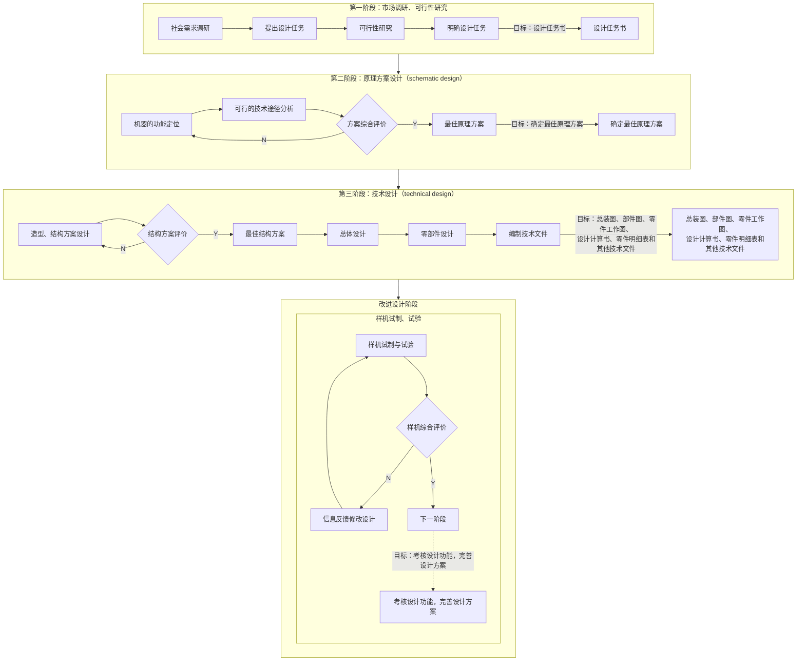

**机器**(*machine*)是人类进行生产以减轻体力劳动和提高劳动生产率的主要工具。
**机械**(*machinery*)是机器和机构(mechanism)的总称。使用机械进行生产的水平是衡量一个国家的技术水平和现代化程度的重要标志之一。

组成机器的不可拆的基本单元称为**机械零件**(*machine elements*)或简称**零件**;为完成特定的功能在结构上组合在一起并协同工作的零件组合称为**部件**(*mechanical components*),如联轴器、轴承、减速器等。机械零件一般泛指零件与部件。

各种机器中普油使用的零件称**通用零件**(*univeral componens*),如螺钉、键、带、齿轮、轴、弹簧等;只在特定的机器上使用的零件称为**专用零件**(*special components*),如发动机的曲轴、汽轮机的叶片、船用螺旋桨等都是专用零件。

在不同类型、不同规格的各种机器中,将同类零件或部件的结构型式、尺寸、材料等限定在合理的数量范围内,称为**标准化**(*standardization*)。按规定标准生产并给以标准代号的零件和部件称为**标准件**(*standard componcnts*),不按规定标准生产的零件和部件称为**非标准件**。

根据要求,按一定规律优化组合零、部件系列,称为系列化。系列化是标准化的重要内容,如螺栓系列、滚动轴承的类型和尺寸系列等。最大限度地减少和合并零、部件的型式、尺寸和材料品种等,称为**通用化**(*universslization*)

标准化、系列化、通用化通称**三化**。

## 机械设计的基本要求
### 1.对机器设计的基本要求
#### （1）对机器使用功能方面的要求。
1. 实现预定的使用功能是机器设计的最基本的要求,
2. 好的使用性能指标是设计的主要目标。
3. 操作使用方便、工作安全可靠、体积小、重量轻、效率高、外形美观、噪声低等往往也是机器设计时所要求的。
4. 对不同用途的机器还可能提出一些特殊的要求,如巨型机器有起重运输的要求,对生产食品的机器有保持清洁和不污染环境的要求等。

#### （2）对机器经济性的要求。
1. 设计的经济性体现为合理的功能定位、实现使用功能要求的最简单的技术途径和最简单、合理的结构;
2. 制造的经济性体现为采用合理的加工制造工艺、尽可能采用新的制造技术和最佳的生产组织管理,从而使机器在保证设计功能的前提下有尽可能低的制造成本;
3. 使用的经济性表现为机器应有较高的生产率、高效率,较少地消耗能源、原材料和辅助材料,管理和维护保养方便、费用低

### 2.对机械零件设计的基本要求
1. 要求在预定的工作期限内正常可靠地工作,从而保证机器的各种功能的正常实现
2. 要尽量降低零件的生产制造成本

# 机械设计的一般程序
## 1.机器设计的一般程序

## 2.机械零件设计的一般步骤
1. 根据机器的工作情况,按力学方法建立零件简化的力学模型,确定零件上的计算载荷。
	根据原动机的额定功率或根据机器在稳定和理想工作条件下的工作阻力,按力学方法计算出的作用在零件上的载荷称为**名义载荷**(或称公称载荷、额定载荷)。考虑原动机与工作机间实际载荷随时间的变化、载荷在零件上分布的不均匀性及其他影响零件受力等因素的影响,引入载荷系数K(或工作情况系数)来作概略估计。载荷系数K与名义载荷的乘积称为**计算载荷**。

2. 根据零件的使用要求,选择零件的类型与结构。

3. 根据零件的工作条件和材料的力学性能等选择适当的零件材料。

4. 据零件可能的失效形式确定计算准则,并根据零件的工作能力准则,确定零件的基本尺寸,并加以标准化和圆整。

5. 根据工艺性和标准化等原则进行零件的结构设计。

6. 绘制零件工作图,并编写计算说明书。

机械零件的计算可分为**设计计算**(*deign calculation*)和**校核计算**(*checking clculation*)两种。

**设计计算:** 先根据零件的工作情况和选定的工作能力准则拟定出安全条件,用计算方法求出零件危险截面的尺寸,然后根据结构和工艺要求,确定具体的零件结构。

**校核计算：** 先参照已有的零件实物、图纸或根据经验初步拟定零件的结构和基本尺寸,然后根据工作能力准则校核危险截面是否安全。

校核计算时,因为已知零件的有关尺寸和结构,所以计算结果一般较精确。

# 机械零件的主要失效形式和设计计算准则

## 机械零件的失效形式
**失效**(*failure*)：机械零件丧失正常工作能力或达不到设计要求的性能时称为失效。

机械失效形式虽然有很多种，但归结起来可以总结为以下问题：
1. 强度
2. 刚度
3. 耐磨性
4. 温度对工作能力的影响
5. 振动稳定性
6. 可靠性

## 机械零件的计算准则
**工作能力：** 零件不发生失效时的安全工作限度称为工作能力。

**计算准则（*criterion*）：** 根据零件失效分析结果,以防止产生各种可能失效为目的,拟定的零件工作能力计算依据的基本原则。

### 1.强度准则
**强度**(*strength*)是指零件抵抗破坏的能力。强度准则要求零件中的应力不超过许用极限,其表达式为$$\
\sigma \leq [\sigma]=\frac{\sigma_{\lim }}{S_{\sigma}}$$
$$\
\tau \leq [\tau]=\frac{\tau_{\lim }}{S_{\tau}}$$
### 2.刚度准则
**刚度**(*rigidity*)是零件在载荷作用下抵抗弹性变形的能力。刚度准则要求为:零件的弹性变形$y$小于或等于许用的弹性变形最$[y]$。其表达式为$$y \leq [y]$$