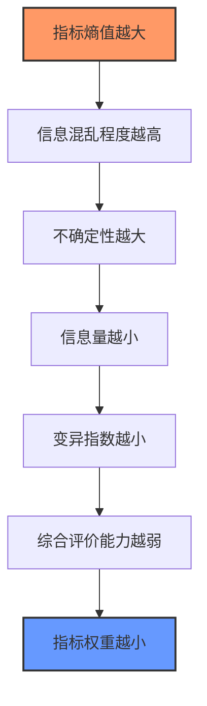

# 一、是什么
定义：是一种**赋权**方法。

根据各指标数值变化对整体的影响，计算指标的熵值，进而确定权重。

在信息论中，熵指系统的**混乱程度或无序程度**（熵是对不确定性的一种度量），指标的熵值越大，权重越小。

**变异指数：**指标变异程度大小，变异指数越大说明其在评价对象指标中的重要程度越高。

作用：在处理多指标赋权的问题时，可以消除人为主观赋值带来的结果偏差，规避主观因素的影响，提高评价结果的客观性和准确性。

什么是指标赋权，什么时候会用上？

举例：高中时我们会参与考试，老师会根据每一门学科的得分总和来评估学生学习成绩好坏，从行为方式上来讲，将每一门学科得分直接求和的过程，就是人为的指标赋权（每门学科得分是指标，每门学科的权重都是 100%）。简单来讲，当我们要评估某组对象的排名，且评估指标涉及到多个，我们需要用熵权法来计算各项指标权重，并加权计算得到最终评估指标。

注意:
1）需前置明确指标对评估对象的影响/作用方向；
2）非线性指标需提前做预处理或剔除。

优点
1. 可操作性强。算法比较简单，excel 操作即可完成
2. 客观精确。指标的能客观的计算出指标权重，有较高的可信度和精确度

缺点
 1. 过于依赖样本。随着样本变动权重会产生波动（如果样本分布不均或存在异常值，结论可能会失真）
2. 需结合业务经验。无法体现指标之间的关联性（如相关性、层级关系（一级指标和三级指标放一起评估就很奇怪）等），需要结合业务经验来选择指标

# 二、怎么算
## 步骤一、数据标准化处理
说明：对原始数据组进行标准化处理，消除各指标的量纲差异，把各指标数值压缩在[0-1]区间内。

1）处理前：明确指标属性，正向指标 or 负向指标；选择处理方法（通常用极差标准化的方法）。

2）处理中：

假定原始数据矩阵 $X$ 由 m 个样本、n 个指标构成， $X=(X_{ij})_{m*n}$ ：

$X=\begin{Bmatrix}    x_{11} & x_{12} & ...& x_{1n}\\    x_{21} & x_{22} & ...& x_{2n}\\ ... & ... & ...& ...\\ x_{m1} & x_{m2} & ...& x_{mn} \end{Bmatrix}_{m*n}$ 

正向指标标准化：（这里使用$min-max$函数进行线性标准化）

$X_{ij}^1=\cfrac{X_{ij}-min(X_{1j,....，X_{mj}})}{max (X_{1j,....，X_{mj}})-min(X_{1j,....，X_{mj}})}$ 

负向指标标准化：

$X_{ij}^1=\cfrac{max (X_{1j,....，X_{mj}})-X_{ij} }{max (X_{1j,....，X_{mj}})-min(X_{1j,....，X_{mj}})}$ 

3）处理后，得到新的数据矩阵 $X^1$ ：

$X^1=\begin{Bmatrix}    x_{11}^1 & x_{12}^1 & ...& x_{1n}^1\\    x_{21}^1 & x_{22}^1 & ...& x_{2n}^1\\ ... & ... & ...& ...\\ x_{m1}^1 & x_{m2}^1 & ...& x_{mn}^1 \end{Bmatrix}_{m*n}$ 

## 步骤二、计算比重
计算第 j 个指标第 i 个项目的数值比重 $P_{ij}$ ：

$P_{ij}=\cfrac{x_{ij}^1}{\sum_{\  i=1}^m x_{ij}^1}     （i=1,2...,m；j=1,2...,n）$

## 步骤三、计算熵值
计算 k 值、第 j 个指标的熵值 $e_{j}$ ：

$k=\cfrac{1}{ln(m)}      ,    e_{j}=-k*{\sum_{\  i=1}^m P_{ij}*ln(P_{ij})}$ 

其中：

$k>0  ;   e_{j}≥0$ 

## 步骤四、计算变异指数（变异系数）
第 j 个指标的变异指数 $d_{j}$ 为：

$d_j=1-e_j      (j=1,2...,n)$ 

## 步骤五、计算熵权 $w_{j}$
第 j 个指标的权重 $w_{j}$ 为：

$w_{j}=\cfrac{d_{j}}{\sum_{\ j=1}^n d_{j}}$ 

## 步骤六、综合评分
第 i 个评价对象的综合评价值 $Z_{j}$ 为：

$Z_{i}=\sum_{j=1}^n w_{j}*P_{ij}     (这里乘P_{ij}或X_{ij}^1都可以  )$

