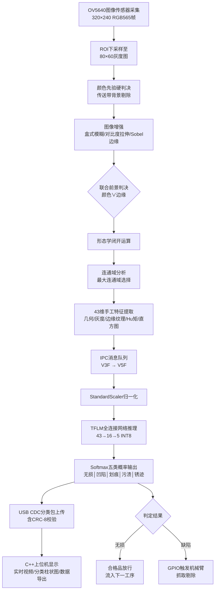

```mermaid
flowchart TD
    A[OV5640图像传感器采集<br/>320×240 RGB565帧] --> B[ROI下采样至<br/>80×60灰度图]
    B --> C[颜色先验硬判决<br/>传送带背景剔除]
    C --> D[图像增强<br/>盒式模糊/对比度拉伸/Sobel边缘]
    D --> E{联合前景判决<br/>颜色∨边缘}
    E --> F[形态学闭开运算]
    F --> G[连通域分析<br/>最大连通域选择]
    G --> H[43维手工特征提取<br/>几何/灰度/边缘纹理/Hu矩/直方图]
    H --> I[IPC消息队列<br/>V3F → V5F]
    I --> J[StandardScaler归一化]
    J --> K[TFLM全连接网络推理<br/>43→16→5 INT8]
    K --> L[Softmax五类概率输出<br/>无损│凹陷│划痕│污渍│锈迹]
    L --> M[USB CDC分类包上传<br/>含CRC-8校验]
    L --> N{判定结果}
    N -->|无损| O[合格品放行<br/>流入下一工序]
    N -->|缺陷| P[GPIO触发机械臂<br/>抓取剔除]
    M --> Q[C++上位机显示<br/>实时视频/分类柱状图/数据导出]
```
