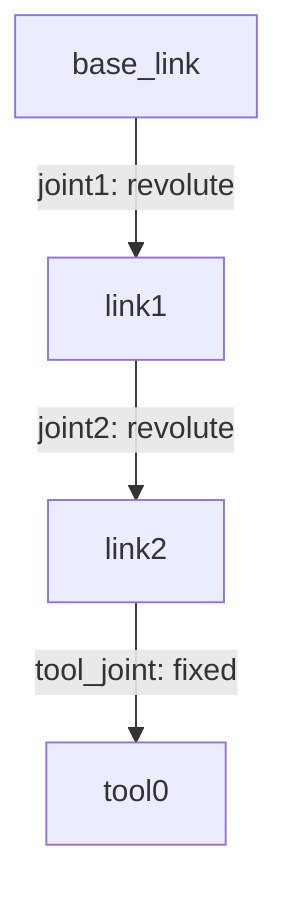

# 通用机器人描述格式(URDF)

**URDF**（*Unified Robot Description Format*，统一机器人描述格式）是 ROS 中基于 XML 的机器人模型描述格式，用来描述机器人的**运动学与动力学结构**：有哪些连杆、连杆之间通过什么关节连接、每个连杆的外观与惯性。rviz 的可视化、Gazebo 的仿真、`robot_state_publisher` 的坐标变换发布、MoveIt 的运动规划都以 URDF 为模型来源。

## 树：连杆与关节

URDF 只用两种元素搭建机器人：

- **连杆（*link*）**：刚体部件，如底盘、大臂、小臂、轮子；
- **关节（*joint*）**：连接两个连杆的运动副，决定两连杆之间允许的相对运动。



整体构成一棵**树**：有且只有一个根连杆，除根连杆外每个连杆有且只有一个父关节，但可以有任意多个子关节。

> [!note] 与位形空间的联系
> 无闭环时每个关节变量都是独立的，自由度就是所有关节自由度之和：
> $$dof=\sum_{i=1}^{J} f_i$$
> 这正是[[位形空间]]中格鲁布勒公式在无闭环（$N-1=J$）时的结果。关节变量组成的向量 $\boldsymbol{q}$ 就是位形空间的坐标。

这棵树同时是 **TF 坐标变换树**：每个 link 对应一个坐标系，每个 joint 对应父子坐标系之间的变换。`robot_state_publisher` 根据 URDF 与关节状态计算出所有连杆的位形并发布到 TF（固定关节也会发布）。

## XML 语法

### 根元素

```xml
<?xml version="1.0"?>
<robot name="my_robot">
  <!-- 若干 <link> 与 <joint> -->
</robot>
```

### link

一个 link 由三部分描述，均为可选但用途不同：

```xml
<link name="base_link">
  <!-- 1. 惯性与质量：动力学仿真用 -->
  <inertial>
    <origin xyz="0 0 0.05" rpy="0 0 0"/>
    <mass value="3.0"/>
    <inertia ixx="0.0073" ixy="0" ixz="0"
             iyy="0.0073" iyz="0" izz="0.0096"/>
  </inertial>

  <!-- 2. 外观：可视化用 -->
  <visual>
    <origin xyz="0 0 0.05" rpy="0 0 0"/>
    <geometry>
      <cylinder radius="0.08" length="0.10"/>
    </geometry>
    <material name="steel"/>
  </visual>

  <!-- 3. 碰撞体：碰撞检测用 -->
  <collision>
    <origin xyz="0 0 0.05" rpy="0 0 0"/>
    <geometry>
      <cylinder radius="0.08" length="0.10"/>
    </geometry>
  </collision>
</link>
```

- `inertial`：`origin` 给出**质心坐标系**相对 link 坐标系的位形；`inertia` 是相对质心坐标系的惯性张量，只需写对称矩阵的上三角 6 个分量
  $$\boldsymbol{I}=\begin{bmatrix}I_{xx}&I_{xy}&I_{xz}\\I_{xy}&I_{yy}&I_{yz}\\I_{xz}&I_{yz}&I_{zz}\end{bmatrix}$$
  惯性张量必须**正定**；把各部件的惯性搬到同一坐标系时，要用[[刚体运动]]中的齐次变换与**平行轴定理**。
- `visual` / `collision`：`origin` 是几何体坐标系相对 link 坐标系的位形。两者几何体**不必相同**——可视化可用精细的 mesh，碰撞体常用简化形状（如包围盒）以节省计算。两者都可以出现多次，用来拼出一个复杂连杆。
- `material`：`<color rgba="r g b a"/>` 或纹理；可以就地定义，也可以在 `<robot>` 下统一定义后用 `name` 引用。

几何体类型：

| 形状   | 写法                                                              | 说明          |
| ---- | --------------------------------------------------------------- | ----------- |
| 长方体  | `<box size="x y z"/>`                                           | size 为三个方向的全长 |
| 圆柱   | `<cylinder radius="r" length="l"/>`                             | 轴沿 z 轴      |
| 球    | `<sphere radius="r"/>`                                          |             |
| 网格   | `<mesh filename="package://pkg/meshes/a.stl" scale="1 1 1"/>` | 支持 STL/DAE 等 |

> [!warning] 三种描述用途不同
> 只在 rviz 中看模型：`visual` 足够；做碰撞检测：需要 `collision`；做动力学仿真：必须有正确的 `inertial`——质量为 0 或惯性矩阵不正定会让 Gazebo 等仿真器报错或产生荒谬的结果。

### joint

```xml
<joint name="joint1" type="revolute">
  <parent link="base_link"/>
  <child link="link1"/>
  <origin xyz="0 0 0.1" rpy="0 0 0"/>
  <axis xyz="0 0 1"/>
  <limit lower="-3.1416" upper="3.1416" effort="50" velocity="2.0"/>
  <dynamics damping="0.5" friction="0.1"/>
</joint>
```

| 子元素                  | 含义                                                                  |
| -------------------- | ------------------------------------------------------------------- |
| `parent` / `child`   | 父、子连杆，确定树的拓扑                                                        |
| `origin`             | 零位时子连杆坐标系在父连杆坐标系中的位形                                                |
| `axis`               | 运动轴（单位向量），表达在关节坐标系（即零位时的子连杆坐标系）中；缺省为 `1 0 0`                        |
| `limit`              | `lower`/`upper` 位置上下限（rad 或 m）、`velocity` 最大速度、`effort` 最大力矩/推力         |
| `dynamics`           | `damping` 黏性阻尼、`friction` 静摩擦                                        |
| `calibration`        | `rising`/`falling` 编码器零点标定                                          |
| `mimic`              | 该关节按 $q=\text{multiplier}\cdot q_{\text{源}}+\text{offset}$ 跟随另一关节（如夹爪） |
| `safety_controller`  | 软限位与安全停车参数                                                          |

关节类型：

| type         | 含义                      | 自由度 | 是否需要 `limit`        |
| ------------ | ----------------------- | --- | ------------------ |
| `fixed`      | 固定连接，两连杆焊死              | 0   | 不允许有               |
| `revolute`   | 转动关节，有限位                | 1   | 必须（含 lower/upper）  |
| `continuous` | 转动关节，无限位，如车轮            | 1   | 只需 effort/velocity |
| `prismatic`  | 移动（直线）关节，有限位            | 1   | 必须（含 lower/upper）  |
| `planar`     | 在垂直于某轴的平面内平移并绕该轴转动      | 3   | 不允许有               |
| `floating`   | 自由浮动                    | 6   | 不允许有               |

> [!tip] 与理论关节分类的对照
> 对照[[位形空间]]中的关节表：`revolute`/`continuous` ↔ 转动关节 R，`prismatic` ↔ 移动关节 P，`floating` ↔ 自由刚体（6 自由度），`planar` ↔ 平面内的移动与转动。球铰 S、圆柱关节 C、螺旋关节 H 在 URDF 中没有单一对应的关节类型，需要多个关节串联近似或改用其它格式。

### 完整示例：二自由度机械臂

```xml
<?xml version="1.0"?>
<robot name="two_link_arm">

  <material name="steel"><color rgba="0.7 0.7 0.75 1.0"/></material>
  <material name="orange"><color rgba="1.0 0.5 0.0 1.0"/></material>

  <!-- ========== 基座 ========== -->
  <link name="base_link">
    <visual>
      <origin xyz="0 0 0.05" rpy="0 0 0"/>
      <geometry><cylinder radius="0.08" length="0.10"/></geometry>
      <material name="steel"/>
    </visual>
    <collision>
      <origin xyz="0 0 0.05" rpy="0 0 0"/>
      <geometry><cylinder radius="0.08" length="0.10"/></geometry>
    </collision>
    <inertial>
      <origin xyz="0 0 0.05" rpy="0 0 0"/>
      <mass value="3.0"/>
      <inertia ixx="0.0073" ixy="0" ixz="0"
               iyy="0.0073" iyz="0" izz="0.0096"/>
    </inertial>
  </link>

  <!-- ========== 大臂（长 0.30，绕 z 轴转动） ========== -->
  <link name="link1">
    <visual>
      <origin xyz="0 0 0.15" rpy="0 0 0"/>
      <geometry><box size="0.05 0.05 0.30"/></geometry>
      <material name="orange"/>
    </visual>
    <collision>
      <origin xyz="0 0 0.15" rpy="0 0 0"/>
      <geometry><box size="0.05 0.05 0.30"/></geometry>
    </collision>
    <inertial>
      <origin xyz="0 0 0.15" rpy="0 0 0"/>
      <mass value="2.0"/>
      <inertia ixx="0.0154" ixy="0" ixz="0"
               iyy="0.0154" iyz="0" izz="0.0008"/>
    </inertial>
  </link>

  <!-- ========== 小臂（长 0.25，绕 y 轴转动） ========== -->
  <link name="link2">
    <visual>
      <origin xyz="0 0 0.125" rpy="0 0 0"/>
      <geometry><box size="0.04 0.04 0.25"/></geometry>
      <material name="orange"/>
    </visual>
    <collision>
      <origin xyz="0 0 0.125" rpy="0 0 0"/>
      <geometry><box size="0.04 0.04 0.25"/></geometry>
    </collision>
    <inertial>
      <origin xyz="0 0 0.125" rpy="0 0 0"/>
      <mass value="1.0"/>
      <inertia ixx="0.0053" ixy="0" ixz="0"
               iyy="0.0053" iyz="0" izz="0.0003"/>
    </inertial>
  </link>

  <!-- ========== 末端工具坐标系（空连杆，只提供坐标系） ========== -->
  <link name="tool0"/>

  <!-- ========== 关节 ========== -->
  <joint name="joint1" type="revolute">
    <parent link="base_link"/>
    <child link="link1"/>
    <origin xyz="0 0 0.10" rpy="0 0 0"/>
    <axis xyz="0 0 1"/>
    <limit lower="-3.1416" upper="3.1416" effort="50" velocity="2.0"/>
    <dynamics damping="0.5" friction="0.1"/>
  </joint>

  <joint name="joint2" type="revolute">
    <parent link="link1"/>
    <child link="link2"/>
    <origin xyz="0 0 0.30" rpy="0 0 0"/>
    <axis xyz="0 1 0"/>
    <limit lower="-2.0944" upper="2.0944" effort="20" velocity="2.0"/>
    <dynamics damping="0.3"/>
  </joint>

  <joint name="tool_joint" type="fixed">
    <parent link="link2"/>
    <child link="tool0"/>
    <origin xyz="0 0 0.25" rpy="0 0 0"/>
  </joint>

</robot>
```

## 坐标系约定与正运动学

### origin 就是齐次变换矩阵

`origin` 的 `xyz` 是平移向量 $\boldsymbol{p}$，`rpy` 是**固定轴** XYZ 外旋角（先绕 x 转 roll，再绕 y 转 pitch，最后绕 z 转 yaw）：

$$\boldsymbol{A}=R_z(\gamma)R_y(\beta)R_x(\alpha),\qquad \boldsymbol{T}_{\text{origin}}=\begin{bmatrix}\boldsymbol{A}&\boldsymbol{p}\\0&1\end{bmatrix}$$

即 `origin` 给出的位形恰好是[[刚体运动]]中的齐次变换矩阵。

### 关节引入的运动

设关节变量为 $q$，则子连杆在父连杆坐标系中的位形为

$$\boldsymbol{T}_{pc}(q)=\boldsymbol{T}_{\text{origin}}\,\boldsymbol{T}_{\text{motion}}(q)$$

| 关节类型                  | $\boldsymbol{T}_{\text{motion}}(q)$    |
| --------------------- | -------------------------------------- |
| revolute / continuous | 绕轴 $\boldsymbol{a}$ 转 $q$：$\text{Rot}(\boldsymbol{a},q)$ |
| prismatic             | 沿轴平移 $q$：$\text{Trans}(\boldsymbol{a}q)$ |
| fixed                 | $\boldsymbol{I}$                       |

串联链从基座到末端依次相乘就得到正运动学：

$$\boldsymbol{T}_{\text{base,tool}}(q_1,\dots,q_n)=\boldsymbol{T}_{\text{origin},1}\text{Rot}(\boldsymbol{z},q_1)\;\boldsymbol{T}_{\text{origin},2}\text{Rot}(\boldsymbol{y},q_2)\cdots$$

以二自由度机械臂为例（$\boldsymbol{T}_{\text{origin},1}=\text{Trans}(0,0,0.1)$，$\boldsymbol{T}_{\text{origin},2}=\text{Trans}(0,0,0.3)$，$\boldsymbol{T}_{\text{origin},3}=\text{Trans}(0,0,0.25)$），可得末端位置

$$\boldsymbol{p}_{\text{tool}}=\begin{bmatrix}0.25\sin q_2\cos q_1\\[2pt] 0.25\sin q_2\sin q_1\\[2pt] 0.4+0.25\cos q_2\end{bmatrix}$$

> [!note] 与 DH 参数法的比较
> [[DH参数法]]用四个参数（$a,\alpha,d,\theta$）规则化地描述串联链的每一段——参数少、便于手推正运动学；URDF 的 `origin` 是任意 6 参数位形、`axis` 也可任取，表达更自由，还能描述树形分支。二者在一定条件下可以互相转换：URDF 面向机器读取与仿真，DH 面向手工推导。

## xacro：URDF 的"宏语言"

手写 URDF 冗长、不能定义变量、不能复用、不能做算术。**xacro** 是 URDF 的扩展：

- `<xacro:property>`：定义常量，用 `${表达式}` 引用并计算；
- `<xacro:macro>`：定义带参数的可复用片段；
- `<xacro:include>`：把模型拆成多个文件；
- `<xacro:if>` / `<xacro:unless>`：条件包含；
- `<xacro:arg>` / `$(arg 名)`：从命令行传入参数。

xacro 文件本质上是合法 URDF（只是多了 `xmlns:xacro` 命名空间），预处理后就是普通 URDF：

```xml
<?xml version="1.0"?>
<robot name="two_link_arm" xmlns:xacro="http://www.ros.org/wiki/xacro">

  <xacro:property name="L1" value="0.30"/>
  <xacro:property name="L2" value="0.25"/>

  <!-- 一根杆件的完整定义：外观 + 惯性（按圆柱公式自动计算） -->
  <xacro:macro name="rod_link" params="name length mass radius">
    <link name="${name}">
      <visual>
        <origin xyz="0 0 ${length/2}" rpy="0 0 0"/>
        <geometry><cylinder radius="${radius}" length="${length}"/></geometry>
      </visual>
      <inertial>
        <origin xyz="0 0 ${length/2}" rpy="0 0 0"/>
        <mass value="${mass}"/>
        <!-- Ixx = Iyy = m(3r²+l²)/12，Izz = mr²/2 -->
        <inertia ixx="${mass*(3*radius*radius+length*length)/12}" ixy="0" ixz="0"
                 iyy="${mass*(3*radius*radius+length*length)/12}" iyz="0"
                 izz="${mass*radius*radius/2}"/>
      </inertial>
    </link>
  </xacro:macro>

  <xacro:rod_link name="link1" length="${L1}" mass="2.0" radius="0.025"/>
  <xacro:rod_link name="link2" length="${L2}" mass="1.0" radius="0.020"/>

  <joint name="joint1" type="revolute">
    <parent link="base_link"/>
    <child link="link1"/>
    <origin xyz="0 0 0.1"/>
    <axis xyz="0 0 1"/>
    <limit lower="-3.1416" upper="3.1416" effort="50" velocity="2.0"/>
  </joint>

  <joint name="joint2" type="revolute">
    <parent link="link1"/>
    <child link="link2"/>
    <origin xyz="0 0 ${L1}"/>   <!-- 关节装在大臂末端 -->
    <axis xyz="0 1 0"/>
    <limit lower="-2.0944" upper="2.0944" effort="20" velocity="2.0"/>
  </joint>

</robot>
```

> [!tip] xacro 的意义
> 改一个几何参数（如 $L_1$），所有用到它的地方（连杆尺寸、关节安装位置、惯性）自动更新；把电机、传感器、夹爪等做成 macro 后，搭建新机器人就成了"搭积木"。

## 常用工具与工作流

| 工具                            | 作用                              |
| ----------------------------- | ------------------------------- |
| `xacro model.urdf.xacro`      | 把 xacro 展开成纯 URDF               |
| `check_urdf model.urdf`       | 检查语法与树结构，打印连杆树                  |
| `urdf_to_graphiz model.urdf`  | 生成结构图（pdf）                      |
| `robot_state_publisher`       | 由 URDF + 关节状态发布 TF              |
| `joint_state_publisher_gui`   | 滑动条手动给关节角，快速查看模型                |
| `rviz2`                       | 可视化模型与 TF                       |
| Gazebo / MoveIt / ros2_control | 仿真、运动规划、控制                      |

ROS2 下快速预览：

```bash
xacro robot.urdf.xacro > robot.urdf
check_urdf robot.urdf
ros2 launch urdf_tutorial display.launch.py model:=/path/to/robot.urdf
```

## 局限与常见坑

**URDF 描述不了的**：

- **闭环机构**（并联机器人、四连杆、平行四边形机构）——树结构天生无法表达，需要 SDF、MJCF（MuJoCo）、USD（Isaac Sim）等格式；
- **柔性体、变形体**；
- **传感器与执行器**——要通过 Gazebo 插件标签或 `ros2_control` 配置另行描述；
- **接触摩擦、材质光学参数**等物理细节，Gazebo 下要用 `<gazebo>` 标签扩展。

**常见坑**：

| 现象                | 原因                              | 解决                                          |
| ----------------- | ------------------------------- | ------------------------------------------- |
| 模型加载失败 / 树不完整     | 出现环（一个 link 有两个父关节）或多个根连杆        | 用 `check_urdf` 检查，改回树形结构                      |
| 仿真中抖动、飞出去         | 惯性缺失或非正定、质量过小                   | 补全 `inertial`，检查惯性矩阵                          |
| mesh 不显示          | 路径不对或包未安装                       | 用 `package://包名/...`，并确认模型已安装到包的 `share/` 中    |
| visual 朝向不对       | 对 `rpy` 固定轴外旋约定理解有误              | 与[[刚体运动]]中的 RPY 约定对照                        |
| continuous 关节不动   | 误写了位置限位或缺少 `effort`/`velocity` | `continuous` 不写 lower/upper，只写 effort/velocity |
| 关节转的方向与预期相反       | `axis` 方向取反                      | 翻转 `axis` 的符号                               |
| 单位错误              | 长度用了 mm、角度用了度                   | URDF 统一用 SI：m、rad、N、N·m、kg                  |

> [!note] 参考
> URDF 的完整 XML 规范见 ROS wiki 的 [urdf/XML](https://wiki.ros.org/urdf/XML) 页面，xacro 见 [xacro](https://wiki.ros.org/xacro)。
