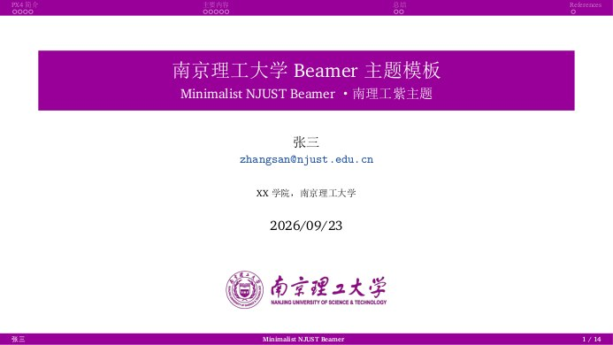
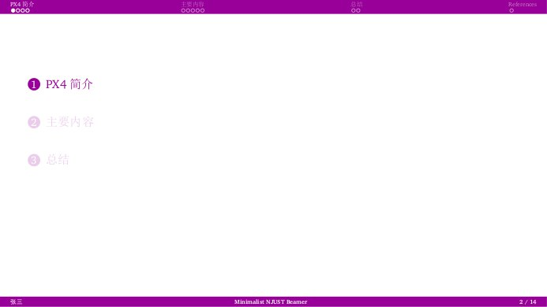
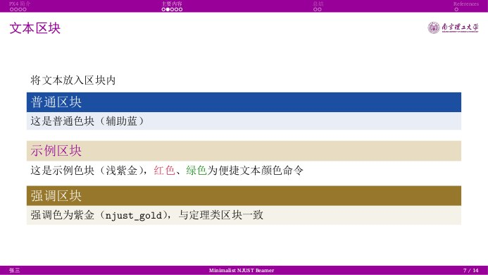
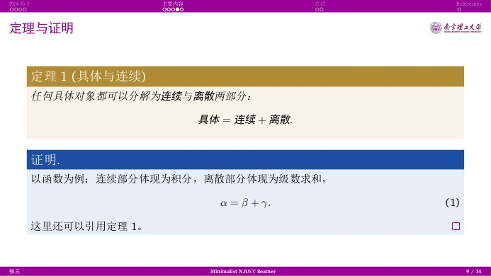

# 南京理工大学 Beamer 模板（Minimalist NJUST Beamer）

一场南理工紫的极简演示 —— 固定高度顶栏、右上角校徽、衬线排版与原生中文支持。
A minimalist NJUST-style LaTeX Beamer template with the NJUST purple theme colour.

版式移植自 minimalist-pku-beamer-2026（PKU 极简 Beamer 模板），主题色取自南京理工大学视觉形象识别（VI）标准色
**南理工紫 `#990099`**（C54 M96 Y0 K0 / RGB 153,0,153 / Pantone 248）。

---

## 预览 · Preview

| 标题页 Title | 分节目录页 Section TOC |
| :---: | :---: |
|  |  |

| 文本区块 Blocks | 定理与证明 Theorem |
| :---: | :---: |
|  |  |

## 特性

- **南理工主题色**：顶栏、标题条、页脚、`structure` 统一使用南理工紫 `#990099`；区块配色为辅助蓝（定义/普通区块）、紫金（定理/强调）、浅紫金（示例）。
- **极简固定高度顶栏**：smoothbars 顶栏重写为固定高度纯色条，分节目录页与正文页的顶部高度完全一致；导航行像素级锚定。
- **右上角校徽**：正文页右上角固定显示南理工校徽与中英文校名组合，**墨迹与当前页标题文字严格同高对齐**（随标题字形自适应），长标题自动在校徽前换行。
- **首页校徽**：标题页使用同一组合图（`logo/NJUST.png`）。
- **原生中文**：`ctex`（`fontset=none` + `scheme=plain`）+ `xeCJK`；中文衬线宋体，macOS 用 Songti SC、Windows 用 SimSun（黑体代粗体）、其他环境自动回退 TeX Live 自带的 FandolSong。
- **中文定理环境**：定理/定义/引理/证明等名称自动显示为中文（“定理 1”“证明”），题注显示为“图 1：”“表 1：”。
- **衬线拉丁字体**：XCharter（TeX Live 自带）；等宽字体优先 Maple Mono，未安装自动回退。
- **引用着色**：`\citep` / `\citet` 整体（含括号）显示为辅助蓝，`citecolor` 已同步。
- **三线表**：booktabs 头尾粗线 1.2pt、中间线 0.5pt，表头加粗。
- **画幅可切换**：16:9（当前）/ 4:3 等，改 `aspectratio` 即可。

## 快速开始

依赖：TeX Live（`xelatex`、`latexmk`、`ctex`）。

```bash
latexmk -xelatex NJUST-slides.tex   # 编译（含参考文献，多轮自动）
latexmk -c                          # 清理中间文件（保留 PDF）
```

日常使用：修改 `NJUST-slides.tex` 中的 `\title` / `\author` / `\institute` / `\date`，正文直接写中文，
`image/` 里放你的图片，`ref.bib` 里放参考文献。VS Code（LaTeX Workshop）或 Overleaf 中把编译器设为 **XeLaTeX**。

## 文件说明

| 文件 | 说明 |
| --- | --- |
| `NJUST-slides.tex` | 主文件（示例讲稿，可直接在其上修改） |
| `NJUST.sty` | 主题文件（版式与配色，一般无需修改） |
| `ref.bib` | 参考文献数据库 |
| `logo/NJUST.png` | 校徽 + 校名组合图（顶栏右上角与标题页使用） |
| `image/` | 示例图片与 README 预览图 |

## 字体说明

| 用途 | 字体 | 说明 |
| --- | --- | --- |
| 中文正文 | Songti SC / SimSun / FandolSong | 按系统自动选择，无需修改 |
| 拉丁正文 | XCharter | TeX Live 自带 |
| 等宽 | Maple Mono | 可选；未安装自动回退 |

## 相对初版（ucas 风格）的改动

1. 主题文件由 `beamerthemeucas.sty`（UCAS 风格）重制为 `NJUST.sty`（极简 PKU 风格版式）。
2. 颜色由 `rgb(0.55,0,0.55)` 近似紫改为 VI 标准色 `#990099`，并补充辅助蓝、紫金、银灰。
3. 顶栏、标题条、页脚、区块、图表题注、定理环境全部按新配色与新版式重设。
4. 编译方式由 PDFLaTeX 改为 **XeLaTeX**，字体链自动回退。
5. 新增：中文定理名、三线表主题、引用整体着色、参考文献示例、画幅切换说明。

## 参考模板 · Credits

- `minimalist-pku-beamer-2026` —— 本版式来源（PKU 极简 Beamer）
- [icgw/ucas-beamer](https://github.com/icgw/ucas-beamer) —— 初版所参考的 UCAS 主题
- 初版（ucas 风格）维护者：Shuai Qian (Andrew)

## 版权说明

南理工校徽与中英文校名组合图的版权归南京理工大学所有，仅限校内师生在教学、科研等场合按学校视觉形象规范使用。
