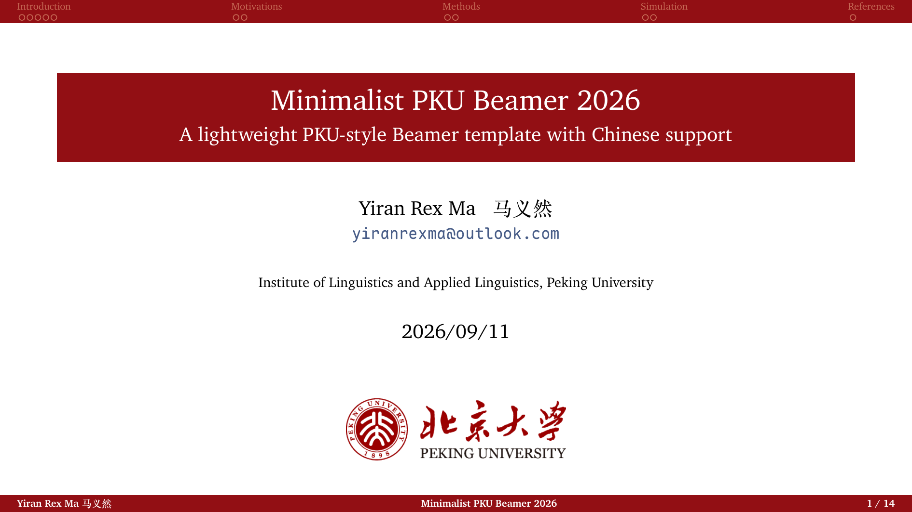
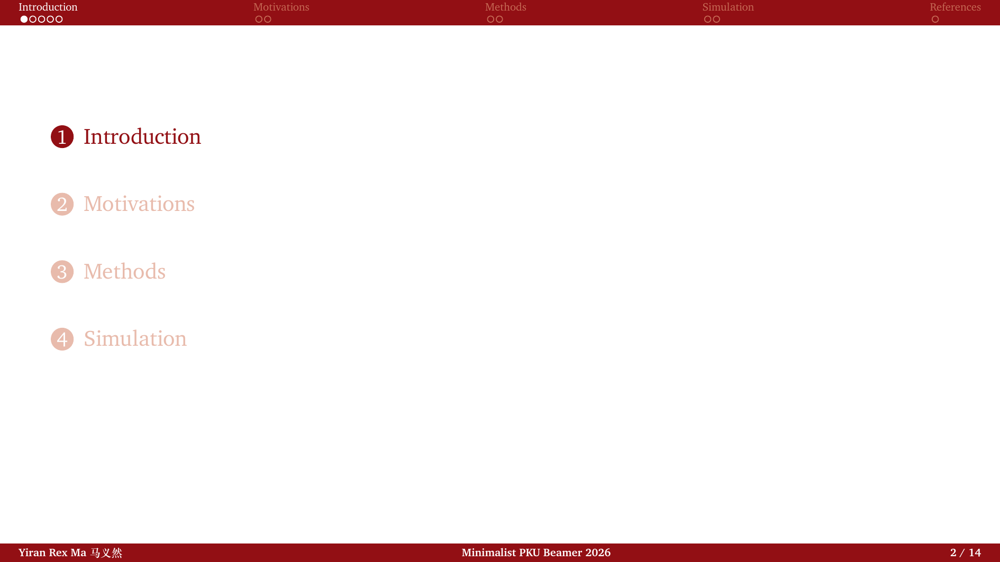
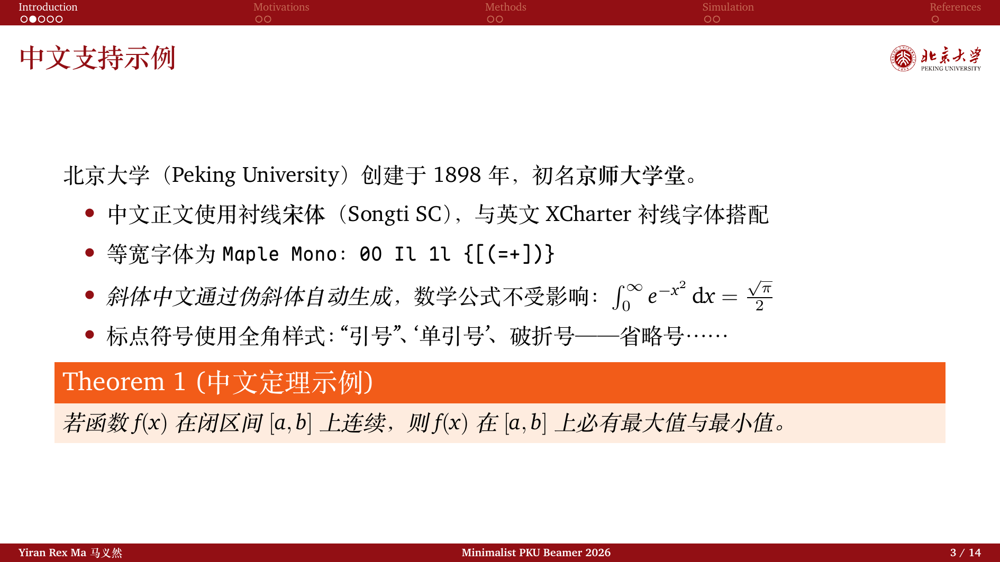
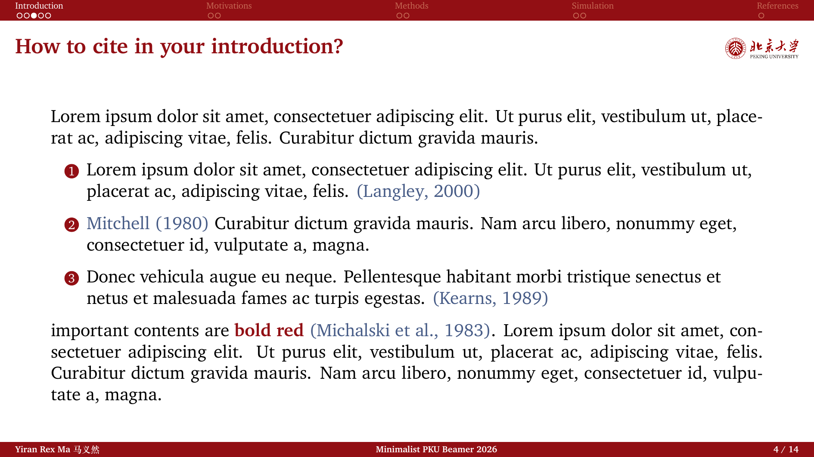
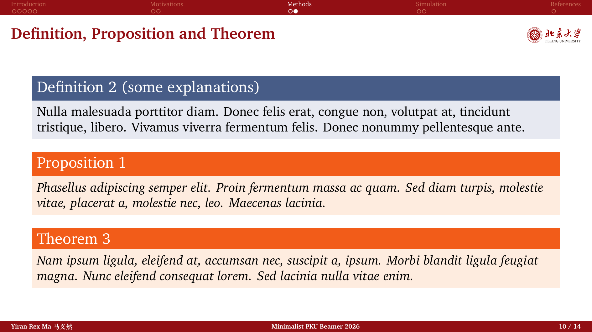
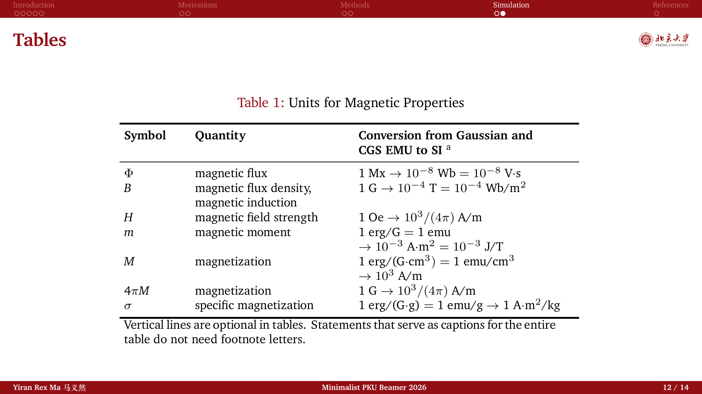

# Minimalist PKU Beamer 2026

北京大学风格的轻量 LaTeX Beamer 模板 — 衬线排版、原生中文支持。
A lightweight, PKU-style LaTeX Beamer template with serif typography and native Chinese support.

基于 [tongpf/PKU_beamer_lightweight_designed](https://github.com/tongpf/PKU_beamer_lightweight_designed)（其本身基于 [inFaaa/PKU-Beamer-Theme](https://github.com/inFaaa/PKU-Beamer-Theme)）二度开发。
Derived from [tongpf/PKU_beamer_lightweight_designed](https://github.com/tongpf/PKU_beamer_lightweight_designed), which is in turn based on [inFaaa/PKU-Beamer-Theme](https://github.com/inFaaa/PKU-Beamer-Theme).

---

## 预览 · Preview

| 标题页 Title | 目录页 Section TOC | 中文排版 Chinese |
| :---: | :---: | :---: |
|  |  |  |

| 引用着色 Citations | 定理环境 Theorems | 表格 Tables |
| :---: | :---: | :---: |
|  |  |  |

## 特性

- **原生中文**：`ctex`（`fontset=none` + `scheme=plain`）+ `xeCJK`，中文正文为衬线**宋体（Songti SC）**，自带真实粗体字重，斜体由伪斜体自动生成；全角标点、定理环境、中英混排均正常。
- **衬线拉丁字体**：XCharter（Charter 的 OpenType 版）。上游的 `\usepackage{charter}` 在 XeLaTeX 下不生效（全文会回落到 Latin Modern），已改为 fontspec 方式加载。
- **等宽字体**：优先使用 [Maple Mono](https://github.com/subframe7536/maple-font) NF 静态字族（真实粗/斜体；未安装时自动尝试可变版，再回退默认等宽字体）。
- **顶栏高度统一**：重写了 smoothbars 的 headline。原版顶栏与 frametitle 通过渐变带耦合，无标题的页面（分节目录页）红条会比正文页高一截；现为固定高度纯色条，所有页面顶部完全一致。
- **右上角校徽**：正文页右上角固定显示校徽与中英文校名组合（`Figures/PKU-emblem-names.png`），**墨迹与当前页标题文字严格同高对齐**（高度 = 标题的 `\settoheight` + `\settodepth`，随标题字形自适应），右侧留白与标题左边距对称，长标题自动在校徽前换行。
- **首页校徽**：标题页使用同一组合图（`width=0.275\linewidth`），并移除了上游失效的 `\logo` 机制、修复了错误的 logo 引用路径。
- **引用着色**：`\citep` / `\citet` 已重定义，整个引用（**含括号**）显示为 `peking_blue`（与 definition block 标题蓝一致）— natbib 的括号不在 hyperref 链接内，仅靠 `citecolor` 染不到；`citecolor` 已同步。粗体强调建议用主题红 `\textcolor{peking}{\bf ...}`。
- **工程化**：`latexmk` 一键编译（含参考文献）、`clean.sh` 一键清理、`.gitignore`。

## 快速开始

依赖：TeX Live（`xelatex`、`latexmk`、`ctex`；macOS 装 MacTeX 即可）。

```bash
latexmk -xelatex main.tex   # 编译（含参考文献，多轮自动）
./clean.sh                  # 清理中间文件（保留 main.pdf）
./clean.sh --deep           # 连 main.pdf 一起清理
```

日常使用：修改 `main.tex` 中的 `\title` / `\author` / `\institute` / `\date`，正文直接写中文，`Figures/` 里放你的图片即可。画幅切换：模板当前为 16:9（`aspectratio=169`），如需 4:3 改回 `aspectratio=43` 即可。VS Code（LaTeX Workshop）或 Overleaf 中把编译器设为 **XeLaTeX**。

## 字体说明

| 用途 | 字体 | 说明 |
| --- | --- | --- |
| 中文正文 | Songti SC | macOS 自带；其他环境自动回退 FandolSong（TeX Live 自带），无需修改 |
| 拉丁正文 | XCharter | TeX Live 自带，无需安装 |
| 等宽 | Maple Mono | 可选；开源（OFL），未安装自动回退 |

## 相对上游的改动一览

1. 加入中文支持：`ctex` + `xeCJK` + Songti SC（真实粗体、伪斜体）。
2. Charter → XCharter（fontspec 加载，修复 XeLaTeX 下不生效的问题）。
3. 新增 Maple Mono 等宽字体（带存在性检测与回退链）。
4. 重写 headline：固定高度纯色条，修复目录页/正文页顶部红条高度不一致（smoothbars 渐变耦合缺陷）；顶栏改为与底部栏、首页标题 box 一致的主题红 `peking`（原为更暗的 palette quaternary）。
5. 重写 frametitle：平面标题条 + 右上角校徽墨迹级对齐（`\settoheight`/`\settodepth` 锚定，随标题自适应）。
6. 首页换用校徽组合图，移除失效的 `\logo` 机制，修复 logo 路径。
7. 引用整体（含括号）着色为 `peking_blue`，`citecolor` 同步；粗体强调改用主题红 `peking`。
8. 表格主题：三线表头尾粗线 1.2pt、中间线 0.5pt，表头加粗黑色；画幅可切换 4:3 / 16:9（`aspectratio`）。
9. 新增 `clean.sh`、`.gitignore`、`LICENSE`，重写双语 README。

---

## Features

- **Native Chinese**: `ctex` (`fontset=none`, `scheme=plain`) + `xeCJK`, with serif **Songti SC** as the CJK main font — real bold weights, automatic fake slant, proper full-width punctuation, theorems and CJK/Latin mixing.
- **Serif Latin text**: XCharter (OpenType Charter). The upstream `\usepackage{charter}` is silently ignored under XeLaTeX (everything fell back to Latin Modern); it is now loaded via fontspec.
- **Monospace**: [Maple Mono](https://github.com/subframe7536/maple-font) NF preferred (static family with real bold/italic; falls back to the variable version, then to the default mono font if absent).
- **Consistent headline**: the smoothbars headline is rewritten. Upstream couples the top bar to the frametitle via gradient bands, so untitled frames (section TOC pages) show a taller bar than content pages; it is now a fixed-height solid bar, identical on every page.
- **Corner emblem**: every titled frame shows the PKU emblem + names lockup (`Figures/PKU-emblem-names.png`) in the top-right corner, with its **ink aligned strictly to the title text's ink** (height = `\settoheight` + `\settodepth` of the actual title, adapting per frame), symmetric margins, and automatic line-breaking of long titles before the emblem.
- **Title page**: uses the same emblem lockup (at half size) and drops the broken `\logo` mechanism (with its wrong file path).
- **Citations**: `\citep` / `\citet` are redefined so the whole citation — **parentheses included** — renders in `peking_blue` (natbib's parens sit outside the hyperref link, so `citecolor` alone cannot color them); `citecolor` is synced. Bold emphasis uses the theme red: `\textcolor{peking}{\bf ...}`.
- **Tooling**: one-command `latexmk` build (bibliography included), `clean.sh` cleanup, `.gitignore`.

## Getting started

Requirements: TeX Live (`xelatex`, `latexmk`, `ctex`; MacTeX on macOS covers all).

```bash
latexmk -xelatex main.tex   # build (bibliography, auto-reruns)
./clean.sh                  # clean intermediates (keeps main.pdf)
./clean.sh --deep           # also remove main.pdf
```

Edit `\title` / `\author` / `\institute` / `\date` in `main.tex`, write your slides in Chinese or English, put figures in `Figures/`. The template ships in 16:9 (`aspectratio=169`); switch back to 4:3 via `aspectratio=43`. Set the compiler to **XeLaTeX** in VS Code (LaTeX Workshop) or Overleaf.

## Fonts

| Slot | Font | Notes |
| --- | --- | --- |
| CJK text | Songti SC | bundled with macOS; falls back to FandolSong (bundled with TeX Live) automatically elsewhere |
| Latin text | XCharter | ships with TeX Live |
| Monospace | Maple Mono | optional; open source (OFL), auto-fallback if missing |

## Changes vs. upstream

1. Chinese support: `ctex` + `xeCJK` + Songti SC (real bold, fake slant).
2. Charter → XCharter via fontspec (fixes the ineffective `charter` package under XeLaTeX).
3. Maple Mono as the mono font (existence check with fallback chain).
4. Rewritten headline: fixed-height solid bar; fixes the smoothbars height mismatch between section-TOC and content pages; the headline now matches the footline and title-page box in the theme red `peking` (it previously inherited the darker palette quaternary).
5. Rewritten frametitle: flat title bar + corner emblem with ink-level alignment (`\settoheight`/`\settodepth` anchoring).
6. Title-page emblem lockup; removed the broken `\logo` mechanism and fixed the logo path.
7. Whole-citation coloring (`peking_blue`, parentheses included) with synced `citecolor`; theme-red bold emphasis.
8. Table theme: three-line booktabs rules (1.2pt outer / 0.5pt middle) with bold black headers; switchable 4:3 / 16:9 (`aspectratio`).
9. Added `clean.sh`, `.gitignore`, `LICENSE`; bilingual README.

## 致谢 / Credits

- [tongpf/PKU_beamer_lightweight_designed](https://github.com/tongpf/PKU_beamer_lightweight_designed) — upstream template
- [inFaaa/PKU-Beamer-Theme](https://github.com/inFaaa/PKU-Beamer-Theme) — the original PKU theme
- [subframe7536/maple-font](https://github.com/subframe7536/maple-font) — Maple Mono

## License

[MIT](LICENSE). 燕园意象与北大视觉形象版权归北京大学所有 / The PKU visual identity belongs to Peking University.
