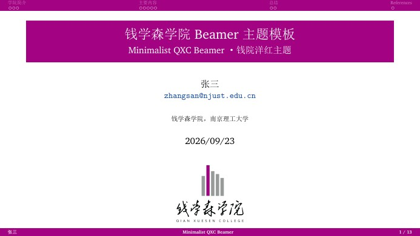
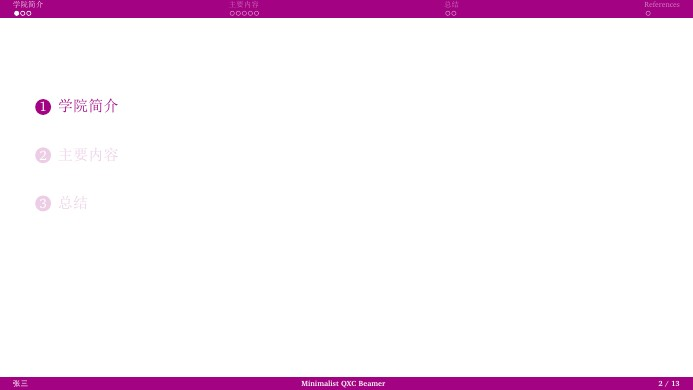
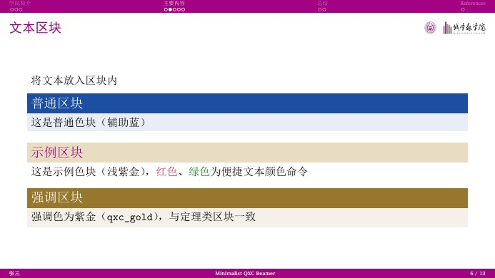
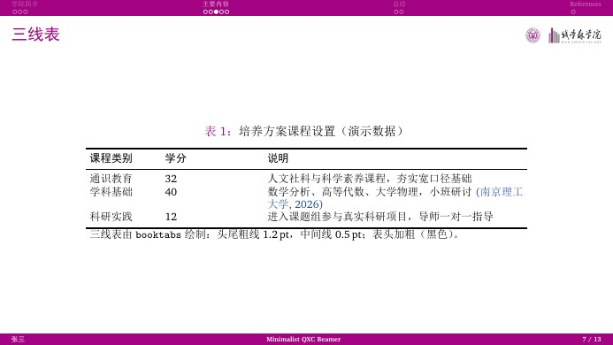
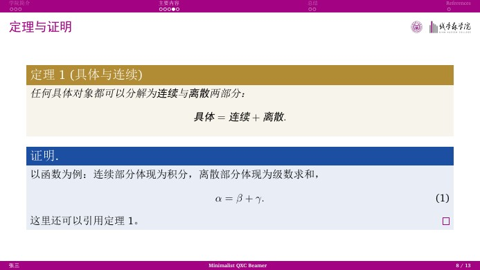

# 钱学森学院 Beamer 模板（Minimalist QXC Beamer）

一场钱院洋红的极简演示 —— 固定高度顶栏、右上角院徽组合标识、衬线排版与原生中文支持。
A minimalist Qian Xuesen College (NJUST) LaTeX Beamer template with the college magenta theme colour.

版式移植自 **NJUST南理工-Beamer模板**（其版式又移植自 `minimalist-pku-beamer-2026`），
主题色取自钱学森学院院徽条形图主色 **钱院洋红 `#A30282`**（RGB 163,2,130）。

---

## 预览 · Preview

| 标题页 Title | 分节目录页 Section TOC |
| :---: | :---: |
|  |  |

| 文本区块 Blocks | 三线表 Booktabs |
| :---: | :---: |
|  |  |

| 定理与证明 Theorem |
| :---: |
|  |

## 特性

- **钱院主题色**：顶栏、标题条、页脚、`structure` 统一使用钱院洋红 `#A30282`；区块配色为辅助蓝（定义/普通区块）、紫金（定理/强调）、浅紫金（示例）。
- **极简固定高度顶栏**：smoothbars 顶栏重写为固定高度纯色条，分节目录页与正文页的顶部高度完全一致；导航行像素级锚定。
- **右上角院徽组合标识**：正文页右上角固定显示“南理工校徽 + 院徽条形图 + 钱学森学院 / QIAN XUESEN COLLEGE”组合标识（`logo/QXC.png`），**墨迹与当前页标题文字严格同高对齐**（随标题字形自适应），长标题自动在标识前换行。
- **标题页院徽**：标题页居中显示学院院徽（`logo/QXC-emblem.png`）。
- **原生中文**：`ctex`（`fontset=none` + `scheme=plain`）+ `xeCJK`；中文衬线宋体，macOS 用 Songti SC、Windows 用 SimSun（黑体代粗体）、其他环境自动回退 TeX Live 自带的 FandolSong。
- **中文定理环境**：定理/定义/引理/证明等名称自动显示为中文（“定理 1”“证明”），题注显示为“图 1：”“表 1：”。
- **衬线拉丁字体**：XCharter（TeX Live 自带）；等宽字体优先 Maple Mono，未安装自动回退。
- **引用着色**：`\citep` / `\citet` 整体（含括号）显示为辅助蓝，`citecolor` 已同步。
- **三线表**：booktabs 头尾粗线 1.2pt、中间线 0.5pt，表头加粗。
- **画幅可切换**：16:9（当前）/ 4:3 等，改 `aspectratio` 即可。

## 快速开始

依赖：TeX Live（`xelatex`、`latexmk`、`ctex`）。

```bash
latexmk -xelatex QXC-slides.tex   # 编译（含参考文献，多轮自动）
latexmk -c                        # 清理中间文件（保留 PDF）
```

日常使用：修改 `QXC-slides.tex` 中的 `\title` / `\author` / `\institute` / `\date`，正文直接写中文，
`figure/` 或 `image/` 里放你的图片，`ref.bib` 里放参考文献。VS Code（LaTeX Workshop）或 Overleaf 中把编译器设为 **XeLaTeX**。

> 示例讲稿中的“学院简介”“钱学森之问”“培养方案”等内容仅用于演示排版，请替换为你自己的内容。

## 文件说明

| 文件 | 说明 |
| --- | --- |
| `QXC-slides.tex` | 主文件（示例讲稿，可直接在其上修改） |
| `QXC.sty` | 主题文件（版式与配色，一般无需修改） |
| `ref.bib` | 参考文献数据库（示例条目，请替换） |
| `logo/QXC.png` | 顶栏右上角与正文页使用的组合标识（彩色、透明底） |
| `logo/QXC-emblem.png` | 学院院徽（纵向组合，透明底），标题页使用 |
| `logo/QXC-white.png` | 组合标识白色版（透明底），供深色背景使用 |
| `figure/` | 院徽素材（学院院徽、透明 logo、院徽与南理工校徽组合图、校徽裁切图） |
| `tools/build_logo.py` | 组合标识 `logo/QXC.png` 的合成脚本（可选，改标识后重新生成用） |
| `image/` | README 预览图 |

## 主题色

| 名称 | 色值 | 用途 |
| --- | --- | --- |
| `qxc` | `#A30282` | 主色：顶栏、标题条、页脚、`structure` |
| `qxc_blue` | `#1C4FA1` | 辅助蓝：普通/定义区块、引用 |
| `qxc_gold` | `#B28C34` | 紫金：定理/命题区块、`\alert`、强调区块 |
| `qxc_gray` | `#999A9A` | 院徽灰（院徽条形图灰），备用 |
| `qxc_red` / `qxc_green` | `#D21A42` / `#007F00` | 便捷文本颜色命令 `\red{}` / `\green{}` |

## 字体说明

| 用途 | 字体 | 说明 |
| --- | --- | --- |
| 中文正文 | Songti SC / SimSun / FandolSong | 按系统自动选择，无需修改 |
| 拉丁正文 | XCharter | TeX Live 自带 |
| 等宽 | Maple Mono | 可选；未安装自动回退 |

## 参考文献

`ref.bib` 中已给出两条示例条目，请替换为自己的文献。期刊/会议条目写法示例：

```bibtex
@article{key2026,
  title   = {文章标题},
  author  = {作者甲 and 作者乙},
  journal = {期刊名},
  volume  = {1},
  number  = {1},
  pages   = {1--10},
  year    = {2026}
}
```

## 相对 NJUST 模板的改动

1. 主题文件由 `NJUST.sty` 重制为 `QXC.sty`，包名、颜色名与标识路径同步改名。
2. 主题色由南理工紫 `#990099` 改为钱院洋红 `#A30282`（取自院徽条形图主色），辅助色体系不变。
3. 右上角标识由 `logo/NJUST.png` 换为组合标识 `logo/QXC.png`；标题页改用学院院徽 `logo/QXC-emblem.png`。
4. 示例讲稿内容由 PX4 主题改为钱学森学院主题（学院简介、钱学森之问、培养方案演示）。
5. 新增组合标识的合成脚本 `tools/build_logo.py`（`python tools/build_logo.py` 可重新生成标识）。

组合标识 `logo/QXC.png` 由 `figure/院徽.png`（院徽条形图 + 字标）与南理工校徽 `figure/njust-emblem.png` 合成，
比例参照官方横向组合图 `figure/透明logo.png`（校徽高 : 最高柱 : 字标块高 = 71 : 71 : 66）。

## 参考模板 · Credits

- `NJUST南理工-Beamer模板` —— 本模板的直接来源
- `minimalist-pku-beamer-2026` —— 版式原始来源（PKU 极简 Beamer）
- [icgw/ucas-beamer](https://github.com/icgw/ucas-beamer) —— 更早的 UCAS 主题

## 版权说明

钱学森学院院徽、南京理工大学校徽及相关组合标识的版权归南京理工大学所有，
仅限校内师生在教学、科研等场合按学校视觉形象规范使用。
