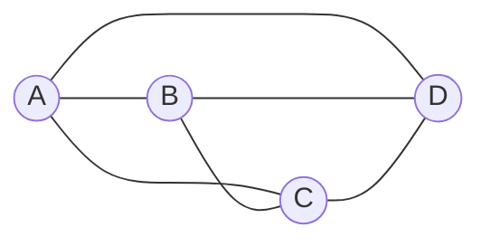

# 基本概念与算法分析

## 1.1 数据结构的基本概念

### 1.1.1 数据 (Data)

**数据**是对信息的一种符号表示。在计算机科学中，数据是指所有能输入到计算机中并被计算机程序处理的符号的总称。数据是计算机程序加工的"原材料"。

例如：整数、实数、字符、声音、图像等，只要是能输入到计算机中并被程序处理的符号，都属于数据。

---

### 1.1.2 数据元素 (Data Element)

**数据元素**是数据的基本单位，在计算机程序中通常作为一个整体进行考虑和处理。一个数据元素可由若干个**数据项（Data Item）**组成。

- **数据项**是数据的不可分割的最小单位。
- 数据元素是组成数据的基本单元，在程序中作为一个整体来处理。

**示例**：
- 在一个学生信息表中，每个学生的完整记录是一个**数据元素**。
- 该记录中的学号、姓名、性别、年龄等字段分别是一个个**数据项**。

```
数据 > 数据元素 > 数据项

数据（Data）：全校学生信息
  └── 数据元素（Data Element）：某个学生的完整记录 "001, 张三, 男, 20"
        ├── 数据项（Data Item）：001（学号）
        ├── 数据项（Data Item）：张三（姓名）
        ├── 数据项（Data Item）：男（性别）
        └── 数据项（Data Item）：20（年龄）
```

---

### 1.1.3 数据对象 (Data Object)

**数据对象**是性质相同的数据元素的集合，是数据的一个子集。

- 数据对象是数据的子集，其中的数据元素具有相同性质。
- 数据对象可以是有限的，也可以是无限的。

**示例**：
- 所有整数构成一个数据对象：$\{x \mid x \in \mathbb{Z}\}$
- 所有大写字母构成一个数据对象：$\{x \mid x \in \text{'A','B',...,'Z'}\}$
- 某班级的学生成绩表构成一个数据对象

---

### 1.1.4 数据结构 (Data Structure)

**数据结构**是相互之间存在一种或多种特定关系的数据元素的集合。

形式化定义：数据结构是一个二元组

$$Data\_Structure = (D, S)$$

其中：
- $D$ 是数据元素的有限集
- $S$ 是 $D$ 上关系的有限集

**结构**就是指数据元素之间存在的关系。在任何问题中，数据元素都不是孤立存在的，而是在它们之间存在着某种关系，这种关系称为"结构"。

---

## 1.2 数据的逻辑结构与物理结构

### 1.2.1 逻辑结构 (Logical Structure)

逻辑结构是指数据元素之间的相互关系，与数据的存储无关。根据数据元素间关系的不同特性，通常有以下四类基本逻辑结构：

#### （1）集合 (Set)

结构中的数据元素除了"同属于一个集合"外，没有其他任何关系。元素之间是松散、无序的。



#### （2）线性结构 (Linear Structure)

结构中的数据元素之间存在**一对一**的关系。这是一个有序序列，除第一个元素外每个元素有且仅有一个前驱，除最后一个元素外每个元素有且仅有一个后继。

```
a1 → a2 → a3 → ... → an
```

- **代表**：线性表、栈、队列、数组、字符串等

#### （3）树型结构 (Tree Structure)

结构中的数据元素之间存在**一对多**的层次关系。每个结点（除根外）只有一个前驱（双亲），但可以有多个后继（孩子）。

```
        ○ (根)
       / | \
      ○  ○  ○
     / \    / \
    ○  ○   ○  ○
```

- **代表**：树、二叉树、森林等
- **特征**：层次性、递归性

#### （4）图状结构 / 网状结构 (Graph/Network Structure)

结构中的数据元素之间存在**多对多**的关系。元素之间可以有任意多个前驱和任意多个后继。

```
    ○ ←→ ○
    ↕     ↕
    ○ ←→ ○
```

- **代表**：图、有向图、无向图、网（带权图）
- **特征**：任意性、复杂性

---

### 1.2.2 物理结构 / 存储结构 (Physical/Storage Structure)

物理结构是指数据结构在计算机中的表示（又称映像），即数据的逻辑结构在计算机存储空间中的存放形式。主要有以下四种：

#### （1）顺序存储结构 (Sequential Storage)

- **原理**：用一组**地址连续的存储单元**依次存储数据元素。
- **优点**：随机存取效率高（$O(1)$），存储密度大（无额外指针开销）。
- **缺点**：插入和删除需大量移动元素；需要预先分配连续空间，可能造成空间浪费或溢出。
- **典型实现**：数组、顺序表、顺序栈、顺序队列

```
逻辑结构:   a1 → a2 → a3 → a4
存储结构:   [a1][a2][a3][a4]  （连续地址）
地址:      1000 1004 1008 100C
```

#### （2）链式存储结构 (Linked Storage)

- **原理**：每个结点除了存储自身数据外，还存储一个或多个**指针**指向相关结点的存储地址。
- **优点**：插入和删除操作灵活（无需移动元素）；空间可按需分配。
- **缺点**：需要额外空间存储指针；不支持随机存取。
- **典型实现**：单链表、双链表、链栈、链队列、二叉树链表

```
逻辑结构:   a1 → a2 → a3 → a4
存储结构:   [a1|●] → [a2|●] → [a3|●] → [a4|NULL]
地址:      3000      2000      5000      1000  （不连续）
```

#### （3）索引存储结构 (Indexed Storage)

- **原理**：在存储数据元素的同时，建立附加的**索引表**。索引表中的每一项称为索引项，一般包含关键字和地址。
- **优点**：查找速度快。
- **缺点**：增加了索引表的空间开销；增删数据时需要同步更新索引表。
- **典型实现**：数据库中的B+树索引、操作系统中的文件目录

```
索引表:                    数据区:
| 关键字 | 地址 |          | 数据 |
| 001    | 100  |          | ... |
| 002    | 200  |          | ... |
| 003    | 300  |          | ... |
```

#### （4）散列存储结构 (Hash Storage)

- **原理**：根据元素的关键字，通过**哈希函数**直接计算出该元素的存储地址。
- **优点**：查找、插入、删除速度极快（平均 $O(1)$）。
- **缺点**：可能出现冲突，需要额外处理；不便于顺序访问。
- **典型实现**：哈希表（Hash Table）、Python 的 `dict`/`set`、C++ 的 `unordered_map`

```
关键字 key ──→ H(key) ──→ 存储地址 addr
```

---

### 1.2.3 逻辑结构与存储结构的关系

| 维度 | 逻辑结构 | 存储结构（物理结构） |
|-----|--------|----------------|
| 定义 | 数据元素之间的逻辑关系 | 逻辑结构在计算机中的存储表示 |
| 关注点 | "是什么关系" | "怎么存放" |
| 分类 | 集合、线性、树型、图状 | 顺序、链式、索引、散列 |
| 独立于 | 计算机 | 逻辑结构 |
| 决定因素 | 问题本身 | 实现方式与需求（时间/空间权衡） |

> **核心理念**：逻辑结构是数据结构的**抽象**，存储结构是数据结构的**实现**。同一逻辑结构可以用不同的存储结构来实现。

---

## 1.3 抽象数据类型 (ADT)

### 1.3.1 定义

**抽象数据类型（Abstract Data Type，简称 ADT）** 是指一个数学模型以及定义在该模型上的一组操作。

ADT 可用以下三元组表示：

$$ADT = (D, S, P)$$

其中：
- **$D$**：数据对象，即数据元素的集合
- **$S$**：$D$ 上关系的有限集（数据元素之间的逻辑关系）
- **$P$**：对 $D$ 的基本操作集

ADT 的核心思想是**封装**：将数据和操作封装在一起，对外部隐藏实现细节，用户只需知道"能做什么"而不需关心"怎么做"。

### 1.3.2 ADT 的表示格式

```
ADT 抽象数据类型名 {
    数据对象 D: <数据对象的定义>
    数据关系 S: <数据关系的定义>
    基本操作 P:
        操作1(参数表): 初始条件 + 操作结果描述
        操作2(参数表): 初始条件 + 操作结果描述
        ...
} ADT 抽象数据类型名
```

### 1.3.3 ADT 示例：复数

以复数为例，定义复数 ADT：

```
ADT Complex {
    数据对象 D: {e1, e2 | e1, e2 ∈ RealSet}  // 实部和虚部
    数据关系 S: {<e1, e2> | e1 是实部，e2 是虚部}
    基本操作 P:
        InitComplex(&C, r, i): 构造复数 C，实部=r，虚部=i
        Add(C1, C2):           返回复数 C1 + C2
        Sub(C1, C2):           返回复数 C1 - C2
        Mul(C1, C2):           返回复数 C1 × C2
        Div(C1, C2):           返回复数 C1 ÷ C2
        GetReal(C):            返回复数 C 的实部
        GetImag(C):            返回复数 C 的虚部
} ADT Complex
```

### 1.3.4 ADT 的 C++ 类实现

```cpp
#include <iostream>
#include <cmath>
using namespace std;

class Complex {
private:
    double real;  // 实部
    double imag;  // 虚部

public:
    // 构造函数
    Complex(double r = 0.0, double i = 0.0) : real(r), imag(i) {}

    // 获取实部
    double getReal() const { return real; }
    // 获取虚部
    double getImag() const { return imag; }

    // 加法
    Complex add(const Complex& other) const {
        return Complex(real + other.real, imag + other.imag);
    }

    // 减法
    Complex sub(const Complex& other) const {
        return Complex(real - other.real, imag - other.imag);
    }

    // 乘法: (a+bi)(c+di) = (ac-bd) + (ad+bc)i
    Complex mul(const Complex& other) const {
        return Complex(
            real * other.real - imag * other.imag,
            real * other.imag + imag * other.real
        );
    }

    // 除法: (a+bi)/(c+di) = (ac+bd)/(c²+d²) + (bc-ad)/(c²+d²)i
    Complex div(const Complex& other) const {
        double denom = other.real * other.real + other.imag * other.imag;
        return Complex(
            (real * other.real + imag * other.imag) / denom,
            (imag * other.real - real * other.imag) / denom
        );
    }

    // 模
    double modulus() const {
        return sqrt(real * real + imag * imag);
    }

    // 运算符重载
    Complex operator+(const Complex& other) const { return add(other); }
    Complex operator-(const Complex& other) const { return sub(other); }
    Complex operator*(const Complex& other) const { return mul(other); }
    Complex operator/(const Complex& other) const { return div(other); }

    // 输出
    friend ostream& operator<<(ostream& os, const Complex& c) {
        os << c.real;
        if (c.imag >= 0) os << "+";
        os << c.imag << "i";
        return os;
    }
};
```

### 1.3.5 ADT 的 Python 类实现

```python
from __future__ import annotations
import math

class Complex:
    """复数 ADT"""
    
    def __init__(self, real: float = 0.0, imag: float = 0.0):
        """构造复数 C，实部=real，虚部=imag"""
        self._real = real
        self._imag = imag
    
    @property
    def real(self) -> float:
        """获取实部"""
        return self._real
    
    @property
    def imag(self) -> float:
        """获取虚部"""
        return self._imag
    
    def add(self, other: Complex) -> Complex:
        """返回复数 self + other"""
        return Complex(self._real + other._real, self._imag + other._imag)
    
    def sub(self, other: Complex) -> Complex:
        """返回复数 self - other"""
        return Complex(self._real - other._real, self._imag - other._imag)
    
    def mul(self, other: Complex) -> Complex:
        """返回复数 self × other"""
        return Complex(
            self._real * other._real - self._imag * other._imag,
            self._real * other._imag + self._imag * other._real
        )
    
    def div(self, other: Complex) -> Complex:
        """返回复数 self ÷ other"""
        denom = other._real ** 2 + other._imag ** 2
        return Complex(
            (self._real * other._real + self._imag * other._imag) / denom,
            (self._imag * other._real - self._real * other._imag) / denom
        )
    
    def modulus(self) -> float:
        """返回复数的模"""
        return math.sqrt(self._real ** 2 + self._imag ** 2)
    
    def __add__(self, other: Complex) -> Complex:
        return self.add(other)
    
    def __sub__(self, other: Complex) -> Complex:
        return self.sub(other)
    
    def __mul__(self, other: Complex) -> Complex:
        return self.mul(other)
    
    def __truediv__(self, other: Complex) -> Complex:
        return self.div(other)
    
    def __str__(self) -> str:
        sign = "+" if self._imag >= 0 else "-"
        return f"{self._real}{sign}{abs(self._imag)}i"
    
    def __repr__(self) -> str:
        return f"Complex({self._real}, {self._imag})"
```

---

## 1.4 算法与算法分析

### 1.4.1 算法的定义

**算法（Algorithm）** 是对特定问题求解步骤的一种描述，它是指令的有限序列，其中每一条指令表示一个或多个操作。

### 1.4.2 算法的五个特性

| 特性 | 说明 |
|-----|------|
| **1. 有穷性（Finiteness）** | 一个算法必须总是在执行有穷步之后结束，且每一步都在有穷时间内完成。 |
| **2. 确定性（Definiteness）** | 算法中每一条指令必须有确切的含义，不存在二义性。在任何条件下，算法只有唯一的一条执行路径。 |
| **3. 可行性（Effectiveness）** | 算法中描述的操作都是可以通过已经实现的基本运算执行有限次来实现的。 |
| **4. 输入（Input）** | 一个算法有**零个或多个**输入，这些输入取自于某个特定的对象集合。 |
| **5. 输出（Output）** | 一个算法有**一个或多个**输出，这些输出是同输入有着某些特定关系的量。 |

### 1.4.3 算法设计的要求

| 要求 | 说明 |
|-----|------|
| **1. 正确性（Correctness）** | 算法应满足具体问题的需求。四层含义：①不含语法错误；②对几组输入数据能得出正确结果；③对精心设计的典型/边界输入能得出正确结果；④对一切合法输入都能得出正确结果。 |
| **2. 可读性（Readability）** | 算法应该易于阅读和理解，以有利于阅读者对程序的理解和维护。 |
| **3. 健壮性（Robustness）** | 算法应具有容错处理。当输入非法数据时，算法应对其作出反应（如返回错误信息），而不是产生莫名其妙的输出结果。 |
| **4. 效率与低存储量需求（Efficiency）** | 效率指算法执行的时间；存储量需求指算法执行过程中所需要的最大存储空间。两者通常与问题的规模有关。 |

---

## 1.5 时间复杂度分析

### 1.5.1 问题规模与基本操作

- **问题规模 $n$**：输入数据量的大小，如排序问题中的元素个数、矩阵运算中的阶数等。
- **基本操作**：算法中执行次数最多的原子操作，如比较、赋值、加法等。
- **时间频度 $T(n)$**：算法中基本操作重复执行的次数，是问题规模 $n$ 的函数。

> **数学基础**：渐进记号（O / Ω / Θ）的严格形式化定义见 [[../../数理基础/离散数学/12-算法与计算理论初步#算法复杂度分析|离散数学 - 算法分析]]。本章给出工程常用的直观版本。

### 1.5.2 大O记号（Big-O Notation）

#### 定义

设 $f(n)$ 和 $g(n)$ 是定义在正整数上的正值函数，若存在正常数 $C$ 和 $n_0$，使得当 $n \ge n_0$ 时：

$$f(n) \le C \cdot g(n)$$

则称 $f(n) = O(g(n))$，即 $g(n)$ 是 $f(n)$ 当 $n \to \infty$ 时的**上界**。

#### 从极限角度理解

若 $\lim_{n\to\infty} \frac{f(n)}{g(n)} = L$，其中 $0 \le L < \infty$，则 $f(n) = O(g(n))$。

> **直观理解**：大O记号描述了算法增长率的上界，刻画了当 $n$ 充分大时算法运行时间的"增长速度"。

#### 推导规则

1. **加法规则**：$O(f(n)) + O(g(n)) = O(\max(f(n), g(n)))$
2. **乘法规则**：$O(f(n)) \cdot O(g(n)) = O(f(n) \cdot g(n))$
3. **常数可忽略**：$O(C \cdot f(n)) = O(f(n))$，其中 $C$ 是常数
4. **低阶项可忽略**：若 $f(n) = n^2 + n$，则 $f(n) = O(n^2)$
5. **数量级较小时忽略**：$O(n^2 + n \log n) = O(n^2)$

### 1.5.3 常见时间复杂度

按增长速度从小到大排列：

$$O(1) < O(\log n) < O(n) < O(n \log n) < O(n^2) < O(n^3) < O(2^n) < O(n!) < O(n^n)$$

其中前六种（至 $O(n^3)$）为**多项式时间**算法，后三种为**指数时间**算法。多项式时间算法被认为是"有效"的算法。

#### 各复杂度的代码示例

**（1）$O(1)$ — 常数阶**

```cpp
// C++
int getFirst(int arr[], int n) {
    return arr[0];  // 与 n 无关，执行常数次
}
```

```python
# Python
def get_first(arr: list) -> int:
    return arr[0]  # 与 n 无关，执行常数次
```

**（2）$O(\log n)$ — 对数阶 (二分查找)**

```cpp
// C++
int binarySearch(int arr[], int n, int target) {
    int left = 0, right = n - 1;
    while (left <= right) {
        int mid = left + (right - left) / 2;
        if (arr[mid] == target) return mid;
        if (arr[mid] < target) left = mid + 1;
        else right = mid - 1;
    }
    return -1;
}
// 每次将搜索范围缩小一半，最坏需执行 log2(n) 次
```

```python
# Python
def binary_search(arr: list, target: int) -> int:
    left, right = 0, len(arr) - 1
    while left <= right:
        mid = left + (right - left) // 2
        if arr[mid] == target:
            return mid
        elif arr[mid] < target:
            left = mid + 1
        else:
            right = mid - 1
    return -1
# 每次将搜索范围缩小一半，最坏需执行 log2(n) 次
```

**（3）$O(n)$ — 线性阶 (顺序查找)**

```cpp
// C++
int linearSearch(int arr[], int n, int target) {
    for (int i = 0; i < n; i++) {  // 循环 n 次
        if (arr[i] == target) return i;
    }
    return -1;
}
// 最坏情况需要遍历全部 n 个元素
```

```python
# Python
def linear_search(arr: list, target: int) -> int:
    for i in range(len(arr)):  # 循环 n 次
        if arr[i] == target:
            return i
    return -1
# 最坏情况需要遍历全部 n 个元素
```

**（4）$O(n \log n)$ — 线性对数阶 (归并排序 / 快速排序)**

```cpp
// C++ — 归并排序
void merge(int arr[], int left, int mid, int right) {
    int n1 = mid - left + 1;
    int n2 = right - mid;
    int* L = new int[n1];
    int* R = new int[n2];
    for (int i = 0; i < n1; i++) L[i] = arr[left + i];
    for (int j = 0; j < n2; j++) R[j] = arr[mid + 1 + j];
    int i = 0, j = 0, k = left;
    while (i < n1 && j < n2)
        arr[k++] = (L[i] <= R[j]) ? L[i++] : R[j++];
    while (i < n1) arr[k++] = L[i++];
    while (j < n2) arr[k++] = R[j++];
    delete[] L; delete[] R;
}

void mergeSort(int arr[], int left, int right) {
    if (left < right) {
        int mid = left + (right - left) / 2;
        mergeSort(arr, left, mid);       // 递归左半
        mergeSort(arr, mid + 1, right);  // 递归右半
        merge(arr, left, mid, right);    // 合并 O(n)
    }
}
// T(n) = 2T(n/2) + O(n) → O(n log n)
```

```python
# Python — 归并排序
def merge_sort(arr: list) -> list:
    if len(arr) <= 1:
        return arr
    mid = len(arr) // 2
    left = merge_sort(arr[:mid])
    right = merge_sort(arr[mid:])
    
    result = []
    i = j = 0
    while i < len(left) and j < len(right):
        if left[i] <= right[j]:
            result.append(left[i]); i += 1
        else:
            result.append(right[j]); j += 1
    result.extend(left[i:])
    result.extend(right[j:])
    return result
# T(n) = 2T(n/2) + O(n) → O(n log n)
```

**（5）$O(n^2)$ — 平方阶 (冒泡排序 / 选择排序 / 插入排序)**

```cpp
// C++ — 冒泡排序
void bubbleSort(int arr[], int n) {
    for (int i = 0; i < n - 1; i++) {         // 外层 O(n)
        for (int j = 0; j < n - 1 - i; j++) { // 内层 O(n)
            if (arr[j] > arr[j + 1])
                swap(arr[j], arr[j + 1]);
        }
    }
}
// 两层嵌套循环，每层约 n 次 → O(n²)
```

```python
# Python — 冒泡排序
def bubble_sort(arr: list) -> None:
    n = len(arr)
    for i in range(n - 1):           # 外层 O(n)
        swapped = False
        for j in range(n - 1 - i):   # 内层 O(n)
            if arr[j] > arr[j + 1]:
                arr[j], arr[j + 1] = arr[j + 1], arr[j]
                swapped = True
        if not swapped:
            break
# 两层嵌套循环，每层约 n 次 → O(n²)
```

**（6）$O(n^3)$ — 立方阶 (朴素矩阵乘法 / Floyd-Warshall)**

```cpp
// C++ — 朴素矩阵乘法 C = A × B, 均为 n×n
void matrixMultiply(double** A, double** B, double** C, int n) {
    for (int i = 0; i < n; i++)           // O(n)
        for (int j = 0; j < n; j++) {     // O(n)
            C[i][j] = 0;
            for (int k = 0; k < n; k++)   // O(n)
                C[i][j] += A[i][k] * B[k][j];
        }
}
// 三层嵌套循环 → O(n³)
```

```python
# Python — 朴素矩阵乘法
def matrix_multiply(A: list[list], B: list[list]) -> list[list]:
    n = len(A)
    C = [[0] * n for _ in range(n)]
    for i in range(n):           # O(n)
        for j in range(n):       # O(n)
            for k in range(n):   # O(n)
                C[i][j] += A[i][k] * B[k][j]
    return C
# 三层嵌套循环 → O(n³)
```

**（7）$O(2^n)$ — 指数阶 (递归求斐波那契数列)**

```cpp
// C++ — 朴素递归求第 n 个斐波那契数
int fib(int n) {
    if (n <= 1) return n;
    return fib(n - 1) + fib(n - 2);
}
// 递归树中有约 2^n 个结点
```

```python
# Python — 朴素递归求第 n 个斐波那契数
def fib(n: int) -> int:
    if n <= 1:
        return n
    return fib(n - 1) + fib(n - 2)
# 递归树中有约 2^n 个结点
```

**（8）$O(n!)$ — 阶乘阶 (旅行商问题暴力枚举)**

```cpp
// C++ — 全排列生成所有排列（伪代码思路）
void generatePermutations(int arr[], int n) {
    // 生成 n! 种排列，每种排列 O(n)
}
// 时间复杂度 O(n · n!)
```

### 1.5.4 最好、最坏与平均情况分析

以**顺序查找**算法为例分析：

- **最好情况**：目标元素恰好在第一个位置，比较 1 次 → $T_{\text{best}}(n) = O(1)$
- **最坏情况**：目标元素在最后一个位置或不存在，比较 $n$ 次 → $T_{\text{worst}}(n) = O(n)$
- **平均情况**：设每个位置是目标元素的概率相等 $P_i = 1/n$，在第 $i$ 个位置找到需比较 $i$ 次：

$$T_{\text{avg}}(n) = \sum_{i=1}^{n} P_i \cdot i = \sum_{i=1}^{n} \frac{1}{n} \cdot i = \frac{n+1}{2} = O(n)$$

> **约定**：若无特别说明，通常用**最坏情况下的时间复杂度**来度量算法的性能。

---

## 1.6 空间复杂度分析

### 1.6.1 定义

**空间复杂度（Space Complexity）** $S(n)$ 是算法执行过程中所占用的**辅助存储空间**大小，是问题规模 $n$ 的函数。大O记号同样适用。

$$S(n) = O(g(n))$$

**注意**：空间复杂度不计输入数据存储本身（那是问题需要的），只计算算法运行过程中**额外开辟**的辅助空间。

### 1.6.2 原地算法 (In-place Algorithm)

**原地算法**是指所需的辅助空间不随问题规模 $n$ 增长而增长，即空间复杂度为 $O(1)$ 的算法。

**示例**：
- 冒泡排序（仅需临时变量交换）：$S(n) = O(1)$
- 归并排序（需辅助数组）：$S(n) = O(n)$
- 快速排序（需递归栈空间）：平均 $O(\log n)$，最坏 $O(n)$

| 算法 | 时间复杂度（平均） | 空间复杂度 | 是否原地 |
|-----|:---:|:---:|:---:|
| 冒泡排序 | $O(n^2)$ | $O(1)$ | 是 |
| 选择排序 | $O(n^2)$ | $O(1)$ | 是 |
| 插入排序 | $O(n^2)$ | $O(1)$ | 是 |
| 快速排序 | $O(n \log n)$ | $O(\log n)$ ~ $O(n)$ | 取决于实现 |
| 归并排序 | $O(n \log n)$ | $O(n)$ | 否 |
| 堆排序 | $O(n \log n)$ | $O(1)$ | 是 |

---

## 1.7 编程实现：时间复杂度与计时实验

### 1.7.1 C++ 实现 — 计时与对比

```cpp
#include <iostream>
#include <chrono>
#include <vector>
#include <algorithm>
#include <random>
#include <iomanip>
using namespace std;
using namespace std::chrono;

// -------------------- 各复杂度算法的实现 --------------------

// O(log n): 二分查找
int binarySearch(const vector<int>& arr, int target) {
    int left = 0, right = arr.size() - 1;
    while (left <= right) {
        int mid = left + (right - left) / 2;
        if (arr[mid] == target) return mid;
        if (arr[mid] < target) left = mid + 1;
        else right = mid - 1;
    }
    return -1;
}

// O(n): 顺序查找
int linearSearch(const vector<int>& arr, int target) {
    for (size_t i = 0; i < arr.size(); i++) {
        if (arr[i] == target) return i;
    }
    return -1;
}

// O(n log n): 归并排序 (这里直接使用库函数)
void nlognSort(vector<int>& arr) {
    sort(arr.begin(), arr.end());  // STL sort 是 O(n log n)
}

// O(n^2): 冒泡排序
void bubbleSort(vector<int>& arr) {
    int n = arr.size();
    for (int i = 0; i < n - 1; i++) {
        bool swapped = false;
        for (int j = 0; j < n - 1 - i; j++) {
            if (arr[j] > arr[j + 1]) {
                swap(arr[j], arr[j + 1]);
                swapped = true;
            }
        }
        if (!swapped) break;
    }
}

// 生成随机数组
vector<int> generateRandomArray(int n) {
    vector<int> arr(n);
    random_device rd;
    mt19937 gen(rd());
    uniform_int_distribution<> dis(1, n * 10);
    for (int i = 0; i < n; i++)
        arr[i] = dis(gen);
    return arr;
}

// 通用计时函数模板
template<typename Func>
double measureTime(Func func, const string& name, int n) {
    auto start = high_resolution_clock::now();
    func();
    auto end = high_resolution_clock::now();
    double elapsed_ms = duration<double, milli>(end - start).count();
    cout << setw(18) << left << name
         << " | n = " << setw(8) << left << n
         << " | " << setw(10) << fixed << setprecision(3)
         << elapsed_ms << " ms" << endl;
    return elapsed_ms;
}

int main() {
    cout << "=================== 时间复杂度对比实验 ===================" << endl;
    cout << setw(18) << left << "算法"
         << " | " << setw(10) << left << "数据规模"
         << " | " << "执行时间" << endl;
    cout << "----------------------------------------------------------" << endl;

    // 测试不同规模的数据
    vector<int> sizes = {100, 1000, 5000, 10000, 20000};

    for (int n : sizes) {
        // ===== O(log n) 和 O(n)：查找 =====
        auto arr = generateRandomArray(n);
        int target = arr[n / 2];  // 找一个存在的元素

        // 二分查找需有序
        auto sorted_arr = arr;
        sort(sorted_arr.begin(), sorted_arr.end());

        // O(log n) 查找
        measureTime([&]() {
            binarySearch(sorted_arr, target);
        }, "二分查找 O(log n)", n);

        // O(n) 查找
        measureTime([&]() {
            linearSearch(arr, target);
        }, "顺序查找 O(n)", n);

        // ===== O(n log n)：快速排序 =====
        // 在小数据量下对比
        if (n <= 5000) {
            auto arr_sort = arr;
            measureTime([&]() {
                sort(arr_sort.begin(), arr_sort.end());
            }, "STL排序 O(nlogn)", n);
        }

        // ===== O(n^2)：冒泡排序 (仅小数据量) =====
        if (n <= 2000) {
            auto arr_bubble = arr;
            measureTime([&]() {
                bubbleSort(arr_bubble);
            }, "冒泡排序 O(n^2)", n);
        }

        cout << "----------------------------------------------------------" << endl;
    }

    // ===== O(2^n)：斐波那契数列 =====
    cout << endl << "O(2^n) 斐波那契（小 n）:" << endl;
    cout << setw(18) << left << "算法"
         << " | " << setw(10) << left << "n"
         << " | " << "执行时间" << endl;
    for (int n_fib : {30, 35, 40, 42}) {
        // 使用动态规划实现以对比递归
        auto start = high_resolution_clock::now();
        // 迭代法 O(n)
        if (n_fib <= 1) {int r = n_fib;}
        else {
            long long a = 0, b = 1, c;
            for (int i = 2; i <= n_fib; i++) {c = a + b; a = b; b = c;}
        }
        auto end = high_resolution_clock::now();
        double elapsed = duration<double, milli>(end - start).count();
        cout << setw(18) << left << "迭代法 O(n)"
             << " | n = " << setw(6) << left << n_fib
             << " | " << elapsed << " ms" << endl;
    }

    return 0;
}
```

### 1.7.2 Python 实现 — 计时与对比

```python
import time
import random
import sys
from typing import Callable

# -------------------- 各复杂度算法的实现 --------------------

def binary_search(arr: list, target: int) -> int:
    """O(log n): 二分查找"""
    left, right = 0, len(arr) - 1
    while left <= right:
        mid = left + (right - left) // 2
        if arr[mid] == target:
            return mid
        elif arr[mid] < target:
            left = mid + 1
        else:
            right = mid - 1
    return -1

def linear_search(arr: list, target: int) -> int:
    """O(n): 顺序查找"""
    for i, val in enumerate(arr):
        if val == target:
            return i
    return -1

def bubble_sort(arr: list) -> None:
    """O(n^2): 冒泡排序（原地）"""
    n = len(arr)
    for i in range(n - 1):
        swapped = False
        for j in range(n - 1 - i):
            if arr[j] > arr[j + 1]:
                arr[j], arr[j + 1] = arr[j + 1], arr[j]
                swapped = True
        if not swapped:
            break

# -------------------- 计时函数 --------------------

def measure_time(func: Callable, name: str, n: int) -> float:
    """测量函数执行时间并打印"""
    start = time.perf_counter()
    func()
    end = time.perf_counter()
    elapsed_ms = (end - start) * 1000
    print(f"{name:<22} | n = {n:<8} | {elapsed_ms:>10.3f} ms")
    return elapsed_ms

# -------------------- 主实验 --------------------

def main():
    print("=" * 60)
    print(f"{'算法':<22} | {'数据规模':<10} | {'执行时间'}")
    print("-" * 60)

    sizes = [100, 1000, 5000, 10000, 20000]

    for n in sizes:
        arr = [random.randint(1, n * 10) for _ in range(n)]
        target = arr[n // 2]  # 找一个存在的元素

        # 二分查找需有序
        sorted_arr = sorted(arr)

        # O(log n) 查找
        measure_time(lambda: binary_search(sorted_arr, target),
                     "二分查找 O(log n)", n)

        # O(n) 查找
        measure_time(lambda: linear_search(arr, target),
                     "顺序查找 O(n)", n)

        # O(n log n): Timsort (Python 内置)
        if n <= 5000:
            arr_sort = arr.copy()
            measure_time(lambda: arr_sort.sort(),
                         "内置排序 O(nlogn)", n)

        # O(n^2): 冒泡排序 (仅小数据量)
        if n <= 2000:
            arr_bubble = arr.copy()
            measure_time(lambda: bubble_sort(arr_bubble),
                         "冒泡排序 O(n^2)", n)

        print("-" * 60)

    # O(2^n)：斐波那契数列
    print("\n" + "O(2^n) 斐波那契（迭代法 O(n) 作为参照）:")
    for n_fib in [30, 35, 40, 42]:
        start = time.perf_counter()
        # 迭代法 O(n)
        if n_fib <= 1:
            result = n_fib
        else:
            a, b = 0, 1
            for _ in range(2, n_fib + 1):
                a, b = b, a + b
        elapsed = (time.perf_counter() - start) * 1000
        print(f"{'迭代法 O(n)':<22} | n = {n_fib:<6} | {elapsed:>10.3f} ms")

    # 对比：递归法 O(2^n)
    def fib_recursive(n: int) -> int:
        if n <= 1:
            return n
        return fib_recursive(n - 1) + fib_recursive(n - 2)

    print("\n" + "O(2^n) 斐波那契（递归法—仅小 n）:")
    for n_fib in [10, 20, 30, 35]:
        start = time.perf_counter()
        result = fib_recursive(n_fib)
        elapsed = (time.perf_counter() - start) * 1000
        print(f"{'递归法 O(2^n)':<22} | n = {n_fib:<6}"
              f" | {elapsed:>10.3f} ms | F({n_fib}) = {result}")

    print("=" * 60)

if __name__ == "__main__":
    main()
```

### 1.7.3 预期实验现象

运行上述代码后一般可观察到：

| 数据规模 $n$ | $O(\log n)$ 二分查找 | $O(n)$ 顺序查找 | $O(n \log n)$ 排序 | $O(n^2)$ 冒泡 |
|:---:|:---:|:---:|:---:|:---:|
| 100 | ~0.001 ms | ~0.002 ms | ~0.01 ms | ~0.05 ms |
| 1,000 | ~0.001 ms | ~0.01 ms | ~0.1 ms | ~2 ms |
| 5,000 | ~0.001 ms | ~0.05 ms | ~0.6 ms | ~50 ms |
| 10,000 | ~0.001 ms | ~0.10 ms | ~1.5 ms | ~200 ms |
| 20,000 | ~0.001 ms | ~0.20 ms | ~3.5 ms | ~~800 ms |

> **关键观察**：
> - $O(\log n)$ 的增长几乎不可见，数据量翻倍时间几乎不变。
> - $O(n)$ 随数据量线性增长 — 数据翻倍，时间翻倍。
> - $O(n^2)$ 极快增长 — 数据翻倍，时间增为 4 倍。
> - 递归斐波那契 $O(2^n)$ 在 $n=40$ 附近已需要秒级时间，$n=50$ 可能需要数分钟。

---

## 相关笔记
- [[../../数理基础/离散数学/12-算法与计算理论初步|离散数学 - 算法与计算理论初步]] — 大O/Ω/Θ的形式化定义、P/NP理论
- [[../../数理基础/离散数学/10-递推关系与生成函数|离散数学 - 递推关系]] — 递推关系求解与Master定理

## 总结

| 概念 | 要点 |
|-----|------|
| **数据结构的定义** | $Data\_Structure = (D, S)$，数据元素集合 + 关系集合 |
| **逻辑结构四类** | 集合、线性、树型、图状（网状） |
| **物理结构四类** | 顺序存储、链式存储、索引存储、散列存储 |
| **ADT** | $ADT = (D, S, P)$，封装数据 + 操作，隐藏实现细节 |
| **算法五特性** | 有穷性、确定性、可行性、输入、输出 |
| **算法设计四要求** | 正确性、可读性、健壮性、效率与低存储量 |
| **时间复杂度** | 大O记号描述增长上界；常见：$O(1) < O(\log n) < O(n) < O(n \log n) < O(n^2) < O(n^3) < O(2^n) < O(n!)$ |
| **空间复杂度** | 额外辅助空间的大小；原地算法 $S(n) = O(1)$ |
| **分析惯例** | 通常分析最坏情况时间复杂度 |

---

## 习题与思考

### 基础题

1. **解释下列术语**：数据、数据元素、数据项、数据对象、数据结构。
2. **画出数据结构分类树**，标明逻辑结构的四种类型和存储结构的四种类型。
3. **ADT 的三元组定义是什么？** 以"学生"为例定义 ADT Student。
4. **算法的五个特性是什么？** 举出一个满足所有五个特性的日常例子。
5. **大O记号的精确定义是什么？** 证明 $3n^2 + 2n + 1 = O(n^2)$。

### 分析题

6. 分析下列代码的时间复杂度：
   ```cpp
   for (int i = 0; i < n; i++)
       for (int j = i; j < n; j++)
           cout << i + j << endl;
   ```
7. 分析下列递归函数的时间复杂度（写出递推方程并求解）：
   ```cpp
   int mystery(int n) {
       if (n <= 1) return 1;
       return mystery(n - 1) + mystery(n - 2);
   }
   ```
8. 若一个算法的时间复杂度为 $O(n^2)$，当输入规模从 $n$ 增加到 $2n$ 时，运行时间大约增加为原来的多少倍？

### 实践题

9. 实现线性查找和二分查找，用 `chrono`/`time` 模块计时，验证复杂度理论分析。
10. 编写程序生成 $n = 1, 2, ..., 50$ 的斐波那契数列，分别用**递归法**和**迭代法**实现，绘制时间对比曲线（使用 matplotlib 或其他工具）。
11. **空间复杂度分析**：编写一个函数，将一个整数数组的元素反转，要求用**原地算法**实现（不使用辅助数组），并分析其空间复杂度。
12. 设计一个 ADT "日期（Date）"，包含数据（年、月、日）和基本操作（判断闰年、计算星期几、计算与另一个日期的相差天数），并用 C++ 或 Python 实现。
